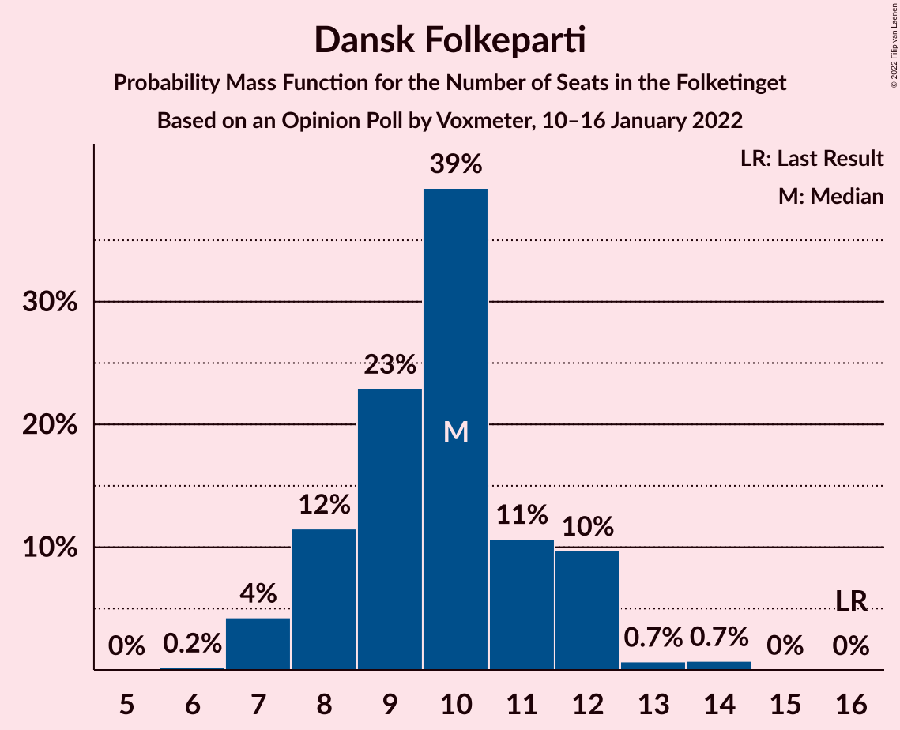
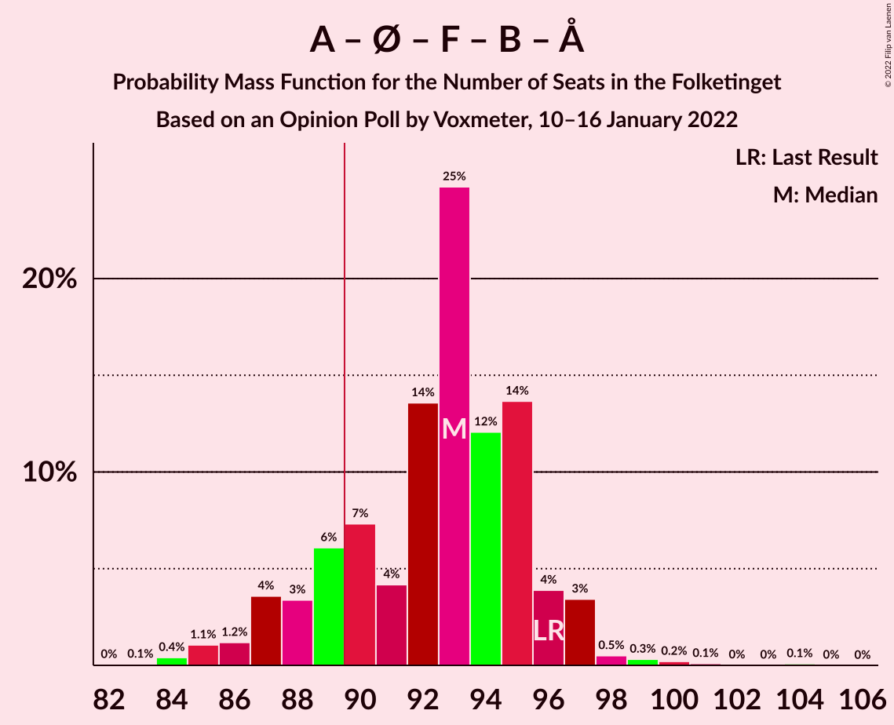

# Opinion Poll by Voxmeter, 10–16 January 2022

<a href="#voting-intentions">Voting Intentions</a> | <a href="#seats">Seats</a> | <a href="#coalitions">Coalitions</a> | <a href="#technical-information">Technical Information</a>

## Voting Intentions

### Confidence Intervals

| Party | Last Result | Poll Result | 80% Confidence Interval | 90% Confidence Interval | 95% Confidence Interval | 99% Confidence Interval |
|:-----:|:-----------:|:-----------:|:-----------------------:|:-----------------------:|:-----------------------:|:-----------------------:|
| Socialdemokraterne | 25.9% | 25.8% | 24.1–27.7% |23.6–28.2% |23.2–28.6% |22.4–29.5% |
| Venstre | 23.4% | 15.1% | 13.7–16.6% |13.3–17.0% |13.0–17.4% |12.3–18.2% |
| Det Konservative Folkeparti | 6.6% | 14.6% | 13.2–16.1% |12.8–16.5% |12.5–16.9% |11.9–17.6% |
| Enhedslisten–De Rød-Grønne | 6.9% | 9.3% | 8.2–10.5% |7.9–10.9% |7.6–11.2% |7.1–11.9% |
| Socialistisk Folkeparti | 7.7% | 8.5% | 7.4–9.7% |7.1–10.1% |6.9–10.4% |6.4–11.0% |
| Radikale Venstre | 8.6% | 7.5% | 6.5–8.7% |6.2–9.0% |6.0–9.3% |5.6–9.9% |
| Nye Borgerlige | 2.4% | 5.9% | 5.0–7.0% |4.8–7.3% |4.6–7.5% |4.2–8.1% |
| Dansk Folkeparti | 8.7% | 5.3% | 4.5–6.3% |4.3–6.6% |4.1–6.9% |3.7–7.4% |
| Liberal Alliance | 2.3% | 3.3% | 2.7–4.1% |2.5–4.4% |2.3–4.6% |2.1–5.0% |
| Kristendemokraterne | 1.7% | 1.4% | 1.0–2.0% |0.9–2.2% |0.8–2.3% |0.7–2.7% |
| Alternativet | 3.0% | 1.1% | 0.8–1.7% |0.7–1.8% |0.6–2.0% |0.5–2.3% |
| Frie Grønne | 0.0% | 0.3% | 0.2–0.7% |0.1–0.8% |0.1–0.9% |0.1–1.1% |

*Note:* The poll result column reflects the actual value used in the calculations. Published results may vary slightly, and in addition be rounded to fewer digits.

## Seats

### Confidence Intervals

| Party | Last Result | Median | 80% Confidence Interval | 90% Confidence Interval | 95% Confidence Interval | 99% Confidence Interval |
|:-----:|:-----------:|:------:|:-----------------------:|:-----------------------:|:-----------------------:|:-----------------------:|
| <a href="#socialdemokraterne">Socialdemokraterne</a> | 48 | 46 | 44–50 |43–52 |41–52 |40–53 |
| <a href="#venstre">Venstre</a> | 43 | 28 | 25–30 |23–31 |23–32 |22–33 |
| <a href="#det-konservative-folkeparti">Det Konservative Folkeparti</a> | 12 | 26 | 23–31 |23–31 |22–31 |21–32 |
| <a href="#enhedslisten–de-rød-grønne">Enhedslisten–De Rød-Grønne</a> | 13 | 16 | 13–19 |13–20 |13–21 |13–22 |
| <a href="#socialistisk-folkeparti">Socialistisk Folkeparti</a> | 14 | 17 | 13–18 |12–19 |12–19 |11–21 |
| <a href="#radikale-venstre">Radikale Venstre</a> | 16 | 14 | 11–15 |11–16 |11–17 |10–17 |
| <a href="#nye-borgerlige">Nye Borgerlige</a> | 4 | 10 | 9–13 |9–13 |8–13 |7–14 |
| <a href="#dansk-folkeparti">Dansk Folkeparti</a> | 16 | 10 | 8–12 |8–12 |7–12 |7–14 |
| <a href="#liberal-alliance">Liberal Alliance</a> | 4 | 6 | 5–7 |5–8 |4–8 |4–9 |
| <a href="#kristendemokraterne">Kristendemokraterne</a> | 0 | 0 | 0 |0–4 |0–4 |0–5 |
| <a href="#alternativet">Alternativet</a> | 5 | 0 | 0 |0 |0–4 |0–4 |
| <a href="#frie-grønne">Frie Grønne</a> | 0 | 0 | 0 |0 |0 |0 |

### Socialdemokraterne

*For a full overview of the results for this party, see the [Socialdemokraterne](party-socialdemokraterne.html) page.*

| Number of Seats | Probability | Accumulated | Special Marks |
|:---------------:|:-----------:|:-----------:|:-------------:|
| 38 | 0.1% | 100% |  |
| 39 | 0.3% | 99.9% |  |
| 40 | 1.1% | 99.6% |  |
| 41 | 1.2% | 98.6% |  |
| 42 | 1.0% | 97% |  |
| 43 | 5% | 96% |  |
| 44 | 7% | 91% |  |
| 45 | 27% | 84% |  |
| 46 | 11% | 57% | Median |
| 47 | 13% | 46% |  |
| 48 | 3% | 33% | Last Result |
| 49 | 19% | 30% |  |
| 50 | 4% | 11% |  |
| 51 | 2% | 7% |  |
| 52 | 5% | 5% |  |
| 53 | 0.5% | 0.7% |  |
| 54 | 0.1% | 0.2% |  |
| 55 | 0% | 0.1% |  |
| 56 | 0% | 0% |  |

### Venstre

*For a full overview of the results for this party, see the [Venstre](party-venstre.html) page.*

| Number of Seats | Probability | Accumulated | Special Marks |
|:---------------:|:-----------:|:-----------:|:-------------:|
| 20 | 0.1% | 100% |  |
| 21 | 0.1% | 99.9% |  |
| 22 | 1.2% | 99.9% |  |
| 23 | 4% | 98.7% |  |
| 24 | 4% | 95% |  |
| 25 | 8% | 91% |  |
| 26 | 14% | 83% |  |
| 27 | 19% | 69% |  |
| 28 | 23% | 51% | Median |
| 29 | 12% | 28% |  |
| 30 | 9% | 16% |  |
| 31 | 4% | 7% |  |
| 32 | 1.4% | 3% |  |
| 33 | 1.3% | 1.5% |  |
| 34 | 0.1% | 0.2% |  |
| 35 | 0% | 0.1% |  |
| 36 | 0% | 0% |  |
| 37 | 0% | 0% |  |
| 38 | 0% | 0% |  |
| 39 | 0% | 0% |  |
| 40 | 0% | 0% |  |
| 41 | 0% | 0% |  |
| 42 | 0% | 0% |  |
| 43 | 0% | 0% | Last Result |

### Det Konservative Folkeparti

*For a full overview of the results for this party, see the [Det Konservative Folkeparti](party-detkonservativefolkeparti.html) page.*

| Number of Seats | Probability | Accumulated | Special Marks |
|:---------------:|:-----------:|:-----------:|:-------------:|
| 12 | 0% | 100% | Last Result |
| 13 | 0% | 100% |  |
| 14 | 0% | 100% |  |
| 15 | 0% | 100% |  |
| 16 | 0% | 100% |  |
| 17 | 0% | 100% |  |
| 18 | 0% | 100% |  |
| 19 | 0% | 100% |  |
| 20 | 0.1% | 100% |  |
| 21 | 1.5% | 99.9% |  |
| 22 | 3% | 98% |  |
| 23 | 11% | 96% |  |
| 24 | 9% | 85% |  |
| 25 | 10% | 76% |  |
| 26 | 25% | 67% | Median |
| 27 | 13% | 41% |  |
| 28 | 8% | 29% |  |
| 29 | 6% | 20% |  |
| 30 | 2% | 14% |  |
| 31 | 11% | 13% |  |
| 32 | 1.0% | 1.2% |  |
| 33 | 0.1% | 0.2% |  |
| 34 | 0.1% | 0.1% |  |
| 35 | 0% | 0% |  |

### Enhedslisten–De Rød-Grønne

*For a full overview of the results for this party, see the [Enhedslisten–De Rød-Grønne](party-enhedslisten–derød-grønne.html) page.*

| Number of Seats | Probability | Accumulated | Special Marks |
|:---------------:|:-----------:|:-----------:|:-------------:|
| 12 | 0.2% | 100% |  |
| 13 | 12% | 99.7% | Last Result |
| 14 | 8% | 88% |  |
| 15 | 8% | 80% |  |
| 16 | 33% | 72% | Median |
| 17 | 9% | 39% |  |
| 18 | 9% | 30% |  |
| 19 | 12% | 21% |  |
| 20 | 7% | 9% |  |
| 21 | 0.8% | 3% |  |
| 22 | 2% | 2% |  |
| 23 | 0.1% | 0.2% |  |
| 24 | 0% | 0% |  |

### Socialistisk Folkeparti

*For a full overview of the results for this party, see the [Socialistisk Folkeparti](party-socialistiskfolkeparti.html) page.*

| Number of Seats | Probability | Accumulated | Special Marks |
|:---------------:|:-----------:|:-----------:|:-------------:|
| 11 | 0.7% | 100% |  |
| 12 | 5% | 99.3% |  |
| 13 | 5% | 94% |  |
| 14 | 18% | 89% | Last Result |
| 15 | 12% | 70% |  |
| 16 | 8% | 58% |  |
| 17 | 34% | 51% | Median |
| 18 | 9% | 16% |  |
| 19 | 6% | 8% |  |
| 20 | 0.4% | 2% |  |
| 21 | 2% | 2% |  |
| 22 | 0% | 0% |  |

### Radikale Venstre

*For a full overview of the results for this party, see the [Radikale Venstre](party-radikalevenstre.html) page.*

| Number of Seats | Probability | Accumulated | Special Marks |
|:---------------:|:-----------:|:-----------:|:-------------:|
| 9 | 0.1% | 100% |  |
| 10 | 2% | 99.9% |  |
| 11 | 9% | 98% |  |
| 12 | 16% | 90% |  |
| 13 | 23% | 74% |  |
| 14 | 33% | 50% | Median |
| 15 | 8% | 17% |  |
| 16 | 6% | 9% | Last Result |
| 17 | 3% | 3% |  |
| 18 | 0.3% | 0.4% |  |
| 19 | 0.1% | 0.1% |  |
| 20 | 0% | 0% |  |

### Nye Borgerlige

*For a full overview of the results for this party, see the [Nye Borgerlige](party-nyeborgerlige.html) page.*

| Number of Seats | Probability | Accumulated | Special Marks |
|:---------------:|:-----------:|:-----------:|:-------------:|
| 4 | 0% | 100% | Last Result |
| 5 | 0% | 100% |  |
| 6 | 0% | 100% |  |
| 7 | 0.5% | 100% |  |
| 8 | 3% | 99.5% |  |
| 9 | 16% | 96% |  |
| 10 | 35% | 80% | Median |
| 11 | 13% | 45% |  |
| 12 | 10% | 32% |  |
| 13 | 20% | 21% |  |
| 14 | 0.7% | 1.1% |  |
| 15 | 0.3% | 0.4% |  |
| 16 | 0.1% | 0.1% |  |
| 17 | 0% | 0% |  |

### Dansk Folkeparti

*For a full overview of the results for this party, see the [Dansk Folkeparti](party-danskfolkeparti.html) page.*

| Number of Seats | Probability | Accumulated | Special Marks |
|:---------------:|:-----------:|:-----------:|:-------------:|
| 6 | 0.2% | 100% |  |
| 7 | 4% | 99.8% |  |
| 8 | 12% | 96% |  |
| 9 | 23% | 84% |  |
| 10 | 39% | 61% | Median |
| 11 | 11% | 22% |  |
| 12 | 10% | 11% |  |
| 13 | 0.7% | 1.4% |  |
| 14 | 0.7% | 0.8% |  |
| 15 | 0% | 0% |  |
| 16 | 0% | 0% | Last Result |

### Liberal Alliance

*For a full overview of the results for this party, see the [Liberal Alliance](party-liberalalliance.html) page.*

| Number of Seats | Probability | Accumulated | Special Marks |
|:---------------:|:-----------:|:-----------:|:-------------:|
| 0 | 0.2% | 100% |  |
| 1 | 0% | 99.8% |  |
| 2 | 0% | 99.8% |  |
| 3 | 0% | 99.8% |  |
| 4 | 4% | 99.8% | Last Result |
| 5 | 37% | 96% |  |
| 6 | 32% | 58% | Median |
| 7 | 19% | 26% |  |
| 8 | 6% | 7% |  |
| 9 | 0.4% | 0.7% |  |
| 10 | 0.3% | 0.3% |  |
| 11 | 0% | 0% |  |

### Kristendemokraterne

*For a full overview of the results for this party, see the [Kristendemokraterne](party-kristendemokraterne.html) page.*

| Number of Seats | Probability | Accumulated | Special Marks |
|:---------------:|:-----------:|:-----------:|:-------------:|
| 0 | 92% | 100% | Last Result, Median |
| 1 | 0% | 8% |  |
| 2 | 0% | 8% |  |
| 3 | 1.3% | 8% |  |
| 4 | 6% | 6% |  |
| 5 | 0.5% | 0.6% |  |
| 6 | 0.1% | 0.1% |  |
| 7 | 0% | 0% |  |

### Alternativet

*For a full overview of the results for this party, see the [Alternativet](party-alternativet.html) page.*

| Number of Seats | Probability | Accumulated | Special Marks |
|:---------------:|:-----------:|:-----------:|:-------------:|
| 0 | 97% | 100% | Median |
| 1 | 0% | 3% |  |
| 2 | 0% | 3% |  |
| 3 | 0% | 3% |  |
| 4 | 2% | 3% |  |
| 5 | 0.1% | 0.1% | Last Result |
| 6 | 0% | 0% |  |

### Frie Grønne

*For a full overview of the results for this party, see the [Frie Grønne](party-friegrønne.html) page.*

| Number of Seats | Probability | Accumulated | Special Marks |
|:---------------:|:-----------:|:-----------:|:-------------:|
| 0 | 100% | 100% | Last Result, Median |

## Coalitions

### Confidence Intervals

| Coalition | Last Result | Median | Majority? | 80% Confidence Interval | 90% Confidence Interval | 95% Confidence Interval | 99% Confidence Interval |
|:---------:|:-----------:|:------:|:---------:|:-----------------------:|:-----------------------:|:-----------------------:|:-----------------------:|
| Socialdemokraterne – Enhedslisten–De Rød-Grønne – Socialistisk Folkeparti – Radikale Venstre – Alternativet | 96 | 93 | 84% | 89–95 | 87–96 | 86–97 | 84–99 |
| Socialdemokraterne – Enhedslisten–De Rød-Grønne – Socialistisk Folkeparti – Radikale Venstre | 91 | 93 | 83% | 88–95 | 87–96 | 86–97 | 84–99 |
| Venstre – Det Konservative Folkeparti – Nye Borgerlige – Dansk Folkeparti – Liberal Alliance – Kristendemokraterne | 79 | 81 | 0.2% | 76–84 | 76–86 | 75–86 | 73–88 |
| Venstre – Det Konservative Folkeparti – Nye Borgerlige – Dansk Folkeparti – Liberal Alliance | 79 | 81 | 0.1% | 76–83 | 75–86 | 75–86 | 72–88 |
| Socialdemokraterne – Enhedslisten–De Rød-Grønne – Socialistisk Folkeparti – Alternativet | 80 | 79 | 0% | 75–83 | 73–83 | 73–85 | 71–85 |
| Socialdemokraterne – Enhedslisten–De Rød-Grønne – Socialistisk Folkeparti | 75 | 79 | 0% | 74–83 | 73–83 | 73–85 | 71–85 |
| Socialdemokraterne – Socialistisk Folkeparti – Radikale Venstre | 78 | 76 | 0% | 72–80 | 71–81 | 70–81 | 68–83 |
| Venstre – Det Konservative Folkeparti – Dansk Folkeparti – Liberal Alliance – Kristendemokraterne | 75 | 69 | 0% | 66–73 | 65–75 | 64–76 | 62–78 |
| Venstre – Det Konservative Folkeparti – Dansk Folkeparti – Liberal Alliance | 75 | 69 | 0% | 65–73 | 65–74 | 63–74 | 62–78 |
| Socialdemokraterne – Radikale Venstre | 64 | 59 | 0% | 57–63 | 56–65 | 54–67 | 52–67 |
| Venstre – Det Konservative Folkeparti – Liberal Alliance | 59 | 59 | 0% | 56–63 | 55–64 | 54–64 | 52–68 |
| Venstre – Det Konservative Folkeparti | 55 | 54 | 0% | 50–58 | 49–58 | 49–58 | 47–61 |
| Venstre | 43 | 28 | 0% | 25–30 | 23–31 | 23–32 | 22–33 |

### Socialdemokraterne – Enhedslisten–De Rød-Grønne – Socialistisk Folkeparti – Radikale Venstre – Alternativet

| Number of Seats | Probability | Accumulated | Special Marks |
|:---------------:|:-----------:|:-----------:|:-------------:|
| 82 | 0% | 100% |  |
| 83 | 0.1% | 99.9% |  |
| 84 | 0.4% | 99.9% |  |
| 85 | 1.1% | 99.5% |  |
| 86 | 1.2% | 98% |  |
| 87 | 4% | 97% |  |
| 88 | 3% | 94% |  |
| 89 | 6% | 90% |  |
| 90 | 7% | 84% | Majority |
| 91 | 4% | 77% |  |
| 92 | 14% | 73% |  |
| 93 | 25% | 59% | Median |
| 94 | 12% | 34% |  |
| 95 | 14% | 22% |  |
| 96 | 4% | 9% | Last Result |
| 97 | 3% | 5% |  |
| 98 | 0.5% | 1.3% |  |
| 99 | 0.3% | 0.8% |  |
| 100 | 0.2% | 0.4% |  |
| 101 | 0.1% | 0.2% |  |
| 102 | 0% | 0.1% |  |
| 103 | 0% | 0.1% |  |
| 104 | 0.1% | 0.1% |  |
| 105 | 0% | 0% |  |

### Socialdemokraterne – Enhedslisten–De Rød-Grønne – Socialistisk Folkeparti – Radikale Venstre

| Number of Seats | Probability | Accumulated | Special Marks |
|:---------------:|:-----------:|:-----------:|:-------------:|
| 82 | 0.1% | 100% |  |
| 83 | 0.1% | 99.9% |  |
| 84 | 0.4% | 99.8% |  |
| 85 | 1.2% | 99.4% |  |
| 86 | 3% | 98% |  |
| 87 | 4% | 96% |  |
| 88 | 3% | 92% |  |
| 89 | 6% | 89% |  |
| 90 | 6% | 83% | Majority |
| 91 | 4% | 76% | Last Result |
| 92 | 14% | 72% |  |
| 93 | 25% | 58% | Median |
| 94 | 12% | 34% |  |
| 95 | 14% | 22% |  |
| 96 | 4% | 8% |  |
| 97 | 3% | 5% |  |
| 98 | 0.4% | 1.2% |  |
| 99 | 0.3% | 0.7% |  |
| 100 | 0.2% | 0.4% |  |
| 101 | 0.1% | 0.2% |  |
| 102 | 0% | 0.1% |  |
| 103 | 0% | 0.1% |  |
| 104 | 0.1% | 0.1% |  |
| 105 | 0% | 0% |  |

### Venstre – Det Konservative Folkeparti – Nye Borgerlige – Dansk Folkeparti – Liberal Alliance – Kristendemokraterne

| Number of Seats | Probability | Accumulated | Special Marks |
|:---------------:|:-----------:|:-----------:|:-------------:|
| 70 | 0% | 100% |  |
| 71 | 0.1% | 99.9% |  |
| 72 | 0.3% | 99.8% |  |
| 73 | 0.1% | 99.5% |  |
| 74 | 0.6% | 99.4% |  |
| 75 | 3% | 98.8% |  |
| 76 | 7% | 96% |  |
| 77 | 2% | 89% |  |
| 78 | 17% | 87% |  |
| 79 | 7% | 70% | Last Result |
| 80 | 9% | 62% | Median |
| 81 | 12% | 54% |  |
| 82 | 18% | 42% |  |
| 83 | 12% | 24% |  |
| 84 | 3% | 12% |  |
| 85 | 3% | 9% |  |
| 86 | 4% | 6% |  |
| 87 | 0.7% | 2% |  |
| 88 | 1.1% | 1.4% |  |
| 89 | 0.2% | 0.3% |  |
| 90 | 0.1% | 0.2% | Majority |
| 91 | 0.1% | 0.1% |  |
| 92 | 0% | 0% |  |

### Venstre – Det Konservative Folkeparti – Nye Borgerlige – Dansk Folkeparti – Liberal Alliance

| Number of Seats | Probability | Accumulated | Special Marks |
|:---------------:|:-----------:|:-----------:|:-------------:|
| 70 | 0% | 100% |  |
| 71 | 0.1% | 99.9% |  |
| 72 | 0.3% | 99.8% |  |
| 73 | 0.2% | 99.4% |  |
| 74 | 0.9% | 99.3% |  |
| 75 | 4% | 98% |  |
| 76 | 7% | 94% |  |
| 77 | 3% | 87% |  |
| 78 | 16% | 83% |  |
| 79 | 7% | 67% | Last Result |
| 80 | 9% | 60% | Median |
| 81 | 12% | 51% |  |
| 82 | 18% | 39% |  |
| 83 | 12% | 21% |  |
| 84 | 3% | 9% |  |
| 85 | 1.1% | 6% |  |
| 86 | 3% | 5% |  |
| 87 | 0.4% | 2% |  |
| 88 | 1.1% | 1.2% |  |
| 89 | 0.1% | 0.2% |  |
| 90 | 0.1% | 0.1% | Majority |
| 91 | 0% | 0% |  |

### Socialdemokraterne – Enhedslisten–De Rød-Grønne – Socialistisk Folkeparti – Alternativet

| Number of Seats | Probability | Accumulated | Special Marks |
|:---------------:|:-----------:|:-----------:|:-------------:|
| 68 | 0% | 100% |  |
| 69 | 0% | 99.9% |  |
| 70 | 0% | 99.9% |  |
| 71 | 0.6% | 99.9% |  |
| 72 | 0.4% | 99.2% |  |
| 73 | 7% | 98.9% |  |
| 74 | 1.0% | 92% |  |
| 75 | 3% | 91% |  |
| 76 | 4% | 88% |  |
| 77 | 7% | 84% |  |
| 78 | 20% | 77% |  |
| 79 | 20% | 58% | Median |
| 80 | 8% | 38% | Last Result |
| 81 | 8% | 31% |  |
| 82 | 8% | 23% |  |
| 83 | 10% | 14% |  |
| 84 | 0.6% | 4% |  |
| 85 | 3% | 3% |  |
| 86 | 0.1% | 0.4% |  |
| 87 | 0.1% | 0.3% |  |
| 88 | 0.1% | 0.2% |  |
| 89 | 0% | 0% |  |

### Socialdemokraterne – Enhedslisten–De Rød-Grønne – Socialistisk Folkeparti

| Number of Seats | Probability | Accumulated | Special Marks |
|:---------------:|:-----------:|:-----------:|:-------------:|
| 68 | 0.1% | 100% |  |
| 69 | 0% | 99.9% |  |
| 70 | 0.1% | 99.9% |  |
| 71 | 0.7% | 99.8% |  |
| 72 | 0.4% | 99.2% |  |
| 73 | 7% | 98.8% |  |
| 74 | 3% | 92% |  |
| 75 | 3% | 89% | Last Result |
| 76 | 4% | 86% |  |
| 77 | 7% | 82% |  |
| 78 | 18% | 75% |  |
| 79 | 19% | 57% | Median |
| 80 | 8% | 38% |  |
| 81 | 8% | 30% |  |
| 82 | 8% | 22% |  |
| 83 | 10% | 14% |  |
| 84 | 0.5% | 4% |  |
| 85 | 3% | 3% |  |
| 86 | 0.1% | 0.3% |  |
| 87 | 0.1% | 0.2% |  |
| 88 | 0.1% | 0.2% |  |
| 89 | 0% | 0% |  |

### Socialdemokraterne – Socialistisk Folkeparti – Radikale Venstre

| Number of Seats | Probability | Accumulated | Special Marks |
|:---------------:|:-----------:|:-----------:|:-------------:|
| 66 | 0% | 100% |  |
| 67 | 0.2% | 99.9% |  |
| 68 | 0.8% | 99.7% |  |
| 69 | 0.9% | 98.9% |  |
| 70 | 2% | 98% |  |
| 71 | 3% | 96% |  |
| 72 | 9% | 93% |  |
| 73 | 6% | 84% |  |
| 74 | 10% | 78% |  |
| 75 | 13% | 68% |  |
| 76 | 16% | 56% |  |
| 77 | 10% | 40% | Median |
| 78 | 4% | 30% | Last Result |
| 79 | 9% | 25% |  |
| 80 | 11% | 16% |  |
| 81 | 4% | 5% |  |
| 82 | 0.9% | 1.4% |  |
| 83 | 0.2% | 0.5% |  |
| 84 | 0.2% | 0.3% |  |
| 85 | 0% | 0.1% |  |
| 86 | 0% | 0% |  |

### Venstre – Det Konservative Folkeparti – Dansk Folkeparti – Liberal Alliance – Kristendemokraterne

| Number of Seats | Probability | Accumulated | Special Marks |
|:---------------:|:-----------:|:-----------:|:-------------:|
| 60 | 0.1% | 100% |  |
| 61 | 0.1% | 99.9% |  |
| 62 | 0.6% | 99.8% |  |
| 63 | 1.3% | 99.1% |  |
| 64 | 2% | 98% |  |
| 65 | 5% | 96% |  |
| 66 | 8% | 91% |  |
| 67 | 6% | 83% |  |
| 68 | 14% | 77% |  |
| 69 | 19% | 63% |  |
| 70 | 3% | 44% | Median |
| 71 | 6% | 41% |  |
| 72 | 8% | 35% |  |
| 73 | 17% | 26% |  |
| 74 | 4% | 9% |  |
| 75 | 1.3% | 6% | Last Result |
| 76 | 3% | 4% |  |
| 77 | 0.3% | 2% |  |
| 78 | 1.2% | 1.4% |  |
| 79 | 0.1% | 0.2% |  |
| 80 | 0% | 0.1% |  |
| 81 | 0% | 0.1% |  |
| 82 | 0.1% | 0.1% |  |
| 83 | 0% | 0% |  |

### Venstre – Det Konservative Folkeparti – Dansk Folkeparti – Liberal Alliance

| Number of Seats | Probability | Accumulated | Special Marks |
|:---------------:|:-----------:|:-----------:|:-------------:|
| 60 | 0.1% | 100% |  |
| 61 | 0.1% | 99.9% |  |
| 62 | 0.7% | 99.7% |  |
| 63 | 2% | 99.0% |  |
| 64 | 2% | 97% |  |
| 65 | 6% | 95% |  |
| 66 | 8% | 89% |  |
| 67 | 6% | 81% |  |
| 68 | 14% | 75% |  |
| 69 | 18% | 61% |  |
| 70 | 2% | 42% | Median |
| 71 | 7% | 40% |  |
| 72 | 10% | 33% |  |
| 73 | 17% | 23% |  |
| 74 | 4% | 6% |  |
| 75 | 0.6% | 2% | Last Result |
| 76 | 0.7% | 2% |  |
| 77 | 0.2% | 1.1% |  |
| 78 | 0.8% | 0.9% |  |
| 79 | 0.1% | 0.1% |  |
| 80 | 0% | 0% |  |

### Socialdemokraterne – Radikale Venstre

| Number of Seats | Probability | Accumulated | Special Marks |
|:---------------:|:-----------:|:-----------:|:-------------:|
| 51 | 0.1% | 100% |  |
| 52 | 0.9% | 99.9% |  |
| 53 | 0.8% | 99.0% |  |
| 54 | 1.0% | 98% |  |
| 55 | 2% | 97% |  |
| 56 | 2% | 95% |  |
| 57 | 10% | 94% |  |
| 58 | 12% | 83% |  |
| 59 | 25% | 71% |  |
| 60 | 7% | 46% | Median |
| 61 | 4% | 39% |  |
| 62 | 10% | 35% |  |
| 63 | 16% | 24% |  |
| 64 | 3% | 8% | Last Result |
| 65 | 2% | 5% |  |
| 66 | 0.5% | 3% |  |
| 67 | 2% | 3% |  |
| 68 | 0% | 0.2% |  |
| 69 | 0.1% | 0.2% |  |
| 70 | 0% | 0% |  |

### Venstre – Det Konservative Folkeparti – Liberal Alliance

| Number of Seats | Probability | Accumulated | Special Marks |
|:---------------:|:-----------:|:-----------:|:-------------:|
| 51 | 0.2% | 100% |  |
| 52 | 0.7% | 99.8% |  |
| 53 | 0.7% | 99.0% |  |
| 54 | 1.3% | 98% |  |
| 55 | 4% | 97% |  |
| 56 | 6% | 93% |  |
| 57 | 5% | 87% |  |
| 58 | 18% | 82% |  |
| 59 | 21% | 64% | Last Result |
| 60 | 3% | 44% | Median |
| 61 | 9% | 40% |  |
| 62 | 10% | 31% |  |
| 63 | 15% | 21% |  |
| 64 | 4% | 7% |  |
| 65 | 0.5% | 2% |  |
| 66 | 0.3% | 2% |  |
| 67 | 0.4% | 2% |  |
| 68 | 1.2% | 1.2% |  |
| 69 | 0% | 0% |  |

### Venstre – Det Konservative Folkeparti

| Number of Seats | Probability | Accumulated | Special Marks |
|:---------------:|:-----------:|:-----------:|:-------------:|
| 45 | 0.1% | 100% |  |
| 46 | 0.3% | 99.9% |  |
| 47 | 1.2% | 99.6% |  |
| 48 | 0.6% | 98% |  |
| 49 | 6% | 98% |  |
| 50 | 5% | 92% |  |
| 51 | 3% | 87% |  |
| 52 | 9% | 83% |  |
| 53 | 23% | 74% |  |
| 54 | 12% | 51% | Median |
| 55 | 17% | 39% | Last Result |
| 56 | 3% | 22% |  |
| 57 | 2% | 19% |  |
| 58 | 15% | 17% |  |
| 59 | 0.8% | 2% |  |
| 60 | 0.2% | 2% |  |
| 61 | 1.3% | 1.4% |  |
| 62 | 0.1% | 0.1% |  |
| 63 | 0% | 0% |  |

### Venstre

| Number of Seats | Probability | Accumulated | Special Marks |
|:---------------:|:-----------:|:-----------:|:-------------:|
| 20 | 0.1% | 100% |  |
| 21 | 0.1% | 99.9% |  |
| 22 | 1.2% | 99.9% |  |
| 23 | 4% | 98.7% |  |
| 24 | 4% | 95% |  |
| 25 | 8% | 91% |  |
| 26 | 14% | 83% |  |
| 27 | 19% | 69% |  |
| 28 | 23% | 51% | Median |
| 29 | 12% | 28% |  |
| 30 | 9% | 16% |  |
| 31 | 4% | 7% |  |
| 32 | 1.4% | 3% |  |
| 33 | 1.3% | 1.5% |  |
| 34 | 0.1% | 0.2% |  |
| 35 | 0% | 0.1% |  |
| 36 | 0% | 0% |  |
| 37 | 0% | 0% |  |
| 38 | 0% | 0% |  |
| 39 | 0% | 0% |  |
| 40 | 0% | 0% |  |
| 41 | 0% | 0% |  |
| 42 | 0% | 0% |  |
| 43 | 0% | 0% | Last Result |

## Technical Information

### Opinion Poll

+ **Polling firm:** Voxmeter
+ **Commissioner(s):** —
+ **Fieldwork period:** 10–16 January 2022

### Calculations

+ **Sample size:** 1003
+ **Simulations done:** 1,048,576
+ **Error estimate:** 2.76%

