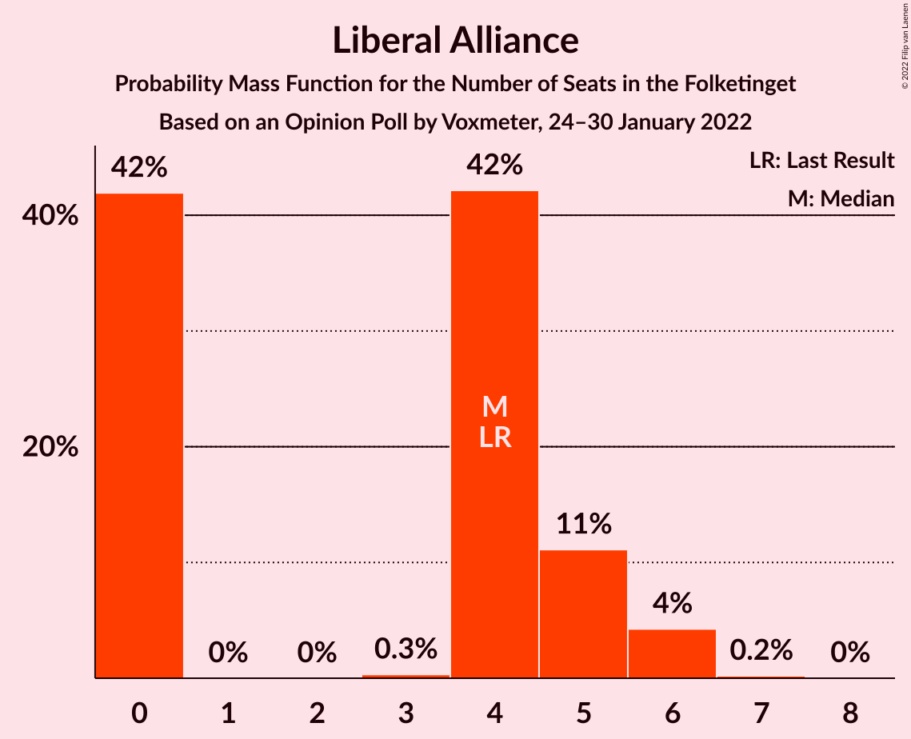

# Opinion Poll by Voxmeter, 24–30 January 2022

<a href="#voting-intentions">Voting Intentions</a> | <a href="#seats">Seats</a> | <a href="#coalitions">Coalitions</a> | <a href="#technical-information">Technical Information</a>

## Voting Intentions

### Confidence Intervals

| Party | Last Result | Poll Result | 80% Confidence Interval | 90% Confidence Interval | 95% Confidence Interval | 99% Confidence Interval |
|:-----:|:-----------:|:-----------:|:-----------------------:|:-----------------------:|:-----------------------:|:-----------------------:|
| Socialdemokraterne | 25.9% | 24.9% | 23.2–26.7% |22.8–27.2% |22.4–27.7% |21.6–28.6% |
| Det Konservative Folkeparti | 6.6% | 16.4% | 14.9–17.9% |14.5–18.4% |14.2–18.8% |13.5–19.5% |
| Venstre | 23.4% | 14.2% | 12.9–15.7% |12.5–16.1% |12.2–16.5% |11.6–17.2% |
| Socialistisk Folkeparti | 7.7% | 8.6% | 7.5–9.8% |7.2–10.2% |7.0–10.5% |6.5–11.1% |
| Enhedslisten–De Rød-Grønne | 6.9% | 8.3% | 7.3–9.5% |7.0–9.8% |6.7–10.1% |6.3–10.7% |
| Radikale Venstre | 8.6% | 7.7% | 6.7–8.9% |6.4–9.2% |6.2–9.5% |5.8–10.1% |
| Dansk Folkeparti | 8.7% | 7.1% | 6.2–8.2% |5.9–8.6% |5.7–8.9% |5.2–9.4% |
| Nye Borgerlige | 2.4% | 6.0% | 5.2–7.1% |4.9–7.4% |4.7–7.7% |4.3–8.2% |
| Liberal Alliance | 2.3% | 2.1% | 1.6–2.8% |1.5–3.0% |1.4–3.2% |1.2–3.5% |
| Kristendemokraterne | 1.7% | 1.7% | 1.2–2.3% |1.1–2.5% |1.1–2.7% |0.9–3.0% |
| Alternativet | 3.0% | 0.9% | 0.6–1.4% |0.5–1.6% |0.5–1.7% |0.4–2.0% |

*Note:* The poll result column reflects the actual value used in the calculations. Published results may vary slightly, and in addition be rounded to fewer digits.

## Seats

### Confidence Intervals

| Party | Last Result | Median | 80% Confidence Interval | 90% Confidence Interval | 95% Confidence Interval | 99% Confidence Interval |
|:-----:|:-----------:|:------:|:-----------------------:|:-----------------------:|:-----------------------:|:-----------------------:|
| <a href="#socialdemokraterne">Socialdemokraterne</a> | 48 | 44 | 42–47 |41–48 |40–50 |38–52 |
| <a href="#det-konservative-folkeparti">Det Konservative Folkeparti</a> | 12 | 29 | 27–32 |26–33 |25–34 |24–35 |
| <a href="#venstre">Venstre</a> | 43 | 27 | 23–28 |23–29 |21–29 |21–31 |
| <a href="#socialistisk-folkeparti">Socialistisk Folkeparti</a> | 14 | 14 | 13–17 |13–17 |13–18 |12–20 |
| <a href="#enhedslisten–de-rød-grønne">Enhedslisten–De Rød-Grønne</a> | 13 | 16 | 13–17 |13–18 |12–18 |11–19 |
| <a href="#radikale-venstre">Radikale Venstre</a> | 16 | 15 | 12–16 |11–17 |11–17 |10–18 |
| <a href="#dansk-folkeparti">Dansk Folkeparti</a> | 16 | 13 | 11–15 |10–15 |10–16 |9–18 |
| <a href="#nye-borgerlige">Nye Borgerlige</a> | 4 | 11 | 9–13 |9–13 |9–13 |8–15 |
| <a href="#liberal-alliance">Liberal Alliance</a> | 4 | 4 | 0–5 |0–5 |0–6 |0–6 |
| <a href="#kristendemokraterne">Kristendemokraterne</a> | 0 | 0 | 0–4 |0–4 |0–5 |0–5 |
| <a href="#alternativet">Alternativet</a> | 5 | 0 | 0 |0 |0 |0 |

### Socialdemokraterne

*For a full overview of the results for this party, see the [Socialdemokraterne](party-socialdemokraterne.html) page.*

| Number of Seats | Probability | Accumulated | Special Marks |
|:---------------:|:-----------:|:-----------:|:-------------:|
| 37 | 0.4% | 100% |  |
| 38 | 0.5% | 99.6% |  |
| 39 | 1.2% | 99.1% |  |
| 40 | 2% | 98% |  |
| 41 | 2% | 96% |  |
| 42 | 10% | 94% |  |
| 43 | 21% | 84% |  |
| 44 | 24% | 64% | Median |
| 45 | 13% | 40% |  |
| 46 | 8% | 27% |  |
| 47 | 13% | 19% |  |
| 48 | 1.4% | 6% | Last Result |
| 49 | 1.3% | 5% |  |
| 50 | 2% | 3% |  |
| 51 | 1.0% | 1.5% |  |
| 52 | 0.3% | 0.5% |  |
| 53 | 0.2% | 0.2% |  |
| 54 | 0% | 0% |  |

### Det Konservative Folkeparti

*For a full overview of the results for this party, see the [Det Konservative Folkeparti](party-detkonservativefolkeparti.html) page.*

| Number of Seats | Probability | Accumulated | Special Marks |
|:---------------:|:-----------:|:-----------:|:-------------:|
| 12 | 0% | 100% | Last Result |
| 13 | 0% | 100% |  |
| 14 | 0% | 100% |  |
| 15 | 0% | 100% |  |
| 16 | 0% | 100% |  |
| 17 | 0% | 100% |  |
| 18 | 0% | 100% |  |
| 19 | 0% | 100% |  |
| 20 | 0% | 100% |  |
| 21 | 0% | 100% |  |
| 22 | 0% | 100% |  |
| 23 | 0.2% | 100% |  |
| 24 | 0.3% | 99.7% |  |
| 25 | 3% | 99.5% |  |
| 26 | 3% | 97% |  |
| 27 | 7% | 94% |  |
| 28 | 34% | 87% |  |
| 29 | 12% | 53% | Median |
| 30 | 12% | 41% |  |
| 31 | 11% | 29% |  |
| 32 | 11% | 19% |  |
| 33 | 5% | 7% |  |
| 34 | 0.8% | 3% |  |
| 35 | 2% | 2% |  |
| 36 | 0.1% | 0.2% |  |
| 37 | 0.1% | 0.1% |  |
| 38 | 0% | 0% |  |

### Venstre

*For a full overview of the results for this party, see the [Venstre](party-venstre.html) page.*

| Number of Seats | Probability | Accumulated | Special Marks |
|:---------------:|:-----------:|:-----------:|:-------------:|
| 19 | 0% | 100% |  |
| 20 | 0.3% | 99.9% |  |
| 21 | 2% | 99.6% |  |
| 22 | 1.3% | 97% |  |
| 23 | 8% | 96% |  |
| 24 | 16% | 88% |  |
| 25 | 8% | 71% |  |
| 26 | 9% | 63% |  |
| 27 | 27% | 54% | Median |
| 28 | 17% | 26% |  |
| 29 | 7% | 9% |  |
| 30 | 2% | 2% |  |
| 31 | 0.6% | 0.7% |  |
| 32 | 0.1% | 0.1% |  |
| 33 | 0% | 0% |  |
| 34 | 0% | 0% |  |
| 35 | 0% | 0% |  |
| 36 | 0% | 0% |  |
| 37 | 0% | 0% |  |
| 38 | 0% | 0% |  |
| 39 | 0% | 0% |  |
| 40 | 0% | 0% |  |
| 41 | 0% | 0% |  |
| 42 | 0% | 0% |  |
| 43 | 0% | 0% | Last Result |

### Socialistisk Folkeparti

*For a full overview of the results for this party, see the [Socialistisk Folkeparti](party-socialistiskfolkeparti.html) page.*

| Number of Seats | Probability | Accumulated | Special Marks |
|:---------------:|:-----------:|:-----------:|:-------------:|
| 11 | 0.4% | 100% |  |
| 12 | 2% | 99.6% |  |
| 13 | 16% | 98% |  |
| 14 | 34% | 82% | Last Result, Median |
| 15 | 17% | 48% |  |
| 16 | 12% | 31% |  |
| 17 | 14% | 19% |  |
| 18 | 3% | 5% |  |
| 19 | 0.9% | 2% |  |
| 20 | 0.9% | 1.1% |  |
| 21 | 0.1% | 0.2% |  |
| 22 | 0% | 0% |  |

### Enhedslisten–De Rød-Grønne

*For a full overview of the results for this party, see the [Enhedslisten–De Rød-Grønne](party-enhedslisten–derød-grønne.html) page.*

| Number of Seats | Probability | Accumulated | Special Marks |
|:---------------:|:-----------:|:-----------:|:-------------:|
| 10 | 0.2% | 100% |  |
| 11 | 1.0% | 99.8% |  |
| 12 | 3% | 98.8% |  |
| 13 | 8% | 96% | Last Result |
| 14 | 7% | 88% |  |
| 15 | 23% | 81% |  |
| 16 | 34% | 58% | Median |
| 17 | 19% | 24% |  |
| 18 | 5% | 5% |  |
| 19 | 0.3% | 0.5% |  |
| 20 | 0.2% | 0.2% |  |
| 21 | 0% | 0% |  |

### Radikale Venstre

*For a full overview of the results for this party, see the [Radikale Venstre](party-radikalevenstre.html) page.*

| Number of Seats | Probability | Accumulated | Special Marks |
|:---------------:|:-----------:|:-----------:|:-------------:|
| 10 | 1.0% | 100% |  |
| 11 | 6% | 98.9% |  |
| 12 | 14% | 93% |  |
| 13 | 16% | 79% |  |
| 14 | 10% | 64% |  |
| 15 | 27% | 54% | Median |
| 16 | 21% | 28% | Last Result |
| 17 | 5% | 6% |  |
| 18 | 0.8% | 0.9% |  |
| 19 | 0.2% | 0.2% |  |
| 20 | 0% | 0% |  |

### Dansk Folkeparti

*For a full overview of the results for this party, see the [Dansk Folkeparti](party-danskfolkeparti.html) page.*

| Number of Seats | Probability | Accumulated | Special Marks |
|:---------------:|:-----------:|:-----------:|:-------------:|
| 9 | 0.5% | 100% |  |
| 10 | 8% | 99.5% |  |
| 11 | 8% | 92% |  |
| 12 | 18% | 84% |  |
| 13 | 35% | 65% | Median |
| 14 | 9% | 30% |  |
| 15 | 17% | 21% |  |
| 16 | 2% | 3% | Last Result |
| 17 | 0.5% | 1.2% |  |
| 18 | 0.6% | 0.6% |  |
| 19 | 0% | 0% |  |

### Nye Borgerlige

*For a full overview of the results for this party, see the [Nye Borgerlige](party-nyeborgerlige.html) page.*

| Number of Seats | Probability | Accumulated | Special Marks |
|:---------------:|:-----------:|:-----------:|:-------------:|
| 4 | 0% | 100% | Last Result |
| 5 | 0% | 100% |  |
| 6 | 0% | 100% |  |
| 7 | 0.1% | 100% |  |
| 8 | 2% | 99.9% |  |
| 9 | 22% | 98% |  |
| 10 | 25% | 76% |  |
| 11 | 18% | 51% | Median |
| 12 | 24% | 34% |  |
| 13 | 8% | 10% |  |
| 14 | 2% | 2% |  |
| 15 | 0.5% | 0.8% |  |
| 16 | 0.3% | 0.3% |  |
| 17 | 0% | 0% |  |

### Liberal Alliance

*For a full overview of the results for this party, see the [Liberal Alliance](party-liberalalliance.html) page.*

| Number of Seats | Probability | Accumulated | Special Marks |
|:---------------:|:-----------:|:-----------:|:-------------:|
| 0 | 42% | 100% |  |
| 1 | 0% | 58% |  |
| 2 | 0% | 58% |  |
| 3 | 0.3% | 58% |  |
| 4 | 42% | 58% | Last Result, Median |
| 5 | 11% | 16% |  |
| 6 | 4% | 4% |  |
| 7 | 0.2% | 0.2% |  |
| 8 | 0% | 0% |  |

### Kristendemokraterne

*For a full overview of the results for this party, see the [Kristendemokraterne](party-kristendemokraterne.html) page.*

| Number of Seats | Probability | Accumulated | Special Marks |
|:---------------:|:-----------:|:-----------:|:-------------:|
| 0 | 85% | 100% | Last Result, Median |
| 1 | 0% | 15% |  |
| 2 | 0% | 15% |  |
| 3 | 0.2% | 15% |  |
| 4 | 12% | 15% |  |
| 5 | 3% | 3% |  |
| 6 | 0.3% | 0.3% |  |
| 7 | 0% | 0% |  |

### Alternativet

*For a full overview of the results for this party, see the [Alternativet](party-alternativet.html) page.*

| Number of Seats | Probability | Accumulated | Special Marks |
|:---------------:|:-----------:|:-----------:|:-------------:|
| 0 | 99.7% | 100% | Median |
| 1 | 0% | 0.3% |  |
| 2 | 0% | 0.3% |  |
| 3 | 0% | 0.3% |  |
| 4 | 0.3% | 0.3% |  |
| 5 | 0% | 0% | Last Result |

## Coalitions

### Confidence Intervals

| Coalition | Last Result | Median | Majority? | 80% Confidence Interval | 90% Confidence Interval | 95% Confidence Interval | 99% Confidence Interval |
|:---------:|:-----------:|:------:|:---------:|:-----------------------:|:-----------------------:|:-----------------------:|:-----------------------:|
| Socialdemokraterne – Socialistisk Folkeparti – Enhedslisten–De Rød-Grønne – Radikale Venstre – Alternativet | 96 | 89 | 35% | 85–92 | 84–93 | 83–94 | 80–97 |
| Socialdemokraterne – Socialistisk Folkeparti – Enhedslisten–De Rød-Grønne – Radikale Venstre | 91 | 89 | 35% | 85–92 | 84–93 | 83–94 | 80–97 |
| Det Konservative Folkeparti – Venstre – Dansk Folkeparti – Nye Borgerlige – Liberal Alliance – Kristendemokraterne | 79 | 82 | 3% | 79–86 | 78–88 | 77–90 | 75–91 |
| Det Konservative Folkeparti – Venstre – Dansk Folkeparti – Nye Borgerlige – Liberal Alliance | 79 | 82 | 0.5% | 78–86 | 76–87 | 75–88 | 74–90 |
| Socialdemokraterne – Socialistisk Folkeparti – Radikale Venstre | 78 | 73 | 0% | 70–77 | 69–79 | 69–80 | 67–82 |
| Socialdemokraterne – Socialistisk Folkeparti – Enhedslisten–De Rød-Grønne – Alternativet | 80 | 74 | 0% | 72–78 | 70–79 | 68–80 | 67–83 |
| Socialdemokraterne – Socialistisk Folkeparti – Enhedslisten–De Rød-Grønne | 75 | 74 | 0% | 72–78 | 70–79 | 68–80 | 67–83 |
| Det Konservative Folkeparti – Venstre – Dansk Folkeparti – Liberal Alliance – Kristendemokraterne | 75 | 72 | 0% | 67–75 | 67–76 | 66–78 | 64–81 |
| Det Konservative Folkeparti – Venstre – Dansk Folkeparti – Liberal Alliance | 75 | 72 | 0% | 67–74 | 66–76 | 65–77 | 63–78 |
| Socialdemokraterne – Radikale Venstre | 64 | 59 | 0% | 55–62 | 54–63 | 54–64 | 52–66 |
| Det Konservative Folkeparti – Venstre – Liberal Alliance | 59 | 59 | 0% | 52–61 | 52–62 | 52–63 | 51–65 |
| Det Konservative Folkeparti – Venstre | 55 | 55 | 0% | 52–60 | 51–60 | 50–60 | 49–61 |
| Venstre | 43 | 27 | 0% | 23–28 | 23–29 | 21–29 | 21–31 |

### Socialdemokraterne – Socialistisk Folkeparti – Enhedslisten–De Rød-Grønne – Radikale Venstre – Alternativet

| Number of Seats | Probability | Accumulated | Special Marks |
|:---------------:|:-----------:|:-----------:|:-------------:|
| 80 | 0.5% | 100% |  |
| 81 | 0.2% | 99.5% |  |
| 82 | 0.4% | 99.2% |  |
| 83 | 3% | 98.8% |  |
| 84 | 5% | 96% |  |
| 85 | 4% | 91% |  |
| 86 | 5% | 87% |  |
| 87 | 8% | 81% |  |
| 88 | 4% | 73% |  |
| 89 | 34% | 70% | Median |
| 90 | 7% | 35% | Majority |
| 91 | 3% | 28% |  |
| 92 | 17% | 25% |  |
| 93 | 4% | 8% |  |
| 94 | 2% | 4% |  |
| 95 | 0.7% | 2% |  |
| 96 | 0.8% | 1.3% | Last Result |
| 97 | 0.3% | 0.5% |  |
| 98 | 0.1% | 0.2% |  |
| 99 | 0% | 0.1% |  |
| 100 | 0.1% | 0.1% |  |
| 101 | 0.1% | 0.1% |  |
| 102 | 0% | 0% |  |

### Socialdemokraterne – Socialistisk Folkeparti – Enhedslisten–De Rød-Grønne – Radikale Venstre

| Number of Seats | Probability | Accumulated | Special Marks |
|:---------------:|:-----------:|:-----------:|:-------------:|
| 80 | 0.5% | 100% |  |
| 81 | 0.3% | 99.5% |  |
| 82 | 0.4% | 99.2% |  |
| 83 | 3% | 98.8% |  |
| 84 | 5% | 95% |  |
| 85 | 4% | 90% |  |
| 86 | 5% | 87% |  |
| 87 | 8% | 81% |  |
| 88 | 4% | 73% |  |
| 89 | 34% | 69% | Median |
| 90 | 7% | 35% | Majority |
| 91 | 3% | 28% | Last Result |
| 92 | 17% | 25% |  |
| 93 | 4% | 8% |  |
| 94 | 2% | 4% |  |
| 95 | 0.6% | 2% |  |
| 96 | 0.8% | 1.3% |  |
| 97 | 0.3% | 0.5% |  |
| 98 | 0.1% | 0.2% |  |
| 99 | 0% | 0.1% |  |
| 100 | 0% | 0.1% |  |
| 101 | 0% | 0% |  |

### Det Konservative Folkeparti – Venstre – Dansk Folkeparti – Nye Borgerlige – Liberal Alliance – Kristendemokraterne

| Number of Seats | Probability | Accumulated | Special Marks |
|:---------------:|:-----------:|:-----------:|:-------------:|
| 72 | 0% | 100% |  |
| 73 | 0.2% | 99.9% |  |
| 74 | 0.1% | 99.7% |  |
| 75 | 0.5% | 99.7% |  |
| 76 | 0.5% | 99.1% |  |
| 77 | 1.5% | 98.6% |  |
| 78 | 3% | 97% |  |
| 79 | 13% | 94% | Last Result |
| 80 | 3% | 81% |  |
| 81 | 16% | 79% |  |
| 82 | 27% | 63% |  |
| 83 | 11% | 36% |  |
| 84 | 7% | 25% | Median |
| 85 | 4% | 18% |  |
| 86 | 5% | 14% |  |
| 87 | 3% | 9% |  |
| 88 | 3% | 6% |  |
| 89 | 1.0% | 4% |  |
| 90 | 1.0% | 3% | Majority |
| 91 | 1.4% | 2% |  |
| 92 | 0.1% | 0.2% |  |
| 93 | 0% | 0% |  |

### Det Konservative Folkeparti – Venstre – Dansk Folkeparti – Nye Borgerlige – Liberal Alliance

| Number of Seats | Probability | Accumulated | Special Marks |
|:---------------:|:-----------:|:-----------:|:-------------:|
| 71 | 0% | 100% |  |
| 72 | 0.1% | 99.9% |  |
| 73 | 0.3% | 99.9% |  |
| 74 | 0.2% | 99.6% |  |
| 75 | 2% | 99.3% |  |
| 76 | 2% | 97% |  |
| 77 | 2% | 95% |  |
| 78 | 4% | 93% |  |
| 79 | 13% | 89% | Last Result |
| 80 | 3% | 76% |  |
| 81 | 18% | 73% |  |
| 82 | 26% | 55% |  |
| 83 | 9% | 29% |  |
| 84 | 6% | 20% | Median |
| 85 | 2% | 13% |  |
| 86 | 5% | 12% |  |
| 87 | 3% | 6% |  |
| 88 | 2% | 4% |  |
| 89 | 0.6% | 1.2% |  |
| 90 | 0.4% | 0.5% | Majority |
| 91 | 0% | 0.1% |  |
| 92 | 0.1% | 0.1% |  |
| 93 | 0% | 0% |  |

### Socialdemokraterne – Socialistisk Folkeparti – Radikale Venstre

| Number of Seats | Probability | Accumulated | Special Marks |
|:---------------:|:-----------:|:-----------:|:-------------:|
| 64 | 0.2% | 100% |  |
| 65 | 0% | 99.8% |  |
| 66 | 0.1% | 99.8% |  |
| 67 | 0.6% | 99.7% |  |
| 68 | 0.6% | 99.0% |  |
| 69 | 4% | 98% |  |
| 70 | 10% | 95% |  |
| 71 | 8% | 84% |  |
| 72 | 4% | 77% |  |
| 73 | 31% | 73% | Median |
| 74 | 12% | 42% |  |
| 75 | 11% | 29% |  |
| 76 | 6% | 18% |  |
| 77 | 3% | 12% |  |
| 78 | 4% | 9% | Last Result |
| 79 | 3% | 5% |  |
| 80 | 2% | 3% |  |
| 81 | 0.3% | 1.1% |  |
| 82 | 0.7% | 0.8% |  |
| 83 | 0.1% | 0.2% |  |
| 84 | 0% | 0.1% |  |
| 85 | 0% | 0.1% |  |
| 86 | 0% | 0% |  |

### Socialdemokraterne – Socialistisk Folkeparti – Enhedslisten–De Rød-Grønne – Alternativet

| Number of Seats | Probability | Accumulated | Special Marks |
|:---------------:|:-----------:|:-----------:|:-------------:|
| 65 | 0.3% | 100% |  |
| 66 | 0% | 99.7% |  |
| 67 | 0.3% | 99.7% |  |
| 68 | 3% | 99.3% |  |
| 69 | 0.8% | 96% |  |
| 70 | 1.3% | 96% |  |
| 71 | 3% | 94% |  |
| 72 | 6% | 92% |  |
| 73 | 24% | 85% |  |
| 74 | 12% | 61% | Median |
| 75 | 7% | 49% |  |
| 76 | 13% | 42% |  |
| 77 | 13% | 29% |  |
| 78 | 7% | 16% |  |
| 79 | 6% | 9% |  |
| 80 | 0.6% | 3% | Last Result |
| 81 | 1.3% | 2% |  |
| 82 | 0.6% | 1.1% |  |
| 83 | 0.2% | 0.5% |  |
| 84 | 0.2% | 0.3% |  |
| 85 | 0.1% | 0.1% |  |
| 86 | 0% | 0.1% |  |
| 87 | 0% | 0% |  |

### Socialdemokraterne – Socialistisk Folkeparti – Enhedslisten–De Rød-Grønne

| Number of Seats | Probability | Accumulated | Special Marks |
|:---------------:|:-----------:|:-----------:|:-------------:|
| 65 | 0.3% | 100% |  |
| 66 | 0% | 99.7% |  |
| 67 | 0.3% | 99.6% |  |
| 68 | 3% | 99.3% |  |
| 69 | 0.8% | 96% |  |
| 70 | 1.3% | 95% |  |
| 71 | 3% | 94% |  |
| 72 | 6% | 92% |  |
| 73 | 24% | 85% |  |
| 74 | 12% | 61% | Median |
| 75 | 7% | 49% | Last Result |
| 76 | 13% | 42% |  |
| 77 | 13% | 29% |  |
| 78 | 7% | 16% |  |
| 79 | 6% | 8% |  |
| 80 | 0.6% | 3% |  |
| 81 | 1.3% | 2% |  |
| 82 | 0.6% | 1.1% |  |
| 83 | 0.2% | 0.5% |  |
| 84 | 0.2% | 0.3% |  |
| 85 | 0.1% | 0.1% |  |
| 86 | 0% | 0% |  |

### Det Konservative Folkeparti – Venstre – Dansk Folkeparti – Liberal Alliance – Kristendemokraterne

| Number of Seats | Probability | Accumulated | Special Marks |
|:---------------:|:-----------:|:-----------:|:-------------:|
| 60 | 0% | 100% |  |
| 61 | 0% | 99.9% |  |
| 62 | 0% | 99.9% |  |
| 63 | 0.3% | 99.9% |  |
| 64 | 1.0% | 99.6% |  |
| 65 | 0.5% | 98.6% |  |
| 66 | 2% | 98% |  |
| 67 | 10% | 96% |  |
| 68 | 1.3% | 86% |  |
| 69 | 4% | 84% |  |
| 70 | 11% | 81% |  |
| 71 | 7% | 70% |  |
| 72 | 35% | 63% |  |
| 73 | 13% | 28% | Median |
| 74 | 2% | 15% |  |
| 75 | 4% | 13% | Last Result |
| 76 | 4% | 9% |  |
| 77 | 2% | 5% |  |
| 78 | 1.0% | 3% |  |
| 79 | 0.4% | 2% |  |
| 80 | 0.4% | 2% |  |
| 81 | 1.3% | 1.4% |  |
| 82 | 0% | 0.1% |  |
| 83 | 0% | 0% |  |

### Det Konservative Folkeparti – Venstre – Dansk Folkeparti – Liberal Alliance

| Number of Seats | Probability | Accumulated | Special Marks |
|:---------------:|:-----------:|:-----------:|:-------------:|
| 60 | 0.1% | 100% |  |
| 61 | 0.2% | 99.9% |  |
| 62 | 0.2% | 99.7% |  |
| 63 | 0.6% | 99.5% |  |
| 64 | 1.3% | 98.9% |  |
| 65 | 1.3% | 98% |  |
| 66 | 5% | 96% |  |
| 67 | 11% | 92% |  |
| 68 | 4% | 81% |  |
| 69 | 4% | 77% |  |
| 70 | 9% | 73% |  |
| 71 | 9% | 64% |  |
| 72 | 33% | 56% |  |
| 73 | 13% | 23% | Median |
| 74 | 2% | 10% |  |
| 75 | 2% | 8% | Last Result |
| 76 | 3% | 7% |  |
| 77 | 2% | 3% |  |
| 78 | 0.6% | 0.8% |  |
| 79 | 0.1% | 0.3% |  |
| 80 | 0.1% | 0.1% |  |
| 81 | 0.1% | 0.1% |  |
| 82 | 0% | 0% |  |

### Socialdemokraterne – Radikale Venstre

| Number of Seats | Probability | Accumulated | Special Marks |
|:---------------:|:-----------:|:-----------:|:-------------:|
| 50 | 0% | 100% |  |
| 51 | 0.2% | 99.9% |  |
| 52 | 1.3% | 99.8% |  |
| 53 | 0.8% | 98.5% |  |
| 54 | 5% | 98% |  |
| 55 | 5% | 92% |  |
| 56 | 12% | 87% |  |
| 57 | 13% | 75% |  |
| 58 | 4% | 63% |  |
| 59 | 24% | 58% | Median |
| 60 | 11% | 34% |  |
| 61 | 4% | 23% |  |
| 62 | 10% | 19% |  |
| 63 | 6% | 9% |  |
| 64 | 2% | 3% | Last Result |
| 65 | 1.0% | 2% |  |
| 66 | 0.4% | 0.6% |  |
| 67 | 0.1% | 0.2% |  |
| 68 | 0% | 0.1% |  |
| 69 | 0% | 0.1% |  |
| 70 | 0.1% | 0.1% |  |
| 71 | 0% | 0% |  |

### Det Konservative Folkeparti – Venstre – Liberal Alliance

| Number of Seats | Probability | Accumulated | Special Marks |
|:---------------:|:-----------:|:-----------:|:-------------:|
| 48 | 0% | 100% |  |
| 49 | 0.1% | 99.9% |  |
| 50 | 0.2% | 99.9% |  |
| 51 | 1.0% | 99.6% |  |
| 52 | 11% | 98.7% |  |
| 53 | 1.1% | 88% |  |
| 54 | 4% | 87% |  |
| 55 | 2% | 82% |  |
| 56 | 5% | 80% |  |
| 57 | 4% | 75% |  |
| 58 | 15% | 70% |  |
| 59 | 24% | 55% | Last Result |
| 60 | 20% | 31% | Median |
| 61 | 4% | 12% |  |
| 62 | 4% | 7% |  |
| 63 | 1.4% | 3% |  |
| 64 | 0.6% | 2% |  |
| 65 | 0.7% | 1.0% |  |
| 66 | 0.2% | 0.3% |  |
| 67 | 0.1% | 0.1% |  |
| 68 | 0% | 0% |  |

### Det Konservative Folkeparti – Venstre

| Number of Seats | Probability | Accumulated | Special Marks |
|:---------------:|:-----------:|:-----------:|:-------------:|
| 46 | 0.1% | 100% |  |
| 47 | 0.1% | 99.9% |  |
| 48 | 0.3% | 99.8% |  |
| 49 | 0.5% | 99.5% |  |
| 50 | 2% | 99.0% |  |
| 51 | 3% | 97% |  |
| 52 | 15% | 94% |  |
| 53 | 8% | 80% |  |
| 54 | 6% | 72% |  |
| 55 | 27% | 66% | Last Result |
| 56 | 8% | 40% | Median |
| 57 | 5% | 32% |  |
| 58 | 10% | 27% |  |
| 59 | 2% | 17% |  |
| 60 | 14% | 15% |  |
| 61 | 0.5% | 0.9% |  |
| 62 | 0.1% | 0.4% |  |
| 63 | 0.1% | 0.3% |  |
| 64 | 0.2% | 0.2% |  |
| 65 | 0% | 0% |  |

### Venstre

| Number of Seats | Probability | Accumulated | Special Marks |
|:---------------:|:-----------:|:-----------:|:-------------:|
| 19 | 0% | 100% |  |
| 20 | 0.3% | 99.9% |  |
| 21 | 2% | 99.6% |  |
| 22 | 1.3% | 97% |  |
| 23 | 8% | 96% |  |
| 24 | 16% | 88% |  |
| 25 | 8% | 71% |  |
| 26 | 9% | 63% |  |
| 27 | 27% | 54% | Median |
| 28 | 17% | 26% |  |
| 29 | 7% | 9% |  |
| 30 | 2% | 2% |  |
| 31 | 0.6% | 0.7% |  |
| 32 | 0.1% | 0.1% |  |
| 33 | 0% | 0% |  |
| 34 | 0% | 0% |  |
| 35 | 0% | 0% |  |
| 36 | 0% | 0% |  |
| 37 | 0% | 0% |  |
| 38 | 0% | 0% |  |
| 39 | 0% | 0% |  |
| 40 | 0% | 0% |  |
| 41 | 0% | 0% |  |
| 42 | 0% | 0% |  |
| 43 | 0% | 0% | Last Result |

## Technical Information

### Opinion Poll

+ **Polling firm:** Voxmeter
+ **Commissioner(s):** —
+ **Fieldwork period:** 24–30 January 2022

### Calculations

+ **Sample size:** 1015
+ **Simulations done:** 1,048,576
+ **Error estimate:** 1.87%

