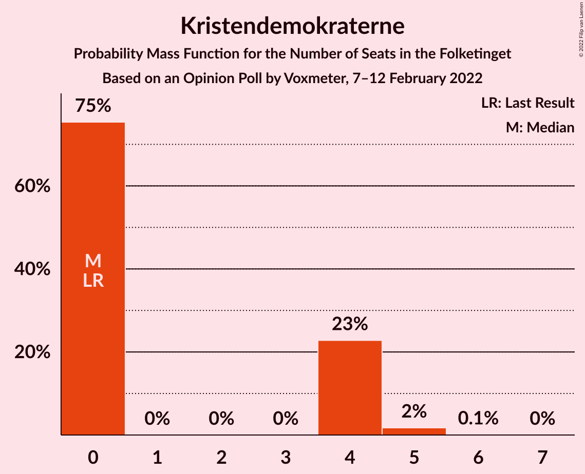

# Opinion Poll by Voxmeter, 7–12 February 2022

<a href="#voting-intentions">Voting Intentions</a> | <a href="#seats">Seats</a> | <a href="#coalitions">Coalitions</a> | <a href="#technical-information">Technical Information</a>

## Voting Intentions

### Confidence Intervals

| Party | Last Result | Poll Result | 80% Confidence Interval | 90% Confidence Interval | 95% Confidence Interval | 99% Confidence Interval |
|:-----:|:-----------:|:-----------:|:-----------------------:|:-----------------------:|:-----------------------:|:-----------------------:|
| Socialdemokraterne | 25.9% | 24.8% | 23.1–26.6% |22.6–27.2% |22.3–27.6% |21.5–28.5% |
| Det Konservative Folkeparti | 6.6% | 16.6% | 15.1–18.1% |14.7–18.6% |14.4–19.0% |13.7–19.8% |
| Venstre | 23.4% | 14.1% | 12.7–15.6% |12.4–16.0% |12.0–16.4% |11.4–17.1% |
| Enhedslisten–De Rød-Grønne | 6.9% | 9.5% | 8.4–10.8% |8.1–11.1% |7.8–11.4% |7.3–12.1% |
| Socialistisk Folkeparti | 7.7% | 8.9% | 7.8–10.1% |7.5–10.5% |7.3–10.8% |6.8–11.4% |
| Radikale Venstre | 8.6% | 6.9% | 5.9–8.0% |5.7–8.3% |5.5–8.6% |5.1–9.2% |
| Dansk Folkeparti | 8.7% | 5.6% | 4.8–6.6% |4.5–6.9% |4.3–7.2% |3.9–7.7% |
| Nye Borgerlige | 2.4% | 5.0% | 4.2–6.0% |4.0–6.3% |3.8–6.5% |3.5–7.0% |
| Liberal Alliance | 2.3% | 3.1% | 2.5–3.9% |2.3–4.1% |2.2–4.4% |1.9–4.8% |
| Kristendemokraterne | 1.7% | 1.5% | 1.1–2.1% |1.0–2.3% |0.9–2.5% |0.7–2.8% |
| Alternativet | 3.0% | 1.4% | 1.0–2.0% |0.9–2.2% |0.8–2.3% |0.7–2.7% |
| Frie Grønne | 0.0% | 0.2% | 0.1–0.5% |0.1–0.6% |0.1–0.7% |0.0–0.9% |

*Note:* The poll result column reflects the actual value used in the calculations. Published results may vary slightly, and in addition be rounded to fewer digits.

## Seats

### Confidence Intervals

| Party | Last Result | Median | 80% Confidence Interval | 90% Confidence Interval | 95% Confidence Interval | 99% Confidence Interval |
|:-----:|:-----------:|:------:|:-----------------------:|:-----------------------:|:-----------------------:|:-----------------------:|
| <a href="#socialdemokraterne">Socialdemokraterne</a> | 48 | 43 | 41–47 |41–48 |40–49 |38–50 |
| <a href="#det-konservative-folkeparti">Det Konservative Folkeparti</a> | 12 | 30 | 27–32 |26–34 |26–34 |25–36 |
| <a href="#venstre">Venstre</a> | 43 | 25 | 22–27 |22–27 |21–29 |20–29 |
| <a href="#enhedslisten–de-rød-grønne">Enhedslisten–De Rød-Grønne</a> | 13 | 17 | 14–19 |14–20 |14–20 |13–22 |
| <a href="#socialistisk-folkeparti">Socialistisk Folkeparti</a> | 14 | 17 | 14–18 |14–19 |13–19 |12–20 |
| <a href="#radikale-venstre">Radikale Venstre</a> | 16 | 13 | 10–15 |10–15 |9–15 |9–16 |
| <a href="#dansk-folkeparti">Dansk Folkeparti</a> | 16 | 10 | 8–11 |8–12 |8–12 |8–13 |
| <a href="#nye-borgerlige">Nye Borgerlige</a> | 4 | 9 | 7–10 |7–11 |7–11 |6–12 |
| <a href="#liberal-alliance">Liberal Alliance</a> | 4 | 6 | 4–8 |4–8 |4–9 |4–9 |
| <a href="#kristendemokraterne">Kristendemokraterne</a> | 0 | 0 | 0–4 |0–4 |0–4 |0–5 |
| <a href="#alternativet">Alternativet</a> | 5 | 0 | 0 |0–4 |0–4 |0–5 |
| <a href="#frie-grønne">Frie Grønne</a> | 0 | 0 | 0 |0 |0 |0 |

### Socialdemokraterne

*For a full overview of the results for this party, see the [Socialdemokraterne](party-socialdemokraterne.html) page.*

| Number of Seats | Probability | Accumulated | Special Marks |
|:---------------:|:-----------:|:-----------:|:-------------:|
| 37 | 0.3% | 100% |  |
| 38 | 0.9% | 99.6% |  |
| 39 | 0.5% | 98.8% |  |
| 40 | 3% | 98% |  |
| 41 | 6% | 95% |  |
| 42 | 23% | 90% |  |
| 43 | 19% | 67% | Median |
| 44 | 4% | 47% |  |
| 45 | 15% | 43% |  |
| 46 | 6% | 28% |  |
| 47 | 14% | 22% |  |
| 48 | 5% | 8% | Last Result |
| 49 | 2% | 3% |  |
| 50 | 0.1% | 0.5% |  |
| 51 | 0.2% | 0.4% |  |
| 52 | 0.2% | 0.2% |  |
| 53 | 0% | 0% |  |

### Det Konservative Folkeparti

*For a full overview of the results for this party, see the [Det Konservative Folkeparti](party-detkonservativefolkeparti.html) page.*

| Number of Seats | Probability | Accumulated | Special Marks |
|:---------------:|:-----------:|:-----------:|:-------------:|
| 12 | 0% | 100% | Last Result |
| 13 | 0% | 100% |  |
| 14 | 0% | 100% |  |
| 15 | 0% | 100% |  |
| 16 | 0% | 100% |  |
| 17 | 0% | 100% |  |
| 18 | 0% | 100% |  |
| 19 | 0% | 100% |  |
| 20 | 0% | 100% |  |
| 21 | 0% | 100% |  |
| 22 | 0% | 100% |  |
| 23 | 0% | 100% |  |
| 24 | 0.1% | 100% |  |
| 25 | 1.3% | 99.9% |  |
| 26 | 6% | 98.6% |  |
| 27 | 6% | 93% |  |
| 28 | 15% | 87% |  |
| 29 | 11% | 72% |  |
| 30 | 19% | 61% | Median |
| 31 | 14% | 42% |  |
| 32 | 19% | 28% |  |
| 33 | 4% | 10% |  |
| 34 | 4% | 5% |  |
| 35 | 1.2% | 2% |  |
| 36 | 0.5% | 0.5% |  |
| 37 | 0% | 0% |  |

### Venstre

*For a full overview of the results for this party, see the [Venstre](party-venstre.html) page.*

| Number of Seats | Probability | Accumulated | Special Marks |
|:---------------:|:-----------:|:-----------:|:-------------:|
| 19 | 0.1% | 100% |  |
| 20 | 0.8% | 99.9% |  |
| 21 | 2% | 99.1% |  |
| 22 | 9% | 97% |  |
| 23 | 19% | 88% |  |
| 24 | 10% | 69% |  |
| 25 | 30% | 59% | Median |
| 26 | 4% | 29% |  |
| 27 | 20% | 25% |  |
| 28 | 1.1% | 5% |  |
| 29 | 3% | 4% |  |
| 30 | 0.3% | 0.4% |  |
| 31 | 0.1% | 0.1% |  |
| 32 | 0% | 0% |  |
| 33 | 0% | 0% |  |
| 34 | 0% | 0% |  |
| 35 | 0% | 0% |  |
| 36 | 0% | 0% |  |
| 37 | 0% | 0% |  |
| 38 | 0% | 0% |  |
| 39 | 0% | 0% |  |
| 40 | 0% | 0% |  |
| 41 | 0% | 0% |  |
| 42 | 0% | 0% |  |
| 43 | 0% | 0% | Last Result |

### Enhedslisten–De Rød-Grønne

*For a full overview of the results for this party, see the [Enhedslisten–De Rød-Grønne](party-enhedslisten–derød-grønne.html) page.*

| Number of Seats | Probability | Accumulated | Special Marks |
|:---------------:|:-----------:|:-----------:|:-------------:|
| 12 | 0.1% | 100% |  |
| 13 | 2% | 99.9% | Last Result |
| 14 | 9% | 98% |  |
| 15 | 4% | 89% |  |
| 16 | 32% | 85% |  |
| 17 | 30% | 54% | Median |
| 18 | 13% | 24% |  |
| 19 | 4% | 10% |  |
| 20 | 6% | 7% |  |
| 21 | 0.4% | 1.1% |  |
| 22 | 0.4% | 0.6% |  |
| 23 | 0.2% | 0.2% |  |
| 24 | 0% | 0% |  |

### Socialistisk Folkeparti

*For a full overview of the results for this party, see the [Socialistisk Folkeparti](party-socialistiskfolkeparti.html) page.*

| Number of Seats | Probability | Accumulated | Special Marks |
|:---------------:|:-----------:|:-----------:|:-------------:|
| 11 | 0.3% | 100% |  |
| 12 | 1.5% | 99.7% |  |
| 13 | 2% | 98% |  |
| 14 | 24% | 97% | Last Result |
| 15 | 8% | 73% |  |
| 16 | 14% | 64% |  |
| 17 | 26% | 51% | Median |
| 18 | 18% | 25% |  |
| 19 | 6% | 6% |  |
| 20 | 0.5% | 0.8% |  |
| 21 | 0.2% | 0.3% |  |
| 22 | 0% | 0% |  |

### Radikale Venstre

*For a full overview of the results for this party, see the [Radikale Venstre](party-radikalevenstre.html) page.*

| Number of Seats | Probability | Accumulated | Special Marks |
|:---------------:|:-----------:|:-----------:|:-------------:|
| 8 | 0% | 100% |  |
| 9 | 3% | 99.9% |  |
| 10 | 9% | 97% |  |
| 11 | 8% | 89% |  |
| 12 | 24% | 81% |  |
| 13 | 8% | 57% | Median |
| 14 | 35% | 49% |  |
| 15 | 12% | 14% |  |
| 16 | 1.3% | 2% | Last Result |
| 17 | 0.2% | 0.2% |  |
| 18 | 0% | 0% |  |

### Dansk Folkeparti

*For a full overview of the results for this party, see the [Dansk Folkeparti](party-danskfolkeparti.html) page.*

| Number of Seats | Probability | Accumulated | Special Marks |
|:---------------:|:-----------:|:-----------:|:-------------:|
| 7 | 0.4% | 100% |  |
| 8 | 11% | 99.6% |  |
| 9 | 20% | 89% |  |
| 10 | 39% | 69% | Median |
| 11 | 20% | 30% |  |
| 12 | 7% | 10% |  |
| 13 | 2% | 2% |  |
| 14 | 0.1% | 0.2% |  |
| 15 | 0% | 0.1% |  |
| 16 | 0% | 0% | Last Result |

### Nye Borgerlige

*For a full overview of the results for this party, see the [Nye Borgerlige](party-nyeborgerlige.html) page.*

| Number of Seats | Probability | Accumulated | Special Marks |
|:---------------:|:-----------:|:-----------:|:-------------:|
| 4 | 0% | 100% | Last Result |
| 5 | 0.1% | 100% |  |
| 6 | 0.6% | 99.9% |  |
| 7 | 18% | 99.3% |  |
| 8 | 31% | 81% |  |
| 9 | 35% | 50% | Median |
| 10 | 5% | 15% |  |
| 11 | 7% | 10% |  |
| 12 | 2% | 2% |  |
| 13 | 0.3% | 0.3% |  |
| 14 | 0% | 0% |  |

### Liberal Alliance

*For a full overview of the results for this party, see the [Liberal Alliance](party-liberalalliance.html) page.*

| Number of Seats | Probability | Accumulated | Special Marks |
|:---------------:|:-----------:|:-----------:|:-------------:|
| 0 | 0.3% | 100% |  |
| 1 | 0% | 99.7% |  |
| 2 | 0% | 99.7% |  |
| 3 | 0% | 99.7% |  |
| 4 | 16% | 99.7% | Last Result |
| 5 | 23% | 84% |  |
| 6 | 27% | 61% | Median |
| 7 | 24% | 34% |  |
| 8 | 7% | 11% |  |
| 9 | 3% | 3% |  |
| 10 | 0.1% | 0.1% |  |
| 11 | 0% | 0% |  |

### Kristendemokraterne

*For a full overview of the results for this party, see the [Kristendemokraterne](party-kristendemokraterne.html) page.*

| Number of Seats | Probability | Accumulated | Special Marks |
|:---------------:|:-----------:|:-----------:|:-------------:|
| 0 | 75% | 100% | Last Result, Median |
| 1 | 0% | 25% |  |
| 2 | 0% | 25% |  |
| 3 | 0% | 25% |  |
| 4 | 23% | 25% |  |
| 5 | 2% | 2% |  |
| 6 | 0.1% | 0.1% |  |
| 7 | 0% | 0% |  |

### Alternativet

*For a full overview of the results for this party, see the [Alternativet](party-alternativet.html) page.*

| Number of Seats | Probability | Accumulated | Special Marks |
|:---------------:|:-----------:|:-----------:|:-------------:|
| 0 | 93% | 100% | Median |
| 1 | 0% | 7% |  |
| 2 | 0% | 7% |  |
| 3 | 0% | 7% |  |
| 4 | 6% | 6% |  |
| 5 | 0.6% | 0.6% | Last Result |
| 6 | 0% | 0% |  |

### Frie Grønne

*For a full overview of the results for this party, see the [Frie Grønne](party-friegrønne.html) page.*

| Number of Seats | Probability | Accumulated | Special Marks |
|:---------------:|:-----------:|:-----------:|:-------------:|
| 0 | 100% | 100% | Last Result, Median |

## Coalitions

### Confidence Intervals

| Coalition | Last Result | Median | Majority? | 80% Confidence Interval | 90% Confidence Interval | 95% Confidence Interval | 99% Confidence Interval |
|:---------:|:-----------:|:------:|:---------:|:-----------------------:|:-----------------------:|:-----------------------:|:-----------------------:|
| Socialdemokraterne – Enhedslisten–De Rød-Grønne – Socialistisk Folkeparti – Radikale Venstre – Alternativet | 96 | 90 | 52% | 87–95 | 86–95 | 85–95 | 82–97 |
| Socialdemokraterne – Enhedslisten–De Rød-Grønne – Socialistisk Folkeparti – Radikale Venstre | 91 | 89 | 46% | 87–95 | 86–95 | 85–95 | 82–96 |
| Det Konservative Folkeparti – Venstre – Dansk Folkeparti – Nye Borgerlige – Liberal Alliance – Kristendemokraterne | 79 | 80 | 0.1% | 75–84 | 75–84 | 75–86 | 74–89 |
| Det Konservative Folkeparti – Venstre – Dansk Folkeparti – Nye Borgerlige – Liberal Alliance | 79 | 78 | 0% | 75–84 | 74–84 | 74–85 | 72–89 |
| Socialdemokraterne – Enhedslisten–De Rød-Grønne – Socialistisk Folkeparti – Alternativet | 80 | 78 | 0% | 73–80 | 73–81 | 71–82 | 69–85 |
| Socialdemokraterne – Enhedslisten–De Rød-Grønne – Socialistisk Folkeparti | 75 | 77 | 0% | 73–80 | 73–80 | 71–81 | 69–85 |
| Socialdemokraterne – Socialistisk Folkeparti – Radikale Venstre | 78 | 73 | 0% | 69–79 | 68–79 | 68–79 | 65–79 |
| Det Konservative Folkeparti – Venstre – Dansk Folkeparti – Liberal Alliance – Kristendemokraterne | 75 | 72 | 0% | 66–76 | 66–76 | 66–76 | 64–80 |
| Det Konservative Folkeparti – Venstre – Dansk Folkeparti – Liberal Alliance | 75 | 71 | 0% | 66–76 | 66–76 | 66–76 | 62–80 |
| Det Konservative Folkeparti – Venstre – Liberal Alliance | 59 | 61 | 0% | 56–66 | 55–66 | 54–66 | 53–67 |
| Socialdemokraterne – Radikale Venstre | 64 | 57 | 0% | 53–62 | 53–62 | 52–62 | 50–63 |
| Det Konservative Folkeparti – Venstre | 55 | 55 | 0% | 51–59 | 49–60 | 48–60 | 48–62 |
| Venstre | 43 | 25 | 0% | 22–27 | 22–27 | 21–29 | 20–29 |

### Socialdemokraterne – Enhedslisten–De Rød-Grønne – Socialistisk Folkeparti – Radikale Venstre – Alternativet

| Number of Seats | Probability | Accumulated | Special Marks |
|:---------------:|:-----------:|:-----------:|:-------------:|
| 79 | 0.1% | 100% |  |
| 80 | 0% | 99.9% |  |
| 81 | 0.1% | 99.9% |  |
| 82 | 1.2% | 99.8% |  |
| 83 | 0.3% | 98.5% |  |
| 84 | 0.5% | 98% |  |
| 85 | 2% | 98% |  |
| 86 | 3% | 96% |  |
| 87 | 24% | 92% |  |
| 88 | 7% | 68% |  |
| 89 | 10% | 61% |  |
| 90 | 6% | 52% | Median, Majority |
| 91 | 14% | 46% |  |
| 92 | 8% | 32% |  |
| 93 | 8% | 24% |  |
| 94 | 3% | 16% |  |
| 95 | 12% | 13% |  |
| 96 | 0.9% | 1.4% | Last Result |
| 97 | 0.1% | 0.5% |  |
| 98 | 0.3% | 0.4% |  |
| 99 | 0% | 0% |  |

### Socialdemokraterne – Enhedslisten–De Rød-Grønne – Socialistisk Folkeparti – Radikale Venstre

| Number of Seats | Probability | Accumulated | Special Marks |
|:---------------:|:-----------:|:-----------:|:-------------:|
| 79 | 0.1% | 100% |  |
| 80 | 0% | 99.9% |  |
| 81 | 0.1% | 99.9% |  |
| 82 | 1.3% | 99.7% |  |
| 83 | 0.4% | 98% |  |
| 84 | 0.5% | 98% |  |
| 85 | 2% | 98% |  |
| 86 | 3% | 96% |  |
| 87 | 24% | 92% |  |
| 88 | 12% | 68% |  |
| 89 | 10% | 56% |  |
| 90 | 6% | 46% | Median, Majority |
| 91 | 15% | 41% | Last Result |
| 92 | 3% | 26% |  |
| 93 | 8% | 23% |  |
| 94 | 3% | 15% |  |
| 95 | 11% | 12% |  |
| 96 | 0.6% | 1.0% |  |
| 97 | 0.1% | 0.4% |  |
| 98 | 0.2% | 0.3% |  |
| 99 | 0% | 0% |  |

### Det Konservative Folkeparti – Venstre – Dansk Folkeparti – Nye Borgerlige – Liberal Alliance – Kristendemokraterne

| Number of Seats | Probability | Accumulated | Special Marks |
|:---------------:|:-----------:|:-----------:|:-------------:|
| 72 | 0.3% | 100% |  |
| 73 | 0.1% | 99.7% |  |
| 74 | 0.7% | 99.6% |  |
| 75 | 12% | 98.9% |  |
| 76 | 2% | 87% |  |
| 77 | 3% | 85% |  |
| 78 | 20% | 83% |  |
| 79 | 8% | 63% | Last Result |
| 80 | 7% | 56% | Median |
| 81 | 8% | 48% |  |
| 82 | 12% | 41% |  |
| 83 | 5% | 28% |  |
| 84 | 19% | 23% |  |
| 85 | 1.3% | 4% |  |
| 86 | 1.3% | 3% |  |
| 87 | 0.4% | 2% |  |
| 88 | 0.2% | 2% |  |
| 89 | 1.2% | 1.3% |  |
| 90 | 0.1% | 0.1% | Majority |
| 91 | 0.1% | 0.1% |  |
| 92 | 0% | 0% |  |

### Det Konservative Folkeparti – Venstre – Dansk Folkeparti – Nye Borgerlige – Liberal Alliance

| Number of Seats | Probability | Accumulated | Special Marks |
|:---------------:|:-----------:|:-----------:|:-------------:|
| 70 | 0.1% | 100% |  |
| 71 | 0% | 99.9% |  |
| 72 | 0.6% | 99.8% |  |
| 73 | 0.2% | 99.2% |  |
| 74 | 5% | 99.0% |  |
| 75 | 15% | 94% |  |
| 76 | 6% | 79% |  |
| 77 | 3% | 73% |  |
| 78 | 24% | 71% |  |
| 79 | 5% | 47% | Last Result |
| 80 | 5% | 42% | Median |
| 81 | 8% | 37% |  |
| 82 | 4% | 29% |  |
| 83 | 5% | 26% |  |
| 84 | 18% | 21% |  |
| 85 | 0.4% | 3% |  |
| 86 | 0.8% | 2% |  |
| 87 | 0.2% | 2% |  |
| 88 | 0.2% | 1.3% |  |
| 89 | 1.1% | 1.1% |  |
| 90 | 0% | 0% | Majority |

### Socialdemokraterne – Enhedslisten–De Rød-Grønne – Socialistisk Folkeparti – Alternativet

| Number of Seats | Probability | Accumulated | Special Marks |
|:---------------:|:-----------:|:-----------:|:-------------:|
| 68 | 0.2% | 100% |  |
| 69 | 1.2% | 99.8% |  |
| 70 | 0.2% | 98.6% |  |
| 71 | 1.2% | 98% |  |
| 72 | 0.8% | 97% |  |
| 73 | 19% | 96% |  |
| 74 | 1.2% | 77% |  |
| 75 | 5% | 76% |  |
| 76 | 8% | 71% |  |
| 77 | 12% | 63% | Median |
| 78 | 6% | 51% |  |
| 79 | 23% | 45% |  |
| 80 | 16% | 22% | Last Result |
| 81 | 2% | 6% |  |
| 82 | 2% | 4% |  |
| 83 | 1.1% | 2% |  |
| 84 | 0.2% | 1.0% |  |
| 85 | 0.5% | 0.8% |  |
| 86 | 0.2% | 0.3% |  |
| 87 | 0.1% | 0.2% |  |
| 88 | 0% | 0% |  |

### Socialdemokraterne – Enhedslisten–De Rød-Grønne – Socialistisk Folkeparti

| Number of Seats | Probability | Accumulated | Special Marks |
|:---------------:|:-----------:|:-----------:|:-------------:|
| 68 | 0.2% | 100% |  |
| 69 | 1.2% | 99.8% |  |
| 70 | 0.2% | 98.6% |  |
| 71 | 1.2% | 98% |  |
| 72 | 0.9% | 97% |  |
| 73 | 19% | 96% |  |
| 74 | 1.3% | 77% |  |
| 75 | 5% | 76% | Last Result |
| 76 | 12% | 70% |  |
| 77 | 12% | 58% | Median |
| 78 | 6% | 46% |  |
| 79 | 24% | 40% |  |
| 80 | 11% | 16% |  |
| 81 | 2% | 4% |  |
| 82 | 1.4% | 2% |  |
| 83 | 0.2% | 1.0% |  |
| 84 | 0.2% | 0.8% |  |
| 85 | 0.4% | 0.6% |  |
| 86 | 0.1% | 0.3% |  |
| 87 | 0.1% | 0.1% |  |
| 88 | 0% | 0% |  |

### Socialdemokraterne – Socialistisk Folkeparti – Radikale Venstre

| Number of Seats | Probability | Accumulated | Special Marks |
|:---------------:|:-----------:|:-----------:|:-------------:|
| 63 | 0.2% | 100% |  |
| 64 | 0.2% | 99.8% |  |
| 65 | 0.4% | 99.7% |  |
| 66 | 0.2% | 99.3% |  |
| 67 | 0.4% | 99.0% |  |
| 68 | 6% | 98.7% |  |
| 69 | 6% | 93% |  |
| 70 | 18% | 88% |  |
| 71 | 4% | 70% |  |
| 72 | 8% | 66% |  |
| 73 | 14% | 58% | Median |
| 74 | 12% | 43% |  |
| 75 | 15% | 31% |  |
| 76 | 2% | 16% |  |
| 77 | 0.5% | 14% |  |
| 78 | 1.0% | 14% | Last Result |
| 79 | 12% | 13% |  |
| 80 | 0.3% | 0.3% |  |
| 81 | 0.1% | 0.1% |  |
| 82 | 0% | 0% |  |

### Det Konservative Folkeparti – Venstre – Dansk Folkeparti – Liberal Alliance – Kristendemokraterne

| Number of Seats | Probability | Accumulated | Special Marks |
|:---------------:|:-----------:|:-----------:|:-------------:|
| 62 | 0.1% | 100% |  |
| 63 | 0.1% | 99.9% |  |
| 64 | 0.2% | 99.7% |  |
| 65 | 0.1% | 99.5% |  |
| 66 | 12% | 99.4% |  |
| 67 | 2% | 88% |  |
| 68 | 3% | 85% |  |
| 69 | 9% | 82% |  |
| 70 | 10% | 73% |  |
| 71 | 10% | 62% | Median |
| 72 | 14% | 52% |  |
| 73 | 6% | 38% |  |
| 74 | 2% | 33% |  |
| 75 | 12% | 30% | Last Result |
| 76 | 16% | 18% |  |
| 77 | 0.6% | 2% |  |
| 78 | 0.4% | 2% |  |
| 79 | 0.2% | 1.4% |  |
| 80 | 1.0% | 1.2% |  |
| 81 | 0.2% | 0.2% |  |
| 82 | 0% | 0% |  |

### Det Konservative Folkeparti – Venstre – Dansk Folkeparti – Liberal Alliance

| Number of Seats | Probability | Accumulated | Special Marks |
|:---------------:|:-----------:|:-----------:|:-------------:|
| 62 | 0.5% | 100% |  |
| 63 | 0.2% | 99.5% |  |
| 64 | 0.5% | 99.3% |  |
| 65 | 0.4% | 98.8% |  |
| 66 | 18% | 98% |  |
| 67 | 3% | 80% |  |
| 68 | 8% | 77% |  |
| 69 | 10% | 69% |  |
| 70 | 5% | 59% |  |
| 71 | 17% | 54% | Median |
| 72 | 9% | 37% |  |
| 73 | 5% | 28% |  |
| 74 | 2% | 23% |  |
| 75 | 4% | 21% | Last Result |
| 76 | 15% | 17% |  |
| 77 | 0.2% | 2% |  |
| 78 | 0.3% | 1.5% |  |
| 79 | 0.1% | 1.2% |  |
| 80 | 1.0% | 1.1% |  |
| 81 | 0.1% | 0.1% |  |
| 82 | 0% | 0% |  |

### Det Konservative Folkeparti – Venstre – Liberal Alliance

| Number of Seats | Probability | Accumulated | Special Marks |
|:---------------:|:-----------:|:-----------:|:-------------:|
| 53 | 0.6% | 100% |  |
| 54 | 4% | 99.4% |  |
| 55 | 1.5% | 95% |  |
| 56 | 4% | 94% |  |
| 57 | 13% | 89% |  |
| 58 | 7% | 76% |  |
| 59 | 6% | 69% | Last Result |
| 60 | 8% | 62% |  |
| 61 | 20% | 54% | Median |
| 62 | 2% | 35% |  |
| 63 | 9% | 33% |  |
| 64 | 5% | 23% |  |
| 65 | 2% | 19% |  |
| 66 | 15% | 17% |  |
| 67 | 1.4% | 2% |  |
| 68 | 0% | 0.3% |  |
| 69 | 0.2% | 0.3% |  |
| 70 | 0% | 0.1% |  |
| 71 | 0% | 0% |  |

### Socialdemokraterne – Radikale Venstre

| Number of Seats | Probability | Accumulated | Special Marks |
|:---------------:|:-----------:|:-----------:|:-------------:|
| 48 | 0.1% | 100% |  |
| 49 | 0% | 99.8% |  |
| 50 | 0.4% | 99.8% |  |
| 51 | 1.1% | 99.4% |  |
| 52 | 2% | 98% |  |
| 53 | 6% | 96% |  |
| 54 | 8% | 90% |  |
| 55 | 8% | 82% |  |
| 56 | 22% | 75% | Median |
| 57 | 27% | 52% |  |
| 58 | 4% | 25% |  |
| 59 | 2% | 21% |  |
| 60 | 5% | 19% |  |
| 61 | 1.2% | 14% |  |
| 62 | 11% | 13% |  |
| 63 | 1.3% | 1.4% |  |
| 64 | 0.1% | 0.1% | Last Result |
| 65 | 0% | 0% |  |

### Det Konservative Folkeparti – Venstre

| Number of Seats | Probability | Accumulated | Special Marks |
|:---------------:|:-----------:|:-----------:|:-------------:|
| 47 | 0.1% | 100% |  |
| 48 | 4% | 99.8% |  |
| 49 | 1.4% | 95% |  |
| 50 | 0.9% | 94% |  |
| 51 | 5% | 93% |  |
| 52 | 7% | 88% |  |
| 53 | 19% | 80% |  |
| 54 | 9% | 61% |  |
| 55 | 20% | 52% | Last Result, Median |
| 56 | 5% | 32% |  |
| 57 | 3% | 27% |  |
| 58 | 2% | 24% |  |
| 59 | 15% | 21% |  |
| 60 | 4% | 6% |  |
| 61 | 0.5% | 2% |  |
| 62 | 1.2% | 1.3% |  |
| 63 | 0.1% | 0.1% |  |
| 64 | 0% | 0% |  |

### Venstre

| Number of Seats | Probability | Accumulated | Special Marks |
|:---------------:|:-----------:|:-----------:|:-------------:|
| 19 | 0.1% | 100% |  |
| 20 | 0.8% | 99.9% |  |
| 21 | 2% | 99.1% |  |
| 22 | 9% | 97% |  |
| 23 | 19% | 88% |  |
| 24 | 10% | 69% |  |
| 25 | 30% | 59% | Median |
| 26 | 4% | 29% |  |
| 27 | 20% | 25% |  |
| 28 | 1.1% | 5% |  |
| 29 | 3% | 4% |  |
| 30 | 0.3% | 0.4% |  |
| 31 | 0.1% | 0.1% |  |
| 32 | 0% | 0% |  |
| 33 | 0% | 0% |  |
| 34 | 0% | 0% |  |
| 35 | 0% | 0% |  |
| 36 | 0% | 0% |  |
| 37 | 0% | 0% |  |
| 38 | 0% | 0% |  |
| 39 | 0% | 0% |  |
| 40 | 0% | 0% |  |
| 41 | 0% | 0% |  |
| 42 | 0% | 0% |  |
| 43 | 0% | 0% | Last Result |

## Technical Information

### Opinion Poll

+ **Polling firm:** Voxmeter
+ **Commissioner(s):** —
+ **Fieldwork period:** 7–12 February 2022

### Calculations

+ **Sample size:** 1003
+ **Simulations done:** 1,048,576
+ **Error estimate:** 1.78%

