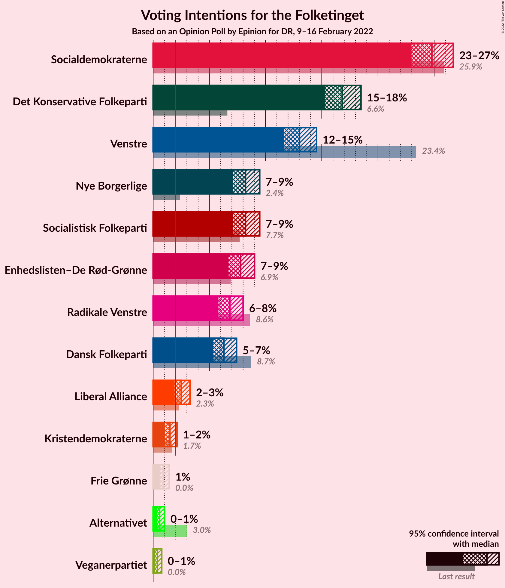
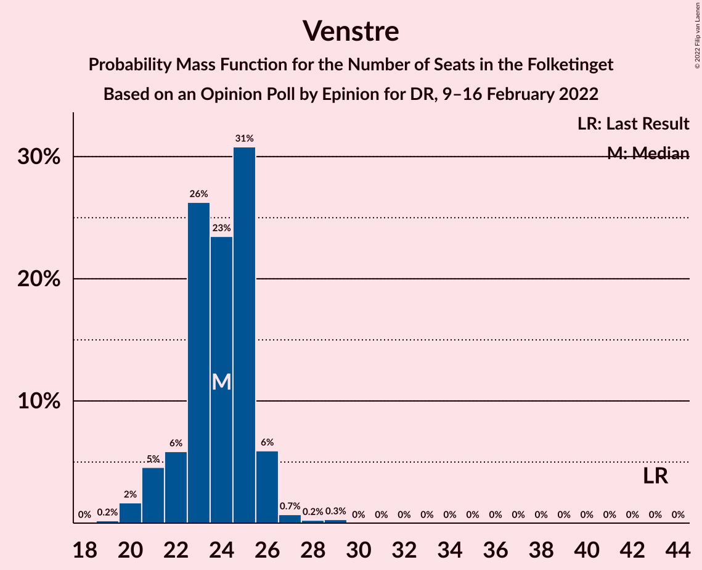

# Opinion Poll by Epinion for DR, 9–16 February 2022

<a href="#voting-intentions">Voting Intentions</a> | <a href="#seats">Seats</a> | <a href="#coalitions">Coalitions</a> | <a href="#technical-information">Technical Information</a>

## Voting Intentions

### Confidence Intervals

| Party | Last Result | Poll Result | 80% Confidence Interval | 90% Confidence Interval | 95% Confidence Interval | 99% Confidence Interval |
|:-----:|:-----------:|:-----------:|:-----------------------:|:-----------------------:|:-----------------------:|:-----------------------:|
| Socialdemokraterne | 25.9% | 24.8% | 23.6–26.0% |23.3–26.4% |23.0–26.7% |22.4–27.3% |
| Det Konservative Folkeparti | 6.6% | 16.8% | 15.8–17.9% |15.5–18.2% |15.3–18.5% |14.8–19.0% |
| Venstre | 23.4% | 13.0% | 12.1–14.0% |11.9–14.3% |11.6–14.5% |11.2–15.0% |
| Socialistisk Folkeparti | 7.7% | 8.2% | 7.5–9.0% |7.3–9.3% |7.1–9.5% |6.8–9.9% |
| Nye Borgerlige | 2.4% | 8.2% | 7.5–9.0% |7.3–9.3% |7.1–9.5% |6.8–9.9% |
| Enhedslisten–De Rød-Grønne | 6.9% | 7.8% | 7.1–8.6% |6.9–8.8% |6.7–9.0% |6.4–9.4% |
| Radikale Venstre | 8.6% | 6.8% | 6.2–7.6% |6.0–7.8% |5.8–8.0% |5.5–8.4% |
| Dansk Folkeparti | 8.7% | 6.3% | 5.7–7.0% |5.5–7.2% |5.3–7.4% |5.0–7.8% |
| Liberal Alliance | 2.3% | 2.5% | 2.1–3.0% |2.0–3.1% |1.9–3.3% |1.7–3.5% |
| Kristendemokraterne | 1.7% | 1.5% | 1.2–1.9% |1.1–2.0% |1.1–2.1% |0.9–2.3% |
| Frie Grønne | 0.0% | 0.9% | 0.7–1.2% |0.6–1.3% |0.6–1.4% |0.5–1.6% |
| Alternativet | 3.0% | 0.6% | 0.4–0.9% |0.4–0.9% |0.3–1.0% |0.3–1.2% |
| Veganerpartiet | 0.0% | 0.4% | 0.3–0.6% |0.2–0.7% |0.2–0.8% |0.1–0.9% |

*Note:* The poll result column reflects the actual value used in the calculations. Published results may vary slightly, and in addition be rounded to fewer digits.

## Seats

### Confidence Intervals

| Party | Last Result | Median | 80% Confidence Interval | 90% Confidence Interval | 95% Confidence Interval | 99% Confidence Interval |
|:-----:|:-----------:|:------:|:-----------------------:|:-----------------------:|:-----------------------:|:-----------------------:|
| <a href="#socialdemokraterne">Socialdemokraterne</a> | 48 | 45 | 43–47 |42–48 |42–49 |41–51 |
| <a href="#det-konservative-folkeparti">Det Konservative Folkeparti</a> | 12 | 31 | 29–32 |28–33 |27–34 |26–35 |
| <a href="#venstre">Venstre</a> | 43 | 24 | 22–25 |21–26 |21–26 |20–28 |
| <a href="#socialistisk-folkeparti">Socialistisk Folkeparti</a> | 14 | 14 | 13–16 |12–16 |12–17 |12–18 |
| <a href="#nye-borgerlige">Nye Borgerlige</a> | 4 | 14 | 12–16 |12–16 |12–17 |12–18 |
| <a href="#enhedslisten–de-rød-grønne">Enhedslisten–De Rød-Grønne</a> | 13 | 14 | 13–15 |13–16 |12–16 |12–17 |
| <a href="#radikale-venstre">Radikale Venstre</a> | 16 | 13 | 11–14 |11–14 |10–15 |10–15 |
| <a href="#dansk-folkeparti">Dansk Folkeparti</a> | 16 | 12 | 10–14 |10–14 |9–14 |9–14 |
| <a href="#liberal-alliance">Liberal Alliance</a> | 4 | 4 | 4–5 |0–6 |0–6 |0–7 |
| <a href="#kristendemokraterne">Kristendemokraterne</a> | 0 | 0 | 0 |0–4 |0–4 |0–4 |
| <a href="#frie-grønne">Frie Grønne</a> | 0 | 0 | 0 |0 |0 |0 |
| <a href="#alternativet">Alternativet</a> | 5 | 0 | 0 |0 |0 |0 |
| <a href="#veganerpartiet">Veganerpartiet</a> | 0 | 0 | 0 |0 |0 |0 |

### Socialdemokraterne

*For a full overview of the results for this party, see the [Socialdemokraterne](party-socialdemokraterne.html) page.*

| Number of Seats | Probability | Accumulated | Special Marks |
|:---------------:|:-----------:|:-----------:|:-------------:|
| 40 | 0.4% | 100% |  |
| 41 | 1.1% | 99.5% |  |
| 42 | 3% | 98% |  |
| 43 | 6% | 95% |  |
| 44 | 19% | 89% |  |
| 45 | 40% | 70% | Median |
| 46 | 8% | 30% |  |
| 47 | 15% | 21% |  |
| 48 | 3% | 6% | Last Result |
| 49 | 2% | 4% |  |
| 50 | 0.3% | 1.5% |  |
| 51 | 1.2% | 1.2% |  |
| 52 | 0% | 0% |  |

### Det Konservative Folkeparti

*For a full overview of the results for this party, see the [Det Konservative Folkeparti](party-detkonservativefolkeparti.html) page.*

| Number of Seats | Probability | Accumulated | Special Marks |
|:---------------:|:-----------:|:-----------:|:-------------:|
| 12 | 0% | 100% | Last Result |
| 13 | 0% | 100% |  |
| 14 | 0% | 100% |  |
| 15 | 0% | 100% |  |
| 16 | 0% | 100% |  |
| 17 | 0% | 100% |  |
| 18 | 0% | 100% |  |
| 19 | 0% | 100% |  |
| 20 | 0% | 100% |  |
| 21 | 0% | 100% |  |
| 22 | 0% | 100% |  |
| 23 | 0% | 100% |  |
| 24 | 0% | 100% |  |
| 25 | 0% | 100% |  |
| 26 | 0.6% | 100% |  |
| 27 | 4% | 99.4% |  |
| 28 | 3% | 95% |  |
| 29 | 12% | 92% |  |
| 30 | 8% | 80% |  |
| 31 | 33% | 72% | Median |
| 32 | 30% | 39% |  |
| 33 | 7% | 10% |  |
| 34 | 1.2% | 3% |  |
| 35 | 1.5% | 2% |  |
| 36 | 0% | 0% |  |

### Venstre

*For a full overview of the results for this party, see the [Venstre](party-venstre.html) page.*

| Number of Seats | Probability | Accumulated | Special Marks |
|:---------------:|:-----------:|:-----------:|:-------------:|
| 19 | 0.2% | 100% |  |
| 20 | 2% | 99.8% |  |
| 21 | 5% | 98% |  |
| 22 | 6% | 94% |  |
| 23 | 26% | 88% |  |
| 24 | 23% | 61% | Median |
| 25 | 31% | 38% |  |
| 26 | 6% | 7% |  |
| 27 | 0.7% | 1.2% |  |
| 28 | 0.2% | 0.5% |  |
| 29 | 0.3% | 0.3% |  |
| 30 | 0% | 0% |  |
| 31 | 0% | 0% |  |
| 32 | 0% | 0% |  |
| 33 | 0% | 0% |  |
| 34 | 0% | 0% |  |
| 35 | 0% | 0% |  |
| 36 | 0% | 0% |  |
| 37 | 0% | 0% |  |
| 38 | 0% | 0% |  |
| 39 | 0% | 0% |  |
| 40 | 0% | 0% |  |
| 41 | 0% | 0% |  |
| 42 | 0% | 0% |  |
| 43 | 0% | 0% | Last Result |

### Socialistisk Folkeparti

*For a full overview of the results for this party, see the [Socialistisk Folkeparti](party-socialistiskfolkeparti.html) page.*

| Number of Seats | Probability | Accumulated | Special Marks |
|:---------------:|:-----------:|:-----------:|:-------------:|
| 12 | 8% | 100% |  |
| 13 | 6% | 92% |  |
| 14 | 47% | 86% | Last Result, Median |
| 15 | 22% | 39% |  |
| 16 | 14% | 17% |  |
| 17 | 3% | 3% |  |
| 18 | 0.4% | 0.6% |  |
| 19 | 0.2% | 0.2% |  |
| 20 | 0% | 0% |  |

### Nye Borgerlige

*For a full overview of the results for this party, see the [Nye Borgerlige](party-nyeborgerlige.html) page.*

| Number of Seats | Probability | Accumulated | Special Marks |
|:---------------:|:-----------:|:-----------:|:-------------:|
| 4 | 0% | 100% | Last Result |
| 5 | 0% | 100% |  |
| 6 | 0% | 100% |  |
| 7 | 0% | 100% |  |
| 8 | 0% | 100% |  |
| 9 | 0% | 100% |  |
| 10 | 0% | 100% |  |
| 11 | 0% | 100% |  |
| 12 | 12% | 100% |  |
| 13 | 5% | 88% |  |
| 14 | 44% | 84% | Median |
| 15 | 21% | 40% |  |
| 16 | 14% | 19% |  |
| 17 | 2% | 5% |  |
| 18 | 2% | 2% |  |
| 19 | 0% | 0.1% |  |
| 20 | 0% | 0% |  |

### Enhedslisten–De Rød-Grønne

*For a full overview of the results for this party, see the [Enhedslisten–De Rød-Grønne](party-enhedslisten–derød-grønne.html) page.*

| Number of Seats | Probability | Accumulated | Special Marks |
|:---------------:|:-----------:|:-----------:|:-------------:|
| 11 | 0.2% | 100% |  |
| 12 | 3% | 99.8% |  |
| 13 | 34% | 97% | Last Result |
| 14 | 19% | 63% | Median |
| 15 | 38% | 44% |  |
| 16 | 4% | 6% |  |
| 17 | 2% | 2% |  |
| 18 | 0.1% | 0.1% |  |
| 19 | 0% | 0% |  |

### Radikale Venstre

*For a full overview of the results for this party, see the [Radikale Venstre](party-radikalevenstre.html) page.*

| Number of Seats | Probability | Accumulated | Special Marks |
|:---------------:|:-----------:|:-----------:|:-------------:|
| 10 | 3% | 100% |  |
| 11 | 23% | 97% |  |
| 12 | 16% | 74% |  |
| 13 | 24% | 58% | Median |
| 14 | 30% | 34% |  |
| 15 | 4% | 4% |  |
| 16 | 0.3% | 0.3% | Last Result |
| 17 | 0% | 0% |  |

### Dansk Folkeparti

*For a full overview of the results for this party, see the [Dansk Folkeparti](party-danskfolkeparti.html) page.*

| Number of Seats | Probability | Accumulated | Special Marks |
|:---------------:|:-----------:|:-----------:|:-------------:|
| 9 | 3% | 100% |  |
| 10 | 11% | 97% |  |
| 11 | 26% | 86% |  |
| 12 | 13% | 61% | Median |
| 13 | 29% | 48% |  |
| 14 | 18% | 18% |  |
| 15 | 0.2% | 0.2% |  |
| 16 | 0% | 0% | Last Result |

### Liberal Alliance

*For a full overview of the results for this party, see the [Liberal Alliance](party-liberalalliance.html) page.*

| Number of Seats | Probability | Accumulated | Special Marks |
|:---------------:|:-----------:|:-----------:|:-------------:|
| 0 | 7% | 100% |  |
| 1 | 0% | 93% |  |
| 2 | 0% | 93% |  |
| 3 | 0% | 93% |  |
| 4 | 45% | 93% | Last Result, Median |
| 5 | 39% | 49% |  |
| 6 | 9% | 9% |  |
| 7 | 0.6% | 0.7% |  |
| 8 | 0.1% | 0.1% |  |
| 9 | 0% | 0% |  |

### Kristendemokraterne

*For a full overview of the results for this party, see the [Kristendemokraterne](party-kristendemokraterne.html) page.*

| Number of Seats | Probability | Accumulated | Special Marks |
|:---------------:|:-----------:|:-----------:|:-------------:|
| 0 | 94% | 100% | Last Result, Median |
| 1 | 0% | 6% |  |
| 2 | 0% | 6% |  |
| 3 | 0% | 6% |  |
| 4 | 6% | 6% |  |
| 5 | 0.1% | 0.1% |  |
| 6 | 0% | 0% |  |

### Frie Grønne

*For a full overview of the results for this party, see the [Frie Grønne](party-friegrønne.html) page.*

| Number of Seats | Probability | Accumulated | Special Marks |
|:---------------:|:-----------:|:-----------:|:-------------:|
| 0 | 100% | 100% | Last Result, Median |

### Alternativet

*For a full overview of the results for this party, see the [Alternativet](party-alternativet.html) page.*

| Number of Seats | Probability | Accumulated | Special Marks |
|:---------------:|:-----------:|:-----------:|:-------------:|
| 0 | 100% | 100% | Median |
| 1 | 0% | 0% |  |
| 2 | 0% | 0% |  |
| 3 | 0% | 0% |  |
| 4 | 0% | 0% |  |
| 5 | 0% | 0% | Last Result |

### Veganerpartiet

*For a full overview of the results for this party, see the [Veganerpartiet](party-veganerpartiet.html) page.*

| Number of Seats | Probability | Accumulated | Special Marks |
|:---------------:|:-----------:|:-----------:|:-------------:|
| 0 | 100% | 100% | Last Result, Median |

## Coalitions

### Confidence Intervals

| Coalition | Last Result | Median | Majority? | 80% Confidence Interval | 90% Confidence Interval | 95% Confidence Interval | 99% Confidence Interval |
|:---------:|:-----------:|:------:|:---------:|:-----------------------:|:-----------------------:|:-----------------------:|:-----------------------:|
| Socialdemokraterne – Socialistisk Folkeparti – Enhedslisten–De Rød-Grønne – Radikale Venstre – Alternativet | 96 | 87 | 5% | 82–89 | 82–90 | 82–91 | 80–93 |
| Socialdemokraterne – Socialistisk Folkeparti – Enhedslisten–De Rød-Grønne – Radikale Venstre | 91 | 87 | 5% | 82–89 | 82–90 | 82–91 | 80–93 |
| Det Konservative Folkeparti – Venstre – Nye Borgerlige – Dansk Folkeparti – Liberal Alliance – Kristendemokraterne | 79 | 87 | 2% | 83–89 | 82–89 | 81–89 | 80–91 |
| Det Konservative Folkeparti – Venstre – Nye Borgerlige – Dansk Folkeparti – Liberal Alliance | 79 | 87 | 2% | 82–89 | 81–89 | 81–89 | 79–91 |
| Socialdemokraterne – Socialistisk Folkeparti – Enhedslisten–De Rød-Grønne – Alternativet | 80 | 74 | 0% | 71–76 | 70–77 | 69–79 | 68–80 |
| Socialdemokraterne – Socialistisk Folkeparti – Enhedslisten–De Rød-Grønne | 75 | 74 | 0% | 71–76 | 70–77 | 69–79 | 68–80 |
| Socialdemokraterne – Socialistisk Folkeparti – Radikale Venstre | 78 | 73 | 0% | 69–75 | 69–76 | 69–77 | 66–78 |
| Det Konservative Folkeparti – Venstre – Dansk Folkeparti – Liberal Alliance – Kristendemokraterne | 75 | 72 | 0% | 67–74 | 67–74 | 66–75 | 65–76 |
| Det Konservative Folkeparti – Venstre – Dansk Folkeparti – Liberal Alliance | 75 | 72 | 0% | 67–74 | 67–74 | 66–75 | 64–76 |
| Det Konservative Folkeparti – Venstre – Liberal Alliance | 59 | 60 | 0% | 55–61 | 55–62 | 53–63 | 53–64 |
| Socialdemokraterne – Radikale Venstre | 64 | 58 | 0% | 55–60 | 55–62 | 54–62 | 53–62 |
| Det Konservative Folkeparti – Venstre | 55 | 56 | 0% | 51–56 | 50–57 | 50–59 | 49–59 |
| Venstre | 43 | 24 | 0% | 22–25 | 21–26 | 21–26 | 20–28 |

### Socialdemokraterne – Socialistisk Folkeparti – Enhedslisten–De Rød-Grønne – Radikale Venstre – Alternativet

| Number of Seats | Probability | Accumulated | Special Marks |
|:---------------:|:-----------:|:-----------:|:-------------:|
| 80 | 2% | 100% |  |
| 81 | 0.3% | 98% |  |
| 82 | 12% | 98% |  |
| 83 | 4% | 86% |  |
| 84 | 7% | 83% |  |
| 85 | 3% | 75% |  |
| 86 | 20% | 73% | Median |
| 87 | 8% | 52% |  |
| 88 | 34% | 44% |  |
| 89 | 6% | 11% |  |
| 90 | 2% | 5% | Majority |
| 91 | 2% | 3% |  |
| 92 | 0.7% | 1.4% |  |
| 93 | 0.3% | 0.7% |  |
| 94 | 0.3% | 0.4% |  |
| 95 | 0.1% | 0.1% |  |
| 96 | 0% | 0% | Last Result |

### Socialdemokraterne – Socialistisk Folkeparti – Enhedslisten–De Rød-Grønne – Radikale Venstre

| Number of Seats | Probability | Accumulated | Special Marks |
|:---------------:|:-----------:|:-----------:|:-------------:|
| 80 | 2% | 100% |  |
| 81 | 0.3% | 98% |  |
| 82 | 12% | 98% |  |
| 83 | 4% | 86% |  |
| 84 | 7% | 83% |  |
| 85 | 3% | 75% |  |
| 86 | 20% | 73% | Median |
| 87 | 8% | 52% |  |
| 88 | 34% | 44% |  |
| 89 | 6% | 11% |  |
| 90 | 2% | 5% | Majority |
| 91 | 2% | 3% | Last Result |
| 92 | 0.7% | 1.4% |  |
| 93 | 0.3% | 0.7% |  |
| 94 | 0.3% | 0.4% |  |
| 95 | 0.1% | 0.1% |  |
| 96 | 0% | 0% |  |

### Det Konservative Folkeparti – Venstre – Nye Borgerlige – Dansk Folkeparti – Liberal Alliance – Kristendemokraterne

| Number of Seats | Probability | Accumulated | Special Marks |
|:---------------:|:-----------:|:-----------:|:-------------:|
| 77 | 0.1% | 100% |  |
| 78 | 0.1% | 99.9% |  |
| 79 | 0.3% | 99.8% | Last Result |
| 80 | 0.2% | 99.5% |  |
| 81 | 4% | 99.4% |  |
| 82 | 3% | 96% |  |
| 83 | 12% | 92% |  |
| 84 | 13% | 81% |  |
| 85 | 11% | 68% | Median |
| 86 | 3% | 57% |  |
| 87 | 36% | 54% |  |
| 88 | 2% | 18% |  |
| 89 | 13% | 16% |  |
| 90 | 0.5% | 2% | Majority |
| 91 | 2% | 2% |  |
| 92 | 0% | 0.1% |  |
| 93 | 0% | 0.1% |  |
| 94 | 0.1% | 0.1% |  |
| 95 | 0% | 0% |  |

### Det Konservative Folkeparti – Venstre – Nye Borgerlige – Dansk Folkeparti – Liberal Alliance

| Number of Seats | Probability | Accumulated | Special Marks |
|:---------------:|:-----------:|:-----------:|:-------------:|
| 77 | 0.1% | 100% |  |
| 78 | 0.1% | 99.9% |  |
| 79 | 0.4% | 99.8% | Last Result |
| 80 | 0.3% | 99.4% |  |
| 81 | 7% | 99.1% |  |
| 82 | 4% | 92% |  |
| 83 | 12% | 89% |  |
| 84 | 13% | 77% |  |
| 85 | 9% | 63% | Median |
| 86 | 3% | 54% |  |
| 87 | 35% | 52% |  |
| 88 | 1.5% | 16% |  |
| 89 | 13% | 15% |  |
| 90 | 0.4% | 2% | Majority |
| 91 | 2% | 2% |  |
| 92 | 0% | 0.1% |  |
| 93 | 0% | 0% |  |

### Socialdemokraterne – Socialistisk Folkeparti – Enhedslisten–De Rød-Grønne – Alternativet

| Number of Seats | Probability | Accumulated | Special Marks |
|:---------------:|:-----------:|:-----------:|:-------------:|
| 68 | 0.6% | 100% |  |
| 69 | 2% | 99.4% |  |
| 70 | 4% | 97% |  |
| 71 | 15% | 93% |  |
| 72 | 5% | 78% |  |
| 73 | 11% | 73% | Median |
| 74 | 37% | 63% |  |
| 75 | 9% | 26% |  |
| 76 | 9% | 17% |  |
| 77 | 4% | 8% |  |
| 78 | 2% | 4% |  |
| 79 | 1.2% | 3% |  |
| 80 | 1.4% | 2% | Last Result |
| 81 | 0.4% | 0.4% |  |
| 82 | 0% | 0% |  |

### Socialdemokraterne – Socialistisk Folkeparti – Enhedslisten–De Rød-Grønne

| Number of Seats | Probability | Accumulated | Special Marks |
|:---------------:|:-----------:|:-----------:|:-------------:|
| 68 | 0.6% | 100% |  |
| 69 | 2% | 99.4% |  |
| 70 | 4% | 97% |  |
| 71 | 15% | 93% |  |
| 72 | 5% | 78% |  |
| 73 | 11% | 73% | Median |
| 74 | 37% | 63% |  |
| 75 | 9% | 26% | Last Result |
| 76 | 9% | 17% |  |
| 77 | 4% | 8% |  |
| 78 | 2% | 4% |  |
| 79 | 1.2% | 3% |  |
| 80 | 1.4% | 2% |  |
| 81 | 0.4% | 0.4% |  |
| 82 | 0% | 0% |  |

### Socialdemokraterne – Socialistisk Folkeparti – Radikale Venstre

| Number of Seats | Probability | Accumulated | Special Marks |
|:---------------:|:-----------:|:-----------:|:-------------:|
| 66 | 2% | 100% |  |
| 67 | 0.1% | 98% |  |
| 68 | 0.5% | 98% |  |
| 69 | 15% | 98% |  |
| 70 | 6% | 82% |  |
| 71 | 13% | 77% |  |
| 72 | 6% | 64% | Median |
| 73 | 38% | 58% |  |
| 74 | 7% | 20% |  |
| 75 | 7% | 13% |  |
| 76 | 4% | 7% |  |
| 77 | 0.5% | 3% |  |
| 78 | 2% | 2% | Last Result |
| 79 | 0.2% | 0.3% |  |
| 80 | 0% | 0.1% |  |
| 81 | 0.1% | 0.1% |  |
| 82 | 0% | 0% |  |

### Det Konservative Folkeparti – Venstre – Dansk Folkeparti – Liberal Alliance – Kristendemokraterne

| Number of Seats | Probability | Accumulated | Special Marks |
|:---------------:|:-----------:|:-----------:|:-------------:|
| 61 | 0.1% | 100% |  |
| 62 | 0% | 99.9% |  |
| 63 | 0.3% | 99.9% |  |
| 64 | 0.1% | 99.7% |  |
| 65 | 0.4% | 99.6% |  |
| 66 | 2% | 99.2% |  |
| 67 | 9% | 97% |  |
| 68 | 7% | 88% |  |
| 69 | 4% | 82% |  |
| 70 | 3% | 78% |  |
| 71 | 14% | 75% | Median |
| 72 | 17% | 61% |  |
| 73 | 27% | 44% |  |
| 74 | 14% | 17% |  |
| 75 | 2% | 4% | Last Result |
| 76 | 1.1% | 1.3% |  |
| 77 | 0.1% | 0.2% |  |
| 78 | 0.1% | 0.1% |  |
| 79 | 0% | 0% |  |

### Det Konservative Folkeparti – Venstre – Dansk Folkeparti – Liberal Alliance

| Number of Seats | Probability | Accumulated | Special Marks |
|:---------------:|:-----------:|:-----------:|:-------------:|
| 61 | 0.1% | 100% |  |
| 62 | 0% | 99.9% |  |
| 63 | 0.3% | 99.9% |  |
| 64 | 0.2% | 99.7% |  |
| 65 | 0.4% | 99.5% |  |
| 66 | 2% | 99.0% |  |
| 67 | 12% | 97% |  |
| 68 | 8% | 85% |  |
| 69 | 4% | 77% |  |
| 70 | 3% | 73% |  |
| 71 | 11% | 70% | Median |
| 72 | 16% | 59% |  |
| 73 | 26% | 43% |  |
| 74 | 14% | 17% |  |
| 75 | 2% | 3% | Last Result |
| 76 | 0.9% | 1.0% |  |
| 77 | 0.1% | 0.1% |  |
| 78 | 0% | 0% |  |

### Det Konservative Folkeparti – Venstre – Liberal Alliance

| Number of Seats | Probability | Accumulated | Special Marks |
|:---------------:|:-----------:|:-----------:|:-------------:|
| 52 | 0.1% | 100% |  |
| 53 | 4% | 99.8% |  |
| 54 | 0.5% | 96% |  |
| 55 | 6% | 96% |  |
| 56 | 8% | 90% |  |
| 57 | 5% | 81% |  |
| 58 | 5% | 76% |  |
| 59 | 3% | 71% | Last Result, Median |
| 60 | 45% | 68% |  |
| 61 | 14% | 23% |  |
| 62 | 4% | 8% |  |
| 63 | 3% | 4% |  |
| 64 | 0.7% | 0.8% |  |
| 65 | 0% | 0.1% |  |
| 66 | 0.1% | 0.1% |  |
| 67 | 0% | 0% |  |

### Socialdemokraterne – Radikale Venstre

| Number of Seats | Probability | Accumulated | Special Marks |
|:---------------:|:-----------:|:-----------:|:-------------:|
| 52 | 0.1% | 100% |  |
| 53 | 1.4% | 99.8% |  |
| 54 | 3% | 98% |  |
| 55 | 13% | 95% |  |
| 56 | 10% | 82% |  |
| 57 | 10% | 72% |  |
| 58 | 14% | 62% | Median |
| 59 | 34% | 48% |  |
| 60 | 7% | 14% |  |
| 61 | 2% | 7% |  |
| 62 | 5% | 5% |  |
| 63 | 0.3% | 0.4% |  |
| 64 | 0.1% | 0.1% | Last Result |
| 65 | 0% | 0% |  |

### Det Konservative Folkeparti – Venstre

| Number of Seats | Probability | Accumulated | Special Marks |
|:---------------:|:-----------:|:-----------:|:-------------:|
| 48 | 0% | 100% |  |
| 49 | 0.4% | 99.9% |  |
| 50 | 7% | 99.5% |  |
| 51 | 4% | 93% |  |
| 52 | 6% | 89% |  |
| 53 | 9% | 83% |  |
| 54 | 3% | 74% |  |
| 55 | 16% | 71% | Last Result, Median |
| 56 | 46% | 55% |  |
| 57 | 4% | 9% |  |
| 58 | 2% | 5% |  |
| 59 | 2% | 3% |  |
| 60 | 0.2% | 0.3% |  |
| 61 | 0.1% | 0.1% |  |
| 62 | 0% | 0% |  |

### Venstre

| Number of Seats | Probability | Accumulated | Special Marks |
|:---------------:|:-----------:|:-----------:|:-------------:|
| 19 | 0.2% | 100% |  |
| 20 | 2% | 99.8% |  |
| 21 | 5% | 98% |  |
| 22 | 6% | 94% |  |
| 23 | 26% | 88% |  |
| 24 | 23% | 61% | Median |
| 25 | 31% | 38% |  |
| 26 | 6% | 7% |  |
| 27 | 0.7% | 1.2% |  |
| 28 | 0.2% | 0.5% |  |
| 29 | 0.3% | 0.3% |  |
| 30 | 0% | 0% |  |
| 31 | 0% | 0% |  |
| 32 | 0% | 0% |  |
| 33 | 0% | 0% |  |
| 34 | 0% | 0% |  |
| 35 | 0% | 0% |  |
| 36 | 0% | 0% |  |
| 37 | 0% | 0% |  |
| 38 | 0% | 0% |  |
| 39 | 0% | 0% |  |
| 40 | 0% | 0% |  |
| 41 | 0% | 0% |  |
| 42 | 0% | 0% |  |
| 43 | 0% | 0% | Last Result |

## Technical Information

### Opinion Poll

+ **Polling firm:** Epinion
+ **Commissioner(s):** DR
+ **Fieldwork period:** 9–16 February 2022

### Calculations

+ **Sample size:** 2081
+ **Simulations done:** 1,048,576
+ **Error estimate:** 1.59%

