# Opinion Poll by Voxmeter, 14–20 February 2022

<a href="#voting-intentions">Voting Intentions</a> | <a href="#seats">Seats</a> | <a href="#coalitions">Coalitions</a> | <a href="#technical-information">Technical Information</a>

## Voting Intentions

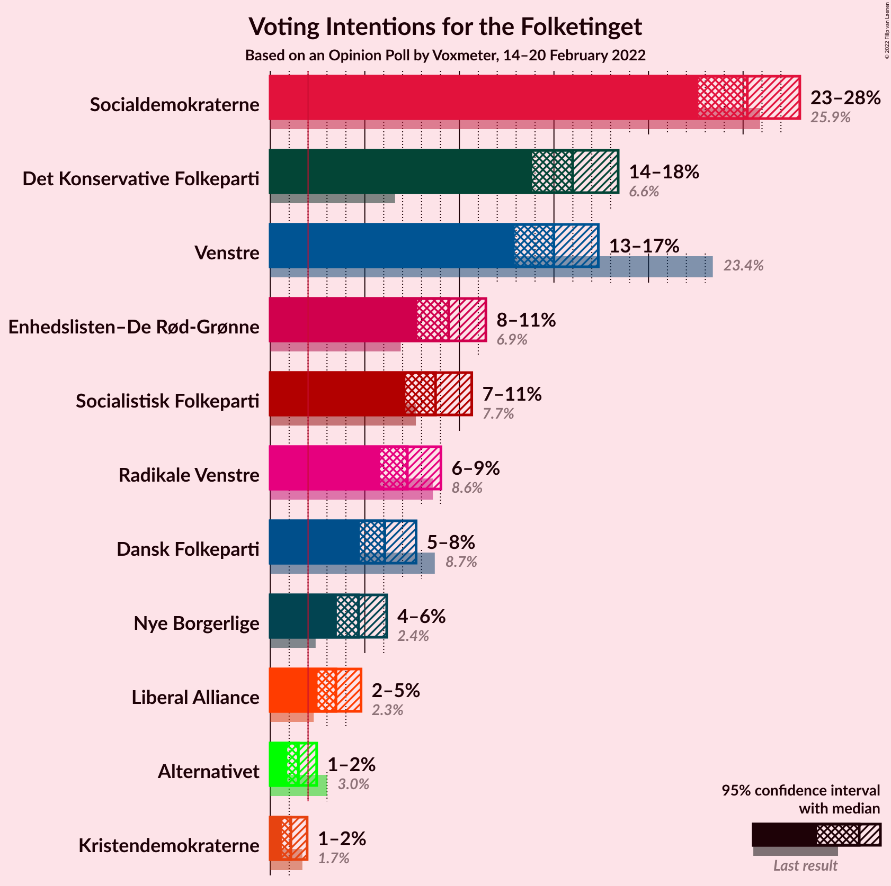

### Confidence Intervals

| Party | Last Result | Poll Result | 80% Confidence Interval | 90% Confidence Interval | 95% Confidence Interval | 99% Confidence Interval |
|:-----:|:-----------:|:-----------:|:-----------------------:|:-----------------------:|:-----------------------:|:-----------------------:|
| Socialdemokraterne | 25.9% | 25.2% | 23.5–27.0% |23.0–27.6% |22.6–28.0% |21.8–28.9% |
| Det Konservative Folkeparti | 6.6% | 16.0% | 14.6–17.6% |14.2–18.0% |13.9–18.4% |13.2–19.2% |
| Venstre | 23.4% | 15.0% | 13.6–16.5% |13.2–17.0% |12.9–17.3% |12.3–18.1% |
| Enhedslisten–De Rød-Grønne | 6.9% | 9.4% | 8.3–10.7% |8.0–11.1% |7.8–11.4% |7.3–12.0% |
| Socialistisk Folkeparti | 7.7% | 8.7% | 7.7–10.0% |7.4–10.3% |7.1–10.7% |6.7–11.3% |
| Radikale Venstre | 8.6% | 7.2% | 6.3–8.4% |6.0–8.7% |5.8–9.0% |5.4–9.6% |
| Dansk Folkeparti | 8.7% | 6.1% | 5.2–7.1% |4.9–7.4% |4.7–7.7% |4.4–8.3% |
| Nye Borgerlige | 2.4% | 4.7% | 3.9–5.6% |3.7–5.9% |3.5–6.2% |3.2–6.7% |
| Liberal Alliance | 2.3% | 3.5% | 2.8–4.3% |2.7–4.6% |2.5–4.8% |2.2–5.2% |
| Alternativet | 3.0% | 1.5% | 1.1–2.1% |1.0–2.3% |0.9–2.5% |0.7–2.8% |
| Kristendemokraterne | 1.7% | 1.1% | 0.8–1.6% |0.7–1.8% |0.6–2.0% |0.5–2.3% |

*Note:* The poll result column reflects the actual value used in the calculations. Published results may vary slightly, and in addition be rounded to fewer digits.

## Seats

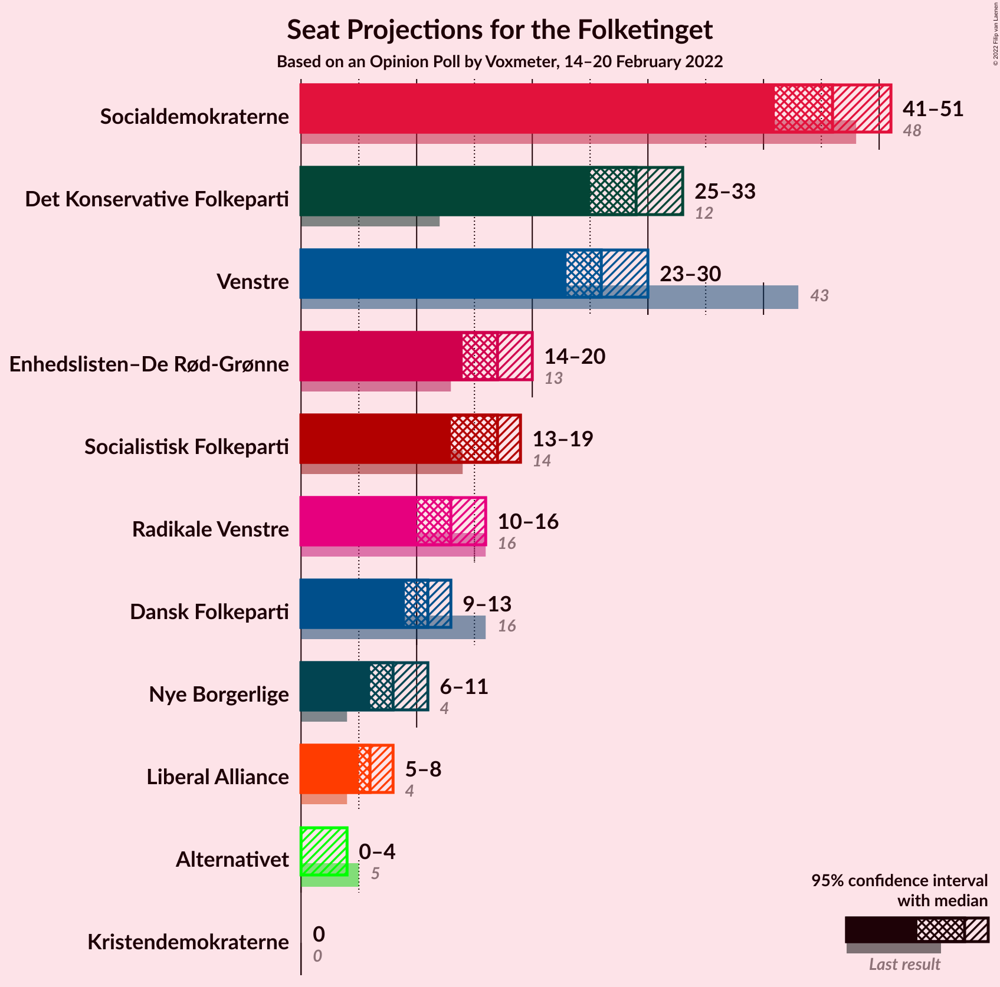

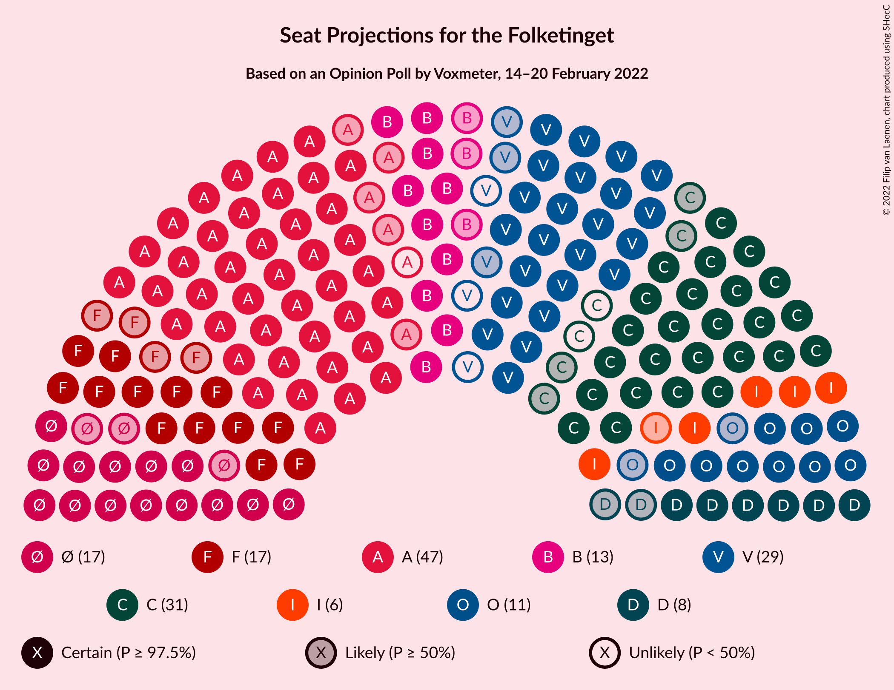

### Confidence Intervals

| Party | Last Result | Median | 80% Confidence Interval | 90% Confidence Interval | 95% Confidence Interval | 99% Confidence Interval |
|:-----:|:-----------:|:------:|:-----------------------:|:-----------------------:|:-----------------------:|:-----------------------:|
| <a href="#socialdemokraterne">Socialdemokraterne</a> | 48 | 46 | 42–50 |42–51 |41–51 |40–51 |
| <a href="#det-konservative-folkeparti">Det Konservative Folkeparti</a> | 12 | 29 | 25–31 |25–32 |25–33 |24–34 |
| <a href="#venstre">Venstre</a> | 43 | 26 | 24–29 |24–29 |23–30 |23–32 |
| <a href="#enhedslisten–de-rød-grønne">Enhedslisten–De Rød-Grønne</a> | 13 | 17 | 15–19 |15–20 |14–20 |13–22 |
| <a href="#socialistisk-folkeparti">Socialistisk Folkeparti</a> | 14 | 17 | 15–18 |14–18 |13–19 |12–20 |
| <a href="#radikale-venstre">Radikale Venstre</a> | 16 | 13 | 11–14 |11–15 |10–16 |10–18 |
| <a href="#dansk-folkeparti">Dansk Folkeparti</a> | 16 | 11 | 10–13 |9–13 |9–13 |8–14 |
| <a href="#nye-borgerlige">Nye Borgerlige</a> | 4 | 8 | 7–10 |6–10 |6–11 |6–12 |
| <a href="#liberal-alliance">Liberal Alliance</a> | 4 | 6 | 5–7 |5–8 |5–8 |4–9 |
| <a href="#alternativet">Alternativet</a> | 5 | 0 | 0 |0–4 |0–4 |0–5 |
| <a href="#kristendemokraterne">Kristendemokraterne</a> | 0 | 0 | 0 |0 |0 |0–4 |

### Socialdemokraterne

*For a full overview of the results for this party, see the [Socialdemokraterne](party-socialdemokraterne.html) page.*

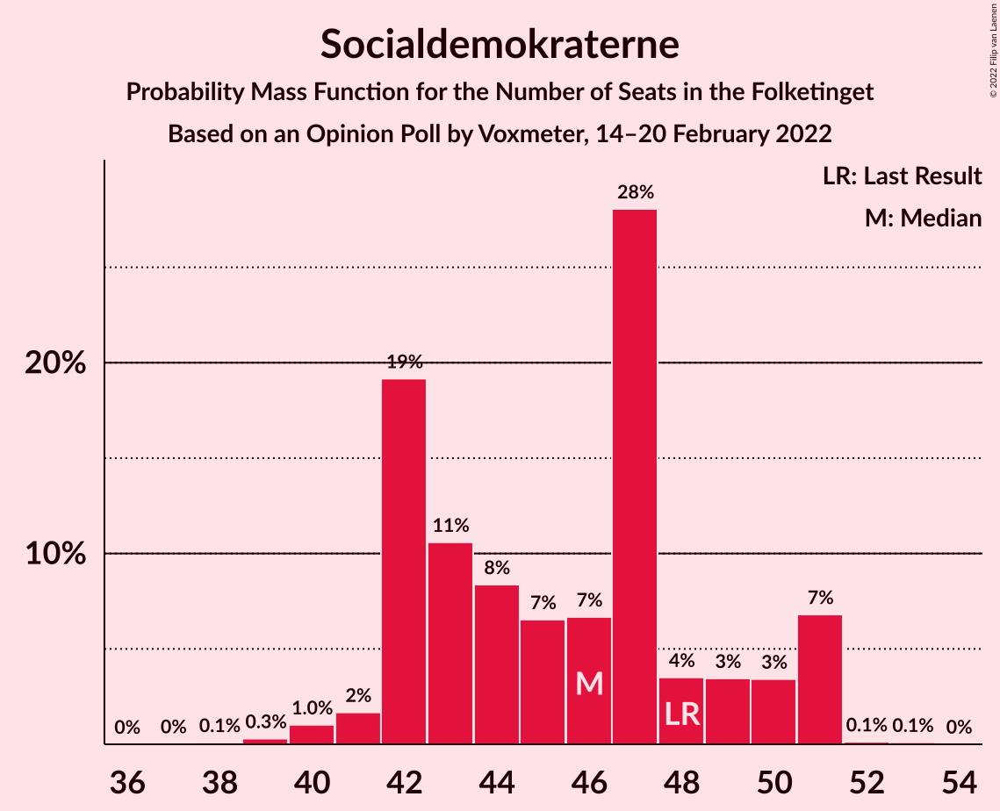

| Number of Seats | Probability | Accumulated | Special Marks |
|:---------------:|:-----------:|:-----------:|:-------------:|
| 38 | 0.1% | 100% |  |
| 39 | 0.3% | 99.9% |  |
| 40 | 1.0% | 99.6% |  |
| 41 | 2% | 98.5% |  |
| 42 | 19% | 97% |  |
| 43 | 11% | 78% |  |
| 44 | 8% | 67% |  |
| 45 | 7% | 59% |  |
| 46 | 7% | 52% | Median |
| 47 | 28% | 46% |  |
| 48 | 4% | 17% | Last Result |
| 49 | 3% | 14% |  |
| 50 | 3% | 10% |  |
| 51 | 7% | 7% |  |
| 52 | 0.1% | 0.3% |  |
| 53 | 0.1% | 0.1% |  |
| 54 | 0% | 0% |  |

### Det Konservative Folkeparti

*For a full overview of the results for this party, see the [Det Konservative Folkeparti](party-detkonservativefolkeparti.html) page.*

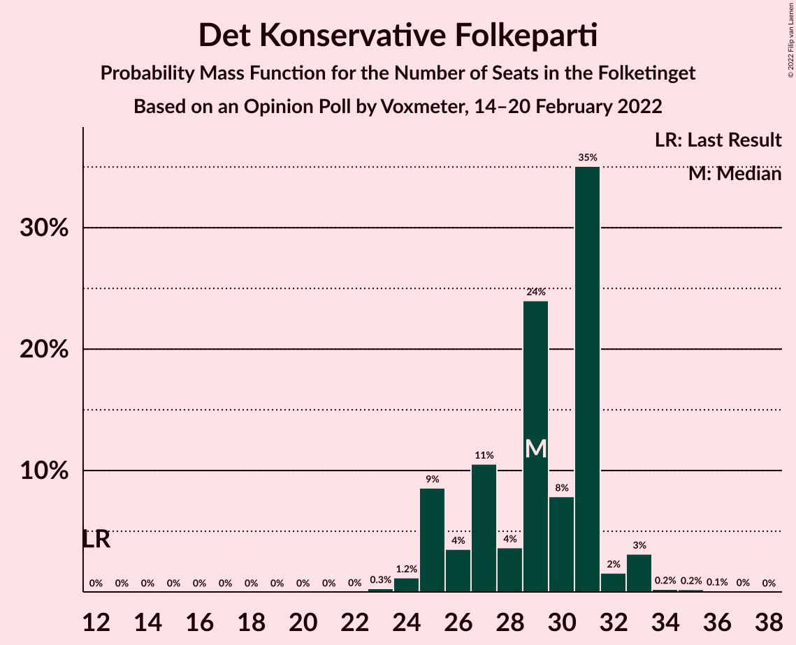

| Number of Seats | Probability | Accumulated | Special Marks |
|:---------------:|:-----------:|:-----------:|:-------------:|
| 12 | 0% | 100% | Last Result |
| 13 | 0% | 100% |  |
| 14 | 0% | 100% |  |
| 15 | 0% | 100% |  |
| 16 | 0% | 100% |  |
| 17 | 0% | 100% |  |
| 18 | 0% | 100% |  |
| 19 | 0% | 100% |  |
| 20 | 0% | 100% |  |
| 21 | 0% | 100% |  |
| 22 | 0% | 100% |  |
| 23 | 0.3% | 100% |  |
| 24 | 1.2% | 99.7% |  |
| 25 | 9% | 98% |  |
| 26 | 4% | 90% |  |
| 27 | 11% | 86% |  |
| 28 | 4% | 76% |  |
| 29 | 24% | 72% | Median |
| 30 | 8% | 48% |  |
| 31 | 35% | 40% |  |
| 32 | 2% | 5% |  |
| 33 | 3% | 4% |  |
| 34 | 0.2% | 0.6% |  |
| 35 | 0.2% | 0.3% |  |
| 36 | 0.1% | 0.1% |  |
| 37 | 0% | 0% |  |

### Venstre

*For a full overview of the results for this party, see the [Venstre](party-venstre.html) page.*

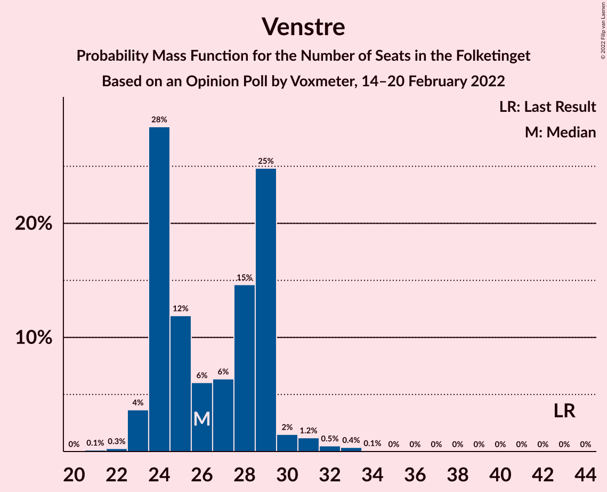

| Number of Seats | Probability | Accumulated | Special Marks |
|:---------------:|:-----------:|:-----------:|:-------------:|
| 21 | 0.1% | 100% |  |
| 22 | 0.3% | 99.9% |  |
| 23 | 4% | 99.6% |  |
| 24 | 28% | 96% |  |
| 25 | 12% | 67% |  |
| 26 | 6% | 56% | Median |
| 27 | 6% | 50% |  |
| 28 | 15% | 43% |  |
| 29 | 25% | 29% |  |
| 30 | 2% | 4% |  |
| 31 | 1.2% | 2% |  |
| 32 | 0.5% | 1.0% |  |
| 33 | 0.4% | 0.5% |  |
| 34 | 0.1% | 0.1% |  |
| 35 | 0% | 0% |  |
| 36 | 0% | 0% |  |
| 37 | 0% | 0% |  |
| 38 | 0% | 0% |  |
| 39 | 0% | 0% |  |
| 40 | 0% | 0% |  |
| 41 | 0% | 0% |  |
| 42 | 0% | 0% |  |
| 43 | 0% | 0% | Last Result |

### Enhedslisten–De Rød-Grønne

*For a full overview of the results for this party, see the [Enhedslisten–De Rød-Grønne](party-enhedslisten–derød-grønne.html) page.*

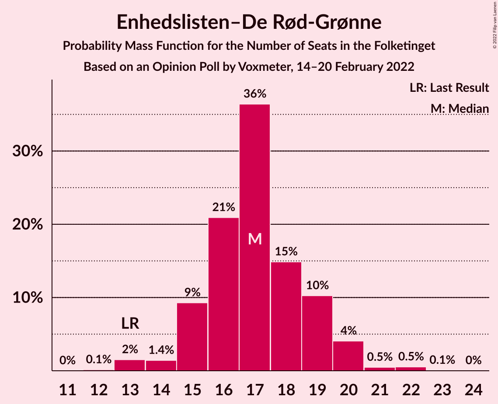

| Number of Seats | Probability | Accumulated | Special Marks |
|:---------------:|:-----------:|:-----------:|:-------------:|
| 12 | 0.1% | 100% |  |
| 13 | 2% | 99.9% | Last Result |
| 14 | 1.4% | 98% |  |
| 15 | 9% | 97% |  |
| 16 | 21% | 88% |  |
| 17 | 36% | 67% | Median |
| 18 | 15% | 30% |  |
| 19 | 10% | 15% |  |
| 20 | 4% | 5% |  |
| 21 | 0.5% | 1.1% |  |
| 22 | 0.5% | 0.6% |  |
| 23 | 0.1% | 0.1% |  |
| 24 | 0% | 0% |  |

### Socialistisk Folkeparti

*For a full overview of the results for this party, see the [Socialistisk Folkeparti](party-socialistiskfolkeparti.html) page.*

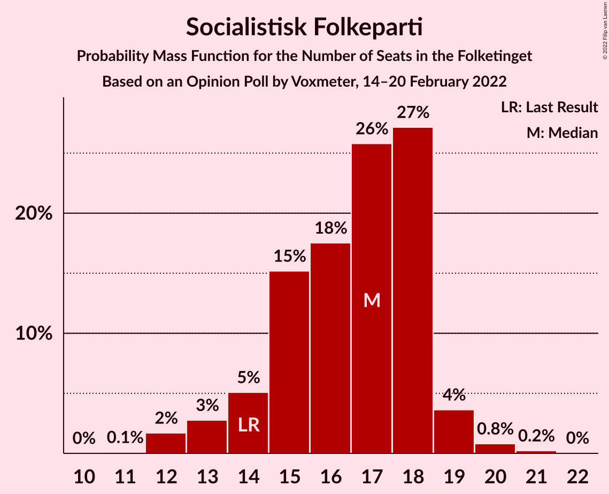

| Number of Seats | Probability | Accumulated | Special Marks |
|:---------------:|:-----------:|:-----------:|:-------------:|
| 11 | 0.1% | 100% |  |
| 12 | 2% | 99.9% |  |
| 13 | 3% | 98% |  |
| 14 | 5% | 95% | Last Result |
| 15 | 15% | 90% |  |
| 16 | 18% | 75% |  |
| 17 | 26% | 58% | Median |
| 18 | 27% | 32% |  |
| 19 | 4% | 5% |  |
| 20 | 0.8% | 1.1% |  |
| 21 | 0.2% | 0.3% |  |
| 22 | 0% | 0% |  |

### Radikale Venstre

*For a full overview of the results for this party, see the [Radikale Venstre](party-radikalevenstre.html) page.*

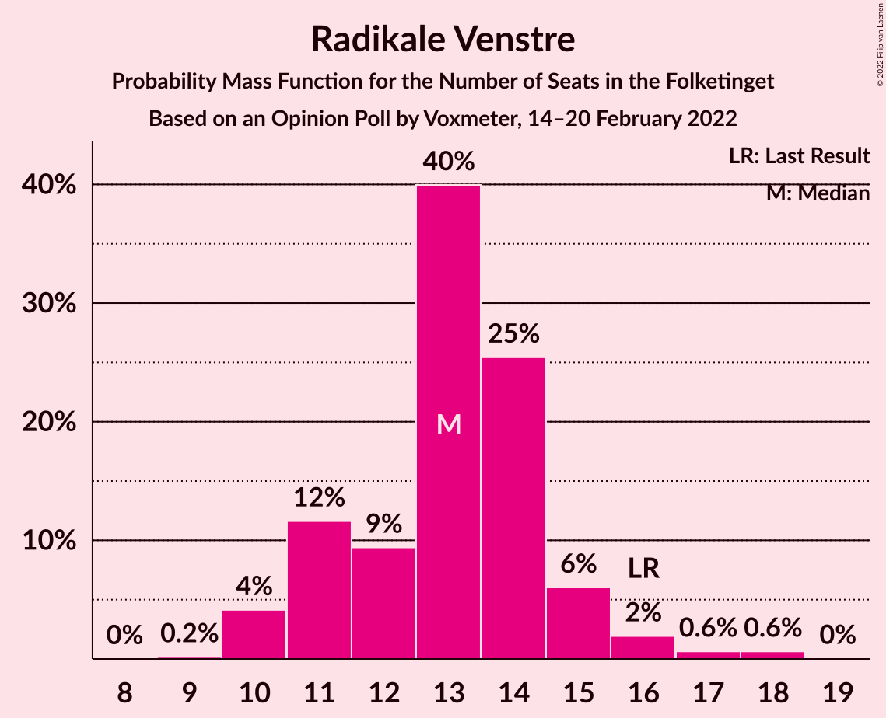

| Number of Seats | Probability | Accumulated | Special Marks |
|:---------------:|:-----------:|:-----------:|:-------------:|
| 9 | 0.2% | 100% |  |
| 10 | 4% | 99.8% |  |
| 11 | 12% | 96% |  |
| 12 | 9% | 84% |  |
| 13 | 40% | 75% | Median |
| 14 | 25% | 35% |  |
| 15 | 6% | 9% |  |
| 16 | 2% | 3% | Last Result |
| 17 | 0.6% | 1.3% |  |
| 18 | 0.6% | 0.7% |  |
| 19 | 0% | 0% |  |

### Dansk Folkeparti

*For a full overview of the results for this party, see the [Dansk Folkeparti](party-danskfolkeparti.html) page.*

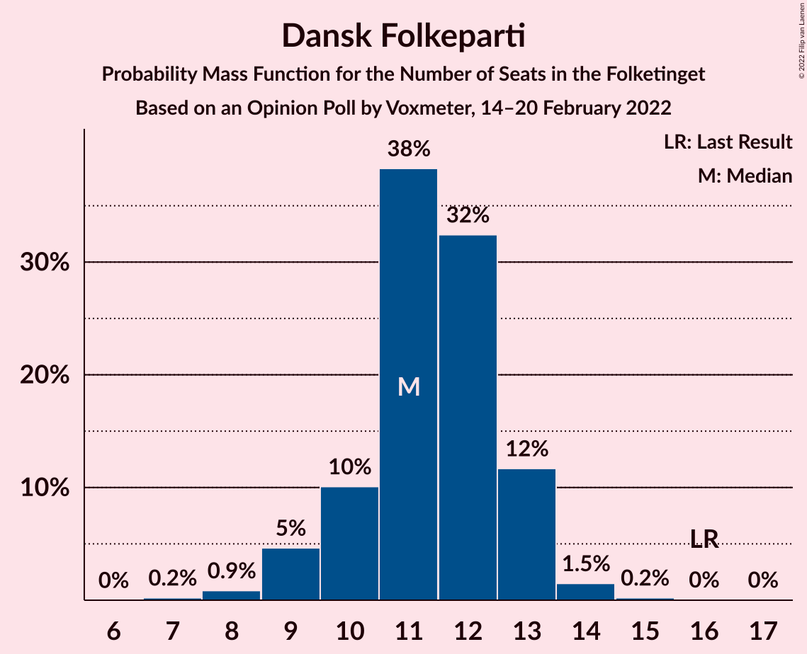

| Number of Seats | Probability | Accumulated | Special Marks |
|:---------------:|:-----------:|:-----------:|:-------------:|
| 7 | 0.2% | 100% |  |
| 8 | 0.9% | 99.8% |  |
| 9 | 5% | 98.9% |  |
| 10 | 10% | 94% |  |
| 11 | 38% | 84% | Median |
| 12 | 32% | 46% |  |
| 13 | 12% | 13% |  |
| 14 | 1.5% | 2% |  |
| 15 | 0.2% | 0.3% |  |
| 16 | 0% | 0.1% | Last Result |
| 17 | 0% | 0% |  |

### Nye Borgerlige

*For a full overview of the results for this party, see the [Nye Borgerlige](party-nyeborgerlige.html) page.*

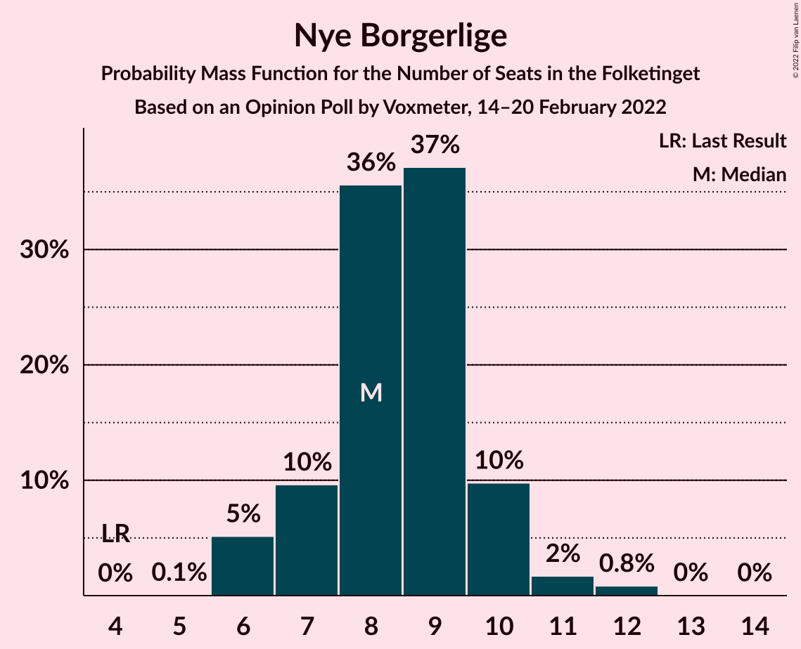

| Number of Seats | Probability | Accumulated | Special Marks |
|:---------------:|:-----------:|:-----------:|:-------------:|
| 4 | 0% | 100% | Last Result |
| 5 | 0.1% | 100% |  |
| 6 | 5% | 99.9% |  |
| 7 | 10% | 95% |  |
| 8 | 36% | 85% | Median |
| 9 | 37% | 50% |  |
| 10 | 10% | 12% |  |
| 11 | 2% | 3% |  |
| 12 | 0.8% | 0.9% |  |
| 13 | 0% | 0.1% |  |
| 14 | 0% | 0% |  |

### Liberal Alliance

*For a full overview of the results for this party, see the [Liberal Alliance](party-liberalalliance.html) page.*

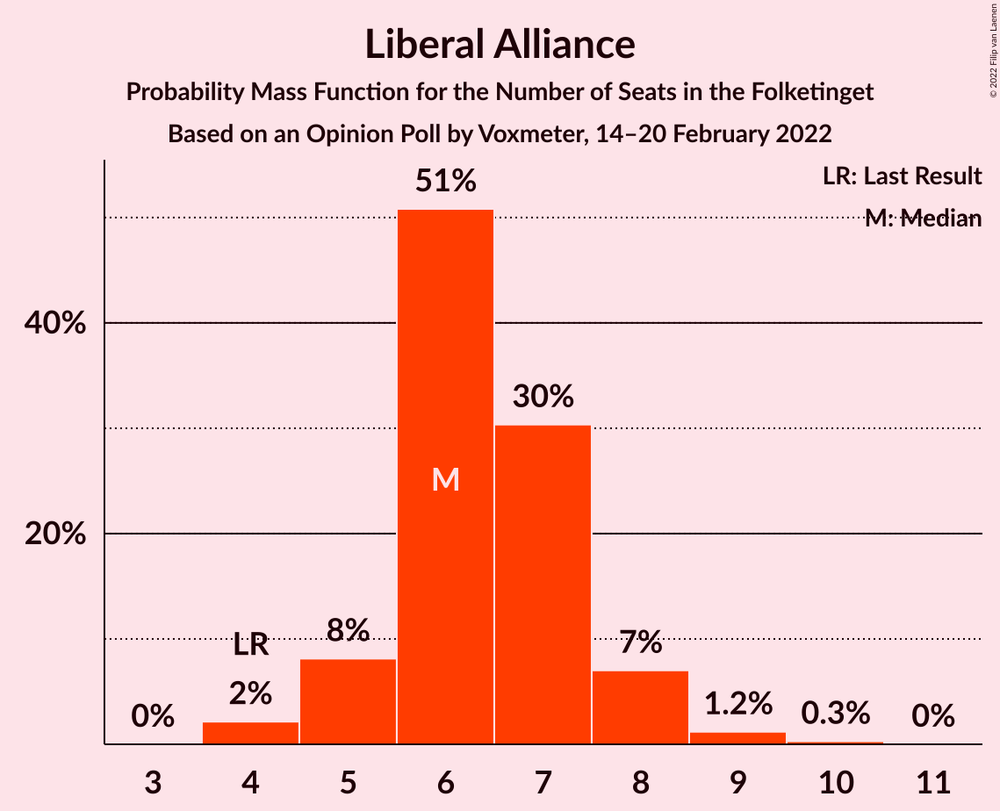

| Number of Seats | Probability | Accumulated | Special Marks |
|:---------------:|:-----------:|:-----------:|:-------------:|
| 4 | 2% | 100% | Last Result |
| 5 | 8% | 98% |  |
| 6 | 51% | 90% | Median |
| 7 | 30% | 39% |  |
| 8 | 7% | 9% |  |
| 9 | 1.2% | 1.5% |  |
| 10 | 0.3% | 0.3% |  |
| 11 | 0% | 0% |  |

### Alternativet

*For a full overview of the results for this party, see the [Alternativet](party-alternativet.html) page.*

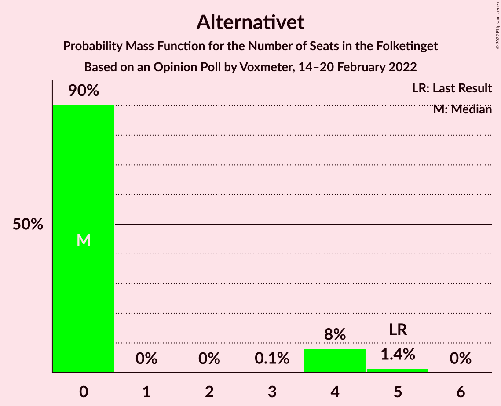

| Number of Seats | Probability | Accumulated | Special Marks |
|:---------------:|:-----------:|:-----------:|:-------------:|
| 0 | 90% | 100% | Median |
| 1 | 0% | 10% |  |
| 2 | 0% | 10% |  |
| 3 | 0.1% | 10% |  |
| 4 | 8% | 10% |  |
| 5 | 1.4% | 1.5% | Last Result |
| 6 | 0% | 0% |  |

### Kristendemokraterne

*For a full overview of the results for this party, see the [Kristendemokraterne](party-kristendemokraterne.html) page.*

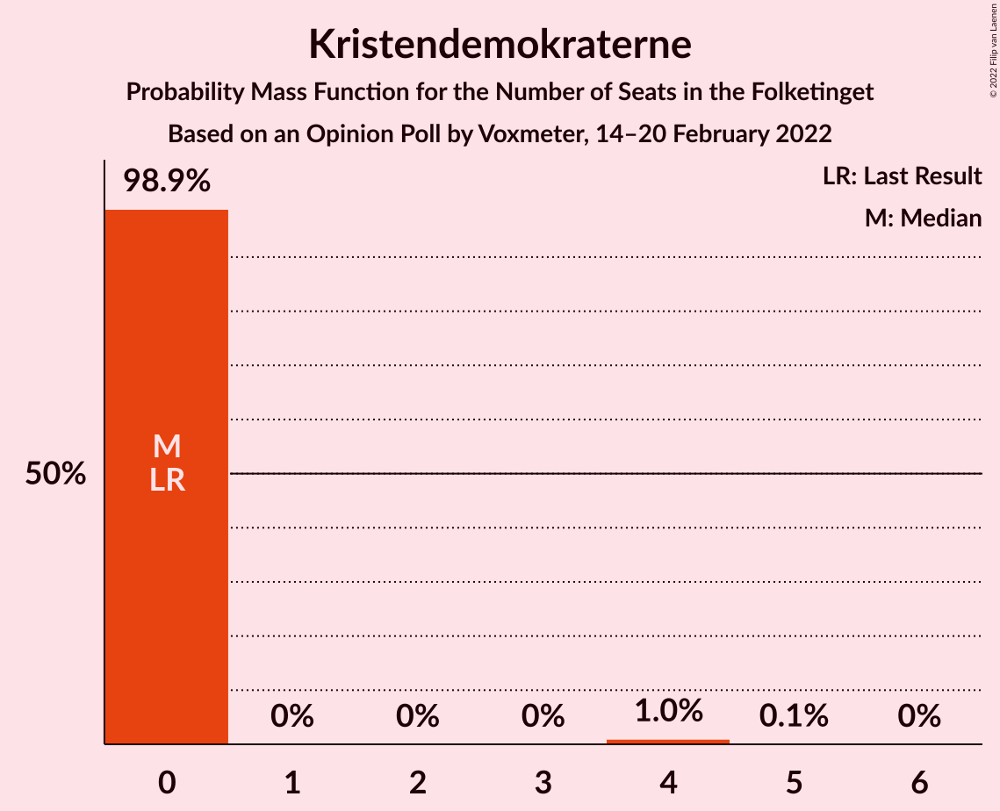

| Number of Seats | Probability | Accumulated | Special Marks |
|:---------------:|:-----------:|:-----------:|:-------------:|
| 0 | 98.9% | 100% | Last Result, Median |
| 1 | 0% | 1.1% |  |
| 2 | 0% | 1.1% |  |
| 3 | 0% | 1.1% |  |
| 4 | 1.0% | 1.1% |  |
| 5 | 0.1% | 0.1% |  |
| 6 | 0% | 0% |  |

## Coalitions

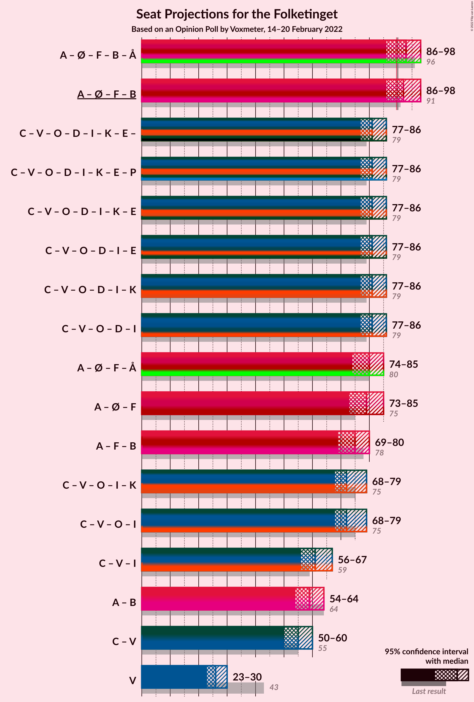

### Confidence Intervals

| Coalition | Last Result | Median | Majority? | 80% Confidence Interval | 90% Confidence Interval | 95% Confidence Interval | 99% Confidence Interval |
|:---------:|:-----------:|:------:|:---------:|:-----------------------:|:-----------------------:|:-----------------------:|:-----------------------:|
| Socialdemokraterne – Enhedslisten–De Rød-Grønne – Socialistisk Folkeparti – Radikale Venstre – Alternativet | 96 | 93 | 73% | 89–97 | 88–98 | 86–98 | 84–99 |
| Socialdemokraterne – Enhedslisten–De Rød-Grønne – Socialistisk Folkeparti – Radikale Venstre | 91 | 92 | 66% | 88–96 | 87–98 | 86–98 | 84–98 |
| Det Konservative Folkeparti – Venstre – Dansk Folkeparti – Nye Borgerlige – Liberal Alliance – Kristendemokraterne | 79 | 81 | 0.5% | 77–86 | 77–86 | 77–86 | 74–90 |
| Det Konservative Folkeparti – Venstre – Dansk Folkeparti – Nye Borgerlige – Liberal Alliance | 79 | 81 | 0.4% | 77–86 | 77–86 | 77–86 | 74–89 |
| Socialdemokraterne – Enhedslisten–De Rød-Grønne – Socialistisk Folkeparti – Alternativet | 80 | 80 | 0% | 75–83 | 75–85 | 74–85 | 72–86 |
| Socialdemokraterne – Enhedslisten–De Rød-Grønne – Socialistisk Folkeparti | 75 | 79 | 0% | 75–82 | 74–85 | 73–85 | 71–86 |
| Socialdemokraterne – Socialistisk Folkeparti – Radikale Venstre | 78 | 75 | 0% | 71–78 | 69–80 | 69–80 | 67–81 |
| Det Konservative Folkeparti – Venstre – Dansk Folkeparti – Liberal Alliance – Kristendemokraterne | 75 | 72 | 0% | 69–77 | 68–78 | 68–79 | 67–81 |
| Det Konservative Folkeparti – Venstre – Dansk Folkeparti – Liberal Alliance | 75 | 72 | 0% | 69–77 | 68–78 | 68–79 | 67–80 |
| Det Konservative Folkeparti – Venstre – Liberal Alliance | 59 | 61 | 0% | 58–65 | 56–67 | 56–67 | 56–69 |
| Socialdemokraterne – Radikale Venstre | 64 | 59 | 0% | 55–62 | 54–64 | 54–64 | 52–66 |
| Det Konservative Folkeparti – Venstre | 55 | 55 | 0% | 52–59 | 50–59 | 50–60 | 50–62 |
| Venstre | 43 | 26 | 0% | 24–29 | 24–29 | 23–30 | 23–32 |

### Socialdemokraterne – Enhedslisten–De Rød-Grønne – Socialistisk Folkeparti – Radikale Venstre – Alternativet

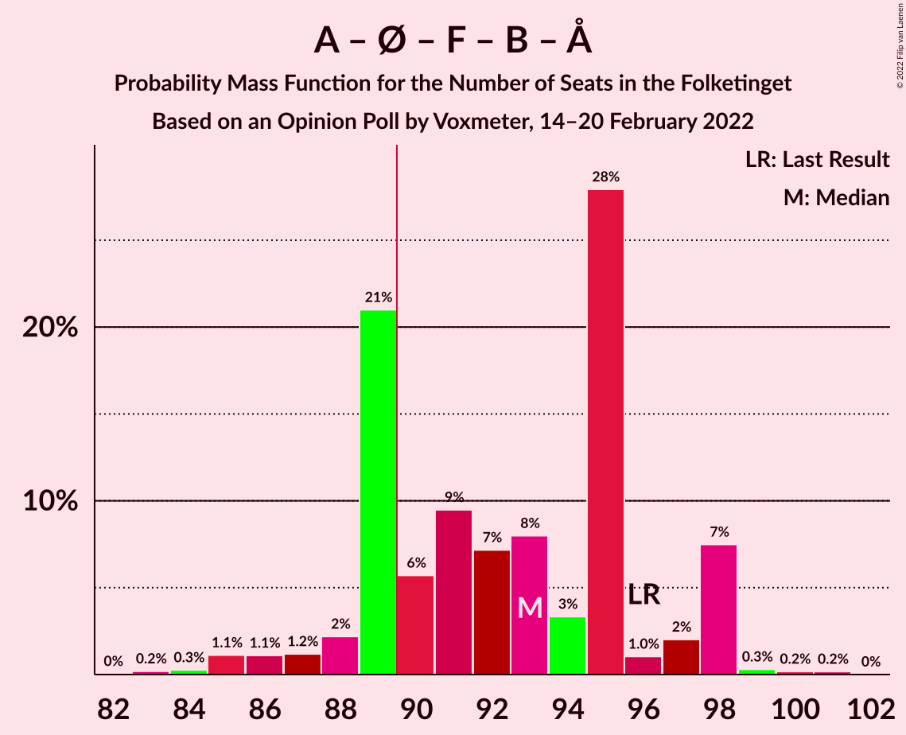

| Number of Seats | Probability | Accumulated | Special Marks |
|:---------------:|:-----------:|:-----------:|:-------------:|
| 82 | 0% | 100% |  |
| 83 | 0.2% | 99.9% |  |
| 84 | 0.3% | 99.7% |  |
| 85 | 1.1% | 99.5% |  |
| 86 | 1.1% | 98% |  |
| 87 | 1.2% | 97% |  |
| 88 | 2% | 96% |  |
| 89 | 21% | 94% |  |
| 90 | 6% | 73% | Majority |
| 91 | 9% | 67% |  |
| 92 | 7% | 58% |  |
| 93 | 8% | 51% | Median |
| 94 | 3% | 43% |  |
| 95 | 28% | 39% |  |
| 96 | 1.0% | 11% | Last Result |
| 97 | 2% | 10% |  |
| 98 | 7% | 8% |  |
| 99 | 0.3% | 0.7% |  |
| 100 | 0.2% | 0.4% |  |
| 101 | 0.2% | 0.2% |  |
| 102 | 0% | 0% |  |

### Socialdemokraterne – Enhedslisten–De Rød-Grønne – Socialistisk Folkeparti – Radikale Venstre

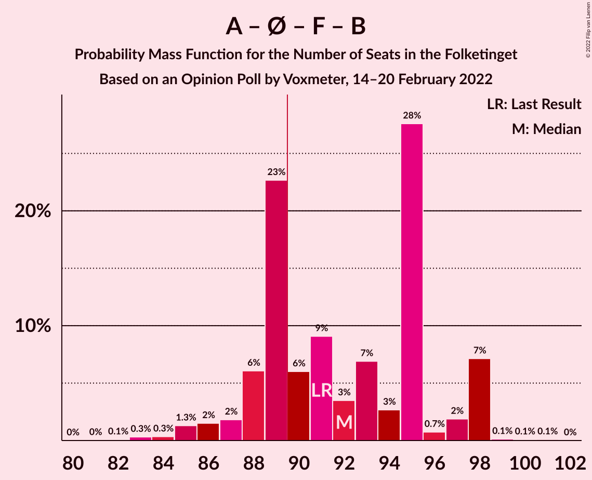

| Number of Seats | Probability | Accumulated | Special Marks |
|:---------------:|:-----------:|:-----------:|:-------------:|
| 82 | 0.1% | 100% |  |
| 83 | 0.3% | 99.9% |  |
| 84 | 0.3% | 99.6% |  |
| 85 | 1.3% | 99.2% |  |
| 86 | 2% | 98% |  |
| 87 | 2% | 96% |  |
| 88 | 6% | 95% |  |
| 89 | 23% | 89% |  |
| 90 | 6% | 66% | Majority |
| 91 | 9% | 60% | Last Result |
| 92 | 3% | 51% |  |
| 93 | 7% | 47% | Median |
| 94 | 3% | 40% |  |
| 95 | 28% | 38% |  |
| 96 | 0.7% | 10% |  |
| 97 | 2% | 9% |  |
| 98 | 7% | 7% |  |
| 99 | 0.1% | 0.3% |  |
| 100 | 0.1% | 0.2% |  |
| 101 | 0.1% | 0.1% |  |
| 102 | 0% | 0% |  |

### Det Konservative Folkeparti – Venstre – Dansk Folkeparti – Nye Borgerlige – Liberal Alliance – Kristendemokraterne

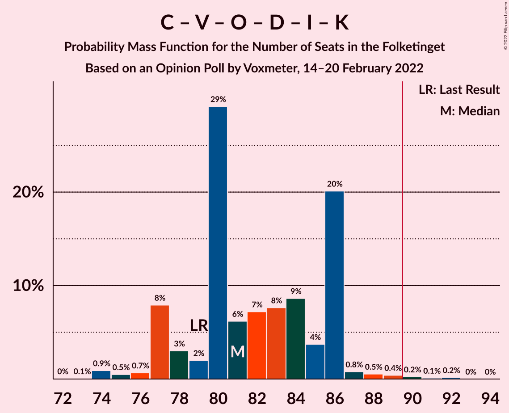

| Number of Seats | Probability | Accumulated | Special Marks |
|:---------------:|:-----------:|:-----------:|:-------------:|
| 72 | 0% | 100% |  |
| 73 | 0.1% | 99.9% |  |
| 74 | 0.9% | 99.9% |  |
| 75 | 0.5% | 99.0% |  |
| 76 | 0.7% | 98% |  |
| 77 | 8% | 98% |  |
| 78 | 3% | 90% |  |
| 79 | 2% | 87% | Last Result |
| 80 | 29% | 85% | Median |
| 81 | 6% | 56% |  |
| 82 | 7% | 50% |  |
| 83 | 8% | 42% |  |
| 84 | 9% | 35% |  |
| 85 | 4% | 26% |  |
| 86 | 20% | 22% |  |
| 87 | 0.8% | 2% |  |
| 88 | 0.5% | 1.5% |  |
| 89 | 0.4% | 0.9% |  |
| 90 | 0.2% | 0.5% | Majority |
| 91 | 0.1% | 0.3% |  |
| 92 | 0.2% | 0.2% |  |
| 93 | 0% | 0% |  |

### Det Konservative Folkeparti – Venstre – Dansk Folkeparti – Nye Borgerlige – Liberal Alliance

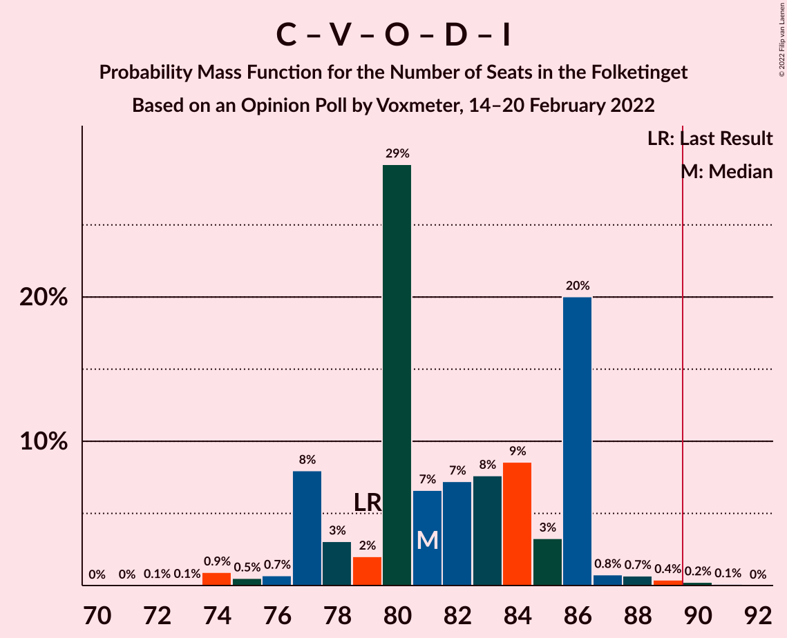

| Number of Seats | Probability | Accumulated | Special Marks |
|:---------------:|:-----------:|:-----------:|:-------------:|
| 72 | 0.1% | 100% |  |
| 73 | 0.1% | 99.9% |  |
| 74 | 0.9% | 99.9% |  |
| 75 | 0.5% | 99.0% |  |
| 76 | 0.7% | 98% |  |
| 77 | 8% | 98% |  |
| 78 | 3% | 90% |  |
| 79 | 2% | 87% | Last Result |
| 80 | 29% | 85% | Median |
| 81 | 7% | 56% |  |
| 82 | 7% | 49% |  |
| 83 | 8% | 42% |  |
| 84 | 9% | 34% |  |
| 85 | 3% | 25% |  |
| 86 | 20% | 22% |  |
| 87 | 0.8% | 2% |  |
| 88 | 0.7% | 1.4% |  |
| 89 | 0.4% | 0.8% |  |
| 90 | 0.2% | 0.4% | Majority |
| 91 | 0.1% | 0.1% |  |
| 92 | 0% | 0% |  |

### Socialdemokraterne – Enhedslisten–De Rød-Grønne – Socialistisk Folkeparti – Alternativet

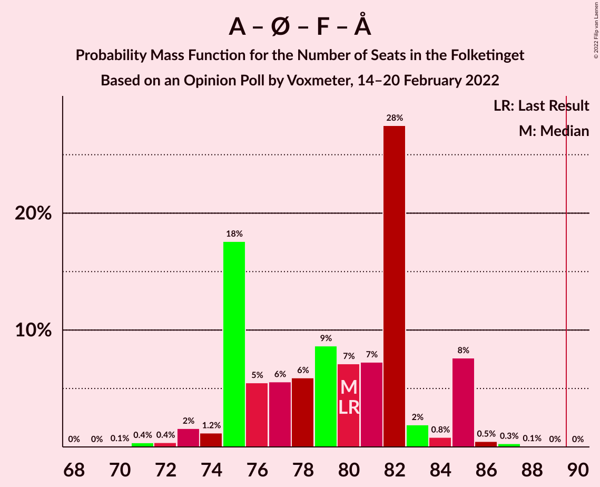

| Number of Seats | Probability | Accumulated | Special Marks |
|:---------------:|:-----------:|:-----------:|:-------------:|
| 70 | 0.1% | 100% |  |
| 71 | 0.4% | 99.9% |  |
| 72 | 0.4% | 99.5% |  |
| 73 | 2% | 99.1% |  |
| 74 | 1.2% | 98% |  |
| 75 | 18% | 96% |  |
| 76 | 5% | 79% |  |
| 77 | 6% | 73% |  |
| 78 | 6% | 68% |  |
| 79 | 9% | 62% |  |
| 80 | 7% | 53% | Last Result, Median |
| 81 | 7% | 46% |  |
| 82 | 28% | 39% |  |
| 83 | 2% | 11% |  |
| 84 | 0.8% | 9% |  |
| 85 | 8% | 9% |  |
| 86 | 0.5% | 0.9% |  |
| 87 | 0.3% | 0.4% |  |
| 88 | 0.1% | 0.1% |  |
| 89 | 0% | 0% |  |

### Socialdemokraterne – Enhedslisten–De Rød-Grønne – Socialistisk Folkeparti

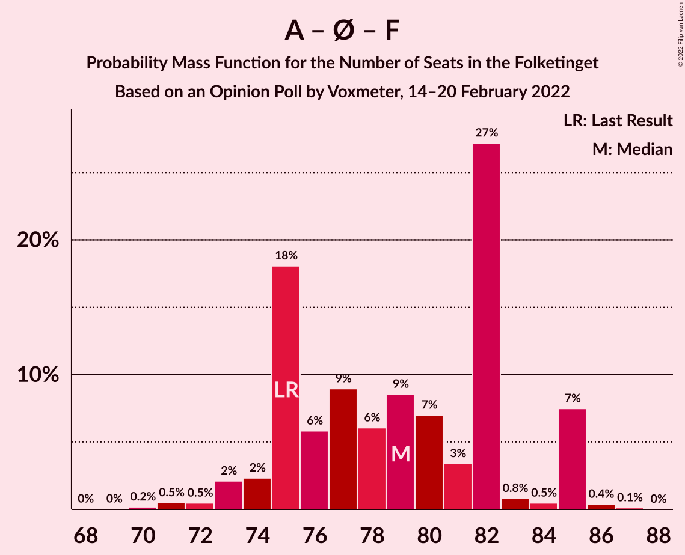

| Number of Seats | Probability | Accumulated | Special Marks |
|:---------------:|:-----------:|:-----------:|:-------------:|
| 69 | 0% | 100% |  |
| 70 | 0.2% | 99.9% |  |
| 71 | 0.5% | 99.7% |  |
| 72 | 0.5% | 99.2% |  |
| 73 | 2% | 98.8% |  |
| 74 | 2% | 97% |  |
| 75 | 18% | 94% | Last Result |
| 76 | 6% | 76% |  |
| 77 | 9% | 70% |  |
| 78 | 6% | 61% |  |
| 79 | 9% | 55% |  |
| 80 | 7% | 47% | Median |
| 81 | 3% | 40% |  |
| 82 | 27% | 37% |  |
| 83 | 0.8% | 9% |  |
| 84 | 0.5% | 8% |  |
| 85 | 7% | 8% |  |
| 86 | 0.4% | 0.5% |  |
| 87 | 0.1% | 0.1% |  |
| 88 | 0% | 0% |  |

### Socialdemokraterne – Socialistisk Folkeparti – Radikale Venstre

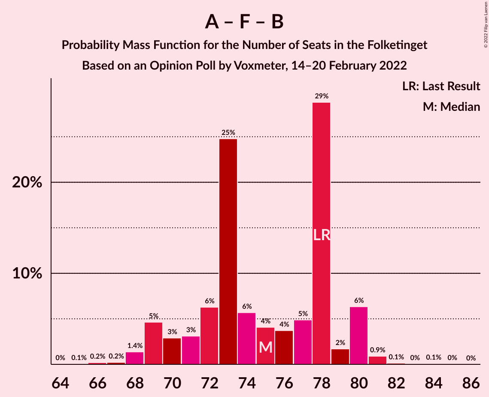

| Number of Seats | Probability | Accumulated | Special Marks |
|:---------------:|:-----------:|:-----------:|:-------------:|
| 65 | 0.1% | 100% |  |
| 66 | 0.2% | 99.9% |  |
| 67 | 0.2% | 99.7% |  |
| 68 | 1.4% | 99.5% |  |
| 69 | 5% | 98% |  |
| 70 | 3% | 93% |  |
| 71 | 3% | 91% |  |
| 72 | 6% | 87% |  |
| 73 | 25% | 81% |  |
| 74 | 6% | 56% |  |
| 75 | 4% | 51% |  |
| 76 | 4% | 47% | Median |
| 77 | 5% | 43% |  |
| 78 | 29% | 38% | Last Result |
| 79 | 2% | 9% |  |
| 80 | 6% | 8% |  |
| 81 | 0.9% | 1.2% |  |
| 82 | 0.1% | 0.3% |  |
| 83 | 0% | 0.2% |  |
| 84 | 0.1% | 0.1% |  |
| 85 | 0% | 0.1% |  |
| 86 | 0% | 0% |  |

### Det Konservative Folkeparti – Venstre – Dansk Folkeparti – Liberal Alliance – Kristendemokraterne

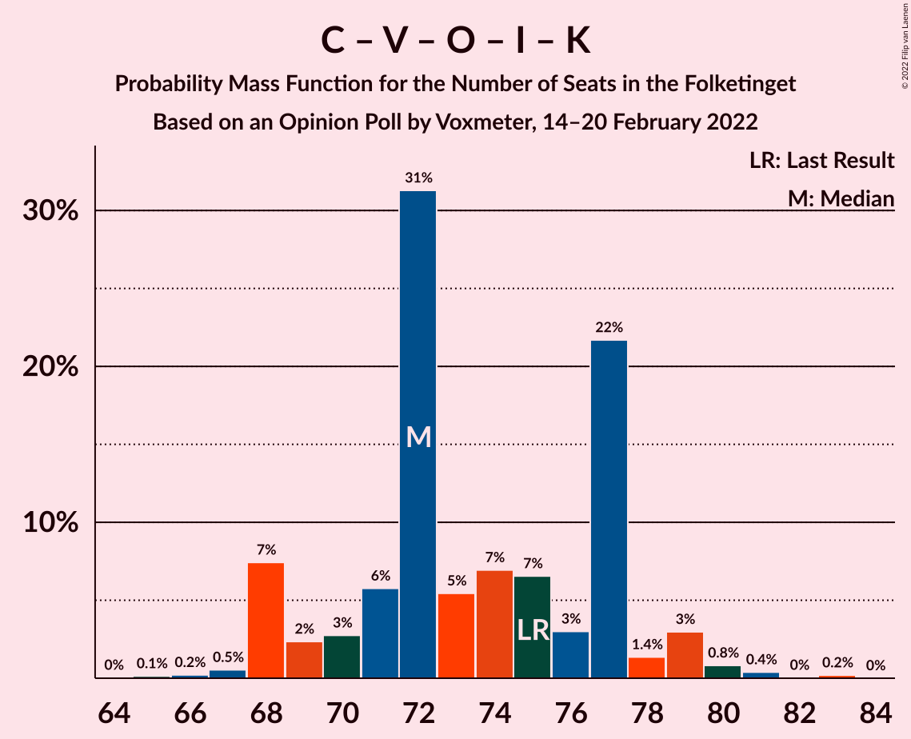

| Number of Seats | Probability | Accumulated | Special Marks |
|:---------------:|:-----------:|:-----------:|:-------------:|
| 64 | 0% | 100% |  |
| 65 | 0.1% | 99.9% |  |
| 66 | 0.2% | 99.8% |  |
| 67 | 0.5% | 99.6% |  |
| 68 | 7% | 99.0% |  |
| 69 | 2% | 92% |  |
| 70 | 3% | 89% |  |
| 71 | 6% | 87% |  |
| 72 | 31% | 81% | Median |
| 73 | 5% | 49% |  |
| 74 | 7% | 44% |  |
| 75 | 7% | 37% | Last Result |
| 76 | 3% | 31% |  |
| 77 | 22% | 28% |  |
| 78 | 1.4% | 6% |  |
| 79 | 3% | 4% |  |
| 80 | 0.8% | 1.5% |  |
| 81 | 0.4% | 0.6% |  |
| 82 | 0% | 0.3% |  |
| 83 | 0.2% | 0.2% |  |
| 84 | 0% | 0% |  |

### Det Konservative Folkeparti – Venstre – Dansk Folkeparti – Liberal Alliance

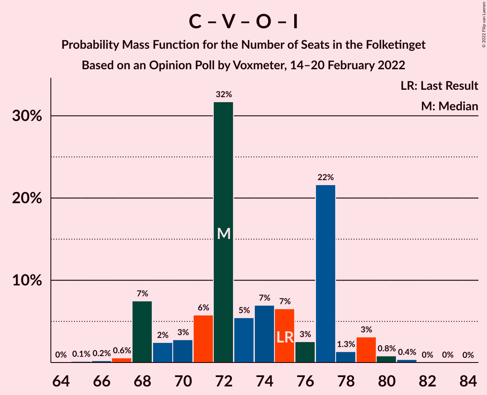

| Number of Seats | Probability | Accumulated | Special Marks |
|:---------------:|:-----------:|:-----------:|:-------------:|
| 64 | 0% | 100% |  |
| 65 | 0.1% | 99.9% |  |
| 66 | 0.2% | 99.8% |  |
| 67 | 0.6% | 99.6% |  |
| 68 | 7% | 99.0% |  |
| 69 | 2% | 92% |  |
| 70 | 3% | 89% |  |
| 71 | 6% | 86% |  |
| 72 | 32% | 81% | Median |
| 73 | 5% | 49% |  |
| 74 | 7% | 43% |  |
| 75 | 7% | 36% | Last Result |
| 76 | 3% | 30% |  |
| 77 | 22% | 27% |  |
| 78 | 1.3% | 6% |  |
| 79 | 3% | 4% |  |
| 80 | 0.8% | 1.3% |  |
| 81 | 0.4% | 0.5% |  |
| 82 | 0% | 0.1% |  |
| 83 | 0% | 0.1% |  |
| 84 | 0% | 0% |  |

### Det Konservative Folkeparti – Venstre – Liberal Alliance

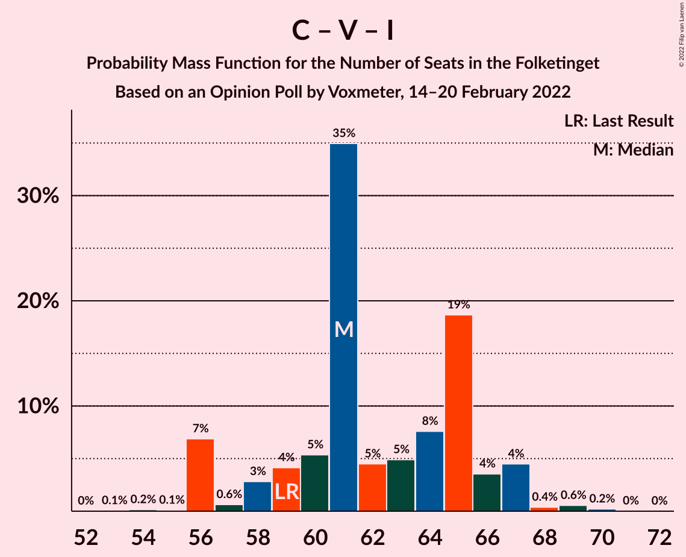

| Number of Seats | Probability | Accumulated | Special Marks |
|:---------------:|:-----------:|:-----------:|:-------------:|
| 53 | 0.1% | 100% |  |
| 54 | 0.2% | 99.9% |  |
| 55 | 0.1% | 99.8% |  |
| 56 | 7% | 99.7% |  |
| 57 | 0.6% | 93% |  |
| 58 | 3% | 92% |  |
| 59 | 4% | 89% | Last Result |
| 60 | 5% | 85% |  |
| 61 | 35% | 80% | Median |
| 62 | 5% | 45% |  |
| 63 | 5% | 40% |  |
| 64 | 8% | 35% |  |
| 65 | 19% | 28% |  |
| 66 | 4% | 9% |  |
| 67 | 4% | 6% |  |
| 68 | 0.4% | 1.2% |  |
| 69 | 0.6% | 0.8% |  |
| 70 | 0.2% | 0.3% |  |
| 71 | 0% | 0% |  |

### Socialdemokraterne – Radikale Venstre

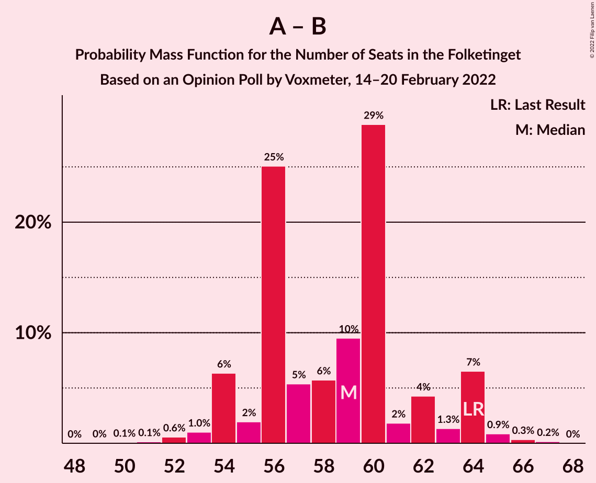

| Number of Seats | Probability | Accumulated | Special Marks |
|:---------------:|:-----------:|:-----------:|:-------------:|
| 50 | 0.1% | 100% |  |
| 51 | 0.1% | 99.9% |  |
| 52 | 0.6% | 99.7% |  |
| 53 | 1.0% | 99.2% |  |
| 54 | 6% | 98% |  |
| 55 | 2% | 92% |  |
| 56 | 25% | 90% |  |
| 57 | 5% | 65% |  |
| 58 | 6% | 59% |  |
| 59 | 10% | 54% | Median |
| 60 | 29% | 44% |  |
| 61 | 2% | 15% |  |
| 62 | 4% | 14% |  |
| 63 | 1.3% | 9% |  |
| 64 | 7% | 8% | Last Result |
| 65 | 0.9% | 1.4% |  |
| 66 | 0.3% | 0.5% |  |
| 67 | 0.2% | 0.2% |  |
| 68 | 0% | 0% |  |

### Det Konservative Folkeparti – Venstre

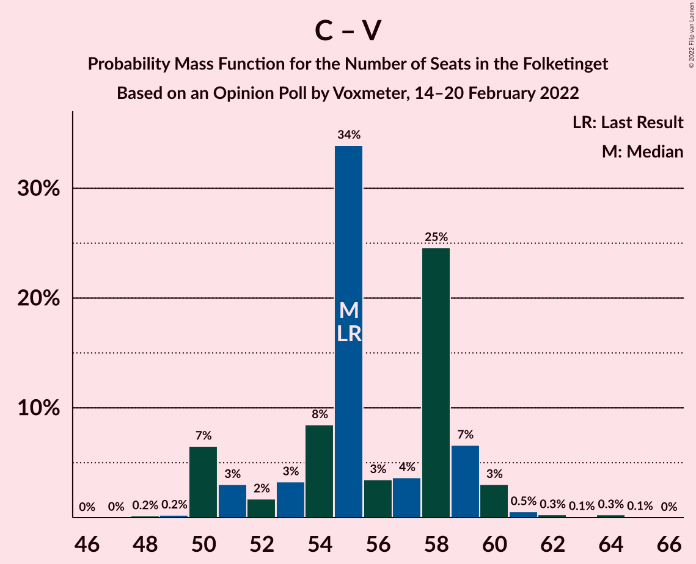

| Number of Seats | Probability | Accumulated | Special Marks |
|:---------------:|:-----------:|:-----------:|:-------------:|
| 48 | 0.2% | 100% |  |
| 49 | 0.2% | 99.8% |  |
| 50 | 7% | 99.6% |  |
| 51 | 3% | 93% |  |
| 52 | 2% | 90% |  |
| 53 | 3% | 88% |  |
| 54 | 8% | 85% |  |
| 55 | 34% | 77% | Last Result, Median |
| 56 | 3% | 43% |  |
| 57 | 4% | 39% |  |
| 58 | 25% | 36% |  |
| 59 | 7% | 11% |  |
| 60 | 3% | 4% |  |
| 61 | 0.5% | 1.3% |  |
| 62 | 0.3% | 0.8% |  |
| 63 | 0.1% | 0.5% |  |
| 64 | 0.3% | 0.4% |  |
| 65 | 0.1% | 0.1% |  |
| 66 | 0% | 0% |  |

### Venstre

| Number of Seats | Probability | Accumulated | Special Marks |
|:---------------:|:-----------:|:-----------:|:-------------:|
| 21 | 0.1% | 100% |  |
| 22 | 0.3% | 99.9% |  |
| 23 | 4% | 99.6% |  |
| 24 | 28% | 96% |  |
| 25 | 12% | 67% |  |
| 26 | 6% | 56% | Median |
| 27 | 6% | 50% |  |
| 28 | 15% | 43% |  |
| 29 | 25% | 29% |  |
| 30 | 2% | 4% |  |
| 31 | 1.2% | 2% |  |
| 32 | 0.5% | 1.0% |  |
| 33 | 0.4% | 0.5% |  |
| 34 | 0.1% | 0.1% |  |
| 35 | 0% | 0% |  |
| 36 | 0% | 0% |  |
| 37 | 0% | 0% |  |
| 38 | 0% | 0% |  |
| 39 | 0% | 0% |  |
| 40 | 0% | 0% |  |
| 41 | 0% | 0% |  |
| 42 | 0% | 0% |  |
| 43 | 0% | 0% | Last Result |

## Technical Information

### Opinion Poll

+ **Polling firm:** Voxmeter
+ **Commissioner(s):** —
+ **Fieldwork period:** 14–20 February 2022

### Calculations

+ **Sample size:** 1007
+ **Simulations done:** 1,048,576
+ **Error estimate:** 2.35%

