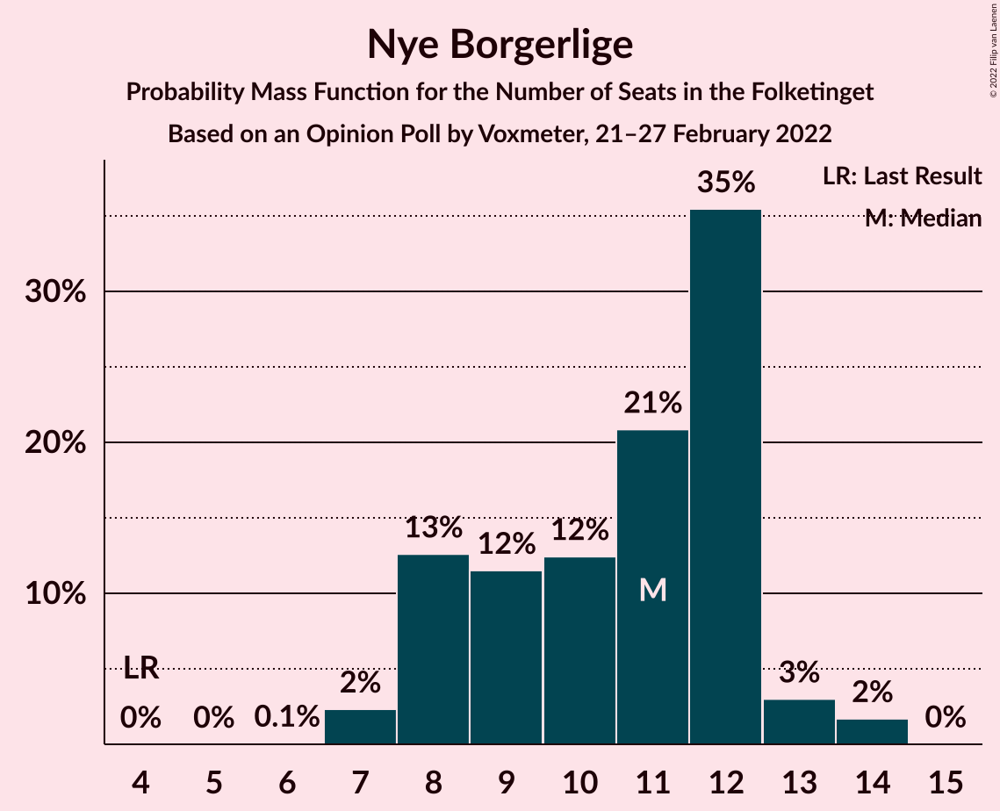

# Opinion Poll by Voxmeter, 21–27 February 2022

<a href="#voting-intentions">Voting Intentions</a> | <a href="#seats">Seats</a> | <a href="#coalitions">Coalitions</a> | <a href="#technical-information">Technical Information</a>

## Voting Intentions

### Confidence Intervals

| Party | Last Result | Poll Result | 80% Confidence Interval | 90% Confidence Interval | 95% Confidence Interval | 99% Confidence Interval |
|:-----:|:-----------:|:-----------:|:-----------------------:|:-----------------------:|:-----------------------:|:-----------------------:|
| Socialdemokraterne | 25.9% | 26.5% | 24.8–28.3% |24.3–28.9% |23.9–29.3% |23.0–30.2% |
| Det Konservative Folkeparti | 6.6% | 16.8% | 15.4–18.4% |15.0–18.9% |14.6–19.3% |14.0–20.1% |
| Venstre | 23.4% | 14.5% | 13.2–16.1% |12.8–16.5% |12.5–16.9% |11.9–17.6% |
| Enhedslisten–De Rød-Grønne | 6.9% | 8.9% | 7.8–10.1% |7.5–10.5% |7.3–10.8% |6.8–11.4% |
| Socialistisk Folkeparti | 7.7% | 8.2% | 7.1–9.4% |6.9–9.7% |6.6–10.0% |6.2–10.6% |
| Radikale Venstre | 8.6% | 7.7% | 6.7–8.9% |6.4–9.2% |6.2–9.5% |5.7–10.1% |
| Nye Borgerlige | 2.4% | 5.6% | 4.7–6.6% |4.5–6.9% |4.3–7.2% |3.9–7.7% |
| Dansk Folkeparti | 8.7% | 4.3% | 3.6–5.2% |3.4–5.5% |3.2–5.7% |2.9–6.2% |
| Liberal Alliance | 2.3% | 3.1% | 2.5–3.9% |2.3–4.1% |2.2–4.4% |1.9–4.8% |
| Alternativet | 3.0% | 1.3% | 0.9–1.9% |0.8–2.1% |0.8–2.2% |0.6–2.5% |
| Kristendemokraterne | 1.7% | 0.9% | 0.6–1.4% |0.5–1.6% |0.5–1.7% |0.4–2.0% |
| Frie Grønne | 0.0% | 0.3% | 0.2–0.7% |0.1–0.8% |0.1–0.9% |0.1–1.1% |

*Note:* The poll result column reflects the actual value used in the calculations. Published results may vary slightly, and in addition be rounded to fewer digits.

## Seats

### Confidence Intervals

| Party | Last Result | Median | 80% Confidence Interval | 90% Confidence Interval | 95% Confidence Interval | 99% Confidence Interval |
|:-----:|:-----------:|:------:|:-----------------------:|:-----------------------:|:-----------------------:|:-----------------------:|
| <a href="#socialdemokraterne">Socialdemokraterne</a> | 48 | 49 | 45–50 |44–51 |43–52 |41–54 |
| <a href="#det-konservative-folkeparti">Det Konservative Folkeparti</a> | 12 | 29 | 28–33 |27–34 |26–36 |25–36 |
| <a href="#venstre">Venstre</a> | 43 | 27 | 24–27 |23–29 |22–30 |21–31 |
| <a href="#enhedslisten–de-rød-grønne">Enhedslisten–De Rød-Grønne</a> | 13 | 17 | 15–18 |14–20 |13–20 |12–20 |
| <a href="#socialistisk-folkeparti">Socialistisk Folkeparti</a> | 14 | 16 | 14–17 |13–17 |12–18 |11–19 |
| <a href="#radikale-venstre">Radikale Venstre</a> | 16 | 13 | 12–15 |11–16 |11–16 |10–19 |
| <a href="#nye-borgerlige">Nye Borgerlige</a> | 4 | 11 | 8–12 |8–12 |8–13 |7–14 |
| <a href="#dansk-folkeparti">Dansk Folkeparti</a> | 16 | 8 | 7–9 |6–10 |6–10 |5–11 |
| <a href="#liberal-alliance">Liberal Alliance</a> | 4 | 5 | 5–7 |5–7 |4–8 |0–8 |
| <a href="#alternativet">Alternativet</a> | 5 | 0 | 0 |0–4 |0–4 |0–4 |
| <a href="#kristendemokraterne">Kristendemokraterne</a> | 0 | 0 | 0 |0 |0 |0 |
| <a href="#frie-grønne">Frie Grønne</a> | 0 | 0 | 0 |0 |0 |0 |

### Socialdemokraterne

*For a full overview of the results for this party, see the [Socialdemokraterne](party-socialdemokraterne.html) page.*

| Number of Seats | Probability | Accumulated | Special Marks |
|:---------------:|:-----------:|:-----------:|:-------------:|
| 40 | 0.2% | 100% |  |
| 41 | 0.6% | 99.8% |  |
| 42 | 0.7% | 99.2% |  |
| 43 | 1.2% | 98.5% |  |
| 44 | 5% | 97% |  |
| 45 | 8% | 93% |  |
| 46 | 4% | 85% |  |
| 47 | 19% | 80% |  |
| 48 | 8% | 61% | Last Result |
| 49 | 6% | 53% | Median |
| 50 | 40% | 46% |  |
| 51 | 2% | 6% |  |
| 52 | 3% | 4% |  |
| 53 | 0.5% | 1.3% |  |
| 54 | 0.5% | 0.8% |  |
| 55 | 0.2% | 0.3% |  |
| 56 | 0.1% | 0.1% |  |
| 57 | 0% | 0% |  |

### Det Konservative Folkeparti

*For a full overview of the results for this party, see the [Det Konservative Folkeparti](party-detkonservativefolkeparti.html) page.*

| Number of Seats | Probability | Accumulated | Special Marks |
|:---------------:|:-----------:|:-----------:|:-------------:|
| 12 | 0% | 100% | Last Result |
| 13 | 0% | 100% |  |
| 14 | 0% | 100% |  |
| 15 | 0% | 100% |  |
| 16 | 0% | 100% |  |
| 17 | 0% | 100% |  |
| 18 | 0% | 100% |  |
| 19 | 0% | 100% |  |
| 20 | 0% | 100% |  |
| 21 | 0% | 100% |  |
| 22 | 0% | 100% |  |
| 23 | 0.1% | 100% |  |
| 24 | 0.3% | 99.9% |  |
| 25 | 1.0% | 99.6% |  |
| 26 | 2% | 98.6% |  |
| 27 | 3% | 97% |  |
| 28 | 38% | 94% |  |
| 29 | 8% | 56% | Median |
| 30 | 12% | 48% |  |
| 31 | 21% | 36% |  |
| 32 | 4% | 15% |  |
| 33 | 4% | 11% |  |
| 34 | 2% | 6% |  |
| 35 | 1.3% | 4% |  |
| 36 | 3% | 3% |  |
| 37 | 0.4% | 0.5% |  |
| 38 | 0% | 0% |  |

### Venstre

*For a full overview of the results for this party, see the [Venstre](party-venstre.html) page.*

| Number of Seats | Probability | Accumulated | Special Marks |
|:---------------:|:-----------:|:-----------:|:-------------:|
| 21 | 2% | 100% |  |
| 22 | 1.5% | 98% |  |
| 23 | 3% | 96% |  |
| 24 | 22% | 93% |  |
| 25 | 7% | 71% |  |
| 26 | 9% | 64% |  |
| 27 | 46% | 55% | Median |
| 28 | 4% | 10% |  |
| 29 | 2% | 6% |  |
| 30 | 0.8% | 3% |  |
| 31 | 2% | 2% |  |
| 32 | 0.2% | 0.3% |  |
| 33 | 0.1% | 0.2% |  |
| 34 | 0% | 0% |  |
| 35 | 0% | 0% |  |
| 36 | 0% | 0% |  |
| 37 | 0% | 0% |  |
| 38 | 0% | 0% |  |
| 39 | 0% | 0% |  |
| 40 | 0% | 0% |  |
| 41 | 0% | 0% |  |
| 42 | 0% | 0% |  |
| 43 | 0% | 0% | Last Result |

### Enhedslisten–De Rød-Grønne

*For a full overview of the results for this party, see the [Enhedslisten–De Rød-Grønne](party-enhedslisten–derød-grønne.html) page.*

| Number of Seats | Probability | Accumulated | Special Marks |
|:---------------:|:-----------:|:-----------:|:-------------:|
| 11 | 0.1% | 100% |  |
| 12 | 0.5% | 99.9% |  |
| 13 | 3% | 99.4% | Last Result |
| 14 | 3% | 96% |  |
| 15 | 26% | 93% |  |
| 16 | 8% | 68% |  |
| 17 | 39% | 59% | Median |
| 18 | 11% | 21% |  |
| 19 | 4% | 10% |  |
| 20 | 5% | 5% |  |
| 21 | 0.1% | 0.2% |  |
| 22 | 0% | 0.1% |  |
| 23 | 0.1% | 0.1% |  |
| 24 | 0% | 0% |  |

### Socialistisk Folkeparti

*For a full overview of the results for this party, see the [Socialistisk Folkeparti](party-socialistiskfolkeparti.html) page.*

| Number of Seats | Probability | Accumulated | Special Marks |
|:---------------:|:-----------:|:-----------:|:-------------:|
| 11 | 0.6% | 100% |  |
| 12 | 3% | 99.4% |  |
| 13 | 5% | 97% |  |
| 14 | 18% | 92% | Last Result |
| 15 | 16% | 74% |  |
| 16 | 40% | 58% | Median |
| 17 | 14% | 17% |  |
| 18 | 2% | 3% |  |
| 19 | 0.9% | 1.1% |  |
| 20 | 0.2% | 0.3% |  |
| 21 | 0.1% | 0.1% |  |
| 22 | 0% | 0% |  |

### Radikale Venstre

*For a full overview of the results for this party, see the [Radikale Venstre](party-radikalevenstre.html) page.*

| Number of Seats | Probability | Accumulated | Special Marks |
|:---------------:|:-----------:|:-----------:|:-------------:|
| 9 | 0.1% | 100% |  |
| 10 | 0.7% | 99.9% |  |
| 11 | 6% | 99.2% |  |
| 12 | 41% | 93% |  |
| 13 | 7% | 52% | Median |
| 14 | 28% | 45% |  |
| 15 | 8% | 17% |  |
| 16 | 7% | 9% | Last Result |
| 17 | 1.0% | 2% |  |
| 18 | 0.3% | 1.0% |  |
| 19 | 0.5% | 0.7% |  |
| 20 | 0.1% | 0.1% |  |
| 21 | 0% | 0% |  |

### Nye Borgerlige

*For a full overview of the results for this party, see the [Nye Borgerlige](party-nyeborgerlige.html) page.*

| Number of Seats | Probability | Accumulated | Special Marks |
|:---------------:|:-----------:|:-----------:|:-------------:|
| 4 | 0% | 100% | Last Result |
| 5 | 0% | 100% |  |
| 6 | 0.1% | 100% |  |
| 7 | 2% | 99.9% |  |
| 8 | 13% | 98% |  |
| 9 | 12% | 85% |  |
| 10 | 12% | 73% |  |
| 11 | 21% | 61% | Median |
| 12 | 35% | 40% |  |
| 13 | 3% | 5% |  |
| 14 | 2% | 2% |  |
| 15 | 0% | 0% |  |

### Dansk Folkeparti

*For a full overview of the results for this party, see the [Dansk Folkeparti](party-danskfolkeparti.html) page.*

| Number of Seats | Probability | Accumulated | Special Marks |
|:---------------:|:-----------:|:-----------:|:-------------:|
| 5 | 2% | 100% |  |
| 6 | 6% | 98% |  |
| 7 | 22% | 92% |  |
| 8 | 53% | 71% | Median |
| 9 | 12% | 18% |  |
| 10 | 4% | 6% |  |
| 11 | 2% | 2% |  |
| 12 | 0.4% | 0.4% |  |
| 13 | 0% | 0% |  |
| 14 | 0% | 0% |  |
| 15 | 0% | 0% |  |
| 16 | 0% | 0% | Last Result |

### Liberal Alliance

*For a full overview of the results for this party, see the [Liberal Alliance](party-liberalalliance.html) page.*

| Number of Seats | Probability | Accumulated | Special Marks |
|:---------------:|:-----------:|:-----------:|:-------------:|
| 0 | 1.2% | 100% |  |
| 1 | 0% | 98.8% |  |
| 2 | 0% | 98.8% |  |
| 3 | 0% | 98.8% |  |
| 4 | 3% | 98.8% | Last Result |
| 5 | 53% | 95% | Median |
| 6 | 23% | 42% |  |
| 7 | 15% | 20% |  |
| 8 | 4% | 4% |  |
| 9 | 0.2% | 0.2% |  |
| 10 | 0% | 0% |  |

### Alternativet

*For a full overview of the results for this party, see the [Alternativet](party-alternativet.html) page.*

| Number of Seats | Probability | Accumulated | Special Marks |
|:---------------:|:-----------:|:-----------:|:-------------:|
| 0 | 90% | 100% | Median |
| 1 | 0% | 10% |  |
| 2 | 0% | 10% |  |
| 3 | 0% | 10% |  |
| 4 | 9% | 10% |  |
| 5 | 0.4% | 0.4% | Last Result |
| 6 | 0% | 0% |  |

### Kristendemokraterne

*For a full overview of the results for this party, see the [Kristendemokraterne](party-kristendemokraterne.html) page.*

| Number of Seats | Probability | Accumulated | Special Marks |
|:---------------:|:-----------:|:-----------:|:-------------:|
| 0 | 99.7% | 100% | Last Result, Median |
| 1 | 0% | 0.3% |  |
| 2 | 0% | 0.3% |  |
| 3 | 0% | 0.3% |  |
| 4 | 0.3% | 0.3% |  |
| 5 | 0% | 0% |  |

### Frie Grønne

*For a full overview of the results for this party, see the [Frie Grønne](party-friegrønne.html) page.*

| Number of Seats | Probability | Accumulated | Special Marks |
|:---------------:|:-----------:|:-----------:|:-------------:|
| 0 | 100% | 100% | Last Result, Median |

## Coalitions

### Confidence Intervals

| Coalition | Last Result | Median | Majority? | 80% Confidence Interval | 90% Confidence Interval | 95% Confidence Interval | 99% Confidence Interval |
|:---------:|:-----------:|:------:|:---------:|:-----------------------:|:-----------------------:|:-----------------------:|:-----------------------:|
| Socialdemokraterne – Enhedslisten–De Rød-Grønne – Socialistisk Folkeparti – Radikale Venstre – Alternativet | 96 | 95 | 93% | 90–96 | 89–98 | 87–99 | 87–100 |
| Socialdemokraterne – Enhedslisten–De Rød-Grønne – Socialistisk Folkeparti – Radikale Venstre | 91 | 95 | 87% | 89–96 | 88–98 | 87–98 | 85–100 |
| Det Konservative Folkeparti – Venstre – Nye Borgerlige – Dansk Folkeparti – Liberal Alliance – Kristendemokraterne | 79 | 80 | 0.1% | 77–83 | 75–84 | 75–86 | 72–87 |
| Det Konservative Folkeparti – Venstre – Nye Borgerlige – Dansk Folkeparti – Liberal Alliance | 79 | 80 | 0.1% | 77–83 | 75–84 | 75–86 | 72–87 |
| Socialdemokraterne – Enhedslisten–De Rød-Grønne – Socialistisk Folkeparti – Alternativet | 80 | 82 | 0% | 76–83 | 75–83 | 73–85 | 72–86 |
| Socialdemokraterne – Enhedslisten–De Rød-Grønne – Socialistisk Folkeparti | 75 | 82 | 0% | 76–83 | 75–83 | 73–84 | 72–85 |
| Socialdemokraterne – Socialistisk Folkeparti – Radikale Venstre | 78 | 78 | 0% | 73–79 | 72–82 | 72–83 | 69–83 |
| Det Konservative Folkeparti – Venstre – Dansk Folkeparti – Liberal Alliance – Kristendemokraterne | 75 | 68 | 0% | 67–74 | 66–74 | 65–75 | 63–76 |
| Det Konservative Folkeparti – Venstre – Dansk Folkeparti – Liberal Alliance | 75 | 68 | 0% | 67–74 | 66–74 | 65–75 | 63–76 |
| Det Konservative Folkeparti – Venstre – Liberal Alliance | 59 | 61 | 0% | 59–65 | 57–66 | 56–67 | 55–69 |
| Socialdemokraterne – Radikale Venstre | 64 | 62 | 0% | 58–64 | 57–66 | 56–67 | 55–68 |
| Det Konservative Folkeparti – Venstre | 55 | 55 | 0% | 54–59 | 52–61 | 51–62 | 49–63 |
| Venstre | 43 | 27 | 0% | 24–27 | 23–29 | 22–30 | 21–31 |

### Socialdemokraterne – Enhedslisten–De Rød-Grønne – Socialistisk Folkeparti – Radikale Venstre – Alternativet

| Number of Seats | Probability | Accumulated | Special Marks |
|:---------------:|:-----------:|:-----------:|:-------------:|
| 84 | 0.2% | 100% |  |
| 85 | 0.1% | 99.7% |  |
| 86 | 0.1% | 99.6% |  |
| 87 | 3% | 99.5% |  |
| 88 | 0.9% | 97% |  |
| 89 | 3% | 96% |  |
| 90 | 3% | 93% | Majority |
| 91 | 13% | 90% |  |
| 92 | 6% | 77% |  |
| 93 | 10% | 71% |  |
| 94 | 7% | 61% |  |
| 95 | 34% | 54% | Median |
| 96 | 11% | 19% | Last Result |
| 97 | 2% | 8% |  |
| 98 | 4% | 7% |  |
| 99 | 0.9% | 3% |  |
| 100 | 1.4% | 2% |  |
| 101 | 0.2% | 0.4% |  |
| 102 | 0.1% | 0.2% |  |
| 103 | 0% | 0.1% |  |
| 104 | 0% | 0% |  |

### Socialdemokraterne – Enhedslisten–De Rød-Grønne – Socialistisk Folkeparti – Radikale Venstre

| Number of Seats | Probability | Accumulated | Special Marks |
|:---------------:|:-----------:|:-----------:|:-------------:|
| 83 | 0.1% | 100% |  |
| 84 | 0.4% | 99.9% |  |
| 85 | 0.1% | 99.5% |  |
| 86 | 0.2% | 99.4% |  |
| 87 | 3% | 99.2% |  |
| 88 | 4% | 96% |  |
| 89 | 6% | 93% |  |
| 90 | 4% | 87% | Majority |
| 91 | 13% | 83% | Last Result |
| 92 | 3% | 69% |  |
| 93 | 7% | 66% |  |
| 94 | 7% | 59% |  |
| 95 | 34% | 52% | Median |
| 96 | 11% | 18% |  |
| 97 | 1.3% | 7% |  |
| 98 | 3% | 5% |  |
| 99 | 0.9% | 2% |  |
| 100 | 1.3% | 2% |  |
| 101 | 0.1% | 0.3% |  |
| 102 | 0.1% | 0.2% |  |
| 103 | 0% | 0% |  |

### Det Konservative Folkeparti – Venstre – Nye Borgerlige – Dansk Folkeparti – Liberal Alliance – Kristendemokraterne

| Number of Seats | Probability | Accumulated | Special Marks |
|:---------------:|:-----------:|:-----------:|:-------------:|
| 69 | 0% | 100% |  |
| 70 | 0% | 99.9% |  |
| 71 | 0% | 99.9% |  |
| 72 | 0.6% | 99.9% |  |
| 73 | 0.5% | 99.4% |  |
| 74 | 1.2% | 98.8% |  |
| 75 | 4% | 98% |  |
| 76 | 2% | 94% |  |
| 77 | 7% | 91% |  |
| 78 | 5% | 84% |  |
| 79 | 20% | 79% | Last Result |
| 80 | 34% | 60% | Median |
| 81 | 7% | 25% |  |
| 82 | 6% | 19% |  |
| 83 | 4% | 12% |  |
| 84 | 4% | 9% |  |
| 85 | 2% | 5% |  |
| 86 | 2% | 3% |  |
| 87 | 0.3% | 0.5% |  |
| 88 | 0.1% | 0.2% |  |
| 89 | 0% | 0.1% |  |
| 90 | 0% | 0.1% | Majority |
| 91 | 0% | 0% |  |

### Det Konservative Folkeparti – Venstre – Nye Borgerlige – Dansk Folkeparti – Liberal Alliance

| Number of Seats | Probability | Accumulated | Special Marks |
|:---------------:|:-----------:|:-----------:|:-------------:|
| 69 | 0% | 100% |  |
| 70 | 0% | 99.9% |  |
| 71 | 0% | 99.9% |  |
| 72 | 0.6% | 99.9% |  |
| 73 | 0.5% | 99.4% |  |
| 74 | 1.2% | 98.8% |  |
| 75 | 4% | 98% |  |
| 76 | 2% | 93% |  |
| 77 | 7% | 91% |  |
| 78 | 5% | 84% |  |
| 79 | 20% | 79% | Last Result |
| 80 | 34% | 59% | Median |
| 81 | 7% | 25% |  |
| 82 | 6% | 18% |  |
| 83 | 4% | 12% |  |
| 84 | 4% | 9% |  |
| 85 | 2% | 5% |  |
| 86 | 2% | 3% |  |
| 87 | 0.3% | 0.5% |  |
| 88 | 0.1% | 0.2% |  |
| 89 | 0% | 0.1% |  |
| 90 | 0% | 0.1% | Majority |
| 91 | 0% | 0% |  |

### Socialdemokraterne – Enhedslisten–De Rød-Grønne – Socialistisk Folkeparti – Alternativet

| Number of Seats | Probability | Accumulated | Special Marks |
|:---------------:|:-----------:|:-----------:|:-------------:|
| 70 | 0% | 100% |  |
| 71 | 0.2% | 99.9% |  |
| 72 | 0.4% | 99.7% |  |
| 73 | 2% | 99.3% |  |
| 74 | 0.4% | 97% |  |
| 75 | 2% | 96% |  |
| 76 | 4% | 94% |  |
| 77 | 13% | 90% |  |
| 78 | 4% | 77% |  |
| 79 | 5% | 73% |  |
| 80 | 9% | 68% | Last Result |
| 81 | 4% | 59% |  |
| 82 | 14% | 55% | Median |
| 83 | 37% | 41% |  |
| 84 | 0.6% | 4% |  |
| 85 | 2% | 3% |  |
| 86 | 1.0% | 1.4% |  |
| 87 | 0.1% | 0.4% |  |
| 88 | 0.3% | 0.3% |  |
| 89 | 0.1% | 0.1% |  |
| 90 | 0% | 0% | Majority |

### Socialdemokraterne – Enhedslisten–De Rød-Grønne – Socialistisk Folkeparti

| Number of Seats | Probability | Accumulated | Special Marks |
|:---------------:|:-----------:|:-----------:|:-------------:|
| 69 | 0% | 100% |  |
| 70 | 0.1% | 99.9% |  |
| 71 | 0.3% | 99.9% |  |
| 72 | 0.6% | 99.6% |  |
| 73 | 3% | 99.0% |  |
| 74 | 0.8% | 96% |  |
| 75 | 2% | 95% | Last Result |
| 76 | 10% | 93% |  |
| 77 | 13% | 82% |  |
| 78 | 3% | 70% |  |
| 79 | 6% | 66% |  |
| 80 | 3% | 61% |  |
| 81 | 4% | 58% |  |
| 82 | 14% | 54% | Median |
| 83 | 37% | 39% |  |
| 84 | 0.4% | 3% |  |
| 85 | 2% | 2% |  |
| 86 | 0.2% | 0.4% |  |
| 87 | 0.1% | 0.2% |  |
| 88 | 0.1% | 0.2% |  |
| 89 | 0% | 0% |  |

### Socialdemokraterne – Socialistisk Folkeparti – Radikale Venstre

| Number of Seats | Probability | Accumulated | Special Marks |
|:---------------:|:-----------:|:-----------:|:-------------:|
| 67 | 0.1% | 100% |  |
| 68 | 0.2% | 99.9% |  |
| 69 | 0.3% | 99.7% |  |
| 70 | 0.6% | 99.4% |  |
| 71 | 1.0% | 98.8% |  |
| 72 | 5% | 98% |  |
| 73 | 6% | 93% |  |
| 74 | 8% | 87% |  |
| 75 | 2% | 79% |  |
| 76 | 14% | 77% |  |
| 77 | 5% | 63% |  |
| 78 | 47% | 58% | Last Result, Median |
| 79 | 1.4% | 10% |  |
| 80 | 2% | 9% |  |
| 81 | 2% | 7% |  |
| 82 | 2% | 5% |  |
| 83 | 3% | 4% |  |
| 84 | 0.1% | 0.3% |  |
| 85 | 0.1% | 0.3% |  |
| 86 | 0.1% | 0.1% |  |
| 87 | 0% | 0% |  |

### Det Konservative Folkeparti – Venstre – Dansk Folkeparti – Liberal Alliance – Kristendemokraterne

| Number of Seats | Probability | Accumulated | Special Marks |
|:---------------:|:-----------:|:-----------:|:-------------:|
| 59 | 0% | 100% |  |
| 60 | 0% | 99.9% |  |
| 61 | 0% | 99.9% |  |
| 62 | 0.1% | 99.9% |  |
| 63 | 2% | 99.8% |  |
| 64 | 0.3% | 98% |  |
| 65 | 1.4% | 98% |  |
| 66 | 6% | 96% |  |
| 67 | 5% | 90% |  |
| 68 | 48% | 85% |  |
| 69 | 6% | 37% | Median |
| 70 | 3% | 32% |  |
| 71 | 12% | 29% |  |
| 72 | 3% | 17% |  |
| 73 | 4% | 15% |  |
| 74 | 8% | 11% |  |
| 75 | 2% | 3% | Last Result |
| 76 | 0.4% | 0.9% |  |
| 77 | 0.3% | 0.5% |  |
| 78 | 0.1% | 0.2% |  |
| 79 | 0.1% | 0.1% |  |
| 80 | 0% | 0% |  |

### Det Konservative Folkeparti – Venstre – Dansk Folkeparti – Liberal Alliance

| Number of Seats | Probability | Accumulated | Special Marks |
|:---------------:|:-----------:|:-----------:|:-------------:|
| 59 | 0% | 100% |  |
| 60 | 0% | 99.9% |  |
| 61 | 0% | 99.9% |  |
| 62 | 0.1% | 99.9% |  |
| 63 | 2% | 99.8% |  |
| 64 | 0.3% | 98% |  |
| 65 | 1.4% | 98% |  |
| 66 | 6% | 96% |  |
| 67 | 5% | 90% |  |
| 68 | 48% | 85% |  |
| 69 | 6% | 37% | Median |
| 70 | 3% | 31% |  |
| 71 | 12% | 29% |  |
| 72 | 2% | 17% |  |
| 73 | 4% | 15% |  |
| 74 | 8% | 11% |  |
| 75 | 2% | 3% | Last Result |
| 76 | 0.4% | 0.8% |  |
| 77 | 0.2% | 0.5% |  |
| 78 | 0.1% | 0.2% |  |
| 79 | 0.1% | 0.1% |  |
| 80 | 0% | 0% |  |

### Det Konservative Folkeparti – Venstre – Liberal Alliance

| Number of Seats | Probability | Accumulated | Special Marks |
|:---------------:|:-----------:|:-----------:|:-------------:|
| 52 | 0% | 100% |  |
| 53 | 0% | 99.9% |  |
| 54 | 0.1% | 99.9% |  |
| 55 | 0.8% | 99.8% |  |
| 56 | 3% | 99.0% |  |
| 57 | 1.0% | 96% |  |
| 58 | 3% | 95% |  |
| 59 | 2% | 92% | Last Result |
| 60 | 38% | 90% |  |
| 61 | 18% | 52% | Median |
| 62 | 10% | 34% |  |
| 63 | 7% | 23% |  |
| 64 | 2% | 16% |  |
| 65 | 5% | 14% |  |
| 66 | 5% | 9% |  |
| 67 | 2% | 4% |  |
| 68 | 0.7% | 1.2% |  |
| 69 | 0.2% | 0.5% |  |
| 70 | 0.2% | 0.3% |  |
| 71 | 0.1% | 0.1% |  |
| 72 | 0% | 0% |  |

### Socialdemokraterne – Radikale Venstre

| Number of Seats | Probability | Accumulated | Special Marks |
|:---------------:|:-----------:|:-----------:|:-------------:|
| 54 | 0.5% | 100% |  |
| 55 | 1.0% | 99.5% |  |
| 56 | 3% | 98.5% |  |
| 57 | 3% | 95% |  |
| 58 | 4% | 92% |  |
| 59 | 1.0% | 88% |  |
| 60 | 9% | 87% |  |
| 61 | 22% | 78% |  |
| 62 | 37% | 55% | Median |
| 63 | 5% | 18% |  |
| 64 | 6% | 14% | Last Result |
| 65 | 2% | 8% |  |
| 66 | 3% | 6% |  |
| 67 | 2% | 3% |  |
| 68 | 0.5% | 0.9% |  |
| 69 | 0.2% | 0.4% |  |
| 70 | 0.1% | 0.2% |  |
| 71 | 0% | 0% |  |

### Det Konservative Folkeparti – Venstre

| Number of Seats | Probability | Accumulated | Special Marks |
|:---------------:|:-----------:|:-----------:|:-------------:|
| 47 | 0% | 100% |  |
| 48 | 0.1% | 99.9% |  |
| 49 | 0.8% | 99.9% |  |
| 50 | 1.2% | 99.0% |  |
| 51 | 1.0% | 98% |  |
| 52 | 3% | 97% |  |
| 53 | 4% | 94% |  |
| 54 | 2% | 90% |  |
| 55 | 57% | 88% | Last Result |
| 56 | 7% | 31% | Median |
| 57 | 6% | 24% |  |
| 58 | 7% | 18% |  |
| 59 | 2% | 11% |  |
| 60 | 3% | 8% |  |
| 61 | 2% | 6% |  |
| 62 | 3% | 3% |  |
| 63 | 0.3% | 0.6% |  |
| 64 | 0.2% | 0.3% |  |
| 65 | 0.1% | 0.1% |  |
| 66 | 0% | 0% |  |

### Venstre

| Number of Seats | Probability | Accumulated | Special Marks |
|:---------------:|:-----------:|:-----------:|:-------------:|
| 21 | 2% | 100% |  |
| 22 | 1.5% | 98% |  |
| 23 | 3% | 96% |  |
| 24 | 22% | 93% |  |
| 25 | 7% | 71% |  |
| 26 | 9% | 64% |  |
| 27 | 46% | 55% | Median |
| 28 | 4% | 10% |  |
| 29 | 2% | 6% |  |
| 30 | 0.8% | 3% |  |
| 31 | 2% | 2% |  |
| 32 | 0.2% | 0.3% |  |
| 33 | 0.1% | 0.2% |  |
| 34 | 0% | 0% |  |
| 35 | 0% | 0% |  |
| 36 | 0% | 0% |  |
| 37 | 0% | 0% |  |
| 38 | 0% | 0% |  |
| 39 | 0% | 0% |  |
| 40 | 0% | 0% |  |
| 41 | 0% | 0% |  |
| 42 | 0% | 0% |  |
| 43 | 0% | 0% | Last Result |

## Technical Information

### Opinion Poll

+ **Polling firm:** Voxmeter
+ **Commissioner(s):** —
+ **Fieldwork period:** 21–27 February 2022

### Calculations

+ **Sample size:** 1004
+ **Simulations done:** 1,048,576
+ **Error estimate:** 2.23%

