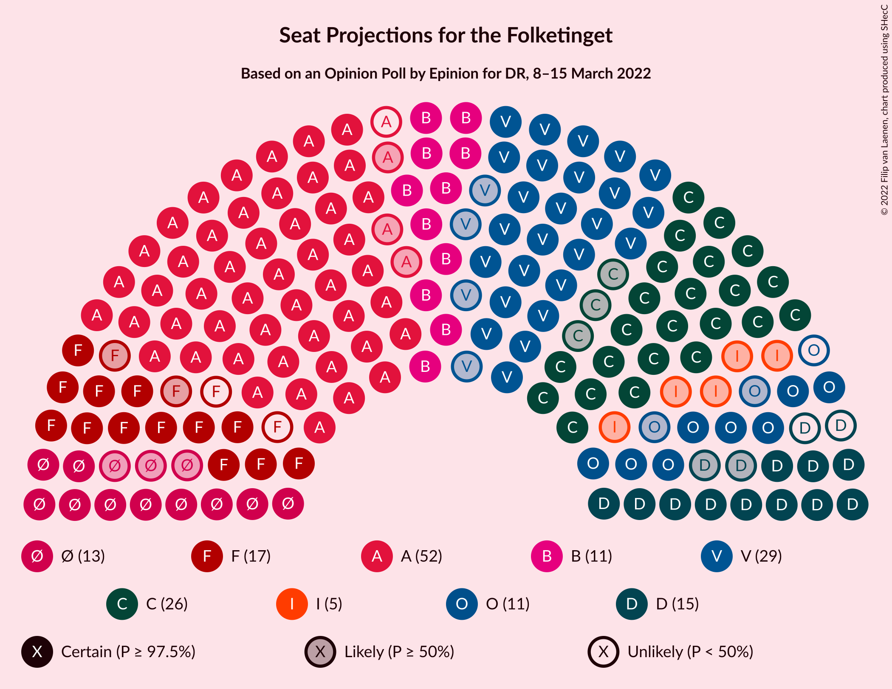

# Opinion Poll by Epinion for DR, 8–15 March 2022

<a href="#voting-intentions">Voting Intentions</a> | <a href="#seats">Seats</a> | <a href="#coalitions">Coalitions</a> | <a href="#technical-information">Technical Information</a>

## Voting Intentions

### Confidence Intervals

| Party | Last Result | Poll Result | 80% Confidence Interval | 90% Confidence Interval | 95% Confidence Interval | 99% Confidence Interval |
|:-----:|:-----------:|:-----------:|:-----------------------:|:-----------------------:|:-----------------------:|:-----------------------:|
| Socialdemokraterne | 25.9% | 28.0% | 26.7–29.3% |26.4–29.7% |26.1–30.0% |25.5–30.7% |
| Venstre | 23.4% | 15.3% | 14.3–16.4% |14.1–16.7% |13.8–17.0% |13.4–17.5% |
| Det Konservative Folkeparti | 6.6% | 14.3% | 13.3–15.3% |13.0–15.6% |12.8–15.9% |12.4–16.4% |
| Socialistisk Folkeparti | 7.7% | 8.0% | 7.3–8.8% |7.1–9.1% |6.9–9.3% |6.6–9.7% |
| Nye Borgerlige | 2.4% | 7.1% | 6.4–7.9% |6.2–8.1% |6.1–8.3% |5.8–8.7% |
| Enhedslisten–De Rød-Grønne | 6.9% | 6.8% | 6.1–7.6% |6.0–7.8% |5.8–8.0% |5.5–8.4% |
| Radikale Venstre | 8.6% | 6.5% | 5.9–7.3% |5.7–7.5% |5.5–7.7% |5.2–8.1% |
| Dansk Folkeparti | 8.7% | 5.0% | 4.4–5.7% |4.3–5.9% |4.1–6.0% |3.9–6.4% |
| Liberal Alliance | 2.3% | 2.6% | 2.2–3.1% |2.1–3.3% |2.0–3.4% |1.8–3.7% |
| Moderaterne | N/A | 1.9% | 1.5–2.3% |1.4–2.5% |1.4–2.6% |1.2–2.8% |
| Alternativet | 3.0% | 1.4% | 1.1–1.8% |1.0–1.9% |1.0–2.0% |0.8–2.2% |
| Kristendemokraterne | 1.7% | 1.2% | 0.9–1.6% |0.9–1.7% |0.8–1.8% |0.7–2.0% |
| Frie Grønne | 0.0% | 0.7% | 0.5–1.0% |0.5–1.1% |0.4–1.2% |0.3–1.3% |
| Veganerpartiet | 0.0% | 0.5% | 0.3–0.8% |0.3–0.8% |0.3–0.9% |0.2–1.1% |

*Note:* The poll result column reflects the actual value used in the calculations. Published results may vary slightly, and in addition be rounded to fewer digits.

## Seats

### Confidence Intervals

| Party | Last Result | Median | 80% Confidence Interval | 90% Confidence Interval | 95% Confidence Interval | 99% Confidence Interval |
|:-----:|:-----------:|:------:|:-----------------------:|:-----------------------:|:-----------------------:|:-----------------------:|
| <a href="#socialdemokraterne">Socialdemokraterne</a> | 48 | 51 | 48–54 |48–55 |48–55 |46–57 |
| <a href="#venstre">Venstre</a> | 43 | 29 | 26–31 |25–31 |25–31 |24–33 |
| <a href="#det-konservative-folkeparti">Det Konservative Folkeparti</a> | 12 | 26 | 24–28 |23–29 |23–30 |22–30 |
| <a href="#socialistisk-folkeparti">Socialistisk Folkeparti</a> | 14 | 15 | 14–17 |13–17 |13–17 |12–18 |
| <a href="#nye-borgerlige">Nye Borgerlige</a> | 4 | 13 | 11–15 |11–15 |11–15 |10–17 |
| <a href="#enhedslisten–de-rød-grønne">Enhedslisten–De Rød-Grønne</a> | 13 | 13 | 12–14 |11–15 |10–16 |10–16 |
| <a href="#radikale-venstre">Radikale Venstre</a> | 16 | 11 | 11–13 |11–14 |11–15 |10–16 |
| <a href="#dansk-folkeparti">Dansk Folkeparti</a> | 16 | 10 | 8–11 |8–11 |8–11 |7–11 |
| <a href="#liberal-alliance">Liberal Alliance</a> | 4 | 5 | 4–5 |4–6 |0–7 |0–7 |
| <a href="#moderaterne">Moderaterne</a> | N/A | 0 | 0–4 |0–4 |0–5 |0–5 |
| <a href="#alternativet">Alternativet</a> | 5 | 0 | 0 |0–4 |0–4 |0–4 |
| <a href="#kristendemokraterne">Kristendemokraterne</a> | 0 | 0 | 0 |0 |0 |0–4 |
| <a href="#frie-grønne">Frie Grønne</a> | 0 | 0 | 0 |0 |0 |0 |
| <a href="#veganerpartiet">Veganerpartiet</a> | 0 | 0 | 0 |0 |0 |0 |

