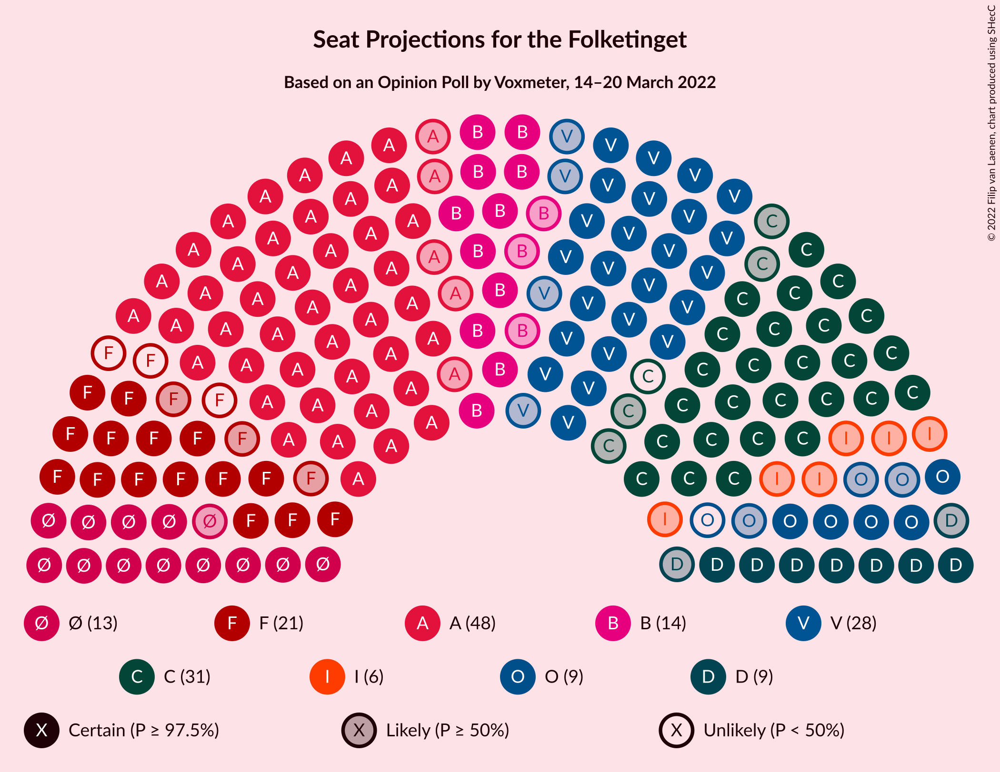

# Opinion Poll by Voxmeter, 14–20 March 2022

<a href="#voting-intentions">Voting Intentions</a> | <a href="#seats">Seats</a> | <a href="#coalitions">Coalitions</a> | <a href="#technical-information">Technical Information</a>

## Voting Intentions

### Confidence Intervals

| Party | Last Result | Poll Result | 80% Confidence Interval | 90% Confidence Interval | 95% Confidence Interval | 99% Confidence Interval |
|:-----:|:-----------:|:-----------:|:-----------------------:|:-----------------------:|:-----------------------:|:-----------------------:|
| Socialdemokraterne | 25.9% | 26.5% | 24.8–28.4% |24.3–28.9% |23.9–29.3% |23.1–30.2% |
| Det Konservative Folkeparti | 6.6% | 15.9% | 14.4–17.4% |14.1–17.9% |13.7–18.2% |13.1–19.0% |
| Venstre | 23.4% | 15.1% | 13.7–16.6% |13.3–17.0% |13.0–17.4% |12.3–18.2% |
| Socialistisk Folkeparti | 7.7% | 9.5% | 8.4–10.8% |8.1–11.1% |7.8–11.4% |7.3–12.1% |
| Enhedslisten–De Rød-Grønne | 6.9% | 8.5% | 7.4–9.7% |7.1–10.1% |6.9–10.4% |6.4–11.0% |
| Radikale Venstre | 8.6% | 7.4% | 6.4–8.6% |6.1–8.9% |5.9–9.2% |5.5–9.8% |
| Nye Borgerlige | 2.4% | 5.1% | 4.3–6.1% |4.1–6.4% |3.9–6.6% |3.5–7.1% |
| Dansk Folkeparti | 8.7% | 4.4% | 3.7–5.3% |3.4–5.6% |3.3–5.9% |3.0–6.3% |
| Liberal Alliance | 2.3% | 2.6% | 2.0–3.4% |1.9–3.6% |1.8–3.8% |1.5–4.2% |
| Moderaterne | N/A | 1.8% | 1.4–2.5% |1.2–2.7% |1.1–2.8% |1.0–3.2% |
| Kristendemokraterne | 1.7% | 1.3% | 0.9–1.9% |0.8–2.1% |0.8–2.2% |0.6–2.5% |
| Alternativet | 3.0% | 0.7% | 0.5–1.2% |0.4–1.3% |0.3–1.4% |0.2–1.7% |
| Frie Grønne | 0.0% | 0.2% | 0.1–0.5% |0.1–0.6% |0.1–0.7% |0.0–0.9% |
| Veganerpartiet | 0.0% | 0.1% | 0.0–0.4% |0.0–0.5% |0.0–0.6% |0.0–0.7% |

*Note:* The poll result column reflects the actual value used in the calculations. Published results may vary slightly, and in addition be rounded to fewer digits.

## Seats

### Confidence Intervals

| Party | Last Result | Median | 80% Confidence Interval | 90% Confidence Interval | 95% Confidence Interval | 99% Confidence Interval |
|:-----:|:-----------:|:------:|:-----------------------:|:-----------------------:|:-----------------------:|:-----------------------:|
| <a href="#socialdemokraterne">Socialdemokraterne</a> | 48 | 48 | 44–51 |44–51 |43–53 |42–54 |
| <a href="#det-konservative-folkeparti">Det Konservative Folkeparti</a> | 12 | 30 | 27–32 |26–33 |26–33 |24–35 |
| <a href="#venstre">Venstre</a> | 43 | 28 | 25–29 |24–30 |24–30 |21–32 |
| <a href="#socialistisk-folkeparti">Socialistisk Folkeparti</a> | 14 | 18 | 15–21 |15–21 |15–21 |14–21 |
| <a href="#enhedslisten–de-rød-grønne">Enhedslisten–De Rød-Grønne</a> | 13 | 13 | 12–18 |12–21 |12–21 |12–21 |
| <a href="#radikale-venstre">Radikale Venstre</a> | 16 | 14 | 12–17 |11–17 |11–17 |10–17 |
| <a href="#nye-borgerlige">Nye Borgerlige</a> | 4 | 9 | 7–11 |7–12 |7–12 |7–12 |
| <a href="#dansk-folkeparti">Dansk Folkeparti</a> | 16 | 8 | 7–11 |5–11 |5–11 |5–12 |
| <a href="#liberal-alliance">Liberal Alliance</a> | 4 | 6 | 4–6 |4–6 |0–7 |0–7 |
| <a href="#moderaterne">Moderaterne</a> | N/A | 0 | 0–4 |0–4 |0–5 |0–5 |
| <a href="#kristendemokraterne">Kristendemokraterne</a> | 0 | 0 | 0 |0–4 |0–4 |0–4 |
| <a href="#alternativet">Alternativet</a> | 5 | 0 | 0 |0 |0 |0 |
| <a href="#frie-grønne">Frie Grønne</a> | 0 | 0 | 0 |0 |0 |0 |
| <a href="#veganerpartiet">Veganerpartiet</a> | 0 | 0 | 0 |0 |0 |0 |

