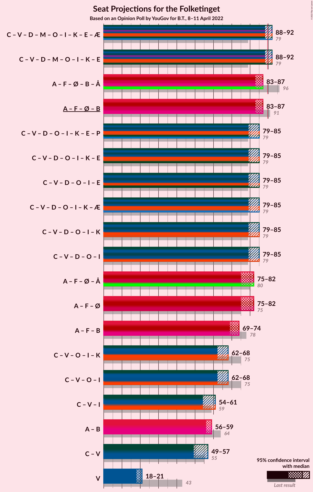
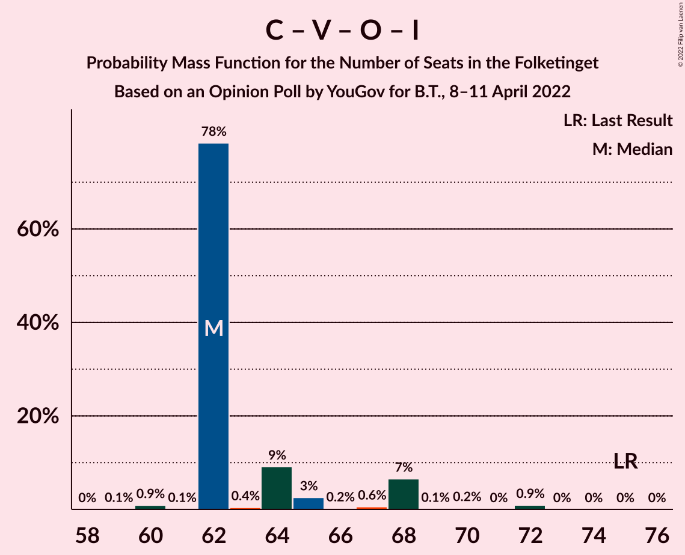

# Opinion Poll by YouGov for B.T., 8–11 April 2022

<a href="#voting-intentions">Voting Intentions</a> | <a href="#seats">Seats</a> | <a href="#coalitions">Coalitions</a> | <a href="#technical-information">Technical Information</a>

## Voting Intentions

### Confidence Intervals

| Party | Last Result | Poll Result | 80% Confidence Interval | 90% Confidence Interval | 95% Confidence Interval | 99% Confidence Interval |
|:-----:|:-----------:|:-----------:|:-----------------------:|:-----------------------:|:-----------------------:|:-----------------------:|
| Socialdemokraterne | 25.9% | 29.1% | 27.5–30.8% |27.0–31.2% |26.6–31.7% |25.8–32.5% |
| Det Konservative Folkeparti | 6.6% | 17.1% | 15.8–18.5% |15.4–19.0% |15.1–19.3% |14.5–20.0% |
| Venstre | 23.4% | 11.1% | 10.0–12.3% |9.7–12.7% |9.4–13.0% |9.0–13.6% |
| Nye Borgerlige | 2.4% | 9.4% | 8.4–10.5% |8.1–10.9% |7.9–11.2% |7.4–11.7% |
| Socialistisk Folkeparti | 7.7% | 8.1% | 7.2–9.2% |6.9–9.5% |6.7–9.8% |6.3–10.3% |
| Enhedslisten–De Rød-Grønne | 6.9% | 6.3% | 5.5–7.2% |5.2–7.5% |5.0–7.8% |4.7–8.2% |
| Moderaterne | 0.0% | 4.8% | 4.1–5.7% |3.9–5.9% |3.8–6.2% |3.4–6.6% |
| Dansk Folkeparti | 8.7% | 4.5% | 3.8–5.3% |3.6–5.6% |3.5–5.8% |3.2–6.2% |
| Radikale Venstre | 8.6% | 3.2% | 2.7–4.0% |2.5–4.2% |2.4–4.4% |2.1–4.7% |
| Liberal Alliance | 2.3% | 3.1% | 2.5–3.8% |2.3–4.0% |2.2–4.2% |2.0–4.5% |
| Kristendemokraterne | 1.7% | 1.1% | 0.8–1.6% |0.7–1.8% |0.7–1.9% |0.5–2.1% |
| Frie Grønne | 0.0% | 1.0% | 0.7–1.4% |0.6–1.6% |0.5–1.7% |0.4–1.9% |
| Veganerpartiet | 0.0% | 0.8% | 0.6–1.2% |0.5–1.4% |0.4–1.5% |0.3–1.7% |
| Alternativet | 3.0% | 0.5% | 0.3–0.9% |0.3–1.0% |0.2–1.1% |0.2–1.3% |

*Note:* The poll result column reflects the actual value used in the calculations. Published results may vary slightly, and in addition be rounded to fewer digits.

## Seats

### Confidence Intervals

| Party | Last Result | Median | 80% Confidence Interval | 90% Confidence Interval | 95% Confidence Interval | 99% Confidence Interval |
|:-----:|:-----------:|:------:|:-----------------------:|:-----------------------:|:-----------------------:|:-----------------------:|
| <a href="#socialdemokraterne">Socialdemokraterne</a> | 48 | 54 | 51–54 |51–54 |50–54 |49–54 |
| <a href="#det-konservative-folkeparti">Det Konservative Folkeparti</a> | 12 | 28 | 28–34 |28–36 |28–36 |28–37 |
| <a href="#venstre">Venstre</a> | 43 | 21 | 18–21 |18–21 |18–21 |16–22 |
| <a href="#nye-borgerlige">Nye Borgerlige</a> | 4 | 17 | 17–20 |17–20 |17–20 |15–20 |
| <a href="#socialistisk-folkeparti">Socialistisk Folkeparti</a> | 14 | 15 | 13–15 |12–15 |12–15 |12–16 |
| <a href="#enhedslisten–de-rød-grønne">Enhedslisten–De Rød-Grønne</a> | 13 | 13 | 12–13 |11–14 |11–14 |10–14 |
| <a href="#moderaterne">Moderaterne</a> | 0 | 9 | 8–9 |7–9 |7–9 |7–11 |
| <a href="#dansk-folkeparti">Dansk Folkeparti</a> | 16 | 8 | 7–8 |7–9 |7–9 |7–12 |
| <a href="#radikale-venstre">Radikale Venstre</a> | 16 | 5 | 5–6 |5–8 |5–8 |5–8 |
| <a href="#liberal-alliance">Liberal Alliance</a> | 4 | 5 | 5 |4–5 |4–5 |4–6 |
| <a href="#kristendemokraterne">Kristendemokraterne</a> | 0 | 0 | 0 |0 |0 |0 |
| <a href="#frie-grønne">Frie Grønne</a> | 0 | 0 | 0 |0 |0 |0 |
| <a href="#veganerpartiet">Veganerpartiet</a> | 0 | 0 | 0 |0 |0 |0 |
| <a href="#alternativet">Alternativet</a> | 5 | 0 | 0 |0 |0 |0 |

### Socialdemokraterne

*For a full overview of the results for this party, see the [Socialdemokraterne](party-socialdemokraterne.html) page.*

| Number of Seats | Probability | Accumulated | Special Marks |
|:---------------:|:-----------:|:-----------:|:-------------:|
| 47 | 0% | 100% |  |
| 48 | 0% | 99.9% | Last Result |
| 49 | 2% | 99.9% |  |
| 50 | 1.3% | 98% |  |
| 51 | 15% | 97% |  |
| 52 | 0.6% | 81% |  |
| 53 | 0.9% | 81% |  |
| 54 | 79% | 80% | Median |
| 55 | 0.2% | 0.5% |  |
| 56 | 0.2% | 0.2% |  |
| 57 | 0% | 0% |  |

### Det Konservative Folkeparti

*For a full overview of the results for this party, see the [Det Konservative Folkeparti](party-detkonservativefolkeparti.html) page.*

| Number of Seats | Probability | Accumulated | Special Marks |
|:---------------:|:-----------:|:-----------:|:-------------:|
| 12 | 0% | 100% | Last Result |
| 13 | 0% | 100% |  |
| 14 | 0% | 100% |  |
| 15 | 0% | 100% |  |
| 16 | 0% | 100% |  |
| 17 | 0% | 100% |  |
| 18 | 0% | 100% |  |
| 19 | 0% | 100% |  |
| 20 | 0% | 100% |  |
| 21 | 0% | 100% |  |
| 22 | 0% | 100% |  |
| 23 | 0% | 100% |  |
| 24 | 0% | 100% |  |
| 25 | 0.2% | 100% |  |
| 26 | 0% | 99.8% |  |
| 27 | 0% | 99.8% |  |
| 28 | 80% | 99.8% | Median |
| 29 | 0% | 20% |  |
| 30 | 0.5% | 20% |  |
| 31 | 0.5% | 19% |  |
| 32 | 2% | 19% |  |
| 33 | 0% | 17% |  |
| 34 | 9% | 17% |  |
| 35 | 0.2% | 8% |  |
| 36 | 7% | 8% |  |
| 37 | 0.9% | 0.9% |  |
| 38 | 0% | 0% |  |

### Venstre

*For a full overview of the results for this party, see the [Venstre](party-venstre.html) page.*

| Number of Seats | Probability | Accumulated | Special Marks |
|:---------------:|:-----------:|:-----------:|:-------------:|
| 16 | 0.6% | 100% |  |
| 17 | 0% | 99.4% |  |
| 18 | 10% | 99.3% |  |
| 19 | 0.5% | 90% |  |
| 20 | 3% | 89% |  |
| 21 | 85% | 86% | Median |
| 22 | 0.4% | 0.7% |  |
| 23 | 0.3% | 0.3% |  |
| 24 | 0% | 0% |  |
| 25 | 0% | 0% |  |
| 26 | 0% | 0% |  |
| 27 | 0% | 0% |  |
| 28 | 0% | 0% |  |
| 29 | 0% | 0% |  |
| 30 | 0% | 0% |  |
| 31 | 0% | 0% |  |
| 32 | 0% | 0% |  |
| 33 | 0% | 0% |  |
| 34 | 0% | 0% |  |
| 35 | 0% | 0% |  |
| 36 | 0% | 0% |  |
| 37 | 0% | 0% |  |
| 38 | 0% | 0% |  |
| 39 | 0% | 0% |  |
| 40 | 0% | 0% |  |
| 41 | 0% | 0% |  |
| 42 | 0% | 0% |  |
| 43 | 0% | 0% | Last Result |

### Nye Borgerlige

*For a full overview of the results for this party, see the [Nye Borgerlige](party-nyeborgerlige.html) page.*

| Number of Seats | Probability | Accumulated | Special Marks |
|:---------------:|:-----------:|:-----------:|:-------------:|
| 4 | 0% | 100% | Last Result |
| 5 | 0% | 100% |  |
| 6 | 0% | 100% |  |
| 7 | 0% | 100% |  |
| 8 | 0% | 100% |  |
| 9 | 0% | 100% |  |
| 10 | 0% | 100% |  |
| 11 | 0% | 100% |  |
| 12 | 0% | 100% |  |
| 13 | 0% | 100% |  |
| 14 | 0.2% | 100% |  |
| 15 | 0.8% | 99.7% |  |
| 16 | 1.3% | 99.0% |  |
| 17 | 85% | 98% | Median |
| 18 | 1.5% | 12% |  |
| 19 | 0.3% | 11% |  |
| 20 | 10% | 10% |  |
| 21 | 0% | 0% |  |

### Socialistisk Folkeparti

*For a full overview of the results for this party, see the [Socialistisk Folkeparti](party-socialistiskfolkeparti.html) page.*

| Number of Seats | Probability | Accumulated | Special Marks |
|:---------------:|:-----------:|:-----------:|:-------------:|
| 12 | 9% | 100% |  |
| 13 | 8% | 91% |  |
| 14 | 1.5% | 83% | Last Result |
| 15 | 81% | 81% | Median |
| 16 | 0.5% | 0.7% |  |
| 17 | 0.1% | 0.2% |  |
| 18 | 0% | 0.1% |  |
| 19 | 0% | 0% |  |

### Enhedslisten–De Rød-Grønne

*For a full overview of the results for this party, see the [Enhedslisten–De Rød-Grønne](party-enhedslisten–derød-grønne.html) page.*

| Number of Seats | Probability | Accumulated | Special Marks |
|:---------------:|:-----------:|:-----------:|:-------------:|
| 9 | 0.5% | 100% |  |
| 10 | 1.2% | 99.5% |  |
| 11 | 7% | 98% |  |
| 12 | 2% | 91% |  |
| 13 | 80% | 89% | Last Result, Median |
| 14 | 9% | 10% |  |
| 15 | 0.3% | 0.3% |  |
| 16 | 0% | 0% |  |

### Moderaterne

*For a full overview of the results for this party, see the [Moderaterne](party-moderaterne.html) page.*

| Number of Seats | Probability | Accumulated | Special Marks |
|:---------------:|:-----------:|:-----------:|:-------------:|
| 0 | 0% | 100% | Last Result |
| 1 | 0% | 100% |  |
| 2 | 0% | 100% |  |
| 3 | 0% | 100% |  |
| 4 | 0% | 100% |  |
| 5 | 0% | 100% |  |
| 6 | 0% | 100% |  |
| 7 | 9% | 100% |  |
| 8 | 11% | 91% |  |
| 9 | 79% | 81% | Median |
| 10 | 1.5% | 2% |  |
| 11 | 0.6% | 0.6% |  |
| 12 | 0% | 0% |  |

### Dansk Folkeparti

*For a full overview of the results for this party, see the [Dansk Folkeparti](party-danskfolkeparti.html) page.*

| Number of Seats | Probability | Accumulated | Special Marks |
|:---------------:|:-----------:|:-----------:|:-------------:|
| 6 | 0.3% | 100% |  |
| 7 | 16% | 99.7% |  |
| 8 | 78% | 84% | Median |
| 9 | 4% | 5% |  |
| 10 | 0.2% | 1.0% |  |
| 11 | 0% | 0.8% |  |
| 12 | 0.8% | 0.8% |  |
| 13 | 0% | 0% |  |
| 14 | 0% | 0% |  |
| 15 | 0% | 0% |  |
| 16 | 0% | 0% | Last Result |

### Radikale Venstre

*For a full overview of the results for this party, see the [Radikale Venstre](party-radikalevenstre.html) page.*

| Number of Seats | Probability | Accumulated | Special Marks |
|:---------------:|:-----------:|:-----------:|:-------------:|
| 4 | 0.3% | 100% |  |
| 5 | 80% | 99.7% | Median |
| 6 | 11% | 20% |  |
| 7 | 2% | 9% |  |
| 8 | 7% | 7% |  |
| 9 | 0% | 0% |  |
| 10 | 0% | 0% |  |
| 11 | 0% | 0% |  |
| 12 | 0% | 0% |  |
| 13 | 0% | 0% |  |
| 14 | 0% | 0% |  |
| 15 | 0% | 0% |  |
| 16 | 0% | 0% | Last Result |

### Liberal Alliance

*For a full overview of the results for this party, see the [Liberal Alliance](party-liberalalliance.html) page.*

| Number of Seats | Probability | Accumulated | Special Marks |
|:---------------:|:-----------:|:-----------:|:-------------:|
| 4 | 9% | 100% | Last Result |
| 5 | 89% | 91% | Median |
| 6 | 2% | 2% |  |
| 7 | 0.3% | 0.5% |  |
| 8 | 0% | 0.1% |  |
| 9 | 0.1% | 0.1% |  |
| 10 | 0% | 0% |  |

### Kristendemokraterne

*For a full overview of the results for this party, see the [Kristendemokraterne](party-kristendemokraterne.html) page.*

| Number of Seats | Probability | Accumulated | Special Marks |
|:---------------:|:-----------:|:-----------:|:-------------:|
| 0 | 99.9% | 100% | Last Result, Median |
| 1 | 0% | 0.1% |  |
| 2 | 0% | 0.1% |  |
| 3 | 0% | 0.1% |  |
| 4 | 0.1% | 0.1% |  |
| 5 | 0% | 0% |  |

### Frie Grønne

*For a full overview of the results for this party, see the [Frie Grønne](party-friegrønne.html) page.*

| Number of Seats | Probability | Accumulated | Special Marks |
|:---------------:|:-----------:|:-----------:|:-------------:|
| 0 | 100% | 100% | Last Result, Median |

### Veganerpartiet

*For a full overview of the results for this party, see the [Veganerpartiet](party-veganerpartiet.html) page.*

| Number of Seats | Probability | Accumulated | Special Marks |
|:---------------:|:-----------:|:-----------:|:-------------:|
| 0 | 100% | 100% | Last Result, Median |

### Alternativet

*For a full overview of the results for this party, see the [Alternativet](party-alternativet.html) page.*

| Number of Seats | Probability | Accumulated | Special Marks |
|:---------------:|:-----------:|:-----------:|:-------------:|
| 0 | 100% | 100% | Median |
| 1 | 0% | 0% |  |
| 2 | 0% | 0% |  |
| 3 | 0% | 0% |  |
| 4 | 0% | 0% |  |
| 5 | 0% | 0% | Last Result |

## Coalitions

### Confidence Intervals

| Coalition | Last Result | Median | Majority? | 80% Confidence Interval | 90% Confidence Interval | 95% Confidence Interval | 99% Confidence Interval |
|:---------:|:-----------:|:------:|:---------:|:-----------------------:|:-----------------------:|:-----------------------:|:-----------------------:|
| Socialdemokraterne – Socialistisk Folkeparti – Enhedslisten–De Rød-Grønne – Radikale Venstre – Alternativet | 96 | 87 | 0.2% | 83–87 | 83–87 | 83–87 | 79–87 |
| Socialdemokraterne – Socialistisk Folkeparti – Enhedslisten–De Rød-Grønne – Radikale Venstre | 91 | 87 | 0.2% | 83–87 | 83–87 | 83–87 | 79–87 |
| Det Konservative Folkeparti – Venstre – Nye Borgerlige – Dansk Folkeparti – Liberal Alliance – Kristendemokraterne | 79 | 79 | 0% | 79–84 | 79–85 | 79–85 | 78–88 |
| Det Konservative Folkeparti – Venstre – Nye Borgerlige – Dansk Folkeparti – Liberal Alliance | 79 | 79 | 0% | 79–84 | 79–85 | 79–85 | 78–88 |
| Socialdemokraterne – Socialistisk Folkeparti – Enhedslisten–De Rød-Grønne – Alternativet | 80 | 82 | 0% | 77–82 | 75–82 | 75–82 | 73–82 |
| Socialdemokraterne – Socialistisk Folkeparti – Enhedslisten–De Rød-Grønne | 75 | 82 | 0% | 77–82 | 75–82 | 75–82 | 73–82 |
| Socialdemokraterne – Socialistisk Folkeparti – Radikale Venstre | 78 | 74 | 0% | 69–74 | 69–74 | 69–74 | 69–75 |
| Det Konservative Folkeparti – Venstre – Dansk Folkeparti – Liberal Alliance – Kristendemokraterne | 75 | 62 | 0% | 62–65 | 62–68 | 62–68 | 60–72 |
| Det Konservative Folkeparti – Venstre – Dansk Folkeparti – Liberal Alliance | 75 | 62 | 0% | 62–65 | 62–68 | 62–68 | 60–72 |
| Det Konservative Folkeparti – Venstre – Liberal Alliance | 59 | 54 | 0% | 54–57 | 54–61 | 54–61 | 51–63 |
| Socialdemokraterne – Radikale Venstre | 64 | 59 | 0% | 57–59 | 57–59 | 56–59 | 55–61 |
| Det Konservative Folkeparti – Venstre | 55 | 49 | 0% | 49–52 | 49–57 | 49–57 | 46–57 |
| Venstre | 43 | 21 | 0% | 18–21 | 18–21 | 18–21 | 16–22 |

### Socialdemokraterne – Socialistisk Folkeparti – Enhedslisten–De Rød-Grønne – Radikale Venstre – Alternativet

| Number of Seats | Probability | Accumulated | Special Marks |
|:---------------:|:-----------:|:-----------:|:-------------:|
| 79 | 0.9% | 100% |  |
| 80 | 0.2% | 99.1% |  |
| 81 | 0.2% | 98.8% |  |
| 82 | 0.3% | 98.7% |  |
| 83 | 17% | 98% |  |
| 84 | 0.4% | 81% |  |
| 85 | 0.8% | 81% |  |
| 86 | 0.6% | 80% |  |
| 87 | 79% | 79% | Median |
| 88 | 0% | 0.2% |  |
| 89 | 0% | 0.2% |  |
| 90 | 0.2% | 0.2% | Majority |
| 91 | 0% | 0% |  |
| 92 | 0% | 0% |  |
| 93 | 0% | 0% |  |
| 94 | 0% | 0% |  |
| 95 | 0% | 0% |  |
| 96 | 0% | 0% | Last Result |

### Socialdemokraterne – Socialistisk Folkeparti – Enhedslisten–De Rød-Grønne – Radikale Venstre

| Number of Seats | Probability | Accumulated | Special Marks |
|:---------------:|:-----------:|:-----------:|:-------------:|
| 79 | 0.9% | 100% |  |
| 80 | 0.2% | 99.1% |  |
| 81 | 0.2% | 98.8% |  |
| 82 | 0.3% | 98.7% |  |
| 83 | 17% | 98% |  |
| 84 | 0.4% | 81% |  |
| 85 | 0.8% | 81% |  |
| 86 | 0.6% | 80% |  |
| 87 | 79% | 79% | Median |
| 88 | 0% | 0.2% |  |
| 89 | 0% | 0.2% |  |
| 90 | 0.2% | 0.2% | Majority |
| 91 | 0% | 0% | Last Result |

### Det Konservative Folkeparti – Venstre – Nye Borgerlige – Dansk Folkeparti – Liberal Alliance – Kristendemokraterne

| Number of Seats | Probability | Accumulated | Special Marks |
|:---------------:|:-----------:|:-----------:|:-------------:|
| 76 | 0.2% | 100% |  |
| 77 | 0% | 99.8% |  |
| 78 | 0.9% | 99.8% |  |
| 79 | 78% | 98.9% | Last Result, Median |
| 80 | 0.1% | 21% |  |
| 81 | 0.7% | 21% |  |
| 82 | 1.4% | 20% |  |
| 83 | 0.4% | 19% |  |
| 84 | 9% | 18% |  |
| 85 | 8% | 9% |  |
| 86 | 0.2% | 1.1% |  |
| 87 | 0% | 0.9% |  |
| 88 | 0.9% | 0.9% |  |
| 89 | 0% | 0% |  |

### Det Konservative Folkeparti – Venstre – Nye Borgerlige – Dansk Folkeparti – Liberal Alliance

| Number of Seats | Probability | Accumulated | Special Marks |
|:---------------:|:-----------:|:-----------:|:-------------:|
| 74 | 0.1% | 100% |  |
| 75 | 0% | 99.9% |  |
| 76 | 0.2% | 99.9% |  |
| 77 | 0% | 99.8% |  |
| 78 | 0.9% | 99.8% |  |
| 79 | 78% | 98.9% | Last Result, Median |
| 80 | 0.1% | 21% |  |
| 81 | 0.8% | 21% |  |
| 82 | 1.4% | 20% |  |
| 83 | 0.4% | 19% |  |
| 84 | 9% | 18% |  |
| 85 | 8% | 9% |  |
| 86 | 0.2% | 1.1% |  |
| 87 | 0% | 0.9% |  |
| 88 | 0.9% | 0.9% |  |
| 89 | 0% | 0% |  |

### Socialdemokraterne – Socialistisk Folkeparti – Enhedslisten–De Rød-Grønne – Alternativet

| Number of Seats | Probability | Accumulated | Special Marks |
|:---------------:|:-----------:|:-----------:|:-------------:|
| 73 | 0.9% | 100% |  |
| 74 | 0% | 99.1% |  |
| 75 | 7% | 99.1% |  |
| 76 | 0.4% | 93% |  |
| 77 | 11% | 92% |  |
| 78 | 1.1% | 81% |  |
| 79 | 0.5% | 80% |  |
| 80 | 0.9% | 80% | Last Result |
| 81 | 0.6% | 79% |  |
| 82 | 78% | 78% | Median |
| 83 | 0.2% | 0.2% |  |
| 84 | 0% | 0% |  |

### Socialdemokraterne – Socialistisk Folkeparti – Enhedslisten–De Rød-Grønne

| Number of Seats | Probability | Accumulated | Special Marks |
|:---------------:|:-----------:|:-----------:|:-------------:|
| 73 | 0.9% | 100% |  |
| 74 | 0% | 99.1% |  |
| 75 | 7% | 99.1% | Last Result |
| 76 | 0.4% | 93% |  |
| 77 | 11% | 92% |  |
| 78 | 1.1% | 81% |  |
| 79 | 0.5% | 80% |  |
| 80 | 0.9% | 80% |  |
| 81 | 0.6% | 79% |  |
| 82 | 78% | 78% | Median |
| 83 | 0.2% | 0.2% |  |
| 84 | 0% | 0% |  |

### Socialdemokraterne – Socialistisk Folkeparti – Radikale Venstre

| Number of Seats | Probability | Accumulated | Special Marks |
|:---------------:|:-----------:|:-----------:|:-------------:|
| 69 | 10% | 100% |  |
| 70 | 2% | 90% |  |
| 71 | 0.1% | 88% |  |
| 72 | 7% | 88% |  |
| 73 | 0.8% | 81% |  |
| 74 | 78% | 80% | Median |
| 75 | 0.9% | 1.3% |  |
| 76 | 0.2% | 0.5% |  |
| 77 | 0.2% | 0.3% |  |
| 78 | 0.1% | 0.1% | Last Result |
| 79 | 0% | 0% |  |

### Det Konservative Folkeparti – Venstre – Dansk Folkeparti – Liberal Alliance – Kristendemokraterne

| Number of Seats | Probability | Accumulated | Special Marks |
|:---------------:|:-----------:|:-----------:|:-------------:|
| 60 | 0.9% | 100% |  |
| 61 | 0.1% | 99.1% |  |
| 62 | 78% | 99.1% | Median |
| 63 | 0.5% | 21% |  |
| 64 | 9% | 20% |  |
| 65 | 3% | 11% |  |
| 66 | 0.2% | 9% |  |
| 67 | 0.6% | 8% |  |
| 68 | 7% | 8% |  |
| 69 | 0.1% | 1.2% |  |
| 70 | 0.2% | 1.2% |  |
| 71 | 0% | 0.9% |  |
| 72 | 0.9% | 0.9% |  |
| 73 | 0% | 0% |  |
| 74 | 0% | 0% |  |
| 75 | 0% | 0% | Last Result |

### Det Konservative Folkeparti – Venstre – Dansk Folkeparti – Liberal Alliance

| Number of Seats | Probability | Accumulated | Special Marks |
|:---------------:|:-----------:|:-----------:|:-------------:|
| 59 | 0.1% | 100% |  |
| 60 | 0.9% | 99.9% |  |
| 61 | 0.1% | 99.1% |  |
| 62 | 78% | 99.0% | Median |
| 63 | 0.4% | 21% |  |
| 64 | 9% | 20% |  |
| 65 | 3% | 11% |  |
| 66 | 0.2% | 9% |  |
| 67 | 0.6% | 8% |  |
| 68 | 7% | 8% |  |
| 69 | 0.1% | 1.2% |  |
| 70 | 0.2% | 1.2% |  |
| 71 | 0% | 0.9% |  |
| 72 | 0.9% | 0.9% |  |
| 73 | 0% | 0% |  |
| 74 | 0% | 0% |  |
| 75 | 0% | 0% | Last Result |

### Det Konservative Folkeparti – Venstre – Liberal Alliance

| Number of Seats | Probability | Accumulated | Special Marks |
|:---------------:|:-----------:|:-----------:|:-------------:|
| 51 | 0.9% | 100% |  |
| 52 | 0% | 99.1% |  |
| 53 | 1.1% | 99.0% |  |
| 54 | 78% | 98% | Median |
| 55 | 0.1% | 20% |  |
| 56 | 2% | 20% |  |
| 57 | 9% | 17% |  |
| 58 | 0.6% | 8% |  |
| 59 | 0.2% | 8% | Last Result |
| 60 | 0% | 8% |  |
| 61 | 7% | 8% |  |
| 62 | 0% | 1.2% |  |
| 63 | 1.2% | 1.2% |  |
| 64 | 0% | 0% |  |

### Socialdemokraterne – Radikale Venstre

| Number of Seats | Probability | Accumulated | Special Marks |
|:---------------:|:-----------:|:-----------:|:-------------:|
| 53 | 0.2% | 100% |  |
| 54 | 0.2% | 99.8% |  |
| 55 | 2% | 99.5% |  |
| 56 | 1.0% | 98% |  |
| 57 | 9% | 97% |  |
| 58 | 0.2% | 87% |  |
| 59 | 85% | 87% | Median |
| 60 | 0.8% | 2% |  |
| 61 | 0.9% | 1.3% |  |
| 62 | 0.2% | 0.4% |  |
| 63 | 0% | 0.2% |  |
| 64 | 0.2% | 0.2% | Last Result |
| 65 | 0% | 0% |  |

### Det Konservative Folkeparti – Venstre

| Number of Seats | Probability | Accumulated | Special Marks |
|:---------------:|:-----------:|:-----------:|:-------------:|
| 46 | 0.9% | 100% |  |
| 47 | 0% | 99.0% |  |
| 48 | 1.0% | 99.0% |  |
| 49 | 78% | 98% | Median |
| 50 | 0.2% | 20% |  |
| 51 | 0.2% | 20% |  |
| 52 | 11% | 19% |  |
| 53 | 0% | 8% |  |
| 54 | 0.3% | 8% |  |
| 55 | 0% | 8% | Last Result |
| 56 | 0.2% | 8% |  |
| 57 | 7% | 7% |  |
| 58 | 0% | 0% |  |

### Venstre

| Number of Seats | Probability | Accumulated | Special Marks |
|:---------------:|:-----------:|:-----------:|:-------------:|
| 16 | 0.6% | 100% |  |
| 17 | 0% | 99.4% |  |
| 18 | 10% | 99.3% |  |
| 19 | 0.5% | 90% |  |
| 20 | 3% | 89% |  |
| 21 | 85% | 86% | Median |
| 22 | 0.4% | 0.7% |  |
| 23 | 0.3% | 0.3% |  |
| 24 | 0% | 0% |  |
| 25 | 0% | 0% |  |
| 26 | 0% | 0% |  |
| 27 | 0% | 0% |  |
| 28 | 0% | 0% |  |
| 29 | 0% | 0% |  |
| 30 | 0% | 0% |  |
| 31 | 0% | 0% |  |
| 32 | 0% | 0% |  |
| 33 | 0% | 0% |  |
| 34 | 0% | 0% |  |
| 35 | 0% | 0% |  |
| 36 | 0% | 0% |  |
| 37 | 0% | 0% |  |
| 38 | 0% | 0% |  |
| 39 | 0% | 0% |  |
| 40 | 0% | 0% |  |
| 41 | 0% | 0% |  |
| 42 | 0% | 0% |  |
| 43 | 0% | 0% | Last Result |

## Technical Information

### Opinion Poll

+ **Polling firm:** YouGov
+ **Commissioner(s):** B.T.
+ **Fieldwork period:** 8–11 April 2022

### Calculations

+ **Sample size:** 1245
+ **Simulations done:** 1,048,576
+ **Error estimate:** 2.99%

