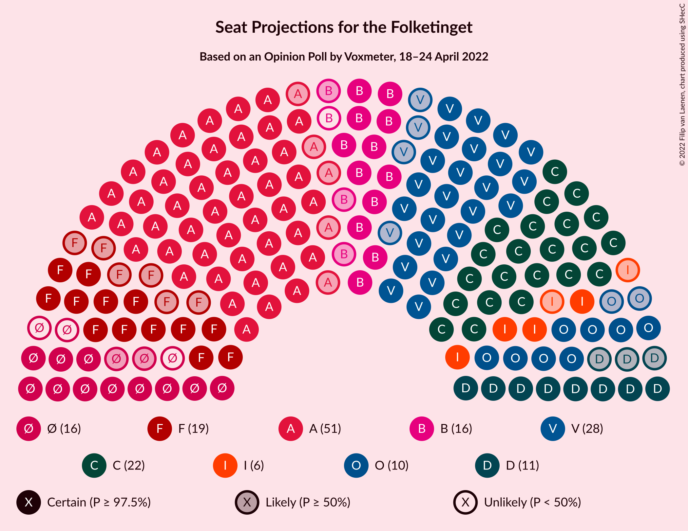

# Opinion Poll by Voxmeter, 18–24 April 2022

<a href="#voting-intentions">Voting Intentions</a> | <a href="#seats">Seats</a> | <a href="#coalitions">Coalitions</a> | <a href="#technical-information">Technical Information</a>

## Voting Intentions

### Confidence Intervals

| Party | Last Result | Poll Result | 80% Confidence Interval | 90% Confidence Interval | 95% Confidence Interval | 99% Confidence Interval |
|:-----:|:-----------:|:-----------:|:-----------------------:|:-----------------------:|:-----------------------:|:-----------------------:|
| Socialdemokraterne | 25.9% | 27.8% | 26.1–29.7% |25.6–30.3% |25.1–30.7% |24.3–31.6% |
| Venstre | 23.4% | 15.6% | 14.2–17.1% |13.8–17.6% |13.4–18.0% |12.8–18.7% |
| Det Konservative Folkeparti | 6.6% | 13.8% | 12.5–15.3% |12.1–15.7% |11.8–16.0% |11.2–16.8% |
| Socialistisk Folkeparti | 7.7% | 8.6% | 7.5–9.8% |7.2–10.2% |7.0–10.5% |6.5–11.1% |
| Radikale Venstre | 8.6% | 8.2% | 7.2–9.4% |6.9–9.8% |6.6–10.1% |6.2–10.7% |
| Enhedslisten–De Rød-Grønne | 6.9% | 7.2% | 6.2–8.4% |6.0–8.7% |5.7–9.0% |5.3–9.5% |
| Nye Borgerlige | 2.4% | 5.7% | 4.8–6.8% |4.6–7.0% |4.4–7.3% |4.0–7.8% |
| Dansk Folkeparti | 8.7% | 5.2% | 4.4–6.2% |4.2–6.5% |4.0–6.8% |3.6–7.3% |
| Liberal Alliance | 2.3% | 3.1% | 2.5–3.9% |2.3–4.2% |2.2–4.4% |1.9–4.8% |
| Moderaterne | N/A | 1.4% | 1.0–2.0% |0.9–2.2% |0.8–2.3% |0.7–2.7% |
| Kristendemokraterne | 1.7% | 1.3% | 0.9–1.9% |0.8–2.1% |0.8–2.2% |0.6–2.5% |
| Alternativet | 3.0% | 1.2% | 0.9–1.8% |0.8–1.9% |0.7–2.1% |0.5–2.4% |
| Frie Grønne | 0.0% | 0.4% | 0.2–0.8% |0.2–0.9% |0.2–1.0% |0.1–1.3% |

*Note:* The poll result column reflects the actual value used in the calculations. Published results may vary slightly, and in addition be rounded to fewer digits.

## Seats

### Confidence Intervals

| Party | Last Result | Median | 80% Confidence Interval | 90% Confidence Interval | 95% Confidence Interval | 99% Confidence Interval |
|:-----:|:-----------:|:------:|:-----------------------:|:-----------------------:|:-----------------------:|:-----------------------:|
| <a href="#socialdemokraterne">Socialdemokraterne</a> | 48 | 51 | 49–52 |47–53 |46–53 |44–58 |
| <a href="#venstre">Venstre</a> | 43 | 28 | 26–30 |25–32 |24–32 |23–33 |
| <a href="#det-konservative-folkeparti">Det Konservative Folkeparti</a> | 12 | 22 | 22–27 |22–28 |22–28 |20–30 |
| <a href="#socialistisk-folkeparti">Socialistisk Folkeparti</a> | 14 | 19 | 13–19 |13–19 |13–19 |12–21 |
| <a href="#radikale-venstre">Radikale Venstre</a> | 16 | 15 | 13–16 |12–17 |12–19 |12–19 |
| <a href="#enhedslisten–de-rød-grønne">Enhedslisten–De Rød-Grønne</a> | 13 | 13 | 12–16 |11–16 |11–16 |10–17 |
| <a href="#nye-borgerlige">Nye Borgerlige</a> | 4 | 11 | 9–12 |8–12 |8–14 |8–14 |
| <a href="#dansk-folkeparti">Dansk Folkeparti</a> | 16 | 10 | 9–10 |8–11 |8–11 |7–13 |
| <a href="#liberal-alliance">Liberal Alliance</a> | 4 | 6 | 5–7 |5–7 |4–7 |4–9 |
| <a href="#moderaterne">Moderaterne</a> | N/A | 0 | 0 |0 |0 |0–5 |
| <a href="#kristendemokraterne">Kristendemokraterne</a> | 0 | 0 | 0 |0–4 |0–4 |0–4 |
| <a href="#alternativet">Alternativet</a> | 5 | 0 | 0 |0 |0 |0–4 |
| <a href="#frie-grønne">Frie Grønne</a> | 0 | 0 | 0 |0 |0 |0 |

