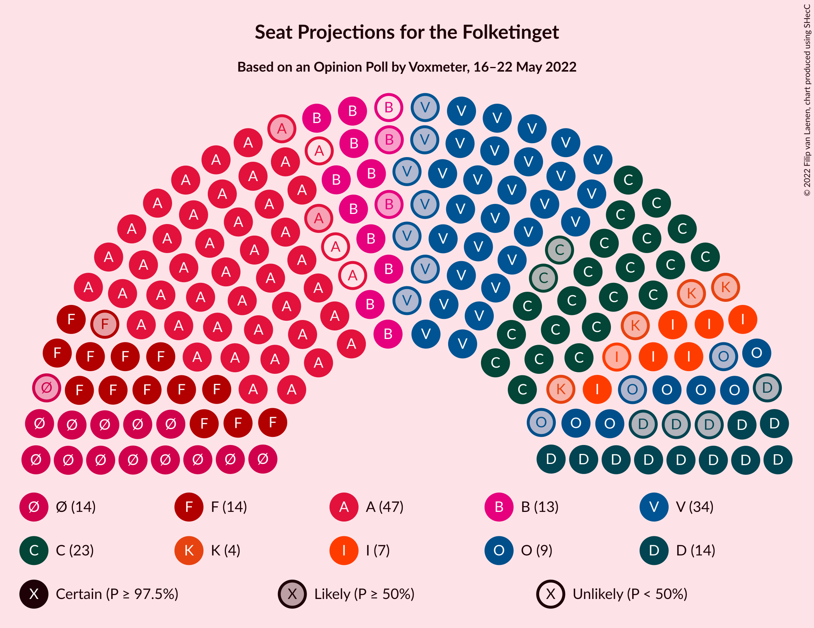

# Opinion Poll by Voxmeter, 16–22 May 2022

<a href="#voting-intentions">Voting Intentions</a> | <a href="#seats">Seats</a> | <a href="#coalitions">Coalitions</a> | <a href="#technical-information">Technical Information</a>

## Voting Intentions

### Confidence Intervals

| Party | Last Result | Poll Result | 80% Confidence Interval | 90% Confidence Interval | 95% Confidence Interval | 99% Confidence Interval |
|:-----:|:-----------:|:-----------:|:-----------------------:|:-----------------------:|:-----------------------:|:-----------------------:|
| Socialdemokraterne | 25.9% | 25.5% | 23.8–27.4% |23.3–27.9% |22.9–28.3% |22.1–29.2% |
| Venstre | 23.4% | 17.1% | 15.7–18.8% |15.3–19.2% |14.9–19.6% |14.3–20.4% |
| Det Konservative Folkeparti | 6.6% | 13.3% | 12.0–14.7% |11.6–15.2% |11.3–15.5% |10.7–16.2% |
| Socialistisk Folkeparti | 7.7% | 8.9% | 7.8–10.1% |7.5–10.5% |7.3–10.8% |6.8–11.4% |
| Enhedslisten–De Rød-Grønne | 6.9% | 8.3% | 7.3–9.5% |7.0–9.8% |6.7–10.2% |6.3–10.8% |
| Radikale Venstre | 8.6% | 7.3% | 6.3–8.4% |6.1–8.8% |5.8–9.1% |5.4–9.6% |
| Nye Borgerlige | 2.4% | 7.0% | 6.0–8.1% |5.8–8.4% |5.6–8.7% |5.1–9.3% |
| Dansk Folkeparti | 8.7% | 4.3% | 3.6–5.2% |3.4–5.5% |3.2–5.7% |2.9–6.2% |
| Liberal Alliance | 2.3% | 3.8% | 3.1–4.7% |2.9–4.9% |2.8–5.2% |2.5–5.6% |
| Kristendemokraterne | 1.7% | 1.5% | 1.1–2.1% |1.0–2.3% |0.9–2.5% |0.7–2.8% |
| Moderaterne | N/A | 1.5% | 1.1–2.1% |1.0–2.3% |0.9–2.5% |0.7–2.8% |
| Alternativet | 3.0% | 1.0% | 0.7–1.5% |0.6–1.7% |0.5–1.8% |0.4–2.1% |
| Frie Grønne | 0.0% | 0.3% | 0.2–0.7% |0.1–0.8% |0.1–0.9% |0.1–1.1% |

*Note:* The poll result column reflects the actual value used in the calculations. Published results may vary slightly, and in addition be rounded to fewer digits.

## Seats

### Confidence Intervals

| Party | Last Result | Median | 80% Confidence Interval | 90% Confidence Interval | 95% Confidence Interval | 99% Confidence Interval |
|:-----:|:-----------:|:------:|:-----------------------:|:-----------------------:|:-----------------------:|:-----------------------:|
| <a href="#socialdemokraterne">Socialdemokraterne</a> | 48 | 44 | 42–47 |42–47 |42–48 |40–53 |
| <a href="#venstre">Venstre</a> | 43 | 34 | 29–34 |29–34 |27–35 |25–38 |
| <a href="#det-konservative-folkeparti">Det Konservative Folkeparti</a> | 12 | 23 | 22–24 |22–27 |21–28 |20–29 |
| <a href="#socialistisk-folkeparti">Socialistisk Folkeparti</a> | 14 | 14 | 14–19 |14–19 |13–19 |12–20 |
| <a href="#enhedslisten–de-rød-grønne">Enhedslisten–De Rød-Grønne</a> | 13 | 14 | 14–16 |14–17 |13–18 |11–20 |
| <a href="#radikale-venstre">Radikale Venstre</a> | 16 | 12 | 12–15 |12–16 |10–16 |10–18 |
| <a href="#nye-borgerlige">Nye Borgerlige</a> | 4 | 14 | 12–16 |11–16 |10–16 |9–16 |
| <a href="#dansk-folkeparti">Dansk Folkeparti</a> | 16 | 9 | 6–9 |6–10 |6–10 |5–11 |
| <a href="#liberal-alliance">Liberal Alliance</a> | 4 | 7 | 6–8 |6–9 |6–9 |5–11 |
| <a href="#kristendemokraterne">Kristendemokraterne</a> | 0 | 4 | 0–4 |0–4 |0–4 |0–4 |
| <a href="#moderaterne">Moderaterne</a> | N/A | 0 | 0 |0–4 |0–4 |0–5 |
| <a href="#alternativet">Alternativet</a> | 5 | 0 | 0 |0 |0 |0 |
| <a href="#frie-grønne">Frie Grønne</a> | 0 | 0 | 0 |0 |0 |0 |

