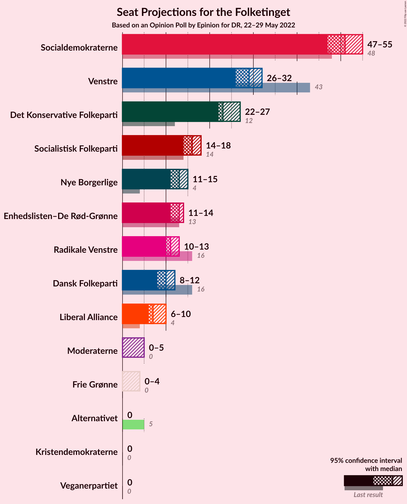
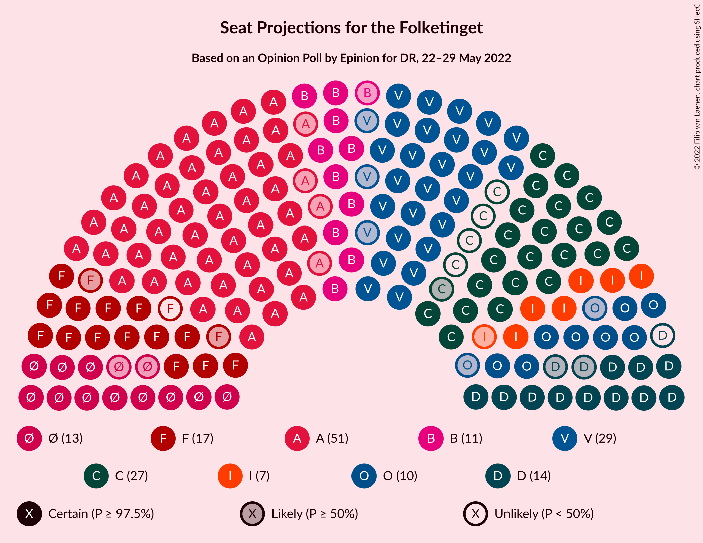

# Opinion Poll by Epinion for DR, 22–29 May 2022

<a href="#voting-intentions">Voting Intentions</a> | <a href="#seats">Seats</a> | <a href="#coalitions">Coalitions</a> | <a href="#technical-information">Technical Information</a>

## Voting Intentions

### Confidence Intervals

| Party | Last Result | Poll Result | 80% Confidence Interval | 90% Confidence Interval | 95% Confidence Interval | 99% Confidence Interval |
|:-----:|:-----------:|:-----------:|:-----------------------:|:-----------------------:|:-----------------------:|:-----------------------:|
| Socialdemokraterne | 25.9% | 27.2% | 26.0–28.5% |25.6–28.8% |25.3–29.1% |24.8–29.8% |
| Venstre | 23.4% | 15.7% | 14.7–16.8% |14.4–17.1% |14.2–17.3% |13.7–17.8% |
| Det Konservative Folkeparti | 6.6% | 13.0% | 12.1–14.0% |11.8–14.3% |11.6–14.5% |11.2–15.0% |
| Socialistisk Folkeparti | 7.7% | 8.4% | 7.7–9.2% |7.5–9.5% |7.3–9.7% |6.9–10.1% |
| Nye Borgerlige | 2.4% | 7.0% | 6.3–7.8% |6.2–8.0% |6.0–8.2% |5.7–8.6% |
| Enhedslisten–De Rød-Grønne | 6.9% | 6.5% | 5.8–7.2% |5.7–7.5% |5.5–7.6% |5.2–8.0% |
| Radikale Venstre | 8.6% | 6.1% | 5.5–6.8% |5.3–7.0% |5.2–7.2% |4.9–7.6% |
| Dansk Folkeparti | 8.7% | 5.3% | 4.7–6.0% |4.5–6.2% |4.4–6.3% |4.1–6.7% |
| Liberal Alliance | 2.3% | 3.9% | 3.4–4.5% |3.3–4.7% |3.2–4.8% |2.9–5.1% |
| Moderaterne | N/A | 1.9% | 1.6–2.4% |1.5–2.5% |1.4–2.6% |1.2–2.8% |
| Frie Grønne | 0.0% | 1.6% | 1.3–2.0% |1.2–2.2% |1.2–2.3% |1.0–2.5% |
| Alternativet | 3.0% | 1.0% | 0.8–1.4% |0.7–1.4% |0.7–1.5% |0.5–1.7% |
| Kristendemokraterne | 1.7% | 0.6% | 0.4–0.9% |0.4–1.0% |0.4–1.1% |0.3–1.2% |
| Veganerpartiet | 0.0% | 0.5% | 0.3–0.7% |0.3–0.8% |0.3–0.9% |0.2–1.0% |

*Note:* The poll result column reflects the actual value used in the calculations. Published results may vary slightly, and in addition be rounded to fewer digits.

## Seats

### Confidence Intervals

| Party | Last Result | Median | 80% Confidence Interval | 90% Confidence Interval | 95% Confidence Interval | 99% Confidence Interval |
|:-----:|:-----------:|:------:|:-----------------------:|:-----------------------:|:-----------------------:|:-----------------------:|
| <a href="#socialdemokraterne">Socialdemokraterne</a> | 48 | 51 | 47–52 |47–54 |47–55 |45–55 |
| <a href="#venstre">Venstre</a> | 43 | 29 | 27–30 |27–32 |26–32 |26–34 |
| <a href="#det-konservative-folkeparti">Det Konservative Folkeparti</a> | 12 | 23 | 22–27 |22–27 |22–27 |20–28 |
| <a href="#socialistisk-folkeparti">Socialistisk Folkeparti</a> | 14 | 16 | 14–17 |14–17 |14–18 |13–18 |
| <a href="#nye-borgerlige">Nye Borgerlige</a> | 4 | 13 | 12–15 |11–15 |11–15 |11–16 |
| <a href="#enhedslisten–de-rød-grønne">Enhedslisten–De Rød-Grønne</a> | 13 | 13 | 11–13 |11–14 |11–14 |10–15 |
| <a href="#radikale-venstre">Radikale Venstre</a> | 16 | 11 | 11–12 |10–13 |10–13 |9–14 |
| <a href="#dansk-folkeparti">Dansk Folkeparti</a> | 16 | 10 | 9–12 |8–12 |8–12 |8–12 |
| <a href="#liberal-alliance">Liberal Alliance</a> | 4 | 7 | 7–8 |6–9 |6–10 |6–10 |
| <a href="#moderaterne">Moderaterne</a> | N/A | 0 | 0–4 |0–4 |0–5 |0–5 |
| <a href="#frie-grønne">Frie Grønne</a> | 0 | 0 | 0 |0–4 |0–4 |0–4 |
| <a href="#alternativet">Alternativet</a> | 5 | 0 | 0 |0 |0 |0 |
| <a href="#kristendemokraterne">Kristendemokraterne</a> | 0 | 0 | 0 |0 |0 |0 |
| <a href="#veganerpartiet">Veganerpartiet</a> | 0 | 0 | 0 |0 |0 |0 |

