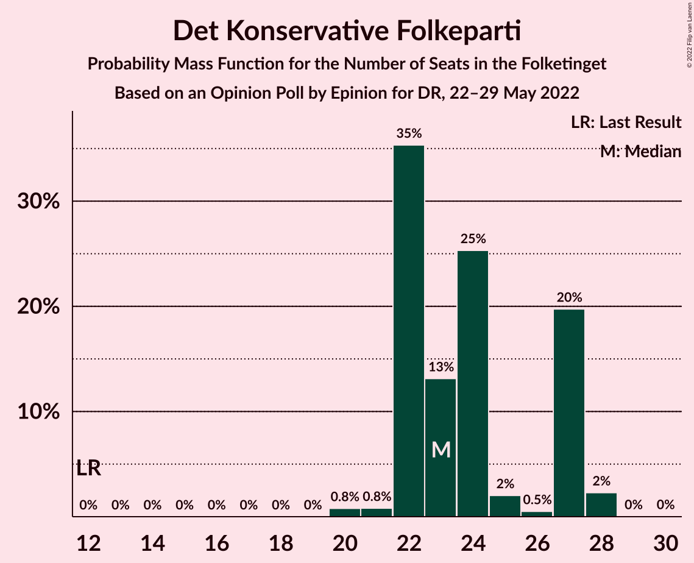
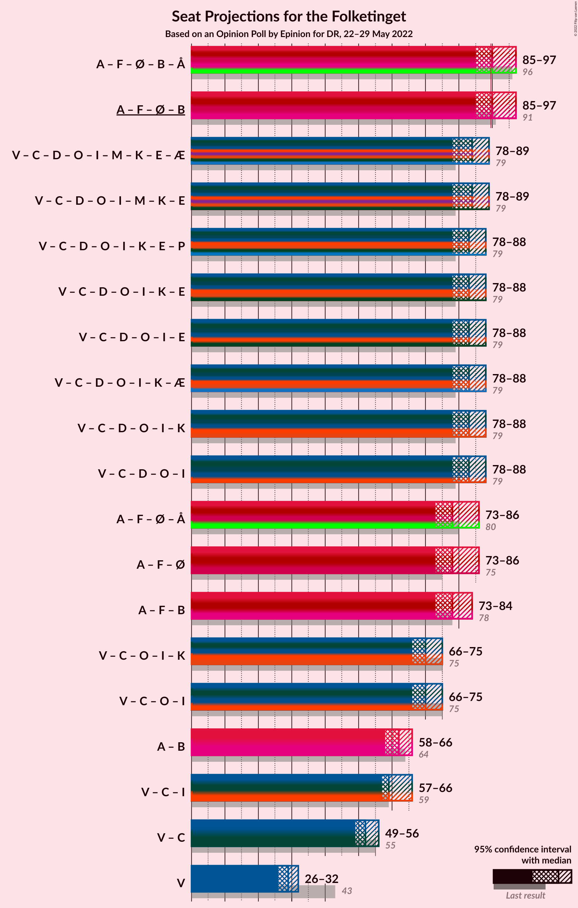
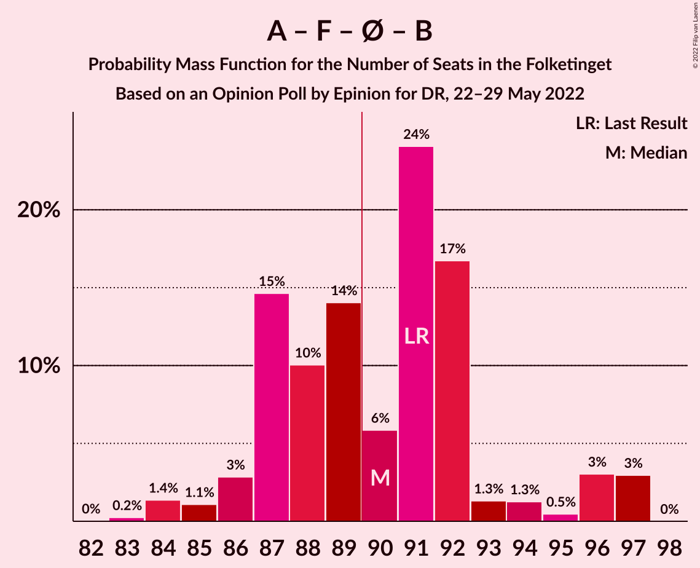
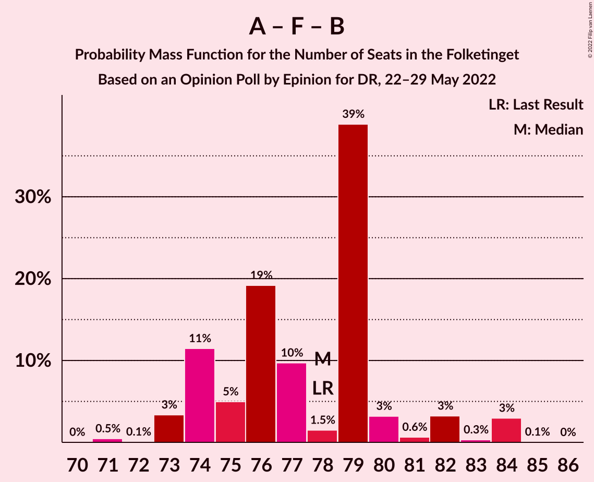

# Opinion Poll by Epinion for DR, 22–29 May 2022

<a href="#voting-intentions">Voting Intentions</a> | <a href="#seats">Seats</a> | <a href="#coalitions">Coalitions</a> | <a href="#technical-information">Technical Information</a>

## Voting Intentions

### Confidence Intervals

| Party | Last Result | Poll Result | 80% Confidence Interval | 90% Confidence Interval | 95% Confidence Interval | 99% Confidence Interval |
|:-----:|:-----------:|:-----------:|:-----------------------:|:-----------------------:|:-----------------------:|:-----------------------:|
| Socialdemokraterne | 25.9% | 27.2% | 26.0–28.5% |25.6–28.8% |25.3–29.1% |24.8–29.8% |
| Venstre | 23.4% | 15.7% | 14.7–16.8% |14.4–17.1% |14.2–17.3% |13.7–17.8% |
| Det Konservative Folkeparti | 6.6% | 13.0% | 12.1–14.0% |11.8–14.3% |11.6–14.5% |11.2–15.0% |
| Socialistisk Folkeparti | 7.7% | 8.4% | 7.7–9.2% |7.5–9.5% |7.3–9.7% |6.9–10.1% |
| Nye Borgerlige | 2.4% | 7.0% | 6.3–7.8% |6.2–8.0% |6.0–8.2% |5.7–8.6% |
| Enhedslisten–De Rød-Grønne | 6.9% | 6.5% | 5.8–7.2% |5.7–7.5% |5.5–7.6% |5.2–8.0% |
| Radikale Venstre | 8.6% | 6.1% | 5.5–6.8% |5.3–7.0% |5.2–7.2% |4.9–7.6% |
| Dansk Folkeparti | 8.7% | 5.3% | 4.7–6.0% |4.5–6.2% |4.4–6.3% |4.1–6.7% |
| Liberal Alliance | 2.3% | 3.9% | 3.4–4.5% |3.3–4.7% |3.2–4.8% |2.9–5.1% |
| Moderaterne | 0.0% | 1.9% | 1.6–2.4% |1.5–2.5% |1.4–2.6% |1.2–2.8% |
| Frie Grønne | 0.0% | 1.6% | 1.3–2.0% |1.2–2.2% |1.2–2.3% |1.0–2.5% |
| Alternativet | 3.0% | 1.0% | 0.8–1.4% |0.7–1.4% |0.7–1.5% |0.5–1.7% |
| Kristendemokraterne | 1.7% | 0.6% | 0.4–0.9% |0.4–1.0% |0.4–1.1% |0.3–1.2% |
| Veganerpartiet | 0.0% | 0.5% | 0.3–0.7% |0.3–0.8% |0.3–0.9% |0.2–1.0% |

*Note:* The poll result column reflects the actual value used in the calculations. Published results may vary slightly, and in addition be rounded to fewer digits.

## Seats

### Confidence Intervals

| Party | Last Result | Median | 80% Confidence Interval | 90% Confidence Interval | 95% Confidence Interval | 99% Confidence Interval |
|:-----:|:-----------:|:------:|:-----------------------:|:-----------------------:|:-----------------------:|:-----------------------:|
| <a href="#socialdemokraterne">Socialdemokraterne</a> | 48 | 51 | 47–52 |47–54 |47–55 |45–55 |
| <a href="#venstre">Venstre</a> | 43 | 29 | 27–30 |27–32 |26–32 |26–34 |
| <a href="#det-konservative-folkeparti">Det Konservative Folkeparti</a> | 12 | 23 | 22–27 |22–27 |22–27 |20–28 |
| <a href="#socialistisk-folkeparti">Socialistisk Folkeparti</a> | 14 | 16 | 14–17 |14–17 |14–18 |13–18 |
| <a href="#nye-borgerlige">Nye Borgerlige</a> | 4 | 13 | 12–15 |11–15 |11–15 |11–16 |
| <a href="#enhedslisten–de-rød-grønne">Enhedslisten–De Rød-Grønne</a> | 13 | 13 | 11–13 |11–14 |11–14 |10–15 |
| <a href="#radikale-venstre">Radikale Venstre</a> | 16 | 11 | 11–12 |10–13 |10–13 |9–14 |
| <a href="#dansk-folkeparti">Dansk Folkeparti</a> | 16 | 10 | 9–12 |8–12 |8–12 |8–12 |
| <a href="#liberal-alliance">Liberal Alliance</a> | 4 | 7 | 7–8 |6–9 |6–10 |6–10 |
| <a href="#moderaterne">Moderaterne</a> | 0 | 0 | 0–4 |0–4 |0–5 |0–5 |
| <a href="#frie-grønne">Frie Grønne</a> | 0 | 0 | 0 |0–4 |0–4 |0–4 |
| <a href="#alternativet">Alternativet</a> | 5 | 0 | 0 |0 |0 |0 |
| <a href="#kristendemokraterne">Kristendemokraterne</a> | 0 | 0 | 0 |0 |0 |0 |
| <a href="#veganerpartiet">Veganerpartiet</a> | 0 | 0 | 0 |0 |0 |0 |

### Socialdemokraterne

*For a full overview of the results for this party, see the [Socialdemokraterne](party-socialdemokraterne.html) page.*

| Number of Seats | Probability | Accumulated | Special Marks |
|:---------------:|:-----------:|:-----------:|:-------------:|
| 44 | 0.4% | 100% |  |
| 45 | 2% | 99.6% |  |
| 46 | 0.1% | 98% |  |
| 47 | 15% | 98% |  |
| 48 | 2% | 83% | Last Result |
| 49 | 8% | 81% |  |
| 50 | 16% | 73% |  |
| 51 | 44% | 58% | Median |
| 52 | 3% | 13% |  |
| 53 | 3% | 10% |  |
| 54 | 3% | 7% |  |
| 55 | 4% | 4% |  |
| 56 | 0% | 0.1% |  |
| 57 | 0.1% | 0.1% |  |
| 58 | 0% | 0% |  |

### Venstre

*For a full overview of the results for this party, see the [Venstre](party-venstre.html) page.*

| Number of Seats | Probability | Accumulated | Special Marks |
|:---------------:|:-----------:|:-----------:|:-------------:|
| 25 | 0.1% | 100% |  |
| 26 | 3% | 99.8% |  |
| 27 | 16% | 97% |  |
| 28 | 7% | 80% |  |
| 29 | 37% | 74% | Median |
| 30 | 27% | 36% |  |
| 31 | 1.4% | 10% |  |
| 32 | 7% | 8% |  |
| 33 | 0.2% | 0.7% |  |
| 34 | 0.5% | 0.5% |  |
| 35 | 0% | 0% |  |
| 36 | 0% | 0% |  |
| 37 | 0% | 0% |  |
| 38 | 0% | 0% |  |
| 39 | 0% | 0% |  |
| 40 | 0% | 0% |  |
| 41 | 0% | 0% |  |
| 42 | 0% | 0% |  |
| 43 | 0% | 0% | Last Result |

### Det Konservative Folkeparti

*For a full overview of the results for this party, see the [Det Konservative Folkeparti](party-detkonservativefolkeparti.html) page.*

| Number of Seats | Probability | Accumulated | Special Marks |
|:---------------:|:-----------:|:-----------:|:-------------:|
| 12 | 0% | 100% | Last Result |
| 13 | 0% | 100% |  |
| 14 | 0% | 100% |  |
| 15 | 0% | 100% |  |
| 16 | 0% | 100% |  |
| 17 | 0% | 100% |  |
| 18 | 0% | 100% |  |
| 19 | 0% | 100% |  |
| 20 | 0.8% | 100% |  |
| 21 | 0.8% | 99.2% |  |
| 22 | 35% | 98% |  |
| 23 | 13% | 63% | Median |
| 24 | 25% | 50% |  |
| 25 | 2% | 25% |  |
| 26 | 0.5% | 23% |  |
| 27 | 20% | 22% |  |
| 28 | 2% | 2% |  |
| 29 | 0% | 0.1% |  |
| 30 | 0% | 0% |  |

### Socialistisk Folkeparti

*For a full overview of the results for this party, see the [Socialistisk Folkeparti](party-socialistiskfolkeparti.html) page.*

| Number of Seats | Probability | Accumulated | Special Marks |
|:---------------:|:-----------:|:-----------:|:-------------:|
| 12 | 0.1% | 100% |  |
| 13 | 2% | 99.9% |  |
| 14 | 22% | 98% | Last Result |
| 15 | 10% | 76% |  |
| 16 | 23% | 66% | Median |
| 17 | 39% | 43% |  |
| 18 | 4% | 5% |  |
| 19 | 0.3% | 0.4% |  |
| 20 | 0% | 0% |  |

### Nye Borgerlige

*For a full overview of the results for this party, see the [Nye Borgerlige](party-nyeborgerlige.html) page.*

| Number of Seats | Probability | Accumulated | Special Marks |
|:---------------:|:-----------:|:-----------:|:-------------:|
| 4 | 0% | 100% | Last Result |
| 5 | 0% | 100% |  |
| 6 | 0% | 100% |  |
| 7 | 0% | 100% |  |
| 8 | 0% | 100% |  |
| 9 | 0% | 100% |  |
| 10 | 0.4% | 100% |  |
| 11 | 6% | 99.6% |  |
| 12 | 31% | 94% |  |
| 13 | 22% | 63% | Median |
| 14 | 30% | 40% |  |
| 15 | 9% | 11% |  |
| 16 | 2% | 2% |  |
| 17 | 0.1% | 0.1% |  |
| 18 | 0% | 0% |  |

### Enhedslisten–De Rød-Grønne

*For a full overview of the results for this party, see the [Enhedslisten–De Rød-Grønne](party-enhedslisten–derød-grønne.html) page.*

| Number of Seats | Probability | Accumulated | Special Marks |
|:---------------:|:-----------:|:-----------:|:-------------:|
| 9 | 0.1% | 100% |  |
| 10 | 0.6% | 99.9% |  |
| 11 | 13% | 99.3% |  |
| 12 | 31% | 87% |  |
| 13 | 47% | 56% | Last Result, Median |
| 14 | 9% | 9% |  |
| 15 | 0.7% | 0.7% |  |
| 16 | 0% | 0% |  |

### Radikale Venstre

*For a full overview of the results for this party, see the [Radikale Venstre](party-radikalevenstre.html) page.*

| Number of Seats | Probability | Accumulated | Special Marks |
|:---------------:|:-----------:|:-----------:|:-------------:|
| 8 | 0.1% | 100% |  |
| 9 | 1.1% | 99.9% |  |
| 10 | 6% | 98.8% |  |
| 11 | 58% | 93% | Median |
| 12 | 25% | 35% |  |
| 13 | 7% | 9% |  |
| 14 | 2% | 2% |  |
| 15 | 0% | 0% |  |
| 16 | 0% | 0% | Last Result |

### Dansk Folkeparti

*For a full overview of the results for this party, see the [Dansk Folkeparti](party-danskfolkeparti.html) page.*

| Number of Seats | Probability | Accumulated | Special Marks |
|:---------------:|:-----------:|:-----------:|:-------------:|
| 7 | 0.1% | 100% |  |
| 8 | 7% | 99.9% |  |
| 9 | 34% | 93% |  |
| 10 | 42% | 59% | Median |
| 11 | 4% | 17% |  |
| 12 | 12% | 13% |  |
| 13 | 0.1% | 0.1% |  |
| 14 | 0% | 0% |  |
| 15 | 0% | 0% |  |
| 16 | 0% | 0% | Last Result |

### Liberal Alliance

*For a full overview of the results for this party, see the [Liberal Alliance](party-liberalalliance.html) page.*

| Number of Seats | Probability | Accumulated | Special Marks |
|:---------------:|:-----------:|:-----------:|:-------------:|
| 4 | 0% | 100% | Last Result |
| 5 | 0.4% | 100% |  |
| 6 | 9% | 99.6% |  |
| 7 | 59% | 91% | Median |
| 8 | 23% | 31% |  |
| 9 | 5% | 8% |  |
| 10 | 3% | 3% |  |
| 11 | 0% | 0% |  |

### Moderaterne

*For a full overview of the results for this party, see the [Moderaterne](party-moderaterne.html) page.*

| Number of Seats | Probability | Accumulated | Special Marks |
|:---------------:|:-----------:|:-----------:|:-------------:|
| 0 | 67% | 100% | Last Result, Median |
| 1 | 0% | 33% |  |
| 2 | 0% | 33% |  |
| 3 | 0% | 33% |  |
| 4 | 30% | 33% |  |
| 5 | 3% | 3% |  |
| 6 | 0.1% | 0.1% |  |
| 7 | 0% | 0% |  |

### Frie Grønne

*For a full overview of the results for this party, see the [Frie Grønne](party-friegrønne.html) page.*

| Number of Seats | Probability | Accumulated | Special Marks |
|:---------------:|:-----------:|:-----------:|:-------------:|
| 0 | 91% | 100% | Last Result, Median |
| 1 | 0% | 9% |  |
| 2 | 0% | 9% |  |
| 3 | 0% | 9% |  |
| 4 | 8% | 9% |  |
| 5 | 0.4% | 0.4% |  |
| 6 | 0% | 0% |  |

### Alternativet

*For a full overview of the results for this party, see the [Alternativet](party-alternativet.html) page.*

| Number of Seats | Probability | Accumulated | Special Marks |
|:---------------:|:-----------:|:-----------:|:-------------:|
| 0 | 100% | 100% | Median |
| 1 | 0% | 0% |  |
| 2 | 0% | 0% |  |
| 3 | 0% | 0% |  |
| 4 | 0% | 0% |  |
| 5 | 0% | 0% | Last Result |

### Kristendemokraterne

*For a full overview of the results for this party, see the [Kristendemokraterne](party-kristendemokraterne.html) page.*

| Number of Seats | Probability | Accumulated | Special Marks |
|:---------------:|:-----------:|:-----------:|:-------------:|
| 0 | 100% | 100% | Last Result, Median |

### Veganerpartiet

*For a full overview of the results for this party, see the [Veganerpartiet](party-veganerpartiet.html) page.*

| Number of Seats | Probability | Accumulated | Special Marks |
|:---------------:|:-----------:|:-----------:|:-------------:|
| 0 | 100% | 100% | Last Result, Median |

## Coalitions

### Confidence Intervals

| Coalition | Last Result | Median | Majority? | 80% Confidence Interval | 90% Confidence Interval | 95% Confidence Interval | 99% Confidence Interval |
|:---------:|:-----------:|:------:|:---------:|:-----------------------:|:-----------------------:|:-----------------------:|:-----------------------:|
| Socialdemokraterne – Socialistisk Folkeparti – Enhedslisten–De Rød-Grønne – Radikale Venstre – Alternativet | 96 | 90 | 56% | 87–92 | 86–96 | 85–97 | 84–97 |
| Socialdemokraterne – Socialistisk Folkeparti – Enhedslisten–De Rød-Grønne – Radikale Venstre | 91 | 90 | 56% | 87–92 | 86–96 | 85–97 | 84–97 |
| Venstre – Det Konservative Folkeparti – Nye Borgerlige – Dansk Folkeparti – Liberal Alliance – Kristendemokraterne | 79 | 83 | 0.2% | 80–85 | 79–86 | 78–88 | 77–89 |
| Venstre – Det Konservative Folkeparti – Nye Borgerlige – Dansk Folkeparti – Liberal Alliance | 79 | 83 | 0.2% | 80–85 | 79–86 | 78–88 | 77–89 |
| Socialdemokraterne – Socialistisk Folkeparti – Enhedslisten–De Rød-Grønne – Alternativet | 80 | 78 | 0% | 76–81 | 75–84 | 73–86 | 73–86 |
| Socialdemokraterne – Socialistisk Folkeparti – Enhedslisten–De Rød-Grønne | 75 | 78 | 0% | 76–81 | 75–84 | 73–86 | 73–86 |
| Socialdemokraterne – Socialistisk Folkeparti – Radikale Venstre | 78 | 78 | 0% | 74–80 | 74–82 | 73–84 | 72–84 |
| Venstre – Det Konservative Folkeparti – Dansk Folkeparti – Liberal Alliance – Kristendemokraterne | 75 | 70 | 0% | 68–73 | 66–73 | 66–75 | 64–75 |
| Venstre – Det Konservative Folkeparti – Dansk Folkeparti – Liberal Alliance | 75 | 70 | 0% | 68–73 | 66–73 | 66–75 | 64–75 |
| Socialdemokraterne – Radikale Venstre | 64 | 62 | 0% | 58–64 | 58–66 | 58–66 | 56–67 |
| Venstre – Det Konservative Folkeparti – Liberal Alliance | 59 | 59 | 0% | 58–63 | 58–63 | 57–66 | 56–66 |
| Venstre – Det Konservative Folkeparti | 55 | 52 | 0% | 51–56 | 50–56 | 49–56 | 49–57 |
| Venstre | 43 | 29 | 0% | 27–30 | 27–32 | 26–32 | 26–34 |

### Socialdemokraterne – Socialistisk Folkeparti – Enhedslisten–De Rød-Grønne – Radikale Venstre – Alternativet

| Number of Seats | Probability | Accumulated | Special Marks |
|:---------------:|:-----------:|:-----------:|:-------------:|
| 83 | 0.2% | 100% |  |
| 84 | 1.4% | 99.7% |  |
| 85 | 1.1% | 98% |  |
| 86 | 3% | 97% |  |
| 87 | 15% | 94% |  |
| 88 | 10% | 80% |  |
| 89 | 14% | 70% |  |
| 90 | 6% | 56% | Majority |
| 91 | 24% | 50% | Median |
| 92 | 17% | 26% |  |
| 93 | 1.3% | 9% |  |
| 94 | 1.3% | 8% |  |
| 95 | 0.5% | 6% |  |
| 96 | 3% | 6% | Last Result |
| 97 | 3% | 3% |  |
| 98 | 0% | 0% |  |

### Socialdemokraterne – Socialistisk Folkeparti – Enhedslisten–De Rød-Grønne – Radikale Venstre

| Number of Seats | Probability | Accumulated | Special Marks |
|:---------------:|:-----------:|:-----------:|:-------------:|
| 83 | 0.2% | 100% |  |
| 84 | 1.4% | 99.7% |  |
| 85 | 1.1% | 98% |  |
| 86 | 3% | 97% |  |
| 87 | 15% | 94% |  |
| 88 | 10% | 80% |  |
| 89 | 14% | 70% |  |
| 90 | 6% | 56% | Majority |
| 91 | 24% | 50% | Last Result, Median |
| 92 | 17% | 26% |  |
| 93 | 1.3% | 9% |  |
| 94 | 1.3% | 8% |  |
| 95 | 0.5% | 6% |  |
| 96 | 3% | 6% |  |
| 97 | 3% | 3% |  |
| 98 | 0% | 0% |  |

### Venstre – Det Konservative Folkeparti – Nye Borgerlige – Dansk Folkeparti – Liberal Alliance – Kristendemokraterne

| Number of Seats | Probability | Accumulated | Special Marks |
|:---------------:|:-----------:|:-----------:|:-------------:|
| 76 | 0.1% | 100% |  |
| 77 | 1.0% | 99.9% |  |
| 78 | 4% | 98.8% |  |
| 79 | 3% | 95% | Last Result |
| 80 | 2% | 92% |  |
| 81 | 0.9% | 90% |  |
| 82 | 15% | 89% | Median |
| 83 | 26% | 74% |  |
| 84 | 35% | 47% |  |
| 85 | 6% | 12% |  |
| 86 | 0.7% | 5% |  |
| 87 | 1.4% | 5% |  |
| 88 | 3% | 3% |  |
| 89 | 0.5% | 0.7% |  |
| 90 | 0.1% | 0.2% | Majority |
| 91 | 0% | 0.2% |  |
| 92 | 0.2% | 0.2% |  |
| 93 | 0% | 0% |  |

### Venstre – Det Konservative Folkeparti – Nye Borgerlige – Dansk Folkeparti – Liberal Alliance

| Number of Seats | Probability | Accumulated | Special Marks |
|:---------------:|:-----------:|:-----------:|:-------------:|
| 76 | 0.1% | 100% |  |
| 77 | 1.0% | 99.9% |  |
| 78 | 4% | 98.8% |  |
| 79 | 3% | 95% | Last Result |
| 80 | 2% | 92% |  |
| 81 | 0.9% | 90% |  |
| 82 | 15% | 89% | Median |
| 83 | 26% | 74% |  |
| 84 | 35% | 47% |  |
| 85 | 6% | 12% |  |
| 86 | 0.7% | 5% |  |
| 87 | 1.4% | 5% |  |
| 88 | 3% | 3% |  |
| 89 | 0.5% | 0.7% |  |
| 90 | 0.1% | 0.2% | Majority |
| 91 | 0% | 0.2% |  |
| 92 | 0.2% | 0.2% |  |
| 93 | 0% | 0% |  |

### Socialdemokraterne – Socialistisk Folkeparti – Enhedslisten–De Rød-Grønne – Alternativet

| Number of Seats | Probability | Accumulated | Special Marks |
|:---------------:|:-----------:|:-----------:|:-------------:|
| 72 | 0.2% | 100% |  |
| 73 | 2% | 99.8% |  |
| 74 | 0.6% | 97% |  |
| 75 | 4% | 97% |  |
| 76 | 14% | 93% |  |
| 77 | 28% | 79% |  |
| 78 | 2% | 51% |  |
| 79 | 2% | 49% |  |
| 80 | 21% | 47% | Last Result, Median |
| 81 | 18% | 26% |  |
| 82 | 0.8% | 8% |  |
| 83 | 0.8% | 7% |  |
| 84 | 3% | 6% |  |
| 85 | 0.1% | 3% |  |
| 86 | 3% | 3% |  |
| 87 | 0% | 0% |  |

### Socialdemokraterne – Socialistisk Folkeparti – Enhedslisten–De Rød-Grønne

| Number of Seats | Probability | Accumulated | Special Marks |
|:---------------:|:-----------:|:-----------:|:-------------:|
| 72 | 0.2% | 100% |  |
| 73 | 2% | 99.8% |  |
| 74 | 0.6% | 97% |  |
| 75 | 4% | 97% | Last Result |
| 76 | 14% | 93% |  |
| 77 | 28% | 79% |  |
| 78 | 2% | 51% |  |
| 79 | 2% | 49% |  |
| 80 | 21% | 47% | Median |
| 81 | 18% | 26% |  |
| 82 | 0.8% | 8% |  |
| 83 | 0.8% | 7% |  |
| 84 | 3% | 6% |  |
| 85 | 0.1% | 3% |  |
| 86 | 3% | 3% |  |
| 87 | 0% | 0% |  |

### Socialdemokraterne – Socialistisk Folkeparti – Radikale Venstre

| Number of Seats | Probability | Accumulated | Special Marks |
|:---------------:|:-----------:|:-----------:|:-------------:|
| 71 | 0.5% | 100% |  |
| 72 | 0.1% | 99.5% |  |
| 73 | 3% | 99.4% |  |
| 74 | 11% | 96% |  |
| 75 | 5% | 85% |  |
| 76 | 19% | 80% |  |
| 77 | 10% | 60% |  |
| 78 | 1.5% | 51% | Last Result, Median |
| 79 | 39% | 49% |  |
| 80 | 3% | 10% |  |
| 81 | 0.6% | 7% |  |
| 82 | 3% | 7% |  |
| 83 | 0.3% | 3% |  |
| 84 | 3% | 3% |  |
| 85 | 0.1% | 0.1% |  |
| 86 | 0% | 0% |  |

### Venstre – Det Konservative Folkeparti – Dansk Folkeparti – Liberal Alliance – Kristendemokraterne

| Number of Seats | Probability | Accumulated | Special Marks |
|:---------------:|:-----------:|:-----------:|:-------------:|
| 63 | 0% | 100% |  |
| 64 | 0.6% | 99.9% |  |
| 65 | 0.1% | 99.3% |  |
| 66 | 7% | 99.2% |  |
| 67 | 0.8% | 93% |  |
| 68 | 23% | 92% |  |
| 69 | 17% | 69% | Median |
| 70 | 3% | 52% |  |
| 71 | 15% | 48% |  |
| 72 | 22% | 33% |  |
| 73 | 7% | 11% |  |
| 74 | 0.5% | 4% |  |
| 75 | 3% | 3% | Last Result |
| 76 | 0.2% | 0.3% |  |
| 77 | 0.1% | 0.1% |  |
| 78 | 0% | 0% |  |

### Venstre – Det Konservative Folkeparti – Dansk Folkeparti – Liberal Alliance

| Number of Seats | Probability | Accumulated | Special Marks |
|:---------------:|:-----------:|:-----------:|:-------------:|
| 63 | 0% | 100% |  |
| 64 | 0.6% | 99.9% |  |
| 65 | 0.1% | 99.3% |  |
| 66 | 7% | 99.2% |  |
| 67 | 0.8% | 93% |  |
| 68 | 23% | 92% |  |
| 69 | 17% | 69% | Median |
| 70 | 3% | 52% |  |
| 71 | 15% | 48% |  |
| 72 | 22% | 33% |  |
| 73 | 7% | 11% |  |
| 74 | 0.5% | 4% |  |
| 75 | 3% | 3% | Last Result |
| 76 | 0.2% | 0.3% |  |
| 77 | 0.1% | 0.1% |  |
| 78 | 0% | 0% |  |

### Socialdemokraterne – Radikale Venstre

| Number of Seats | Probability | Accumulated | Special Marks |
|:---------------:|:-----------:|:-----------:|:-------------:|
| 55 | 0.4% | 100% |  |
| 56 | 1.2% | 99.5% |  |
| 57 | 0.7% | 98% |  |
| 58 | 10% | 98% |  |
| 59 | 2% | 88% |  |
| 60 | 7% | 86% |  |
| 61 | 7% | 79% |  |
| 62 | 57% | 72% | Median |
| 63 | 4% | 15% |  |
| 64 | 2% | 11% | Last Result |
| 65 | 1.3% | 9% |  |
| 66 | 6% | 7% |  |
| 67 | 0.9% | 0.9% |  |
| 68 | 0.1% | 0.1% |  |
| 69 | 0% | 0% |  |

### Venstre – Det Konservative Folkeparti – Liberal Alliance

| Number of Seats | Probability | Accumulated | Special Marks |
|:---------------:|:-----------:|:-----------:|:-------------:|
| 54 | 0.1% | 100% |  |
| 55 | 0.1% | 99.8% |  |
| 56 | 1.3% | 99.7% |  |
| 57 | 3% | 98% |  |
| 58 | 17% | 95% |  |
| 59 | 34% | 78% | Last Result, Median |
| 60 | 8% | 44% |  |
| 61 | 6% | 36% |  |
| 62 | 1.5% | 31% |  |
| 63 | 25% | 29% |  |
| 64 | 1.4% | 4% |  |
| 65 | 0.4% | 3% |  |
| 66 | 3% | 3% |  |
| 67 | 0% | 0.1% |  |
| 68 | 0% | 0% |  |

### Venstre – Det Konservative Folkeparti

| Number of Seats | Probability | Accumulated | Special Marks |
|:---------------:|:-----------:|:-----------:|:-------------:|
| 46 | 0% | 100% |  |
| 47 | 0.1% | 99.9% |  |
| 48 | 0.2% | 99.9% |  |
| 49 | 4% | 99.7% |  |
| 50 | 4% | 96% |  |
| 51 | 25% | 92% |  |
| 52 | 24% | 67% | Median |
| 53 | 11% | 43% |  |
| 54 | 4% | 33% |  |
| 55 | 1.0% | 29% | Last Result |
| 56 | 27% | 28% |  |
| 57 | 0.6% | 1.0% |  |
| 58 | 0.2% | 0.4% |  |
| 59 | 0.1% | 0.2% |  |
| 60 | 0% | 0% |  |

### Venstre

| Number of Seats | Probability | Accumulated | Special Marks |
|:---------------:|:-----------:|:-----------:|:-------------:|
| 25 | 0.1% | 100% |  |
| 26 | 3% | 99.8% |  |
| 27 | 16% | 97% |  |
| 28 | 7% | 80% |  |
| 29 | 37% | 74% | Median |
| 30 | 27% | 36% |  |
| 31 | 1.4% | 10% |  |
| 32 | 7% | 8% |  |
| 33 | 0.2% | 0.7% |  |
| 34 | 0.5% | 0.5% |  |
| 35 | 0% | 0% |  |
| 36 | 0% | 0% |  |
| 37 | 0% | 0% |  |
| 38 | 0% | 0% |  |
| 39 | 0% | 0% |  |
| 40 | 0% | 0% |  |
| 41 | 0% | 0% |  |
| 42 | 0% | 0% |  |
| 43 | 0% | 0% | Last Result |

## Technical Information

### Opinion Poll

+ **Polling firm:** Epinion
+ **Commissioner(s):** DR
+ **Fieldwork period:** 22–29 May 2022

### Calculations

+ **Sample size:** 2096
+ **Simulations done:** 1,048,576
+ **Error estimate:** 2.03%

