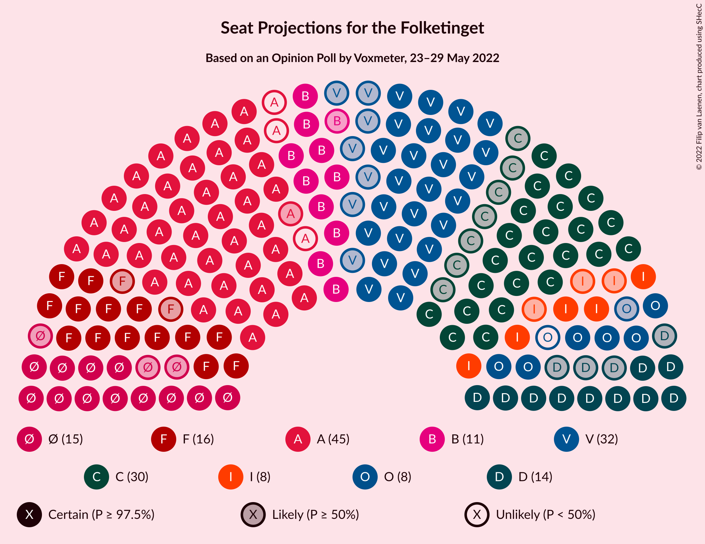

# Opinion Poll by Voxmeter, 23–29 May 2022

<a href="#voting-intentions">Voting Intentions</a> | <a href="#seats">Seats</a> | <a href="#coalitions">Coalitions</a> | <a href="#technical-information">Technical Information</a>

## Voting Intentions

### Confidence Intervals

| Party | Last Result | Poll Result | 80% Confidence Interval | 90% Confidence Interval | 95% Confidence Interval | 99% Confidence Interval |
|:-----:|:-----------:|:-----------:|:-----------------------:|:-----------------------:|:-----------------------:|:-----------------------:|
| Socialdemokraterne | 25.9% | 24.9% | 23.2–26.7% |22.7–27.2% |22.3–27.6% |21.5–28.5% |
| Venstre | 23.4% | 16.1% | 14.7–17.7% |14.3–18.1% |13.9–18.5% |13.3–19.3% |
| Det Konservative Folkeparti | 6.6% | 14.9% | 13.5–16.4% |13.1–16.9% |12.8–17.2% |12.2–18.0% |
| Socialistisk Folkeparti | 7.7% | 9.5% | 8.4–10.8% |8.1–11.2% |7.8–11.5% |7.3–12.1% |
| Enhedslisten–De Rød-Grønne | 6.9% | 7.7% | 6.7–8.9% |6.4–9.2% |6.2–9.5% |5.7–10.1% |
| Radikale Venstre | 8.6% | 7.1% | 6.1–8.2% |5.9–8.6% |5.7–8.9% |5.2–9.4% |
| Nye Borgerlige | 2.4% | 6.9% | 6.0–8.0% |5.7–8.4% |5.5–8.6% |5.1–9.2% |
| Dansk Folkeparti | 8.7% | 4.0% | 3.3–4.9% |3.1–5.2% |2.9–5.4% |2.6–5.9% |
| Liberal Alliance | 2.3% | 3.6% | 2.9–4.5% |2.8–4.7% |2.6–5.0% |2.3–5.4% |
| Moderaterne | N/A | 1.4% | 1.0–2.0% |0.9–2.2% |0.8–2.3% |0.7–2.7% |
| Alternativet | 3.0% | 1.3% | 0.9–1.9% |0.8–2.1% |0.8–2.2% |0.6–2.5% |
| Kristendemokraterne | 1.7% | 0.7% | 0.5–1.2% |0.4–1.3% |0.3–1.4% |0.2–1.7% |
| Frie Grønne | 0.0% | 0.7% | 0.5–1.2% |0.4–1.3% |0.3–1.4% |0.2–1.7% |
| Veganerpartiet | 0.0% | 0.2% | 0.1–0.5% |0.1–0.6% |0.1–0.7% |0.0–0.9% |

*Note:* The poll result column reflects the actual value used in the calculations. Published results may vary slightly, and in addition be rounded to fewer digits.

## Seats

### Confidence Intervals

| Party | Last Result | Median | 80% Confidence Interval | 90% Confidence Interval | 95% Confidence Interval | 99% Confidence Interval |
|:-----:|:-----------:|:------:|:-----------------------:|:-----------------------:|:-----------------------:|:-----------------------:|
| <a href="#socialdemokraterne">Socialdemokraterne</a> | 48 | 42 | 42–47 |41–49 |41–49 |40–50 |
| <a href="#venstre">Venstre</a> | 43 | 32 | 27–33 |27–33 |25–34 |24–35 |
| <a href="#det-konservative-folkeparti">Det Konservative Folkeparti</a> | 12 | 30 | 24–30 |23–31 |23–32 |22–32 |
| <a href="#socialistisk-folkeparti">Socialistisk Folkeparti</a> | 14 | 16 | 14–18 |14–19 |14–21 |14–21 |
| <a href="#enhedslisten–de-rød-grønne">Enhedslisten–De Rød-Grønne</a> | 13 | 15 | 13–16 |12–18 |12–18 |11–18 |
| <a href="#radikale-venstre">Radikale Venstre</a> | 16 | 11 | 11–17 |11–17 |10–17 |10–17 |
| <a href="#nye-borgerlige">Nye Borgerlige</a> | 4 | 14 | 11–14 |11–16 |10–17 |9–18 |
| <a href="#dansk-folkeparti">Dansk Folkeparti</a> | 16 | 7 | 7–9 |6–9 |6–9 |5–10 |
| <a href="#liberal-alliance">Liberal Alliance</a> | 4 | 8 | 6–8 |5–8 |5–9 |4–10 |
| <a href="#moderaterne">Moderaterne</a> | N/A | 0 | 0–4 |0–4 |0–4 |0–5 |
| <a href="#alternativet">Alternativet</a> | 5 | 0 | 0 |0 |0 |0–5 |
| <a href="#kristendemokraterne">Kristendemokraterne</a> | 0 | 0 | 0 |0 |0 |0 |
| <a href="#frie-grønne">Frie Grønne</a> | 0 | 0 | 0 |0 |0 |0 |
| <a href="#veganerpartiet">Veganerpartiet</a> | 0 | 0 | 0 |0 |0 |0 |

