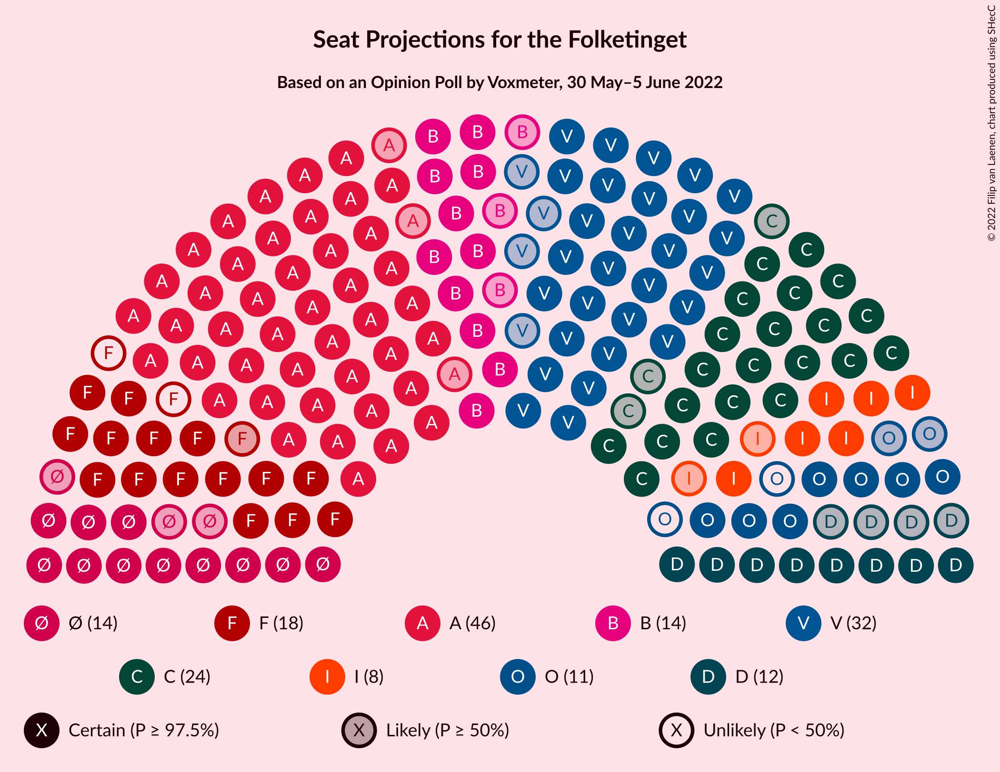

# Opinion Poll by Voxmeter, 30 May–5 June 2022

<a href="#voting-intentions">Voting Intentions</a> | <a href="#seats">Seats</a> | <a href="#coalitions">Coalitions</a> | <a href="#technical-information">Technical Information</a>

## Voting Intentions

### Confidence Intervals

| Party | Last Result | Poll Result | 80% Confidence Interval | 90% Confidence Interval | 95% Confidence Interval | 99% Confidence Interval |
|:-----:|:-----------:|:-----------:|:-----------------------:|:-----------------------:|:-----------------------:|:-----------------------:|
| Socialdemokraterne | 25.9% | 26.2% | 24.5–28.1% |24.0–28.6% |23.6–29.1% |22.8–30.0% |
| Venstre | 23.4% | 17.2% | 15.7–18.8% |15.3–19.2% |15.0–19.6% |14.3–20.4% |
| Det Konservative Folkeparti | 6.6% | 13.6% | 12.3–15.1% |11.9–15.5% |11.6–15.8% |11.0–16.6% |
| Socialistisk Folkeparti | 7.7% | 9.4% | 8.3–10.7% |8.0–11.0% |7.7–11.4% |7.2–12.0% |
| Enhedslisten–De Rød-Grønne | 6.9% | 7.3% | 6.3–8.4% |6.1–8.8% |5.8–9.1% |5.4–9.7% |
| Radikale Venstre | 8.6% | 7.2% | 6.2–8.4% |6.0–8.7% |5.7–9.0% |5.3–9.5% |
| Nye Borgerlige | 2.4% | 5.8% | 4.9–6.9% |4.7–7.1% |4.5–7.4% |4.1–8.0% |
| Dansk Folkeparti | 8.7% | 4.9% | 4.1–5.9% |3.9–6.2% |3.7–6.4% |3.4–6.9% |
| Liberal Alliance | 2.3% | 4.4% | 3.7–5.3% |3.5–5.6% |3.3–5.9% |3.0–6.3% |
| Moderaterne | N/A | 1.5% | 1.1–2.1% |1.0–2.3% |0.9–2.5% |0.7–2.8% |
| Kristendemokraterne | 1.7% | 0.9% | 0.6–1.4% |0.5–1.6% |0.5–1.7% |0.4–2.0% |
| Alternativet | 3.0% | 0.8% | 0.5–1.3% |0.5–1.4% |0.4–1.6% |0.3–1.8% |
| Frie Grønne | 0.0% | 0.3% | 0.2–0.7% |0.1–0.8% |0.1–0.9% |0.1–1.1% |

*Note:* The poll result column reflects the actual value used in the calculations. Published results may vary slightly, and in addition be rounded to fewer digits.

## Seats

### Confidence Intervals

| Party | Last Result | Median | 80% Confidence Interval | 90% Confidence Interval | 95% Confidence Interval | 99% Confidence Interval |
|:-----:|:-----------:|:------:|:-----------------------:|:-----------------------:|:-----------------------:|:-----------------------:|
| <a href="#socialdemokraterne">Socialdemokraterne</a> | 48 | 46 | 46–51 |46–51 |43–51 |42–57 |
| <a href="#venstre">Venstre</a> | 43 | 32 | 31–32 |30–34 |28–34 |26–36 |
| <a href="#det-konservative-folkeparti">Det Konservative Folkeparti</a> | 12 | 24 | 21–25 |21–26 |21–27 |20–29 |
| <a href="#socialistisk-folkeparti">Socialistisk Folkeparti</a> | 14 | 16 | 16–18 |15–19 |15–19 |14–21 |
| <a href="#enhedslisten–de-rød-grønne">Enhedslisten–De Rød-Grønne</a> | 13 | 14 | 12–15 |12–15 |11–16 |11–17 |
| <a href="#radikale-venstre">Radikale Venstre</a> | 16 | 14 | 12–15 |11–16 |11–17 |9–17 |
| <a href="#nye-borgerlige">Nye Borgerlige</a> | 4 | 12 | 9–12 |8–12 |8–12 |8–14 |
| <a href="#dansk-folkeparti">Dansk Folkeparti</a> | 16 | 9 | 8–11 |8–11 |7–11 |7–11 |
| <a href="#liberal-alliance">Liberal Alliance</a> | 4 | 8 | 7–9 |6–11 |6–11 |5–11 |
| <a href="#moderaterne">Moderaterne</a> | N/A | 0 | 0 |0 |0–4 |0–6 |
| <a href="#kristendemokraterne">Kristendemokraterne</a> | 0 | 0 | 0 |0 |0 |0–4 |
| <a href="#alternativet">Alternativet</a> | 5 | 0 | 0 |0 |0 |0 |
| <a href="#frie-grønne">Frie Grønne</a> | 0 | 0 | 0 |0 |0 |0 |

