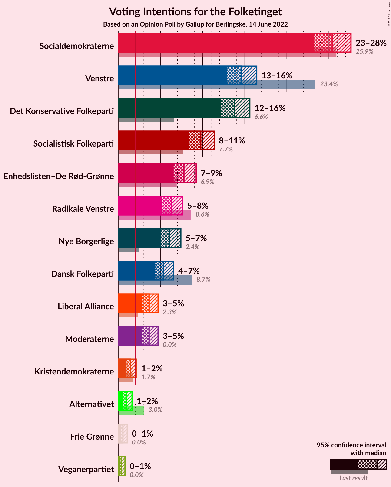
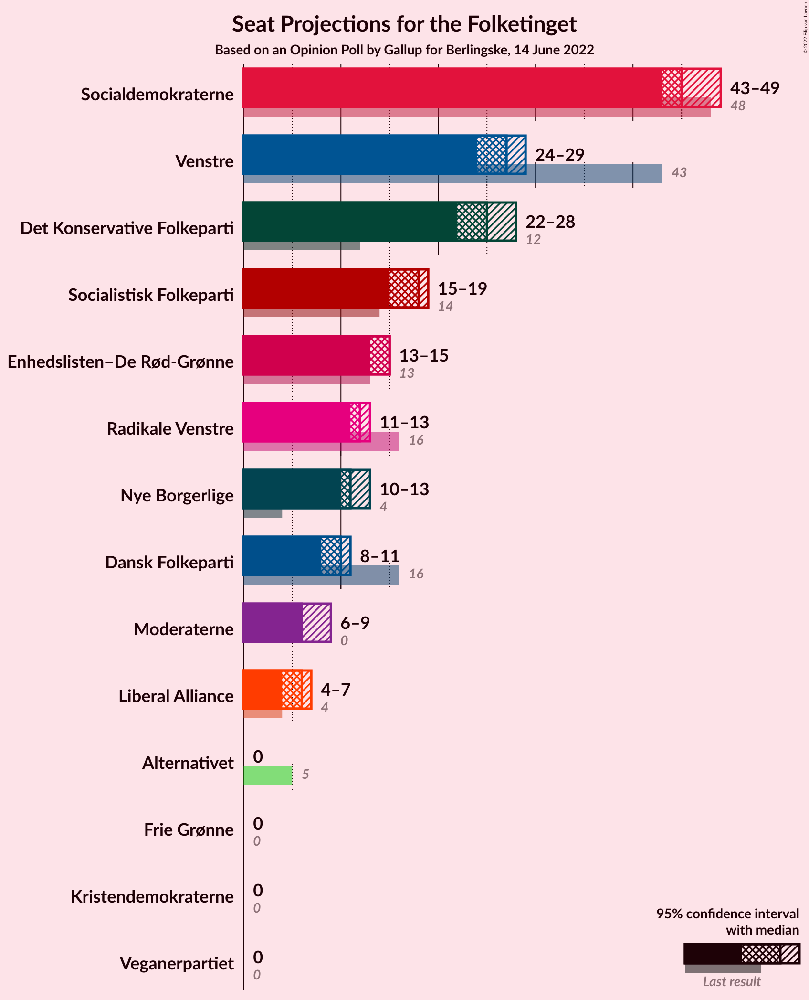
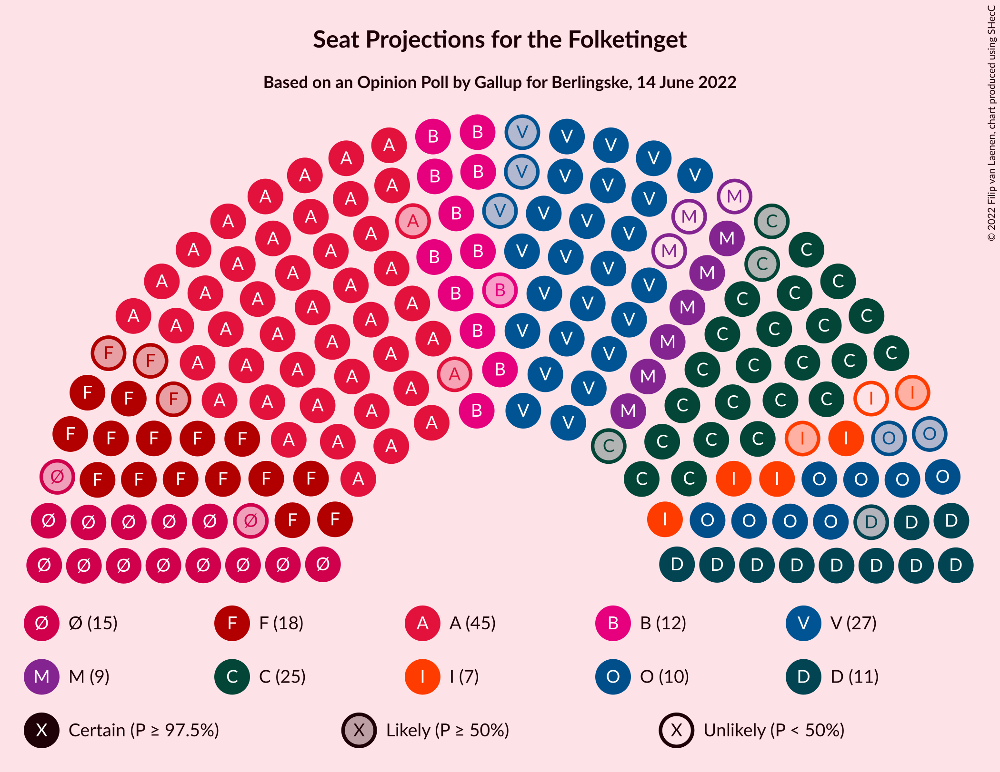

# Opinion Poll by Gallup for Berlingske, 14 June 2022

<a href="#voting-intentions">Voting Intentions</a> | <a href="#seats">Seats</a> | <a href="#coalitions">Coalitions</a> | <a href="#technical-information">Technical Information</a>

## Voting Intentions

### Confidence Intervals

| Party | Last Result | Poll Result | 80% Confidence Interval | 90% Confidence Interval | 95% Confidence Interval | 99% Confidence Interval |
|:-----:|:-----------:|:-----------:|:-----------------------:|:-----------------------:|:-----------------------:|:-----------------------:|
| Socialdemokraterne | 25.9% | 25.4% | 24.0–26.9% |23.6–27.3% |23.3–27.6% |22.6–28.3% |
| Venstre | 23.4% | 14.6% | 13.5–15.8% |13.2–16.1% |12.9–16.4% |12.4–17.0% |
| Det Konservative Folkeparti | 6.6% | 13.8% | 12.7–15.0% |12.4–15.3% |12.2–15.6% |11.7–16.2% |
| Socialistisk Folkeparti | 7.7% | 9.8% | 8.9–10.8% |8.6–11.1% |8.4–11.4% |8.0–11.9% |
| Enhedslisten–De Rød-Grønne | 6.9% | 7.8% | 7.0–8.7% |6.7–9.0% |6.5–9.2% |6.2–9.7% |
| Radikale Venstre | 8.6% | 6.3% | 5.5–7.1% |5.3–7.4% |5.2–7.6% |4.8–8.0% |
| Nye Borgerlige | 2.4% | 6.1% | 5.4–7.0% |5.2–7.2% |5.0–7.4% |4.7–7.8% |
| Dansk Folkeparti | 8.7% | 5.3% | 4.6–6.1% |4.5–6.4% |4.3–6.6% |4.0–7.0% |
| Liberal Alliance | 2.3% | 3.6% | 3.1–4.3% |2.9–4.5% |2.8–4.7% |2.6–5.0% |
| Moderaterne | N/A | 3.6% | 3.1–4.3% |2.9–4.5% |2.8–4.7% |2.6–5.0% |
| Kristendemokraterne | 1.7% | 1.4% | 1.1–1.9% |1.0–2.0% |0.9–2.1% |0.8–2.4% |
| Alternativet | 3.0% | 1.0% | 0.7–1.4% |0.6–1.5% |0.6–1.6% |0.5–1.8% |
| Frie Grønne | 0.0% | 0.5% | 0.4–0.9% |0.3–0.9% |0.3–1.0% |0.2–1.2% |
| Veganerpartiet | 0.0% | 0.3% | 0.2–0.6% |0.2–0.7% |0.1–0.8% |0.1–0.9% |

*Note:* The poll result column reflects the actual value used in the calculations. Published results may vary slightly, and in addition be rounded to fewer digits.

## Seats

### Confidence Intervals

| Party | Last Result | Median | 80% Confidence Interval | 90% Confidence Interval | 95% Confidence Interval | 99% Confidence Interval |
|:-----:|:-----------:|:------:|:-----------------------:|:-----------------------:|:-----------------------:|:-----------------------:|
| <a href="#socialdemokraterne">Socialdemokraterne</a> | 48 | 45 | 45 |44–46 |43–49 |42–50 |
| <a href="#venstre">Venstre</a> | 43 | 27 | 27 |24–28 |24–29 |23–31 |
| <a href="#det-konservative-folkeparti">Det Konservative Folkeparti</a> | 12 | 25 | 25 |23–26 |22–28 |22–28 |
| <a href="#socialistisk-folkeparti">Socialistisk Folkeparti</a> | 14 | 18 | 17–18 |17–19 |15–19 |15–21 |
| <a href="#enhedslisten–de-rød-grønne">Enhedslisten–De Rød-Grønne</a> | 13 | 15 | 14–15 |13–15 |13–15 |12–17 |
| <a href="#radikale-venstre">Radikale Venstre</a> | 16 | 12 | 12 |11–13 |11–13 |9–14 |
| <a href="#nye-borgerlige">Nye Borgerlige</a> | 4 | 11 | 11 |11–12 |10–13 |9–15 |
| <a href="#dansk-folkeparti">Dansk Folkeparti</a> | 16 | 10 | 10 |9–10 |8–11 |8–12 |
| <a href="#liberal-alliance">Liberal Alliance</a> | 4 | 6 | 6 |5–7 |4–7 |4–9 |
| <a href="#moderaterne">Moderaterne</a> | N/A | 6 | 6–7 |6–9 |6–9 |5–9 |
| <a href="#kristendemokraterne">Kristendemokraterne</a> | 0 | 0 | 0 |0 |0 |0–4 |
| <a href="#alternativet">Alternativet</a> | 5 | 0 | 0 |0 |0 |0 |
| <a href="#frie-grønne">Frie Grønne</a> | 0 | 0 | 0 |0 |0 |0 |
| <a href="#veganerpartiet">Veganerpartiet</a> | 0 | 0 | 0 |0 |0 |0 |

