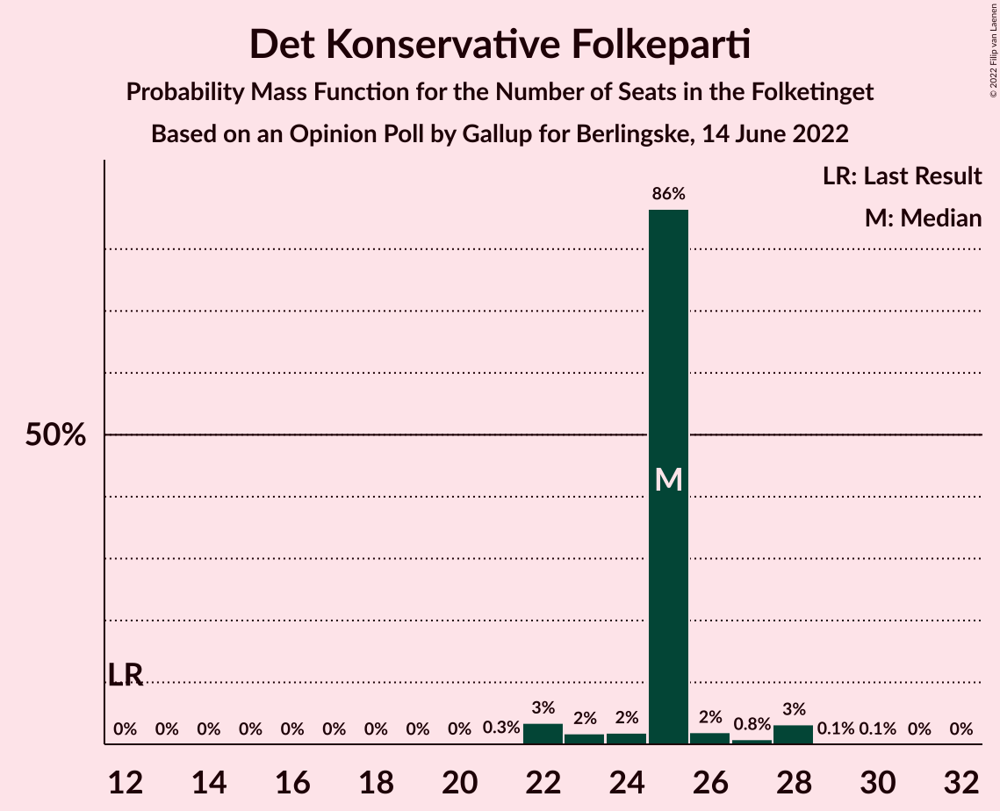
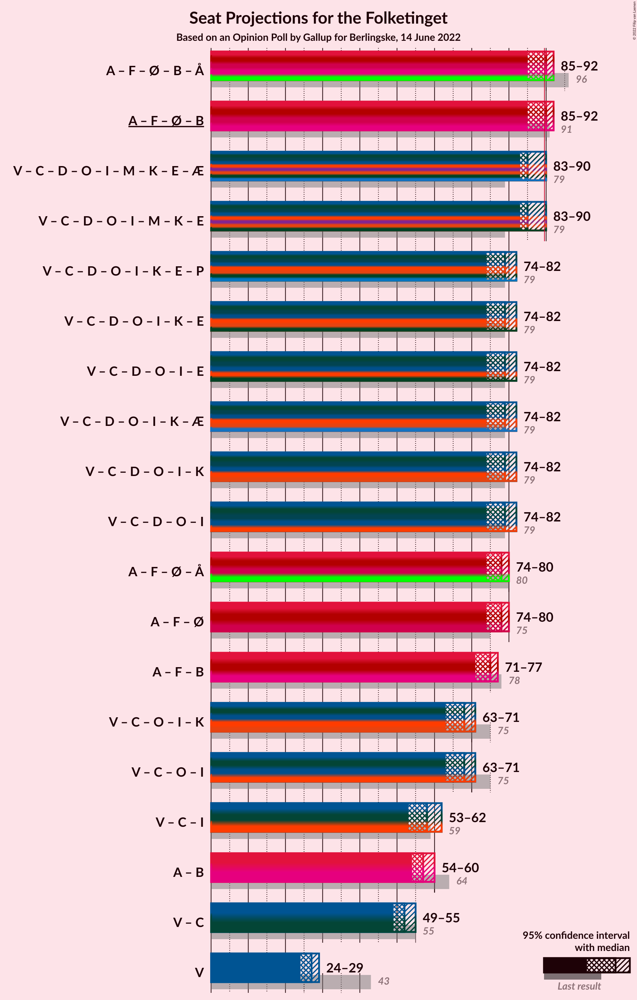

# Opinion Poll by Gallup for Berlingske, 14 June 2022

<a href="#voting-intentions">Voting Intentions</a> | <a href="#seats">Seats</a> | <a href="#coalitions">Coalitions</a> | <a href="#technical-information">Technical Information</a>

## Voting Intentions

### Confidence Intervals

| Party | Last Result | Poll Result | 80% Confidence Interval | 90% Confidence Interval | 95% Confidence Interval | 99% Confidence Interval |
|:-----:|:-----------:|:-----------:|:-----------------------:|:-----------------------:|:-----------------------:|:-----------------------:|
| Socialdemokraterne | 25.9% | 25.4% | 24.0–26.9% |23.6–27.3% |23.3–27.6% |22.6–28.3% |
| Venstre | 23.4% | 14.6% | 13.5–15.8% |13.2–16.1% |12.9–16.4% |12.4–17.0% |
| Det Konservative Folkeparti | 6.6% | 13.8% | 12.7–15.0% |12.4–15.3% |12.2–15.6% |11.7–16.2% |
| Socialistisk Folkeparti | 7.7% | 9.8% | 8.9–10.8% |8.6–11.1% |8.4–11.4% |8.0–11.9% |
| Enhedslisten–De Rød-Grønne | 6.9% | 7.8% | 7.0–8.7% |6.7–9.0% |6.5–9.2% |6.2–9.7% |
| Radikale Venstre | 8.6% | 6.3% | 5.5–7.1% |5.3–7.4% |5.2–7.6% |4.8–8.0% |
| Nye Borgerlige | 2.4% | 6.1% | 5.4–7.0% |5.2–7.2% |5.0–7.4% |4.7–7.8% |
| Dansk Folkeparti | 8.7% | 5.3% | 4.6–6.1% |4.5–6.4% |4.3–6.6% |4.0–7.0% |
| Liberal Alliance | 2.3% | 3.6% | 3.1–4.3% |2.9–4.5% |2.8–4.7% |2.6–5.0% |
| Moderaterne | 0.0% | 3.6% | 3.1–4.3% |2.9–4.5% |2.8–4.7% |2.6–5.0% |
| Kristendemokraterne | 1.7% | 1.4% | 1.1–1.9% |1.0–2.0% |0.9–2.1% |0.8–2.4% |
| Alternativet | 3.0% | 1.0% | 0.7–1.4% |0.6–1.5% |0.6–1.6% |0.5–1.8% |
| Frie Grønne | 0.0% | 0.5% | 0.4–0.9% |0.3–0.9% |0.3–1.0% |0.2–1.2% |
| Veganerpartiet | 0.0% | 0.3% | 0.2–0.6% |0.2–0.7% |0.1–0.8% |0.1–0.9% |

*Note:* The poll result column reflects the actual value used in the calculations. Published results may vary slightly, and in addition be rounded to fewer digits.

## Seats

### Confidence Intervals

| Party | Last Result | Median | 80% Confidence Interval | 90% Confidence Interval | 95% Confidence Interval | 99% Confidence Interval |
|:-----:|:-----------:|:------:|:-----------------------:|:-----------------------:|:-----------------------:|:-----------------------:|
| <a href="#socialdemokraterne">Socialdemokraterne</a> | 48 | 45 | 45 |44–46 |43–49 |42–50 |
| <a href="#venstre">Venstre</a> | 43 | 27 | 27 |24–28 |24–29 |23–31 |
| <a href="#det-konservative-folkeparti">Det Konservative Folkeparti</a> | 12 | 25 | 25 |23–26 |22–28 |22–28 |
| <a href="#socialistisk-folkeparti">Socialistisk Folkeparti</a> | 14 | 18 | 17–18 |17–19 |15–19 |15–21 |
| <a href="#enhedslisten–de-rød-grønne">Enhedslisten–De Rød-Grønne</a> | 13 | 15 | 14–15 |13–15 |13–15 |12–17 |
| <a href="#radikale-venstre">Radikale Venstre</a> | 16 | 12 | 12 |11–13 |11–13 |9–14 |
| <a href="#nye-borgerlige">Nye Borgerlige</a> | 4 | 11 | 11 |11–12 |10–13 |9–15 |
| <a href="#dansk-folkeparti">Dansk Folkeparti</a> | 16 | 10 | 10 |9–10 |8–11 |8–12 |
| <a href="#liberal-alliance">Liberal Alliance</a> | 4 | 6 | 6 |5–7 |4–7 |4–9 |
| <a href="#moderaterne">Moderaterne</a> | 0 | 6 | 6–7 |6–9 |6–9 |5–9 |
| <a href="#kristendemokraterne">Kristendemokraterne</a> | 0 | 0 | 0 |0 |0 |0–4 |
| <a href="#alternativet">Alternativet</a> | 5 | 0 | 0 |0 |0 |0 |
| <a href="#frie-grønne">Frie Grønne</a> | 0 | 0 | 0 |0 |0 |0 |
| <a href="#veganerpartiet">Veganerpartiet</a> | 0 | 0 | 0 |0 |0 |0 |

### Socialdemokraterne

*For a full overview of the results for this party, see the [Socialdemokraterne](party-socialdemokraterne.html) page.*

| Number of Seats | Probability | Accumulated | Special Marks |
|:---------------:|:-----------:|:-----------:|:-------------:|
| 40 | 0% | 100% |  |
| 41 | 0% | 99.9% |  |
| 42 | 0.6% | 99.9% |  |
| 43 | 4% | 99.3% |  |
| 44 | 3% | 96% |  |
| 45 | 84% | 92% | Median |
| 46 | 4% | 8% |  |
| 47 | 0.2% | 4% |  |
| 48 | 1.4% | 4% | Last Result |
| 49 | 2% | 3% |  |
| 50 | 1.0% | 1.0% |  |
| 51 | 0% | 0% |  |

### Venstre

*For a full overview of the results for this party, see the [Venstre](party-venstre.html) page.*

| Number of Seats | Probability | Accumulated | Special Marks |
|:---------------:|:-----------:|:-----------:|:-------------:|
| 22 | 0.2% | 100% |  |
| 23 | 0.5% | 99.8% |  |
| 24 | 5% | 99.4% |  |
| 25 | 2% | 94% |  |
| 26 | 2% | 92% |  |
| 27 | 82% | 90% | Median |
| 28 | 4% | 8% |  |
| 29 | 3% | 4% |  |
| 30 | 0.1% | 2% |  |
| 31 | 1.5% | 1.5% |  |
| 32 | 0% | 0% |  |
| 33 | 0% | 0% |  |
| 34 | 0% | 0% |  |
| 35 | 0% | 0% |  |
| 36 | 0% | 0% |  |
| 37 | 0% | 0% |  |
| 38 | 0% | 0% |  |
| 39 | 0% | 0% |  |
| 40 | 0% | 0% |  |
| 41 | 0% | 0% |  |
| 42 | 0% | 0% |  |
| 43 | 0% | 0% | Last Result |

### Det Konservative Folkeparti

*For a full overview of the results for this party, see the [Det Konservative Folkeparti](party-detkonservativefolkeparti.html) page.*

| Number of Seats | Probability | Accumulated | Special Marks |
|:---------------:|:-----------:|:-----------:|:-------------:|
| 12 | 0% | 100% | Last Result |
| 13 | 0% | 100% |  |
| 14 | 0% | 100% |  |
| 15 | 0% | 100% |  |
| 16 | 0% | 100% |  |
| 17 | 0% | 100% |  |
| 18 | 0% | 100% |  |
| 19 | 0% | 100% |  |
| 20 | 0% | 100% |  |
| 21 | 0.3% | 100% |  |
| 22 | 3% | 99.7% |  |
| 23 | 2% | 96% |  |
| 24 | 2% | 94% |  |
| 25 | 86% | 93% | Median |
| 26 | 2% | 6% |  |
| 27 | 0.8% | 4% |  |
| 28 | 3% | 3% |  |
| 29 | 0.1% | 0.2% |  |
| 30 | 0.1% | 0.1% |  |
| 31 | 0% | 0% |  |

### Socialistisk Folkeparti

*For a full overview of the results for this party, see the [Socialistisk Folkeparti](party-socialistiskfolkeparti.html) page.*

| Number of Seats | Probability | Accumulated | Special Marks |
|:---------------:|:-----------:|:-----------:|:-------------:|
| 14 | 0.1% | 100% | Last Result |
| 15 | 3% | 99.9% |  |
| 16 | 2% | 97% |  |
| 17 | 7% | 95% |  |
| 18 | 82% | 88% | Median |
| 19 | 5% | 6% |  |
| 20 | 0.6% | 1.2% |  |
| 21 | 0.6% | 0.6% |  |
| 22 | 0% | 0.1% |  |
| 23 | 0% | 0% |  |

### Enhedslisten–De Rød-Grønne

*For a full overview of the results for this party, see the [Enhedslisten–De Rød-Grønne](party-enhedslisten–derød-grønne.html) page.*

| Number of Seats | Probability | Accumulated | Special Marks |
|:---------------:|:-----------:|:-----------:|:-------------:|
| 10 | 0.1% | 100% |  |
| 11 | 0.4% | 99.9% |  |
| 12 | 2% | 99.6% |  |
| 13 | 3% | 98% | Last Result |
| 14 | 5% | 94% |  |
| 15 | 87% | 89% | Median |
| 16 | 1.0% | 2% |  |
| 17 | 0.6% | 0.8% |  |
| 18 | 0.2% | 0.2% |  |
| 19 | 0% | 0% |  |

### Radikale Venstre

*For a full overview of the results for this party, see the [Radikale Venstre](party-radikalevenstre.html) page.*

| Number of Seats | Probability | Accumulated | Special Marks |
|:---------------:|:-----------:|:-----------:|:-------------:|
| 9 | 0.8% | 100% |  |
| 10 | 2% | 99.1% |  |
| 11 | 5% | 98% |  |
| 12 | 85% | 93% | Median |
| 13 | 6% | 8% |  |
| 14 | 2% | 2% |  |
| 15 | 0.1% | 0.1% |  |
| 16 | 0% | 0% | Last Result |

### Nye Borgerlige

*For a full overview of the results for this party, see the [Nye Borgerlige](party-nyeborgerlige.html) page.*

| Number of Seats | Probability | Accumulated | Special Marks |
|:---------------:|:-----------:|:-----------:|:-------------:|
| 4 | 0% | 100% | Last Result |
| 5 | 0% | 100% |  |
| 6 | 0% | 100% |  |
| 7 | 0% | 100% |  |
| 8 | 0.2% | 100% |  |
| 9 | 1.0% | 99.8% |  |
| 10 | 4% | 98.8% |  |
| 11 | 88% | 95% | Median |
| 12 | 4% | 7% |  |
| 13 | 2% | 3% |  |
| 14 | 0.1% | 0.7% |  |
| 15 | 0.6% | 0.7% |  |
| 16 | 0% | 0% |  |

### Dansk Folkeparti

*For a full overview of the results for this party, see the [Dansk Folkeparti](party-danskfolkeparti.html) page.*

| Number of Seats | Probability | Accumulated | Special Marks |
|:---------------:|:-----------:|:-----------:|:-------------:|
| 7 | 0.2% | 100% |  |
| 8 | 4% | 99.8% |  |
| 9 | 4% | 96% |  |
| 10 | 89% | 91% | Median |
| 11 | 2% | 3% |  |
| 12 | 0.6% | 0.8% |  |
| 13 | 0.2% | 0.2% |  |
| 14 | 0% | 0% |  |
| 15 | 0% | 0% |  |
| 16 | 0% | 0% | Last Result |

### Liberal Alliance

*For a full overview of the results for this party, see the [Liberal Alliance](party-liberalalliance.html) page.*

| Number of Seats | Probability | Accumulated | Special Marks |
|:---------------:|:-----------:|:-----------:|:-------------:|
| 4 | 4% | 100% | Last Result |
| 5 | 2% | 96% |  |
| 6 | 86% | 95% | Median |
| 7 | 7% | 9% |  |
| 8 | 0.8% | 2% |  |
| 9 | 1.0% | 1.2% |  |
| 10 | 0.2% | 0.2% |  |
| 11 | 0% | 0% |  |

### Moderaterne

*For a full overview of the results for this party, see the [Moderaterne](party-moderaterne.html) page.*

| Number of Seats | Probability | Accumulated | Special Marks |
|:---------------:|:-----------:|:-----------:|:-------------:|
| 0 | 0% | 100% | Last Result |
| 1 | 0% | 100% |  |
| 2 | 0% | 100% |  |
| 3 | 0% | 100% |  |
| 4 | 0.1% | 100% |  |
| 5 | 0.4% | 99.9% |  |
| 6 | 87% | 99.5% | Median |
| 7 | 5% | 13% |  |
| 8 | 0.7% | 8% |  |
| 9 | 7% | 7% |  |
| 10 | 0.2% | 0.2% |  |
| 11 | 0% | 0% |  |

### Kristendemokraterne

*For a full overview of the results for this party, see the [Kristendemokraterne](party-kristendemokraterne.html) page.*

| Number of Seats | Probability | Accumulated | Special Marks |
|:---------------:|:-----------:|:-----------:|:-------------:|
| 0 | 98% | 100% | Last Result, Median |
| 1 | 0% | 2% |  |
| 2 | 0% | 2% |  |
| 3 | 0% | 2% |  |
| 4 | 2% | 2% |  |
| 5 | 0.2% | 0.2% |  |
| 6 | 0% | 0% |  |

### Alternativet

*For a full overview of the results for this party, see the [Alternativet](party-alternativet.html) page.*

| Number of Seats | Probability | Accumulated | Special Marks |
|:---------------:|:-----------:|:-----------:|:-------------:|
| 0 | 99.9% | 100% | Median |
| 1 | 0% | 0.1% |  |
| 2 | 0% | 0.1% |  |
| 3 | 0% | 0.1% |  |
| 4 | 0.1% | 0.1% |  |
| 5 | 0% | 0% | Last Result |

### Frie Grønne

*For a full overview of the results for this party, see the [Frie Grønne](party-friegrønne.html) page.*

| Number of Seats | Probability | Accumulated | Special Marks |
|:---------------:|:-----------:|:-----------:|:-------------:|
| 0 | 100% | 100% | Last Result, Median |

### Veganerpartiet

*For a full overview of the results for this party, see the [Veganerpartiet](party-veganerpartiet.html) page.*

| Number of Seats | Probability | Accumulated | Special Marks |
|:---------------:|:-----------:|:-----------:|:-------------:|
| 0 | 100% | 100% | Last Result, Median |

## Coalitions

### Confidence Intervals

| Coalition | Last Result | Median | Majority? | 80% Confidence Interval | 90% Confidence Interval | 95% Confidence Interval | 99% Confidence Interval |
|:---------:|:-----------:|:------:|:---------:|:-----------------------:|:-----------------------:|:-----------------------:|:-----------------------:|
| Socialdemokraterne – Socialistisk Folkeparti – Enhedslisten–De Rød-Grønne – Radikale Venstre – Alternativet | 96 | 90 | 89% | 89–90 | 87–92 | 85–92 | 85–93 |
| Socialdemokraterne – Socialistisk Folkeparti – Enhedslisten–De Rød-Grønne – Radikale Venstre | 91 | 90 | 89% | 89–90 | 87–92 | 85–92 | 85–93 |
| Venstre – Det Konservative Folkeparti – Nye Borgerlige – Dansk Folkeparti – Liberal Alliance – Kristendemokraterne | 79 | 79 | 0% | 79 | 77–81 | 74–82 | 74–83 |
| Venstre – Det Konservative Folkeparti – Nye Borgerlige – Dansk Folkeparti – Liberal Alliance | 79 | 79 | 0% | 79 | 75–81 | 74–82 | 74–83 |
| Socialdemokraterne – Socialistisk Folkeparti – Enhedslisten–De Rød-Grønne – Alternativet | 80 | 78 | 0% | 76–78 | 74–80 | 74–80 | 74–82 |
| Socialdemokraterne – Socialistisk Folkeparti – Enhedslisten–De Rød-Grønne | 75 | 78 | 0% | 76–78 | 74–80 | 74–80 | 74–82 |
| Socialdemokraterne – Socialistisk Folkeparti – Radikale Venstre | 78 | 75 | 0% | 75 | 72–77 | 71–77 | 71–80 |
| Venstre – Det Konservative Folkeparti – Dansk Folkeparti – Liberal Alliance – Kristendemokraterne | 75 | 68 | 0% | 68 | 66–71 | 63–71 | 63–72 |
| Venstre – Det Konservative Folkeparti – Dansk Folkeparti – Liberal Alliance | 75 | 68 | 0% | 67–68 | 65–70 | 63–71 | 63–72 |
| Venstre – Det Konservative Folkeparti – Liberal Alliance | 59 | 58 | 0% | 58 | 55–60 | 53–62 | 53–63 |
| Socialdemokraterne – Radikale Venstre | 64 | 57 | 0% | 57–58 | 56–58 | 54–60 | 53–62 |
| Venstre – Det Konservative Folkeparti | 55 | 52 | 0% | 51–52 | 49–53 | 49–55 | 48–56 |
| Venstre | 43 | 27 | 0% | 27 | 24–28 | 24–29 | 23–31 |

### Socialdemokraterne – Socialistisk Folkeparti – Enhedslisten–De Rød-Grønne – Radikale Venstre – Alternativet

| Number of Seats | Probability | Accumulated | Special Marks |
|:---------------:|:-----------:|:-----------:|:-------------:|
| 83 | 0% | 100% |  |
| 84 | 0.1% | 99.9% |  |
| 85 | 4% | 99.9% |  |
| 86 | 0.7% | 96% |  |
| 87 | 3% | 95% |  |
| 88 | 0.4% | 93% |  |
| 89 | 3% | 92% |  |
| 90 | 83% | 89% | Median, Majority |
| 91 | 1.1% | 6% |  |
| 92 | 4% | 5% |  |
| 93 | 0.7% | 0.8% |  |
| 94 | 0.1% | 0.2% |  |
| 95 | 0.1% | 0.1% |  |
| 96 | 0% | 0% | Last Result |

### Socialdemokraterne – Socialistisk Folkeparti – Enhedslisten–De Rød-Grønne – Radikale Venstre

| Number of Seats | Probability | Accumulated | Special Marks |
|:---------------:|:-----------:|:-----------:|:-------------:|
| 83 | 0% | 100% |  |
| 84 | 0.1% | 99.9% |  |
| 85 | 4% | 99.9% |  |
| 86 | 0.7% | 96% |  |
| 87 | 3% | 95% |  |
| 88 | 0.5% | 93% |  |
| 89 | 3% | 92% |  |
| 90 | 83% | 89% | Median, Majority |
| 91 | 1.1% | 6% | Last Result |
| 92 | 4% | 5% |  |
| 93 | 0.7% | 0.8% |  |
| 94 | 0.1% | 0.2% |  |
| 95 | 0.1% | 0.1% |  |
| 96 | 0% | 0% |  |

### Venstre – Det Konservative Folkeparti – Nye Borgerlige – Dansk Folkeparti – Liberal Alliance – Kristendemokraterne

| Number of Seats | Probability | Accumulated | Special Marks |
|:---------------:|:-----------:|:-----------:|:-------------:|
| 73 | 0% | 100% |  |
| 74 | 4% | 99.9% |  |
| 75 | 0.8% | 96% |  |
| 76 | 0.1% | 96% |  |
| 77 | 1.1% | 95% |  |
| 78 | 2% | 94% |  |
| 79 | 84% | 92% | Last Result, Median |
| 80 | 0.9% | 8% |  |
| 81 | 4% | 7% |  |
| 82 | 2% | 4% |  |
| 83 | 1.2% | 1.3% |  |
| 84 | 0.1% | 0.1% |  |
| 85 | 0% | 0% |  |

### Venstre – Det Konservative Folkeparti – Nye Borgerlige – Dansk Folkeparti – Liberal Alliance

| Number of Seats | Probability | Accumulated | Special Marks |
|:---------------:|:-----------:|:-----------:|:-------------:|
| 73 | 0.1% | 100% |  |
| 74 | 4% | 99.9% |  |
| 75 | 2% | 96% |  |
| 76 | 0.5% | 94% |  |
| 77 | 2% | 94% |  |
| 78 | 2% | 92% |  |
| 79 | 83% | 90% | Last Result, Median |
| 80 | 0.5% | 7% |  |
| 81 | 3% | 7% |  |
| 82 | 2% | 4% |  |
| 83 | 1.1% | 1.2% |  |
| 84 | 0.1% | 0.1% |  |
| 85 | 0% | 0% |  |

### Socialdemokraterne – Socialistisk Folkeparti – Enhedslisten–De Rød-Grønne – Alternativet

| Number of Seats | Probability | Accumulated | Special Marks |
|:---------------:|:-----------:|:-----------:|:-------------:|
| 72 | 0.1% | 100% |  |
| 73 | 0.1% | 99.9% |  |
| 74 | 6% | 99.7% |  |
| 75 | 0.3% | 94% |  |
| 76 | 4% | 93% |  |
| 77 | 0.8% | 90% |  |
| 78 | 82% | 89% | Median |
| 79 | 2% | 7% |  |
| 80 | 5% | 5% | Last Result |
| 81 | 0.1% | 0.7% |  |
| 82 | 0.2% | 0.6% |  |
| 83 | 0.3% | 0.4% |  |
| 84 | 0.1% | 0.1% |  |
| 85 | 0% | 0% |  |

### Socialdemokraterne – Socialistisk Folkeparti – Enhedslisten–De Rød-Grønne

| Number of Seats | Probability | Accumulated | Special Marks |
|:---------------:|:-----------:|:-----------:|:-------------:|
| 72 | 0.1% | 100% |  |
| 73 | 0.1% | 99.9% |  |
| 74 | 6% | 99.7% |  |
| 75 | 0.3% | 94% | Last Result |
| 76 | 4% | 93% |  |
| 77 | 0.8% | 89% |  |
| 78 | 82% | 89% | Median |
| 79 | 2% | 7% |  |
| 80 | 5% | 5% |  |
| 81 | 0.1% | 0.7% |  |
| 82 | 0.2% | 0.6% |  |
| 83 | 0.3% | 0.4% |  |
| 84 | 0.1% | 0.1% |  |
| 85 | 0% | 0% |  |

### Socialdemokraterne – Socialistisk Folkeparti – Radikale Venstre

| Number of Seats | Probability | Accumulated | Special Marks |
|:---------------:|:-----------:|:-----------:|:-------------:|
| 69 | 0% | 100% |  |
| 70 | 0.3% | 99.9% |  |
| 71 | 3% | 99.6% |  |
| 72 | 3% | 96% |  |
| 73 | 1.3% | 93% |  |
| 74 | 0.9% | 92% |  |
| 75 | 83% | 91% | Median |
| 76 | 0.9% | 9% |  |
| 77 | 6% | 8% |  |
| 78 | 0.1% | 2% | Last Result |
| 79 | 1.4% | 2% |  |
| 80 | 0.3% | 0.6% |  |
| 81 | 0% | 0.3% |  |
| 82 | 0.3% | 0.3% |  |
| 83 | 0% | 0% |  |

### Venstre – Det Konservative Folkeparti – Dansk Folkeparti – Liberal Alliance – Kristendemokraterne

| Number of Seats | Probability | Accumulated | Special Marks |
|:---------------:|:-----------:|:-----------:|:-------------:|
| 62 | 0% | 100% |  |
| 63 | 4% | 99.9% |  |
| 64 | 0.1% | 96% |  |
| 65 | 0.5% | 96% |  |
| 66 | 2% | 95% |  |
| 67 | 3% | 93% |  |
| 68 | 83% | 91% | Median |
| 69 | 1.4% | 7% |  |
| 70 | 0.5% | 6% |  |
| 71 | 5% | 6% |  |
| 72 | 0.7% | 0.8% |  |
| 73 | 0.1% | 0.1% |  |
| 74 | 0% | 0% |  |
| 75 | 0% | 0% | Last Result |

### Venstre – Det Konservative Folkeparti – Dansk Folkeparti – Liberal Alliance

| Number of Seats | Probability | Accumulated | Special Marks |
|:---------------:|:-----------:|:-----------:|:-------------:|
| 62 | 0% | 100% |  |
| 63 | 4% | 99.9% |  |
| 64 | 0.1% | 96% |  |
| 65 | 1.4% | 96% |  |
| 66 | 2% | 94% |  |
| 67 | 3% | 92% |  |
| 68 | 83% | 89% | Median |
| 69 | 0.5% | 5% |  |
| 70 | 0.3% | 5% |  |
| 71 | 4% | 5% |  |
| 72 | 0.7% | 0.7% |  |
| 73 | 0% | 0.1% |  |
| 74 | 0% | 0% |  |
| 75 | 0% | 0% | Last Result |

### Venstre – Det Konservative Folkeparti – Liberal Alliance

| Number of Seats | Probability | Accumulated | Special Marks |
|:---------------:|:-----------:|:-----------:|:-------------:|
| 52 | 0% | 100% |  |
| 53 | 4% | 99.9% |  |
| 54 | 0.9% | 96% |  |
| 55 | 1.4% | 96% |  |
| 56 | 0.5% | 94% |  |
| 57 | 2% | 94% |  |
| 58 | 86% | 91% | Median |
| 59 | 0.5% | 6% | Last Result |
| 60 | 0.5% | 5% |  |
| 61 | 2% | 5% |  |
| 62 | 0.4% | 3% |  |
| 63 | 2% | 2% |  |
| 64 | 0% | 0% |  |

### Socialdemokraterne – Radikale Venstre

| Number of Seats | Probability | Accumulated | Special Marks |
|:---------------:|:-----------:|:-----------:|:-------------:|
| 51 | 0% | 100% |  |
| 52 | 0.1% | 99.9% |  |
| 53 | 0.6% | 99.8% |  |
| 54 | 3% | 99.3% |  |
| 55 | 0.4% | 96% |  |
| 56 | 0.5% | 95% |  |
| 57 | 84% | 95% | Median |
| 58 | 6% | 11% |  |
| 59 | 2% | 4% |  |
| 60 | 1.1% | 3% |  |
| 61 | 0.1% | 2% |  |
| 62 | 1.0% | 1.5% |  |
| 63 | 0.4% | 0.5% |  |
| 64 | 0% | 0% | Last Result |

### Venstre – Det Konservative Folkeparti

| Number of Seats | Probability | Accumulated | Special Marks |
|:---------------:|:-----------:|:-----------:|:-------------:|
| 46 | 0.1% | 100% |  |
| 47 | 0.3% | 99.9% |  |
| 48 | 0.9% | 99.6% |  |
| 49 | 6% | 98.6% |  |
| 50 | 0.3% | 93% |  |
| 51 | 4% | 93% |  |
| 52 | 82% | 88% | Median |
| 53 | 2% | 7% |  |
| 54 | 2% | 5% |  |
| 55 | 0.8% | 3% | Last Result |
| 56 | 2% | 2% |  |
| 57 | 0% | 0% |  |

### Venstre

| Number of Seats | Probability | Accumulated | Special Marks |
|:---------------:|:-----------:|:-----------:|:-------------:|
| 22 | 0.2% | 100% |  |
| 23 | 0.5% | 99.8% |  |
| 24 | 5% | 99.4% |  |
| 25 | 2% | 94% |  |
| 26 | 2% | 92% |  |
| 27 | 82% | 90% | Median |
| 28 | 4% | 8% |  |
| 29 | 3% | 4% |  |
| 30 | 0.1% | 2% |  |
| 31 | 1.5% | 1.5% |  |
| 32 | 0% | 0% |  |
| 33 | 0% | 0% |  |
| 34 | 0% | 0% |  |
| 35 | 0% | 0% |  |
| 36 | 0% | 0% |  |
| 37 | 0% | 0% |  |
| 38 | 0% | 0% |  |
| 39 | 0% | 0% |  |
| 40 | 0% | 0% |  |
| 41 | 0% | 0% |  |
| 42 | 0% | 0% |  |
| 43 | 0% | 0% | Last Result |

## Technical Information

### Opinion Poll

+ **Polling firm:** Gallup
+ **Commissioner(s):** Berlingske
+ **Fieldwork period:** 14 June 2022

### Calculations

+ **Sample size:** 1544
+ **Simulations done:** 1,048,576
+ **Error estimate:** 1.51%

