# Opinion Poll by Megafon for Politiken and TV 2, 20–23 June 2022

<a href="#voting-intentions">Voting Intentions</a> | <a href="#seats">Seats</a> | <a href="#coalitions">Coalitions</a> | <a href="#technical-information">Technical Information</a>

## Voting Intentions

### Confidence Intervals

| Party | Last Result | Poll Result | 80% Confidence Interval | 90% Confidence Interval | 95% Confidence Interval | 99% Confidence Interval |
|:-----:|:-----------:|:-----------:|:-----------------------:|:-----------------------:|:-----------------------:|:-----------------------:|
| Socialdemokraterne | 25.9% | 24.6% | 23.0–26.3% |22.6–26.8% |22.2–27.2% |21.5–28.0% |
| Det Konservative Folkeparti | 6.6% | 17.1% | 15.7–18.6% |15.3–19.0% |15.0–19.4% |14.4–20.1% |
| Venstre | 23.4% | 13.0% | 11.8–14.3% |11.4–14.7% |11.1–15.1% |10.6–15.7% |
| Socialistisk Folkeparti | 7.7% | 8.6% | 7.6–9.8% |7.3–10.1% |7.1–10.4% |6.6–10.9% |
| Nye Borgerlige | 2.4% | 8.5% | 7.5–9.7% |7.2–10.0% |7.0–10.3% |6.6–10.9% |
| Enhedslisten–De Rød-Grønne | 6.9% | 7.5% | 6.6–8.6% |6.4–8.9% |6.1–9.2% |5.7–9.8% |
| Radikale Venstre | 8.6% | 6.5% | 5.6–7.5% |5.4–7.8% |5.2–8.1% |4.8–8.6% |
| Liberal Alliance | 2.3% | 4.3% | 3.6–5.2% |3.4–5.4% |3.3–5.6% |3.0–6.1% |
| Moderaterne | 0.0% | 3.5% | 2.9–4.3% |2.7–4.5% |2.6–4.7% |2.3–5.2% |
| Dansk Folkeparti | 8.7% | 3.2% | 2.7–4.0% |2.5–4.3% |2.4–4.5% |2.1–4.8% |
| Alternativet | 3.0% | 0.6% | 0.4–1.0% |0.3–1.2% |0.3–1.3% |0.2–1.5% |
| Frie Grønne | 0.0% | 0.6% | 0.4–1.0% |0.3–1.2% |0.3–1.3% |0.2–1.5% |
| Kristendemokraterne | 1.7% | 0.5% | 0.3–0.9% |0.3–1.0% |0.2–1.1% |0.2–1.4% |
| Veganerpartiet | 0.0% | 0.3% | 0.2–0.6% |0.1–0.7% |0.1–0.8% |0.0–1.0% |

*Note:* The poll result column reflects the actual value used in the calculations. Published results may vary slightly, and in addition be rounded to fewer digits.

## Seats

### Confidence Intervals

| Party | Last Result | Median | 80% Confidence Interval | 90% Confidence Interval | 95% Confidence Interval | 99% Confidence Interval |
|:-----:|:-----------:|:------:|:-----------------------:|:-----------------------:|:-----------------------:|:-----------------------:|
| <a href="#socialdemokraterne">Socialdemokraterne</a> | 48 | 44 | 44 |42–44 |40–45 |39–49 |
| <a href="#det-konservative-folkeparti">Det Konservative Folkeparti</a> | 12 | 31 | 31 |30–31 |29–34 |27–35 |
| <a href="#venstre">Venstre</a> | 43 | 24 | 24 |24 |23–25 |21–27 |
| <a href="#socialistisk-folkeparti">Socialistisk Folkeparti</a> | 14 | 16 | 16 |16 |14–17 |12–18 |
| <a href="#nye-borgerlige">Nye Borgerlige</a> | 4 | 15 | 15 |15–17 |14–17 |13–18 |
| <a href="#enhedslisten–de-rød-grønne">Enhedslisten–De Rød-Grønne</a> | 13 | 13 | 13 |12–13 |11–13 |10–16 |
| <a href="#radikale-venstre">Radikale Venstre</a> | 16 | 12 | 12 |12–13 |12–14 |9–14 |
| <a href="#liberal-alliance">Liberal Alliance</a> | 4 | 8 | 8 |7–8 |7–8 |6–10 |
| <a href="#moderaterne">Moderaterne</a> | 0 | 7 | 7 |6–7 |5–7 |5–8 |
| <a href="#dansk-folkeparti">Dansk Folkeparti</a> | 16 | 5 | 5 |5–6 |5–7 |4–8 |
| <a href="#alternativet">Alternativet</a> | 5 | 0 | 0 |0 |0 |0 |
| <a href="#frie-grønne">Frie Grønne</a> | 0 | 0 | 0 |0 |0 |0 |
| <a href="#kristendemokraterne">Kristendemokraterne</a> | 0 | 0 | 0 |0 |0 |0 |
| <a href="#veganerpartiet">Veganerpartiet</a> | 0 | 0 | 0 |0 |0 |0 |

### Socialdemokraterne

*For a full overview of the results for this party, see the [Socialdemokraterne](party-socialdemokraterne.html) page.*

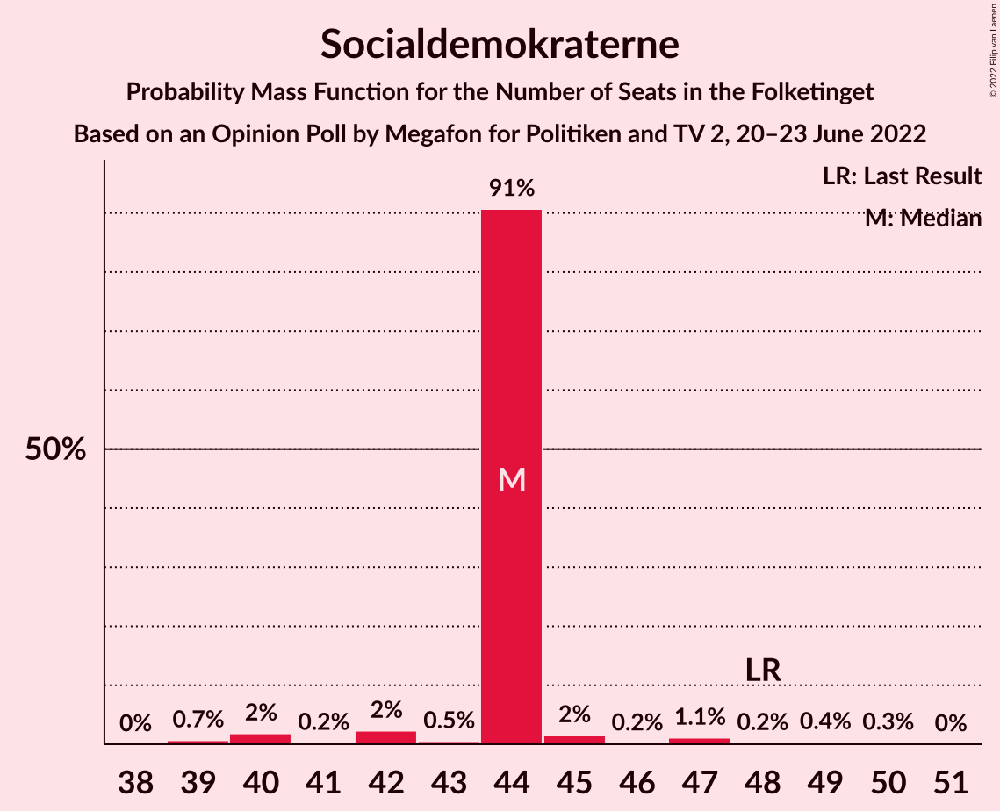

| Number of Seats | Probability | Accumulated | Special Marks |
|:---------------:|:-----------:|:-----------:|:-------------:|
| 39 | 0.7% | 100% |  |
| 40 | 2% | 99.3% |  |
| 41 | 0.2% | 97% |  |
| 42 | 2% | 97% |  |
| 43 | 0.5% | 95% |  |
| 44 | 91% | 94% | Median |
| 45 | 2% | 4% |  |
| 46 | 0.2% | 2% |  |
| 47 | 1.1% | 2% |  |
| 48 | 0.2% | 0.9% | Last Result |
| 49 | 0.4% | 0.7% |  |
| 50 | 0.3% | 0.3% |  |
| 51 | 0% | 0% |  |

### Det Konservative Folkeparti

*For a full overview of the results for this party, see the [Det Konservative Folkeparti](party-detkonservativefolkeparti.html) page.*

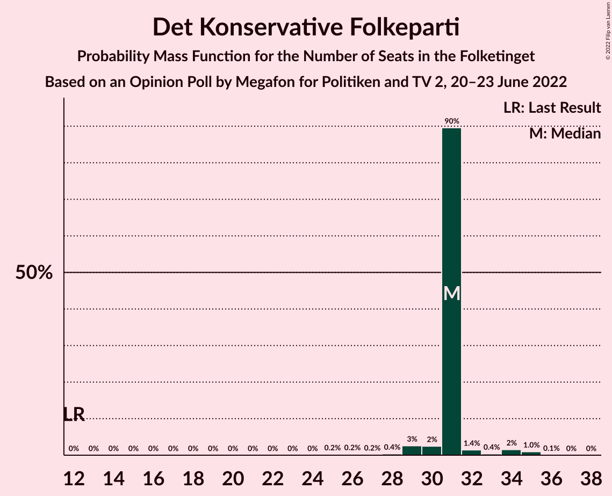

| Number of Seats | Probability | Accumulated | Special Marks |
|:---------------:|:-----------:|:-----------:|:-------------:|
| 12 | 0% | 100% | Last Result |
| 13 | 0% | 100% |  |
| 14 | 0% | 100% |  |
| 15 | 0% | 100% |  |
| 16 | 0% | 100% |  |
| 17 | 0% | 100% |  |
| 18 | 0% | 100% |  |
| 19 | 0% | 100% |  |
| 20 | 0% | 100% |  |
| 21 | 0% | 100% |  |
| 22 | 0% | 100% |  |
| 23 | 0% | 100% |  |
| 24 | 0% | 100% |  |
| 25 | 0.2% | 100% |  |
| 26 | 0.2% | 99.8% |  |
| 27 | 0.2% | 99.5% |  |
| 28 | 0.4% | 99.4% |  |
| 29 | 3% | 99.0% |  |
| 30 | 2% | 96% |  |
| 31 | 90% | 94% | Median |
| 32 | 1.4% | 4% |  |
| 33 | 0.4% | 3% |  |
| 34 | 2% | 3% |  |
| 35 | 1.0% | 1.0% |  |
| 36 | 0.1% | 0.1% |  |
| 37 | 0% | 0% |  |

### Venstre

*For a full overview of the results for this party, see the [Venstre](party-venstre.html) page.*

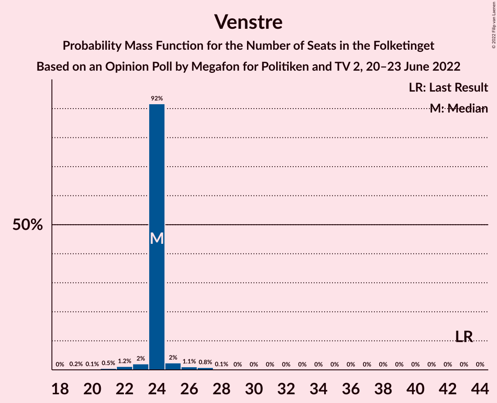

| Number of Seats | Probability | Accumulated | Special Marks |
|:---------------:|:-----------:|:-----------:|:-------------:|
| 19 | 0.2% | 100% |  |
| 20 | 0.1% | 99.8% |  |
| 21 | 0.5% | 99.7% |  |
| 22 | 1.2% | 99.2% |  |
| 23 | 2% | 98% |  |
| 24 | 92% | 96% | Median |
| 25 | 2% | 4% |  |
| 26 | 1.1% | 2% |  |
| 27 | 0.8% | 0.9% |  |
| 28 | 0.1% | 0.1% |  |
| 29 | 0% | 0% |  |
| 30 | 0% | 0% |  |
| 31 | 0% | 0% |  |
| 32 | 0% | 0% |  |
| 33 | 0% | 0% |  |
| 34 | 0% | 0% |  |
| 35 | 0% | 0% |  |
| 36 | 0% | 0% |  |
| 37 | 0% | 0% |  |
| 38 | 0% | 0% |  |
| 39 | 0% | 0% |  |
| 40 | 0% | 0% |  |
| 41 | 0% | 0% |  |
| 42 | 0% | 0% |  |
| 43 | 0% | 0% | Last Result |

### Socialistisk Folkeparti

*For a full overview of the results for this party, see the [Socialistisk Folkeparti](party-socialistiskfolkeparti.html) page.*

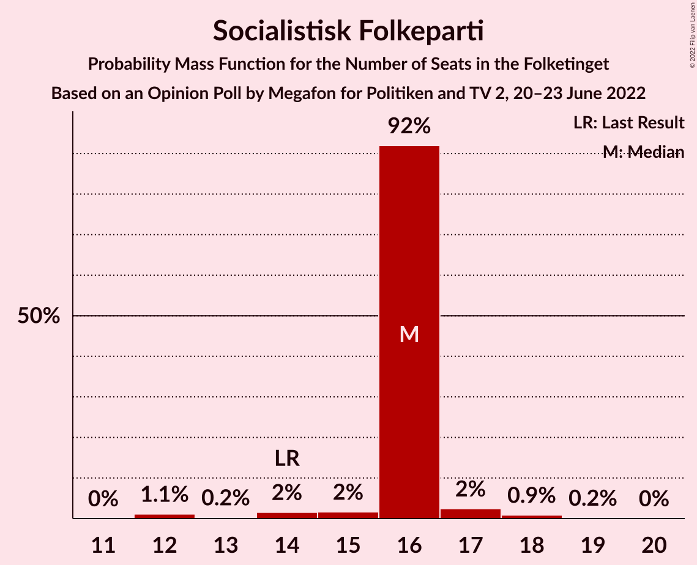

| Number of Seats | Probability | Accumulated | Special Marks |
|:---------------:|:-----------:|:-----------:|:-------------:|
| 12 | 1.1% | 100% |  |
| 13 | 0.2% | 98.9% |  |
| 14 | 2% | 98.6% | Last Result |
| 15 | 2% | 97% |  |
| 16 | 92% | 95% | Median |
| 17 | 2% | 3% |  |
| 18 | 0.9% | 1.0% |  |
| 19 | 0.2% | 0.2% |  |
| 20 | 0% | 0% |  |

### Nye Borgerlige

*For a full overview of the results for this party, see the [Nye Borgerlige](party-nyeborgerlige.html) page.*

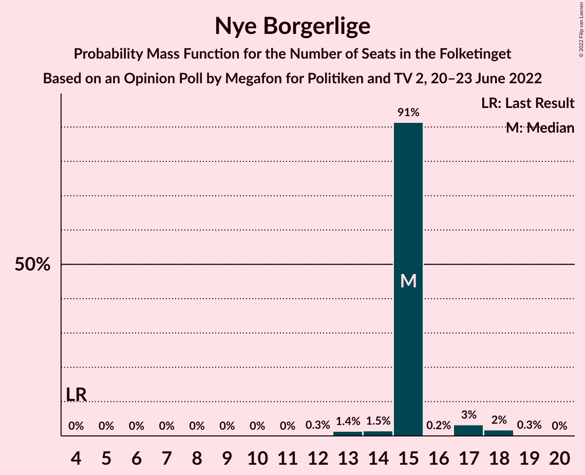

| Number of Seats | Probability | Accumulated | Special Marks |
|:---------------:|:-----------:|:-----------:|:-------------:|
| 4 | 0% | 100% | Last Result |
| 5 | 0% | 100% |  |
| 6 | 0% | 100% |  |
| 7 | 0% | 100% |  |
| 8 | 0% | 100% |  |
| 9 | 0% | 100% |  |
| 10 | 0% | 100% |  |
| 11 | 0% | 100% |  |
| 12 | 0.3% | 100% |  |
| 13 | 1.4% | 99.7% |  |
| 14 | 1.5% | 98% |  |
| 15 | 91% | 97% | Median |
| 16 | 0.2% | 5% |  |
| 17 | 3% | 5% |  |
| 18 | 2% | 2% |  |
| 19 | 0.3% | 0.3% |  |
| 20 | 0% | 0% |  |

### Enhedslisten–De Rød-Grønne

*For a full overview of the results for this party, see the [Enhedslisten–De Rød-Grønne](party-enhedslisten–derød-grønne.html) page.*

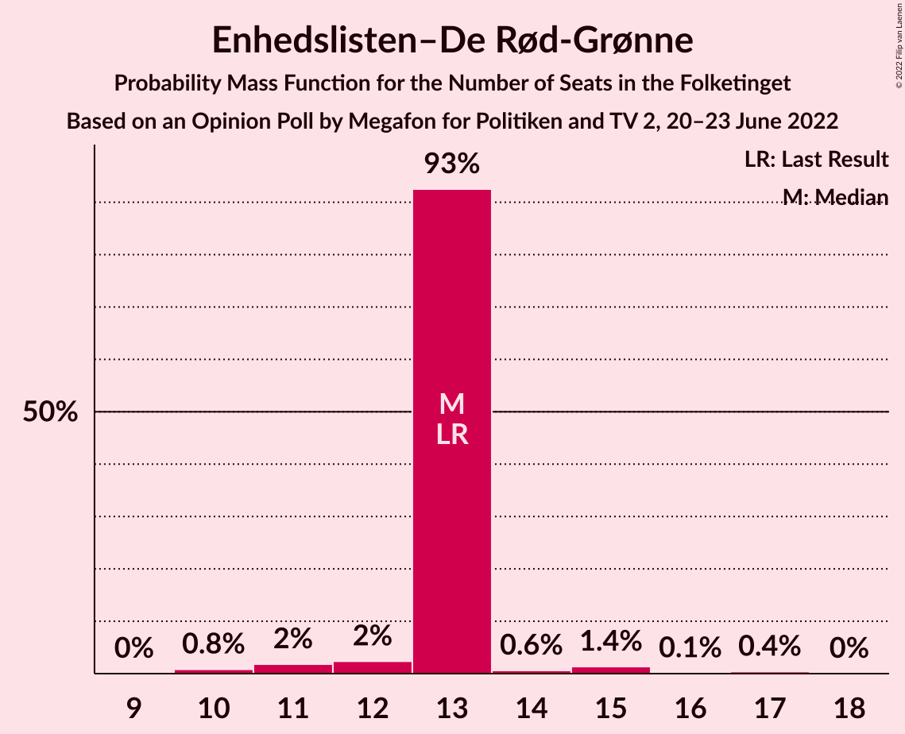

| Number of Seats | Probability | Accumulated | Special Marks |
|:---------------:|:-----------:|:-----------:|:-------------:|
| 10 | 0.8% | 100% |  |
| 11 | 2% | 99.2% |  |
| 12 | 2% | 97% |  |
| 13 | 93% | 95% | Last Result, Median |
| 14 | 0.6% | 2% |  |
| 15 | 1.4% | 2% |  |
| 16 | 0.1% | 0.5% |  |
| 17 | 0.4% | 0.4% |  |
| 18 | 0% | 0% |  |

### Radikale Venstre

*For a full overview of the results for this party, see the [Radikale Venstre](party-radikalevenstre.html) page.*

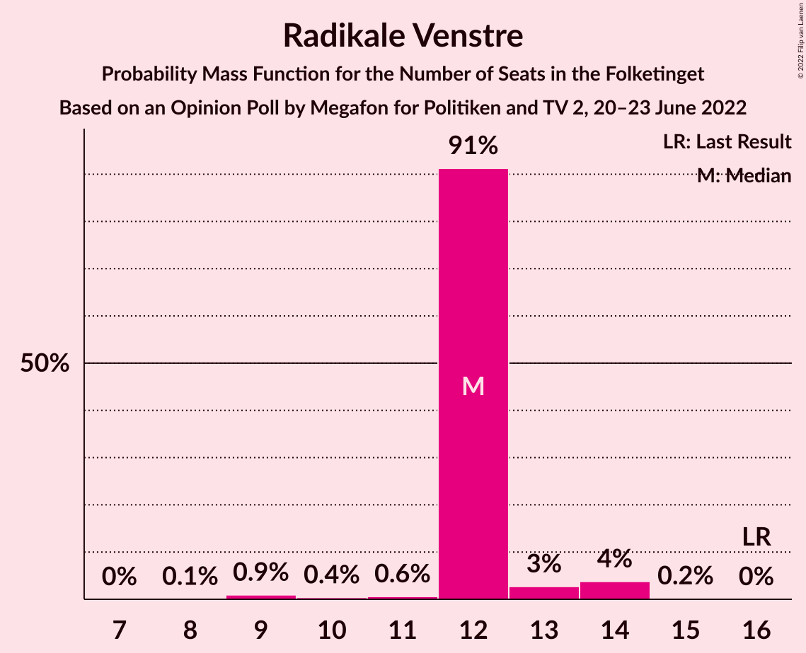

| Number of Seats | Probability | Accumulated | Special Marks |
|:---------------:|:-----------:|:-----------:|:-------------:|
| 8 | 0.1% | 100% |  |
| 9 | 0.9% | 99.9% |  |
| 10 | 0.4% | 99.0% |  |
| 11 | 0.6% | 98.6% |  |
| 12 | 91% | 98% | Median |
| 13 | 3% | 7% |  |
| 14 | 4% | 4% |  |
| 15 | 0.2% | 0.2% |  |
| 16 | 0% | 0% | Last Result |

### Liberal Alliance

*For a full overview of the results for this party, see the [Liberal Alliance](party-liberalalliance.html) page.*

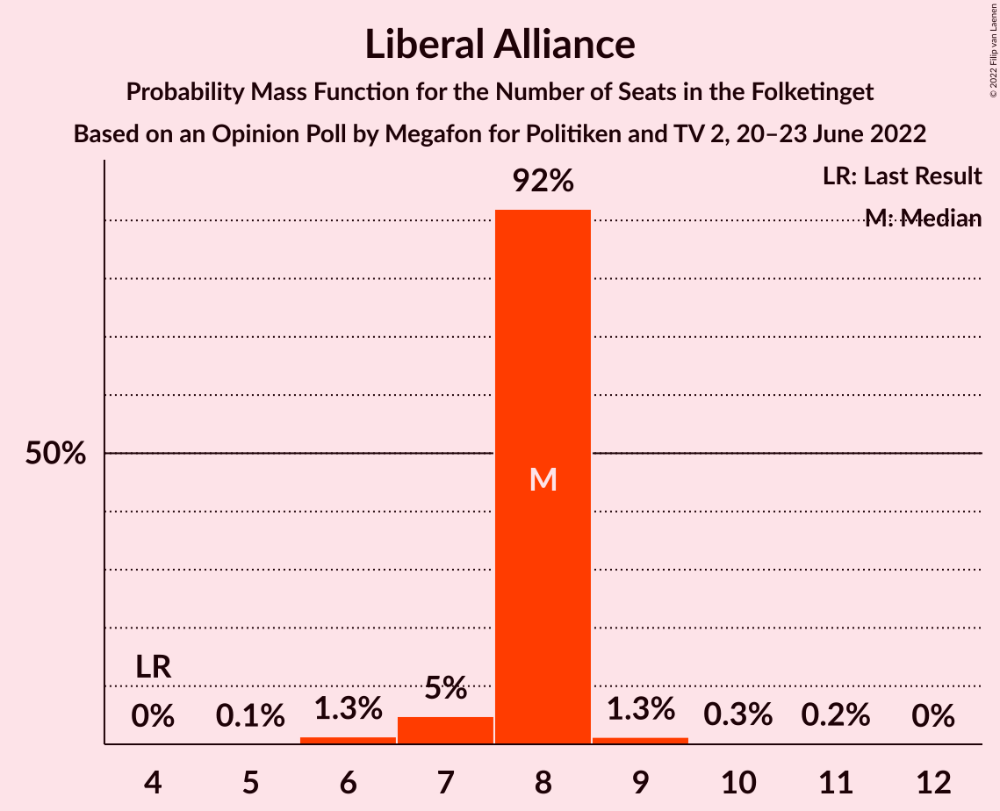

| Number of Seats | Probability | Accumulated | Special Marks |
|:---------------:|:-----------:|:-----------:|:-------------:|
| 4 | 0% | 100% | Last Result |
| 5 | 0.1% | 100% |  |
| 6 | 1.3% | 99.9% |  |
| 7 | 5% | 98.6% |  |
| 8 | 92% | 94% | Median |
| 9 | 1.3% | 2% |  |
| 10 | 0.3% | 0.5% |  |
| 11 | 0.2% | 0.2% |  |
| 12 | 0% | 0% |  |

### Moderaterne

*For a full overview of the results for this party, see the [Moderaterne](party-moderaterne.html) page.*

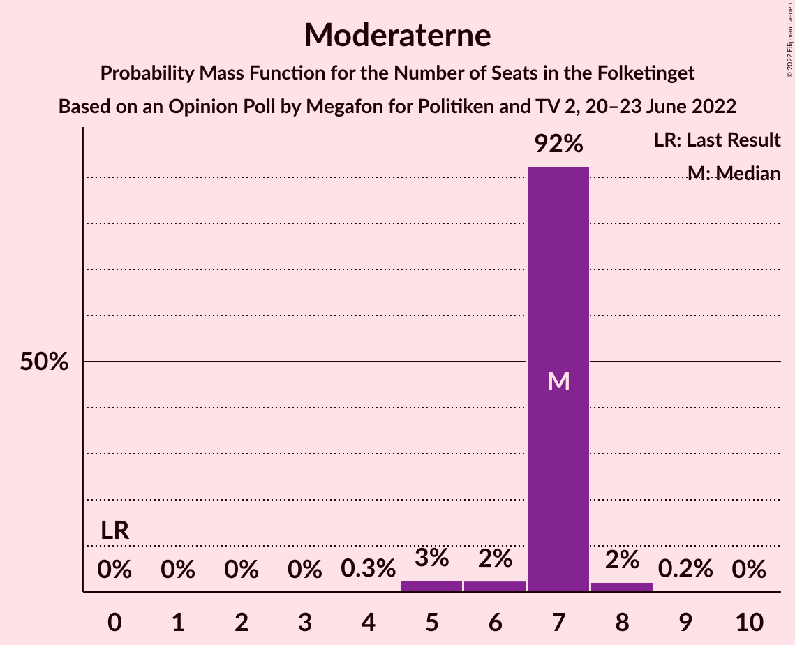

| Number of Seats | Probability | Accumulated | Special Marks |
|:---------------:|:-----------:|:-----------:|:-------------:|
| 0 | 0% | 100% | Last Result |
| 1 | 0% | 100% |  |
| 2 | 0% | 100% |  |
| 3 | 0% | 100% |  |
| 4 | 0.3% | 100% |  |
| 5 | 3% | 99.7% |  |
| 6 | 2% | 97% |  |
| 7 | 92% | 95% | Median |
| 8 | 2% | 2% |  |
| 9 | 0.2% | 0.2% |  |
| 10 | 0% | 0% |  |

### Dansk Folkeparti

*For a full overview of the results for this party, see the [Dansk Folkeparti](party-danskfolkeparti.html) page.*

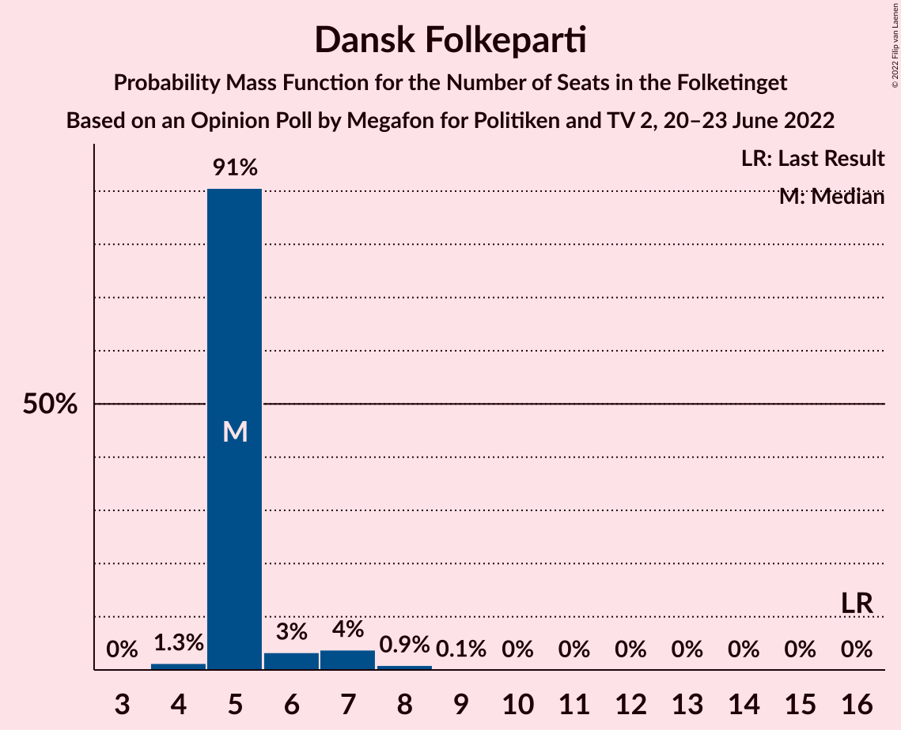

| Number of Seats | Probability | Accumulated | Special Marks |
|:---------------:|:-----------:|:-----------:|:-------------:|
| 4 | 1.3% | 100% |  |
| 5 | 91% | 98.7% | Median |
| 6 | 3% | 8% |  |
| 7 | 4% | 5% |  |
| 8 | 0.9% | 1.0% |  |
| 9 | 0.1% | 0.1% |  |
| 10 | 0% | 0% |  |
| 11 | 0% | 0% |  |
| 12 | 0% | 0% |  |
| 13 | 0% | 0% |  |
| 14 | 0% | 0% |  |
| 15 | 0% | 0% |  |
| 16 | 0% | 0% | Last Result |

### Alternativet

*For a full overview of the results for this party, see the [Alternativet](party-alternativet.html) page.*

| Number of Seats | Probability | Accumulated | Special Marks |
|:---------------:|:-----------:|:-----------:|:-------------:|
| 0 | 100% | 100% | Median |
| 1 | 0% | 0% |  |
| 2 | 0% | 0% |  |
| 3 | 0% | 0% |  |
| 4 | 0% | 0% |  |
| 5 | 0% | 0% | Last Result |

### Frie Grønne

*For a full overview of the results for this party, see the [Frie Grønne](party-friegrønne.html) page.*

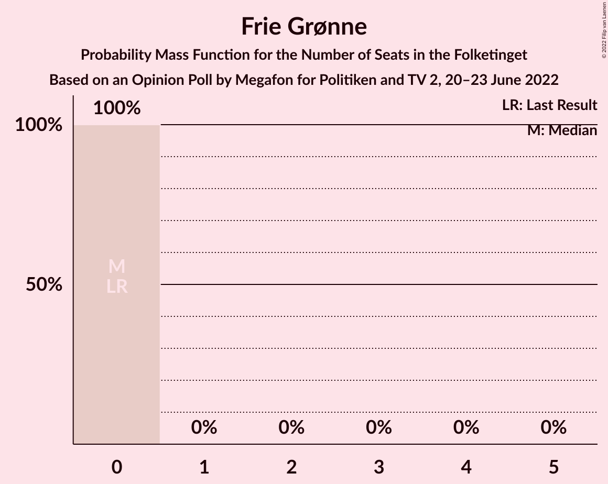

| Number of Seats | Probability | Accumulated | Special Marks |
|:---------------:|:-----------:|:-----------:|:-------------:|
| 0 | 100% | 100% | Last Result, Median |

### Kristendemokraterne

*For a full overview of the results for this party, see the [Kristendemokraterne](party-kristendemokraterne.html) page.*

| Number of Seats | Probability | Accumulated | Special Marks |
|:---------------:|:-----------:|:-----------:|:-------------:|
| 0 | 100% | 100% | Last Result, Median |

### Veganerpartiet

*For a full overview of the results for this party, see the [Veganerpartiet](party-veganerpartiet.html) page.*

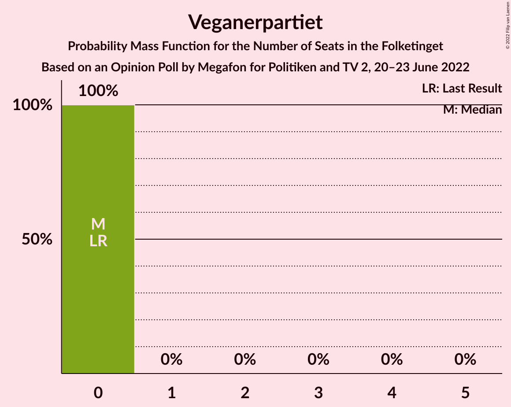

| Number of Seats | Probability | Accumulated | Special Marks |
|:---------------:|:-----------:|:-----------:|:-------------:|
| 0 | 100% | 100% | Last Result, Median |

## Coalitions

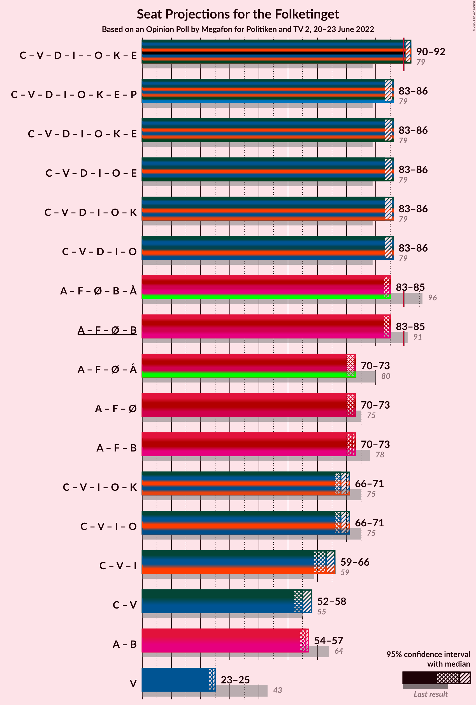

### Confidence Intervals

| Coalition | Last Result | Median | Majority? | 80% Confidence Interval | 90% Confidence Interval | 95% Confidence Interval | 99% Confidence Interval |
|:---------:|:-----------:|:------:|:---------:|:-----------------------:|:-----------------------:|:-----------------------:|:-----------------------:|
| Det Konservative Folkeparti – Venstre – Nye Borgerlige – Liberal Alliance – Dansk Folkeparti – Kristendemokraterne | 79 | 83 | 0% | 83 | 83–85 | 83–86 | 79–89 |
| Det Konservative Folkeparti – Venstre – Nye Borgerlige – Liberal Alliance – Dansk Folkeparti | 79 | 83 | 0% | 83 | 83–85 | 83–86 | 79–89 |
| Socialdemokraterne – Socialistisk Folkeparti – Enhedslisten–De Rød-Grønne – Radikale Venstre – Alternativet | 96 | 85 | 0.7% | 85 | 83–85 | 83–85 | 80–90 |
| Socialdemokraterne – Socialistisk Folkeparti – Enhedslisten–De Rød-Grønne – Radikale Venstre | 91 | 85 | 0.7% | 85 | 83–85 | 83–85 | 80–90 |
| Socialdemokraterne – Socialistisk Folkeparti – Enhedslisten–De Rød-Grønne – Alternativet | 80 | 73 | 0% | 73 | 71–73 | 70–73 | 67–78 |
| Socialdemokraterne – Socialistisk Folkeparti – Enhedslisten–De Rød-Grønne | 75 | 73 | 0% | 73 | 71–73 | 70–73 | 67–78 |
| Socialdemokraterne – Socialistisk Folkeparti – Radikale Venstre | 78 | 72 | 0% | 72 | 72 | 70–73 | 67–75 |
| Det Konservative Folkeparti – Venstre – Liberal Alliance – Dansk Folkeparti – Kristendemokraterne | 75 | 68 | 0% | 68 | 68 | 66–71 | 63–74 |
| Det Konservative Folkeparti – Venstre – Liberal Alliance – Dansk Folkeparti | 75 | 68 | 0% | 68 | 68 | 66–71 | 63–74 |
| Det Konservative Folkeparti – Venstre – Liberal Alliance | 59 | 63 | 0% | 63 | 62–63 | 59–66 | 58–67 |
| Det Konservative Folkeparti – Venstre | 55 | 55 | 0% | 55 | 55 | 52–58 | 50–61 |
| Socialdemokraterne – Radikale Venstre | 64 | 56 | 0% | 56 | 56 | 54–57 | 52–60 |
| Venstre | 43 | 24 | 0% | 24 | 24 | 23–25 | 21–27 |

### Det Konservative Folkeparti – Venstre – Nye Borgerlige – Liberal Alliance – Dansk Folkeparti – Kristendemokraterne

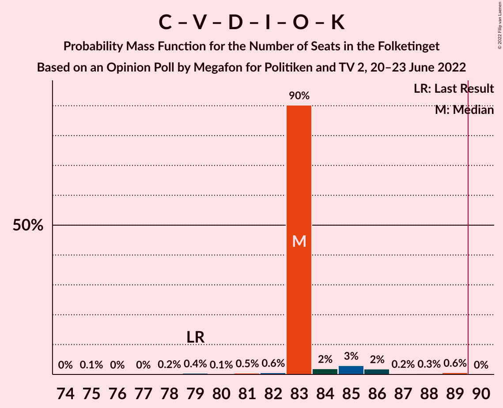

| Number of Seats | Probability | Accumulated | Special Marks |
|:---------------:|:-----------:|:-----------:|:-------------:|
| 75 | 0.1% | 100% |  |
| 76 | 0% | 99.9% |  |
| 77 | 0% | 99.9% |  |
| 78 | 0.2% | 99.9% |  |
| 79 | 0.4% | 99.7% | Last Result |
| 80 | 0.1% | 99.3% |  |
| 81 | 0.5% | 99.2% |  |
| 82 | 0.6% | 98.8% |  |
| 83 | 90% | 98% | Median |
| 84 | 2% | 8% |  |
| 85 | 3% | 6% |  |
| 86 | 2% | 3% |  |
| 87 | 0.2% | 1.2% |  |
| 88 | 0.3% | 1.0% |  |
| 89 | 0.6% | 0.6% |  |
| 90 | 0% | 0% | Majority |

### Det Konservative Folkeparti – Venstre – Nye Borgerlige – Liberal Alliance – Dansk Folkeparti

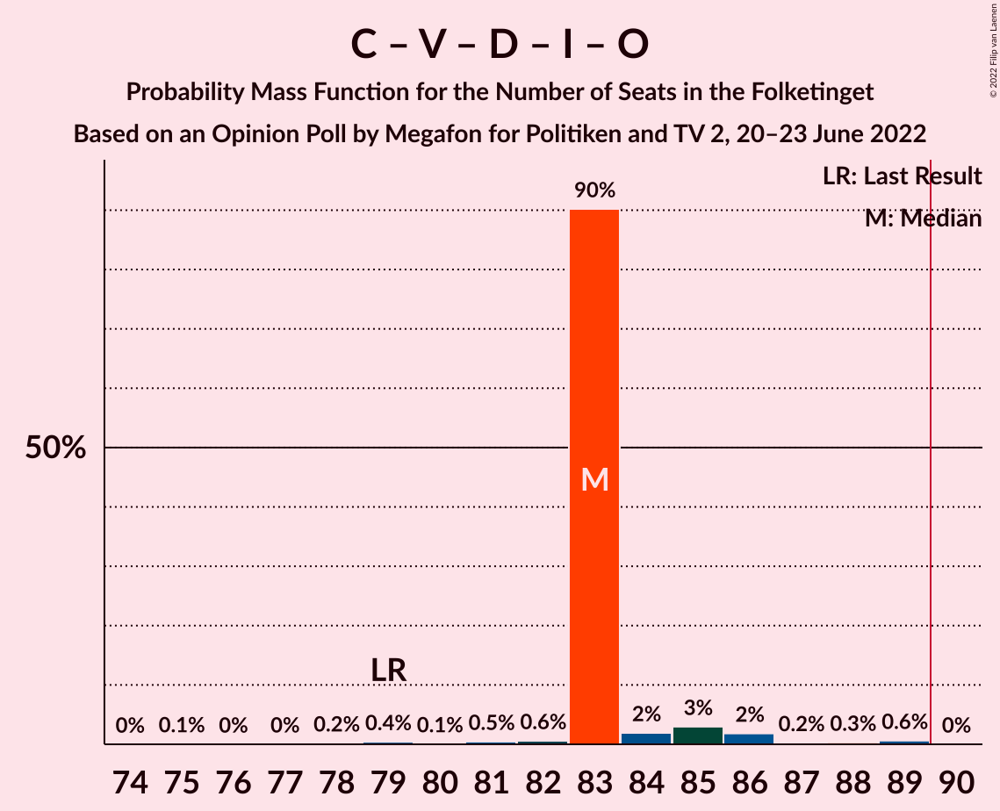

| Number of Seats | Probability | Accumulated | Special Marks |
|:---------------:|:-----------:|:-----------:|:-------------:|
| 75 | 0.1% | 100% |  |
| 76 | 0% | 99.9% |  |
| 77 | 0% | 99.9% |  |
| 78 | 0.2% | 99.9% |  |
| 79 | 0.4% | 99.7% | Last Result |
| 80 | 0.1% | 99.3% |  |
| 81 | 0.5% | 99.2% |  |
| 82 | 0.6% | 98.8% |  |
| 83 | 90% | 98% | Median |
| 84 | 2% | 8% |  |
| 85 | 3% | 6% |  |
| 86 | 2% | 3% |  |
| 87 | 0.2% | 1.2% |  |
| 88 | 0.3% | 1.0% |  |
| 89 | 0.6% | 0.6% |  |
| 90 | 0% | 0% | Majority |

### Socialdemokraterne – Socialistisk Folkeparti – Enhedslisten–De Rød-Grønne – Radikale Venstre – Alternativet

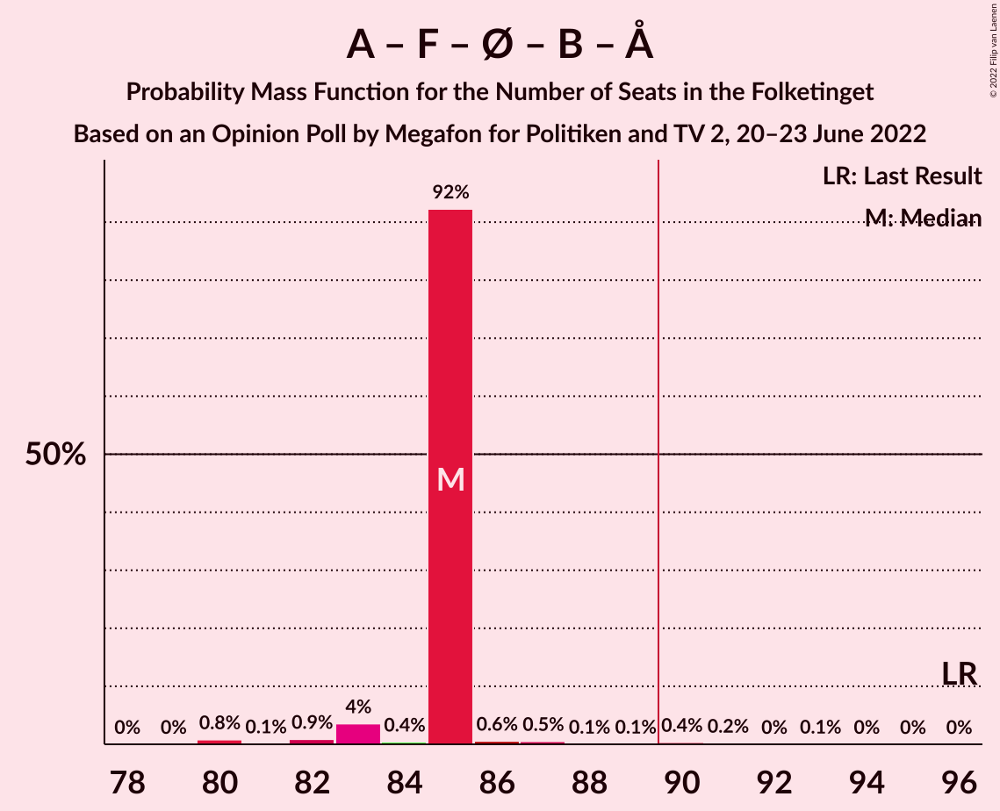

| Number of Seats | Probability | Accumulated | Special Marks |
|:---------------:|:-----------:|:-----------:|:-------------:|
| 80 | 0.8% | 100% |  |
| 81 | 0.1% | 99.1% |  |
| 82 | 0.9% | 99.0% |  |
| 83 | 4% | 98% |  |
| 84 | 0.4% | 95% |  |
| 85 | 92% | 94% | Median |
| 86 | 0.6% | 2% |  |
| 87 | 0.5% | 1.3% |  |
| 88 | 0.1% | 0.8% |  |
| 89 | 0.1% | 0.7% |  |
| 90 | 0.4% | 0.7% | Majority |
| 91 | 0.2% | 0.3% |  |
| 92 | 0% | 0.1% |  |
| 93 | 0.1% | 0.1% |  |
| 94 | 0% | 0% |  |
| 95 | 0% | 0% |  |
| 96 | 0% | 0% | Last Result |

### Socialdemokraterne – Socialistisk Folkeparti – Enhedslisten–De Rød-Grønne – Radikale Venstre

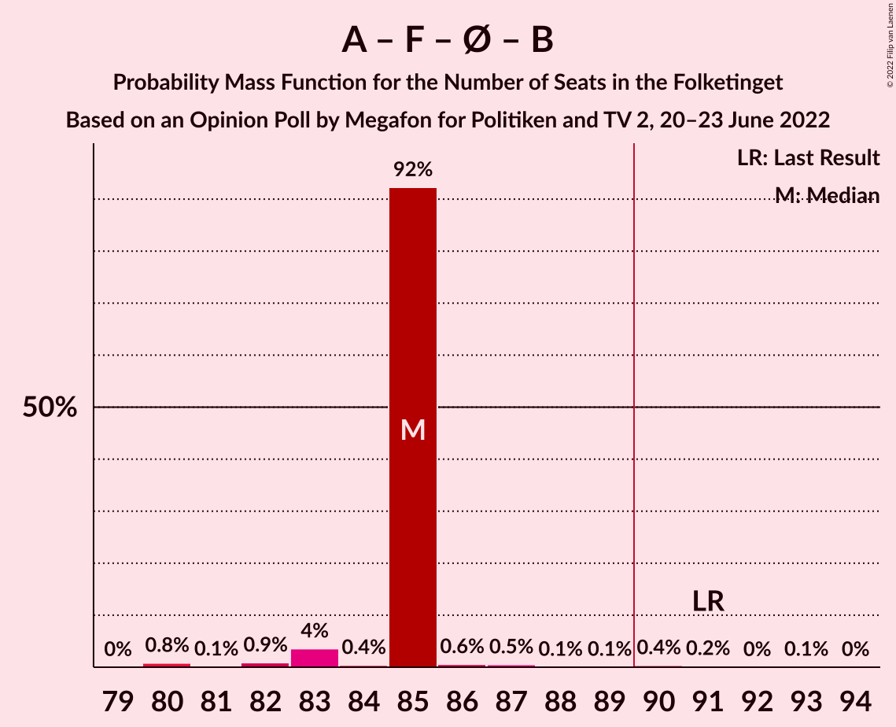

| Number of Seats | Probability | Accumulated | Special Marks |
|:---------------:|:-----------:|:-----------:|:-------------:|
| 80 | 0.8% | 100% |  |
| 81 | 0.1% | 99.1% |  |
| 82 | 0.9% | 99.0% |  |
| 83 | 4% | 98% |  |
| 84 | 0.4% | 95% |  |
| 85 | 92% | 94% | Median |
| 86 | 0.6% | 2% |  |
| 87 | 0.5% | 1.3% |  |
| 88 | 0.1% | 0.8% |  |
| 89 | 0.1% | 0.7% |  |
| 90 | 0.4% | 0.7% | Majority |
| 91 | 0.2% | 0.3% | Last Result |
| 92 | 0% | 0.1% |  |
| 93 | 0.1% | 0.1% |  |
| 94 | 0% | 0% |  |

### Socialdemokraterne – Socialistisk Folkeparti – Enhedslisten–De Rød-Grønne – Alternativet

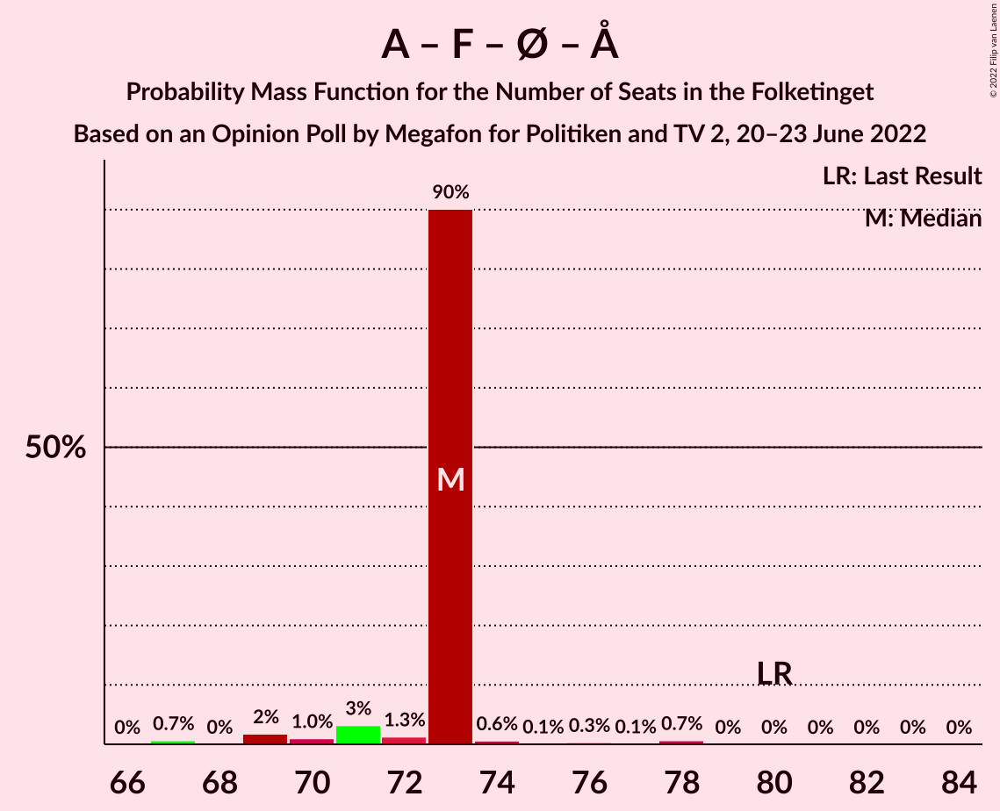

| Number of Seats | Probability | Accumulated | Special Marks |
|:---------------:|:-----------:|:-----------:|:-------------:|
| 67 | 0.7% | 100% |  |
| 68 | 0% | 99.3% |  |
| 69 | 2% | 99.3% |  |
| 70 | 1.0% | 98% |  |
| 71 | 3% | 97% |  |
| 72 | 1.3% | 93% |  |
| 73 | 90% | 92% | Median |
| 74 | 0.6% | 2% |  |
| 75 | 0.1% | 1.3% |  |
| 76 | 0.3% | 1.2% |  |
| 77 | 0.1% | 0.9% |  |
| 78 | 0.7% | 0.8% |  |
| 79 | 0% | 0.1% |  |
| 80 | 0% | 0.1% | Last Result |
| 81 | 0% | 0.1% |  |
| 82 | 0% | 0.1% |  |
| 83 | 0% | 0% |  |

### Socialdemokraterne – Socialistisk Folkeparti – Enhedslisten–De Rød-Grønne

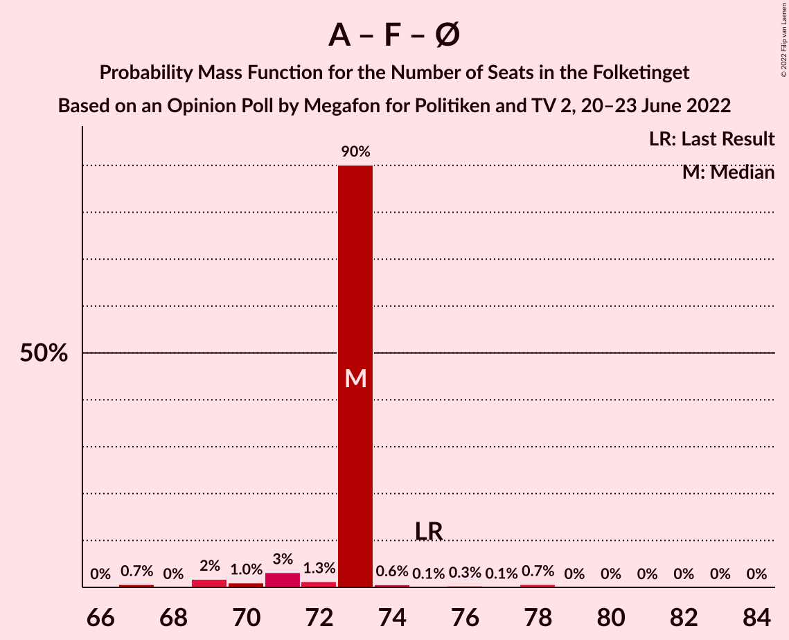

| Number of Seats | Probability | Accumulated | Special Marks |
|:---------------:|:-----------:|:-----------:|:-------------:|
| 67 | 0.7% | 100% |  |
| 68 | 0% | 99.3% |  |
| 69 | 2% | 99.3% |  |
| 70 | 1.0% | 98% |  |
| 71 | 3% | 97% |  |
| 72 | 1.3% | 93% |  |
| 73 | 90% | 92% | Median |
| 74 | 0.6% | 2% |  |
| 75 | 0.1% | 1.3% | Last Result |
| 76 | 0.3% | 1.2% |  |
| 77 | 0.1% | 0.9% |  |
| 78 | 0.7% | 0.8% |  |
| 79 | 0% | 0.1% |  |
| 80 | 0% | 0.1% |  |
| 81 | 0% | 0.1% |  |
| 82 | 0% | 0.1% |  |
| 83 | 0% | 0% |  |

### Socialdemokraterne – Socialistisk Folkeparti – Radikale Venstre

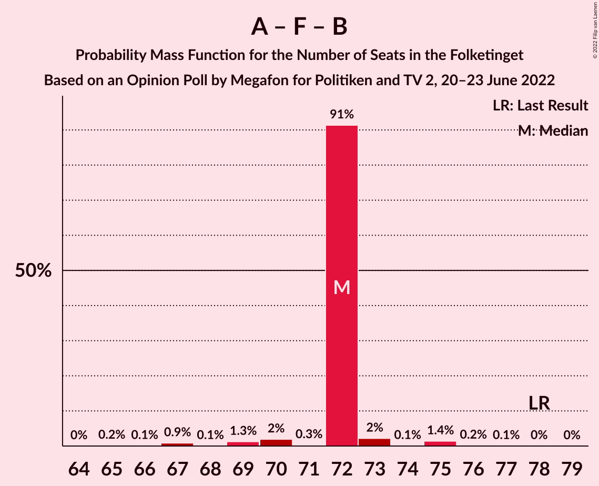

| Number of Seats | Probability | Accumulated | Special Marks |
|:---------------:|:-----------:|:-----------:|:-------------:|
| 65 | 0.2% | 100% |  |
| 66 | 0.1% | 99.8% |  |
| 67 | 0.9% | 99.8% |  |
| 68 | 0.1% | 98.9% |  |
| 69 | 1.3% | 98.8% |  |
| 70 | 2% | 98% |  |
| 71 | 0.3% | 96% |  |
| 72 | 91% | 95% | Median |
| 73 | 2% | 4% |  |
| 74 | 0.1% | 2% |  |
| 75 | 1.4% | 2% |  |
| 76 | 0.2% | 0.3% |  |
| 77 | 0.1% | 0.2% |  |
| 78 | 0% | 0.1% | Last Result |
| 79 | 0% | 0% |  |

### Det Konservative Folkeparti – Venstre – Liberal Alliance – Dansk Folkeparti – Kristendemokraterne

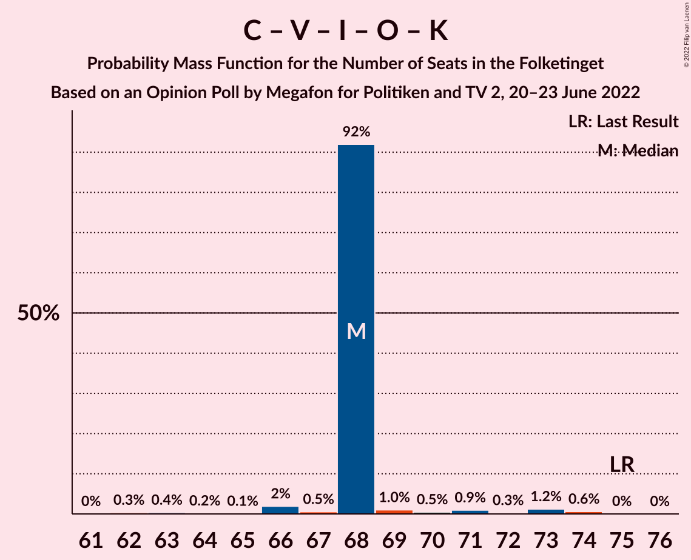

| Number of Seats | Probability | Accumulated | Special Marks |
|:---------------:|:-----------:|:-----------:|:-------------:|
| 62 | 0.3% | 100% |  |
| 63 | 0.4% | 99.6% |  |
| 64 | 0.2% | 99.3% |  |
| 65 | 0.1% | 99.1% |  |
| 66 | 2% | 99.0% |  |
| 67 | 0.5% | 97% |  |
| 68 | 92% | 97% | Median |
| 69 | 1.0% | 5% |  |
| 70 | 0.5% | 4% |  |
| 71 | 0.9% | 3% |  |
| 72 | 0.3% | 2% |  |
| 73 | 1.2% | 2% |  |
| 74 | 0.6% | 0.7% |  |
| 75 | 0% | 0.1% | Last Result |
| 76 | 0% | 0% |  |

### Det Konservative Folkeparti – Venstre – Liberal Alliance – Dansk Folkeparti

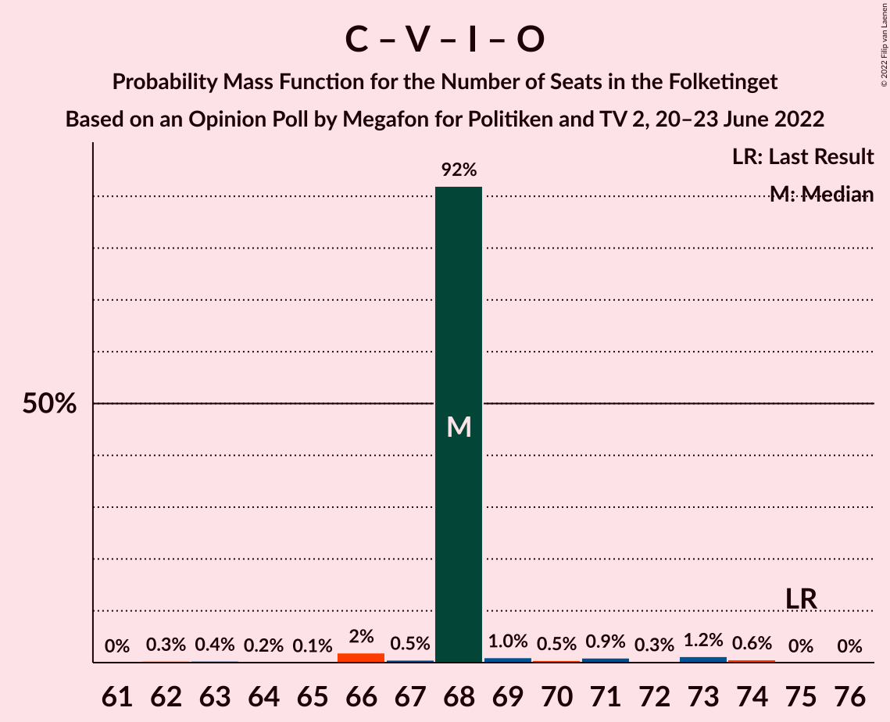

| Number of Seats | Probability | Accumulated | Special Marks |
|:---------------:|:-----------:|:-----------:|:-------------:|
| 62 | 0.3% | 100% |  |
| 63 | 0.4% | 99.6% |  |
| 64 | 0.2% | 99.3% |  |
| 65 | 0.1% | 99.1% |  |
| 66 | 2% | 99.0% |  |
| 67 | 0.5% | 97% |  |
| 68 | 92% | 97% | Median |
| 69 | 1.0% | 5% |  |
| 70 | 0.5% | 4% |  |
| 71 | 0.9% | 3% |  |
| 72 | 0.3% | 2% |  |
| 73 | 1.2% | 2% |  |
| 74 | 0.6% | 0.7% |  |
| 75 | 0% | 0.1% | Last Result |
| 76 | 0% | 0% |  |

### Det Konservative Folkeparti – Venstre – Liberal Alliance

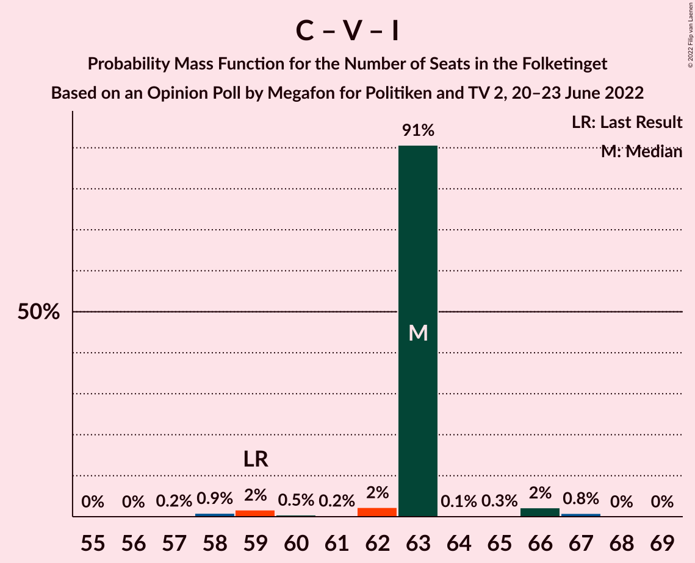

| Number of Seats | Probability | Accumulated | Special Marks |
|:---------------:|:-----------:|:-----------:|:-------------:|
| 55 | 0% | 100% |  |
| 56 | 0% | 99.9% |  |
| 57 | 0.2% | 99.9% |  |
| 58 | 0.9% | 99.7% |  |
| 59 | 2% | 98.8% | Last Result |
| 60 | 0.5% | 97% |  |
| 61 | 0.2% | 97% |  |
| 62 | 2% | 96% |  |
| 63 | 91% | 94% | Median |
| 64 | 0.1% | 3% |  |
| 65 | 0.3% | 3% |  |
| 66 | 2% | 3% |  |
| 67 | 0.8% | 0.9% |  |
| 68 | 0% | 0.1% |  |
| 69 | 0% | 0% |  |

### Det Konservative Folkeparti – Venstre

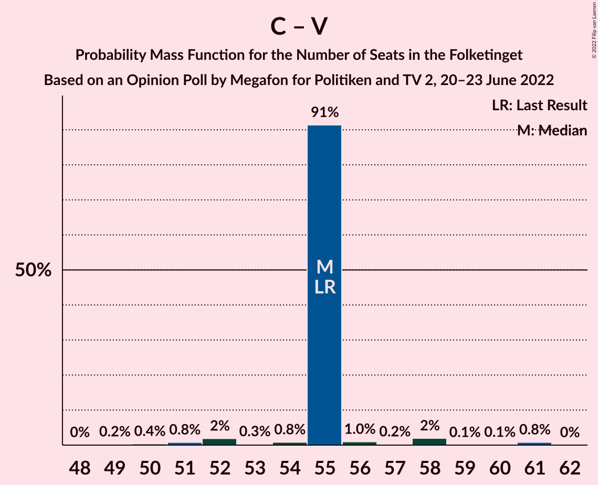

| Number of Seats | Probability | Accumulated | Special Marks |
|:---------------:|:-----------:|:-----------:|:-------------:|
| 48 | 0% | 100% |  |
| 49 | 0.2% | 99.9% |  |
| 50 | 0.4% | 99.7% |  |
| 51 | 0.8% | 99.3% |  |
| 52 | 2% | 98.6% |  |
| 53 | 0.3% | 97% |  |
| 54 | 0.8% | 96% |  |
| 55 | 91% | 96% | Last Result, Median |
| 56 | 1.0% | 4% |  |
| 57 | 0.2% | 3% |  |
| 58 | 2% | 3% |  |
| 59 | 0.1% | 1.0% |  |
| 60 | 0.1% | 0.9% |  |
| 61 | 0.8% | 0.8% |  |
| 62 | 0% | 0% |  |

### Socialdemokraterne – Radikale Venstre

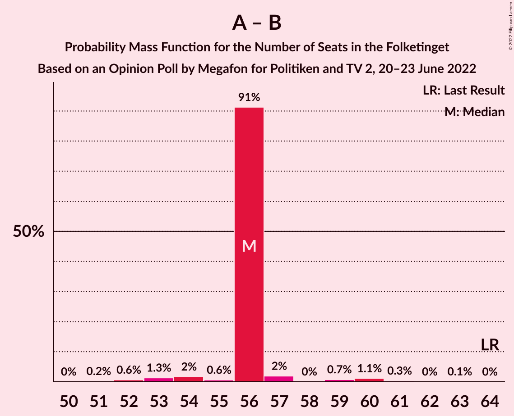

| Number of Seats | Probability | Accumulated | Special Marks |
|:---------------:|:-----------:|:-----------:|:-------------:|
| 51 | 0.2% | 100% |  |
| 52 | 0.6% | 99.8% |  |
| 53 | 1.3% | 99.1% |  |
| 54 | 2% | 98% |  |
| 55 | 0.6% | 96% |  |
| 56 | 91% | 96% | Median |
| 57 | 2% | 4% |  |
| 58 | 0% | 2% |  |
| 59 | 0.7% | 2% |  |
| 60 | 1.1% | 2% |  |
| 61 | 0.3% | 0.4% |  |
| 62 | 0% | 0.1% |  |
| 63 | 0.1% | 0.1% |  |
| 64 | 0% | 0% | Last Result |

### Venstre

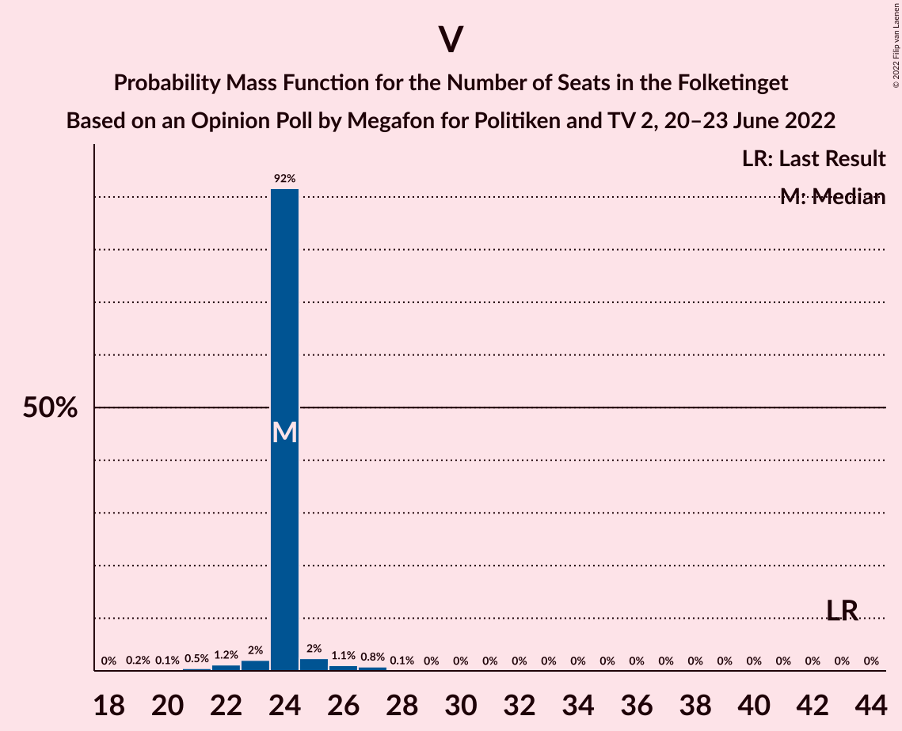

| Number of Seats | Probability | Accumulated | Special Marks |
|:---------------:|:-----------:|:-----------:|:-------------:|
| 19 | 0.2% | 100% |  |
| 20 | 0.1% | 99.8% |  |
| 21 | 0.5% | 99.7% |  |
| 22 | 1.2% | 99.2% |  |
| 23 | 2% | 98% |  |
| 24 | 92% | 96% | Median |
| 25 | 2% | 4% |  |
| 26 | 1.1% | 2% |  |
| 27 | 0.8% | 0.9% |  |
| 28 | 0.1% | 0.1% |  |
| 29 | 0% | 0% |  |
| 30 | 0% | 0% |  |
| 31 | 0% | 0% |  |
| 32 | 0% | 0% |  |
| 33 | 0% | 0% |  |
| 34 | 0% | 0% |  |
| 35 | 0% | 0% |  |
| 36 | 0% | 0% |  |
| 37 | 0% | 0% |  |
| 38 | 0% | 0% |  |
| 39 | 0% | 0% |  |
| 40 | 0% | 0% |  |
| 41 | 0% | 0% |  |
| 42 | 0% | 0% |  |
| 43 | 0% | 0% | Last Result |

## Technical Information

### Opinion Poll

+ **Polling firm:** Megafon
+ **Commissioner(s):** Politiken and TV 2
+ **Fieldwork period:** 20–23 June 2022

### Calculations

+ **Sample size:** 1141
+ **Simulations done:** 1,048,576
+ **Error estimate:** 2.36%

