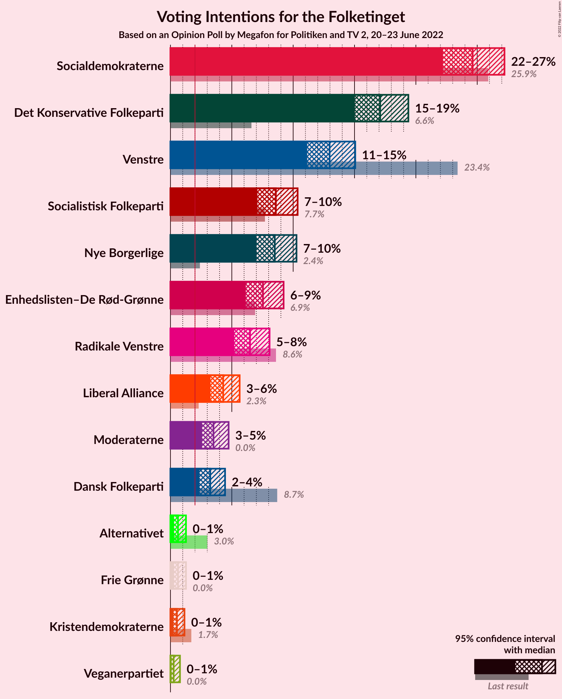
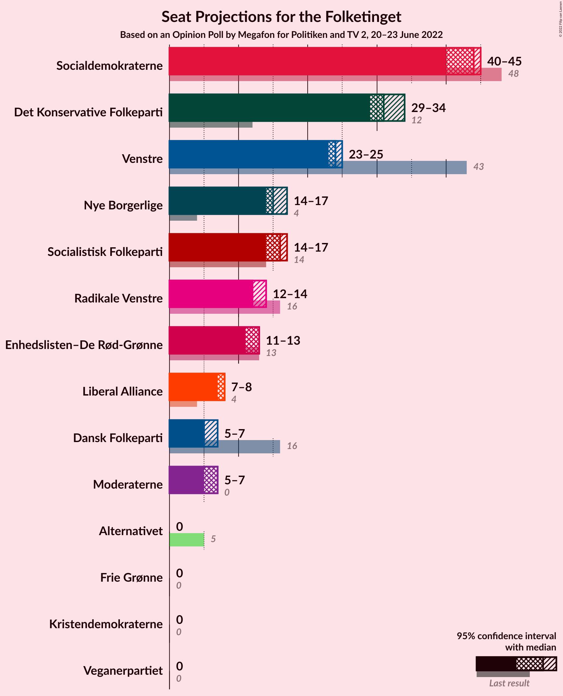
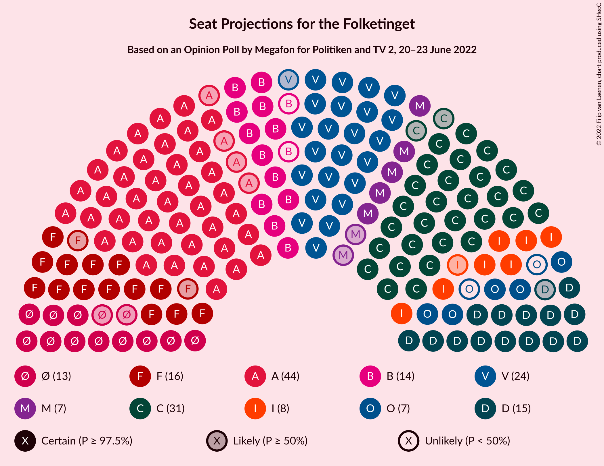

# Opinion Poll by Megafon for Politiken and TV 2, 20–23 June 2022

<a href="#voting-intentions">Voting Intentions</a> | <a href="#seats">Seats</a> | <a href="#coalitions">Coalitions</a> | <a href="#technical-information">Technical Information</a>

## Voting Intentions

### Confidence Intervals

| Party | Last Result | Poll Result | 80% Confidence Interval | 90% Confidence Interval | 95% Confidence Interval | 99% Confidence Interval |
|:-----:|:-----------:|:-----------:|:-----------------------:|:-----------------------:|:-----------------------:|:-----------------------:|
| Socialdemokraterne | 25.9% | 24.6% | 23.0–26.3% |22.6–26.8% |22.2–27.2% |21.5–28.0% |
| Det Konservative Folkeparti | 6.6% | 17.1% | 15.7–18.6% |15.3–19.0% |15.0–19.4% |14.4–20.1% |
| Venstre | 23.4% | 13.0% | 11.8–14.3% |11.4–14.7% |11.1–15.1% |10.6–15.7% |
| Socialistisk Folkeparti | 7.7% | 8.6% | 7.6–9.8% |7.3–10.1% |7.1–10.4% |6.6–10.9% |
| Nye Borgerlige | 2.4% | 8.5% | 7.5–9.7% |7.2–10.0% |7.0–10.3% |6.6–10.9% |
| Enhedslisten–De Rød-Grønne | 6.9% | 7.5% | 6.6–8.6% |6.4–8.9% |6.1–9.2% |5.7–9.8% |
| Radikale Venstre | 8.6% | 6.5% | 5.6–7.5% |5.4–7.8% |5.2–8.1% |4.8–8.6% |
| Liberal Alliance | 2.3% | 4.3% | 3.6–5.2% |3.4–5.4% |3.3–5.6% |3.0–6.1% |
| Moderaterne | N/A | 3.5% | 2.9–4.3% |2.7–4.5% |2.6–4.7% |2.3–5.2% |
| Dansk Folkeparti | 8.7% | 3.2% | 2.7–4.0% |2.5–4.3% |2.4–4.5% |2.1–4.8% |
| Alternativet | 3.0% | 0.6% | 0.4–1.0% |0.3–1.2% |0.3–1.3% |0.2–1.5% |
| Frie Grønne | 0.0% | 0.6% | 0.4–1.0% |0.3–1.2% |0.3–1.3% |0.2–1.5% |
| Kristendemokraterne | 1.7% | 0.5% | 0.3–0.9% |0.3–1.0% |0.2–1.1% |0.2–1.4% |
| Veganerpartiet | 0.0% | 0.3% | 0.2–0.6% |0.1–0.7% |0.1–0.8% |0.0–1.0% |

*Note:* The poll result column reflects the actual value used in the calculations. Published results may vary slightly, and in addition be rounded to fewer digits.

## Seats

### Confidence Intervals

| Party | Last Result | Median | 80% Confidence Interval | 90% Confidence Interval | 95% Confidence Interval | 99% Confidence Interval |
|:-----:|:-----------:|:------:|:-----------------------:|:-----------------------:|:-----------------------:|:-----------------------:|
| <a href="#socialdemokraterne">Socialdemokraterne</a> | 48 | 44 | 44 |42–44 |40–45 |39–49 |
| <a href="#det-konservative-folkeparti">Det Konservative Folkeparti</a> | 12 | 31 | 31 |30–31 |29–34 |27–35 |
| <a href="#venstre">Venstre</a> | 43 | 24 | 24 |24 |23–25 |21–27 |
| <a href="#socialistisk-folkeparti">Socialistisk Folkeparti</a> | 14 | 16 | 16 |16 |14–17 |12–18 |
| <a href="#nye-borgerlige">Nye Borgerlige</a> | 4 | 15 | 15 |15–17 |14–17 |13–18 |
| <a href="#enhedslisten–de-rød-grønne">Enhedslisten–De Rød-Grønne</a> | 13 | 13 | 13 |12–13 |11–13 |10–16 |
| <a href="#radikale-venstre">Radikale Venstre</a> | 16 | 12 | 12 |12–13 |12–14 |9–14 |
| <a href="#liberal-alliance">Liberal Alliance</a> | 4 | 8 | 8 |7–8 |7–8 |6–10 |
| <a href="#moderaterne">Moderaterne</a> | N/A | 7 | 7 |6–7 |5–7 |5–8 |
| <a href="#dansk-folkeparti">Dansk Folkeparti</a> | 16 | 5 | 5 |5–6 |5–7 |4–8 |
| <a href="#alternativet">Alternativet</a> | 5 | 0 | 0 |0 |0 |0 |
| <a href="#frie-grønne">Frie Grønne</a> | 0 | 0 | 0 |0 |0 |0 |
| <a href="#kristendemokraterne">Kristendemokraterne</a> | 0 | 0 | 0 |0 |0 |0 |
| <a href="#veganerpartiet">Veganerpartiet</a> | 0 | 0 | 0 |0 |0 |0 |

