# Opinion Poll by Voxmeter, 20–26 June 2022

<a href="#voting-intentions">Voting Intentions</a> | <a href="#seats">Seats</a> | <a href="#coalitions">Coalitions</a> | <a href="#technical-information">Technical Information</a>

## Voting Intentions

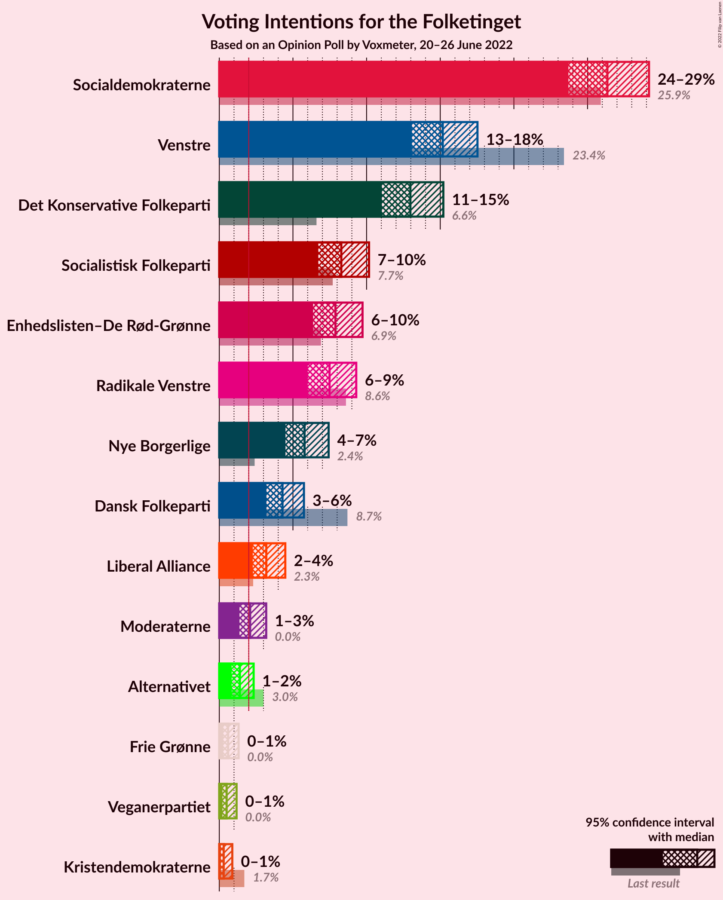

### Confidence Intervals

| Party | Last Result | Poll Result | 80% Confidence Interval | 90% Confidence Interval | 95% Confidence Interval | 99% Confidence Interval |
|:-----:|:-----------:|:-----------:|:-----------------------:|:-----------------------:|:-----------------------:|:-----------------------:|
| Socialdemokraterne | 25.9% | 26.3% | 24.6–28.2% |24.1–28.7% |23.7–29.2% |22.9–30.1% |
| Venstre | 23.4% | 15.2% | 13.8–16.7% |13.4–17.1% |13.1–17.5% |12.4–18.3% |
| Det Konservative Folkeparti | 6.6% | 13.0% | 11.7–14.4% |11.3–14.8% |11.0–15.2% |10.4–15.9% |
| Socialistisk Folkeparti | 7.7% | 8.3% | 7.3–9.5% |7.0–9.9% |6.7–10.2% |6.3–10.8% |
| Enhedslisten–De Rød-Grønne | 6.9% | 7.9% | 6.9–9.1% |6.6–9.4% |6.4–9.7% |5.9–10.3% |
| Radikale Venstre | 8.6% | 7.5% | 6.5–8.7% |6.2–9.0% |6.0–9.3% |5.6–9.9% |
| Nye Borgerlige | 2.4% | 5.8% | 4.9–6.9% |4.7–7.1% |4.5–7.4% |4.1–8.0% |
| Dansk Folkeparti | 8.7% | 4.3% | 3.6–5.2% |3.4–5.5% |3.2–5.7% |2.9–6.2% |
| Liberal Alliance | 2.3% | 3.2% | 2.6–4.0% |2.4–4.3% |2.3–4.5% |2.0–4.9% |
| Moderaterne | 0.0% | 2.1% | 1.6–2.8% |1.5–3.0% |1.4–3.2% |1.2–3.6% |
| Alternativet | 3.0% | 1.4% | 1.0–2.0% |0.9–2.2% |0.8–2.3% |0.7–2.7% |
| Frie Grønne | 0.0% | 0.6% | 0.4–1.1% |0.3–1.2% |0.3–1.3% |0.2–1.6% |
| Veganerpartiet | 0.0% | 0.5% | 0.3–0.9% |0.3–1.1% |0.2–1.2% |0.2–1.4% |
| Kristendemokraterne | 1.7% | 0.3% | 0.2–0.7% |0.1–0.8% |0.1–0.9% |0.1–1.1% |

*Note:* The poll result column reflects the actual value used in the calculations. Published results may vary slightly, and in addition be rounded to fewer digits.

## Seats

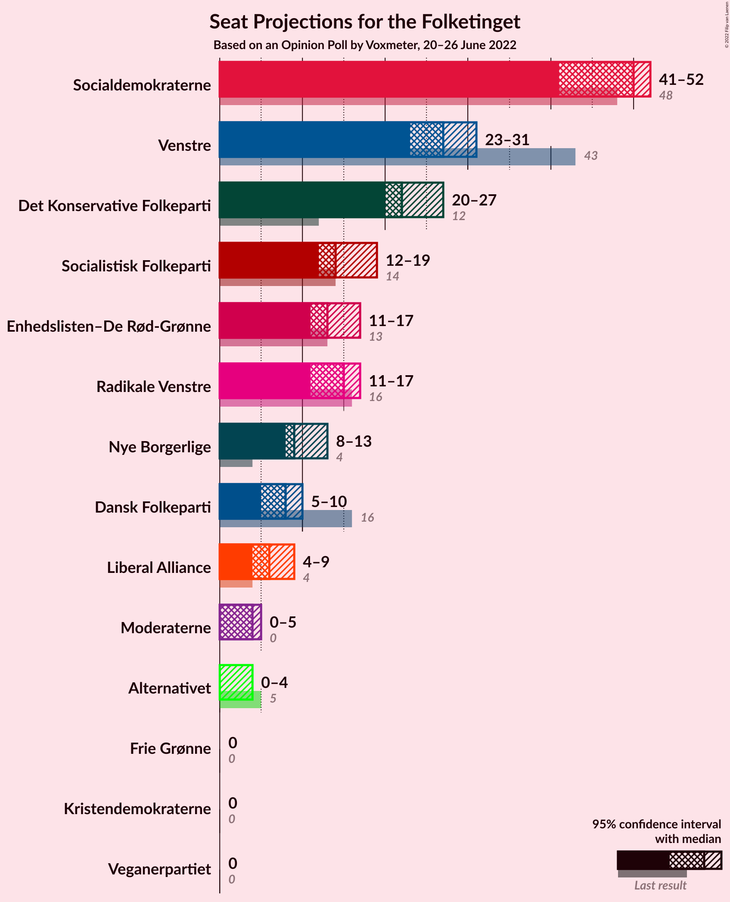

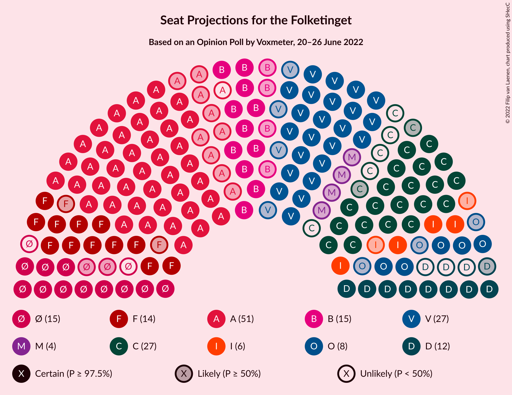

### Confidence Intervals

| Party | Last Result | Median | 80% Confidence Interval | 90% Confidence Interval | 95% Confidence Interval | 99% Confidence Interval |
|:-----:|:-----------:|:------:|:-----------------------:|:-----------------------:|:-----------------------:|:-----------------------:|
| <a href="#socialdemokraterne">Socialdemokraterne</a> | 48 | 50 | 45–51 |42–51 |41–52 |41–53 |
| <a href="#venstre">Venstre</a> | 43 | 27 | 24–29 |24–31 |23–31 |23–34 |
| <a href="#det-konservative-folkeparti">Det Konservative Folkeparti</a> | 12 | 22 | 22–26 |21–27 |20–27 |19–28 |
| <a href="#socialistisk-folkeparti">Socialistisk Folkeparti</a> | 14 | 14 | 13–17 |12–19 |12–19 |11–20 |
| <a href="#enhedslisten–de-rød-grønne">Enhedslisten–De Rød-Grønne</a> | 13 | 13 | 12–16 |11–17 |11–17 |11–18 |
| <a href="#radikale-venstre">Radikale Venstre</a> | 16 | 15 | 12–16 |11–16 |11–17 |10–17 |
| <a href="#nye-borgerlige">Nye Borgerlige</a> | 4 | 9 | 9–12 |8–13 |8–13 |8–15 |
| <a href="#dansk-folkeparti">Dansk Folkeparti</a> | 16 | 8 | 6–9 |6–9 |5–10 |5–11 |
| <a href="#liberal-alliance">Liberal Alliance</a> | 4 | 6 | 5–8 |5–9 |4–9 |4–9 |
| <a href="#moderaterne">Moderaterne</a> | 0 | 4 | 0–5 |0–5 |0–5 |0–6 |
| <a href="#alternativet">Alternativet</a> | 5 | 0 | 0 |0–4 |0–4 |0–5 |
| <a href="#frie-grønne">Frie Grønne</a> | 0 | 0 | 0 |0 |0 |0 |
| <a href="#veganerpartiet">Veganerpartiet</a> | 0 | 0 | 0 |0 |0 |0 |
| <a href="#kristendemokraterne">Kristendemokraterne</a> | 0 | 0 | 0 |0 |0 |0 |

### Socialdemokraterne

*For a full overview of the results for this party, see the [Socialdemokraterne](party-socialdemokraterne.html) page.*

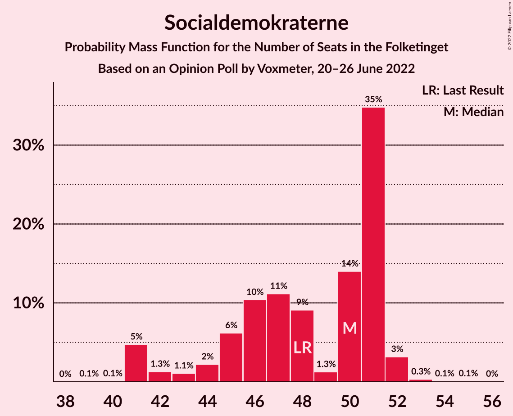

| Number of Seats | Probability | Accumulated | Special Marks |
|:---------------:|:-----------:|:-----------:|:-------------:|
| 39 | 0.1% | 100% |  |
| 40 | 0.1% | 99.9% |  |
| 41 | 5% | 99.9% |  |
| 42 | 1.3% | 95% |  |
| 43 | 1.1% | 94% |  |
| 44 | 2% | 93% |  |
| 45 | 6% | 91% |  |
| 46 | 10% | 84% |  |
| 47 | 11% | 74% |  |
| 48 | 9% | 63% | Last Result |
| 49 | 1.3% | 54% |  |
| 50 | 14% | 52% | Median |
| 51 | 35% | 38% |  |
| 52 | 3% | 4% |  |
| 53 | 0.3% | 0.5% |  |
| 54 | 0.1% | 0.2% |  |
| 55 | 0.1% | 0.1% |  |
| 56 | 0% | 0% |  |

### Venstre

*For a full overview of the results for this party, see the [Venstre](party-venstre.html) page.*

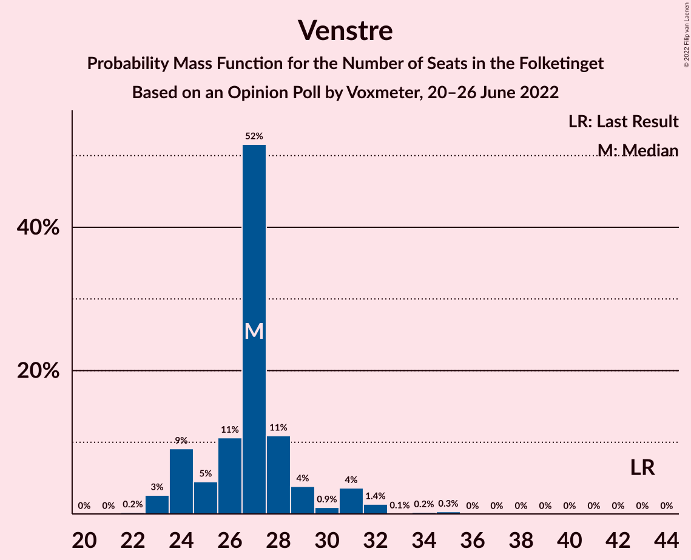

| Number of Seats | Probability | Accumulated | Special Marks |
|:---------------:|:-----------:|:-----------:|:-------------:|
| 22 | 0.2% | 100% |  |
| 23 | 3% | 99.8% |  |
| 24 | 9% | 97% |  |
| 25 | 5% | 88% |  |
| 26 | 11% | 84% |  |
| 27 | 52% | 73% | Median |
| 28 | 11% | 21% |  |
| 29 | 4% | 10% |  |
| 30 | 0.9% | 7% |  |
| 31 | 4% | 6% |  |
| 32 | 1.4% | 2% |  |
| 33 | 0.1% | 0.6% |  |
| 34 | 0.2% | 0.6% |  |
| 35 | 0.3% | 0.3% |  |
| 36 | 0% | 0% |  |
| 37 | 0% | 0% |  |
| 38 | 0% | 0% |  |
| 39 | 0% | 0% |  |
| 40 | 0% | 0% |  |
| 41 | 0% | 0% |  |
| 42 | 0% | 0% |  |
| 43 | 0% | 0% | Last Result |

### Det Konservative Folkeparti

*For a full overview of the results for this party, see the [Det Konservative Folkeparti](party-detkonservativefolkeparti.html) page.*

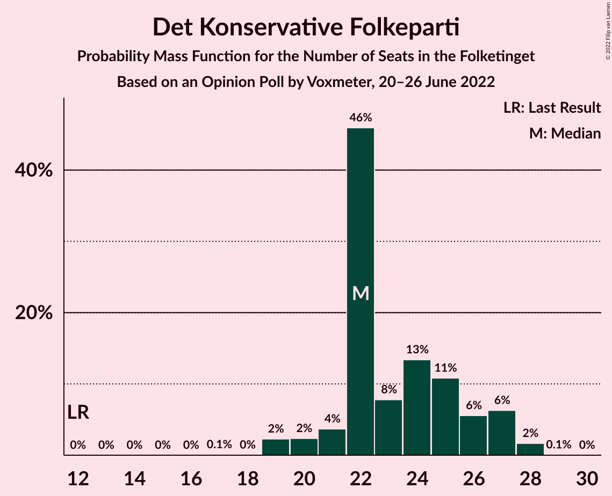

| Number of Seats | Probability | Accumulated | Special Marks |
|:---------------:|:-----------:|:-----------:|:-------------:|
| 12 | 0% | 100% | Last Result |
| 13 | 0% | 100% |  |
| 14 | 0% | 100% |  |
| 15 | 0% | 100% |  |
| 16 | 0% | 100% |  |
| 17 | 0.1% | 100% |  |
| 18 | 0% | 99.9% |  |
| 19 | 2% | 99.9% |  |
| 20 | 2% | 98% |  |
| 21 | 4% | 95% |  |
| 22 | 46% | 92% | Median |
| 23 | 8% | 46% |  |
| 24 | 13% | 38% |  |
| 25 | 11% | 24% |  |
| 26 | 6% | 14% |  |
| 27 | 6% | 8% |  |
| 28 | 2% | 2% |  |
| 29 | 0.1% | 0.1% |  |
| 30 | 0% | 0% |  |

### Socialistisk Folkeparti

*For a full overview of the results for this party, see the [Socialistisk Folkeparti](party-socialistiskfolkeparti.html) page.*

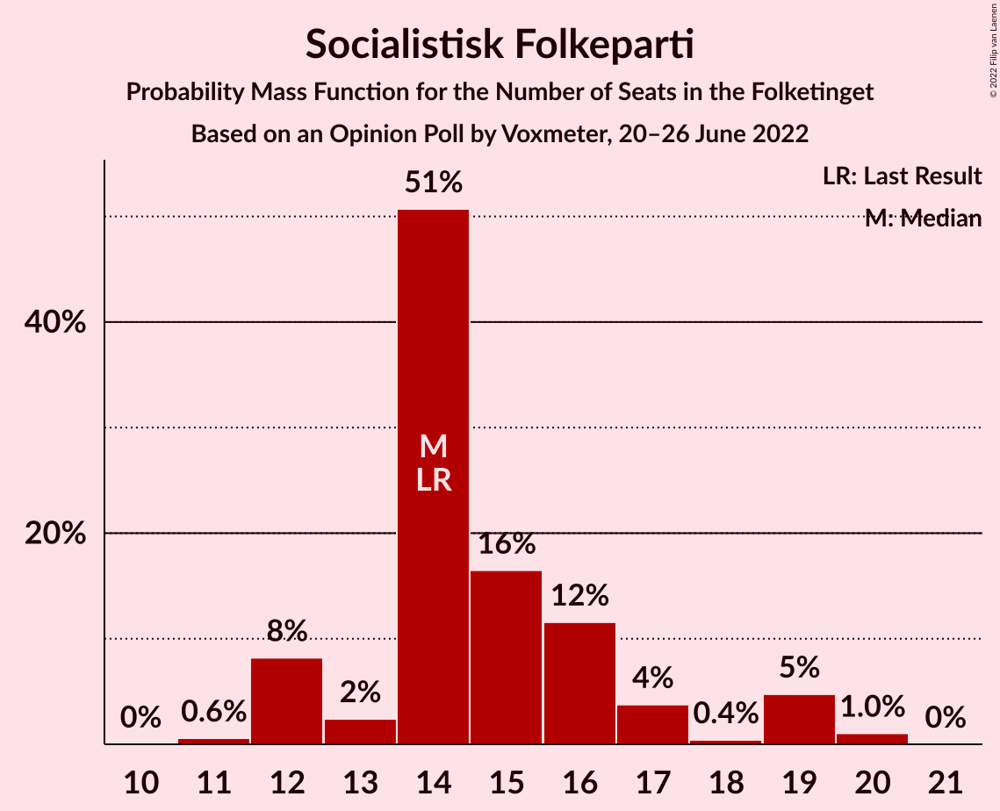

| Number of Seats | Probability | Accumulated | Special Marks |
|:---------------:|:-----------:|:-----------:|:-------------:|
| 11 | 0.6% | 100% |  |
| 12 | 8% | 99.4% |  |
| 13 | 2% | 91% |  |
| 14 | 51% | 89% | Last Result, Median |
| 15 | 16% | 38% |  |
| 16 | 12% | 22% |  |
| 17 | 4% | 10% |  |
| 18 | 0.4% | 6% |  |
| 19 | 5% | 6% |  |
| 20 | 1.0% | 1.1% |  |
| 21 | 0% | 0% |  |

### Enhedslisten–De Rød-Grønne

*For a full overview of the results for this party, see the [Enhedslisten–De Rød-Grønne](party-enhedslisten–derød-grønne.html) page.*

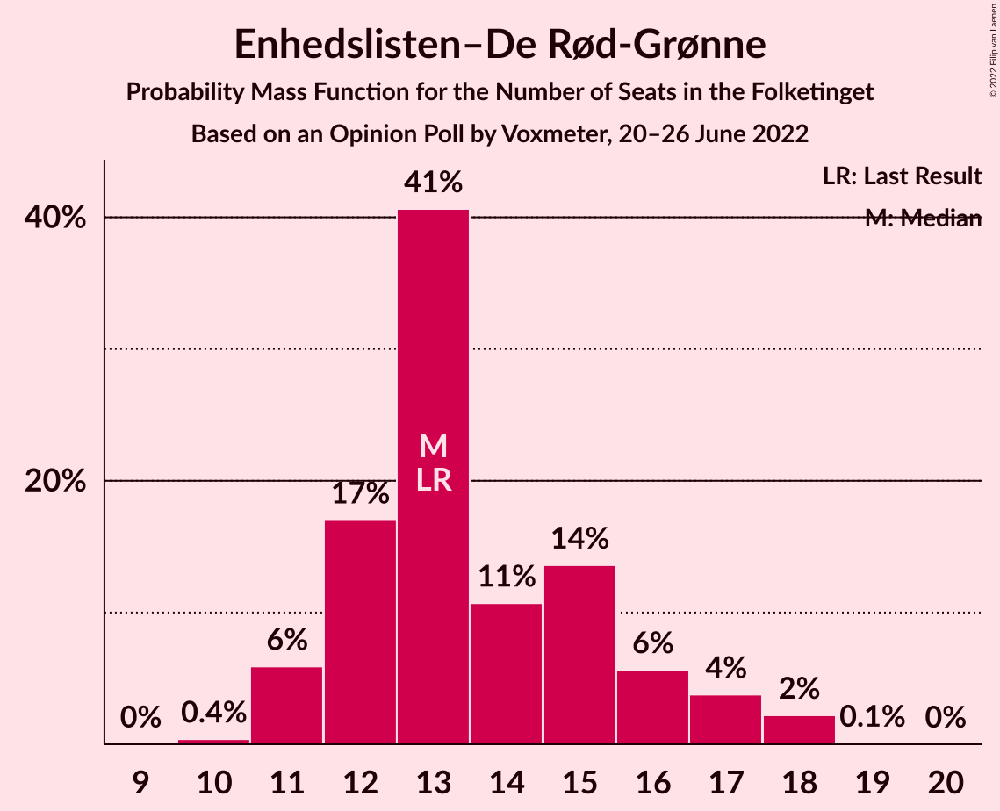

| Number of Seats | Probability | Accumulated | Special Marks |
|:---------------:|:-----------:|:-----------:|:-------------:|
| 10 | 0.4% | 100% |  |
| 11 | 6% | 99.6% |  |
| 12 | 17% | 94% |  |
| 13 | 41% | 77% | Last Result, Median |
| 14 | 11% | 36% |  |
| 15 | 14% | 25% |  |
| 16 | 6% | 12% |  |
| 17 | 4% | 6% |  |
| 18 | 2% | 2% |  |
| 19 | 0.1% | 0.1% |  |
| 20 | 0% | 0% |  |

### Radikale Venstre

*For a full overview of the results for this party, see the [Radikale Venstre](party-radikalevenstre.html) page.*

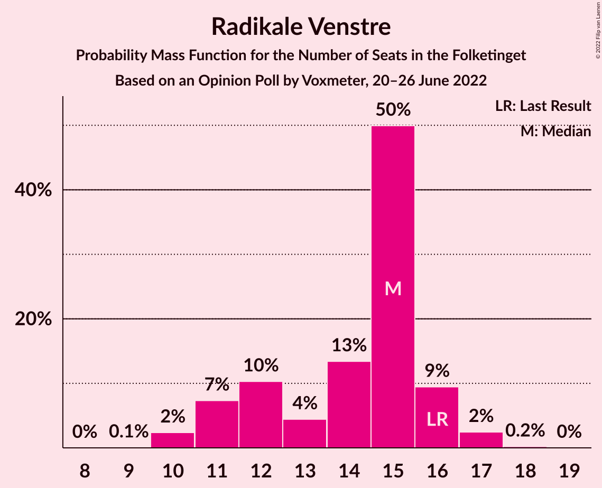

| Number of Seats | Probability | Accumulated | Special Marks |
|:---------------:|:-----------:|:-----------:|:-------------:|
| 9 | 0.1% | 100% |  |
| 10 | 2% | 99.9% |  |
| 11 | 7% | 98% |  |
| 12 | 10% | 90% |  |
| 13 | 4% | 80% |  |
| 14 | 13% | 75% |  |
| 15 | 50% | 62% | Median |
| 16 | 9% | 12% | Last Result |
| 17 | 2% | 3% |  |
| 18 | 0.2% | 0.2% |  |
| 19 | 0% | 0% |  |

### Nye Borgerlige

*For a full overview of the results for this party, see the [Nye Borgerlige](party-nyeborgerlige.html) page.*

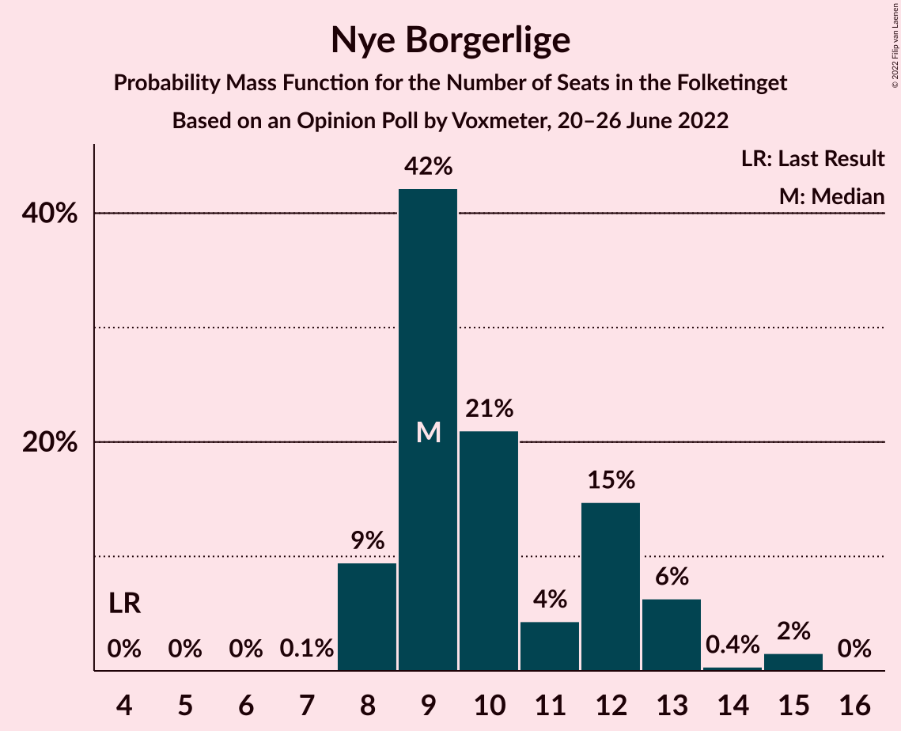

| Number of Seats | Probability | Accumulated | Special Marks |
|:---------------:|:-----------:|:-----------:|:-------------:|
| 4 | 0% | 100% | Last Result |
| 5 | 0% | 100% |  |
| 6 | 0% | 100% |  |
| 7 | 0.1% | 100% |  |
| 8 | 9% | 99.9% |  |
| 9 | 42% | 90% | Median |
| 10 | 21% | 48% |  |
| 11 | 4% | 27% |  |
| 12 | 15% | 23% |  |
| 13 | 6% | 8% |  |
| 14 | 0.4% | 2% |  |
| 15 | 2% | 2% |  |
| 16 | 0% | 0% |  |

### Dansk Folkeparti

*For a full overview of the results for this party, see the [Dansk Folkeparti](party-danskfolkeparti.html) page.*

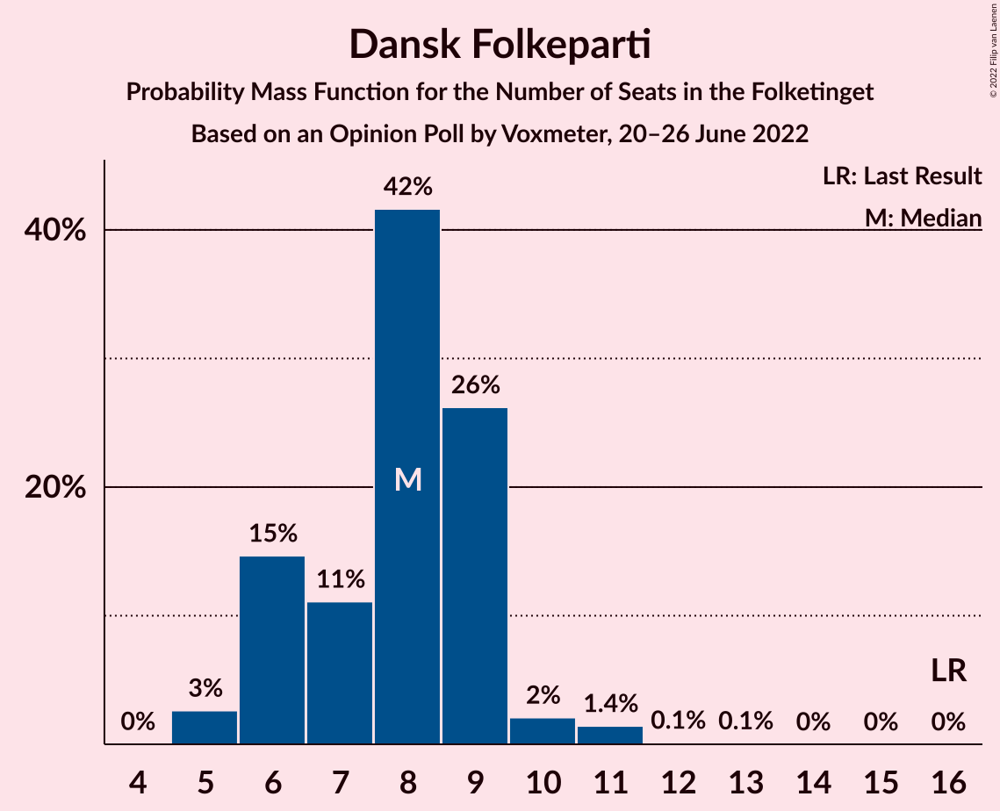

| Number of Seats | Probability | Accumulated | Special Marks |
|:---------------:|:-----------:|:-----------:|:-------------:|
| 5 | 3% | 100% |  |
| 6 | 15% | 97% |  |
| 7 | 11% | 83% |  |
| 8 | 42% | 72% | Median |
| 9 | 26% | 30% |  |
| 10 | 2% | 4% |  |
| 11 | 1.4% | 2% |  |
| 12 | 0.1% | 0.2% |  |
| 13 | 0.1% | 0.1% |  |
| 14 | 0% | 0% |  |
| 15 | 0% | 0% |  |
| 16 | 0% | 0% | Last Result |

### Liberal Alliance

*For a full overview of the results for this party, see the [Liberal Alliance](party-liberalalliance.html) page.*

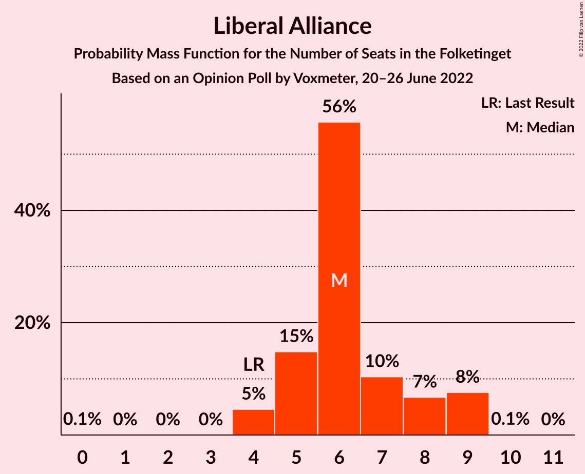

| Number of Seats | Probability | Accumulated | Special Marks |
|:---------------:|:-----------:|:-----------:|:-------------:|
| 0 | 0.1% | 100% |  |
| 1 | 0% | 99.9% |  |
| 2 | 0% | 99.9% |  |
| 3 | 0% | 99.9% |  |
| 4 | 5% | 99.9% | Last Result |
| 5 | 15% | 95% |  |
| 6 | 56% | 81% | Median |
| 7 | 10% | 25% |  |
| 8 | 7% | 14% |  |
| 9 | 8% | 8% |  |
| 10 | 0.1% | 0.1% |  |
| 11 | 0% | 0% |  |

### Moderaterne

*For a full overview of the results for this party, see the [Moderaterne](party-moderaterne.html) page.*

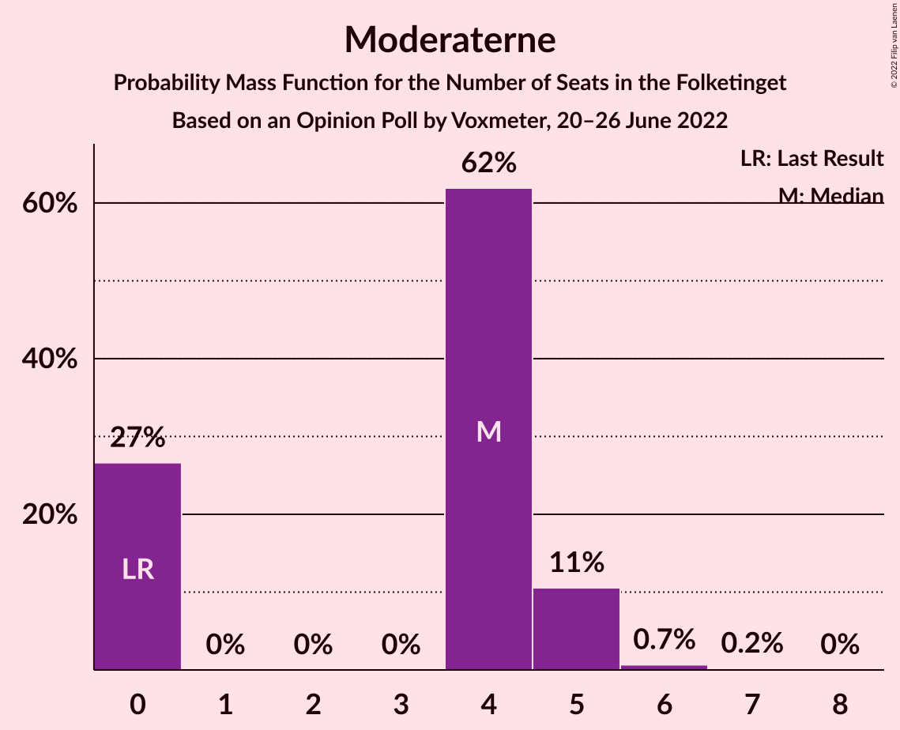

| Number of Seats | Probability | Accumulated | Special Marks |
|:---------------:|:-----------:|:-----------:|:-------------:|
| 0 | 27% | 100% | Last Result |
| 1 | 0% | 73% |  |
| 2 | 0% | 73% |  |
| 3 | 0% | 73% |  |
| 4 | 62% | 73% | Median |
| 5 | 11% | 11% |  |
| 6 | 0.7% | 0.9% |  |
| 7 | 0.2% | 0.2% |  |
| 8 | 0% | 0% |  |

### Alternativet

*For a full overview of the results for this party, see the [Alternativet](party-alternativet.html) page.*

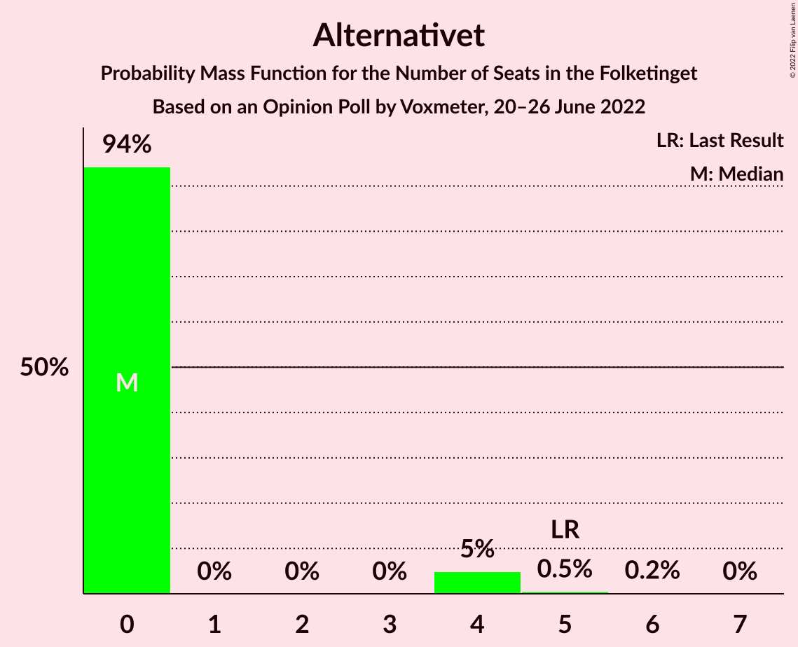

| Number of Seats | Probability | Accumulated | Special Marks |
|:---------------:|:-----------:|:-----------:|:-------------:|
| 0 | 94% | 100% | Median |
| 1 | 0% | 6% |  |
| 2 | 0% | 6% |  |
| 3 | 0% | 6% |  |
| 4 | 5% | 6% |  |
| 5 | 0.5% | 0.8% | Last Result |
| 6 | 0.2% | 0.2% |  |
| 7 | 0% | 0% |  |

### Frie Grønne

*For a full overview of the results for this party, see the [Frie Grønne](party-friegrønne.html) page.*

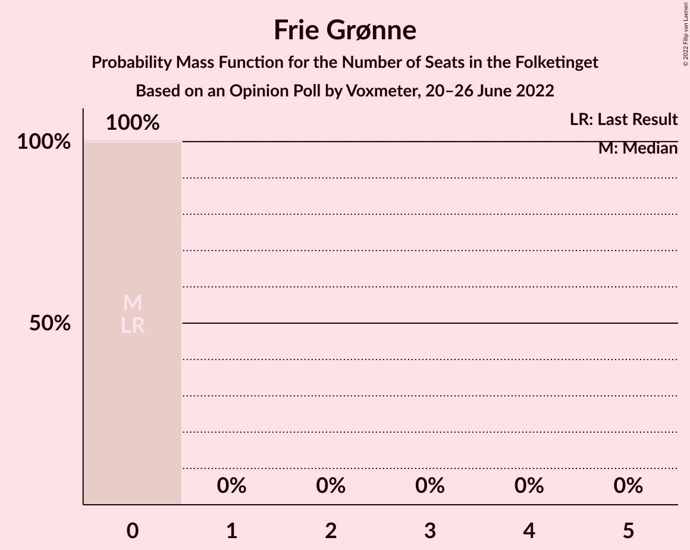

| Number of Seats | Probability | Accumulated | Special Marks |
|:---------------:|:-----------:|:-----------:|:-------------:|
| 0 | 100% | 100% | Last Result, Median |

### Veganerpartiet

*For a full overview of the results for this party, see the [Veganerpartiet](party-veganerpartiet.html) page.*

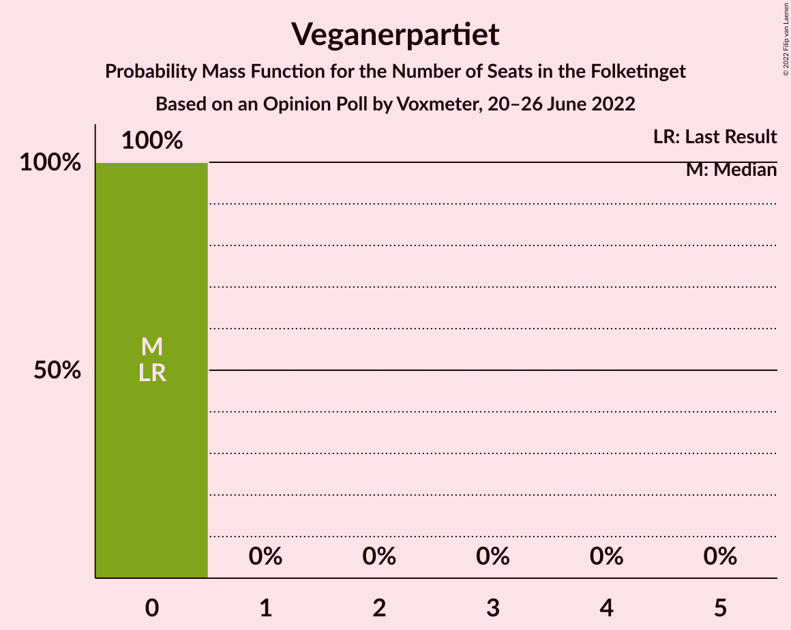

| Number of Seats | Probability | Accumulated | Special Marks |
|:---------------:|:-----------:|:-----------:|:-------------:|
| 0 | 100% | 100% | Last Result, Median |

### Kristendemokraterne

*For a full overview of the results for this party, see the [Kristendemokraterne](party-kristendemokraterne.html) page.*

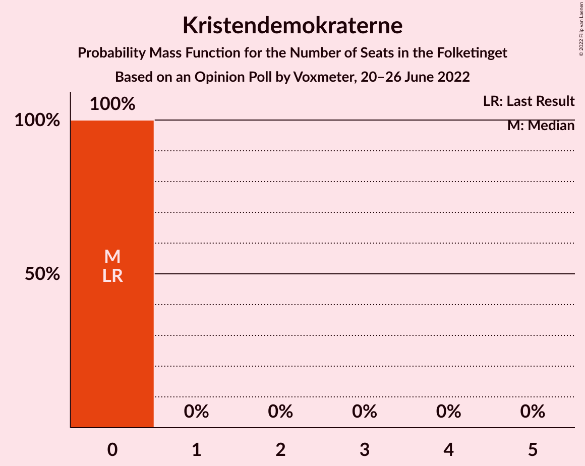

| Number of Seats | Probability | Accumulated | Special Marks |
|:---------------:|:-----------:|:-----------:|:-------------:|
| 0 | 100% | 100% | Last Result, Median |

## Coalitions

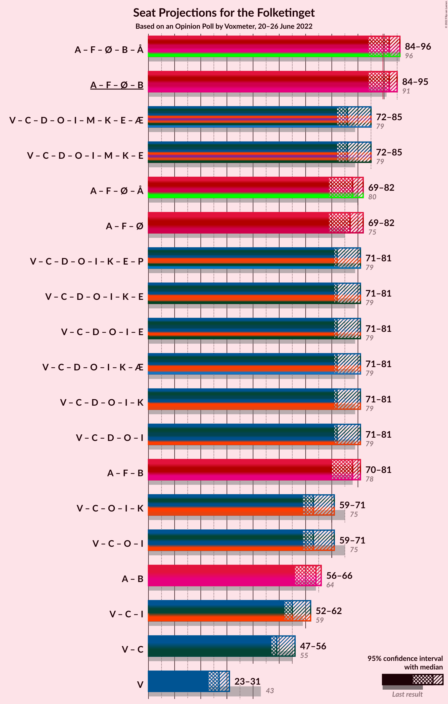

### Confidence Intervals

| Coalition | Last Result | Median | Majority? | 80% Confidence Interval | 90% Confidence Interval | 95% Confidence Interval | 99% Confidence Interval |
|:---------:|:-----------:|:------:|:---------:|:-----------------------:|:-----------------------:|:-----------------------:|:-----------------------:|
| Socialdemokraterne – Socialistisk Folkeparti – Enhedslisten–De Rød-Grønne – Radikale Venstre – Alternativet | 96 | 92 | 74% | 87–93 | 84–95 | 84–96 | 82–100 |
| Socialdemokraterne – Socialistisk Folkeparti – Enhedslisten–De Rød-Grønne – Radikale Venstre | 91 | 92 | 71% | 86–93 | 84–93 | 84–95 | 82–100 |
| Socialdemokraterne – Socialistisk Folkeparti – Enhedslisten–De Rød-Grønne – Alternativet | 80 | 78 | 0% | 73–80 | 71–80 | 69–82 | 69–85 |
| Socialdemokraterne – Socialistisk Folkeparti – Enhedslisten–De Rød-Grønne | 75 | 77 | 0% | 73–79 | 70–80 | 69–82 | 68–85 |
| Venstre – Det Konservative Folkeparti – Nye Borgerlige – Dansk Folkeparti – Liberal Alliance – Kristendemokraterne | 79 | 72 | 0% | 71–79 | 71–81 | 71–81 | 69–85 |
| Venstre – Det Konservative Folkeparti – Nye Borgerlige – Dansk Folkeparti – Liberal Alliance | 79 | 72 | 0% | 71–79 | 71–81 | 71–81 | 69–85 |
| Socialdemokraterne – Socialistisk Folkeparti – Radikale Venstre | 78 | 78 | 0% | 73–80 | 71–80 | 70–81 | 69–83 |
| Venstre – Det Konservative Folkeparti – Dansk Folkeparti – Liberal Alliance – Kristendemokraterne | 75 | 63 | 0% | 61–69 | 61–69 | 59–71 | 57–73 |
| Venstre – Det Konservative Folkeparti – Dansk Folkeparti – Liberal Alliance | 75 | 63 | 0% | 61–69 | 61–69 | 59–71 | 57–73 |
| Socialdemokraterne – Radikale Venstre | 64 | 64 | 0% | 57–66 | 57–66 | 56–66 | 54–68 |
| Venstre – Det Konservative Folkeparti – Liberal Alliance | 59 | 55 | 0% | 54–60 | 53–61 | 52–62 | 50–64 |
| Venstre – Det Konservative Folkeparti | 55 | 49 | 0% | 48–54 | 47–55 | 47–56 | 44–57 |
| Venstre | 43 | 27 | 0% | 24–29 | 24–31 | 23–31 | 23–34 |

### Socialdemokraterne – Socialistisk Folkeparti – Enhedslisten–De Rød-Grønne – Radikale Venstre – Alternativet

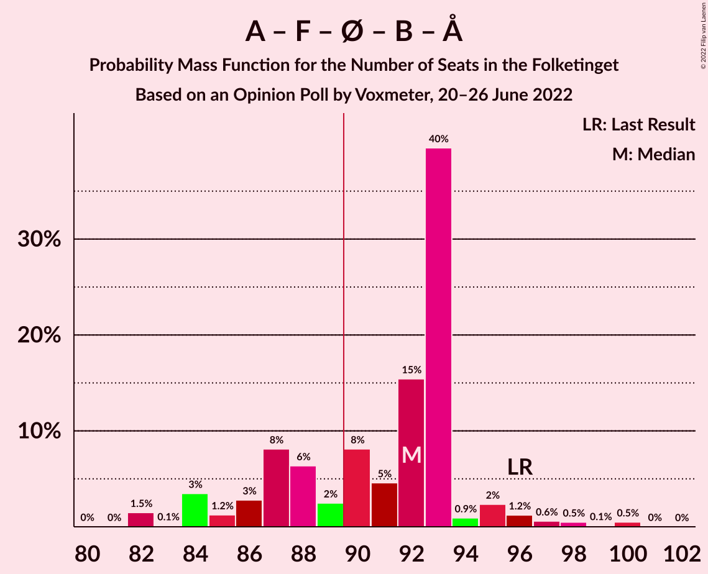

| Number of Seats | Probability | Accumulated | Special Marks |
|:---------------:|:-----------:|:-----------:|:-------------:|
| 81 | 0% | 100% |  |
| 82 | 1.5% | 99.9% |  |
| 83 | 0.1% | 98% |  |
| 84 | 3% | 98% |  |
| 85 | 1.2% | 95% |  |
| 86 | 3% | 94% |  |
| 87 | 8% | 91% |  |
| 88 | 6% | 83% |  |
| 89 | 2% | 76% |  |
| 90 | 8% | 74% | Majority |
| 91 | 5% | 66% |  |
| 92 | 15% | 61% | Median |
| 93 | 40% | 46% |  |
| 94 | 0.9% | 6% |  |
| 95 | 2% | 5% |  |
| 96 | 1.2% | 3% | Last Result |
| 97 | 0.6% | 2% |  |
| 98 | 0.5% | 1.1% |  |
| 99 | 0.1% | 0.6% |  |
| 100 | 0.5% | 0.5% |  |
| 101 | 0% | 0% |  |

### Socialdemokraterne – Socialistisk Folkeparti – Enhedslisten–De Rød-Grønne – Radikale Venstre

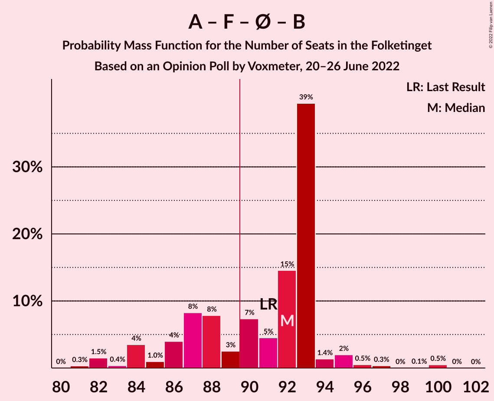

| Number of Seats | Probability | Accumulated | Special Marks |
|:---------------:|:-----------:|:-----------:|:-------------:|
| 80 | 0% | 100% |  |
| 81 | 0.3% | 99.9% |  |
| 82 | 1.5% | 99.6% |  |
| 83 | 0.4% | 98% |  |
| 84 | 4% | 98% |  |
| 85 | 1.0% | 94% |  |
| 86 | 4% | 93% |  |
| 87 | 8% | 89% |  |
| 88 | 8% | 81% |  |
| 89 | 3% | 73% |  |
| 90 | 7% | 71% | Majority |
| 91 | 5% | 63% | Last Result |
| 92 | 15% | 59% | Median |
| 93 | 39% | 44% |  |
| 94 | 1.4% | 5% |  |
| 95 | 2% | 3% |  |
| 96 | 0.5% | 1.5% |  |
| 97 | 0.3% | 1.0% |  |
| 98 | 0% | 0.6% |  |
| 99 | 0.1% | 0.6% |  |
| 100 | 0.5% | 0.5% |  |
| 101 | 0% | 0% |  |

### Socialdemokraterne – Socialistisk Folkeparti – Enhedslisten–De Rød-Grønne – Alternativet

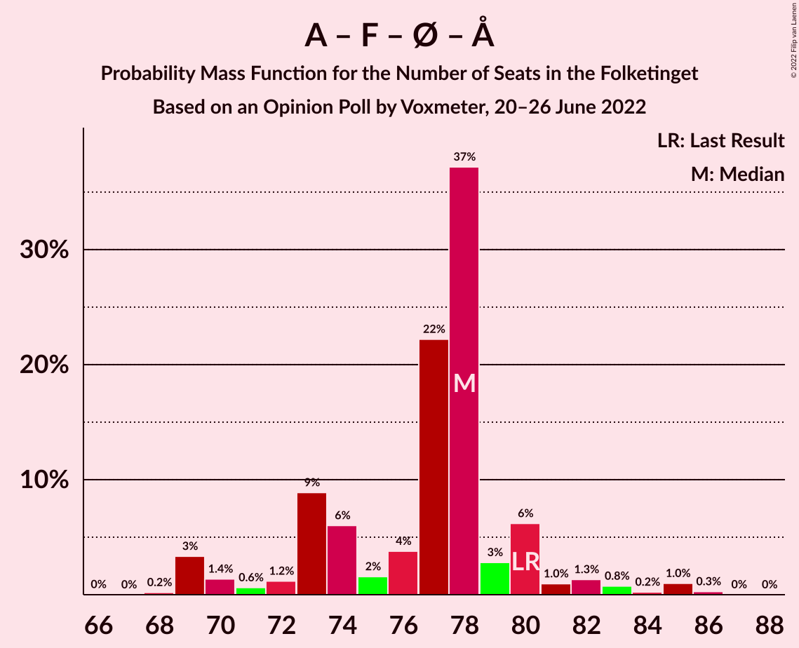

| Number of Seats | Probability | Accumulated | Special Marks |
|:---------------:|:-----------:|:-----------:|:-------------:|
| 68 | 0.2% | 100% |  |
| 69 | 3% | 99.8% |  |
| 70 | 1.4% | 96% |  |
| 71 | 0.6% | 95% |  |
| 72 | 1.2% | 94% |  |
| 73 | 9% | 93% |  |
| 74 | 6% | 84% |  |
| 75 | 2% | 78% |  |
| 76 | 4% | 77% |  |
| 77 | 22% | 73% | Median |
| 78 | 37% | 51% |  |
| 79 | 3% | 14% |  |
| 80 | 6% | 11% | Last Result |
| 81 | 1.0% | 5% |  |
| 82 | 1.3% | 4% |  |
| 83 | 0.8% | 2% |  |
| 84 | 0.2% | 2% |  |
| 85 | 1.0% | 1.3% |  |
| 86 | 0.3% | 0.3% |  |
| 87 | 0% | 0% |  |

### Socialdemokraterne – Socialistisk Folkeparti – Enhedslisten–De Rød-Grønne

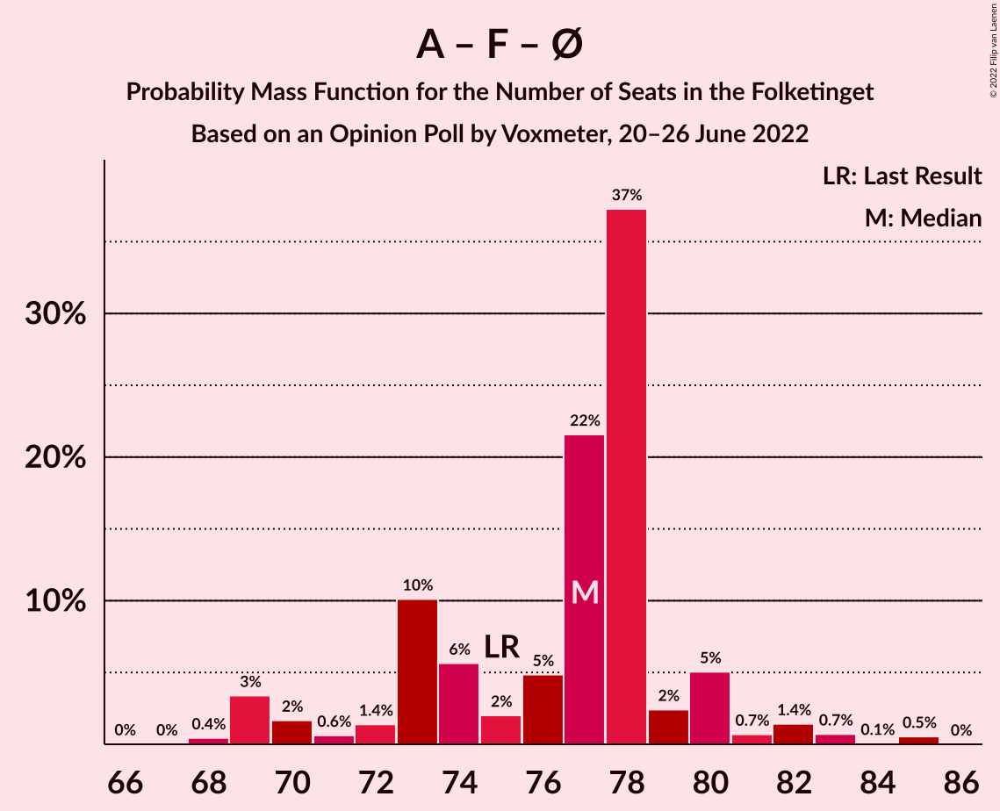

| Number of Seats | Probability | Accumulated | Special Marks |
|:---------------:|:-----------:|:-----------:|:-------------:|
| 67 | 0% | 100% |  |
| 68 | 0.4% | 99.9% |  |
| 69 | 3% | 99.5% |  |
| 70 | 2% | 96% |  |
| 71 | 0.6% | 94% |  |
| 72 | 1.4% | 94% |  |
| 73 | 10% | 92% |  |
| 74 | 6% | 82% |  |
| 75 | 2% | 77% | Last Result |
| 76 | 5% | 75% |  |
| 77 | 22% | 70% | Median |
| 78 | 37% | 48% |  |
| 79 | 2% | 11% |  |
| 80 | 5% | 9% |  |
| 81 | 0.7% | 3% |  |
| 82 | 1.4% | 3% |  |
| 83 | 0.7% | 1.3% |  |
| 84 | 0.1% | 0.6% |  |
| 85 | 0.5% | 0.6% |  |
| 86 | 0% | 0% |  |

### Venstre – Det Konservative Folkeparti – Nye Borgerlige – Dansk Folkeparti – Liberal Alliance – Kristendemokraterne

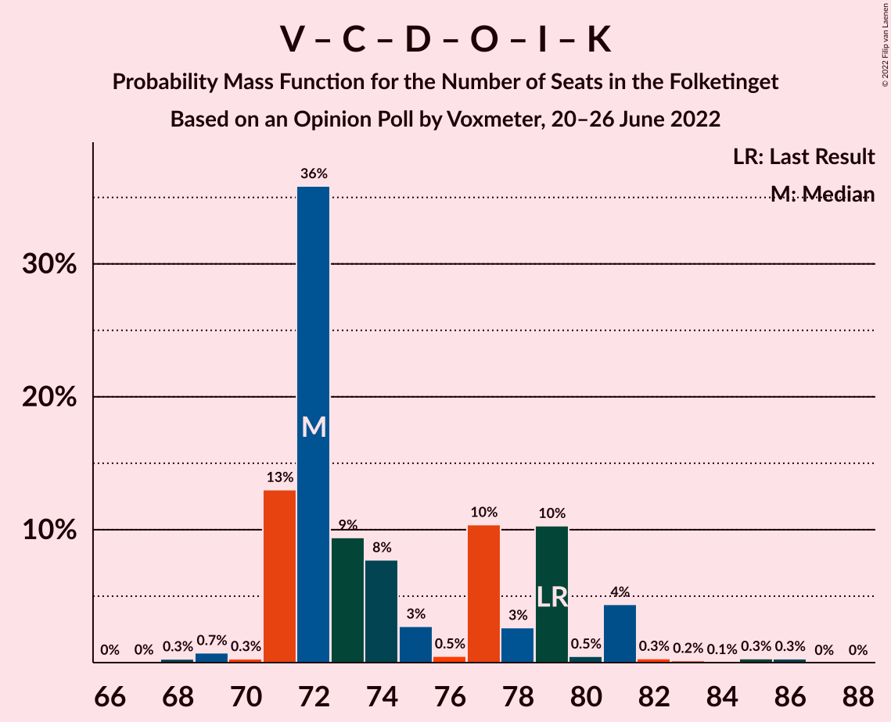

| Number of Seats | Probability | Accumulated | Special Marks |
|:---------------:|:-----------:|:-----------:|:-------------:|
| 67 | 0% | 100% |  |
| 68 | 0.3% | 99.9% |  |
| 69 | 0.7% | 99.6% |  |
| 70 | 0.3% | 98.9% |  |
| 71 | 13% | 98.6% |  |
| 72 | 36% | 86% | Median |
| 73 | 9% | 50% |  |
| 74 | 8% | 40% |  |
| 75 | 3% | 33% |  |
| 76 | 0.5% | 30% |  |
| 77 | 10% | 29% |  |
| 78 | 3% | 19% |  |
| 79 | 10% | 16% | Last Result |
| 80 | 0.5% | 6% |  |
| 81 | 4% | 6% |  |
| 82 | 0.3% | 1.1% |  |
| 83 | 0.2% | 0.8% |  |
| 84 | 0.1% | 0.7% |  |
| 85 | 0.3% | 0.6% |  |
| 86 | 0.3% | 0.3% |  |
| 87 | 0% | 0% |  |

### Venstre – Det Konservative Folkeparti – Nye Borgerlige – Dansk Folkeparti – Liberal Alliance

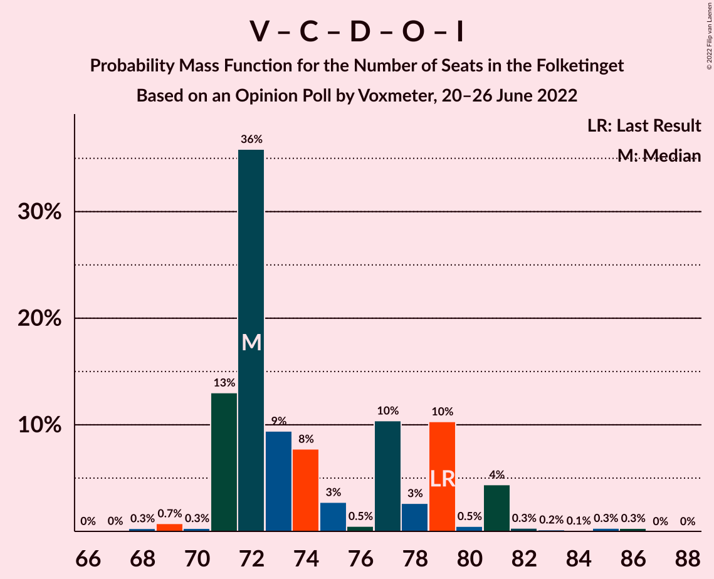

| Number of Seats | Probability | Accumulated | Special Marks |
|:---------------:|:-----------:|:-----------:|:-------------:|
| 67 | 0% | 100% |  |
| 68 | 0.3% | 99.9% |  |
| 69 | 0.7% | 99.6% |  |
| 70 | 0.3% | 98.9% |  |
| 71 | 13% | 98.6% |  |
| 72 | 36% | 86% | Median |
| 73 | 9% | 50% |  |
| 74 | 8% | 40% |  |
| 75 | 3% | 33% |  |
| 76 | 0.5% | 30% |  |
| 77 | 10% | 29% |  |
| 78 | 3% | 19% |  |
| 79 | 10% | 16% | Last Result |
| 80 | 0.5% | 6% |  |
| 81 | 4% | 6% |  |
| 82 | 0.3% | 1.1% |  |
| 83 | 0.2% | 0.8% |  |
| 84 | 0.1% | 0.7% |  |
| 85 | 0.3% | 0.6% |  |
| 86 | 0.3% | 0.3% |  |
| 87 | 0% | 0% |  |

### Socialdemokraterne – Socialistisk Folkeparti – Radikale Venstre

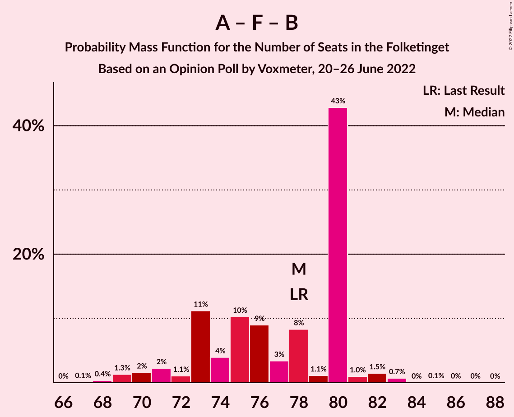

| Number of Seats | Probability | Accumulated | Special Marks |
|:---------------:|:-----------:|:-----------:|:-------------:|
| 67 | 0.1% | 100% |  |
| 68 | 0.4% | 99.9% |  |
| 69 | 1.3% | 99.5% |  |
| 70 | 2% | 98% |  |
| 71 | 2% | 97% |  |
| 72 | 1.1% | 94% |  |
| 73 | 11% | 93% |  |
| 74 | 4% | 82% |  |
| 75 | 10% | 78% |  |
| 76 | 9% | 68% |  |
| 77 | 3% | 59% |  |
| 78 | 8% | 56% | Last Result |
| 79 | 1.1% | 47% | Median |
| 80 | 43% | 46% |  |
| 81 | 1.0% | 3% |  |
| 82 | 1.5% | 2% |  |
| 83 | 0.7% | 0.8% |  |
| 84 | 0% | 0.1% |  |
| 85 | 0.1% | 0.1% |  |
| 86 | 0% | 0.1% |  |
| 87 | 0% | 0% |  |

### Venstre – Det Konservative Folkeparti – Dansk Folkeparti – Liberal Alliance – Kristendemokraterne

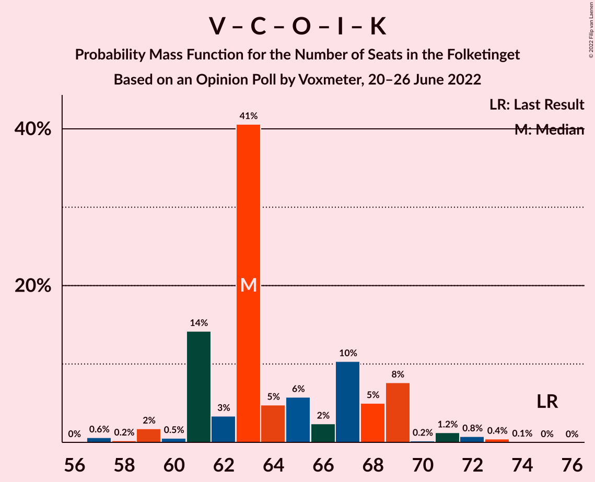

| Number of Seats | Probability | Accumulated | Special Marks |
|:---------------:|:-----------:|:-----------:|:-------------:|
| 57 | 0.6% | 100% |  |
| 58 | 0.2% | 99.3% |  |
| 59 | 2% | 99.1% |  |
| 60 | 0.5% | 97% |  |
| 61 | 14% | 97% |  |
| 62 | 3% | 83% |  |
| 63 | 41% | 79% | Median |
| 64 | 5% | 39% |  |
| 65 | 6% | 34% |  |
| 66 | 2% | 28% |  |
| 67 | 10% | 26% |  |
| 68 | 5% | 15% |  |
| 69 | 8% | 10% |  |
| 70 | 0.2% | 3% |  |
| 71 | 1.2% | 3% |  |
| 72 | 0.8% | 1.3% |  |
| 73 | 0.4% | 0.6% |  |
| 74 | 0.1% | 0.1% |  |
| 75 | 0% | 0% | Last Result |

### Venstre – Det Konservative Folkeparti – Dansk Folkeparti – Liberal Alliance

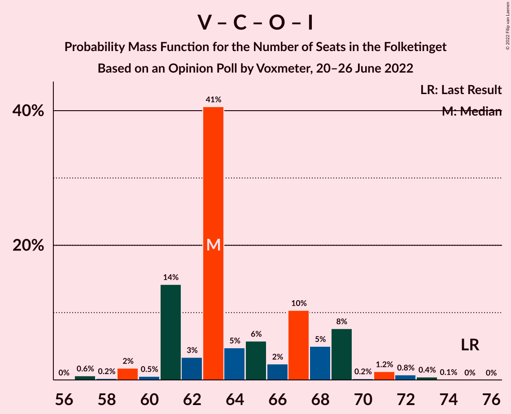

| Number of Seats | Probability | Accumulated | Special Marks |
|:---------------:|:-----------:|:-----------:|:-------------:|
| 57 | 0.6% | 100% |  |
| 58 | 0.2% | 99.3% |  |
| 59 | 2% | 99.1% |  |
| 60 | 0.5% | 97% |  |
| 61 | 14% | 97% |  |
| 62 | 3% | 83% |  |
| 63 | 41% | 79% | Median |
| 64 | 5% | 39% |  |
| 65 | 6% | 34% |  |
| 66 | 2% | 28% |  |
| 67 | 10% | 26% |  |
| 68 | 5% | 15% |  |
| 69 | 8% | 10% |  |
| 70 | 0.2% | 3% |  |
| 71 | 1.2% | 3% |  |
| 72 | 0.8% | 1.3% |  |
| 73 | 0.4% | 0.6% |  |
| 74 | 0.1% | 0.1% |  |
| 75 | 0% | 0% | Last Result |

### Socialdemokraterne – Radikale Venstre

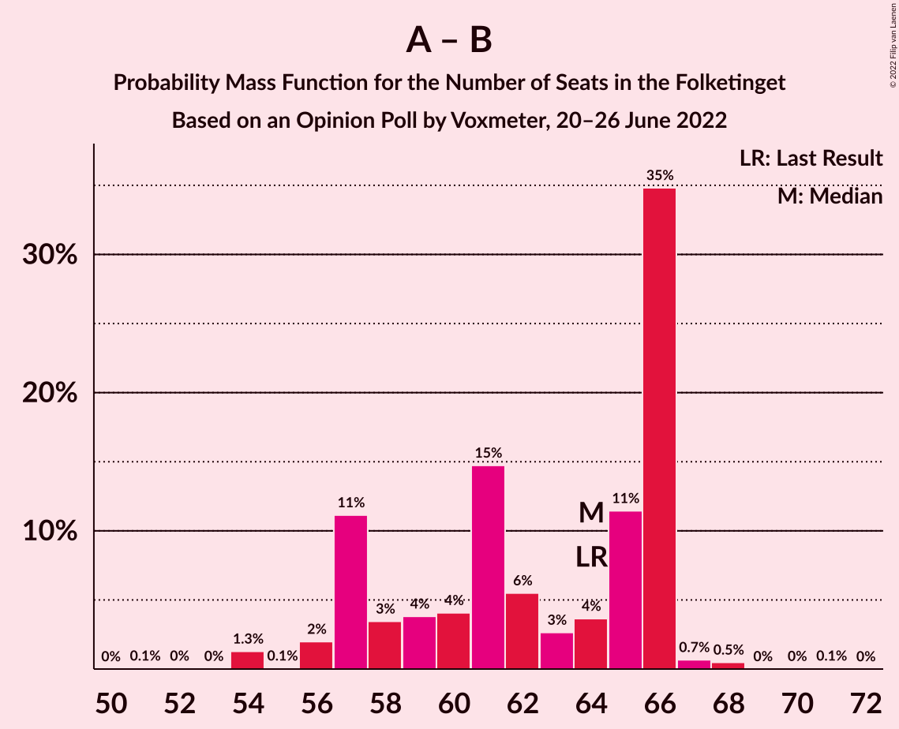

| Number of Seats | Probability | Accumulated | Special Marks |
|:---------------:|:-----------:|:-----------:|:-------------:|
| 51 | 0.1% | 100% |  |
| 52 | 0% | 99.9% |  |
| 53 | 0% | 99.9% |  |
| 54 | 1.3% | 99.9% |  |
| 55 | 0.1% | 98.6% |  |
| 56 | 2% | 98.5% |  |
| 57 | 11% | 97% |  |
| 58 | 3% | 85% |  |
| 59 | 4% | 82% |  |
| 60 | 4% | 78% |  |
| 61 | 15% | 74% |  |
| 62 | 6% | 59% |  |
| 63 | 3% | 54% |  |
| 64 | 4% | 51% | Last Result |
| 65 | 11% | 48% | Median |
| 66 | 35% | 36% |  |
| 67 | 0.7% | 1.2% |  |
| 68 | 0.5% | 0.6% |  |
| 69 | 0% | 0.1% |  |
| 70 | 0% | 0.1% |  |
| 71 | 0.1% | 0.1% |  |
| 72 | 0% | 0% |  |

### Venstre – Det Konservative Folkeparti – Liberal Alliance

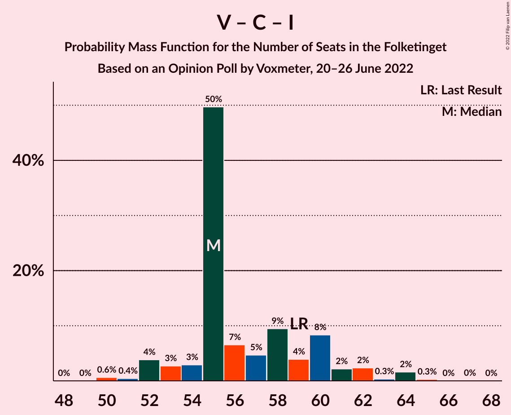

| Number of Seats | Probability | Accumulated | Special Marks |
|:---------------:|:-----------:|:-----------:|:-------------:|
| 49 | 0% | 100% |  |
| 50 | 0.6% | 99.9% |  |
| 51 | 0.4% | 99.3% |  |
| 52 | 4% | 98.9% |  |
| 53 | 3% | 95% |  |
| 54 | 3% | 92% |  |
| 55 | 50% | 89% | Median |
| 56 | 7% | 40% |  |
| 57 | 5% | 33% |  |
| 58 | 9% | 29% |  |
| 59 | 4% | 19% | Last Result |
| 60 | 8% | 15% |  |
| 61 | 2% | 7% |  |
| 62 | 2% | 5% |  |
| 63 | 0.3% | 2% |  |
| 64 | 2% | 2% |  |
| 65 | 0.3% | 0.3% |  |
| 66 | 0% | 0.1% |  |
| 67 | 0% | 0.1% |  |
| 68 | 0% | 0% |  |

### Venstre – Det Konservative Folkeparti

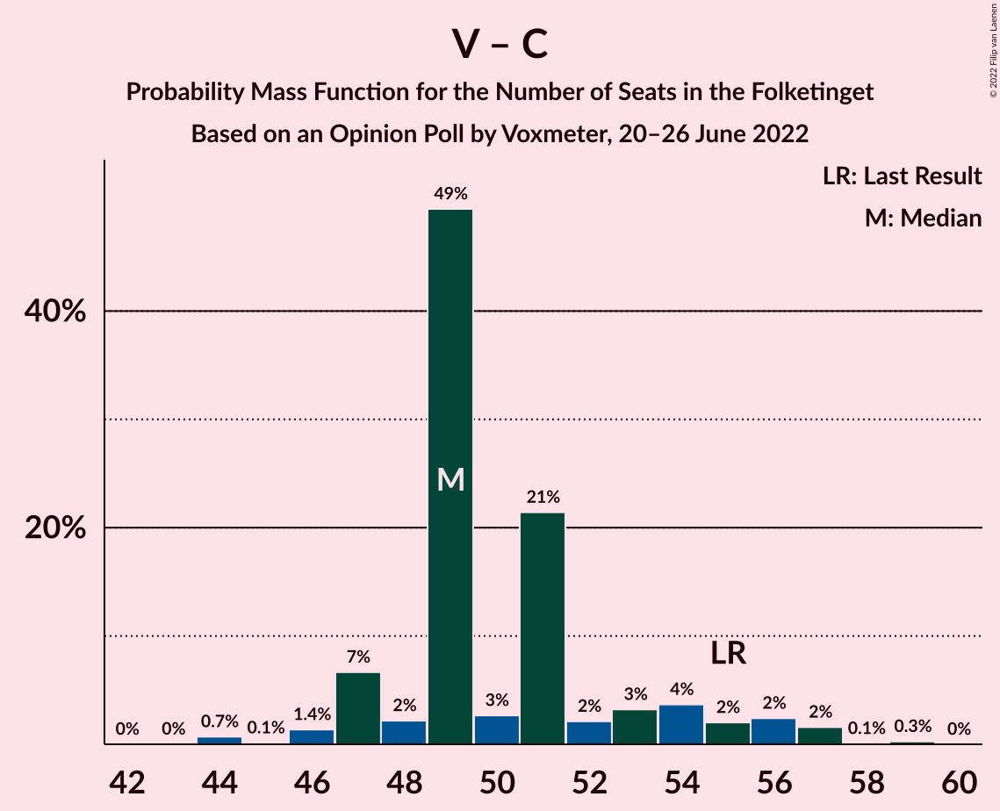

| Number of Seats | Probability | Accumulated | Special Marks |
|:---------------:|:-----------:|:-----------:|:-------------:|
| 44 | 0.7% | 100% |  |
| 45 | 0.1% | 99.2% |  |
| 46 | 1.4% | 99.1% |  |
| 47 | 7% | 98% |  |
| 48 | 2% | 91% |  |
| 49 | 49% | 89% | Median |
| 50 | 3% | 39% |  |
| 51 | 21% | 37% |  |
| 52 | 2% | 15% |  |
| 53 | 3% | 13% |  |
| 54 | 4% | 10% |  |
| 55 | 2% | 6% | Last Result |
| 56 | 2% | 4% |  |
| 57 | 2% | 2% |  |
| 58 | 0.1% | 0.4% |  |
| 59 | 0.3% | 0.3% |  |
| 60 | 0% | 0% |  |

### Venstre

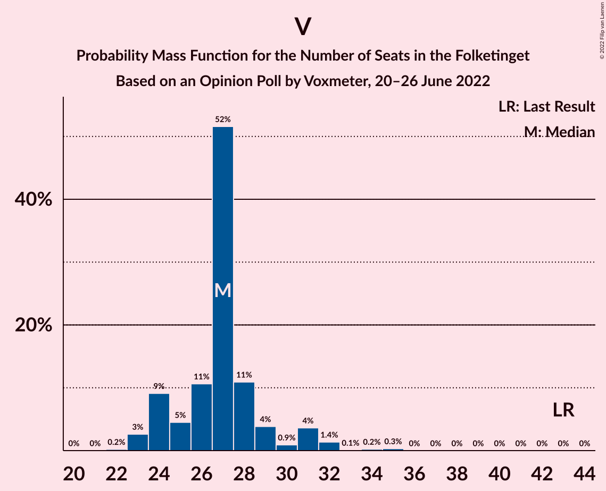

| Number of Seats | Probability | Accumulated | Special Marks |
|:---------------:|:-----------:|:-----------:|:-------------:|
| 22 | 0.2% | 100% |  |
| 23 | 3% | 99.8% |  |
| 24 | 9% | 97% |  |
| 25 | 5% | 88% |  |
| 26 | 11% | 84% |  |
| 27 | 52% | 73% | Median |
| 28 | 11% | 21% |  |
| 29 | 4% | 10% |  |
| 30 | 0.9% | 7% |  |
| 31 | 4% | 6% |  |
| 32 | 1.4% | 2% |  |
| 33 | 0.1% | 0.6% |  |
| 34 | 0.2% | 0.6% |  |
| 35 | 0.3% | 0.3% |  |
| 36 | 0% | 0% |  |
| 37 | 0% | 0% |  |
| 38 | 0% | 0% |  |
| 39 | 0% | 0% |  |
| 40 | 0% | 0% |  |
| 41 | 0% | 0% |  |
| 42 | 0% | 0% |  |
| 43 | 0% | 0% | Last Result |

## Technical Information

### Opinion Poll

+ **Polling firm:** Voxmeter
+ **Commissioner(s):** —
+ **Fieldwork period:** 20–26 June 2022

### Calculations

+ **Sample size:** 1002
+ **Simulations done:** 1,048,576
+ **Error estimate:** 1.59%

