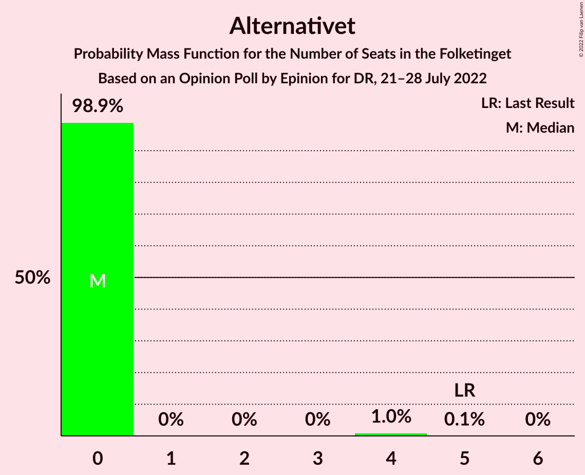
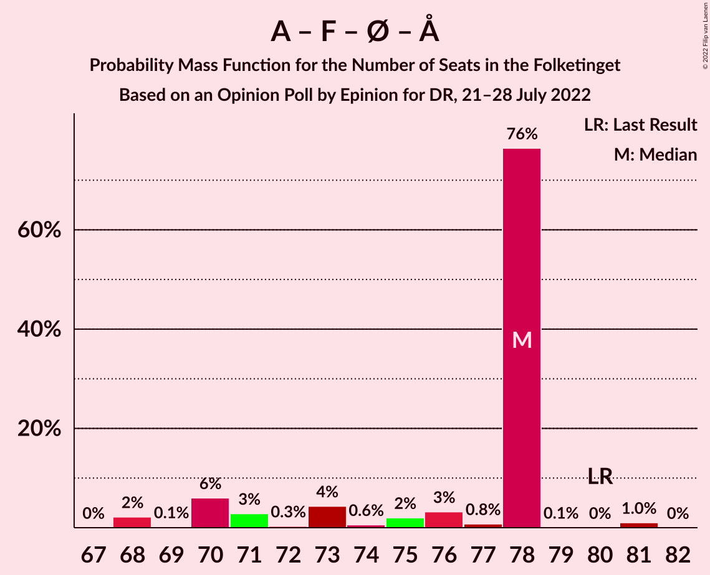
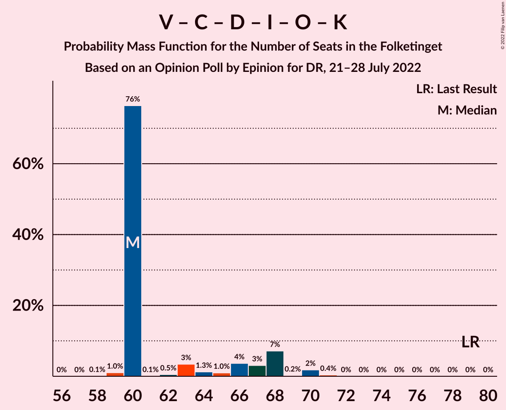
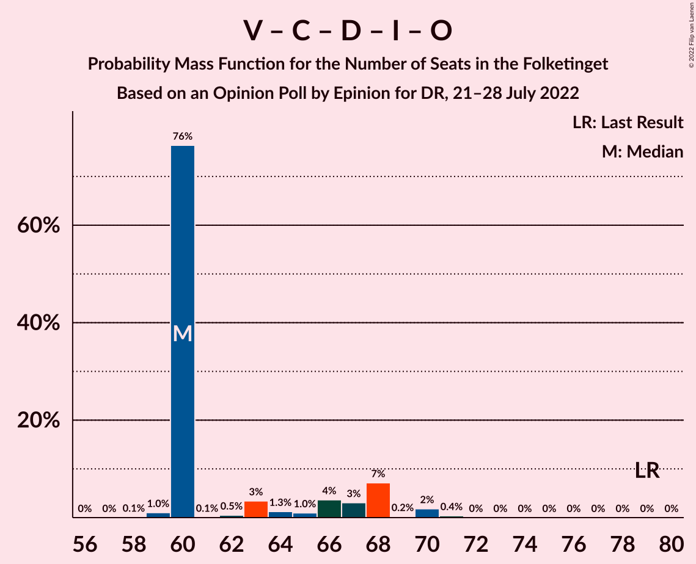

# Opinion Poll by Epinion for DR, 21–28 July 2022

<a href="#voting-intentions">Voting Intentions</a> | <a href="#seats">Seats</a> | <a href="#coalitions">Coalitions</a> | <a href="#technical-information">Technical Information</a>

## Voting Intentions

### Confidence Intervals

| Party | Last Result | Poll Result | 80% Confidence Interval | 90% Confidence Interval | 95% Confidence Interval | 99% Confidence Interval |
|:-----:|:-----------:|:-----------:|:-----------------------:|:-----------------------:|:-----------------------:|:-----------------------:|
| Socialdemokraterne | 25.9% | 24.3% | 23.1–25.7% |22.7–26.0% |22.4–26.4% |21.8–27.0% |
| Venstre | 23.4% | 14.3% | 13.3–15.4% |13.0–15.7% |12.8–16.0% |12.3–16.5% |
| Det Konservative Folkeparti | 6.6% | 11.6% | 10.7–12.6% |10.4–12.9% |10.2–13.1% |9.8–13.6% |
| Danmarksdemokraterne | 0.0% | 10.9% | 10.0–11.8% |9.7–12.1% |9.5–12.4% |9.1–12.9% |
| Socialistisk Folkeparti | 7.7% | 8.1% | 7.4–9.0% |7.1–9.3% |7.0–9.5% |6.6–9.9% |
| Enhedslisten–De Rød-Grønne | 6.9% | 7.3% | 6.6–8.2% |6.4–8.4% |6.2–8.6% |5.9–9.0% |
| Radikale Venstre | 8.6% | 5.8% | 5.2–6.6% |5.0–6.8% |4.8–7.0% |4.6–7.4% |
| Nye Borgerlige | 2.4% | 4.4% | 3.9–5.1% |3.7–5.3% |3.6–5.5% |3.3–5.8% |
| Liberal Alliance | 2.3% | 3.8% | 3.3–4.5% |3.2–4.6% |3.0–4.8% |2.8–5.1% |
| Moderaterne | 0.0% | 3.1% | 2.6–3.7% |2.5–3.9% |2.4–4.0% |2.2–4.3% |
| Dansk Folkeparti | 8.7% | 2.1% | 1.8–2.6% |1.6–2.8% |1.6–2.9% |1.4–3.2% |
| Alternativet | 3.0% | 1.3% | 1.0–1.7% |0.9–1.8% |0.9–2.0% |0.8–2.2% |
| Kristendemokraterne | 1.7% | 1.0% | 0.7–1.4% |0.7–1.5% |0.6–1.6% |0.5–1.8% |
| Frie Grønne | 0.0% | 0.8% | 0.6–1.2% |0.5–1.3% |0.5–1.4% |0.4–1.5% |
| Veganerpartiet | 0.0% | 0.4% | 0.2–0.7% |0.2–0.7% |0.2–0.8% |0.1–0.9% |

*Note:* The poll result column reflects the actual value used in the calculations. Published results may vary slightly, and in addition be rounded to fewer digits.

## Seats

### Confidence Intervals

| Party | Last Result | Median | 80% Confidence Interval | 90% Confidence Interval | 95% Confidence Interval | 99% Confidence Interval |
|:-----:|:-----------:|:------:|:-----------------------:|:-----------------------:|:-----------------------:|:-----------------------:|
| <a href="#socialdemokraterne">Socialdemokraterne</a> | 48 | 47 | 44–47 |43–47 |42–47 |41–48 |
| <a href="#venstre">Venstre</a> | 43 | 25 | 25–27 |25–27 |25–27 |23–29 |
| <a href="#det-konservative-folkeparti">Det Konservative Folkeparti</a> | 12 | 21 | 20–21 |20–22 |20–23 |19–24 |
| <a href="#danmarksdemokraterne">Danmarksdemokraterne</a> | 0 | 20 | 19–20 |19–20 |18–22 |18–23 |
| <a href="#socialistisk-folkeparti">Socialistisk Folkeparti</a> | 14 | 17 | 15–17 |12–17 |12–18 |12–18 |
| <a href="#enhedslisten–de-rød-grønne">Enhedslisten–De Rød-Grønne</a> | 13 | 14 | 12–14 |12–14 |11–15 |10–17 |
| <a href="#radikale-venstre">Radikale Venstre</a> | 16 | 11 | 10–11 |9–12 |9–12 |8–12 |
| <a href="#nye-borgerlige">Nye Borgerlige</a> | 4 | 8 | 8–9 |7–9 |7–10 |7–10 |
| <a href="#liberal-alliance">Liberal Alliance</a> | 4 | 6 | 6–8 |6–8 |6–8 |6–9 |
| <a href="#moderaterne">Moderaterne</a> | 0 | 6 | 6 |5–7 |4–7 |4–8 |
| <a href="#dansk-folkeparti">Dansk Folkeparti</a> | 16 | 0 | 0–4 |0–4 |0–4 |0–5 |
| <a href="#alternativet">Alternativet</a> | 5 | 0 | 0 |0 |0 |0–4 |
| <a href="#kristendemokraterne">Kristendemokraterne</a> | 0 | 0 | 0 |0 |0 |0 |
| <a href="#frie-grønne">Frie Grønne</a> | 0 | 0 | 0 |0 |0 |0 |
| <a href="#veganerpartiet">Veganerpartiet</a> | 0 | 0 | 0 |0 |0 |0 |

### Socialdemokraterne

*For a full overview of the results for this party, see the [Socialdemokraterne](party-socialdemokraterne.html) page.*

| Number of Seats | Probability | Accumulated | Special Marks |
|:---------------:|:-----------:|:-----------:|:-------------:|
| 40 | 0.1% | 100% |  |
| 41 | 0.6% | 99.9% |  |
| 42 | 3% | 99.2% |  |
| 43 | 3% | 96% |  |
| 44 | 4% | 93% |  |
| 45 | 2% | 89% |  |
| 46 | 9% | 87% |  |
| 47 | 77% | 78% | Median |
| 48 | 1.1% | 2% | Last Result |
| 49 | 0.4% | 0.4% |  |
| 50 | 0% | 0.1% |  |
| 51 | 0% | 0% |  |

### Venstre

*For a full overview of the results for this party, see the [Venstre](party-venstre.html) page.*

| Number of Seats | Probability | Accumulated | Special Marks |
|:---------------:|:-----------:|:-----------:|:-------------:|
| 22 | 0.4% | 100% |  |
| 23 | 1.1% | 99.6% |  |
| 24 | 0.4% | 98% |  |
| 25 | 80% | 98% | Median |
| 26 | 7% | 18% |  |
| 27 | 9% | 11% |  |
| 28 | 0.3% | 2% |  |
| 29 | 2% | 2% |  |
| 30 | 0.2% | 0.2% |  |
| 31 | 0% | 0% |  |
| 32 | 0% | 0% |  |
| 33 | 0% | 0% |  |
| 34 | 0% | 0% |  |
| 35 | 0% | 0% |  |
| 36 | 0% | 0% |  |
| 37 | 0% | 0% |  |
| 38 | 0% | 0% |  |
| 39 | 0% | 0% |  |
| 40 | 0% | 0% |  |
| 41 | 0% | 0% |  |
| 42 | 0% | 0% |  |
| 43 | 0% | 0% | Last Result |

### Det Konservative Folkeparti

*For a full overview of the results for this party, see the [Det Konservative Folkeparti](party-detkonservativefolkeparti.html) page.*

| Number of Seats | Probability | Accumulated | Special Marks |
|:---------------:|:-----------:|:-----------:|:-------------:|
| 12 | 0% | 100% | Last Result |
| 13 | 0% | 100% |  |
| 14 | 0% | 100% |  |
| 15 | 0% | 100% |  |
| 16 | 0% | 100% |  |
| 17 | 0% | 100% |  |
| 18 | 0.1% | 100% |  |
| 19 | 1.4% | 99.9% |  |
| 20 | 9% | 98% |  |
| 21 | 81% | 89% | Median |
| 22 | 3% | 8% |  |
| 23 | 3% | 5% |  |
| 24 | 1.4% | 1.4% |  |
| 25 | 0% | 0.1% |  |
| 26 | 0% | 0% |  |

### Danmarksdemokraterne

*For a full overview of the results for this party, see the [Danmarksdemokraterne](party-danmarksdemokraterne.html) page.*

| Number of Seats | Probability | Accumulated | Special Marks |
|:---------------:|:-----------:|:-----------:|:-------------:|
| 0 | 0% | 100% | Last Result |
| 1 | 0% | 100% |  |
| 2 | 0% | 100% |  |
| 3 | 0% | 100% |  |
| 4 | 0% | 100% |  |
| 5 | 0% | 100% |  |
| 6 | 0% | 100% |  |
| 7 | 0% | 100% |  |
| 8 | 0% | 100% |  |
| 9 | 0% | 100% |  |
| 10 | 0% | 100% |  |
| 11 | 0% | 100% |  |
| 12 | 0% | 100% |  |
| 13 | 0% | 100% |  |
| 14 | 0% | 100% |  |
| 15 | 0% | 100% |  |
| 16 | 0% | 100% |  |
| 17 | 0.1% | 100% |  |
| 18 | 3% | 99.8% |  |
| 19 | 10% | 96% |  |
| 20 | 83% | 87% | Median |
| 21 | 0.6% | 4% |  |
| 22 | 1.2% | 3% |  |
| 23 | 2% | 2% |  |
| 24 | 0% | 0% |  |

### Socialistisk Folkeparti

*For a full overview of the results for this party, see the [Socialistisk Folkeparti](party-socialistiskfolkeparti.html) page.*

| Number of Seats | Probability | Accumulated | Special Marks |
|:---------------:|:-----------:|:-----------:|:-------------:|
| 12 | 8% | 100% |  |
| 13 | 0.6% | 92% |  |
| 14 | 0.8% | 91% | Last Result |
| 15 | 3% | 90% |  |
| 16 | 7% | 88% |  |
| 17 | 77% | 81% | Median |
| 18 | 4% | 4% |  |
| 19 | 0% | 0% |  |

### Enhedslisten–De Rød-Grønne

*For a full overview of the results for this party, see the [Enhedslisten–De Rød-Grønne](party-enhedslisten–derød-grønne.html) page.*

| Number of Seats | Probability | Accumulated | Special Marks |
|:---------------:|:-----------:|:-----------:|:-------------:|
| 10 | 1.0% | 100% |  |
| 11 | 2% | 99.0% |  |
| 12 | 8% | 97% |  |
| 13 | 0.9% | 89% | Last Result |
| 14 | 83% | 88% | Median |
| 15 | 3% | 5% |  |
| 16 | 0.1% | 1.2% |  |
| 17 | 1.1% | 1.1% |  |
| 18 | 0% | 0% |  |

### Radikale Venstre

*For a full overview of the results for this party, see the [Radikale Venstre](party-radikalevenstre.html) page.*

| Number of Seats | Probability | Accumulated | Special Marks |
|:---------------:|:-----------:|:-----------:|:-------------:|
| 8 | 2% | 100% |  |
| 9 | 4% | 98% |  |
| 10 | 5% | 94% |  |
| 11 | 80% | 89% | Median |
| 12 | 9% | 9% |  |
| 13 | 0.2% | 0.3% |  |
| 14 | 0.1% | 0.1% |  |
| 15 | 0% | 0% |  |
| 16 | 0% | 0% | Last Result |

### Nye Borgerlige

*For a full overview of the results for this party, see the [Nye Borgerlige](party-nyeborgerlige.html) page.*

| Number of Seats | Probability | Accumulated | Special Marks |
|:---------------:|:-----------:|:-----------:|:-------------:|
| 4 | 0% | 100% | Last Result |
| 5 | 0% | 100% |  |
| 6 | 0.4% | 100% |  |
| 7 | 5% | 99.6% |  |
| 8 | 81% | 95% | Median |
| 9 | 10% | 13% |  |
| 10 | 3% | 3% |  |
| 11 | 0.2% | 0.2% |  |
| 12 | 0% | 0% |  |

### Liberal Alliance

*For a full overview of the results for this party, see the [Liberal Alliance](party-liberalalliance.html) page.*

| Number of Seats | Probability | Accumulated | Special Marks |
|:---------------:|:-----------:|:-----------:|:-------------:|
| 4 | 0% | 100% | Last Result |
| 5 | 0% | 100% |  |
| 6 | 83% | 100% | Median |
| 7 | 5% | 17% |  |
| 8 | 9% | 12% |  |
| 9 | 2% | 2% |  |
| 10 | 0.1% | 0.1% |  |
| 11 | 0% | 0% |  |

### Moderaterne

*For a full overview of the results for this party, see the [Moderaterne](party-moderaterne.html) page.*

| Number of Seats | Probability | Accumulated | Special Marks |
|:---------------:|:-----------:|:-----------:|:-------------:|
| 0 | 0% | 100% | Last Result |
| 1 | 0% | 100% |  |
| 2 | 0% | 100% |  |
| 3 | 0% | 100% |  |
| 4 | 3% | 100% |  |
| 5 | 3% | 97% |  |
| 6 | 87% | 94% | Median |
| 7 | 6% | 7% |  |
| 8 | 1.1% | 1.1% |  |
| 9 | 0% | 0% |  |

### Dansk Folkeparti

*For a full overview of the results for this party, see the [Dansk Folkeparti](party-danskfolkeparti.html) page.*

| Number of Seats | Probability | Accumulated | Special Marks |
|:---------------:|:-----------:|:-----------:|:-------------:|
| 0 | 83% | 100% | Median |
| 1 | 0% | 17% |  |
| 2 | 0% | 17% |  |
| 3 | 0% | 17% |  |
| 4 | 15% | 17% |  |
| 5 | 2% | 2% |  |
| 6 | 0.4% | 0.4% |  |
| 7 | 0% | 0% |  |
| 8 | 0% | 0% |  |
| 9 | 0% | 0% |  |
| 10 | 0% | 0% |  |
| 11 | 0% | 0% |  |
| 12 | 0% | 0% |  |
| 13 | 0% | 0% |  |
| 14 | 0% | 0% |  |
| 15 | 0% | 0% |  |
| 16 | 0% | 0% | Last Result |

### Alternativet

*For a full overview of the results for this party, see the [Alternativet](party-alternativet.html) page.*

| Number of Seats | Probability | Accumulated | Special Marks |
|:---------------:|:-----------:|:-----------:|:-------------:|
| 0 | 98.9% | 100% | Median |
| 1 | 0% | 1.1% |  |
| 2 | 0% | 1.1% |  |
| 3 | 0% | 1.1% |  |
| 4 | 1.0% | 1.0% |  |
| 5 | 0.1% | 0.1% | Last Result |
| 6 | 0% | 0% |  |

### Kristendemokraterne

*For a full overview of the results for this party, see the [Kristendemokraterne](party-kristendemokraterne.html) page.*

| Number of Seats | Probability | Accumulated | Special Marks |
|:---------------:|:-----------:|:-----------:|:-------------:|
| 0 | 100% | 100% | Last Result, Median |

### Frie Grønne

*For a full overview of the results for this party, see the [Frie Grønne](party-friegrønne.html) page.*

| Number of Seats | Probability | Accumulated | Special Marks |
|:---------------:|:-----------:|:-----------:|:-------------:|
| 0 | 100% | 100% | Last Result, Median |

### Veganerpartiet

*For a full overview of the results for this party, see the [Veganerpartiet](party-veganerpartiet.html) page.*

| Number of Seats | Probability | Accumulated | Special Marks |
|:---------------:|:-----------:|:-----------:|:-------------:|
| 0 | 100% | 100% | Last Result, Median |

## Coalitions

### Confidence Intervals

| Coalition | Last Result | Median | Majority? | 80% Confidence Interval | 90% Confidence Interval | 95% Confidence Interval | 99% Confidence Interval |
|:---------:|:-----------:|:------:|:---------:|:-----------------------:|:-----------------------:|:-----------------------:|:-----------------------:|
| Socialdemokraterne – Socialistisk Folkeparti – Enhedslisten–De Rød-Grønne – Radikale Venstre – Alternativet | 96 | 89 | 0.1% | 82–89 | 82–89 | 81–89 | 78–89 |
| Socialdemokraterne – Socialistisk Folkeparti – Enhedslisten–De Rød-Grønne – Radikale Venstre | 91 | 89 | 0.1% | 82–89 | 82–89 | 80–89 | 78–89 |
| Venstre – Det Konservative Folkeparti – Danmarksdemokraterne – Nye Borgerlige – Liberal Alliance – Dansk Folkeparti – Kristendemokraterne | 79 | 80 | 2% | 80–86 | 80–87 | 80–88 | 80–90 |
| Socialdemokraterne – Socialistisk Folkeparti – Enhedslisten–De Rød-Grønne – Alternativet | 80 | 78 | 0% | 71–78 | 70–78 | 70–78 | 68–81 |
| Socialdemokraterne – Socialistisk Folkeparti – Enhedslisten–De Rød-Grønne | 75 | 78 | 0% | 71–78 | 70–78 | 70–78 | 68–81 |
| Socialdemokraterne – Socialistisk Folkeparti – Radikale Venstre | 78 | 75 | 0% | 70–75 | 69–75 | 67–75 | 66–75 |
| Venstre – Det Konservative Folkeparti – Nye Borgerlige – Liberal Alliance – Dansk Folkeparti – Kristendemokraterne | 79 | 60 | 0% | 60–67 | 60–68 | 60–68 | 59–70 |
| Venstre – Det Konservative Folkeparti – Nye Borgerlige – Liberal Alliance – Dansk Folkeparti | 79 | 60 | 0% | 60–67 | 60–68 | 60–68 | 59–70 |
| Venstre – Det Konservative Folkeparti – Liberal Alliance – Dansk Folkeparti – Kristendemokraterne | 75 | 52 | 0% | 52–59 | 52–59 | 52–60 | 51–61 |
| Venstre – Det Konservative Folkeparti – Liberal Alliance – Dansk Folkeparti | 75 | 52 | 0% | 52–59 | 52–59 | 52–60 | 51–61 |
| Socialdemokraterne – Radikale Venstre | 64 | 58 | 0% | 54–58 | 53–58 | 52–58 | 50–59 |
| Venstre – Det Konservative Folkeparti – Liberal Alliance | 59 | 52 | 0% | 52–55 | 52–56 | 51–56 | 51–58 |
| Venstre – Det Konservative Folkeparti | 55 | 46 | 0% | 46–48 | 46–49 | 45–50 | 44–50 |
| Venstre | 43 | 25 | 0% | 25–27 | 25–27 | 25–27 | 23–29 |

### Socialdemokraterne – Socialistisk Folkeparti – Enhedslisten–De Rød-Grønne – Radikale Venstre – Alternativet

| Number of Seats | Probability | Accumulated | Special Marks |
|:---------------:|:-----------:|:-----------:|:-------------:|
| 78 | 2% | 100% |  |
| 79 | 0.4% | 98% |  |
| 80 | 0.1% | 98% |  |
| 81 | 0.1% | 98% |  |
| 82 | 9% | 97% |  |
| 83 | 1.4% | 88% |  |
| 84 | 0.6% | 87% |  |
| 85 | 8% | 86% |  |
| 86 | 0.1% | 78% |  |
| 87 | 0.7% | 78% |  |
| 88 | 0.1% | 78% |  |
| 89 | 77% | 77% | Median |
| 90 | 0% | 0.1% | Majority |
| 91 | 0% | 0% |  |
| 92 | 0% | 0% |  |
| 93 | 0% | 0% |  |
| 94 | 0% | 0% |  |
| 95 | 0% | 0% |  |
| 96 | 0% | 0% | Last Result |

### Socialdemokraterne – Socialistisk Folkeparti – Enhedslisten–De Rød-Grønne – Radikale Venstre

| Number of Seats | Probability | Accumulated | Special Marks |
|:---------------:|:-----------:|:-----------:|:-------------:|
| 77 | 0.1% | 100% |  |
| 78 | 2% | 99.9% |  |
| 79 | 0.5% | 98% |  |
| 80 | 0.1% | 98% |  |
| 81 | 0.9% | 97% |  |
| 82 | 9% | 97% |  |
| 83 | 1.4% | 87% |  |
| 84 | 0.7% | 86% |  |
| 85 | 7% | 85% |  |
| 86 | 0.1% | 78% |  |
| 87 | 0.6% | 78% |  |
| 88 | 0.1% | 78% |  |
| 89 | 77% | 77% | Median |
| 90 | 0% | 0.1% | Majority |
| 91 | 0% | 0% | Last Result |

### Venstre – Det Konservative Folkeparti – Danmarksdemokraterne – Nye Borgerlige – Liberal Alliance – Dansk Folkeparti – Kristendemokraterne

| Number of Seats | Probability | Accumulated | Special Marks |
|:---------------:|:-----------:|:-----------:|:-------------:|
| 79 | 0% | 100% | Last Result |
| 80 | 76% | 100% | Median |
| 81 | 1.2% | 24% |  |
| 82 | 0.6% | 22% |  |
| 83 | 1.5% | 22% |  |
| 84 | 4% | 20% |  |
| 85 | 1.2% | 16% |  |
| 86 | 5% | 15% |  |
| 87 | 6% | 10% |  |
| 88 | 1.1% | 4% |  |
| 89 | 0.2% | 2% |  |
| 90 | 2% | 2% | Majority |
| 91 | 0% | 0.4% |  |
| 92 | 0.3% | 0.4% |  |
| 93 | 0% | 0% |  |

### Socialdemokraterne – Socialistisk Folkeparti – Enhedslisten–De Rød-Grønne – Alternativet

| Number of Seats | Probability | Accumulated | Special Marks |
|:---------------:|:-----------:|:-----------:|:-------------:|
| 68 | 2% | 100% |  |
| 69 | 0.1% | 98% |  |
| 70 | 6% | 98% |  |
| 71 | 3% | 92% |  |
| 72 | 0.3% | 89% |  |
| 73 | 4% | 88% |  |
| 74 | 0.6% | 84% |  |
| 75 | 2% | 84% |  |
| 76 | 3% | 82% |  |
| 77 | 0.8% | 78% |  |
| 78 | 76% | 78% | Median |
| 79 | 0.1% | 1.1% |  |
| 80 | 0% | 1.0% | Last Result |
| 81 | 1.0% | 1.0% |  |
| 82 | 0% | 0% |  |

### Socialdemokraterne – Socialistisk Folkeparti – Enhedslisten–De Rød-Grønne

| Number of Seats | Probability | Accumulated | Special Marks |
|:---------------:|:-----------:|:-----------:|:-------------:|
| 68 | 2% | 100% |  |
| 69 | 0.1% | 98% |  |
| 70 | 6% | 98% |  |
| 71 | 3% | 91% |  |
| 72 | 0.3% | 88% |  |
| 73 | 5% | 88% |  |
| 74 | 0.5% | 83% |  |
| 75 | 2% | 83% | Last Result |
| 76 | 3% | 81% |  |
| 77 | 0.1% | 78% |  |
| 78 | 76% | 78% | Median |
| 79 | 0.1% | 1.1% |  |
| 80 | 0% | 1.0% |  |
| 81 | 1.0% | 1.0% |  |
| 82 | 0% | 0% |  |

### Socialdemokraterne – Socialistisk Folkeparti – Radikale Venstre

| Number of Seats | Probability | Accumulated | Special Marks |
|:---------------:|:-----------:|:-----------:|:-------------:|
| 63 | 0.1% | 100% |  |
| 64 | 0% | 99.9% |  |
| 65 | 0.2% | 99.9% |  |
| 66 | 1.2% | 99.8% |  |
| 67 | 2% | 98.6% |  |
| 68 | 0.4% | 97% |  |
| 69 | 2% | 96% |  |
| 70 | 11% | 95% |  |
| 71 | 5% | 84% |  |
| 72 | 2% | 79% |  |
| 73 | 0.2% | 77% |  |
| 74 | 0.3% | 77% |  |
| 75 | 77% | 77% | Median |
| 76 | 0.1% | 0.1% |  |
| 77 | 0% | 0.1% |  |
| 78 | 0% | 0% | Last Result |

### Venstre – Det Konservative Folkeparti – Nye Borgerlige – Liberal Alliance – Dansk Folkeparti – Kristendemokraterne

| Number of Seats | Probability | Accumulated | Special Marks |
|:---------------:|:-----------:|:-----------:|:-------------:|
| 58 | 0.1% | 100% |  |
| 59 | 1.0% | 99.9% |  |
| 60 | 76% | 98.9% | Median |
| 61 | 0.1% | 22% |  |
| 62 | 0.5% | 22% |  |
| 63 | 3% | 22% |  |
| 64 | 1.3% | 19% |  |
| 65 | 1.0% | 17% |  |
| 66 | 4% | 16% |  |
| 67 | 3% | 13% |  |
| 68 | 7% | 10% |  |
| 69 | 0.2% | 2% |  |
| 70 | 2% | 2% |  |
| 71 | 0.4% | 0.4% |  |
| 72 | 0% | 0% |  |
| 73 | 0% | 0% |  |
| 74 | 0% | 0% |  |
| 75 | 0% | 0% |  |
| 76 | 0% | 0% |  |
| 77 | 0% | 0% |  |
| 78 | 0% | 0% |  |
| 79 | 0% | 0% | Last Result |

### Venstre – Det Konservative Folkeparti – Nye Borgerlige – Liberal Alliance – Dansk Folkeparti

| Number of Seats | Probability | Accumulated | Special Marks |
|:---------------:|:-----------:|:-----------:|:-------------:|
| 58 | 0.1% | 100% |  |
| 59 | 1.0% | 99.9% |  |
| 60 | 76% | 98.9% | Median |
| 61 | 0.1% | 22% |  |
| 62 | 0.5% | 22% |  |
| 63 | 3% | 22% |  |
| 64 | 1.3% | 19% |  |
| 65 | 1.0% | 17% |  |
| 66 | 4% | 16% |  |
| 67 | 3% | 13% |  |
| 68 | 7% | 10% |  |
| 69 | 0.2% | 2% |  |
| 70 | 2% | 2% |  |
| 71 | 0.4% | 0.4% |  |
| 72 | 0% | 0% |  |
| 73 | 0% | 0% |  |
| 74 | 0% | 0% |  |
| 75 | 0% | 0% |  |
| 76 | 0% | 0% |  |
| 77 | 0% | 0% |  |
| 78 | 0% | 0% |  |
| 79 | 0% | 0% | Last Result |

### Venstre – Det Konservative Folkeparti – Liberal Alliance – Dansk Folkeparti – Kristendemokraterne

| Number of Seats | Probability | Accumulated | Special Marks |
|:---------------:|:-----------:|:-----------:|:-------------:|
| 49 | 0.1% | 100% |  |
| 50 | 0% | 99.9% |  |
| 51 | 1.1% | 99.9% |  |
| 52 | 76% | 98.9% | Median |
| 53 | 0.1% | 22% |  |
| 54 | 2% | 22% |  |
| 55 | 2% | 20% |  |
| 56 | 2% | 19% |  |
| 57 | 0.9% | 17% |  |
| 58 | 1.3% | 16% |  |
| 59 | 12% | 15% |  |
| 60 | 2% | 3% |  |
| 61 | 0.3% | 0.7% |  |
| 62 | 0.3% | 0.4% |  |
| 63 | 0% | 0.1% |  |
| 64 | 0% | 0% |  |
| 65 | 0% | 0% |  |
| 66 | 0% | 0% |  |
| 67 | 0% | 0% |  |
| 68 | 0% | 0% |  |
| 69 | 0% | 0% |  |
| 70 | 0% | 0% |  |
| 71 | 0% | 0% |  |
| 72 | 0% | 0% |  |
| 73 | 0% | 0% |  |
| 74 | 0% | 0% |  |
| 75 | 0% | 0% | Last Result |

### Venstre – Det Konservative Folkeparti – Liberal Alliance – Dansk Folkeparti

| Number of Seats | Probability | Accumulated | Special Marks |
|:---------------:|:-----------:|:-----------:|:-------------:|
| 49 | 0.1% | 100% |  |
| 50 | 0% | 99.9% |  |
| 51 | 1.1% | 99.9% |  |
| 52 | 76% | 98.9% | Median |
| 53 | 0.1% | 22% |  |
| 54 | 2% | 22% |  |
| 55 | 2% | 20% |  |
| 56 | 2% | 19% |  |
| 57 | 0.9% | 17% |  |
| 58 | 1.3% | 16% |  |
| 59 | 12% | 15% |  |
| 60 | 2% | 3% |  |
| 61 | 0.3% | 0.7% |  |
| 62 | 0.3% | 0.4% |  |
| 63 | 0% | 0.1% |  |
| 64 | 0% | 0% |  |
| 65 | 0% | 0% |  |
| 66 | 0% | 0% |  |
| 67 | 0% | 0% |  |
| 68 | 0% | 0% |  |
| 69 | 0% | 0% |  |
| 70 | 0% | 0% |  |
| 71 | 0% | 0% |  |
| 72 | 0% | 0% |  |
| 73 | 0% | 0% |  |
| 74 | 0% | 0% |  |
| 75 | 0% | 0% | Last Result |

### Socialdemokraterne – Radikale Venstre

| Number of Seats | Probability | Accumulated | Special Marks |
|:---------------:|:-----------:|:-----------:|:-------------:|
| 49 | 0.1% | 100% |  |
| 50 | 1.0% | 99.9% |  |
| 51 | 0.1% | 98.9% |  |
| 52 | 2% | 98.8% |  |
| 53 | 5% | 97% |  |
| 54 | 2% | 92% |  |
| 55 | 1.4% | 90% |  |
| 56 | 2% | 88% |  |
| 57 | 0.1% | 86% |  |
| 58 | 85% | 86% | Median |
| 59 | 0.3% | 0.7% |  |
| 60 | 0% | 0.4% |  |
| 61 | 0.3% | 0.3% |  |
| 62 | 0% | 0% |  |
| 63 | 0% | 0% |  |
| 64 | 0% | 0% | Last Result |

### Venstre – Det Konservative Folkeparti – Liberal Alliance

| Number of Seats | Probability | Accumulated | Special Marks |
|:---------------:|:-----------:|:-----------:|:-------------:|
| 49 | 0.1% | 100% |  |
| 50 | 0% | 99.9% |  |
| 51 | 3% | 99.8% |  |
| 52 | 77% | 97% | Median |
| 53 | 0.3% | 20% |  |
| 54 | 3% | 20% |  |
| 55 | 12% | 17% |  |
| 56 | 4% | 6% |  |
| 57 | 0.1% | 1.5% |  |
| 58 | 1.2% | 1.3% |  |
| 59 | 0.1% | 0.1% | Last Result |
| 60 | 0% | 0.1% |  |
| 61 | 0% | 0% |  |

### Venstre – Det Konservative Folkeparti

| Number of Seats | Probability | Accumulated | Special Marks |
|:---------------:|:-----------:|:-----------:|:-------------:|
| 42 | 0.1% | 100% |  |
| 43 | 0.3% | 99.9% |  |
| 44 | 2% | 99.6% |  |
| 45 | 3% | 98% |  |
| 46 | 77% | 95% | Median |
| 47 | 7% | 18% |  |
| 48 | 5% | 11% |  |
| 49 | 4% | 7% |  |
| 50 | 2% | 3% |  |
| 51 | 0.1% | 0.4% |  |
| 52 | 0.2% | 0.3% |  |
| 53 | 0% | 0% |  |
| 54 | 0% | 0% |  |
| 55 | 0% | 0% | Last Result |

### Venstre

| Number of Seats | Probability | Accumulated | Special Marks |
|:---------------:|:-----------:|:-----------:|:-------------:|
| 22 | 0.4% | 100% |  |
| 23 | 1.1% | 99.6% |  |
| 24 | 0.4% | 98% |  |
| 25 | 80% | 98% | Median |
| 26 | 7% | 18% |  |
| 27 | 9% | 11% |  |
| 28 | 0.3% | 2% |  |
| 29 | 2% | 2% |  |
| 30 | 0.2% | 0.2% |  |
| 31 | 0% | 0% |  |
| 32 | 0% | 0% |  |
| 33 | 0% | 0% |  |
| 34 | 0% | 0% |  |
| 35 | 0% | 0% |  |
| 36 | 0% | 0% |  |
| 37 | 0% | 0% |  |
| 38 | 0% | 0% |  |
| 39 | 0% | 0% |  |
| 40 | 0% | 0% |  |
| 41 | 0% | 0% |  |
| 42 | 0% | 0% |  |
| 43 | 0% | 0% | Last Result |

## Technical Information

### Opinion Poll

+ **Polling firm:** Epinion
+ **Commissioner(s):** DR
+ **Fieldwork period:** 21–28 July 2022

### Calculations

+ **Sample size:** 1833
+ **Simulations done:** 1,048,576
+ **Error estimate:** 2.42%

