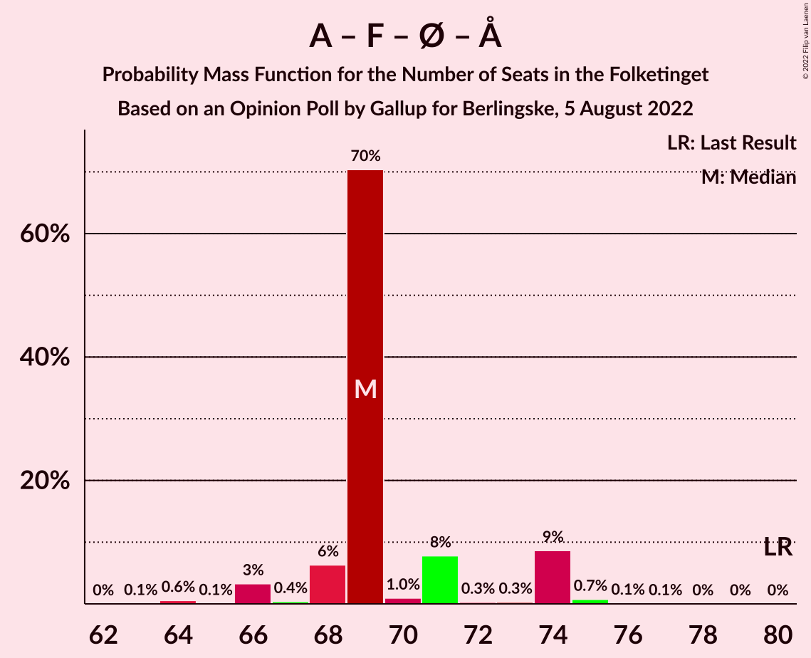

# Opinion Poll by Gallup for Berlingske, 5 August 2022

<a href="#voting-intentions">Voting Intentions</a> | <a href="#seats">Seats</a> | <a href="#coalitions">Coalitions</a> | <a href="#technical-information">Technical Information</a>

## Voting Intentions

### Confidence Intervals

| Party | Last Result | Poll Result | 80% Confidence Interval | 90% Confidence Interval | 95% Confidence Interval | 99% Confidence Interval |
|:-----:|:-----------:|:-----------:|:-----------------------:|:-----------------------:|:-----------------------:|:-----------------------:|
| Socialdemokraterne | 25.9% | 23.5% | 22.2–24.9% |21.8–25.3% |21.5–25.7% |20.9–26.4% |
| Venstre | 23.4% | 13.2% | 12.1–14.3% |11.9–14.7% |11.6–15.0% |11.1–15.5% |
| Det Konservative Folkeparti | 6.6% | 11.8% | 10.8–12.9% |10.5–13.2% |10.3–13.5% |9.8–14.0% |
| Danmarksdemokraterne | 0.0% | 10.2% | 9.3–11.2% |9.0–11.6% |8.8–11.8% |8.4–12.3% |
| Socialistisk Folkeparti | 7.7% | 9.3% | 8.4–10.3% |8.2–10.6% |8.0–10.9% |7.6–11.4% |
| Radikale Venstre | 8.6% | 6.9% | 6.2–7.8% |5.9–8.1% |5.8–8.3% |5.4–8.7% |
| Enhedslisten–De Rød-Grønne | 6.9% | 6.1% | 5.4–6.9% |5.2–7.2% |5.0–7.4% |4.7–7.8% |
| Nye Borgerlige | 2.4% | 6.0% | 5.3–6.9% |5.1–7.1% |5.0–7.3% |4.6–7.7% |
| Liberal Alliance | 2.3% | 4.1% | 3.5–4.8% |3.4–5.0% |3.2–5.2% |3.0–5.6% |
| Moderaterne | 0.0% | 4.1% | 3.5–4.8% |3.4–5.0% |3.2–5.2% |3.0–5.6% |
| Dansk Folkeparti | 8.7% | 1.8% | 1.4–2.3% |1.3–2.4% |1.2–2.6% |1.1–2.8% |
| Kristendemokraterne | 1.7% | 1.7% | 1.4–2.2% |1.2–2.4% |1.2–2.5% |1.0–2.7% |
| Alternativet | 3.0% | 0.3% | 0.2–0.6% |0.2–0.7% |0.1–0.7% |0.1–0.9% |
| Frie Grønne | 0.0% | 0.3% | 0.2–0.6% |0.2–0.7% |0.1–0.7% |0.1–0.9% |
| Veganerpartiet | 0.0% | 0.2% | 0.1–0.4% |0.1–0.5% |0.1–0.6% |0.0–0.7% |

*Note:* The poll result column reflects the actual value used in the calculations. Published results may vary slightly, and in addition be rounded to fewer digits.

## Seats

### Confidence Intervals

| Party | Last Result | Median | 80% Confidence Interval | 90% Confidence Interval | 95% Confidence Interval | 99% Confidence Interval |
|:-----:|:-----------:|:------:|:-----------------------:|:-----------------------:|:-----------------------:|:-----------------------:|
| <a href="#socialdemokraterne">Socialdemokraterne</a> | 48 | 45 | 40–45 |39–49 |38–49 |37–49 |
| <a href="#venstre">Venstre</a> | 43 | 25 | 22–25 |22–26 |22–26 |20–26 |
| <a href="#det-konservative-folkeparti">Det Konservative Folkeparti</a> | 12 | 20 | 19–22 |19–22 |19–23 |18–25 |
| <a href="#danmarksdemokraterne">Danmarksdemokraterne</a> | 0 | 21 | 17–21 |16–21 |16–21 |16–23 |
| <a href="#socialistisk-folkeparti">Socialistisk Folkeparti</a> | 14 | 15 | 15–18 |15–19 |14–19 |14–21 |
| <a href="#radikale-venstre">Radikale Venstre</a> | 16 | 12 | 11–13 |11–14 |11–15 |10–15 |
| <a href="#enhedslisten–de-rød-grønne">Enhedslisten–De Rød-Grønne</a> | 13 | 9 | 9–12 |9–12 |9–13 |8–14 |
| <a href="#nye-borgerlige">Nye Borgerlige</a> | 4 | 11 | 10–12 |9–12 |9–12 |8–13 |
| <a href="#liberal-alliance">Liberal Alliance</a> | 4 | 7 | 7–9 |7–9 |6–10 |6–10 |
| <a href="#moderaterne">Moderaterne</a> | 0 | 6 | 6–8 |6–9 |6–9 |6–9 |
| <a href="#dansk-folkeparti">Dansk Folkeparti</a> | 16 | 4 | 0–4 |0–4 |0–4 |0–5 |
| <a href="#kristendemokraterne">Kristendemokraterne</a> | 0 | 0 | 0–4 |0–4 |0–4 |0–4 |
| <a href="#alternativet">Alternativet</a> | 5 | 0 | 0 |0 |0 |0 |
| <a href="#frie-grønne">Frie Grønne</a> | 0 | 0 | 0 |0 |0 |0 |
| <a href="#veganerpartiet">Veganerpartiet</a> | 0 | 0 | 0 |0 |0 |0 |

### Socialdemokraterne

*For a full overview of the results for this party, see the [Socialdemokraterne](party-socialdemokraterne.html) page.*

| Number of Seats | Probability | Accumulated | Special Marks |
|:---------------:|:-----------:|:-----------:|:-------------:|
| 36 | 0.1% | 100% |  |
| 37 | 2% | 99.9% |  |
| 38 | 1.1% | 98% |  |
| 39 | 6% | 97% |  |
| 40 | 1.4% | 91% |  |
| 41 | 6% | 90% |  |
| 42 | 3% | 84% |  |
| 43 | 11% | 81% |  |
| 44 | 3% | 71% |  |
| 45 | 59% | 68% | Median |
| 46 | 0.1% | 9% |  |
| 47 | 1.0% | 9% |  |
| 48 | 0.1% | 8% | Last Result |
| 49 | 8% | 8% |  |
| 50 | 0% | 0% |  |

### Venstre

*For a full overview of the results for this party, see the [Venstre](party-venstre.html) page.*

| Number of Seats | Probability | Accumulated | Special Marks |
|:---------------:|:-----------:|:-----------:|:-------------:|
| 19 | 0.1% | 100% |  |
| 20 | 0.5% | 99.9% |  |
| 21 | 0.3% | 99.5% |  |
| 22 | 11% | 99.1% |  |
| 23 | 5% | 88% |  |
| 24 | 11% | 83% |  |
| 25 | 67% | 72% | Median |
| 26 | 5% | 6% |  |
| 27 | 0.2% | 0.2% |  |
| 28 | 0.1% | 0.1% |  |
| 29 | 0% | 0% |  |
| 30 | 0% | 0% |  |
| 31 | 0% | 0% |  |
| 32 | 0% | 0% |  |
| 33 | 0% | 0% |  |
| 34 | 0% | 0% |  |
| 35 | 0% | 0% |  |
| 36 | 0% | 0% |  |
| 37 | 0% | 0% |  |
| 38 | 0% | 0% |  |
| 39 | 0% | 0% |  |
| 40 | 0% | 0% |  |
| 41 | 0% | 0% |  |
| 42 | 0% | 0% |  |
| 43 | 0% | 0% | Last Result |

### Det Konservative Folkeparti

*For a full overview of the results for this party, see the [Det Konservative Folkeparti](party-detkonservativefolkeparti.html) page.*

| Number of Seats | Probability | Accumulated | Special Marks |
|:---------------:|:-----------:|:-----------:|:-------------:|
| 12 | 0% | 100% | Last Result |
| 13 | 0% | 100% |  |
| 14 | 0% | 100% |  |
| 15 | 0% | 100% |  |
| 16 | 0% | 100% |  |
| 17 | 0.1% | 100% |  |
| 18 | 1.0% | 99.9% |  |
| 19 | 11% | 98.9% |  |
| 20 | 65% | 88% | Median |
| 21 | 11% | 22% |  |
| 22 | 8% | 11% |  |
| 23 | 2% | 3% |  |
| 24 | 0.6% | 1.5% |  |
| 25 | 0.8% | 0.9% |  |
| 26 | 0% | 0.1% |  |
| 27 | 0.1% | 0.1% |  |
| 28 | 0% | 0% |  |

### Danmarksdemokraterne

*For a full overview of the results for this party, see the [Danmarksdemokraterne](party-danmarksdemokraterne.html) page.*

| Number of Seats | Probability | Accumulated | Special Marks |
|:---------------:|:-----------:|:-----------:|:-------------:|
| 0 | 0% | 100% | Last Result |
| 1 | 0% | 100% |  |
| 2 | 0% | 100% |  |
| 3 | 0% | 100% |  |
| 4 | 0% | 100% |  |
| 5 | 0% | 100% |  |
| 6 | 0% | 100% |  |
| 7 | 0% | 100% |  |
| 8 | 0% | 100% |  |
| 9 | 0% | 100% |  |
| 10 | 0% | 100% |  |
| 11 | 0% | 100% |  |
| 12 | 0% | 100% |  |
| 13 | 0% | 100% |  |
| 14 | 0% | 100% |  |
| 15 | 0.3% | 100% |  |
| 16 | 5% | 99.7% |  |
| 17 | 14% | 94% |  |
| 18 | 6% | 80% |  |
| 19 | 0.6% | 74% |  |
| 20 | 11% | 73% |  |
| 21 | 61% | 63% | Median |
| 22 | 0.4% | 2% |  |
| 23 | 1.5% | 2% |  |
| 24 | 0.1% | 0.2% |  |
| 25 | 0.1% | 0.1% |  |
| 26 | 0% | 0% |  |

### Socialistisk Folkeparti

*For a full overview of the results for this party, see the [Socialistisk Folkeparti](party-socialistiskfolkeparti.html) page.*

| Number of Seats | Probability | Accumulated | Special Marks |
|:---------------:|:-----------:|:-----------:|:-------------:|
| 13 | 0% | 100% |  |
| 14 | 3% | 99.9% | Last Result |
| 15 | 61% | 97% | Median |
| 16 | 19% | 35% |  |
| 17 | 6% | 16% |  |
| 18 | 2% | 11% |  |
| 19 | 7% | 8% |  |
| 20 | 0.3% | 0.8% |  |
| 21 | 0.5% | 0.6% |  |
| 22 | 0.1% | 0.1% |  |
| 23 | 0% | 0% |  |

### Radikale Venstre

*For a full overview of the results for this party, see the [Radikale Venstre](party-radikalevenstre.html) page.*

| Number of Seats | Probability | Accumulated | Special Marks |
|:---------------:|:-----------:|:-----------:|:-------------:|
| 9 | 0.1% | 100% |  |
| 10 | 2% | 99.9% |  |
| 11 | 14% | 98% |  |
| 12 | 63% | 84% | Median |
| 13 | 16% | 21% |  |
| 14 | 2% | 5% |  |
| 15 | 3% | 3% |  |
| 16 | 0.2% | 0.2% | Last Result |
| 17 | 0% | 0% |  |

### Enhedslisten–De Rød-Grønne

*For a full overview of the results for this party, see the [Enhedslisten–De Rød-Grønne](party-enhedslisten–derød-grønne.html) page.*

| Number of Seats | Probability | Accumulated | Special Marks |
|:---------------:|:-----------:|:-----------:|:-------------:|
| 8 | 0.9% | 100% |  |
| 9 | 68% | 99.0% | Median |
| 10 | 11% | 31% |  |
| 11 | 9% | 20% |  |
| 12 | 7% | 11% |  |
| 13 | 2% | 3% | Last Result |
| 14 | 0.9% | 1.0% |  |
| 15 | 0.1% | 0.1% |  |
| 16 | 0% | 0% |  |

### Nye Borgerlige

*For a full overview of the results for this party, see the [Nye Borgerlige](party-nyeborgerlige.html) page.*

| Number of Seats | Probability | Accumulated | Special Marks |
|:---------------:|:-----------:|:-----------:|:-------------:|
| 4 | 0% | 100% | Last Result |
| 5 | 0% | 100% |  |
| 6 | 0% | 100% |  |
| 7 | 0% | 100% |  |
| 8 | 1.1% | 100% |  |
| 9 | 6% | 98.9% |  |
| 10 | 9% | 93% |  |
| 11 | 72% | 84% | Median |
| 12 | 10% | 12% |  |
| 13 | 2% | 2% |  |
| 14 | 0.1% | 0.1% |  |
| 15 | 0.1% | 0.1% |  |
| 16 | 0% | 0% |  |

### Liberal Alliance

*For a full overview of the results for this party, see the [Liberal Alliance](party-liberalalliance.html) page.*

| Number of Seats | Probability | Accumulated | Special Marks |
|:---------------:|:-----------:|:-----------:|:-------------:|
| 4 | 0% | 100% | Last Result |
| 5 | 0.3% | 100% |  |
| 6 | 3% | 99.7% |  |
| 7 | 71% | 97% | Median |
| 8 | 10% | 26% |  |
| 9 | 13% | 16% |  |
| 10 | 3% | 3% |  |
| 11 | 0.1% | 0.1% |  |
| 12 | 0% | 0% |  |

### Moderaterne

*For a full overview of the results for this party, see the [Moderaterne](party-moderaterne.html) page.*

| Number of Seats | Probability | Accumulated | Special Marks |
|:---------------:|:-----------:|:-----------:|:-------------:|
| 0 | 0% | 100% | Last Result |
| 1 | 0% | 100% |  |
| 2 | 0% | 100% |  |
| 3 | 0% | 100% |  |
| 4 | 0% | 100% |  |
| 5 | 0.1% | 100% |  |
| 6 | 63% | 99.9% | Median |
| 7 | 5% | 37% |  |
| 8 | 23% | 32% |  |
| 9 | 9% | 9% |  |
| 10 | 0.1% | 0.1% |  |
| 11 | 0% | 0% |  |

### Dansk Folkeparti

*For a full overview of the results for this party, see the [Dansk Folkeparti](party-danskfolkeparti.html) page.*

| Number of Seats | Probability | Accumulated | Special Marks |
|:---------------:|:-----------:|:-----------:|:-------------:|
| 0 | 25% | 100% |  |
| 1 | 0% | 75% |  |
| 2 | 0% | 75% |  |
| 3 | 0% | 75% |  |
| 4 | 74% | 75% | Median |
| 5 | 2% | 2% |  |
| 6 | 0% | 0% |  |
| 7 | 0% | 0% |  |
| 8 | 0% | 0% |  |
| 9 | 0% | 0% |  |
| 10 | 0% | 0% |  |
| 11 | 0% | 0% |  |
| 12 | 0% | 0% |  |
| 13 | 0% | 0% |  |
| 14 | 0% | 0% |  |
| 15 | 0% | 0% |  |
| 16 | 0% | 0% | Last Result |

### Kristendemokraterne

*For a full overview of the results for this party, see the [Kristendemokraterne](party-kristendemokraterne.html) page.*

| Number of Seats | Probability | Accumulated | Special Marks |
|:---------------:|:-----------:|:-----------:|:-------------:|
| 0 | 83% | 100% | Last Result, Median |
| 1 | 0% | 17% |  |
| 2 | 0% | 17% |  |
| 3 | 0% | 17% |  |
| 4 | 16% | 17% |  |
| 5 | 0.1% | 0.3% |  |
| 6 | 0.2% | 0.2% |  |
| 7 | 0% | 0% |  |

### Alternativet

*For a full overview of the results for this party, see the [Alternativet](party-alternativet.html) page.*

| Number of Seats | Probability | Accumulated | Special Marks |
|:---------------:|:-----------:|:-----------:|:-------------:|
| 0 | 100% | 100% | Median |
| 1 | 0% | 0% |  |
| 2 | 0% | 0% |  |
| 3 | 0% | 0% |  |
| 4 | 0% | 0% |  |
| 5 | 0% | 0% | Last Result |

### Frie Grønne

*For a full overview of the results for this party, see the [Frie Grønne](party-friegrønne.html) page.*

| Number of Seats | Probability | Accumulated | Special Marks |
|:---------------:|:-----------:|:-----------:|:-------------:|
| 0 | 100% | 100% | Last Result, Median |

### Veganerpartiet

*For a full overview of the results for this party, see the [Veganerpartiet](party-veganerpartiet.html) page.*

| Number of Seats | Probability | Accumulated | Special Marks |
|:---------------:|:-----------:|:-----------:|:-------------:|
| 0 | 100% | 100% | Last Result, Median |

## Coalitions

### Confidence Intervals

| Coalition | Last Result | Median | Majority? | 80% Confidence Interval | 90% Confidence Interval | 95% Confidence Interval | 99% Confidence Interval |
|:---------:|:-----------:|:------:|:---------:|:-----------------------:|:-----------------------:|:-----------------------:|:-----------------------:|
| Venstre – Det Konservative Folkeparti – Danmarksdemokraterne – Nye Borgerlige – Liberal Alliance – Dansk Folkeparti – Kristendemokraterne | 79 | 88 | 1.2% | 82–88 | 80–88 | 80–89 | 76–92 |
| Socialdemokraterne – Socialistisk Folkeparti – Radikale Venstre – Enhedslisten–De Rød-Grønne – Alternativet | 96 | 81 | 0.7% | 80–85 | 79–87 | 79–87 | 76–90 |
| Socialdemokraterne – Socialistisk Folkeparti – Radikale Venstre – Enhedslisten–De Rød-Grønne | 91 | 81 | 0.7% | 80–85 | 79–87 | 79–87 | 76–90 |
| Socialdemokraterne – Socialistisk Folkeparti – Radikale Venstre | 78 | 72 | 0% | 69–74 | 69–78 | 68–78 | 64–78 |
| Socialdemokraterne – Socialistisk Folkeparti – Enhedslisten–De Rød-Grønne – Alternativet | 80 | 69 | 0% | 68–72 | 68–74 | 66–74 | 64–75 |
| Socialdemokraterne – Socialistisk Folkeparti – Enhedslisten–De Rød-Grønne | 75 | 69 | 0% | 68–72 | 68–74 | 66–74 | 64–75 |
| Venstre – Det Konservative Folkeparti – Nye Borgerlige – Liberal Alliance – Dansk Folkeparti – Kristendemokraterne | 79 | 67 | 0% | 63–69 | 63–71 | 63–71 | 58–72 |
| Venstre – Det Konservative Folkeparti – Nye Borgerlige – Liberal Alliance – Dansk Folkeparti | 79 | 67 | 0% | 63–67 | 63–67 | 62–69 | 58–70 |
| Venstre – Det Konservative Folkeparti – Liberal Alliance – Dansk Folkeparti – Kristendemokraterne | 75 | 56 | 0% | 52–58 | 52–62 | 52–62 | 46–63 |
| Socialdemokraterne – Radikale Venstre | 64 | 57 | 0% | 52–57 | 50–62 | 50–62 | 47–62 |
| Venstre – Det Konservative Folkeparti – Liberal Alliance – Dansk Folkeparti | 75 | 56 | 0% | 52–56 | 52–58 | 52–58 | 46–59 |
| Venstre – Det Konservative Folkeparti – Liberal Alliance | 59 | 52 | 0% | 52–54 | 50–54 | 50–54 | 46–56 |
| Venstre – Det Konservative Folkeparti | 55 | 45 | 0% | 44–45 | 42–46 | 42–47 | 40–49 |
| Venstre | 43 | 25 | 0% | 22–25 | 22–26 | 22–26 | 20–26 |

### Venstre – Det Konservative Folkeparti – Danmarksdemokraterne – Nye Borgerlige – Liberal Alliance – Dansk Folkeparti – Kristendemokraterne

| Number of Seats | Probability | Accumulated | Special Marks |
|:---------------:|:-----------:|:-----------:|:-------------:|
| 76 | 0.7% | 100% |  |
| 77 | 0% | 99.3% |  |
| 78 | 0% | 99.3% |  |
| 79 | 0.1% | 99.3% | Last Result |
| 80 | 8% | 99.2% |  |
| 81 | 0.5% | 91% |  |
| 82 | 6% | 90% |  |
| 83 | 1.4% | 85% |  |
| 84 | 0.5% | 83% |  |
| 85 | 1.5% | 83% |  |
| 86 | 2% | 81% |  |
| 87 | 11% | 79% |  |
| 88 | 66% | 68% | Median |
| 89 | 1.5% | 3% |  |
| 90 | 0% | 1.2% | Majority |
| 91 | 0.1% | 1.1% |  |
| 92 | 0.9% | 1.0% |  |
| 93 | 0% | 0.1% |  |
| 94 | 0.1% | 0.1% |  |
| 95 | 0% | 0% |  |

### Socialdemokraterne – Socialistisk Folkeparti – Radikale Venstre – Enhedslisten–De Rød-Grønne – Alternativet

| Number of Seats | Probability | Accumulated | Special Marks |
|:---------------:|:-----------:|:-----------:|:-------------:|
| 74 | 0.1% | 100% |  |
| 75 | 0% | 99.9% |  |
| 76 | 0.8% | 99.9% |  |
| 77 | 0.3% | 99.1% |  |
| 78 | 0.6% | 98.8% |  |
| 79 | 5% | 98% |  |
| 80 | 11% | 94% |  |
| 81 | 63% | 83% | Median |
| 82 | 1.3% | 20% |  |
| 83 | 2% | 18% |  |
| 84 | 6% | 16% |  |
| 85 | 0.6% | 10% |  |
| 86 | 0.7% | 10% |  |
| 87 | 8% | 9% |  |
| 88 | 0% | 0.9% |  |
| 89 | 0.1% | 0.8% |  |
| 90 | 0.7% | 0.7% | Majority |
| 91 | 0% | 0% |  |
| 92 | 0% | 0% |  |
| 93 | 0% | 0% |  |
| 94 | 0% | 0% |  |
| 95 | 0% | 0% |  |
| 96 | 0% | 0% | Last Result |

### Socialdemokraterne – Socialistisk Folkeparti – Radikale Venstre – Enhedslisten–De Rød-Grønne

| Number of Seats | Probability | Accumulated | Special Marks |
|:---------------:|:-----------:|:-----------:|:-------------:|
| 74 | 0.1% | 100% |  |
| 75 | 0% | 99.9% |  |
| 76 | 0.8% | 99.9% |  |
| 77 | 0.3% | 99.1% |  |
| 78 | 0.6% | 98.8% |  |
| 79 | 5% | 98% |  |
| 80 | 11% | 94% |  |
| 81 | 63% | 83% | Median |
| 82 | 1.3% | 20% |  |
| 83 | 2% | 18% |  |
| 84 | 6% | 16% |  |
| 85 | 0.6% | 10% |  |
| 86 | 0.7% | 10% |  |
| 87 | 8% | 9% |  |
| 88 | 0% | 0.9% |  |
| 89 | 0.1% | 0.8% |  |
| 90 | 0.7% | 0.7% | Majority |
| 91 | 0% | 0% | Last Result |

### Socialdemokraterne – Socialistisk Folkeparti – Radikale Venstre

| Number of Seats | Probability | Accumulated | Special Marks |
|:---------------:|:-----------:|:-----------:|:-------------:|
| 63 | 0.1% | 100% |  |
| 64 | 0.9% | 99.9% |  |
| 65 | 0.1% | 99.0% |  |
| 66 | 0.1% | 98.9% |  |
| 67 | 0.2% | 98.9% |  |
| 68 | 2% | 98.6% |  |
| 69 | 11% | 97% |  |
| 70 | 7% | 85% |  |
| 71 | 0.5% | 79% |  |
| 72 | 65% | 78% | Median |
| 73 | 2% | 13% |  |
| 74 | 1.3% | 11% |  |
| 75 | 0.8% | 10% |  |
| 76 | 1.0% | 9% |  |
| 77 | 0.1% | 8% |  |
| 78 | 8% | 8% | Last Result |
| 79 | 0% | 0% |  |

### Socialdemokraterne – Socialistisk Folkeparti – Enhedslisten–De Rød-Grønne – Alternativet

| Number of Seats | Probability | Accumulated | Special Marks |
|:---------------:|:-----------:|:-----------:|:-------------:|
| 63 | 0.1% | 100% |  |
| 64 | 0.6% | 99.9% |  |
| 65 | 0.1% | 99.4% |  |
| 66 | 3% | 99.3% |  |
| 67 | 0.4% | 96% |  |
| 68 | 6% | 96% |  |
| 69 | 70% | 89% | Median |
| 70 | 1.0% | 19% |  |
| 71 | 8% | 18% |  |
| 72 | 0.3% | 10% |  |
| 73 | 0.3% | 10% |  |
| 74 | 9% | 10% |  |
| 75 | 0.7% | 0.9% |  |
| 76 | 0.1% | 0.2% |  |
| 77 | 0.1% | 0.1% |  |
| 78 | 0% | 0% |  |
| 79 | 0% | 0% |  |
| 80 | 0% | 0% | Last Result |

### Socialdemokraterne – Socialistisk Folkeparti – Enhedslisten–De Rød-Grønne

| Number of Seats | Probability | Accumulated | Special Marks |
|:---------------:|:-----------:|:-----------:|:-------------:|
| 63 | 0.1% | 100% |  |
| 64 | 0.6% | 99.9% |  |
| 65 | 0.1% | 99.4% |  |
| 66 | 3% | 99.3% |  |
| 67 | 0.4% | 96% |  |
| 68 | 6% | 96% |  |
| 69 | 70% | 89% | Median |
| 70 | 1.0% | 19% |  |
| 71 | 8% | 18% |  |
| 72 | 0.3% | 10% |  |
| 73 | 0.3% | 10% |  |
| 74 | 9% | 10% |  |
| 75 | 0.7% | 0.9% | Last Result |
| 76 | 0.1% | 0.2% |  |
| 77 | 0.1% | 0.1% |  |
| 78 | 0% | 0% |  |

### Venstre – Det Konservative Folkeparti – Nye Borgerlige – Liberal Alliance – Dansk Folkeparti – Kristendemokraterne

| Number of Seats | Probability | Accumulated | Special Marks |
|:---------------:|:-----------:|:-----------:|:-------------:|
| 58 | 0.7% | 100% |  |
| 59 | 0.4% | 99.3% |  |
| 60 | 0.1% | 98.9% |  |
| 61 | 0.2% | 98.8% |  |
| 62 | 0.4% | 98.6% |  |
| 63 | 9% | 98% |  |
| 64 | 1.1% | 89% |  |
| 65 | 2% | 88% |  |
| 66 | 8% | 86% |  |
| 67 | 66% | 78% | Median |
| 68 | 0.2% | 13% |  |
| 69 | 4% | 12% |  |
| 70 | 2% | 8% |  |
| 71 | 5% | 6% |  |
| 72 | 0.6% | 0.8% |  |
| 73 | 0% | 0.2% |  |
| 74 | 0.1% | 0.2% |  |
| 75 | 0% | 0% |  |
| 76 | 0% | 0% |  |
| 77 | 0% | 0% |  |
| 78 | 0% | 0% |  |
| 79 | 0% | 0% | Last Result |

### Venstre – Det Konservative Folkeparti – Nye Borgerlige – Liberal Alliance – Dansk Folkeparti

| Number of Seats | Probability | Accumulated | Special Marks |
|:---------------:|:-----------:|:-----------:|:-------------:|
| 58 | 0.7% | 100% |  |
| 59 | 0.4% | 99.3% |  |
| 60 | 0.1% | 98.9% |  |
| 61 | 0.3% | 98.8% |  |
| 62 | 2% | 98.5% |  |
| 63 | 15% | 97% |  |
| 64 | 1.2% | 82% |  |
| 65 | 5% | 81% |  |
| 66 | 7% | 76% |  |
| 67 | 65% | 69% | Median |
| 68 | 0.7% | 4% |  |
| 69 | 0.8% | 3% |  |
| 70 | 2% | 2% |  |
| 71 | 0% | 0.1% |  |
| 72 | 0% | 0% |  |
| 73 | 0% | 0% |  |
| 74 | 0% | 0% |  |
| 75 | 0% | 0% |  |
| 76 | 0% | 0% |  |
| 77 | 0% | 0% |  |
| 78 | 0% | 0% |  |
| 79 | 0% | 0% | Last Result |

### Venstre – Det Konservative Folkeparti – Liberal Alliance – Dansk Folkeparti – Kristendemokraterne

| Number of Seats | Probability | Accumulated | Special Marks |
|:---------------:|:-----------:|:-----------:|:-------------:|
| 46 | 0.7% | 100% |  |
| 47 | 0.1% | 99.3% |  |
| 48 | 0.1% | 99.3% |  |
| 49 | 0.1% | 99.2% |  |
| 50 | 0.3% | 99.1% |  |
| 51 | 0.8% | 98.8% |  |
| 52 | 9% | 98% |  |
| 53 | 2% | 89% |  |
| 54 | 5% | 87% |  |
| 55 | 2% | 82% |  |
| 56 | 62% | 80% | Median |
| 57 | 6% | 18% |  |
| 58 | 6% | 12% |  |
| 59 | 0.2% | 6% |  |
| 60 | 0.2% | 6% |  |
| 61 | 0.8% | 6% |  |
| 62 | 4% | 5% |  |
| 63 | 0.6% | 0.7% |  |
| 64 | 0.1% | 0.1% |  |
| 65 | 0% | 0% |  |
| 66 | 0% | 0% |  |
| 67 | 0% | 0% |  |
| 68 | 0% | 0% |  |
| 69 | 0% | 0% |  |
| 70 | 0% | 0% |  |
| 71 | 0% | 0% |  |
| 72 | 0% | 0% |  |
| 73 | 0% | 0% |  |
| 74 | 0% | 0% |  |
| 75 | 0% | 0% | Last Result |

### Socialdemokraterne – Radikale Venstre

| Number of Seats | Probability | Accumulated | Special Marks |
|:---------------:|:-----------:|:-----------:|:-------------:|
| 47 | 0.8% | 100% |  |
| 48 | 0.2% | 99.2% |  |
| 49 | 0.2% | 99.0% |  |
| 50 | 6% | 98.8% |  |
| 51 | 1.2% | 93% |  |
| 52 | 6% | 92% |  |
| 53 | 0.7% | 86% |  |
| 54 | 5% | 85% |  |
| 55 | 2% | 80% |  |
| 56 | 8% | 79% |  |
| 57 | 61% | 71% | Median |
| 58 | 0.8% | 10% |  |
| 59 | 1.0% | 9% |  |
| 60 | 0.1% | 8% |  |
| 61 | 0.1% | 8% |  |
| 62 | 8% | 8% |  |
| 63 | 0% | 0% |  |
| 64 | 0% | 0% | Last Result |

### Venstre – Det Konservative Folkeparti – Liberal Alliance – Dansk Folkeparti

| Number of Seats | Probability | Accumulated | Special Marks |
|:---------------:|:-----------:|:-----------:|:-------------:|
| 46 | 0.7% | 100% |  |
| 47 | 0.1% | 99.3% |  |
| 48 | 0.1% | 99.2% |  |
| 49 | 0.2% | 99.2% |  |
| 50 | 0.3% | 99.0% |  |
| 51 | 0.8% | 98.6% |  |
| 52 | 10% | 98% |  |
| 53 | 7% | 87% |  |
| 54 | 9% | 80% |  |
| 55 | 2% | 71% |  |
| 56 | 60% | 69% | Median |
| 57 | 1.1% | 9% |  |
| 58 | 7% | 8% |  |
| 59 | 0.7% | 0.9% |  |
| 60 | 0.1% | 0.1% |  |
| 61 | 0% | 0.1% |  |
| 62 | 0% | 0% |  |
| 63 | 0% | 0% |  |
| 64 | 0% | 0% |  |
| 65 | 0% | 0% |  |
| 66 | 0% | 0% |  |
| 67 | 0% | 0% |  |
| 68 | 0% | 0% |  |
| 69 | 0% | 0% |  |
| 70 | 0% | 0% |  |
| 71 | 0% | 0% |  |
| 72 | 0% | 0% |  |
| 73 | 0% | 0% |  |
| 74 | 0% | 0% |  |
| 75 | 0% | 0% | Last Result |

### Venstre – Det Konservative Folkeparti – Liberal Alliance

| Number of Seats | Probability | Accumulated | Special Marks |
|:---------------:|:-----------:|:-----------:|:-------------:|
| 46 | 0.9% | 100% |  |
| 47 | 0.1% | 99.1% |  |
| 48 | 0.4% | 99.0% |  |
| 49 | 0.3% | 98.6% |  |
| 50 | 6% | 98% |  |
| 51 | 2% | 93% |  |
| 52 | 70% | 91% | Median |
| 53 | 7% | 20% |  |
| 54 | 11% | 13% |  |
| 55 | 1.0% | 2% |  |
| 56 | 1.0% | 1.5% |  |
| 57 | 0.1% | 0.4% |  |
| 58 | 0.1% | 0.3% |  |
| 59 | 0.2% | 0.3% | Last Result |
| 60 | 0% | 0% |  |

### Venstre – Det Konservative Folkeparti

| Number of Seats | Probability | Accumulated | Special Marks |
|:---------------:|:-----------:|:-----------:|:-------------:|
| 40 | 1.0% | 100% |  |
| 41 | 0.1% | 99.0% |  |
| 42 | 7% | 98.9% |  |
| 43 | 0.7% | 92% |  |
| 44 | 11% | 91% |  |
| 45 | 74% | 80% | Median |
| 46 | 3% | 6% |  |
| 47 | 2% | 3% |  |
| 48 | 0.9% | 2% |  |
| 49 | 0.7% | 1.1% |  |
| 50 | 0.2% | 0.3% |  |
| 51 | 0.1% | 0.2% |  |
| 52 | 0% | 0.1% |  |
| 53 | 0% | 0% |  |
| 54 | 0% | 0% |  |
| 55 | 0% | 0% | Last Result |

### Venstre

| Number of Seats | Probability | Accumulated | Special Marks |
|:---------------:|:-----------:|:-----------:|:-------------:|
| 19 | 0.1% | 100% |  |
| 20 | 0.5% | 99.9% |  |
| 21 | 0.3% | 99.5% |  |
| 22 | 11% | 99.1% |  |
| 23 | 5% | 88% |  |
| 24 | 11% | 83% |  |
| 25 | 67% | 72% | Median |
| 26 | 5% | 6% |  |
| 27 | 0.2% | 0.2% |  |
| 28 | 0.1% | 0.1% |  |
| 29 | 0% | 0% |  |
| 30 | 0% | 0% |  |
| 31 | 0% | 0% |  |
| 32 | 0% | 0% |  |
| 33 | 0% | 0% |  |
| 34 | 0% | 0% |  |
| 35 | 0% | 0% |  |
| 36 | 0% | 0% |  |
| 37 | 0% | 0% |  |
| 38 | 0% | 0% |  |
| 39 | 0% | 0% |  |
| 40 | 0% | 0% |  |
| 41 | 0% | 0% |  |
| 42 | 0% | 0% |  |
| 43 | 0% | 0% | Last Result |

## Technical Information

### Opinion Poll

+ **Polling firm:** Gallup
+ **Commissioner(s):** Berlingske
+ **Fieldwork period:** 5 August 2022

### Calculations

+ **Sample size:** 1577
+ **Simulations done:** 1,048,576
+ **Error estimate:** 2.13%

