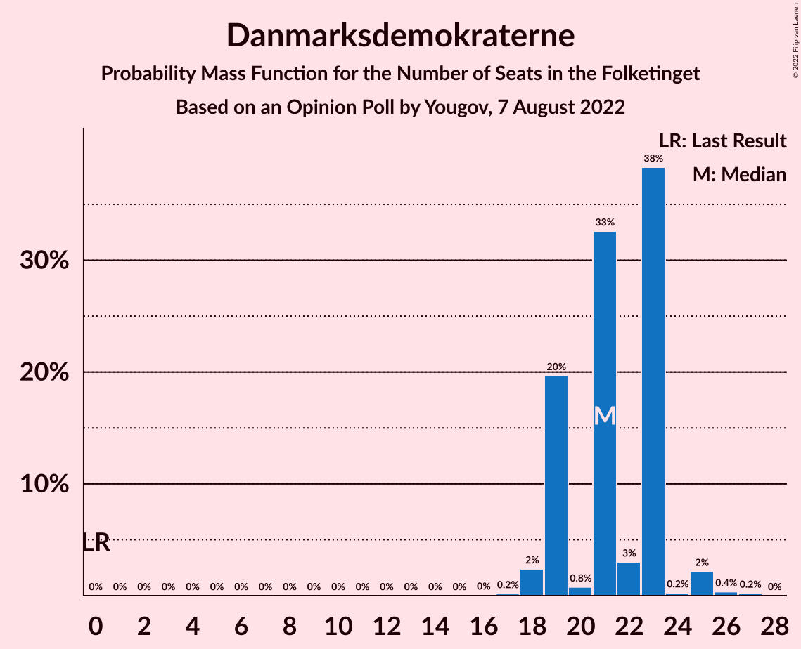
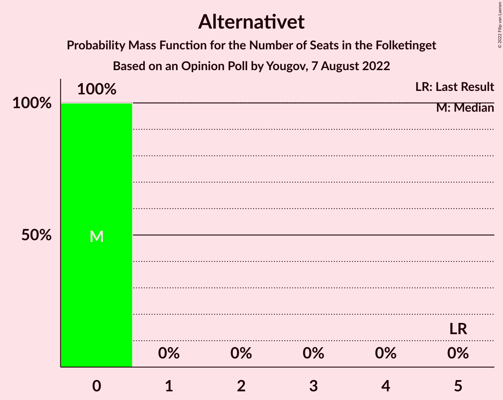
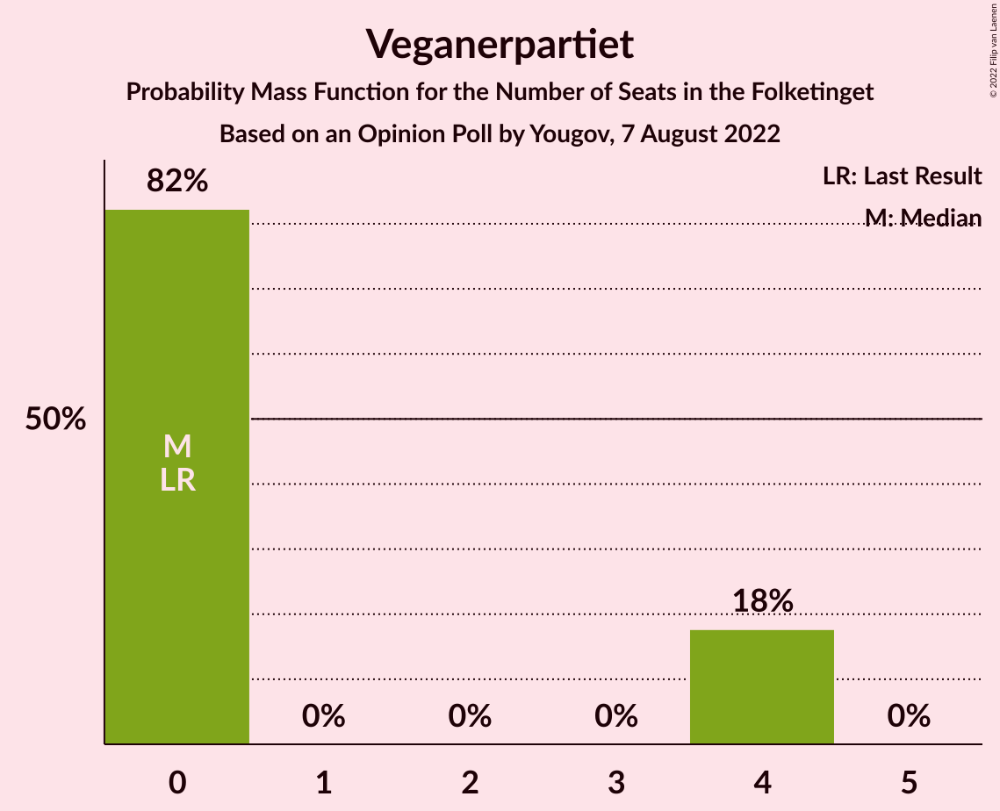
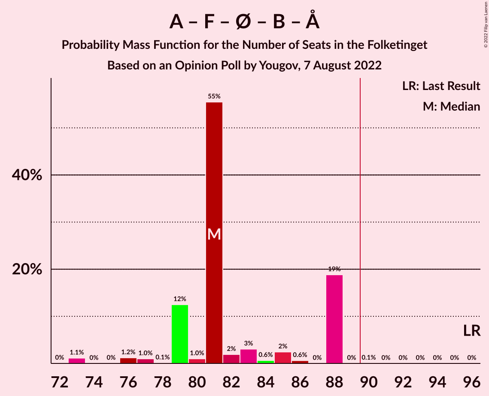
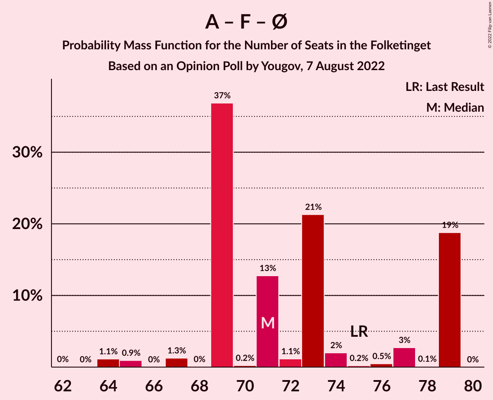

# Opinion Poll by Yougov, 7 August 2022

<a href="#voting-intentions">Voting Intentions</a> | <a href="#seats">Seats</a> | <a href="#coalitions">Coalitions</a> | <a href="#technical-information">Technical Information</a>

## Voting Intentions

### Confidence Intervals

| Party | Last Result | Poll Result | 80% Confidence Interval | 90% Confidence Interval | 95% Confidence Interval | 99% Confidence Interval |
|:-----:|:-----------:|:-----------:|:-----------------------:|:-----------------------:|:-----------------------:|:-----------------------:|
| Socialdemokraterne | 25.9% | 26.1% | 24.5–27.7% |24.1–28.2% |23.7–28.6% |23.0–29.4% |
| Det Konservative Folkeparti | 6.6% | 13.9% | 12.7–15.3% |12.4–15.6% |12.1–16.0% |11.6–16.6% |
| Danmarksdemokraterne | 0.0% | 11.9% | 10.8–13.2% |10.5–13.5% |10.2–13.8% |9.7–14.4% |
| Venstre | 23.4% | 10.0% | 9.0–11.2% |8.7–11.5% |8.4–11.8% |8.0–12.4% |
| Socialistisk Folkeparti | 7.7% | 7.2% | 6.3–8.2% |6.1–8.5% |5.9–8.7% |5.5–9.3% |
| Enhedslisten–De Rød-Grønne | 6.9% | 6.9% | 6.1–7.9% |5.8–8.2% |5.6–8.5% |5.3–9.0% |
| Radikale Venstre | 8.6% | 5.2% | 4.5–6.1% |4.3–6.4% |4.1–6.6% |3.8–7.1% |
| Nye Borgerlige | 2.4% | 5.2% | 4.5–6.1% |4.3–6.4% |4.1–6.6% |3.8–7.1% |
| Moderaterne | 0.0% | 4.6% | 3.9–5.4% |3.7–5.7% |3.6–5.9% |3.2–6.3% |
| Liberal Alliance | 2.3% | 3.2% | 2.7–4.0% |2.5–4.2% |2.4–4.4% |2.1–4.7% |
| Dansk Folkeparti | 8.7% | 3.1% | 2.6–3.9% |2.4–4.1% |2.3–4.3% |2.1–4.6% |
| Alternativet | 3.0% | 1.0% | 0.7–1.4% |0.6–1.6% |0.5–1.7% |0.4–1.9% |
| Veganerpartiet | 0.0% | 0.8% | 0.6–1.2% |0.5–1.4% |0.4–1.5% |0.3–1.7% |
| Frie Grønne | 0.0% | 0.6% | 0.4–0.9% |0.3–1.1% |0.3–1.2% |0.2–1.4% |
| Kristendemokraterne | 1.7% | 0.3% | 0.2–0.7% |0.2–0.7% |0.1–0.8% |0.1–1.0% |

*Note:* The poll result column reflects the actual value used in the calculations. Published results may vary slightly, and in addition be rounded to fewer digits.

## Seats

### Confidence Intervals

| Party | Last Result | Median | 80% Confidence Interval | 90% Confidence Interval | 95% Confidence Interval | 99% Confidence Interval |
|:-----:|:-----------:|:------:|:-----------------------:|:-----------------------:|:-----------------------:|:-----------------------:|
| <a href="#socialdemokraterne">Socialdemokraterne</a> | 48 | 44 | 43–49 |43–49 |42–49 |40–52 |
| <a href="#det-konservative-folkeparti">Det Konservative Folkeparti</a> | 12 | 25 | 24–26 |23–26 |22–26 |22–28 |
| <a href="#danmarksdemokraterne">Danmarksdemokraterne</a> | 0 | 21 | 19–23 |19–23 |18–25 |18–26 |
| <a href="#venstre">Venstre</a> | 43 | 15 | 15–18 |15–19 |15–21 |15–22 |
| <a href="#socialistisk-folkeparti">Socialistisk Folkeparti</a> | 14 | 14 | 11–17 |11–17 |11–17 |8–17 |
| <a href="#enhedslisten–de-rød-grønne">Enhedslisten–De Rød-Grønne</a> | 13 | 13 | 13–14 |11–14 |10–14 |9–15 |
| <a href="#radikale-venstre">Radikale Venstre</a> | 16 | 9 | 8–12 |8–12 |8–12 |7–12 |
| <a href="#nye-borgerlige">Nye Borgerlige</a> | 4 | 9 | 8–12 |8–12 |8–12 |8–12 |
| <a href="#moderaterne">Moderaterne</a> | 0 | 9 | 6–9 |6–9 |6–9 |6–10 |
| <a href="#liberal-alliance">Liberal Alliance</a> | 4 | 7 | 5–7 |5–7 |5–7 |4–8 |
| <a href="#dansk-folkeparti">Dansk Folkeparti</a> | 16 | 6 | 5–7 |5–7 |5–7 |4–8 |
| <a href="#alternativet">Alternativet</a> | 5 | 0 | 0 |0 |0 |0 |
| <a href="#veganerpartiet">Veganerpartiet</a> | 0 | 0 | 0–4 |0–4 |0–4 |0–4 |
| <a href="#frie-grønne">Frie Grønne</a> | 0 | 0 | 0 |0 |0 |0 |
| <a href="#kristendemokraterne">Kristendemokraterne</a> | 0 | 0 | 0 |0 |0 |0 |

### Socialdemokraterne

*For a full overview of the results for this party, see the [Socialdemokraterne](party-socialdemokraterne.html) page.*

| Number of Seats | Probability | Accumulated | Special Marks |
|:---------------:|:-----------:|:-----------:|:-------------:|
| 40 | 1.2% | 100% |  |
| 41 | 0.1% | 98.8% |  |
| 42 | 2% | 98.7% |  |
| 43 | 12% | 97% |  |
| 44 | 39% | 85% | Median |
| 45 | 2% | 46% |  |
| 46 | 19% | 44% |  |
| 47 | 1.3% | 25% |  |
| 48 | 3% | 24% | Last Result |
| 49 | 20% | 21% |  |
| 50 | 0.3% | 1.1% |  |
| 51 | 0.1% | 0.8% |  |
| 52 | 0.4% | 0.7% |  |
| 53 | 0% | 0.3% |  |
| 54 | 0.3% | 0.3% |  |
| 55 | 0% | 0% |  |

### Det Konservative Folkeparti

*For a full overview of the results for this party, see the [Det Konservative Folkeparti](party-detkonservativefolkeparti.html) page.*

| Number of Seats | Probability | Accumulated | Special Marks |
|:---------------:|:-----------:|:-----------:|:-------------:|
| 12 | 0% | 100% | Last Result |
| 13 | 0% | 100% |  |
| 14 | 0% | 100% |  |
| 15 | 0% | 100% |  |
| 16 | 0% | 100% |  |
| 17 | 0% | 100% |  |
| 18 | 0% | 100% |  |
| 19 | 0% | 100% |  |
| 20 | 0% | 99.9% |  |
| 21 | 0.1% | 99.9% |  |
| 22 | 4% | 99.8% |  |
| 23 | 1.1% | 96% |  |
| 24 | 38% | 95% |  |
| 25 | 14% | 57% | Median |
| 26 | 41% | 42% |  |
| 27 | 0.5% | 2% |  |
| 28 | 1.0% | 1.3% |  |
| 29 | 0.1% | 0.3% |  |
| 30 | 0% | 0.1% |  |
| 31 | 0% | 0.1% |  |
| 32 | 0.1% | 0.1% |  |
| 33 | 0% | 0% |  |

### Danmarksdemokraterne

*For a full overview of the results for this party, see the [Danmarksdemokraterne](party-danmarksdemokraterne.html) page.*

| Number of Seats | Probability | Accumulated | Special Marks |
|:---------------:|:-----------:|:-----------:|:-------------:|
| 0 | 0% | 100% | Last Result |
| 1 | 0% | 100% |  |
| 2 | 0% | 100% |  |
| 3 | 0% | 100% |  |
| 4 | 0% | 100% |  |
| 5 | 0% | 100% |  |
| 6 | 0% | 100% |  |
| 7 | 0% | 100% |  |
| 8 | 0% | 100% |  |
| 9 | 0% | 100% |  |
| 10 | 0% | 100% |  |
| 11 | 0% | 100% |  |
| 12 | 0% | 100% |  |
| 13 | 0% | 100% |  |
| 14 | 0% | 100% |  |
| 15 | 0% | 100% |  |
| 16 | 0% | 100% |  |
| 17 | 0.2% | 100% |  |
| 18 | 2% | 99.8% |  |
| 19 | 20% | 97% |  |
| 20 | 0.8% | 78% |  |
| 21 | 33% | 77% | Median |
| 22 | 3% | 44% |  |
| 23 | 38% | 41% |  |
| 24 | 0.2% | 3% |  |
| 25 | 2% | 3% |  |
| 26 | 0.4% | 0.6% |  |
| 27 | 0.2% | 0.2% |  |
| 28 | 0% | 0% |  |

### Venstre

*For a full overview of the results for this party, see the [Venstre](party-venstre.html) page.*

| Number of Seats | Probability | Accumulated | Special Marks |
|:---------------:|:-----------:|:-----------:|:-------------:|
| 13 | 0.2% | 100% |  |
| 14 | 0.3% | 99.8% |  |
| 15 | 50% | 99.5% | Median |
| 16 | 21% | 50% |  |
| 17 | 0.7% | 29% |  |
| 18 | 23% | 28% |  |
| 19 | 1.1% | 5% |  |
| 20 | 1.2% | 4% |  |
| 21 | 2% | 3% |  |
| 22 | 0.6% | 0.7% |  |
| 23 | 0.1% | 0.1% |  |
| 24 | 0% | 0% |  |
| 25 | 0% | 0% |  |
| 26 | 0% | 0% |  |
| 27 | 0% | 0% |  |
| 28 | 0% | 0% |  |
| 29 | 0% | 0% |  |
| 30 | 0% | 0% |  |
| 31 | 0% | 0% |  |
| 32 | 0% | 0% |  |
| 33 | 0% | 0% |  |
| 34 | 0% | 0% |  |
| 35 | 0% | 0% |  |
| 36 | 0% | 0% |  |
| 37 | 0% | 0% |  |
| 38 | 0% | 0% |  |
| 39 | 0% | 0% |  |
| 40 | 0% | 0% |  |
| 41 | 0% | 0% |  |
| 42 | 0% | 0% |  |
| 43 | 0% | 0% | Last Result |

### Socialistisk Folkeparti

*For a full overview of the results for this party, see the [Socialistisk Folkeparti](party-socialistiskfolkeparti.html) page.*

| Number of Seats | Probability | Accumulated | Special Marks |
|:---------------:|:-----------:|:-----------:|:-------------:|
| 8 | 1.2% | 100% |  |
| 9 | 0% | 98.8% |  |
| 10 | 0.8% | 98.8% |  |
| 11 | 38% | 98% |  |
| 12 | 1.4% | 60% |  |
| 13 | 2% | 59% |  |
| 14 | 19% | 57% | Last Result, Median |
| 15 | 15% | 38% |  |
| 16 | 0.3% | 23% |  |
| 17 | 23% | 23% |  |
| 18 | 0% | 0% |  |

### Enhedslisten–De Rød-Grønne

*For a full overview of the results for this party, see the [Enhedslisten–De Rød-Grønne](party-enhedslisten–derød-grønne.html) page.*

| Number of Seats | Probability | Accumulated | Special Marks |
|:---------------:|:-----------:|:-----------:|:-------------:|
| 9 | 1.4% | 100% |  |
| 10 | 1.3% | 98.6% |  |
| 11 | 2% | 97% |  |
| 12 | 4% | 95% |  |
| 13 | 49% | 91% | Last Result, Median |
| 14 | 40% | 43% |  |
| 15 | 2% | 2% |  |
| 16 | 0.3% | 0.4% |  |
| 17 | 0.1% | 0.1% |  |
| 18 | 0% | 0% |  |

### Radikale Venstre

*For a full overview of the results for this party, see the [Radikale Venstre](party-radikalevenstre.html) page.*

| Number of Seats | Probability | Accumulated | Special Marks |
|:---------------:|:-----------:|:-----------:|:-------------:|
| 6 | 0.4% | 100% |  |
| 7 | 0.5% | 99.6% |  |
| 8 | 35% | 99.2% |  |
| 9 | 22% | 64% | Median |
| 10 | 4% | 42% |  |
| 11 | 0.5% | 39% |  |
| 12 | 38% | 38% |  |
| 13 | 0.1% | 0.1% |  |
| 14 | 0% | 0% |  |
| 15 | 0% | 0% |  |
| 16 | 0% | 0% | Last Result |

### Nye Borgerlige

*For a full overview of the results for this party, see the [Nye Borgerlige](party-nyeborgerlige.html) page.*

| Number of Seats | Probability | Accumulated | Special Marks |
|:---------------:|:-----------:|:-----------:|:-------------:|
| 4 | 0% | 100% | Last Result |
| 5 | 0% | 100% |  |
| 6 | 0.1% | 100% |  |
| 7 | 0.3% | 99.9% |  |
| 8 | 19% | 99.6% |  |
| 9 | 41% | 80% | Median |
| 10 | 22% | 39% |  |
| 11 | 5% | 17% |  |
| 12 | 12% | 13% |  |
| 13 | 0.2% | 0.4% |  |
| 14 | 0.1% | 0.2% |  |
| 15 | 0% | 0% |  |

### Moderaterne

*For a full overview of the results for this party, see the [Moderaterne](party-moderaterne.html) page.*

| Number of Seats | Probability | Accumulated | Special Marks |
|:---------------:|:-----------:|:-----------:|:-------------:|
| 0 | 0% | 100% | Last Result |
| 1 | 0% | 100% |  |
| 2 | 0% | 100% |  |
| 3 | 0% | 100% |  |
| 4 | 0% | 100% |  |
| 5 | 0.1% | 100% |  |
| 6 | 22% | 99.9% |  |
| 7 | 0.1% | 78% |  |
| 8 | 23% | 78% |  |
| 9 | 55% | 55% | Median |
| 10 | 0.3% | 0.5% |  |
| 11 | 0.2% | 0.3% |  |
| 12 | 0% | 0.1% |  |
| 13 | 0% | 0% |  |

### Liberal Alliance

*For a full overview of the results for this party, see the [Liberal Alliance](party-liberalalliance.html) page.*

| Number of Seats | Probability | Accumulated | Special Marks |
|:---------------:|:-----------:|:-----------:|:-------------:|
| 0 | 0.5% | 100% |  |
| 1 | 0% | 99.5% |  |
| 2 | 0% | 99.5% |  |
| 3 | 0% | 99.5% |  |
| 4 | 2% | 99.5% | Last Result |
| 5 | 22% | 98% |  |
| 6 | 20% | 76% |  |
| 7 | 54% | 56% | Median |
| 8 | 2% | 2% |  |
| 9 | 0% | 0.1% |  |
| 10 | 0.1% | 0.1% |  |
| 11 | 0% | 0% |  |

### Dansk Folkeparti

*For a full overview of the results for this party, see the [Dansk Folkeparti](party-danskfolkeparti.html) page.*

| Number of Seats | Probability | Accumulated | Special Marks |
|:---------------:|:-----------:|:-----------:|:-------------:|
| 0 | 0.4% | 100% |  |
| 1 | 0% | 99.6% |  |
| 2 | 0% | 99.6% |  |
| 3 | 0% | 99.6% |  |
| 4 | 1.2% | 99.6% |  |
| 5 | 41% | 98% |  |
| 6 | 42% | 57% | Median |
| 7 | 14% | 16% |  |
| 8 | 1.2% | 2% |  |
| 9 | 0.4% | 0.4% |  |
| 10 | 0% | 0% |  |
| 11 | 0% | 0% |  |
| 12 | 0% | 0% |  |
| 13 | 0% | 0% |  |
| 14 | 0% | 0% |  |
| 15 | 0% | 0% |  |
| 16 | 0% | 0% | Last Result |

### Alternativet

*For a full overview of the results for this party, see the [Alternativet](party-alternativet.html) page.*

| Number of Seats | Probability | Accumulated | Special Marks |
|:---------------:|:-----------:|:-----------:|:-------------:|
| 0 | 100% | 100% | Median |
| 1 | 0% | 0% |  |
| 2 | 0% | 0% |  |
| 3 | 0% | 0% |  |
| 4 | 0% | 0% |  |
| 5 | 0% | 0% | Last Result |

### Veganerpartiet

*For a full overview of the results for this party, see the [Veganerpartiet](party-veganerpartiet.html) page.*

| Number of Seats | Probability | Accumulated | Special Marks |
|:---------------:|:-----------:|:-----------:|:-------------:|
| 0 | 82% | 100% | Last Result, Median |
| 1 | 0% | 18% |  |
| 2 | 0% | 18% |  |
| 3 | 0% | 18% |  |
| 4 | 18% | 18% |  |
| 5 | 0% | 0% |  |

### Frie Grønne

*For a full overview of the results for this party, see the [Frie Grønne](party-friegrønne.html) page.*

| Number of Seats | Probability | Accumulated | Special Marks |
|:---------------:|:-----------:|:-----------:|:-------------:|
| 0 | 100% | 100% | Last Result, Median |

### Kristendemokraterne

*For a full overview of the results for this party, see the [Kristendemokraterne](party-kristendemokraterne.html) page.*

| Number of Seats | Probability | Accumulated | Special Marks |
|:---------------:|:-----------:|:-----------:|:-------------:|
| 0 | 100% | 100% | Last Result, Median |

## Coalitions

### Confidence Intervals

| Coalition | Last Result | Median | Majority? | 80% Confidence Interval | 90% Confidence Interval | 95% Confidence Interval | 99% Confidence Interval |
|:---------:|:-----------:|:------:|:---------:|:-----------------------:|:-----------------------:|:-----------------------:|:-----------------------:|
| Det Konservative Folkeparti – Danmarksdemokraterne – Venstre – Nye Borgerlige – Liberal Alliance – Dansk Folkeparti – Kristendemokraterne | 79 | 85 | 2% | 81–87 | 81–87 | 81–89 | 80–94 |
| Socialdemokraterne – Socialistisk Folkeparti – Enhedslisten–De Rød-Grønne – Radikale Venstre – Alternativet | 96 | 81 | 0.1% | 79–88 | 79–88 | 77–88 | 73–88 |
| Socialdemokraterne – Socialistisk Folkeparti – Enhedslisten–De Rød-Grønne – Radikale Venstre | 91 | 81 | 0.1% | 79–88 | 79–88 | 77–88 | 73–88 |
| Socialdemokraterne – Socialistisk Folkeparti – Enhedslisten–De Rød-Grønne – Alternativet | 80 | 71 | 0% | 69–79 | 69–79 | 67–79 | 64–79 |
| Socialdemokraterne – Socialistisk Folkeparti – Enhedslisten–De Rød-Grønne | 75 | 71 | 0% | 69–79 | 69–79 | 67–79 | 64–79 |
| Socialdemokraterne – Socialistisk Folkeparti – Radikale Venstre | 78 | 67 | 0% | 66–75 | 66–75 | 66–75 | 62–75 |
| Det Konservative Folkeparti – Venstre – Nye Borgerlige – Liberal Alliance – Dansk Folkeparti – Kristendemokraterne | 79 | 62 | 0% | 61–66 | 61–66 | 60–68 | 57–71 |
| Det Konservative Folkeparti – Venstre – Nye Borgerlige – Liberal Alliance – Dansk Folkeparti | 79 | 62 | 0% | 61–66 | 61–66 | 60–68 | 57–71 |
| Det Konservative Folkeparti – Venstre – Liberal Alliance – Dansk Folkeparti – Kristendemokraterne | 75 | 53 | 0% | 52–54 | 52–56 | 51–58 | 48–60 |
| Det Konservative Folkeparti – Venstre – Liberal Alliance – Dansk Folkeparti | 75 | 53 | 0% | 52–54 | 52–56 | 51–58 | 48–60 |
| Socialdemokraterne – Radikale Venstre | 64 | 56 | 0% | 51–58 | 51–58 | 50–58 | 49–60 |
| Det Konservative Folkeparti – Venstre – Liberal Alliance | 59 | 47 | 0% | 46–48 | 46–51 | 46–52 | 44–52 |
| Det Konservative Folkeparti – Venstre | 55 | 41 | 0% | 40–42 | 40–44 | 40–46 | 39–47 |
| Venstre | 43 | 15 | 0% | 15–18 | 15–19 | 15–21 | 15–22 |

### Det Konservative Folkeparti – Danmarksdemokraterne – Venstre – Nye Borgerlige – Liberal Alliance – Dansk Folkeparti – Kristendemokraterne

| Number of Seats | Probability | Accumulated | Special Marks |
|:---------------:|:-----------:|:-----------:|:-------------:|
| 78 | 0.2% | 100% |  |
| 79 | 0% | 99.8% | Last Result |
| 80 | 0.5% | 99.7% |  |
| 81 | 21% | 99.3% |  |
| 82 | 18% | 78% |  |
| 83 | 0.8% | 60% | Median |
| 84 | 0.5% | 59% |  |
| 85 | 39% | 59% |  |
| 86 | 3% | 20% |  |
| 87 | 13% | 17% |  |
| 88 | 0.3% | 4% |  |
| 89 | 1.0% | 3% |  |
| 90 | 1.3% | 2% | Majority |
| 91 | 0% | 1.2% |  |
| 92 | 0.1% | 1.2% |  |
| 93 | 0% | 1.2% |  |
| 94 | 1.1% | 1.2% |  |
| 95 | 0% | 0% |  |

### Socialdemokraterne – Socialistisk Folkeparti – Enhedslisten–De Rød-Grønne – Radikale Venstre – Alternativet

| Number of Seats | Probability | Accumulated | Special Marks |
|:---------------:|:-----------:|:-----------:|:-------------:|
| 72 | 0% | 100% |  |
| 73 | 1.1% | 99.9% |  |
| 74 | 0% | 98.8% |  |
| 75 | 0% | 98.8% |  |
| 76 | 1.2% | 98.8% |  |
| 77 | 1.0% | 98% |  |
| 78 | 0.1% | 97% |  |
| 79 | 12% | 96% |  |
| 80 | 1.0% | 84% | Median |
| 81 | 55% | 83% |  |
| 82 | 2% | 28% |  |
| 83 | 3% | 26% |  |
| 84 | 0.6% | 23% |  |
| 85 | 2% | 22% |  |
| 86 | 0.6% | 19% |  |
| 87 | 0% | 19% |  |
| 88 | 19% | 19% |  |
| 89 | 0% | 0.1% |  |
| 90 | 0.1% | 0.1% | Majority |
| 91 | 0% | 0% |  |
| 92 | 0% | 0% |  |
| 93 | 0% | 0% |  |
| 94 | 0% | 0% |  |
| 95 | 0% | 0% |  |
| 96 | 0% | 0% | Last Result |

### Socialdemokraterne – Socialistisk Folkeparti – Enhedslisten–De Rød-Grønne – Radikale Venstre

| Number of Seats | Probability | Accumulated | Special Marks |
|:---------------:|:-----------:|:-----------:|:-------------:|
| 72 | 0% | 100% |  |
| 73 | 1.1% | 99.9% |  |
| 74 | 0% | 98.8% |  |
| 75 | 0% | 98.8% |  |
| 76 | 1.2% | 98.8% |  |
| 77 | 1.0% | 98% |  |
| 78 | 0.1% | 97% |  |
| 79 | 12% | 96% |  |
| 80 | 1.0% | 84% | Median |
| 81 | 55% | 83% |  |
| 82 | 2% | 27% |  |
| 83 | 3% | 26% |  |
| 84 | 0.6% | 23% |  |
| 85 | 2% | 22% |  |
| 86 | 0.6% | 19% |  |
| 87 | 0% | 19% |  |
| 88 | 19% | 19% |  |
| 89 | 0% | 0.1% |  |
| 90 | 0.1% | 0.1% | Majority |
| 91 | 0% | 0% | Last Result |

### Socialdemokraterne – Socialistisk Folkeparti – Enhedslisten–De Rød-Grønne – Alternativet

| Number of Seats | Probability | Accumulated | Special Marks |
|:---------------:|:-----------:|:-----------:|:-------------:|
| 63 | 0% | 100% |  |
| 64 | 1.1% | 99.9% |  |
| 65 | 0.9% | 98.8% |  |
| 66 | 0% | 98% |  |
| 67 | 1.2% | 98% |  |
| 68 | 0% | 97% |  |
| 69 | 37% | 97% |  |
| 70 | 0.2% | 60% |  |
| 71 | 13% | 60% | Median |
| 72 | 1.2% | 47% |  |
| 73 | 21% | 46% |  |
| 74 | 2% | 24% |  |
| 75 | 0.2% | 22% |  |
| 76 | 0.5% | 22% |  |
| 77 | 3% | 22% |  |
| 78 | 0.1% | 19% |  |
| 79 | 19% | 19% |  |
| 80 | 0% | 0% | Last Result |

### Socialdemokraterne – Socialistisk Folkeparti – Enhedslisten–De Rød-Grønne

| Number of Seats | Probability | Accumulated | Special Marks |
|:---------------:|:-----------:|:-----------:|:-------------:|
| 63 | 0% | 100% |  |
| 64 | 1.1% | 99.9% |  |
| 65 | 0.9% | 98.8% |  |
| 66 | 0% | 98% |  |
| 67 | 1.3% | 98% |  |
| 68 | 0% | 97% |  |
| 69 | 37% | 97% |  |
| 70 | 0.2% | 60% |  |
| 71 | 13% | 59% | Median |
| 72 | 1.1% | 47% |  |
| 73 | 21% | 46% |  |
| 74 | 2% | 24% |  |
| 75 | 0.2% | 22% | Last Result |
| 76 | 0.5% | 22% |  |
| 77 | 3% | 22% |  |
| 78 | 0.1% | 19% |  |
| 79 | 19% | 19% |  |
| 80 | 0% | 0% |  |

### Socialdemokraterne – Socialistisk Folkeparti – Radikale Venstre

| Number of Seats | Probability | Accumulated | Special Marks |
|:---------------:|:-----------:|:-----------:|:-------------:|
| 62 | 1.1% | 100% |  |
| 63 | 0.3% | 98.8% |  |
| 64 | 0% | 98.5% |  |
| 65 | 0.1% | 98% |  |
| 66 | 13% | 98% |  |
| 67 | 38% | 85% | Median |
| 68 | 20% | 47% |  |
| 69 | 3% | 27% |  |
| 70 | 1.4% | 24% |  |
| 71 | 0.2% | 22% |  |
| 72 | 0.8% | 22% |  |
| 73 | 2% | 21% |  |
| 74 | 0.2% | 19% |  |
| 75 | 19% | 19% |  |
| 76 | 0.1% | 0.1% |  |
| 77 | 0% | 0% |  |
| 78 | 0% | 0% | Last Result |

### Det Konservative Folkeparti – Venstre – Nye Borgerlige – Liberal Alliance – Dansk Folkeparti – Kristendemokraterne

| Number of Seats | Probability | Accumulated | Special Marks |
|:---------------:|:-----------:|:-----------:|:-------------:|
| 55 | 0.4% | 100% |  |
| 56 | 0% | 99.6% |  |
| 57 | 0.4% | 99.5% |  |
| 58 | 0.3% | 99.2% |  |
| 59 | 0% | 98.9% |  |
| 60 | 2% | 98.8% |  |
| 61 | 18% | 97% |  |
| 62 | 57% | 79% | Median |
| 63 | 3% | 23% |  |
| 64 | 0.3% | 20% |  |
| 65 | 3% | 20% |  |
| 66 | 12% | 17% |  |
| 67 | 2% | 5% |  |
| 68 | 1.2% | 3% |  |
| 69 | 0.1% | 1.3% |  |
| 70 | 0.1% | 1.3% |  |
| 71 | 1.2% | 1.2% |  |
| 72 | 0% | 0% |  |
| 73 | 0% | 0% |  |
| 74 | 0% | 0% |  |
| 75 | 0% | 0% |  |
| 76 | 0% | 0% |  |
| 77 | 0% | 0% |  |
| 78 | 0% | 0% |  |
| 79 | 0% | 0% | Last Result |

### Det Konservative Folkeparti – Venstre – Nye Borgerlige – Liberal Alliance – Dansk Folkeparti

| Number of Seats | Probability | Accumulated | Special Marks |
|:---------------:|:-----------:|:-----------:|:-------------:|
| 55 | 0.4% | 100% |  |
| 56 | 0% | 99.6% |  |
| 57 | 0.4% | 99.5% |  |
| 58 | 0.3% | 99.2% |  |
| 59 | 0% | 98.9% |  |
| 60 | 2% | 98.8% |  |
| 61 | 18% | 97% |  |
| 62 | 57% | 79% | Median |
| 63 | 3% | 23% |  |
| 64 | 0.3% | 20% |  |
| 65 | 3% | 20% |  |
| 66 | 12% | 17% |  |
| 67 | 2% | 5% |  |
| 68 | 1.2% | 3% |  |
| 69 | 0.1% | 1.3% |  |
| 70 | 0.1% | 1.3% |  |
| 71 | 1.2% | 1.2% |  |
| 72 | 0% | 0% |  |
| 73 | 0% | 0% |  |
| 74 | 0% | 0% |  |
| 75 | 0% | 0% |  |
| 76 | 0% | 0% |  |
| 77 | 0% | 0% |  |
| 78 | 0% | 0% |  |
| 79 | 0% | 0% | Last Result |

### Det Konservative Folkeparti – Venstre – Liberal Alliance – Dansk Folkeparti – Kristendemokraterne

| Number of Seats | Probability | Accumulated | Special Marks |
|:---------------:|:-----------:|:-----------:|:-------------:|
| 46 | 0.1% | 100% |  |
| 47 | 0.4% | 99.9% |  |
| 48 | 0% | 99.5% |  |
| 49 | 0.4% | 99.5% |  |
| 50 | 0.3% | 99.1% |  |
| 51 | 2% | 98.8% |  |
| 52 | 20% | 97% |  |
| 53 | 57% | 77% | Median |
| 54 | 14% | 20% |  |
| 55 | 0.4% | 6% |  |
| 56 | 0.8% | 6% |  |
| 57 | 1.4% | 5% |  |
| 58 | 2% | 3% |  |
| 59 | 0.4% | 2% |  |
| 60 | 1.2% | 1.3% |  |
| 61 | 0.1% | 0.1% |  |
| 62 | 0% | 0% |  |
| 63 | 0% | 0% |  |
| 64 | 0% | 0% |  |
| 65 | 0% | 0% |  |
| 66 | 0% | 0% |  |
| 67 | 0% | 0% |  |
| 68 | 0% | 0% |  |
| 69 | 0% | 0% |  |
| 70 | 0% | 0% |  |
| 71 | 0% | 0% |  |
| 72 | 0% | 0% |  |
| 73 | 0% | 0% |  |
| 74 | 0% | 0% |  |
| 75 | 0% | 0% | Last Result |

### Det Konservative Folkeparti – Venstre – Liberal Alliance – Dansk Folkeparti

| Number of Seats | Probability | Accumulated | Special Marks |
|:---------------:|:-----------:|:-----------:|:-------------:|
| 46 | 0.1% | 100% |  |
| 47 | 0.4% | 99.9% |  |
| 48 | 0% | 99.5% |  |
| 49 | 0.4% | 99.5% |  |
| 50 | 0.3% | 99.1% |  |
| 51 | 2% | 98.8% |  |
| 52 | 20% | 97% |  |
| 53 | 57% | 77% | Median |
| 54 | 14% | 20% |  |
| 55 | 0.4% | 6% |  |
| 56 | 0.8% | 6% |  |
| 57 | 1.4% | 5% |  |
| 58 | 2% | 3% |  |
| 59 | 0.4% | 2% |  |
| 60 | 1.2% | 1.3% |  |
| 61 | 0.1% | 0.1% |  |
| 62 | 0% | 0% |  |
| 63 | 0% | 0% |  |
| 64 | 0% | 0% |  |
| 65 | 0% | 0% |  |
| 66 | 0% | 0% |  |
| 67 | 0% | 0% |  |
| 68 | 0% | 0% |  |
| 69 | 0% | 0% |  |
| 70 | 0% | 0% |  |
| 71 | 0% | 0% |  |
| 72 | 0% | 0% |  |
| 73 | 0% | 0% |  |
| 74 | 0% | 0% |  |
| 75 | 0% | 0% | Last Result |

### Socialdemokraterne – Radikale Venstre

| Number of Seats | Probability | Accumulated | Special Marks |
|:---------------:|:-----------:|:-----------:|:-------------:|
| 48 | 0.1% | 100% |  |
| 49 | 1.1% | 99.9% |  |
| 50 | 2% | 98.8% |  |
| 51 | 12% | 97% |  |
| 52 | 0.2% | 85% |  |
| 53 | 0.9% | 85% | Median |
| 54 | 20% | 84% |  |
| 55 | 2% | 64% |  |
| 56 | 40% | 63% |  |
| 57 | 1.4% | 23% |  |
| 58 | 20% | 21% |  |
| 59 | 0.4% | 1.3% |  |
| 60 | 0.4% | 0.9% |  |
| 61 | 0% | 0.4% |  |
| 62 | 0.2% | 0.4% |  |
| 63 | 0.2% | 0.2% |  |
| 64 | 0.1% | 0.1% | Last Result |
| 65 | 0% | 0% |  |

### Det Konservative Folkeparti – Venstre – Liberal Alliance

| Number of Seats | Probability | Accumulated | Special Marks |
|:---------------:|:-----------:|:-----------:|:-------------:|
| 41 | 0.1% | 100% |  |
| 42 | 0% | 99.9% |  |
| 43 | 0% | 99.9% |  |
| 44 | 0.4% | 99.8% |  |
| 45 | 0.9% | 99.4% |  |
| 46 | 21% | 98.5% |  |
| 47 | 33% | 78% | Median |
| 48 | 37% | 45% |  |
| 49 | 3% | 8% |  |
| 50 | 0.6% | 6% |  |
| 51 | 2% | 5% |  |
| 52 | 2% | 3% |  |
| 53 | 0.3% | 0.4% |  |
| 54 | 0% | 0.1% |  |
| 55 | 0% | 0.1% |  |
| 56 | 0% | 0.1% |  |
| 57 | 0.1% | 0.1% |  |
| 58 | 0% | 0% |  |
| 59 | 0% | 0% | Last Result |

### Det Konservative Folkeparti – Venstre

| Number of Seats | Probability | Accumulated | Special Marks |
|:---------------:|:-----------:|:-----------:|:-------------:|
| 35 | 0% | 100% |  |
| 36 | 0.2% | 99.9% |  |
| 37 | 0% | 99.7% |  |
| 38 | 0% | 99.7% |  |
| 39 | 0.4% | 99.7% |  |
| 40 | 34% | 99.3% | Median |
| 41 | 37% | 65% |  |
| 42 | 22% | 28% |  |
| 43 | 1.2% | 6% |  |
| 44 | 1.4% | 5% |  |
| 45 | 0.1% | 4% |  |
| 46 | 1.4% | 4% |  |
| 47 | 2% | 2% |  |
| 48 | 0.1% | 0.2% |  |
| 49 | 0% | 0.1% |  |
| 50 | 0.1% | 0.1% |  |
| 51 | 0% | 0% |  |
| 52 | 0% | 0% |  |
| 53 | 0% | 0% |  |
| 54 | 0% | 0% |  |
| 55 | 0% | 0% | Last Result |

### Venstre

| Number of Seats | Probability | Accumulated | Special Marks |
|:---------------:|:-----------:|:-----------:|:-------------:|
| 13 | 0.2% | 100% |  |
| 14 | 0.3% | 99.8% |  |
| 15 | 50% | 99.5% | Median |
| 16 | 21% | 50% |  |
| 17 | 0.7% | 29% |  |
| 18 | 23% | 28% |  |
| 19 | 1.1% | 5% |  |
| 20 | 1.2% | 4% |  |
| 21 | 2% | 3% |  |
| 22 | 0.6% | 0.7% |  |
| 23 | 0.1% | 0.1% |  |
| 24 | 0% | 0% |  |
| 25 | 0% | 0% |  |
| 26 | 0% | 0% |  |
| 27 | 0% | 0% |  |
| 28 | 0% | 0% |  |
| 29 | 0% | 0% |  |
| 30 | 0% | 0% |  |
| 31 | 0% | 0% |  |
| 32 | 0% | 0% |  |
| 33 | 0% | 0% |  |
| 34 | 0% | 0% |  |
| 35 | 0% | 0% |  |
| 36 | 0% | 0% |  |
| 37 | 0% | 0% |  |
| 38 | 0% | 0% |  |
| 39 | 0% | 0% |  |
| 40 | 0% | 0% |  |
| 41 | 0% | 0% |  |
| 42 | 0% | 0% |  |
| 43 | 0% | 0% | Last Result |

## Technical Information

### Opinion Poll

+ **Polling firm:** Yougov
+ **Commissioner(s):** —
+ **Fieldwork period:** 7 August 2022

### Calculations

+ **Sample size:** 1243
+ **Simulations done:** 1,048,576
+ **Error estimate:** 2.24%

