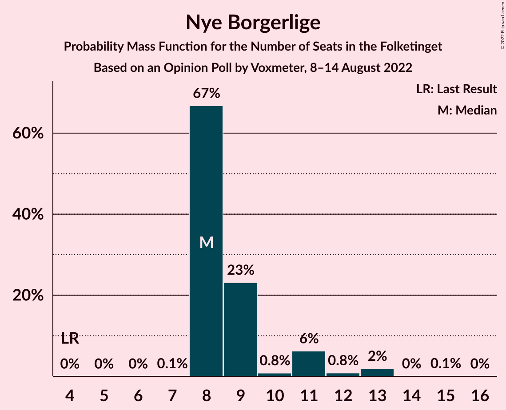
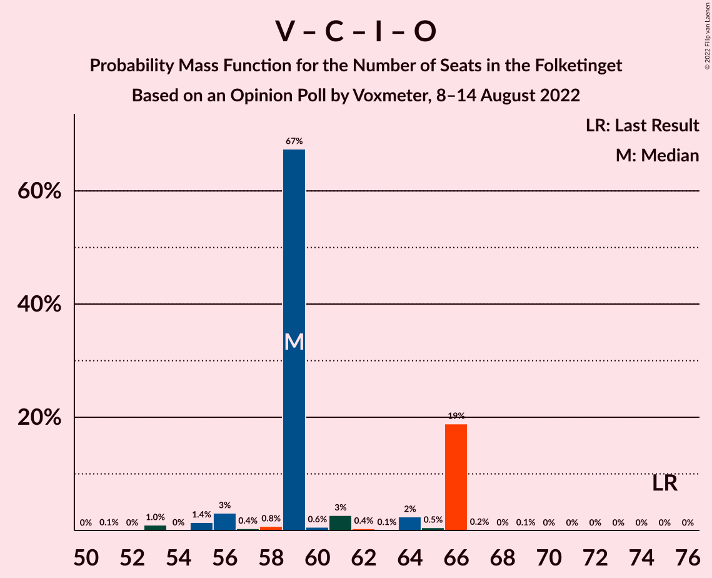

# Opinion Poll by Voxmeter, 8–14 August 2022

<a href="#voting-intentions">Voting Intentions</a> | <a href="#seats">Seats</a> | <a href="#coalitions">Coalitions</a> | <a href="#technical-information">Technical Information</a>

## Voting Intentions

### Confidence Intervals

| Party | Last Result | Poll Result | 80% Confidence Interval | 90% Confidence Interval | 95% Confidence Interval | 99% Confidence Interval |
|:-----:|:-----------:|:-----------:|:-----------------------:|:-----------------------:|:-----------------------:|:-----------------------:|
| Socialdemokraterne | 25.9% | 23.9% | 22.3–25.6% |21.8–26.1% |21.4–26.6% |20.6–27.4% |
| Venstre | 23.4% | 13.4% | 12.1–14.9% |11.8–15.3% |11.5–15.6% |10.9–16.3% |
| Det Konservative Folkeparti | 6.6% | 13.3% | 12.1–14.8% |11.7–15.2% |11.4–15.5% |10.8–16.2% |
| Danmarksdemokraterne | 0.0% | 9.7% | 8.6–11.0% |8.3–11.3% |8.0–11.7% |7.6–12.3% |
| Socialistisk Folkeparti | 7.7% | 8.5% | 7.5–9.7% |7.2–10.0% |6.9–10.3% |6.5–10.9% |
| Enhedslisten–De Rød-Grønne | 6.9% | 8.1% | 7.1–9.3% |6.8–9.6% |6.6–9.9% |6.1–10.5% |
| Radikale Venstre | 8.6% | 6.3% | 5.4–7.3% |5.2–7.7% |5.0–7.9% |4.6–8.5% |
| Nye Borgerlige | 2.4% | 5.8% | 5.0–6.8% |4.7–7.1% |4.5–7.4% |4.2–7.9% |
| Liberal Alliance | 2.3% | 4.3% | 3.6–5.2% |3.4–5.5% |3.2–5.7% |2.9–6.2% |
| Dansk Folkeparti | 8.7% | 2.5% | 2.0–3.2% |1.8–3.4% |1.7–3.6% |1.5–4.0% |
| Moderaterne | 0.0% | 2.2% | 1.7–2.9% |1.6–3.1% |1.5–3.3% |1.3–3.6% |
| Kristendemokraterne | 1.7% | 1.0% | 0.7–1.6% |0.7–1.7% |0.6–1.9% |0.5–2.2% |
| Alternativet | 3.0% | 0.5% | 0.3–0.9% |0.2–1.0% |0.2–1.1% |0.1–1.3% |
| Frie Grønne | 0.0% | 0.2% | 0.1–0.5% |0.1–0.6% |0.0–0.7% |0.0–0.9% |
| Veganerpartiet | 0.0% | 0.1% | 0.0–0.4% |0.0–0.5% |0.0–0.5% |0.0–0.7% |

*Note:* The poll result column reflects the actual value used in the calculations. Published results may vary slightly, and in addition be rounded to fewer digits.

## Seats

### Confidence Intervals

| Party | Last Result | Median | 80% Confidence Interval | 90% Confidence Interval | 95% Confidence Interval | 99% Confidence Interval |
|:-----:|:-----------:|:------:|:-----------------------:|:-----------------------:|:-----------------------:|:-----------------------:|
| <a href="#socialdemokraterne">Socialdemokraterne</a> | 48 | 43 | 40–43 |39–43 |38–44 |36–47 |
| <a href="#venstre">Venstre</a> | 43 | 24 | 24–27 |24–27 |22–27 |20–28 |
| <a href="#det-konservative-folkeparti">Det Konservative Folkeparti</a> | 12 | 25 | 25–26 |24–26 |20–26 |19–27 |
| <a href="#danmarksdemokraterne">Danmarksdemokraterne</a> | 0 | 18 | 17–18 |16–18 |16–19 |15–20 |
| <a href="#socialistisk-folkeparti">Socialistisk Folkeparti</a> | 14 | 14 | 14–19 |14–19 |14–19 |12–19 |
| <a href="#enhedslisten–de-rød-grønne">Enhedslisten–De Rød-Grønne</a> | 13 | 18 | 11–18 |11–18 |11–18 |11–18 |
| <a href="#radikale-venstre">Radikale Venstre</a> | 16 | 11 | 9–12 |9–15 |9–15 |8–15 |
| <a href="#nye-borgerlige">Nye Borgerlige</a> | 4 | 8 | 8–9 |8–11 |8–12 |8–13 |
| <a href="#liberal-alliance">Liberal Alliance</a> | 4 | 6 | 6–8 |6–9 |5–10 |5–11 |
| <a href="#dansk-folkeparti">Dansk Folkeparti</a> | 16 | 4 | 4–5 |4–5 |0–5 |0–6 |
| <a href="#moderaterne">Moderaterne</a> | 0 | 4 | 4 |4–5 |0–6 |0–6 |
| <a href="#kristendemokraterne">Kristendemokraterne</a> | 0 | 0 | 0 |0 |0 |0 |
| <a href="#alternativet">Alternativet</a> | 5 | 0 | 0 |0 |0 |0 |
| <a href="#frie-grønne">Frie Grønne</a> | 0 | 0 | 0 |0 |0 |0 |
| <a href="#veganerpartiet">Veganerpartiet</a> | 0 | 0 | 0 |0 |0 |0 |

### Socialdemokraterne

*For a full overview of the results for this party, see the [Socialdemokraterne](party-socialdemokraterne.html) page.*

| Number of Seats | Probability | Accumulated | Special Marks |
|:---------------:|:-----------:|:-----------:|:-------------:|
| 36 | 2% | 100% |  |
| 37 | 0.1% | 98% |  |
| 38 | 3% | 98% |  |
| 39 | 2% | 95% |  |
| 40 | 17% | 93% |  |
| 41 | 2% | 77% |  |
| 42 | 4% | 75% |  |
| 43 | 69% | 71% | Median |
| 44 | 1.3% | 3% |  |
| 45 | 0.4% | 1.3% |  |
| 46 | 0.3% | 1.0% |  |
| 47 | 0.3% | 0.7% |  |
| 48 | 0% | 0.3% | Last Result |
| 49 | 0.1% | 0.3% |  |
| 50 | 0% | 0.2% |  |
| 51 | 0.2% | 0.2% |  |
| 52 | 0% | 0% |  |

### Venstre

*For a full overview of the results for this party, see the [Venstre](party-venstre.html) page.*

| Number of Seats | Probability | Accumulated | Special Marks |
|:---------------:|:-----------:|:-----------:|:-------------:|
| 17 | 0.1% | 100% |  |
| 18 | 0% | 99.9% |  |
| 19 | 0.3% | 99.9% |  |
| 20 | 0.5% | 99.7% |  |
| 21 | 1.1% | 99.1% |  |
| 22 | 1.3% | 98% |  |
| 23 | 0.5% | 97% |  |
| 24 | 70% | 96% | Median |
| 25 | 4% | 26% |  |
| 26 | 2% | 23% |  |
| 27 | 20% | 21% |  |
| 28 | 0.6% | 1.0% |  |
| 29 | 0.3% | 0.4% |  |
| 30 | 0% | 0.1% |  |
| 31 | 0% | 0.1% |  |
| 32 | 0.1% | 0.1% |  |
| 33 | 0% | 0% |  |
| 34 | 0% | 0% |  |
| 35 | 0% | 0% |  |
| 36 | 0% | 0% |  |
| 37 | 0% | 0% |  |
| 38 | 0% | 0% |  |
| 39 | 0% | 0% |  |
| 40 | 0% | 0% |  |
| 41 | 0% | 0% |  |
| 42 | 0% | 0% |  |
| 43 | 0% | 0% | Last Result |

### Det Konservative Folkeparti

*For a full overview of the results for this party, see the [Det Konservative Folkeparti](party-detkonservativefolkeparti.html) page.*

| Number of Seats | Probability | Accumulated | Special Marks |
|:---------------:|:-----------:|:-----------:|:-------------:|
| 12 | 0% | 100% | Last Result |
| 13 | 0% | 100% |  |
| 14 | 0% | 100% |  |
| 15 | 0% | 100% |  |
| 16 | 0% | 100% |  |
| 17 | 0% | 100% |  |
| 18 | 0.1% | 100% |  |
| 19 | 2% | 99.9% |  |
| 20 | 0.2% | 98% |  |
| 21 | 0.2% | 97% |  |
| 22 | 0.5% | 97% |  |
| 23 | 0.5% | 97% |  |
| 24 | 4% | 96% |  |
| 25 | 67% | 92% | Median |
| 26 | 24% | 25% |  |
| 27 | 0.7% | 1.0% |  |
| 28 | 0.1% | 0.3% |  |
| 29 | 0.2% | 0.2% |  |
| 30 | 0% | 0% |  |

### Danmarksdemokraterne

*For a full overview of the results for this party, see the [Danmarksdemokraterne](party-danmarksdemokraterne.html) page.*

| Number of Seats | Probability | Accumulated | Special Marks |
|:---------------:|:-----------:|:-----------:|:-------------:|
| 0 | 0% | 100% | Last Result |
| 1 | 0% | 100% |  |
| 2 | 0% | 100% |  |
| 3 | 0% | 100% |  |
| 4 | 0% | 100% |  |
| 5 | 0% | 100% |  |
| 6 | 0% | 100% |  |
| 7 | 0% | 100% |  |
| 8 | 0% | 100% |  |
| 9 | 0% | 100% |  |
| 10 | 0% | 100% |  |
| 11 | 0% | 100% |  |
| 12 | 0% | 100% |  |
| 13 | 0.1% | 100% |  |
| 14 | 0.1% | 99.9% |  |
| 15 | 2% | 99.8% |  |
| 16 | 4% | 98% |  |
| 17 | 20% | 95% |  |
| 18 | 71% | 74% | Median |
| 19 | 2% | 3% |  |
| 20 | 0.9% | 1.3% |  |
| 21 | 0.3% | 0.4% |  |
| 22 | 0% | 0.1% |  |
| 23 | 0.1% | 0.1% |  |
| 24 | 0% | 0% |  |

### Socialistisk Folkeparti

*For a full overview of the results for this party, see the [Socialistisk Folkeparti](party-socialistiskfolkeparti.html) page.*

| Number of Seats | Probability | Accumulated | Special Marks |
|:---------------:|:-----------:|:-----------:|:-------------:|
| 11 | 0.3% | 100% |  |
| 12 | 0.3% | 99.7% |  |
| 13 | 2% | 99.4% |  |
| 14 | 69% | 98% | Last Result, Median |
| 15 | 9% | 29% |  |
| 16 | 2% | 21% |  |
| 17 | 0.5% | 19% |  |
| 18 | 1.0% | 18% |  |
| 19 | 17% | 17% |  |
| 20 | 0% | 0% |  |

### Enhedslisten–De Rød-Grønne

*For a full overview of the results for this party, see the [Enhedslisten–De Rød-Grønne](party-enhedslisten–derød-grønne.html) page.*

| Number of Seats | Probability | Accumulated | Special Marks |
|:---------------:|:-----------:|:-----------:|:-------------:|
| 10 | 0.1% | 100% |  |
| 11 | 17% | 99.9% |  |
| 12 | 0.7% | 83% |  |
| 13 | 2% | 83% | Last Result |
| 14 | 2% | 81% |  |
| 15 | 3% | 79% |  |
| 16 | 6% | 76% |  |
| 17 | 3% | 71% |  |
| 18 | 68% | 68% | Median |
| 19 | 0.1% | 0.1% |  |
| 20 | 0% | 0% |  |

### Radikale Venstre

*For a full overview of the results for this party, see the [Radikale Venstre](party-radikalevenstre.html) page.*

| Number of Seats | Probability | Accumulated | Special Marks |
|:---------------:|:-----------:|:-----------:|:-------------:|
| 7 | 0.1% | 100% |  |
| 8 | 0.6% | 99.9% |  |
| 9 | 20% | 99.3% |  |
| 10 | 2% | 80% |  |
| 11 | 66% | 77% | Median |
| 12 | 4% | 11% |  |
| 13 | 0.4% | 7% |  |
| 14 | 0.2% | 7% |  |
| 15 | 6% | 6% |  |
| 16 | 0.4% | 0.4% | Last Result |
| 17 | 0% | 0% |  |

### Nye Borgerlige

*For a full overview of the results for this party, see the [Nye Borgerlige](party-nyeborgerlige.html) page.*

| Number of Seats | Probability | Accumulated | Special Marks |
|:---------------:|:-----------:|:-----------:|:-------------:|
| 4 | 0% | 100% | Last Result |
| 5 | 0% | 100% |  |
| 6 | 0% | 100% |  |
| 7 | 0.1% | 100% |  |
| 8 | 67% | 99.9% | Median |
| 9 | 23% | 33% |  |
| 10 | 0.8% | 10% |  |
| 11 | 6% | 9% |  |
| 12 | 0.8% | 3% |  |
| 13 | 2% | 2% |  |
| 14 | 0% | 0.2% |  |
| 15 | 0.1% | 0.1% |  |
| 16 | 0% | 0% |  |

### Liberal Alliance

*For a full overview of the results for this party, see the [Liberal Alliance](party-liberalalliance.html) page.*

| Number of Seats | Probability | Accumulated | Special Marks |
|:---------------:|:-----------:|:-----------:|:-------------:|
| 4 | 0% | 100% | Last Result |
| 5 | 4% | 100% |  |
| 6 | 69% | 96% | Median |
| 7 | 3% | 28% |  |
| 8 | 19% | 25% |  |
| 9 | 3% | 6% |  |
| 10 | 0.2% | 3% |  |
| 11 | 2% | 2% |  |
| 12 | 0% | 0.1% |  |
| 13 | 0% | 0% |  |

### Dansk Folkeparti

*For a full overview of the results for this party, see the [Dansk Folkeparti](party-danskfolkeparti.html) page.*

| Number of Seats | Probability | Accumulated | Special Marks |
|:---------------:|:-----------:|:-----------:|:-------------:|
| 0 | 4% | 100% |  |
| 1 | 0% | 96% |  |
| 2 | 0% | 96% |  |
| 3 | 0% | 96% |  |
| 4 | 72% | 96% | Median |
| 5 | 22% | 24% |  |
| 6 | 2% | 2% |  |
| 7 | 0.1% | 0.2% |  |
| 8 | 0.1% | 0.1% |  |
| 9 | 0% | 0% |  |
| 10 | 0% | 0% |  |
| 11 | 0% | 0% |  |
| 12 | 0% | 0% |  |
| 13 | 0% | 0% |  |
| 14 | 0% | 0% |  |
| 15 | 0% | 0% |  |
| 16 | 0% | 0% | Last Result |

### Moderaterne

*For a full overview of the results for this party, see the [Moderaterne](party-moderaterne.html) page.*

| Number of Seats | Probability | Accumulated | Special Marks |
|:---------------:|:-----------:|:-----------:|:-------------:|
| 0 | 4% | 100% | Last Result |
| 1 | 0% | 96% |  |
| 2 | 0% | 96% |  |
| 3 | 0% | 96% |  |
| 4 | 91% | 96% | Median |
| 5 | 2% | 5% |  |
| 6 | 3% | 3% |  |
| 7 | 0.1% | 0.1% |  |
| 8 | 0% | 0% |  |

### Kristendemokraterne

*For a full overview of the results for this party, see the [Kristendemokraterne](party-kristendemokraterne.html) page.*

| Number of Seats | Probability | Accumulated | Special Marks |
|:---------------:|:-----------:|:-----------:|:-------------:|
| 0 | 99.8% | 100% | Last Result, Median |
| 1 | 0% | 0.2% |  |
| 2 | 0% | 0.2% |  |
| 3 | 0% | 0.2% |  |
| 4 | 0.1% | 0.2% |  |
| 5 | 0% | 0.1% |  |
| 6 | 0.1% | 0.1% |  |
| 7 | 0% | 0% |  |

### Alternativet

*For a full overview of the results for this party, see the [Alternativet](party-alternativet.html) page.*

| Number of Seats | Probability | Accumulated | Special Marks |
|:---------------:|:-----------:|:-----------:|:-------------:|
| 0 | 100% | 100% | Median |
| 1 | 0% | 0% |  |
| 2 | 0% | 0% |  |
| 3 | 0% | 0% |  |
| 4 | 0% | 0% |  |
| 5 | 0% | 0% | Last Result |

### Frie Grønne

*For a full overview of the results for this party, see the [Frie Grønne](party-friegrønne.html) page.*

| Number of Seats | Probability | Accumulated | Special Marks |
|:---------------:|:-----------:|:-----------:|:-------------:|
| 0 | 100% | 100% | Last Result, Median |

### Veganerpartiet

*For a full overview of the results for this party, see the [Veganerpartiet](party-veganerpartiet.html) page.*

| Number of Seats | Probability | Accumulated | Special Marks |
|:---------------:|:-----------:|:-----------:|:-------------:|
| 0 | 100% | 100% | Last Result, Median |

## Coalitions

### Confidence Intervals

| Coalition | Last Result | Median | Majority? | 80% Confidence Interval | 90% Confidence Interval | 95% Confidence Interval | 99% Confidence Interval |
|:---------:|:-----------:|:------:|:---------:|:-----------------------:|:-----------------------:|:-----------------------:|:-----------------------:|
| Venstre – Det Konservative Folkeparti – Danmarksdemokraterne – Nye Borgerlige – Liberal Alliance – Dansk Folkeparti – Kristendemokraterne | 79 | 85 | 24% | 85–92 | 83–92 | 83–93 | 81–93 |
| Socialdemokraterne – Socialistisk Folkeparti – Enhedslisten–De Rød-Grønne – Radikale Venstre – Alternativet | 96 | 86 | 0.2% | 79–86 | 79–87 | 79–88 | 78–88 |
| Socialdemokraterne – Socialistisk Folkeparti – Enhedslisten–De Rød-Grønne – Radikale Venstre | 91 | 86 | 0.2% | 79–86 | 79–87 | 79–88 | 78–88 |
| Socialdemokraterne – Socialistisk Folkeparti – Enhedslisten–De Rød-Grønne – Alternativet | 80 | 75 | 0% | 70–75 | 68–75 | 68–75 | 66–77 |
| Socialdemokraterne – Socialistisk Folkeparti – Enhedslisten–De Rød-Grønne | 75 | 75 | 0% | 70–75 | 68–75 | 68–75 | 66–77 |
| Venstre – Det Konservative Folkeparti – Nye Borgerlige – Liberal Alliance – Dansk Folkeparti – Kristendemokraterne | 79 | 67 | 0% | 67–75 | 67–75 | 66–75 | 64–77 |
| Venstre – Det Konservative Folkeparti – Nye Borgerlige – Liberal Alliance – Dansk Folkeparti | 79 | 67 | 0% | 67–75 | 67–75 | 66–75 | 64–77 |
| Socialdemokraterne – Socialistisk Folkeparti – Radikale Venstre | 78 | 68 | 0% | 68 | 67–71 | 63–72 | 62–73 |
| Venstre – Det Konservative Folkeparti – Liberal Alliance – Dansk Folkeparti – Kristendemokraterne | 75 | 59 | 0% | 59–66 | 56–66 | 55–66 | 53–66 |
| Venstre – Det Konservative Folkeparti – Liberal Alliance – Dansk Folkeparti | 75 | 59 | 0% | 59–66 | 56–66 | 55–66 | 53–66 |
| Venstre – Det Konservative Folkeparti – Liberal Alliance | 59 | 55 | 0% | 55–61 | 55–61 | 51–62 | 48–62 |
| Socialdemokraterne – Radikale Venstre | 64 | 54 | 0% | 49–54 | 49–55 | 48–57 | 48–59 |
| Venstre – Det Konservative Folkeparti | 55 | 49 | 0% | 49–53 | 48–53 | 45–53 | 40–54 |
| Venstre | 43 | 24 | 0% | 24–27 | 24–27 | 22–27 | 20–28 |

### Venstre – Det Konservative Folkeparti – Danmarksdemokraterne – Nye Borgerlige – Liberal Alliance – Dansk Folkeparti – Kristendemokraterne

| Number of Seats | Probability | Accumulated | Special Marks |
|:---------------:|:-----------:|:-----------:|:-------------:|
| 79 | 0% | 100% | Last Result |
| 80 | 0.1% | 100% |  |
| 81 | 1.0% | 99.9% |  |
| 82 | 0% | 98.8% |  |
| 83 | 5% | 98.8% |  |
| 84 | 0.1% | 94% |  |
| 85 | 67% | 94% | Median |
| 86 | 0.4% | 27% |  |
| 87 | 1.3% | 26% |  |
| 88 | 0.6% | 25% |  |
| 89 | 0.1% | 25% |  |
| 90 | 0.3% | 24% | Majority |
| 91 | 3% | 24% |  |
| 92 | 17% | 21% |  |
| 93 | 4% | 4% |  |
| 94 | 0.1% | 0.3% |  |
| 95 | 0.1% | 0.2% |  |
| 96 | 0% | 0.1% |  |
| 97 | 0.1% | 0.1% |  |
| 98 | 0% | 0% |  |

### Socialdemokraterne – Socialistisk Folkeparti – Enhedslisten–De Rød-Grønne – Radikale Venstre – Alternativet

| Number of Seats | Probability | Accumulated | Special Marks |
|:---------------:|:-----------:|:-----------:|:-------------:|
| 74 | 0.1% | 100% |  |
| 75 | 0% | 99.9% |  |
| 76 | 0% | 99.9% |  |
| 77 | 0.1% | 99.9% |  |
| 78 | 2% | 99.8% |  |
| 79 | 17% | 98% |  |
| 80 | 2% | 81% |  |
| 81 | 0.1% | 79% |  |
| 82 | 3% | 79% |  |
| 83 | 1.0% | 75% |  |
| 84 | 1.0% | 74% |  |
| 85 | 0.5% | 73% |  |
| 86 | 66% | 73% | Median |
| 87 | 2% | 6% |  |
| 88 | 4% | 4% |  |
| 89 | 0.2% | 0.4% |  |
| 90 | 0.2% | 0.2% | Majority |
| 91 | 0% | 0% |  |
| 92 | 0% | 0% |  |
| 93 | 0% | 0% |  |
| 94 | 0% | 0% |  |
| 95 | 0% | 0% |  |
| 96 | 0% | 0% | Last Result |

### Socialdemokraterne – Socialistisk Folkeparti – Enhedslisten–De Rød-Grønne – Radikale Venstre

| Number of Seats | Probability | Accumulated | Special Marks |
|:---------------:|:-----------:|:-----------:|:-------------:|
| 74 | 0.1% | 100% |  |
| 75 | 0% | 99.9% |  |
| 76 | 0% | 99.9% |  |
| 77 | 0.1% | 99.9% |  |
| 78 | 2% | 99.8% |  |
| 79 | 17% | 98% |  |
| 80 | 2% | 81% |  |
| 81 | 0.1% | 79% |  |
| 82 | 3% | 79% |  |
| 83 | 1.0% | 75% |  |
| 84 | 1.0% | 74% |  |
| 85 | 0.5% | 73% |  |
| 86 | 66% | 73% | Median |
| 87 | 2% | 6% |  |
| 88 | 4% | 4% |  |
| 89 | 0.2% | 0.4% |  |
| 90 | 0.2% | 0.2% | Majority |
| 91 | 0% | 0% | Last Result |

### Socialdemokraterne – Socialistisk Folkeparti – Enhedslisten–De Rød-Grønne – Alternativet

| Number of Seats | Probability | Accumulated | Special Marks |
|:---------------:|:-----------:|:-----------:|:-------------:|
| 64 | 0.1% | 100% |  |
| 65 | 0% | 99.9% |  |
| 66 | 0.4% | 99.9% |  |
| 67 | 1.5% | 99.5% |  |
| 68 | 4% | 98% |  |
| 69 | 0.8% | 94% |  |
| 70 | 17% | 93% |  |
| 71 | 0.1% | 76% |  |
| 72 | 0.2% | 76% |  |
| 73 | 6% | 76% |  |
| 74 | 0.5% | 70% |  |
| 75 | 68% | 69% | Median |
| 76 | 0.6% | 1.3% |  |
| 77 | 0.5% | 0.7% |  |
| 78 | 0.1% | 0.2% |  |
| 79 | 0% | 0.1% |  |
| 80 | 0% | 0.1% | Last Result |
| 81 | 0% | 0% |  |

### Socialdemokraterne – Socialistisk Folkeparti – Enhedslisten–De Rød-Grønne

| Number of Seats | Probability | Accumulated | Special Marks |
|:---------------:|:-----------:|:-----------:|:-------------:|
| 64 | 0.1% | 100% |  |
| 65 | 0% | 99.9% |  |
| 66 | 0.4% | 99.9% |  |
| 67 | 1.5% | 99.5% |  |
| 68 | 4% | 98% |  |
| 69 | 0.8% | 94% |  |
| 70 | 17% | 93% |  |
| 71 | 0.2% | 76% |  |
| 72 | 0.2% | 76% |  |
| 73 | 6% | 76% |  |
| 74 | 0.5% | 70% |  |
| 75 | 68% | 69% | Last Result, Median |
| 76 | 0.6% | 1.3% |  |
| 77 | 0.5% | 0.7% |  |
| 78 | 0.1% | 0.2% |  |
| 79 | 0% | 0.1% |  |
| 80 | 0% | 0.1% |  |
| 81 | 0% | 0% |  |

### Venstre – Det Konservative Folkeparti – Nye Borgerlige – Liberal Alliance – Dansk Folkeparti – Kristendemokraterne

| Number of Seats | Probability | Accumulated | Special Marks |
|:---------------:|:-----------:|:-----------:|:-------------:|
| 63 | 0% | 100% |  |
| 64 | 1.0% | 99.9% |  |
| 65 | 0.1% | 98.9% |  |
| 66 | 2% | 98.8% |  |
| 67 | 69% | 97% | Median |
| 68 | 0.8% | 28% |  |
| 69 | 0.5% | 27% |  |
| 70 | 2% | 27% |  |
| 71 | 0.1% | 24% |  |
| 72 | 0.1% | 24% |  |
| 73 | 3% | 24% |  |
| 74 | 1.3% | 21% |  |
| 75 | 19% | 20% |  |
| 76 | 0.2% | 0.8% |  |
| 77 | 0.5% | 0.6% |  |
| 78 | 0.1% | 0.1% |  |
| 79 | 0% | 0.1% | Last Result |
| 80 | 0% | 0.1% |  |
| 81 | 0% | 0% |  |

### Venstre – Det Konservative Folkeparti – Nye Borgerlige – Liberal Alliance – Dansk Folkeparti

| Number of Seats | Probability | Accumulated | Special Marks |
|:---------------:|:-----------:|:-----------:|:-------------:|
| 62 | 0% | 100% |  |
| 63 | 0% | 99.9% |  |
| 64 | 1.0% | 99.9% |  |
| 65 | 0.1% | 98.9% |  |
| 66 | 2% | 98.8% |  |
| 67 | 69% | 97% | Median |
| 68 | 0.8% | 28% |  |
| 69 | 0.5% | 27% |  |
| 70 | 2% | 26% |  |
| 71 | 0.1% | 24% |  |
| 72 | 0.1% | 24% |  |
| 73 | 3% | 24% |  |
| 74 | 1.4% | 21% |  |
| 75 | 19% | 20% |  |
| 76 | 0.2% | 0.7% |  |
| 77 | 0.5% | 0.6% |  |
| 78 | 0% | 0.1% |  |
| 79 | 0% | 0.1% | Last Result |
| 80 | 0% | 0.1% |  |
| 81 | 0% | 0% |  |

### Socialdemokraterne – Socialistisk Folkeparti – Radikale Venstre

| Number of Seats | Probability | Accumulated | Special Marks |
|:---------------:|:-----------:|:-----------:|:-------------:|
| 62 | 2% | 100% |  |
| 63 | 2% | 98% |  |
| 64 | 0.1% | 96% |  |
| 65 | 0.4% | 96% |  |
| 66 | 0.1% | 96% |  |
| 67 | 3% | 95% |  |
| 68 | 84% | 93% | Median |
| 69 | 2% | 9% |  |
| 70 | 0.8% | 7% |  |
| 71 | 1.2% | 6% |  |
| 72 | 4% | 5% |  |
| 73 | 0.4% | 0.7% |  |
| 74 | 0.1% | 0.4% |  |
| 75 | 0.2% | 0.3% |  |
| 76 | 0% | 0.1% |  |
| 77 | 0% | 0% |  |
| 78 | 0% | 0% | Last Result |

### Venstre – Det Konservative Folkeparti – Liberal Alliance – Dansk Folkeparti – Kristendemokraterne

| Number of Seats | Probability | Accumulated | Special Marks |
|:---------------:|:-----------:|:-----------:|:-------------:|
| 52 | 0% | 100% |  |
| 53 | 1.0% | 99.9% |  |
| 54 | 0% | 99.0% |  |
| 55 | 1.5% | 98.9% |  |
| 56 | 3% | 97% |  |
| 57 | 0.4% | 94% |  |
| 58 | 0.7% | 94% |  |
| 59 | 67% | 93% | Median |
| 60 | 0.6% | 26% |  |
| 61 | 3% | 25% |  |
| 62 | 0.4% | 23% |  |
| 63 | 0.1% | 22% |  |
| 64 | 2% | 22% |  |
| 65 | 0.5% | 20% |  |
| 66 | 19% | 19% |  |
| 67 | 0.2% | 0.3% |  |
| 68 | 0.1% | 0.2% |  |
| 69 | 0.1% | 0.1% |  |
| 70 | 0% | 0% |  |
| 71 | 0% | 0% |  |
| 72 | 0% | 0% |  |
| 73 | 0% | 0% |  |
| 74 | 0% | 0% |  |
| 75 | 0% | 0% | Last Result |

### Venstre – Det Konservative Folkeparti – Liberal Alliance – Dansk Folkeparti

| Number of Seats | Probability | Accumulated | Special Marks |
|:---------------:|:-----------:|:-----------:|:-------------:|
| 51 | 0.1% | 100% |  |
| 52 | 0% | 99.9% |  |
| 53 | 1.0% | 99.9% |  |
| 54 | 0% | 98.9% |  |
| 55 | 1.4% | 98.9% |  |
| 56 | 3% | 97% |  |
| 57 | 0.4% | 94% |  |
| 58 | 0.8% | 94% |  |
| 59 | 67% | 93% | Median |
| 60 | 0.6% | 26% |  |
| 61 | 3% | 25% |  |
| 62 | 0.4% | 23% |  |
| 63 | 0.1% | 22% |  |
| 64 | 2% | 22% |  |
| 65 | 0.5% | 20% |  |
| 66 | 19% | 19% |  |
| 67 | 0.2% | 0.3% |  |
| 68 | 0% | 0.1% |  |
| 69 | 0.1% | 0.1% |  |
| 70 | 0% | 0% |  |
| 71 | 0% | 0% |  |
| 72 | 0% | 0% |  |
| 73 | 0% | 0% |  |
| 74 | 0% | 0% |  |
| 75 | 0% | 0% | Last Result |

### Venstre – Det Konservative Folkeparti – Liberal Alliance

| Number of Seats | Probability | Accumulated | Special Marks |
|:---------------:|:-----------:|:-----------:|:-------------:|
| 48 | 1.0% | 100% |  |
| 49 | 0.1% | 99.0% |  |
| 50 | 0% | 98.9% |  |
| 51 | 1.4% | 98.9% |  |
| 52 | 0.4% | 97% |  |
| 53 | 0.6% | 97% |  |
| 54 | 0.4% | 97% |  |
| 55 | 68% | 96% | Median |
| 56 | 3% | 28% |  |
| 57 | 1.3% | 24% |  |
| 58 | 0.1% | 23% |  |
| 59 | 3% | 23% | Last Result |
| 60 | 0.5% | 20% |  |
| 61 | 17% | 19% |  |
| 62 | 2% | 3% |  |
| 63 | 0% | 0.1% |  |
| 64 | 0.1% | 0.1% |  |
| 65 | 0% | 0% |  |

### Socialdemokraterne – Radikale Venstre

| Number of Seats | Probability | Accumulated | Special Marks |
|:---------------:|:-----------:|:-----------:|:-------------:|
| 45 | 0.1% | 100% |  |
| 46 | 0% | 99.9% |  |
| 47 | 0.1% | 99.9% |  |
| 48 | 4% | 99.8% |  |
| 49 | 17% | 96% |  |
| 50 | 0.2% | 79% |  |
| 51 | 0.5% | 79% |  |
| 52 | 2% | 78% |  |
| 53 | 2% | 76% |  |
| 54 | 68% | 74% | Median |
| 55 | 0.5% | 5% |  |
| 56 | 0.2% | 5% |  |
| 57 | 3% | 5% |  |
| 58 | 0% | 2% |  |
| 59 | 1.1% | 2% |  |
| 60 | 0.4% | 0.4% |  |
| 61 | 0% | 0% |  |
| 62 | 0% | 0% |  |
| 63 | 0% | 0% |  |
| 64 | 0% | 0% | Last Result |

### Venstre – Det Konservative Folkeparti

| Number of Seats | Probability | Accumulated | Special Marks |
|:---------------:|:-----------:|:-----------:|:-------------:|
| 39 | 0% | 100% |  |
| 40 | 1.0% | 99.9% |  |
| 41 | 0% | 99.0% |  |
| 42 | 0.1% | 99.0% |  |
| 43 | 0.1% | 98.9% |  |
| 44 | 0.6% | 98.8% |  |
| 45 | 1.5% | 98% |  |
| 46 | 0.4% | 97% |  |
| 47 | 0.5% | 96% |  |
| 48 | 1.3% | 96% |  |
| 49 | 67% | 95% | Median |
| 50 | 4% | 28% |  |
| 51 | 7% | 24% |  |
| 52 | 0.2% | 17% |  |
| 53 | 17% | 17% |  |
| 54 | 0.5% | 0.7% |  |
| 55 | 0.1% | 0.2% | Last Result |
| 56 | 0.1% | 0.1% |  |
| 57 | 0% | 0% |  |

### Venstre

| Number of Seats | Probability | Accumulated | Special Marks |
|:---------------:|:-----------:|:-----------:|:-------------:|
| 17 | 0.1% | 100% |  |
| 18 | 0% | 99.9% |  |
| 19 | 0.3% | 99.9% |  |
| 20 | 0.5% | 99.7% |  |
| 21 | 1.1% | 99.1% |  |
| 22 | 1.3% | 98% |  |
| 23 | 0.5% | 97% |  |
| 24 | 70% | 96% | Median |
| 25 | 4% | 26% |  |
| 26 | 2% | 23% |  |
| 27 | 20% | 21% |  |
| 28 | 0.6% | 1.0% |  |
| 29 | 0.3% | 0.4% |  |
| 30 | 0% | 0.1% |  |
| 31 | 0% | 0.1% |  |
| 32 | 0.1% | 0.1% |  |
| 33 | 0% | 0% |  |
| 34 | 0% | 0% |  |
| 35 | 0% | 0% |  |
| 36 | 0% | 0% |  |
| 37 | 0% | 0% |  |
| 38 | 0% | 0% |  |
| 39 | 0% | 0% |  |
| 40 | 0% | 0% |  |
| 41 | 0% | 0% |  |
| 42 | 0% | 0% |  |
| 43 | 0% | 0% | Last Result |

## Technical Information

### Opinion Poll

+ **Polling firm:** Voxmeter
+ **Commissioner(s):** —
+ **Fieldwork period:** 8–14 August 2022

### Calculations

+ **Sample size:** 1051
+ **Simulations done:** 1,048,576
+ **Error estimate:** 2.73%

