# Opinion Poll by Megafon for Politiken and TV 2, 15–18 August 2022

<a href="#voting-intentions">Voting Intentions</a> | <a href="#seats">Seats</a> | <a href="#coalitions">Coalitions</a> | <a href="#technical-information">Technical Information</a>

## Voting Intentions

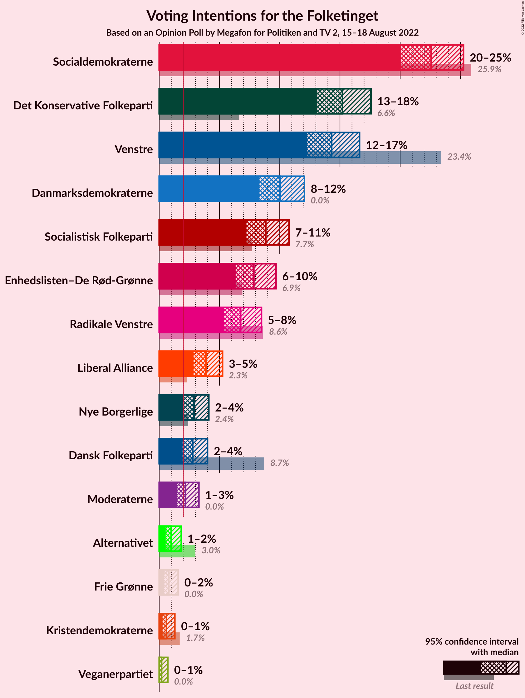

### Confidence Intervals

| Party | Last Result | Poll Result | 80% Confidence Interval | 90% Confidence Interval | 95% Confidence Interval | 99% Confidence Interval |
|:-----:|:-----------:|:-----------:|:-----------------------:|:-----------------------:|:-----------------------:|:-----------------------:|
| Socialdemokraterne | 25.9% | 22.6% | 20.9–24.3% |20.5–24.8% |20.1–25.3% |19.3–26.1% |
| Det Konservative Folkeparti | 6.6% | 15.2% | 13.8–16.8% |13.4–17.2% |13.1–17.6% |12.5–18.3% |
| Venstre | 23.4% | 14.3% | 13.0–15.8% |12.6–16.2% |12.3–16.6% |11.7–17.4% |
| Danmarksdemokraterne | 0.0% | 10.0% | 8.9–11.4% |8.6–11.7% |8.3–12.1% |7.8–12.7% |
| Socialistisk Folkeparti | 7.7% | 8.8% | 7.8–10.1% |7.5–10.5% |7.2–10.8% |6.8–11.4% |
| Enhedslisten–De Rød-Grønne | 6.9% | 7.9% | 6.9–9.1% |6.6–9.4% |6.3–9.7% |5.9–10.3% |
| Radikale Venstre | 8.6% | 6.8% | 5.8–7.9% |5.6–8.2% |5.4–8.5% |5.0–9.1% |
| Liberal Alliance | 2.3% | 3.9% | 3.2–4.8% |3.0–5.0% |2.9–5.3% |2.5–5.7% |
| Nye Borgerlige | 2.4% | 2.9% | 2.3–3.7% |2.1–3.9% |2.0–4.1% |1.8–4.5% |
| Dansk Folkeparti | 8.7% | 2.8% | 2.2–3.6% |2.1–3.8% |1.9–4.0% |1.7–4.4% |
| Moderaterne | 0.0% | 2.2% | 1.7–2.9% |1.6–3.1% |1.4–3.3% |1.2–3.7% |
| Alternativet | 3.0% | 1.0% | 0.7–1.5% |0.6–1.7% |0.5–1.8% |0.4–2.1% |
| Frie Grønne | 0.0% | 0.8% | 0.5–1.3% |0.5–1.4% |0.4–1.6% |0.3–1.8% |
| Kristendemokraterne | 1.7% | 0.6% | 0.4–1.1% |0.3–1.2% |0.3–1.3% |0.2–1.6% |
| Veganerpartiet | 0.0% | 0.2% | 0.1–0.5% |0.1–0.6% |0.1–0.7% |0.0–0.9% |

*Note:* The poll result column reflects the actual value used in the calculations. Published results may vary slightly, and in addition be rounded to fewer digits.

## Seats

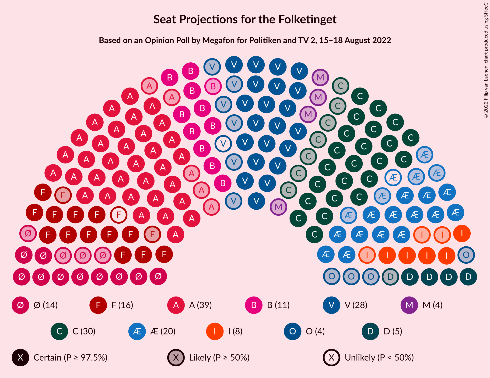

### Confidence Intervals

| Party | Last Result | Median | 80% Confidence Interval | 90% Confidence Interval | 95% Confidence Interval | 99% Confidence Interval |
|:-----:|:-----------:|:------:|:-----------------------:|:-----------------------:|:-----------------------:|:-----------------------:|
| <a href="#socialdemokraterne">Socialdemokraterne</a> | 48 | 39 | 38–41 |36–44 |34–47 |34–47 |
| <a href="#det-konservative-folkeparti">Det Konservative Folkeparti</a> | 12 | 30 | 23–31 |23–32 |23–33 |22–33 |
| <a href="#venstre">Venstre</a> | 43 | 27 | 24–28 |23–28 |21–29 |20–31 |
| <a href="#danmarksdemokraterne">Danmarksdemokraterne</a> | 0 | 19 | 16–20 |15–22 |14–22 |13–24 |
| <a href="#socialistisk-folkeparti">Socialistisk Folkeparti</a> | 14 | 15 | 13–19 |13–19 |13–20 |13–21 |
| <a href="#enhedslisten–de-rød-grønne">Enhedslisten–De Rød-Grønne</a> | 13 | 14 | 12–16 |12–16 |10–17 |10–18 |
| <a href="#radikale-venstre">Radikale Venstre</a> | 16 | 11 | 10–13 |10–15 |10–15 |9–16 |
| <a href="#liberal-alliance">Liberal Alliance</a> | 4 | 8 | 6–8 |5–9 |5–9 |5–11 |
| <a href="#nye-borgerlige">Nye Borgerlige</a> | 4 | 5 | 5–6 |4–7 |4–7 |0–8 |
| <a href="#dansk-folkeparti">Dansk Folkeparti</a> | 16 | 4 | 4–6 |4–7 |0–8 |0–9 |
| <a href="#moderaterne">Moderaterne</a> | 0 | 4 | 0–5 |0–5 |0–6 |0–6 |
| <a href="#alternativet">Alternativet</a> | 5 | 0 | 0 |0 |0 |0–4 |
| <a href="#frie-grønne">Frie Grønne</a> | 0 | 0 | 0 |0 |0 |0 |
| <a href="#kristendemokraterne">Kristendemokraterne</a> | 0 | 0 | 0 |0 |0 |0 |
| <a href="#veganerpartiet">Veganerpartiet</a> | 0 | 0 | 0 |0 |0 |0 |

### Socialdemokraterne

*For a full overview of the results for this party, see the [Socialdemokraterne](party-socialdemokraterne.html) page.*

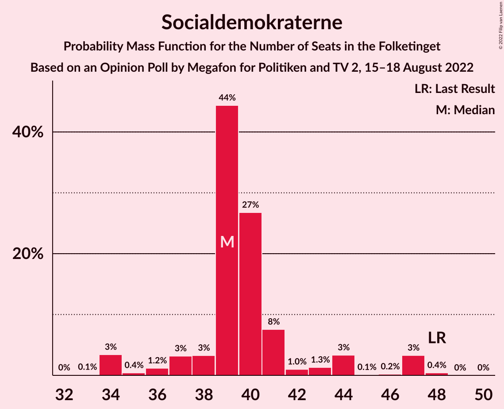

| Number of Seats | Probability | Accumulated | Special Marks |
|:---------------:|:-----------:|:-----------:|:-------------:|
| 33 | 0.1% | 100% |  |
| 34 | 3% | 99.8% |  |
| 35 | 0.4% | 96% |  |
| 36 | 1.2% | 96% |  |
| 37 | 3% | 95% |  |
| 38 | 3% | 92% |  |
| 39 | 44% | 88% | Median |
| 40 | 27% | 44% |  |
| 41 | 8% | 17% |  |
| 42 | 1.0% | 10% |  |
| 43 | 1.3% | 9% |  |
| 44 | 3% | 7% |  |
| 45 | 0.1% | 4% |  |
| 46 | 0.2% | 4% |  |
| 47 | 3% | 4% |  |
| 48 | 0.4% | 0.4% | Last Result |
| 49 | 0% | 0% |  |

### Det Konservative Folkeparti

*For a full overview of the results for this party, see the [Det Konservative Folkeparti](party-detkonservativefolkeparti.html) page.*

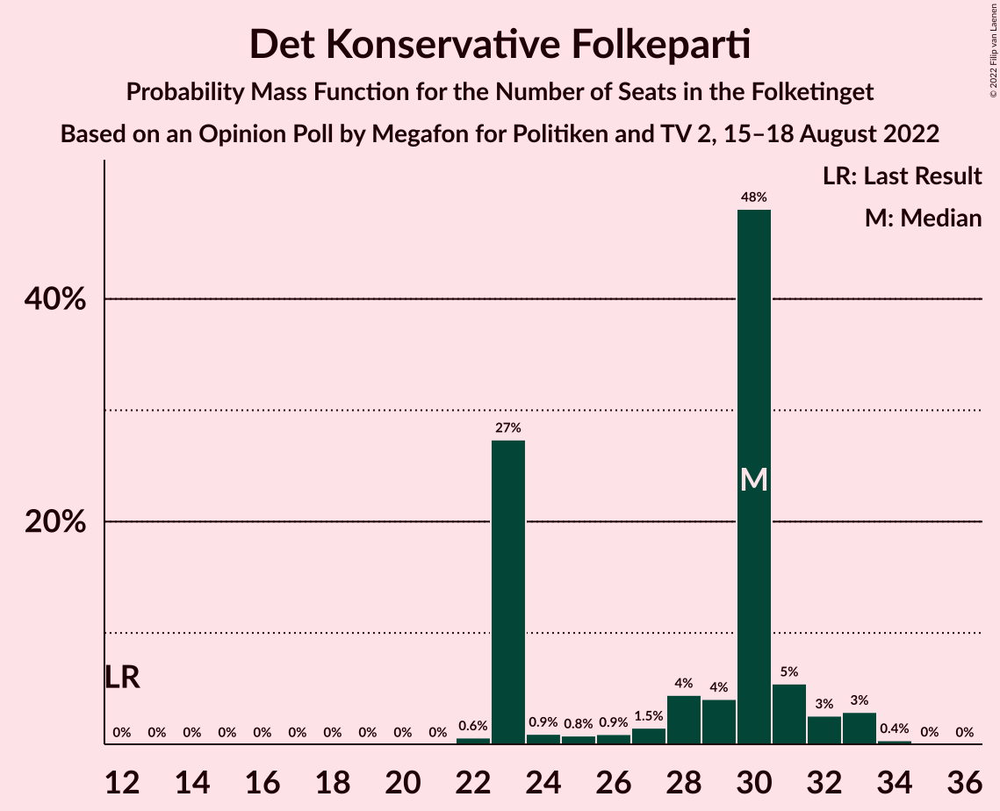

| Number of Seats | Probability | Accumulated | Special Marks |
|:---------------:|:-----------:|:-----------:|:-------------:|
| 12 | 0% | 100% | Last Result |
| 13 | 0% | 100% |  |
| 14 | 0% | 100% |  |
| 15 | 0% | 100% |  |
| 16 | 0% | 100% |  |
| 17 | 0% | 100% |  |
| 18 | 0% | 100% |  |
| 19 | 0% | 100% |  |
| 20 | 0% | 100% |  |
| 21 | 0% | 100% |  |
| 22 | 0.6% | 100% |  |
| 23 | 27% | 99.4% |  |
| 24 | 0.9% | 72% |  |
| 25 | 0.8% | 71% |  |
| 26 | 0.9% | 70% |  |
| 27 | 1.5% | 69% |  |
| 28 | 4% | 68% |  |
| 29 | 4% | 63% |  |
| 30 | 48% | 59% | Median |
| 31 | 5% | 11% |  |
| 32 | 3% | 6% |  |
| 33 | 3% | 3% |  |
| 34 | 0.4% | 0.4% |  |
| 35 | 0% | 0.1% |  |
| 36 | 0% | 0% |  |

### Venstre

*For a full overview of the results for this party, see the [Venstre](party-venstre.html) page.*

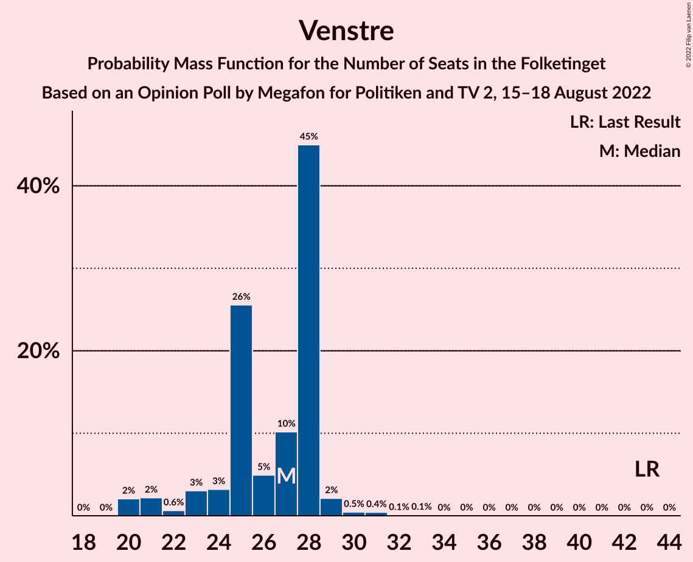

| Number of Seats | Probability | Accumulated | Special Marks |
|:---------------:|:-----------:|:-----------:|:-------------:|
| 20 | 2% | 100% |  |
| 21 | 2% | 98% |  |
| 22 | 0.6% | 96% |  |
| 23 | 3% | 95% |  |
| 24 | 3% | 92% |  |
| 25 | 26% | 89% |  |
| 26 | 5% | 63% |  |
| 27 | 10% | 58% | Median |
| 28 | 45% | 48% |  |
| 29 | 2% | 3% |  |
| 30 | 0.5% | 1.1% |  |
| 31 | 0.4% | 0.6% |  |
| 32 | 0.1% | 0.2% |  |
| 33 | 0.1% | 0.1% |  |
| 34 | 0% | 0% |  |
| 35 | 0% | 0% |  |
| 36 | 0% | 0% |  |
| 37 | 0% | 0% |  |
| 38 | 0% | 0% |  |
| 39 | 0% | 0% |  |
| 40 | 0% | 0% |  |
| 41 | 0% | 0% |  |
| 42 | 0% | 0% |  |
| 43 | 0% | 0% | Last Result |

### Danmarksdemokraterne

*For a full overview of the results for this party, see the [Danmarksdemokraterne](party-danmarksdemokraterne.html) page.*

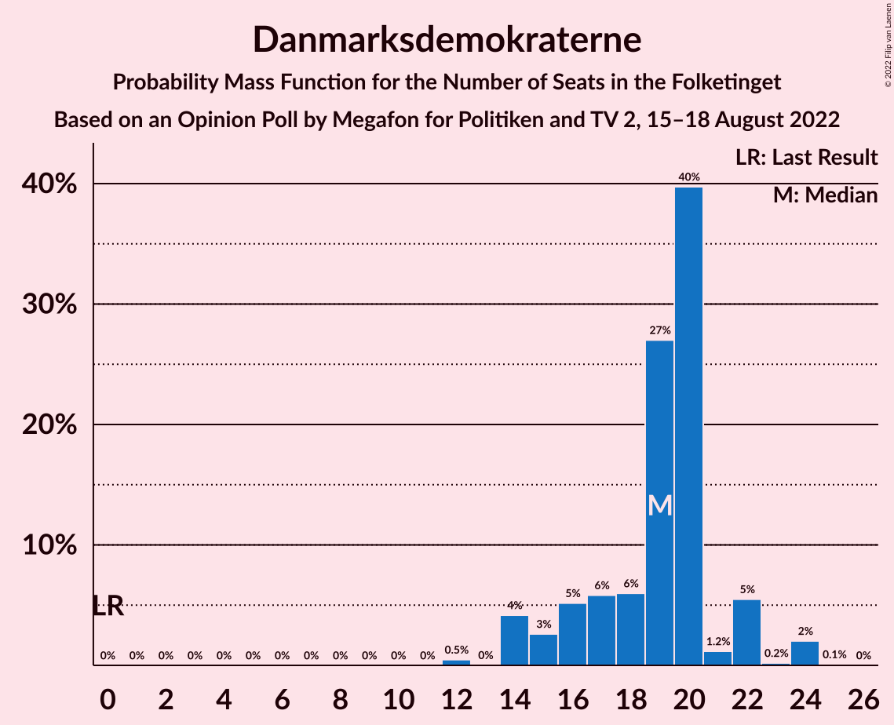

| Number of Seats | Probability | Accumulated | Special Marks |
|:---------------:|:-----------:|:-----------:|:-------------:|
| 0 | 0% | 100% | Last Result |
| 1 | 0% | 100% |  |
| 2 | 0% | 100% |  |
| 3 | 0% | 100% |  |
| 4 | 0% | 100% |  |
| 5 | 0% | 100% |  |
| 6 | 0% | 100% |  |
| 7 | 0% | 100% |  |
| 8 | 0% | 100% |  |
| 9 | 0% | 100% |  |
| 10 | 0% | 100% |  |
| 11 | 0% | 100% |  |
| 12 | 0.5% | 100% |  |
| 13 | 0% | 99.5% |  |
| 14 | 4% | 99.5% |  |
| 15 | 3% | 95% |  |
| 16 | 5% | 93% |  |
| 17 | 6% | 88% |  |
| 18 | 6% | 82% |  |
| 19 | 27% | 76% | Median |
| 20 | 40% | 49% |  |
| 21 | 1.2% | 9% |  |
| 22 | 5% | 8% |  |
| 23 | 0.2% | 2% |  |
| 24 | 2% | 2% |  |
| 25 | 0.1% | 0.1% |  |
| 26 | 0% | 0% |  |

### Socialistisk Folkeparti

*For a full overview of the results for this party, see the [Socialistisk Folkeparti](party-socialistiskfolkeparti.html) page.*

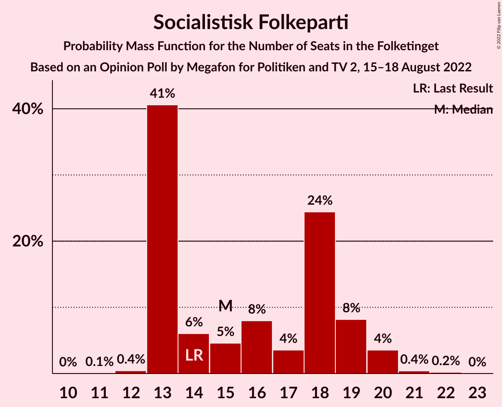

| Number of Seats | Probability | Accumulated | Special Marks |
|:---------------:|:-----------:|:-----------:|:-------------:|
| 11 | 0.1% | 100% |  |
| 12 | 0.4% | 99.9% |  |
| 13 | 41% | 99.5% |  |
| 14 | 6% | 59% | Last Result |
| 15 | 5% | 53% | Median |
| 16 | 8% | 48% |  |
| 17 | 4% | 40% |  |
| 18 | 24% | 37% |  |
| 19 | 8% | 12% |  |
| 20 | 4% | 4% |  |
| 21 | 0.4% | 0.6% |  |
| 22 | 0.2% | 0.2% |  |
| 23 | 0% | 0% |  |

### Enhedslisten–De Rød-Grønne

*For a full overview of the results for this party, see the [Enhedslisten–De Rød-Grønne](party-enhedslisten–derød-grønne.html) page.*

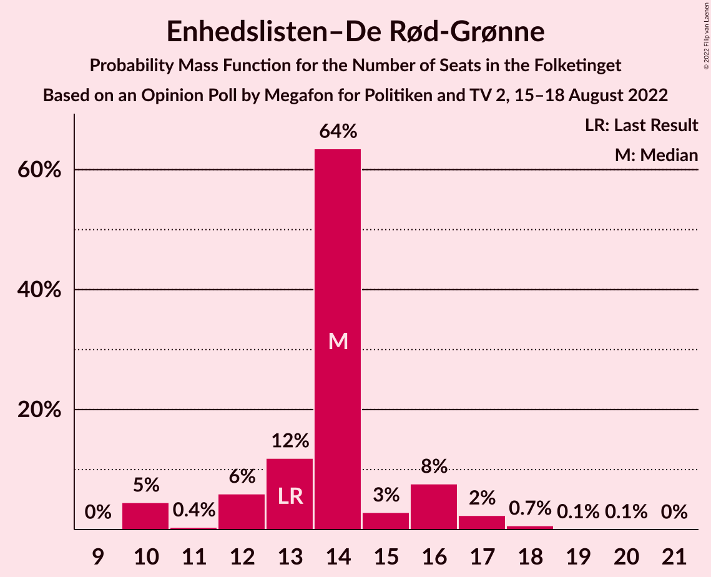

| Number of Seats | Probability | Accumulated | Special Marks |
|:---------------:|:-----------:|:-----------:|:-------------:|
| 10 | 5% | 100% |  |
| 11 | 0.4% | 95% |  |
| 12 | 6% | 95% |  |
| 13 | 12% | 89% | Last Result |
| 14 | 64% | 77% | Median |
| 15 | 3% | 14% |  |
| 16 | 8% | 11% |  |
| 17 | 2% | 3% |  |
| 18 | 0.7% | 0.8% |  |
| 19 | 0.1% | 0.2% |  |
| 20 | 0.1% | 0.1% |  |
| 21 | 0% | 0% |  |

### Radikale Venstre

*For a full overview of the results for this party, see the [Radikale Venstre](party-radikalevenstre.html) page.*

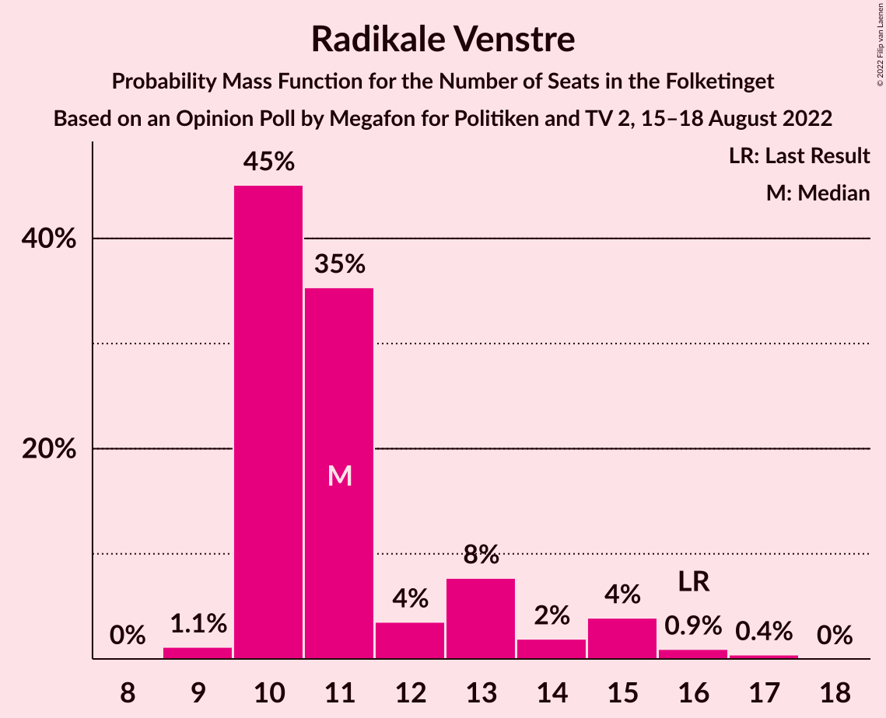

| Number of Seats | Probability | Accumulated | Special Marks |
|:---------------:|:-----------:|:-----------:|:-------------:|
| 9 | 1.1% | 100% |  |
| 10 | 45% | 98.8% |  |
| 11 | 35% | 54% | Median |
| 12 | 4% | 18% |  |
| 13 | 8% | 15% |  |
| 14 | 2% | 7% |  |
| 15 | 4% | 5% |  |
| 16 | 0.9% | 1.4% | Last Result |
| 17 | 0.4% | 0.4% |  |
| 18 | 0% | 0% |  |

### Liberal Alliance

*For a full overview of the results for this party, see the [Liberal Alliance](party-liberalalliance.html) page.*

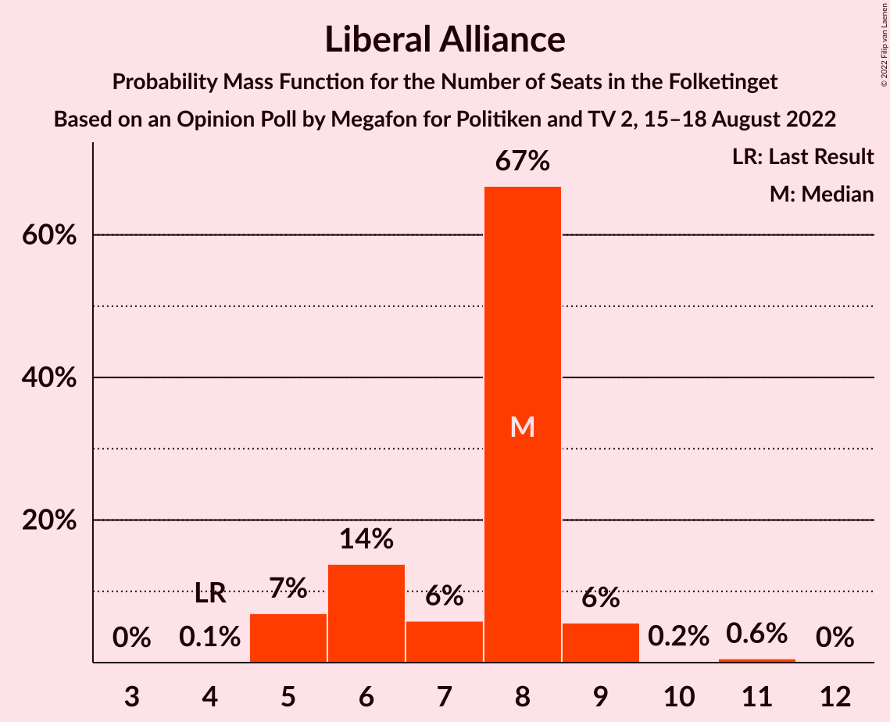

| Number of Seats | Probability | Accumulated | Special Marks |
|:---------------:|:-----------:|:-----------:|:-------------:|
| 4 | 0.1% | 100% | Last Result |
| 5 | 7% | 99.9% |  |
| 6 | 14% | 93% |  |
| 7 | 6% | 79% |  |
| 8 | 67% | 73% | Median |
| 9 | 6% | 6% |  |
| 10 | 0.2% | 0.8% |  |
| 11 | 0.6% | 0.6% |  |
| 12 | 0% | 0% |  |

### Nye Borgerlige

*For a full overview of the results for this party, see the [Nye Borgerlige](party-nyeborgerlige.html) page.*

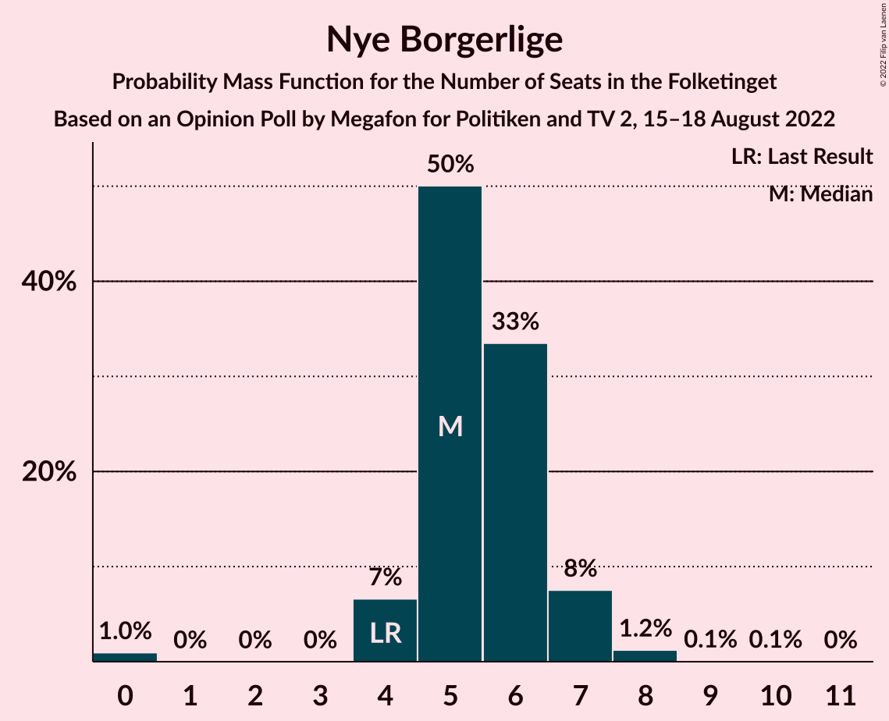

| Number of Seats | Probability | Accumulated | Special Marks |
|:---------------:|:-----------:|:-----------:|:-------------:|
| 0 | 1.0% | 100% |  |
| 1 | 0% | 99.0% |  |
| 2 | 0% | 99.0% |  |
| 3 | 0% | 99.0% |  |
| 4 | 7% | 99.0% | Last Result |
| 5 | 50% | 92% | Median |
| 6 | 33% | 42% |  |
| 7 | 8% | 9% |  |
| 8 | 1.2% | 1.4% |  |
| 9 | 0.1% | 0.1% |  |
| 10 | 0.1% | 0.1% |  |
| 11 | 0% | 0% |  |

### Dansk Folkeparti

*For a full overview of the results for this party, see the [Dansk Folkeparti](party-danskfolkeparti.html) page.*

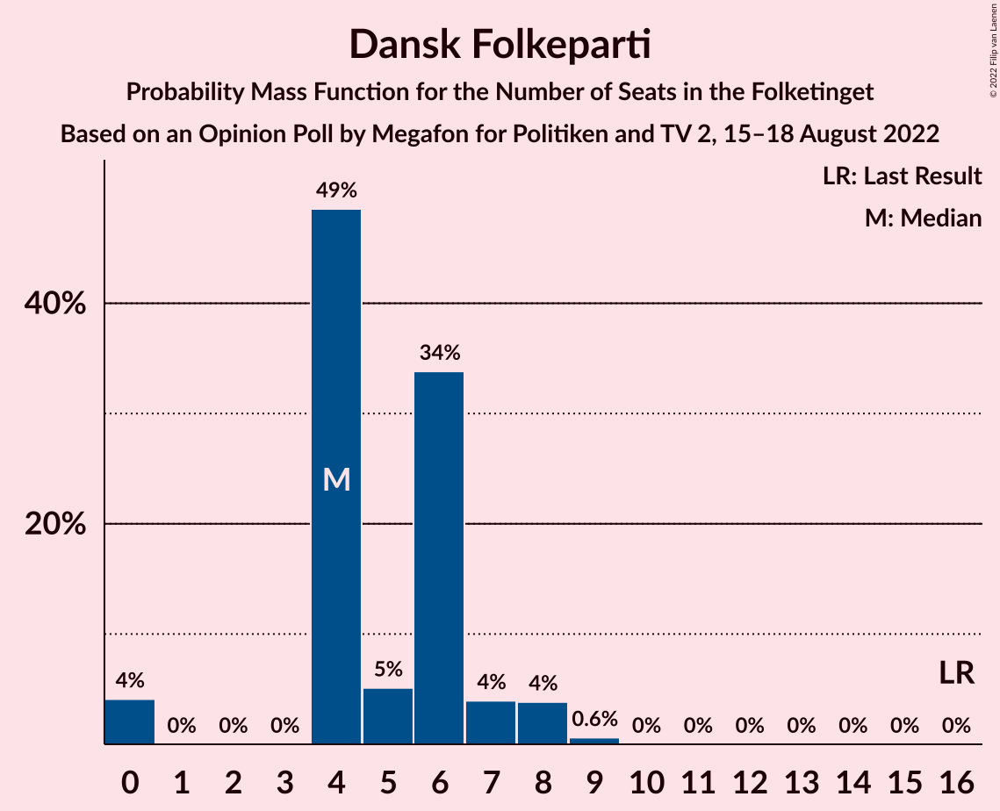

| Number of Seats | Probability | Accumulated | Special Marks |
|:---------------:|:-----------:|:-----------:|:-------------:|
| 0 | 4% | 100% |  |
| 1 | 0% | 96% |  |
| 2 | 0% | 96% |  |
| 3 | 0% | 96% |  |
| 4 | 49% | 96% | Median |
| 5 | 5% | 47% |  |
| 6 | 34% | 42% |  |
| 7 | 4% | 8% |  |
| 8 | 4% | 4% |  |
| 9 | 0.6% | 0.6% |  |
| 10 | 0% | 0% |  |
| 11 | 0% | 0% |  |
| 12 | 0% | 0% |  |
| 13 | 0% | 0% |  |
| 14 | 0% | 0% |  |
| 15 | 0% | 0% |  |
| 16 | 0% | 0% | Last Result |

### Moderaterne

*For a full overview of the results for this party, see the [Moderaterne](party-moderaterne.html) page.*

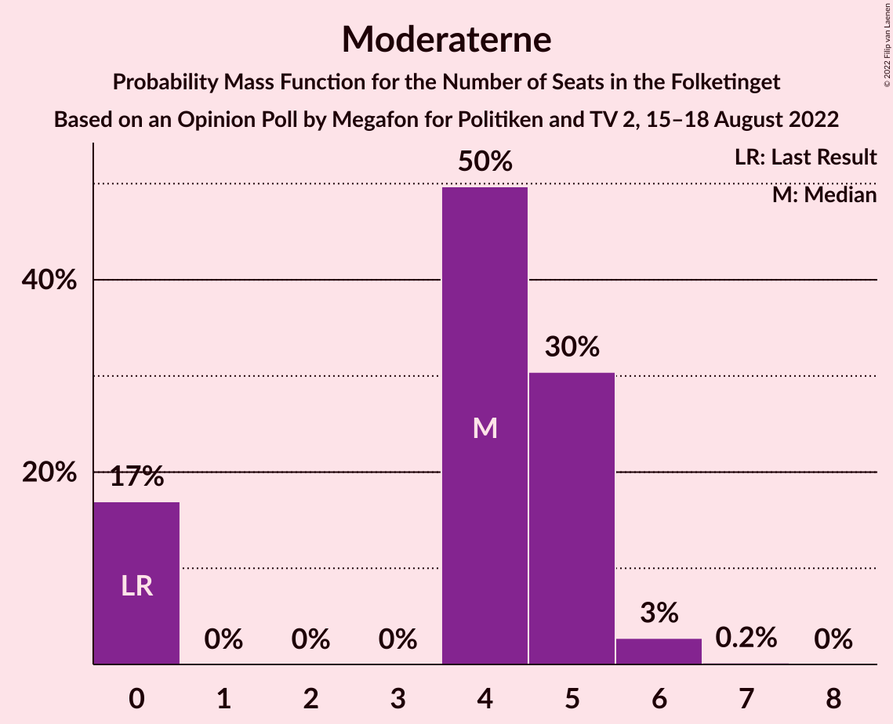

| Number of Seats | Probability | Accumulated | Special Marks |
|:---------------:|:-----------:|:-----------:|:-------------:|
| 0 | 17% | 100% | Last Result |
| 1 | 0% | 83% |  |
| 2 | 0% | 83% |  |
| 3 | 0% | 83% |  |
| 4 | 50% | 83% | Median |
| 5 | 30% | 33% |  |
| 6 | 3% | 3% |  |
| 7 | 0.2% | 0.2% |  |
| 8 | 0% | 0% |  |

### Alternativet

*For a full overview of the results for this party, see the [Alternativet](party-alternativet.html) page.*

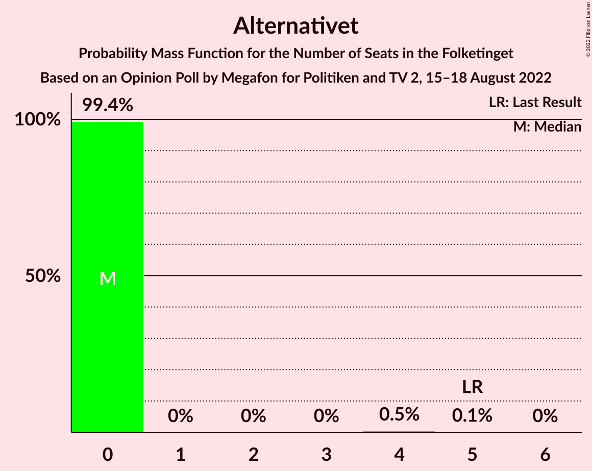

| Number of Seats | Probability | Accumulated | Special Marks |
|:---------------:|:-----------:|:-----------:|:-------------:|
| 0 | 99.4% | 100% | Median |
| 1 | 0% | 0.6% |  |
| 2 | 0% | 0.6% |  |
| 3 | 0% | 0.6% |  |
| 4 | 0.5% | 0.6% |  |
| 5 | 0.1% | 0.1% | Last Result |
| 6 | 0% | 0% |  |

### Frie Grønne

*For a full overview of the results for this party, see the [Frie Grønne](party-friegrønne.html) page.*

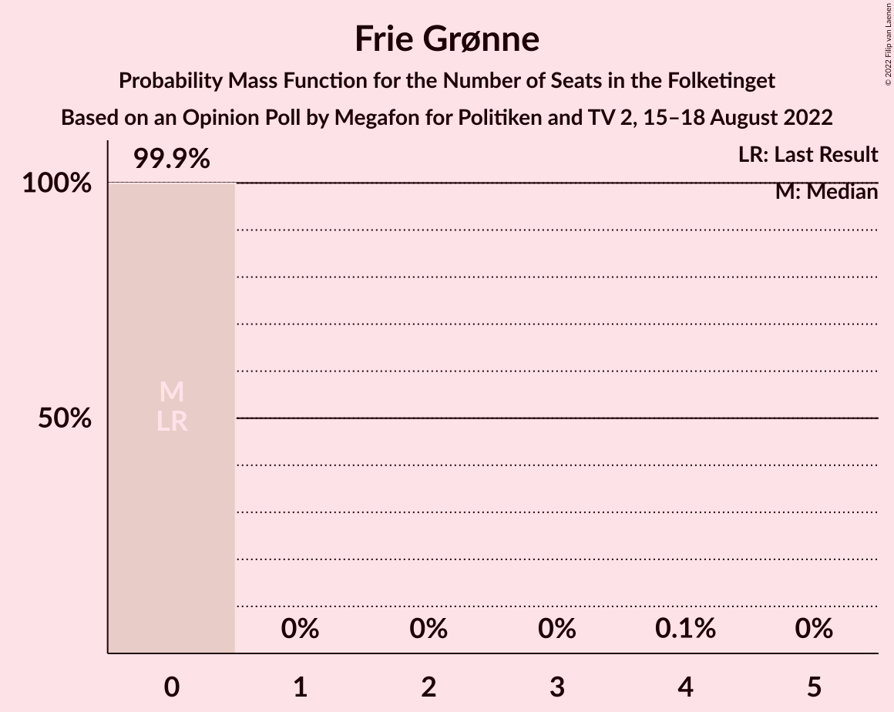

| Number of Seats | Probability | Accumulated | Special Marks |
|:---------------:|:-----------:|:-----------:|:-------------:|
| 0 | 99.9% | 100% | Last Result, Median |
| 1 | 0% | 0.1% |  |
| 2 | 0% | 0.1% |  |
| 3 | 0% | 0.1% |  |
| 4 | 0.1% | 0.1% |  |
| 5 | 0% | 0% |  |

### Kristendemokraterne

*For a full overview of the results for this party, see the [Kristendemokraterne](party-kristendemokraterne.html) page.*

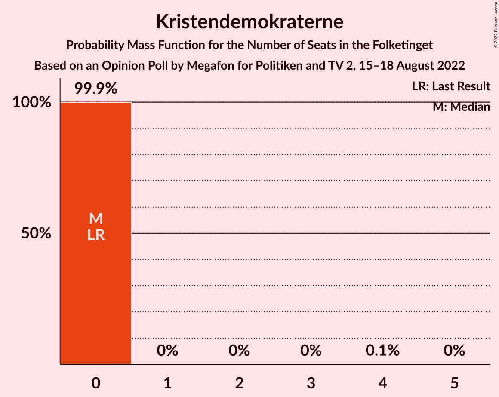

| Number of Seats | Probability | Accumulated | Special Marks |
|:---------------:|:-----------:|:-----------:|:-------------:|
| 0 | 99.9% | 100% | Last Result, Median |
| 1 | 0% | 0.1% |  |
| 2 | 0% | 0.1% |  |
| 3 | 0% | 0.1% |  |
| 4 | 0.1% | 0.1% |  |
| 5 | 0% | 0% |  |

### Veganerpartiet

*For a full overview of the results for this party, see the [Veganerpartiet](party-veganerpartiet.html) page.*

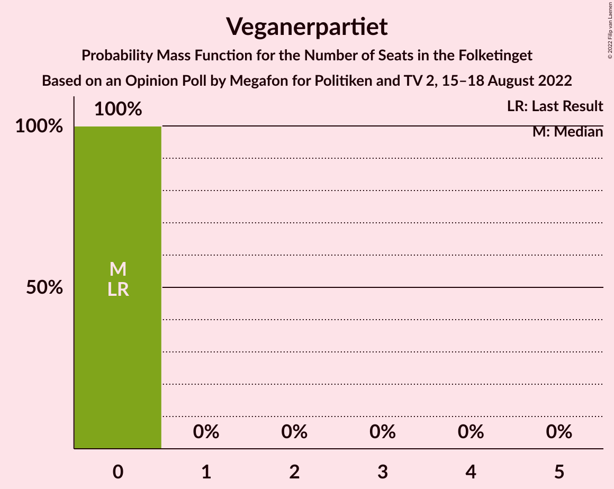

| Number of Seats | Probability | Accumulated | Special Marks |
|:---------------:|:-----------:|:-----------:|:-------------:|
| 0 | 100% | 100% | Last Result, Median |

## Coalitions

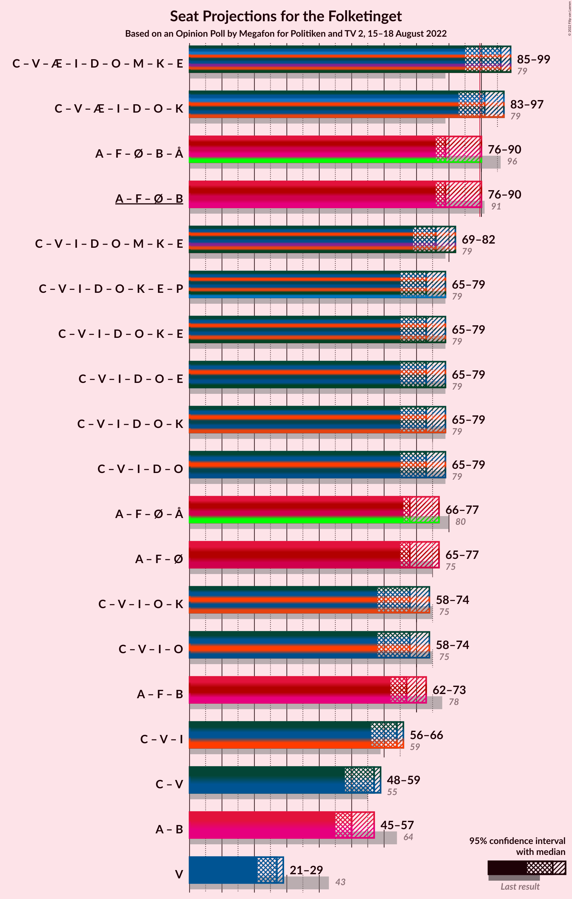

### Confidence Intervals

| Coalition | Last Result | Median | Majority? | 80% Confidence Interval | 90% Confidence Interval | 95% Confidence Interval | 99% Confidence Interval |
|:---------:|:-----------:|:------:|:---------:|:-----------------------:|:-----------------------:|:-----------------------:|:-----------------------:|
| Det Konservative Folkeparti – Venstre – Danmarksdemokraterne – Liberal Alliance – Nye Borgerlige – Dansk Folkeparti – Kristendemokraterne | 79 | 91 | 60% | 87–95 | 85–96 | 83–97 | 81–100 |
| Socialdemokraterne – Socialistisk Folkeparti – Enhedslisten–De Rød-Grønne – Radikale Venstre – Alternativet | 96 | 79 | 3% | 76–85 | 76–86 | 76–90 | 75–90 |
| Socialdemokraterne – Socialistisk Folkeparti – Enhedslisten–De Rød-Grønne – Radikale Venstre | 91 | 79 | 3% | 76–85 | 76–86 | 76–90 | 75–90 |
| Det Konservative Folkeparti – Venstre – Liberal Alliance – Nye Borgerlige – Dansk Folkeparti – Kristendemokraterne | 79 | 73 | 0% | 68–75 | 67–77 | 65–79 | 63–82 |
| Det Konservative Folkeparti – Venstre – Liberal Alliance – Nye Borgerlige – Dansk Folkeparti | 79 | 73 | 0% | 68–75 | 67–77 | 65–79 | 63–82 |
| Socialdemokraterne – Socialistisk Folkeparti – Enhedslisten–De Rød-Grønne – Alternativet | 80 | 68 | 0% | 66–73 | 66–74 | 66–77 | 64–80 |
| Socialdemokraterne – Socialistisk Folkeparti – Enhedslisten–De Rød-Grønne | 75 | 68 | 0% | 66–72 | 66–74 | 65–77 | 64–80 |
| Det Konservative Folkeparti – Venstre – Liberal Alliance – Dansk Folkeparti – Kristendemokraterne | 75 | 68 | 0% | 62–70 | 61–71 | 58–74 | 57–74 |
| Det Konservative Folkeparti – Venstre – Liberal Alliance – Dansk Folkeparti | 75 | 68 | 0% | 62–70 | 61–71 | 58–74 | 57–74 |
| Socialdemokraterne – Socialistisk Folkeparti – Radikale Venstre | 78 | 67 | 0% | 62–71 | 62–73 | 62–73 | 62–75 |
| Det Konservative Folkeparti – Venstre – Liberal Alliance | 59 | 64 | 0% | 56–66 | 56–66 | 56–66 | 53–68 |
| Det Konservative Folkeparti – Venstre | 55 | 57 | 0% | 48–58 | 48–58 | 48–59 | 47–61 |
| Socialdemokraterne – Radikale Venstre | 64 | 50 | 0% | 49–55 | 47–57 | 45–57 | 45–60 |
| Venstre | 43 | 27 | 0% | 24–28 | 23–28 | 21–29 | 20–31 |

### Det Konservative Folkeparti – Venstre – Danmarksdemokraterne – Liberal Alliance – Nye Borgerlige – Dansk Folkeparti – Kristendemokraterne

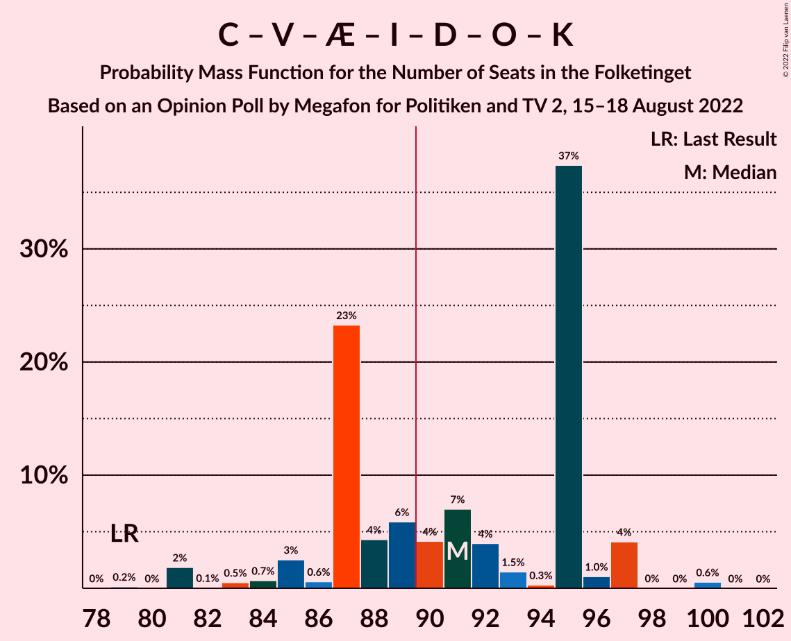

| Number of Seats | Probability | Accumulated | Special Marks |
|:---------------:|:-----------:|:-----------:|:-------------:|
| 79 | 0.2% | 100% | Last Result |
| 80 | 0% | 99.8% |  |
| 81 | 2% | 99.8% |  |
| 82 | 0.1% | 98% |  |
| 83 | 0.5% | 98% |  |
| 84 | 0.7% | 97% |  |
| 85 | 3% | 97% |  |
| 86 | 0.6% | 94% |  |
| 87 | 23% | 94% |  |
| 88 | 4% | 70% |  |
| 89 | 6% | 66% |  |
| 90 | 4% | 60% | Majority |
| 91 | 7% | 56% |  |
| 92 | 4% | 49% |  |
| 93 | 1.5% | 45% | Median |
| 94 | 0.3% | 43% |  |
| 95 | 37% | 43% |  |
| 96 | 1.0% | 6% |  |
| 97 | 4% | 5% |  |
| 98 | 0% | 0.6% |  |
| 99 | 0% | 0.6% |  |
| 100 | 0.6% | 0.6% |  |
| 101 | 0% | 0% |  |

### Socialdemokraterne – Socialistisk Folkeparti – Enhedslisten–De Rød-Grønne – Radikale Venstre – Alternativet

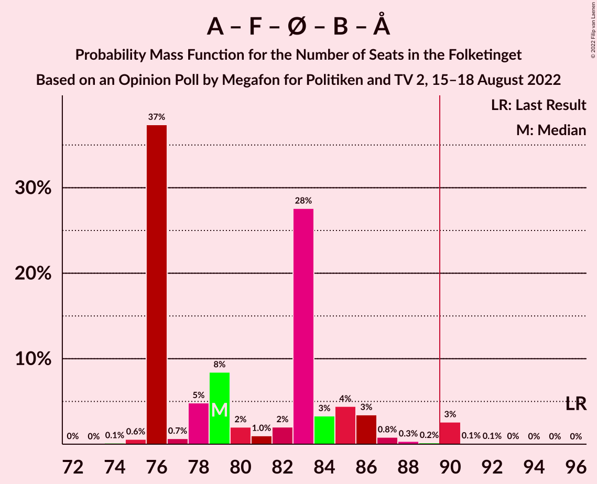

| Number of Seats | Probability | Accumulated | Special Marks |
|:---------------:|:-----------:|:-----------:|:-------------:|
| 74 | 0.1% | 100% |  |
| 75 | 0.6% | 99.8% |  |
| 76 | 37% | 99.2% |  |
| 77 | 0.7% | 62% |  |
| 78 | 5% | 61% |  |
| 79 | 8% | 56% | Median |
| 80 | 2% | 48% |  |
| 81 | 1.0% | 46% |  |
| 82 | 2% | 45% |  |
| 83 | 28% | 43% |  |
| 84 | 3% | 15% |  |
| 85 | 4% | 12% |  |
| 86 | 3% | 8% |  |
| 87 | 0.8% | 4% |  |
| 88 | 0.3% | 3% |  |
| 89 | 0.2% | 3% |  |
| 90 | 3% | 3% | Majority |
| 91 | 0.1% | 0.2% |  |
| 92 | 0.1% | 0.1% |  |
| 93 | 0% | 0.1% |  |
| 94 | 0% | 0% |  |
| 95 | 0% | 0% |  |
| 96 | 0% | 0% | Last Result |

### Socialdemokraterne – Socialistisk Folkeparti – Enhedslisten–De Rød-Grønne – Radikale Venstre

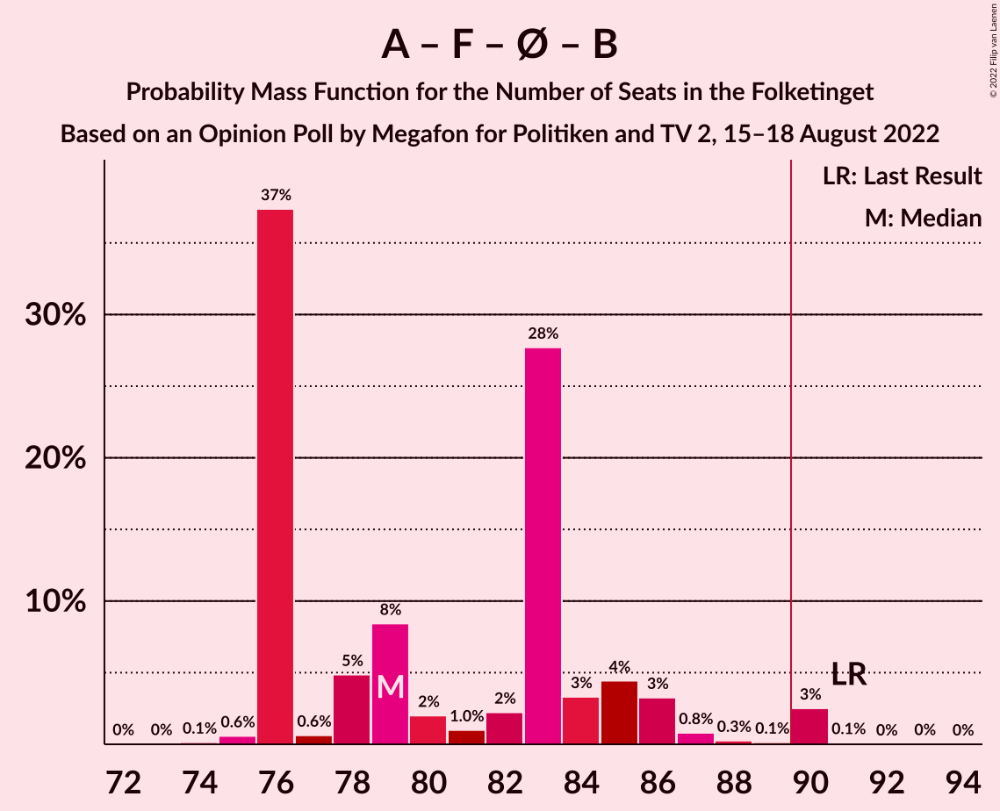

| Number of Seats | Probability | Accumulated | Special Marks |
|:---------------:|:-----------:|:-----------:|:-------------:|
| 73 | 0% | 100% |  |
| 74 | 0.1% | 99.9% |  |
| 75 | 0.6% | 99.8% |  |
| 76 | 37% | 99.2% |  |
| 77 | 0.6% | 62% |  |
| 78 | 5% | 61% |  |
| 79 | 8% | 56% | Median |
| 80 | 2% | 48% |  |
| 81 | 1.0% | 46% |  |
| 82 | 2% | 45% |  |
| 83 | 28% | 43% |  |
| 84 | 3% | 15% |  |
| 85 | 4% | 12% |  |
| 86 | 3% | 7% |  |
| 87 | 0.8% | 4% |  |
| 88 | 0.3% | 3% |  |
| 89 | 0.1% | 3% |  |
| 90 | 3% | 3% | Majority |
| 91 | 0.1% | 0.2% | Last Result |
| 92 | 0% | 0.1% |  |
| 93 | 0% | 0.1% |  |
| 94 | 0% | 0% |  |

### Det Konservative Folkeparti – Venstre – Liberal Alliance – Nye Borgerlige – Dansk Folkeparti – Kristendemokraterne

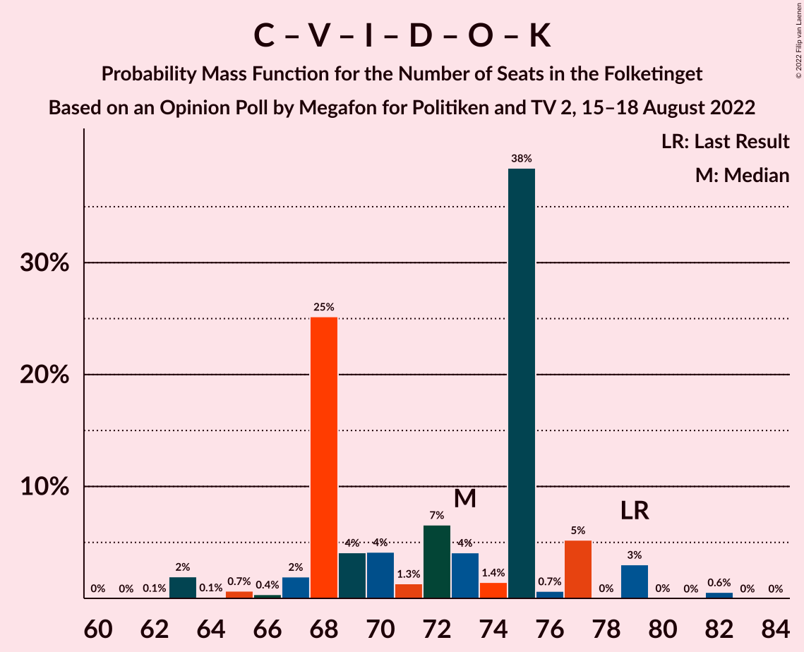

| Number of Seats | Probability | Accumulated | Special Marks |
|:---------------:|:-----------:|:-----------:|:-------------:|
| 62 | 0.1% | 100% |  |
| 63 | 2% | 99.9% |  |
| 64 | 0.1% | 98% |  |
| 65 | 0.7% | 98% |  |
| 66 | 0.4% | 97% |  |
| 67 | 2% | 97% |  |
| 68 | 25% | 95% |  |
| 69 | 4% | 70% |  |
| 70 | 4% | 66% |  |
| 71 | 1.3% | 61% |  |
| 72 | 7% | 60% |  |
| 73 | 4% | 54% |  |
| 74 | 1.4% | 49% | Median |
| 75 | 38% | 48% |  |
| 76 | 0.7% | 10% |  |
| 77 | 5% | 9% |  |
| 78 | 0% | 4% |  |
| 79 | 3% | 4% | Last Result |
| 80 | 0% | 0.6% |  |
| 81 | 0% | 0.6% |  |
| 82 | 0.6% | 0.6% |  |
| 83 | 0% | 0% |  |

### Det Konservative Folkeparti – Venstre – Liberal Alliance – Nye Borgerlige – Dansk Folkeparti

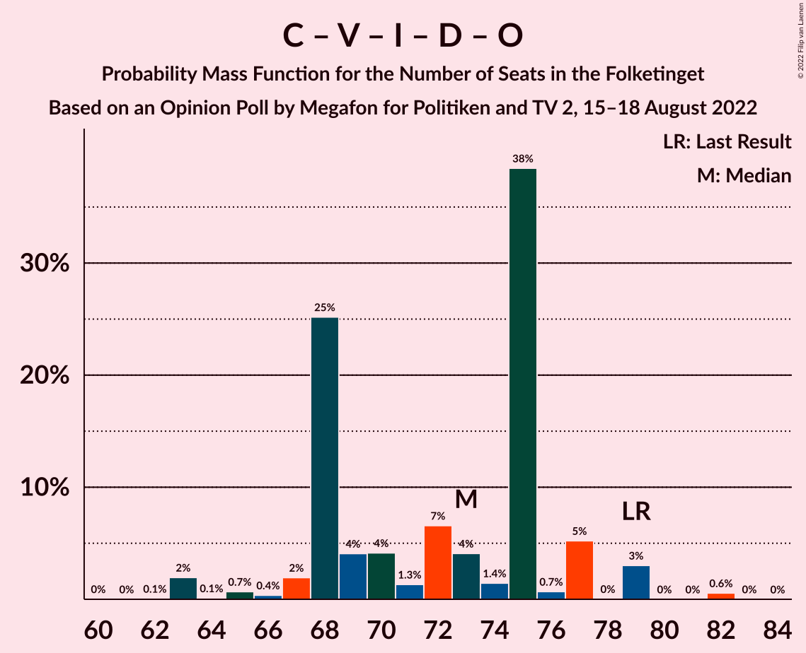

| Number of Seats | Probability | Accumulated | Special Marks |
|:---------------:|:-----------:|:-----------:|:-------------:|
| 62 | 0.1% | 100% |  |
| 63 | 2% | 99.9% |  |
| 64 | 0.1% | 98% |  |
| 65 | 0.7% | 98% |  |
| 66 | 0.4% | 97% |  |
| 67 | 2% | 97% |  |
| 68 | 25% | 95% |  |
| 69 | 4% | 70% |  |
| 70 | 4% | 66% |  |
| 71 | 1.3% | 61% |  |
| 72 | 7% | 60% |  |
| 73 | 4% | 54% |  |
| 74 | 1.4% | 49% | Median |
| 75 | 38% | 48% |  |
| 76 | 0.7% | 10% |  |
| 77 | 5% | 9% |  |
| 78 | 0% | 4% |  |
| 79 | 3% | 4% | Last Result |
| 80 | 0% | 0.6% |  |
| 81 | 0% | 0.6% |  |
| 82 | 0.6% | 0.6% |  |
| 83 | 0% | 0% |  |

### Socialdemokraterne – Socialistisk Folkeparti – Enhedslisten–De Rød-Grønne – Alternativet

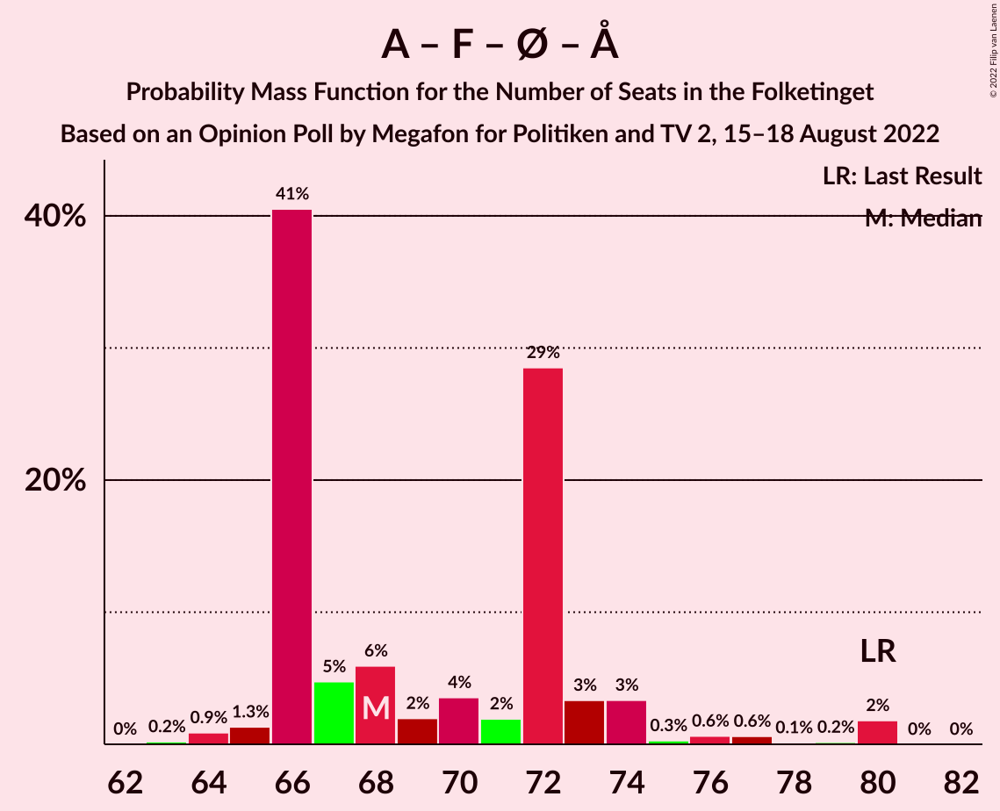

| Number of Seats | Probability | Accumulated | Special Marks |
|:---------------:|:-----------:|:-----------:|:-------------:|
| 62 | 0% | 100% |  |
| 63 | 0.2% | 99.9% |  |
| 64 | 0.9% | 99.7% |  |
| 65 | 1.3% | 98.8% |  |
| 66 | 41% | 98% |  |
| 67 | 5% | 57% |  |
| 68 | 6% | 52% | Median |
| 69 | 2% | 46% |  |
| 70 | 4% | 44% |  |
| 71 | 2% | 41% |  |
| 72 | 29% | 39% |  |
| 73 | 3% | 10% |  |
| 74 | 3% | 7% |  |
| 75 | 0.3% | 4% |  |
| 76 | 0.6% | 3% |  |
| 77 | 0.6% | 3% |  |
| 78 | 0.1% | 2% |  |
| 79 | 0.2% | 2% |  |
| 80 | 2% | 2% | Last Result |
| 81 | 0% | 0% |  |

### Socialdemokraterne – Socialistisk Folkeparti – Enhedslisten–De Rød-Grønne

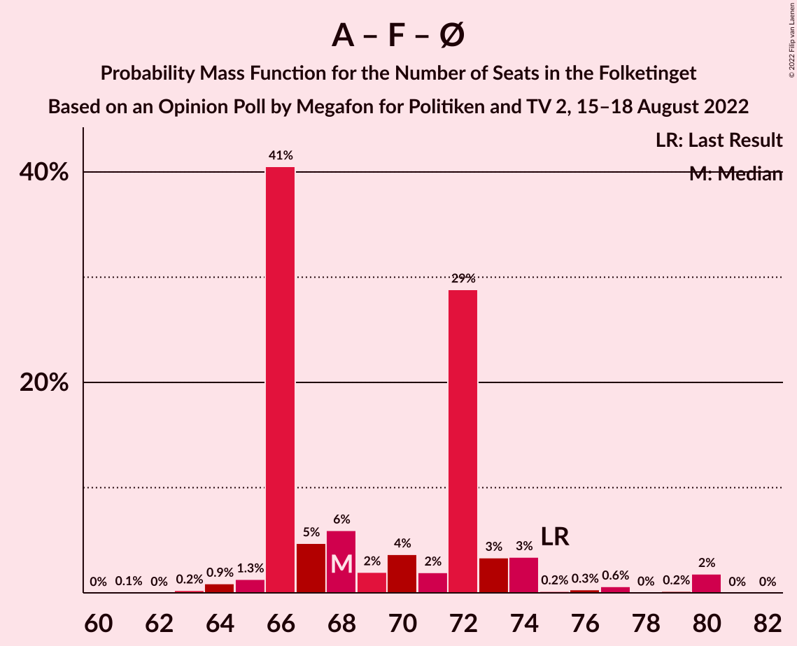

| Number of Seats | Probability | Accumulated | Special Marks |
|:---------------:|:-----------:|:-----------:|:-------------:|
| 61 | 0.1% | 100% |  |
| 62 | 0% | 99.9% |  |
| 63 | 0.2% | 99.9% |  |
| 64 | 0.9% | 99.7% |  |
| 65 | 1.3% | 98.8% |  |
| 66 | 41% | 97% |  |
| 67 | 5% | 57% |  |
| 68 | 6% | 52% | Median |
| 69 | 2% | 46% |  |
| 70 | 4% | 44% |  |
| 71 | 2% | 41% |  |
| 72 | 29% | 39% |  |
| 73 | 3% | 10% |  |
| 74 | 3% | 7% |  |
| 75 | 0.2% | 3% | Last Result |
| 76 | 0.3% | 3% |  |
| 77 | 0.6% | 3% |  |
| 78 | 0% | 2% |  |
| 79 | 0.2% | 2% |  |
| 80 | 2% | 2% |  |
| 81 | 0% | 0% |  |

### Det Konservative Folkeparti – Venstre – Liberal Alliance – Dansk Folkeparti – Kristendemokraterne

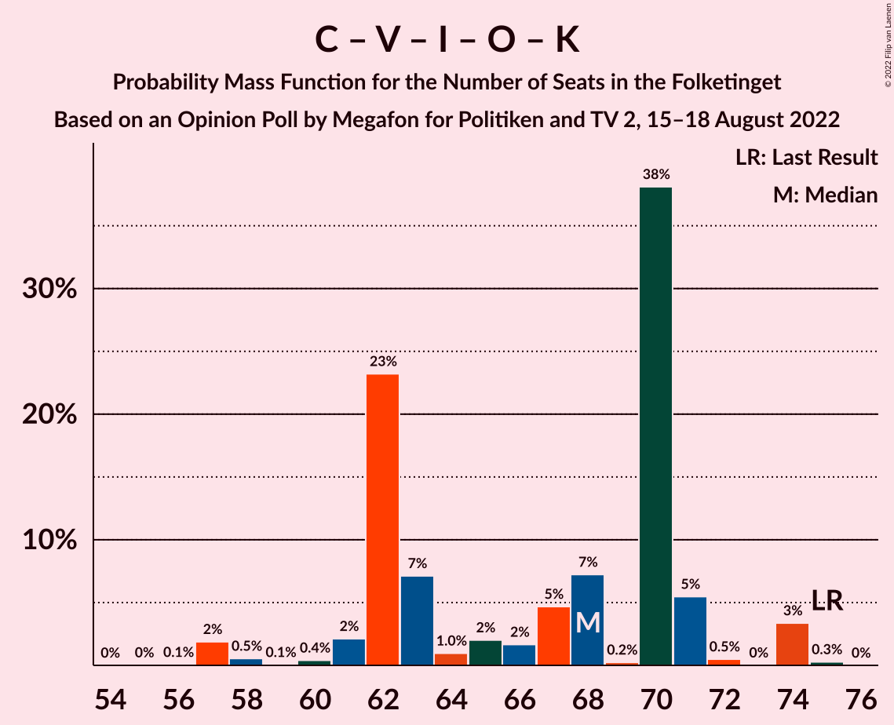

| Number of Seats | Probability | Accumulated | Special Marks |
|:---------------:|:-----------:|:-----------:|:-------------:|
| 56 | 0.1% | 100% |  |
| 57 | 2% | 99.9% |  |
| 58 | 0.5% | 98% |  |
| 59 | 0.1% | 97% |  |
| 60 | 0.4% | 97% |  |
| 61 | 2% | 97% |  |
| 62 | 23% | 95% |  |
| 63 | 7% | 72% |  |
| 64 | 1.0% | 65% |  |
| 65 | 2% | 64% |  |
| 66 | 2% | 62% |  |
| 67 | 5% | 60% |  |
| 68 | 7% | 55% |  |
| 69 | 0.2% | 48% | Median |
| 70 | 38% | 48% |  |
| 71 | 5% | 10% |  |
| 72 | 0.5% | 4% |  |
| 73 | 0% | 4% |  |
| 74 | 3% | 4% |  |
| 75 | 0.3% | 0.3% | Last Result |
| 76 | 0% | 0% |  |

### Det Konservative Folkeparti – Venstre – Liberal Alliance – Dansk Folkeparti

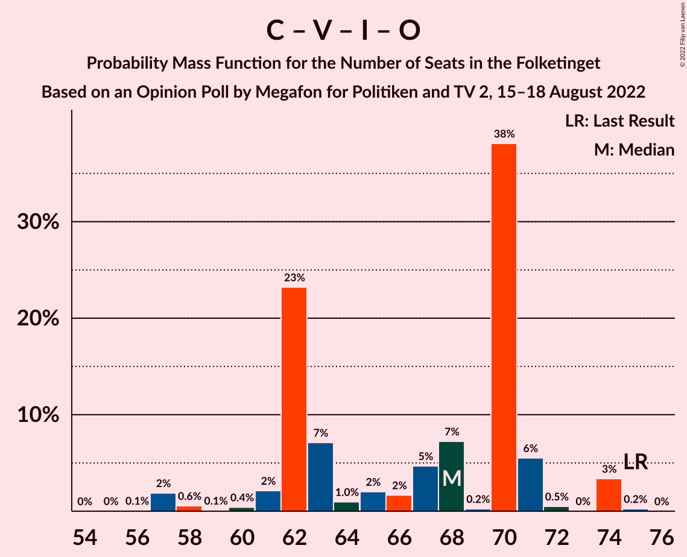

| Number of Seats | Probability | Accumulated | Special Marks |
|:---------------:|:-----------:|:-----------:|:-------------:|
| 56 | 0.1% | 100% |  |
| 57 | 2% | 99.9% |  |
| 58 | 0.6% | 98% |  |
| 59 | 0.1% | 97% |  |
| 60 | 0.4% | 97% |  |
| 61 | 2% | 97% |  |
| 62 | 23% | 95% |  |
| 63 | 7% | 72% |  |
| 64 | 1.0% | 65% |  |
| 65 | 2% | 64% |  |
| 66 | 2% | 62% |  |
| 67 | 5% | 60% |  |
| 68 | 7% | 55% |  |
| 69 | 0.2% | 48% | Median |
| 70 | 38% | 48% |  |
| 71 | 6% | 10% |  |
| 72 | 0.5% | 4% |  |
| 73 | 0% | 4% |  |
| 74 | 3% | 4% |  |
| 75 | 0.2% | 0.3% | Last Result |
| 76 | 0% | 0% |  |

### Socialdemokraterne – Socialistisk Folkeparti – Radikale Venstre

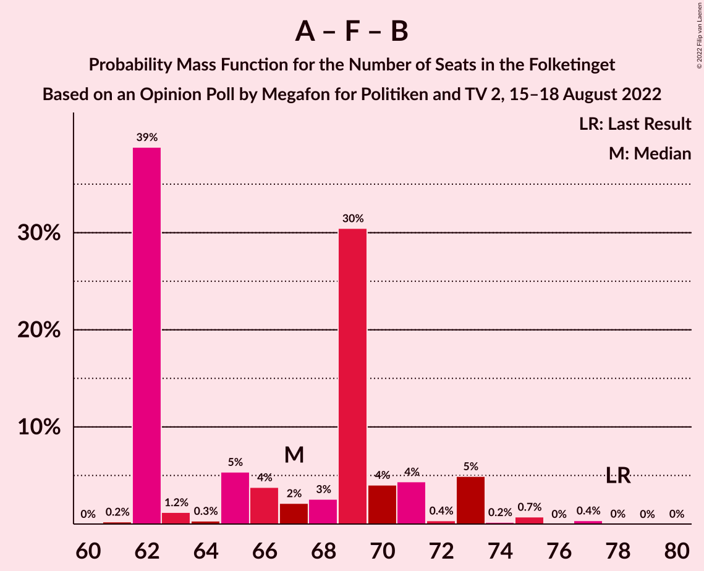

| Number of Seats | Probability | Accumulated | Special Marks |
|:---------------:|:-----------:|:-----------:|:-------------:|
| 61 | 0.2% | 100% |  |
| 62 | 39% | 99.7% |  |
| 63 | 1.2% | 61% |  |
| 64 | 0.3% | 60% |  |
| 65 | 5% | 59% | Median |
| 66 | 4% | 54% |  |
| 67 | 2% | 50% |  |
| 68 | 3% | 48% |  |
| 69 | 30% | 46% |  |
| 70 | 4% | 15% |  |
| 71 | 4% | 11% |  |
| 72 | 0.4% | 7% |  |
| 73 | 5% | 6% |  |
| 74 | 0.2% | 1.4% |  |
| 75 | 0.7% | 1.2% |  |
| 76 | 0% | 0.4% |  |
| 77 | 0.4% | 0.4% |  |
| 78 | 0% | 0.1% | Last Result |
| 79 | 0% | 0% |  |

### Det Konservative Folkeparti – Venstre – Liberal Alliance

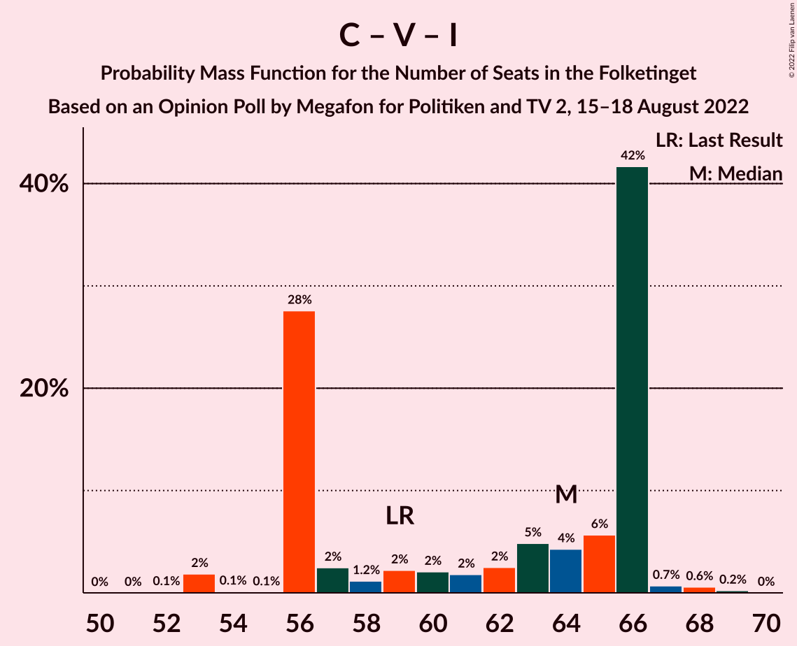

| Number of Seats | Probability | Accumulated | Special Marks |
|:---------------:|:-----------:|:-----------:|:-------------:|
| 52 | 0.1% | 100% |  |
| 53 | 2% | 99.9% |  |
| 54 | 0.1% | 98% |  |
| 55 | 0.1% | 98% |  |
| 56 | 28% | 98% |  |
| 57 | 2% | 70% |  |
| 58 | 1.2% | 68% |  |
| 59 | 2% | 67% | Last Result |
| 60 | 2% | 64% |  |
| 61 | 2% | 62% |  |
| 62 | 2% | 61% |  |
| 63 | 5% | 58% |  |
| 64 | 4% | 53% |  |
| 65 | 6% | 49% | Median |
| 66 | 42% | 43% |  |
| 67 | 0.7% | 2% |  |
| 68 | 0.6% | 0.9% |  |
| 69 | 0.2% | 0.3% |  |
| 70 | 0% | 0% |  |

### Det Konservative Folkeparti – Venstre

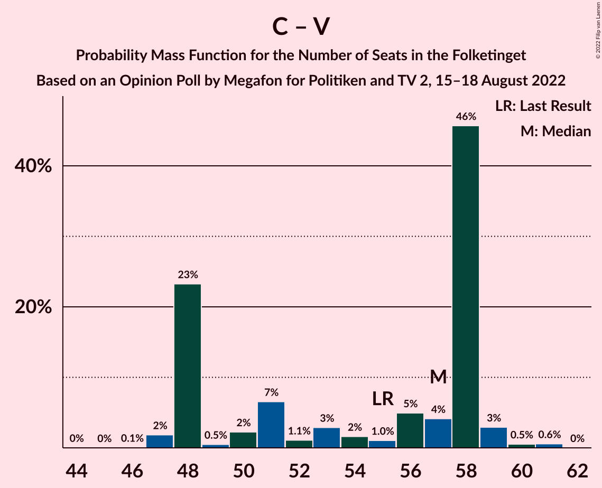

| Number of Seats | Probability | Accumulated | Special Marks |
|:---------------:|:-----------:|:-----------:|:-------------:|
| 45 | 0% | 100% |  |
| 46 | 0.1% | 99.9% |  |
| 47 | 2% | 99.9% |  |
| 48 | 23% | 98% |  |
| 49 | 0.5% | 75% |  |
| 50 | 2% | 74% |  |
| 51 | 7% | 72% |  |
| 52 | 1.1% | 65% |  |
| 53 | 3% | 64% |  |
| 54 | 2% | 62% |  |
| 55 | 1.0% | 60% | Last Result |
| 56 | 5% | 59% |  |
| 57 | 4% | 54% | Median |
| 58 | 46% | 50% |  |
| 59 | 3% | 4% |  |
| 60 | 0.5% | 1.1% |  |
| 61 | 0.6% | 0.6% |  |
| 62 | 0% | 0% |  |

### Socialdemokraterne – Radikale Venstre

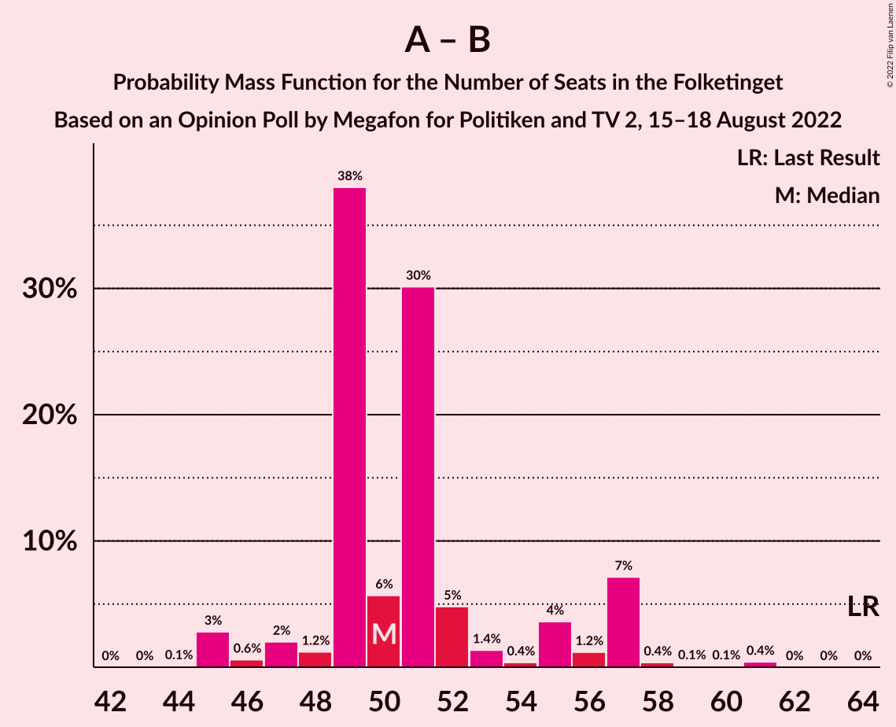

| Number of Seats | Probability | Accumulated | Special Marks |
|:---------------:|:-----------:|:-----------:|:-------------:|
| 44 | 0.1% | 100% |  |
| 45 | 3% | 99.9% |  |
| 46 | 0.6% | 97% |  |
| 47 | 2% | 97% |  |
| 48 | 1.2% | 94% |  |
| 49 | 38% | 93% |  |
| 50 | 6% | 55% | Median |
| 51 | 30% | 50% |  |
| 52 | 5% | 19% |  |
| 53 | 1.4% | 15% |  |
| 54 | 0.4% | 13% |  |
| 55 | 4% | 13% |  |
| 56 | 1.2% | 9% |  |
| 57 | 7% | 8% |  |
| 58 | 0.4% | 1.0% |  |
| 59 | 0.1% | 0.6% |  |
| 60 | 0.1% | 0.5% |  |
| 61 | 0.4% | 0.4% |  |
| 62 | 0% | 0% |  |
| 63 | 0% | 0% |  |
| 64 | 0% | 0% | Last Result |

### Venstre

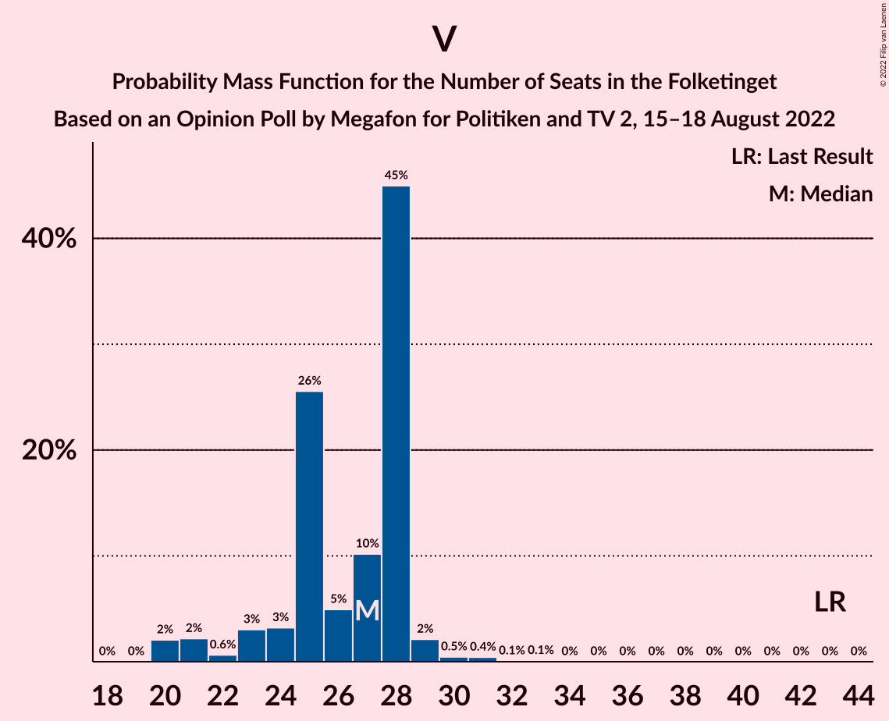

| Number of Seats | Probability | Accumulated | Special Marks |
|:---------------:|:-----------:|:-----------:|:-------------:|
| 20 | 2% | 100% |  |
| 21 | 2% | 98% |  |
| 22 | 0.6% | 96% |  |
| 23 | 3% | 95% |  |
| 24 | 3% | 92% |  |
| 25 | 26% | 89% |  |
| 26 | 5% | 63% |  |
| 27 | 10% | 58% | Median |
| 28 | 45% | 48% |  |
| 29 | 2% | 3% |  |
| 30 | 0.5% | 1.1% |  |
| 31 | 0.4% | 0.6% |  |
| 32 | 0.1% | 0.2% |  |
| 33 | 0.1% | 0.1% |  |
| 34 | 0% | 0% |  |
| 35 | 0% | 0% |  |
| 36 | 0% | 0% |  |
| 37 | 0% | 0% |  |
| 38 | 0% | 0% |  |
| 39 | 0% | 0% |  |
| 40 | 0% | 0% |  |
| 41 | 0% | 0% |  |
| 42 | 0% | 0% |  |
| 43 | 0% | 0% | Last Result |

## Technical Information

### Opinion Poll

+ **Polling firm:** Megafon
+ **Commissioner(s):** Politiken and TV 2
+ **Fieldwork period:** 15–18 August 2022

### Calculations

+ **Sample size:** 1006
+ **Simulations done:** 1,048,576
+ **Error estimate:** 3.69%

