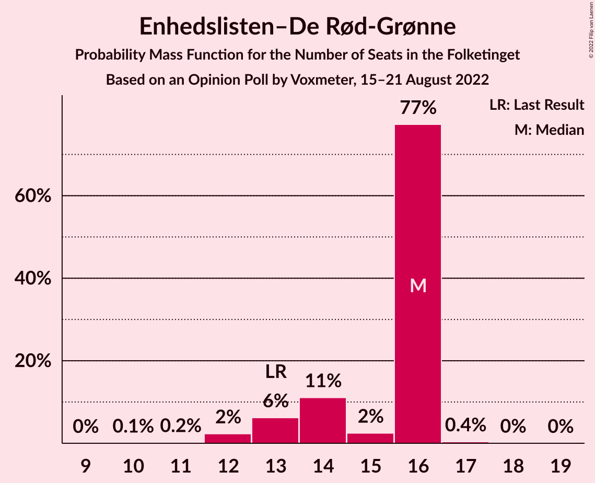
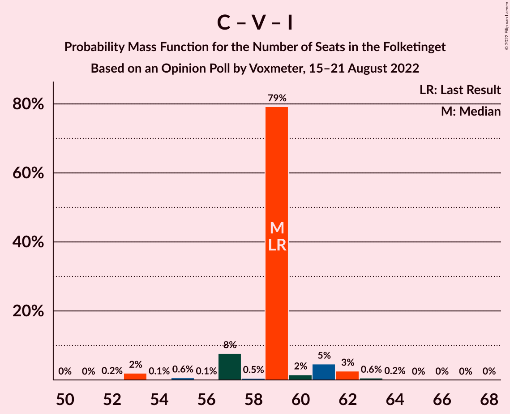

# Opinion Poll by Voxmeter, 15–21 August 2022

<a href="#voting-intentions">Voting Intentions</a> | <a href="#seats">Seats</a> | <a href="#coalitions">Coalitions</a> | <a href="#technical-information">Technical Information</a>

## Voting Intentions

### Confidence Intervals

| Party | Last Result | Poll Result | 80% Confidence Interval | 90% Confidence Interval | 95% Confidence Interval | 99% Confidence Interval |
|:-----:|:-----------:|:-----------:|:-----------------------:|:-----------------------:|:-----------------------:|:-----------------------:|
| Socialdemokraterne | 25.9% | 25.1% | 23.4–26.9% |23.0–27.4% |22.6–27.8% |21.8–28.6% |
| Det Konservative Folkeparti | 6.6% | 16.5% | 15.1–18.0% |14.7–18.5% |14.4–18.8% |13.7–19.6% |
| Venstre | 23.4% | 11.0% | 9.8–12.3% |9.5–12.7% |9.2–13.0% |8.7–13.6% |
| Danmarksdemokraterne | 0.0% | 9.3% | 8.2–10.5% |7.9–10.9% |7.7–11.2% |7.2–11.8% |
| Socialistisk Folkeparti | 7.7% | 7.6% | 6.6–8.7% |6.4–9.1% |6.1–9.3% |5.7–9.9% |
| Enhedslisten–De Rød-Grønne | 6.9% | 7.5% | 6.5–8.6% |6.3–8.9% |6.1–9.2% |5.6–9.8% |
| Radikale Venstre | 8.6% | 5.6% | 4.8–6.6% |4.6–6.9% |4.4–7.2% |4.0–7.7% |
| Liberal Alliance | 2.3% | 4.9% | 4.1–5.8% |3.9–6.1% |3.7–6.3% |3.4–6.8% |
| Nye Borgerlige | 2.4% | 4.3% | 3.6–5.2% |3.4–5.5% |3.2–5.7% |2.9–6.2% |
| Dansk Folkeparti | 8.7% | 3.2% | 2.6–4.0% |2.4–4.2% |2.3–4.4% |2.0–4.8% |
| Moderaterne | 0.0% | 1.9% | 1.4–2.5% |1.3–2.7% |1.2–2.9% |1.0–3.2% |
| Alternativet | 3.0% | 1.2% | 0.9–1.8% |0.8–1.9% |0.7–2.1% |0.6–2.4% |
| Kristendemokraterne | 1.7% | 0.6% | 0.4–1.0% |0.3–1.1% |0.3–1.2% |0.2–1.5% |
| Frie Grønne | 0.0% | 0.5% | 0.3–0.9% |0.2–1.0% |0.2–1.1% |0.1–1.3% |
| Veganerpartiet | 0.0% | 0.3% | 0.2–0.6% |0.1–0.7% |0.1–0.8% |0.1–1.0% |

*Note:* The poll result column reflects the actual value used in the calculations. Published results may vary slightly, and in addition be rounded to fewer digits.

## Seats

### Confidence Intervals

| Party | Last Result | Median | 80% Confidence Interval | 90% Confidence Interval | 95% Confidence Interval | 99% Confidence Interval |
|:-----:|:-----------:|:------:|:-----------------------:|:-----------------------:|:-----------------------:|:-----------------------:|
| <a href="#socialdemokraterne">Socialdemokraterne</a> | 48 | 43 | 43–45 |43–46 |43–48 |40–51 |
| <a href="#det-konservative-folkeparti">Det Konservative Folkeparti</a> | 12 | 29 | 29–30 |27–31 |25–32 |24–33 |
| <a href="#venstre">Venstre</a> | 43 | 22 | 20–22 |19–22 |17–22 |16–23 |
| <a href="#danmarksdemokraterne">Danmarksdemokraterne</a> | 0 | 18 | 17–18 |15–20 |14–20 |13–21 |
| <a href="#socialistisk-folkeparti">Socialistisk Folkeparti</a> | 14 | 13 | 13–15 |13–16 |12–16 |11–17 |
| <a href="#enhedslisten–de-rød-grønne">Enhedslisten–De Rød-Grønne</a> | 13 | 16 | 14–16 |13–16 |12–16 |12–16 |
| <a href="#radikale-venstre">Radikale Venstre</a> | 16 | 11 | 10–11 |8–11 |7–11 |7–13 |
| <a href="#liberal-alliance">Liberal Alliance</a> | 4 | 8 | 8–10 |8–11 |8–12 |7–12 |
| <a href="#nye-borgerlige">Nye Borgerlige</a> | 4 | 8 | 7–8 |7–9 |7–12 |5–12 |
| <a href="#dansk-folkeparti">Dansk Folkeparti</a> | 16 | 7 | 5–7 |5–7 |5–7 |5–8 |
| <a href="#moderaterne">Moderaterne</a> | 0 | 0 | 0 |0–4 |0–5 |0–5 |
| <a href="#alternativet">Alternativet</a> | 5 | 0 | 0 |0 |0 |0–4 |
| <a href="#kristendemokraterne">Kristendemokraterne</a> | 0 | 0 | 0 |0 |0 |0 |
| <a href="#frie-grønne">Frie Grønne</a> | 0 | 0 | 0 |0 |0 |0 |
| <a href="#veganerpartiet">Veganerpartiet</a> | 0 | 0 | 0 |0 |0 |0 |

### Socialdemokraterne

*For a full overview of the results for this party, see the [Socialdemokraterne](party-socialdemokraterne.html) page.*

| Number of Seats | Probability | Accumulated | Special Marks |
|:---------------:|:-----------:|:-----------:|:-------------:|
| 40 | 0.6% | 100% |  |
| 41 | 0.2% | 99.4% |  |
| 42 | 0.7% | 99.2% |  |
| 43 | 80% | 98% | Median |
| 44 | 2% | 18% |  |
| 45 | 11% | 16% |  |
| 46 | 0.6% | 5% |  |
| 47 | 0.2% | 5% |  |
| 48 | 2% | 4% | Last Result |
| 49 | 0.1% | 2% |  |
| 50 | 0.3% | 2% |  |
| 51 | 2% | 2% |  |
| 52 | 0% | 0% |  |

### Det Konservative Folkeparti

*For a full overview of the results for this party, see the [Det Konservative Folkeparti](party-detkonservativefolkeparti.html) page.*

| Number of Seats | Probability | Accumulated | Special Marks |
|:---------------:|:-----------:|:-----------:|:-------------:|
| 12 | 0% | 100% | Last Result |
| 13 | 0% | 100% |  |
| 14 | 0% | 100% |  |
| 15 | 0% | 100% |  |
| 16 | 0% | 100% |  |
| 17 | 0% | 100% |  |
| 18 | 0% | 100% |  |
| 19 | 0% | 100% |  |
| 20 | 0% | 100% |  |
| 21 | 0% | 100% |  |
| 22 | 0% | 100% |  |
| 23 | 0% | 100% |  |
| 24 | 1.4% | 100% |  |
| 25 | 3% | 98.6% |  |
| 26 | 0.1% | 95% |  |
| 27 | 0.6% | 95% |  |
| 28 | 2% | 95% |  |
| 29 | 82% | 93% | Median |
| 30 | 5% | 11% |  |
| 31 | 4% | 6% |  |
| 32 | 0.1% | 3% |  |
| 33 | 2% | 2% |  |
| 34 | 0.2% | 0.2% |  |
| 35 | 0% | 0.1% |  |
| 36 | 0% | 0% |  |

### Venstre

*For a full overview of the results for this party, see the [Venstre](party-venstre.html) page.*

| Number of Seats | Probability | Accumulated | Special Marks |
|:---------------:|:-----------:|:-----------:|:-------------:|
| 16 | 0.8% | 100% |  |
| 17 | 3% | 99.2% |  |
| 18 | 0.3% | 96% |  |
| 19 | 5% | 96% |  |
| 20 | 8% | 91% |  |
| 21 | 0.7% | 83% |  |
| 22 | 82% | 82% | Median |
| 23 | 0.4% | 0.5% |  |
| 24 | 0% | 0.2% |  |
| 25 | 0% | 0.2% |  |
| 26 | 0.2% | 0.2% |  |
| 27 | 0% | 0% |  |
| 28 | 0% | 0% |  |
| 29 | 0% | 0% |  |
| 30 | 0% | 0% |  |
| 31 | 0% | 0% |  |
| 32 | 0% | 0% |  |
| 33 | 0% | 0% |  |
| 34 | 0% | 0% |  |
| 35 | 0% | 0% |  |
| 36 | 0% | 0% |  |
| 37 | 0% | 0% |  |
| 38 | 0% | 0% |  |
| 39 | 0% | 0% |  |
| 40 | 0% | 0% |  |
| 41 | 0% | 0% |  |
| 42 | 0% | 0% |  |
| 43 | 0% | 0% | Last Result |

### Danmarksdemokraterne

*For a full overview of the results for this party, see the [Danmarksdemokraterne](party-danmarksdemokraterne.html) page.*

| Number of Seats | Probability | Accumulated | Special Marks |
|:---------------:|:-----------:|:-----------:|:-------------:|
| 0 | 0% | 100% | Last Result |
| 1 | 0% | 100% |  |
| 2 | 0% | 100% |  |
| 3 | 0% | 100% |  |
| 4 | 0% | 100% |  |
| 5 | 0% | 100% |  |
| 6 | 0% | 100% |  |
| 7 | 0% | 100% |  |
| 8 | 0% | 100% |  |
| 9 | 0% | 100% |  |
| 10 | 0% | 100% |  |
| 11 | 0% | 100% |  |
| 12 | 0% | 100% |  |
| 13 | 1.1% | 100% |  |
| 14 | 2% | 98.9% |  |
| 15 | 2% | 97% |  |
| 16 | 2% | 95% |  |
| 17 | 4% | 92% |  |
| 18 | 79% | 89% | Median |
| 19 | 1.5% | 10% |  |
| 20 | 7% | 8% |  |
| 21 | 0.2% | 0.6% |  |
| 22 | 0.4% | 0.4% |  |
| 23 | 0% | 0% |  |

### Socialistisk Folkeparti

*For a full overview of the results for this party, see the [Socialistisk Folkeparti](party-socialistiskfolkeparti.html) page.*

| Number of Seats | Probability | Accumulated | Special Marks |
|:---------------:|:-----------:|:-----------:|:-------------:|
| 10 | 0.3% | 100% |  |
| 11 | 0.6% | 99.6% |  |
| 12 | 3% | 99.1% |  |
| 13 | 79% | 96% | Median |
| 14 | 6% | 18% | Last Result |
| 15 | 6% | 12% |  |
| 16 | 5% | 5% |  |
| 17 | 0.3% | 0.6% |  |
| 18 | 0.3% | 0.3% |  |
| 19 | 0% | 0% |  |

### Enhedslisten–De Rød-Grønne

*For a full overview of the results for this party, see the [Enhedslisten–De Rød-Grønne](party-enhedslisten–derød-grønne.html) page.*

| Number of Seats | Probability | Accumulated | Special Marks |
|:---------------:|:-----------:|:-----------:|:-------------:|
| 10 | 0.1% | 100% |  |
| 11 | 0.2% | 99.9% |  |
| 12 | 2% | 99.7% |  |
| 13 | 6% | 97% | Last Result |
| 14 | 11% | 91% |  |
| 15 | 2% | 80% |  |
| 16 | 77% | 78% | Median |
| 17 | 0.4% | 0.4% |  |
| 18 | 0% | 0.1% |  |
| 19 | 0% | 0% |  |

### Radikale Venstre

*For a full overview of the results for this party, see the [Radikale Venstre](party-radikalevenstre.html) page.*

| Number of Seats | Probability | Accumulated | Special Marks |
|:---------------:|:-----------:|:-----------:|:-------------:|
| 7 | 4% | 100% |  |
| 8 | 4% | 96% |  |
| 9 | 0.3% | 92% |  |
| 10 | 3% | 91% |  |
| 11 | 87% | 88% | Median |
| 12 | 0.6% | 1.3% |  |
| 13 | 0.7% | 0.7% |  |
| 14 | 0% | 0.1% |  |
| 15 | 0% | 0% |  |
| 16 | 0% | 0% | Last Result |

### Liberal Alliance

*For a full overview of the results for this party, see the [Liberal Alliance](party-liberalalliance.html) page.*

| Number of Seats | Probability | Accumulated | Special Marks |
|:---------------:|:-----------:|:-----------:|:-------------:|
| 4 | 0% | 100% | Last Result |
| 5 | 0% | 100% |  |
| 6 | 0.3% | 100% |  |
| 7 | 0.4% | 99.7% |  |
| 8 | 81% | 99.4% | Median |
| 9 | 7% | 18% |  |
| 10 | 2% | 11% |  |
| 11 | 6% | 9% |  |
| 12 | 3% | 3% |  |
| 13 | 0.1% | 0.1% |  |
| 14 | 0% | 0% |  |

### Nye Borgerlige

*For a full overview of the results for this party, see the [Nye Borgerlige](party-nyeborgerlige.html) page.*

| Number of Seats | Probability | Accumulated | Special Marks |
|:---------------:|:-----------:|:-----------:|:-------------:|
| 4 | 0% | 100% | Last Result |
| 5 | 1.4% | 100% |  |
| 6 | 1.0% | 98.6% |  |
| 7 | 9% | 98% |  |
| 8 | 79% | 89% | Median |
| 9 | 5% | 10% |  |
| 10 | 0.6% | 5% |  |
| 11 | 2% | 4% |  |
| 12 | 3% | 3% |  |
| 13 | 0% | 0% |  |

### Dansk Folkeparti

*For a full overview of the results for this party, see the [Dansk Folkeparti](party-danskfolkeparti.html) page.*

| Number of Seats | Probability | Accumulated | Special Marks |
|:---------------:|:-----------:|:-----------:|:-------------:|
| 0 | 0.1% | 100% |  |
| 1 | 0% | 99.9% |  |
| 2 | 0% | 99.9% |  |
| 3 | 0% | 99.9% |  |
| 4 | 0.2% | 99.9% |  |
| 5 | 12% | 99.7% |  |
| 6 | 2% | 88% |  |
| 7 | 84% | 86% | Median |
| 8 | 2% | 2% |  |
| 9 | 0.1% | 0.1% |  |
| 10 | 0% | 0% |  |
| 11 | 0% | 0% |  |
| 12 | 0% | 0% |  |
| 13 | 0% | 0% |  |
| 14 | 0% | 0% |  |
| 15 | 0% | 0% |  |
| 16 | 0% | 0% | Last Result |

### Moderaterne

*For a full overview of the results for this party, see the [Moderaterne](party-moderaterne.html) page.*

| Number of Seats | Probability | Accumulated | Special Marks |
|:---------------:|:-----------:|:-----------:|:-------------:|
| 0 | 92% | 100% | Last Result, Median |
| 1 | 0% | 8% |  |
| 2 | 0% | 8% |  |
| 3 | 0% | 8% |  |
| 4 | 4% | 8% |  |
| 5 | 4% | 4% |  |
| 6 | 0.2% | 0.2% |  |
| 7 | 0% | 0% |  |

### Alternativet

*For a full overview of the results for this party, see the [Alternativet](party-alternativet.html) page.*

| Number of Seats | Probability | Accumulated | Special Marks |
|:---------------:|:-----------:|:-----------:|:-------------:|
| 0 | 98.7% | 100% | Median |
| 1 | 0% | 1.3% |  |
| 2 | 0% | 1.3% |  |
| 3 | 0% | 1.3% |  |
| 4 | 0.9% | 1.3% |  |
| 5 | 0.4% | 0.4% | Last Result |
| 6 | 0% | 0% |  |

### Kristendemokraterne

*For a full overview of the results for this party, see the [Kristendemokraterne](party-kristendemokraterne.html) page.*

| Number of Seats | Probability | Accumulated | Special Marks |
|:---------------:|:-----------:|:-----------:|:-------------:|
| 0 | 100% | 100% | Last Result, Median |

### Frie Grønne

*For a full overview of the results for this party, see the [Frie Grønne](party-friegrønne.html) page.*

| Number of Seats | Probability | Accumulated | Special Marks |
|:---------------:|:-----------:|:-----------:|:-------------:|
| 0 | 100% | 100% | Last Result, Median |

### Veganerpartiet

*For a full overview of the results for this party, see the [Veganerpartiet](party-veganerpartiet.html) page.*

| Number of Seats | Probability | Accumulated | Special Marks |
|:---------------:|:-----------:|:-----------:|:-------------:|
| 0 | 100% | 100% | Last Result, Median |

## Coalitions

### Confidence Intervals

| Coalition | Last Result | Median | Majority? | 80% Confidence Interval | 90% Confidence Interval | 95% Confidence Interval | 99% Confidence Interval |
|:---------:|:-----------:|:------:|:---------:|:-----------------------:|:-----------------------:|:-----------------------:|:-----------------------:|
| Det Konservative Folkeparti – Venstre – Danmarksdemokraterne – Liberal Alliance – Nye Borgerlige – Dansk Folkeparti – Kristendemokraterne | 79 | 92 | 94% | 91–92 | 88–93 | 86–93 | 84–93 |
| Socialdemokraterne – Socialistisk Folkeparti – Enhedslisten–De Rød-Grønne – Radikale Venstre – Alternativet | 96 | 83 | 0.3% | 82–83 | 82–85 | 79–87 | 79–89 |
| Socialdemokraterne – Socialistisk Folkeparti – Enhedslisten–De Rød-Grønne – Radikale Venstre | 91 | 83 | 0.3% | 82–83 | 81–85 | 79–87 | 79–89 |
| Socialdemokraterne – Socialistisk Folkeparti – Enhedslisten–De Rød-Grønne – Alternativet | 80 | 72 | 0% | 72–74 | 71–75 | 71–76 | 66–79 |
| Socialdemokraterne – Socialistisk Folkeparti – Enhedslisten–De Rød-Grønne | 75 | 72 | 0% | 72–74 | 71–75 | 71–76 | 66–79 |
| Det Konservative Folkeparti – Venstre – Liberal Alliance – Nye Borgerlige – Dansk Folkeparti – Kristendemokraterne | 79 | 74 | 0% | 73–74 | 71–74 | 69–76 | 68–78 |
| Det Konservative Folkeparti – Venstre – Liberal Alliance – Nye Borgerlige – Dansk Folkeparti | 79 | 74 | 0% | 73–74 | 71–74 | 69–76 | 68–78 |
| Socialdemokraterne – Socialistisk Folkeparti – Radikale Venstre | 78 | 67 | 0% | 67–68 | 67–71 | 67–73 | 66–74 |
| Det Konservative Folkeparti – Venstre – Liberal Alliance – Dansk Folkeparti – Kristendemokraterne | 75 | 66 | 0% | 64–66 | 62–66 | 61–69 | 59–69 |
| Det Konservative Folkeparti – Venstre – Liberal Alliance – Dansk Folkeparti | 75 | 66 | 0% | 64–66 | 62–66 | 61–69 | 59–69 |
| Det Konservative Folkeparti – Venstre – Liberal Alliance | 59 | 59 | 0% | 57–59 | 57–61 | 55–62 | 53–63 |
| Socialdemokraterne – Radikale Venstre | 64 | 54 | 0% | 54–55 | 52–56 | 52–58 | 52–62 |
| Det Konservative Folkeparti – Venstre | 55 | 51 | 0% | 48–51 | 45–52 | 45–52 | 43–53 |
| Venstre | 43 | 22 | 0% | 20–22 | 19–22 | 17–22 | 16–23 |

### Det Konservative Folkeparti – Venstre – Danmarksdemokraterne – Liberal Alliance – Nye Borgerlige – Dansk Folkeparti – Kristendemokraterne

| Number of Seats | Probability | Accumulated | Special Marks |
|:---------------:|:-----------:|:-----------:|:-------------:|
| 79 | 0% | 100% | Last Result |
| 80 | 0% | 100% |  |
| 81 | 0% | 100% |  |
| 82 | 0% | 100% |  |
| 83 | 0.2% | 100% |  |
| 84 | 1.5% | 99.7% |  |
| 85 | 0.3% | 98% |  |
| 86 | 1.4% | 98% |  |
| 87 | 0.3% | 97% |  |
| 88 | 2% | 96% |  |
| 89 | 0.5% | 94% |  |
| 90 | 3% | 94% | Majority |
| 91 | 6% | 91% |  |
| 92 | 78% | 85% | Median |
| 93 | 7% | 8% |  |
| 94 | 0% | 0.2% |  |
| 95 | 0% | 0.2% |  |
| 96 | 0.1% | 0.2% |  |
| 97 | 0% | 0% |  |

### Socialdemokraterne – Socialistisk Folkeparti – Enhedslisten–De Rød-Grønne – Radikale Venstre – Alternativet

| Number of Seats | Probability | Accumulated | Special Marks |
|:---------------:|:-----------:|:-----------:|:-------------:|
| 75 | 0.1% | 100% |  |
| 76 | 0% | 99.9% |  |
| 77 | 0% | 99.9% |  |
| 78 | 0.1% | 99.9% |  |
| 79 | 3% | 99.8% |  |
| 80 | 0.2% | 97% |  |
| 81 | 2% | 97% |  |
| 82 | 8% | 95% |  |
| 83 | 78% | 87% | Median |
| 84 | 4% | 10% |  |
| 85 | 1.3% | 6% |  |
| 86 | 0.3% | 4% |  |
| 87 | 3% | 4% |  |
| 88 | 0.1% | 1.0% |  |
| 89 | 0.6% | 0.9% |  |
| 90 | 0.1% | 0.3% | Majority |
| 91 | 0% | 0.2% |  |
| 92 | 0.2% | 0.2% |  |
| 93 | 0% | 0% |  |
| 94 | 0% | 0% |  |
| 95 | 0% | 0% |  |
| 96 | 0% | 0% | Last Result |

### Socialdemokraterne – Socialistisk Folkeparti – Enhedslisten–De Rød-Grønne – Radikale Venstre

| Number of Seats | Probability | Accumulated | Special Marks |
|:---------------:|:-----------:|:-----------:|:-------------:|
| 75 | 0.1% | 100% |  |
| 76 | 0% | 99.9% |  |
| 77 | 0% | 99.9% |  |
| 78 | 0.1% | 99.9% |  |
| 79 | 3% | 99.8% |  |
| 80 | 1.0% | 97% |  |
| 81 | 2% | 96% |  |
| 82 | 8% | 94% |  |
| 83 | 78% | 86% | Median |
| 84 | 3% | 9% |  |
| 85 | 1.3% | 5% |  |
| 86 | 0.2% | 4% |  |
| 87 | 3% | 4% |  |
| 88 | 0.1% | 0.6% |  |
| 89 | 0.2% | 0.5% |  |
| 90 | 0.1% | 0.3% | Majority |
| 91 | 0% | 0.2% | Last Result |
| 92 | 0.2% | 0.2% |  |
| 93 | 0% | 0% |  |

### Socialdemokraterne – Socialistisk Folkeparti – Enhedslisten–De Rød-Grønne – Alternativet

| Number of Seats | Probability | Accumulated | Special Marks |
|:---------------:|:-----------:|:-----------:|:-------------:|
| 66 | 0.6% | 100% |  |
| 67 | 0.1% | 99.4% |  |
| 68 | 0% | 99.3% |  |
| 69 | 0.5% | 99.3% |  |
| 70 | 0.2% | 98.8% |  |
| 71 | 5% | 98.6% |  |
| 72 | 78% | 94% | Median |
| 73 | 4% | 16% |  |
| 74 | 3% | 12% |  |
| 75 | 5% | 9% |  |
| 76 | 2% | 4% |  |
| 77 | 2% | 2% |  |
| 78 | 0.1% | 0.9% |  |
| 79 | 0.7% | 0.9% |  |
| 80 | 0% | 0.2% | Last Result |
| 81 | 0.2% | 0.2% |  |
| 82 | 0% | 0% |  |

### Socialdemokraterne – Socialistisk Folkeparti – Enhedslisten–De Rød-Grønne

| Number of Seats | Probability | Accumulated | Special Marks |
|:---------------:|:-----------:|:-----------:|:-------------:|
| 66 | 0.6% | 100% |  |
| 67 | 0.1% | 99.3% |  |
| 68 | 0.1% | 99.3% |  |
| 69 | 0.5% | 99.2% |  |
| 70 | 1.0% | 98.8% |  |
| 71 | 5% | 98% |  |
| 72 | 78% | 93% | Median |
| 73 | 4% | 15% |  |
| 74 | 3% | 11% |  |
| 75 | 5% | 8% | Last Result |
| 76 | 2% | 4% |  |
| 77 | 1.5% | 2% |  |
| 78 | 0.1% | 0.6% |  |
| 79 | 0.3% | 0.5% |  |
| 80 | 0% | 0.2% |  |
| 81 | 0.2% | 0.2% |  |
| 82 | 0% | 0% |  |

### Det Konservative Folkeparti – Venstre – Liberal Alliance – Nye Borgerlige – Dansk Folkeparti – Kristendemokraterne

| Number of Seats | Probability | Accumulated | Special Marks |
|:---------------:|:-----------:|:-----------:|:-------------:|
| 64 | 0.1% | 100% |  |
| 65 | 0% | 99.9% |  |
| 66 | 0% | 99.8% |  |
| 67 | 0.2% | 99.8% |  |
| 68 | 2% | 99.6% |  |
| 69 | 0.6% | 98% |  |
| 70 | 2% | 97% |  |
| 71 | 1.5% | 95% |  |
| 72 | 0.3% | 94% |  |
| 73 | 9% | 93% |  |
| 74 | 80% | 85% | Median |
| 75 | 0.8% | 5% |  |
| 76 | 3% | 4% |  |
| 77 | 0.3% | 0.8% |  |
| 78 | 0.4% | 0.6% |  |
| 79 | 0.1% | 0.1% | Last Result |
| 80 | 0.1% | 0.1% |  |
| 81 | 0% | 0% |  |

### Det Konservative Folkeparti – Venstre – Liberal Alliance – Nye Borgerlige – Dansk Folkeparti

| Number of Seats | Probability | Accumulated | Special Marks |
|:---------------:|:-----------:|:-----------:|:-------------:|
| 64 | 0.1% | 100% |  |
| 65 | 0% | 99.9% |  |
| 66 | 0% | 99.8% |  |
| 67 | 0.2% | 99.8% |  |
| 68 | 2% | 99.6% |  |
| 69 | 0.6% | 98% |  |
| 70 | 2% | 97% |  |
| 71 | 1.5% | 95% |  |
| 72 | 0.3% | 94% |  |
| 73 | 9% | 93% |  |
| 74 | 80% | 85% | Median |
| 75 | 0.8% | 5% |  |
| 76 | 3% | 4% |  |
| 77 | 0.3% | 0.8% |  |
| 78 | 0.4% | 0.6% |  |
| 79 | 0.1% | 0.1% | Last Result |
| 80 | 0.1% | 0.1% |  |
| 81 | 0% | 0% |  |

### Socialdemokraterne – Socialistisk Folkeparti – Radikale Venstre

| Number of Seats | Probability | Accumulated | Special Marks |
|:---------------:|:-----------:|:-----------:|:-------------:|
| 63 | 0% | 100% |  |
| 64 | 0.1% | 99.9% |  |
| 65 | 0.1% | 99.8% |  |
| 66 | 0.9% | 99.8% |  |
| 67 | 81% | 98.9% | Median |
| 68 | 8% | 17% |  |
| 69 | 2% | 10% |  |
| 70 | 2% | 8% |  |
| 71 | 3% | 6% |  |
| 72 | 0.1% | 4% |  |
| 73 | 1.5% | 4% |  |
| 74 | 2% | 2% |  |
| 75 | 0% | 0.4% |  |
| 76 | 0.2% | 0.4% |  |
| 77 | 0.1% | 0.1% |  |
| 78 | 0% | 0% | Last Result |

### Det Konservative Folkeparti – Venstre – Liberal Alliance – Dansk Folkeparti – Kristendemokraterne

| Number of Seats | Probability | Accumulated | Special Marks |
|:---------------:|:-----------:|:-----------:|:-------------:|
| 58 | 0.2% | 100% |  |
| 59 | 0.5% | 99.8% |  |
| 60 | 0.4% | 99.3% |  |
| 61 | 2% | 98.9% |  |
| 62 | 4% | 97% |  |
| 63 | 0.3% | 93% |  |
| 64 | 4% | 92% |  |
| 65 | 1.5% | 88% |  |
| 66 | 83% | 86% | Median |
| 67 | 0.4% | 4% |  |
| 68 | 0.2% | 3% |  |
| 69 | 3% | 3% |  |
| 70 | 0% | 0.1% |  |
| 71 | 0% | 0.1% |  |
| 72 | 0% | 0.1% |  |
| 73 | 0% | 0.1% |  |
| 74 | 0% | 0% |  |
| 75 | 0% | 0% | Last Result |

### Det Konservative Folkeparti – Venstre – Liberal Alliance – Dansk Folkeparti

| Number of Seats | Probability | Accumulated | Special Marks |
|:---------------:|:-----------:|:-----------:|:-------------:|
| 58 | 0.2% | 100% |  |
| 59 | 0.5% | 99.8% |  |
| 60 | 0.4% | 99.3% |  |
| 61 | 2% | 98.9% |  |
| 62 | 4% | 97% |  |
| 63 | 0.3% | 93% |  |
| 64 | 4% | 92% |  |
| 65 | 1.5% | 88% |  |
| 66 | 83% | 86% | Median |
| 67 | 0.4% | 4% |  |
| 68 | 0.2% | 3% |  |
| 69 | 3% | 3% |  |
| 70 | 0% | 0.1% |  |
| 71 | 0% | 0.1% |  |
| 72 | 0% | 0.1% |  |
| 73 | 0% | 0.1% |  |
| 74 | 0% | 0% |  |
| 75 | 0% | 0% | Last Result |

### Det Konservative Folkeparti – Venstre – Liberal Alliance

| Number of Seats | Probability | Accumulated | Special Marks |
|:---------------:|:-----------:|:-----------:|:-------------:|
| 51 | 0% | 100% |  |
| 52 | 0.2% | 99.9% |  |
| 53 | 2% | 99.7% |  |
| 54 | 0.1% | 98% |  |
| 55 | 0.6% | 98% |  |
| 56 | 0.1% | 97% |  |
| 57 | 8% | 97% |  |
| 58 | 0.5% | 89% |  |
| 59 | 79% | 89% | Last Result, Median |
| 60 | 2% | 10% |  |
| 61 | 5% | 8% |  |
| 62 | 3% | 3% |  |
| 63 | 0.6% | 0.8% |  |
| 64 | 0.2% | 0.3% |  |
| 65 | 0% | 0.1% |  |
| 66 | 0% | 0.1% |  |
| 67 | 0% | 0.1% |  |
| 68 | 0% | 0% |  |

### Socialdemokraterne – Radikale Venstre

| Number of Seats | Probability | Accumulated | Special Marks |
|:---------------:|:-----------:|:-----------:|:-------------:|
| 50 | 0.3% | 100% |  |
| 51 | 0.1% | 99.7% |  |
| 52 | 6% | 99.6% |  |
| 53 | 2% | 93% |  |
| 54 | 80% | 91% | Median |
| 55 | 1.0% | 10% |  |
| 56 | 5% | 9% |  |
| 57 | 0.3% | 5% |  |
| 58 | 2% | 4% |  |
| 59 | 0.2% | 2% |  |
| 60 | 0.1% | 2% |  |
| 61 | 0% | 2% |  |
| 62 | 2% | 2% |  |
| 63 | 0% | 0% |  |
| 64 | 0% | 0% | Last Result |

### Det Konservative Folkeparti – Venstre

| Number of Seats | Probability | Accumulated | Special Marks |
|:---------------:|:-----------:|:-----------:|:-------------:|
| 43 | 2% | 100% |  |
| 44 | 0% | 98% |  |
| 45 | 4% | 98% |  |
| 46 | 3% | 95% |  |
| 47 | 0.5% | 92% |  |
| 48 | 3% | 91% |  |
| 49 | 0.7% | 89% |  |
| 50 | 0.3% | 88% |  |
| 51 | 81% | 88% | Median |
| 52 | 6% | 7% |  |
| 53 | 0.9% | 1.3% |  |
| 54 | 0.4% | 0.4% |  |
| 55 | 0.1% | 0.1% | Last Result |
| 56 | 0% | 0% |  |

### Venstre

| Number of Seats | Probability | Accumulated | Special Marks |
|:---------------:|:-----------:|:-----------:|:-------------:|
| 16 | 0.8% | 100% |  |
| 17 | 3% | 99.2% |  |
| 18 | 0.3% | 96% |  |
| 19 | 5% | 96% |  |
| 20 | 8% | 91% |  |
| 21 | 0.7% | 83% |  |
| 22 | 82% | 82% | Median |
| 23 | 0.4% | 0.5% |  |
| 24 | 0% | 0.2% |  |
| 25 | 0% | 0.2% |  |
| 26 | 0.2% | 0.2% |  |
| 27 | 0% | 0% |  |
| 28 | 0% | 0% |  |
| 29 | 0% | 0% |  |
| 30 | 0% | 0% |  |
| 31 | 0% | 0% |  |
| 32 | 0% | 0% |  |
| 33 | 0% | 0% |  |
| 34 | 0% | 0% |  |
| 35 | 0% | 0% |  |
| 36 | 0% | 0% |  |
| 37 | 0% | 0% |  |
| 38 | 0% | 0% |  |
| 39 | 0% | 0% |  |
| 40 | 0% | 0% |  |
| 41 | 0% | 0% |  |
| 42 | 0% | 0% |  |
| 43 | 0% | 0% | Last Result |

## Technical Information

### Opinion Poll

+ **Polling firm:** Voxmeter
+ **Commissioner(s):** —
+ **Fieldwork period:** 15–21 August 2022

### Calculations

+ **Sample size:** 1068
+ **Simulations done:** 1,048,576
+ **Error estimate:** 1.89%

