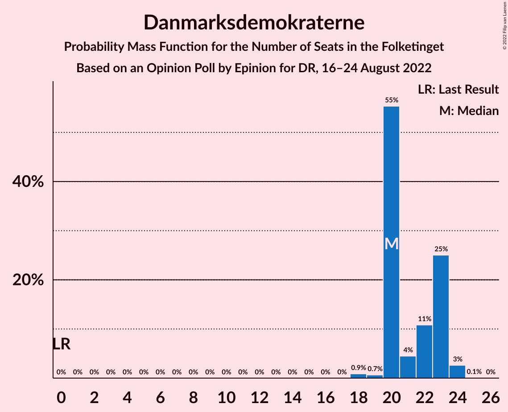
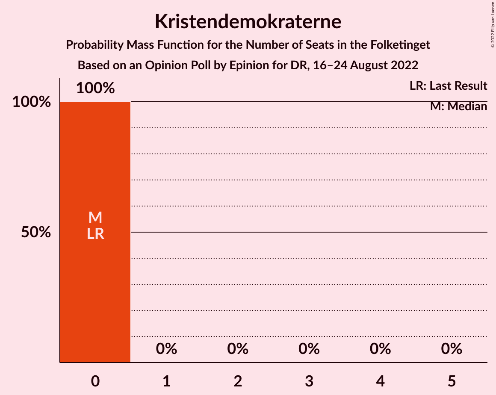

# Opinion Poll by Epinion for DR, 16–24 August 2022

<a href="#voting-intentions">Voting Intentions</a> | <a href="#seats">Seats</a> | <a href="#coalitions">Coalitions</a> | <a href="#technical-information">Technical Information</a>

## Voting Intentions

### Confidence Intervals

| Party | Last Result | Poll Result | 80% Confidence Interval | 90% Confidence Interval | 95% Confidence Interval | 99% Confidence Interval |
|:-----:|:-----------:|:-----------:|:-----------------------:|:-----------------------:|:-----------------------:|:-----------------------:|
| Socialdemokraterne | 25.9% | 23.3% | 22.2–24.5% |21.9–24.8% |21.6–25.1% |21.1–25.7% |
| Det Konservative Folkeparti | 6.6% | 16.7% | 15.7–17.8% |15.5–18.1% |15.2–18.3% |14.8–18.8% |
| Danmarksdemokraterne | 0.0% | 11.8% | 11.0–12.7% |10.7–13.0% |10.5–13.2% |10.1–13.6% |
| Venstre | 23.4% | 11.3% | 10.5–12.2% |10.3–12.5% |10.1–12.7% |9.7–13.1% |
| Socialistisk Folkeparti | 7.7% | 8.7% | 8.0–9.5% |7.8–9.7% |7.6–9.9% |7.3–10.3% |
| Enhedslisten–De Rød-Grønne | 6.9% | 7.3% | 6.6–8.1% |6.5–8.3% |6.3–8.5% |6.0–8.8% |
| Radikale Venstre | 8.6% | 5.5% | 4.9–6.2% |4.8–6.4% |4.6–6.5% |4.4–6.9% |
| Nye Borgerlige | 2.4% | 4.1% | 3.6–4.7% |3.4–4.8% |3.3–5.0% |3.1–5.3% |
| Liberal Alliance | 2.3% | 3.1% | 2.7–3.6% |2.6–3.8% |2.5–3.9% |2.3–4.2% |
| Moderaterne | 0.0% | 2.8% | 2.4–3.3% |2.3–3.4% |2.2–3.6% |2.0–3.8% |
| Dansk Folkeparti | 8.7% | 2.2% | 1.9–2.7% |1.8–2.8% |1.7–2.9% |1.5–3.2% |
| Alternativet | 3.0% | 1.1% | 0.9–1.4% |0.8–1.6% |0.7–1.6% |0.6–1.8% |
| Kristendemokraterne | 1.7% | 0.7% | 0.5–1.0% |0.5–1.1% |0.4–1.2% |0.4–1.3% |
| Frie Grønne | 0.0% | 0.5% | 0.3–0.7% |0.3–0.8% |0.3–0.9% |0.2–1.0% |
| Veganerpartiet | 0.0% | 0.3% | 0.2–0.5% |0.2–0.6% |0.2–0.6% |0.1–0.8% |

*Note:* The poll result column reflects the actual value used in the calculations. Published results may vary slightly, and in addition be rounded to fewer digits.

## Seats

### Confidence Intervals

| Party | Last Result | Median | 80% Confidence Interval | 90% Confidence Interval | 95% Confidence Interval | 99% Confidence Interval |
|:-----:|:-----------:|:------:|:-----------------------:|:-----------------------:|:-----------------------:|:-----------------------:|
| <a href="#socialdemokraterne">Socialdemokraterne</a> | 48 | 41 | 40–44 |40–44 |40–46 |39–46 |
| <a href="#det-konservative-folkeparti">Det Konservative Folkeparti</a> | 12 | 32 | 30–34 |30–34 |29–34 |27–35 |
| <a href="#danmarksdemokraterne">Danmarksdemokraterne</a> | 0 | 20 | 20–23 |20–23 |20–24 |18–24 |
| <a href="#venstre">Venstre</a> | 43 | 17 | 17–22 |17–22 |17–22 |17–23 |
| <a href="#socialistisk-folkeparti">Socialistisk Folkeparti</a> | 14 | 15 | 14–16 |14–17 |13–18 |13–18 |
| <a href="#enhedslisten–de-rød-grønne">Enhedslisten–De Rød-Grønne</a> | 13 | 14 | 12–15 |12–16 |12–16 |11–17 |
| <a href="#radikale-venstre">Radikale Venstre</a> | 16 | 10 | 8–10 |8–10 |8–11 |8–12 |
| <a href="#nye-borgerlige">Nye Borgerlige</a> | 4 | 8 | 7–8 |7–8 |7–8 |5–9 |
| <a href="#liberal-alliance">Liberal Alliance</a> | 4 | 6 | 5–6 |4–6 |4–6 |4–7 |
| <a href="#moderaterne">Moderaterne</a> | 0 | 5 | 5–6 |5–6 |4–6 |0–7 |
| <a href="#dansk-folkeparti">Dansk Folkeparti</a> | 16 | 5 | 4–5 |0–5 |0–5 |0–6 |
| <a href="#alternativet">Alternativet</a> | 5 | 0 | 0 |0 |0 |0 |
| <a href="#kristendemokraterne">Kristendemokraterne</a> | 0 | 0 | 0 |0 |0 |0 |
| <a href="#frie-grønne">Frie Grønne</a> | 0 | 0 | 0 |0 |0 |0 |
| <a href="#veganerpartiet">Veganerpartiet</a> | 0 | 0 | 0 |0 |0 |0 |

### Socialdemokraterne

*For a full overview of the results for this party, see the [Socialdemokraterne](party-socialdemokraterne.html) page.*

| Number of Seats | Probability | Accumulated | Special Marks |
|:---------------:|:-----------:|:-----------:|:-------------:|
| 38 | 0.2% | 100% |  |
| 39 | 1.3% | 99.8% |  |
| 40 | 25% | 98% |  |
| 41 | 39% | 73% | Median |
| 42 | 11% | 34% |  |
| 43 | 2% | 23% |  |
| 44 | 16% | 21% |  |
| 45 | 2% | 5% |  |
| 46 | 3% | 3% |  |
| 47 | 0.1% | 0.1% |  |
| 48 | 0% | 0% | Last Result |

### Det Konservative Folkeparti

*For a full overview of the results for this party, see the [Det Konservative Folkeparti](party-detkonservativefolkeparti.html) page.*

| Number of Seats | Probability | Accumulated | Special Marks |
|:---------------:|:-----------:|:-----------:|:-------------:|
| 12 | 0% | 100% | Last Result |
| 13 | 0% | 100% |  |
| 14 | 0% | 100% |  |
| 15 | 0% | 100% |  |
| 16 | 0% | 100% |  |
| 17 | 0% | 100% |  |
| 18 | 0% | 100% |  |
| 19 | 0% | 100% |  |
| 20 | 0% | 100% |  |
| 21 | 0% | 100% |  |
| 22 | 0% | 100% |  |
| 23 | 0% | 100% |  |
| 24 | 0% | 100% |  |
| 25 | 0% | 100% |  |
| 26 | 0.1% | 100% |  |
| 27 | 0.5% | 99.9% |  |
| 28 | 0.5% | 99.4% |  |
| 29 | 3% | 98.9% |  |
| 30 | 10% | 96% |  |
| 31 | 20% | 86% |  |
| 32 | 26% | 66% | Median |
| 33 | 2% | 41% |  |
| 34 | 37% | 39% |  |
| 35 | 1.5% | 1.5% |  |
| 36 | 0% | 0% |  |

### Danmarksdemokraterne

*For a full overview of the results for this party, see the [Danmarksdemokraterne](party-danmarksdemokraterne.html) page.*

| Number of Seats | Probability | Accumulated | Special Marks |
|:---------------:|:-----------:|:-----------:|:-------------:|
| 0 | 0% | 100% | Last Result |
| 1 | 0% | 100% |  |
| 2 | 0% | 100% |  |
| 3 | 0% | 100% |  |
| 4 | 0% | 100% |  |
| 5 | 0% | 100% |  |
| 6 | 0% | 100% |  |
| 7 | 0% | 100% |  |
| 8 | 0% | 100% |  |
| 9 | 0% | 100% |  |
| 10 | 0% | 100% |  |
| 11 | 0% | 100% |  |
| 12 | 0% | 100% |  |
| 13 | 0% | 100% |  |
| 14 | 0% | 100% |  |
| 15 | 0% | 100% |  |
| 16 | 0% | 100% |  |
| 17 | 0% | 100% |  |
| 18 | 0.9% | 100% |  |
| 19 | 0.7% | 99.1% |  |
| 20 | 55% | 98% | Median |
| 21 | 4% | 43% |  |
| 22 | 11% | 39% |  |
| 23 | 25% | 28% |  |
| 24 | 3% | 3% |  |
| 25 | 0.1% | 0.1% |  |
| 26 | 0% | 0% |  |

### Venstre

*For a full overview of the results for this party, see the [Venstre](party-venstre.html) page.*

| Number of Seats | Probability | Accumulated | Special Marks |
|:---------------:|:-----------:|:-----------:|:-------------:|
| 17 | 50% | 100% | Median |
| 18 | 1.0% | 50% |  |
| 19 | 7% | 49% |  |
| 20 | 10% | 41% |  |
| 21 | 6% | 31% |  |
| 22 | 25% | 26% |  |
| 23 | 0.8% | 1.0% |  |
| 24 | 0.2% | 0.2% |  |
| 25 | 0% | 0% |  |
| 26 | 0% | 0% |  |
| 27 | 0% | 0% |  |
| 28 | 0% | 0% |  |
| 29 | 0% | 0% |  |
| 30 | 0% | 0% |  |
| 31 | 0% | 0% |  |
| 32 | 0% | 0% |  |
| 33 | 0% | 0% |  |
| 34 | 0% | 0% |  |
| 35 | 0% | 0% |  |
| 36 | 0% | 0% |  |
| 37 | 0% | 0% |  |
| 38 | 0% | 0% |  |
| 39 | 0% | 0% |  |
| 40 | 0% | 0% |  |
| 41 | 0% | 0% |  |
| 42 | 0% | 0% |  |
| 43 | 0% | 0% | Last Result |

### Socialistisk Folkeparti

*For a full overview of the results for this party, see the [Socialistisk Folkeparti](party-socialistiskfolkeparti.html) page.*

| Number of Seats | Probability | Accumulated | Special Marks |
|:---------------:|:-----------:|:-----------:|:-------------:|
| 13 | 3% | 100% |  |
| 14 | 25% | 97% | Last Result |
| 15 | 57% | 72% | Median |
| 16 | 8% | 16% |  |
| 17 | 3% | 8% |  |
| 18 | 4% | 5% |  |
| 19 | 0.1% | 0.1% |  |
| 20 | 0% | 0% |  |

### Enhedslisten–De Rød-Grønne

*For a full overview of the results for this party, see the [Enhedslisten–De Rød-Grønne](party-enhedslisten–derød-grønne.html) page.*

| Number of Seats | Probability | Accumulated | Special Marks |
|:---------------:|:-----------:|:-----------:|:-------------:|
| 10 | 0.1% | 100% |  |
| 11 | 2% | 99.9% |  |
| 12 | 24% | 98% |  |
| 13 | 6% | 74% | Last Result |
| 14 | 44% | 68% | Median |
| 15 | 17% | 24% |  |
| 16 | 5% | 7% |  |
| 17 | 1.4% | 1.4% |  |
| 18 | 0% | 0% |  |

### Radikale Venstre

*For a full overview of the results for this party, see the [Radikale Venstre](party-radikalevenstre.html) page.*

| Number of Seats | Probability | Accumulated | Special Marks |
|:---------------:|:-----------:|:-----------:|:-------------:|
| 7 | 0.5% | 100% |  |
| 8 | 25% | 99.5% |  |
| 9 | 22% | 75% |  |
| 10 | 48% | 53% | Median |
| 11 | 3% | 5% |  |
| 12 | 2% | 2% |  |
| 13 | 0.4% | 0.5% |  |
| 14 | 0% | 0% |  |
| 15 | 0% | 0% |  |
| 16 | 0% | 0% | Last Result |

### Nye Borgerlige

*For a full overview of the results for this party, see the [Nye Borgerlige](party-nyeborgerlige.html) page.*

| Number of Seats | Probability | Accumulated | Special Marks |
|:---------------:|:-----------:|:-----------:|:-------------:|
| 4 | 0% | 100% | Last Result |
| 5 | 0.9% | 100% |  |
| 6 | 1.5% | 99.1% |  |
| 7 | 17% | 98% |  |
| 8 | 79% | 81% | Median |
| 9 | 2% | 2% |  |
| 10 | 0.4% | 0.4% |  |
| 11 | 0% | 0% |  |

### Liberal Alliance

*For a full overview of the results for this party, see the [Liberal Alliance](party-liberalalliance.html) page.*

| Number of Seats | Probability | Accumulated | Special Marks |
|:---------------:|:-----------:|:-----------:|:-------------:|
| 0 | 0.1% | 100% |  |
| 1 | 0% | 99.9% |  |
| 2 | 0% | 99.9% |  |
| 3 | 0% | 99.9% |  |
| 4 | 6% | 99.9% | Last Result |
| 5 | 26% | 94% |  |
| 6 | 66% | 68% | Median |
| 7 | 2% | 2% |  |
| 8 | 0.4% | 0.4% |  |
| 9 | 0% | 0% |  |

### Moderaterne

*For a full overview of the results for this party, see the [Moderaterne](party-moderaterne.html) page.*

| Number of Seats | Probability | Accumulated | Special Marks |
|:---------------:|:-----------:|:-----------:|:-------------:|
| 0 | 2% | 100% | Last Result |
| 1 | 0% | 98% |  |
| 2 | 0% | 98% |  |
| 3 | 0% | 98% |  |
| 4 | 3% | 98% |  |
| 5 | 77% | 95% | Median |
| 6 | 16% | 18% |  |
| 7 | 1.4% | 1.4% |  |
| 8 | 0% | 0% |  |

### Dansk Folkeparti

*For a full overview of the results for this party, see the [Dansk Folkeparti](party-danskfolkeparti.html) page.*

| Number of Seats | Probability | Accumulated | Special Marks |
|:---------------:|:-----------:|:-----------:|:-------------:|
| 0 | 6% | 100% |  |
| 1 | 0% | 94% |  |
| 2 | 0% | 94% |  |
| 3 | 0% | 94% |  |
| 4 | 16% | 94% |  |
| 5 | 77% | 78% | Median |
| 6 | 0.6% | 0.6% |  |
| 7 | 0% | 0% |  |
| 8 | 0% | 0% |  |
| 9 | 0% | 0% |  |
| 10 | 0% | 0% |  |
| 11 | 0% | 0% |  |
| 12 | 0% | 0% |  |
| 13 | 0% | 0% |  |
| 14 | 0% | 0% |  |
| 15 | 0% | 0% |  |
| 16 | 0% | 0% | Last Result |

### Alternativet

*For a full overview of the results for this party, see the [Alternativet](party-alternativet.html) page.*

| Number of Seats | Probability | Accumulated | Special Marks |
|:---------------:|:-----------:|:-----------:|:-------------:|
| 0 | 100% | 100% | Median |
| 1 | 0% | 0% |  |
| 2 | 0% | 0% |  |
| 3 | 0% | 0% |  |
| 4 | 0% | 0% |  |
| 5 | 0% | 0% | Last Result |

### Kristendemokraterne

*For a full overview of the results for this party, see the [Kristendemokraterne](party-kristendemokraterne.html) page.*

| Number of Seats | Probability | Accumulated | Special Marks |
|:---------------:|:-----------:|:-----------:|:-------------:|
| 0 | 100% | 100% | Last Result, Median |

### Frie Grønne

*For a full overview of the results for this party, see the [Frie Grønne](party-friegrønne.html) page.*

| Number of Seats | Probability | Accumulated | Special Marks |
|:---------------:|:-----------:|:-----------:|:-------------:|
| 0 | 100% | 100% | Last Result, Median |

### Veganerpartiet

*For a full overview of the results for this party, see the [Veganerpartiet](party-veganerpartiet.html) page.*

| Number of Seats | Probability | Accumulated | Special Marks |
|:---------------:|:-----------:|:-----------:|:-------------:|
| 0 | 100% | 100% | Last Result, Median |

## Coalitions

### Confidence Intervals

| Coalition | Last Result | Median | Majority? | 80% Confidence Interval | 90% Confidence Interval | 95% Confidence Interval | 99% Confidence Interval |
|:---------:|:-----------:|:------:|:---------:|:-----------------------:|:-----------------------:|:-----------------------:|:-----------------------:|
| Det Konservative Folkeparti – Danmarksdemokraterne – Venstre – Nye Borgerlige – Liberal Alliance – Dansk Folkeparti – Kristendemokraterne | 79 | 90 | 66% | 86–96 | 86–96 | 86–96 | 84–96 |
| Socialdemokraterne – Socialistisk Folkeparti – Enhedslisten–De Rød-Grønne – Radikale Venstre – Alternativet | 96 | 80 | 0% | 74–83 | 74–84 | 74–84 | 74–87 |
| Socialdemokraterne – Socialistisk Folkeparti – Enhedslisten–De Rød-Grønne – Radikale Venstre | 91 | 80 | 0% | 74–83 | 74–84 | 74–84 | 74–87 |
| Socialdemokraterne – Socialistisk Folkeparti – Enhedslisten–De Rød-Grønne – Alternativet | 80 | 70 | 0% | 66–74 | 66–74 | 66–74 | 66–75 |
| Socialdemokraterne – Socialistisk Folkeparti – Enhedslisten–De Rød-Grønne | 75 | 70 | 0% | 66–74 | 66–74 | 66–74 | 66–75 |
| Det Konservative Folkeparti – Venstre – Nye Borgerlige – Liberal Alliance – Dansk Folkeparti – Kristendemokraterne | 79 | 70 | 0% | 66–73 | 65–73 | 65–73 | 63–73 |
| Det Konservative Folkeparti – Venstre – Nye Borgerlige – Liberal Alliance – Dansk Folkeparti | 79 | 70 | 0% | 66–73 | 65–73 | 65–73 | 63–73 |
| Socialdemokraterne – Socialistisk Folkeparti – Radikale Venstre | 78 | 66 | 0% | 62–69 | 62–70 | 62–71 | 62–74 |
| Det Konservative Folkeparti – Venstre – Liberal Alliance – Dansk Folkeparti – Kristendemokraterne | 75 | 62 | 0% | 58–65 | 58–65 | 57–65 | 56–65 |
| Det Konservative Folkeparti – Venstre – Liberal Alliance – Dansk Folkeparti | 75 | 62 | 0% | 58–65 | 58–65 | 57–65 | 56–65 |
| Det Konservative Folkeparti – Venstre – Liberal Alliance | 59 | 57 | 0% | 53–60 | 53–60 | 53–60 | 52–61 |
| Socialdemokraterne – Radikale Venstre | 64 | 51 | 0% | 48–53 | 48–54 | 48–55 | 48–58 |
| Det Konservative Folkeparti – Venstre | 55 | 51 | 0% | 48–54 | 48–54 | 48–54 | 47–55 |
| Venstre | 43 | 17 | 0% | 17–22 | 17–22 | 17–22 | 17–23 |

### Det Konservative Folkeparti – Danmarksdemokraterne – Venstre – Nye Borgerlige – Liberal Alliance – Dansk Folkeparti – Kristendemokraterne

| Number of Seats | Probability | Accumulated | Special Marks |
|:---------------:|:-----------:|:-----------:|:-------------:|
| 79 | 0% | 100% | Last Result |
| 80 | 0% | 100% |  |
| 81 | 0% | 100% |  |
| 82 | 0% | 100% |  |
| 83 | 0% | 100% |  |
| 84 | 0.8% | 99.9% |  |
| 85 | 0.3% | 99.2% |  |
| 86 | 18% | 98.9% |  |
| 87 | 9% | 81% |  |
| 88 | 3% | 72% | Median |
| 89 | 3% | 70% |  |
| 90 | 38% | 66% | Majority |
| 91 | 2% | 28% |  |
| 92 | 0.6% | 26% |  |
| 93 | 2% | 25% |  |
| 94 | 0.4% | 23% |  |
| 95 | 0% | 23% |  |
| 96 | 23% | 23% |  |
| 97 | 0% | 0% |  |

### Socialdemokraterne – Socialistisk Folkeparti – Enhedslisten–De Rød-Grønne – Radikale Venstre – Alternativet

| Number of Seats | Probability | Accumulated | Special Marks |
|:---------------:|:-----------:|:-----------:|:-------------:|
| 74 | 23% | 100% |  |
| 75 | 0.2% | 77% |  |
| 76 | 0.6% | 77% |  |
| 77 | 0.1% | 77% |  |
| 78 | 0.9% | 76% |  |
| 79 | 1.0% | 76% |  |
| 80 | 39% | 75% | Median |
| 81 | 4% | 36% |  |
| 82 | 6% | 32% |  |
| 83 | 19% | 26% |  |
| 84 | 5% | 6% |  |
| 85 | 0.4% | 1.3% |  |
| 86 | 0.2% | 0.9% |  |
| 87 | 0.7% | 0.7% |  |
| 88 | 0% | 0% |  |
| 89 | 0% | 0% |  |
| 90 | 0% | 0% | Majority |
| 91 | 0% | 0% |  |
| 92 | 0% | 0% |  |
| 93 | 0% | 0% |  |
| 94 | 0% | 0% |  |
| 95 | 0% | 0% |  |
| 96 | 0% | 0% | Last Result |

### Socialdemokraterne – Socialistisk Folkeparti – Enhedslisten–De Rød-Grønne – Radikale Venstre

| Number of Seats | Probability | Accumulated | Special Marks |
|:---------------:|:-----------:|:-----------:|:-------------:|
| 74 | 23% | 100% |  |
| 75 | 0.2% | 77% |  |
| 76 | 0.6% | 77% |  |
| 77 | 0.1% | 77% |  |
| 78 | 0.9% | 76% |  |
| 79 | 1.0% | 76% |  |
| 80 | 39% | 75% | Median |
| 81 | 4% | 36% |  |
| 82 | 6% | 32% |  |
| 83 | 19% | 26% |  |
| 84 | 5% | 6% |  |
| 85 | 0.4% | 1.3% |  |
| 86 | 0.2% | 0.9% |  |
| 87 | 0.7% | 0.7% |  |
| 88 | 0% | 0% |  |
| 89 | 0% | 0% |  |
| 90 | 0% | 0% | Majority |
| 91 | 0% | 0% | Last Result |

### Socialdemokraterne – Socialistisk Folkeparti – Enhedslisten–De Rød-Grønne – Alternativet

| Number of Seats | Probability | Accumulated | Special Marks |
|:---------------:|:-----------:|:-----------:|:-------------:|
| 65 | 0.3% | 100% |  |
| 66 | 23% | 99.7% |  |
| 67 | 0.4% | 77% |  |
| 68 | 1.1% | 76% |  |
| 69 | 0.6% | 75% |  |
| 70 | 38% | 75% | Median |
| 71 | 3% | 36% |  |
| 72 | 3% | 33% |  |
| 73 | 11% | 31% |  |
| 74 | 18% | 20% |  |
| 75 | 2% | 2% |  |
| 76 | 0.2% | 0.2% |  |
| 77 | 0% | 0% |  |
| 78 | 0% | 0% |  |
| 79 | 0% | 0% |  |
| 80 | 0% | 0% | Last Result |

### Socialdemokraterne – Socialistisk Folkeparti – Enhedslisten–De Rød-Grønne

| Number of Seats | Probability | Accumulated | Special Marks |
|:---------------:|:-----------:|:-----------:|:-------------:|
| 65 | 0.3% | 100% |  |
| 66 | 23% | 99.7% |  |
| 67 | 0.4% | 77% |  |
| 68 | 1.1% | 76% |  |
| 69 | 0.6% | 75% |  |
| 70 | 38% | 75% | Median |
| 71 | 3% | 36% |  |
| 72 | 3% | 33% |  |
| 73 | 11% | 31% |  |
| 74 | 18% | 20% |  |
| 75 | 2% | 2% | Last Result |
| 76 | 0.2% | 0.2% |  |
| 77 | 0% | 0% |  |

### Det Konservative Folkeparti – Venstre – Nye Borgerlige – Liberal Alliance – Dansk Folkeparti – Kristendemokraterne

| Number of Seats | Probability | Accumulated | Special Marks |
|:---------------:|:-----------:|:-----------:|:-------------:|
| 61 | 0.1% | 100% |  |
| 62 | 0% | 99.9% |  |
| 63 | 0.4% | 99.9% |  |
| 64 | 0.7% | 99.5% |  |
| 65 | 8% | 98.8% |  |
| 66 | 19% | 91% |  |
| 67 | 5% | 72% |  |
| 68 | 2% | 67% | Median |
| 69 | 3% | 65% |  |
| 70 | 39% | 62% |  |
| 71 | 0.9% | 24% |  |
| 72 | 0% | 23% |  |
| 73 | 23% | 23% |  |
| 74 | 0% | 0% |  |
| 75 | 0% | 0% |  |
| 76 | 0% | 0% |  |
| 77 | 0% | 0% |  |
| 78 | 0% | 0% |  |
| 79 | 0% | 0% | Last Result |

### Det Konservative Folkeparti – Venstre – Nye Borgerlige – Liberal Alliance – Dansk Folkeparti

| Number of Seats | Probability | Accumulated | Special Marks |
|:---------------:|:-----------:|:-----------:|:-------------:|
| 61 | 0.1% | 100% |  |
| 62 | 0% | 99.9% |  |
| 63 | 0.4% | 99.9% |  |
| 64 | 0.7% | 99.5% |  |
| 65 | 8% | 98.8% |  |
| 66 | 19% | 91% |  |
| 67 | 5% | 72% |  |
| 68 | 2% | 67% | Median |
| 69 | 3% | 65% |  |
| 70 | 39% | 62% |  |
| 71 | 0.9% | 24% |  |
| 72 | 0% | 23% |  |
| 73 | 23% | 23% |  |
| 74 | 0% | 0% |  |
| 75 | 0% | 0% |  |
| 76 | 0% | 0% |  |
| 77 | 0% | 0% |  |
| 78 | 0% | 0% |  |
| 79 | 0% | 0% | Last Result |

### Socialdemokraterne – Socialistisk Folkeparti – Radikale Venstre

| Number of Seats | Probability | Accumulated | Special Marks |
|:---------------:|:-----------:|:-----------:|:-------------:|
| 62 | 23% | 100% |  |
| 63 | 0.6% | 77% |  |
| 64 | 2% | 77% |  |
| 65 | 0.4% | 75% |  |
| 66 | 42% | 75% | Median |
| 67 | 7% | 33% |  |
| 68 | 15% | 26% |  |
| 69 | 3% | 11% |  |
| 70 | 5% | 8% |  |
| 71 | 2% | 3% |  |
| 72 | 0.2% | 1.0% |  |
| 73 | 0.1% | 0.8% |  |
| 74 | 0.6% | 0.7% |  |
| 75 | 0% | 0% |  |
| 76 | 0% | 0% |  |
| 77 | 0% | 0% |  |
| 78 | 0% | 0% | Last Result |

### Det Konservative Folkeparti – Venstre – Liberal Alliance – Dansk Folkeparti – Kristendemokraterne

| Number of Seats | Probability | Accumulated | Special Marks |
|:---------------:|:-----------:|:-----------:|:-------------:|
| 54 | 0.2% | 100% |  |
| 55 | 0.1% | 99.8% |  |
| 56 | 0.4% | 99.7% |  |
| 57 | 2% | 99.3% |  |
| 58 | 20% | 97% |  |
| 59 | 7% | 78% |  |
| 60 | 4% | 71% | Median |
| 61 | 4% | 66% |  |
| 62 | 38% | 63% |  |
| 63 | 0.9% | 25% |  |
| 64 | 0.3% | 24% |  |
| 65 | 23% | 23% |  |
| 66 | 0% | 0% |  |
| 67 | 0% | 0% |  |
| 68 | 0% | 0% |  |
| 69 | 0% | 0% |  |
| 70 | 0% | 0% |  |
| 71 | 0% | 0% |  |
| 72 | 0% | 0% |  |
| 73 | 0% | 0% |  |
| 74 | 0% | 0% |  |
| 75 | 0% | 0% | Last Result |

### Det Konservative Folkeparti – Venstre – Liberal Alliance – Dansk Folkeparti

| Number of Seats | Probability | Accumulated | Special Marks |
|:---------------:|:-----------:|:-----------:|:-------------:|
| 54 | 0.2% | 100% |  |
| 55 | 0.1% | 99.8% |  |
| 56 | 0.4% | 99.7% |  |
| 57 | 2% | 99.3% |  |
| 58 | 20% | 97% |  |
| 59 | 7% | 78% |  |
| 60 | 4% | 71% | Median |
| 61 | 4% | 66% |  |
| 62 | 38% | 63% |  |
| 63 | 0.9% | 25% |  |
| 64 | 0.3% | 24% |  |
| 65 | 23% | 23% |  |
| 66 | 0% | 0% |  |
| 67 | 0% | 0% |  |
| 68 | 0% | 0% |  |
| 69 | 0% | 0% |  |
| 70 | 0% | 0% |  |
| 71 | 0% | 0% |  |
| 72 | 0% | 0% |  |
| 73 | 0% | 0% |  |
| 74 | 0% | 0% |  |
| 75 | 0% | 0% | Last Result |

### Det Konservative Folkeparti – Venstre – Liberal Alliance

| Number of Seats | Probability | Accumulated | Special Marks |
|:---------------:|:-----------:|:-----------:|:-------------:|
| 51 | 0.2% | 100% |  |
| 52 | 0.3% | 99.8% |  |
| 53 | 13% | 99.5% |  |
| 54 | 6% | 86% |  |
| 55 | 7% | 81% | Median |
| 56 | 2% | 73% |  |
| 57 | 43% | 71% |  |
| 58 | 2% | 28% |  |
| 59 | 2% | 26% | Last Result |
| 60 | 23% | 24% |  |
| 61 | 0.9% | 1.0% |  |
| 62 | 0% | 0.1% |  |
| 63 | 0% | 0.1% |  |
| 64 | 0% | 0.1% |  |
| 65 | 0.1% | 0.1% |  |
| 66 | 0% | 0% |  |

### Socialdemokraterne – Radikale Venstre

| Number of Seats | Probability | Accumulated | Special Marks |
|:---------------:|:-----------:|:-----------:|:-------------:|
| 48 | 23% | 100% |  |
| 49 | 2% | 77% |  |
| 50 | 4% | 75% |  |
| 51 | 38% | 71% | Median |
| 52 | 10% | 33% |  |
| 53 | 15% | 22% |  |
| 54 | 3% | 7% |  |
| 55 | 2% | 4% |  |
| 56 | 0.1% | 1.1% |  |
| 57 | 0.3% | 1.0% |  |
| 58 | 0.6% | 0.7% |  |
| 59 | 0.1% | 0.1% |  |
| 60 | 0% | 0% |  |
| 61 | 0% | 0% |  |
| 62 | 0% | 0% |  |
| 63 | 0% | 0% |  |
| 64 | 0% | 0% | Last Result |

### Det Konservative Folkeparti – Venstre

| Number of Seats | Probability | Accumulated | Special Marks |
|:---------------:|:-----------:|:-----------:|:-------------:|
| 46 | 0.5% | 100% |  |
| 47 | 0.1% | 99.5% |  |
| 48 | 13% | 99.5% |  |
| 49 | 4% | 86% | Median |
| 50 | 10% | 82% |  |
| 51 | 40% | 72% |  |
| 52 | 5% | 32% |  |
| 53 | 3% | 28% |  |
| 54 | 23% | 24% |  |
| 55 | 0.7% | 0.8% | Last Result |
| 56 | 0% | 0.1% |  |
| 57 | 0.1% | 0.1% |  |
| 58 | 0% | 0% |  |

### Venstre

| Number of Seats | Probability | Accumulated | Special Marks |
|:---------------:|:-----------:|:-----------:|:-------------:|
| 17 | 50% | 100% | Median |
| 18 | 1.0% | 50% |  |
| 19 | 7% | 49% |  |
| 20 | 10% | 41% |  |
| 21 | 6% | 31% |  |
| 22 | 25% | 26% |  |
| 23 | 0.8% | 1.0% |  |
| 24 | 0.2% | 0.2% |  |
| 25 | 0% | 0% |  |
| 26 | 0% | 0% |  |
| 27 | 0% | 0% |  |
| 28 | 0% | 0% |  |
| 29 | 0% | 0% |  |
| 30 | 0% | 0% |  |
| 31 | 0% | 0% |  |
| 32 | 0% | 0% |  |
| 33 | 0% | 0% |  |
| 34 | 0% | 0% |  |
| 35 | 0% | 0% |  |
| 36 | 0% | 0% |  |
| 37 | 0% | 0% |  |
| 38 | 0% | 0% |  |
| 39 | 0% | 0% |  |
| 40 | 0% | 0% |  |
| 41 | 0% | 0% |  |
| 42 | 0% | 0% |  |
| 43 | 0% | 0% | Last Result |

## Technical Information

### Opinion Poll

+ **Polling firm:** Epinion
+ **Commissioner(s):** DR
+ **Fieldwork period:** 16–24 August 2022

### Calculations

+ **Sample size:** 2256
+ **Simulations done:** 1,048,576
+ **Error estimate:** 2.50%

