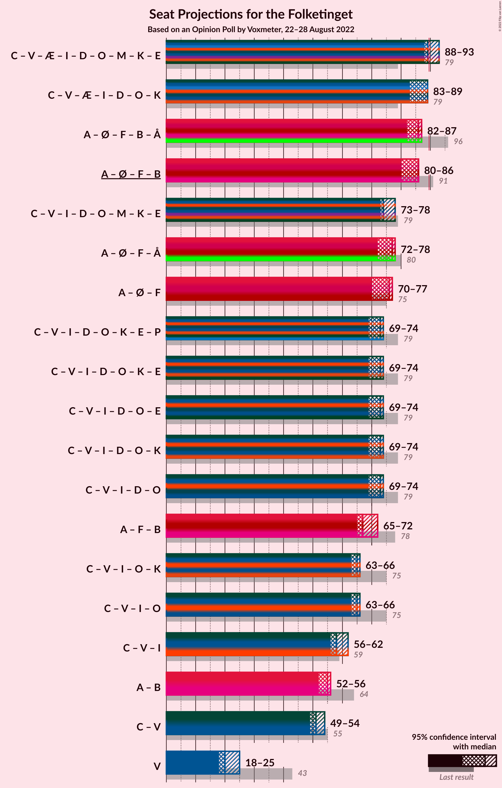
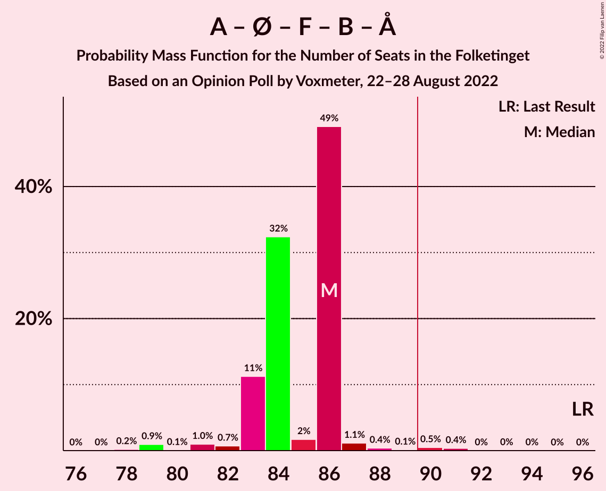

# Opinion Poll by Voxmeter, 22–28 August 2022

<a href="#voting-intentions">Voting Intentions</a> | <a href="#seats">Seats</a> | <a href="#coalitions">Coalitions</a> | <a href="#technical-information">Technical Information</a>

## Voting Intentions

### Confidence Intervals

| Party | Last Result | Poll Result | 80% Confidence Interval | 90% Confidence Interval | 95% Confidence Interval | 99% Confidence Interval |
|:-----:|:-----------:|:-----------:|:-----------------------:|:-----------------------:|:-----------------------:|:-----------------------:|
| Socialdemokraterne | 25.9% | 25.2% | 23.5–27.0% |23.0–27.5% |22.6–28.0% |21.8–28.9% |
| Det Konservative Folkeparti | 6.6% | 16.4% | 15.0–18.0% |14.6–18.4% |14.2–18.8% |13.6–19.6% |
| Venstre | 23.4% | 11.8% | 10.6–13.2% |10.2–13.6% |9.9–13.9% |9.4–14.6% |
| Danmarksdemokraterne | 0.0% | 8.9% | 7.8–10.2% |7.5–10.5% |7.3–10.8% |6.8–11.5% |
| Enhedslisten–De Rød-Grønne | 6.9% | 8.1% | 7.1–9.3% |6.8–9.6% |6.6–10.0% |6.1–10.6% |
| Socialistisk Folkeparti | 7.7% | 7.8% | 6.8–9.0% |6.5–9.3% |6.3–9.6% |5.8–10.2% |
| Radikale Venstre | 8.6% | 5.7% | 4.8–6.8% |4.6–7.1% |4.4–7.3% |4.0–7.8% |
| Liberal Alliance | 2.3% | 4.0% | 3.3–4.9% |3.1–5.2% |2.9–5.4% |2.6–5.9% |
| Nye Borgerlige | 2.4% | 3.7% | 3.0–4.6% |2.9–4.8% |2.7–5.1% |2.4–5.5% |
| Dansk Folkeparti | 8.7% | 3.4% | 2.8–4.3% |2.6–4.5% |2.4–4.7% |2.2–5.2% |
| Moderaterne | 0.0% | 2.3% | 1.8–3.0% |1.6–3.2% |1.5–3.4% |1.3–3.8% |
| Alternativet | 3.0% | 1.4% | 1.0–2.0% |0.9–2.2% |0.8–2.3% |0.7–2.7% |
| Kristendemokraterne | 1.7% | 0.4% | 0.2–0.8% |0.2–0.9% |0.2–1.0% |0.1–1.3% |
| Frie Grønne | 0.0% | 0.4% | 0.2–0.8% |0.2–0.9% |0.2–1.0% |0.1–1.3% |
| Veganerpartiet | 0.0% | 0.2% | 0.1–0.5% |0.1–0.6% |0.1–0.7% |0.0–0.9% |

*Note:* The poll result column reflects the actual value used in the calculations. Published results may vary slightly, and in addition be rounded to fewer digits.

## Seats

### Confidence Intervals

| Party | Last Result | Median | 80% Confidence Interval | 90% Confidence Interval | 95% Confidence Interval | 99% Confidence Interval |
|:-----:|:-----------:|:------:|:-----------------------:|:-----------------------:|:-----------------------:|:-----------------------:|
| <a href="#socialdemokraterne">Socialdemokraterne</a> | 48 | 46 | 43–46 |42–46 |42–46 |41–49 |
| <a href="#det-konservative-folkeparti">Det Konservative Folkeparti</a> | 12 | 31 | 28–31 |28–31 |28–32 |26–33 |
| <a href="#venstre">Venstre</a> | 43 | 20 | 20–25 |20–25 |18–25 |17–25 |
| <a href="#danmarksdemokraterne">Danmarksdemokraterne</a> | 0 | 16 | 14–16 |14–16 |14–16 |12–18 |
| <a href="#enhedslisten–de-rød-grønne">Enhedslisten–De Rød-Grønne</a> | 13 | 16 | 15–19 |14–19 |13–19 |12–19 |
| <a href="#socialistisk-folkeparti">Socialistisk Folkeparti</a> | 14 | 12 | 12–16 |12–16 |12–16 |11–19 |
| <a href="#radikale-venstre">Radikale Venstre</a> | 16 | 9 | 8–10 |8–10 |8–10 |8–13 |
| <a href="#liberal-alliance">Liberal Alliance</a> | 4 | 7 | 6–8 |6–8 |6–8 |6–11 |
| <a href="#nye-borgerlige">Nye Borgerlige</a> | 4 | 8 | 5–8 |5–8 |5–8 |4–9 |
| <a href="#dansk-folkeparti">Dansk Folkeparti</a> | 16 | 7 | 4–7 |4–7 |4–7 |4–8 |
| <a href="#moderaterne">Moderaterne</a> | 0 | 4 | 0–6 |0–6 |0–6 |0–6 |
| <a href="#alternativet">Alternativet</a> | 5 | 0 | 0 |0–4 |0–4 |0–5 |
| <a href="#kristendemokraterne">Kristendemokraterne</a> | 0 | 0 | 0 |0 |0 |0 |
| <a href="#frie-grønne">Frie Grønne</a> | 0 | 0 | 0 |0 |0 |0 |
| <a href="#veganerpartiet">Veganerpartiet</a> | 0 | 0 | 0 |0 |0 |0 |

### Socialdemokraterne

*For a full overview of the results for this party, see the [Socialdemokraterne](party-socialdemokraterne.html) page.*

| Number of Seats | Probability | Accumulated | Special Marks |
|:---------------:|:-----------:|:-----------:|:-------------:|
| 39 | 0.2% | 100% |  |
| 40 | 0.1% | 99.8% |  |
| 41 | 0.5% | 99.7% |  |
| 42 | 9% | 99.3% |  |
| 43 | 2% | 91% |  |
| 44 | 25% | 88% |  |
| 45 | 0.2% | 63% |  |
| 46 | 61% | 63% | Median |
| 47 | 1.0% | 2% |  |
| 48 | 0.3% | 1.3% | Last Result |
| 49 | 0.7% | 0.9% |  |
| 50 | 0.1% | 0.3% |  |
| 51 | 0.1% | 0.2% |  |
| 52 | 0% | 0.1% |  |
| 53 | 0% | 0% |  |

### Det Konservative Folkeparti

*For a full overview of the results for this party, see the [Det Konservative Folkeparti](party-detkonservativefolkeparti.html) page.*

| Number of Seats | Probability | Accumulated | Special Marks |
|:---------------:|:-----------:|:-----------:|:-------------:|
| 12 | 0% | 100% | Last Result |
| 13 | 0% | 100% |  |
| 14 | 0% | 100% |  |
| 15 | 0% | 100% |  |
| 16 | 0% | 100% |  |
| 17 | 0% | 100% |  |
| 18 | 0% | 100% |  |
| 19 | 0% | 100% |  |
| 20 | 0% | 100% |  |
| 21 | 0% | 100% |  |
| 22 | 0% | 100% |  |
| 23 | 0% | 100% |  |
| 24 | 0% | 100% |  |
| 25 | 0% | 100% |  |
| 26 | 0.8% | 99.9% |  |
| 27 | 1.1% | 99.2% |  |
| 28 | 9% | 98% |  |
| 29 | 12% | 89% |  |
| 30 | 25% | 77% |  |
| 31 | 49% | 52% | Median |
| 32 | 2% | 3% |  |
| 33 | 1.4% | 2% |  |
| 34 | 0.1% | 0.3% |  |
| 35 | 0.1% | 0.2% |  |
| 36 | 0% | 0% |  |

### Venstre

*For a full overview of the results for this party, see the [Venstre](party-venstre.html) page.*

| Number of Seats | Probability | Accumulated | Special Marks |
|:---------------:|:-----------:|:-----------:|:-------------:|
| 16 | 0% | 100% |  |
| 17 | 2% | 99.9% |  |
| 18 | 1.2% | 98% |  |
| 19 | 0.5% | 97% |  |
| 20 | 49% | 97% | Median |
| 21 | 11% | 48% |  |
| 22 | 25% | 37% |  |
| 23 | 0.4% | 12% |  |
| 24 | 0.5% | 12% |  |
| 25 | 11% | 12% |  |
| 26 | 0.1% | 0.1% |  |
| 27 | 0% | 0% |  |
| 28 | 0% | 0% |  |
| 29 | 0% | 0% |  |
| 30 | 0% | 0% |  |
| 31 | 0% | 0% |  |
| 32 | 0% | 0% |  |
| 33 | 0% | 0% |  |
| 34 | 0% | 0% |  |
| 35 | 0% | 0% |  |
| 36 | 0% | 0% |  |
| 37 | 0% | 0% |  |
| 38 | 0% | 0% |  |
| 39 | 0% | 0% |  |
| 40 | 0% | 0% |  |
| 41 | 0% | 0% |  |
| 42 | 0% | 0% |  |
| 43 | 0% | 0% | Last Result |

### Danmarksdemokraterne

*For a full overview of the results for this party, see the [Danmarksdemokraterne](party-danmarksdemokraterne.html) page.*

| Number of Seats | Probability | Accumulated | Special Marks |
|:---------------:|:-----------:|:-----------:|:-------------:|
| 0 | 0% | 100% | Last Result |
| 1 | 0% | 100% |  |
| 2 | 0% | 100% |  |
| 3 | 0% | 100% |  |
| 4 | 0% | 100% |  |
| 5 | 0% | 100% |  |
| 6 | 0% | 100% |  |
| 7 | 0% | 100% |  |
| 8 | 0% | 100% |  |
| 9 | 0% | 100% |  |
| 10 | 0% | 100% |  |
| 11 | 0.3% | 100% |  |
| 12 | 0.3% | 99.7% |  |
| 13 | 1.0% | 99.4% |  |
| 14 | 14% | 98% |  |
| 15 | 25% | 85% |  |
| 16 | 58% | 60% | Median |
| 17 | 0.3% | 2% |  |
| 18 | 1.4% | 2% |  |
| 19 | 0.3% | 0.4% |  |
| 20 | 0% | 0.2% |  |
| 21 | 0% | 0.1% |  |
| 22 | 0.1% | 0.1% |  |
| 23 | 0% | 0% |  |

### Enhedslisten–De Rød-Grønne

*For a full overview of the results for this party, see the [Enhedslisten–De Rød-Grønne](party-enhedslisten–derød-grønne.html) page.*

| Number of Seats | Probability | Accumulated | Special Marks |
|:---------------:|:-----------:|:-----------:|:-------------:|
| 11 | 0.1% | 100% |  |
| 12 | 0.4% | 99.8% |  |
| 13 | 3% | 99.5% | Last Result |
| 14 | 2% | 96% |  |
| 15 | 20% | 94% |  |
| 16 | 24% | 74% | Median |
| 17 | 0.4% | 49% |  |
| 18 | 0.2% | 49% |  |
| 19 | 48% | 49% |  |
| 20 | 0.4% | 0.4% |  |
| 21 | 0% | 0% |  |

### Socialistisk Folkeparti

*For a full overview of the results for this party, see the [Socialistisk Folkeparti](party-socialistiskfolkeparti.html) page.*

| Number of Seats | Probability | Accumulated | Special Marks |
|:---------------:|:-----------:|:-----------:|:-------------:|
| 11 | 2% | 100% |  |
| 12 | 61% | 98% | Median |
| 13 | 9% | 38% |  |
| 14 | 0.3% | 29% | Last Result |
| 15 | 2% | 29% |  |
| 16 | 26% | 27% |  |
| 17 | 0.1% | 2% |  |
| 18 | 0.5% | 2% |  |
| 19 | 1.1% | 1.1% |  |
| 20 | 0% | 0% |  |

### Radikale Venstre

*For a full overview of the results for this party, see the [Radikale Venstre](party-radikalevenstre.html) page.*

| Number of Seats | Probability | Accumulated | Special Marks |
|:---------------:|:-----------:|:-----------:|:-------------:|
| 7 | 0.3% | 100% |  |
| 8 | 26% | 99.7% |  |
| 9 | 49% | 73% | Median |
| 10 | 22% | 24% |  |
| 11 | 1.1% | 2% |  |
| 12 | 0.3% | 1.4% |  |
| 13 | 0.9% | 1.1% |  |
| 14 | 0.1% | 0.2% |  |
| 15 | 0% | 0.1% |  |
| 16 | 0% | 0% | Last Result |

### Liberal Alliance

*For a full overview of the results for this party, see the [Liberal Alliance](party-liberalalliance.html) page.*

| Number of Seats | Probability | Accumulated | Special Marks |
|:---------------:|:-----------:|:-----------:|:-------------:|
| 4 | 0.1% | 100% | Last Result |
| 5 | 0.4% | 99.9% |  |
| 6 | 26% | 99.5% |  |
| 7 | 49% | 73% | Median |
| 8 | 22% | 24% |  |
| 9 | 0.2% | 2% |  |
| 10 | 0.8% | 2% |  |
| 11 | 1.0% | 1.0% |  |
| 12 | 0% | 0% |  |

### Nye Borgerlige

*For a full overview of the results for this party, see the [Nye Borgerlige](party-nyeborgerlige.html) page.*

| Number of Seats | Probability | Accumulated | Special Marks |
|:---------------:|:-----------:|:-----------:|:-------------:|
| 4 | 0.9% | 100% | Last Result |
| 5 | 25% | 99.1% |  |
| 6 | 2% | 74% |  |
| 7 | 10% | 73% |  |
| 8 | 61% | 62% | Median |
| 9 | 1.0% | 1.0% |  |
| 10 | 0.1% | 0.1% |  |
| 11 | 0% | 0% |  |

### Dansk Folkeparti

*For a full overview of the results for this party, see the [Dansk Folkeparti](party-danskfolkeparti.html) page.*

| Number of Seats | Probability | Accumulated | Special Marks |
|:---------------:|:-----------:|:-----------:|:-------------:|
| 4 | 12% | 100% |  |
| 5 | 2% | 88% |  |
| 6 | 10% | 87% |  |
| 7 | 76% | 77% | Median |
| 8 | 0.4% | 0.6% |  |
| 9 | 0.2% | 0.2% |  |
| 10 | 0% | 0% |  |
| 11 | 0% | 0% |  |
| 12 | 0% | 0% |  |
| 13 | 0% | 0% |  |
| 14 | 0% | 0% |  |
| 15 | 0% | 0% |  |
| 16 | 0% | 0% | Last Result |

### Moderaterne

*For a full overview of the results for this party, see the [Moderaterne](party-moderaterne.html) page.*

| Number of Seats | Probability | Accumulated | Special Marks |
|:---------------:|:-----------:|:-----------:|:-------------:|
| 0 | 49% | 100% | Last Result |
| 1 | 0% | 51% |  |
| 2 | 0% | 51% |  |
| 3 | 0% | 51% |  |
| 4 | 13% | 51% | Median |
| 5 | 11% | 37% |  |
| 6 | 26% | 26% |  |
| 7 | 0.3% | 0.3% |  |
| 8 | 0% | 0% |  |

### Alternativet

*For a full overview of the results for this party, see the [Alternativet](party-alternativet.html) page.*

| Number of Seats | Probability | Accumulated | Special Marks |
|:---------------:|:-----------:|:-----------:|:-------------:|
| 0 | 90% | 100% | Median |
| 1 | 0% | 10% |  |
| 2 | 0% | 10% |  |
| 3 | 0% | 10% |  |
| 4 | 9% | 10% |  |
| 5 | 1.1% | 1.2% | Last Result |
| 6 | 0% | 0% |  |

### Kristendemokraterne

*For a full overview of the results for this party, see the [Kristendemokraterne](party-kristendemokraterne.html) page.*

| Number of Seats | Probability | Accumulated | Special Marks |
|:---------------:|:-----------:|:-----------:|:-------------:|
| 0 | 100% | 100% | Last Result, Median |

### Frie Grønne

*For a full overview of the results for this party, see the [Frie Grønne](party-friegrønne.html) page.*

| Number of Seats | Probability | Accumulated | Special Marks |
|:---------------:|:-----------:|:-----------:|:-------------:|
| 0 | 100% | 100% | Last Result, Median |

### Veganerpartiet

*For a full overview of the results for this party, see the [Veganerpartiet](party-veganerpartiet.html) page.*

| Number of Seats | Probability | Accumulated | Special Marks |
|:---------------:|:-----------:|:-----------:|:-------------:|
| 0 | 100% | 100% | Last Result, Median |

## Coalitions

### Confidence Intervals

| Coalition | Last Result | Median | Majority? | 80% Confidence Interval | 90% Confidence Interval | 95% Confidence Interval | 99% Confidence Interval |
|:---------:|:-----------:|:------:|:---------:|:-----------------------:|:-----------------------:|:-----------------------:|:-----------------------:|
| Det Konservative Folkeparti – Venstre – Danmarksdemokraterne – Liberal Alliance – Nye Borgerlige – Dansk Folkeparti – Kristendemokraterne | 79 | 89 | 2% | 85–89 | 85–89 | 83–89 | 81–92 |
| Socialdemokraterne – Enhedslisten–De Rød-Grønne – Socialistisk Folkeparti – Radikale Venstre – Alternativet | 96 | 86 | 0.9% | 83–86 | 83–86 | 82–87 | 79–90 |
| Socialdemokraterne – Enhedslisten–De Rød-Grønne – Socialistisk Folkeparti – Radikale Venstre | 91 | 86 | 0.6% | 81–86 | 80–86 | 80–86 | 79–90 |
| Socialdemokraterne – Enhedslisten–De Rød-Grønne – Socialistisk Folkeparti – Alternativet | 80 | 77 | 0% | 73–77 | 73–77 | 72–78 | 68–82 |
| Socialdemokraterne – Enhedslisten–De Rød-Grønne – Socialistisk Folkeparti | 75 | 76 | 0% | 71–77 | 70–77 | 70–77 | 68–79 |
| Det Konservative Folkeparti – Venstre – Liberal Alliance – Nye Borgerlige – Dansk Folkeparti – Kristendemokraterne | 79 | 73 | 0% | 70–74 | 70–74 | 69–74 | 65–75 |
| Det Konservative Folkeparti – Venstre – Liberal Alliance – Nye Borgerlige – Dansk Folkeparti | 79 | 73 | 0% | 70–74 | 70–74 | 69–74 | 65–75 |
| Socialdemokraterne – Socialistisk Folkeparti – Radikale Venstre | 78 | 67 | 0% | 66–68 | 65–69 | 65–72 | 64–76 |
| Det Konservative Folkeparti – Venstre – Liberal Alliance – Dansk Folkeparti – Kristendemokraterne | 75 | 65 | 0% | 63–66 | 63–66 | 63–66 | 60–67 |
| Det Konservative Folkeparti – Venstre – Liberal Alliance – Dansk Folkeparti | 75 | 65 | 0% | 63–66 | 63–66 | 63–66 | 60–67 |
| Det Konservative Folkeparti – Venstre – Liberal Alliance | 59 | 58 | 0% | 57–62 | 57–62 | 56–62 | 55–62 |
| Socialdemokraterne – Radikale Venstre | 64 | 55 | 0% | 52–56 | 52–56 | 52–56 | 50–59 |
| Det Konservative Folkeparti – Venstre | 55 | 51 | 0% | 49–54 | 49–54 | 49–54 | 47–54 |
| Venstre | 43 | 20 | 0% | 20–25 | 20–25 | 18–25 | 17–25 |

### Det Konservative Folkeparti – Venstre – Danmarksdemokraterne – Liberal Alliance – Nye Borgerlige – Dansk Folkeparti – Kristendemokraterne

| Number of Seats | Probability | Accumulated | Special Marks |
|:---------------:|:-----------:|:-----------:|:-------------:|
| 79 | 0.3% | 100% | Last Result |
| 80 | 0.1% | 99.7% |  |
| 81 | 0.5% | 99.6% |  |
| 82 | 0.3% | 99.1% |  |
| 83 | 2% | 98.9% |  |
| 84 | 0.7% | 97% |  |
| 85 | 25% | 96% |  |
| 86 | 9% | 72% |  |
| 87 | 0.2% | 63% |  |
| 88 | 11% | 62% |  |
| 89 | 48% | 51% | Median |
| 90 | 0.8% | 2% | Majority |
| 91 | 1.1% | 2% |  |
| 92 | 0.1% | 0.6% |  |
| 93 | 0.4% | 0.5% |  |
| 94 | 0% | 0.1% |  |
| 95 | 0% | 0.1% |  |
| 96 | 0% | 0% |  |

### Socialdemokraterne – Enhedslisten–De Rød-Grønne – Socialistisk Folkeparti – Radikale Venstre – Alternativet

| Number of Seats | Probability | Accumulated | Special Marks |
|:---------------:|:-----------:|:-----------:|:-------------:|
| 78 | 0.2% | 100% |  |
| 79 | 0.9% | 99.8% |  |
| 80 | 0.1% | 98.8% |  |
| 81 | 1.0% | 98.7% |  |
| 82 | 0.7% | 98% |  |
| 83 | 11% | 97% | Median |
| 84 | 32% | 86% |  |
| 85 | 2% | 53% |  |
| 86 | 49% | 52% |  |
| 87 | 1.1% | 3% |  |
| 88 | 0.4% | 1.4% |  |
| 89 | 0.1% | 1.1% |  |
| 90 | 0.5% | 0.9% | Majority |
| 91 | 0.4% | 0.4% |  |
| 92 | 0% | 0.1% |  |
| 93 | 0% | 0.1% |  |
| 94 | 0% | 0% |  |
| 95 | 0% | 0% |  |
| 96 | 0% | 0% | Last Result |

### Socialdemokraterne – Enhedslisten–De Rød-Grønne – Socialistisk Folkeparti – Radikale Venstre

| Number of Seats | Probability | Accumulated | Special Marks |
|:---------------:|:-----------:|:-----------:|:-------------:|
| 75 | 0.1% | 100% |  |
| 76 | 0% | 99.9% |  |
| 77 | 0% | 99.9% |  |
| 78 | 0.2% | 99.9% |  |
| 79 | 0.9% | 99.7% |  |
| 80 | 8% | 98.7% |  |
| 81 | 1.0% | 91% |  |
| 82 | 2% | 90% |  |
| 83 | 11% | 88% | Median |
| 84 | 24% | 76% |  |
| 85 | 2% | 52% |  |
| 86 | 49% | 50% |  |
| 87 | 0.1% | 1.1% |  |
| 88 | 0.3% | 1.0% |  |
| 89 | 0.1% | 0.6% |  |
| 90 | 0.2% | 0.6% | Majority |
| 91 | 0.3% | 0.3% | Last Result |
| 92 | 0% | 0% |  |

### Socialdemokraterne – Enhedslisten–De Rød-Grønne – Socialistisk Folkeparti – Alternativet

| Number of Seats | Probability | Accumulated | Special Marks |
|:---------------:|:-----------:|:-----------:|:-------------:|
| 67 | 0.1% | 100% |  |
| 68 | 0.6% | 99.9% |  |
| 69 | 1.0% | 99.3% |  |
| 70 | 0.1% | 98% |  |
| 71 | 0.3% | 98% |  |
| 72 | 0.6% | 98% |  |
| 73 | 12% | 97% |  |
| 74 | 9% | 86% | Median |
| 75 | 2% | 77% |  |
| 76 | 24% | 75% |  |
| 77 | 48% | 51% |  |
| 78 | 0.8% | 3% |  |
| 79 | 1.2% | 2% |  |
| 80 | 0% | 0.8% | Last Result |
| 81 | 0.1% | 0.8% |  |
| 82 | 0.6% | 0.7% |  |
| 83 | 0% | 0.1% |  |
| 84 | 0% | 0.1% |  |
| 85 | 0% | 0% |  |

### Socialdemokraterne – Enhedslisten–De Rød-Grønne – Socialistisk Folkeparti

| Number of Seats | Probability | Accumulated | Special Marks |
|:---------------:|:-----------:|:-----------:|:-------------:|
| 65 | 0% | 100% |  |
| 66 | 0% | 99.9% |  |
| 67 | 0.1% | 99.9% |  |
| 68 | 0.6% | 99.8% |  |
| 69 | 0.9% | 99.2% |  |
| 70 | 8% | 98% |  |
| 71 | 0.3% | 90% |  |
| 72 | 0.6% | 90% |  |
| 73 | 12% | 89% |  |
| 74 | 2% | 77% | Median |
| 75 | 2% | 75% | Last Result |
| 76 | 24% | 74% |  |
| 77 | 48% | 50% |  |
| 78 | 1.0% | 2% |  |
| 79 | 0.1% | 0.5% |  |
| 80 | 0% | 0.5% |  |
| 81 | 0.1% | 0.4% |  |
| 82 | 0.3% | 0.3% |  |
| 83 | 0% | 0% |  |

### Det Konservative Folkeparti – Venstre – Liberal Alliance – Nye Borgerlige – Dansk Folkeparti – Kristendemokraterne

| Number of Seats | Probability | Accumulated | Special Marks |
|:---------------:|:-----------:|:-----------:|:-------------:|
| 63 | 0% | 100% |  |
| 64 | 0.2% | 99.9% |  |
| 65 | 0.3% | 99.8% |  |
| 66 | 0.2% | 99.4% |  |
| 67 | 0.1% | 99.2% |  |
| 68 | 0.5% | 99.1% |  |
| 69 | 2% | 98.6% |  |
| 70 | 33% | 97% |  |
| 71 | 0.5% | 64% |  |
| 72 | 0.7% | 63% |  |
| 73 | 50% | 62% | Median |
| 74 | 11% | 13% |  |
| 75 | 1.3% | 2% |  |
| 76 | 0.1% | 0.2% |  |
| 77 | 0% | 0.1% |  |
| 78 | 0% | 0.1% |  |
| 79 | 0% | 0.1% | Last Result |
| 80 | 0% | 0% |  |

### Det Konservative Folkeparti – Venstre – Liberal Alliance – Nye Borgerlige – Dansk Folkeparti

| Number of Seats | Probability | Accumulated | Special Marks |
|:---------------:|:-----------:|:-----------:|:-------------:|
| 63 | 0% | 100% |  |
| 64 | 0.2% | 99.9% |  |
| 65 | 0.3% | 99.8% |  |
| 66 | 0.2% | 99.4% |  |
| 67 | 0.1% | 99.2% |  |
| 68 | 0.5% | 99.1% |  |
| 69 | 2% | 98.6% |  |
| 70 | 33% | 97% |  |
| 71 | 0.5% | 64% |  |
| 72 | 0.7% | 63% |  |
| 73 | 50% | 62% | Median |
| 74 | 11% | 13% |  |
| 75 | 1.3% | 2% |  |
| 76 | 0.1% | 0.2% |  |
| 77 | 0% | 0.1% |  |
| 78 | 0% | 0.1% |  |
| 79 | 0% | 0.1% | Last Result |
| 80 | 0% | 0% |  |

### Socialdemokraterne – Socialistisk Folkeparti – Radikale Venstre

| Number of Seats | Probability | Accumulated | Special Marks |
|:---------------:|:-----------:|:-----------:|:-------------:|
| 62 | 0.4% | 100% |  |
| 63 | 0.1% | 99.6% |  |
| 64 | 0.3% | 99.5% |  |
| 65 | 9% | 99.2% |  |
| 66 | 0.3% | 90% |  |
| 67 | 49% | 90% | Median |
| 68 | 36% | 41% |  |
| 69 | 2% | 5% |  |
| 70 | 0.1% | 4% |  |
| 71 | 1.1% | 4% |  |
| 72 | 2% | 3% |  |
| 73 | 0.1% | 0.8% |  |
| 74 | 0.1% | 0.7% |  |
| 75 | 0% | 0.5% |  |
| 76 | 0.3% | 0.5% |  |
| 77 | 0% | 0.2% |  |
| 78 | 0.2% | 0.2% | Last Result |
| 79 | 0% | 0% |  |

### Det Konservative Folkeparti – Venstre – Liberal Alliance – Dansk Folkeparti – Kristendemokraterne

| Number of Seats | Probability | Accumulated | Special Marks |
|:---------------:|:-----------:|:-----------:|:-------------:|
| 56 | 0% | 100% |  |
| 57 | 0% | 99.9% |  |
| 58 | 0.2% | 99.9% |  |
| 59 | 0.2% | 99.8% |  |
| 60 | 0.1% | 99.5% |  |
| 61 | 0.8% | 99.4% |  |
| 62 | 0.1% | 98.6% |  |
| 63 | 11% | 98% |  |
| 64 | 0.4% | 88% |  |
| 65 | 74% | 88% | Median |
| 66 | 12% | 14% |  |
| 67 | 1.2% | 1.4% |  |
| 68 | 0% | 0.3% |  |
| 69 | 0.1% | 0.2% |  |
| 70 | 0% | 0.1% |  |
| 71 | 0% | 0.1% |  |
| 72 | 0% | 0% |  |
| 73 | 0% | 0% |  |
| 74 | 0% | 0% |  |
| 75 | 0% | 0% | Last Result |

### Det Konservative Folkeparti – Venstre – Liberal Alliance – Dansk Folkeparti

| Number of Seats | Probability | Accumulated | Special Marks |
|:---------------:|:-----------:|:-----------:|:-------------:|
| 56 | 0% | 100% |  |
| 57 | 0% | 99.9% |  |
| 58 | 0.2% | 99.9% |  |
| 59 | 0.2% | 99.8% |  |
| 60 | 0.1% | 99.5% |  |
| 61 | 0.8% | 99.4% |  |
| 62 | 0.1% | 98.6% |  |
| 63 | 11% | 98% |  |
| 64 | 0.4% | 88% |  |
| 65 | 74% | 88% | Median |
| 66 | 12% | 14% |  |
| 67 | 1.2% | 1.4% |  |
| 68 | 0% | 0.3% |  |
| 69 | 0.1% | 0.2% |  |
| 70 | 0% | 0.1% |  |
| 71 | 0% | 0.1% |  |
| 72 | 0% | 0% |  |
| 73 | 0% | 0% |  |
| 74 | 0% | 0% |  |
| 75 | 0% | 0% | Last Result |

### Det Konservative Folkeparti – Venstre – Liberal Alliance

| Number of Seats | Probability | Accumulated | Special Marks |
|:---------------:|:-----------:|:-----------:|:-------------:|
| 51 | 0.1% | 100% |  |
| 52 | 0.2% | 99.9% |  |
| 53 | 0% | 99.7% |  |
| 54 | 0.1% | 99.7% |  |
| 55 | 0.3% | 99.5% |  |
| 56 | 3% | 99.2% |  |
| 57 | 8% | 97% |  |
| 58 | 74% | 88% | Median |
| 59 | 0.7% | 14% | Last Result |
| 60 | 0.8% | 14% |  |
| 61 | 1.1% | 13% |  |
| 62 | 11% | 12% |  |
| 63 | 0.1% | 0.2% |  |
| 64 | 0% | 0.1% |  |
| 65 | 0% | 0.1% |  |
| 66 | 0% | 0% |  |

### Socialdemokraterne – Radikale Venstre

| Number of Seats | Probability | Accumulated | Special Marks |
|:---------------:|:-----------:|:-----------:|:-------------:|
| 47 | 0.1% | 100% |  |
| 48 | 0.2% | 99.9% |  |
| 49 | 0% | 99.7% |  |
| 50 | 0.3% | 99.7% |  |
| 51 | 0.4% | 99.4% |  |
| 52 | 32% | 99.0% |  |
| 53 | 0.8% | 67% |  |
| 54 | 3% | 66% |  |
| 55 | 49% | 63% | Median |
| 56 | 12% | 14% |  |
| 57 | 1.0% | 2% |  |
| 58 | 0.1% | 0.9% |  |
| 59 | 0.5% | 0.9% |  |
| 60 | 0.1% | 0.4% |  |
| 61 | 0.2% | 0.3% |  |
| 62 | 0% | 0.1% |  |
| 63 | 0% | 0.1% |  |
| 64 | 0% | 0.1% | Last Result |
| 65 | 0% | 0% |  |

### Det Konservative Folkeparti – Venstre

| Number of Seats | Probability | Accumulated | Special Marks |
|:---------------:|:-----------:|:-----------:|:-------------:|
| 43 | 0% | 100% |  |
| 44 | 0.2% | 99.9% |  |
| 45 | 0.1% | 99.8% |  |
| 46 | 0% | 99.7% |  |
| 47 | 0.4% | 99.7% |  |
| 48 | 0.9% | 99.2% |  |
| 49 | 9% | 98% |  |
| 50 | 4% | 90% |  |
| 51 | 49% | 86% | Median |
| 52 | 25% | 37% |  |
| 53 | 0.3% | 12% |  |
| 54 | 11% | 12% |  |
| 55 | 0.3% | 0.5% | Last Result |
| 56 | 0% | 0.1% |  |
| 57 | 0.1% | 0.1% |  |
| 58 | 0% | 0% |  |

### Venstre

| Number of Seats | Probability | Accumulated | Special Marks |
|:---------------:|:-----------:|:-----------:|:-------------:|
| 16 | 0% | 100% |  |
| 17 | 2% | 99.9% |  |
| 18 | 1.2% | 98% |  |
| 19 | 0.5% | 97% |  |
| 20 | 49% | 97% | Median |
| 21 | 11% | 48% |  |
| 22 | 25% | 37% |  |
| 23 | 0.4% | 12% |  |
| 24 | 0.5% | 12% |  |
| 25 | 11% | 12% |  |
| 26 | 0.1% | 0.1% |  |
| 27 | 0% | 0% |  |
| 28 | 0% | 0% |  |
| 29 | 0% | 0% |  |
| 30 | 0% | 0% |  |
| 31 | 0% | 0% |  |
| 32 | 0% | 0% |  |
| 33 | 0% | 0% |  |
| 34 | 0% | 0% |  |
| 35 | 0% | 0% |  |
| 36 | 0% | 0% |  |
| 37 | 0% | 0% |  |
| 38 | 0% | 0% |  |
| 39 | 0% | 0% |  |
| 40 | 0% | 0% |  |
| 41 | 0% | 0% |  |
| 42 | 0% | 0% |  |
| 43 | 0% | 0% | Last Result |

## Technical Information

### Opinion Poll

+ **Polling firm:** Voxmeter
+ **Commissioner(s):** —
+ **Fieldwork period:** 22–28 August 2022

### Calculations

+ **Sample size:** 1001
+ **Simulations done:** 1,048,576
+ **Error estimate:** 2.07%

