# Opinion Poll by Gallup for Berlingske, 2 September 2022

<a href="#voting-intentions">Voting Intentions</a> | <a href="#seats">Seats</a> | <a href="#coalitions">Coalitions</a> | <a href="#technical-information">Technical Information</a>

## Voting Intentions

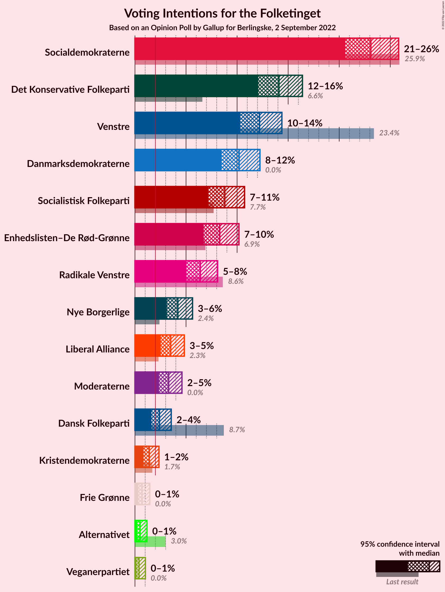

### Confidence Intervals

| Party | Last Result | Poll Result | 80% Confidence Interval | 90% Confidence Interval | 95% Confidence Interval | 99% Confidence Interval |
|:-----:|:-----------:|:-----------:|:-----------------------:|:-----------------------:|:-----------------------:|:-----------------------:|
| Socialdemokraterne | 25.9% | 23.1% | 21.4–24.9% |21.0–25.4% |20.6–25.8% |19.8–26.7% |
| Det Konservative Folkeparti | 6.6% | 14.1% | 12.8–15.6% |12.4–16.0% |12.1–16.4% |11.5–17.1% |
| Venstre | 23.4% | 12.2% | 11.0–13.6% |10.6–14.0% |10.3–14.4% |9.7–15.1% |
| Danmarksdemokraterne | 0.0% | 10.2% | 9.1–11.5% |8.7–11.9% |8.5–12.2% |8.0–12.9% |
| Socialistisk Folkeparti | 7.7% | 8.8% | 7.7–10.1% |7.4–10.4% |7.2–10.7% |6.7–11.4% |
| Enhedslisten–De Rød-Grønne | 6.9% | 8.3% | 7.3–9.5% |7.0–9.9% |6.7–10.2% |6.3–10.8% |
| Radikale Venstre | 8.6% | 6.4% | 5.5–7.5% |5.3–7.8% |5.0–8.1% |4.6–8.7% |
| Nye Borgerlige | 2.4% | 4.2% | 3.5–5.1% |3.3–5.4% |3.1–5.6% |2.8–6.1% |
| Liberal Alliance | 2.3% | 3.5% | 2.9–4.4% |2.7–4.6% |2.5–4.8% |2.2–5.3% |
| Moderaterne | 0.0% | 3.3% | 2.7–4.1% |2.5–4.4% |2.4–4.6% |2.1–5.0% |
| Dansk Folkeparti | 8.7% | 2.4% | 1.9–3.2% |1.7–3.4% |1.6–3.6% |1.4–3.9% |
| Kristendemokraterne | 1.7% | 1.4% | 1.0–2.0% |0.9–2.2% |0.8–2.3% |0.7–2.7% |
| Frie Grønne | 0.0% | 0.7% | 0.5–1.2% |0.4–1.3% |0.3–1.4% |0.2–1.7% |
| Alternativet | 3.0% | 0.5% | 0.3–0.9% |0.3–1.1% |0.2–1.2% |0.2–1.4% |
| Veganerpartiet | 0.0% | 0.4% | 0.2–0.8% |0.2–0.9% |0.2–1.0% |0.1–1.3% |

*Note:* The poll result column reflects the actual value used in the calculations. Published results may vary slightly, and in addition be rounded to fewer digits.

## Seats

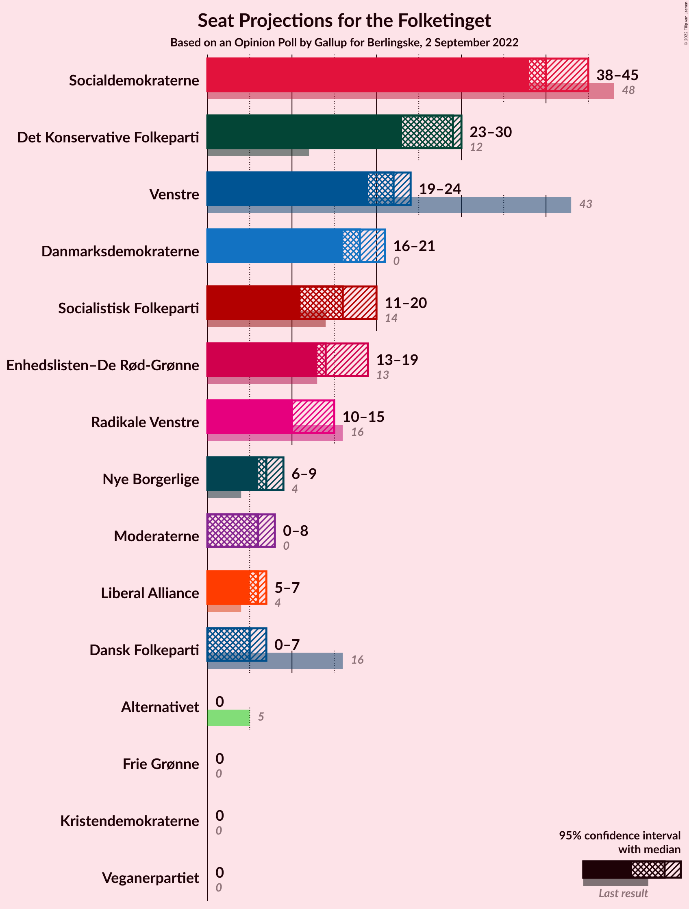

### Confidence Intervals

| Party | Last Result | Median | 80% Confidence Interval | 90% Confidence Interval | 95% Confidence Interval | 99% Confidence Interval |
|:-----:|:-----------:|:------:|:-----------------------:|:-----------------------:|:-----------------------:|:-----------------------:|
| <a href="#socialdemokraterne">Socialdemokraterne</a> | 48 | 40 | 39–45 |39–45 |38–45 |36–45 |
| <a href="#det-konservative-folkeparti">Det Konservative Folkeparti</a> | 12 | 29 | 24–30 |24–30 |23–30 |20–30 |
| <a href="#venstre">Venstre</a> | 43 | 22 | 21–24 |20–24 |19–24 |18–26 |
| <a href="#danmarksdemokraterne">Danmarksdemokraterne</a> | 0 | 18 | 17–20 |16–21 |16–21 |15–22 |
| <a href="#socialistisk-folkeparti">Socialistisk Folkeparti</a> | 14 | 16 | 15–20 |13–20 |11–20 |11–20 |
| <a href="#enhedslisten–de-rød-grønne">Enhedslisten–De Rød-Grønne</a> | 13 | 14 | 13–19 |13–19 |13–19 |11–19 |
| <a href="#radikale-venstre">Radikale Venstre</a> | 16 | 10 | 10–14 |10–14 |10–15 |9–15 |
| <a href="#nye-borgerlige">Nye Borgerlige</a> | 4 | 7 | 7–9 |6–9 |6–9 |6–10 |
| <a href="#liberal-alliance">Liberal Alliance</a> | 4 | 6 | 5–6 |5–7 |5–7 |5–9 |
| <a href="#moderaterne">Moderaterne</a> | 0 | 6 | 4–7 |4–8 |0–8 |0–8 |
| <a href="#dansk-folkeparti">Dansk Folkeparti</a> | 16 | 5 | 0–7 |0–7 |0–7 |0–7 |
| <a href="#kristendemokraterne">Kristendemokraterne</a> | 0 | 0 | 0 |0 |0 |0–4 |
| <a href="#frie-grønne">Frie Grønne</a> | 0 | 0 | 0 |0 |0 |0 |
| <a href="#alternativet">Alternativet</a> | 5 | 0 | 0 |0 |0 |0 |
| <a href="#veganerpartiet">Veganerpartiet</a> | 0 | 0 | 0 |0 |0 |0 |

### Socialdemokraterne

*For a full overview of the results for this party, see the [Socialdemokraterne](party-socialdemokraterne.html) page.*

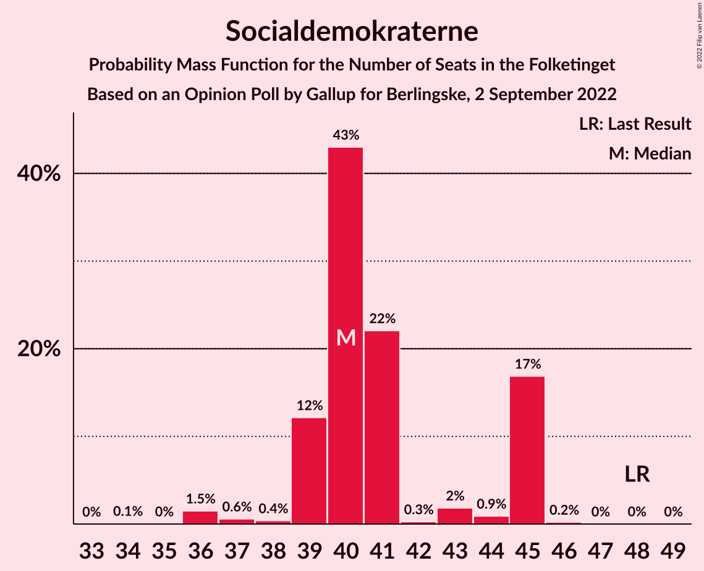

| Number of Seats | Probability | Accumulated | Special Marks |
|:---------------:|:-----------:|:-----------:|:-------------:|
| 34 | 0.1% | 100% |  |
| 35 | 0% | 99.9% |  |
| 36 | 1.5% | 99.9% |  |
| 37 | 0.6% | 98% |  |
| 38 | 0.4% | 98% |  |
| 39 | 12% | 97% |  |
| 40 | 43% | 85% | Median |
| 41 | 22% | 42% |  |
| 42 | 0.3% | 20% |  |
| 43 | 2% | 20% |  |
| 44 | 0.9% | 18% |  |
| 45 | 17% | 17% |  |
| 46 | 0.2% | 0.3% |  |
| 47 | 0% | 0.1% |  |
| 48 | 0% | 0.1% | Last Result |
| 49 | 0% | 0% |  |

### Det Konservative Folkeparti

*For a full overview of the results for this party, see the [Det Konservative Folkeparti](party-detkonservativefolkeparti.html) page.*

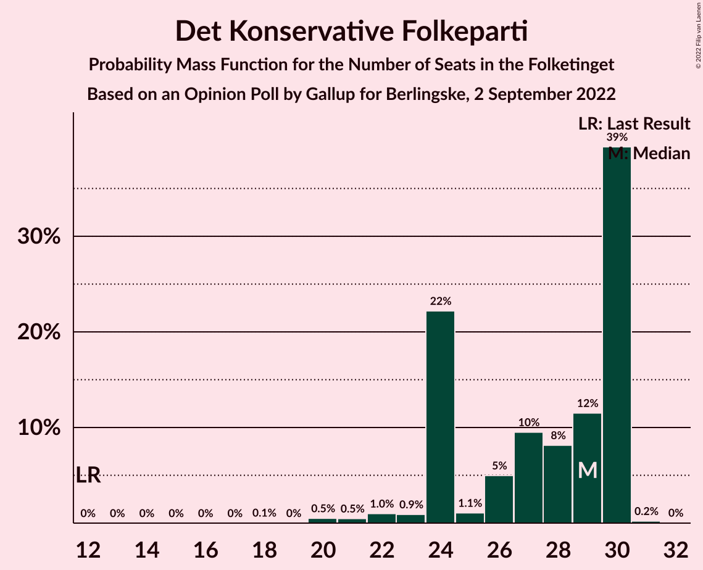

| Number of Seats | Probability | Accumulated | Special Marks |
|:---------------:|:-----------:|:-----------:|:-------------:|
| 12 | 0% | 100% | Last Result |
| 13 | 0% | 100% |  |
| 14 | 0% | 100% |  |
| 15 | 0% | 100% |  |
| 16 | 0% | 100% |  |
| 17 | 0% | 100% |  |
| 18 | 0.1% | 100% |  |
| 19 | 0% | 99.9% |  |
| 20 | 0.5% | 99.9% |  |
| 21 | 0.5% | 99.4% |  |
| 22 | 1.0% | 99.0% |  |
| 23 | 0.9% | 98% |  |
| 24 | 22% | 97% |  |
| 25 | 1.1% | 75% |  |
| 26 | 5% | 74% |  |
| 27 | 10% | 69% |  |
| 28 | 8% | 59% |  |
| 29 | 12% | 51% | Median |
| 30 | 39% | 40% |  |
| 31 | 0.2% | 0.3% |  |
| 32 | 0% | 0% |  |

### Venstre

*For a full overview of the results for this party, see the [Venstre](party-venstre.html) page.*

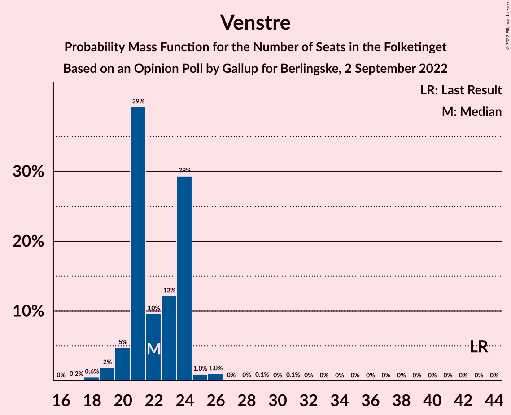

| Number of Seats | Probability | Accumulated | Special Marks |
|:---------------:|:-----------:|:-----------:|:-------------:|
| 17 | 0.2% | 100% |  |
| 18 | 0.6% | 99.8% |  |
| 19 | 2% | 99.2% |  |
| 20 | 5% | 97% |  |
| 21 | 39% | 93% |  |
| 22 | 10% | 53% | Median |
| 23 | 12% | 44% |  |
| 24 | 29% | 32% |  |
| 25 | 1.0% | 2% |  |
| 26 | 1.0% | 1.2% |  |
| 27 | 0% | 0.2% |  |
| 28 | 0% | 0.2% |  |
| 29 | 0.1% | 0.1% |  |
| 30 | 0% | 0.1% |  |
| 31 | 0.1% | 0.1% |  |
| 32 | 0% | 0% |  |
| 33 | 0% | 0% |  |
| 34 | 0% | 0% |  |
| 35 | 0% | 0% |  |
| 36 | 0% | 0% |  |
| 37 | 0% | 0% |  |
| 38 | 0% | 0% |  |
| 39 | 0% | 0% |  |
| 40 | 0% | 0% |  |
| 41 | 0% | 0% |  |
| 42 | 0% | 0% |  |
| 43 | 0% | 0% | Last Result |

### Danmarksdemokraterne

*For a full overview of the results for this party, see the [Danmarksdemokraterne](party-danmarksdemokraterne.html) page.*

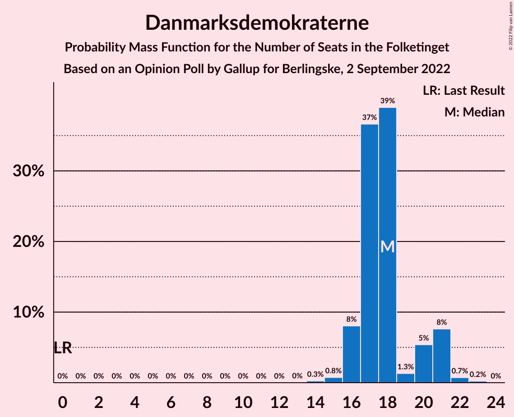

| Number of Seats | Probability | Accumulated | Special Marks |
|:---------------:|:-----------:|:-----------:|:-------------:|
| 0 | 0% | 100% | Last Result |
| 1 | 0% | 100% |  |
| 2 | 0% | 100% |  |
| 3 | 0% | 100% |  |
| 4 | 0% | 100% |  |
| 5 | 0% | 100% |  |
| 6 | 0% | 100% |  |
| 7 | 0% | 100% |  |
| 8 | 0% | 100% |  |
| 9 | 0% | 100% |  |
| 10 | 0% | 100% |  |
| 11 | 0% | 100% |  |
| 12 | 0% | 100% |  |
| 13 | 0% | 100% |  |
| 14 | 0.3% | 100% |  |
| 15 | 0.8% | 99.7% |  |
| 16 | 8% | 99.0% |  |
| 17 | 37% | 91% |  |
| 18 | 39% | 54% | Median |
| 19 | 1.3% | 15% |  |
| 20 | 5% | 14% |  |
| 21 | 8% | 9% |  |
| 22 | 0.7% | 1.0% |  |
| 23 | 0.2% | 0.3% |  |
| 24 | 0% | 0% |  |

### Socialistisk Folkeparti

*For a full overview of the results for this party, see the [Socialistisk Folkeparti](party-socialistiskfolkeparti.html) page.*

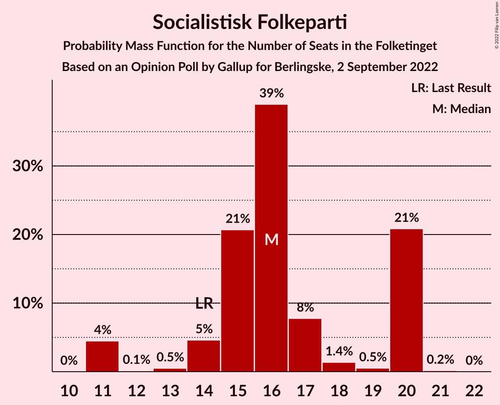

| Number of Seats | Probability | Accumulated | Special Marks |
|:---------------:|:-----------:|:-----------:|:-------------:|
| 11 | 4% | 100% |  |
| 12 | 0.1% | 96% |  |
| 13 | 0.5% | 95% |  |
| 14 | 5% | 95% | Last Result |
| 15 | 21% | 90% |  |
| 16 | 39% | 70% | Median |
| 17 | 8% | 31% |  |
| 18 | 1.4% | 23% |  |
| 19 | 0.5% | 22% |  |
| 20 | 21% | 21% |  |
| 21 | 0.2% | 0.2% |  |
| 22 | 0% | 0% |  |

### Enhedslisten–De Rød-Grønne

*For a full overview of the results for this party, see the [Enhedslisten–De Rød-Grønne](party-enhedslisten–derød-grønne.html) page.*

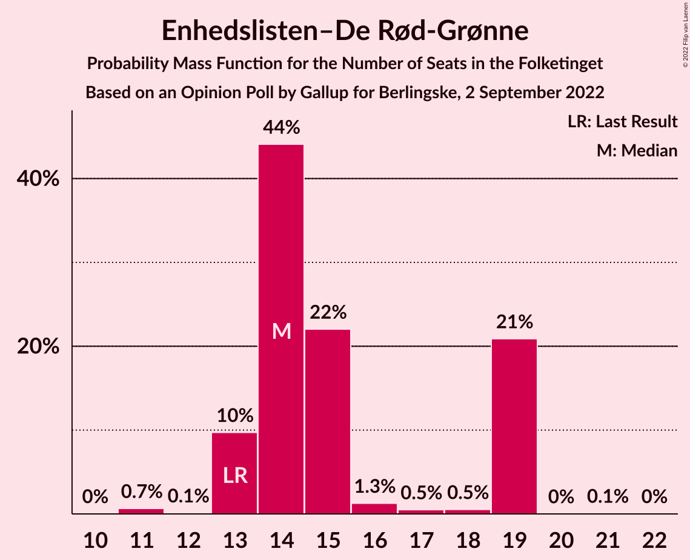

| Number of Seats | Probability | Accumulated | Special Marks |
|:---------------:|:-----------:|:-----------:|:-------------:|
| 11 | 0.7% | 100% |  |
| 12 | 0.1% | 99.3% |  |
| 13 | 10% | 99.2% | Last Result |
| 14 | 44% | 89% | Median |
| 15 | 22% | 45% |  |
| 16 | 1.3% | 23% |  |
| 17 | 0.5% | 22% |  |
| 18 | 0.5% | 22% |  |
| 19 | 21% | 21% |  |
| 20 | 0% | 0.2% |  |
| 21 | 0.1% | 0.1% |  |
| 22 | 0% | 0% |  |

### Radikale Venstre

*For a full overview of the results for this party, see the [Radikale Venstre](party-radikalevenstre.html) page.*

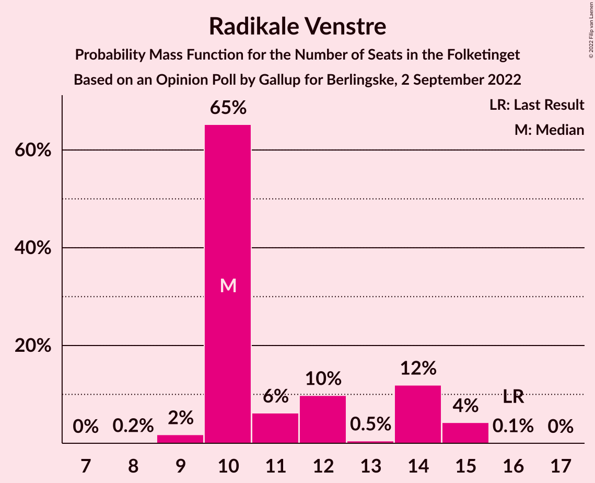

| Number of Seats | Probability | Accumulated | Special Marks |
|:---------------:|:-----------:|:-----------:|:-------------:|
| 8 | 0.2% | 100% |  |
| 9 | 2% | 99.8% |  |
| 10 | 65% | 98% | Median |
| 11 | 6% | 33% |  |
| 12 | 10% | 27% |  |
| 13 | 0.5% | 17% |  |
| 14 | 12% | 16% |  |
| 15 | 4% | 4% |  |
| 16 | 0.1% | 0.1% | Last Result |
| 17 | 0% | 0% |  |

### Nye Borgerlige

*For a full overview of the results for this party, see the [Nye Borgerlige](party-nyeborgerlige.html) page.*

| Number of Seats | Probability | Accumulated | Special Marks |
|:---------------:|:-----------:|:-----------:|:-------------:|
| 4 | 0% | 100% | Last Result |
| 5 | 0.1% | 100% |  |
| 6 | 9% | 99.9% |  |
| 7 | 50% | 91% | Median |
| 8 | 19% | 41% |  |
| 9 | 21% | 23% |  |
| 10 | 0.9% | 1.2% |  |
| 11 | 0.2% | 0.3% |  |
| 12 | 0.1% | 0.1% |  |
| 13 | 0% | 0% |  |

### Liberal Alliance

*For a full overview of the results for this party, see the [Liberal Alliance](party-liberalalliance.html) page.*

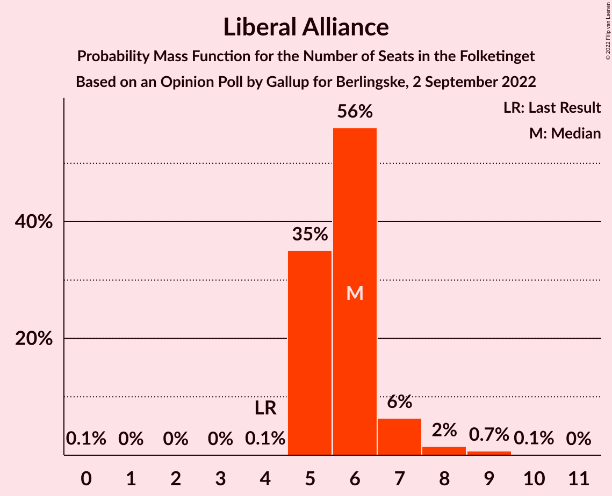

| Number of Seats | Probability | Accumulated | Special Marks |
|:---------------:|:-----------:|:-----------:|:-------------:|
| 0 | 0.1% | 100% |  |
| 1 | 0% | 99.9% |  |
| 2 | 0% | 99.9% |  |
| 3 | 0% | 99.9% |  |
| 4 | 0.1% | 99.9% | Last Result |
| 5 | 35% | 99.9% |  |
| 6 | 56% | 65% | Median |
| 7 | 6% | 9% |  |
| 8 | 2% | 2% |  |
| 9 | 0.7% | 0.9% |  |
| 10 | 0.1% | 0.1% |  |
| 11 | 0% | 0% |  |

### Moderaterne

*For a full overview of the results for this party, see the [Moderaterne](party-moderaterne.html) page.*

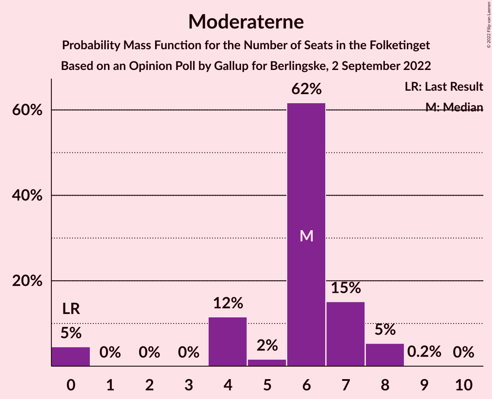

| Number of Seats | Probability | Accumulated | Special Marks |
|:---------------:|:-----------:|:-----------:|:-------------:|
| 0 | 5% | 100% | Last Result |
| 1 | 0% | 95% |  |
| 2 | 0% | 95% |  |
| 3 | 0% | 95% |  |
| 4 | 12% | 95% |  |
| 5 | 2% | 84% |  |
| 6 | 62% | 82% | Median |
| 7 | 15% | 21% |  |
| 8 | 5% | 6% |  |
| 9 | 0.2% | 0.2% |  |
| 10 | 0% | 0% |  |

### Dansk Folkeparti

*For a full overview of the results for this party, see the [Dansk Folkeparti](party-danskfolkeparti.html) page.*

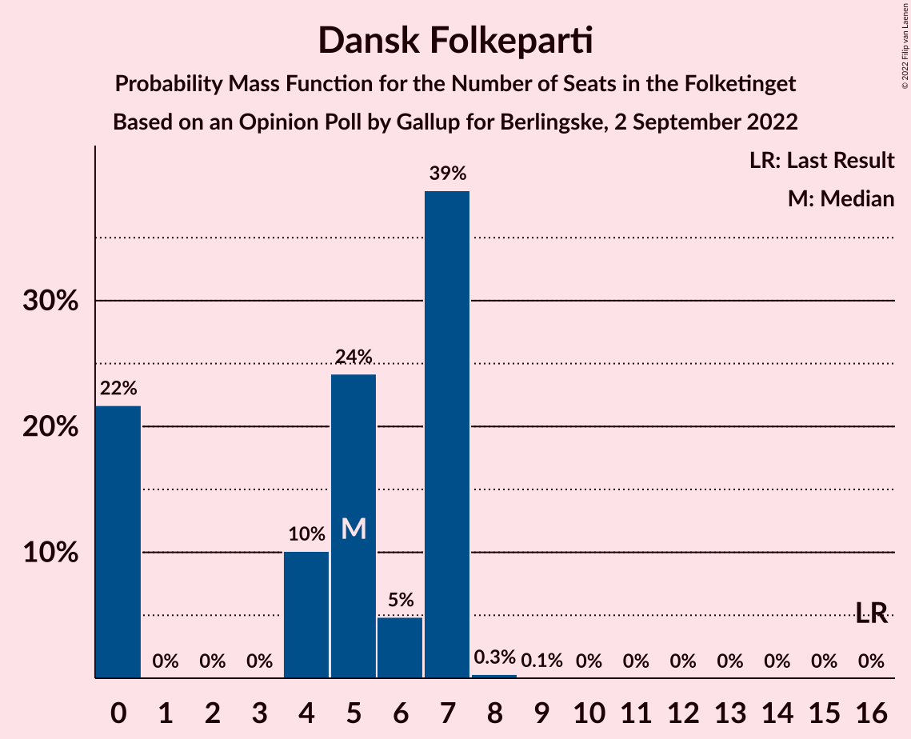

| Number of Seats | Probability | Accumulated | Special Marks |
|:---------------:|:-----------:|:-----------:|:-------------:|
| 0 | 22% | 100% |  |
| 1 | 0% | 78% |  |
| 2 | 0% | 78% |  |
| 3 | 0% | 78% |  |
| 4 | 10% | 78% |  |
| 5 | 24% | 68% | Median |
| 6 | 5% | 44% |  |
| 7 | 39% | 39% |  |
| 8 | 0.3% | 0.4% |  |
| 9 | 0.1% | 0.1% |  |
| 10 | 0% | 0% |  |
| 11 | 0% | 0% |  |
| 12 | 0% | 0% |  |
| 13 | 0% | 0% |  |
| 14 | 0% | 0% |  |
| 15 | 0% | 0% |  |
| 16 | 0% | 0% | Last Result |

### Kristendemokraterne

*For a full overview of the results for this party, see the [Kristendemokraterne](party-kristendemokraterne.html) page.*

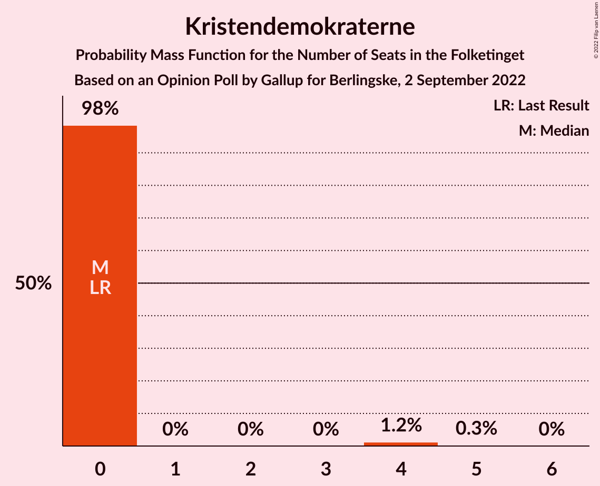

| Number of Seats | Probability | Accumulated | Special Marks |
|:---------------:|:-----------:|:-----------:|:-------------:|
| 0 | 98% | 100% | Last Result, Median |
| 1 | 0% | 2% |  |
| 2 | 0% | 2% |  |
| 3 | 0% | 2% |  |
| 4 | 1.2% | 2% |  |
| 5 | 0.3% | 0.3% |  |
| 6 | 0% | 0% |  |

### Frie Grønne

*For a full overview of the results for this party, see the [Frie Grønne](party-friegrønne.html) page.*

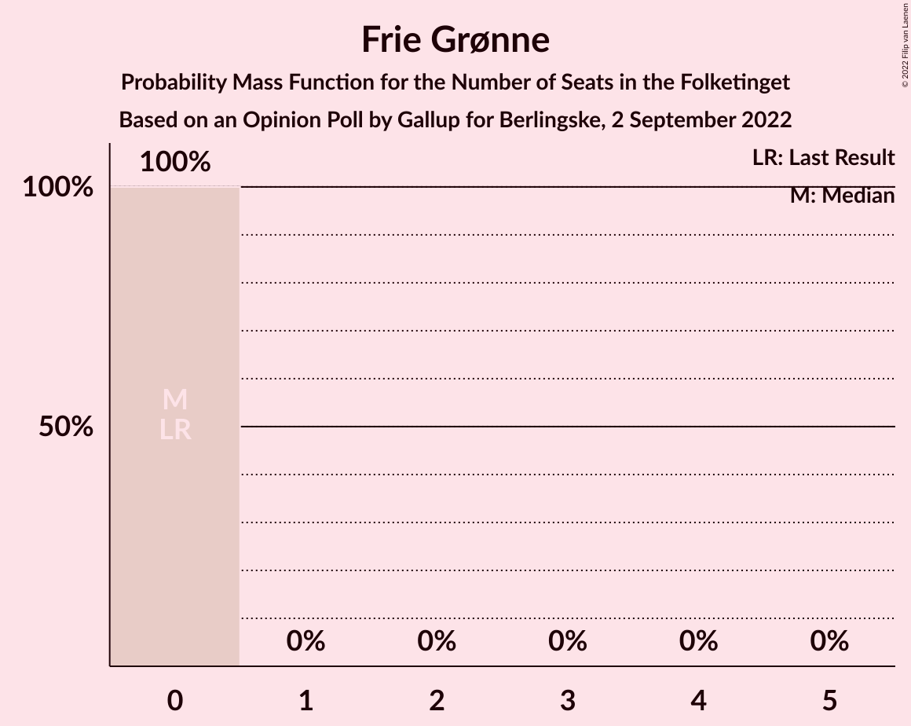

| Number of Seats | Probability | Accumulated | Special Marks |
|:---------------:|:-----------:|:-----------:|:-------------:|
| 0 | 100% | 100% | Last Result, Median |

### Alternativet

*For a full overview of the results for this party, see the [Alternativet](party-alternativet.html) page.*

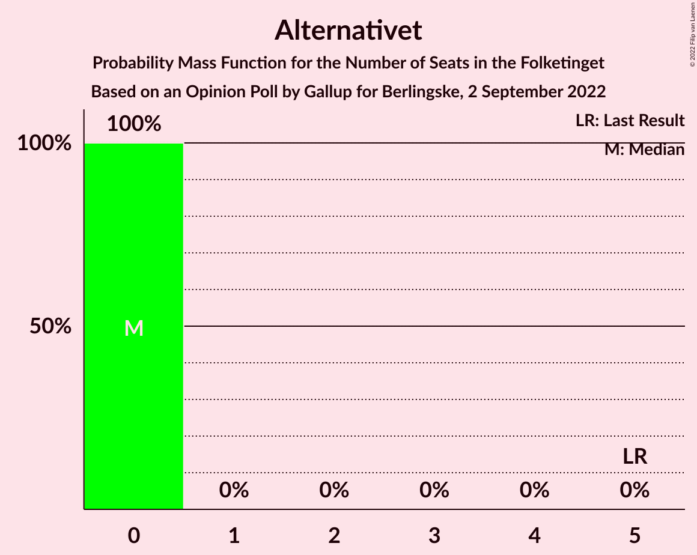

| Number of Seats | Probability | Accumulated | Special Marks |
|:---------------:|:-----------:|:-----------:|:-------------:|
| 0 | 100% | 100% | Median |
| 1 | 0% | 0% |  |
| 2 | 0% | 0% |  |
| 3 | 0% | 0% |  |
| 4 | 0% | 0% |  |
| 5 | 0% | 0% | Last Result |

### Veganerpartiet

*For a full overview of the results for this party, see the [Veganerpartiet](party-veganerpartiet.html) page.*

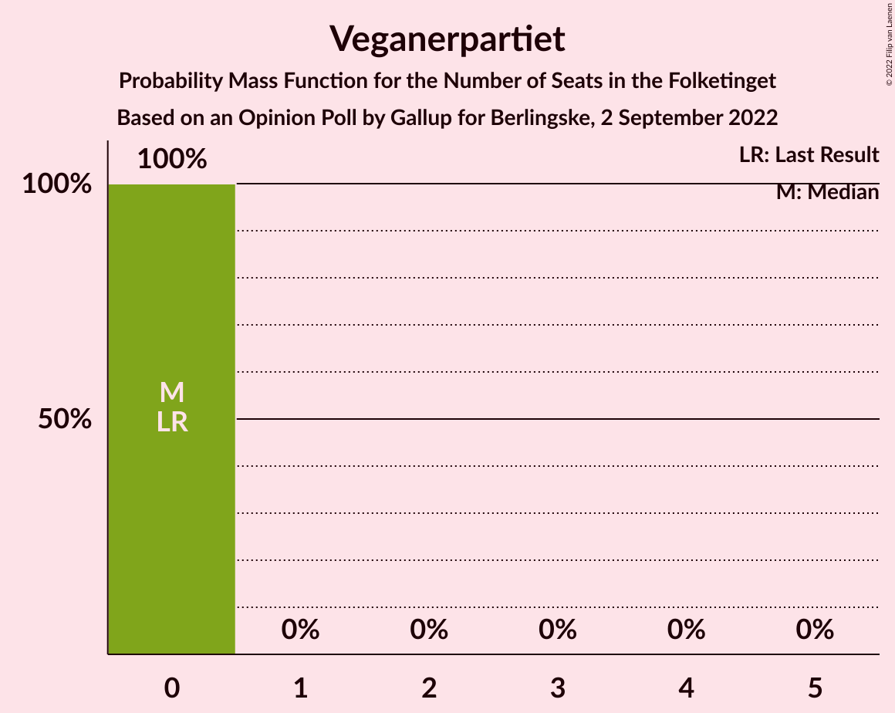

| Number of Seats | Probability | Accumulated | Special Marks |
|:---------------:|:-----------:|:-----------:|:-------------:|
| 0 | 100% | 100% | Last Result, Median |

## Coalitions

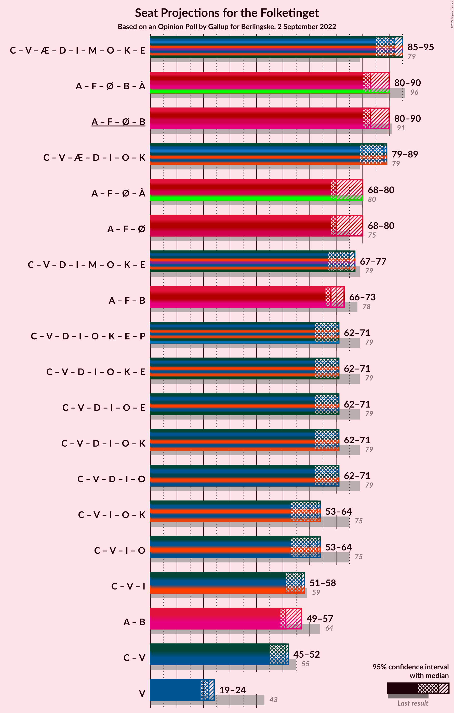

### Confidence Intervals

| Coalition | Last Result | Median | Majority? | 80% Confidence Interval | 90% Confidence Interval | 95% Confidence Interval | 99% Confidence Interval |
|:---------:|:-----------:|:------:|:---------:|:-----------------------:|:-----------------------:|:-----------------------:|:-----------------------:|
| Socialdemokraterne – Socialistisk Folkeparti – Enhedslisten–De Rød-Grønne – Radikale Venstre – Alternativet | 96 | 83 | 21% | 80–90 | 80–90 | 80–90 | 77–90 |
| Socialdemokraterne – Socialistisk Folkeparti – Enhedslisten–De Rød-Grønne – Radikale Venstre | 91 | 83 | 21% | 80–90 | 80–90 | 80–90 | 77–90 |
| Det Konservative Folkeparti – Venstre – Danmarksdemokraterne – Nye Borgerlige – Liberal Alliance – Dansk Folkeparti – Kristendemokraterne | 79 | 88 | 2% | 79–89 | 79–89 | 79–89 | 79–92 |
| Socialdemokraterne – Socialistisk Folkeparti – Enhedslisten–De Rød-Grønne – Alternativet | 80 | 70 | 0% | 69–80 | 69–80 | 68–80 | 66–80 |
| Socialdemokraterne – Socialistisk Folkeparti – Enhedslisten–De Rød-Grønne | 75 | 70 | 0% | 69–80 | 69–80 | 68–80 | 66–80 |
| Socialdemokraterne – Socialistisk Folkeparti – Radikale Venstre | 78 | 68 | 0% | 66–72 | 66–73 | 66–73 | 64–73 |
| Det Konservative Folkeparti – Venstre – Nye Borgerlige – Liberal Alliance – Dansk Folkeparti – Kristendemokraterne | 79 | 71 | 0% | 62–71 | 62–71 | 62–71 | 61–71 |
| Det Konservative Folkeparti – Venstre – Nye Borgerlige – Liberal Alliance – Dansk Folkeparti | 79 | 71 | 0% | 62–71 | 62–71 | 62–71 | 60–71 |
| Det Konservative Folkeparti – Venstre – Liberal Alliance – Dansk Folkeparti – Kristendemokraterne | 75 | 63 | 0% | 53–64 | 53–64 | 53–64 | 53–64 |
| Det Konservative Folkeparti – Venstre – Liberal Alliance – Dansk Folkeparti | 75 | 63 | 0% | 53–64 | 53–64 | 53–64 | 52–64 |
| Det Konservative Folkeparti – Venstre – Liberal Alliance | 59 | 57 | 0% | 53–58 | 53–58 | 51–58 | 48–58 |
| Socialdemokraterne – Radikale Venstre | 64 | 51 | 0% | 50–56 | 50–57 | 49–57 | 47–58 |
| Det Konservative Folkeparti – Venstre | 55 | 51 | 0% | 48–52 | 47–52 | 45–52 | 41–52 |
| Venstre | 43 | 22 | 0% | 21–24 | 20–24 | 19–24 | 18–26 |

### Socialdemokraterne – Socialistisk Folkeparti – Enhedslisten–De Rød-Grønne – Radikale Venstre – Alternativet

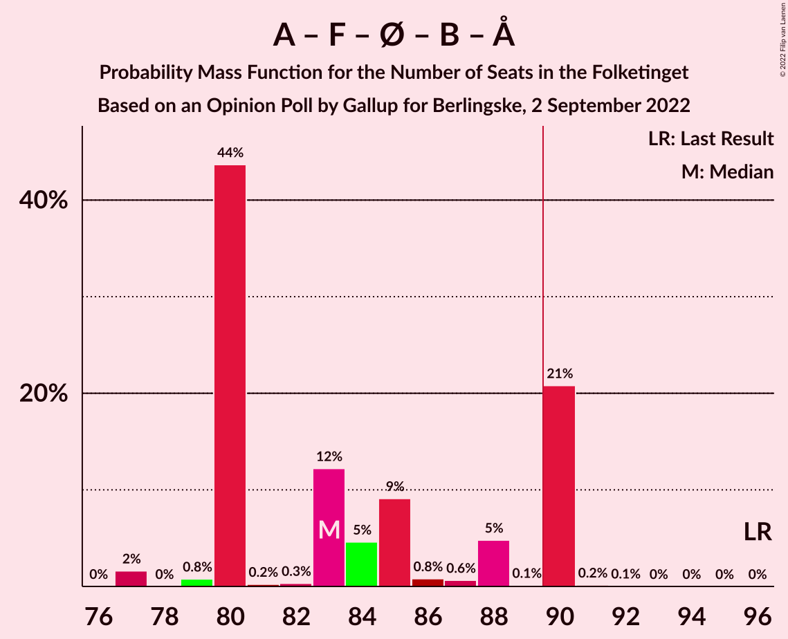

| Number of Seats | Probability | Accumulated | Special Marks |
|:---------------:|:-----------:|:-----------:|:-------------:|
| 77 | 2% | 100% |  |
| 78 | 0% | 98% |  |
| 79 | 0.8% | 98% |  |
| 80 | 44% | 98% | Median |
| 81 | 0.2% | 54% |  |
| 82 | 0.3% | 54% |  |
| 83 | 12% | 53% |  |
| 84 | 5% | 41% |  |
| 85 | 9% | 37% |  |
| 86 | 0.8% | 27% |  |
| 87 | 0.6% | 27% |  |
| 88 | 5% | 26% |  |
| 89 | 0.1% | 21% |  |
| 90 | 21% | 21% | Majority |
| 91 | 0.2% | 0.2% |  |
| 92 | 0.1% | 0.1% |  |
| 93 | 0% | 0% |  |
| 94 | 0% | 0% |  |
| 95 | 0% | 0% |  |
| 96 | 0% | 0% | Last Result |

### Socialdemokraterne – Socialistisk Folkeparti – Enhedslisten–De Rød-Grønne – Radikale Venstre

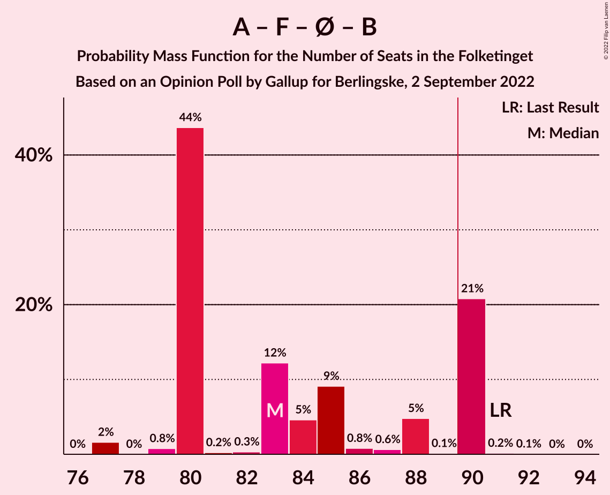

| Number of Seats | Probability | Accumulated | Special Marks |
|:---------------:|:-----------:|:-----------:|:-------------:|
| 77 | 2% | 100% |  |
| 78 | 0% | 98% |  |
| 79 | 0.8% | 98% |  |
| 80 | 44% | 98% | Median |
| 81 | 0.2% | 54% |  |
| 82 | 0.3% | 54% |  |
| 83 | 12% | 53% |  |
| 84 | 5% | 41% |  |
| 85 | 9% | 37% |  |
| 86 | 0.8% | 27% |  |
| 87 | 0.6% | 27% |  |
| 88 | 5% | 26% |  |
| 89 | 0.1% | 21% |  |
| 90 | 21% | 21% | Majority |
| 91 | 0.2% | 0.2% | Last Result |
| 92 | 0.1% | 0.1% |  |
| 93 | 0% | 0% |  |

### Det Konservative Folkeparti – Venstre – Danmarksdemokraterne – Nye Borgerlige – Liberal Alliance – Dansk Folkeparti – Kristendemokraterne

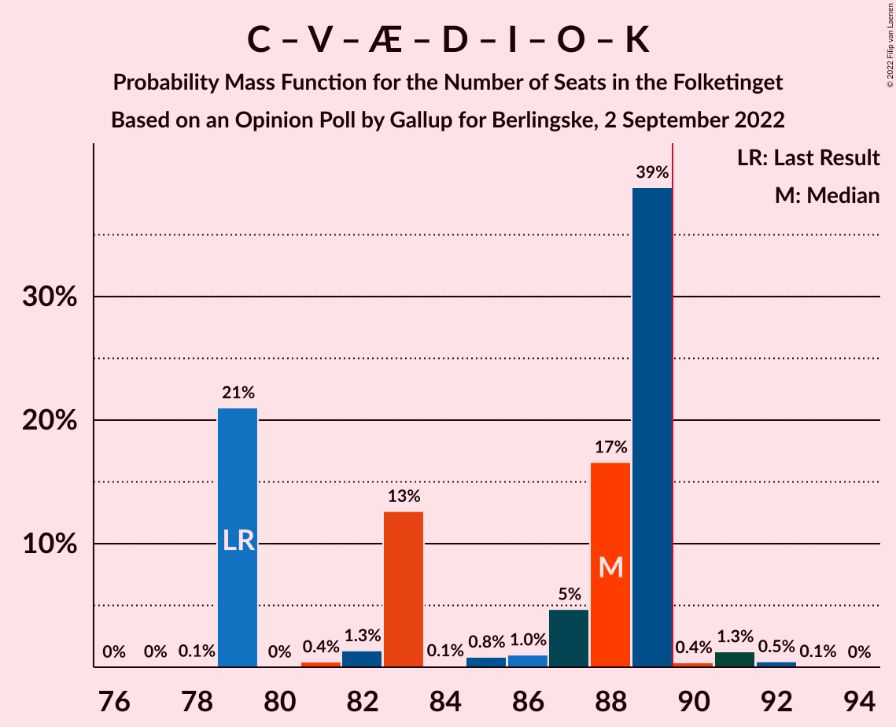

| Number of Seats | Probability | Accumulated | Special Marks |
|:---------------:|:-----------:|:-----------:|:-------------:|
| 76 | 0% | 100% |  |
| 77 | 0% | 99.9% |  |
| 78 | 0.1% | 99.9% |  |
| 79 | 21% | 99.8% | Last Result |
| 80 | 0% | 79% |  |
| 81 | 0.4% | 79% |  |
| 82 | 1.3% | 78% |  |
| 83 | 13% | 77% |  |
| 84 | 0.1% | 64% |  |
| 85 | 0.8% | 64% |  |
| 86 | 1.0% | 63% |  |
| 87 | 5% | 62% | Median |
| 88 | 17% | 58% |  |
| 89 | 39% | 41% |  |
| 90 | 0.4% | 2% | Majority |
| 91 | 1.3% | 2% |  |
| 92 | 0.5% | 0.6% |  |
| 93 | 0.1% | 0.1% |  |
| 94 | 0% | 0% |  |

### Socialdemokraterne – Socialistisk Folkeparti – Enhedslisten–De Rød-Grønne – Alternativet

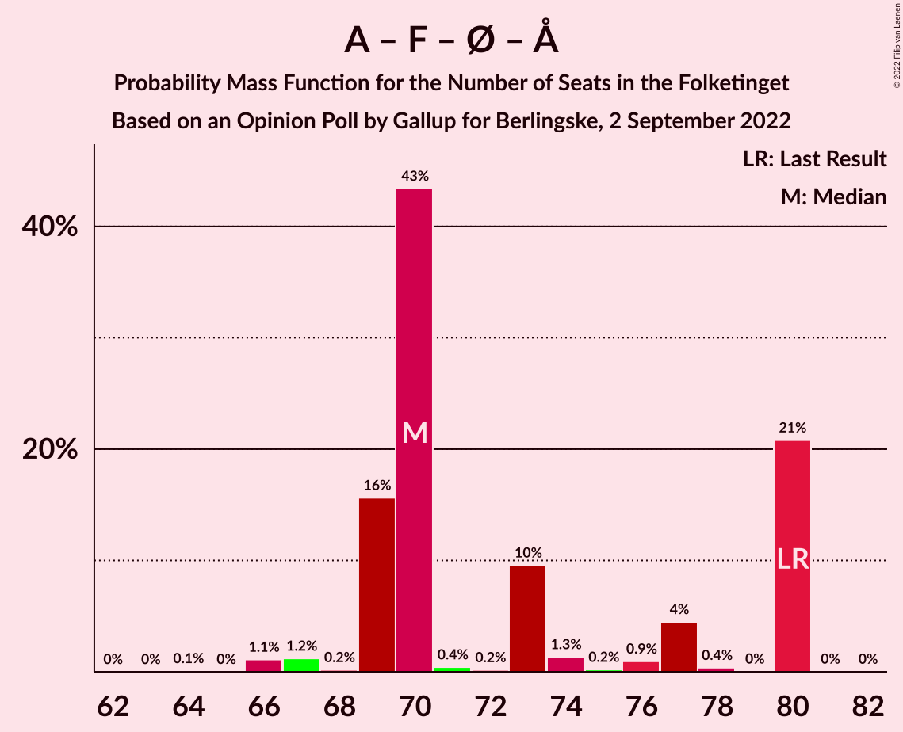

| Number of Seats | Probability | Accumulated | Special Marks |
|:---------------:|:-----------:|:-----------:|:-------------:|
| 64 | 0.1% | 100% |  |
| 65 | 0% | 99.9% |  |
| 66 | 1.1% | 99.9% |  |
| 67 | 1.2% | 98.8% |  |
| 68 | 0.2% | 98% |  |
| 69 | 16% | 97% |  |
| 70 | 43% | 82% | Median |
| 71 | 0.4% | 38% |  |
| 72 | 0.2% | 38% |  |
| 73 | 10% | 38% |  |
| 74 | 1.3% | 28% |  |
| 75 | 0.2% | 27% |  |
| 76 | 0.9% | 27% |  |
| 77 | 4% | 26% |  |
| 78 | 0.4% | 21% |  |
| 79 | 0% | 21% |  |
| 80 | 21% | 21% | Last Result |
| 81 | 0% | 0.1% |  |
| 82 | 0% | 0% |  |

### Socialdemokraterne – Socialistisk Folkeparti – Enhedslisten–De Rød-Grønne

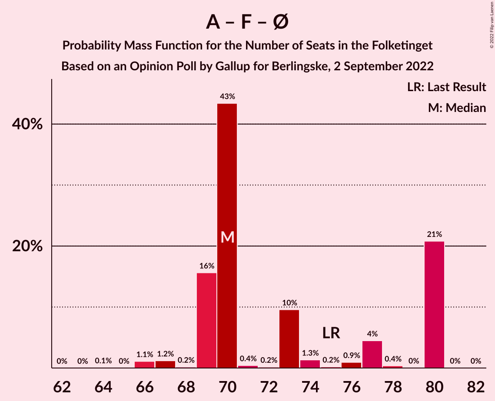

| Number of Seats | Probability | Accumulated | Special Marks |
|:---------------:|:-----------:|:-----------:|:-------------:|
| 64 | 0.1% | 100% |  |
| 65 | 0% | 99.9% |  |
| 66 | 1.1% | 99.9% |  |
| 67 | 1.2% | 98.8% |  |
| 68 | 0.2% | 98% |  |
| 69 | 16% | 97% |  |
| 70 | 43% | 82% | Median |
| 71 | 0.4% | 38% |  |
| 72 | 0.2% | 38% |  |
| 73 | 10% | 38% |  |
| 74 | 1.3% | 28% |  |
| 75 | 0.2% | 27% | Last Result |
| 76 | 0.9% | 27% |  |
| 77 | 4% | 26% |  |
| 78 | 0.4% | 21% |  |
| 79 | 0% | 21% |  |
| 80 | 21% | 21% |  |
| 81 | 0% | 0.1% |  |
| 82 | 0% | 0% |  |

### Socialdemokraterne – Socialistisk Folkeparti – Radikale Venstre

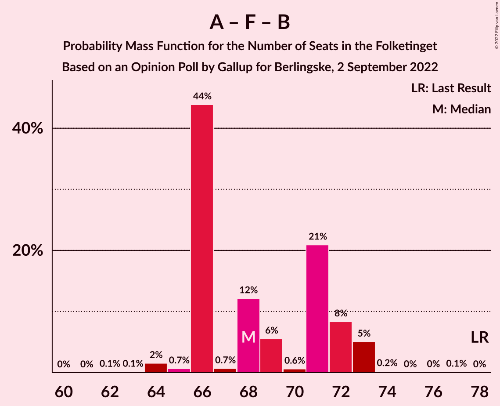

| Number of Seats | Probability | Accumulated | Special Marks |
|:---------------:|:-----------:|:-----------:|:-------------:|
| 62 | 0.1% | 100% |  |
| 63 | 0.1% | 99.9% |  |
| 64 | 2% | 99.8% |  |
| 65 | 0.7% | 98% |  |
| 66 | 44% | 98% | Median |
| 67 | 0.7% | 54% |  |
| 68 | 12% | 53% |  |
| 69 | 6% | 41% |  |
| 70 | 0.6% | 35% |  |
| 71 | 21% | 35% |  |
| 72 | 8% | 14% |  |
| 73 | 5% | 6% |  |
| 74 | 0.2% | 0.5% |  |
| 75 | 0% | 0.2% |  |
| 76 | 0% | 0.2% |  |
| 77 | 0.1% | 0.2% |  |
| 78 | 0% | 0% | Last Result |

### Det Konservative Folkeparti – Venstre – Nye Borgerlige – Liberal Alliance – Dansk Folkeparti – Kristendemokraterne

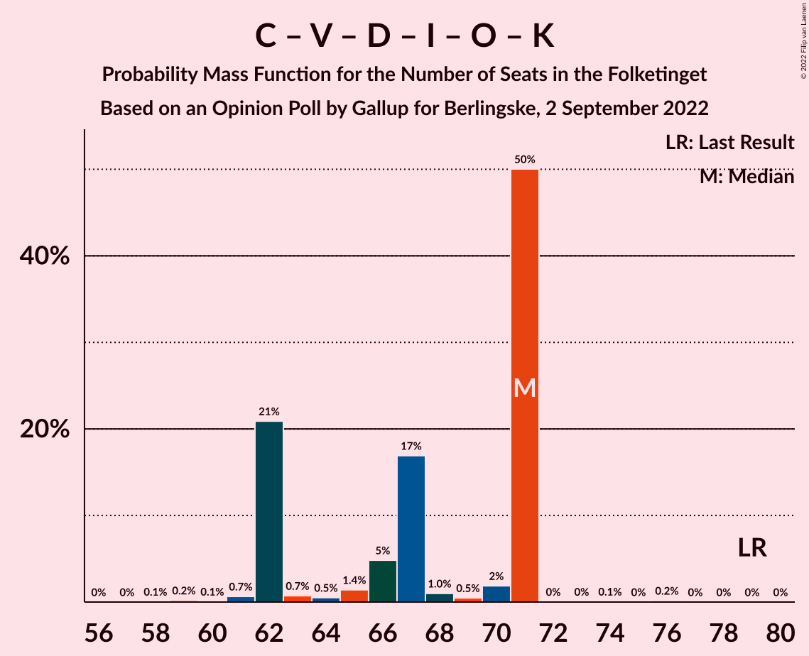

| Number of Seats | Probability | Accumulated | Special Marks |
|:---------------:|:-----------:|:-----------:|:-------------:|
| 58 | 0.1% | 100% |  |
| 59 | 0.2% | 99.9% |  |
| 60 | 0.1% | 99.7% |  |
| 61 | 0.7% | 99.7% |  |
| 62 | 21% | 99.0% |  |
| 63 | 0.7% | 78% |  |
| 64 | 0.5% | 77% |  |
| 65 | 1.4% | 77% |  |
| 66 | 5% | 75% |  |
| 67 | 17% | 71% |  |
| 68 | 1.0% | 54% |  |
| 69 | 0.5% | 53% | Median |
| 70 | 2% | 52% |  |
| 71 | 50% | 50% |  |
| 72 | 0% | 0.3% |  |
| 73 | 0% | 0.3% |  |
| 74 | 0.1% | 0.2% |  |
| 75 | 0% | 0.2% |  |
| 76 | 0.2% | 0.2% |  |
| 77 | 0% | 0% |  |
| 78 | 0% | 0% |  |
| 79 | 0% | 0% | Last Result |

### Det Konservative Folkeparti – Venstre – Nye Borgerlige – Liberal Alliance – Dansk Folkeparti

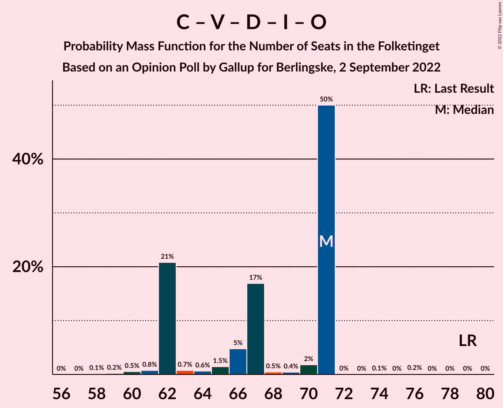

| Number of Seats | Probability | Accumulated | Special Marks |
|:---------------:|:-----------:|:-----------:|:-------------:|
| 58 | 0.1% | 100% |  |
| 59 | 0.2% | 99.8% |  |
| 60 | 0.5% | 99.6% |  |
| 61 | 0.8% | 99.1% |  |
| 62 | 21% | 98% |  |
| 63 | 0.7% | 78% |  |
| 64 | 0.6% | 77% |  |
| 65 | 1.5% | 76% |  |
| 66 | 5% | 75% |  |
| 67 | 17% | 70% |  |
| 68 | 0.5% | 53% |  |
| 69 | 0.4% | 53% | Median |
| 70 | 2% | 52% |  |
| 71 | 50% | 50% |  |
| 72 | 0% | 0.3% |  |
| 73 | 0% | 0.2% |  |
| 74 | 0.1% | 0.2% |  |
| 75 | 0% | 0.2% |  |
| 76 | 0.2% | 0.2% |  |
| 77 | 0% | 0% |  |
| 78 | 0% | 0% |  |
| 79 | 0% | 0% | Last Result |

### Det Konservative Folkeparti – Venstre – Liberal Alliance – Dansk Folkeparti – Kristendemokraterne

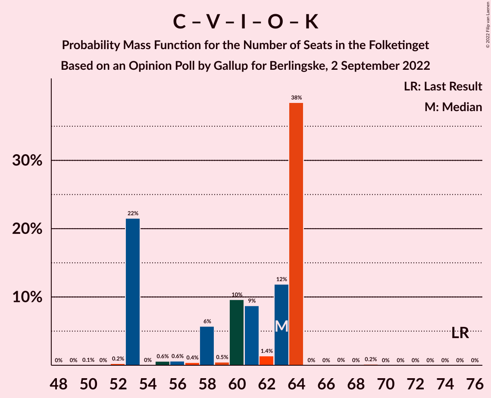

| Number of Seats | Probability | Accumulated | Special Marks |
|:---------------:|:-----------:|:-----------:|:-------------:|
| 50 | 0.1% | 100% |  |
| 51 | 0% | 99.9% |  |
| 52 | 0.2% | 99.9% |  |
| 53 | 22% | 99.6% |  |
| 54 | 0% | 78% |  |
| 55 | 0.6% | 78% |  |
| 56 | 0.6% | 77% |  |
| 57 | 0.4% | 77% |  |
| 58 | 6% | 76% |  |
| 59 | 0.5% | 71% |  |
| 60 | 10% | 70% |  |
| 61 | 9% | 61% |  |
| 62 | 1.4% | 52% | Median |
| 63 | 12% | 51% |  |
| 64 | 38% | 39% |  |
| 65 | 0% | 0.2% |  |
| 66 | 0% | 0.2% |  |
| 67 | 0% | 0.2% |  |
| 68 | 0% | 0.2% |  |
| 69 | 0.2% | 0.2% |  |
| 70 | 0% | 0% |  |
| 71 | 0% | 0% |  |
| 72 | 0% | 0% |  |
| 73 | 0% | 0% |  |
| 74 | 0% | 0% |  |
| 75 | 0% | 0% | Last Result |

### Det Konservative Folkeparti – Venstre – Liberal Alliance – Dansk Folkeparti

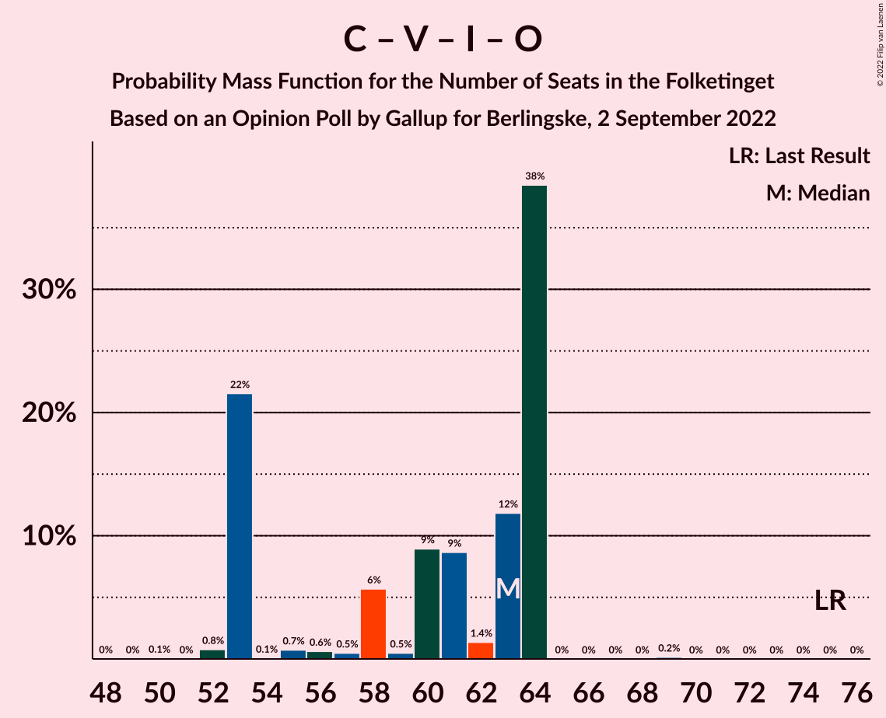

| Number of Seats | Probability | Accumulated | Special Marks |
|:---------------:|:-----------:|:-----------:|:-------------:|
| 49 | 0% | 100% |  |
| 50 | 0.1% | 99.9% |  |
| 51 | 0% | 99.9% |  |
| 52 | 0.8% | 99.9% |  |
| 53 | 22% | 99.1% |  |
| 54 | 0.1% | 78% |  |
| 55 | 0.7% | 77% |  |
| 56 | 0.6% | 77% |  |
| 57 | 0.5% | 76% |  |
| 58 | 6% | 76% |  |
| 59 | 0.5% | 70% |  |
| 60 | 9% | 69% |  |
| 61 | 9% | 61% |  |
| 62 | 1.4% | 52% | Median |
| 63 | 12% | 51% |  |
| 64 | 38% | 39% |  |
| 65 | 0% | 0.2% |  |
| 66 | 0% | 0.2% |  |
| 67 | 0% | 0.2% |  |
| 68 | 0% | 0.2% |  |
| 69 | 0.2% | 0.2% |  |
| 70 | 0% | 0% |  |
| 71 | 0% | 0% |  |
| 72 | 0% | 0% |  |
| 73 | 0% | 0% |  |
| 74 | 0% | 0% |  |
| 75 | 0% | 0% | Last Result |

### Det Konservative Folkeparti – Venstre – Liberal Alliance

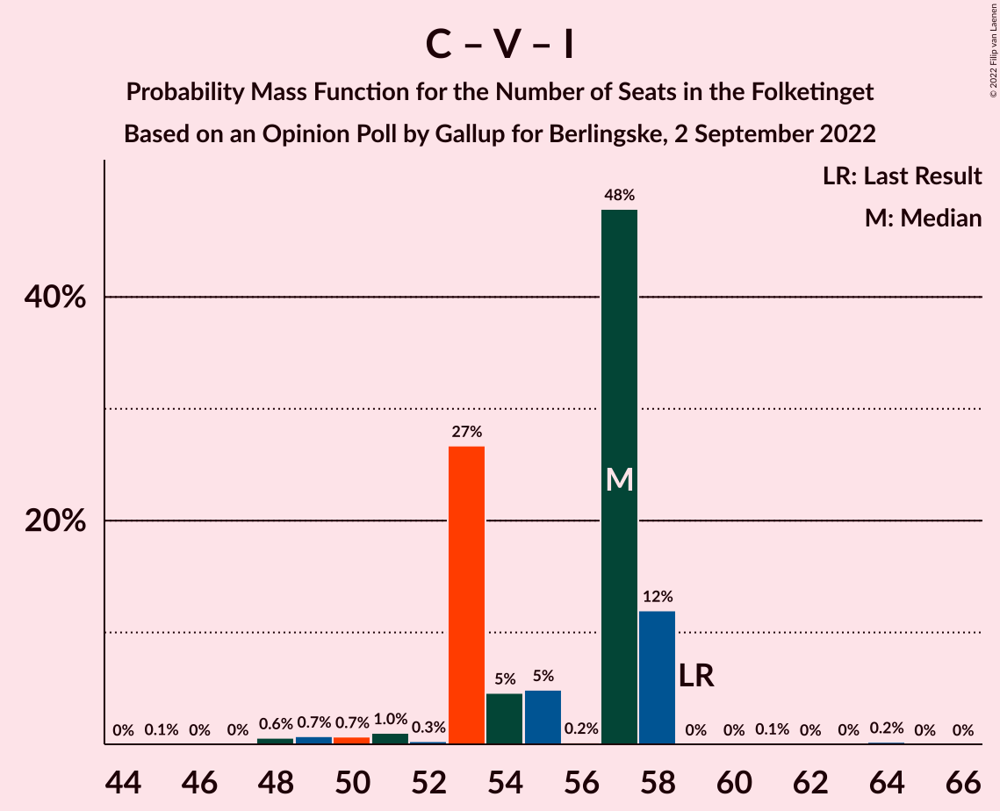

| Number of Seats | Probability | Accumulated | Special Marks |
|:---------------:|:-----------:|:-----------:|:-------------:|
| 45 | 0.1% | 100% |  |
| 46 | 0% | 99.9% |  |
| 47 | 0% | 99.9% |  |
| 48 | 0.6% | 99.9% |  |
| 49 | 0.7% | 99.3% |  |
| 50 | 0.7% | 98.6% |  |
| 51 | 1.0% | 98% |  |
| 52 | 0.3% | 97% |  |
| 53 | 27% | 97% |  |
| 54 | 5% | 70% |  |
| 55 | 5% | 65% |  |
| 56 | 0.2% | 60% |  |
| 57 | 48% | 60% | Median |
| 58 | 12% | 12% |  |
| 59 | 0% | 0.4% | Last Result |
| 60 | 0% | 0.4% |  |
| 61 | 0.1% | 0.4% |  |
| 62 | 0% | 0.3% |  |
| 63 | 0% | 0.3% |  |
| 64 | 0.2% | 0.2% |  |
| 65 | 0% | 0% |  |

### Socialdemokraterne – Radikale Venstre

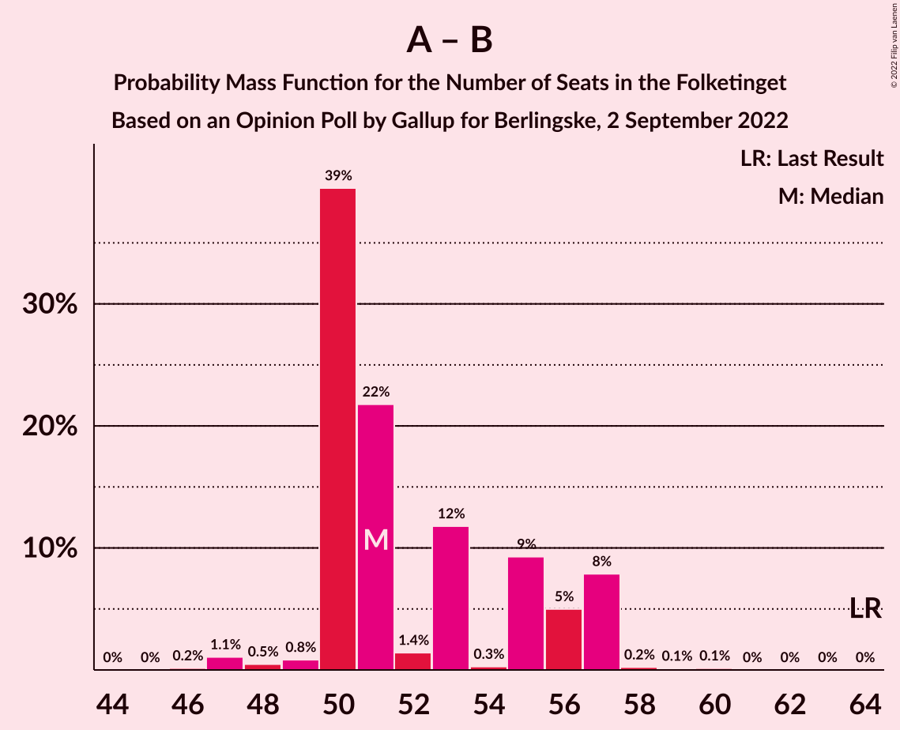

| Number of Seats | Probability | Accumulated | Special Marks |
|:---------------:|:-----------:|:-----------:|:-------------:|
| 46 | 0.2% | 100% |  |
| 47 | 1.1% | 99.8% |  |
| 48 | 0.5% | 98.8% |  |
| 49 | 0.8% | 98% |  |
| 50 | 39% | 97% | Median |
| 51 | 22% | 58% |  |
| 52 | 1.4% | 36% |  |
| 53 | 12% | 35% |  |
| 54 | 0.3% | 23% |  |
| 55 | 9% | 23% |  |
| 56 | 5% | 13% |  |
| 57 | 8% | 8% |  |
| 58 | 0.2% | 0.5% |  |
| 59 | 0.1% | 0.3% |  |
| 60 | 0.1% | 0.2% |  |
| 61 | 0% | 0% |  |
| 62 | 0% | 0% |  |
| 63 | 0% | 0% |  |
| 64 | 0% | 0% | Last Result |

### Det Konservative Folkeparti – Venstre

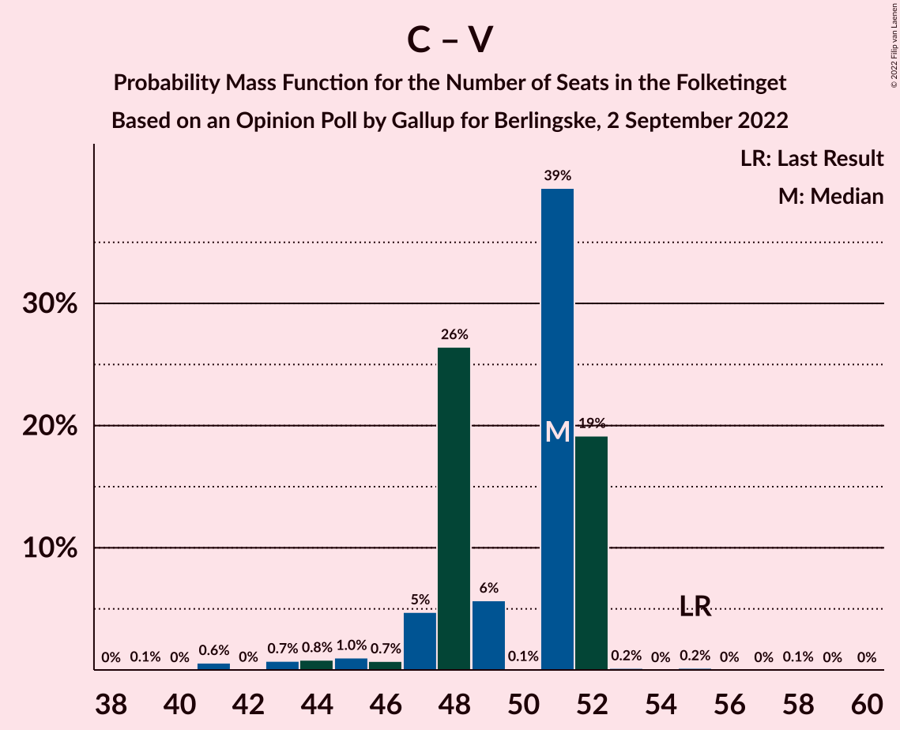

| Number of Seats | Probability | Accumulated | Special Marks |
|:---------------:|:-----------:|:-----------:|:-------------:|
| 39 | 0.1% | 100% |  |
| 40 | 0% | 99.9% |  |
| 41 | 0.6% | 99.9% |  |
| 42 | 0% | 99.3% |  |
| 43 | 0.7% | 99.3% |  |
| 44 | 0.8% | 98.6% |  |
| 45 | 1.0% | 98% |  |
| 46 | 0.7% | 97% |  |
| 47 | 5% | 96% |  |
| 48 | 26% | 91% |  |
| 49 | 6% | 65% |  |
| 50 | 0.1% | 59% |  |
| 51 | 39% | 59% | Median |
| 52 | 19% | 20% |  |
| 53 | 0.2% | 0.4% |  |
| 54 | 0% | 0.3% |  |
| 55 | 0.2% | 0.3% | Last Result |
| 56 | 0% | 0.1% |  |
| 57 | 0% | 0.1% |  |
| 58 | 0.1% | 0.1% |  |
| 59 | 0% | 0% |  |

### Venstre

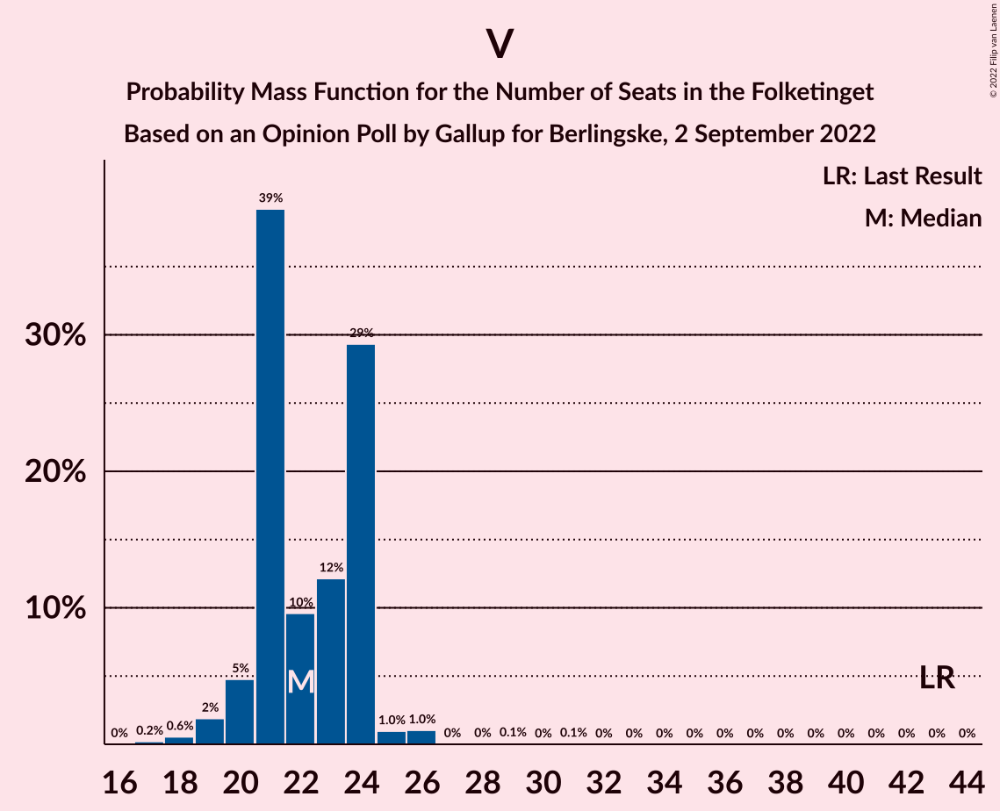

| Number of Seats | Probability | Accumulated | Special Marks |
|:---------------:|:-----------:|:-----------:|:-------------:|
| 17 | 0.2% | 100% |  |
| 18 | 0.6% | 99.8% |  |
| 19 | 2% | 99.2% |  |
| 20 | 5% | 97% |  |
| 21 | 39% | 93% |  |
| 22 | 10% | 53% | Median |
| 23 | 12% | 44% |  |
| 24 | 29% | 32% |  |
| 25 | 1.0% | 2% |  |
| 26 | 1.0% | 1.2% |  |
| 27 | 0% | 0.2% |  |
| 28 | 0% | 0.2% |  |
| 29 | 0.1% | 0.1% |  |
| 30 | 0% | 0.1% |  |
| 31 | 0.1% | 0.1% |  |
| 32 | 0% | 0% |  |
| 33 | 0% | 0% |  |
| 34 | 0% | 0% |  |
| 35 | 0% | 0% |  |
| 36 | 0% | 0% |  |
| 37 | 0% | 0% |  |
| 38 | 0% | 0% |  |
| 39 | 0% | 0% |  |
| 40 | 0% | 0% |  |
| 41 | 0% | 0% |  |
| 42 | 0% | 0% |  |
| 43 | 0% | 0% | Last Result |

## Technical Information

### Opinion Poll

+ **Polling firm:** Gallup
+ **Commissioner(s):** Berlingske
+ **Fieldwork period:** 2 September 2022

### Calculations

+ **Sample size:** 1000
+ **Simulations done:** 1,048,576
+ **Error estimate:** 3.23%

