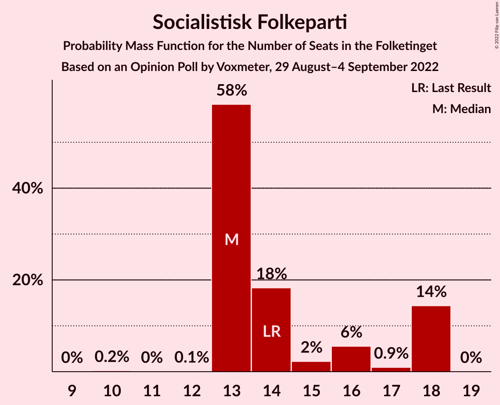
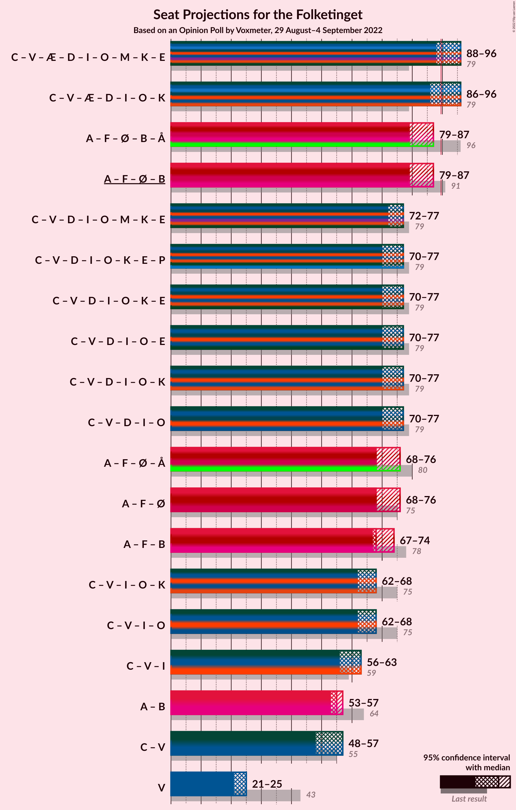

# Opinion Poll by Voxmeter, 29 August–4 September 2022

<a href="#voting-intentions">Voting Intentions</a> | <a href="#seats">Seats</a> | <a href="#coalitions">Coalitions</a> | <a href="#technical-information">Technical Information</a>

## Voting Intentions

### Confidence Intervals

| Party | Last Result | Poll Result | 80% Confidence Interval | 90% Confidence Interval | 95% Confidence Interval | 99% Confidence Interval |
|:-----:|:-----------:|:-----------:|:-----------------------:|:-----------------------:|:-----------------------:|:-----------------------:|
| Socialdemokraterne | 25.9% | 24.7% | 23.0–26.5% |22.5–27.0% |22.1–27.4% |21.3–28.3% |
| Det Konservative Folkeparti | 6.6% | 16.2% | 14.8–17.7% |14.4–18.2% |14.0–18.6% |13.4–19.4% |
| Venstre | 23.4% | 12.5% | 11.2–13.9% |10.9–14.3% |10.6–14.7% |10.0–15.4% |
| Danmarksdemokraterne | 0.0% | 9.3% | 8.2–10.6% |7.9–10.9% |7.6–11.2% |7.1–11.9% |
| Socialistisk Folkeparti | 7.7% | 8.0% | 7.0–9.2% |6.7–9.5% |6.5–9.8% |6.0–10.4% |
| Enhedslisten–De Rød-Grønne | 6.9% | 7.2% | 6.2–8.4% |6.0–8.7% |5.7–9.0% |5.3–9.5% |
| Radikale Venstre | 8.6% | 6.4% | 5.5–7.5% |5.2–7.8% |5.0–8.1% |4.6–8.6% |
| Nye Borgerlige | 2.4% | 4.3% | 3.6–5.2% |3.4–5.5% |3.2–5.7% |2.9–6.2% |
| Liberal Alliance | 2.3% | 3.4% | 2.8–4.3% |2.6–4.5% |2.4–4.7% |2.2–5.2% |
| Dansk Folkeparti | 8.7% | 3.3% | 2.7–4.1% |2.5–4.4% |2.3–4.6% |2.1–5.0% |
| Moderaterne | 0.0% | 1.7% | 1.3–2.3% |1.2–2.5% |1.1–2.7% |0.9–3.1% |
| Alternativet | 3.0% | 1.6% | 1.2–2.2% |1.1–2.4% |1.0–2.6% |0.8–2.9% |
| Kristendemokraterne | 1.7% | 1.0% | 0.7–1.5% |0.6–1.7% |0.5–1.8% |0.4–2.1% |
| Frie Grønne | 0.0% | 0.3% | 0.2–0.7% |0.1–0.8% |0.1–0.9% |0.1–1.1% |
| Veganerpartiet | 0.0% | 0.1% | 0.0–0.4% |0.0–0.5% |0.0–0.6% |0.0–0.7% |

*Note:* The poll result column reflects the actual value used in the calculations. Published results may vary slightly, and in addition be rounded to fewer digits.

## Seats

### Confidence Intervals

| Party | Last Result | Median | 80% Confidence Interval | 90% Confidence Interval | 95% Confidence Interval | 99% Confidence Interval |
|:-----:|:-----------:|:------:|:-----------------------:|:-----------------------:|:-----------------------:|:-----------------------:|
| <a href="#socialdemokraterne">Socialdemokraterne</a> | 48 | 44 | 41–47 |41–47 |41–47 |40–47 |
| <a href="#det-konservative-folkeparti">Det Konservative Folkeparti</a> | 12 | 32 | 27–32 |27–32 |27–32 |27–35 |
| <a href="#venstre">Venstre</a> | 43 | 25 | 21–25 |21–25 |21–25 |19–26 |
| <a href="#danmarksdemokraterne">Danmarksdemokraterne</a> | 0 | 19 | 16–19 |16–19 |16–19 |13–21 |
| <a href="#socialistisk-folkeparti">Socialistisk Folkeparti</a> | 14 | 13 | 13–18 |13–18 |13–18 |13–18 |
| <a href="#enhedslisten–de-rød-grønne">Enhedslisten–De Rød-Grønne</a> | 13 | 11 | 11–14 |11–15 |11–15 |9–15 |
| <a href="#radikale-venstre">Radikale Venstre</a> | 16 | 11 | 9–12 |9–15 |9–15 |9–15 |
| <a href="#nye-borgerlige">Nye Borgerlige</a> | 4 | 9 | 8–11 |7–11 |7–11 |7–11 |
| <a href="#liberal-alliance">Liberal Alliance</a> | 4 | 6 | 6–8 |6–8 |5–8 |4–8 |
| <a href="#dansk-folkeparti">Dansk Folkeparti</a> | 16 | 5 | 5–8 |5–8 |5–8 |4–9 |
| <a href="#moderaterne">Moderaterne</a> | 0 | 0 | 0–4 |0–4 |0–4 |0–5 |
| <a href="#alternativet">Alternativet</a> | 5 | 0 | 0 |0 |0 |0–4 |
| <a href="#kristendemokraterne">Kristendemokraterne</a> | 0 | 0 | 0 |0 |0 |0 |
| <a href="#frie-grønne">Frie Grønne</a> | 0 | 0 | 0 |0 |0 |0 |
| <a href="#veganerpartiet">Veganerpartiet</a> | 0 | 0 | 0 |0 |0 |0 |

### Socialdemokraterne

*For a full overview of the results for this party, see the [Socialdemokraterne](party-socialdemokraterne.html) page.*

| Number of Seats | Probability | Accumulated | Special Marks |
|:---------------:|:-----------:|:-----------:|:-------------:|
| 40 | 0.8% | 100% |  |
| 41 | 23% | 99.1% |  |
| 42 | 0.3% | 76% |  |
| 43 | 0.3% | 76% |  |
| 44 | 59% | 76% | Median |
| 45 | 2% | 17% |  |
| 46 | 0.7% | 15% |  |
| 47 | 14% | 15% |  |
| 48 | 0.1% | 0.3% | Last Result |
| 49 | 0% | 0.2% |  |
| 50 | 0% | 0.2% |  |
| 51 | 0.1% | 0.2% |  |
| 52 | 0.1% | 0.1% |  |
| 53 | 0% | 0% |  |

### Det Konservative Folkeparti

*For a full overview of the results for this party, see the [Det Konservative Folkeparti](party-detkonservativefolkeparti.html) page.*

| Number of Seats | Probability | Accumulated | Special Marks |
|:---------------:|:-----------:|:-----------:|:-------------:|
| 12 | 0% | 100% | Last Result |
| 13 | 0% | 100% |  |
| 14 | 0% | 100% |  |
| 15 | 0% | 100% |  |
| 16 | 0% | 100% |  |
| 17 | 0% | 100% |  |
| 18 | 0% | 100% |  |
| 19 | 0% | 100% |  |
| 20 | 0% | 100% |  |
| 21 | 0% | 100% |  |
| 22 | 0% | 100% |  |
| 23 | 0.1% | 100% |  |
| 24 | 0.1% | 99.9% |  |
| 25 | 0.2% | 99.8% |  |
| 26 | 0.1% | 99.6% |  |
| 27 | 15% | 99.5% |  |
| 28 | 0.3% | 85% |  |
| 29 | 18% | 85% |  |
| 30 | 1.1% | 66% |  |
| 31 | 0% | 65% |  |
| 32 | 64% | 65% | Median |
| 33 | 0.2% | 0.8% |  |
| 34 | 0% | 0.6% |  |
| 35 | 0.5% | 0.5% |  |
| 36 | 0% | 0% |  |

### Venstre

*For a full overview of the results for this party, see the [Venstre](party-venstre.html) page.*

| Number of Seats | Probability | Accumulated | Special Marks |
|:---------------:|:-----------:|:-----------:|:-------------:|
| 18 | 0.1% | 100% |  |
| 19 | 0.4% | 99.9% |  |
| 20 | 2% | 99.4% |  |
| 21 | 15% | 98% |  |
| 22 | 23% | 83% |  |
| 23 | 0.6% | 60% |  |
| 24 | 0.2% | 59% |  |
| 25 | 57% | 59% | Median |
| 26 | 1.4% | 1.4% |  |
| 27 | 0% | 0% |  |
| 28 | 0% | 0% |  |
| 29 | 0% | 0% |  |
| 30 | 0% | 0% |  |
| 31 | 0% | 0% |  |
| 32 | 0% | 0% |  |
| 33 | 0% | 0% |  |
| 34 | 0% | 0% |  |
| 35 | 0% | 0% |  |
| 36 | 0% | 0% |  |
| 37 | 0% | 0% |  |
| 38 | 0% | 0% |  |
| 39 | 0% | 0% |  |
| 40 | 0% | 0% |  |
| 41 | 0% | 0% |  |
| 42 | 0% | 0% |  |
| 43 | 0% | 0% | Last Result |

### Danmarksdemokraterne

*For a full overview of the results for this party, see the [Danmarksdemokraterne](party-danmarksdemokraterne.html) page.*

| Number of Seats | Probability | Accumulated | Special Marks |
|:---------------:|:-----------:|:-----------:|:-------------:|
| 0 | 0% | 100% | Last Result |
| 1 | 0% | 100% |  |
| 2 | 0% | 100% |  |
| 3 | 0% | 100% |  |
| 4 | 0% | 100% |  |
| 5 | 0% | 100% |  |
| 6 | 0% | 100% |  |
| 7 | 0% | 100% |  |
| 8 | 0% | 100% |  |
| 9 | 0% | 100% |  |
| 10 | 0% | 100% |  |
| 11 | 0% | 100% |  |
| 12 | 0% | 100% |  |
| 13 | 0.5% | 100% |  |
| 14 | 0.1% | 99.4% |  |
| 15 | 0.5% | 99.4% |  |
| 16 | 20% | 98.9% |  |
| 17 | 18% | 79% |  |
| 18 | 1.1% | 60% |  |
| 19 | 58% | 59% | Median |
| 20 | 0.6% | 1.5% |  |
| 21 | 0.8% | 0.8% |  |
| 22 | 0% | 0% |  |

### Socialistisk Folkeparti

*For a full overview of the results for this party, see the [Socialistisk Folkeparti](party-socialistiskfolkeparti.html) page.*

| Number of Seats | Probability | Accumulated | Special Marks |
|:---------------:|:-----------:|:-----------:|:-------------:|
| 10 | 0.2% | 100% |  |
| 11 | 0% | 99.8% |  |
| 12 | 0.1% | 99.8% |  |
| 13 | 58% | 99.7% | Median |
| 14 | 18% | 41% | Last Result |
| 15 | 2% | 23% |  |
| 16 | 6% | 21% |  |
| 17 | 0.9% | 15% |  |
| 18 | 14% | 14% |  |
| 19 | 0% | 0% |  |

### Enhedslisten–De Rød-Grønne

*For a full overview of the results for this party, see the [Enhedslisten–De Rød-Grønne](party-enhedslisten–derød-grønne.html) page.*

| Number of Seats | Probability | Accumulated | Special Marks |
|:---------------:|:-----------:|:-----------:|:-------------:|
| 9 | 0.8% | 100% |  |
| 10 | 0.3% | 99.2% |  |
| 11 | 73% | 98.9% | Median |
| 12 | 0.4% | 26% |  |
| 13 | 2% | 26% | Last Result |
| 14 | 18% | 24% |  |
| 15 | 5% | 6% |  |
| 16 | 0.3% | 0.4% |  |
| 17 | 0.1% | 0.1% |  |
| 18 | 0% | 0% |  |

### Radikale Venstre

*For a full overview of the results for this party, see the [Radikale Venstre](party-radikalevenstre.html) page.*

| Number of Seats | Probability | Accumulated | Special Marks |
|:---------------:|:-----------:|:-----------:|:-------------:|
| 7 | 0.1% | 100% |  |
| 8 | 0.1% | 99.9% |  |
| 9 | 15% | 99.8% |  |
| 10 | 0.4% | 85% |  |
| 11 | 58% | 84% | Median |
| 12 | 19% | 26% |  |
| 13 | 0.6% | 7% |  |
| 14 | 1.2% | 7% |  |
| 15 | 5% | 6% |  |
| 16 | 0.3% | 0.3% | Last Result |
| 17 | 0% | 0% |  |

### Nye Borgerlige

*For a full overview of the results for this party, see the [Nye Borgerlige](party-nyeborgerlige.html) page.*

| Number of Seats | Probability | Accumulated | Special Marks |
|:---------------:|:-----------:|:-----------:|:-------------:|
| 4 | 0% | 100% | Last Result |
| 5 | 0% | 100% |  |
| 6 | 0.5% | 100% |  |
| 7 | 8% | 99.5% |  |
| 8 | 15% | 91% |  |
| 9 | 59% | 76% | Median |
| 10 | 0.3% | 17% |  |
| 11 | 17% | 17% |  |
| 12 | 0% | 0% |  |

### Liberal Alliance

*For a full overview of the results for this party, see the [Liberal Alliance](party-liberalalliance.html) page.*

| Number of Seats | Probability | Accumulated | Special Marks |
|:---------------:|:-----------:|:-----------:|:-------------:|
| 4 | 0.6% | 100% | Last Result |
| 5 | 2% | 99.4% |  |
| 6 | 63% | 97% | Median |
| 7 | 20% | 34% |  |
| 8 | 15% | 15% |  |
| 9 | 0.1% | 0.1% |  |
| 10 | 0% | 0% |  |

### Dansk Folkeparti

*For a full overview of the results for this party, see the [Dansk Folkeparti](party-danskfolkeparti.html) page.*

| Number of Seats | Probability | Accumulated | Special Marks |
|:---------------:|:-----------:|:-----------:|:-------------:|
| 4 | 0.6% | 100% |  |
| 5 | 65% | 99.4% | Median |
| 6 | 16% | 35% |  |
| 7 | 1.0% | 19% |  |
| 8 | 17% | 18% |  |
| 9 | 0.7% | 0.7% |  |
| 10 | 0% | 0% |  |
| 11 | 0% | 0% |  |
| 12 | 0% | 0% |  |
| 13 | 0% | 0% |  |
| 14 | 0% | 0% |  |
| 15 | 0% | 0% |  |
| 16 | 0% | 0% | Last Result |

### Moderaterne

*For a full overview of the results for this party, see the [Moderaterne](party-moderaterne.html) page.*

| Number of Seats | Probability | Accumulated | Special Marks |
|:---------------:|:-----------:|:-----------:|:-------------:|
| 0 | 83% | 100% | Last Result, Median |
| 1 | 0% | 17% |  |
| 2 | 0% | 17% |  |
| 3 | 0% | 17% |  |
| 4 | 16% | 17% |  |
| 5 | 0.8% | 0.9% |  |
| 6 | 0.1% | 0.1% |  |
| 7 | 0% | 0% |  |

### Alternativet

*For a full overview of the results for this party, see the [Alternativet](party-alternativet.html) page.*

| Number of Seats | Probability | Accumulated | Special Marks |
|:---------------:|:-----------:|:-----------:|:-------------:|
| 0 | 99.0% | 100% | Median |
| 1 | 0% | 1.0% |  |
| 2 | 0% | 1.0% |  |
| 3 | 0% | 1.0% |  |
| 4 | 0.7% | 1.0% |  |
| 5 | 0.1% | 0.3% | Last Result |
| 6 | 0.2% | 0.2% |  |
| 7 | 0% | 0% |  |

### Kristendemokraterne

*For a full overview of the results for this party, see the [Kristendemokraterne](party-kristendemokraterne.html) page.*

| Number of Seats | Probability | Accumulated | Special Marks |
|:---------------:|:-----------:|:-----------:|:-------------:|
| 0 | 99.9% | 100% | Last Result, Median |
| 1 | 0% | 0.1% |  |
| 2 | 0% | 0.1% |  |
| 3 | 0% | 0.1% |  |
| 4 | 0% | 0.1% |  |
| 5 | 0% | 0% |  |

### Frie Grønne

*For a full overview of the results for this party, see the [Frie Grønne](party-friegrønne.html) page.*

| Number of Seats | Probability | Accumulated | Special Marks |
|:---------------:|:-----------:|:-----------:|:-------------:|
| 0 | 100% | 100% | Last Result, Median |

### Veganerpartiet

*For a full overview of the results for this party, see the [Veganerpartiet](party-veganerpartiet.html) page.*

| Number of Seats | Probability | Accumulated | Special Marks |
|:---------------:|:-----------:|:-----------:|:-------------:|
| 0 | 100% | 100% | Last Result, Median |

## Coalitions

### Confidence Intervals

| Coalition | Last Result | Median | Majority? | 80% Confidence Interval | 90% Confidence Interval | 95% Confidence Interval | 99% Confidence Interval |
|:---------:|:-----------:|:------:|:---------:|:-----------------------:|:-----------------------:|:-----------------------:|:-----------------------:|
| Det Konservative Folkeparti – Venstre – Danmarksdemokraterne – Nye Borgerlige – Liberal Alliance – Dansk Folkeparti – Kristendemokraterne | 79 | 96 | 77% | 86–96 | 86–96 | 86–96 | 84–97 |
| Socialdemokraterne – Socialistisk Folkeparti – Enhedslisten–De Rød-Grønne – Radikale Venstre – Alternativet | 96 | 79 | 0.2% | 79–85 | 79–87 | 79–87 | 78–88 |
| Socialdemokraterne – Socialistisk Folkeparti – Enhedslisten–De Rød-Grønne – Radikale Venstre | 91 | 79 | 0.1% | 79–85 | 79–87 | 79–87 | 78–87 |
| Det Konservative Folkeparti – Venstre – Nye Borgerlige – Liberal Alliance – Dansk Folkeparti – Kristendemokraterne | 79 | 77 | 0% | 70–77 | 70–77 | 70–77 | 68–79 |
| Det Konservative Folkeparti – Venstre – Nye Borgerlige – Liberal Alliance – Dansk Folkeparti | 79 | 77 | 0% | 70–77 | 70–77 | 70–77 | 68–79 |
| Socialdemokraterne – Socialistisk Folkeparti – Enhedslisten–De Rød-Grønne – Alternativet | 80 | 68 | 0% | 68–76 | 68–76 | 68–76 | 66–77 |
| Socialdemokraterne – Socialistisk Folkeparti – Enhedslisten–De Rød-Grønne | 75 | 68 | 0% | 68–76 | 68–76 | 68–76 | 66–76 |
| Socialdemokraterne – Socialistisk Folkeparti – Radikale Venstre | 78 | 68 | 0% | 67–74 | 67–74 | 67–74 | 67–74 |
| Det Konservative Folkeparti – Venstre – Liberal Alliance – Dansk Folkeparti – Kristendemokraterne | 75 | 68 | 0% | 62–68 | 62–68 | 62–68 | 60–70 |
| Det Konservative Folkeparti – Venstre – Liberal Alliance – Dansk Folkeparti | 75 | 68 | 0% | 62–68 | 62–68 | 62–68 | 60–70 |
| Det Konservative Folkeparti – Venstre – Liberal Alliance | 59 | 63 | 0% | 56–63 | 56–63 | 56–63 | 54–65 |
| Socialdemokraterne – Radikale Venstre | 64 | 55 | 0% | 53–56 | 53–56 | 53–57 | 52–59 |
| Det Konservative Folkeparti – Venstre | 55 | 57 | 0% | 48–57 | 48–57 | 48–57 | 47–58 |
| Venstre | 43 | 25 | 0% | 21–25 | 21–25 | 21–25 | 19–26 |

### Det Konservative Folkeparti – Venstre – Danmarksdemokraterne – Nye Borgerlige – Liberal Alliance – Dansk Folkeparti – Kristendemokraterne

| Number of Seats | Probability | Accumulated | Special Marks |
|:---------------:|:-----------:|:-----------:|:-------------:|
| 78 | 0.1% | 100% |  |
| 79 | 0% | 99.9% | Last Result |
| 80 | 0% | 99.9% |  |
| 81 | 0% | 99.9% |  |
| 82 | 0% | 99.9% |  |
| 83 | 0.3% | 99.9% |  |
| 84 | 0.2% | 99.5% |  |
| 85 | 0% | 99.3% |  |
| 86 | 14% | 99.3% |  |
| 87 | 0.5% | 85% |  |
| 88 | 6% | 84% |  |
| 89 | 0.6% | 78% |  |
| 90 | 0.6% | 77% | Majority |
| 91 | 0.3% | 77% |  |
| 92 | 1.2% | 76% |  |
| 93 | 0% | 75% |  |
| 94 | 17% | 75% |  |
| 95 | 0% | 58% |  |
| 96 | 57% | 58% | Median |
| 97 | 0.8% | 0.9% |  |
| 98 | 0.1% | 0.1% |  |
| 99 | 0% | 0% |  |

### Socialdemokraterne – Socialistisk Folkeparti – Enhedslisten–De Rød-Grønne – Radikale Venstre – Alternativet

| Number of Seats | Probability | Accumulated | Special Marks |
|:---------------:|:-----------:|:-----------:|:-------------:|
| 77 | 0.1% | 100% |  |
| 78 | 0.8% | 99.9% |  |
| 79 | 57% | 99.1% | Median |
| 80 | 0.1% | 42% |  |
| 81 | 17% | 42% |  |
| 82 | 0.2% | 25% |  |
| 83 | 2% | 24% |  |
| 84 | 0.3% | 22% |  |
| 85 | 15% | 22% |  |
| 86 | 0.6% | 7% |  |
| 87 | 6% | 6% |  |
| 88 | 0.3% | 0.6% |  |
| 89 | 0.1% | 0.2% |  |
| 90 | 0% | 0.2% | Majority |
| 91 | 0.1% | 0.2% |  |
| 92 | 0.1% | 0.1% |  |
| 93 | 0% | 0% |  |
| 94 | 0% | 0% |  |
| 95 | 0% | 0% |  |
| 96 | 0% | 0% | Last Result |

### Socialdemokraterne – Socialistisk Folkeparti – Enhedslisten–De Rød-Grønne – Radikale Venstre

| Number of Seats | Probability | Accumulated | Special Marks |
|:---------------:|:-----------:|:-----------:|:-------------:|
| 77 | 0.1% | 100% |  |
| 78 | 0.8% | 99.9% |  |
| 79 | 57% | 99.1% | Median |
| 80 | 0.1% | 42% |  |
| 81 | 18% | 42% |  |
| 82 | 0.3% | 24% |  |
| 83 | 2% | 24% |  |
| 84 | 0.3% | 21% |  |
| 85 | 14% | 21% |  |
| 86 | 0.6% | 7% |  |
| 87 | 6% | 6% |  |
| 88 | 0.1% | 0.2% |  |
| 89 | 0% | 0.1% |  |
| 90 | 0% | 0.1% | Majority |
| 91 | 0% | 0.1% | Last Result |
| 92 | 0.1% | 0.1% |  |
| 93 | 0% | 0% |  |

### Det Konservative Folkeparti – Venstre – Nye Borgerlige – Liberal Alliance – Dansk Folkeparti – Kristendemokraterne

| Number of Seats | Probability | Accumulated | Special Marks |
|:---------------:|:-----------:|:-----------:|:-------------:|
| 62 | 0.1% | 100% |  |
| 63 | 0% | 99.9% |  |
| 64 | 0.2% | 99.9% |  |
| 65 | 0% | 99.7% |  |
| 66 | 0.1% | 99.7% |  |
| 67 | 0% | 99.6% |  |
| 68 | 0.4% | 99.5% |  |
| 69 | 0.4% | 99.1% |  |
| 70 | 15% | 98.7% |  |
| 71 | 2% | 84% |  |
| 72 | 5% | 82% |  |
| 73 | 0.3% | 77% |  |
| 74 | 0.3% | 76% |  |
| 75 | 0% | 76% |  |
| 76 | 0.2% | 76% |  |
| 77 | 75% | 76% | Median |
| 78 | 0% | 1.0% |  |
| 79 | 0.8% | 0.9% | Last Result |
| 80 | 0.1% | 0.1% |  |
| 81 | 0% | 0% |  |

### Det Konservative Folkeparti – Venstre – Nye Borgerlige – Liberal Alliance – Dansk Folkeparti

| Number of Seats | Probability | Accumulated | Special Marks |
|:---------------:|:-----------:|:-----------:|:-------------:|
| 62 | 0.1% | 100% |  |
| 63 | 0% | 99.9% |  |
| 64 | 0.2% | 99.9% |  |
| 65 | 0% | 99.7% |  |
| 66 | 0.1% | 99.7% |  |
| 67 | 0% | 99.6% |  |
| 68 | 0.4% | 99.5% |  |
| 69 | 0.4% | 99.1% |  |
| 70 | 15% | 98.7% |  |
| 71 | 2% | 84% |  |
| 72 | 5% | 82% |  |
| 73 | 0.3% | 77% |  |
| 74 | 0.3% | 76% |  |
| 75 | 0.1% | 76% |  |
| 76 | 0.2% | 76% |  |
| 77 | 75% | 76% | Median |
| 78 | 0% | 0.9% |  |
| 79 | 0.8% | 0.9% | Last Result |
| 80 | 0.1% | 0.1% |  |
| 81 | 0% | 0% |  |

### Socialdemokraterne – Socialistisk Folkeparti – Enhedslisten–De Rød-Grønne – Alternativet

| Number of Seats | Probability | Accumulated | Special Marks |
|:---------------:|:-----------:|:-----------:|:-------------:|
| 66 | 1.0% | 100% |  |
| 67 | 0% | 99.0% |  |
| 68 | 57% | 98.9% | Median |
| 69 | 18% | 42% |  |
| 70 | 0.4% | 24% |  |
| 71 | 0.7% | 23% |  |
| 72 | 6% | 23% |  |
| 73 | 1.2% | 17% |  |
| 74 | 0.8% | 16% |  |
| 75 | 0% | 15% |  |
| 76 | 15% | 15% |  |
| 77 | 0% | 0.5% |  |
| 78 | 0.2% | 0.5% |  |
| 79 | 0.1% | 0.3% |  |
| 80 | 0.1% | 0.2% | Last Result |
| 81 | 0% | 0% |  |

### Socialdemokraterne – Socialistisk Folkeparti – Enhedslisten–De Rød-Grønne

| Number of Seats | Probability | Accumulated | Special Marks |
|:---------------:|:-----------:|:-----------:|:-------------:|
| 66 | 1.0% | 100% |  |
| 67 | 0% | 98.9% |  |
| 68 | 57% | 98.9% | Median |
| 69 | 18% | 42% |  |
| 70 | 0.4% | 23% |  |
| 71 | 0.8% | 23% |  |
| 72 | 6% | 22% |  |
| 73 | 0.6% | 16% |  |
| 74 | 0.8% | 16% |  |
| 75 | 0% | 15% | Last Result |
| 76 | 15% | 15% |  |
| 77 | 0% | 0.3% |  |
| 78 | 0.1% | 0.2% |  |
| 79 | 0.1% | 0.2% |  |
| 80 | 0.1% | 0.1% |  |
| 81 | 0% | 0% |  |

### Socialdemokraterne – Socialistisk Folkeparti – Radikale Venstre

| Number of Seats | Probability | Accumulated | Special Marks |
|:---------------:|:-----------:|:-----------:|:-------------:|
| 63 | 0.1% | 100% |  |
| 64 | 0% | 99.9% |  |
| 65 | 0.1% | 99.9% |  |
| 66 | 0% | 99.8% |  |
| 67 | 17% | 99.8% |  |
| 68 | 58% | 83% | Median |
| 69 | 2% | 25% |  |
| 70 | 0.6% | 23% |  |
| 71 | 0.4% | 22% |  |
| 72 | 6% | 22% |  |
| 73 | 0.6% | 16% |  |
| 74 | 15% | 15% |  |
| 75 | 0.1% | 0.4% |  |
| 76 | 0.2% | 0.3% |  |
| 77 | 0% | 0.1% |  |
| 78 | 0% | 0.1% | Last Result |
| 79 | 0.1% | 0.1% |  |
| 80 | 0% | 0% |  |

### Det Konservative Folkeparti – Venstre – Liberal Alliance – Dansk Folkeparti – Kristendemokraterne

| Number of Seats | Probability | Accumulated | Special Marks |
|:---------------:|:-----------:|:-----------:|:-------------:|
| 54 | 0.1% | 100% |  |
| 55 | 0% | 99.9% |  |
| 56 | 0% | 99.9% |  |
| 57 | 0% | 99.9% |  |
| 58 | 0.2% | 99.9% |  |
| 59 | 0.1% | 99.7% |  |
| 60 | 0.6% | 99.6% |  |
| 61 | 0.1% | 99.0% |  |
| 62 | 15% | 98.9% |  |
| 63 | 0.9% | 84% |  |
| 64 | 2% | 83% |  |
| 65 | 5% | 82% |  |
| 66 | 17% | 76% |  |
| 67 | 0.5% | 59% |  |
| 68 | 57% | 59% | Median |
| 69 | 0% | 1.5% |  |
| 70 | 1.4% | 1.5% |  |
| 71 | 0% | 0.1% |  |
| 72 | 0% | 0% |  |
| 73 | 0% | 0% |  |
| 74 | 0% | 0% |  |
| 75 | 0% | 0% | Last Result |

### Det Konservative Folkeparti – Venstre – Liberal Alliance – Dansk Folkeparti

| Number of Seats | Probability | Accumulated | Special Marks |
|:---------------:|:-----------:|:-----------:|:-------------:|
| 54 | 0.1% | 100% |  |
| 55 | 0% | 99.9% |  |
| 56 | 0% | 99.9% |  |
| 57 | 0% | 99.9% |  |
| 58 | 0.2% | 99.9% |  |
| 59 | 0.1% | 99.6% |  |
| 60 | 0.5% | 99.6% |  |
| 61 | 0.1% | 99.0% |  |
| 62 | 15% | 98.9% |  |
| 63 | 0.9% | 84% |  |
| 64 | 2% | 83% |  |
| 65 | 5% | 82% |  |
| 66 | 17% | 76% |  |
| 67 | 0.5% | 59% |  |
| 68 | 57% | 59% | Median |
| 69 | 0% | 1.5% |  |
| 70 | 1.4% | 1.4% |  |
| 71 | 0% | 0% |  |
| 72 | 0% | 0% |  |
| 73 | 0% | 0% |  |
| 74 | 0% | 0% |  |
| 75 | 0% | 0% | Last Result |

### Det Konservative Folkeparti – Venstre – Liberal Alliance

| Number of Seats | Probability | Accumulated | Special Marks |
|:---------------:|:-----------:|:-----------:|:-------------:|
| 49 | 0.1% | 100% |  |
| 50 | 0% | 99.9% |  |
| 51 | 0.3% | 99.9% |  |
| 52 | 0% | 99.5% |  |
| 53 | 0% | 99.5% |  |
| 54 | 0.5% | 99.5% |  |
| 55 | 0.6% | 99.0% |  |
| 56 | 15% | 98% |  |
| 57 | 0.3% | 84% |  |
| 58 | 17% | 83% |  |
| 59 | 2% | 66% | Last Result |
| 60 | 5% | 64% |  |
| 61 | 0.2% | 59% |  |
| 62 | 0.1% | 59% |  |
| 63 | 58% | 59% | Median |
| 64 | 0.1% | 0.6% |  |
| 65 | 0.5% | 0.5% |  |
| 66 | 0% | 0% |  |

### Socialdemokraterne – Radikale Venstre

| Number of Seats | Probability | Accumulated | Special Marks |
|:---------------:|:-----------:|:-----------:|:-------------:|
| 49 | 0.1% | 100% |  |
| 50 | 0% | 99.9% |  |
| 51 | 0% | 99.9% |  |
| 52 | 0.9% | 99.8% |  |
| 53 | 18% | 98.9% |  |
| 54 | 1.1% | 81% |  |
| 55 | 57% | 80% | Median |
| 56 | 20% | 23% |  |
| 57 | 1.0% | 3% |  |
| 58 | 2% | 2% |  |
| 59 | 0.1% | 0.5% |  |
| 60 | 0.1% | 0.4% |  |
| 61 | 0% | 0.3% |  |
| 62 | 0.2% | 0.3% |  |
| 63 | 0% | 0.1% |  |
| 64 | 0.1% | 0.1% | Last Result |
| 65 | 0% | 0% |  |

### Det Konservative Folkeparti – Venstre

| Number of Seats | Probability | Accumulated | Special Marks |
|:---------------:|:-----------:|:-----------:|:-------------:|
| 42 | 0.1% | 100% |  |
| 43 | 0% | 99.9% |  |
| 44 | 0% | 99.9% |  |
| 45 | 0% | 99.9% |  |
| 46 | 0.4% | 99.9% |  |
| 47 | 0.1% | 99.5% |  |
| 48 | 15% | 99.5% |  |
| 49 | 0.8% | 85% |  |
| 50 | 0.2% | 84% |  |
| 51 | 17% | 84% |  |
| 52 | 0.8% | 67% |  |
| 53 | 0.5% | 66% |  |
| 54 | 6% | 65% |  |
| 55 | 0.5% | 59% | Last Result |
| 56 | 0.9% | 59% |  |
| 57 | 57% | 58% | Median |
| 58 | 0.5% | 0.5% |  |
| 59 | 0% | 0% |  |

### Venstre

| Number of Seats | Probability | Accumulated | Special Marks |
|:---------------:|:-----------:|:-----------:|:-------------:|
| 18 | 0.1% | 100% |  |
| 19 | 0.4% | 99.9% |  |
| 20 | 2% | 99.4% |  |
| 21 | 15% | 98% |  |
| 22 | 23% | 83% |  |
| 23 | 0.6% | 60% |  |
| 24 | 0.2% | 59% |  |
| 25 | 57% | 59% | Median |
| 26 | 1.4% | 1.4% |  |
| 27 | 0% | 0% |  |
| 28 | 0% | 0% |  |
| 29 | 0% | 0% |  |
| 30 | 0% | 0% |  |
| 31 | 0% | 0% |  |
| 32 | 0% | 0% |  |
| 33 | 0% | 0% |  |
| 34 | 0% | 0% |  |
| 35 | 0% | 0% |  |
| 36 | 0% | 0% |  |
| 37 | 0% | 0% |  |
| 38 | 0% | 0% |  |
| 39 | 0% | 0% |  |
| 40 | 0% | 0% |  |
| 41 | 0% | 0% |  |
| 42 | 0% | 0% |  |
| 43 | 0% | 0% | Last Result |

## Technical Information

### Opinion Poll

+ **Polling firm:** Voxmeter
+ **Commissioner(s):** —
+ **Fieldwork period:** 29 August–4 September 2022

### Calculations

+ **Sample size:** 1002
+ **Simulations done:** 1,048,576
+ **Error estimate:** 1.87%

