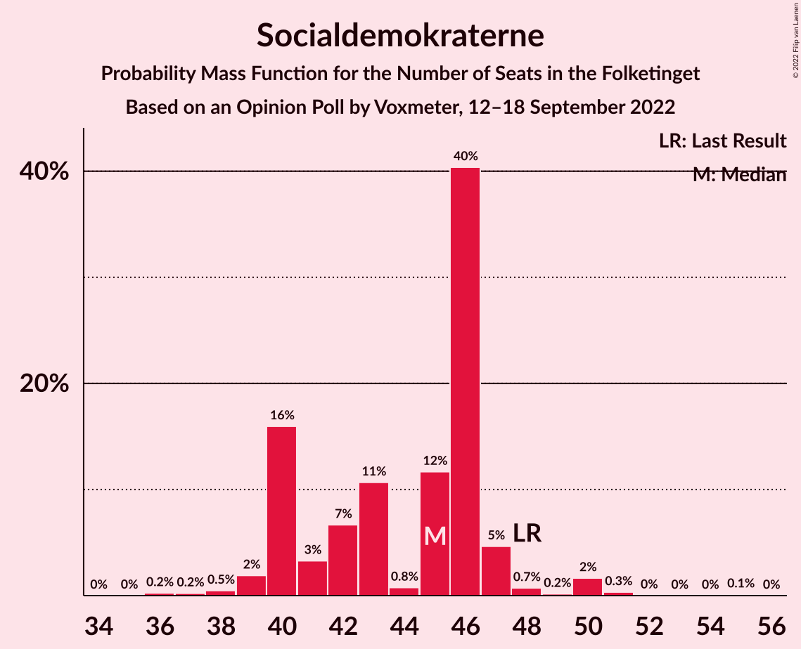
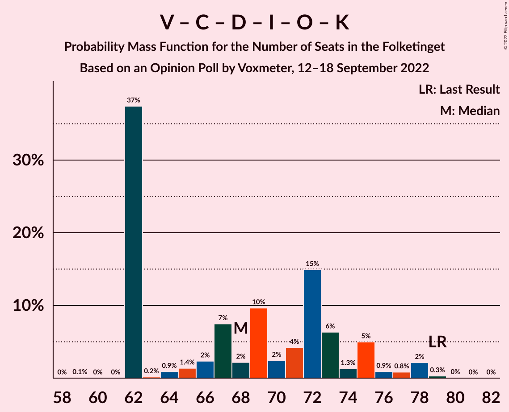

# Opinion Poll by Voxmeter, 12–18 September 2022

<a href="#voting-intentions">Voting Intentions</a> | <a href="#seats">Seats</a> | <a href="#coalitions">Coalitions</a> | <a href="#technical-information">Technical Information</a>

## Voting Intentions

### Confidence Intervals

| Party | Last Result | Poll Result | 80% Confidence Interval | 90% Confidence Interval | 95% Confidence Interval | 99% Confidence Interval |
|:-----:|:-----------:|:-----------:|:-----------------------:|:-----------------------:|:-----------------------:|:-----------------------:|
| Socialdemokraterne | 25.9% | 24.2% | 22.5–26.0% |22.0–26.5% |21.6–26.9% |20.8–27.8% |
| Venstre | 23.4% | 13.9% | 12.6–15.4% |12.2–15.8% |11.9–16.2% |11.3–16.9% |
| Det Konservative Folkeparti | 6.6% | 13.6% | 12.3–15.1% |11.9–15.5% |11.6–15.9% |11.0–16.6% |
| Danmarksdemokraterne | 0.0% | 9.3% | 8.2–10.6% |7.9–10.9% |7.6–11.3% |7.1–11.9% |
| Socialistisk Folkeparti | 7.7% | 8.4% | 7.4–9.6% |7.1–10.0% |6.8–10.3% |6.4–10.9% |
| Enhedslisten–De Rød-Grønne | 6.9% | 8.3% | 7.3–9.5% |7.0–9.9% |6.7–10.2% |6.3–10.8% |
| Radikale Venstre | 8.6% | 6.3% | 5.4–7.4% |5.2–7.7% |5.0–8.0% |4.6–8.5% |
| Nye Borgerlige | 2.4% | 4.8% | 4.0–5.8% |3.8–6.1% |3.6–6.3% |3.3–6.8% |
| Liberal Alliance | 2.3% | 4.3% | 3.6–5.2% |3.4–5.5% |3.2–5.7% |2.9–6.2% |
| Dansk Folkeparti | 8.7% | 2.1% | 1.6–2.8% |1.5–3.0% |1.4–3.2% |1.2–3.6% |
| Moderaterne | 0.0% | 1.8% | 1.4–2.5% |1.2–2.7% |1.1–2.8% |1.0–3.2% |
| Kristendemokraterne | 1.7% | 1.3% | 0.9–1.9% |0.8–2.1% |0.8–2.2% |0.6–2.5% |
| Alternativet | 3.0% | 0.8% | 0.5–1.3% |0.5–1.4% |0.4–1.6% |0.3–1.8% |
| Frie Grønne | 0.0% | 0.4% | 0.2–0.8% |0.2–0.9% |0.2–1.0% |0.1–1.3% |
| Veganerpartiet | 0.0% | 0.3% | 0.2–0.7% |0.1–0.8% |0.1–0.9% |0.1–1.1% |

*Note:* The poll result column reflects the actual value used in the calculations. Published results may vary slightly, and in addition be rounded to fewer digits.

## Seats

### Confidence Intervals

| Party | Last Result | Median | 80% Confidence Interval | 90% Confidence Interval | 95% Confidence Interval | 99% Confidence Interval |
|:-----:|:-----------:|:------:|:-----------------------:|:-----------------------:|:-----------------------:|:-----------------------:|
| <a href="#socialdemokraterne">Socialdemokraterne</a> | 48 | 45 | 40–46 |40–47 |39–48 |37–50 |
| <a href="#venstre">Venstre</a> | 43 | 23 | 22–27 |22–28 |21–29 |21–33 |
| <a href="#det-konservative-folkeparti">Det Konservative Folkeparti</a> | 12 | 25 | 21–28 |21–30 |21–30 |20–31 |
| <a href="#danmarksdemokraterne">Danmarksdemokraterne</a> | 0 | 18 | 14–20 |14–20 |13–21 |13–23 |
| <a href="#socialistisk-folkeparti">Socialistisk Folkeparti</a> | 14 | 15 | 14–16 |13–18 |12–19 |11–20 |
| <a href="#enhedslisten–de-rød-grønne">Enhedslisten–De Rød-Grønne</a> | 13 | 14 | 13–18 |13–19 |12–19 |11–20 |
| <a href="#radikale-venstre">Radikale Venstre</a> | 16 | 12 | 10–14 |9–14 |9–15 |8–15 |
| <a href="#nye-borgerlige">Nye Borgerlige</a> | 4 | 10 | 7–11 |6–11 |6–12 |6–14 |
| <a href="#liberal-alliance">Liberal Alliance</a> | 4 | 8 | 7–11 |7–11 |6–12 |5–12 |
| <a href="#dansk-folkeparti">Dansk Folkeparti</a> | 16 | 0 | 0–4 |0–5 |0–5 |0–7 |
| <a href="#moderaterne">Moderaterne</a> | 0 | 4 | 0–5 |0–5 |0–5 |0–8 |
| <a href="#kristendemokraterne">Kristendemokraterne</a> | 0 | 0 | 0 |0 |0–4 |0–5 |
| <a href="#alternativet">Alternativet</a> | 5 | 0 | 0 |0 |0 |0 |
| <a href="#frie-grønne">Frie Grønne</a> | 0 | 0 | 0 |0 |0 |0 |
| <a href="#veganerpartiet">Veganerpartiet</a> | 0 | 0 | 0 |0 |0 |0 |

### Socialdemokraterne

*For a full overview of the results for this party, see the [Socialdemokraterne](party-socialdemokraterne.html) page.*

| Number of Seats | Probability | Accumulated | Special Marks |
|:---------------:|:-----------:|:-----------:|:-------------:|
| 35 | 0% | 100% |  |
| 36 | 0.2% | 99.9% |  |
| 37 | 0.2% | 99.7% |  |
| 38 | 0.5% | 99.5% |  |
| 39 | 2% | 99.0% |  |
| 40 | 16% | 97% |  |
| 41 | 3% | 81% |  |
| 42 | 7% | 78% |  |
| 43 | 11% | 71% |  |
| 44 | 0.8% | 61% |  |
| 45 | 12% | 60% | Median |
| 46 | 40% | 48% |  |
| 47 | 5% | 8% |  |
| 48 | 0.7% | 3% | Last Result |
| 49 | 0.2% | 2% |  |
| 50 | 2% | 2% |  |
| 51 | 0.3% | 0.5% |  |
| 52 | 0% | 0.2% |  |
| 53 | 0% | 0.1% |  |
| 54 | 0% | 0.1% |  |
| 55 | 0.1% | 0.1% |  |
| 56 | 0% | 0% |  |

### Venstre

*For a full overview of the results for this party, see the [Venstre](party-venstre.html) page.*

| Number of Seats | Probability | Accumulated | Special Marks |
|:---------------:|:-----------:|:-----------:|:-------------:|
| 18 | 0.1% | 100% |  |
| 19 | 0% | 99.9% |  |
| 20 | 0.2% | 99.9% |  |
| 21 | 3% | 99.7% |  |
| 22 | 12% | 97% |  |
| 23 | 40% | 86% | Median |
| 24 | 11% | 45% |  |
| 25 | 6% | 34% |  |
| 26 | 17% | 28% |  |
| 27 | 3% | 11% |  |
| 28 | 3% | 7% |  |
| 29 | 2% | 4% |  |
| 30 | 0.1% | 2% |  |
| 31 | 0.6% | 2% |  |
| 32 | 0% | 1.2% |  |
| 33 | 1.2% | 1.2% |  |
| 34 | 0% | 0% |  |
| 35 | 0% | 0% |  |
| 36 | 0% | 0% |  |
| 37 | 0% | 0% |  |
| 38 | 0% | 0% |  |
| 39 | 0% | 0% |  |
| 40 | 0% | 0% |  |
| 41 | 0% | 0% |  |
| 42 | 0% | 0% |  |
| 43 | 0% | 0% | Last Result |

### Det Konservative Folkeparti

*For a full overview of the results for this party, see the [Det Konservative Folkeparti](party-detkonservativefolkeparti.html) page.*

| Number of Seats | Probability | Accumulated | Special Marks |
|:---------------:|:-----------:|:-----------:|:-------------:|
| 12 | 0% | 100% | Last Result |
| 13 | 0% | 100% |  |
| 14 | 0% | 100% |  |
| 15 | 0% | 100% |  |
| 16 | 0% | 100% |  |
| 17 | 0% | 100% |  |
| 18 | 0% | 100% |  |
| 19 | 0% | 100% |  |
| 20 | 1.2% | 99.9% |  |
| 21 | 38% | 98.7% |  |
| 22 | 0.5% | 61% |  |
| 23 | 5% | 61% |  |
| 24 | 5% | 56% |  |
| 25 | 18% | 51% | Median |
| 26 | 4% | 33% |  |
| 27 | 13% | 30% |  |
| 28 | 9% | 16% |  |
| 29 | 2% | 8% |  |
| 30 | 3% | 5% |  |
| 31 | 1.5% | 2% |  |
| 32 | 0.4% | 0.4% |  |
| 33 | 0% | 0% |  |

### Danmarksdemokraterne

*For a full overview of the results for this party, see the [Danmarksdemokraterne](party-danmarksdemokraterne.html) page.*

| Number of Seats | Probability | Accumulated | Special Marks |
|:---------------:|:-----------:|:-----------:|:-------------:|
| 0 | 0% | 100% | Last Result |
| 1 | 0% | 100% |  |
| 2 | 0% | 100% |  |
| 3 | 0% | 100% |  |
| 4 | 0% | 100% |  |
| 5 | 0% | 100% |  |
| 6 | 0% | 100% |  |
| 7 | 0% | 100% |  |
| 8 | 0% | 100% |  |
| 9 | 0% | 100% |  |
| 10 | 0% | 100% |  |
| 11 | 0% | 100% |  |
| 12 | 0% | 100% |  |
| 13 | 3% | 100% |  |
| 14 | 8% | 97% |  |
| 15 | 4% | 90% |  |
| 16 | 9% | 85% |  |
| 17 | 5% | 77% |  |
| 18 | 28% | 72% | Median |
| 19 | 1.2% | 43% |  |
| 20 | 39% | 42% |  |
| 21 | 3% | 3% |  |
| 22 | 0.1% | 0.7% |  |
| 23 | 0.6% | 0.7% |  |
| 24 | 0% | 0% |  |

### Socialistisk Folkeparti

*For a full overview of the results for this party, see the [Socialistisk Folkeparti](party-socialistiskfolkeparti.html) page.*

| Number of Seats | Probability | Accumulated | Special Marks |
|:---------------:|:-----------:|:-----------:|:-------------:|
| 10 | 0.3% | 100% |  |
| 11 | 0.9% | 99.7% |  |
| 12 | 3% | 98.8% |  |
| 13 | 6% | 96% |  |
| 14 | 3% | 90% | Last Result |
| 15 | 39% | 87% | Median |
| 16 | 40% | 47% |  |
| 17 | 0.8% | 8% |  |
| 18 | 3% | 7% |  |
| 19 | 3% | 4% |  |
| 20 | 1.3% | 1.3% |  |
| 21 | 0% | 0% |  |

### Enhedslisten–De Rød-Grønne

*For a full overview of the results for this party, see the [Enhedslisten–De Rød-Grønne](party-enhedslisten–derød-grønne.html) page.*

| Number of Seats | Probability | Accumulated | Special Marks |
|:---------------:|:-----------:|:-----------:|:-------------:|
| 11 | 0.7% | 100% |  |
| 12 | 2% | 99.2% |  |
| 13 | 43% | 97% | Last Result |
| 14 | 5% | 53% | Median |
| 15 | 23% | 48% |  |
| 16 | 5% | 25% |  |
| 17 | 5% | 21% |  |
| 18 | 6% | 16% |  |
| 19 | 7% | 10% |  |
| 20 | 2% | 2% |  |
| 21 | 0.1% | 0.1% |  |
| 22 | 0% | 0% |  |

### Radikale Venstre

*For a full overview of the results for this party, see the [Radikale Venstre](party-radikalevenstre.html) page.*

| Number of Seats | Probability | Accumulated | Special Marks |
|:---------------:|:-----------:|:-----------:|:-------------:|
| 8 | 2% | 100% |  |
| 9 | 4% | 98% |  |
| 10 | 29% | 94% |  |
| 11 | 5% | 65% |  |
| 12 | 12% | 59% | Median |
| 13 | 4% | 47% |  |
| 14 | 40% | 43% |  |
| 15 | 3% | 3% |  |
| 16 | 0.1% | 0.3% | Last Result |
| 17 | 0.2% | 0.2% |  |
| 18 | 0% | 0% |  |

### Nye Borgerlige

*For a full overview of the results for this party, see the [Nye Borgerlige](party-nyeborgerlige.html) page.*

| Number of Seats | Probability | Accumulated | Special Marks |
|:---------------:|:-----------:|:-----------:|:-------------:|
| 4 | 0% | 100% | Last Result |
| 5 | 0% | 100% |  |
| 6 | 6% | 100% |  |
| 7 | 7% | 94% |  |
| 8 | 7% | 88% |  |
| 9 | 10% | 80% |  |
| 10 | 29% | 70% | Median |
| 11 | 37% | 41% |  |
| 12 | 3% | 4% |  |
| 13 | 0% | 0.5% |  |
| 14 | 0.5% | 0.5% |  |
| 15 | 0% | 0% |  |

### Liberal Alliance

*For a full overview of the results for this party, see the [Liberal Alliance](party-liberalalliance.html) page.*

| Number of Seats | Probability | Accumulated | Special Marks |
|:---------------:|:-----------:|:-----------:|:-------------:|
| 4 | 0.4% | 100% | Last Result |
| 5 | 0.2% | 99.6% |  |
| 6 | 3% | 99.4% |  |
| 7 | 44% | 97% |  |
| 8 | 19% | 52% | Median |
| 9 | 8% | 34% |  |
| 10 | 3% | 26% |  |
| 11 | 18% | 23% |  |
| 12 | 4% | 4% |  |
| 13 | 0% | 0.1% |  |
| 14 | 0% | 0% |  |

### Dansk Folkeparti

*For a full overview of the results for this party, see the [Dansk Folkeparti](party-danskfolkeparti.html) page.*

| Number of Seats | Probability | Accumulated | Special Marks |
|:---------------:|:-----------:|:-----------:|:-------------:|
| 0 | 81% | 100% | Median |
| 1 | 0% | 19% |  |
| 2 | 0% | 19% |  |
| 3 | 0% | 19% |  |
| 4 | 14% | 19% |  |
| 5 | 3% | 5% |  |
| 6 | 1.0% | 2% |  |
| 7 | 0.8% | 0.8% |  |
| 8 | 0% | 0% |  |
| 9 | 0% | 0% |  |
| 10 | 0% | 0% |  |
| 11 | 0% | 0% |  |
| 12 | 0% | 0% |  |
| 13 | 0% | 0% |  |
| 14 | 0% | 0% |  |
| 15 | 0% | 0% |  |
| 16 | 0% | 0% | Last Result |

### Moderaterne

*For a full overview of the results for this party, see the [Moderaterne](party-moderaterne.html) page.*

| Number of Seats | Probability | Accumulated | Special Marks |
|:---------------:|:-----------:|:-----------:|:-------------:|
| 0 | 36% | 100% | Last Result |
| 1 | 0% | 64% |  |
| 2 | 0% | 64% |  |
| 3 | 0% | 64% |  |
| 4 | 20% | 64% | Median |
| 5 | 43% | 44% |  |
| 6 | 0.2% | 1.2% |  |
| 7 | 0.3% | 1.0% |  |
| 8 | 0.8% | 0.8% |  |
| 9 | 0% | 0% |  |

### Kristendemokraterne

*For a full overview of the results for this party, see the [Kristendemokraterne](party-kristendemokraterne.html) page.*

| Number of Seats | Probability | Accumulated | Special Marks |
|:---------------:|:-----------:|:-----------:|:-------------:|
| 0 | 95% | 100% | Last Result, Median |
| 1 | 0% | 5% |  |
| 2 | 0% | 5% |  |
| 3 | 0% | 5% |  |
| 4 | 4% | 5% |  |
| 5 | 0.6% | 0.6% |  |
| 6 | 0% | 0% |  |

### Alternativet

*For a full overview of the results for this party, see the [Alternativet](party-alternativet.html) page.*

| Number of Seats | Probability | Accumulated | Special Marks |
|:---------------:|:-----------:|:-----------:|:-------------:|
| 0 | 100% | 100% | Median |
| 1 | 0% | 0% |  |
| 2 | 0% | 0% |  |
| 3 | 0% | 0% |  |
| 4 | 0% | 0% |  |
| 5 | 0% | 0% | Last Result |

### Frie Grønne

*For a full overview of the results for this party, see the [Frie Grønne](party-friegrønne.html) page.*

| Number of Seats | Probability | Accumulated | Special Marks |
|:---------------:|:-----------:|:-----------:|:-------------:|
| 0 | 100% | 100% | Last Result, Median |

### Veganerpartiet

*For a full overview of the results for this party, see the [Veganerpartiet](party-veganerpartiet.html) page.*

| Number of Seats | Probability | Accumulated | Special Marks |
|:---------------:|:-----------:|:-----------:|:-------------:|
| 0 | 100% | 100% | Last Result, Median |

## Coalitions

### Confidence Intervals

| Coalition | Last Result | Median | Majority? | 80% Confidence Interval | 90% Confidence Interval | 95% Confidence Interval | 99% Confidence Interval |
|:---------:|:-----------:|:------:|:---------:|:-----------------------:|:-----------------------:|:-----------------------:|:-----------------------:|
| Venstre – Det Konservative Folkeparti – Danmarksdemokraterne – Nye Borgerlige – Liberal Alliance – Dansk Folkeparti – Kristendemokraterne | 79 | 85 | 23% | 82–90 | 82–92 | 82–93 | 79–95 |
| Socialdemokraterne – Socialistisk Folkeparti – Enhedslisten–De Rød-Grønne – Radikale Venstre – Alternativet | 96 | 88 | 12% | 81–90 | 81–90 | 79–93 | 77–93 |
| Socialdemokraterne – Socialistisk Folkeparti – Enhedslisten–De Rød-Grønne – Radikale Venstre | 91 | 88 | 12% | 81–90 | 81–90 | 79–93 | 77–93 |
| Socialdemokraterne – Socialistisk Folkeparti – Enhedslisten–De Rød-Grønne – Alternativet | 80 | 74 | 0% | 71–78 | 71–78 | 68–79 | 67–81 |
| Socialdemokraterne – Socialistisk Folkeparti – Enhedslisten–De Rød-Grønne | 75 | 74 | 0% | 71–78 | 71–78 | 68–79 | 67–81 |
| Venstre – Det Konservative Folkeparti – Nye Borgerlige – Liberal Alliance – Dansk Folkeparti – Kristendemokraterne | 79 | 68 | 0% | 62–74 | 62–75 | 62–78 | 62–78 |
| Venstre – Det Konservative Folkeparti – Nye Borgerlige – Liberal Alliance – Dansk Folkeparti | 79 | 67 | 0% | 62–74 | 62–75 | 62–77 | 62–78 |
| Socialdemokraterne – Socialistisk Folkeparti – Radikale Venstre | 78 | 71 | 0% | 66–75 | 66–75 | 65–75 | 62–80 |
| Venstre – Det Konservative Folkeparti – Liberal Alliance – Dansk Folkeparti – Kristendemokraterne | 75 | 59 | 0% | 51–65 | 51–66 | 51–66 | 51–70 |
| Venstre – Det Konservative Folkeparti – Liberal Alliance – Dansk Folkeparti | 75 | 57 | 0% | 51–65 | 51–66 | 51–66 | 51–70 |
| Venstre – Det Konservative Folkeparti – Liberal Alliance | 59 | 57 | 0% | 51–63 | 51–66 | 51–66 | 51–66 |
| Socialdemokraterne – Radikale Venstre | 64 | 55 | 0% | 50–60 | 50–60 | 50–62 | 47–63 |
| Venstre – Det Konservative Folkeparti | 55 | 49 | 0% | 44–54 | 44–56 | 44–56 | 44–58 |
| Venstre | 43 | 23 | 0% | 22–27 | 22–28 | 21–29 | 21–33 |

### Venstre – Det Konservative Folkeparti – Danmarksdemokraterne – Nye Borgerlige – Liberal Alliance – Dansk Folkeparti – Kristendemokraterne

| Number of Seats | Probability | Accumulated | Special Marks |
|:---------------:|:-----------:|:-----------:|:-------------:|
| 76 | 0.1% | 100% |  |
| 77 | 0% | 99.8% |  |
| 78 | 0.1% | 99.8% |  |
| 79 | 0.3% | 99.8% | Last Result |
| 80 | 0.3% | 99.5% |  |
| 81 | 0.1% | 99.2% |  |
| 82 | 41% | 99.1% |  |
| 83 | 2% | 59% |  |
| 84 | 0.9% | 56% | Median |
| 85 | 8% | 55% |  |
| 86 | 1.0% | 48% |  |
| 87 | 12% | 47% |  |
| 88 | 4% | 34% |  |
| 89 | 8% | 31% |  |
| 90 | 18% | 23% | Majority |
| 91 | 0.2% | 5% |  |
| 92 | 2% | 5% |  |
| 93 | 2% | 3% |  |
| 94 | 0.6% | 1.5% |  |
| 95 | 0.7% | 0.9% |  |
| 96 | 0.1% | 0.2% |  |
| 97 | 0.1% | 0.1% |  |
| 98 | 0% | 0% |  |

### Socialdemokraterne – Socialistisk Folkeparti – Enhedslisten–De Rød-Grønne – Radikale Venstre – Alternativet

| Number of Seats | Probability | Accumulated | Special Marks |
|:---------------:|:-----------:|:-----------:|:-------------:|
| 77 | 0.5% | 100% |  |
| 78 | 2% | 99.4% |  |
| 79 | 0.4% | 98% |  |
| 80 | 0.7% | 97% |  |
| 81 | 15% | 97% |  |
| 82 | 2% | 82% |  |
| 83 | 6% | 80% |  |
| 84 | 1.3% | 75% |  |
| 85 | 4% | 73% |  |
| 86 | 8% | 69% | Median |
| 87 | 0.5% | 61% |  |
| 88 | 48% | 60% |  |
| 89 | 0.2% | 12% |  |
| 90 | 7% | 12% | Majority |
| 91 | 0.2% | 5% |  |
| 92 | 2% | 5% |  |
| 93 | 2% | 3% |  |
| 94 | 0.1% | 0.4% |  |
| 95 | 0% | 0.4% |  |
| 96 | 0.2% | 0.4% | Last Result |
| 97 | 0% | 0.2% |  |
| 98 | 0% | 0.1% |  |
| 99 | 0.1% | 0.1% |  |
| 100 | 0% | 0% |  |

### Socialdemokraterne – Socialistisk Folkeparti – Enhedslisten–De Rød-Grønne – Radikale Venstre

| Number of Seats | Probability | Accumulated | Special Marks |
|:---------------:|:-----------:|:-----------:|:-------------:|
| 77 | 0.5% | 100% |  |
| 78 | 2% | 99.4% |  |
| 79 | 0.4% | 98% |  |
| 80 | 0.7% | 97% |  |
| 81 | 15% | 97% |  |
| 82 | 2% | 82% |  |
| 83 | 6% | 80% |  |
| 84 | 1.3% | 75% |  |
| 85 | 4% | 73% |  |
| 86 | 8% | 69% | Median |
| 87 | 0.5% | 61% |  |
| 88 | 48% | 60% |  |
| 89 | 0.2% | 12% |  |
| 90 | 7% | 12% | Majority |
| 91 | 0.2% | 5% | Last Result |
| 92 | 2% | 5% |  |
| 93 | 2% | 3% |  |
| 94 | 0.1% | 0.4% |  |
| 95 | 0% | 0.4% |  |
| 96 | 0.2% | 0.4% |  |
| 97 | 0% | 0.2% |  |
| 98 | 0% | 0.1% |  |
| 99 | 0.1% | 0.1% |  |
| 100 | 0% | 0% |  |

### Socialdemokraterne – Socialistisk Folkeparti – Enhedslisten–De Rød-Grønne – Alternativet

| Number of Seats | Probability | Accumulated | Special Marks |
|:---------------:|:-----------:|:-----------:|:-------------:|
| 66 | 0.2% | 100% |  |
| 67 | 0.4% | 99.7% |  |
| 68 | 2% | 99.3% |  |
| 69 | 0.5% | 97% |  |
| 70 | 1.1% | 96% |  |
| 71 | 15% | 95% |  |
| 72 | 4% | 80% |  |
| 73 | 4% | 76% |  |
| 74 | 41% | 71% | Median |
| 75 | 2% | 30% |  |
| 76 | 5% | 28% |  |
| 77 | 6% | 22% |  |
| 78 | 11% | 16% |  |
| 79 | 2% | 5% |  |
| 80 | 2% | 2% | Last Result |
| 81 | 0% | 0.5% |  |
| 82 | 0% | 0.5% |  |
| 83 | 0.1% | 0.5% |  |
| 84 | 0.2% | 0.4% |  |
| 85 | 0% | 0.2% |  |
| 86 | 0% | 0.2% |  |
| 87 | 0.1% | 0.1% |  |
| 88 | 0% | 0% |  |

### Socialdemokraterne – Socialistisk Folkeparti – Enhedslisten–De Rød-Grønne

| Number of Seats | Probability | Accumulated | Special Marks |
|:---------------:|:-----------:|:-----------:|:-------------:|
| 66 | 0.2% | 100% |  |
| 67 | 0.4% | 99.7% |  |
| 68 | 2% | 99.3% |  |
| 69 | 0.5% | 97% |  |
| 70 | 1.1% | 96% |  |
| 71 | 15% | 95% |  |
| 72 | 4% | 80% |  |
| 73 | 4% | 76% |  |
| 74 | 41% | 71% | Median |
| 75 | 2% | 30% | Last Result |
| 76 | 5% | 28% |  |
| 77 | 6% | 22% |  |
| 78 | 11% | 16% |  |
| 79 | 2% | 5% |  |
| 80 | 2% | 2% |  |
| 81 | 0% | 0.5% |  |
| 82 | 0% | 0.5% |  |
| 83 | 0.1% | 0.5% |  |
| 84 | 0.2% | 0.4% |  |
| 85 | 0% | 0.2% |  |
| 86 | 0% | 0.2% |  |
| 87 | 0.1% | 0.1% |  |
| 88 | 0% | 0% |  |

### Venstre – Det Konservative Folkeparti – Nye Borgerlige – Liberal Alliance – Dansk Folkeparti – Kristendemokraterne

| Number of Seats | Probability | Accumulated | Special Marks |
|:---------------:|:-----------:|:-----------:|:-------------:|
| 59 | 0.1% | 100% |  |
| 60 | 0% | 99.9% |  |
| 61 | 0% | 99.9% |  |
| 62 | 37% | 99.9% |  |
| 63 | 0.2% | 62% |  |
| 64 | 0.9% | 62% |  |
| 65 | 1.4% | 61% |  |
| 66 | 2% | 60% | Median |
| 67 | 7% | 58% |  |
| 68 | 2% | 50% |  |
| 69 | 10% | 48% |  |
| 70 | 2% | 38% |  |
| 71 | 4% | 36% |  |
| 72 | 15% | 32% |  |
| 73 | 6% | 17% |  |
| 74 | 1.3% | 11% |  |
| 75 | 5% | 9% |  |
| 76 | 0.9% | 4% |  |
| 77 | 0.8% | 3% |  |
| 78 | 2% | 3% |  |
| 79 | 0.3% | 0.4% | Last Result |
| 80 | 0% | 0.1% |  |
| 81 | 0% | 0% |  |

### Venstre – Det Konservative Folkeparti – Nye Borgerlige – Liberal Alliance – Dansk Folkeparti

| Number of Seats | Probability | Accumulated | Special Marks |
|:---------------:|:-----------:|:-----------:|:-------------:|
| 59 | 0.1% | 100% |  |
| 60 | 0% | 99.9% |  |
| 61 | 0% | 99.9% |  |
| 62 | 38% | 99.9% |  |
| 63 | 0.2% | 62% |  |
| 64 | 2% | 62% |  |
| 65 | 1.4% | 60% |  |
| 66 | 5% | 58% | Median |
| 67 | 7% | 54% |  |
| 68 | 0.9% | 46% |  |
| 69 | 10% | 46% |  |
| 70 | 0.6% | 36% |  |
| 71 | 4% | 35% |  |
| 72 | 15% | 31% |  |
| 73 | 6% | 16% |  |
| 74 | 1.5% | 10% |  |
| 75 | 5% | 9% |  |
| 76 | 0.6% | 4% |  |
| 77 | 0.8% | 3% |  |
| 78 | 2% | 2% |  |
| 79 | 0.3% | 0.3% | Last Result |
| 80 | 0% | 0.1% |  |
| 81 | 0% | 0% |  |

### Socialdemokraterne – Socialistisk Folkeparti – Radikale Venstre

| Number of Seats | Probability | Accumulated | Special Marks |
|:---------------:|:-----------:|:-----------:|:-------------:|
| 62 | 0.5% | 100% |  |
| 63 | 0.4% | 99.5% |  |
| 64 | 0.2% | 99.1% |  |
| 65 | 2% | 98.9% |  |
| 66 | 15% | 97% |  |
| 67 | 3% | 82% |  |
| 68 | 8% | 79% |  |
| 69 | 2% | 71% |  |
| 70 | 2% | 69% |  |
| 71 | 18% | 67% |  |
| 72 | 2% | 50% | Median |
| 73 | 2% | 47% |  |
| 74 | 1.0% | 45% |  |
| 75 | 42% | 44% |  |
| 76 | 0.4% | 2% |  |
| 77 | 0% | 2% |  |
| 78 | 0.3% | 2% | Last Result |
| 79 | 0.1% | 2% |  |
| 80 | 2% | 2% |  |
| 81 | 0% | 0.1% |  |
| 82 | 0% | 0.1% |  |
| 83 | 0% | 0.1% |  |
| 84 | 0.1% | 0.1% |  |
| 85 | 0% | 0% |  |

### Venstre – Det Konservative Folkeparti – Liberal Alliance – Dansk Folkeparti – Kristendemokraterne

| Number of Seats | Probability | Accumulated | Special Marks |
|:---------------:|:-----------:|:-----------:|:-------------:|
| 51 | 37% | 100% |  |
| 52 | 0.2% | 63% |  |
| 53 | 0.1% | 63% |  |
| 54 | 0.1% | 63% |  |
| 55 | 0.1% | 63% |  |
| 56 | 2% | 62% | Median |
| 57 | 9% | 61% |  |
| 58 | 1.1% | 52% |  |
| 59 | 7% | 51% |  |
| 60 | 1.3% | 44% |  |
| 61 | 2% | 43% |  |
| 62 | 19% | 41% |  |
| 63 | 3% | 22% |  |
| 64 | 4% | 19% |  |
| 65 | 6% | 15% |  |
| 66 | 7% | 9% |  |
| 67 | 0.3% | 2% |  |
| 68 | 0.4% | 2% |  |
| 69 | 0.4% | 1.3% |  |
| 70 | 0.8% | 1.0% |  |
| 71 | 0.2% | 0.2% |  |
| 72 | 0% | 0.1% |  |
| 73 | 0% | 0.1% |  |
| 74 | 0% | 0% |  |
| 75 | 0% | 0% | Last Result |

### Venstre – Det Konservative Folkeparti – Liberal Alliance – Dansk Folkeparti

| Number of Seats | Probability | Accumulated | Special Marks |
|:---------------:|:-----------:|:-----------:|:-------------:|
| 51 | 37% | 100% |  |
| 52 | 0.2% | 63% |  |
| 53 | 0.1% | 63% |  |
| 54 | 0.1% | 63% |  |
| 55 | 2% | 63% |  |
| 56 | 2% | 61% | Median |
| 57 | 9% | 59% |  |
| 58 | 1.1% | 50% |  |
| 59 | 5% | 49% |  |
| 60 | 3% | 44% |  |
| 61 | 2% | 40% |  |
| 62 | 19% | 39% |  |
| 63 | 2% | 19% |  |
| 64 | 2% | 17% |  |
| 65 | 6% | 15% |  |
| 66 | 7% | 9% |  |
| 67 | 0.2% | 1.4% |  |
| 68 | 0.1% | 1.2% |  |
| 69 | 0.3% | 1.1% |  |
| 70 | 0.6% | 0.8% |  |
| 71 | 0.1% | 0.2% |  |
| 72 | 0% | 0.1% |  |
| 73 | 0% | 0.1% |  |
| 74 | 0% | 0% |  |
| 75 | 0% | 0% | Last Result |

### Venstre – Det Konservative Folkeparti – Liberal Alliance

| Number of Seats | Probability | Accumulated | Special Marks |
|:---------------:|:-----------:|:-----------:|:-------------:|
| 48 | 0.2% | 100% |  |
| 49 | 0% | 99.8% |  |
| 50 | 0.2% | 99.7% |  |
| 51 | 38% | 99.5% |  |
| 52 | 0.1% | 62% |  |
| 53 | 0.4% | 62% |  |
| 54 | 1.1% | 61% |  |
| 55 | 4% | 60% |  |
| 56 | 4% | 56% | Median |
| 57 | 9% | 52% |  |
| 58 | 2% | 42% |  |
| 59 | 3% | 40% | Last Result |
| 60 | 2% | 37% |  |
| 61 | 5% | 35% |  |
| 62 | 20% | 31% |  |
| 63 | 1.0% | 11% |  |
| 64 | 0.8% | 10% |  |
| 65 | 2% | 9% |  |
| 66 | 7% | 7% |  |
| 67 | 0.1% | 0.2% |  |
| 68 | 0% | 0.1% |  |
| 69 | 0.1% | 0.1% |  |
| 70 | 0% | 0% |  |

### Socialdemokraterne – Radikale Venstre

| Number of Seats | Probability | Accumulated | Special Marks |
|:---------------:|:-----------:|:-----------:|:-------------:|
| 45 | 0.1% | 100% |  |
| 46 | 0.4% | 99.9% |  |
| 47 | 0.1% | 99.5% |  |
| 48 | 0.2% | 99.4% |  |
| 49 | 2% | 99.2% |  |
| 50 | 15% | 98% |  |
| 51 | 1.4% | 82% |  |
| 52 | 3% | 81% |  |
| 53 | 3% | 77% |  |
| 54 | 2% | 75% |  |
| 55 | 23% | 73% |  |
| 56 | 3% | 50% |  |
| 57 | 3% | 47% | Median |
| 58 | 0.3% | 44% |  |
| 59 | 1.3% | 44% |  |
| 60 | 38% | 42% |  |
| 61 | 0.4% | 4% |  |
| 62 | 4% | 4% |  |
| 63 | 0.3% | 0.5% |  |
| 64 | 0.1% | 0.2% | Last Result |
| 65 | 0% | 0.1% |  |
| 66 | 0% | 0.1% |  |
| 67 | 0.1% | 0.1% |  |
| 68 | 0% | 0% |  |

### Venstre – Det Konservative Folkeparti

| Number of Seats | Probability | Accumulated | Special Marks |
|:---------------:|:-----------:|:-----------:|:-------------:|
| 40 | 0.2% | 100% |  |
| 41 | 0.1% | 99.8% |  |
| 42 | 0.2% | 99.8% |  |
| 43 | 0.1% | 99.6% |  |
| 44 | 38% | 99.5% |  |
| 45 | 0.3% | 62% |  |
| 46 | 0.2% | 62% |  |
| 47 | 7% | 61% |  |
| 48 | 1.5% | 55% | Median |
| 49 | 9% | 53% |  |
| 50 | 8% | 44% |  |
| 51 | 19% | 37% |  |
| 52 | 1.1% | 17% |  |
| 53 | 3% | 16% |  |
| 54 | 3% | 13% |  |
| 55 | 3% | 10% | Last Result |
| 56 | 4% | 6% |  |
| 57 | 0.1% | 2% |  |
| 58 | 2% | 2% |  |
| 59 | 0.2% | 0.3% |  |
| 60 | 0.1% | 0.1% |  |
| 61 | 0% | 0% |  |

### Venstre

| Number of Seats | Probability | Accumulated | Special Marks |
|:---------------:|:-----------:|:-----------:|:-------------:|
| 18 | 0.1% | 100% |  |
| 19 | 0% | 99.9% |  |
| 20 | 0.2% | 99.9% |  |
| 21 | 3% | 99.7% |  |
| 22 | 12% | 97% |  |
| 23 | 40% | 86% | Median |
| 24 | 11% | 45% |  |
| 25 | 6% | 34% |  |
| 26 | 17% | 28% |  |
| 27 | 3% | 11% |  |
| 28 | 3% | 7% |  |
| 29 | 2% | 4% |  |
| 30 | 0.1% | 2% |  |
| 31 | 0.6% | 2% |  |
| 32 | 0% | 1.2% |  |
| 33 | 1.2% | 1.2% |  |
| 34 | 0% | 0% |  |
| 35 | 0% | 0% |  |
| 36 | 0% | 0% |  |
| 37 | 0% | 0% |  |
| 38 | 0% | 0% |  |
| 39 | 0% | 0% |  |
| 40 | 0% | 0% |  |
| 41 | 0% | 0% |  |
| 42 | 0% | 0% |  |
| 43 | 0% | 0% | Last Result |

## Technical Information

### Opinion Poll

+ **Polling firm:** Voxmeter
+ **Commissioner(s):** —
+ **Fieldwork period:** 12–18 September 2022

### Calculations

+ **Sample size:** 1001
+ **Simulations done:** 1,048,576
+ **Error estimate:** 2.90%

