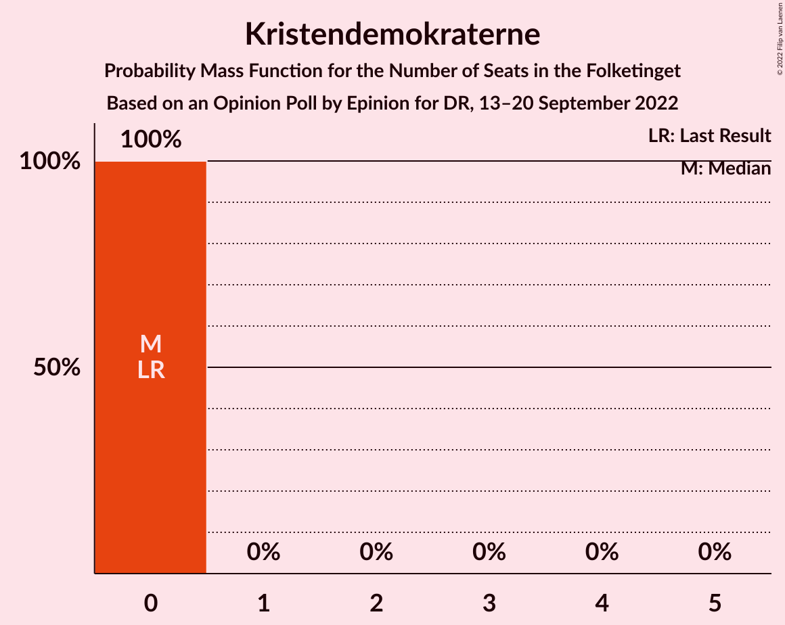
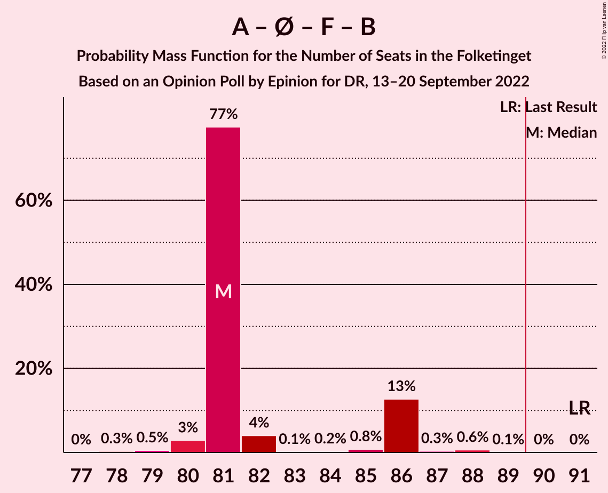
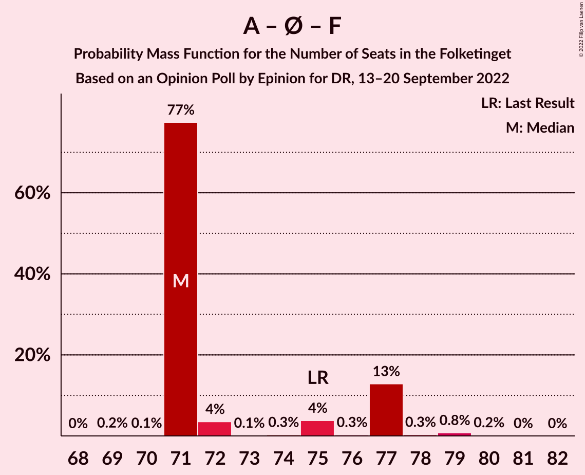

# Opinion Poll by Epinion for DR, 13–20 September 2022

<a href="#voting-intentions">Voting Intentions</a> | <a href="#seats">Seats</a> | <a href="#coalitions">Coalitions</a> | <a href="#technical-information">Technical Information</a>

## Voting Intentions

### Confidence Intervals

| Party | Last Result | Poll Result | 80% Confidence Interval | 90% Confidence Interval | 95% Confidence Interval | 99% Confidence Interval |
|:-----:|:-----------:|:-----------:|:-----------------------:|:-----------------------:|:-----------------------:|:-----------------------:|
| Socialdemokraterne | 25.9% | 25.4% | 24.3–26.6% |23.9–27.0% |23.7–27.3% |23.1–27.8% |
| Det Konservative Folkeparti | 6.6% | 13.4% | 12.5–14.4% |12.3–14.6% |12.0–14.9% |11.6–15.3% |
| Venstre | 23.4% | 11.9% | 11.1–12.8% |10.8–13.1% |10.6–13.3% |10.2–13.7% |
| Danmarksdemokraterne | 0.0% | 10.8% | 10.0–11.7% |9.8–11.9% |9.6–12.1% |9.2–12.6% |
| Enhedslisten–De Rød-Grønne | 6.9% | 8.1% | 7.4–8.9% |7.2–9.1% |7.0–9.3% |6.7–9.7% |
| Socialistisk Folkeparti | 7.7% | 7.6% | 7.0–8.4% |6.8–8.6% |6.6–8.8% |6.3–9.2% |
| Liberal Alliance | 2.3% | 5.3% | 4.7–5.9% |4.6–6.1% |4.4–6.3% |4.2–6.6% |
| Radikale Venstre | 8.6% | 4.6% | 4.1–5.2% |3.9–5.4% |3.8–5.5% |3.6–5.8% |
| Nye Borgerlige | 2.4% | 4.6% | 4.1–5.2% |3.9–5.4% |3.8–5.5% |3.6–5.8% |
| Moderaterne | 0.0% | 3.3% | 2.9–3.8% |2.7–4.0% |2.6–4.1% |2.4–4.4% |
| Dansk Folkeparti | 8.7% | 1.9% | 1.6–2.3% |1.5–2.4% |1.4–2.5% |1.3–2.8% |
| Frie Grønne | 0.0% | 1.0% | 0.8–1.3% |0.7–1.4% |0.7–1.5% |0.6–1.7% |
| Alternativet | 3.0% | 0.9% | 0.7–1.2% |0.6–1.3% |0.6–1.4% |0.5–1.5% |
| Kristendemokraterne | 1.7% | 0.3% | 0.2–0.5% |0.2–0.6% |0.2–0.6% |0.1–0.8% |
| Veganerpartiet | 0.0% | 0.3% | 0.2–0.5% |0.2–0.6% |0.2–0.6% |0.1–0.8% |

*Note:* The poll result column reflects the actual value used in the calculations. Published results may vary slightly, and in addition be rounded to fewer digits.

## Seats

### Confidence Intervals

| Party | Last Result | Median | 80% Confidence Interval | 90% Confidence Interval | 95% Confidence Interval | 99% Confidence Interval |
|:-----:|:-----------:|:------:|:-----------------------:|:-----------------------:|:-----------------------:|:-----------------------:|
| <a href="#socialdemokraterne">Socialdemokraterne</a> | 48 | 43 | 43–47 |43–48 |42–48 |42–50 |
| <a href="#det-konservative-folkeparti">Det Konservative Folkeparti</a> | 12 | 26 | 24–26 |23–26 |23–26 |22–27 |
| <a href="#venstre">Venstre</a> | 43 | 24 | 20–24 |20–24 |20–24 |20–25 |
| <a href="#danmarksdemokraterne">Danmarksdemokraterne</a> | 0 | 19 | 19–21 |19–22 |19–22 |18–22 |
| <a href="#enhedslisten–de-rød-grønne">Enhedslisten–De Rød-Grønne</a> | 13 | 15 | 15–16 |14–17 |13–17 |13–17 |
| <a href="#socialistisk-folkeparti">Socialistisk Folkeparti</a> | 14 | 13 | 13–14 |12–15 |12–16 |12–16 |
| <a href="#liberal-alliance">Liberal Alliance</a> | 4 | 10 | 9–10 |9–10 |8–11 |8–11 |
| <a href="#radikale-venstre">Radikale Venstre</a> | 16 | 10 | 9–10 |8–10 |7–10 |7–10 |
| <a href="#nye-borgerlige">Nye Borgerlige</a> | 4 | 9 | 7–9 |7–9 |6–9 |6–10 |
| <a href="#moderaterne">Moderaterne</a> | 0 | 6 | 6 |6 |5–8 |5–8 |
| <a href="#dansk-folkeparti">Dansk Folkeparti</a> | 16 | 0 | 0–4 |0–4 |0–4 |0–4 |
| <a href="#frie-grønne">Frie Grønne</a> | 0 | 0 | 0 |0 |0 |0 |
| <a href="#alternativet">Alternativet</a> | 5 | 0 | 0 |0 |0 |0 |
| <a href="#kristendemokraterne">Kristendemokraterne</a> | 0 | 0 | 0 |0 |0 |0 |
| <a href="#veganerpartiet">Veganerpartiet</a> | 0 | 0 | 0 |0 |0 |0 |

### Socialdemokraterne

*For a full overview of the results for this party, see the [Socialdemokraterne](party-socialdemokraterne.html) page.*

| Number of Seats | Probability | Accumulated | Special Marks |
|:---------------:|:-----------:|:-----------:|:-------------:|
| 41 | 0.3% | 100% |  |
| 42 | 3% | 99.7% |  |
| 43 | 77% | 97% | Median |
| 44 | 0.3% | 20% |  |
| 45 | 0.5% | 19% |  |
| 46 | 3% | 19% |  |
| 47 | 6% | 16% |  |
| 48 | 8% | 10% | Last Result |
| 49 | 0.6% | 1.2% |  |
| 50 | 0.5% | 0.6% |  |
| 51 | 0.1% | 0.1% |  |
| 52 | 0% | 0% |  |

### Det Konservative Folkeparti

*For a full overview of the results for this party, see the [Det Konservative Folkeparti](party-detkonservativefolkeparti.html) page.*

| Number of Seats | Probability | Accumulated | Special Marks |
|:---------------:|:-----------:|:-----------:|:-------------:|
| 12 | 0% | 100% | Last Result |
| 13 | 0% | 100% |  |
| 14 | 0% | 100% |  |
| 15 | 0% | 100% |  |
| 16 | 0% | 100% |  |
| 17 | 0% | 100% |  |
| 18 | 0% | 100% |  |
| 19 | 0% | 100% |  |
| 20 | 0% | 100% |  |
| 21 | 0.1% | 100% |  |
| 22 | 0.9% | 99.9% |  |
| 23 | 5% | 99.0% |  |
| 24 | 12% | 94% |  |
| 25 | 3% | 82% |  |
| 26 | 77% | 79% | Median |
| 27 | 2% | 2% |  |
| 28 | 0.1% | 0.1% |  |
| 29 | 0% | 0% |  |

### Venstre

*For a full overview of the results for this party, see the [Venstre](party-venstre.html) page.*

| Number of Seats | Probability | Accumulated | Special Marks |
|:---------------:|:-----------:|:-----------:|:-------------:|
| 18 | 0.1% | 100% |  |
| 19 | 0.3% | 99.9% |  |
| 20 | 10% | 99.6% |  |
| 21 | 5% | 89% |  |
| 22 | 5% | 84% |  |
| 23 | 0.9% | 78% |  |
| 24 | 77% | 78% | Median |
| 25 | 0.5% | 0.5% |  |
| 26 | 0% | 0% |  |
| 27 | 0% | 0% |  |
| 28 | 0% | 0% |  |
| 29 | 0% | 0% |  |
| 30 | 0% | 0% |  |
| 31 | 0% | 0% |  |
| 32 | 0% | 0% |  |
| 33 | 0% | 0% |  |
| 34 | 0% | 0% |  |
| 35 | 0% | 0% |  |
| 36 | 0% | 0% |  |
| 37 | 0% | 0% |  |
| 38 | 0% | 0% |  |
| 39 | 0% | 0% |  |
| 40 | 0% | 0% |  |
| 41 | 0% | 0% |  |
| 42 | 0% | 0% |  |
| 43 | 0% | 0% | Last Result |

### Danmarksdemokraterne

*For a full overview of the results for this party, see the [Danmarksdemokraterne](party-danmarksdemokraterne.html) page.*

| Number of Seats | Probability | Accumulated | Special Marks |
|:---------------:|:-----------:|:-----------:|:-------------:|
| 0 | 0% | 100% | Last Result |
| 1 | 0% | 100% |  |
| 2 | 0% | 100% |  |
| 3 | 0% | 100% |  |
| 4 | 0% | 100% |  |
| 5 | 0% | 100% |  |
| 6 | 0% | 100% |  |
| 7 | 0% | 100% |  |
| 8 | 0% | 100% |  |
| 9 | 0% | 100% |  |
| 10 | 0% | 100% |  |
| 11 | 0% | 100% |  |
| 12 | 0% | 100% |  |
| 13 | 0% | 100% |  |
| 14 | 0% | 100% |  |
| 15 | 0% | 100% |  |
| 16 | 0% | 100% |  |
| 17 | 0% | 100% |  |
| 18 | 2% | 99.9% |  |
| 19 | 86% | 98% | Median |
| 20 | 0.9% | 11% |  |
| 21 | 5% | 11% |  |
| 22 | 5% | 5% |  |
| 23 | 0.2% | 0.2% |  |
| 24 | 0% | 0% |  |

### Enhedslisten–De Rød-Grønne

*For a full overview of the results for this party, see the [Enhedslisten–De Rød-Grønne](party-enhedslisten–derød-grønne.html) page.*

| Number of Seats | Probability | Accumulated | Special Marks |
|:---------------:|:-----------:|:-----------:|:-------------:|
| 12 | 0.2% | 100% |  |
| 13 | 4% | 99.8% | Last Result |
| 14 | 0.6% | 95% |  |
| 15 | 82% | 95% | Median |
| 16 | 4% | 13% |  |
| 17 | 9% | 9% |  |
| 18 | 0.2% | 0.2% |  |
| 19 | 0% | 0% |  |

### Socialistisk Folkeparti

*For a full overview of the results for this party, see the [Socialistisk Folkeparti](party-socialistiskfolkeparti.html) page.*

| Number of Seats | Probability | Accumulated | Special Marks |
|:---------------:|:-----------:|:-----------:|:-------------:|
| 11 | 0.2% | 100% |  |
| 12 | 9% | 99.8% |  |
| 13 | 78% | 91% | Median |
| 14 | 4% | 13% | Last Result |
| 15 | 6% | 9% |  |
| 16 | 3% | 3% |  |
| 17 | 0% | 0.1% |  |
| 18 | 0% | 0% |  |

### Liberal Alliance

*For a full overview of the results for this party, see the [Liberal Alliance](party-liberalalliance.html) page.*

| Number of Seats | Probability | Accumulated | Special Marks |
|:---------------:|:-----------:|:-----------:|:-------------:|
| 4 | 0% | 100% | Last Result |
| 5 | 0% | 100% |  |
| 6 | 0% | 100% |  |
| 7 | 0.2% | 100% |  |
| 8 | 3% | 99.8% |  |
| 9 | 13% | 97% |  |
| 10 | 81% | 84% | Median |
| 11 | 2% | 3% |  |
| 12 | 0.1% | 0.2% |  |
| 13 | 0.1% | 0.1% |  |
| 14 | 0% | 0% |  |

### Radikale Venstre

*For a full overview of the results for this party, see the [Radikale Venstre](party-radikalevenstre.html) page.*

| Number of Seats | Probability | Accumulated | Special Marks |
|:---------------:|:-----------:|:-----------:|:-------------:|
| 6 | 0.2% | 100% |  |
| 7 | 4% | 99.8% |  |
| 8 | 4% | 96% |  |
| 9 | 14% | 91% |  |
| 10 | 77% | 77% | Median |
| 11 | 0% | 0% |  |
| 12 | 0% | 0% |  |
| 13 | 0% | 0% |  |
| 14 | 0% | 0% |  |
| 15 | 0% | 0% |  |
| 16 | 0% | 0% | Last Result |

### Nye Borgerlige

*For a full overview of the results for this party, see the [Nye Borgerlige](party-nyeborgerlige.html) page.*

| Number of Seats | Probability | Accumulated | Special Marks |
|:---------------:|:-----------:|:-----------:|:-------------:|
| 4 | 0% | 100% | Last Result |
| 5 | 0% | 100% |  |
| 6 | 3% | 100% |  |
| 7 | 9% | 97% |  |
| 8 | 3% | 89% |  |
| 9 | 85% | 85% | Median |
| 10 | 0.4% | 0.5% |  |
| 11 | 0.2% | 0.2% |  |
| 12 | 0% | 0% |  |

### Moderaterne

*For a full overview of the results for this party, see the [Moderaterne](party-moderaterne.html) page.*

| Number of Seats | Probability | Accumulated | Special Marks |
|:---------------:|:-----------:|:-----------:|:-------------:|
| 0 | 0% | 100% | Last Result |
| 1 | 0% | 100% |  |
| 2 | 0% | 100% |  |
| 3 | 0% | 100% |  |
| 4 | 0.1% | 100% |  |
| 5 | 2% | 99.9% |  |
| 6 | 93% | 97% | Median |
| 7 | 0.8% | 4% |  |
| 8 | 3% | 3% |  |
| 9 | 0.3% | 0.3% |  |
| 10 | 0% | 0% |  |

### Dansk Folkeparti

*For a full overview of the results for this party, see the [Dansk Folkeparti](party-danskfolkeparti.html) page.*

| Number of Seats | Probability | Accumulated | Special Marks |
|:---------------:|:-----------:|:-----------:|:-------------:|
| 0 | 86% | 100% | Median |
| 1 | 0% | 14% |  |
| 2 | 0% | 14% |  |
| 3 | 0% | 14% |  |
| 4 | 13% | 14% |  |
| 5 | 0.4% | 0.4% |  |
| 6 | 0% | 0% |  |
| 7 | 0% | 0% |  |
| 8 | 0% | 0% |  |
| 9 | 0% | 0% |  |
| 10 | 0% | 0% |  |
| 11 | 0% | 0% |  |
| 12 | 0% | 0% |  |
| 13 | 0% | 0% |  |
| 14 | 0% | 0% |  |
| 15 | 0% | 0% |  |
| 16 | 0% | 0% | Last Result |

### Frie Grønne

*For a full overview of the results for this party, see the [Frie Grønne](party-friegrønne.html) page.*

| Number of Seats | Probability | Accumulated | Special Marks |
|:---------------:|:-----------:|:-----------:|:-------------:|
| 0 | 100% | 100% | Last Result, Median |

### Alternativet

*For a full overview of the results for this party, see the [Alternativet](party-alternativet.html) page.*

| Number of Seats | Probability | Accumulated | Special Marks |
|:---------------:|:-----------:|:-----------:|:-------------:|
| 0 | 100% | 100% | Median |
| 1 | 0% | 0% |  |
| 2 | 0% | 0% |  |
| 3 | 0% | 0% |  |
| 4 | 0% | 0% |  |
| 5 | 0% | 0% | Last Result |

### Kristendemokraterne

*For a full overview of the results for this party, see the [Kristendemokraterne](party-kristendemokraterne.html) page.*

| Number of Seats | Probability | Accumulated | Special Marks |
|:---------------:|:-----------:|:-----------:|:-------------:|
| 0 | 100% | 100% | Last Result, Median |

### Veganerpartiet

*For a full overview of the results for this party, see the [Veganerpartiet](party-veganerpartiet.html) page.*

| Number of Seats | Probability | Accumulated | Special Marks |
|:---------------:|:-----------:|:-----------:|:-------------:|
| 0 | 100% | 100% | Last Result, Median |

## Coalitions

### Confidence Intervals

| Coalition | Last Result | Median | Majority? | 80% Confidence Interval | 90% Confidence Interval | 95% Confidence Interval | 99% Confidence Interval |
|:---------:|:-----------:|:------:|:---------:|:-----------------------:|:-----------------------:|:-----------------------:|:-----------------------:|
| Det Konservative Folkeparti – Venstre – Danmarksdemokraterne – Liberal Alliance – Nye Borgerlige – Dansk Folkeparti – Kristendemokraterne | 79 | 88 | 0.4% | 83–88 | 83–88 | 83–88 | 81–89 |
| Socialdemokraterne – Enhedslisten–De Rød-Grønne – Socialistisk Folkeparti – Radikale Venstre – Alternativet | 96 | 81 | 0% | 81–86 | 81–86 | 80–86 | 79–88 |
| Socialdemokraterne – Enhedslisten–De Rød-Grønne – Socialistisk Folkeparti – Radikale Venstre | 91 | 81 | 0% | 81–86 | 81–86 | 80–86 | 79–88 |
| Socialdemokraterne – Enhedslisten–De Rød-Grønne – Socialistisk Folkeparti – Alternativet | 80 | 71 | 0% | 71–77 | 71–77 | 71–77 | 71–79 |
| Socialdemokraterne – Enhedslisten–De Rød-Grønne – Socialistisk Folkeparti | 75 | 71 | 0% | 71–77 | 71–77 | 71–77 | 71–79 |
| Socialdemokraterne – Socialistisk Folkeparti – Radikale Venstre | 78 | 66 | 0% | 66–69 | 66–71 | 64–71 | 64–73 |
| Det Konservative Folkeparti – Venstre – Liberal Alliance – Nye Borgerlige – Dansk Folkeparti – Kristendemokraterne | 79 | 69 | 0% | 64–69 | 63–69 | 62–69 | 62–70 |
| Det Konservative Folkeparti – Venstre – Liberal Alliance – Nye Borgerlige – Dansk Folkeparti | 79 | 69 | 0% | 64–69 | 63–69 | 62–69 | 62–70 |
| Det Konservative Folkeparti – Venstre – Liberal Alliance – Dansk Folkeparti – Kristendemokraterne | 75 | 60 | 0% | 57–60 | 54–60 | 53–60 | 53–62 |
| Det Konservative Folkeparti – Venstre – Liberal Alliance – Dansk Folkeparti | 75 | 60 | 0% | 57–60 | 54–60 | 53–60 | 53–62 |
| Det Konservative Folkeparti – Venstre – Liberal Alliance | 59 | 60 | 0% | 53–60 | 53–60 | 53–60 | 53–60 |
| Socialdemokraterne – Radikale Venstre | 64 | 53 | 0% | 53–56 | 53–57 | 50–57 | 50–59 |
| Det Konservative Folkeparti – Venstre | 55 | 50 | 0% | 44–50 | 44–50 | 44–50 | 43–50 |
| Venstre | 43 | 24 | 0% | 20–24 | 20–24 | 20–24 | 20–25 |

### Det Konservative Folkeparti – Venstre – Danmarksdemokraterne – Liberal Alliance – Nye Borgerlige – Dansk Folkeparti – Kristendemokraterne

| Number of Seats | Probability | Accumulated | Special Marks |
|:---------------:|:-----------:|:-----------:|:-------------:|
| 79 | 0% | 100% | Last Result |
| 80 | 0.1% | 99.9% |  |
| 81 | 0.7% | 99.8% |  |
| 82 | 0.3% | 99.1% |  |
| 83 | 13% | 98.9% |  |
| 84 | 0.1% | 86% |  |
| 85 | 0.7% | 86% |  |
| 86 | 0.3% | 85% |  |
| 87 | 6% | 85% |  |
| 88 | 79% | 79% | Median |
| 89 | 0.4% | 0.9% |  |
| 90 | 0.3% | 0.4% | Majority |
| 91 | 0.1% | 0.1% |  |
| 92 | 0.1% | 0.1% |  |
| 93 | 0% | 0% |  |

### Socialdemokraterne – Enhedslisten–De Rød-Grønne – Socialistisk Folkeparti – Radikale Venstre – Alternativet

| Number of Seats | Probability | Accumulated | Special Marks |
|:---------------:|:-----------:|:-----------:|:-------------:|
| 78 | 0.3% | 100% |  |
| 79 | 0.5% | 99.7% |  |
| 80 | 3% | 99.2% |  |
| 81 | 77% | 96% | Median |
| 82 | 4% | 19% |  |
| 83 | 0.1% | 15% |  |
| 84 | 0.2% | 15% |  |
| 85 | 0.8% | 14% |  |
| 86 | 13% | 14% |  |
| 87 | 0.3% | 1.0% |  |
| 88 | 0.6% | 0.7% |  |
| 89 | 0.1% | 0.1% |  |
| 90 | 0% | 0% | Majority |
| 91 | 0% | 0% |  |
| 92 | 0% | 0% |  |
| 93 | 0% | 0% |  |
| 94 | 0% | 0% |  |
| 95 | 0% | 0% |  |
| 96 | 0% | 0% | Last Result |

### Socialdemokraterne – Enhedslisten–De Rød-Grønne – Socialistisk Folkeparti – Radikale Venstre

| Number of Seats | Probability | Accumulated | Special Marks |
|:---------------:|:-----------:|:-----------:|:-------------:|
| 78 | 0.3% | 100% |  |
| 79 | 0.5% | 99.7% |  |
| 80 | 3% | 99.2% |  |
| 81 | 77% | 96% | Median |
| 82 | 4% | 19% |  |
| 83 | 0.1% | 15% |  |
| 84 | 0.2% | 15% |  |
| 85 | 0.8% | 14% |  |
| 86 | 13% | 14% |  |
| 87 | 0.3% | 1.0% |  |
| 88 | 0.6% | 0.7% |  |
| 89 | 0.1% | 0.1% |  |
| 90 | 0% | 0% | Majority |
| 91 | 0% | 0% | Last Result |

### Socialdemokraterne – Enhedslisten–De Rød-Grønne – Socialistisk Folkeparti – Alternativet

| Number of Seats | Probability | Accumulated | Special Marks |
|:---------------:|:-----------:|:-----------:|:-------------:|
| 69 | 0.2% | 100% |  |
| 70 | 0.1% | 99.8% |  |
| 71 | 77% | 99.7% | Median |
| 72 | 4% | 22% |  |
| 73 | 0.1% | 19% |  |
| 74 | 0.3% | 19% |  |
| 75 | 4% | 18% |  |
| 76 | 0.3% | 15% |  |
| 77 | 13% | 14% |  |
| 78 | 0.3% | 1.4% |  |
| 79 | 0.8% | 1.1% |  |
| 80 | 0.2% | 0.3% | Last Result |
| 81 | 0% | 0.1% |  |
| 82 | 0% | 0% |  |

### Socialdemokraterne – Enhedslisten–De Rød-Grønne – Socialistisk Folkeparti

| Number of Seats | Probability | Accumulated | Special Marks |
|:---------------:|:-----------:|:-----------:|:-------------:|
| 69 | 0.2% | 100% |  |
| 70 | 0.1% | 99.8% |  |
| 71 | 77% | 99.7% | Median |
| 72 | 4% | 22% |  |
| 73 | 0.1% | 19% |  |
| 74 | 0.3% | 19% |  |
| 75 | 4% | 18% | Last Result |
| 76 | 0.3% | 15% |  |
| 77 | 13% | 14% |  |
| 78 | 0.3% | 1.4% |  |
| 79 | 0.8% | 1.1% |  |
| 80 | 0.2% | 0.3% |  |
| 81 | 0% | 0.1% |  |
| 82 | 0% | 0% |  |

### Socialdemokraterne – Socialistisk Folkeparti – Radikale Venstre

| Number of Seats | Probability | Accumulated | Special Marks |
|:---------------:|:-----------:|:-----------:|:-------------:|
| 64 | 3% | 100% |  |
| 65 | 0.4% | 97% |  |
| 66 | 77% | 96% | Median |
| 67 | 0.2% | 19% |  |
| 68 | 1.3% | 19% |  |
| 69 | 12% | 18% |  |
| 70 | 0% | 5% |  |
| 71 | 5% | 5% |  |
| 72 | 0.1% | 0.8% |  |
| 73 | 0.5% | 0.7% |  |
| 74 | 0.1% | 0.1% |  |
| 75 | 0% | 0% |  |
| 76 | 0% | 0% |  |
| 77 | 0% | 0% |  |
| 78 | 0% | 0% | Last Result |

### Det Konservative Folkeparti – Venstre – Liberal Alliance – Nye Borgerlige – Dansk Folkeparti – Kristendemokraterne

| Number of Seats | Probability | Accumulated | Special Marks |
|:---------------:|:-----------:|:-----------:|:-------------:|
| 58 | 0.1% | 100% |  |
| 59 | 0% | 99.9% |  |
| 60 | 0.1% | 99.9% |  |
| 61 | 0% | 99.8% |  |
| 62 | 5% | 99.7% |  |
| 63 | 0.5% | 95% |  |
| 64 | 9% | 95% |  |
| 65 | 5% | 85% |  |
| 66 | 0.5% | 80% |  |
| 67 | 0.1% | 80% |  |
| 68 | 0.6% | 80% |  |
| 69 | 77% | 79% | Median |
| 70 | 2% | 2% |  |
| 71 | 0.2% | 0.3% |  |
| 72 | 0% | 0.1% |  |
| 73 | 0% | 0.1% |  |
| 74 | 0% | 0% |  |
| 75 | 0% | 0% |  |
| 76 | 0% | 0% |  |
| 77 | 0% | 0% |  |
| 78 | 0% | 0% |  |
| 79 | 0% | 0% | Last Result |

### Det Konservative Folkeparti – Venstre – Liberal Alliance – Nye Borgerlige – Dansk Folkeparti

| Number of Seats | Probability | Accumulated | Special Marks |
|:---------------:|:-----------:|:-----------:|:-------------:|
| 58 | 0.1% | 100% |  |
| 59 | 0% | 99.9% |  |
| 60 | 0.1% | 99.9% |  |
| 61 | 0% | 99.8% |  |
| 62 | 5% | 99.7% |  |
| 63 | 0.5% | 95% |  |
| 64 | 9% | 95% |  |
| 65 | 5% | 85% |  |
| 66 | 0.5% | 80% |  |
| 67 | 0.1% | 80% |  |
| 68 | 0.6% | 80% |  |
| 69 | 77% | 79% | Median |
| 70 | 2% | 2% |  |
| 71 | 0.2% | 0.3% |  |
| 72 | 0% | 0.1% |  |
| 73 | 0% | 0.1% |  |
| 74 | 0% | 0% |  |
| 75 | 0% | 0% |  |
| 76 | 0% | 0% |  |
| 77 | 0% | 0% |  |
| 78 | 0% | 0% |  |
| 79 | 0% | 0% | Last Result |

### Det Konservative Folkeparti – Venstre – Liberal Alliance – Dansk Folkeparti – Kristendemokraterne

| Number of Seats | Probability | Accumulated | Special Marks |
|:---------------:|:-----------:|:-----------:|:-------------:|
| 50 | 0.1% | 100% |  |
| 51 | 0% | 99.9% |  |
| 52 | 0.1% | 99.9% |  |
| 53 | 5% | 99.9% |  |
| 54 | 0.2% | 95% |  |
| 55 | 0.3% | 95% |  |
| 56 | 4% | 95% |  |
| 57 | 9% | 91% |  |
| 58 | 0.4% | 83% |  |
| 59 | 3% | 82% |  |
| 60 | 77% | 79% | Median |
| 61 | 0.3% | 2% |  |
| 62 | 2% | 2% |  |
| 63 | 0% | 0.1% |  |
| 64 | 0.1% | 0.1% |  |
| 65 | 0% | 0% |  |
| 66 | 0% | 0% |  |
| 67 | 0% | 0% |  |
| 68 | 0% | 0% |  |
| 69 | 0% | 0% |  |
| 70 | 0% | 0% |  |
| 71 | 0% | 0% |  |
| 72 | 0% | 0% |  |
| 73 | 0% | 0% |  |
| 74 | 0% | 0% |  |
| 75 | 0% | 0% | Last Result |

### Det Konservative Folkeparti – Venstre – Liberal Alliance – Dansk Folkeparti

| Number of Seats | Probability | Accumulated | Special Marks |
|:---------------:|:-----------:|:-----------:|:-------------:|
| 50 | 0.1% | 100% |  |
| 51 | 0% | 99.9% |  |
| 52 | 0.1% | 99.9% |  |
| 53 | 5% | 99.9% |  |
| 54 | 0.2% | 95% |  |
| 55 | 0.3% | 95% |  |
| 56 | 4% | 95% |  |
| 57 | 9% | 91% |  |
| 58 | 0.4% | 83% |  |
| 59 | 3% | 82% |  |
| 60 | 77% | 79% | Median |
| 61 | 0.3% | 2% |  |
| 62 | 2% | 2% |  |
| 63 | 0% | 0.1% |  |
| 64 | 0.1% | 0.1% |  |
| 65 | 0% | 0% |  |
| 66 | 0% | 0% |  |
| 67 | 0% | 0% |  |
| 68 | 0% | 0% |  |
| 69 | 0% | 0% |  |
| 70 | 0% | 0% |  |
| 71 | 0% | 0% |  |
| 72 | 0% | 0% |  |
| 73 | 0% | 0% |  |
| 74 | 0% | 0% |  |
| 75 | 0% | 0% | Last Result |

### Det Konservative Folkeparti – Venstre – Liberal Alliance

| Number of Seats | Probability | Accumulated | Special Marks |
|:---------------:|:-----------:|:-----------:|:-------------:|
| 50 | 0.1% | 100% |  |
| 51 | 0.1% | 99.9% |  |
| 52 | 0.1% | 99.8% |  |
| 53 | 13% | 99.7% |  |
| 54 | 0.6% | 87% |  |
| 55 | 3% | 86% |  |
| 56 | 4% | 84% |  |
| 57 | 0.5% | 80% |  |
| 58 | 2% | 79% |  |
| 59 | 0.4% | 77% | Last Result |
| 60 | 77% | 77% | Median |
| 61 | 0% | 0% |  |

### Socialdemokraterne – Radikale Venstre

| Number of Seats | Probability | Accumulated | Special Marks |
|:---------------:|:-----------:|:-----------:|:-------------:|
| 49 | 0.1% | 100% |  |
| 50 | 3% | 99.9% |  |
| 51 | 0.3% | 97% |  |
| 52 | 0.6% | 97% |  |
| 53 | 79% | 96% | Median |
| 54 | 2% | 17% |  |
| 55 | 1.3% | 15% |  |
| 56 | 4% | 14% |  |
| 57 | 9% | 9% |  |
| 58 | 0.1% | 0.8% |  |
| 59 | 0.5% | 0.6% |  |
| 60 | 0.1% | 0.1% |  |
| 61 | 0% | 0% |  |
| 62 | 0% | 0% |  |
| 63 | 0% | 0% |  |
| 64 | 0% | 0% | Last Result |

### Det Konservative Folkeparti – Venstre

| Number of Seats | Probability | Accumulated | Special Marks |
|:---------------:|:-----------:|:-----------:|:-------------:|
| 40 | 0% | 100% |  |
| 41 | 0.1% | 99.9% |  |
| 42 | 0.1% | 99.9% |  |
| 43 | 0.5% | 99.8% |  |
| 44 | 13% | 99.3% |  |
| 45 | 0.5% | 87% |  |
| 46 | 4% | 86% |  |
| 47 | 4% | 82% |  |
| 48 | 0.8% | 78% |  |
| 49 | 0.2% | 77% |  |
| 50 | 77% | 77% | Median |
| 51 | 0% | 0% |  |
| 52 | 0% | 0% |  |
| 53 | 0% | 0% |  |
| 54 | 0% | 0% |  |
| 55 | 0% | 0% | Last Result |

### Venstre

| Number of Seats | Probability | Accumulated | Special Marks |
|:---------------:|:-----------:|:-----------:|:-------------:|
| 18 | 0.1% | 100% |  |
| 19 | 0.3% | 99.9% |  |
| 20 | 10% | 99.6% |  |
| 21 | 5% | 89% |  |
| 22 | 5% | 84% |  |
| 23 | 0.9% | 78% |  |
| 24 | 77% | 78% | Median |
| 25 | 0.5% | 0.5% |  |
| 26 | 0% | 0% |  |
| 27 | 0% | 0% |  |
| 28 | 0% | 0% |  |
| 29 | 0% | 0% |  |
| 30 | 0% | 0% |  |
| 31 | 0% | 0% |  |
| 32 | 0% | 0% |  |
| 33 | 0% | 0% |  |
| 34 | 0% | 0% |  |
| 35 | 0% | 0% |  |
| 36 | 0% | 0% |  |
| 37 | 0% | 0% |  |
| 38 | 0% | 0% |  |
| 39 | 0% | 0% |  |
| 40 | 0% | 0% |  |
| 41 | 0% | 0% |  |
| 42 | 0% | 0% |  |
| 43 | 0% | 0% | Last Result |

## Technical Information

### Opinion Poll

+ **Polling firm:** Epinion
+ **Commissioner(s):** DR
+ **Fieldwork period:** 13–20 September 2022

### Calculations

+ **Sample size:** 2270
+ **Simulations done:** 1,048,576
+ **Error estimate:** 3.11%

