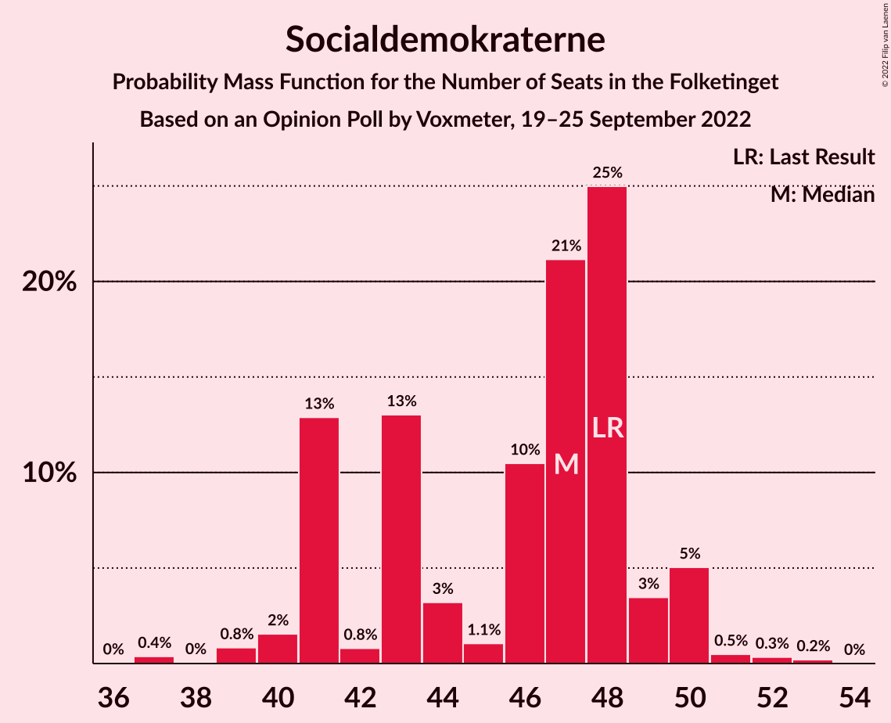
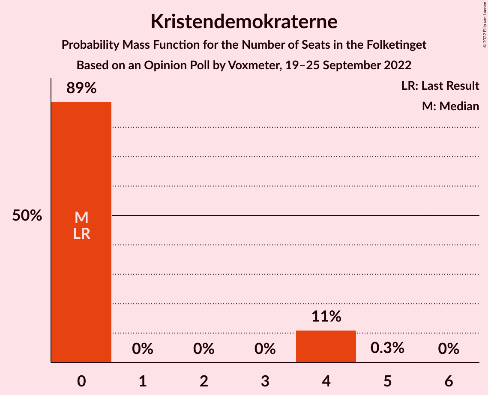
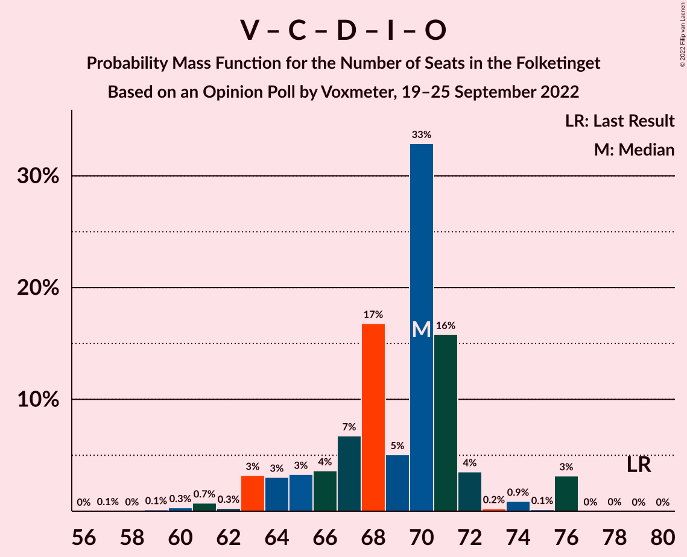
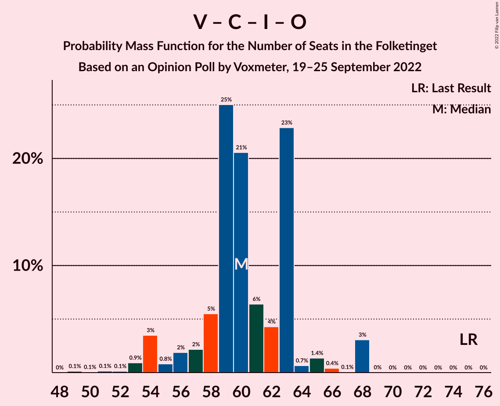

# Opinion Poll by Voxmeter, 19–25 September 2022

<a href="#voting-intentions">Voting Intentions</a> | <a href="#seats">Seats</a> | <a href="#coalitions">Coalitions</a> | <a href="#technical-information">Technical Information</a>

## Voting Intentions

### Confidence Intervals

| Party | Last Result | Poll Result | 80% Confidence Interval | 90% Confidence Interval | 95% Confidence Interval | 99% Confidence Interval |
|:-----:|:-----------:|:-----------:|:-----------------------:|:-----------------------:|:-----------------------:|:-----------------------:|
| Socialdemokraterne | 25.9% | 25.1% | 23.4–26.9% |22.9–27.4% |22.5–27.9% |21.7–28.8% |
| Venstre | 23.4% | 14.1% | 12.8–15.7% |12.4–16.1% |12.1–16.4% |11.5–17.2% |
| Det Konservative Folkeparti | 6.6% | 11.6% | 10.3–13.0% |10.0–13.3% |9.7–13.7% |9.2–14.4% |
| Danmarksdemokraterne | 0.0% | 9.1% | 8.0–10.3% |7.7–10.7% |7.4–11.0% |7.0–11.6% |
| Socialistisk Folkeparti | 7.7% | 8.3% | 7.2–9.5% |7.0–9.8% |6.7–10.1% |6.2–10.8% |
| Enhedslisten–De Rød-Grønne | 6.9% | 7.3% | 6.3–8.4% |6.1–8.8% |5.8–9.1% |5.4–9.6% |
| Radikale Venstre | 8.6% | 6.5% | 5.6–7.6% |5.3–7.9% |5.1–8.2% |4.7–8.7% |
| Nye Borgerlige | 2.4% | 5.1% | 4.3–6.1% |4.1–6.4% |3.9–6.6% |3.5–7.1% |
| Liberal Alliance | 2.3% | 4.6% | 3.8–5.5% |3.6–5.8% |3.4–6.1% |3.1–6.6% |
| Dansk Folkeparti | 8.7% | 2.5% | 2.0–3.2% |1.8–3.5% |1.7–3.7% |1.5–4.1% |
| Moderaterne | 0.0% | 2.4% | 1.9–3.1% |1.7–3.4% |1.6–3.5% |1.4–3.9% |
| Kristendemokraterne | 1.7% | 1.2% | 0.9–1.8% |0.8–1.9% |0.7–2.1% |0.5–2.4% |
| Alternativet | 3.0% | 1.1% | 0.8–1.7% |0.7–1.8% |0.6–2.0% |0.5–2.3% |
| Frie Grønne | 0.0% | 0.6% | 0.4–1.1% |0.3–1.2% |0.3–1.3% |0.2–1.6% |
| Veganerpartiet | 0.0% | 0.3% | 0.2–0.7% |0.1–0.8% |0.1–0.9% |0.1–1.1% |

*Note:* The poll result column reflects the actual value used in the calculations. Published results may vary slightly, and in addition be rounded to fewer digits.

## Seats

### Confidence Intervals

| Party | Last Result | Median | 80% Confidence Interval | 90% Confidence Interval | 95% Confidence Interval | 99% Confidence Interval |
|:-----:|:-----------:|:------:|:-----------------------:|:-----------------------:|:-----------------------:|:-----------------------:|
| <a href="#socialdemokraterne">Socialdemokraterne</a> | 48 | 47 | 41–48 |41–50 |40–50 |39–52 |
| <a href="#venstre">Venstre</a> | 43 | 27 | 24–28 |22–30 |21–31 |21–32 |
| <a href="#det-konservative-folkeparti">Det Konservative Folkeparti</a> | 12 | 20 | 19–23 |19–25 |18–26 |16–26 |
| <a href="#danmarksdemokraterne">Danmarksdemokraterne</a> | 0 | 15 | 14–18 |14–18 |13–19 |11–20 |
| <a href="#socialistisk-folkeparti">Socialistisk Folkeparti</a> | 14 | 16 | 13–18 |13–18 |11–19 |11–21 |
| <a href="#enhedslisten–de-rød-grønne">Enhedslisten–De Rød-Grønne</a> | 13 | 15 | 12–17 |12–17 |11–17 |9–17 |
| <a href="#radikale-venstre">Radikale Venstre</a> | 16 | 11 | 10–13 |8–15 |7–16 |7–16 |
| <a href="#nye-borgerlige">Nye Borgerlige</a> | 4 | 9 | 7–11 |7–11 |7–11 |6–12 |
| <a href="#liberal-alliance">Liberal Alliance</a> | 4 | 8 | 7–11 |6–11 |6–11 |6–12 |
| <a href="#dansk-folkeparti">Dansk Folkeparti</a> | 16 | 5 | 0–7 |0–7 |0–7 |0–8 |
| <a href="#moderaterne">Moderaterne</a> | 0 | 4 | 0–6 |0–6 |0–6 |0–7 |
| <a href="#kristendemokraterne">Kristendemokraterne</a> | 0 | 0 | 0–4 |0–4 |0–4 |0–4 |
| <a href="#alternativet">Alternativet</a> | 5 | 0 | 0 |0 |0–4 |0–5 |
| <a href="#frie-grønne">Frie Grønne</a> | 0 | 0 | 0 |0 |0 |0 |
| <a href="#veganerpartiet">Veganerpartiet</a> | 0 | 0 | 0 |0 |0 |0 |

### Socialdemokraterne

*For a full overview of the results for this party, see the [Socialdemokraterne](party-socialdemokraterne.html) page.*

| Number of Seats | Probability | Accumulated | Special Marks |
|:---------------:|:-----------:|:-----------:|:-------------:|
| 37 | 0.4% | 100% |  |
| 38 | 0% | 99.6% |  |
| 39 | 0.8% | 99.5% |  |
| 40 | 2% | 98.7% |  |
| 41 | 13% | 97% |  |
| 42 | 0.8% | 84% |  |
| 43 | 13% | 83% |  |
| 44 | 3% | 70% |  |
| 45 | 1.1% | 67% |  |
| 46 | 10% | 66% |  |
| 47 | 21% | 56% | Median |
| 48 | 25% | 35% | Last Result |
| 49 | 3% | 10% |  |
| 50 | 5% | 6% |  |
| 51 | 0.5% | 1.1% |  |
| 52 | 0.3% | 0.6% |  |
| 53 | 0.2% | 0.2% |  |
| 54 | 0% | 0% |  |

### Venstre

*For a full overview of the results for this party, see the [Venstre](party-venstre.html) page.*

| Number of Seats | Probability | Accumulated | Special Marks |
|:---------------:|:-----------:|:-----------:|:-------------:|
| 19 | 0% | 100% |  |
| 20 | 0% | 99.9% |  |
| 21 | 4% | 99.9% |  |
| 22 | 4% | 96% |  |
| 23 | 2% | 92% |  |
| 24 | 2% | 90% |  |
| 25 | 8% | 88% |  |
| 26 | 21% | 80% |  |
| 27 | 12% | 59% | Median |
| 28 | 41% | 47% |  |
| 29 | 1.0% | 6% |  |
| 30 | 1.0% | 5% |  |
| 31 | 3% | 4% |  |
| 32 | 0.5% | 0.8% |  |
| 33 | 0.3% | 0.3% |  |
| 34 | 0% | 0% |  |
| 35 | 0% | 0% |  |
| 36 | 0% | 0% |  |
| 37 | 0% | 0% |  |
| 38 | 0% | 0% |  |
| 39 | 0% | 0% |  |
| 40 | 0% | 0% |  |
| 41 | 0% | 0% |  |
| 42 | 0% | 0% |  |
| 43 | 0% | 0% | Last Result |

### Det Konservative Folkeparti

*For a full overview of the results for this party, see the [Det Konservative Folkeparti](party-detkonservativefolkeparti.html) page.*

| Number of Seats | Probability | Accumulated | Special Marks |
|:---------------:|:-----------:|:-----------:|:-------------:|
| 12 | 0% | 100% | Last Result |
| 13 | 0% | 100% |  |
| 14 | 0% | 100% |  |
| 15 | 0.3% | 100% |  |
| 16 | 0.3% | 99.7% |  |
| 17 | 1.2% | 99.4% |  |
| 18 | 0.9% | 98% |  |
| 19 | 13% | 97% |  |
| 20 | 53% | 84% | Median |
| 21 | 5% | 32% |  |
| 22 | 9% | 27% |  |
| 23 | 11% | 18% |  |
| 24 | 1.0% | 7% |  |
| 25 | 2% | 6% |  |
| 26 | 4% | 4% |  |
| 27 | 0% | 0% |  |

### Danmarksdemokraterne

*For a full overview of the results for this party, see the [Danmarksdemokraterne](party-danmarksdemokraterne.html) page.*

| Number of Seats | Probability | Accumulated | Special Marks |
|:---------------:|:-----------:|:-----------:|:-------------:|
| 0 | 0% | 100% | Last Result |
| 1 | 0% | 100% |  |
| 2 | 0% | 100% |  |
| 3 | 0% | 100% |  |
| 4 | 0% | 100% |  |
| 5 | 0% | 100% |  |
| 6 | 0% | 100% |  |
| 7 | 0% | 100% |  |
| 8 | 0% | 100% |  |
| 9 | 0% | 100% |  |
| 10 | 0% | 100% |  |
| 11 | 0.7% | 100% |  |
| 12 | 0.1% | 99.3% |  |
| 13 | 3% | 99.2% |  |
| 14 | 20% | 96% |  |
| 15 | 33% | 76% | Median |
| 16 | 5% | 43% |  |
| 17 | 7% | 39% |  |
| 18 | 26% | 31% |  |
| 19 | 4% | 5% |  |
| 20 | 0.9% | 1.3% |  |
| 21 | 0.1% | 0.3% |  |
| 22 | 0.1% | 0.2% |  |
| 23 | 0.1% | 0.1% |  |
| 24 | 0% | 0% |  |

### Socialistisk Folkeparti

*For a full overview of the results for this party, see the [Socialistisk Folkeparti](party-socialistiskfolkeparti.html) page.*

| Number of Seats | Probability | Accumulated | Special Marks |
|:---------------:|:-----------:|:-----------:|:-------------:|
| 9 | 0.3% | 100% |  |
| 10 | 0% | 99.7% |  |
| 11 | 2% | 99.7% |  |
| 12 | 0.5% | 97% |  |
| 13 | 16% | 97% |  |
| 14 | 21% | 81% | Last Result |
| 15 | 3% | 61% |  |
| 16 | 41% | 58% | Median |
| 17 | 6% | 17% |  |
| 18 | 8% | 12% |  |
| 19 | 2% | 4% |  |
| 20 | 0.4% | 2% |  |
| 21 | 1.4% | 1.4% |  |
| 22 | 0% | 0% |  |

### Enhedslisten–De Rød-Grønne

*For a full overview of the results for this party, see the [Enhedslisten–De Rød-Grønne](party-enhedslisten–derød-grønne.html) page.*

| Number of Seats | Probability | Accumulated | Special Marks |
|:---------------:|:-----------:|:-----------:|:-------------:|
| 8 | 0.1% | 100% |  |
| 9 | 2% | 99.9% |  |
| 10 | 0.3% | 98% |  |
| 11 | 1.1% | 98% |  |
| 12 | 20% | 96% |  |
| 13 | 16% | 77% | Last Result |
| 14 | 8% | 60% |  |
| 15 | 27% | 53% | Median |
| 16 | 7% | 25% |  |
| 17 | 18% | 18% |  |
| 18 | 0.1% | 0.1% |  |
| 19 | 0.1% | 0.1% |  |
| 20 | 0% | 0% |  |

### Radikale Venstre

*For a full overview of the results for this party, see the [Radikale Venstre](party-radikalevenstre.html) page.*

| Number of Seats | Probability | Accumulated | Special Marks |
|:---------------:|:-----------:|:-----------:|:-------------:|
| 7 | 3% | 100% |  |
| 8 | 5% | 97% |  |
| 9 | 0.8% | 92% |  |
| 10 | 16% | 91% |  |
| 11 | 46% | 75% | Median |
| 12 | 9% | 29% |  |
| 13 | 13% | 19% |  |
| 14 | 0.9% | 6% |  |
| 15 | 2% | 6% |  |
| 16 | 3% | 3% | Last Result |
| 17 | 0.1% | 0.1% |  |
| 18 | 0% | 0% |  |

### Nye Borgerlige

*For a full overview of the results for this party, see the [Nye Borgerlige](party-nyeborgerlige.html) page.*

| Number of Seats | Probability | Accumulated | Special Marks |
|:---------------:|:-----------:|:-----------:|:-------------:|
| 4 | 0% | 100% | Last Result |
| 5 | 0% | 100% |  |
| 6 | 2% | 100% |  |
| 7 | 35% | 98% |  |
| 8 | 9% | 63% |  |
| 9 | 23% | 54% | Median |
| 10 | 9% | 31% |  |
| 11 | 21% | 22% |  |
| 12 | 0.3% | 0.7% |  |
| 13 | 0.3% | 0.4% |  |
| 14 | 0.1% | 0.1% |  |
| 15 | 0% | 0% |  |

### Liberal Alliance

*For a full overview of the results for this party, see the [Liberal Alliance](party-liberalalliance.html) page.*

| Number of Seats | Probability | Accumulated | Special Marks |
|:---------------:|:-----------:|:-----------:|:-------------:|
| 4 | 0% | 100% | Last Result |
| 5 | 0.1% | 100% |  |
| 6 | 5% | 99.9% |  |
| 7 | 13% | 95% |  |
| 8 | 38% | 82% | Median |
| 9 | 9% | 44% |  |
| 10 | 19% | 34% |  |
| 11 | 15% | 16% |  |
| 12 | 0.9% | 1.0% |  |
| 13 | 0% | 0.1% |  |
| 14 | 0.1% | 0.1% |  |
| 15 | 0% | 0% |  |

### Dansk Folkeparti

*For a full overview of the results for this party, see the [Dansk Folkeparti](party-danskfolkeparti.html) page.*

| Number of Seats | Probability | Accumulated | Special Marks |
|:---------------:|:-----------:|:-----------:|:-------------:|
| 0 | 23% | 100% |  |
| 1 | 0% | 77% |  |
| 2 | 0% | 77% |  |
| 3 | 0% | 77% |  |
| 4 | 22% | 77% |  |
| 5 | 19% | 55% | Median |
| 6 | 12% | 36% |  |
| 7 | 24% | 25% |  |
| 8 | 0.7% | 0.8% |  |
| 9 | 0% | 0% |  |
| 10 | 0% | 0% |  |
| 11 | 0% | 0% |  |
| 12 | 0% | 0% |  |
| 13 | 0% | 0% |  |
| 14 | 0% | 0% |  |
| 15 | 0% | 0% |  |
| 16 | 0% | 0% | Last Result |

### Moderaterne

*For a full overview of the results for this party, see the [Moderaterne](party-moderaterne.html) page.*

| Number of Seats | Probability | Accumulated | Special Marks |
|:---------------:|:-----------:|:-----------:|:-------------:|
| 0 | 36% | 100% | Last Result |
| 1 | 0% | 64% |  |
| 2 | 0% | 64% |  |
| 3 | 0% | 64% |  |
| 4 | 33% | 64% | Median |
| 5 | 20% | 31% |  |
| 6 | 9% | 11% |  |
| 7 | 1.0% | 1.4% |  |
| 8 | 0.4% | 0.4% |  |
| 9 | 0% | 0% |  |

### Kristendemokraterne

*For a full overview of the results for this party, see the [Kristendemokraterne](party-kristendemokraterne.html) page.*

| Number of Seats | Probability | Accumulated | Special Marks |
|:---------------:|:-----------:|:-----------:|:-------------:|
| 0 | 89% | 100% | Last Result, Median |
| 1 | 0% | 11% |  |
| 2 | 0% | 11% |  |
| 3 | 0% | 11% |  |
| 4 | 11% | 11% |  |
| 5 | 0.3% | 0.3% |  |
| 6 | 0% | 0% |  |

### Alternativet

*For a full overview of the results for this party, see the [Alternativet](party-alternativet.html) page.*

| Number of Seats | Probability | Accumulated | Special Marks |
|:---------------:|:-----------:|:-----------:|:-------------:|
| 0 | 97% | 100% | Median |
| 1 | 0% | 3% |  |
| 2 | 0% | 3% |  |
| 3 | 0% | 3% |  |
| 4 | 1.1% | 3% |  |
| 5 | 2% | 2% | Last Result |
| 6 | 0.1% | 0.1% |  |
| 7 | 0% | 0% |  |

### Frie Grønne

*For a full overview of the results for this party, see the [Frie Grønne](party-friegrønne.html) page.*

| Number of Seats | Probability | Accumulated | Special Marks |
|:---------------:|:-----------:|:-----------:|:-------------:|
| 0 | 100% | 100% | Last Result, Median |

### Veganerpartiet

*For a full overview of the results for this party, see the [Veganerpartiet](party-veganerpartiet.html) page.*

| Number of Seats | Probability | Accumulated | Special Marks |
|:---------------:|:-----------:|:-----------:|:-------------:|
| 0 | 100% | 100% | Last Result, Median |

## Coalitions

### Confidence Intervals

| Coalition | Last Result | Median | Majority? | 80% Confidence Interval | 90% Confidence Interval | 95% Confidence Interval | 99% Confidence Interval |
|:---------:|:-----------:|:------:|:---------:|:-----------------------:|:-----------------------:|:-----------------------:|:-----------------------:|
| Socialdemokraterne – Socialistisk Folkeparti – Enhedslisten–De Rød-Grønne – Radikale Venstre – Alternativet | 96 | 89 | 36% | 78–91 | 78–91 | 78–95 | 77–95 |
| Socialdemokraterne – Socialistisk Folkeparti – Enhedslisten–De Rød-Grønne – Radikale Venstre | 91 | 89 | 33% | 78–90 | 78–91 | 78–95 | 77–95 |
| Venstre – Det Konservative Folkeparti – Danmarksdemokraterne – Nye Borgerlige – Liberal Alliance – Dansk Folkeparti – Kristendemokraterne | 79 | 85 | 17% | 80–93 | 79–93 | 76–94 | 76–94 |
| Socialdemokraterne – Socialistisk Folkeparti – Enhedslisten–De Rød-Grønne – Alternativet | 80 | 78 | 0% | 68–79 | 68–79 | 68–80 | 67–82 |
| Socialdemokraterne – Socialistisk Folkeparti – Enhedslisten–De Rød-Grønne | 75 | 78 | 0% | 68–79 | 68–79 | 68–79 | 66–82 |
| Socialdemokraterne – Socialistisk Folkeparti – Radikale Venstre | 78 | 72 | 0% | 66–77 | 66–77 | 65–78 | 64–80 |
| Venstre – Det Konservative Folkeparti – Nye Borgerlige – Liberal Alliance – Dansk Folkeparti – Kristendemokraterne | 79 | 70 | 0% | 65–75 | 64–75 | 63–76 | 61–76 |
| Venstre – Det Konservative Folkeparti – Nye Borgerlige – Liberal Alliance – Dansk Folkeparti | 79 | 70 | 0% | 65–71 | 64–72 | 63–76 | 60–76 |
| Venstre – Det Konservative Folkeparti – Liberal Alliance – Dansk Folkeparti – Kristendemokraterne | 75 | 60 | 0% | 58–64 | 55–65 | 54–68 | 53–68 |
| Venstre – Det Konservative Folkeparti – Liberal Alliance – Dansk Folkeparti | 75 | 60 | 0% | 58–63 | 55–64 | 54–68 | 53–68 |
| Venstre – Det Konservative Folkeparti – Liberal Alliance | 59 | 56 | 0% | 53–59 | 52–60 | 48–63 | 47–63 |
| Socialdemokraterne – Radikale Venstre | 64 | 58 | 0% | 52–59 | 51–62 | 51–62 | 50–64 |
| Venstre – Det Konservative Folkeparti | 55 | 48 | 0% | 46–50 | 43–51 | 41–53 | 40–53 |
| Venstre | 43 | 27 | 0% | 24–28 | 22–30 | 21–31 | 21–32 |

### Socialdemokraterne – Socialistisk Folkeparti – Enhedslisten–De Rød-Grønne – Radikale Venstre – Alternativet

| Number of Seats | Probability | Accumulated | Special Marks |
|:---------------:|:-----------:|:-----------:|:-------------:|
| 76 | 0% | 100% |  |
| 77 | 0.6% | 99.9% |  |
| 78 | 11% | 99.3% |  |
| 79 | 0.6% | 89% |  |
| 80 | 2% | 88% |  |
| 81 | 3% | 86% |  |
| 82 | 11% | 83% |  |
| 83 | 1.3% | 71% |  |
| 84 | 1.3% | 70% |  |
| 85 | 1.3% | 69% |  |
| 86 | 3% | 67% |  |
| 87 | 5% | 65% |  |
| 88 | 5% | 59% |  |
| 89 | 18% | 54% | Median |
| 90 | 25% | 36% | Majority |
| 91 | 7% | 11% |  |
| 92 | 0.1% | 4% |  |
| 93 | 0.1% | 4% |  |
| 94 | 0.5% | 4% |  |
| 95 | 3% | 3% |  |
| 96 | 0% | 0.1% | Last Result |
| 97 | 0% | 0.1% |  |
| 98 | 0.1% | 0.1% |  |
| 99 | 0% | 0% |  |

### Socialdemokraterne – Socialistisk Folkeparti – Enhedslisten–De Rød-Grønne – Radikale Venstre

| Number of Seats | Probability | Accumulated | Special Marks |
|:---------------:|:-----------:|:-----------:|:-------------:|
| 76 | 0% | 100% |  |
| 77 | 0.6% | 99.9% |  |
| 78 | 11% | 99.3% |  |
| 79 | 0.6% | 89% |  |
| 80 | 2% | 88% |  |
| 81 | 3% | 86% |  |
| 82 | 12% | 83% |  |
| 83 | 1.2% | 71% |  |
| 84 | 1.3% | 69% |  |
| 85 | 1.2% | 68% |  |
| 86 | 4% | 67% |  |
| 87 | 6% | 63% |  |
| 88 | 5% | 57% |  |
| 89 | 18% | 52% | Median |
| 90 | 25% | 33% | Majority |
| 91 | 5% | 9% | Last Result |
| 92 | 0.1% | 4% |  |
| 93 | 0.1% | 4% |  |
| 94 | 0.5% | 4% |  |
| 95 | 3% | 3% |  |
| 96 | 0% | 0.1% |  |
| 97 | 0% | 0.1% |  |
| 98 | 0.1% | 0.1% |  |
| 99 | 0% | 0% |  |

### Venstre – Det Konservative Folkeparti – Danmarksdemokraterne – Nye Borgerlige – Liberal Alliance – Dansk Folkeparti – Kristendemokraterne

| Number of Seats | Probability | Accumulated | Special Marks |
|:---------------:|:-----------:|:-----------:|:-------------:|
| 76 | 3% | 100% |  |
| 77 | 0.3% | 97% |  |
| 78 | 1.2% | 96% |  |
| 79 | 3% | 95% | Last Result |
| 80 | 4% | 93% |  |
| 81 | 3% | 89% |  |
| 82 | 19% | 85% |  |
| 83 | 1.1% | 66% |  |
| 84 | 2% | 65% | Median |
| 85 | 25% | 63% |  |
| 86 | 2% | 38% |  |
| 87 | 6% | 37% |  |
| 88 | 12% | 31% |  |
| 89 | 2% | 19% |  |
| 90 | 2% | 17% | Majority |
| 91 | 1.0% | 15% |  |
| 92 | 0.3% | 14% |  |
| 93 | 11% | 14% |  |
| 94 | 3% | 3% |  |
| 95 | 0% | 0.1% |  |
| 96 | 0% | 0.1% |  |
| 97 | 0% | 0% |  |

### Socialdemokraterne – Socialistisk Folkeparti – Enhedslisten–De Rød-Grønne – Alternativet

| Number of Seats | Probability | Accumulated | Special Marks |
|:---------------:|:-----------:|:-----------:|:-------------:|
| 65 | 0.2% | 100% |  |
| 66 | 0.3% | 99.8% |  |
| 67 | 0.1% | 99.6% |  |
| 68 | 11% | 99.4% |  |
| 69 | 10% | 88% |  |
| 70 | 3% | 78% |  |
| 71 | 3% | 74% |  |
| 72 | 1.0% | 71% |  |
| 73 | 0.9% | 70% |  |
| 74 | 1.3% | 69% |  |
| 75 | 3% | 68% |  |
| 76 | 5% | 65% |  |
| 77 | 2% | 60% |  |
| 78 | 18% | 58% | Median |
| 79 | 37% | 40% |  |
| 80 | 2% | 3% | Last Result |
| 81 | 0.3% | 0.8% |  |
| 82 | 0.3% | 0.6% |  |
| 83 | 0% | 0.2% |  |
| 84 | 0.1% | 0.2% |  |
| 85 | 0.1% | 0.1% |  |
| 86 | 0% | 0% |  |

### Socialdemokraterne – Socialistisk Folkeparti – Enhedslisten–De Rød-Grønne

| Number of Seats | Probability | Accumulated | Special Marks |
|:---------------:|:-----------:|:-----------:|:-------------:|
| 65 | 0.2% | 100% |  |
| 66 | 0.3% | 99.8% |  |
| 67 | 0.1% | 99.5% |  |
| 68 | 11% | 99.4% |  |
| 69 | 10% | 88% |  |
| 70 | 4% | 77% |  |
| 71 | 3% | 74% |  |
| 72 | 1.0% | 71% |  |
| 73 | 3% | 70% |  |
| 74 | 1.3% | 67% |  |
| 75 | 4% | 66% | Last Result |
| 76 | 5% | 62% |  |
| 77 | 2% | 57% |  |
| 78 | 16% | 55% | Median |
| 79 | 37% | 39% |  |
| 80 | 2% | 2% |  |
| 81 | 0.2% | 0.8% |  |
| 82 | 0.3% | 0.6% |  |
| 83 | 0% | 0.2% |  |
| 84 | 0.1% | 0.2% |  |
| 85 | 0.1% | 0.1% |  |
| 86 | 0% | 0% |  |

### Socialdemokraterne – Socialistisk Folkeparti – Radikale Venstre

| Number of Seats | Probability | Accumulated | Special Marks |
|:---------------:|:-----------:|:-----------:|:-------------:|
| 62 | 0.3% | 100% |  |
| 63 | 0.1% | 99.7% |  |
| 64 | 0.2% | 99.6% |  |
| 65 | 4% | 99.4% |  |
| 66 | 11% | 96% |  |
| 67 | 0.2% | 85% |  |
| 68 | 3% | 85% |  |
| 69 | 3% | 82% |  |
| 70 | 8% | 79% |  |
| 71 | 3% | 70% |  |
| 72 | 21% | 68% |  |
| 73 | 4% | 47% |  |
| 74 | 5% | 43% | Median |
| 75 | 23% | 37% |  |
| 76 | 4% | 14% |  |
| 77 | 5% | 10% |  |
| 78 | 3% | 5% | Last Result |
| 79 | 0.5% | 1.5% |  |
| 80 | 0.6% | 0.9% |  |
| 81 | 0.1% | 0.4% |  |
| 82 | 0.2% | 0.3% |  |
| 83 | 0.1% | 0.1% |  |
| 84 | 0% | 0% |  |

### Venstre – Det Konservative Folkeparti – Nye Borgerlige – Liberal Alliance – Dansk Folkeparti – Kristendemokraterne

| Number of Seats | Probability | Accumulated | Special Marks |
|:---------------:|:-----------:|:-----------:|:-------------:|
| 59 | 0.1% | 100% |  |
| 60 | 0.1% | 99.8% |  |
| 61 | 0.8% | 99.7% |  |
| 62 | 0.3% | 99.0% |  |
| 63 | 3% | 98.7% |  |
| 64 | 3% | 96% |  |
| 65 | 3% | 93% |  |
| 66 | 4% | 89% |  |
| 67 | 7% | 85% |  |
| 68 | 17% | 79% |  |
| 69 | 5% | 62% | Median |
| 70 | 33% | 57% |  |
| 71 | 5% | 24% |  |
| 72 | 4% | 19% |  |
| 73 | 0.2% | 15% |  |
| 74 | 0.9% | 15% |  |
| 75 | 11% | 14% |  |
| 76 | 3% | 3% |  |
| 77 | 0.1% | 0.1% |  |
| 78 | 0% | 0.1% |  |
| 79 | 0% | 0% | Last Result |

### Venstre – Det Konservative Folkeparti – Nye Borgerlige – Liberal Alliance – Dansk Folkeparti

| Number of Seats | Probability | Accumulated | Special Marks |
|:---------------:|:-----------:|:-----------:|:-------------:|
| 57 | 0.1% | 100% |  |
| 58 | 0% | 99.9% |  |
| 59 | 0.1% | 99.9% |  |
| 60 | 0.3% | 99.8% |  |
| 61 | 0.7% | 99.5% |  |
| 62 | 0.3% | 98.7% |  |
| 63 | 3% | 98% |  |
| 64 | 3% | 95% |  |
| 65 | 3% | 92% |  |
| 66 | 4% | 89% |  |
| 67 | 7% | 85% |  |
| 68 | 17% | 79% |  |
| 69 | 5% | 62% | Median |
| 70 | 33% | 57% |  |
| 71 | 16% | 24% |  |
| 72 | 4% | 8% |  |
| 73 | 0.2% | 4% |  |
| 74 | 0.9% | 4% |  |
| 75 | 0.1% | 3% |  |
| 76 | 3% | 3% |  |
| 77 | 0% | 0.1% |  |
| 78 | 0% | 0% |  |
| 79 | 0% | 0% | Last Result |

### Venstre – Det Konservative Folkeparti – Liberal Alliance – Dansk Folkeparti – Kristendemokraterne

| Number of Seats | Probability | Accumulated | Special Marks |
|:---------------:|:-----------:|:-----------:|:-------------:|
| 49 | 0.1% | 100% |  |
| 50 | 0% | 99.9% |  |
| 51 | 0.1% | 99.8% |  |
| 52 | 0.1% | 99.7% |  |
| 53 | 0.7% | 99.6% |  |
| 54 | 3% | 98.9% |  |
| 55 | 0.8% | 95% |  |
| 56 | 2% | 95% |  |
| 57 | 2% | 93% |  |
| 58 | 6% | 91% |  |
| 59 | 25% | 85% |  |
| 60 | 10% | 60% | Median |
| 61 | 6% | 50% |  |
| 62 | 4% | 43% |  |
| 63 | 23% | 39% |  |
| 64 | 11% | 16% |  |
| 65 | 1.4% | 5% |  |
| 66 | 0.4% | 4% |  |
| 67 | 0.1% | 3% |  |
| 68 | 3% | 3% |  |
| 69 | 0% | 0% |  |
| 70 | 0% | 0% |  |
| 71 | 0% | 0% |  |
| 72 | 0% | 0% |  |
| 73 | 0% | 0% |  |
| 74 | 0% | 0% |  |
| 75 | 0% | 0% | Last Result |

### Venstre – Det Konservative Folkeparti – Liberal Alliance – Dansk Folkeparti

| Number of Seats | Probability | Accumulated | Special Marks |
|:---------------:|:-----------:|:-----------:|:-------------:|
| 49 | 0.1% | 100% |  |
| 50 | 0.1% | 99.8% |  |
| 51 | 0.1% | 99.8% |  |
| 52 | 0.1% | 99.6% |  |
| 53 | 0.9% | 99.5% |  |
| 54 | 3% | 98.6% |  |
| 55 | 0.8% | 95% |  |
| 56 | 2% | 94% |  |
| 57 | 2% | 92% |  |
| 58 | 5% | 90% |  |
| 59 | 25% | 85% |  |
| 60 | 21% | 60% | Median |
| 61 | 6% | 39% |  |
| 62 | 4% | 33% |  |
| 63 | 23% | 28% |  |
| 64 | 0.7% | 6% |  |
| 65 | 1.4% | 5% |  |
| 66 | 0.4% | 4% |  |
| 67 | 0.1% | 3% |  |
| 68 | 3% | 3% |  |
| 69 | 0% | 0% |  |
| 70 | 0% | 0% |  |
| 71 | 0% | 0% |  |
| 72 | 0% | 0% |  |
| 73 | 0% | 0% |  |
| 74 | 0% | 0% |  |
| 75 | 0% | 0% | Last Result |

### Venstre – Det Konservative Folkeparti – Liberal Alliance

| Number of Seats | Probability | Accumulated | Special Marks |
|:---------------:|:-----------:|:-----------:|:-------------:|
| 46 | 0.2% | 100% |  |
| 47 | 0.3% | 99.7% |  |
| 48 | 3% | 99.5% |  |
| 49 | 0.1% | 96% |  |
| 50 | 0.4% | 96% |  |
| 51 | 0.3% | 96% |  |
| 52 | 3% | 95% |  |
| 53 | 4% | 92% |  |
| 54 | 12% | 88% |  |
| 55 | 2% | 76% | Median |
| 56 | 44% | 74% |  |
| 57 | 3% | 30% |  |
| 58 | 3% | 27% |  |
| 59 | 18% | 24% | Last Result |
| 60 | 2% | 6% |  |
| 61 | 0.4% | 4% |  |
| 62 | 0.3% | 4% |  |
| 63 | 3% | 3% |  |
| 64 | 0.1% | 0.1% |  |
| 65 | 0% | 0% |  |

### Socialdemokraterne – Radikale Venstre

| Number of Seats | Probability | Accumulated | Special Marks |
|:---------------:|:-----------:|:-----------:|:-------------:|
| 48 | 0.3% | 100% |  |
| 49 | 0% | 99.6% |  |
| 50 | 0.6% | 99.6% |  |
| 51 | 4% | 99.0% |  |
| 52 | 5% | 95% |  |
| 53 | 13% | 90% |  |
| 54 | 9% | 77% |  |
| 55 | 0.5% | 68% |  |
| 56 | 0.6% | 67% |  |
| 57 | 0.8% | 67% |  |
| 58 | 25% | 66% | Median |
| 59 | 32% | 41% |  |
| 60 | 2% | 9% |  |
| 61 | 0.1% | 7% |  |
| 62 | 6% | 7% |  |
| 63 | 0.5% | 1.2% |  |
| 64 | 0.2% | 0.7% | Last Result |
| 65 | 0.4% | 0.5% |  |
| 66 | 0% | 0.1% |  |
| 67 | 0% | 0% |  |

### Venstre – Det Konservative Folkeparti

| Number of Seats | Probability | Accumulated | Special Marks |
|:---------------:|:-----------:|:-----------:|:-------------:|
| 38 | 0.1% | 100% |  |
| 39 | 0.3% | 99.9% |  |
| 40 | 0.2% | 99.6% |  |
| 41 | 3% | 99.4% |  |
| 42 | 0.4% | 96% |  |
| 43 | 1.1% | 96% |  |
| 44 | 0.6% | 95% |  |
| 45 | 4% | 94% |  |
| 46 | 23% | 90% |  |
| 47 | 7% | 67% | Median |
| 48 | 44% | 60% |  |
| 49 | 4% | 16% |  |
| 50 | 7% | 12% |  |
| 51 | 1.3% | 5% |  |
| 52 | 0.6% | 4% |  |
| 53 | 3% | 4% |  |
| 54 | 0.1% | 0.2% |  |
| 55 | 0.1% | 0.1% | Last Result |
| 56 | 0% | 0.1% |  |
| 57 | 0% | 0% |  |

### Venstre

| Number of Seats | Probability | Accumulated | Special Marks |
|:---------------:|:-----------:|:-----------:|:-------------:|
| 19 | 0% | 100% |  |
| 20 | 0% | 99.9% |  |
| 21 | 4% | 99.9% |  |
| 22 | 4% | 96% |  |
| 23 | 2% | 92% |  |
| 24 | 2% | 90% |  |
| 25 | 8% | 88% |  |
| 26 | 21% | 80% |  |
| 27 | 12% | 59% | Median |
| 28 | 41% | 47% |  |
| 29 | 1.0% | 6% |  |
| 30 | 1.0% | 5% |  |
| 31 | 3% | 4% |  |
| 32 | 0.5% | 0.8% |  |
| 33 | 0.3% | 0.3% |  |
| 34 | 0% | 0% |  |
| 35 | 0% | 0% |  |
| 36 | 0% | 0% |  |
| 37 | 0% | 0% |  |
| 38 | 0% | 0% |  |
| 39 | 0% | 0% |  |
| 40 | 0% | 0% |  |
| 41 | 0% | 0% |  |
| 42 | 0% | 0% |  |
| 43 | 0% | 0% | Last Result |

## Technical Information

### Opinion Poll

+ **Polling firm:** Voxmeter
+ **Commissioner(s):** —
+ **Fieldwork period:** 19–25 September 2022

### Calculations

+ **Sample size:** 1004
+ **Simulations done:** 1,048,576
+ **Error estimate:** 2.26%

