# Opinion Poll by Megafon for Politiken and TV 2, 26–29 September 2022

<a href="#voting-intentions">Voting Intentions</a> | <a href="#seats">Seats</a> | <a href="#coalitions">Coalitions</a> | <a href="#technical-information">Technical Information</a>

## Voting Intentions

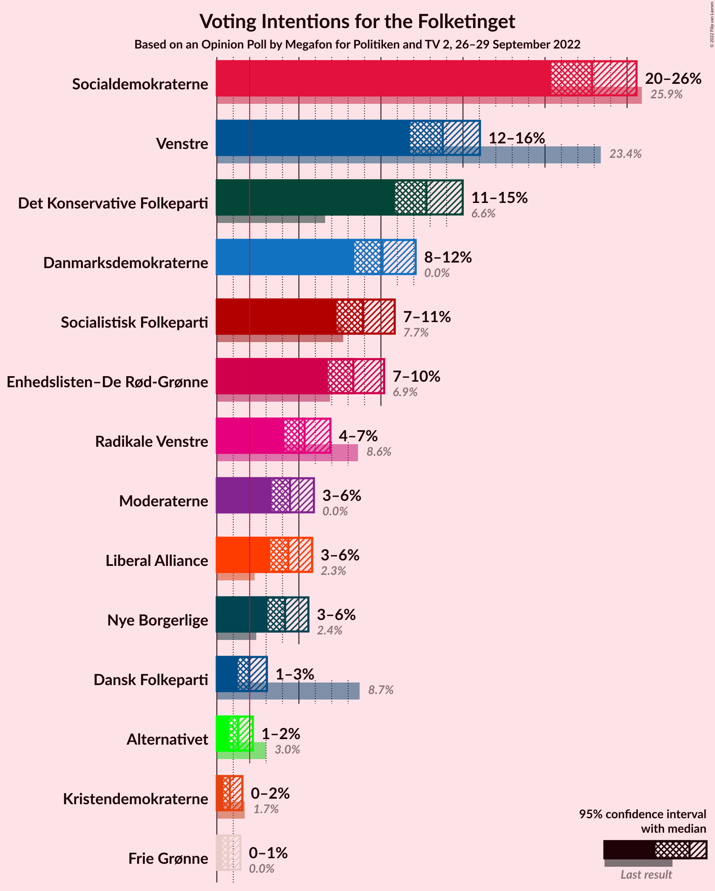

### Confidence Intervals

| Party | Last Result | Poll Result | 80% Confidence Interval | 90% Confidence Interval | 95% Confidence Interval | 99% Confidence Interval |
|:-----:|:-----------:|:-----------:|:-----------------------:|:-----------------------:|:-----------------------:|:-----------------------:|
| Socialdemokraterne | 25.9% | 22.9% | 21.2–24.6% |20.8–25.1% |20.4–25.6% |19.6–26.4% |
| Venstre | 23.4% | 13.8% | 12.5–15.2% |12.1–15.7% |11.8–16.0% |11.2–16.8% |
| Det Konservative Folkeparti | 6.6% | 12.8% | 11.5–14.2% |11.2–14.6% |10.9–15.0% |10.3–15.7% |
| Danmarksdemokraterne | 0.0% | 10.1% | 9.0–11.4% |8.7–11.8% |8.4–12.1% |7.9–12.8% |
| Socialistisk Folkeparti | 7.7% | 8.9% | 7.8–10.2% |7.6–10.5% |7.3–10.8% |6.8–11.5% |
| Enhedslisten–De Rød-Grønne | 6.9% | 8.3% | 7.3–9.5% |7.0–9.9% |6.8–10.2% |6.3–10.8% |
| Radikale Venstre | 8.6% | 5.3% | 4.5–6.4% |4.3–6.7% |4.1–6.9% |3.8–7.4% |
| Moderaterne | 0.0% | 4.5% | 3.7–5.4% |3.5–5.7% |3.3–5.9% |3.0–6.4% |
| Liberal Alliance | 2.3% | 4.4% | 3.6–5.3% |3.4–5.6% |3.3–5.8% |2.9–6.3% |
| Nye Borgerlige | 2.4% | 4.2% | 3.4–5.1% |3.2–5.3% |3.1–5.6% |2.8–6.1% |
| Dansk Folkeparti | 8.7% | 2.0% | 1.5–2.7% |1.4–2.9% |1.3–3.0% |1.1–3.4% |
| Alternativet | 3.0% | 1.3% | 0.9–1.9% |0.8–2.0% |0.7–2.2% |0.6–2.5% |
| Kristendemokraterne | 1.7% | 0.8% | 0.5–1.3% |0.5–1.4% |0.4–1.6% |0.3–1.8% |
| Frie Grønne | 0.0% | 0.7% | 0.5–1.2% |0.4–1.3% |0.3–1.4% |0.2–1.7% |

*Note:* The poll result column reflects the actual value used in the calculations. Published results may vary slightly, and in addition be rounded to fewer digits.

## Seats

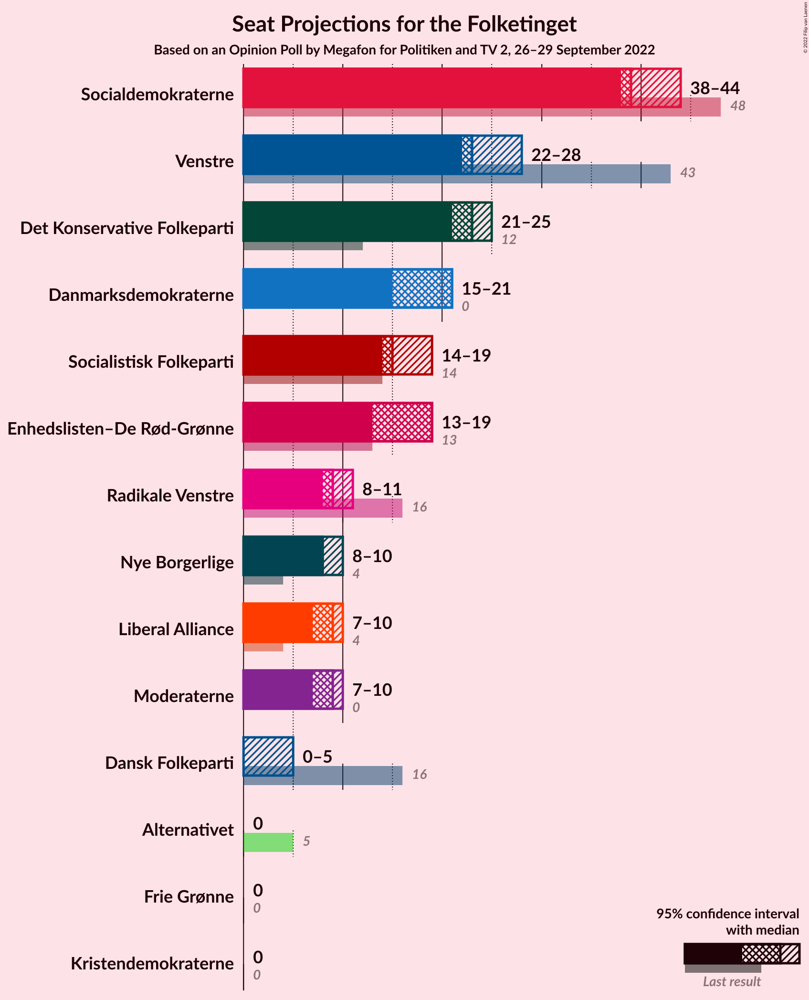

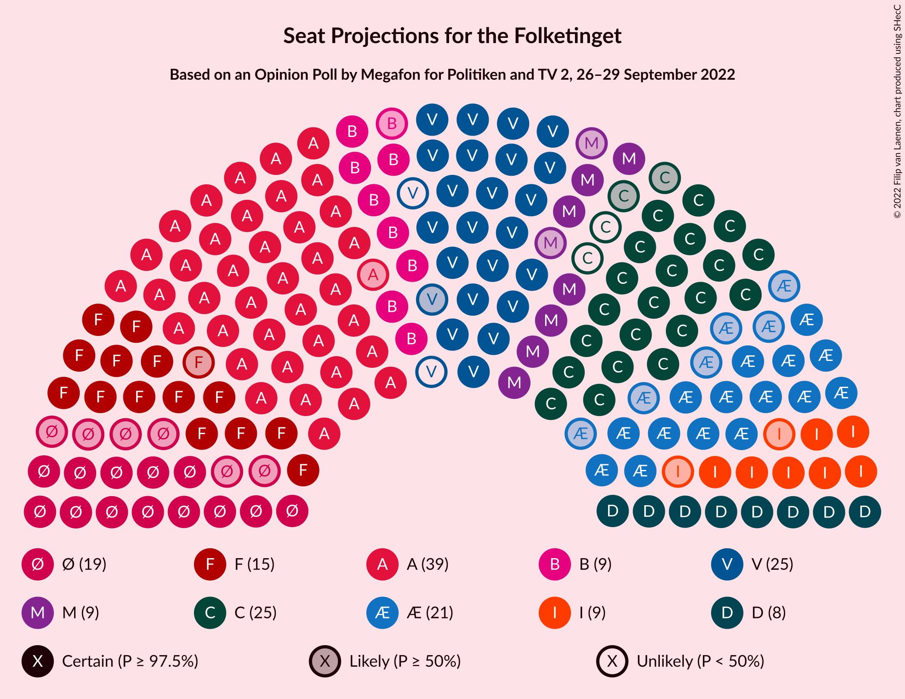

### Confidence Intervals

| Party | Last Result | Median | 80% Confidence Interval | 90% Confidence Interval | 95% Confidence Interval | 99% Confidence Interval |
|:-----:|:-----------:|:------:|:-----------------------:|:-----------------------:|:-----------------------:|:-----------------------:|
| <a href="#socialdemokraterne">Socialdemokraterne</a> | 48 | 39 | 39 |38–42 |38–44 |34–45 |
| <a href="#venstre">Venstre</a> | 43 | 23 | 23–26 |23–28 |22–28 |22–29 |
| <a href="#det-konservative-folkeparti">Det Konservative Folkeparti</a> | 12 | 23 | 23–24 |21–25 |21–25 |19–26 |
| <a href="#danmarksdemokraterne">Danmarksdemokraterne</a> | 0 | 21 | 17–21 |15–21 |15–21 |15–23 |
| <a href="#socialistisk-folkeparti">Socialistisk Folkeparti</a> | 14 | 15 | 15–18 |15–18 |14–19 |13–20 |
| <a href="#enhedslisten–de-rød-grønne">Enhedslisten–De Rød-Grønne</a> | 13 | 19 | 14–19 |13–19 |13–19 |12–19 |
| <a href="#radikale-venstre">Radikale Venstre</a> | 16 | 9 | 9–10 |9–10 |8–11 |8–14 |
| <a href="#moderaterne">Moderaterne</a> | 0 | 9 | 8–9 |7–10 |7–10 |6–10 |
| <a href="#liberal-alliance">Liberal Alliance</a> | 4 | 9 | 9 |8–10 |7–10 |7–10 |
| <a href="#nye-borgerlige">Nye Borgerlige</a> | 4 | 8 | 8 |8 |8–10 |6–11 |
| <a href="#dansk-folkeparti">Dansk Folkeparti</a> | 16 | 0 | 0–4 |0–5 |0–5 |0–5 |
| <a href="#alternativet">Alternativet</a> | 5 | 0 | 0 |0 |0 |0–4 |
| <a href="#kristendemokraterne">Kristendemokraterne</a> | 0 | 0 | 0 |0 |0 |0 |
| <a href="#frie-grønne">Frie Grønne</a> | 0 | 0 | 0 |0 |0 |0 |

### Socialdemokraterne

*For a full overview of the results for this party, see the [Socialdemokraterne](party-socialdemokraterne.html) page.*

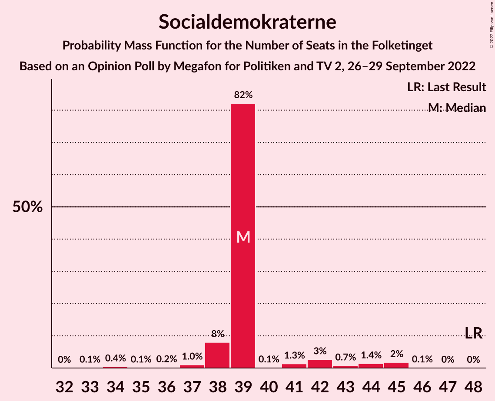

| Number of Seats | Probability | Accumulated | Special Marks |
|:---------------:|:-----------:|:-----------:|:-------------:|
| 33 | 0.1% | 100% |  |
| 34 | 0.4% | 99.9% |  |
| 35 | 0.1% | 99.5% |  |
| 36 | 0.2% | 99.4% |  |
| 37 | 1.0% | 99.2% |  |
| 38 | 8% | 98% |  |
| 39 | 82% | 90% | Median |
| 40 | 0.1% | 8% |  |
| 41 | 1.3% | 8% |  |
| 42 | 3% | 7% |  |
| 43 | 0.7% | 4% |  |
| 44 | 1.4% | 3% |  |
| 45 | 2% | 2% |  |
| 46 | 0.1% | 0.2% |  |
| 47 | 0% | 0% |  |
| 48 | 0% | 0% | Last Result |

### Venstre

*For a full overview of the results for this party, see the [Venstre](party-venstre.html) page.*

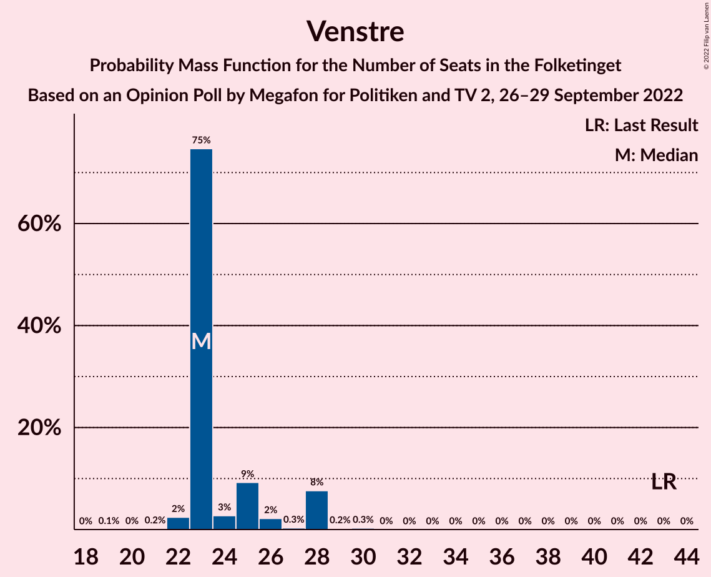

| Number of Seats | Probability | Accumulated | Special Marks |
|:---------------:|:-----------:|:-----------:|:-------------:|
| 19 | 0.1% | 100% |  |
| 20 | 0% | 99.9% |  |
| 21 | 0.2% | 99.9% |  |
| 22 | 2% | 99.7% |  |
| 23 | 75% | 97% | Median |
| 24 | 3% | 23% |  |
| 25 | 9% | 20% |  |
| 26 | 2% | 11% |  |
| 27 | 0.3% | 8% |  |
| 28 | 8% | 8% |  |
| 29 | 0.2% | 0.5% |  |
| 30 | 0.3% | 0.3% |  |
| 31 | 0% | 0% |  |
| 32 | 0% | 0% |  |
| 33 | 0% | 0% |  |
| 34 | 0% | 0% |  |
| 35 | 0% | 0% |  |
| 36 | 0% | 0% |  |
| 37 | 0% | 0% |  |
| 38 | 0% | 0% |  |
| 39 | 0% | 0% |  |
| 40 | 0% | 0% |  |
| 41 | 0% | 0% |  |
| 42 | 0% | 0% |  |
| 43 | 0% | 0% | Last Result |

### Det Konservative Folkeparti

*For a full overview of the results for this party, see the [Det Konservative Folkeparti](party-detkonservativefolkeparti.html) page.*

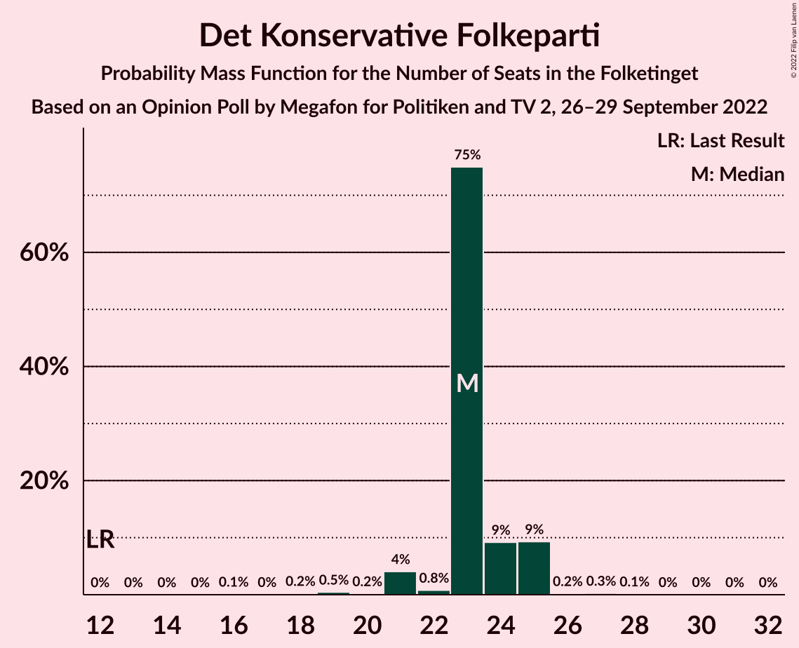

| Number of Seats | Probability | Accumulated | Special Marks |
|:---------------:|:-----------:|:-----------:|:-------------:|
| 12 | 0% | 100% | Last Result |
| 13 | 0% | 100% |  |
| 14 | 0% | 100% |  |
| 15 | 0% | 100% |  |
| 16 | 0.1% | 100% |  |
| 17 | 0% | 99.9% |  |
| 18 | 0.2% | 99.9% |  |
| 19 | 0.5% | 99.6% |  |
| 20 | 0.2% | 99.2% |  |
| 21 | 4% | 99.0% |  |
| 22 | 0.8% | 95% |  |
| 23 | 75% | 94% | Median |
| 24 | 9% | 19% |  |
| 25 | 9% | 10% |  |
| 26 | 0.2% | 0.7% |  |
| 27 | 0.3% | 0.5% |  |
| 28 | 0.1% | 0.2% |  |
| 29 | 0% | 0.1% |  |
| 30 | 0% | 0.1% |  |
| 31 | 0% | 0% |  |

### Danmarksdemokraterne

*For a full overview of the results for this party, see the [Danmarksdemokraterne](party-danmarksdemokraterne.html) page.*

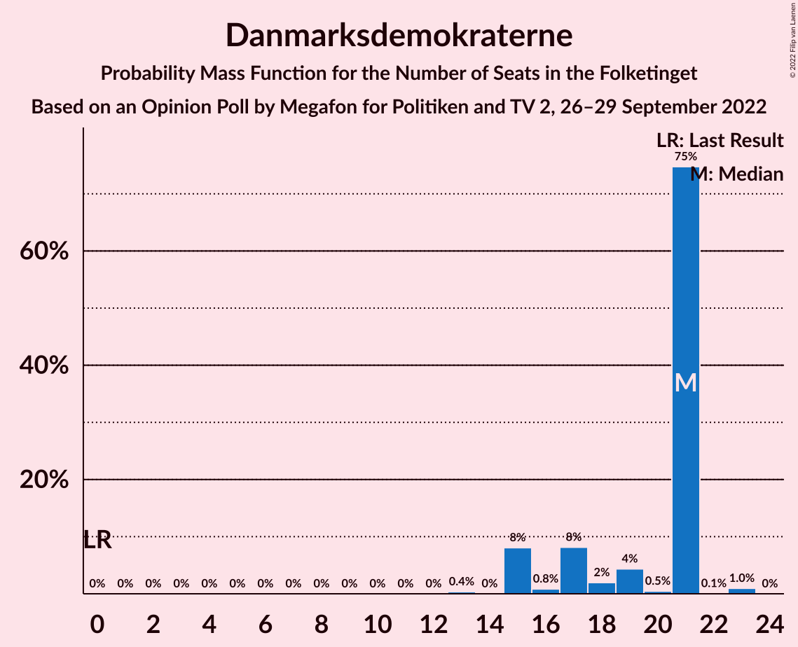

| Number of Seats | Probability | Accumulated | Special Marks |
|:---------------:|:-----------:|:-----------:|:-------------:|
| 0 | 0% | 100% | Last Result |
| 1 | 0% | 100% |  |
| 2 | 0% | 100% |  |
| 3 | 0% | 100% |  |
| 4 | 0% | 100% |  |
| 5 | 0% | 100% |  |
| 6 | 0% | 100% |  |
| 7 | 0% | 100% |  |
| 8 | 0% | 100% |  |
| 9 | 0% | 100% |  |
| 10 | 0% | 100% |  |
| 11 | 0% | 100% |  |
| 12 | 0% | 100% |  |
| 13 | 0.4% | 100% |  |
| 14 | 0% | 99.6% |  |
| 15 | 8% | 99.6% |  |
| 16 | 0.8% | 92% |  |
| 17 | 8% | 91% |  |
| 18 | 2% | 83% |  |
| 19 | 4% | 81% |  |
| 20 | 0.5% | 76% |  |
| 21 | 75% | 76% | Median |
| 22 | 0.1% | 1.0% |  |
| 23 | 1.0% | 1.0% |  |
| 24 | 0% | 0% |  |

### Socialistisk Folkeparti

*For a full overview of the results for this party, see the [Socialistisk Folkeparti](party-socialistiskfolkeparti.html) page.*

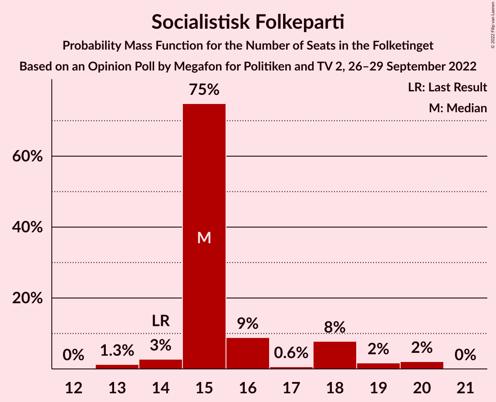

| Number of Seats | Probability | Accumulated | Special Marks |
|:---------------:|:-----------:|:-----------:|:-------------:|
| 13 | 1.3% | 100% |  |
| 14 | 3% | 98.7% | Last Result |
| 15 | 75% | 96% | Median |
| 16 | 9% | 21% |  |
| 17 | 0.6% | 12% |  |
| 18 | 8% | 12% |  |
| 19 | 2% | 4% |  |
| 20 | 2% | 2% |  |
| 21 | 0% | 0% |  |

### Enhedslisten–De Rød-Grønne

*For a full overview of the results for this party, see the [Enhedslisten–De Rød-Grønne](party-enhedslisten–derød-grønne.html) page.*

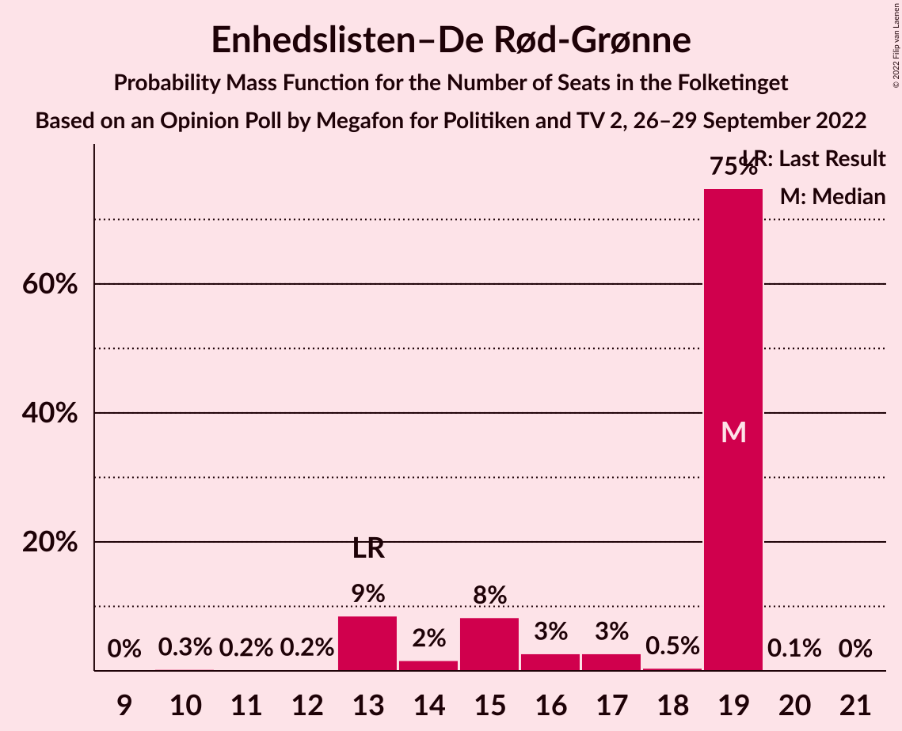

| Number of Seats | Probability | Accumulated | Special Marks |
|:---------------:|:-----------:|:-----------:|:-------------:|
| 10 | 0.3% | 100% |  |
| 11 | 0.2% | 99.7% |  |
| 12 | 0.2% | 99.6% |  |
| 13 | 9% | 99.3% | Last Result |
| 14 | 2% | 91% |  |
| 15 | 8% | 89% |  |
| 16 | 3% | 81% |  |
| 17 | 3% | 78% |  |
| 18 | 0.5% | 75% |  |
| 19 | 75% | 75% | Median |
| 20 | 0.1% | 0.1% |  |
| 21 | 0% | 0% |  |

### Radikale Venstre

*For a full overview of the results for this party, see the [Radikale Venstre](party-radikalevenstre.html) page.*

| Number of Seats | Probability | Accumulated | Special Marks |
|:---------------:|:-----------:|:-----------:|:-------------:|
| 6 | 0.1% | 100% |  |
| 7 | 0.4% | 99.9% |  |
| 8 | 3% | 99.5% |  |
| 9 | 85% | 96% | Median |
| 10 | 8% | 11% |  |
| 11 | 2% | 3% |  |
| 12 | 0.6% | 1.3% |  |
| 13 | 0% | 0.7% |  |
| 14 | 0.6% | 0.6% |  |
| 15 | 0% | 0% |  |
| 16 | 0% | 0% | Last Result |

### Moderaterne

*For a full overview of the results for this party, see the [Moderaterne](party-moderaterne.html) page.*

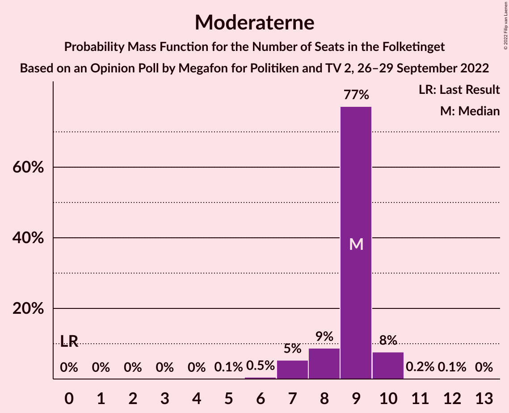

| Number of Seats | Probability | Accumulated | Special Marks |
|:---------------:|:-----------:|:-----------:|:-------------:|
| 0 | 0% | 100% | Last Result |
| 1 | 0% | 100% |  |
| 2 | 0% | 100% |  |
| 3 | 0% | 100% |  |
| 4 | 0% | 100% |  |
| 5 | 0.1% | 100% |  |
| 6 | 0.5% | 99.9% |  |
| 7 | 5% | 99.3% |  |
| 8 | 9% | 94% |  |
| 9 | 77% | 85% | Median |
| 10 | 8% | 8% |  |
| 11 | 0.2% | 0.4% |  |
| 12 | 0.1% | 0.2% |  |
| 13 | 0% | 0% |  |

### Liberal Alliance

*For a full overview of the results for this party, see the [Liberal Alliance](party-liberalalliance.html) page.*

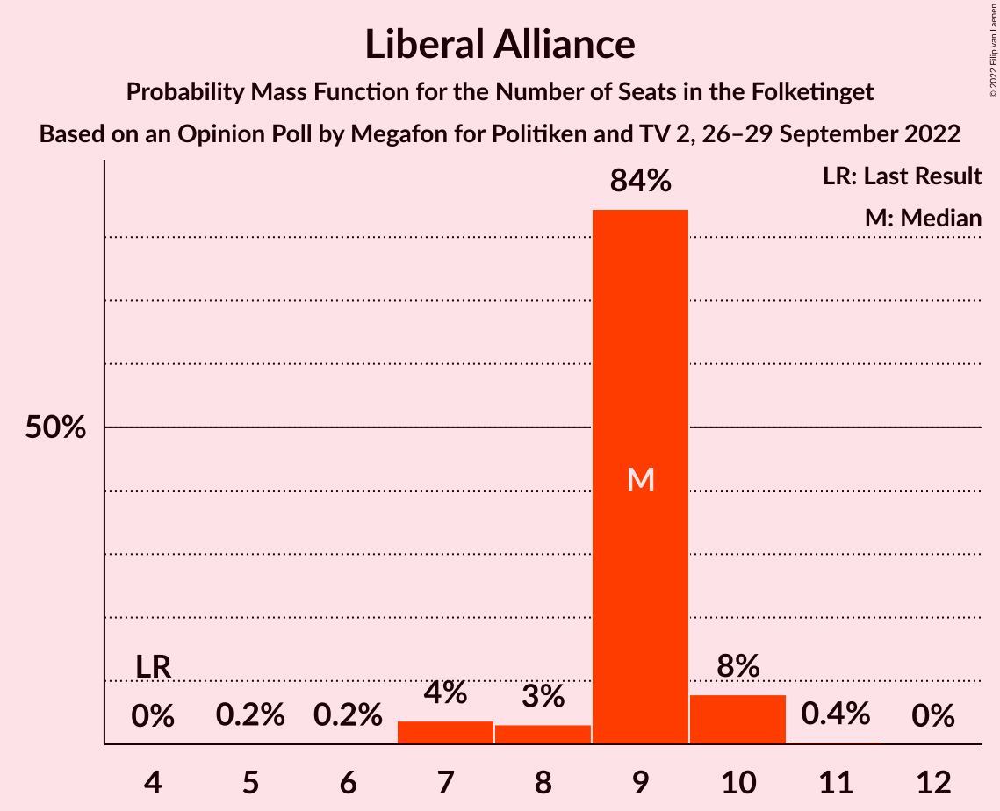

| Number of Seats | Probability | Accumulated | Special Marks |
|:---------------:|:-----------:|:-----------:|:-------------:|
| 4 | 0% | 100% | Last Result |
| 5 | 0.2% | 100% |  |
| 6 | 0.2% | 99.8% |  |
| 7 | 4% | 99.6% |  |
| 8 | 3% | 96% |  |
| 9 | 84% | 93% | Median |
| 10 | 8% | 8% |  |
| 11 | 0.4% | 0.4% |  |
| 12 | 0% | 0% |  |

### Nye Borgerlige

*For a full overview of the results for this party, see the [Nye Borgerlige](party-nyeborgerlige.html) page.*

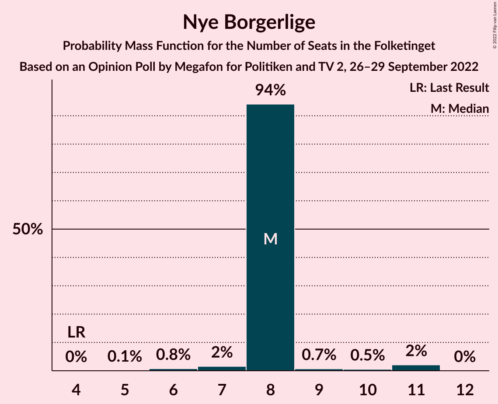

| Number of Seats | Probability | Accumulated | Special Marks |
|:---------------:|:-----------:|:-----------:|:-------------:|
| 4 | 0% | 100% | Last Result |
| 5 | 0.1% | 100% |  |
| 6 | 0.8% | 99.9% |  |
| 7 | 2% | 99.1% |  |
| 8 | 94% | 98% | Median |
| 9 | 0.7% | 3% |  |
| 10 | 0.5% | 3% |  |
| 11 | 2% | 2% |  |
| 12 | 0% | 0% |  |

### Dansk Folkeparti

*For a full overview of the results for this party, see the [Dansk Folkeparti](party-danskfolkeparti.html) page.*

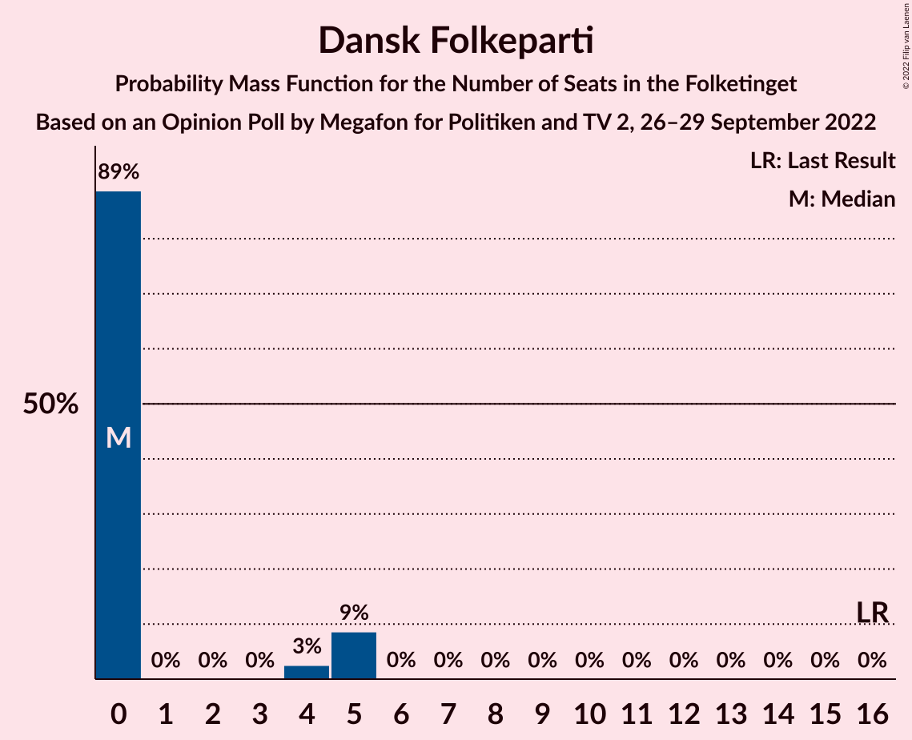

| Number of Seats | Probability | Accumulated | Special Marks |
|:---------------:|:-----------:|:-----------:|:-------------:|
| 0 | 89% | 100% | Median |
| 1 | 0% | 11% |  |
| 2 | 0% | 11% |  |
| 3 | 0% | 11% |  |
| 4 | 3% | 11% |  |
| 5 | 9% | 9% |  |
| 6 | 0% | 0.1% |  |
| 7 | 0% | 0% |  |
| 8 | 0% | 0% |  |
| 9 | 0% | 0% |  |
| 10 | 0% | 0% |  |
| 11 | 0% | 0% |  |
| 12 | 0% | 0% |  |
| 13 | 0% | 0% |  |
| 14 | 0% | 0% |  |
| 15 | 0% | 0% |  |
| 16 | 0% | 0% | Last Result |

### Alternativet

*For a full overview of the results for this party, see the [Alternativet](party-alternativet.html) page.*

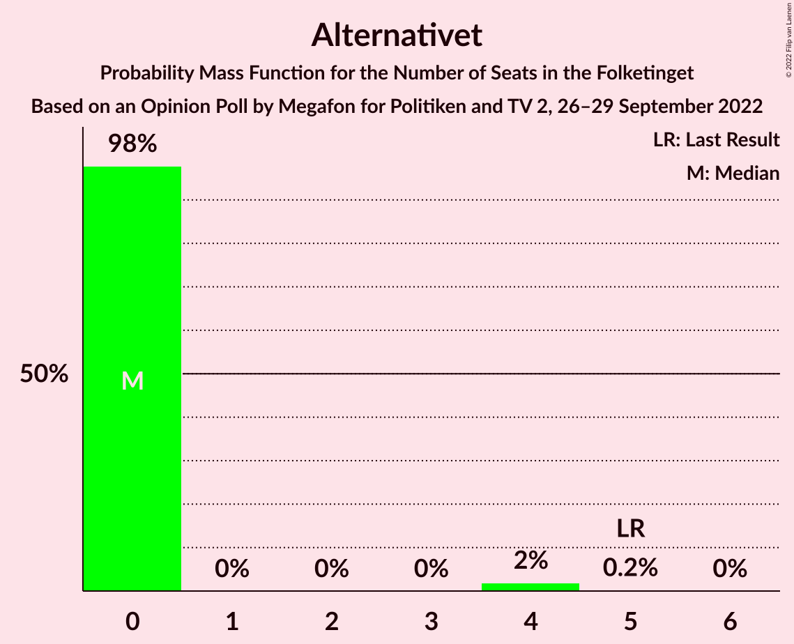

| Number of Seats | Probability | Accumulated | Special Marks |
|:---------------:|:-----------:|:-----------:|:-------------:|
| 0 | 98% | 100% | Median |
| 1 | 0% | 2% |  |
| 2 | 0% | 2% |  |
| 3 | 0% | 2% |  |
| 4 | 2% | 2% |  |
| 5 | 0.2% | 0.2% | Last Result |
| 6 | 0% | 0% |  |

### Kristendemokraterne

*For a full overview of the results for this party, see the [Kristendemokraterne](party-kristendemokraterne.html) page.*

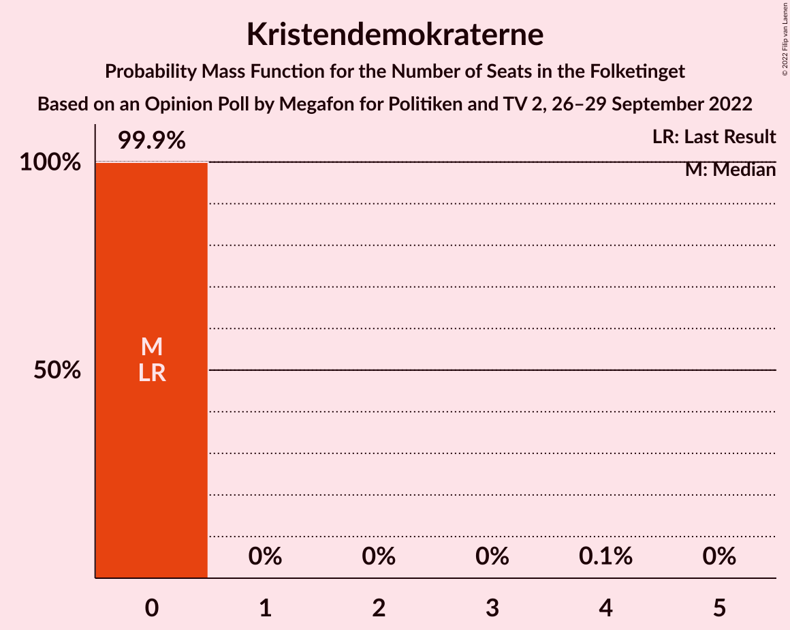

| Number of Seats | Probability | Accumulated | Special Marks |
|:---------------:|:-----------:|:-----------:|:-------------:|
| 0 | 99.9% | 100% | Last Result, Median |
| 1 | 0% | 0.1% |  |
| 2 | 0% | 0.1% |  |
| 3 | 0% | 0.1% |  |
| 4 | 0.1% | 0.1% |  |
| 5 | 0% | 0% |  |

### Frie Grønne

*For a full overview of the results for this party, see the [Frie Grønne](party-friegrønne.html) page.*

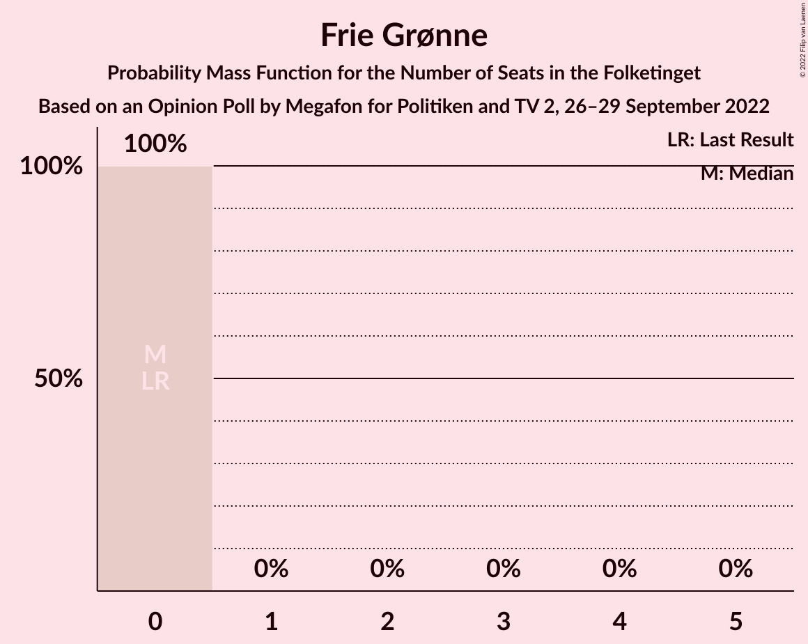

| Number of Seats | Probability | Accumulated | Special Marks |
|:---------------:|:-----------:|:-----------:|:-------------:|
| 0 | 100% | 100% | Last Result, Median |

## Coalitions

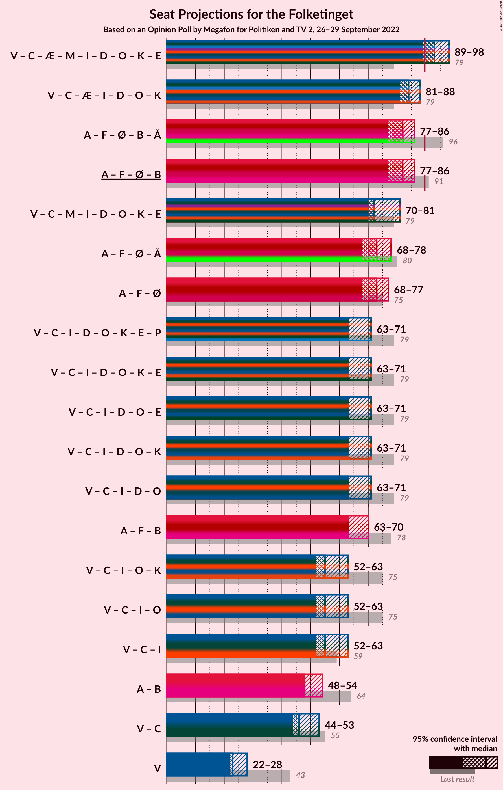

### Confidence Intervals

| Coalition | Last Result | Median | Majority? | 80% Confidence Interval | 90% Confidence Interval | 95% Confidence Interval | 99% Confidence Interval |
|:---------:|:-----------:|:------:|:---------:|:-----------------------:|:-----------------------:|:-----------------------:|:-----------------------:|
| Venstre – Det Konservative Folkeparti – Danmarksdemokraterne – Liberal Alliance – Nye Borgerlige – Dansk Folkeparti – Kristendemokraterne | 79 | 84 | 0.6% | 84–87 | 83–88 | 81–88 | 77–90 |
| Socialdemokraterne – Socialistisk Folkeparti – Enhedslisten–De Rød-Grønne – Radikale Venstre – Alternativet | 96 | 82 | 0.1% | 81–82 | 77–85 | 77–86 | 77–89 |
| Socialdemokraterne – Socialistisk Folkeparti – Enhedslisten–De Rød-Grønne – Radikale Venstre | 91 | 82 | 0.1% | 81–82 | 77–85 | 77–86 | 77–88 |
| Socialdemokraterne – Socialistisk Folkeparti – Enhedslisten–De Rød-Grønne – Alternativet | 80 | 73 | 0% | 71–73 | 68–74 | 68–78 | 67–80 |
| Socialdemokraterne – Socialistisk Folkeparti – Enhedslisten–De Rød-Grønne | 75 | 73 | 0% | 71–73 | 68–73 | 68–77 | 67–78 |
| Venstre – Det Konservative Folkeparti – Liberal Alliance – Nye Borgerlige – Dansk Folkeparti – Kristendemokraterne | 79 | 63 | 0% | 63–71 | 63–71 | 63–71 | 59–71 |
| Venstre – Det Konservative Folkeparti – Liberal Alliance – Nye Borgerlige – Dansk Folkeparti | 79 | 63 | 0% | 63–71 | 63–71 | 63–71 | 59–71 |
| Socialdemokraterne – Socialistisk Folkeparti – Radikale Venstre | 78 | 63 | 0% | 63–66 | 63–68 | 63–70 | 63–72 |
| Venstre – Det Konservative Folkeparti – Liberal Alliance – Dansk Folkeparti – Kristendemokraterne | 75 | 55 | 0% | 55–63 | 55–63 | 52–63 | 51–63 |
| Venstre – Det Konservative Folkeparti – Liberal Alliance – Dansk Folkeparti | 75 | 55 | 0% | 55–63 | 55–63 | 52–63 | 51–63 |
| Venstre – Det Konservative Folkeparti – Liberal Alliance | 59 | 55 | 0% | 55–58 | 54–63 | 52–63 | 51–63 |
| Socialdemokraterne – Radikale Venstre | 64 | 48 | 0% | 48 | 48–51 | 48–54 | 45–55 |
| Venstre – Det Konservative Folkeparti | 55 | 46 | 0% | 46–50 | 46–53 | 44–53 | 41–53 |
| Venstre | 43 | 23 | 0% | 23–26 | 23–28 | 22–28 | 22–29 |

### Venstre – Det Konservative Folkeparti – Danmarksdemokraterne – Liberal Alliance – Nye Borgerlige – Dansk Folkeparti – Kristendemokraterne

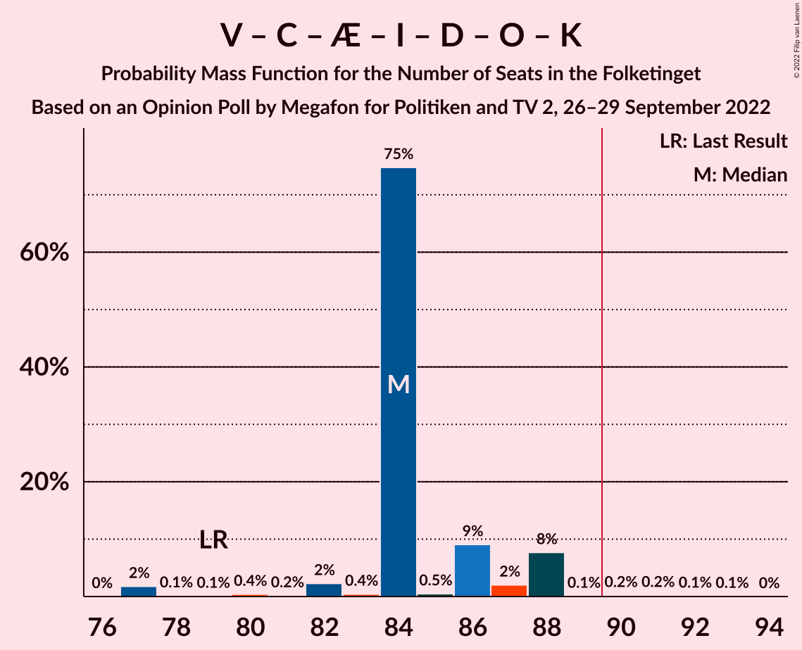

| Number of Seats | Probability | Accumulated | Special Marks |
|:---------------:|:-----------:|:-----------:|:-------------:|
| 77 | 2% | 100% |  |
| 78 | 0.1% | 98% |  |
| 79 | 0.1% | 98% | Last Result |
| 80 | 0.4% | 98% |  |
| 81 | 0.2% | 98% |  |
| 82 | 2% | 97% |  |
| 83 | 0.4% | 95% |  |
| 84 | 75% | 95% | Median |
| 85 | 0.5% | 20% |  |
| 86 | 9% | 19% |  |
| 87 | 2% | 10% |  |
| 88 | 8% | 8% |  |
| 89 | 0.1% | 0.7% |  |
| 90 | 0.2% | 0.6% | Majority |
| 91 | 0.2% | 0.4% |  |
| 92 | 0.1% | 0.2% |  |
| 93 | 0.1% | 0.1% |  |
| 94 | 0% | 0% |  |

### Socialdemokraterne – Socialistisk Folkeparti – Enhedslisten–De Rød-Grønne – Radikale Venstre – Alternativet

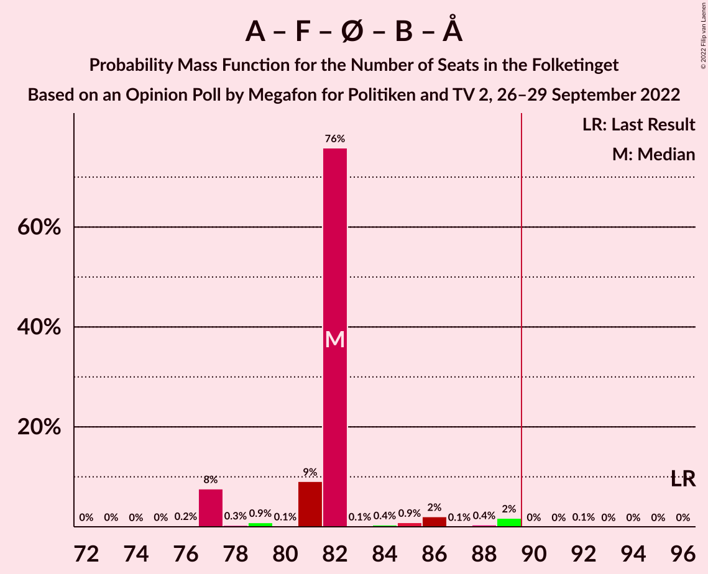

| Number of Seats | Probability | Accumulated | Special Marks |
|:---------------:|:-----------:|:-----------:|:-------------:|
| 73 | 0% | 100% |  |
| 74 | 0% | 99.9% |  |
| 75 | 0% | 99.9% |  |
| 76 | 0.2% | 99.9% |  |
| 77 | 8% | 99.6% |  |
| 78 | 0.3% | 92% |  |
| 79 | 0.9% | 92% |  |
| 80 | 0.1% | 91% |  |
| 81 | 9% | 91% |  |
| 82 | 76% | 82% | Median |
| 83 | 0.1% | 6% |  |
| 84 | 0.4% | 6% |  |
| 85 | 0.9% | 5% |  |
| 86 | 2% | 4% |  |
| 87 | 0.1% | 2% |  |
| 88 | 0.4% | 2% |  |
| 89 | 2% | 2% |  |
| 90 | 0% | 0.1% | Majority |
| 91 | 0% | 0.1% |  |
| 92 | 0.1% | 0.1% |  |
| 93 | 0% | 0% |  |
| 94 | 0% | 0% |  |
| 95 | 0% | 0% |  |
| 96 | 0% | 0% | Last Result |

### Socialdemokraterne – Socialistisk Folkeparti – Enhedslisten–De Rød-Grønne – Radikale Venstre

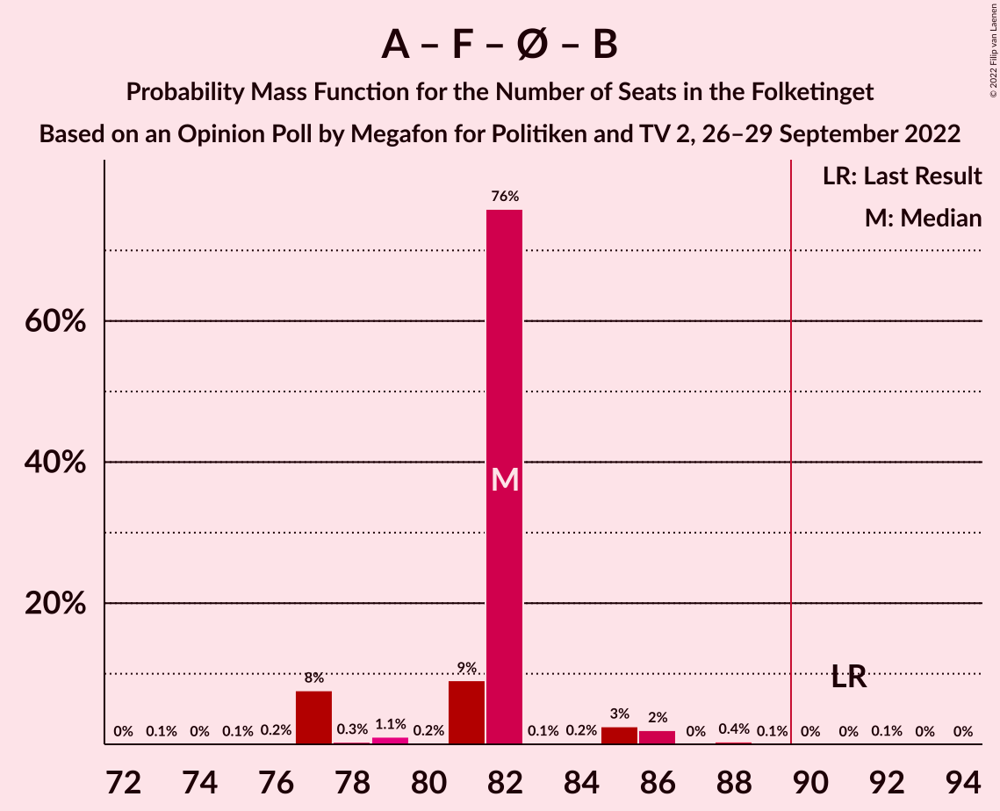

| Number of Seats | Probability | Accumulated | Special Marks |
|:---------------:|:-----------:|:-----------:|:-------------:|
| 73 | 0.1% | 100% |  |
| 74 | 0% | 99.9% |  |
| 75 | 0.1% | 99.9% |  |
| 76 | 0.2% | 99.8% |  |
| 77 | 8% | 99.6% |  |
| 78 | 0.3% | 92% |  |
| 79 | 1.1% | 92% |  |
| 80 | 0.2% | 91% |  |
| 81 | 9% | 90% |  |
| 82 | 76% | 81% | Median |
| 83 | 0.1% | 5% |  |
| 84 | 0.2% | 5% |  |
| 85 | 3% | 5% |  |
| 86 | 2% | 3% |  |
| 87 | 0% | 0.6% |  |
| 88 | 0.4% | 0.6% |  |
| 89 | 0.1% | 0.2% |  |
| 90 | 0% | 0.1% | Majority |
| 91 | 0% | 0.1% | Last Result |
| 92 | 0.1% | 0.1% |  |
| 93 | 0% | 0% |  |

### Socialdemokraterne – Socialistisk Folkeparti – Enhedslisten–De Rød-Grønne – Alternativet

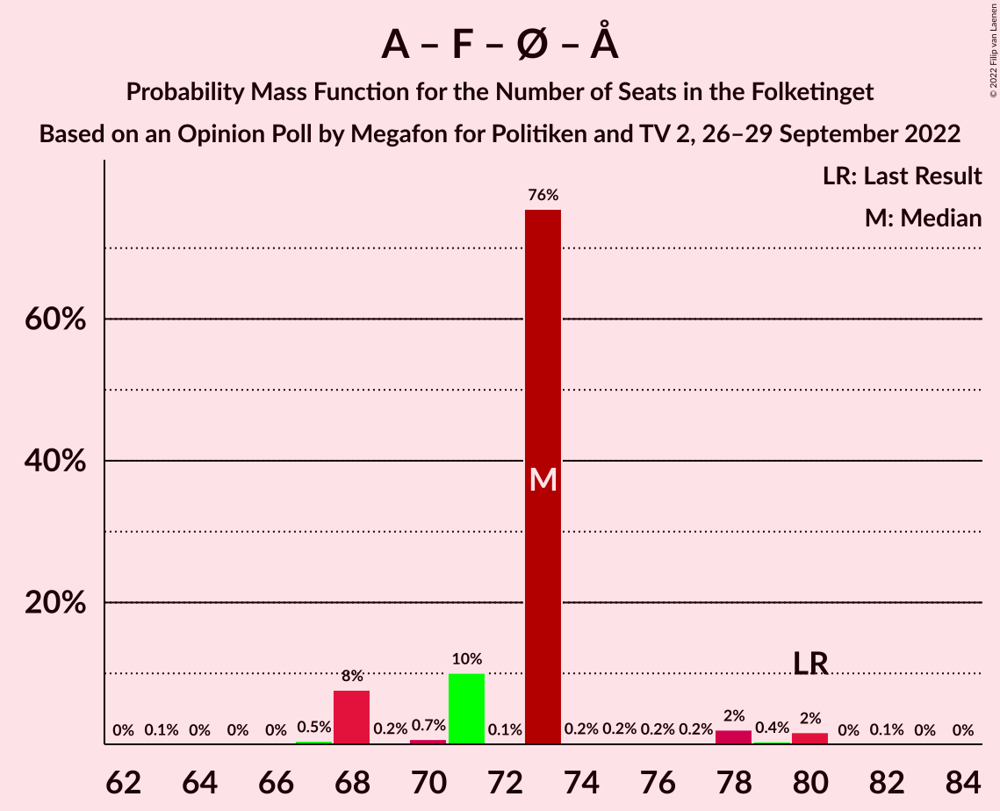

| Number of Seats | Probability | Accumulated | Special Marks |
|:---------------:|:-----------:|:-----------:|:-------------:|
| 63 | 0.1% | 100% |  |
| 64 | 0% | 99.9% |  |
| 65 | 0% | 99.9% |  |
| 66 | 0% | 99.9% |  |
| 67 | 0.5% | 99.8% |  |
| 68 | 8% | 99.4% |  |
| 69 | 0.2% | 92% |  |
| 70 | 0.7% | 91% |  |
| 71 | 10% | 91% |  |
| 72 | 0.1% | 81% |  |
| 73 | 76% | 81% | Median |
| 74 | 0.2% | 5% |  |
| 75 | 0.2% | 5% |  |
| 76 | 0.2% | 5% |  |
| 77 | 0.2% | 4% |  |
| 78 | 2% | 4% |  |
| 79 | 0.4% | 2% |  |
| 80 | 2% | 2% | Last Result |
| 81 | 0% | 0.1% |  |
| 82 | 0.1% | 0.1% |  |
| 83 | 0% | 0% |  |

### Socialdemokraterne – Socialistisk Folkeparti – Enhedslisten–De Rød-Grønne

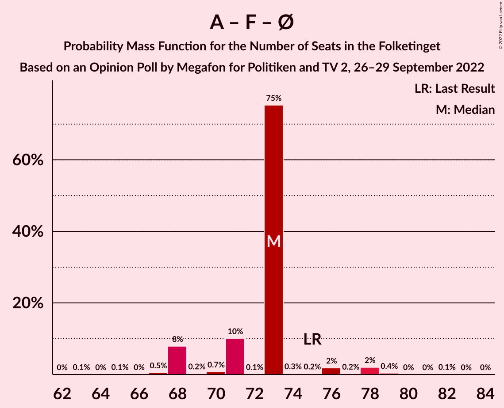

| Number of Seats | Probability | Accumulated | Special Marks |
|:---------------:|:-----------:|:-----------:|:-------------:|
| 63 | 0.1% | 100% |  |
| 64 | 0% | 99.9% |  |
| 65 | 0.1% | 99.9% |  |
| 66 | 0% | 99.8% |  |
| 67 | 0.5% | 99.8% |  |
| 68 | 8% | 99.3% |  |
| 69 | 0.2% | 91% |  |
| 70 | 0.7% | 91% |  |
| 71 | 10% | 90% |  |
| 72 | 0.1% | 80% |  |
| 73 | 75% | 80% | Median |
| 74 | 0.3% | 5% |  |
| 75 | 0.2% | 5% | Last Result |
| 76 | 2% | 4% |  |
| 77 | 0.2% | 3% |  |
| 78 | 2% | 2% |  |
| 79 | 0.4% | 0.5% |  |
| 80 | 0% | 0.1% |  |
| 81 | 0% | 0.1% |  |
| 82 | 0.1% | 0.1% |  |
| 83 | 0% | 0% |  |

### Venstre – Det Konservative Folkeparti – Liberal Alliance – Nye Borgerlige – Dansk Folkeparti – Kristendemokraterne

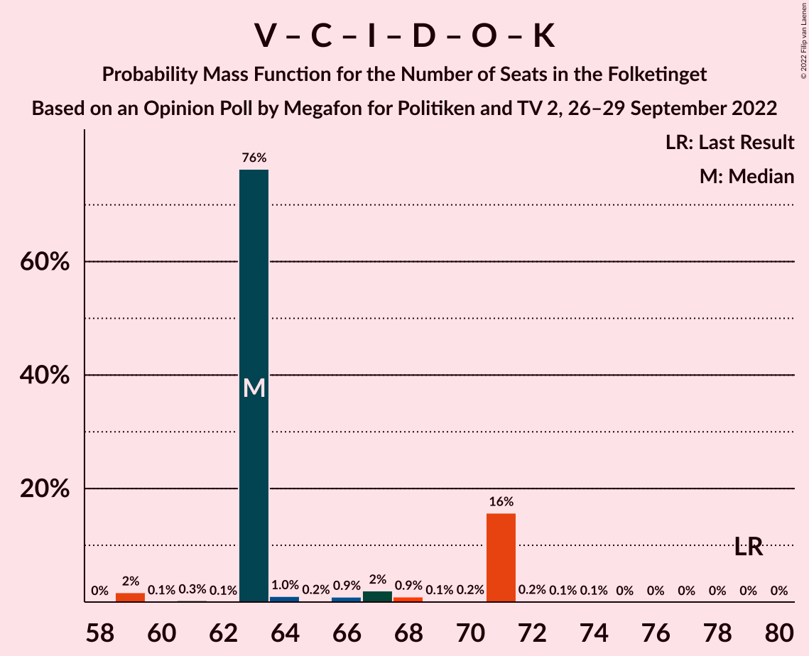

| Number of Seats | Probability | Accumulated | Special Marks |
|:---------------:|:-----------:|:-----------:|:-------------:|
| 59 | 2% | 100% |  |
| 60 | 0.1% | 98% |  |
| 61 | 0.3% | 98% |  |
| 62 | 0.1% | 98% |  |
| 63 | 76% | 98% | Median |
| 64 | 1.0% | 21% |  |
| 65 | 0.2% | 20% |  |
| 66 | 0.9% | 20% |  |
| 67 | 2% | 19% |  |
| 68 | 0.9% | 17% |  |
| 69 | 0.1% | 16% |  |
| 70 | 0.2% | 16% |  |
| 71 | 16% | 16% |  |
| 72 | 0.2% | 0.4% |  |
| 73 | 0.1% | 0.1% |  |
| 74 | 0.1% | 0.1% |  |
| 75 | 0% | 0% |  |
| 76 | 0% | 0% |  |
| 77 | 0% | 0% |  |
| 78 | 0% | 0% |  |
| 79 | 0% | 0% | Last Result |

### Venstre – Det Konservative Folkeparti – Liberal Alliance – Nye Borgerlige – Dansk Folkeparti

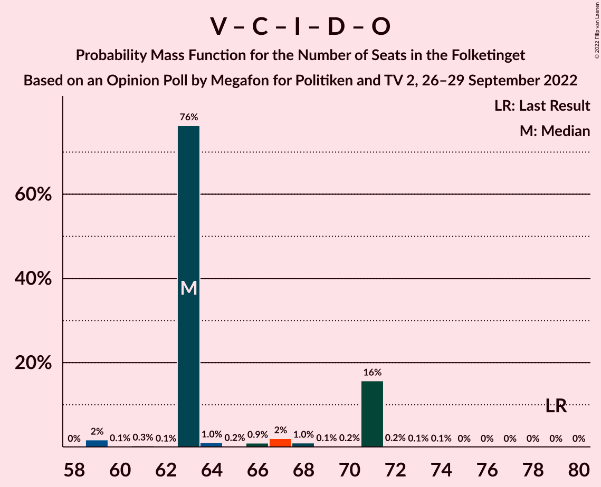

| Number of Seats | Probability | Accumulated | Special Marks |
|:---------------:|:-----------:|:-----------:|:-------------:|
| 59 | 2% | 100% |  |
| 60 | 0.1% | 98% |  |
| 61 | 0.3% | 98% |  |
| 62 | 0.1% | 98% |  |
| 63 | 76% | 98% | Median |
| 64 | 1.0% | 21% |  |
| 65 | 0.2% | 20% |  |
| 66 | 0.9% | 20% |  |
| 67 | 2% | 19% |  |
| 68 | 1.0% | 17% |  |
| 69 | 0.1% | 16% |  |
| 70 | 0.2% | 16% |  |
| 71 | 16% | 16% |  |
| 72 | 0.2% | 0.3% |  |
| 73 | 0.1% | 0.1% |  |
| 74 | 0.1% | 0.1% |  |
| 75 | 0% | 0% |  |
| 76 | 0% | 0% |  |
| 77 | 0% | 0% |  |
| 78 | 0% | 0% |  |
| 79 | 0% | 0% | Last Result |

### Socialdemokraterne – Socialistisk Folkeparti – Radikale Venstre

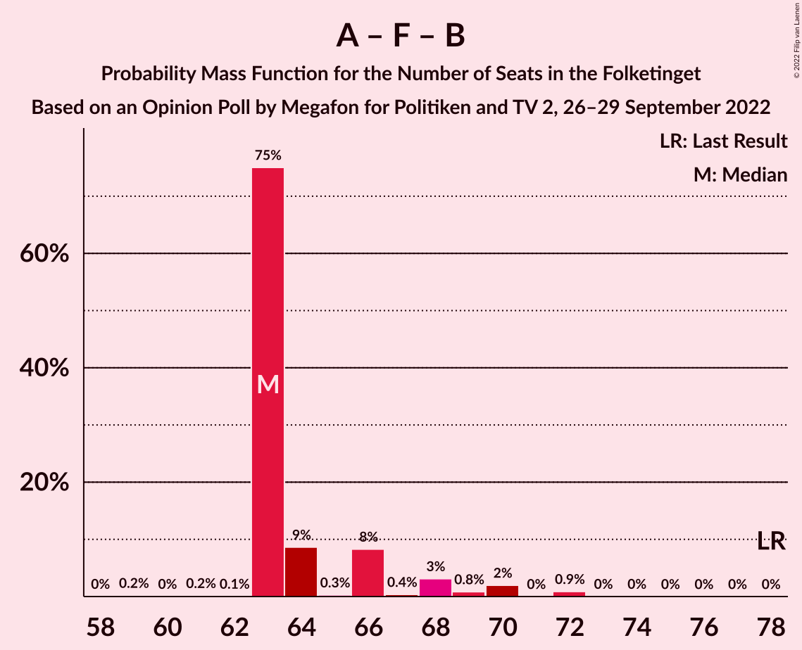

| Number of Seats | Probability | Accumulated | Special Marks |
|:---------------:|:-----------:|:-----------:|:-------------:|
| 59 | 0.2% | 100% |  |
| 60 | 0% | 99.8% |  |
| 61 | 0.2% | 99.7% |  |
| 62 | 0.1% | 99.6% |  |
| 63 | 75% | 99.5% | Median |
| 64 | 9% | 24% |  |
| 65 | 0.3% | 16% |  |
| 66 | 8% | 16% |  |
| 67 | 0.4% | 7% |  |
| 68 | 3% | 7% |  |
| 69 | 0.8% | 4% |  |
| 70 | 2% | 3% |  |
| 71 | 0% | 1.0% |  |
| 72 | 0.9% | 1.0% |  |
| 73 | 0% | 0.1% |  |
| 74 | 0% | 0% |  |
| 75 | 0% | 0% |  |
| 76 | 0% | 0% |  |
| 77 | 0% | 0% |  |
| 78 | 0% | 0% | Last Result |

### Venstre – Det Konservative Folkeparti – Liberal Alliance – Dansk Folkeparti – Kristendemokraterne

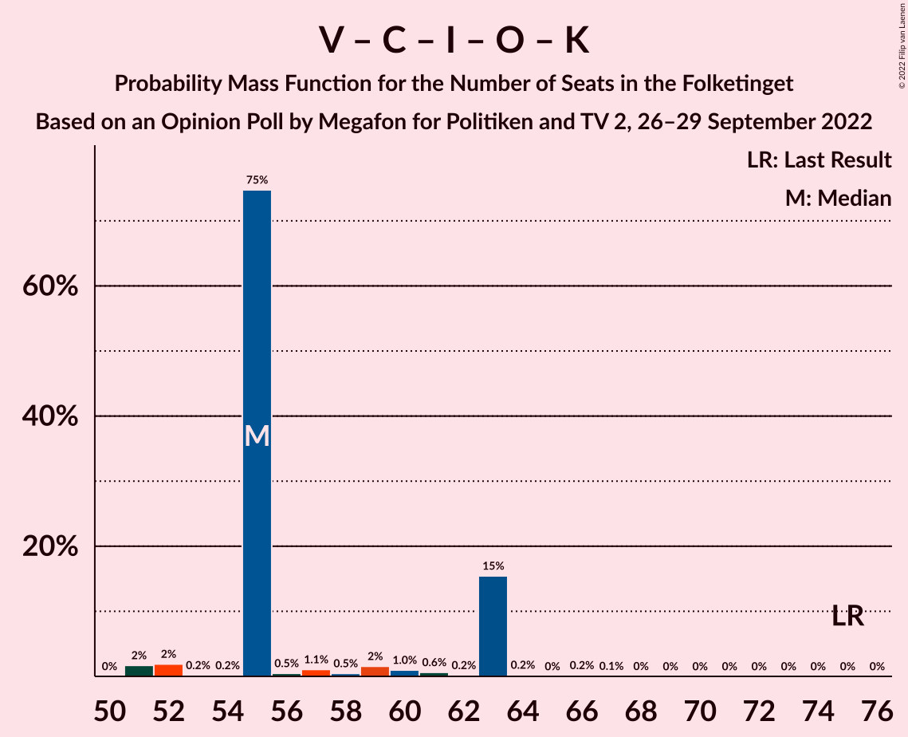

| Number of Seats | Probability | Accumulated | Special Marks |
|:---------------:|:-----------:|:-----------:|:-------------:|
| 51 | 2% | 100% |  |
| 52 | 2% | 98% |  |
| 53 | 0.2% | 96% |  |
| 54 | 0.2% | 96% |  |
| 55 | 75% | 96% | Median |
| 56 | 0.5% | 21% |  |
| 57 | 1.1% | 21% |  |
| 58 | 0.5% | 20% |  |
| 59 | 2% | 19% |  |
| 60 | 1.0% | 18% |  |
| 61 | 0.6% | 17% |  |
| 62 | 0.2% | 16% |  |
| 63 | 15% | 16% |  |
| 64 | 0.2% | 0.5% |  |
| 65 | 0% | 0.3% |  |
| 66 | 0.2% | 0.3% |  |
| 67 | 0.1% | 0.1% |  |
| 68 | 0% | 0% |  |
| 69 | 0% | 0% |  |
| 70 | 0% | 0% |  |
| 71 | 0% | 0% |  |
| 72 | 0% | 0% |  |
| 73 | 0% | 0% |  |
| 74 | 0% | 0% |  |
| 75 | 0% | 0% | Last Result |

### Venstre – Det Konservative Folkeparti – Liberal Alliance – Dansk Folkeparti

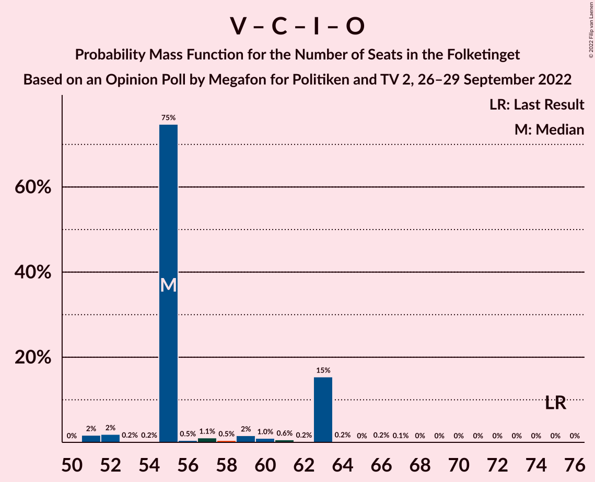

| Number of Seats | Probability | Accumulated | Special Marks |
|:---------------:|:-----------:|:-----------:|:-------------:|
| 51 | 2% | 100% |  |
| 52 | 2% | 98% |  |
| 53 | 0.2% | 96% |  |
| 54 | 0.2% | 96% |  |
| 55 | 75% | 96% | Median |
| 56 | 0.5% | 21% |  |
| 57 | 1.1% | 21% |  |
| 58 | 0.5% | 20% |  |
| 59 | 2% | 19% |  |
| 60 | 1.0% | 18% |  |
| 61 | 0.6% | 17% |  |
| 62 | 0.2% | 16% |  |
| 63 | 15% | 16% |  |
| 64 | 0.2% | 0.5% |  |
| 65 | 0% | 0.3% |  |
| 66 | 0.2% | 0.3% |  |
| 67 | 0.1% | 0.1% |  |
| 68 | 0% | 0% |  |
| 69 | 0% | 0% |  |
| 70 | 0% | 0% |  |
| 71 | 0% | 0% |  |
| 72 | 0% | 0% |  |
| 73 | 0% | 0% |  |
| 74 | 0% | 0% |  |
| 75 | 0% | 0% | Last Result |

### Venstre – Det Konservative Folkeparti – Liberal Alliance

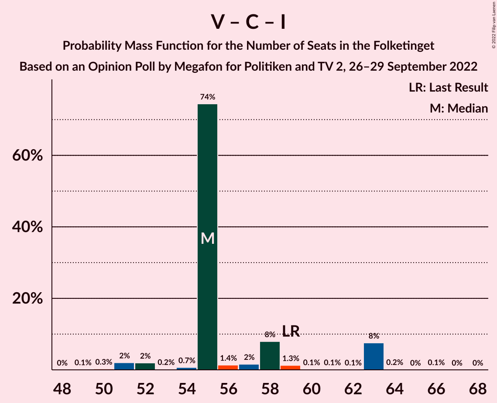

| Number of Seats | Probability | Accumulated | Special Marks |
|:---------------:|:-----------:|:-----------:|:-------------:|
| 49 | 0.1% | 100% |  |
| 50 | 0.3% | 99.9% |  |
| 51 | 2% | 99.6% |  |
| 52 | 2% | 98% |  |
| 53 | 0.2% | 96% |  |
| 54 | 0.7% | 95% |  |
| 55 | 74% | 95% | Median |
| 56 | 1.4% | 20% |  |
| 57 | 2% | 19% |  |
| 58 | 8% | 17% |  |
| 59 | 1.3% | 9% | Last Result |
| 60 | 0.1% | 8% |  |
| 61 | 0.1% | 8% |  |
| 62 | 0.1% | 8% |  |
| 63 | 8% | 8% |  |
| 64 | 0.2% | 0.3% |  |
| 65 | 0% | 0.1% |  |
| 66 | 0.1% | 0.1% |  |
| 67 | 0% | 0% |  |

### Socialdemokraterne – Radikale Venstre

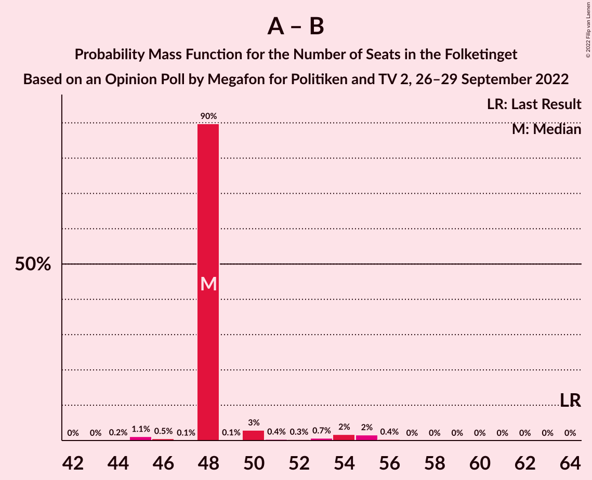

| Number of Seats | Probability | Accumulated | Special Marks |
|:---------------:|:-----------:|:-----------:|:-------------:|
| 44 | 0.2% | 100% |  |
| 45 | 1.1% | 99.8% |  |
| 46 | 0.5% | 98.7% |  |
| 47 | 0.1% | 98% |  |
| 48 | 90% | 98% | Median |
| 49 | 0.1% | 8% |  |
| 50 | 3% | 8% |  |
| 51 | 0.4% | 5% |  |
| 52 | 0.3% | 5% |  |
| 53 | 0.7% | 4% |  |
| 54 | 2% | 4% |  |
| 55 | 2% | 2% |  |
| 56 | 0.4% | 0.4% |  |
| 57 | 0% | 0.1% |  |
| 58 | 0% | 0.1% |  |
| 59 | 0% | 0% |  |
| 60 | 0% | 0% |  |
| 61 | 0% | 0% |  |
| 62 | 0% | 0% |  |
| 63 | 0% | 0% |  |
| 64 | 0% | 0% | Last Result |

### Venstre – Det Konservative Folkeparti

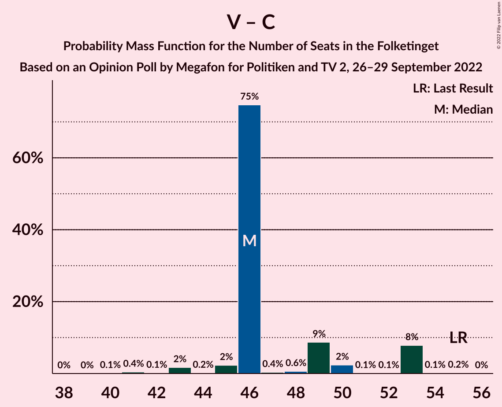

| Number of Seats | Probability | Accumulated | Special Marks |
|:---------------:|:-----------:|:-----------:|:-------------:|
| 40 | 0.1% | 100% |  |
| 41 | 0.4% | 99.9% |  |
| 42 | 0.1% | 99.5% |  |
| 43 | 2% | 99.3% |  |
| 44 | 0.2% | 98% |  |
| 45 | 2% | 97% |  |
| 46 | 75% | 95% | Median |
| 47 | 0.4% | 20% |  |
| 48 | 0.6% | 20% |  |
| 49 | 9% | 19% |  |
| 50 | 2% | 11% |  |
| 51 | 0.1% | 8% |  |
| 52 | 0.1% | 8% |  |
| 53 | 8% | 8% |  |
| 54 | 0.1% | 0.3% |  |
| 55 | 0.2% | 0.2% | Last Result |
| 56 | 0% | 0% |  |

### Venstre

| Number of Seats | Probability | Accumulated | Special Marks |
|:---------------:|:-----------:|:-----------:|:-------------:|
| 19 | 0.1% | 100% |  |
| 20 | 0% | 99.9% |  |
| 21 | 0.2% | 99.9% |  |
| 22 | 2% | 99.7% |  |
| 23 | 75% | 97% | Median |
| 24 | 3% | 23% |  |
| 25 | 9% | 20% |  |
| 26 | 2% | 11% |  |
| 27 | 0.3% | 8% |  |
| 28 | 8% | 8% |  |
| 29 | 0.2% | 0.5% |  |
| 30 | 0.3% | 0.3% |  |
| 31 | 0% | 0% |  |
| 32 | 0% | 0% |  |
| 33 | 0% | 0% |  |
| 34 | 0% | 0% |  |
| 35 | 0% | 0% |  |
| 36 | 0% | 0% |  |
| 37 | 0% | 0% |  |
| 38 | 0% | 0% |  |
| 39 | 0% | 0% |  |
| 40 | 0% | 0% |  |
| 41 | 0% | 0% |  |
| 42 | 0% | 0% |  |
| 43 | 0% | 0% | Last Result |

## Technical Information

### Opinion Poll

+ **Polling firm:** Megafon
+ **Commissioner(s):** Politiken and TV 2
+ **Fieldwork period:** 26–29 September 2022

### Calculations

+ **Sample size:** 1010
+ **Simulations done:** 1,048,576
+ **Error estimate:** 3.17%

