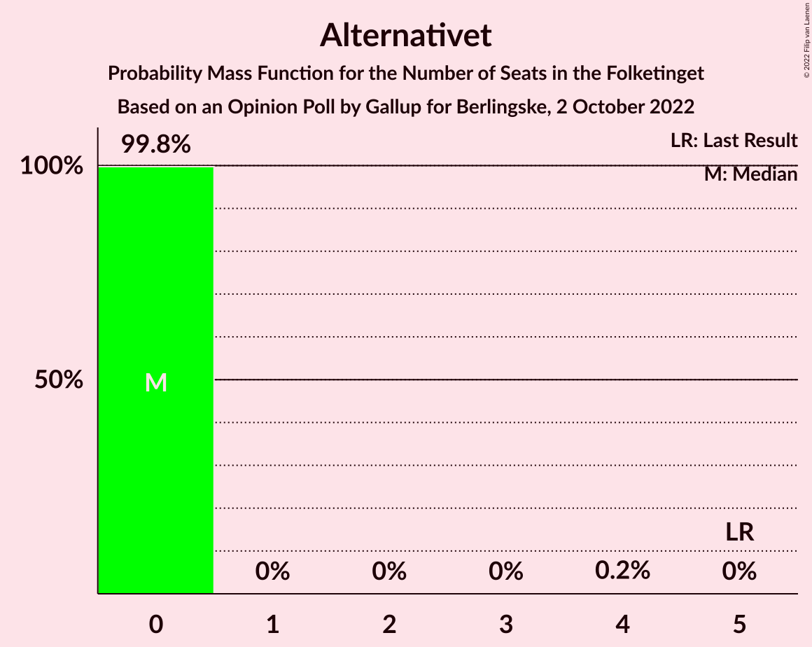

# Opinion Poll by Gallup for Berlingske, 2 October 2022

<a href="#voting-intentions">Voting Intentions</a> | <a href="#seats">Seats</a> | <a href="#coalitions">Coalitions</a> | <a href="#technical-information">Technical Information</a>

## Voting Intentions

### Confidence Intervals

| Party | Last Result | Poll Result | 80% Confidence Interval | 90% Confidence Interval | 95% Confidence Interval | 99% Confidence Interval |
|:-----:|:-----------:|:-----------:|:-----------------------:|:-----------------------:|:-----------------------:|:-----------------------:|
| Socialdemokraterne | 25.9% | 24.4% | 23.0–25.8% |22.7–26.2% |22.3–26.6% |21.7–27.3% |
| Det Konservative Folkeparti | 6.6% | 12.3% | 11.3–13.4% |11.0–13.7% |10.8–14.0% |10.3–14.6% |
| Venstre | 23.4% | 11.9% | 10.9–13.0% |10.6–13.3% |10.4–13.6% |9.9–14.1% |
| Danmarksdemokraterne | 0.0% | 9.8% | 8.9–10.8% |8.6–11.1% |8.4–11.3% |8.0–11.8% |
| Enhedslisten–De Rød-Grønne | 6.9% | 8.7% | 7.9–9.7% |7.6–10.0% |7.4–10.2% |7.0–10.7% |
| Socialistisk Folkeparti | 7.7% | 7.9% | 7.1–8.8% |6.9–9.1% |6.7–9.3% |6.3–9.8% |
| Radikale Venstre | 8.6% | 6.8% | 6.0–7.7% |5.8–7.9% |5.7–8.1% |5.3–8.6% |
| Nye Borgerlige | 2.4% | 6.0% | 5.3–6.8% |5.1–7.0% |4.9–7.3% |4.6–7.7% |
| Liberal Alliance | 2.3% | 4.0% | 3.4–4.7% |3.3–4.9% |3.1–5.1% |2.9–5.4% |
| Moderaterne | 0.0% | 3.4% | 2.9–4.1% |2.8–4.3% |2.6–4.4% |2.4–4.8% |
| Dansk Folkeparti | 8.7% | 1.9% | 1.6–2.5% |1.4–2.6% |1.4–2.7% |1.2–3.0% |
| Kristendemokraterne | 1.7% | 1.3% | 1.0–1.8% |0.9–1.9% |0.9–2.0% |0.7–2.2% |
| Alternativet | 3.0% | 1.2% | 0.9–1.6% |0.8–1.7% |0.7–1.8% |0.6–2.1% |
| Frie Grønne | 0.0% | 0.3% | 0.2–0.6% |0.2–0.7% |0.1–0.7% |0.1–0.9% |

*Note:* The poll result column reflects the actual value used in the calculations. Published results may vary slightly, and in addition be rounded to fewer digits.

## Seats

### Confidence Intervals

| Party | Last Result | Median | 80% Confidence Interval | 90% Confidence Interval | 95% Confidence Interval | 99% Confidence Interval |
|:-----:|:-----------:|:------:|:-----------------------:|:-----------------------:|:-----------------------:|:-----------------------:|
| <a href="#socialdemokraterne">Socialdemokraterne</a> | 48 | 46 | 43–46 |41–48 |41–48 |40–48 |
| <a href="#det-konservative-folkeparti">Det Konservative Folkeparti</a> | 12 | 23 | 21–23 |21–25 |21–25 |20–25 |
| <a href="#venstre">Venstre</a> | 43 | 22 | 20–24 |20–24 |20–24 |19–24 |
| <a href="#danmarksdemokraterne">Danmarksdemokraterne</a> | 0 | 17 | 16–20 |15–21 |15–21 |15–21 |
| <a href="#enhedslisten–de-rød-grønne">Enhedslisten–De Rød-Grønne</a> | 13 | 16 | 14–17 |14–18 |14–18 |13–18 |
| <a href="#socialistisk-folkeparti">Socialistisk Folkeparti</a> | 14 | 14 | 13–15 |13–17 |13–17 |12–19 |
| <a href="#radikale-venstre">Radikale Venstre</a> | 16 | 14 | 11–15 |11–15 |11–15 |10–15 |
| <a href="#nye-borgerlige">Nye Borgerlige</a> | 4 | 11 | 10–12 |9–13 |9–13 |9–13 |
| <a href="#liberal-alliance">Liberal Alliance</a> | 4 | 6 | 6–8 |6–8 |6–9 |6–9 |
| <a href="#moderaterne">Moderaterne</a> | 0 | 5 | 5–7 |5–8 |5–8 |5–8 |
| <a href="#dansk-folkeparti">Dansk Folkeparti</a> | 16 | 0 | 0–5 |0–5 |0–5 |0–5 |
| <a href="#kristendemokraterne">Kristendemokraterne</a> | 0 | 0 | 0 |0 |0 |0–4 |
| <a href="#alternativet">Alternativet</a> | 5 | 0 | 0 |0 |0 |0 |
| <a href="#frie-grønne">Frie Grønne</a> | 0 | 0 | 0 |0 |0 |0 |

### Socialdemokraterne

*For a full overview of the results for this party, see the [Socialdemokraterne](party-socialdemokraterne.html) page.*

| Number of Seats | Probability | Accumulated | Special Marks |
|:---------------:|:-----------:|:-----------:|:-------------:|
| 39 | 0.4% | 100% |  |
| 40 | 0.1% | 99.6% |  |
| 41 | 5% | 99.5% |  |
| 42 | 2% | 95% |  |
| 43 | 14% | 93% |  |
| 44 | 7% | 80% |  |
| 45 | 16% | 73% |  |
| 46 | 47% | 57% | Median |
| 47 | 0.1% | 9% |  |
| 48 | 9% | 9% | Last Result |
| 49 | 0% | 0.1% |  |
| 50 | 0% | 0% |  |

### Det Konservative Folkeparti

*For a full overview of the results for this party, see the [Det Konservative Folkeparti](party-detkonservativefolkeparti.html) page.*

| Number of Seats | Probability | Accumulated | Special Marks |
|:---------------:|:-----------:|:-----------:|:-------------:|
| 12 | 0% | 100% | Last Result |
| 13 | 0% | 100% |  |
| 14 | 0% | 100% |  |
| 15 | 0% | 100% |  |
| 16 | 0% | 100% |  |
| 17 | 0% | 100% |  |
| 18 | 0.3% | 100% |  |
| 19 | 0.1% | 99.6% |  |
| 20 | 0.8% | 99.5% |  |
| 21 | 18% | 98.7% |  |
| 22 | 13% | 80% |  |
| 23 | 60% | 68% | Median |
| 24 | 0.6% | 8% |  |
| 25 | 7% | 7% |  |
| 26 | 0% | 0.3% |  |
| 27 | 0.2% | 0.2% |  |
| 28 | 0% | 0% |  |

### Venstre

*For a full overview of the results for this party, see the [Venstre](party-venstre.html) page.*

| Number of Seats | Probability | Accumulated | Special Marks |
|:---------------:|:-----------:|:-----------:|:-------------:|
| 18 | 0.1% | 100% |  |
| 19 | 0.5% | 99.9% |  |
| 20 | 12% | 99.4% |  |
| 21 | 21% | 88% |  |
| 22 | 44% | 66% | Median |
| 23 | 0.6% | 22% |  |
| 24 | 21% | 21% |  |
| 25 | 0.2% | 0.2% |  |
| 26 | 0% | 0% |  |
| 27 | 0% | 0% |  |
| 28 | 0% | 0% |  |
| 29 | 0% | 0% |  |
| 30 | 0% | 0% |  |
| 31 | 0% | 0% |  |
| 32 | 0% | 0% |  |
| 33 | 0% | 0% |  |
| 34 | 0% | 0% |  |
| 35 | 0% | 0% |  |
| 36 | 0% | 0% |  |
| 37 | 0% | 0% |  |
| 38 | 0% | 0% |  |
| 39 | 0% | 0% |  |
| 40 | 0% | 0% |  |
| 41 | 0% | 0% |  |
| 42 | 0% | 0% |  |
| 43 | 0% | 0% | Last Result |

### Danmarksdemokraterne

*For a full overview of the results for this party, see the [Danmarksdemokraterne](party-danmarksdemokraterne.html) page.*

| Number of Seats | Probability | Accumulated | Special Marks |
|:---------------:|:-----------:|:-----------:|:-------------:|
| 0 | 0% | 100% | Last Result |
| 1 | 0% | 100% |  |
| 2 | 0% | 100% |  |
| 3 | 0% | 100% |  |
| 4 | 0% | 100% |  |
| 5 | 0% | 100% |  |
| 6 | 0% | 100% |  |
| 7 | 0% | 100% |  |
| 8 | 0% | 100% |  |
| 9 | 0% | 100% |  |
| 10 | 0% | 100% |  |
| 11 | 0% | 100% |  |
| 12 | 0% | 100% |  |
| 13 | 0% | 100% |  |
| 14 | 0.1% | 100% |  |
| 15 | 8% | 99.8% |  |
| 16 | 13% | 92% |  |
| 17 | 64% | 79% | Median |
| 18 | 2% | 15% |  |
| 19 | 2% | 13% |  |
| 20 | 2% | 12% |  |
| 21 | 9% | 9% |  |
| 22 | 0% | 0% |  |

### Enhedslisten–De Rød-Grønne

*For a full overview of the results for this party, see the [Enhedslisten–De Rød-Grønne](party-enhedslisten–derød-grønne.html) page.*

| Number of Seats | Probability | Accumulated | Special Marks |
|:---------------:|:-----------:|:-----------:|:-------------:|
| 13 | 0.6% | 100% | Last Result |
| 14 | 16% | 99.4% |  |
| 15 | 16% | 83% |  |
| 16 | 43% | 67% | Median |
| 17 | 15% | 24% |  |
| 18 | 9% | 10% |  |
| 19 | 0.3% | 0.4% |  |
| 20 | 0% | 0% |  |

### Socialistisk Folkeparti

*For a full overview of the results for this party, see the [Socialistisk Folkeparti](party-socialistiskfolkeparti.html) page.*

| Number of Seats | Probability | Accumulated | Special Marks |
|:---------------:|:-----------:|:-----------:|:-------------:|
| 11 | 0.1% | 100% |  |
| 12 | 2% | 99.9% |  |
| 13 | 30% | 98% |  |
| 14 | 47% | 68% | Last Result, Median |
| 15 | 12% | 21% |  |
| 16 | 3% | 9% |  |
| 17 | 6% | 7% |  |
| 18 | 0.1% | 0.6% |  |
| 19 | 0.5% | 0.5% |  |
| 20 | 0% | 0% |  |

### Radikale Venstre

*For a full overview of the results for this party, see the [Radikale Venstre](party-radikalevenstre.html) page.*

| Number of Seats | Probability | Accumulated | Special Marks |
|:---------------:|:-----------:|:-----------:|:-------------:|
| 10 | 0.5% | 100% |  |
| 11 | 21% | 99.5% |  |
| 12 | 12% | 78% |  |
| 13 | 11% | 66% |  |
| 14 | 12% | 55% | Median |
| 15 | 43% | 43% |  |
| 16 | 0.4% | 0.4% | Last Result |
| 17 | 0% | 0% |  |

### Nye Borgerlige

*For a full overview of the results for this party, see the [Nye Borgerlige](party-nyeborgerlige.html) page.*

| Number of Seats | Probability | Accumulated | Special Marks |
|:---------------:|:-----------:|:-----------:|:-------------:|
| 4 | 0% | 100% | Last Result |
| 5 | 0% | 100% |  |
| 6 | 0% | 100% |  |
| 7 | 0% | 100% |  |
| 8 | 0.5% | 100% |  |
| 9 | 6% | 99.5% |  |
| 10 | 15% | 94% |  |
| 11 | 54% | 79% | Median |
| 12 | 18% | 25% |  |
| 13 | 6% | 6% |  |
| 14 | 0.1% | 0.2% |  |
| 15 | 0% | 0% |  |

### Liberal Alliance

*For a full overview of the results for this party, see the [Liberal Alliance](party-liberalalliance.html) page.*

| Number of Seats | Probability | Accumulated | Special Marks |
|:---------------:|:-----------:|:-----------:|:-------------:|
| 4 | 0% | 100% | Last Result |
| 5 | 0.4% | 100% |  |
| 6 | 58% | 99.6% | Median |
| 7 | 25% | 41% |  |
| 8 | 12% | 16% |  |
| 9 | 4% | 4% |  |
| 10 | 0.1% | 0.2% |  |
| 11 | 0% | 0% |  |

### Moderaterne

*For a full overview of the results for this party, see the [Moderaterne](party-moderaterne.html) page.*

| Number of Seats | Probability | Accumulated | Special Marks |
|:---------------:|:-----------:|:-----------:|:-------------:|
| 0 | 0% | 100% | Last Result |
| 1 | 0% | 100% |  |
| 2 | 0% | 100% |  |
| 3 | 0% | 100% |  |
| 4 | 0.4% | 100% |  |
| 5 | 59% | 99.6% | Median |
| 6 | 9% | 40% |  |
| 7 | 24% | 31% |  |
| 8 | 7% | 7% |  |
| 9 | 0.1% | 0.1% |  |
| 10 | 0% | 0% |  |

### Dansk Folkeparti

*For a full overview of the results for this party, see the [Dansk Folkeparti](party-danskfolkeparti.html) page.*

| Number of Seats | Probability | Accumulated | Special Marks |
|:---------------:|:-----------:|:-----------:|:-------------:|
| 0 | 70% | 100% | Median |
| 1 | 0% | 30% |  |
| 2 | 0% | 30% |  |
| 3 | 0% | 30% |  |
| 4 | 20% | 30% |  |
| 5 | 11% | 11% |  |
| 6 | 0.1% | 0.1% |  |
| 7 | 0% | 0% |  |
| 8 | 0% | 0% |  |
| 9 | 0% | 0% |  |
| 10 | 0% | 0% |  |
| 11 | 0% | 0% |  |
| 12 | 0% | 0% |  |
| 13 | 0% | 0% |  |
| 14 | 0% | 0% |  |
| 15 | 0% | 0% |  |
| 16 | 0% | 0% | Last Result |

### Kristendemokraterne

*For a full overview of the results for this party, see the [Kristendemokraterne](party-kristendemokraterne.html) page.*

| Number of Seats | Probability | Accumulated | Special Marks |
|:---------------:|:-----------:|:-----------:|:-------------:|
| 0 | 99.3% | 100% | Last Result, Median |
| 1 | 0% | 0.7% |  |
| 2 | 0% | 0.7% |  |
| 3 | 0% | 0.7% |  |
| 4 | 0.6% | 0.7% |  |
| 5 | 0.1% | 0.1% |  |
| 6 | 0% | 0% |  |

### Alternativet

*For a full overview of the results for this party, see the [Alternativet](party-alternativet.html) page.*

| Number of Seats | Probability | Accumulated | Special Marks |
|:---------------:|:-----------:|:-----------:|:-------------:|
| 0 | 99.8% | 100% | Median |
| 1 | 0% | 0.2% |  |
| 2 | 0% | 0.2% |  |
| 3 | 0% | 0.2% |  |
| 4 | 0.2% | 0.2% |  |
| 5 | 0% | 0% | Last Result |

### Frie Grønne

*For a full overview of the results for this party, see the [Frie Grønne](party-friegrønne.html) page.*

| Number of Seats | Probability | Accumulated | Special Marks |
|:---------------:|:-----------:|:-----------:|:-------------:|
| 0 | 100% | 100% | Last Result, Median |

## Coalitions

### Confidence Intervals

| Coalition | Last Result | Median | Majority? | 80% Confidence Interval | 90% Confidence Interval | 95% Confidence Interval | 99% Confidence Interval |
|:---------:|:-----------:|:------:|:---------:|:-----------------------:|:-----------------------:|:-----------------------:|:-----------------------:|
| Socialdemokraterne – Enhedslisten–De Rød-Grønne – Socialistisk Folkeparti – Radikale Venstre – Alternativet | 96 | 90 | 66% | 83–91 | 83–91 | 83–91 | 81–91 |
| Socialdemokraterne – Enhedslisten–De Rød-Grønne – Socialistisk Folkeparti – Radikale Venstre | 91 | 90 | 66% | 83–91 | 83–91 | 83–91 | 81–91 |
| Det Konservative Folkeparti – Venstre – Danmarksdemokraterne – Nye Borgerlige – Liberal Alliance – Dansk Folkeparti – Kristendemokraterne | 79 | 79 | 0% | 78–85 | 78–86 | 78–86 | 78–88 |
| Socialdemokraterne – Enhedslisten–De Rød-Grønne – Socialistisk Folkeparti – Alternativet | 80 | 76 | 0% | 72–78 | 71–78 | 71–78 | 70–79 |
| Socialdemokraterne – Enhedslisten–De Rød-Grønne – Socialistisk Folkeparti | 75 | 76 | 0% | 72–78 | 71–78 | 71–78 | 70–79 |
| Socialdemokraterne – Socialistisk Folkeparti – Radikale Venstre | 78 | 73 | 0% | 69–75 | 68–76 | 67–76 | 66–76 |
| Det Konservative Folkeparti – Venstre – Nye Borgerlige – Liberal Alliance – Dansk Folkeparti – Kristendemokraterne | 79 | 62 | 0% | 61–68 | 59–69 | 59–70 | 59–70 |
| Det Konservative Folkeparti – Venstre – Nye Borgerlige – Liberal Alliance – Dansk Folkeparti | 79 | 62 | 0% | 61–68 | 59–69 | 59–70 | 59–70 |
| Socialdemokraterne – Radikale Venstre | 64 | 60 | 0% | 55–61 | 54–61 | 54–61 | 53–61 |
| Det Konservative Folkeparti – Venstre – Liberal Alliance – Dansk Folkeparti – Kristendemokraterne | 75 | 51 | 0% | 49–56 | 49–59 | 49–60 | 49–60 |
| Det Konservative Folkeparti – Venstre – Liberal Alliance – Dansk Folkeparti | 75 | 51 | 0% | 49–56 | 49–59 | 49–60 | 49–60 |
| Det Konservative Folkeparti – Venstre – Liberal Alliance | 59 | 51 | 0% | 49–53 | 49–54 | 49–55 | 46–55 |
| Det Konservative Folkeparti – Venstre | 55 | 45 | 0% | 43–45 | 43–47 | 42–47 | 40–48 |
| Venstre | 43 | 22 | 0% | 20–24 | 20–24 | 20–24 | 19–24 |

### Socialdemokraterne – Enhedslisten–De Rød-Grønne – Socialistisk Folkeparti – Radikale Venstre – Alternativet

| Number of Seats | Probability | Accumulated | Special Marks |
|:---------------:|:-----------:|:-----------:|:-------------:|
| 80 | 0.1% | 100% |  |
| 81 | 2% | 99.9% |  |
| 82 | 0.1% | 98% |  |
| 83 | 18% | 98% |  |
| 84 | 6% | 80% |  |
| 85 | 0.9% | 74% |  |
| 86 | 0.5% | 73% |  |
| 87 | 3% | 72% |  |
| 88 | 2% | 69% |  |
| 89 | 0.8% | 67% |  |
| 90 | 18% | 66% | Median, Majority |
| 91 | 48% | 48% |  |
| 92 | 0.2% | 0.4% |  |
| 93 | 0.1% | 0.1% |  |
| 94 | 0% | 0.1% |  |
| 95 | 0% | 0% |  |
| 96 | 0% | 0% | Last Result |

### Socialdemokraterne – Enhedslisten–De Rød-Grønne – Socialistisk Folkeparti – Radikale Venstre

| Number of Seats | Probability | Accumulated | Special Marks |
|:---------------:|:-----------:|:-----------:|:-------------:|
| 80 | 0.1% | 100% |  |
| 81 | 2% | 99.9% |  |
| 82 | 0.2% | 98% |  |
| 83 | 18% | 98% |  |
| 84 | 6% | 80% |  |
| 85 | 0.8% | 74% |  |
| 86 | 0.6% | 73% |  |
| 87 | 3% | 72% |  |
| 88 | 2% | 69% |  |
| 89 | 0.9% | 67% |  |
| 90 | 18% | 66% | Median, Majority |
| 91 | 48% | 48% | Last Result |
| 92 | 0.2% | 0.3% |  |
| 93 | 0% | 0.1% |  |
| 94 | 0% | 0.1% |  |
| 95 | 0% | 0% |  |

### Det Konservative Folkeparti – Venstre – Danmarksdemokraterne – Nye Borgerlige – Liberal Alliance – Dansk Folkeparti – Kristendemokraterne

| Number of Seats | Probability | Accumulated | Special Marks |
|:---------------:|:-----------:|:-----------:|:-------------:|
| 75 | 0.1% | 100% |  |
| 76 | 0% | 99.9% |  |
| 77 | 0.3% | 99.9% |  |
| 78 | 14% | 99.6% |  |
| 79 | 44% | 86% | Last Result, Median |
| 80 | 13% | 43% |  |
| 81 | 1.0% | 29% |  |
| 82 | 1.0% | 29% |  |
| 83 | 0.7% | 28% |  |
| 84 | 3% | 27% |  |
| 85 | 16% | 24% |  |
| 86 | 6% | 8% |  |
| 87 | 0% | 2% |  |
| 88 | 2% | 2% |  |
| 89 | 0.1% | 0.1% |  |
| 90 | 0% | 0% | Majority |

### Socialdemokraterne – Enhedslisten–De Rød-Grønne – Socialistisk Folkeparti – Alternativet

| Number of Seats | Probability | Accumulated | Special Marks |
|:---------------:|:-----------:|:-----------:|:-------------:|
| 68 | 0.4% | 100% |  |
| 69 | 0.1% | 99.6% |  |
| 70 | 2% | 99.5% |  |
| 71 | 3% | 98% |  |
| 72 | 21% | 95% |  |
| 73 | 1.3% | 74% |  |
| 74 | 5% | 73% |  |
| 75 | 0.3% | 68% |  |
| 76 | 52% | 67% | Median |
| 77 | 0.8% | 16% |  |
| 78 | 14% | 15% |  |
| 79 | 1.1% | 1.2% |  |
| 80 | 0% | 0.1% | Last Result |
| 81 | 0% | 0.1% |  |
| 82 | 0% | 0% |  |

### Socialdemokraterne – Enhedslisten–De Rød-Grønne – Socialistisk Folkeparti

| Number of Seats | Probability | Accumulated | Special Marks |
|:---------------:|:-----------:|:-----------:|:-------------:|
| 68 | 0.4% | 100% |  |
| 69 | 0.1% | 99.6% |  |
| 70 | 2% | 99.5% |  |
| 71 | 3% | 98% |  |
| 72 | 21% | 94% |  |
| 73 | 1.3% | 74% |  |
| 74 | 5% | 72% |  |
| 75 | 0.2% | 67% | Last Result |
| 76 | 52% | 67% | Median |
| 77 | 0.8% | 16% |  |
| 78 | 14% | 15% |  |
| 79 | 1.1% | 1.2% |  |
| 80 | 0% | 0.1% |  |
| 81 | 0% | 0.1% |  |
| 82 | 0% | 0% |  |

### Socialdemokraterne – Socialistisk Folkeparti – Radikale Venstre

| Number of Seats | Probability | Accumulated | Special Marks |
|:---------------:|:-----------:|:-----------:|:-------------:|
| 63 | 0.1% | 100% |  |
| 64 | 0% | 99.9% |  |
| 65 | 0.1% | 99.9% |  |
| 66 | 2% | 99.8% |  |
| 67 | 3% | 98% |  |
| 68 | 3% | 95% |  |
| 69 | 19% | 92% |  |
| 70 | 1.0% | 74% |  |
| 71 | 2% | 73% |  |
| 72 | 12% | 70% |  |
| 73 | 10% | 58% |  |
| 74 | 0.4% | 48% | Median |
| 75 | 42% | 48% |  |
| 76 | 6% | 6% |  |
| 77 | 0% | 0% |  |
| 78 | 0% | 0% | Last Result |

### Det Konservative Folkeparti – Venstre – Nye Borgerlige – Liberal Alliance – Dansk Folkeparti – Kristendemokraterne

| Number of Seats | Probability | Accumulated | Special Marks |
|:---------------:|:-----------:|:-----------:|:-------------:|
| 58 | 0% | 100% |  |
| 59 | 9% | 99.9% |  |
| 60 | 0.4% | 91% |  |
| 61 | 2% | 90% |  |
| 62 | 48% | 89% | Median |
| 63 | 12% | 41% |  |
| 64 | 1.0% | 29% |  |
| 65 | 0.6% | 28% |  |
| 66 | 1.1% | 27% |  |
| 67 | 0.3% | 26% |  |
| 68 | 19% | 26% |  |
| 69 | 3% | 7% |  |
| 70 | 3% | 3% |  |
| 71 | 0% | 0.1% |  |
| 72 | 0.1% | 0.1% |  |
| 73 | 0% | 0% |  |
| 74 | 0% | 0% |  |
| 75 | 0% | 0% |  |
| 76 | 0% | 0% |  |
| 77 | 0% | 0% |  |
| 78 | 0% | 0% |  |
| 79 | 0% | 0% | Last Result |

### Det Konservative Folkeparti – Venstre – Nye Borgerlige – Liberal Alliance – Dansk Folkeparti

| Number of Seats | Probability | Accumulated | Special Marks |
|:---------------:|:-----------:|:-----------:|:-------------:|
| 56 | 0.2% | 100% |  |
| 57 | 0% | 99.8% |  |
| 58 | 0.1% | 99.8% |  |
| 59 | 9% | 99.7% |  |
| 60 | 0.3% | 91% |  |
| 61 | 2% | 90% |  |
| 62 | 48% | 89% | Median |
| 63 | 12% | 41% |  |
| 64 | 1.0% | 29% |  |
| 65 | 0.9% | 28% |  |
| 66 | 1.1% | 27% |  |
| 67 | 0.3% | 26% |  |
| 68 | 19% | 25% |  |
| 69 | 3% | 6% |  |
| 70 | 3% | 3% |  |
| 71 | 0% | 0.1% |  |
| 72 | 0.1% | 0.1% |  |
| 73 | 0% | 0% |  |
| 74 | 0% | 0% |  |
| 75 | 0% | 0% |  |
| 76 | 0% | 0% |  |
| 77 | 0% | 0% |  |
| 78 | 0% | 0% |  |
| 79 | 0% | 0% | Last Result |

### Socialdemokraterne – Radikale Venstre

| Number of Seats | Probability | Accumulated | Special Marks |
|:---------------:|:-----------:|:-----------:|:-------------:|
| 51 | 0.1% | 100% |  |
| 52 | 0.1% | 99.9% |  |
| 53 | 1.1% | 99.8% |  |
| 54 | 8% | 98.7% |  |
| 55 | 2% | 91% |  |
| 56 | 19% | 89% |  |
| 57 | 12% | 70% |  |
| 58 | 1.1% | 58% |  |
| 59 | 7% | 57% |  |
| 60 | 8% | 51% | Median |
| 61 | 42% | 42% |  |
| 62 | 0% | 0.1% |  |
| 63 | 0% | 0% |  |
| 64 | 0% | 0% | Last Result |

### Det Konservative Folkeparti – Venstre – Liberal Alliance – Dansk Folkeparti – Kristendemokraterne

| Number of Seats | Probability | Accumulated | Special Marks |
|:---------------:|:-----------:|:-----------:|:-------------:|
| 47 | 0% | 100% |  |
| 48 | 0.2% | 99.9% |  |
| 49 | 15% | 99.7% |  |
| 50 | 0.7% | 85% |  |
| 51 | 43% | 84% | Median |
| 52 | 8% | 41% |  |
| 53 | 2% | 33% |  |
| 54 | 4% | 31% |  |
| 55 | 0.5% | 27% |  |
| 56 | 18% | 26% |  |
| 57 | 0.1% | 8% |  |
| 58 | 2% | 8% |  |
| 59 | 4% | 7% |  |
| 60 | 3% | 3% |  |
| 61 | 0% | 0.1% |  |
| 62 | 0.1% | 0.1% |  |
| 63 | 0% | 0% |  |
| 64 | 0% | 0% |  |
| 65 | 0% | 0% |  |
| 66 | 0% | 0% |  |
| 67 | 0% | 0% |  |
| 68 | 0% | 0% |  |
| 69 | 0% | 0% |  |
| 70 | 0% | 0% |  |
| 71 | 0% | 0% |  |
| 72 | 0% | 0% |  |
| 73 | 0% | 0% |  |
| 74 | 0% | 0% |  |
| 75 | 0% | 0% | Last Result |

### Det Konservative Folkeparti – Venstre – Liberal Alliance – Dansk Folkeparti

| Number of Seats | Probability | Accumulated | Special Marks |
|:---------------:|:-----------:|:-----------:|:-------------:|
| 44 | 0.2% | 100% |  |
| 45 | 0% | 99.8% |  |
| 46 | 0.1% | 99.8% |  |
| 47 | 0% | 99.7% |  |
| 48 | 0% | 99.7% |  |
| 49 | 15% | 99.6% |  |
| 50 | 0.7% | 85% |  |
| 51 | 43% | 84% | Median |
| 52 | 8% | 41% |  |
| 53 | 2% | 33% |  |
| 54 | 4% | 31% |  |
| 55 | 0.8% | 27% |  |
| 56 | 18% | 26% |  |
| 57 | 0.1% | 8% |  |
| 58 | 2% | 8% |  |
| 59 | 3% | 6% |  |
| 60 | 3% | 3% |  |
| 61 | 0% | 0.1% |  |
| 62 | 0.1% | 0.1% |  |
| 63 | 0% | 0% |  |
| 64 | 0% | 0% |  |
| 65 | 0% | 0% |  |
| 66 | 0% | 0% |  |
| 67 | 0% | 0% |  |
| 68 | 0% | 0% |  |
| 69 | 0% | 0% |  |
| 70 | 0% | 0% |  |
| 71 | 0% | 0% |  |
| 72 | 0% | 0% |  |
| 73 | 0% | 0% |  |
| 74 | 0% | 0% |  |
| 75 | 0% | 0% | Last Result |

### Det Konservative Folkeparti – Venstre – Liberal Alliance

| Number of Seats | Probability | Accumulated | Special Marks |
|:---------------:|:-----------:|:-----------:|:-------------:|
| 44 | 0.2% | 100% |  |
| 45 | 0.2% | 99.8% |  |
| 46 | 0.1% | 99.6% |  |
| 47 | 0.1% | 99.5% |  |
| 48 | 0.2% | 99.4% |  |
| 49 | 18% | 99.2% |  |
| 50 | 0.8% | 81% |  |
| 51 | 43% | 80% | Median |
| 52 | 26% | 37% |  |
| 53 | 3% | 11% |  |
| 54 | 4% | 8% |  |
| 55 | 3% | 4% |  |
| 56 | 0.1% | 0.2% |  |
| 57 | 0.1% | 0.1% |  |
| 58 | 0% | 0% |  |
| 59 | 0% | 0% | Last Result |

### Det Konservative Folkeparti – Venstre

| Number of Seats | Probability | Accumulated | Special Marks |
|:---------------:|:-----------:|:-----------:|:-------------:|
| 38 | 0.3% | 100% |  |
| 39 | 0.1% | 99.6% |  |
| 40 | 0.2% | 99.5% |  |
| 41 | 0.5% | 99.3% |  |
| 42 | 3% | 98.8% |  |
| 43 | 16% | 95% |  |
| 44 | 9% | 80% |  |
| 45 | 61% | 71% | Median |
| 46 | 4% | 9% |  |
| 47 | 5% | 5% |  |
| 48 | 0.5% | 0.6% |  |
| 49 | 0.1% | 0.1% |  |
| 50 | 0% | 0% |  |
| 51 | 0% | 0% |  |
| 52 | 0% | 0% |  |
| 53 | 0% | 0% |  |
| 54 | 0% | 0% |  |
| 55 | 0% | 0% | Last Result |

### Venstre

| Number of Seats | Probability | Accumulated | Special Marks |
|:---------------:|:-----------:|:-----------:|:-------------:|
| 18 | 0.1% | 100% |  |
| 19 | 0.5% | 99.9% |  |
| 20 | 12% | 99.4% |  |
| 21 | 21% | 88% |  |
| 22 | 44% | 66% | Median |
| 23 | 0.6% | 22% |  |
| 24 | 21% | 21% |  |
| 25 | 0.2% | 0.2% |  |
| 26 | 0% | 0% |  |
| 27 | 0% | 0% |  |
| 28 | 0% | 0% |  |
| 29 | 0% | 0% |  |
| 30 | 0% | 0% |  |
| 31 | 0% | 0% |  |
| 32 | 0% | 0% |  |
| 33 | 0% | 0% |  |
| 34 | 0% | 0% |  |
| 35 | 0% | 0% |  |
| 36 | 0% | 0% |  |
| 37 | 0% | 0% |  |
| 38 | 0% | 0% |  |
| 39 | 0% | 0% |  |
| 40 | 0% | 0% |  |
| 41 | 0% | 0% |  |
| 42 | 0% | 0% |  |
| 43 | 0% | 0% | Last Result |

## Technical Information

### Opinion Poll

+ **Polling firm:** Gallup
+ **Commissioner(s):** Berlingske
+ **Fieldwork period:** 2 October 2022

### Calculations

+ **Sample size:** 1607
+ **Simulations done:** 1,048,576
+ **Error estimate:** 2.19%

