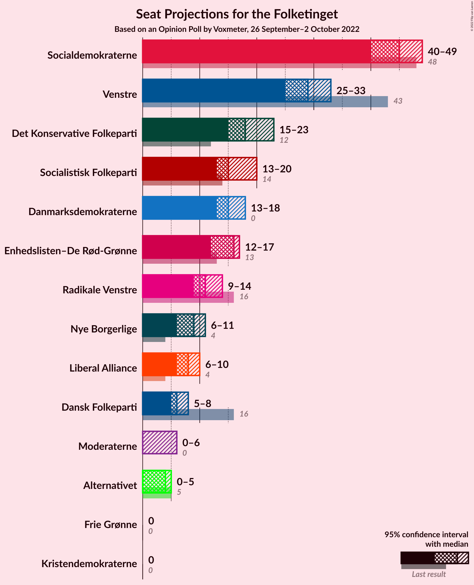
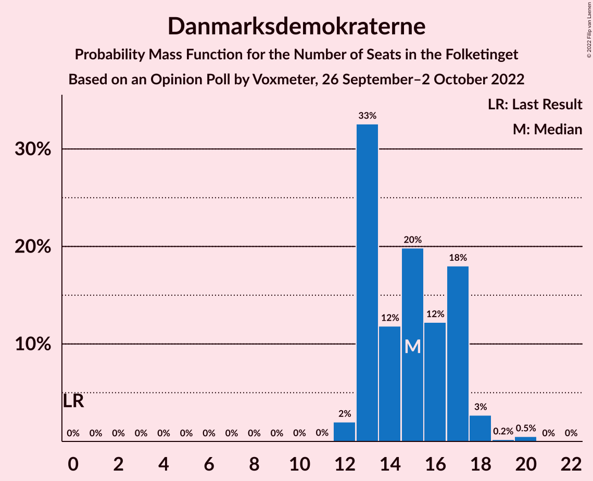
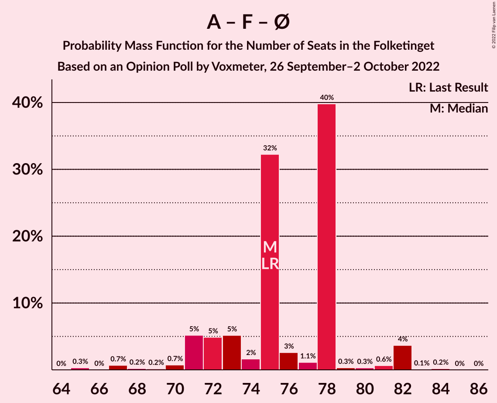
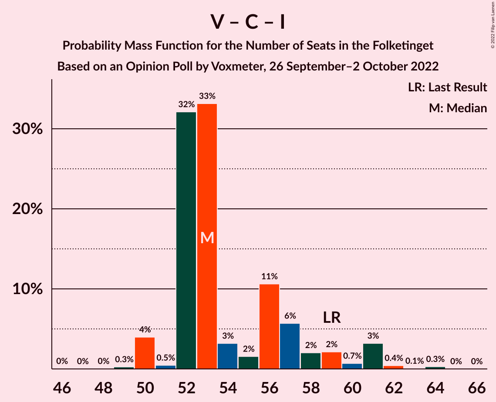

# Opinion Poll by Voxmeter, 26 September–2 October 2022

<a href="#voting-intentions">Voting Intentions</a> | <a href="#seats">Seats</a> | <a href="#coalitions">Coalitions</a> | <a href="#technical-information">Technical Information</a>

## Voting Intentions

### Confidence Intervals

| Party | Last Result | Poll Result | 80% Confidence Interval | 90% Confidence Interval | 95% Confidence Interval | 99% Confidence Interval |
|:-----:|:-----------:|:-----------:|:-----------------------:|:-----------------------:|:-----------------------:|:-----------------------:|
| Socialdemokraterne | 25.9% | 25.3% | 23.6–27.1% |23.1–27.6% |22.7–28.1% |21.9–29.0% |
| Venstre | 23.4% | 15.5% | 14.1–17.0% |13.7–17.5% |13.4–17.9% |12.7–18.6% |
| Det Konservative Folkeparti | 6.6% | 11.0% | 9.8–12.4% |9.5–12.7% |9.2–13.1% |8.7–13.8% |
| Socialistisk Folkeparti | 7.7% | 8.8% | 7.7–10.0% |7.4–10.4% |7.2–10.7% |6.7–11.3% |
| Danmarksdemokraterne | 0.0% | 8.4% | 7.4–9.6% |7.1–10.0% |6.8–10.3% |6.4–10.9% |
| Enhedslisten–De Rød-Grønne | 6.9% | 8.0% | 7.0–9.2% |6.7–9.5% |6.5–9.8% |6.0–10.5% |
| Radikale Venstre | 8.6% | 6.0% | 5.1–7.1% |4.9–7.4% |4.7–7.7% |4.3–8.2% |
| Nye Borgerlige | 2.4% | 4.7% | 3.9–5.7% |3.7–5.9% |3.6–6.2% |3.2–6.7% |
| Liberal Alliance | 2.3% | 4.2% | 3.5–5.1% |3.3–5.4% |3.1–5.6% |2.8–6.1% |
| Dansk Folkeparti | 8.7% | 3.3% | 2.7–4.1% |2.5–4.4% |2.3–4.6% |2.1–5.0% |
| Moderaterne | 0.0% | 2.2% | 1.7–2.9% |1.6–3.1% |1.4–3.3% |1.2–3.7% |
| Alternativet | 3.0% | 1.5% | 1.1–2.1% |1.0–2.3% |0.9–2.5% |0.7–2.8% |
| Kristendemokraterne | 1.7% | 0.7% | 0.5–1.2% |0.4–1.3% |0.3–1.4% |0.2–1.7% |
| Frie Grønne | 0.0% | 0.4% | 0.2–0.8% |0.2–0.9% |0.2–1.0% |0.1–1.3% |

*Note:* The poll result column reflects the actual value used in the calculations. Published results may vary slightly, and in addition be rounded to fewer digits.

## Seats

### Confidence Intervals

| Party | Last Result | Median | 80% Confidence Interval | 90% Confidence Interval | 95% Confidence Interval | 99% Confidence Interval |
|:-----:|:-----------:|:------:|:-----------------------:|:-----------------------:|:-----------------------:|:-----------------------:|
| <a href="#socialdemokraterne">Socialdemokraterne</a> | 48 | 45 | 42–49 |41–49 |40–49 |39–50 |
| <a href="#venstre">Venstre</a> | 43 | 29 | 25–30 |25–31 |25–33 |24–34 |
| <a href="#det-konservative-folkeparti">Det Konservative Folkeparti</a> | 12 | 18 | 15–21 |15–21 |15–23 |15–24 |
| <a href="#socialistisk-folkeparti">Socialistisk Folkeparti</a> | 14 | 15 | 13–20 |13–20 |13–20 |12–20 |
| <a href="#danmarksdemokraterne">Danmarksdemokraterne</a> | 0 | 15 | 13–17 |13–17 |13–18 |12–20 |
| <a href="#enhedslisten–de-rød-grønne">Enhedslisten–De Rød-Grønne</a> | 13 | 16 | 13–17 |12–17 |12–17 |11–19 |
| <a href="#radikale-venstre">Radikale Venstre</a> | 16 | 11 | 9–14 |9–14 |9–14 |7–16 |
| <a href="#nye-borgerlige">Nye Borgerlige</a> | 4 | 9 | 7–11 |6–11 |6–11 |5–11 |
| <a href="#liberal-alliance">Liberal Alliance</a> | 4 | 8 | 7–9 |6–9 |6–10 |5–10 |
| <a href="#dansk-folkeparti">Dansk Folkeparti</a> | 16 | 6 | 5–7 |5–8 |5–8 |4–9 |
| <a href="#moderaterne">Moderaterne</a> | 0 | 0 | 0–5 |0–5 |0–6 |0–6 |
| <a href="#alternativet">Alternativet</a> | 5 | 4 | 0–4 |0–5 |0–5 |0–5 |
| <a href="#kristendemokraterne">Kristendemokraterne</a> | 0 | 0 | 0 |0 |0 |0 |
| <a href="#frie-grønne">Frie Grønne</a> | 0 | 0 | 0 |0 |0 |0 |

### Socialdemokraterne

*For a full overview of the results for this party, see the [Socialdemokraterne](party-socialdemokraterne.html) page.*

| Number of Seats | Probability | Accumulated | Special Marks |
|:---------------:|:-----------:|:-----------:|:-------------:|
| 38 | 0.3% | 100% |  |
| 39 | 1.1% | 99.7% |  |
| 40 | 1.5% | 98.6% |  |
| 41 | 5% | 97% |  |
| 42 | 4% | 92% |  |
| 43 | 2% | 89% |  |
| 44 | 36% | 86% |  |
| 45 | 17% | 50% | Median |
| 46 | 1.1% | 34% |  |
| 47 | 13% | 33% |  |
| 48 | 1.5% | 19% | Last Result |
| 49 | 16% | 18% |  |
| 50 | 0.8% | 1.1% |  |
| 51 | 0.2% | 0.3% |  |
| 52 | 0% | 0.1% |  |
| 53 | 0% | 0% |  |

### Venstre

*For a full overview of the results for this party, see the [Venstre](party-venstre.html) page.*

| Number of Seats | Probability | Accumulated | Special Marks |
|:---------------:|:-----------:|:-----------:|:-------------:|
| 21 | 0.1% | 100% |  |
| 22 | 0.1% | 99.9% |  |
| 23 | 0.3% | 99.9% |  |
| 24 | 1.1% | 99.6% |  |
| 25 | 21% | 98% |  |
| 26 | 1.1% | 78% |  |
| 27 | 13% | 77% |  |
| 28 | 3% | 63% |  |
| 29 | 49% | 60% | Median |
| 30 | 4% | 11% |  |
| 31 | 3% | 8% |  |
| 32 | 0.2% | 4% |  |
| 33 | 3% | 4% |  |
| 34 | 0.9% | 0.9% |  |
| 35 | 0% | 0% |  |
| 36 | 0% | 0% |  |
| 37 | 0% | 0% |  |
| 38 | 0% | 0% |  |
| 39 | 0% | 0% |  |
| 40 | 0% | 0% |  |
| 41 | 0% | 0% |  |
| 42 | 0% | 0% |  |
| 43 | 0% | 0% | Last Result |

### Det Konservative Folkeparti

*For a full overview of the results for this party, see the [Det Konservative Folkeparti](party-detkonservativefolkeparti.html) page.*

| Number of Seats | Probability | Accumulated | Special Marks |
|:---------------:|:-----------:|:-----------:|:-------------:|
| 12 | 0% | 100% | Last Result |
| 13 | 0% | 100% |  |
| 14 | 0.1% | 100% |  |
| 15 | 17% | 99.9% |  |
| 16 | 1.3% | 83% |  |
| 17 | 32% | 82% |  |
| 18 | 5% | 50% | Median |
| 19 | 21% | 45% |  |
| 20 | 7% | 24% |  |
| 21 | 12% | 17% |  |
| 22 | 2% | 5% |  |
| 23 | 2% | 3% |  |
| 24 | 0.4% | 0.7% |  |
| 25 | 0.2% | 0.2% |  |
| 26 | 0% | 0% |  |

### Socialistisk Folkeparti

*For a full overview of the results for this party, see the [Socialistisk Folkeparti](party-socialistiskfolkeparti.html) page.*

| Number of Seats | Probability | Accumulated | Special Marks |
|:---------------:|:-----------:|:-----------:|:-------------:|
| 11 | 0.1% | 100% |  |
| 12 | 0.7% | 99.9% |  |
| 13 | 9% | 99.3% |  |
| 14 | 11% | 90% | Last Result |
| 15 | 34% | 79% | Median |
| 16 | 20% | 45% |  |
| 17 | 3% | 25% |  |
| 18 | 5% | 22% |  |
| 19 | 1.3% | 17% |  |
| 20 | 15% | 15% |  |
| 21 | 0.1% | 0.1% |  |
| 22 | 0% | 0% |  |

### Danmarksdemokraterne

*For a full overview of the results for this party, see the [Danmarksdemokraterne](party-danmarksdemokraterne.html) page.*

| Number of Seats | Probability | Accumulated | Special Marks |
|:---------------:|:-----------:|:-----------:|:-------------:|
| 0 | 0% | 100% | Last Result |
| 1 | 0% | 100% |  |
| 2 | 0% | 100% |  |
| 3 | 0% | 100% |  |
| 4 | 0% | 100% |  |
| 5 | 0% | 100% |  |
| 6 | 0% | 100% |  |
| 7 | 0% | 100% |  |
| 8 | 0% | 100% |  |
| 9 | 0% | 100% |  |
| 10 | 0% | 100% |  |
| 11 | 0% | 100% |  |
| 12 | 2% | 99.9% |  |
| 13 | 33% | 98% |  |
| 14 | 12% | 65% |  |
| 15 | 20% | 54% | Median |
| 16 | 12% | 34% |  |
| 17 | 18% | 21% |  |
| 18 | 3% | 3% |  |
| 19 | 0.2% | 0.7% |  |
| 20 | 0.5% | 0.5% |  |
| 21 | 0% | 0% |  |

### Enhedslisten–De Rød-Grønne

*For a full overview of the results for this party, see the [Enhedslisten–De Rød-Grønne](party-enhedslisten–derød-grønne.html) page.*

| Number of Seats | Probability | Accumulated | Special Marks |
|:---------------:|:-----------:|:-----------:|:-------------:|
| 9 | 0.1% | 100% |  |
| 10 | 0.1% | 99.9% |  |
| 11 | 1.3% | 99.8% |  |
| 12 | 4% | 98.5% |  |
| 13 | 33% | 95% | Last Result |
| 14 | 3% | 62% |  |
| 15 | 5% | 60% |  |
| 16 | 40% | 54% | Median |
| 17 | 12% | 14% |  |
| 18 | 1.0% | 2% |  |
| 19 | 0.8% | 0.8% |  |
| 20 | 0% | 0% |  |

### Radikale Venstre

*For a full overview of the results for this party, see the [Radikale Venstre](party-radikalevenstre.html) page.*

| Number of Seats | Probability | Accumulated | Special Marks |
|:---------------:|:-----------:|:-----------:|:-------------:|
| 7 | 0.5% | 100% |  |
| 8 | 0.7% | 99.5% |  |
| 9 | 22% | 98.7% |  |
| 10 | 25% | 77% |  |
| 11 | 7% | 51% | Median |
| 12 | 7% | 44% |  |
| 13 | 3% | 38% |  |
| 14 | 34% | 35% |  |
| 15 | 0.2% | 0.8% |  |
| 16 | 0.7% | 0.7% | Last Result |
| 17 | 0% | 0% |  |

### Nye Borgerlige

*For a full overview of the results for this party, see the [Nye Borgerlige](party-nyeborgerlige.html) page.*

| Number of Seats | Probability | Accumulated | Special Marks |
|:---------------:|:-----------:|:-----------:|:-------------:|
| 4 | 0% | 100% | Last Result |
| 5 | 0.7% | 100% |  |
| 6 | 7% | 99.3% |  |
| 7 | 22% | 93% |  |
| 8 | 19% | 71% |  |
| 9 | 3% | 52% | Median |
| 10 | 32% | 49% |  |
| 11 | 17% | 18% |  |
| 12 | 0.2% | 0.4% |  |
| 13 | 0.2% | 0.2% |  |
| 14 | 0% | 0% |  |

### Liberal Alliance

*For a full overview of the results for this party, see the [Liberal Alliance](party-liberalalliance.html) page.*

| Number of Seats | Probability | Accumulated | Special Marks |
|:---------------:|:-----------:|:-----------:|:-------------:|
| 4 | 0% | 100% | Last Result |
| 5 | 2% | 100% |  |
| 6 | 6% | 98% |  |
| 7 | 38% | 92% |  |
| 8 | 42% | 55% | Median |
| 9 | 9% | 12% |  |
| 10 | 3% | 3% |  |
| 11 | 0.3% | 0.3% |  |
| 12 | 0% | 0% |  |

### Dansk Folkeparti

*For a full overview of the results for this party, see the [Dansk Folkeparti](party-danskfolkeparti.html) page.*

| Number of Seats | Probability | Accumulated | Special Marks |
|:---------------:|:-----------:|:-----------:|:-------------:|
| 0 | 0.2% | 100% |  |
| 1 | 0% | 99.8% |  |
| 2 | 0% | 99.8% |  |
| 3 | 0% | 99.8% |  |
| 4 | 0.7% | 99.8% |  |
| 5 | 31% | 99.1% |  |
| 6 | 54% | 68% | Median |
| 7 | 8% | 14% |  |
| 8 | 5% | 6% |  |
| 9 | 0.5% | 0.6% |  |
| 10 | 0.2% | 0.2% |  |
| 11 | 0% | 0% |  |
| 12 | 0% | 0% |  |
| 13 | 0% | 0% |  |
| 14 | 0% | 0% |  |
| 15 | 0% | 0% |  |
| 16 | 0% | 0% | Last Result |

### Moderaterne

*For a full overview of the results for this party, see the [Moderaterne](party-moderaterne.html) page.*

| Number of Seats | Probability | Accumulated | Special Marks |
|:---------------:|:-----------:|:-----------:|:-------------:|
| 0 | 59% | 100% | Last Result, Median |
| 1 | 0% | 41% |  |
| 2 | 0% | 41% |  |
| 3 | 0% | 41% |  |
| 4 | 16% | 41% |  |
| 5 | 23% | 26% |  |
| 6 | 2% | 3% |  |
| 7 | 0.4% | 0.5% |  |
| 8 | 0% | 0% |  |

### Alternativet

*For a full overview of the results for this party, see the [Alternativet](party-alternativet.html) page.*

| Number of Seats | Probability | Accumulated | Special Marks |
|:---------------:|:-----------:|:-----------:|:-------------:|
| 0 | 41% | 100% |  |
| 1 | 0% | 59% |  |
| 2 | 0% | 59% |  |
| 3 | 0% | 59% |  |
| 4 | 50% | 59% | Median |
| 5 | 8% | 8% | Last Result |
| 6 | 0% | 0% |  |

### Kristendemokraterne

*For a full overview of the results for this party, see the [Kristendemokraterne](party-kristendemokraterne.html) page.*

| Number of Seats | Probability | Accumulated | Special Marks |
|:---------------:|:-----------:|:-----------:|:-------------:|
| 0 | 99.9% | 100% | Last Result, Median |
| 1 | 0% | 0.1% |  |
| 2 | 0% | 0.1% |  |
| 3 | 0% | 0.1% |  |
| 4 | 0.1% | 0.1% |  |
| 5 | 0% | 0% |  |

### Frie Grønne

*For a full overview of the results for this party, see the [Frie Grønne](party-friegrønne.html) page.*

| Number of Seats | Probability | Accumulated | Special Marks |
|:---------------:|:-----------:|:-----------:|:-------------:|
| 0 | 100% | 100% | Last Result, Median |

## Coalitions

### Confidence Intervals

| Coalition | Last Result | Median | Majority? | 80% Confidence Interval | 90% Confidence Interval | 95% Confidence Interval | 99% Confidence Interval |
|:---------:|:-----------:|:------:|:---------:|:-----------------------:|:-----------------------:|:-----------------------:|:-----------------------:|
| Socialdemokraterne – Socialistisk Folkeparti – Enhedslisten–De Rød-Grønne – Radikale Venstre – Alternativet | 96 | 91 | 60% | 85–93 | 83–93 | 82–93 | 78–95 |
| Socialdemokraterne – Socialistisk Folkeparti – Enhedslisten–De Rød-Grønne – Radikale Venstre | 91 | 88 | 6% | 84–89 | 83–90 | 82–91 | 78–94 |
| Venstre – Det Konservative Folkeparti – Danmarksdemokraterne – Nye Borgerlige – Liberal Alliance – Dansk Folkeparti – Kristendemokraterne | 79 | 82 | 2% | 82–87 | 80–88 | 80–88 | 77–93 |
| Socialdemokraterne – Socialistisk Folkeparti – Enhedslisten–De Rød-Grønne – Alternativet | 80 | 79 | 0% | 72–82 | 71–83 | 71–83 | 69–83 |
| Socialdemokraterne – Socialistisk Folkeparti – Enhedslisten–De Rød-Grønne | 75 | 75 | 0% | 72–78 | 71–79 | 71–82 | 67–82 |
| Socialdemokraterne – Socialistisk Folkeparti – Radikale Venstre | 78 | 73 | 0% | 69–75 | 68–75 | 67–75 | 65–77 |
| Venstre – Det Konservative Folkeparti – Nye Borgerlige – Liberal Alliance – Dansk Folkeparti – Kristendemokraterne | 79 | 69 | 0% | 65–71 | 65–72 | 64–75 | 64–77 |
| Venstre – Det Konservative Folkeparti – Nye Borgerlige – Liberal Alliance – Dansk Folkeparti | 79 | 69 | 0% | 65–71 | 65–72 | 64–75 | 64–77 |
| Venstre – Det Konservative Folkeparti – Liberal Alliance – Dansk Folkeparti – Kristendemokraterne | 75 | 59 | 0% | 57–64 | 57–66 | 57–66 | 56–68 |
| Venstre – Det Konservative Folkeparti – Liberal Alliance – Dansk Folkeparti | 75 | 59 | 0% | 57–64 | 57–66 | 57–66 | 56–68 |
| Venstre – Det Konservative Folkeparti – Liberal Alliance | 59 | 53 | 0% | 52–57 | 52–59 | 50–61 | 50–62 |
| Socialdemokraterne – Radikale Venstre | 64 | 58 | 0% | 54–59 | 52–59 | 52–59 | 48–62 |
| Venstre – Det Konservative Folkeparti | 55 | 46 | 0% | 44–50 | 43–52 | 43–52 | 42–54 |
| Venstre | 43 | 29 | 0% | 25–30 | 25–31 | 25–33 | 24–34 |

### Socialdemokraterne – Socialistisk Folkeparti – Enhedslisten–De Rød-Grønne – Radikale Venstre – Alternativet

| Number of Seats | Probability | Accumulated | Special Marks |
|:---------------:|:-----------:|:-----------:|:-------------:|
| 78 | 0.7% | 100% |  |
| 79 | 0.2% | 99.3% |  |
| 80 | 0.1% | 99.1% |  |
| 81 | 0.4% | 99.0% |  |
| 82 | 2% | 98.6% |  |
| 83 | 4% | 96% |  |
| 84 | 2% | 92% |  |
| 85 | 6% | 90% |  |
| 86 | 0.7% | 84% |  |
| 87 | 3% | 83% |  |
| 88 | 19% | 80% |  |
| 89 | 1.4% | 61% |  |
| 90 | 0.2% | 60% | Majority |
| 91 | 19% | 60% | Median |
| 92 | 0.2% | 40% |  |
| 93 | 39% | 40% |  |
| 94 | 0.7% | 1.4% |  |
| 95 | 0.7% | 0.7% |  |
| 96 | 0% | 0% | Last Result |

### Socialdemokraterne – Socialistisk Folkeparti – Enhedslisten–De Rød-Grønne – Radikale Venstre

| Number of Seats | Probability | Accumulated | Special Marks |
|:---------------:|:-----------:|:-----------:|:-------------:|
| 74 | 0.3% | 100% |  |
| 75 | 0% | 99.7% |  |
| 76 | 0% | 99.7% |  |
| 77 | 0% | 99.7% |  |
| 78 | 0.5% | 99.7% |  |
| 79 | 0.2% | 99.2% |  |
| 80 | 0.2% | 99.0% |  |
| 81 | 0.4% | 98.8% |  |
| 82 | 2% | 98% |  |
| 83 | 6% | 96% |  |
| 84 | 4% | 90% |  |
| 85 | 6% | 87% |  |
| 86 | 0.6% | 80% |  |
| 87 | 18% | 80% | Median |
| 88 | 24% | 62% |  |
| 89 | 33% | 38% |  |
| 90 | 0.8% | 6% | Majority |
| 91 | 4% | 5% | Last Result |
| 92 | 0.2% | 1.1% |  |
| 93 | 0.1% | 0.9% |  |
| 94 | 0.6% | 0.8% |  |
| 95 | 0.1% | 0.1% |  |
| 96 | 0% | 0% |  |

### Venstre – Det Konservative Folkeparti – Danmarksdemokraterne – Nye Borgerlige – Liberal Alliance – Dansk Folkeparti – Kristendemokraterne

| Number of Seats | Probability | Accumulated | Special Marks |
|:---------------:|:-----------:|:-----------:|:-------------:|
| 76 | 0% | 100% |  |
| 77 | 0.5% | 99.9% |  |
| 78 | 0.3% | 99.5% |  |
| 79 | 0.1% | 99.2% | Last Result |
| 80 | 4% | 99.1% |  |
| 81 | 0.9% | 95% |  |
| 82 | 56% | 94% |  |
| 83 | 3% | 38% |  |
| 84 | 16% | 34% |  |
| 85 | 0.4% | 18% | Median |
| 86 | 6% | 18% |  |
| 87 | 7% | 12% |  |
| 88 | 3% | 5% |  |
| 89 | 0.1% | 2% |  |
| 90 | 0.1% | 2% | Majority |
| 91 | 0.2% | 2% |  |
| 92 | 0.5% | 2% |  |
| 93 | 0.8% | 1.2% |  |
| 94 | 0.3% | 0.4% |  |
| 95 | 0.1% | 0.1% |  |
| 96 | 0.1% | 0.1% |  |
| 97 | 0% | 0% |  |

### Socialdemokraterne – Socialistisk Folkeparti – Enhedslisten–De Rød-Grønne – Alternativet

| Number of Seats | Probability | Accumulated | Special Marks |
|:---------------:|:-----------:|:-----------:|:-------------:|
| 68 | 0.1% | 100% |  |
| 69 | 0.5% | 99.8% |  |
| 70 | 0.7% | 99.4% |  |
| 71 | 5% | 98.6% |  |
| 72 | 5% | 94% |  |
| 73 | 5% | 89% |  |
| 74 | 1.3% | 84% |  |
| 75 | 0.4% | 83% |  |
| 76 | 3% | 83% |  |
| 77 | 2% | 79% |  |
| 78 | 17% | 78% |  |
| 79 | 32% | 61% |  |
| 80 | 0.3% | 28% | Last Result, Median |
| 81 | 0.8% | 28% |  |
| 82 | 19% | 27% |  |
| 83 | 8% | 8% |  |
| 84 | 0.2% | 0.3% |  |
| 85 | 0% | 0.1% |  |
| 86 | 0% | 0% |  |

### Socialdemokraterne – Socialistisk Folkeparti – Enhedslisten–De Rød-Grønne

| Number of Seats | Probability | Accumulated | Special Marks |
|:---------------:|:-----------:|:-----------:|:-------------:|
| 65 | 0.3% | 100% |  |
| 66 | 0% | 99.7% |  |
| 67 | 0.7% | 99.7% |  |
| 68 | 0.2% | 99.0% |  |
| 69 | 0.2% | 98.8% |  |
| 70 | 0.7% | 98.6% |  |
| 71 | 5% | 98% |  |
| 72 | 5% | 93% |  |
| 73 | 5% | 88% |  |
| 74 | 2% | 83% |  |
| 75 | 32% | 81% | Last Result |
| 76 | 3% | 49% | Median |
| 77 | 1.1% | 46% |  |
| 78 | 40% | 45% |  |
| 79 | 0.3% | 5% |  |
| 80 | 0.3% | 5% |  |
| 81 | 0.6% | 5% |  |
| 82 | 4% | 4% |  |
| 83 | 0.1% | 0.3% |  |
| 84 | 0.2% | 0.2% |  |
| 85 | 0% | 0% |  |

### Socialdemokraterne – Socialistisk Folkeparti – Radikale Venstre

| Number of Seats | Probability | Accumulated | Special Marks |
|:---------------:|:-----------:|:-----------:|:-------------:|
| 61 | 0.1% | 100% |  |
| 62 | 0% | 99.9% |  |
| 63 | 0.3% | 99.9% |  |
| 64 | 0% | 99.6% |  |
| 65 | 0.5% | 99.6% |  |
| 66 | 0.6% | 99.1% |  |
| 67 | 2% | 98% |  |
| 68 | 4% | 96% |  |
| 69 | 7% | 92% |  |
| 70 | 2% | 85% |  |
| 71 | 10% | 83% | Median |
| 72 | 2% | 73% |  |
| 73 | 32% | 71% |  |
| 74 | 20% | 38% |  |
| 75 | 17% | 18% |  |
| 76 | 0.7% | 1.3% |  |
| 77 | 0.1% | 0.6% |  |
| 78 | 0.2% | 0.4% | Last Result |
| 79 | 0.1% | 0.2% |  |
| 80 | 0% | 0.1% |  |
| 81 | 0% | 0% |  |

### Venstre – Det Konservative Folkeparti – Nye Borgerlige – Liberal Alliance – Dansk Folkeparti – Kristendemokraterne

| Number of Seats | Probability | Accumulated | Special Marks |
|:---------------:|:-----------:|:-----------:|:-------------:|
| 62 | 0.1% | 100% |  |
| 63 | 0.1% | 99.9% |  |
| 64 | 4% | 99.8% |  |
| 65 | 18% | 96% |  |
| 66 | 1.0% | 78% |  |
| 67 | 2% | 77% |  |
| 68 | 9% | 75% |  |
| 69 | 48% | 66% |  |
| 70 | 6% | 19% | Median |
| 71 | 5% | 13% |  |
| 72 | 4% | 8% |  |
| 73 | 0.8% | 4% |  |
| 74 | 0.3% | 3% |  |
| 75 | 1.1% | 3% |  |
| 76 | 0.6% | 2% |  |
| 77 | 0.8% | 1.1% |  |
| 78 | 0% | 0.3% |  |
| 79 | 0% | 0.2% | Last Result |
| 80 | 0% | 0.2% |  |
| 81 | 0.2% | 0.2% |  |
| 82 | 0% | 0% |  |

### Venstre – Det Konservative Folkeparti – Nye Borgerlige – Liberal Alliance – Dansk Folkeparti

| Number of Seats | Probability | Accumulated | Special Marks |
|:---------------:|:-----------:|:-----------:|:-------------:|
| 61 | 0.1% | 100% |  |
| 62 | 0.1% | 99.9% |  |
| 63 | 0.1% | 99.9% |  |
| 64 | 4% | 99.8% |  |
| 65 | 18% | 96% |  |
| 66 | 1.0% | 78% |  |
| 67 | 2% | 77% |  |
| 68 | 9% | 75% |  |
| 69 | 48% | 66% |  |
| 70 | 6% | 19% | Median |
| 71 | 5% | 13% |  |
| 72 | 4% | 8% |  |
| 73 | 0.8% | 4% |  |
| 74 | 0.3% | 3% |  |
| 75 | 1.1% | 3% |  |
| 76 | 0.6% | 2% |  |
| 77 | 0.8% | 1.1% |  |
| 78 | 0% | 0.3% |  |
| 79 | 0% | 0.2% | Last Result |
| 80 | 0% | 0.2% |  |
| 81 | 0.2% | 0.2% |  |
| 82 | 0% | 0% |  |

### Venstre – Det Konservative Folkeparti – Liberal Alliance – Dansk Folkeparti – Kristendemokraterne

| Number of Seats | Probability | Accumulated | Special Marks |
|:---------------:|:-----------:|:-----------:|:-------------:|
| 54 | 0.1% | 100% |  |
| 55 | 0.2% | 99.9% |  |
| 56 | 0.2% | 99.6% |  |
| 57 | 20% | 99.5% |  |
| 58 | 17% | 79% |  |
| 59 | 33% | 63% |  |
| 60 | 3% | 30% |  |
| 61 | 9% | 27% | Median |
| 62 | 0.6% | 18% |  |
| 63 | 4% | 18% |  |
| 64 | 8% | 14% |  |
| 65 | 0.1% | 5% |  |
| 66 | 4% | 5% |  |
| 67 | 0.5% | 2% |  |
| 68 | 1.0% | 1.3% |  |
| 69 | 0.1% | 0.4% |  |
| 70 | 0.2% | 0.3% |  |
| 71 | 0% | 0% |  |
| 72 | 0% | 0% |  |
| 73 | 0% | 0% |  |
| 74 | 0% | 0% |  |
| 75 | 0% | 0% | Last Result |

### Venstre – Det Konservative Folkeparti – Liberal Alliance – Dansk Folkeparti

| Number of Seats | Probability | Accumulated | Special Marks |
|:---------------:|:-----------:|:-----------:|:-------------:|
| 53 | 0% | 100% |  |
| 54 | 0.1% | 99.9% |  |
| 55 | 0.2% | 99.8% |  |
| 56 | 0.2% | 99.6% |  |
| 57 | 20% | 99.5% |  |
| 58 | 17% | 79% |  |
| 59 | 33% | 63% |  |
| 60 | 3% | 30% |  |
| 61 | 9% | 27% | Median |
| 62 | 0.6% | 18% |  |
| 63 | 4% | 18% |  |
| 64 | 8% | 14% |  |
| 65 | 0.1% | 5% |  |
| 66 | 4% | 5% |  |
| 67 | 0.5% | 2% |  |
| 68 | 1.0% | 1.3% |  |
| 69 | 0.1% | 0.4% |  |
| 70 | 0.2% | 0.3% |  |
| 71 | 0% | 0% |  |
| 72 | 0% | 0% |  |
| 73 | 0% | 0% |  |
| 74 | 0% | 0% |  |
| 75 | 0% | 0% | Last Result |

### Venstre – Det Konservative Folkeparti – Liberal Alliance

| Number of Seats | Probability | Accumulated | Special Marks |
|:---------------:|:-----------:|:-----------:|:-------------:|
| 47 | 0% | 100% |  |
| 48 | 0% | 99.9% |  |
| 49 | 0.3% | 99.9% |  |
| 50 | 4% | 99.6% |  |
| 51 | 0.5% | 96% |  |
| 52 | 32% | 95% |  |
| 53 | 33% | 63% |  |
| 54 | 3% | 30% |  |
| 55 | 2% | 27% | Median |
| 56 | 11% | 25% |  |
| 57 | 6% | 15% |  |
| 58 | 2% | 9% |  |
| 59 | 2% | 7% | Last Result |
| 60 | 0.7% | 5% |  |
| 61 | 3% | 4% |  |
| 62 | 0.4% | 0.8% |  |
| 63 | 0.1% | 0.4% |  |
| 64 | 0.3% | 0.3% |  |
| 65 | 0% | 0% |  |

### Socialdemokraterne – Radikale Venstre

| Number of Seats | Probability | Accumulated | Special Marks |
|:---------------:|:-----------:|:-----------:|:-------------:|
| 48 | 0.8% | 100% |  |
| 49 | 0.2% | 99.2% |  |
| 50 | 0.6% | 99.1% |  |
| 51 | 0.9% | 98% |  |
| 52 | 5% | 98% |  |
| 53 | 2% | 93% |  |
| 54 | 16% | 91% |  |
| 55 | 4% | 75% |  |
| 56 | 10% | 71% | Median |
| 57 | 7% | 61% |  |
| 58 | 34% | 53% |  |
| 59 | 18% | 20% |  |
| 60 | 1.0% | 2% |  |
| 61 | 0.2% | 0.9% |  |
| 62 | 0.6% | 0.8% |  |
| 63 | 0% | 0.2% |  |
| 64 | 0% | 0.2% | Last Result |
| 65 | 0.1% | 0.1% |  |
| 66 | 0% | 0% |  |

### Venstre – Det Konservative Folkeparti

| Number of Seats | Probability | Accumulated | Special Marks |
|:---------------:|:-----------:|:-----------:|:-------------:|
| 40 | 0% | 100% |  |
| 41 | 0.1% | 99.9% |  |
| 42 | 0.4% | 99.9% |  |
| 43 | 4% | 99.5% |  |
| 44 | 32% | 95% |  |
| 45 | 0.6% | 63% |  |
| 46 | 33% | 62% |  |
| 47 | 3% | 29% | Median |
| 48 | 15% | 26% |  |
| 49 | 0.8% | 12% |  |
| 50 | 3% | 11% |  |
| 51 | 1.3% | 7% |  |
| 52 | 4% | 6% |  |
| 53 | 0.5% | 2% |  |
| 54 | 1.3% | 2% |  |
| 55 | 0% | 0.3% | Last Result |
| 56 | 0% | 0.2% |  |
| 57 | 0.2% | 0.2% |  |
| 58 | 0% | 0% |  |

### Venstre

| Number of Seats | Probability | Accumulated | Special Marks |
|:---------------:|:-----------:|:-----------:|:-------------:|
| 21 | 0.1% | 100% |  |
| 22 | 0.1% | 99.9% |  |
| 23 | 0.3% | 99.9% |  |
| 24 | 1.1% | 99.6% |  |
| 25 | 21% | 98% |  |
| 26 | 1.1% | 78% |  |
| 27 | 13% | 77% |  |
| 28 | 3% | 63% |  |
| 29 | 49% | 60% | Median |
| 30 | 4% | 11% |  |
| 31 | 3% | 8% |  |
| 32 | 0.2% | 4% |  |
| 33 | 3% | 4% |  |
| 34 | 0.9% | 0.9% |  |
| 35 | 0% | 0% |  |
| 36 | 0% | 0% |  |
| 37 | 0% | 0% |  |
| 38 | 0% | 0% |  |
| 39 | 0% | 0% |  |
| 40 | 0% | 0% |  |
| 41 | 0% | 0% |  |
| 42 | 0% | 0% |  |
| 43 | 0% | 0% | Last Result |

## Technical Information

### Opinion Poll

+ **Polling firm:** Voxmeter
+ **Commissioner(s):** —
+ **Fieldwork period:** 26 September–2 October 2022

### Calculations

+ **Sample size:** 1001
+ **Simulations done:** 1,048,576
+ **Error estimate:** 3.06%

