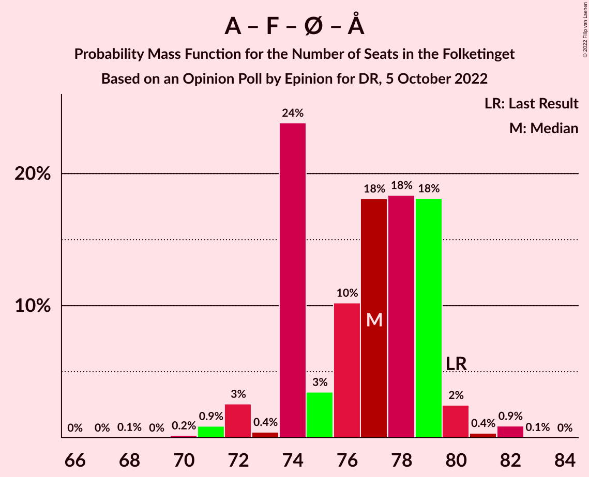

# Opinion Poll by Epinion for DR, 5 October 2022

<a href="#voting-intentions">Voting Intentions</a> | <a href="#seats">Seats</a> | <a href="#coalitions">Coalitions</a> | <a href="#technical-information">Technical Information</a>

## Voting Intentions

### Confidence Intervals

| Party | Last Result | Poll Result | 80% Confidence Interval | 90% Confidence Interval | 95% Confidence Interval | 99% Confidence Interval |
|:-----:|:-----------:|:-----------:|:-----------------------:|:-----------------------:|:-----------------------:|:-----------------------:|
| Socialdemokraterne | 25.9% | 27.3% | 26.0–28.7% |25.7–29.0% |25.4–29.4% |24.8–30.0% |
| Venstre | 23.4% | 12.7% | 11.8–13.7% |11.5–14.0% |11.3–14.3% |10.9–14.8% |
| Det Konservative Folkeparti | 6.6% | 11.2% | 10.3–12.2% |10.1–12.5% |9.9–12.7% |9.4–13.2% |
| Danmarksdemokraterne | 0.0% | 10.3% | 9.5–11.3% |9.2–11.5% |9.0–11.8% |8.6–12.2% |
| Socialistisk Folkeparti | 7.7% | 8.1% | 7.4–9.0% |7.1–9.2% |7.0–9.4% |6.6–9.9% |
| Enhedslisten–De Rød-Grønne | 6.9% | 6.7% | 6.0–7.5% |5.8–7.7% |5.7–7.9% |5.3–8.3% |
| Nye Borgerlige | 2.4% | 6.3% | 5.6–7.1% |5.4–7.3% |5.3–7.5% |5.0–7.8% |
| Radikale Venstre | 8.6% | 4.9% | 4.3–5.6% |4.2–5.8% |4.0–6.0% |3.8–6.3% |
| Liberal Alliance | 2.3% | 4.1% | 3.6–4.7% |3.4–4.9% |3.3–5.1% |3.0–5.4% |
| Moderaterne | 0.0% | 3.7% | 3.2–4.3% |3.1–4.5% |3.0–4.7% |2.7–5.0% |
| Dansk Folkeparti | 8.7% | 1.8% | 1.4–2.2% |1.3–2.4% |1.3–2.5% |1.1–2.7% |
| Alternativet | 3.0% | 1.3% | 1.0–1.7% |0.9–1.8% |0.9–1.9% |0.8–2.1% |
| Frie Grønne | 0.0% | 0.7% | 0.5–1.0% |0.4–1.1% |0.4–1.2% |0.3–1.3% |
| Kristendemokraterne | 1.7% | 0.4% | 0.3–0.7% |0.2–0.8% |0.2–0.8% |0.2–1.0% |

*Note:* The poll result column reflects the actual value used in the calculations. Published results may vary slightly, and in addition be rounded to fewer digits.

## Seats

### Confidence Intervals

| Party | Last Result | Median | 80% Confidence Interval | 90% Confidence Interval | 95% Confidence Interval | 99% Confidence Interval |
|:-----:|:-----------:|:------:|:-----------------------:|:-----------------------:|:-----------------------:|:-----------------------:|
| <a href="#socialdemokraterne">Socialdemokraterne</a> | 48 | 49 | 48–52 |47–52 |46–53 |44–55 |
| <a href="#venstre">Venstre</a> | 43 | 24 | 20–25 |20–25 |19–26 |19–26 |
| <a href="#det-konservative-folkeparti">Det Konservative Folkeparti</a> | 12 | 21 | 19–22 |19–23 |18–24 |16–25 |
| <a href="#danmarksdemokraterne">Danmarksdemokraterne</a> | 0 | 19 | 18–21 |17–21 |16–21 |16–21 |
| <a href="#socialistisk-folkeparti">Socialistisk Folkeparti</a> | 14 | 15 | 13–17 |13–17 |12–17 |12–17 |
| <a href="#enhedslisten–de-rød-grønne">Enhedslisten–De Rød-Grønne</a> | 13 | 13 | 11–14 |11–14 |10–14 |10–15 |
| <a href="#nye-borgerlige">Nye Borgerlige</a> | 4 | 12 | 10–14 |10–14 |10–14 |9–14 |
| <a href="#radikale-venstre">Radikale Venstre</a> | 16 | 9 | 8–10 |8–11 |8–11 |7–12 |
| <a href="#liberal-alliance">Liberal Alliance</a> | 4 | 7 | 6–9 |6–9 |6–9 |5–10 |
| <a href="#moderaterne">Moderaterne</a> | 0 | 6 | 5–8 |5–8 |5–8 |5–9 |
| <a href="#dansk-folkeparti">Dansk Folkeparti</a> | 16 | 0 | 0–4 |0–4 |0–4 |0–6 |
| <a href="#alternativet">Alternativet</a> | 5 | 0 | 0 |0 |0 |0–4 |
| <a href="#frie-grønne">Frie Grønne</a> | 0 | 0 | 0 |0 |0 |0 |
| <a href="#kristendemokraterne">Kristendemokraterne</a> | 0 | 0 | 0 |0 |0 |0 |

### Socialdemokraterne

*For a full overview of the results for this party, see the [Socialdemokraterne](party-socialdemokraterne.html) page.*

| Number of Seats | Probability | Accumulated | Special Marks |
|:---------------:|:-----------:|:-----------:|:-------------:|
| 44 | 0.5% | 100% |  |
| 45 | 0.9% | 99.4% |  |
| 46 | 2% | 98.5% |  |
| 47 | 6% | 97% |  |
| 48 | 16% | 91% | Last Result |
| 49 | 40% | 75% | Median |
| 50 | 18% | 35% |  |
| 51 | 1.0% | 18% |  |
| 52 | 13% | 16% |  |
| 53 | 3% | 4% |  |
| 54 | 0.2% | 1.0% |  |
| 55 | 0.6% | 0.7% |  |
| 56 | 0% | 0.1% |  |
| 57 | 0.1% | 0.1% |  |
| 58 | 0% | 0% |  |

### Venstre

*For a full overview of the results for this party, see the [Venstre](party-venstre.html) page.*

| Number of Seats | Probability | Accumulated | Special Marks |
|:---------------:|:-----------:|:-----------:|:-------------:|
| 18 | 0.1% | 100% |  |
| 19 | 3% | 99.9% |  |
| 20 | 16% | 97% |  |
| 21 | 6% | 81% |  |
| 22 | 4% | 74% |  |
| 23 | 8% | 71% |  |
| 24 | 45% | 62% | Median |
| 25 | 13% | 17% |  |
| 26 | 4% | 4% |  |
| 27 | 0.1% | 0.1% |  |
| 28 | 0% | 0% |  |
| 29 | 0% | 0% |  |
| 30 | 0% | 0% |  |
| 31 | 0% | 0% |  |
| 32 | 0% | 0% |  |
| 33 | 0% | 0% |  |
| 34 | 0% | 0% |  |
| 35 | 0% | 0% |  |
| 36 | 0% | 0% |  |
| 37 | 0% | 0% |  |
| 38 | 0% | 0% |  |
| 39 | 0% | 0% |  |
| 40 | 0% | 0% |  |
| 41 | 0% | 0% |  |
| 42 | 0% | 0% |  |
| 43 | 0% | 0% | Last Result |

### Det Konservative Folkeparti

*For a full overview of the results for this party, see the [Det Konservative Folkeparti](party-detkonservativefolkeparti.html) page.*

| Number of Seats | Probability | Accumulated | Special Marks |
|:---------------:|:-----------:|:-----------:|:-------------:|
| 12 | 0% | 100% | Last Result |
| 13 | 0% | 100% |  |
| 14 | 0% | 100% |  |
| 15 | 0% | 100% |  |
| 16 | 0.9% | 100% |  |
| 17 | 0.4% | 99.1% |  |
| 18 | 3% | 98.7% |  |
| 19 | 26% | 96% |  |
| 20 | 18% | 70% |  |
| 21 | 18% | 52% | Median |
| 22 | 29% | 34% |  |
| 23 | 2% | 5% |  |
| 24 | 1.4% | 4% |  |
| 25 | 2% | 2% |  |
| 26 | 0% | 0% |  |

### Danmarksdemokraterne

*For a full overview of the results for this party, see the [Danmarksdemokraterne](party-danmarksdemokraterne.html) page.*

| Number of Seats | Probability | Accumulated | Special Marks |
|:---------------:|:-----------:|:-----------:|:-------------:|
| 0 | 0% | 100% | Last Result |
| 1 | 0% | 100% |  |
| 2 | 0% | 100% |  |
| 3 | 0% | 100% |  |
| 4 | 0% | 100% |  |
| 5 | 0% | 100% |  |
| 6 | 0% | 100% |  |
| 7 | 0% | 100% |  |
| 8 | 0% | 100% |  |
| 9 | 0% | 100% |  |
| 10 | 0% | 100% |  |
| 11 | 0% | 100% |  |
| 12 | 0% | 100% |  |
| 13 | 0% | 100% |  |
| 14 | 0% | 100% |  |
| 15 | 0.1% | 100% |  |
| 16 | 4% | 99.8% |  |
| 17 | 3% | 96% |  |
| 18 | 31% | 93% |  |
| 19 | 27% | 62% | Median |
| 20 | 14% | 34% |  |
| 21 | 20% | 20% |  |
| 22 | 0.3% | 0.4% |  |
| 23 | 0.1% | 0.1% |  |
| 24 | 0% | 0% |  |

### Socialistisk Folkeparti

*For a full overview of the results for this party, see the [Socialistisk Folkeparti](party-socialistiskfolkeparti.html) page.*

| Number of Seats | Probability | Accumulated | Special Marks |
|:---------------:|:-----------:|:-----------:|:-------------:|
| 11 | 0.1% | 100% |  |
| 12 | 4% | 99.9% |  |
| 13 | 13% | 96% |  |
| 14 | 24% | 83% | Last Result |
| 15 | 27% | 58% | Median |
| 16 | 18% | 31% |  |
| 17 | 13% | 13% |  |
| 18 | 0.1% | 0.4% |  |
| 19 | 0.2% | 0.2% |  |
| 20 | 0% | 0% |  |

### Enhedslisten–De Rød-Grønne

*For a full overview of the results for this party, see the [Enhedslisten–De Rød-Grønne](party-enhedslisten–derød-grønne.html) page.*

| Number of Seats | Probability | Accumulated | Special Marks |
|:---------------:|:-----------:|:-----------:|:-------------:|
| 9 | 0.2% | 100% |  |
| 10 | 4% | 99.8% |  |
| 11 | 32% | 96% |  |
| 12 | 13% | 63% |  |
| 13 | 27% | 50% | Last Result, Median |
| 14 | 22% | 23% |  |
| 15 | 0.6% | 0.7% |  |
| 16 | 0% | 0% |  |

### Nye Borgerlige

*For a full overview of the results for this party, see the [Nye Borgerlige](party-nyeborgerlige.html) page.*

| Number of Seats | Probability | Accumulated | Special Marks |
|:---------------:|:-----------:|:-----------:|:-------------:|
| 4 | 0% | 100% | Last Result |
| 5 | 0% | 100% |  |
| 6 | 0% | 100% |  |
| 7 | 0% | 100% |  |
| 8 | 0.1% | 100% |  |
| 9 | 1.2% | 99.9% |  |
| 10 | 11% | 98.7% |  |
| 11 | 9% | 88% |  |
| 12 | 29% | 79% | Median |
| 13 | 30% | 50% |  |
| 14 | 19% | 19% |  |
| 15 | 0.1% | 0.2% |  |
| 16 | 0.1% | 0.1% |  |
| 17 | 0% | 0% |  |

### Radikale Venstre

*For a full overview of the results for this party, see the [Radikale Venstre](party-radikalevenstre.html) page.*

| Number of Seats | Probability | Accumulated | Special Marks |
|:---------------:|:-----------:|:-----------:|:-------------:|
| 6 | 0.1% | 100% |  |
| 7 | 2% | 99.9% |  |
| 8 | 43% | 98% |  |
| 9 | 17% | 54% | Median |
| 10 | 32% | 38% |  |
| 11 | 4% | 6% |  |
| 12 | 2% | 2% |  |
| 13 | 0.1% | 0.1% |  |
| 14 | 0% | 0% |  |
| 15 | 0% | 0% |  |
| 16 | 0% | 0% | Last Result |

### Liberal Alliance

*For a full overview of the results for this party, see the [Liberal Alliance](party-liberalalliance.html) page.*

| Number of Seats | Probability | Accumulated | Special Marks |
|:---------------:|:-----------:|:-----------:|:-------------:|
| 4 | 0% | 100% | Last Result |
| 5 | 0.6% | 100% |  |
| 6 | 19% | 99.4% |  |
| 7 | 42% | 81% | Median |
| 8 | 29% | 39% |  |
| 9 | 9% | 10% |  |
| 10 | 1.1% | 1.1% |  |
| 11 | 0% | 0% |  |

### Moderaterne

*For a full overview of the results for this party, see the [Moderaterne](party-moderaterne.html) page.*

| Number of Seats | Probability | Accumulated | Special Marks |
|:---------------:|:-----------:|:-----------:|:-------------:|
| 0 | 0% | 100% | Last Result |
| 1 | 0% | 100% |  |
| 2 | 0% | 100% |  |
| 3 | 0% | 100% |  |
| 4 | 0% | 100% |  |
| 5 | 13% | 100% |  |
| 6 | 40% | 87% | Median |
| 7 | 31% | 47% |  |
| 8 | 14% | 16% |  |
| 9 | 2% | 2% |  |
| 10 | 0.1% | 0.1% |  |
| 11 | 0% | 0% |  |

### Dansk Folkeparti

*For a full overview of the results for this party, see the [Dansk Folkeparti](party-danskfolkeparti.html) page.*

| Number of Seats | Probability | Accumulated | Special Marks |
|:---------------:|:-----------:|:-----------:|:-------------:|
| 0 | 87% | 100% | Median |
| 1 | 0% | 13% |  |
| 2 | 0% | 13% |  |
| 3 | 0% | 13% |  |
| 4 | 12% | 13% |  |
| 5 | 0.4% | 1.1% |  |
| 6 | 0.6% | 0.6% |  |
| 7 | 0% | 0% |  |
| 8 | 0% | 0% |  |
| 9 | 0% | 0% |  |
| 10 | 0% | 0% |  |
| 11 | 0% | 0% |  |
| 12 | 0% | 0% |  |
| 13 | 0% | 0% |  |
| 14 | 0% | 0% |  |
| 15 | 0% | 0% |  |
| 16 | 0% | 0% | Last Result |

### Alternativet

*For a full overview of the results for this party, see the [Alternativet](party-alternativet.html) page.*

| Number of Seats | Probability | Accumulated | Special Marks |
|:---------------:|:-----------:|:-----------:|:-------------:|
| 0 | 98% | 100% | Median |
| 1 | 0% | 2% |  |
| 2 | 0% | 2% |  |
| 3 | 0% | 2% |  |
| 4 | 2% | 2% |  |
| 5 | 0% | 0% | Last Result |

### Frie Grønne

*For a full overview of the results for this party, see the [Frie Grønne](party-friegrønne.html) page.*

| Number of Seats | Probability | Accumulated | Special Marks |
|:---------------:|:-----------:|:-----------:|:-------------:|
| 0 | 100% | 100% | Last Result, Median |

### Kristendemokraterne

*For a full overview of the results for this party, see the [Kristendemokraterne](party-kristendemokraterne.html) page.*

| Number of Seats | Probability | Accumulated | Special Marks |
|:---------------:|:-----------:|:-----------:|:-------------:|
| 0 | 100% | 100% | Last Result, Median |

## Coalitions

### Confidence Intervals

| Coalition | Last Result | Median | Majority? | 80% Confidence Interval | 90% Confidence Interval | 95% Confidence Interval | 99% Confidence Interval |
|:---------:|:-----------:|:------:|:---------:|:-----------------------:|:-----------------------:|:-----------------------:|:-----------------------:|
| Socialdemokraterne – Socialistisk Folkeparti – Enhedslisten–De Rød-Grønne – Radikale Venstre – Alternativet | 96 | 86 | 2% | 82–89 | 82–89 | 81–89 | 79–91 |
| Socialdemokraterne – Socialistisk Folkeparti – Enhedslisten–De Rød-Grønne – Radikale Venstre | 91 | 86 | 2% | 82–89 | 82–89 | 81–89 | 79–91 |
| Venstre – Det Konservative Folkeparti – Danmarksdemokraterne – Nye Borgerlige – Liberal Alliance – Dansk Folkeparti – Kristendemokraterne | 79 | 83 | 0.2% | 80–87 | 80–87 | 79–87 | 78–89 |
| Socialdemokraterne – Socialistisk Folkeparti – Enhedslisten–De Rød-Grønne – Alternativet | 80 | 77 | 0% | 74–79 | 74–79 | 72–80 | 71–82 |
| Socialdemokraterne – Socialistisk Folkeparti – Enhedslisten–De Rød-Grønne | 75 | 77 | 0% | 74–79 | 74–79 | 72–80 | 71–82 |
| Socialdemokraterne – Socialistisk Folkeparti – Radikale Venstre | 78 | 73 | 0% | 71–75 | 70–76 | 68–78 | 66–78 |
| Venstre – Det Konservative Folkeparti – Nye Borgerlige – Liberal Alliance – Dansk Folkeparti – Kristendemokraterne | 79 | 63 | 0% | 61–68 | 61–68 | 59–68 | 58–70 |
| Venstre – Det Konservative Folkeparti – Nye Borgerlige – Liberal Alliance – Dansk Folkeparti | 79 | 63 | 0% | 61–68 | 61–68 | 59–68 | 58–70 |
| Socialdemokraterne – Radikale Venstre | 64 | 57 | 0% | 56–61 | 56–63 | 55–63 | 53–63 |
| Venstre – Det Konservative Folkeparti – Liberal Alliance – Dansk Folkeparti – Kristendemokraterne | 75 | 51 | 0% | 48–55 | 48–55 | 48–56 | 47–59 |
| Venstre – Det Konservative Folkeparti – Liberal Alliance – Dansk Folkeparti | 75 | 51 | 0% | 48–55 | 48–55 | 48–56 | 47–59 |
| Venstre – Det Konservative Folkeparti – Liberal Alliance | 59 | 50 | 0% | 48–55 | 47–55 | 47–55 | 46–55 |
| Venstre – Det Konservative Folkeparti | 55 | 43 | 0% | 41–47 | 41–47 | 38–48 | 38–49 |
| Venstre | 43 | 24 | 0% | 20–25 | 20–25 | 19–26 | 19–26 |

### Socialdemokraterne – Socialistisk Folkeparti – Enhedslisten–De Rød-Grønne – Radikale Venstre – Alternativet

| Number of Seats | Probability | Accumulated | Special Marks |
|:---------------:|:-----------:|:-----------:|:-------------:|
| 77 | 0.1% | 100% |  |
| 78 | 0.1% | 99.9% |  |
| 79 | 0.6% | 99.8% |  |
| 80 | 0.7% | 99.2% |  |
| 81 | 2% | 98.5% |  |
| 82 | 22% | 96% |  |
| 83 | 2% | 74% |  |
| 84 | 0.5% | 72% |  |
| 85 | 14% | 72% |  |
| 86 | 19% | 57% | Median |
| 87 | 16% | 38% |  |
| 88 | 2% | 22% |  |
| 89 | 18% | 20% |  |
| 90 | 0.2% | 2% | Majority |
| 91 | 2% | 2% |  |
| 92 | 0.1% | 0.2% |  |
| 93 | 0% | 0% |  |
| 94 | 0% | 0% |  |
| 95 | 0% | 0% |  |
| 96 | 0% | 0% | Last Result |

### Socialdemokraterne – Socialistisk Folkeparti – Enhedslisten–De Rød-Grønne – Radikale Venstre

| Number of Seats | Probability | Accumulated | Special Marks |
|:---------------:|:-----------:|:-----------:|:-------------:|
| 77 | 0.1% | 100% |  |
| 78 | 0.1% | 99.9% |  |
| 79 | 0.6% | 99.8% |  |
| 80 | 0.7% | 99.2% |  |
| 81 | 2% | 98% |  |
| 82 | 22% | 96% |  |
| 83 | 4% | 74% |  |
| 84 | 0.5% | 70% |  |
| 85 | 14% | 70% |  |
| 86 | 19% | 56% | Median |
| 87 | 14% | 37% |  |
| 88 | 2% | 22% |  |
| 89 | 18% | 20% |  |
| 90 | 0.2% | 2% | Majority |
| 91 | 2% | 2% | Last Result |
| 92 | 0.1% | 0.1% |  |
| 93 | 0% | 0% |  |

### Venstre – Det Konservative Folkeparti – Danmarksdemokraterne – Nye Borgerlige – Liberal Alliance – Dansk Folkeparti – Kristendemokraterne

| Number of Seats | Probability | Accumulated | Special Marks |
|:---------------:|:-----------:|:-----------:|:-------------:|
| 76 | 0.3% | 100% |  |
| 77 | 0.1% | 99.7% |  |
| 78 | 0.1% | 99.6% |  |
| 79 | 4% | 99.5% | Last Result |
| 80 | 17% | 95% |  |
| 81 | 6% | 78% |  |
| 82 | 21% | 72% |  |
| 83 | 21% | 51% | Median |
| 84 | 5% | 30% |  |
| 85 | 3% | 25% |  |
| 86 | 2% | 22% |  |
| 87 | 18% | 19% |  |
| 88 | 0.7% | 1.5% |  |
| 89 | 0.6% | 0.8% |  |
| 90 | 0.1% | 0.2% | Majority |
| 91 | 0.1% | 0.1% |  |
| 92 | 0% | 0% |  |

### Socialdemokraterne – Socialistisk Folkeparti – Enhedslisten–De Rød-Grønne – Alternativet

| Number of Seats | Probability | Accumulated | Special Marks |
|:---------------:|:-----------:|:-----------:|:-------------:|
| 68 | 0.1% | 100% |  |
| 69 | 0% | 99.9% |  |
| 70 | 0.2% | 99.9% |  |
| 71 | 0.9% | 99.8% |  |
| 72 | 3% | 98.9% |  |
| 73 | 0.4% | 96% |  |
| 74 | 24% | 96% |  |
| 75 | 3% | 72% |  |
| 76 | 10% | 69% |  |
| 77 | 18% | 58% | Median |
| 78 | 18% | 40% |  |
| 79 | 18% | 22% |  |
| 80 | 2% | 4% | Last Result |
| 81 | 0.4% | 1.3% |  |
| 82 | 0.9% | 1.0% |  |
| 83 | 0.1% | 0.1% |  |
| 84 | 0% | 0% |  |

### Socialdemokraterne – Socialistisk Folkeparti – Enhedslisten–De Rød-Grønne

| Number of Seats | Probability | Accumulated | Special Marks |
|:---------------:|:-----------:|:-----------:|:-------------:|
| 68 | 0.1% | 100% |  |
| 69 | 0% | 99.9% |  |
| 70 | 0.2% | 99.9% |  |
| 71 | 0.9% | 99.8% |  |
| 72 | 3% | 98.8% |  |
| 73 | 0.8% | 96% |  |
| 74 | 24% | 95% |  |
| 75 | 5% | 72% | Last Result |
| 76 | 10% | 67% |  |
| 77 | 18% | 57% | Median |
| 78 | 18% | 39% |  |
| 79 | 17% | 20% |  |
| 80 | 2% | 4% |  |
| 81 | 0.3% | 1.2% |  |
| 82 | 0.8% | 0.9% |  |
| 83 | 0% | 0% |  |

### Socialdemokraterne – Socialistisk Folkeparti – Radikale Venstre

| Number of Seats | Probability | Accumulated | Special Marks |
|:---------------:|:-----------:|:-----------:|:-------------:|
| 66 | 0.6% | 100% |  |
| 67 | 0.1% | 99.3% |  |
| 68 | 2% | 99.2% |  |
| 69 | 0.4% | 97% |  |
| 70 | 4% | 96% |  |
| 71 | 21% | 92% |  |
| 72 | 6% | 71% |  |
| 73 | 18% | 64% | Median |
| 74 | 12% | 46% |  |
| 75 | 26% | 34% |  |
| 76 | 4% | 8% |  |
| 77 | 0.8% | 4% |  |
| 78 | 3% | 3% | Last Result |
| 79 | 0.1% | 0.3% |  |
| 80 | 0.1% | 0.1% |  |
| 81 | 0% | 0% |  |

### Venstre – Det Konservative Folkeparti – Nye Borgerlige – Liberal Alliance – Dansk Folkeparti – Kristendemokraterne

| Number of Seats | Probability | Accumulated | Special Marks |
|:---------------:|:-----------:|:-----------:|:-------------:|
| 57 | 0.1% | 100% |  |
| 58 | 2% | 99.9% |  |
| 59 | 0.6% | 98% |  |
| 60 | 2% | 97% |  |
| 61 | 18% | 95% |  |
| 62 | 17% | 77% |  |
| 63 | 12% | 60% |  |
| 64 | 7% | 48% | Median |
| 65 | 13% | 41% |  |
| 66 | 3% | 27% |  |
| 67 | 5% | 24% |  |
| 68 | 18% | 19% |  |
| 69 | 0.3% | 1.3% |  |
| 70 | 0.9% | 1.0% |  |
| 71 | 0% | 0% |  |
| 72 | 0% | 0% |  |
| 73 | 0% | 0% |  |
| 74 | 0% | 0% |  |
| 75 | 0% | 0% |  |
| 76 | 0% | 0% |  |
| 77 | 0% | 0% |  |
| 78 | 0% | 0% |  |
| 79 | 0% | 0% | Last Result |

### Venstre – Det Konservative Folkeparti – Nye Borgerlige – Liberal Alliance – Dansk Folkeparti

| Number of Seats | Probability | Accumulated | Special Marks |
|:---------------:|:-----------:|:-----------:|:-------------:|
| 57 | 0.1% | 100% |  |
| 58 | 2% | 99.9% |  |
| 59 | 0.6% | 98% |  |
| 60 | 2% | 97% |  |
| 61 | 18% | 95% |  |
| 62 | 17% | 77% |  |
| 63 | 12% | 60% |  |
| 64 | 7% | 48% | Median |
| 65 | 13% | 41% |  |
| 66 | 3% | 27% |  |
| 67 | 5% | 24% |  |
| 68 | 18% | 19% |  |
| 69 | 0.3% | 1.3% |  |
| 70 | 0.9% | 1.0% |  |
| 71 | 0% | 0% |  |
| 72 | 0% | 0% |  |
| 73 | 0% | 0% |  |
| 74 | 0% | 0% |  |
| 75 | 0% | 0% |  |
| 76 | 0% | 0% |  |
| 77 | 0% | 0% |  |
| 78 | 0% | 0% |  |
| 79 | 0% | 0% | Last Result |

### Socialdemokraterne – Radikale Venstre

| Number of Seats | Probability | Accumulated | Special Marks |
|:---------------:|:-----------:|:-----------:|:-------------:|
| 51 | 0.1% | 100% |  |
| 52 | 0% | 99.9% |  |
| 53 | 0.6% | 99.8% |  |
| 54 | 0.5% | 99.2% |  |
| 55 | 2% | 98.8% |  |
| 56 | 7% | 97% |  |
| 57 | 41% | 90% |  |
| 58 | 11% | 48% | Median |
| 59 | 3% | 37% |  |
| 60 | 18% | 34% |  |
| 61 | 10% | 17% |  |
| 62 | 1.0% | 6% |  |
| 63 | 5% | 5% |  |
| 64 | 0.1% | 0.3% | Last Result |
| 65 | 0% | 0.1% |  |
| 66 | 0% | 0.1% |  |
| 67 | 0.1% | 0.1% |  |
| 68 | 0% | 0% |  |

### Venstre – Det Konservative Folkeparti – Liberal Alliance – Dansk Folkeparti – Kristendemokraterne

| Number of Seats | Probability | Accumulated | Special Marks |
|:---------------:|:-----------:|:-----------:|:-------------:|
| 46 | 0.2% | 100% |  |
| 47 | 2% | 99.8% |  |
| 48 | 16% | 98% |  |
| 49 | 3% | 82% |  |
| 50 | 27% | 79% |  |
| 51 | 6% | 53% |  |
| 52 | 4% | 46% | Median |
| 53 | 7% | 42% |  |
| 54 | 21% | 35% |  |
| 55 | 12% | 14% |  |
| 56 | 1.1% | 3% |  |
| 57 | 0.3% | 1.5% |  |
| 58 | 0.5% | 1.1% |  |
| 59 | 0.6% | 0.6% |  |
| 60 | 0% | 0% |  |
| 61 | 0% | 0% |  |
| 62 | 0% | 0% |  |
| 63 | 0% | 0% |  |
| 64 | 0% | 0% |  |
| 65 | 0% | 0% |  |
| 66 | 0% | 0% |  |
| 67 | 0% | 0% |  |
| 68 | 0% | 0% |  |
| 69 | 0% | 0% |  |
| 70 | 0% | 0% |  |
| 71 | 0% | 0% |  |
| 72 | 0% | 0% |  |
| 73 | 0% | 0% |  |
| 74 | 0% | 0% |  |
| 75 | 0% | 0% | Last Result |

### Venstre – Det Konservative Folkeparti – Liberal Alliance – Dansk Folkeparti

| Number of Seats | Probability | Accumulated | Special Marks |
|:---------------:|:-----------:|:-----------:|:-------------:|
| 46 | 0.2% | 100% |  |
| 47 | 2% | 99.8% |  |
| 48 | 16% | 98% |  |
| 49 | 3% | 82% |  |
| 50 | 27% | 79% |  |
| 51 | 6% | 53% |  |
| 52 | 4% | 46% | Median |
| 53 | 7% | 42% |  |
| 54 | 21% | 35% |  |
| 55 | 12% | 14% |  |
| 56 | 1.1% | 3% |  |
| 57 | 0.3% | 1.5% |  |
| 58 | 0.5% | 1.1% |  |
| 59 | 0.6% | 0.6% |  |
| 60 | 0% | 0% |  |
| 61 | 0% | 0% |  |
| 62 | 0% | 0% |  |
| 63 | 0% | 0% |  |
| 64 | 0% | 0% |  |
| 65 | 0% | 0% |  |
| 66 | 0% | 0% |  |
| 67 | 0% | 0% |  |
| 68 | 0% | 0% |  |
| 69 | 0% | 0% |  |
| 70 | 0% | 0% |  |
| 71 | 0% | 0% |  |
| 72 | 0% | 0% |  |
| 73 | 0% | 0% |  |
| 74 | 0% | 0% |  |
| 75 | 0% | 0% | Last Result |

### Venstre – Det Konservative Folkeparti – Liberal Alliance

| Number of Seats | Probability | Accumulated | Special Marks |
|:---------------:|:-----------:|:-----------:|:-------------:|
| 45 | 0.1% | 100% |  |
| 46 | 0.5% | 99.9% |  |
| 47 | 6% | 99.4% |  |
| 48 | 16% | 94% |  |
| 49 | 5% | 77% |  |
| 50 | 30% | 72% |  |
| 51 | 4% | 42% |  |
| 52 | 4% | 38% | Median |
| 53 | 5% | 35% |  |
| 54 | 18% | 30% |  |
| 55 | 11% | 12% |  |
| 56 | 0.3% | 0.4% |  |
| 57 | 0% | 0.1% |  |
| 58 | 0% | 0% |  |
| 59 | 0% | 0% | Last Result |

### Venstre – Det Konservative Folkeparti

| Number of Seats | Probability | Accumulated | Special Marks |
|:---------------:|:-----------:|:-----------:|:-------------:|
| 38 | 3% | 100% |  |
| 39 | 0.2% | 97% |  |
| 40 | 0.8% | 97% |  |
| 41 | 21% | 96% |  |
| 42 | 4% | 75% |  |
| 43 | 22% | 71% |  |
| 44 | 13% | 49% |  |
| 45 | 3% | 36% | Median |
| 46 | 20% | 33% |  |
| 47 | 10% | 13% |  |
| 48 | 3% | 3% |  |
| 49 | 0.6% | 0.6% |  |
| 50 | 0% | 0% |  |
| 51 | 0% | 0% |  |
| 52 | 0% | 0% |  |
| 53 | 0% | 0% |  |
| 54 | 0% | 0% |  |
| 55 | 0% | 0% | Last Result |

### Venstre

| Number of Seats | Probability | Accumulated | Special Marks |
|:---------------:|:-----------:|:-----------:|:-------------:|
| 18 | 0.1% | 100% |  |
| 19 | 3% | 99.9% |  |
| 20 | 16% | 97% |  |
| 21 | 6% | 81% |  |
| 22 | 4% | 74% |  |
| 23 | 8% | 71% |  |
| 24 | 45% | 62% | Median |
| 25 | 13% | 17% |  |
| 26 | 4% | 4% |  |
| 27 | 0.1% | 0.1% |  |
| 28 | 0% | 0% |  |
| 29 | 0% | 0% |  |
| 30 | 0% | 0% |  |
| 31 | 0% | 0% |  |
| 32 | 0% | 0% |  |
| 33 | 0% | 0% |  |
| 34 | 0% | 0% |  |
| 35 | 0% | 0% |  |
| 36 | 0% | 0% |  |
| 37 | 0% | 0% |  |
| 38 | 0% | 0% |  |
| 39 | 0% | 0% |  |
| 40 | 0% | 0% |  |
| 41 | 0% | 0% |  |
| 42 | 0% | 0% |  |
| 43 | 0% | 0% | Last Result |

## Technical Information

### Opinion Poll

+ **Polling firm:** Epinion
+ **Commissioner(s):** DR
+ **Fieldwork period:** 5 October 2022

### Calculations

+ **Sample size:** 1911
+ **Simulations done:** 1,048,576
+ **Error estimate:** 1.94%

