# Opinion Poll by Megafon for Politiken and TV, 5 October 2022

<a href="#voting-intentions">Voting Intentions</a> | <a href="#seats">Seats</a> | <a href="#coalitions">Coalitions</a> | <a href="#technical-information">Technical Information</a>

## Voting Intentions

### Confidence Intervals

| Party | Last Result | Poll Result | 80% Confidence Interval | 90% Confidence Interval | 95% Confidence Interval | 99% Confidence Interval |
|:-----:|:-----------:|:-----------:|:-----------------------:|:-----------------------:|:-----------------------:|:-----------------------:|
| Socialdemokraterne | 25.9% | 25.4% | 23.7–27.2% |23.2–27.7% |22.8–28.1% |22.0–29.0% |
| Venstre | 23.4% | 13.0% | 11.7–14.4% |11.4–14.8% |11.1–15.2% |10.5–15.9% |
| Det Konservative Folkeparti | 6.6% | 11.6% | 10.4–13.0% |10.1–13.4% |9.8–13.7% |9.2–14.4% |
| Danmarksdemokraterne | 0.0% | 9.7% | 8.6–10.9% |8.3–11.3% |8.0–11.6% |7.5–12.3% |
| Socialistisk Folkeparti | 7.7% | 8.9% | 7.8–10.1% |7.5–10.5% |7.3–10.8% |6.8–11.4% |
| Enhedslisten–De Rød-Grønne | 6.9% | 7.9% | 6.9–9.1% |6.6–9.4% |6.4–9.7% |6.0–10.3% |
| Moderaterne | 0.0% | 6.2% | 5.4–7.3% |5.1–7.6% |4.9–7.9% |4.5–8.4% |
| Liberal Alliance | 2.3% | 4.5% | 3.7–5.4% |3.6–5.7% |3.4–5.9% |3.1–6.4% |
| Nye Borgerlige | 2.4% | 4.4% | 3.7–5.3% |3.5–5.6% |3.3–5.8% |3.0–6.3% |
| Radikale Venstre | 8.6% | 4.1% | 3.4–5.0% |3.2–5.3% |3.0–5.5% |2.7–6.0% |
| Dansk Folkeparti | 8.7% | 2.0% | 1.6–2.7% |1.4–2.9% |1.3–3.1% |1.1–3.5% |
| Alternativet | 3.0% | 1.1% | 0.8–1.6% |0.7–1.8% |0.6–1.9% |0.5–2.2% |
| Kristendemokraterne | 1.7% | 0.9% | 0.6–1.4% |0.5–1.5% |0.5–1.7% |0.4–2.0% |
| Frie Grønne | 0.0% | 0.3% | 0.2–0.7% |0.1–0.8% |0.1–0.9% |0.1–1.1% |

*Note:* The poll result column reflects the actual value used in the calculations. Published results may vary slightly, and in addition be rounded to fewer digits.

## Seats

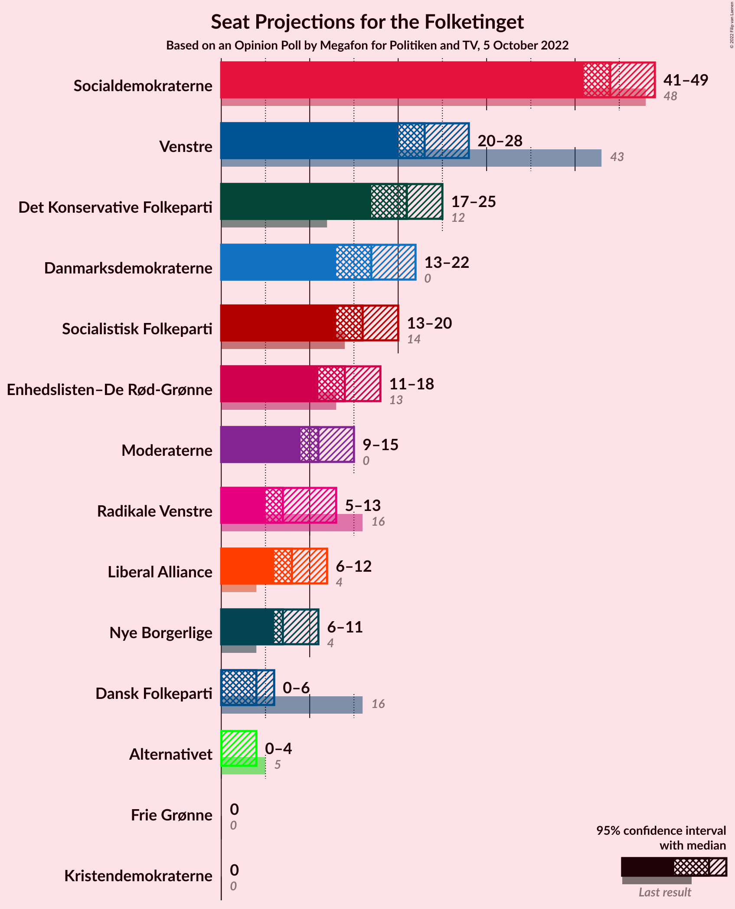

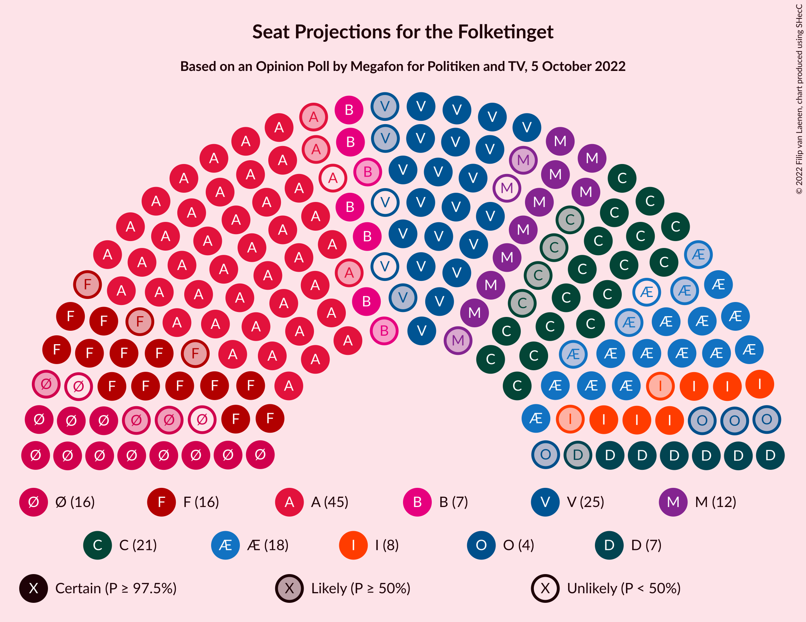

### Confidence Intervals

| Party | Last Result | Median | 80% Confidence Interval | 90% Confidence Interval | 95% Confidence Interval | 99% Confidence Interval |
|:-----:|:-----------:|:------:|:-----------------------:|:-----------------------:|:-----------------------:|:-----------------------:|
| <a href="#socialdemokraterne">Socialdemokraterne</a> | 48 | 44 | 42–48 |41–48 |41–49 |39–51 |
| <a href="#venstre">Venstre</a> | 43 | 23 | 21–25 |20–25 |20–28 |20–31 |
| <a href="#det-konservative-folkeparti">Det Konservative Folkeparti</a> | 12 | 21 | 17–25 |17–25 |17–25 |16–25 |
| <a href="#danmarksdemokraterne">Danmarksdemokraterne</a> | 0 | 17 | 15–19 |13–20 |13–22 |13–22 |
| <a href="#socialistisk-folkeparti">Socialistisk Folkeparti</a> | 14 | 16 | 15–19 |14–19 |13–20 |11–20 |
| <a href="#enhedslisten–de-rød-grønne">Enhedslisten–De Rød-Grønne</a> | 13 | 14 | 13–17 |11–17 |11–18 |11–18 |
| <a href="#moderaterne">Moderaterne</a> | 0 | 11 | 9–13 |9–14 |9–15 |8–15 |
| <a href="#liberal-alliance">Liberal Alliance</a> | 4 | 8 | 6–11 |6–12 |6–12 |6–12 |
| <a href="#nye-borgerlige">Nye Borgerlige</a> | 4 | 7 | 6–10 |6–11 |6–11 |5–11 |
| <a href="#radikale-venstre">Radikale Venstre</a> | 16 | 7 | 6–9 |6–10 |5–13 |5–13 |
| <a href="#dansk-folkeparti">Dansk Folkeparti</a> | 16 | 4 | 0–5 |0–5 |0–6 |0–6 |
| <a href="#alternativet">Alternativet</a> | 5 | 0 | 0–4 |0–4 |0–4 |0–4 |
| <a href="#kristendemokraterne">Kristendemokraterne</a> | 0 | 0 | 0 |0 |0 |0–4 |
| <a href="#frie-grønne">Frie Grønne</a> | 0 | 0 | 0 |0 |0 |0 |

### Socialdemokraterne

*For a full overview of the results for this party, see the [Socialdemokraterne](party-socialdemokraterne.html) page.*

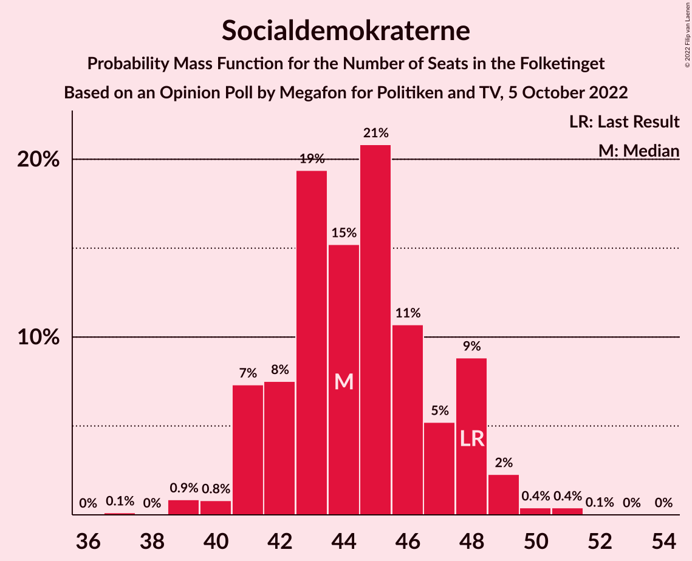

| Number of Seats | Probability | Accumulated | Special Marks |
|:---------------:|:-----------:|:-----------:|:-------------:|
| 37 | 0.1% | 100% |  |
| 38 | 0% | 99.9% |  |
| 39 | 0.9% | 99.9% |  |
| 40 | 0.8% | 99.0% |  |
| 41 | 7% | 98% |  |
| 42 | 8% | 91% |  |
| 43 | 19% | 83% |  |
| 44 | 15% | 64% | Median |
| 45 | 21% | 49% |  |
| 46 | 11% | 28% |  |
| 47 | 5% | 17% |  |
| 48 | 9% | 12% | Last Result |
| 49 | 2% | 3% |  |
| 50 | 0.4% | 0.9% |  |
| 51 | 0.4% | 0.5% |  |
| 52 | 0.1% | 0.1% |  |
| 53 | 0% | 0.1% |  |
| 54 | 0% | 0% |  |

### Venstre

*For a full overview of the results for this party, see the [Venstre](party-venstre.html) page.*

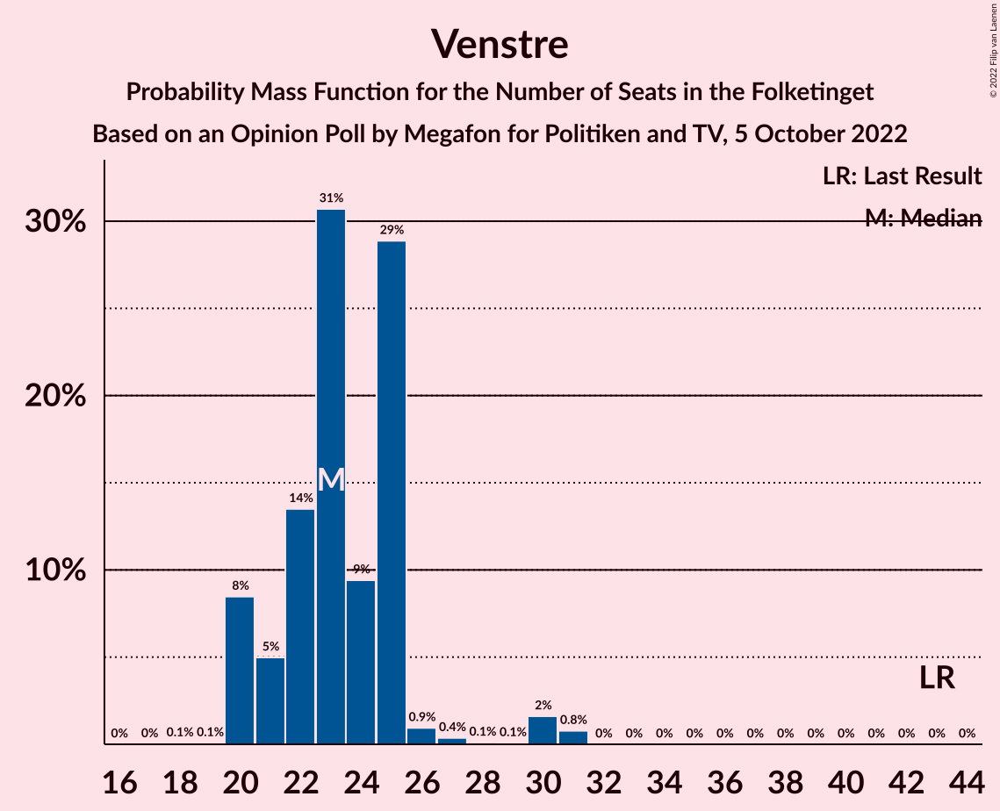

| Number of Seats | Probability | Accumulated | Special Marks |
|:---------------:|:-----------:|:-----------:|:-------------:|
| 18 | 0.1% | 100% |  |
| 19 | 0.1% | 99.9% |  |
| 20 | 8% | 99.8% |  |
| 21 | 5% | 91% |  |
| 22 | 14% | 86% |  |
| 23 | 31% | 73% | Median |
| 24 | 9% | 42% |  |
| 25 | 29% | 33% |  |
| 26 | 0.9% | 4% |  |
| 27 | 0.4% | 3% |  |
| 28 | 0.1% | 3% |  |
| 29 | 0.1% | 2% |  |
| 30 | 2% | 2% |  |
| 31 | 0.8% | 0.8% |  |
| 32 | 0% | 0% |  |
| 33 | 0% | 0% |  |
| 34 | 0% | 0% |  |
| 35 | 0% | 0% |  |
| 36 | 0% | 0% |  |
| 37 | 0% | 0% |  |
| 38 | 0% | 0% |  |
| 39 | 0% | 0% |  |
| 40 | 0% | 0% |  |
| 41 | 0% | 0% |  |
| 42 | 0% | 0% |  |
| 43 | 0% | 0% | Last Result |

### Det Konservative Folkeparti

*For a full overview of the results for this party, see the [Det Konservative Folkeparti](party-detkonservativefolkeparti.html) page.*

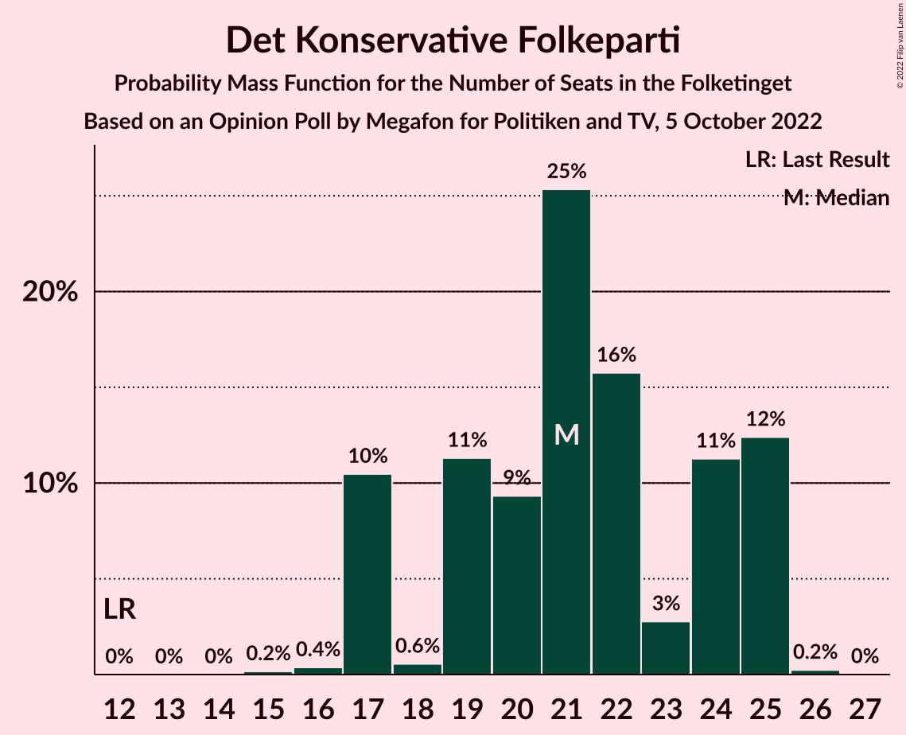

| Number of Seats | Probability | Accumulated | Special Marks |
|:---------------:|:-----------:|:-----------:|:-------------:|
| 12 | 0% | 100% | Last Result |
| 13 | 0% | 100% |  |
| 14 | 0% | 100% |  |
| 15 | 0.2% | 100% |  |
| 16 | 0.4% | 99.8% |  |
| 17 | 10% | 99.5% |  |
| 18 | 0.6% | 89% |  |
| 19 | 11% | 88% |  |
| 20 | 9% | 77% |  |
| 21 | 25% | 68% | Median |
| 22 | 16% | 42% |  |
| 23 | 3% | 27% |  |
| 24 | 11% | 24% |  |
| 25 | 12% | 13% |  |
| 26 | 0.2% | 0.3% |  |
| 27 | 0% | 0% |  |

### Danmarksdemokraterne

*For a full overview of the results for this party, see the [Danmarksdemokraterne](party-danmarksdemokraterne.html) page.*

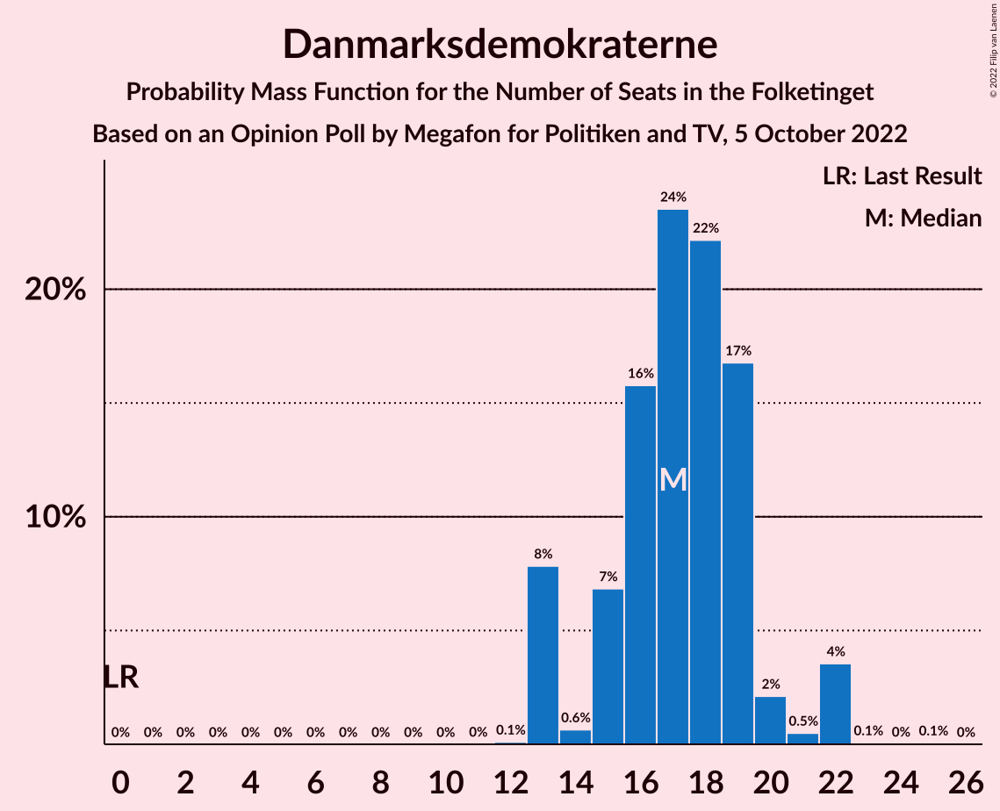

| Number of Seats | Probability | Accumulated | Special Marks |
|:---------------:|:-----------:|:-----------:|:-------------:|
| 0 | 0% | 100% | Last Result |
| 1 | 0% | 100% |  |
| 2 | 0% | 100% |  |
| 3 | 0% | 100% |  |
| 4 | 0% | 100% |  |
| 5 | 0% | 100% |  |
| 6 | 0% | 100% |  |
| 7 | 0% | 100% |  |
| 8 | 0% | 100% |  |
| 9 | 0% | 100% |  |
| 10 | 0% | 100% |  |
| 11 | 0% | 100% |  |
| 12 | 0.1% | 100% |  |
| 13 | 8% | 99.9% |  |
| 14 | 0.6% | 92% |  |
| 15 | 7% | 91% |  |
| 16 | 16% | 85% |  |
| 17 | 24% | 69% | Median |
| 18 | 22% | 45% |  |
| 19 | 17% | 23% |  |
| 20 | 2% | 6% |  |
| 21 | 0.5% | 4% |  |
| 22 | 4% | 4% |  |
| 23 | 0.1% | 0.2% |  |
| 24 | 0% | 0.1% |  |
| 25 | 0.1% | 0.1% |  |
| 26 | 0% | 0% |  |

### Socialistisk Folkeparti

*For a full overview of the results for this party, see the [Socialistisk Folkeparti](party-socialistiskfolkeparti.html) page.*

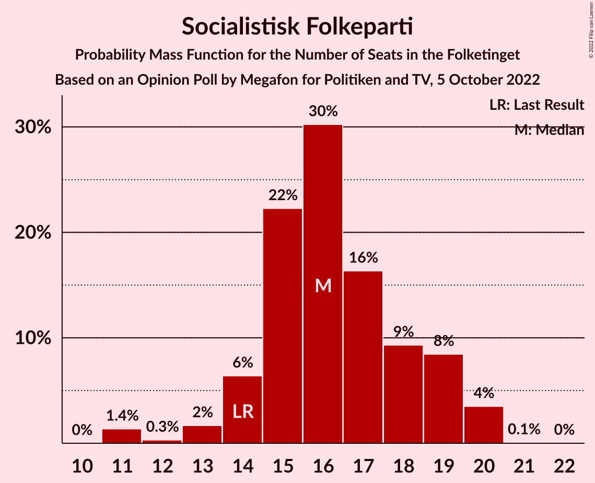

| Number of Seats | Probability | Accumulated | Special Marks |
|:---------------:|:-----------:|:-----------:|:-------------:|
| 11 | 1.4% | 100% |  |
| 12 | 0.3% | 98.6% |  |
| 13 | 2% | 98% |  |
| 14 | 6% | 97% | Last Result |
| 15 | 22% | 90% |  |
| 16 | 30% | 68% | Median |
| 17 | 16% | 38% |  |
| 18 | 9% | 21% |  |
| 19 | 8% | 12% |  |
| 20 | 4% | 4% |  |
| 21 | 0.1% | 0.1% |  |
| 22 | 0% | 0% |  |

### Enhedslisten–De Rød-Grønne

*For a full overview of the results for this party, see the [Enhedslisten–De Rød-Grønne](party-enhedslisten–derød-grønne.html) page.*

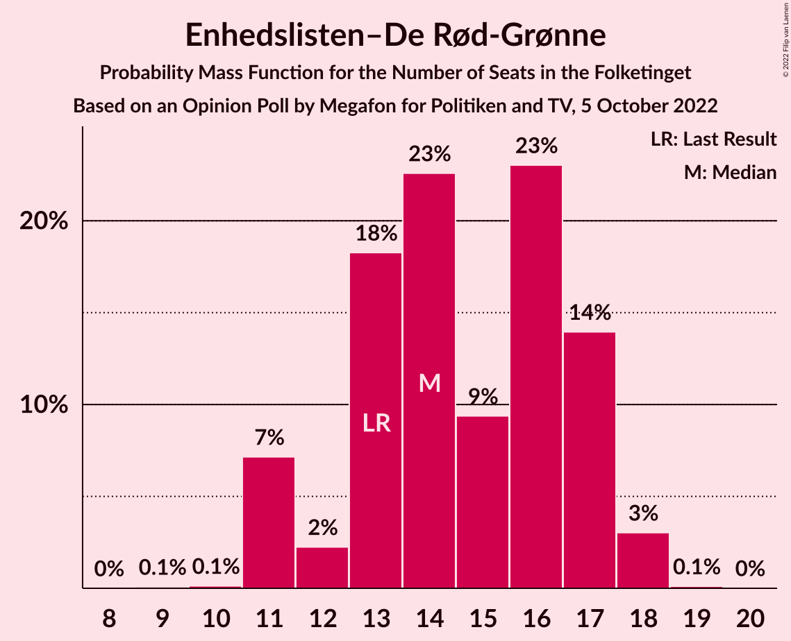

| Number of Seats | Probability | Accumulated | Special Marks |
|:---------------:|:-----------:|:-----------:|:-------------:|
| 9 | 0.1% | 100% |  |
| 10 | 0.1% | 99.9% |  |
| 11 | 7% | 99.8% |  |
| 12 | 2% | 93% |  |
| 13 | 18% | 90% | Last Result |
| 14 | 23% | 72% | Median |
| 15 | 9% | 50% |  |
| 16 | 23% | 40% |  |
| 17 | 14% | 17% |  |
| 18 | 3% | 3% |  |
| 19 | 0.1% | 0.1% |  |
| 20 | 0% | 0% |  |

### Moderaterne

*For a full overview of the results for this party, see the [Moderaterne](party-moderaterne.html) page.*

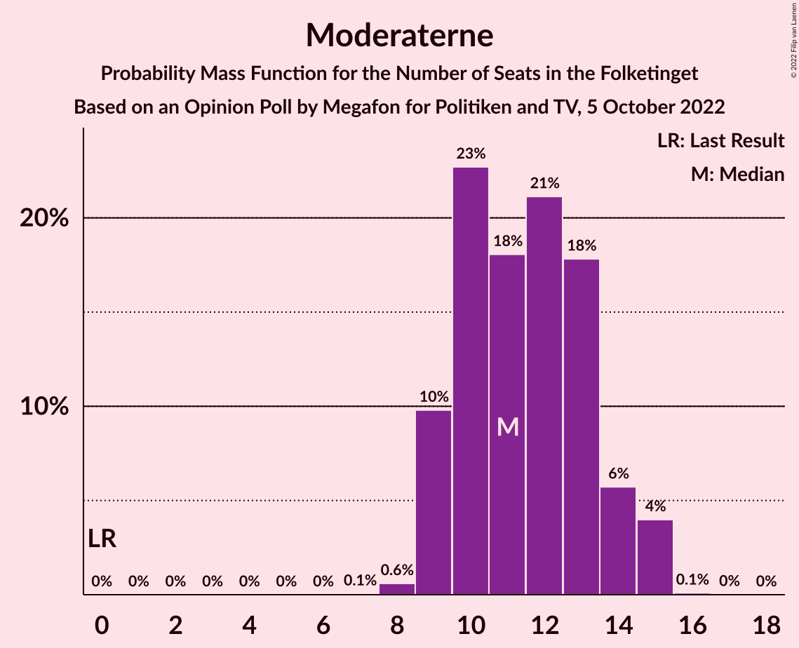

| Number of Seats | Probability | Accumulated | Special Marks |
|:---------------:|:-----------:|:-----------:|:-------------:|
| 0 | 0% | 100% | Last Result |
| 1 | 0% | 100% |  |
| 2 | 0% | 100% |  |
| 3 | 0% | 100% |  |
| 4 | 0% | 100% |  |
| 5 | 0% | 100% |  |
| 6 | 0% | 100% |  |
| 7 | 0.1% | 100% |  |
| 8 | 0.6% | 99.9% |  |
| 9 | 10% | 99.3% |  |
| 10 | 23% | 90% |  |
| 11 | 18% | 67% | Median |
| 12 | 21% | 49% |  |
| 13 | 18% | 28% |  |
| 14 | 6% | 10% |  |
| 15 | 4% | 4% |  |
| 16 | 0.1% | 0.1% |  |
| 17 | 0% | 0% |  |

### Liberal Alliance

*For a full overview of the results for this party, see the [Liberal Alliance](party-liberalalliance.html) page.*

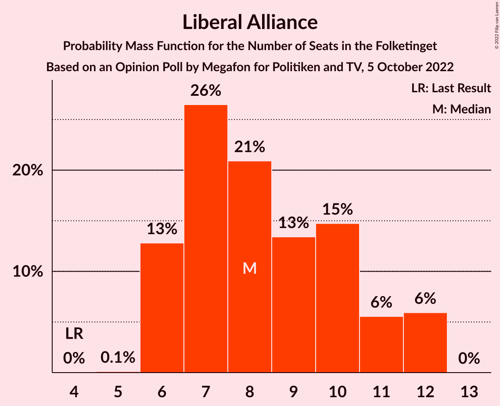

| Number of Seats | Probability | Accumulated | Special Marks |
|:---------------:|:-----------:|:-----------:|:-------------:|
| 4 | 0% | 100% | Last Result |
| 5 | 0.1% | 100% |  |
| 6 | 13% | 99.9% |  |
| 7 | 26% | 87% |  |
| 8 | 21% | 61% | Median |
| 9 | 13% | 40% |  |
| 10 | 15% | 26% |  |
| 11 | 6% | 12% |  |
| 12 | 6% | 6% |  |
| 13 | 0% | 0% |  |

### Nye Borgerlige

*For a full overview of the results for this party, see the [Nye Borgerlige](party-nyeborgerlige.html) page.*

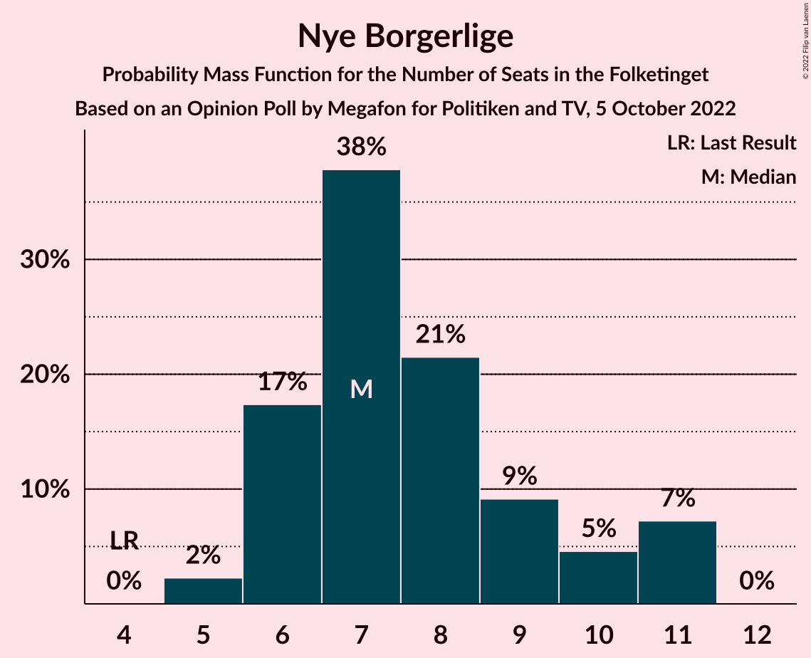

| Number of Seats | Probability | Accumulated | Special Marks |
|:---------------:|:-----------:|:-----------:|:-------------:|
| 4 | 0% | 100% | Last Result |
| 5 | 2% | 100% |  |
| 6 | 17% | 98% |  |
| 7 | 38% | 80% | Median |
| 8 | 21% | 43% |  |
| 9 | 9% | 21% |  |
| 10 | 5% | 12% |  |
| 11 | 7% | 7% |  |
| 12 | 0% | 0% |  |

### Radikale Venstre

*For a full overview of the results for this party, see the [Radikale Venstre](party-radikalevenstre.html) page.*

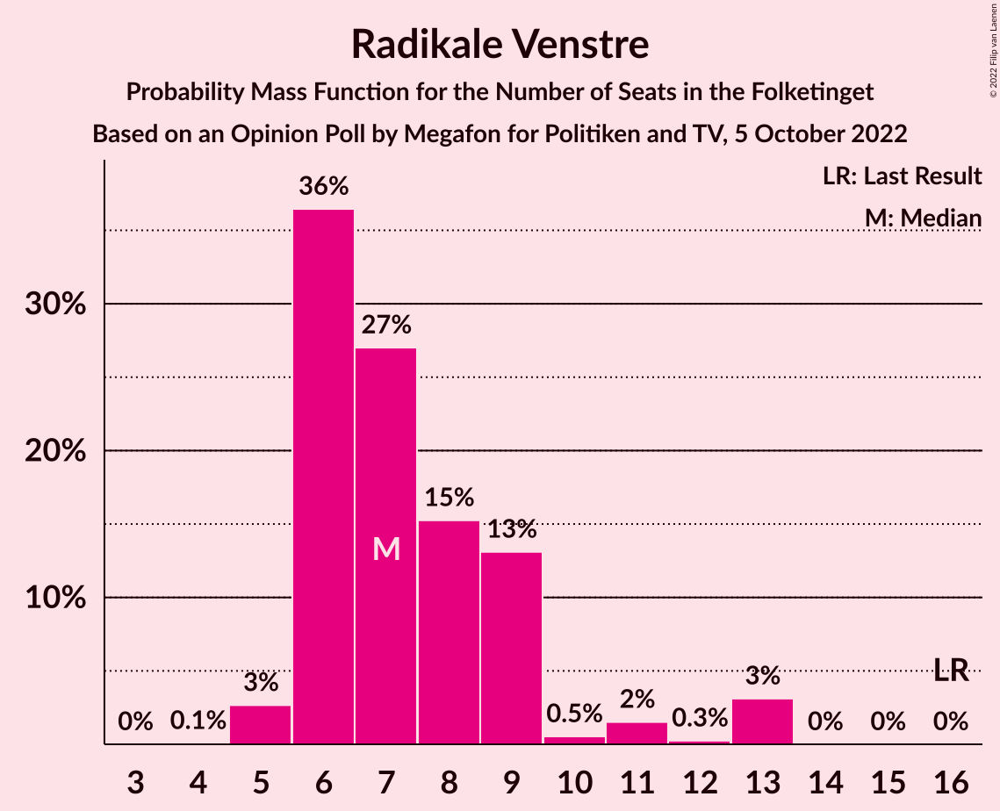

| Number of Seats | Probability | Accumulated | Special Marks |
|:---------------:|:-----------:|:-----------:|:-------------:|
| 4 | 0.1% | 100% |  |
| 5 | 3% | 99.9% |  |
| 6 | 36% | 97% |  |
| 7 | 27% | 61% | Median |
| 8 | 15% | 34% |  |
| 9 | 13% | 19% |  |
| 10 | 0.5% | 5% |  |
| 11 | 2% | 5% |  |
| 12 | 0.3% | 3% |  |
| 13 | 3% | 3% |  |
| 14 | 0% | 0% |  |
| 15 | 0% | 0% |  |
| 16 | 0% | 0% | Last Result |

### Dansk Folkeparti

*For a full overview of the results for this party, see the [Dansk Folkeparti](party-danskfolkeparti.html) page.*

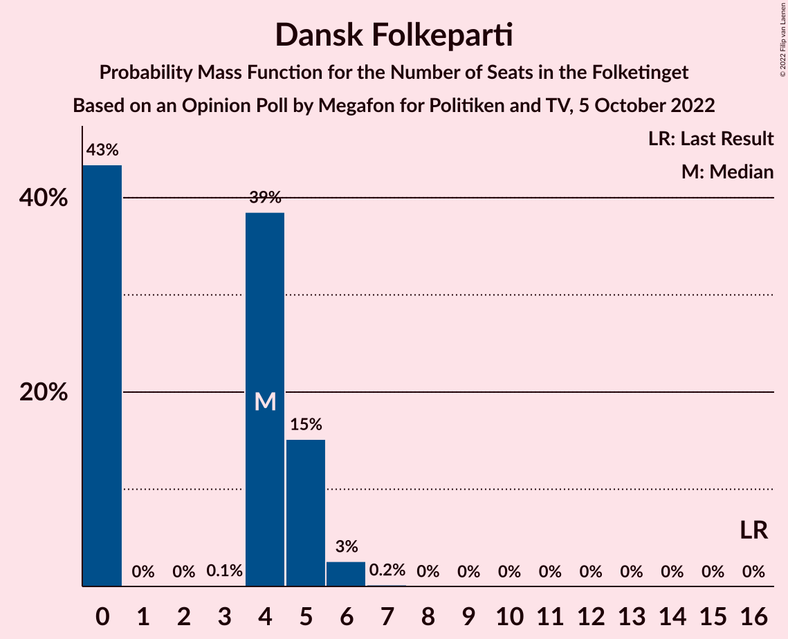

| Number of Seats | Probability | Accumulated | Special Marks |
|:---------------:|:-----------:|:-----------:|:-------------:|
| 0 | 43% | 100% |  |
| 1 | 0% | 57% |  |
| 2 | 0% | 57% |  |
| 3 | 0.1% | 57% |  |
| 4 | 39% | 56% | Median |
| 5 | 15% | 18% |  |
| 6 | 3% | 3% |  |
| 7 | 0.2% | 0.2% |  |
| 8 | 0% | 0% |  |
| 9 | 0% | 0% |  |
| 10 | 0% | 0% |  |
| 11 | 0% | 0% |  |
| 12 | 0% | 0% |  |
| 13 | 0% | 0% |  |
| 14 | 0% | 0% |  |
| 15 | 0% | 0% |  |
| 16 | 0% | 0% | Last Result |

### Alternativet

*For a full overview of the results for this party, see the [Alternativet](party-alternativet.html) page.*

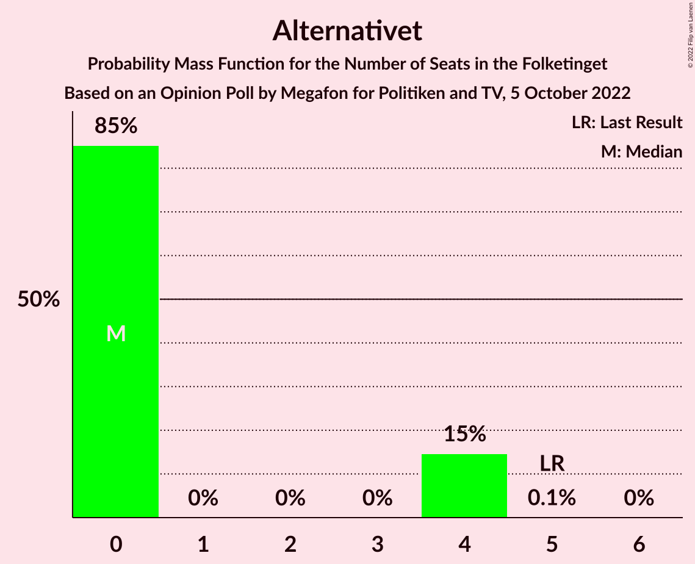

| Number of Seats | Probability | Accumulated | Special Marks |
|:---------------:|:-----------:|:-----------:|:-------------:|
| 0 | 85% | 100% | Median |
| 1 | 0% | 15% |  |
| 2 | 0% | 15% |  |
| 3 | 0% | 15% |  |
| 4 | 15% | 15% |  |
| 5 | 0.1% | 0.1% | Last Result |
| 6 | 0% | 0% |  |

### Kristendemokraterne

*For a full overview of the results for this party, see the [Kristendemokraterne](party-kristendemokraterne.html) page.*

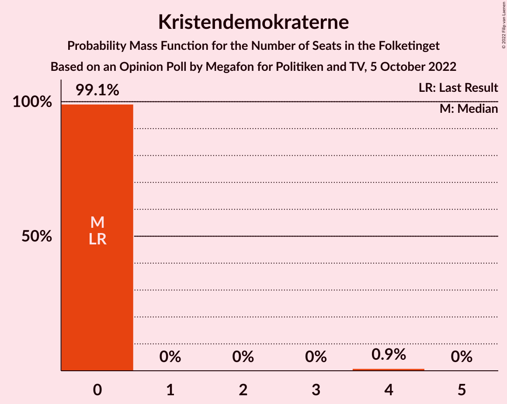

| Number of Seats | Probability | Accumulated | Special Marks |
|:---------------:|:-----------:|:-----------:|:-------------:|
| 0 | 99.1% | 100% | Last Result, Median |
| 1 | 0% | 0.9% |  |
| 2 | 0% | 0.9% |  |
| 3 | 0% | 0.9% |  |
| 4 | 0.9% | 0.9% |  |
| 5 | 0% | 0% |  |

### Frie Grønne

*For a full overview of the results for this party, see the [Frie Grønne](party-friegrønne.html) page.*

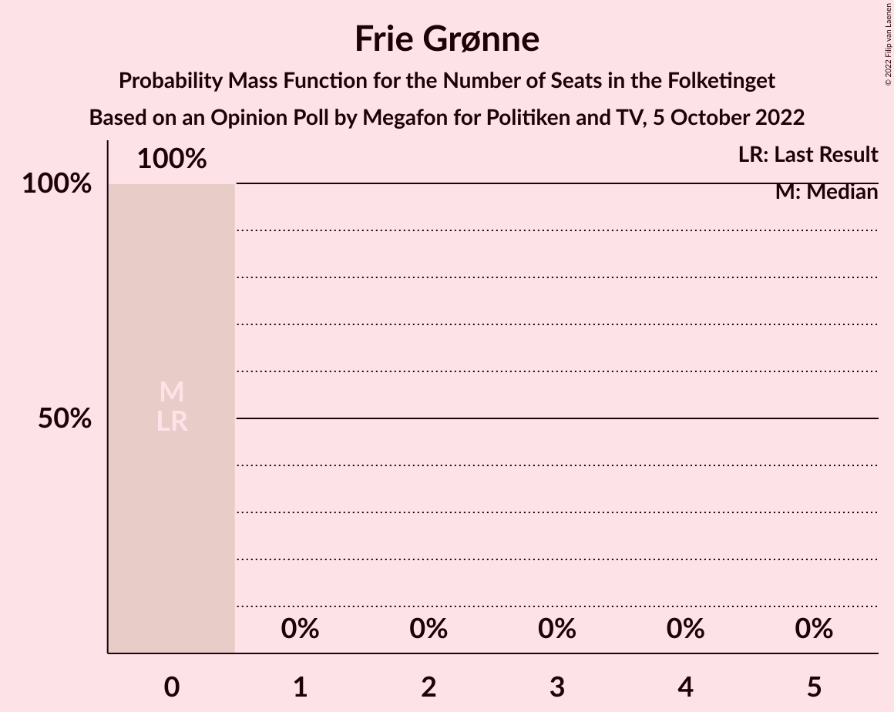

| Number of Seats | Probability | Accumulated | Special Marks |
|:---------------:|:-----------:|:-----------:|:-------------:|
| 0 | 100% | 100% | Last Result, Median |

## Coalitions

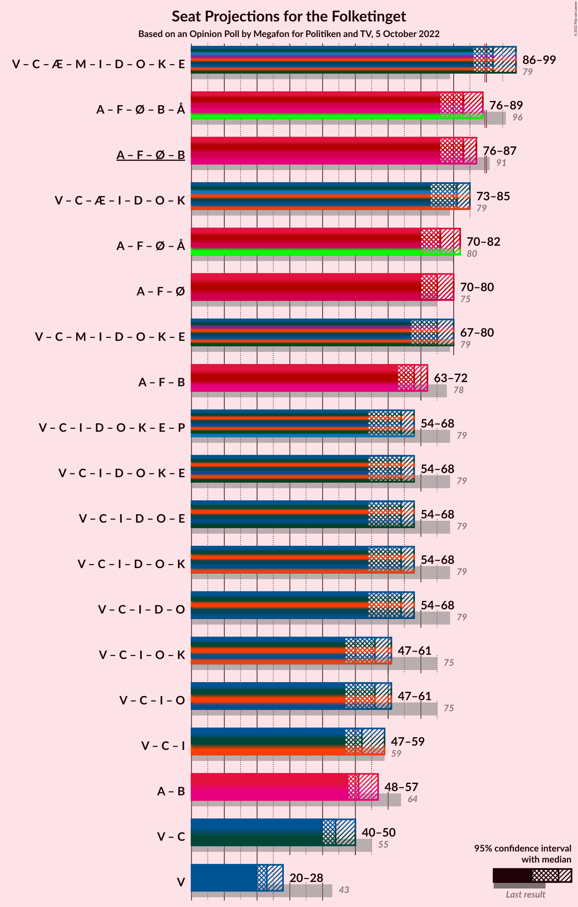

### Confidence Intervals

| Coalition | Last Result | Median | Majority? | 80% Confidence Interval | 90% Confidence Interval | 95% Confidence Interval | 99% Confidence Interval |
|:---------:|:-----------:|:------:|:---------:|:-----------------------:|:-----------------------:|:-----------------------:|:-----------------------:|
| Socialdemokraterne – Socialistisk Folkeparti – Enhedslisten–De Rød-Grønne – Radikale Venstre – Alternativet | 96 | 83 | 2% | 79–89 | 77–89 | 76–89 | 76–92 |
| Socialdemokraterne – Socialistisk Folkeparti – Enhedslisten–De Rød-Grønne – Radikale Venstre | 91 | 83 | 1.3% | 78–86 | 77–87 | 76–87 | 76–92 |
| Venstre – Det Konservative Folkeparti – Danmarksdemokraterne – Liberal Alliance – Nye Borgerlige – Dansk Folkeparti – Kristendemokraterne | 79 | 81 | 0.2% | 73–84 | 73–85 | 73–85 | 73–87 |
| Socialdemokraterne – Socialistisk Folkeparti – Enhedslisten–De Rød-Grønne – Alternativet | 80 | 76 | 0% | 71–82 | 70–82 | 70–82 | 69–84 |
| Socialdemokraterne – Socialistisk Folkeparti – Enhedslisten–De Rød-Grønne | 75 | 75 | 0% | 71–79 | 70–80 | 70–80 | 69–84 |
| Socialdemokraterne – Socialistisk Folkeparti – Radikale Venstre | 78 | 68 | 0% | 64–72 | 64–72 | 63–72 | 61–75 |
| Venstre – Det Konservative Folkeparti – Liberal Alliance – Nye Borgerlige – Dansk Folkeparti – Kristendemokraterne | 79 | 64 | 0% | 54–66 | 54–67 | 54–68 | 54–69 |
| Venstre – Det Konservative Folkeparti – Liberal Alliance – Nye Borgerlige – Dansk Folkeparti | 79 | 64 | 0% | 54–66 | 54–67 | 54–68 | 54–69 |
| Venstre – Det Konservative Folkeparti – Liberal Alliance – Dansk Folkeparti – Kristendemokraterne | 75 | 56 | 0% | 47–59 | 47–59 | 47–61 | 47–62 |
| Venstre – Det Konservative Folkeparti – Liberal Alliance – Dansk Folkeparti | 75 | 56 | 0% | 47–59 | 47–59 | 47–61 | 47–62 |
| Venstre – Det Konservative Folkeparti – Liberal Alliance | 59 | 52 | 0% | 47–58 | 47–59 | 47–59 | 47–61 |
| Socialdemokraterne – Radikale Venstre | 64 | 51 | 0% | 49–56 | 48–57 | 48–57 | 45–58 |
| Venstre – Det Konservative Folkeparti | 55 | 44 | 0% | 40–48 | 40–48 | 40–50 | 40–53 |
| Venstre | 43 | 23 | 0% | 21–25 | 20–25 | 20–28 | 20–31 |

### Socialdemokraterne – Socialistisk Folkeparti – Enhedslisten–De Rød-Grønne – Radikale Venstre – Alternativet

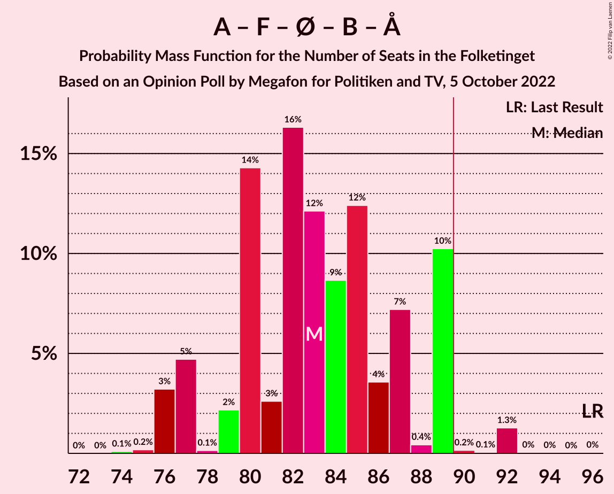

| Number of Seats | Probability | Accumulated | Special Marks |
|:---------------:|:-----------:|:-----------:|:-------------:|
| 74 | 0.1% | 100% |  |
| 75 | 0.2% | 99.9% |  |
| 76 | 3% | 99.7% |  |
| 77 | 5% | 96% |  |
| 78 | 0.1% | 92% |  |
| 79 | 2% | 92% |  |
| 80 | 14% | 89% |  |
| 81 | 3% | 75% | Median |
| 82 | 16% | 73% |  |
| 83 | 12% | 56% |  |
| 84 | 9% | 44% |  |
| 85 | 12% | 35% |  |
| 86 | 4% | 23% |  |
| 87 | 7% | 19% |  |
| 88 | 0.4% | 12% |  |
| 89 | 10% | 12% |  |
| 90 | 0.2% | 2% | Majority |
| 91 | 0.1% | 1.4% |  |
| 92 | 1.3% | 1.4% |  |
| 93 | 0% | 0.1% |  |
| 94 | 0% | 0.1% |  |
| 95 | 0% | 0% |  |
| 96 | 0% | 0% | Last Result |

### Socialdemokraterne – Socialistisk Folkeparti – Enhedslisten–De Rød-Grønne – Radikale Venstre

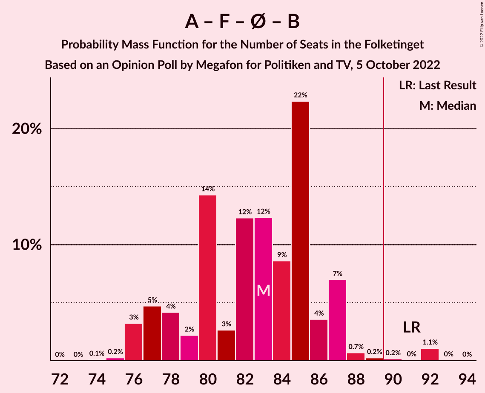

| Number of Seats | Probability | Accumulated | Special Marks |
|:---------------:|:-----------:|:-----------:|:-------------:|
| 74 | 0.1% | 100% |  |
| 75 | 0.2% | 99.9% |  |
| 76 | 3% | 99.6% |  |
| 77 | 5% | 96% |  |
| 78 | 4% | 92% |  |
| 79 | 2% | 88% |  |
| 80 | 14% | 85% |  |
| 81 | 3% | 71% | Median |
| 82 | 12% | 68% |  |
| 83 | 12% | 56% |  |
| 84 | 9% | 44% |  |
| 85 | 22% | 35% |  |
| 86 | 4% | 13% |  |
| 87 | 7% | 9% |  |
| 88 | 0.7% | 2% |  |
| 89 | 0.2% | 2% |  |
| 90 | 0.2% | 1.3% | Majority |
| 91 | 0% | 1.2% | Last Result |
| 92 | 1.1% | 1.1% |  |
| 93 | 0% | 0.1% |  |
| 94 | 0% | 0% |  |

### Venstre – Det Konservative Folkeparti – Danmarksdemokraterne – Liberal Alliance – Nye Borgerlige – Dansk Folkeparti – Kristendemokraterne

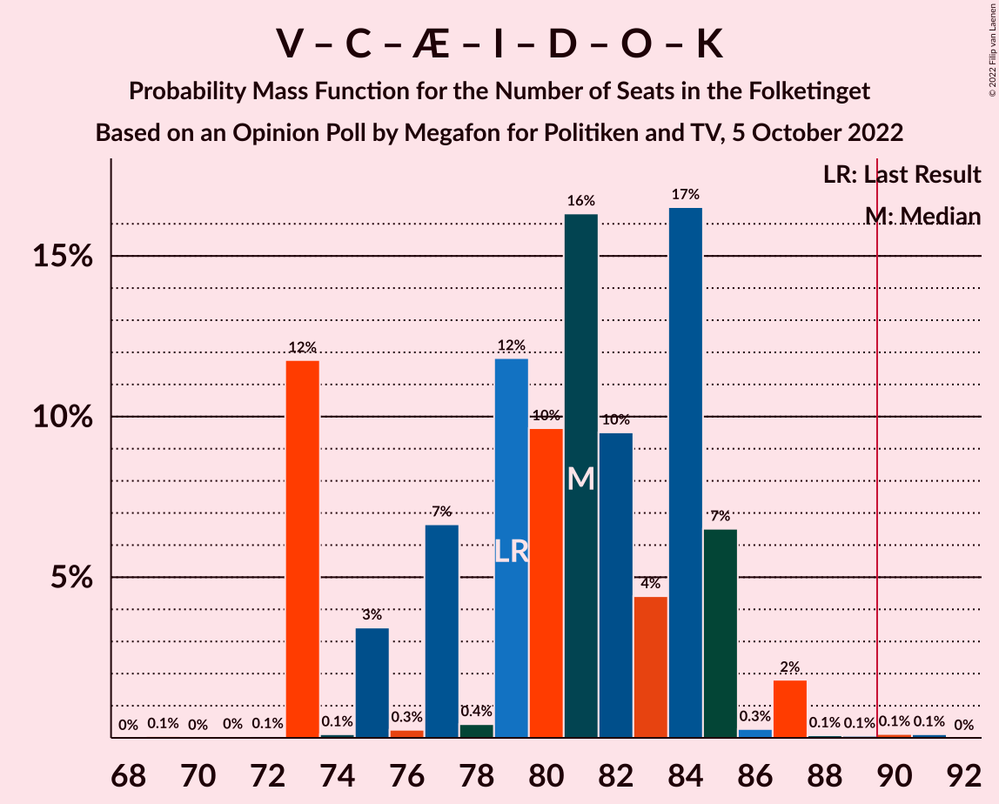

| Number of Seats | Probability | Accumulated | Special Marks |
|:---------------:|:-----------:|:-----------:|:-------------:|
| 69 | 0.1% | 100% |  |
| 70 | 0% | 99.9% |  |
| 71 | 0% | 99.9% |  |
| 72 | 0.1% | 99.9% |  |
| 73 | 12% | 99.8% |  |
| 74 | 0.1% | 88% |  |
| 75 | 3% | 88% |  |
| 76 | 0.3% | 85% |  |
| 77 | 7% | 84% |  |
| 78 | 0.4% | 78% |  |
| 79 | 12% | 77% | Last Result |
| 80 | 10% | 65% | Median |
| 81 | 16% | 56% |  |
| 82 | 10% | 39% |  |
| 83 | 4% | 30% |  |
| 84 | 17% | 25% |  |
| 85 | 7% | 9% |  |
| 86 | 0.3% | 2% |  |
| 87 | 2% | 2% |  |
| 88 | 0.1% | 0.4% |  |
| 89 | 0.1% | 0.3% |  |
| 90 | 0.1% | 0.2% | Majority |
| 91 | 0.1% | 0.1% |  |
| 92 | 0% | 0% |  |

### Socialdemokraterne – Socialistisk Folkeparti – Enhedslisten–De Rød-Grønne – Alternativet

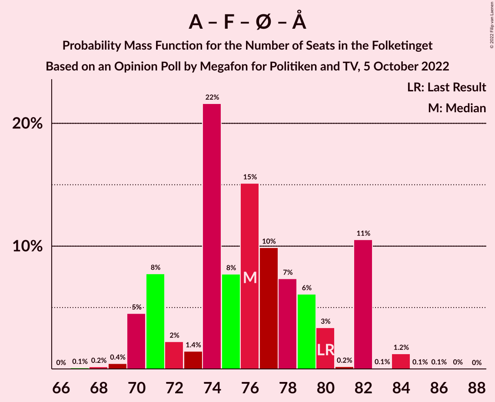

| Number of Seats | Probability | Accumulated | Special Marks |
|:---------------:|:-----------:|:-----------:|:-------------:|
| 67 | 0.1% | 100% |  |
| 68 | 0.2% | 99.9% |  |
| 69 | 0.4% | 99.7% |  |
| 70 | 5% | 99.3% |  |
| 71 | 8% | 95% |  |
| 72 | 2% | 87% |  |
| 73 | 1.4% | 85% |  |
| 74 | 22% | 83% | Median |
| 75 | 8% | 62% |  |
| 76 | 15% | 54% |  |
| 77 | 10% | 39% |  |
| 78 | 7% | 29% |  |
| 79 | 6% | 22% |  |
| 80 | 3% | 16% | Last Result |
| 81 | 0.2% | 12% |  |
| 82 | 11% | 12% |  |
| 83 | 0.1% | 1.5% |  |
| 84 | 1.2% | 1.4% |  |
| 85 | 0.1% | 0.2% |  |
| 86 | 0.1% | 0.1% |  |
| 87 | 0% | 0% |  |

### Socialdemokraterne – Socialistisk Folkeparti – Enhedslisten–De Rød-Grønne

| Number of Seats | Probability | Accumulated | Special Marks |
|:---------------:|:-----------:|:-----------:|:-------------:|
| 67 | 0.1% | 100% |  |
| 68 | 0.2% | 99.9% |  |
| 69 | 0.5% | 99.7% |  |
| 70 | 5% | 99.2% |  |
| 71 | 8% | 95% |  |
| 72 | 6% | 87% |  |
| 73 | 1.4% | 80% |  |
| 74 | 22% | 79% | Median |
| 75 | 8% | 57% | Last Result |
| 76 | 11% | 50% |  |
| 77 | 10% | 39% |  |
| 78 | 17% | 29% |  |
| 79 | 6% | 12% |  |
| 80 | 4% | 6% |  |
| 81 | 0.2% | 2% |  |
| 82 | 0.5% | 2% |  |
| 83 | 0.1% | 1.2% |  |
| 84 | 1.0% | 1.1% |  |
| 85 | 0.1% | 0.1% |  |
| 86 | 0% | 0.1% |  |
| 87 | 0% | 0% |  |

### Socialdemokraterne – Socialistisk Folkeparti – Radikale Venstre

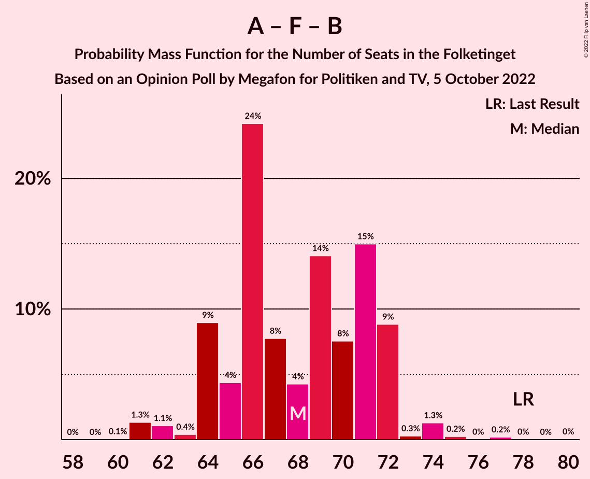

| Number of Seats | Probability | Accumulated | Special Marks |
|:---------------:|:-----------:|:-----------:|:-------------:|
| 60 | 0.1% | 100% |  |
| 61 | 1.3% | 99.9% |  |
| 62 | 1.1% | 98.6% |  |
| 63 | 0.4% | 98% |  |
| 64 | 9% | 97% |  |
| 65 | 4% | 88% |  |
| 66 | 24% | 84% |  |
| 67 | 8% | 60% | Median |
| 68 | 4% | 52% |  |
| 69 | 14% | 48% |  |
| 70 | 8% | 33% |  |
| 71 | 15% | 26% |  |
| 72 | 9% | 11% |  |
| 73 | 0.3% | 2% |  |
| 74 | 1.3% | 2% |  |
| 75 | 0.2% | 0.5% |  |
| 76 | 0% | 0.3% |  |
| 77 | 0.2% | 0.3% |  |
| 78 | 0% | 0.1% | Last Result |
| 79 | 0% | 0.1% |  |
| 80 | 0% | 0% |  |

### Venstre – Det Konservative Folkeparti – Liberal Alliance – Nye Borgerlige – Dansk Folkeparti – Kristendemokraterne

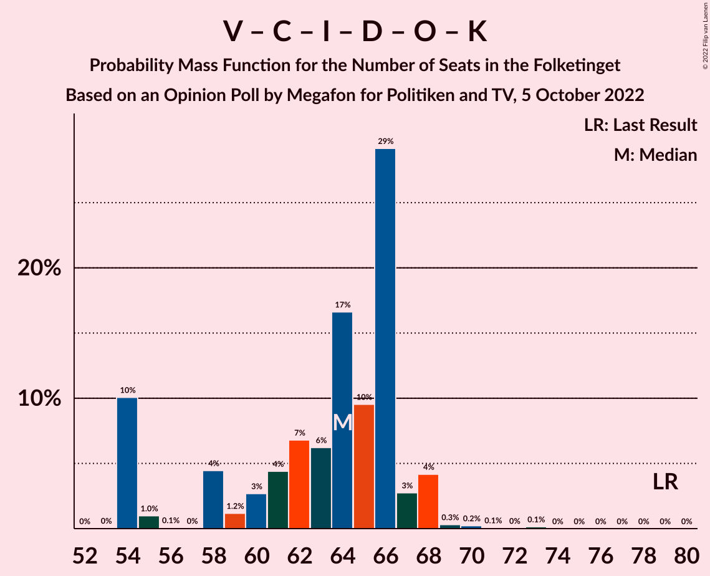

| Number of Seats | Probability | Accumulated | Special Marks |
|:---------------:|:-----------:|:-----------:|:-------------:|
| 54 | 10% | 100% |  |
| 55 | 1.0% | 90% |  |
| 56 | 0.1% | 89% |  |
| 57 | 0% | 89% |  |
| 58 | 4% | 89% |  |
| 59 | 1.2% | 84% |  |
| 60 | 3% | 83% |  |
| 61 | 4% | 80% |  |
| 62 | 7% | 76% |  |
| 63 | 6% | 69% | Median |
| 64 | 17% | 63% |  |
| 65 | 10% | 46% |  |
| 66 | 29% | 37% |  |
| 67 | 3% | 8% |  |
| 68 | 4% | 5% |  |
| 69 | 0.3% | 0.8% |  |
| 70 | 0.2% | 0.5% |  |
| 71 | 0.1% | 0.3% |  |
| 72 | 0% | 0.2% |  |
| 73 | 0.1% | 0.1% |  |
| 74 | 0% | 0% |  |
| 75 | 0% | 0% |  |
| 76 | 0% | 0% |  |
| 77 | 0% | 0% |  |
| 78 | 0% | 0% |  |
| 79 | 0% | 0% | Last Result |

### Venstre – Det Konservative Folkeparti – Liberal Alliance – Nye Borgerlige – Dansk Folkeparti

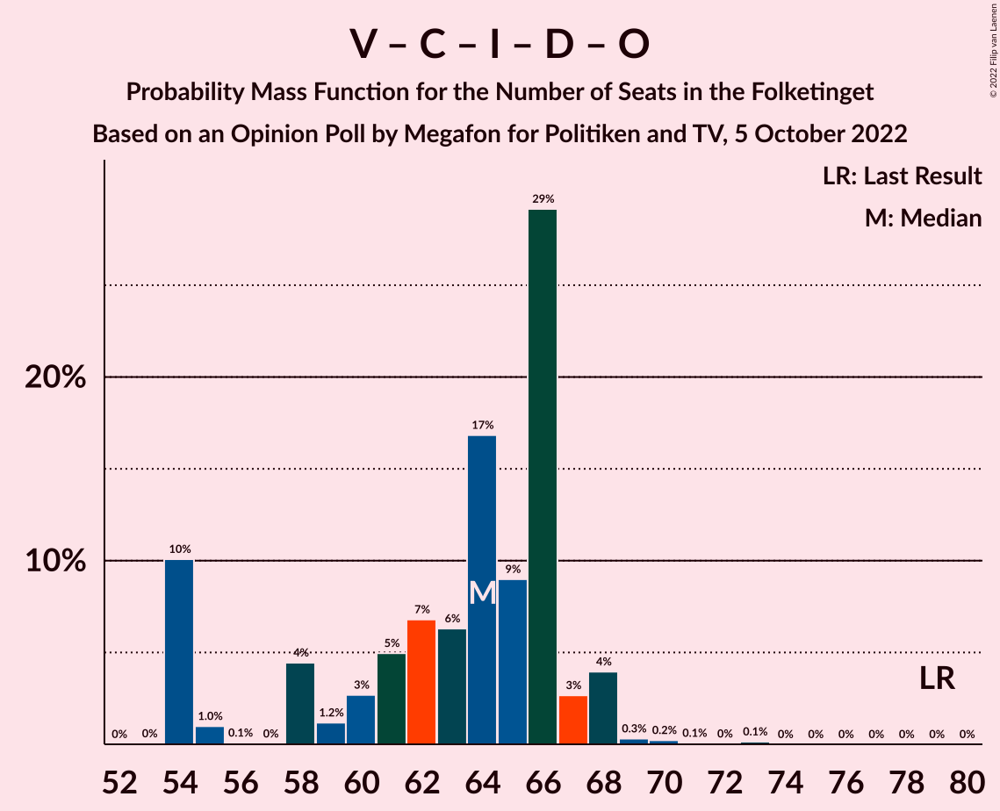

| Number of Seats | Probability | Accumulated | Special Marks |
|:---------------:|:-----------:|:-----------:|:-------------:|
| 54 | 10% | 100% |  |
| 55 | 1.0% | 90% |  |
| 56 | 0.1% | 89% |  |
| 57 | 0% | 89% |  |
| 58 | 4% | 89% |  |
| 59 | 1.2% | 84% |  |
| 60 | 3% | 83% |  |
| 61 | 5% | 80% |  |
| 62 | 7% | 75% |  |
| 63 | 6% | 69% | Median |
| 64 | 17% | 62% |  |
| 65 | 9% | 46% |  |
| 66 | 29% | 37% |  |
| 67 | 3% | 7% |  |
| 68 | 4% | 5% |  |
| 69 | 0.3% | 0.8% |  |
| 70 | 0.2% | 0.5% |  |
| 71 | 0.1% | 0.2% |  |
| 72 | 0% | 0.2% |  |
| 73 | 0.1% | 0.1% |  |
| 74 | 0% | 0% |  |
| 75 | 0% | 0% |  |
| 76 | 0% | 0% |  |
| 77 | 0% | 0% |  |
| 78 | 0% | 0% |  |
| 79 | 0% | 0% | Last Result |

### Venstre – Det Konservative Folkeparti – Liberal Alliance – Dansk Folkeparti – Kristendemokraterne

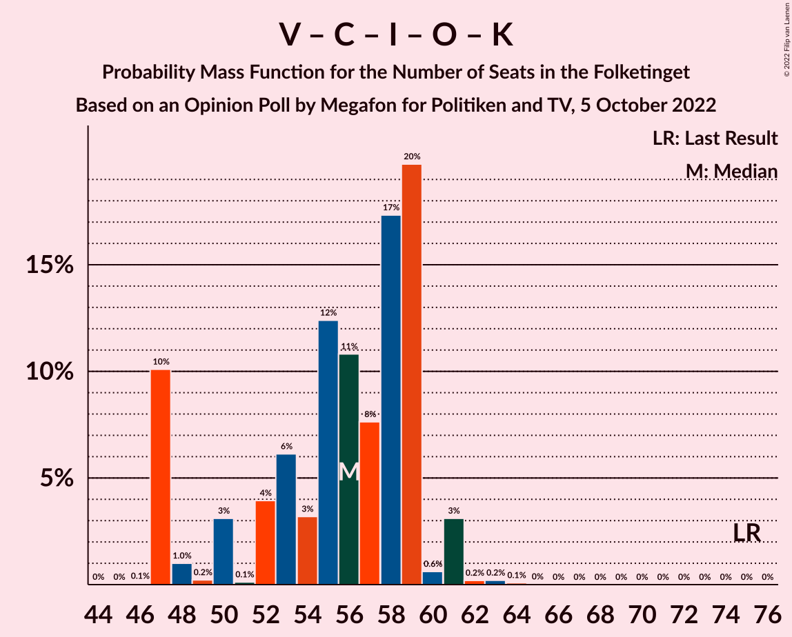

| Number of Seats | Probability | Accumulated | Special Marks |
|:---------------:|:-----------:|:-----------:|:-------------:|
| 46 | 0.1% | 100% |  |
| 47 | 10% | 99.9% |  |
| 48 | 1.0% | 90% |  |
| 49 | 0.2% | 89% |  |
| 50 | 3% | 89% |  |
| 51 | 0.1% | 86% |  |
| 52 | 4% | 85% |  |
| 53 | 6% | 81% |  |
| 54 | 3% | 75% |  |
| 55 | 12% | 72% |  |
| 56 | 11% | 60% | Median |
| 57 | 8% | 49% |  |
| 58 | 17% | 41% |  |
| 59 | 20% | 24% |  |
| 60 | 0.6% | 4% |  |
| 61 | 3% | 4% |  |
| 62 | 0.2% | 0.5% |  |
| 63 | 0.2% | 0.3% |  |
| 64 | 0.1% | 0.1% |  |
| 65 | 0% | 0% |  |
| 66 | 0% | 0% |  |
| 67 | 0% | 0% |  |
| 68 | 0% | 0% |  |
| 69 | 0% | 0% |  |
| 70 | 0% | 0% |  |
| 71 | 0% | 0% |  |
| 72 | 0% | 0% |  |
| 73 | 0% | 0% |  |
| 74 | 0% | 0% |  |
| 75 | 0% | 0% | Last Result |

### Venstre – Det Konservative Folkeparti – Liberal Alliance – Dansk Folkeparti

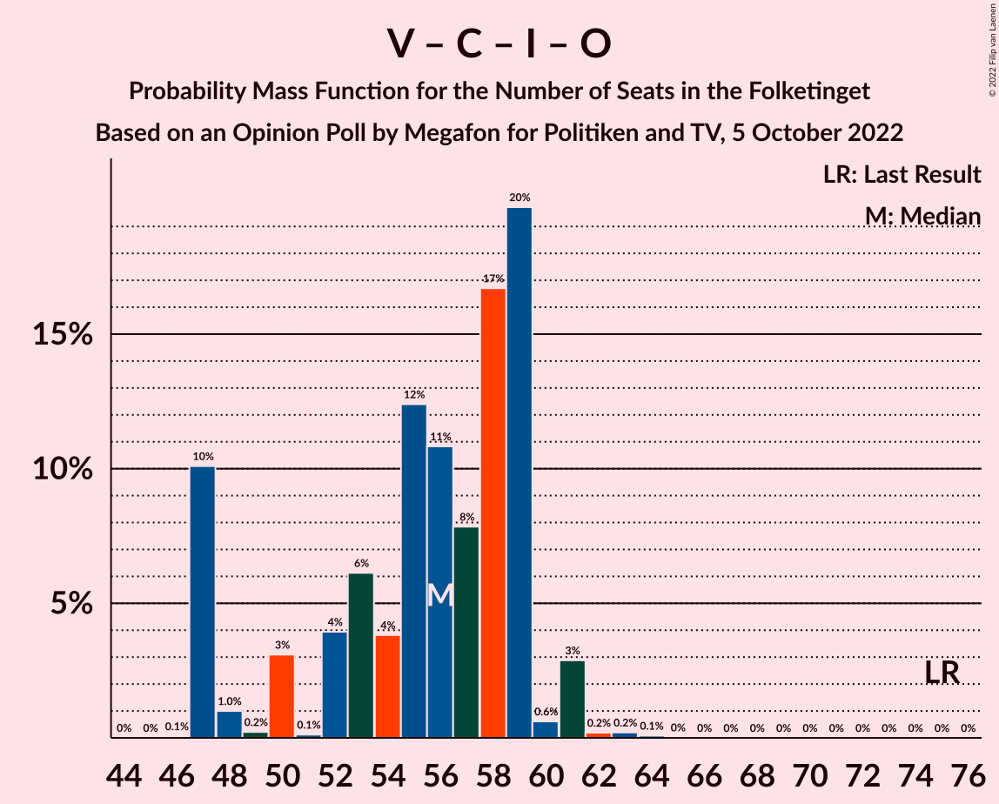

| Number of Seats | Probability | Accumulated | Special Marks |
|:---------------:|:-----------:|:-----------:|:-------------:|
| 46 | 0.1% | 100% |  |
| 47 | 10% | 99.9% |  |
| 48 | 1.0% | 90% |  |
| 49 | 0.2% | 89% |  |
| 50 | 3% | 89% |  |
| 51 | 0.1% | 86% |  |
| 52 | 4% | 85% |  |
| 53 | 6% | 81% |  |
| 54 | 4% | 75% |  |
| 55 | 12% | 71% |  |
| 56 | 11% | 59% | Median |
| 57 | 8% | 48% |  |
| 58 | 17% | 40% |  |
| 59 | 20% | 24% |  |
| 60 | 0.6% | 4% |  |
| 61 | 3% | 3% |  |
| 62 | 0.2% | 0.5% |  |
| 63 | 0.2% | 0.3% |  |
| 64 | 0.1% | 0.1% |  |
| 65 | 0% | 0% |  |
| 66 | 0% | 0% |  |
| 67 | 0% | 0% |  |
| 68 | 0% | 0% |  |
| 69 | 0% | 0% |  |
| 70 | 0% | 0% |  |
| 71 | 0% | 0% |  |
| 72 | 0% | 0% |  |
| 73 | 0% | 0% |  |
| 74 | 0% | 0% |  |
| 75 | 0% | 0% | Last Result |

### Venstre – Det Konservative Folkeparti – Liberal Alliance

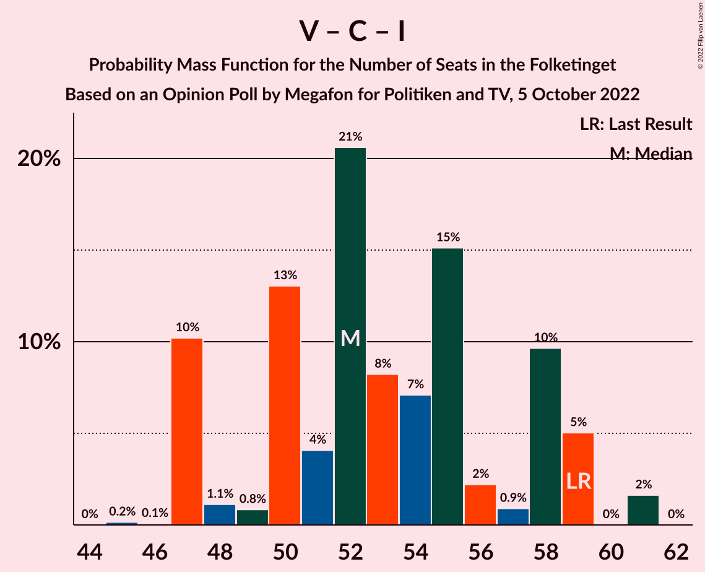

| Number of Seats | Probability | Accumulated | Special Marks |
|:---------------:|:-----------:|:-----------:|:-------------:|
| 45 | 0.2% | 100% |  |
| 46 | 0.1% | 99.8% |  |
| 47 | 10% | 99.7% |  |
| 48 | 1.1% | 90% |  |
| 49 | 0.8% | 88% |  |
| 50 | 13% | 88% |  |
| 51 | 4% | 75% |  |
| 52 | 21% | 70% | Median |
| 53 | 8% | 50% |  |
| 54 | 7% | 42% |  |
| 55 | 15% | 35% |  |
| 56 | 2% | 19% |  |
| 57 | 0.9% | 17% |  |
| 58 | 10% | 16% |  |
| 59 | 5% | 7% | Last Result |
| 60 | 0% | 2% |  |
| 61 | 2% | 2% |  |
| 62 | 0% | 0% |  |

### Socialdemokraterne – Radikale Venstre

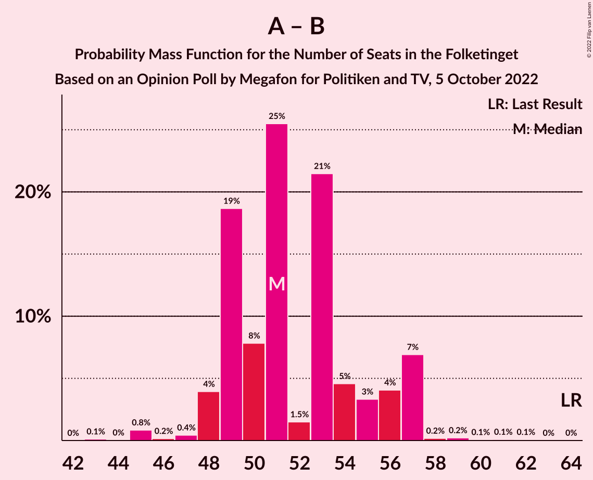

| Number of Seats | Probability | Accumulated | Special Marks |
|:---------------:|:-----------:|:-----------:|:-------------:|
| 43 | 0.1% | 100% |  |
| 44 | 0% | 99.9% |  |
| 45 | 0.8% | 99.9% |  |
| 46 | 0.2% | 99.0% |  |
| 47 | 0.4% | 98.9% |  |
| 48 | 4% | 98% |  |
| 49 | 19% | 94% |  |
| 50 | 8% | 76% |  |
| 51 | 25% | 68% | Median |
| 52 | 1.5% | 42% |  |
| 53 | 21% | 41% |  |
| 54 | 5% | 20% |  |
| 55 | 3% | 15% |  |
| 56 | 4% | 12% |  |
| 57 | 7% | 8% |  |
| 58 | 0.2% | 0.6% |  |
| 59 | 0.2% | 0.5% |  |
| 60 | 0.1% | 0.2% |  |
| 61 | 0.1% | 0.2% |  |
| 62 | 0.1% | 0.1% |  |
| 63 | 0% | 0% |  |
| 64 | 0% | 0% | Last Result |

### Venstre – Det Konservative Folkeparti

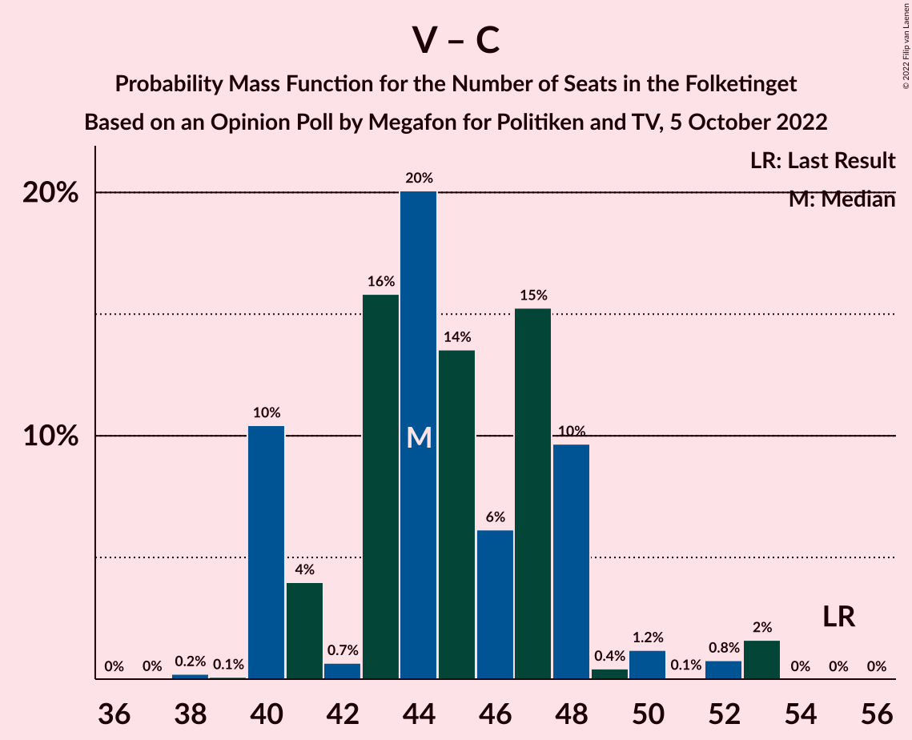

| Number of Seats | Probability | Accumulated | Special Marks |
|:---------------:|:-----------:|:-----------:|:-------------:|
| 38 | 0.2% | 100% |  |
| 39 | 0.1% | 99.8% |  |
| 40 | 10% | 99.7% |  |
| 41 | 4% | 89% |  |
| 42 | 0.7% | 85% |  |
| 43 | 16% | 85% |  |
| 44 | 20% | 69% | Median |
| 45 | 14% | 49% |  |
| 46 | 6% | 35% |  |
| 47 | 15% | 29% |  |
| 48 | 10% | 14% |  |
| 49 | 0.4% | 4% |  |
| 50 | 1.2% | 4% |  |
| 51 | 0.1% | 2% |  |
| 52 | 0.8% | 2% |  |
| 53 | 2% | 2% |  |
| 54 | 0% | 0% |  |
| 55 | 0% | 0% | Last Result |

### Venstre

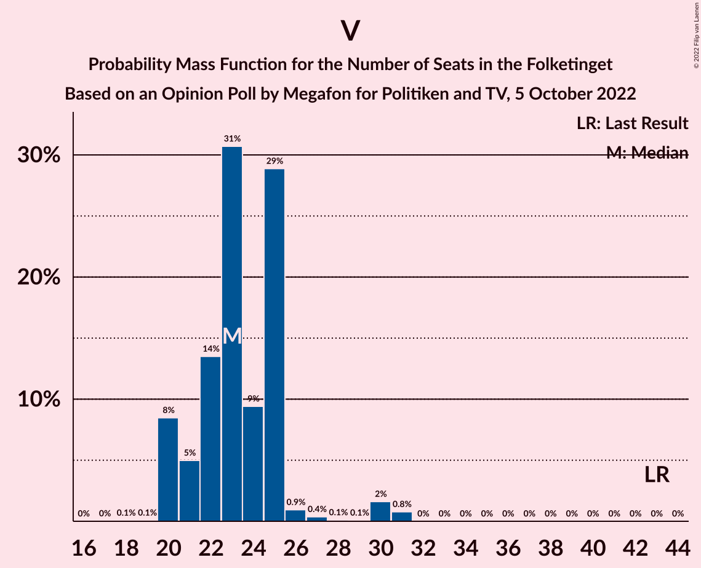

| Number of Seats | Probability | Accumulated | Special Marks |
|:---------------:|:-----------:|:-----------:|:-------------:|
| 18 | 0.1% | 100% |  |
| 19 | 0.1% | 99.9% |  |
| 20 | 8% | 99.8% |  |
| 21 | 5% | 91% |  |
| 22 | 14% | 86% |  |
| 23 | 31% | 73% | Median |
| 24 | 9% | 42% |  |
| 25 | 29% | 33% |  |
| 26 | 0.9% | 4% |  |
| 27 | 0.4% | 3% |  |
| 28 | 0.1% | 3% |  |
| 29 | 0.1% | 2% |  |
| 30 | 2% | 2% |  |
| 31 | 0.8% | 0.8% |  |
| 32 | 0% | 0% |  |
| 33 | 0% | 0% |  |
| 34 | 0% | 0% |  |
| 35 | 0% | 0% |  |
| 36 | 0% | 0% |  |
| 37 | 0% | 0% |  |
| 38 | 0% | 0% |  |
| 39 | 0% | 0% |  |
| 40 | 0% | 0% |  |
| 41 | 0% | 0% |  |
| 42 | 0% | 0% |  |
| 43 | 0% | 0% | Last Result |

## Technical Information

### Opinion Poll

+ **Polling firm:** Megafon
+ **Commissioner(s):** Politiken and TV
+ **Fieldwork period:** 5 October 2022

### Calculations

+ **Sample size:** 1025
+ **Simulations done:** 1,048,576
+ **Error estimate:** 2.74%

