# Opinion Poll by Gallup for Berlingske, 6 October 2022

<a href="#voting-intentions">Voting Intentions</a> | <a href="#seats">Seats</a> | <a href="#coalitions">Coalitions</a> | <a href="#technical-information">Technical Information</a>

## Voting Intentions

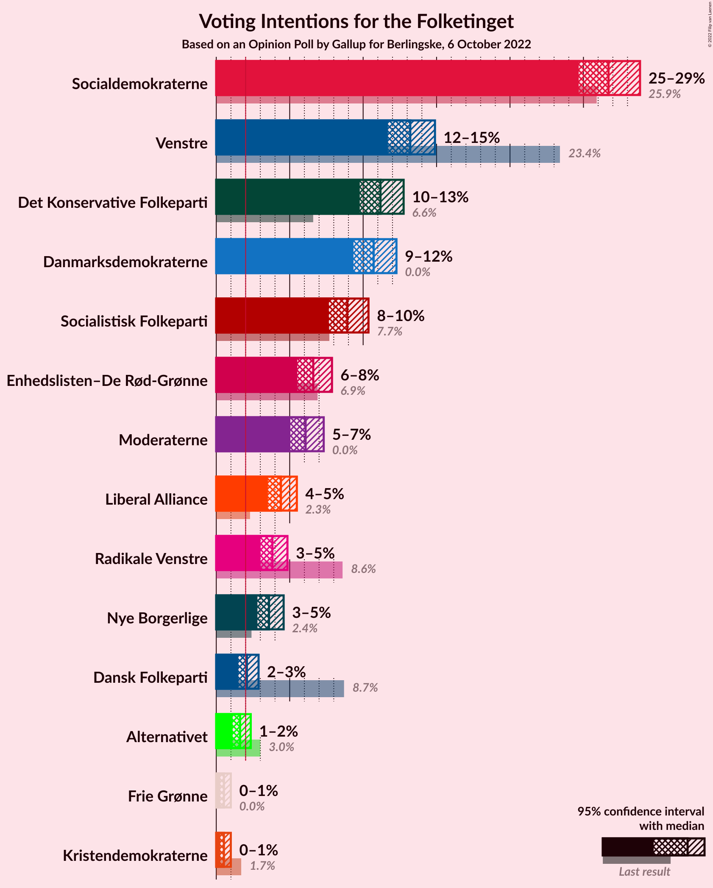

### Confidence Intervals

| Party | Last Result | Poll Result | 80% Confidence Interval | 90% Confidence Interval | 95% Confidence Interval | 99% Confidence Interval |
|:-----:|:-----------:|:-----------:|:-----------------------:|:-----------------------:|:-----------------------:|:-----------------------:|
| Socialdemokraterne | 25.9% | 26.7% | 25.4–28.1% |25.0–28.5% |24.7–28.9% |24.0–29.5% |
| Venstre | 23.4% | 13.2% | 12.2–14.3% |11.9–14.6% |11.7–14.9% |11.2–15.4% |
| Det Konservative Folkeparti | 6.6% | 11.2% | 10.3–12.2% |10.0–12.5% |9.8–12.8% |9.3–13.3% |
| Danmarksdemokraterne | 0.0% | 10.7% | 9.8–11.7% |9.6–12.0% |9.3–12.3% |8.9–12.8% |
| Socialistisk Folkeparti | 7.7% | 8.9% | 8.1–9.9% |7.9–10.1% |7.7–10.4% |7.3–10.8% |
| Enhedslisten–De Rød-Grønne | 6.9% | 6.6% | 5.9–7.4% |5.7–7.7% |5.5–7.9% |5.2–8.3% |
| Moderaterne | 0.0% | 6.1% | 5.4–6.9% |5.2–7.1% |5.0–7.3% |4.7–7.7% |
| Liberal Alliance | 2.3% | 4.4% | 3.8–5.1% |3.7–5.3% |3.5–5.5% |3.3–5.8% |
| Radikale Venstre | 8.6% | 3.8% | 3.3–4.5% |3.1–4.7% |3.0–4.8% |2.8–5.2% |
| Nye Borgerlige | 2.4% | 3.6% | 3.1–4.2% |2.9–4.4% |2.8–4.6% |2.6–4.9% |
| Dansk Folkeparti | 8.7% | 2.1% | 1.7–2.6% |1.6–2.7% |1.5–2.9% |1.3–3.2% |
| Alternativet | 3.0% | 1.6% | 1.3–2.1% |1.2–2.2% |1.1–2.3% |1.0–2.6% |
| Kristendemokraterne | 1.7% | 0.5% | 0.4–0.8% |0.3–0.9% |0.3–1.0% |0.2–1.2% |
| Frie Grønne | 0.0% | 0.5% | 0.4–0.8% |0.3–0.9% |0.3–1.0% |0.2–1.2% |

*Note:* The poll result column reflects the actual value used in the calculations. Published results may vary slightly, and in addition be rounded to fewer digits.

## Seats

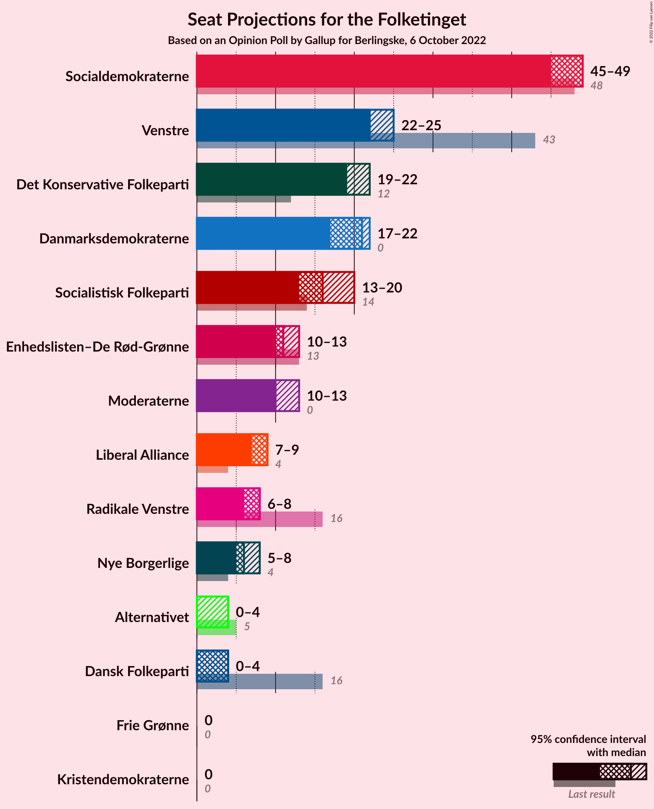

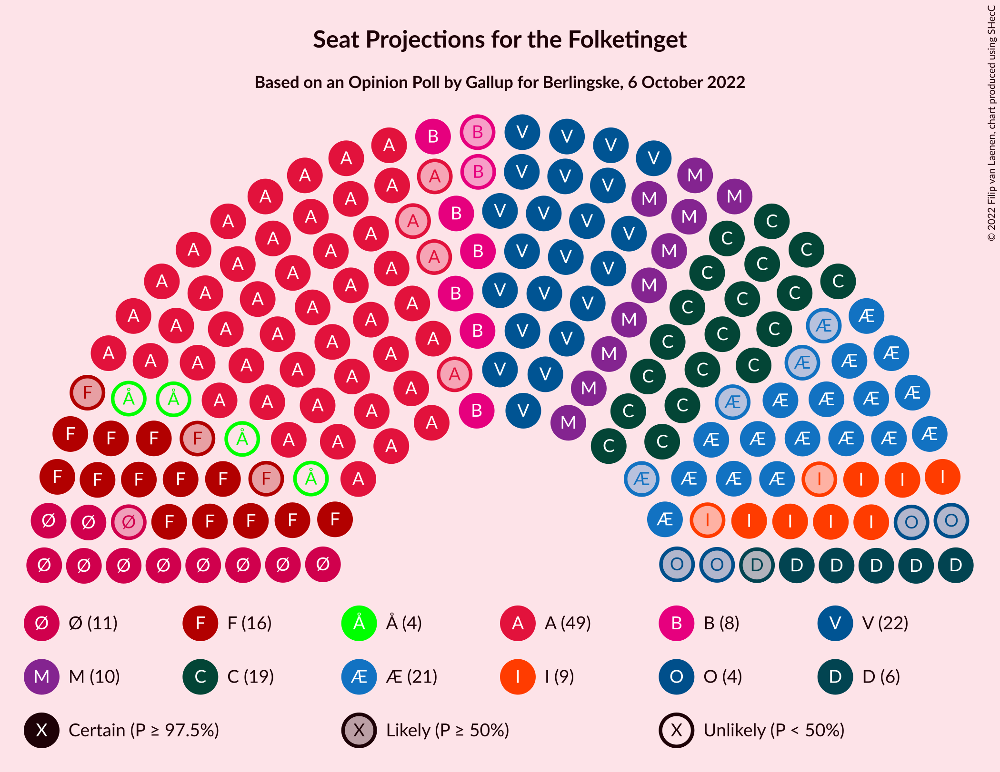

### Confidence Intervals

| Party | Last Result | Median | 80% Confidence Interval | 90% Confidence Interval | 95% Confidence Interval | 99% Confidence Interval |
|:-----:|:-----------:|:------:|:-----------------------:|:-----------------------:|:-----------------------:|:-----------------------:|
| <a href="#socialdemokraterne">Socialdemokraterne</a> | 48 | 49 | 46–49 |46–49 |45–49 |44–54 |
| <a href="#venstre">Venstre</a> | 43 | 22 | 22–24 |22–25 |22–25 |21–26 |
| <a href="#det-konservative-folkeparti">Det Konservative Folkeparti</a> | 12 | 19 | 19–21 |19–22 |19–22 |18–24 |
| <a href="#danmarksdemokraterne">Danmarksdemokraterne</a> | 0 | 21 | 20–21 |17–21 |17–22 |15–22 |
| <a href="#socialistisk-folkeparti">Socialistisk Folkeparti</a> | 14 | 16 | 13–16 |13–17 |13–20 |13–20 |
| <a href="#enhedslisten–de-rød-grønne">Enhedslisten–De Rød-Grønne</a> | 13 | 11 | 10–11 |10–12 |10–13 |9–14 |
| <a href="#moderaterne">Moderaterne</a> | 0 | 10 | 10–12 |10–13 |10–13 |9–13 |
| <a href="#liberal-alliance">Liberal Alliance</a> | 4 | 9 | 8–9 |8–9 |7–9 |6–10 |
| <a href="#radikale-venstre">Radikale Venstre</a> | 16 | 8 | 7–8 |7–8 |6–8 |5–9 |
| <a href="#nye-borgerlige">Nye Borgerlige</a> | 4 | 6 | 6 |5–7 |5–8 |5–9 |
| <a href="#dansk-folkeparti">Dansk Folkeparti</a> | 16 | 4 | 0–4 |0–4 |0–4 |0–5 |
| <a href="#alternativet">Alternativet</a> | 5 | 0 | 0–4 |0–4 |0–4 |0–4 |
| <a href="#kristendemokraterne">Kristendemokraterne</a> | 0 | 0 | 0 |0 |0 |0 |
| <a href="#frie-grønne">Frie Grønne</a> | 0 | 0 | 0 |0 |0 |0 |

### Socialdemokraterne

*For a full overview of the results for this party, see the [Socialdemokraterne](party-socialdemokraterne.html) page.*

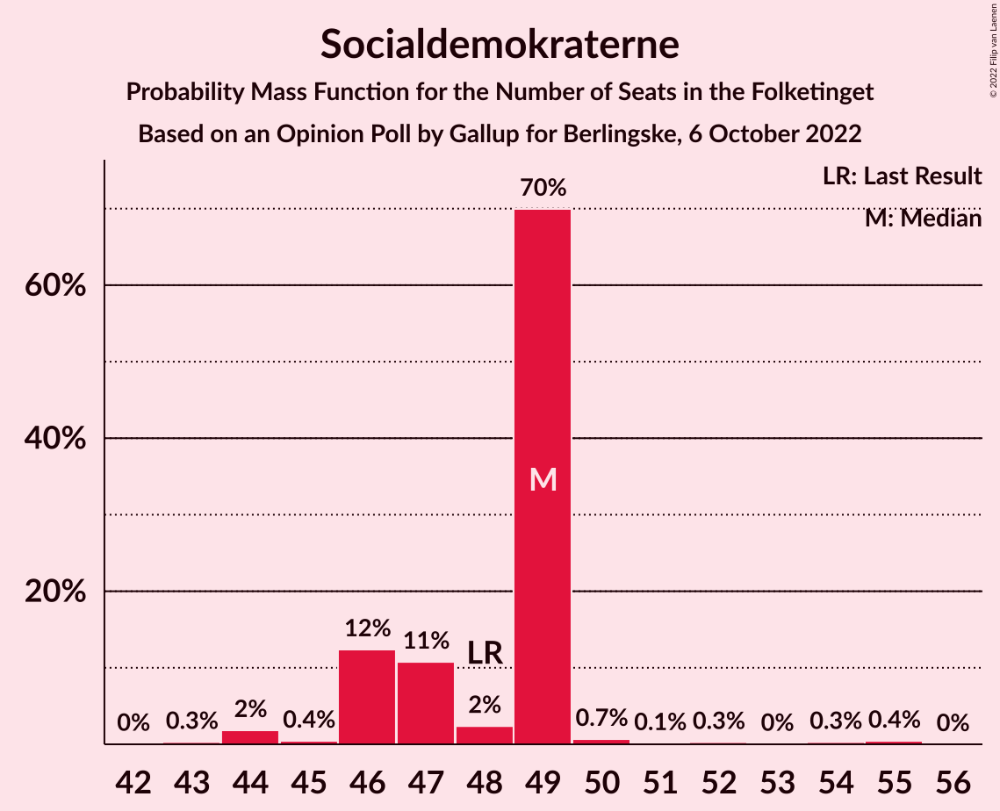

| Number of Seats | Probability | Accumulated | Special Marks |
|:---------------:|:-----------:|:-----------:|:-------------:|
| 42 | 0% | 100% |  |
| 43 | 0.3% | 99.9% |  |
| 44 | 2% | 99.7% |  |
| 45 | 0.4% | 98% |  |
| 46 | 12% | 97% |  |
| 47 | 11% | 85% |  |
| 48 | 2% | 74% | Last Result |
| 49 | 70% | 72% | Median |
| 50 | 0.7% | 2% |  |
| 51 | 0.1% | 1.2% |  |
| 52 | 0.3% | 1.1% |  |
| 53 | 0% | 0.8% |  |
| 54 | 0.3% | 0.7% |  |
| 55 | 0.4% | 0.4% |  |
| 56 | 0% | 0% |  |

### Venstre

*For a full overview of the results for this party, see the [Venstre](party-venstre.html) page.*

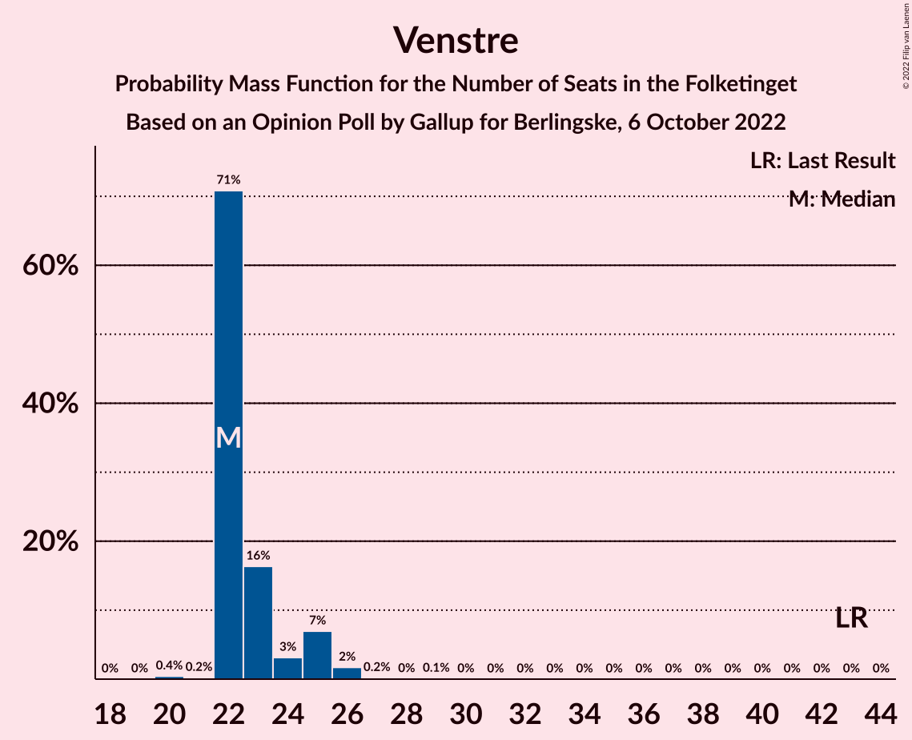

| Number of Seats | Probability | Accumulated | Special Marks |
|:---------------:|:-----------:|:-----------:|:-------------:|
| 20 | 0.4% | 100% |  |
| 21 | 0.2% | 99.6% |  |
| 22 | 71% | 99.3% | Median |
| 23 | 16% | 29% |  |
| 24 | 3% | 12% |  |
| 25 | 7% | 9% |  |
| 26 | 2% | 2% |  |
| 27 | 0.2% | 0.4% |  |
| 28 | 0% | 0.2% |  |
| 29 | 0.1% | 0.1% |  |
| 30 | 0% | 0% |  |
| 31 | 0% | 0% |  |
| 32 | 0% | 0% |  |
| 33 | 0% | 0% |  |
| 34 | 0% | 0% |  |
| 35 | 0% | 0% |  |
| 36 | 0% | 0% |  |
| 37 | 0% | 0% |  |
| 38 | 0% | 0% |  |
| 39 | 0% | 0% |  |
| 40 | 0% | 0% |  |
| 41 | 0% | 0% |  |
| 42 | 0% | 0% |  |
| 43 | 0% | 0% | Last Result |

### Det Konservative Folkeparti

*For a full overview of the results for this party, see the [Det Konservative Folkeparti](party-detkonservativefolkeparti.html) page.*

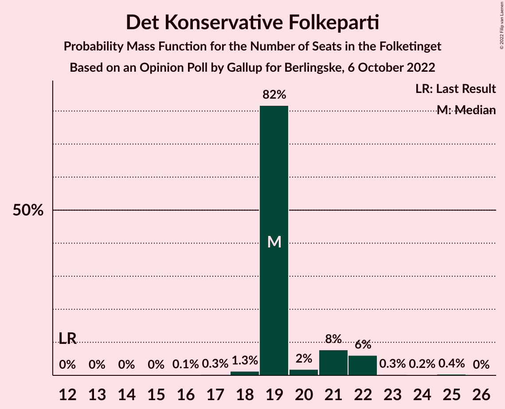

| Number of Seats | Probability | Accumulated | Special Marks |
|:---------------:|:-----------:|:-----------:|:-------------:|
| 12 | 0% | 100% | Last Result |
| 13 | 0% | 100% |  |
| 14 | 0% | 100% |  |
| 15 | 0% | 100% |  |
| 16 | 0.1% | 100% |  |
| 17 | 0.3% | 99.9% |  |
| 18 | 1.3% | 99.6% |  |
| 19 | 82% | 98% | Median |
| 20 | 2% | 17% |  |
| 21 | 8% | 15% |  |
| 22 | 6% | 7% |  |
| 23 | 0.3% | 0.9% |  |
| 24 | 0.2% | 0.6% |  |
| 25 | 0.4% | 0.4% |  |
| 26 | 0% | 0% |  |

### Danmarksdemokraterne

*For a full overview of the results for this party, see the [Danmarksdemokraterne](party-danmarksdemokraterne.html) page.*

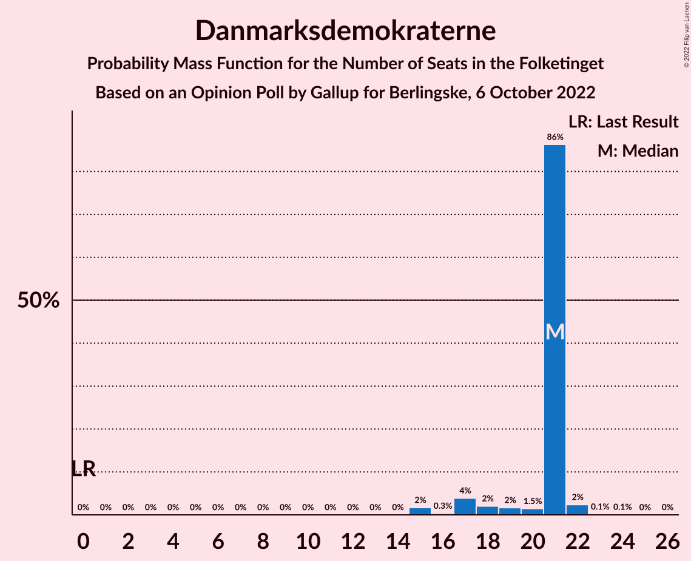

| Number of Seats | Probability | Accumulated | Special Marks |
|:---------------:|:-----------:|:-----------:|:-------------:|
| 0 | 0% | 100% | Last Result |
| 1 | 0% | 100% |  |
| 2 | 0% | 100% |  |
| 3 | 0% | 100% |  |
| 4 | 0% | 100% |  |
| 5 | 0% | 100% |  |
| 6 | 0% | 100% |  |
| 7 | 0% | 100% |  |
| 8 | 0% | 100% |  |
| 9 | 0% | 100% |  |
| 10 | 0% | 100% |  |
| 11 | 0% | 100% |  |
| 12 | 0% | 100% |  |
| 13 | 0% | 100% |  |
| 14 | 0% | 100% |  |
| 15 | 2% | 100% |  |
| 16 | 0.3% | 98% |  |
| 17 | 4% | 98% |  |
| 18 | 2% | 94% |  |
| 19 | 2% | 92% |  |
| 20 | 1.5% | 90% |  |
| 21 | 86% | 89% | Median |
| 22 | 2% | 3% |  |
| 23 | 0.1% | 0.2% |  |
| 24 | 0.1% | 0.1% |  |
| 25 | 0% | 0% |  |

### Socialistisk Folkeparti

*For a full overview of the results for this party, see the [Socialistisk Folkeparti](party-socialistiskfolkeparti.html) page.*

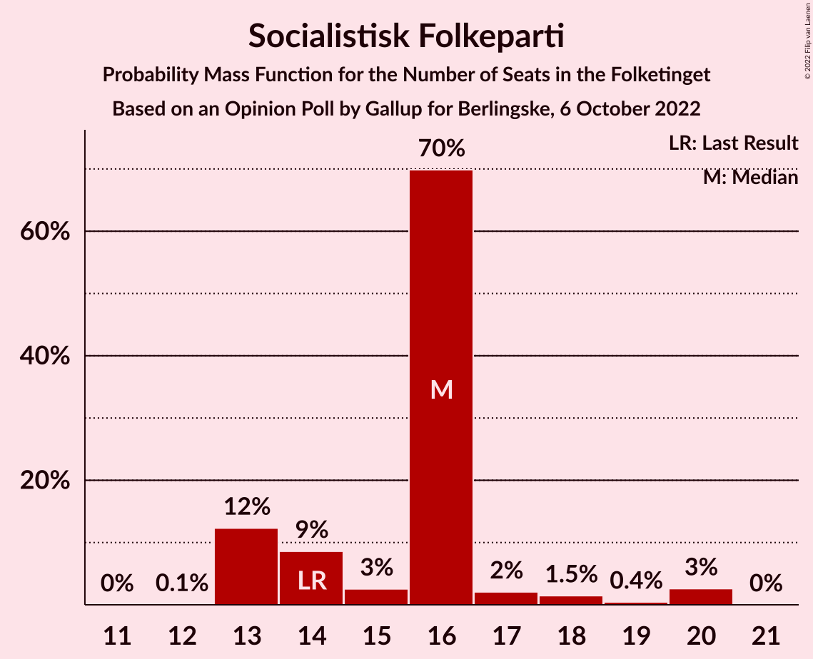

| Number of Seats | Probability | Accumulated | Special Marks |
|:---------------:|:-----------:|:-----------:|:-------------:|
| 12 | 0.1% | 100% |  |
| 13 | 12% | 99.9% |  |
| 14 | 9% | 88% | Last Result |
| 15 | 3% | 79% |  |
| 16 | 70% | 76% | Median |
| 17 | 2% | 7% |  |
| 18 | 1.5% | 5% |  |
| 19 | 0.4% | 3% |  |
| 20 | 3% | 3% |  |
| 21 | 0% | 0% |  |

### Enhedslisten–De Rød-Grønne

*For a full overview of the results for this party, see the [Enhedslisten–De Rød-Grønne](party-enhedslisten–derød-grønne.html) page.*

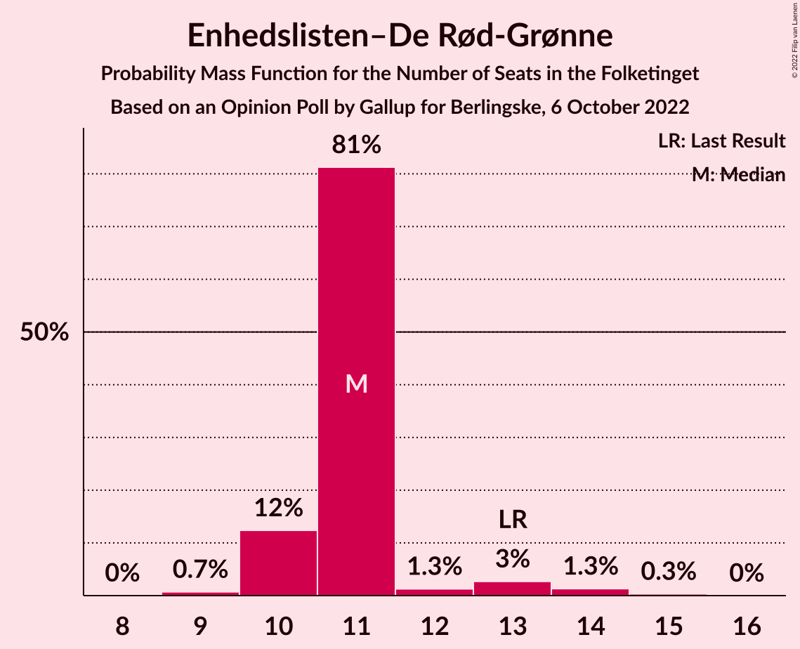

| Number of Seats | Probability | Accumulated | Special Marks |
|:---------------:|:-----------:|:-----------:|:-------------:|
| 9 | 0.7% | 100% |  |
| 10 | 12% | 99.3% |  |
| 11 | 81% | 87% | Median |
| 12 | 1.3% | 6% |  |
| 13 | 3% | 4% | Last Result |
| 14 | 1.3% | 2% |  |
| 15 | 0.3% | 0.3% |  |
| 16 | 0% | 0% |  |

### Moderaterne

*For a full overview of the results for this party, see the [Moderaterne](party-moderaterne.html) page.*

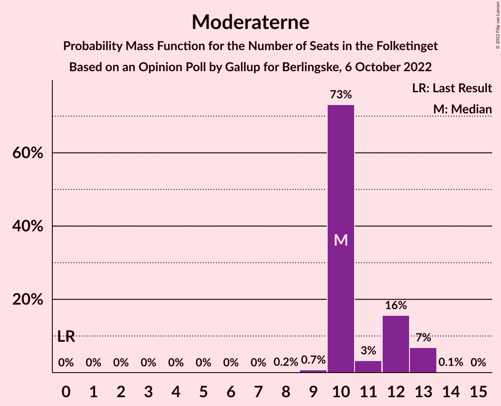

| Number of Seats | Probability | Accumulated | Special Marks |
|:---------------:|:-----------:|:-----------:|:-------------:|
| 0 | 0% | 100% | Last Result |
| 1 | 0% | 100% |  |
| 2 | 0% | 100% |  |
| 3 | 0% | 100% |  |
| 4 | 0% | 100% |  |
| 5 | 0% | 100% |  |
| 6 | 0% | 100% |  |
| 7 | 0% | 100% |  |
| 8 | 0.2% | 100% |  |
| 9 | 0.7% | 99.8% |  |
| 10 | 73% | 99.1% | Median |
| 11 | 3% | 26% |  |
| 12 | 16% | 23% |  |
| 13 | 7% | 7% |  |
| 14 | 0.1% | 0.2% |  |
| 15 | 0% | 0% |  |

### Liberal Alliance

*For a full overview of the results for this party, see the [Liberal Alliance](party-liberalalliance.html) page.*

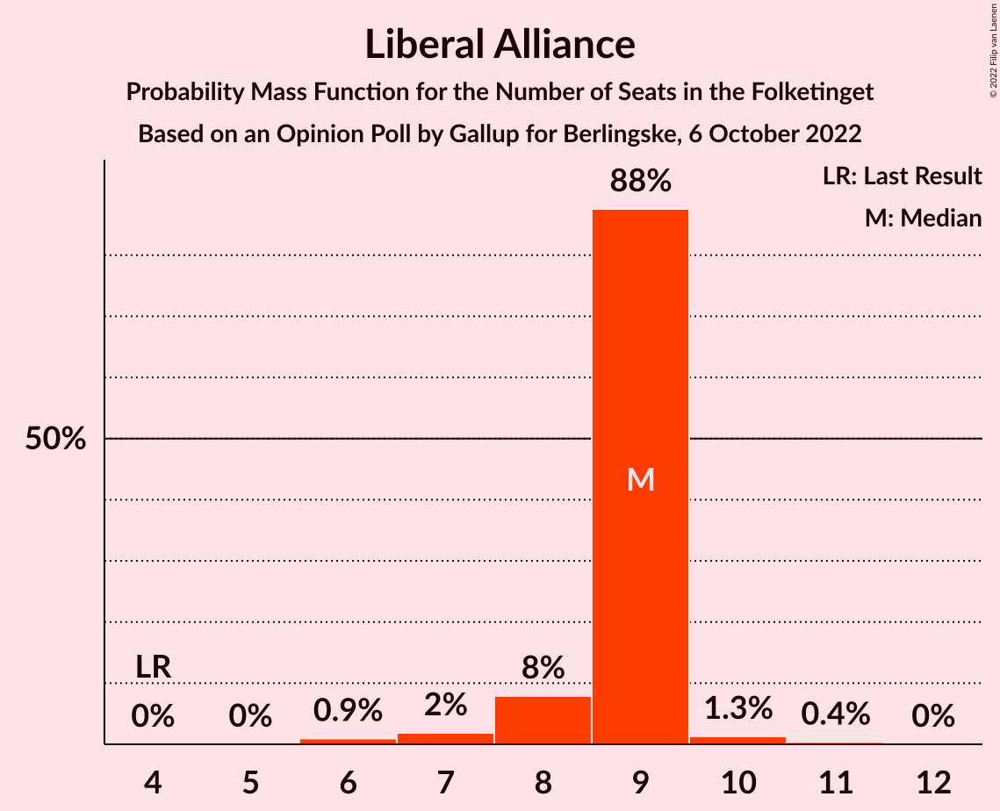

| Number of Seats | Probability | Accumulated | Special Marks |
|:---------------:|:-----------:|:-----------:|:-------------:|
| 4 | 0% | 100% | Last Result |
| 5 | 0% | 100% |  |
| 6 | 0.9% | 100% |  |
| 7 | 2% | 99.0% |  |
| 8 | 8% | 97% |  |
| 9 | 88% | 89% | Median |
| 10 | 1.3% | 2% |  |
| 11 | 0.4% | 0.4% |  |
| 12 | 0% | 0% |  |

### Radikale Venstre

*For a full overview of the results for this party, see the [Radikale Venstre](party-radikalevenstre.html) page.*

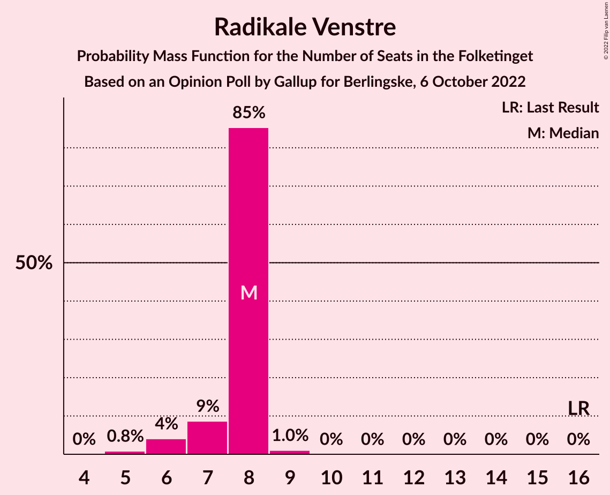

| Number of Seats | Probability | Accumulated | Special Marks |
|:---------------:|:-----------:|:-----------:|:-------------:|
| 5 | 0.8% | 100% |  |
| 6 | 4% | 99.1% |  |
| 7 | 9% | 95% |  |
| 8 | 85% | 86% | Median |
| 9 | 1.0% | 1.1% |  |
| 10 | 0% | 0% |  |
| 11 | 0% | 0% |  |
| 12 | 0% | 0% |  |
| 13 | 0% | 0% |  |
| 14 | 0% | 0% |  |
| 15 | 0% | 0% |  |
| 16 | 0% | 0% | Last Result |

### Nye Borgerlige

*For a full overview of the results for this party, see the [Nye Borgerlige](party-nyeborgerlige.html) page.*

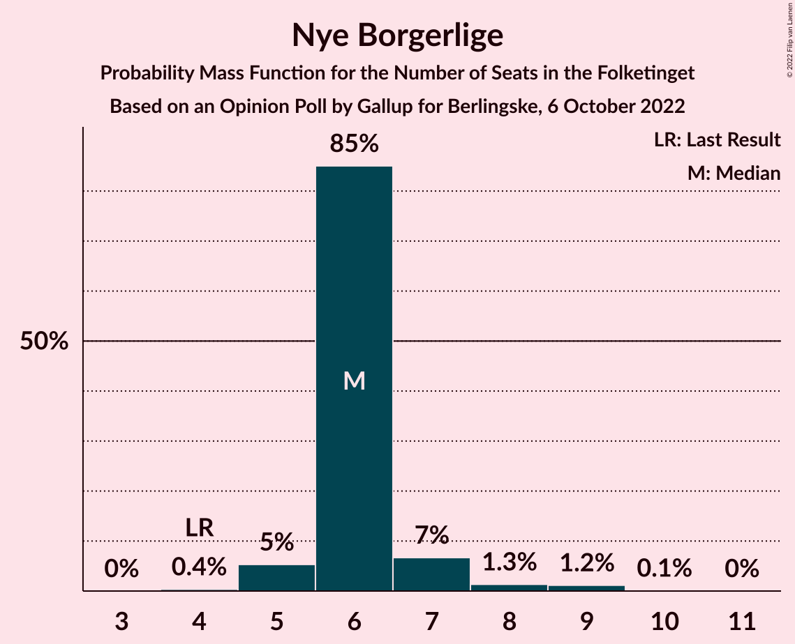

| Number of Seats | Probability | Accumulated | Special Marks |
|:---------------:|:-----------:|:-----------:|:-------------:|
| 4 | 0.4% | 100% | Last Result |
| 5 | 5% | 99.6% |  |
| 6 | 85% | 94% | Median |
| 7 | 7% | 9% |  |
| 8 | 1.3% | 3% |  |
| 9 | 1.2% | 1.3% |  |
| 10 | 0.1% | 0.1% |  |
| 11 | 0% | 0% |  |

### Dansk Folkeparti

*For a full overview of the results for this party, see the [Dansk Folkeparti](party-danskfolkeparti.html) page.*

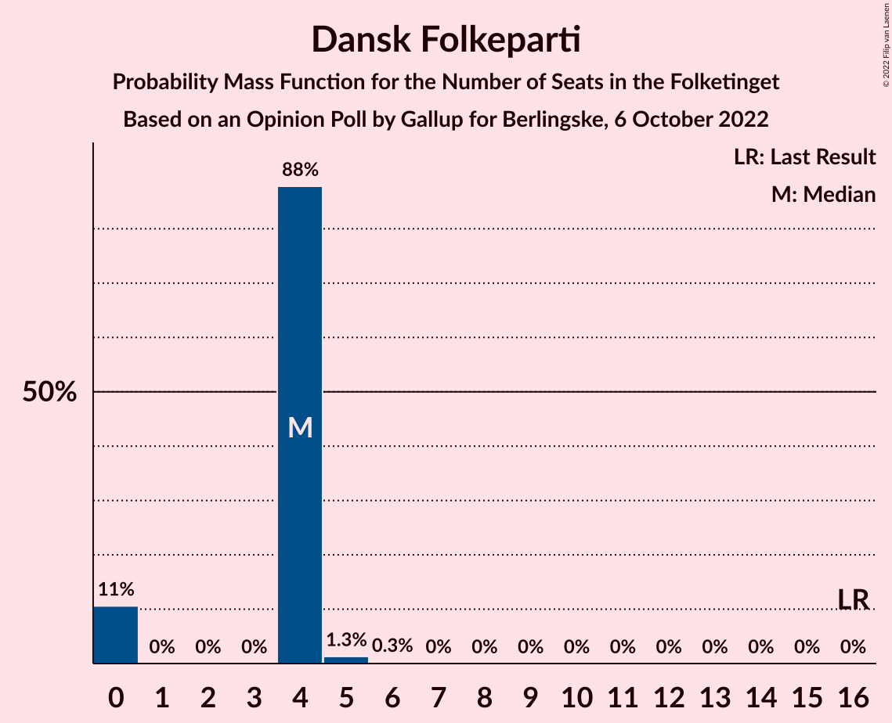

| Number of Seats | Probability | Accumulated | Special Marks |
|:---------------:|:-----------:|:-----------:|:-------------:|
| 0 | 11% | 100% |  |
| 1 | 0% | 89% |  |
| 2 | 0% | 89% |  |
| 3 | 0% | 89% |  |
| 4 | 88% | 89% | Median |
| 5 | 1.3% | 2% |  |
| 6 | 0.3% | 0.3% |  |
| 7 | 0% | 0% |  |
| 8 | 0% | 0% |  |
| 9 | 0% | 0% |  |
| 10 | 0% | 0% |  |
| 11 | 0% | 0% |  |
| 12 | 0% | 0% |  |
| 13 | 0% | 0% |  |
| 14 | 0% | 0% |  |
| 15 | 0% | 0% |  |
| 16 | 0% | 0% | Last Result |

### Alternativet

*For a full overview of the results for this party, see the [Alternativet](party-alternativet.html) page.*

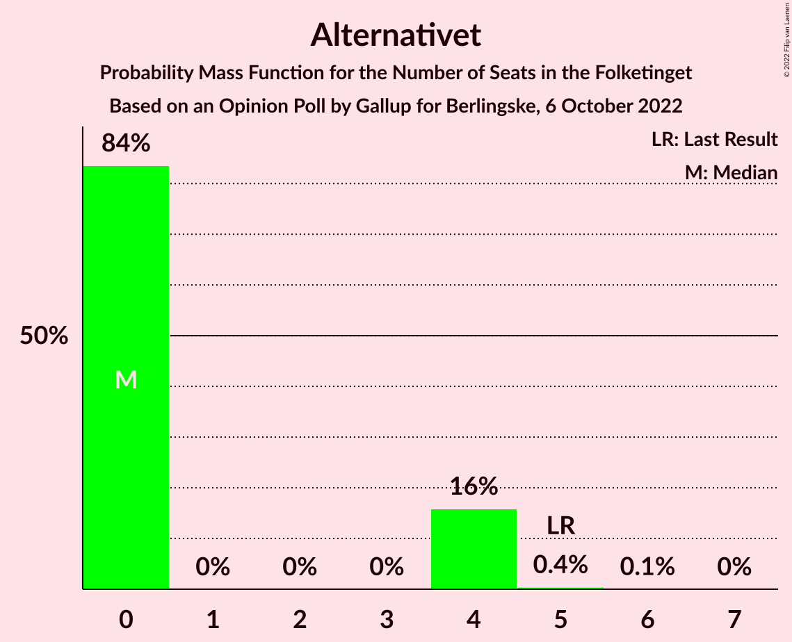

| Number of Seats | Probability | Accumulated | Special Marks |
|:---------------:|:-----------:|:-----------:|:-------------:|
| 0 | 84% | 100% | Median |
| 1 | 0% | 16% |  |
| 2 | 0% | 16% |  |
| 3 | 0% | 16% |  |
| 4 | 16% | 16% |  |
| 5 | 0.4% | 0.5% | Last Result |
| 6 | 0.1% | 0.1% |  |
| 7 | 0% | 0% |  |

### Kristendemokraterne

*For a full overview of the results for this party, see the [Kristendemokraterne](party-kristendemokraterne.html) page.*

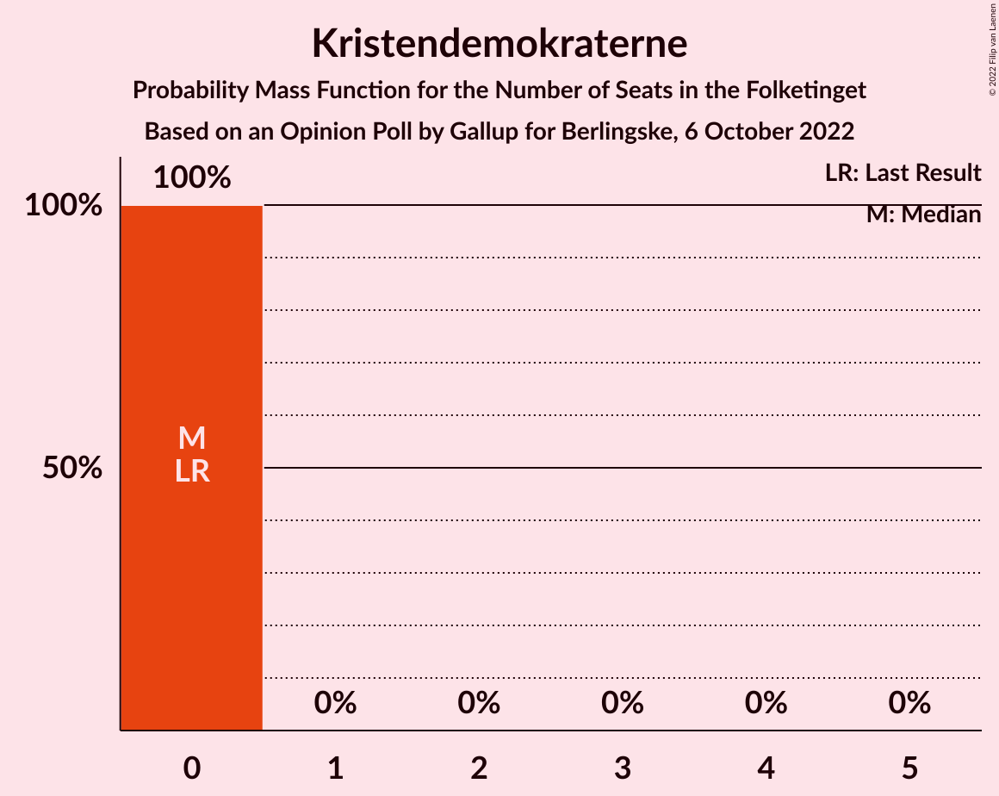

| Number of Seats | Probability | Accumulated | Special Marks |
|:---------------:|:-----------:|:-----------:|:-------------:|
| 0 | 100% | 100% | Last Result, Median |

### Frie Grønne

*For a full overview of the results for this party, see the [Frie Grønne](party-friegrønne.html) page.*

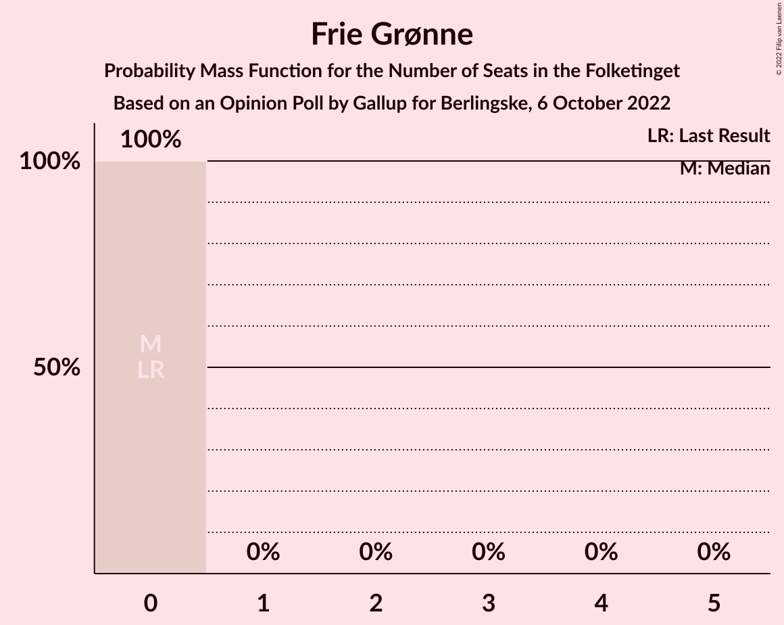

| Number of Seats | Probability | Accumulated | Special Marks |
|:---------------:|:-----------:|:-----------:|:-------------:|
| 0 | 100% | 100% | Last Result, Median |

## Coalitions

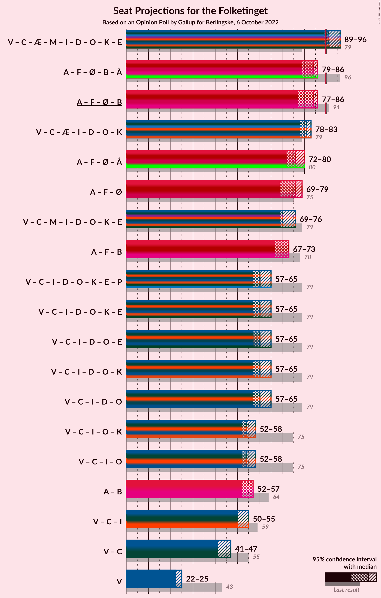

### Confidence Intervals

| Coalition | Last Result | Median | Majority? | 80% Confidence Interval | 90% Confidence Interval | 95% Confidence Interval | 99% Confidence Interval |
|:---------:|:-----------:|:------:|:---------:|:-----------------------:|:-----------------------:|:-----------------------:|:-----------------------:|
| Socialdemokraterne – Socialistisk Folkeparti – Enhedslisten–De Rød-Grønne – Radikale Venstre – Alternativet | 96 | 84 | 0.4% | 81–84 | 79–84 | 79–86 | 78–89 |
| Socialdemokraterne – Socialistisk Folkeparti – Enhedslisten–De Rød-Grønne – Radikale Venstre | 91 | 84 | 0.1% | 77–84 | 77–84 | 77–86 | 77–88 |
| Venstre – Det Konservative Folkeparti – Danmarksdemokraterne – Liberal Alliance – Nye Borgerlige – Dansk Folkeparti – Kristendemokraterne | 79 | 81 | 0% | 81–82 | 79–83 | 78–83 | 74–86 |
| Socialdemokraterne – Socialistisk Folkeparti – Enhedslisten–De Rød-Grønne – Alternativet | 80 | 76 | 0% | 73–76 | 72–78 | 72–80 | 70–81 |
| Socialdemokraterne – Socialistisk Folkeparti – Enhedslisten–De Rød-Grønne | 75 | 76 | 0% | 69–76 | 69–77 | 69–79 | 69–81 |
| Socialdemokraterne – Socialistisk Folkeparti – Radikale Venstre | 78 | 73 | 0% | 67–73 | 67–73 | 67–73 | 66–77 |
| Venstre – Det Konservative Folkeparti – Liberal Alliance – Nye Borgerlige – Dansk Folkeparti – Kristendemokraterne | 79 | 60 | 0% | 60–62 | 60–62 | 57–65 | 57–66 |
| Venstre – Det Konservative Folkeparti – Liberal Alliance – Nye Borgerlige – Dansk Folkeparti | 79 | 60 | 0% | 60–62 | 60–62 | 57–65 | 57–66 |
| Venstre – Det Konservative Folkeparti – Liberal Alliance – Dansk Folkeparti – Kristendemokraterne | 75 | 54 | 0% | 54–55 | 53–57 | 52–58 | 50–60 |
| Venstre – Det Konservative Folkeparti – Liberal Alliance – Dansk Folkeparti | 75 | 54 | 0% | 54–55 | 53–57 | 52–58 | 50–60 |
| Socialdemokraterne – Radikale Venstre | 64 | 57 | 0% | 54–57 | 53–57 | 52–57 | 50–61 |
| Venstre – Det Konservative Folkeparti – Liberal Alliance | 59 | 50 | 0% | 50–53 | 50–55 | 50–55 | 48–57 |
| Venstre – Det Konservative Folkeparti | 55 | 41 | 0% | 41–45 | 41–46 | 41–47 | 40–48 |
| Venstre | 43 | 22 | 0% | 22–24 | 22–25 | 22–25 | 21–26 |

### Socialdemokraterne – Socialistisk Folkeparti – Enhedslisten–De Rød-Grønne – Radikale Venstre – Alternativet

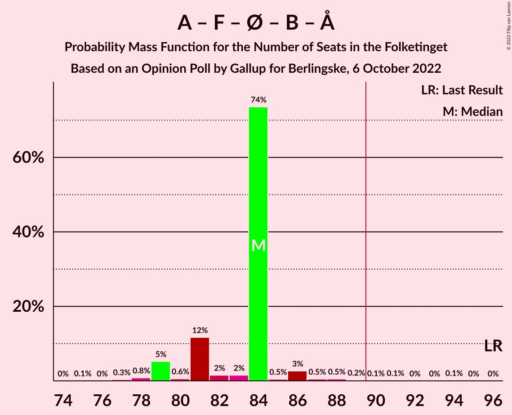

| Number of Seats | Probability | Accumulated | Special Marks |
|:---------------:|:-----------:|:-----------:|:-------------:|
| 75 | 0.1% | 100% |  |
| 76 | 0% | 99.9% |  |
| 77 | 0.3% | 99.9% |  |
| 78 | 0.8% | 99.6% |  |
| 79 | 5% | 98.8% |  |
| 80 | 0.6% | 94% |  |
| 81 | 12% | 93% |  |
| 82 | 2% | 81% |  |
| 83 | 2% | 80% |  |
| 84 | 74% | 78% | Median |
| 85 | 0.5% | 5% |  |
| 86 | 3% | 4% |  |
| 87 | 0.5% | 2% |  |
| 88 | 0.5% | 1.1% |  |
| 89 | 0.2% | 0.6% |  |
| 90 | 0.1% | 0.4% | Majority |
| 91 | 0.1% | 0.3% |  |
| 92 | 0% | 0.2% |  |
| 93 | 0% | 0.1% |  |
| 94 | 0.1% | 0.1% |  |
| 95 | 0% | 0% |  |
| 96 | 0% | 0% | Last Result |

### Socialdemokraterne – Socialistisk Folkeparti – Enhedslisten–De Rød-Grønne – Radikale Venstre

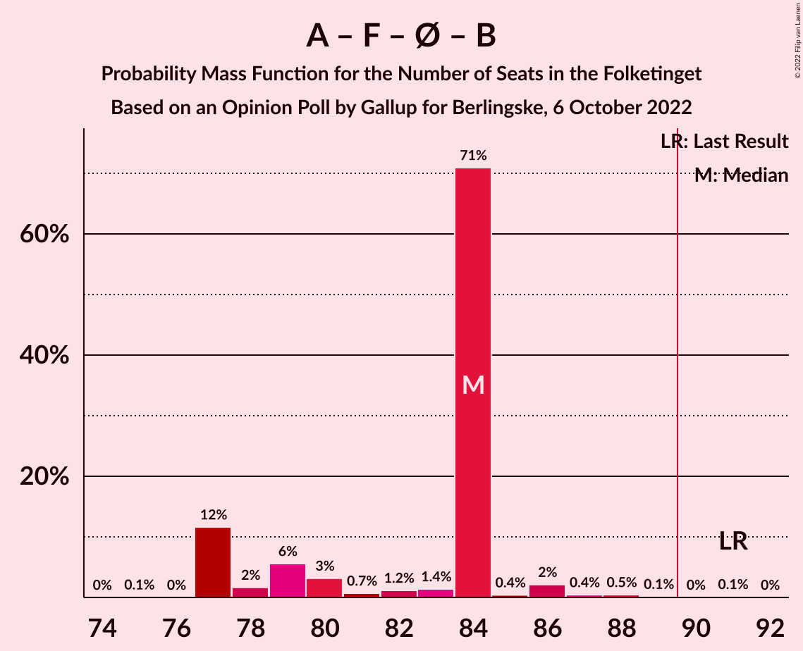

| Number of Seats | Probability | Accumulated | Special Marks |
|:---------------:|:-----------:|:-----------:|:-------------:|
| 75 | 0.1% | 100% |  |
| 76 | 0% | 99.9% |  |
| 77 | 12% | 99.9% |  |
| 78 | 2% | 88% |  |
| 79 | 6% | 87% |  |
| 80 | 3% | 81% |  |
| 81 | 0.7% | 78% |  |
| 82 | 1.2% | 77% |  |
| 83 | 1.4% | 76% |  |
| 84 | 71% | 75% | Median |
| 85 | 0.4% | 4% |  |
| 86 | 2% | 3% |  |
| 87 | 0.4% | 1.2% |  |
| 88 | 0.5% | 0.8% |  |
| 89 | 0.1% | 0.3% |  |
| 90 | 0% | 0.1% | Majority |
| 91 | 0.1% | 0.1% | Last Result |
| 92 | 0% | 0% |  |

### Venstre – Det Konservative Folkeparti – Danmarksdemokraterne – Liberal Alliance – Nye Borgerlige – Dansk Folkeparti – Kristendemokraterne

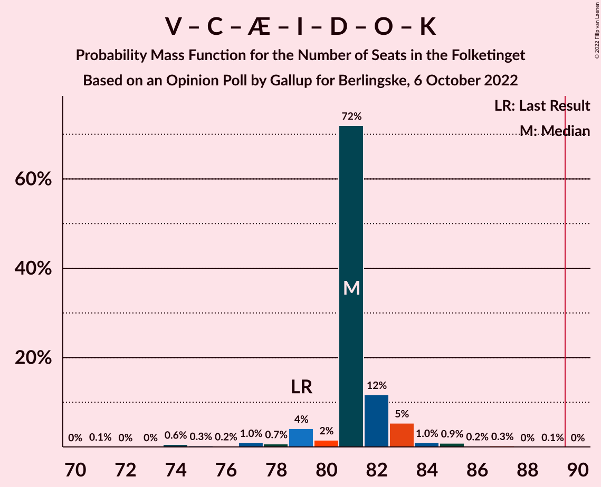

| Number of Seats | Probability | Accumulated | Special Marks |
|:---------------:|:-----------:|:-----------:|:-------------:|
| 71 | 0.1% | 100% |  |
| 72 | 0% | 99.9% |  |
| 73 | 0% | 99.9% |  |
| 74 | 0.6% | 99.8% |  |
| 75 | 0.3% | 99.3% |  |
| 76 | 0.2% | 99.0% |  |
| 77 | 1.0% | 98.8% |  |
| 78 | 0.7% | 98% |  |
| 79 | 4% | 97% | Last Result |
| 80 | 2% | 93% |  |
| 81 | 72% | 91% | Median |
| 82 | 12% | 19% |  |
| 83 | 5% | 8% |  |
| 84 | 1.0% | 2% |  |
| 85 | 0.9% | 1.4% |  |
| 86 | 0.2% | 0.5% |  |
| 87 | 0.3% | 0.3% |  |
| 88 | 0% | 0.1% |  |
| 89 | 0.1% | 0.1% |  |
| 90 | 0% | 0% | Majority |

### Socialdemokraterne – Socialistisk Folkeparti – Enhedslisten–De Rød-Grønne – Alternativet

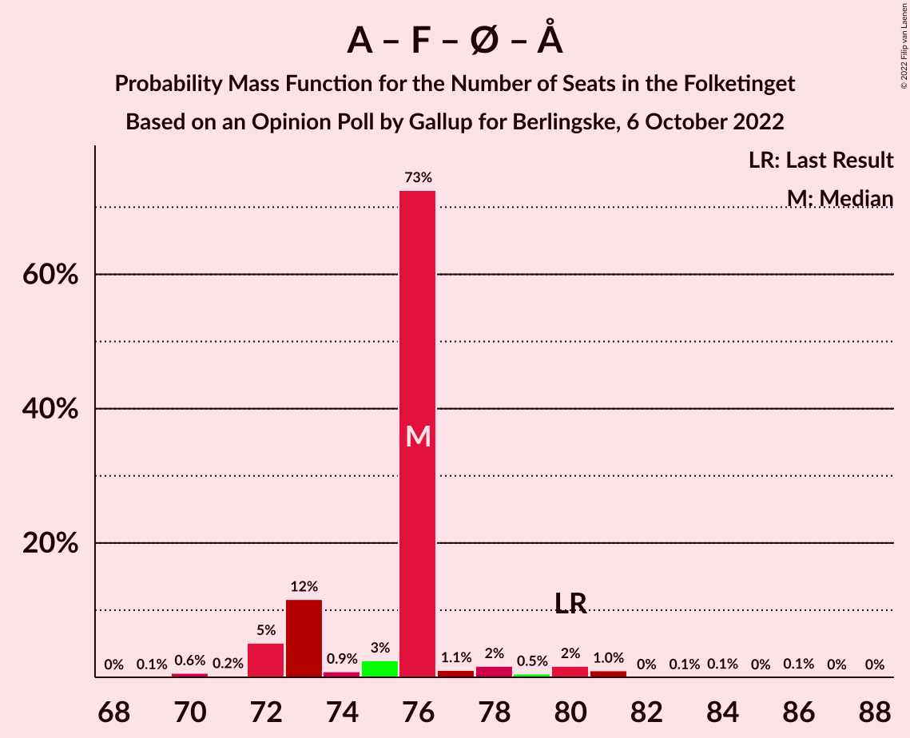

| Number of Seats | Probability | Accumulated | Special Marks |
|:---------------:|:-----------:|:-----------:|:-------------:|
| 69 | 0.1% | 100% |  |
| 70 | 0.6% | 99.9% |  |
| 71 | 0.2% | 99.3% |  |
| 72 | 5% | 99.1% |  |
| 73 | 12% | 94% |  |
| 74 | 0.9% | 82% |  |
| 75 | 3% | 81% |  |
| 76 | 73% | 79% | Median |
| 77 | 1.1% | 6% |  |
| 78 | 2% | 5% |  |
| 79 | 0.5% | 4% |  |
| 80 | 2% | 3% | Last Result |
| 81 | 1.0% | 1.4% |  |
| 82 | 0% | 0.4% |  |
| 83 | 0.1% | 0.3% |  |
| 84 | 0.1% | 0.3% |  |
| 85 | 0% | 0.1% |  |
| 86 | 0.1% | 0.1% |  |
| 87 | 0% | 0% |  |

### Socialdemokraterne – Socialistisk Folkeparti – Enhedslisten–De Rød-Grønne

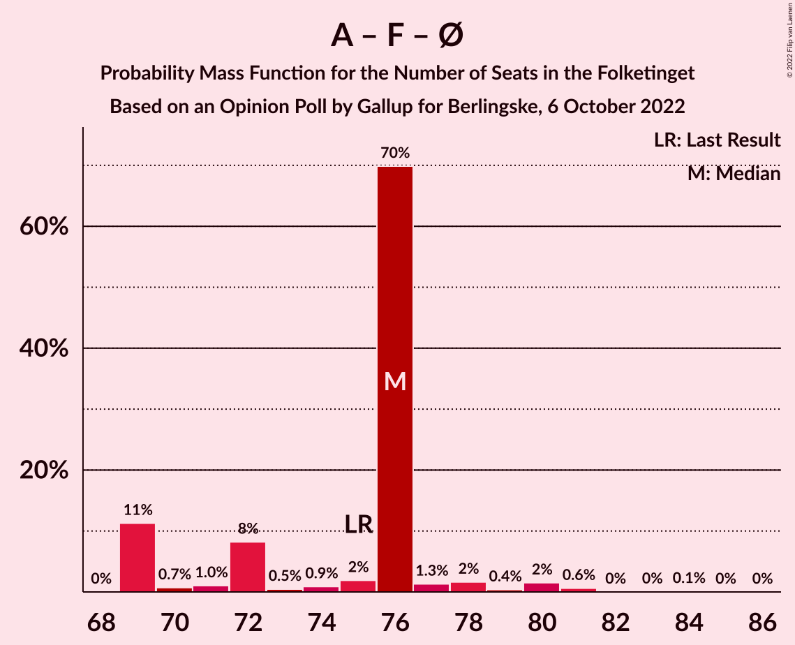

| Number of Seats | Probability | Accumulated | Special Marks |
|:---------------:|:-----------:|:-----------:|:-------------:|
| 69 | 11% | 100% |  |
| 70 | 0.7% | 89% |  |
| 71 | 1.0% | 88% |  |
| 72 | 8% | 87% |  |
| 73 | 0.5% | 79% |  |
| 74 | 0.9% | 78% |  |
| 75 | 2% | 77% | Last Result |
| 76 | 70% | 75% | Median |
| 77 | 1.3% | 6% |  |
| 78 | 2% | 4% |  |
| 79 | 0.4% | 3% |  |
| 80 | 2% | 2% |  |
| 81 | 0.6% | 0.8% |  |
| 82 | 0% | 0.2% |  |
| 83 | 0% | 0.2% |  |
| 84 | 0.1% | 0.1% |  |
| 85 | 0% | 0% |  |

### Socialdemokraterne – Socialistisk Folkeparti – Radikale Venstre

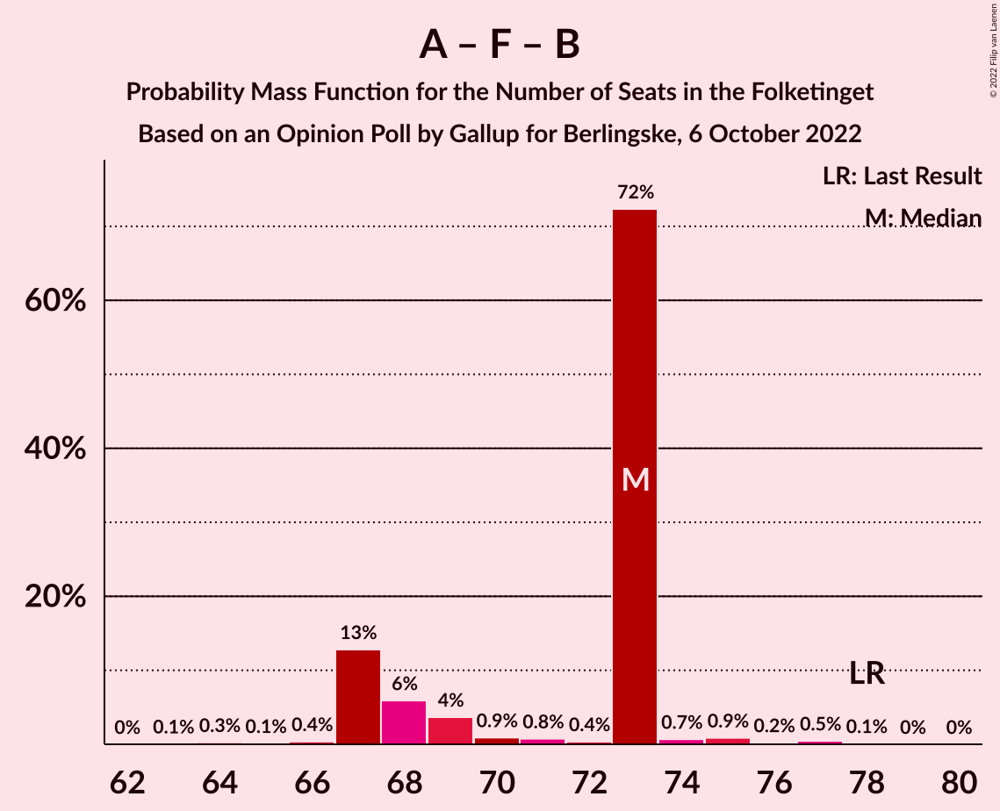

| Number of Seats | Probability | Accumulated | Special Marks |
|:---------------:|:-----------:|:-----------:|:-------------:|
| 63 | 0.1% | 100% |  |
| 64 | 0.3% | 99.9% |  |
| 65 | 0.1% | 99.7% |  |
| 66 | 0.4% | 99.6% |  |
| 67 | 13% | 99.2% |  |
| 68 | 6% | 86% |  |
| 69 | 4% | 80% |  |
| 70 | 0.9% | 77% |  |
| 71 | 0.8% | 76% |  |
| 72 | 0.4% | 75% |  |
| 73 | 72% | 75% | Median |
| 74 | 0.7% | 2% |  |
| 75 | 0.9% | 2% |  |
| 76 | 0.2% | 0.8% |  |
| 77 | 0.5% | 0.6% |  |
| 78 | 0.1% | 0.1% | Last Result |
| 79 | 0% | 0% |  |

### Venstre – Det Konservative Folkeparti – Liberal Alliance – Nye Borgerlige – Dansk Folkeparti – Kristendemokraterne

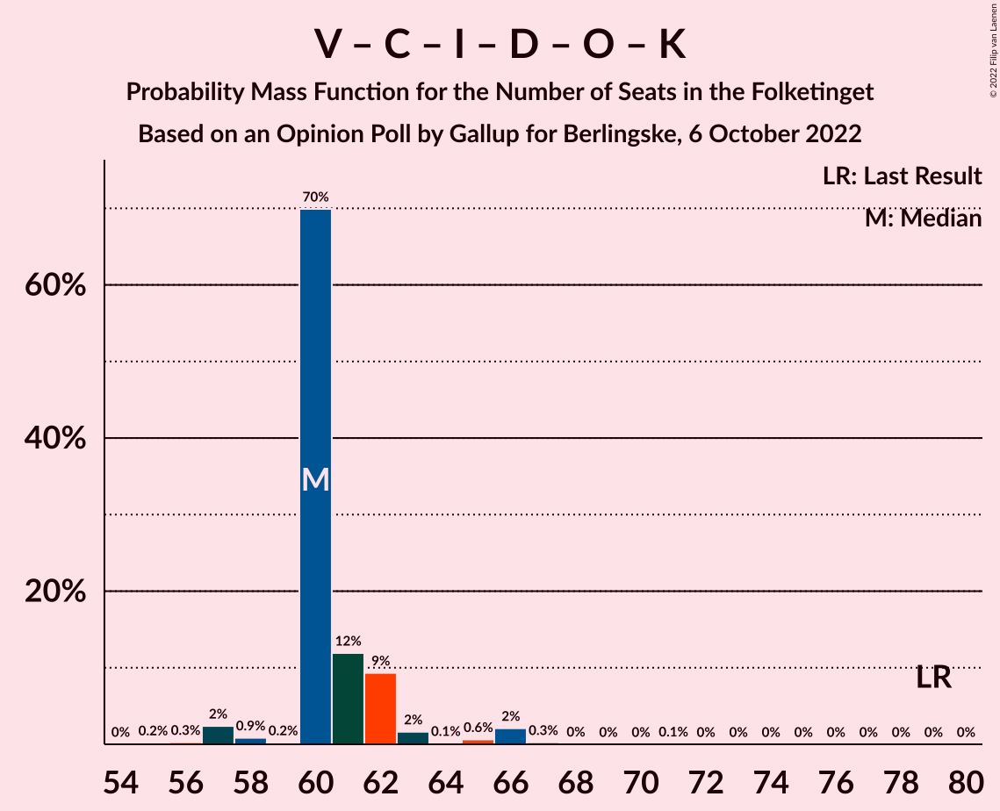

| Number of Seats | Probability | Accumulated | Special Marks |
|:---------------:|:-----------:|:-----------:|:-------------:|
| 55 | 0.2% | 100% |  |
| 56 | 0.3% | 99.8% |  |
| 57 | 2% | 99.5% |  |
| 58 | 0.9% | 97% |  |
| 59 | 0.2% | 96% |  |
| 60 | 70% | 96% | Median |
| 61 | 12% | 26% |  |
| 62 | 9% | 14% |  |
| 63 | 2% | 5% |  |
| 64 | 0.1% | 3% |  |
| 65 | 0.6% | 3% |  |
| 66 | 2% | 2% |  |
| 67 | 0.3% | 0.4% |  |
| 68 | 0% | 0.1% |  |
| 69 | 0% | 0.1% |  |
| 70 | 0% | 0.1% |  |
| 71 | 0.1% | 0.1% |  |
| 72 | 0% | 0% |  |
| 73 | 0% | 0% |  |
| 74 | 0% | 0% |  |
| 75 | 0% | 0% |  |
| 76 | 0% | 0% |  |
| 77 | 0% | 0% |  |
| 78 | 0% | 0% |  |
| 79 | 0% | 0% | Last Result |

### Venstre – Det Konservative Folkeparti – Liberal Alliance – Nye Borgerlige – Dansk Folkeparti

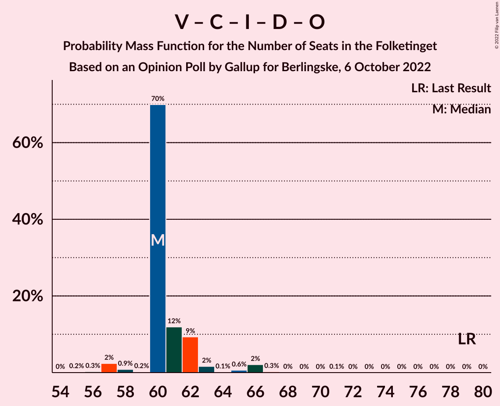

| Number of Seats | Probability | Accumulated | Special Marks |
|:---------------:|:-----------:|:-----------:|:-------------:|
| 55 | 0.2% | 100% |  |
| 56 | 0.3% | 99.8% |  |
| 57 | 2% | 99.5% |  |
| 58 | 0.9% | 97% |  |
| 59 | 0.2% | 96% |  |
| 60 | 70% | 96% | Median |
| 61 | 12% | 26% |  |
| 62 | 9% | 14% |  |
| 63 | 2% | 5% |  |
| 64 | 0.1% | 3% |  |
| 65 | 0.6% | 3% |  |
| 66 | 2% | 2% |  |
| 67 | 0.3% | 0.4% |  |
| 68 | 0% | 0.1% |  |
| 69 | 0% | 0.1% |  |
| 70 | 0% | 0.1% |  |
| 71 | 0.1% | 0.1% |  |
| 72 | 0% | 0% |  |
| 73 | 0% | 0% |  |
| 74 | 0% | 0% |  |
| 75 | 0% | 0% |  |
| 76 | 0% | 0% |  |
| 77 | 0% | 0% |  |
| 78 | 0% | 0% |  |
| 79 | 0% | 0% | Last Result |

### Venstre – Det Konservative Folkeparti – Liberal Alliance – Dansk Folkeparti – Kristendemokraterne

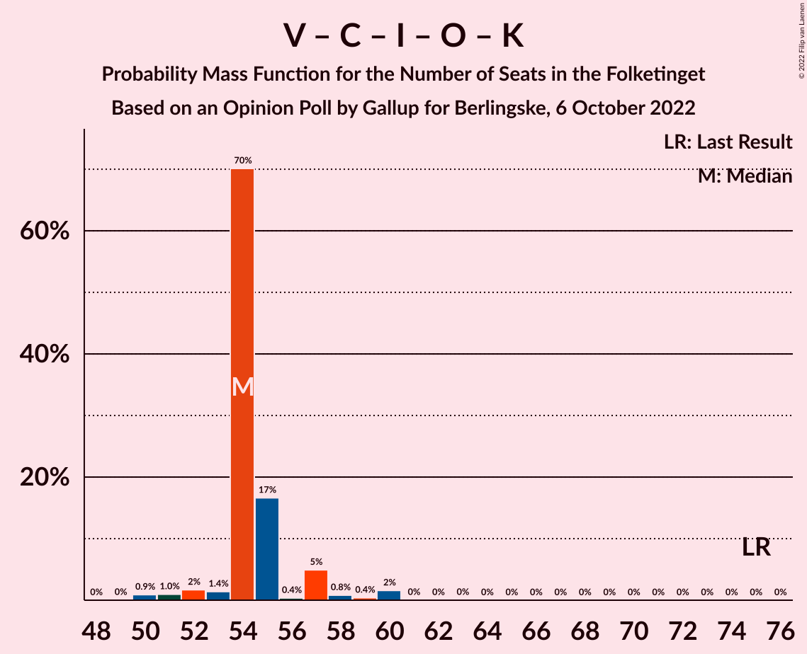

| Number of Seats | Probability | Accumulated | Special Marks |
|:---------------:|:-----------:|:-----------:|:-------------:|
| 49 | 0% | 100% |  |
| 50 | 0.9% | 99.9% |  |
| 51 | 1.0% | 99.0% |  |
| 52 | 2% | 98% |  |
| 53 | 1.4% | 96% |  |
| 54 | 70% | 95% | Median |
| 55 | 17% | 25% |  |
| 56 | 0.4% | 8% |  |
| 57 | 5% | 8% |  |
| 58 | 0.8% | 3% |  |
| 59 | 0.4% | 2% |  |
| 60 | 2% | 2% |  |
| 61 | 0% | 0.1% |  |
| 62 | 0% | 0.1% |  |
| 63 | 0% | 0% |  |
| 64 | 0% | 0% |  |
| 65 | 0% | 0% |  |
| 66 | 0% | 0% |  |
| 67 | 0% | 0% |  |
| 68 | 0% | 0% |  |
| 69 | 0% | 0% |  |
| 70 | 0% | 0% |  |
| 71 | 0% | 0% |  |
| 72 | 0% | 0% |  |
| 73 | 0% | 0% |  |
| 74 | 0% | 0% |  |
| 75 | 0% | 0% | Last Result |

### Venstre – Det Konservative Folkeparti – Liberal Alliance – Dansk Folkeparti

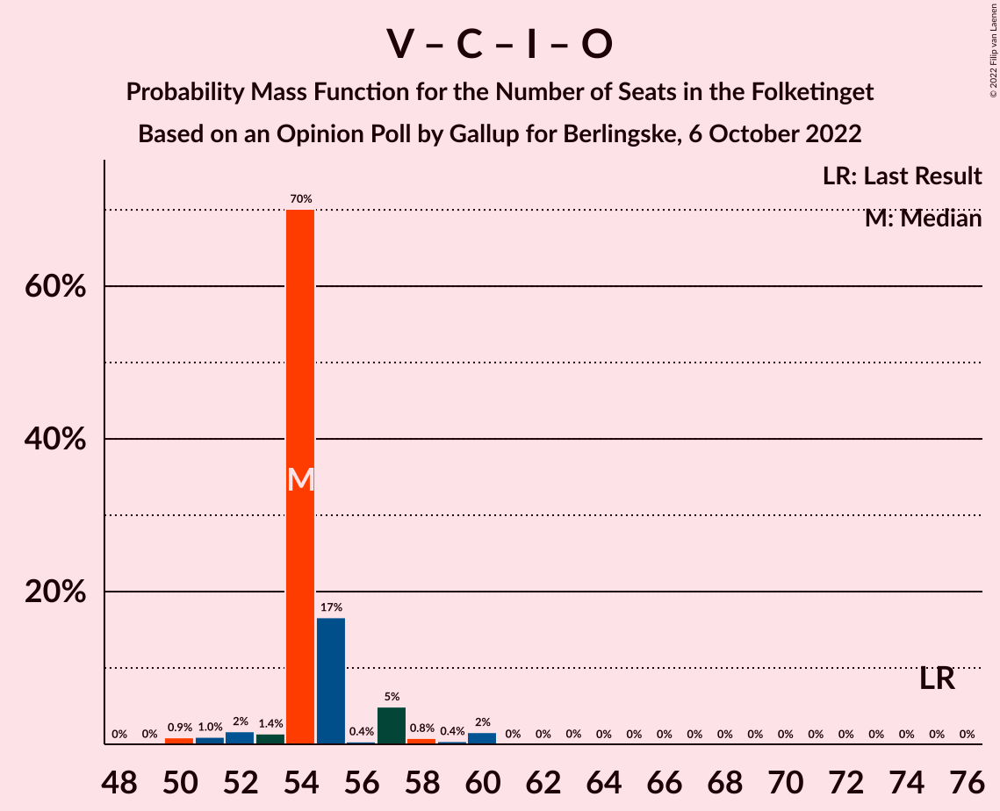

| Number of Seats | Probability | Accumulated | Special Marks |
|:---------------:|:-----------:|:-----------:|:-------------:|
| 49 | 0% | 100% |  |
| 50 | 0.9% | 99.9% |  |
| 51 | 1.0% | 99.0% |  |
| 52 | 2% | 98% |  |
| 53 | 1.4% | 96% |  |
| 54 | 70% | 95% | Median |
| 55 | 17% | 25% |  |
| 56 | 0.4% | 8% |  |
| 57 | 5% | 8% |  |
| 58 | 0.8% | 3% |  |
| 59 | 0.4% | 2% |  |
| 60 | 2% | 2% |  |
| 61 | 0% | 0.1% |  |
| 62 | 0% | 0.1% |  |
| 63 | 0% | 0% |  |
| 64 | 0% | 0% |  |
| 65 | 0% | 0% |  |
| 66 | 0% | 0% |  |
| 67 | 0% | 0% |  |
| 68 | 0% | 0% |  |
| 69 | 0% | 0% |  |
| 70 | 0% | 0% |  |
| 71 | 0% | 0% |  |
| 72 | 0% | 0% |  |
| 73 | 0% | 0% |  |
| 74 | 0% | 0% |  |
| 75 | 0% | 0% | Last Result |

### Socialdemokraterne – Radikale Venstre

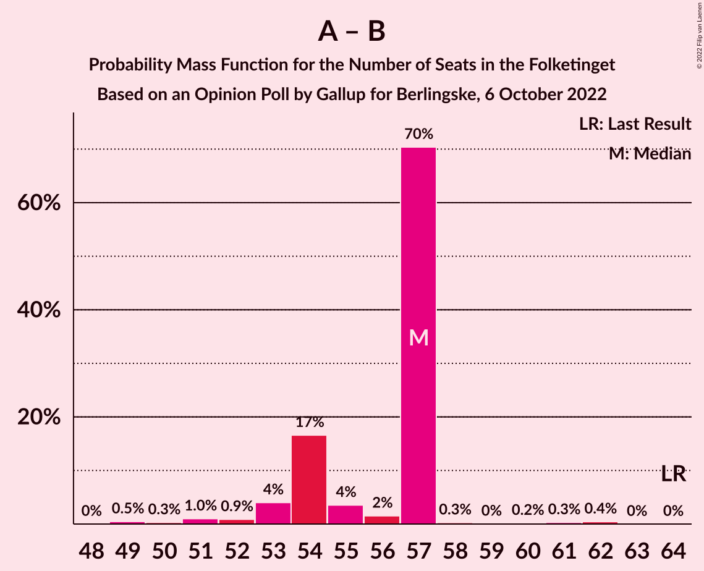

| Number of Seats | Probability | Accumulated | Special Marks |
|:---------------:|:-----------:|:-----------:|:-------------:|
| 49 | 0.5% | 100% |  |
| 50 | 0.3% | 99.5% |  |
| 51 | 1.0% | 99.2% |  |
| 52 | 0.9% | 98% |  |
| 53 | 4% | 97% |  |
| 54 | 17% | 93% |  |
| 55 | 4% | 77% |  |
| 56 | 2% | 73% |  |
| 57 | 70% | 72% | Median |
| 58 | 0.3% | 1.3% |  |
| 59 | 0% | 1.0% |  |
| 60 | 0.2% | 0.9% |  |
| 61 | 0.3% | 0.8% |  |
| 62 | 0.4% | 0.4% |  |
| 63 | 0% | 0% |  |
| 64 | 0% | 0% | Last Result |

### Venstre – Det Konservative Folkeparti – Liberal Alliance

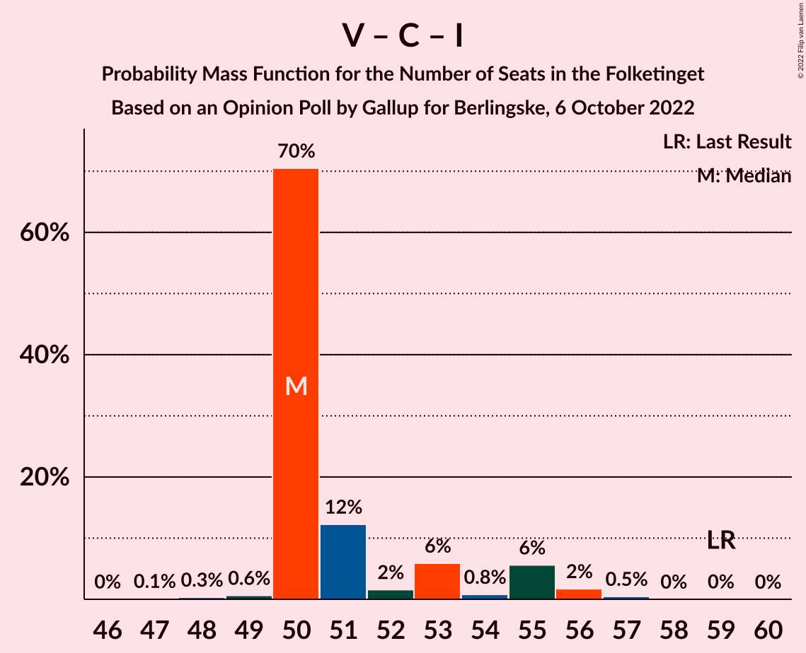

| Number of Seats | Probability | Accumulated | Special Marks |
|:---------------:|:-----------:|:-----------:|:-------------:|
| 46 | 0% | 100% |  |
| 47 | 0.1% | 99.9% |  |
| 48 | 0.3% | 99.8% |  |
| 49 | 0.6% | 99.5% |  |
| 50 | 70% | 98.9% | Median |
| 51 | 12% | 28% |  |
| 52 | 2% | 16% |  |
| 53 | 6% | 15% |  |
| 54 | 0.8% | 9% |  |
| 55 | 6% | 8% |  |
| 56 | 2% | 2% |  |
| 57 | 0.5% | 0.5% |  |
| 58 | 0% | 0.1% |  |
| 59 | 0% | 0.1% | Last Result |
| 60 | 0% | 0% |  |

### Venstre – Det Konservative Folkeparti

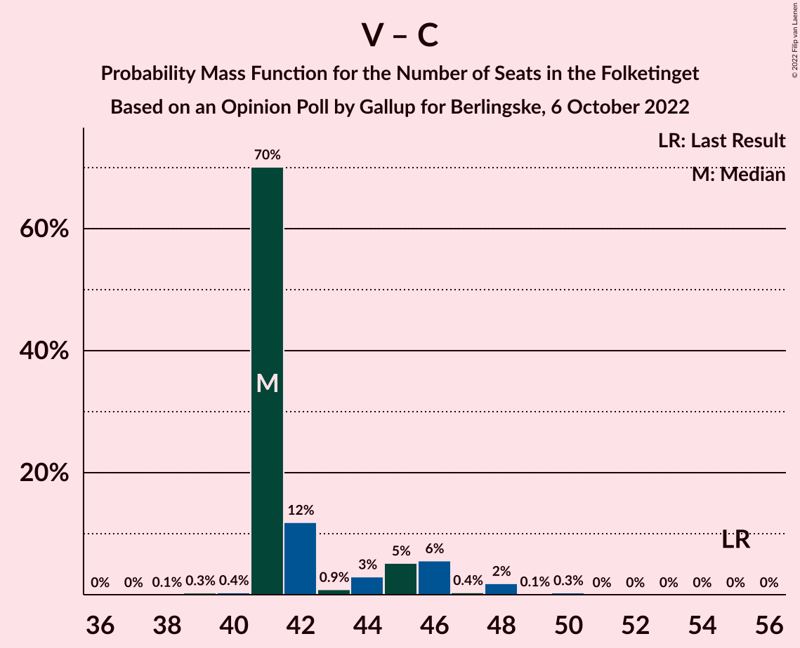

| Number of Seats | Probability | Accumulated | Special Marks |
|:---------------:|:-----------:|:-----------:|:-------------:|
| 38 | 0.1% | 100% |  |
| 39 | 0.3% | 99.9% |  |
| 40 | 0.4% | 99.6% |  |
| 41 | 70% | 99.3% | Median |
| 42 | 12% | 29% |  |
| 43 | 0.9% | 17% |  |
| 44 | 3% | 16% |  |
| 45 | 5% | 13% |  |
| 46 | 6% | 8% |  |
| 47 | 0.4% | 3% |  |
| 48 | 2% | 2% |  |
| 49 | 0.1% | 0.5% |  |
| 50 | 0.3% | 0.3% |  |
| 51 | 0% | 0% |  |
| 52 | 0% | 0% |  |
| 53 | 0% | 0% |  |
| 54 | 0% | 0% |  |
| 55 | 0% | 0% | Last Result |

### Venstre

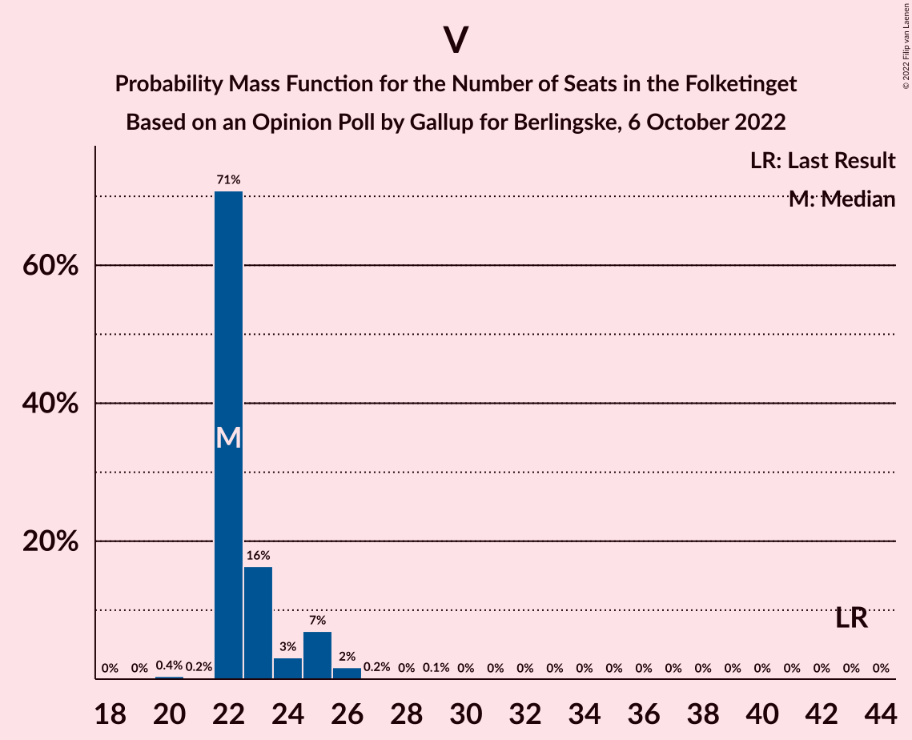

| Number of Seats | Probability | Accumulated | Special Marks |
|:---------------:|:-----------:|:-----------:|:-------------:|
| 20 | 0.4% | 100% |  |
| 21 | 0.2% | 99.6% |  |
| 22 | 71% | 99.3% | Median |
| 23 | 16% | 29% |  |
| 24 | 3% | 12% |  |
| 25 | 7% | 9% |  |
| 26 | 2% | 2% |  |
| 27 | 0.2% | 0.4% |  |
| 28 | 0% | 0.2% |  |
| 29 | 0.1% | 0.1% |  |
| 30 | 0% | 0% |  |
| 31 | 0% | 0% |  |
| 32 | 0% | 0% |  |
| 33 | 0% | 0% |  |
| 34 | 0% | 0% |  |
| 35 | 0% | 0% |  |
| 36 | 0% | 0% |  |
| 37 | 0% | 0% |  |
| 38 | 0% | 0% |  |
| 39 | 0% | 0% |  |
| 40 | 0% | 0% |  |
| 41 | 0% | 0% |  |
| 42 | 0% | 0% |  |
| 43 | 0% | 0% | Last Result |

## Technical Information

### Opinion Poll

+ **Polling firm:** Gallup
+ **Commissioner(s):** Berlingske
+ **Fieldwork period:** 6 October 2022

### Calculations

+ **Sample size:** 1726
+ **Simulations done:** 1,048,576
+ **Error estimate:** 1.52%

