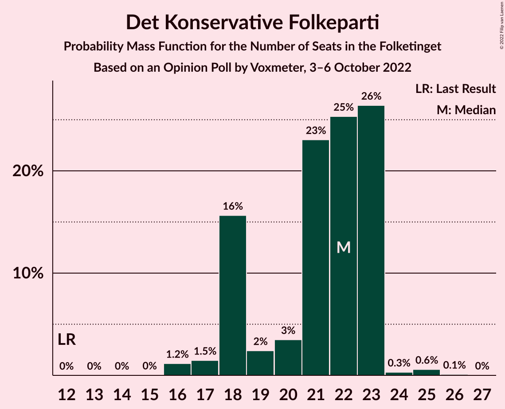
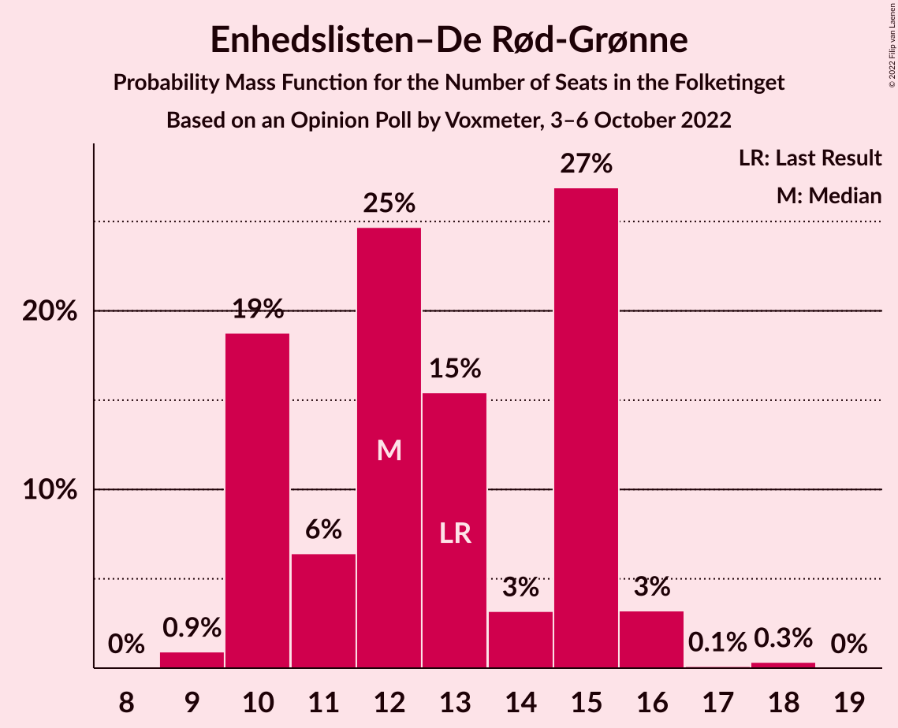
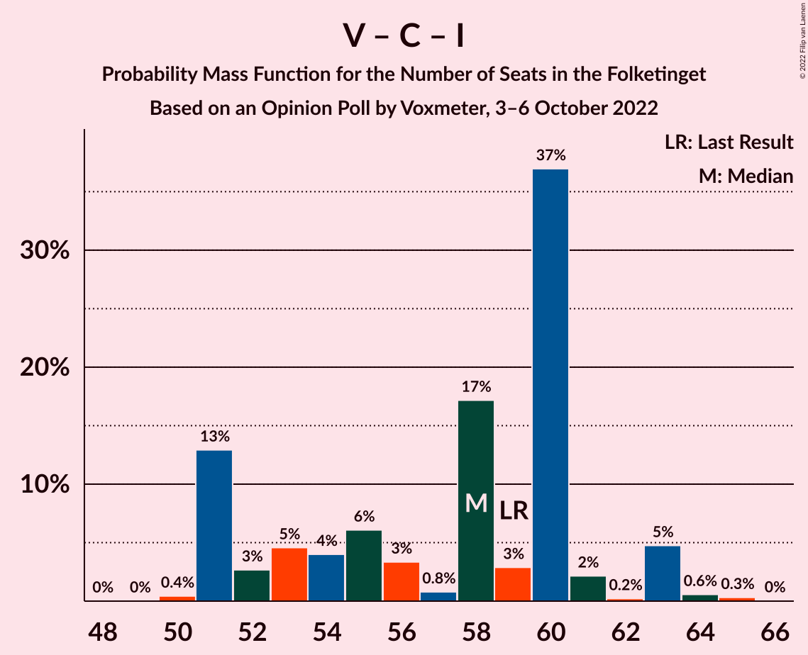

# Opinion Poll by Voxmeter, 3–6 October 2022

<a href="#voting-intentions">Voting Intentions</a> | <a href="#seats">Seats</a> | <a href="#coalitions">Coalitions</a> | <a href="#technical-information">Technical Information</a>

## Voting Intentions

### Confidence Intervals

| Party | Last Result | Poll Result | 80% Confidence Interval | 90% Confidence Interval | 95% Confidence Interval | 99% Confidence Interval |
|:-----:|:-----------:|:-----------:|:-----------------------:|:-----------------------:|:-----------------------:|:-----------------------:|
| Socialdemokraterne | 25.9% | 27.5% | 25.8–29.3% |25.3–29.8% |25.0–30.2% |24.2–31.1% |
| Venstre | 23.4% | 14.6% | 13.3–16.1% |13.0–16.5% |12.7–16.9% |12.1–17.6% |
| Det Konservative Folkeparti | 6.6% | 11.4% | 10.3–12.8% |10.0–13.1% |9.7–13.5% |9.1–14.1% |
| Socialistisk Folkeparti | 7.7% | 8.3% | 7.3–9.5% |7.1–9.8% |6.8–10.1% |6.4–10.7% |
| Danmarksdemokraterne | 0.0% | 8.0% | 7.0–9.1% |6.7–9.4% |6.5–9.7% |6.1–10.3% |
| Enhedslisten–De Rød-Grønne | 6.9% | 7.1% | 6.2–8.2% |6.0–8.5% |5.7–8.8% |5.3–9.4% |
| Liberal Alliance | 2.3% | 5.6% | 4.8–6.6% |4.6–6.9% |4.4–7.1% |4.0–7.6% |
| Radikale Venstre | 8.6% | 5.4% | 4.6–6.4% |4.4–6.7% |4.2–6.9% |3.9–7.4% |
| Nye Borgerlige | 2.4% | 4.7% | 3.9–5.6% |3.7–5.9% |3.6–6.1% |3.2–6.6% |
| Moderaterne | 0.0% | 3.3% | 2.7–4.1% |2.5–4.3% |2.4–4.5% |2.1–4.9% |
| Dansk Folkeparti | 8.7% | 1.7% | 1.3–2.4% |1.2–2.5% |1.1–2.7% |0.9–3.0% |
| Alternativet | 3.0% | 1.2% | 0.9–1.7% |0.8–1.9% |0.7–2.0% |0.6–2.3% |
| Kristendemokraterne | 1.7% | 0.8% | 0.6–1.3% |0.5–1.4% |0.4–1.6% |0.3–1.8% |
| Frie Grønne | 0.0% | 0.3% | 0.2–0.6% |0.1–0.7% |0.1–0.8% |0.1–1.0% |

*Note:* The poll result column reflects the actual value used in the calculations. Published results may vary slightly, and in addition be rounded to fewer digits.

## Seats

### Confidence Intervals

| Party | Last Result | Median | 80% Confidence Interval | 90% Confidence Interval | 95% Confidence Interval | 99% Confidence Interval |
|:-----:|:-----------:|:------:|:-----------------------:|:-----------------------:|:-----------------------:|:-----------------------:|
| <a href="#socialdemokraterne">Socialdemokraterne</a> | 48 | 48 | 46–54 |44–54 |44–54 |43–59 |
| <a href="#venstre">Venstre</a> | 43 | 26 | 23–28 |22–31 |22–31 |21–32 |
| <a href="#det-konservative-folkeparti">Det Konservative Folkeparti</a> | 12 | 22 | 18–23 |18–23 |17–23 |16–25 |
| <a href="#socialistisk-folkeparti">Socialistisk Folkeparti</a> | 14 | 16 | 13–18 |12–18 |12–18 |12–18 |
| <a href="#danmarksdemokraterne">Danmarksdemokraterne</a> | 0 | 14 | 13–17 |13–17 |13–18 |11–19 |
| <a href="#enhedslisten–de-rød-grønne">Enhedslisten–De Rød-Grønne</a> | 13 | 12 | 10–15 |10–15 |10–16 |9–16 |
| <a href="#liberal-alliance">Liberal Alliance</a> | 4 | 11 | 9–11 |9–11 |8–12 |8–13 |
| <a href="#radikale-venstre">Radikale Venstre</a> | 16 | 9 | 9–11 |8–11 |8–11 |7–13 |
| <a href="#nye-borgerlige">Nye Borgerlige</a> | 4 | 7 | 6–10 |6–10 |6–11 |6–11 |
| <a href="#moderaterne">Moderaterne</a> | 0 | 6 | 4–8 |4–8 |4–8 |4–8 |
| <a href="#dansk-folkeparti">Dansk Folkeparti</a> | 16 | 0 | 0–4 |0–5 |0–5 |0–5 |
| <a href="#alternativet">Alternativet</a> | 5 | 0 | 0–4 |0–4 |0–4 |0–4 |
| <a href="#kristendemokraterne">Kristendemokraterne</a> | 0 | 0 | 0 |0 |0 |0–3 |
| <a href="#frie-grønne">Frie Grønne</a> | 0 | 0 | 0 |0 |0 |0 |

### Socialdemokraterne

*For a full overview of the results for this party, see the [Socialdemokraterne](party-socialdemokraterne.html) page.*

| Number of Seats | Probability | Accumulated | Special Marks |
|:---------------:|:-----------:|:-----------:|:-------------:|
| 40 | 0.4% | 100% |  |
| 41 | 0% | 99.6% |  |
| 42 | 0% | 99.5% |  |
| 43 | 0.1% | 99.5% |  |
| 44 | 5% | 99.4% |  |
| 45 | 0.3% | 94% |  |
| 46 | 4% | 94% |  |
| 47 | 37% | 90% |  |
| 48 | 9% | 53% | Last Result, Median |
| 49 | 16% | 43% |  |
| 50 | 4% | 27% |  |
| 51 | 5% | 23% |  |
| 52 | 1.5% | 18% |  |
| 53 | 0.7% | 17% |  |
| 54 | 15% | 16% |  |
| 55 | 0.1% | 1.0% |  |
| 56 | 0.1% | 0.9% |  |
| 57 | 0.1% | 0.8% |  |
| 58 | 0% | 0.7% |  |
| 59 | 0.7% | 0.7% |  |
| 60 | 0% | 0% |  |

### Venstre

*For a full overview of the results for this party, see the [Venstre](party-venstre.html) page.*

| Number of Seats | Probability | Accumulated | Special Marks |
|:---------------:|:-----------:|:-----------:|:-------------:|
| 20 | 0.1% | 100% |  |
| 21 | 0.7% | 99.9% |  |
| 22 | 8% | 99.2% |  |
| 23 | 13% | 91% |  |
| 24 | 7% | 78% |  |
| 25 | 5% | 71% |  |
| 26 | 39% | 67% | Median |
| 27 | 16% | 28% |  |
| 28 | 2% | 12% |  |
| 29 | 4% | 10% |  |
| 30 | 0.2% | 6% |  |
| 31 | 5% | 6% |  |
| 32 | 0.8% | 0.8% |  |
| 33 | 0% | 0% |  |
| 34 | 0% | 0% |  |
| 35 | 0% | 0% |  |
| 36 | 0% | 0% |  |
| 37 | 0% | 0% |  |
| 38 | 0% | 0% |  |
| 39 | 0% | 0% |  |
| 40 | 0% | 0% |  |
| 41 | 0% | 0% |  |
| 42 | 0% | 0% |  |
| 43 | 0% | 0% | Last Result |

### Det Konservative Folkeparti

*For a full overview of the results for this party, see the [Det Konservative Folkeparti](party-detkonservativefolkeparti.html) page.*

| Number of Seats | Probability | Accumulated | Special Marks |
|:---------------:|:-----------:|:-----------:|:-------------:|
| 12 | 0% | 100% | Last Result |
| 13 | 0% | 100% |  |
| 14 | 0% | 100% |  |
| 15 | 0% | 100% |  |
| 16 | 1.2% | 100% |  |
| 17 | 1.5% | 98.8% |  |
| 18 | 16% | 97% |  |
| 19 | 2% | 82% |  |
| 20 | 3% | 79% |  |
| 21 | 23% | 76% |  |
| 22 | 25% | 53% | Median |
| 23 | 26% | 27% |  |
| 24 | 0.3% | 1.0% |  |
| 25 | 0.6% | 0.7% |  |
| 26 | 0.1% | 0.1% |  |
| 27 | 0% | 0% |  |

### Socialistisk Folkeparti

*For a full overview of the results for this party, see the [Socialistisk Folkeparti](party-socialistiskfolkeparti.html) page.*

| Number of Seats | Probability | Accumulated | Special Marks |
|:---------------:|:-----------:|:-----------:|:-------------:|
| 12 | 8% | 100% |  |
| 13 | 8% | 92% |  |
| 14 | 16% | 85% | Last Result |
| 15 | 2% | 69% |  |
| 16 | 20% | 66% | Median |
| 17 | 29% | 46% |  |
| 18 | 17% | 17% |  |
| 19 | 0.1% | 0.1% |  |
| 20 | 0% | 0% |  |

### Danmarksdemokraterne

*For a full overview of the results for this party, see the [Danmarksdemokraterne](party-danmarksdemokraterne.html) page.*

| Number of Seats | Probability | Accumulated | Special Marks |
|:---------------:|:-----------:|:-----------:|:-------------:|
| 0 | 0% | 100% | Last Result |
| 1 | 0% | 100% |  |
| 2 | 0% | 100% |  |
| 3 | 0% | 100% |  |
| 4 | 0% | 100% |  |
| 5 | 0% | 100% |  |
| 6 | 0% | 100% |  |
| 7 | 0% | 100% |  |
| 8 | 0% | 100% |  |
| 9 | 0% | 100% |  |
| 10 | 0.3% | 100% |  |
| 11 | 0.4% | 99.7% |  |
| 12 | 1.0% | 99.3% |  |
| 13 | 30% | 98% |  |
| 14 | 24% | 68% | Median |
| 15 | 8% | 43% |  |
| 16 | 15% | 36% |  |
| 17 | 16% | 20% |  |
| 18 | 4% | 4% |  |
| 19 | 0.7% | 0.7% |  |
| 20 | 0% | 0% |  |

### Enhedslisten–De Rød-Grønne

*For a full overview of the results for this party, see the [Enhedslisten–De Rød-Grønne](party-enhedslisten–derød-grønne.html) page.*

| Number of Seats | Probability | Accumulated | Special Marks |
|:---------------:|:-----------:|:-----------:|:-------------:|
| 9 | 0.9% | 100% |  |
| 10 | 19% | 99.1% |  |
| 11 | 6% | 80% |  |
| 12 | 25% | 74% | Median |
| 13 | 15% | 49% | Last Result |
| 14 | 3% | 34% |  |
| 15 | 27% | 31% |  |
| 16 | 3% | 4% |  |
| 17 | 0.1% | 0.5% |  |
| 18 | 0.3% | 0.3% |  |
| 19 | 0% | 0% |  |

### Liberal Alliance

*For a full overview of the results for this party, see the [Liberal Alliance](party-liberalalliance.html) page.*

| Number of Seats | Probability | Accumulated | Special Marks |
|:---------------:|:-----------:|:-----------:|:-------------:|
| 4 | 0% | 100% | Last Result |
| 5 | 0% | 100% |  |
| 6 | 0% | 100% |  |
| 7 | 0.2% | 100% |  |
| 8 | 3% | 99.7% |  |
| 9 | 11% | 97% |  |
| 10 | 19% | 86% |  |
| 11 | 65% | 68% | Median |
| 12 | 2% | 3% |  |
| 13 | 0.8% | 1.3% |  |
| 14 | 0.4% | 0.5% |  |
| 15 | 0% | 0% |  |

### Radikale Venstre

*For a full overview of the results for this party, see the [Radikale Venstre](party-radikalevenstre.html) page.*

| Number of Seats | Probability | Accumulated | Special Marks |
|:---------------:|:-----------:|:-----------:|:-------------:|
| 7 | 2% | 100% |  |
| 8 | 6% | 98% |  |
| 9 | 74% | 92% | Median |
| 10 | 7% | 19% |  |
| 11 | 10% | 12% |  |
| 12 | 0.5% | 1.4% |  |
| 13 | 0.8% | 1.0% |  |
| 14 | 0.1% | 0.2% |  |
| 15 | 0% | 0% |  |
| 16 | 0% | 0% | Last Result |

### Nye Borgerlige

*For a full overview of the results for this party, see the [Nye Borgerlige](party-nyeborgerlige.html) page.*

| Number of Seats | Probability | Accumulated | Special Marks |
|:---------------:|:-----------:|:-----------:|:-------------:|
| 4 | 0% | 100% | Last Result |
| 5 | 0% | 100% |  |
| 6 | 15% | 100% |  |
| 7 | 39% | 85% | Median |
| 8 | 9% | 46% |  |
| 9 | 13% | 37% |  |
| 10 | 20% | 24% |  |
| 11 | 3% | 3% |  |
| 12 | 0.2% | 0.2% |  |
| 13 | 0% | 0% |  |

### Moderaterne

*For a full overview of the results for this party, see the [Moderaterne](party-moderaterne.html) page.*

| Number of Seats | Probability | Accumulated | Special Marks |
|:---------------:|:-----------:|:-----------:|:-------------:|
| 0 | 0% | 100% | Last Result |
| 1 | 0% | 100% |  |
| 2 | 0% | 100% |  |
| 3 | 0% | 100% |  |
| 4 | 23% | 100% |  |
| 5 | 3% | 77% |  |
| 6 | 36% | 74% | Median |
| 7 | 20% | 38% |  |
| 8 | 18% | 18% |  |
| 9 | 0.1% | 0.2% |  |
| 10 | 0% | 0% |  |

### Dansk Folkeparti

*For a full overview of the results for this party, see the [Dansk Folkeparti](party-danskfolkeparti.html) page.*

| Number of Seats | Probability | Accumulated | Special Marks |
|:---------------:|:-----------:|:-----------:|:-------------:|
| 0 | 81% | 100% | Median |
| 1 | 0% | 19% |  |
| 2 | 0% | 19% |  |
| 3 | 0% | 19% |  |
| 4 | 10% | 19% |  |
| 5 | 8% | 9% |  |
| 6 | 0% | 0.1% |  |
| 7 | 0% | 0% |  |
| 8 | 0% | 0% |  |
| 9 | 0% | 0% |  |
| 10 | 0% | 0% |  |
| 11 | 0% | 0% |  |
| 12 | 0% | 0% |  |
| 13 | 0% | 0% |  |
| 14 | 0% | 0% |  |
| 15 | 0% | 0% |  |
| 16 | 0% | 0% | Last Result |

### Alternativet

*For a full overview of the results for this party, see the [Alternativet](party-alternativet.html) page.*

| Number of Seats | Probability | Accumulated | Special Marks |
|:---------------:|:-----------:|:-----------:|:-------------:|
| 0 | 61% | 100% | Median |
| 1 | 0% | 39% |  |
| 2 | 0% | 39% |  |
| 3 | 0% | 39% |  |
| 4 | 39% | 39% |  |
| 5 | 0% | 0% | Last Result |

### Kristendemokraterne

*For a full overview of the results for this party, see the [Kristendemokraterne](party-kristendemokraterne.html) page.*

| Number of Seats | Probability | Accumulated | Special Marks |
|:---------------:|:-----------:|:-----------:|:-------------:|
| 0 | 98.9% | 100% | Last Result, Median |
| 1 | 0% | 1.1% |  |
| 2 | 0% | 1.1% |  |
| 3 | 1.0% | 1.1% |  |
| 4 | 0.1% | 0.1% |  |
| 5 | 0% | 0% |  |

### Frie Grønne

*For a full overview of the results for this party, see the [Frie Grønne](party-friegrønne.html) page.*

| Number of Seats | Probability | Accumulated | Special Marks |
|:---------------:|:-----------:|:-----------:|:-------------:|
| 0 | 100% | 100% | Last Result, Median |

## Coalitions

### Confidence Intervals

| Coalition | Last Result | Median | Majority? | 80% Confidence Interval | 90% Confidence Interval | 95% Confidence Interval | 99% Confidence Interval |
|:---------:|:-----------:|:------:|:---------:|:-----------------------:|:-----------------------:|:-----------------------:|:-----------------------:|
| Socialdemokraterne – Socialistisk Folkeparti – Enhedslisten–De Rød-Grønne – Radikale Venstre – Alternativet | 96 | 89 | 33% | 84–92 | 83–92 | 82–92 | 80–96 |
| Socialdemokraterne – Socialistisk Folkeparti – Enhedslisten–De Rød-Grønne – Radikale Venstre | 91 | 85 | 17% | 84–92 | 83–92 | 82–92 | 80–96 |
| Venstre – Det Konservative Folkeparti – Danmarksdemokraterne – Liberal Alliance – Nye Borgerlige – Dansk Folkeparti – Kristendemokraterne | 79 | 80 | 0.2% | 75–84 | 75–86 | 75–87 | 73–88 |
| Socialdemokraterne – Socialistisk Folkeparti – Enhedslisten–De Rød-Grønne – Alternativet | 80 | 80 | 0% | 75–83 | 74–83 | 72–83 | 70–87 |
| Socialdemokraterne – Socialistisk Folkeparti – Enhedslisten–De Rød-Grønne | 75 | 76 | 0% | 75–83 | 74–83 | 72–83 | 70–87 |
| Socialdemokraterne – Socialistisk Folkeparti – Radikale Venstre | 78 | 73 | 0% | 70–79 | 68–79 | 67–79 | 66–84 |
| Venstre – Det Konservative Folkeparti – Liberal Alliance – Nye Borgerlige – Dansk Folkeparti – Kristendemokraterne | 79 | 67 | 0% | 58–70 | 58–71 | 58–72 | 58–74 |
| Venstre – Det Konservative Folkeparti – Liberal Alliance – Nye Borgerlige – Dansk Folkeparti | 79 | 67 | 0% | 58–70 | 58–71 | 58–72 | 58–74 |
| Socialdemokraterne – Radikale Venstre | 64 | 58 | 0% | 56–63 | 53–63 | 53–63 | 52–68 |
| Venstre – Det Konservative Folkeparti – Liberal Alliance – Dansk Folkeparti – Kristendemokraterne | 75 | 60 | 0% | 51–62 | 51–63 | 51–63 | 51–65 |
| Venstre – Det Konservative Folkeparti – Liberal Alliance – Dansk Folkeparti | 75 | 60 | 0% | 51–62 | 51–63 | 51–63 | 51–65 |
| Venstre – Det Konservative Folkeparti – Liberal Alliance | 59 | 58 | 0% | 51–60 | 51–63 | 51–63 | 51–64 |
| Venstre – Det Konservative Folkeparti | 55 | 47 | 0% | 41–49 | 41–52 | 41–52 | 40–53 |
| Venstre | 43 | 26 | 0% | 23–28 | 22–31 | 22–31 | 21–32 |

### Socialdemokraterne – Socialistisk Folkeparti – Enhedslisten–De Rød-Grønne – Radikale Venstre – Alternativet

| Number of Seats | Probability | Accumulated | Special Marks |
|:---------------:|:-----------:|:-----------:|:-------------:|
| 78 | 0.2% | 100% |  |
| 79 | 0% | 99.8% |  |
| 80 | 0.7% | 99.8% |  |
| 81 | 0.7% | 99.1% |  |
| 82 | 2% | 98% |  |
| 83 | 3% | 97% |  |
| 84 | 14% | 94% |  |
| 85 | 11% | 79% | Median |
| 86 | 0.7% | 68% |  |
| 87 | 5% | 67% |  |
| 88 | 6% | 62% |  |
| 89 | 23% | 56% |  |
| 90 | 2% | 33% | Majority |
| 91 | 15% | 31% |  |
| 92 | 14% | 16% |  |
| 93 | 0.2% | 1.3% |  |
| 94 | 0.1% | 1.1% |  |
| 95 | 0% | 1.0% |  |
| 96 | 1.0% | 1.0% | Last Result |
| 97 | 0% | 0% |  |

### Socialdemokraterne – Socialistisk Folkeparti – Enhedslisten–De Rød-Grønne – Radikale Venstre

| Number of Seats | Probability | Accumulated | Special Marks |
|:---------------:|:-----------:|:-----------:|:-------------:|
| 78 | 0.2% | 100% |  |
| 79 | 0.2% | 99.8% |  |
| 80 | 0.7% | 99.6% |  |
| 81 | 0.7% | 98.8% |  |
| 82 | 2% | 98% |  |
| 83 | 3% | 96% |  |
| 84 | 15% | 94% |  |
| 85 | 33% | 79% | Median |
| 86 | 0.7% | 46% |  |
| 87 | 20% | 45% |  |
| 88 | 8% | 25% |  |
| 89 | 0.9% | 18% |  |
| 90 | 2% | 17% | Majority |
| 91 | 0.5% | 14% | Last Result |
| 92 | 13% | 14% |  |
| 93 | 0.1% | 1.1% |  |
| 94 | 0.1% | 1.1% |  |
| 95 | 0% | 1.0% |  |
| 96 | 1.0% | 1.0% |  |
| 97 | 0% | 0% |  |

### Venstre – Det Konservative Folkeparti – Danmarksdemokraterne – Liberal Alliance – Nye Borgerlige – Dansk Folkeparti – Kristendemokraterne

| Number of Seats | Probability | Accumulated | Special Marks |
|:---------------:|:-----------:|:-----------:|:-------------:|
| 73 | 0.7% | 100% |  |
| 74 | 0.3% | 99.3% |  |
| 75 | 12% | 99.0% |  |
| 76 | 0.1% | 87% |  |
| 77 | 1.4% | 86% |  |
| 78 | 1.1% | 85% |  |
| 79 | 1.4% | 84% | Last Result |
| 80 | 38% | 83% | Median |
| 81 | 5% | 45% |  |
| 82 | 7% | 40% |  |
| 83 | 6% | 33% |  |
| 84 | 18% | 27% |  |
| 85 | 0.2% | 9% |  |
| 86 | 5% | 8% |  |
| 87 | 2% | 3% |  |
| 88 | 0.6% | 1.0% |  |
| 89 | 0.2% | 0.4% |  |
| 90 | 0% | 0.2% | Majority |
| 91 | 0.1% | 0.2% |  |
| 92 | 0% | 0% |  |

### Socialdemokraterne – Socialistisk Folkeparti – Enhedslisten–De Rød-Grønne – Alternativet

| Number of Seats | Probability | Accumulated | Special Marks |
|:---------------:|:-----------:|:-----------:|:-------------:|
| 68 | 0.3% | 100% |  |
| 69 | 0.1% | 99.7% |  |
| 70 | 0.1% | 99.6% |  |
| 71 | 0.6% | 99.5% |  |
| 72 | 2% | 98.9% |  |
| 73 | 0.1% | 97% |  |
| 74 | 5% | 97% |  |
| 75 | 15% | 92% |  |
| 76 | 9% | 78% | Median |
| 77 | 8% | 68% |  |
| 78 | 4% | 60% |  |
| 79 | 1.4% | 56% |  |
| 80 | 22% | 55% | Last Result |
| 81 | 2% | 32% |  |
| 82 | 16% | 30% |  |
| 83 | 12% | 14% |  |
| 84 | 0.2% | 1.4% |  |
| 85 | 0.6% | 1.2% |  |
| 86 | 0% | 0.7% |  |
| 87 | 0.6% | 0.7% |  |
| 88 | 0% | 0% |  |

### Socialdemokraterne – Socialistisk Folkeparti – Enhedslisten–De Rød-Grønne

| Number of Seats | Probability | Accumulated | Special Marks |
|:---------------:|:-----------:|:-----------:|:-------------:|
| 68 | 0.3% | 100% |  |
| 69 | 0.1% | 99.6% |  |
| 70 | 0.3% | 99.5% |  |
| 71 | 0.6% | 99.3% |  |
| 72 | 2% | 98.6% |  |
| 73 | 0.2% | 97% |  |
| 74 | 4% | 96% |  |
| 75 | 15% | 92% | Last Result |
| 76 | 31% | 77% | Median |
| 77 | 9% | 46% |  |
| 78 | 20% | 37% |  |
| 79 | 1.4% | 18% |  |
| 80 | 0.6% | 16% |  |
| 81 | 1.3% | 16% |  |
| 82 | 0.9% | 14% |  |
| 83 | 12% | 14% |  |
| 84 | 0.1% | 1.3% |  |
| 85 | 0.5% | 1.1% |  |
| 86 | 0% | 0.7% |  |
| 87 | 0.6% | 0.6% |  |
| 88 | 0% | 0% |  |

### Socialdemokraterne – Socialistisk Folkeparti – Radikale Venstre

| Number of Seats | Probability | Accumulated | Special Marks |
|:---------------:|:-----------:|:-----------:|:-------------:|
| 64 | 0.4% | 100% |  |
| 65 | 0% | 99.6% |  |
| 66 | 0.2% | 99.6% |  |
| 67 | 3% | 99.4% |  |
| 68 | 2% | 96% |  |
| 69 | 0.2% | 94% |  |
| 70 | 7% | 94% |  |
| 71 | 0.3% | 87% |  |
| 72 | 20% | 87% |  |
| 73 | 22% | 67% | Median |
| 74 | 15% | 44% |  |
| 75 | 5% | 30% |  |
| 76 | 2% | 25% |  |
| 77 | 7% | 23% |  |
| 78 | 2% | 15% | Last Result |
| 79 | 12% | 13% |  |
| 80 | 0.2% | 1.0% |  |
| 81 | 0% | 0.8% |  |
| 82 | 0.1% | 0.8% |  |
| 83 | 0% | 0.7% |  |
| 84 | 0.7% | 0.7% |  |
| 85 | 0% | 0% |  |

### Venstre – Det Konservative Folkeparti – Liberal Alliance – Nye Borgerlige – Dansk Folkeparti – Kristendemokraterne

| Number of Seats | Probability | Accumulated | Special Marks |
|:---------------:|:-----------:|:-----------:|:-------------:|
| 58 | 12% | 100% |  |
| 59 | 0% | 88% |  |
| 60 | 0.7% | 88% |  |
| 61 | 0.4% | 87% |  |
| 62 | 1.1% | 87% |  |
| 63 | 4% | 86% |  |
| 64 | 1.2% | 82% |  |
| 65 | 0.9% | 80% |  |
| 66 | 20% | 79% | Median |
| 67 | 23% | 60% |  |
| 68 | 19% | 37% |  |
| 69 | 7% | 19% |  |
| 70 | 2% | 12% |  |
| 71 | 7% | 10% |  |
| 72 | 0.9% | 3% |  |
| 73 | 0.7% | 2% |  |
| 74 | 0.9% | 1.0% |  |
| 75 | 0% | 0.2% |  |
| 76 | 0% | 0.2% |  |
| 77 | 0.1% | 0.1% |  |
| 78 | 0% | 0% |  |
| 79 | 0% | 0% | Last Result |

### Venstre – Det Konservative Folkeparti – Liberal Alliance – Nye Borgerlige – Dansk Folkeparti

| Number of Seats | Probability | Accumulated | Special Marks |
|:---------------:|:-----------:|:-----------:|:-------------:|
| 58 | 12% | 100% |  |
| 59 | 0% | 88% |  |
| 60 | 0.7% | 88% |  |
| 61 | 0.4% | 87% |  |
| 62 | 1.1% | 87% |  |
| 63 | 5% | 86% |  |
| 64 | 1.2% | 81% |  |
| 65 | 0.9% | 79% |  |
| 66 | 18% | 78% | Median |
| 67 | 23% | 60% |  |
| 68 | 19% | 37% |  |
| 69 | 7% | 18% |  |
| 70 | 2% | 12% |  |
| 71 | 7% | 10% |  |
| 72 | 0.9% | 3% |  |
| 73 | 0.6% | 2% |  |
| 74 | 0.9% | 1.0% |  |
| 75 | 0% | 0.2% |  |
| 76 | 0% | 0.1% |  |
| 77 | 0.1% | 0.1% |  |
| 78 | 0% | 0% |  |
| 79 | 0% | 0% | Last Result |

### Socialdemokraterne – Radikale Venstre

| Number of Seats | Probability | Accumulated | Special Marks |
|:---------------:|:-----------:|:-----------:|:-------------:|
| 49 | 0.4% | 100% |  |
| 50 | 0% | 99.6% |  |
| 51 | 0% | 99.6% |  |
| 52 | 0.1% | 99.5% |  |
| 53 | 5% | 99.4% |  |
| 54 | 0.5% | 95% |  |
| 55 | 3% | 94% |  |
| 56 | 39% | 91% |  |
| 57 | 0.3% | 52% | Median |
| 58 | 18% | 52% |  |
| 59 | 9% | 35% |  |
| 60 | 3% | 26% |  |
| 61 | 5% | 22% |  |
| 62 | 4% | 18% |  |
| 63 | 13% | 14% |  |
| 64 | 0.2% | 1.1% | Last Result |
| 65 | 0.1% | 0.9% |  |
| 66 | 0.1% | 0.8% |  |
| 67 | 0% | 0.7% |  |
| 68 | 0.7% | 0.7% |  |
| 69 | 0% | 0% |  |

### Venstre – Det Konservative Folkeparti – Liberal Alliance – Dansk Folkeparti – Kristendemokraterne

| Number of Seats | Probability | Accumulated | Special Marks |
|:---------------:|:-----------:|:-----------:|:-------------:|
| 51 | 12% | 100% |  |
| 52 | 2% | 88% |  |
| 53 | 0.1% | 86% |  |
| 54 | 4% | 86% |  |
| 55 | 3% | 82% |  |
| 56 | 1.2% | 79% |  |
| 57 | 0.8% | 78% |  |
| 58 | 19% | 77% |  |
| 59 | 3% | 58% | Median |
| 60 | 42% | 55% |  |
| 61 | 2% | 13% |  |
| 62 | 3% | 11% |  |
| 63 | 6% | 8% |  |
| 64 | 1.1% | 2% |  |
| 65 | 0.4% | 0.7% |  |
| 66 | 0.1% | 0.3% |  |
| 67 | 0.1% | 0.2% |  |
| 68 | 0.1% | 0.1% |  |
| 69 | 0% | 0% |  |
| 70 | 0% | 0% |  |
| 71 | 0% | 0% |  |
| 72 | 0% | 0% |  |
| 73 | 0% | 0% |  |
| 74 | 0% | 0% |  |
| 75 | 0% | 0% | Last Result |

### Venstre – Det Konservative Folkeparti – Liberal Alliance – Dansk Folkeparti

| Number of Seats | Probability | Accumulated | Special Marks |
|:---------------:|:-----------:|:-----------:|:-------------:|
| 51 | 12% | 100% |  |
| 52 | 2% | 88% |  |
| 53 | 0.1% | 86% |  |
| 54 | 4% | 86% |  |
| 55 | 3% | 82% |  |
| 56 | 2% | 79% |  |
| 57 | 0.8% | 77% |  |
| 58 | 19% | 76% |  |
| 59 | 2% | 57% | Median |
| 60 | 42% | 55% |  |
| 61 | 2% | 13% |  |
| 62 | 3% | 11% |  |
| 63 | 6% | 8% |  |
| 64 | 1.1% | 2% |  |
| 65 | 0.3% | 0.7% |  |
| 66 | 0.1% | 0.3% |  |
| 67 | 0.1% | 0.2% |  |
| 68 | 0.1% | 0.1% |  |
| 69 | 0% | 0% |  |
| 70 | 0% | 0% |  |
| 71 | 0% | 0% |  |
| 72 | 0% | 0% |  |
| 73 | 0% | 0% |  |
| 74 | 0% | 0% |  |
| 75 | 0% | 0% | Last Result |

### Venstre – Det Konservative Folkeparti – Liberal Alliance

| Number of Seats | Probability | Accumulated | Special Marks |
|:---------------:|:-----------:|:-----------:|:-------------:|
| 49 | 0% | 100% |  |
| 50 | 0.4% | 99.9% |  |
| 51 | 13% | 99.5% |  |
| 52 | 3% | 87% |  |
| 53 | 5% | 84% |  |
| 54 | 4% | 79% |  |
| 55 | 6% | 75% |  |
| 56 | 3% | 69% |  |
| 57 | 0.8% | 66% |  |
| 58 | 17% | 65% |  |
| 59 | 3% | 48% | Last Result, Median |
| 60 | 37% | 45% |  |
| 61 | 2% | 8% |  |
| 62 | 0.2% | 6% |  |
| 63 | 5% | 6% |  |
| 64 | 0.6% | 0.9% |  |
| 65 | 0.3% | 0.4% |  |
| 66 | 0% | 0% |  |

### Venstre – Det Konservative Folkeparti

| Number of Seats | Probability | Accumulated | Special Marks |
|:---------------:|:-----------:|:-----------:|:-------------:|
| 40 | 0.7% | 100% |  |
| 41 | 13% | 99.3% |  |
| 42 | 0.8% | 86% |  |
| 43 | 2% | 85% |  |
| 44 | 8% | 83% |  |
| 45 | 3% | 75% |  |
| 46 | 4% | 72% |  |
| 47 | 21% | 68% |  |
| 48 | 1.1% | 47% | Median |
| 49 | 38% | 46% |  |
| 50 | 0.2% | 8% |  |
| 51 | 2% | 8% |  |
| 52 | 5% | 6% |  |
| 53 | 0.6% | 1.0% |  |
| 54 | 0.3% | 0.4% |  |
| 55 | 0.1% | 0.1% | Last Result |
| 56 | 0% | 0% |  |

### Venstre

| Number of Seats | Probability | Accumulated | Special Marks |
|:---------------:|:-----------:|:-----------:|:-------------:|
| 20 | 0.1% | 100% |  |
| 21 | 0.7% | 99.9% |  |
| 22 | 8% | 99.2% |  |
| 23 | 13% | 91% |  |
| 24 | 7% | 78% |  |
| 25 | 5% | 71% |  |
| 26 | 39% | 67% | Median |
| 27 | 16% | 28% |  |
| 28 | 2% | 12% |  |
| 29 | 4% | 10% |  |
| 30 | 0.2% | 6% |  |
| 31 | 5% | 6% |  |
| 32 | 0.8% | 0.8% |  |
| 33 | 0% | 0% |  |
| 34 | 0% | 0% |  |
| 35 | 0% | 0% |  |
| 36 | 0% | 0% |  |
| 37 | 0% | 0% |  |
| 38 | 0% | 0% |  |
| 39 | 0% | 0% |  |
| 40 | 0% | 0% |  |
| 41 | 0% | 0% |  |
| 42 | 0% | 0% |  |
| 43 | 0% | 0% | Last Result |

## Technical Information

### Opinion Poll

+ **Polling firm:** Voxmeter
+ **Commissioner(s):** —
+ **Fieldwork period:** 3–6 October 2022

### Calculations

+ **Sample size:** 1094
+ **Simulations done:** 1,048,576
+ **Error estimate:** 1.84%

