# Opinion Poll by Megafon for Politiken and TV, 7–9 October 2022

<a href="#voting-intentions">Voting Intentions</a> | <a href="#seats">Seats</a> | <a href="#coalitions">Coalitions</a> | <a href="#technical-information">Technical Information</a>

## Voting Intentions

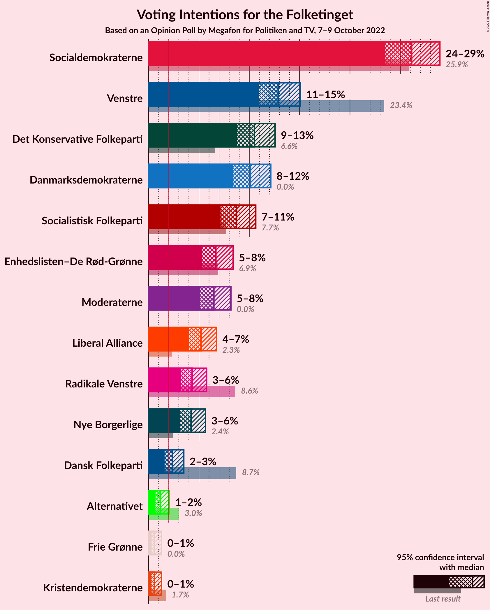

### Confidence Intervals

| Party | Last Result | Poll Result | 80% Confidence Interval | 90% Confidence Interval | 95% Confidence Interval | 99% Confidence Interval |
|:-----:|:-----------:|:-----------:|:-----------------------:|:-----------------------:|:-----------------------:|:-----------------------:|
| Socialdemokraterne | 25.9% | 26.1% | 24.4–28.0% |23.9–28.5% |23.5–28.9% |22.7–29.8% |
| Venstre | 23.4% | 12.9% | 11.6–14.3% |11.2–14.7% |10.9–15.1% |10.4–15.8% |
| Det Konservative Folkeparti | 6.6% | 10.5% | 9.4–11.8% |9.0–12.2% |8.8–12.6% |8.2–13.2% |
| Danmarksdemokraterne | 0.0% | 10.1% | 9.0–11.4% |8.7–11.8% |8.4–12.1% |7.9–12.8% |
| Socialistisk Folkeparti | 7.7% | 8.7% | 7.7–10.0% |7.4–10.3% |7.1–10.6% |6.7–11.3% |
| Enhedslisten–De Rød-Grønne | 6.9% | 6.7% | 5.8–7.8% |5.5–8.1% |5.3–8.4% |4.9–8.9% |
| Moderaterne | 0.0% | 6.5% | 5.6–7.6% |5.3–7.9% |5.1–8.2% |4.7–8.7% |
| Liberal Alliance | 2.3% | 5.2% | 4.4–6.2% |4.2–6.5% |4.0–6.8% |3.6–7.3% |
| Radikale Venstre | 8.6% | 4.3% | 3.6–5.3% |3.4–5.5% |3.2–5.8% |2.9–6.2% |
| Nye Borgerlige | 2.4% | 4.2% | 3.5–5.2% |3.3–5.4% |3.1–5.7% |2.8–6.1% |
| Dansk Folkeparti | 8.7% | 2.4% | 1.8–3.1% |1.7–3.3% |1.6–3.5% |1.4–3.9% |
| Alternativet | 3.0% | 1.2% | 0.8–1.8% |0.7–1.9% |0.7–2.1% |0.5–2.4% |
| Kristendemokraterne | 1.7% | 0.6% | 0.4–1.0% |0.3–1.2% |0.3–1.3% |0.2–1.5% |
| Frie Grønne | 0.0% | 0.6% | 0.4–1.0% |0.3–1.2% |0.3–1.3% |0.2–1.5% |

*Note:* The poll result column reflects the actual value used in the calculations. Published results may vary slightly, and in addition be rounded to fewer digits.

## Seats

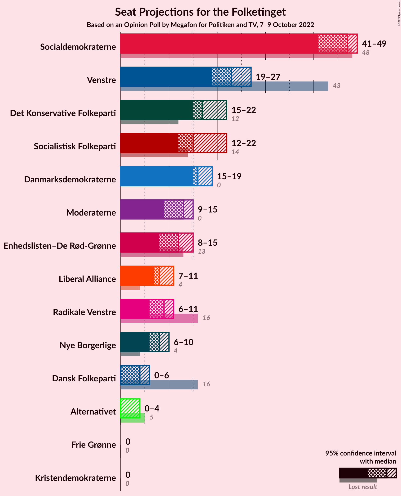

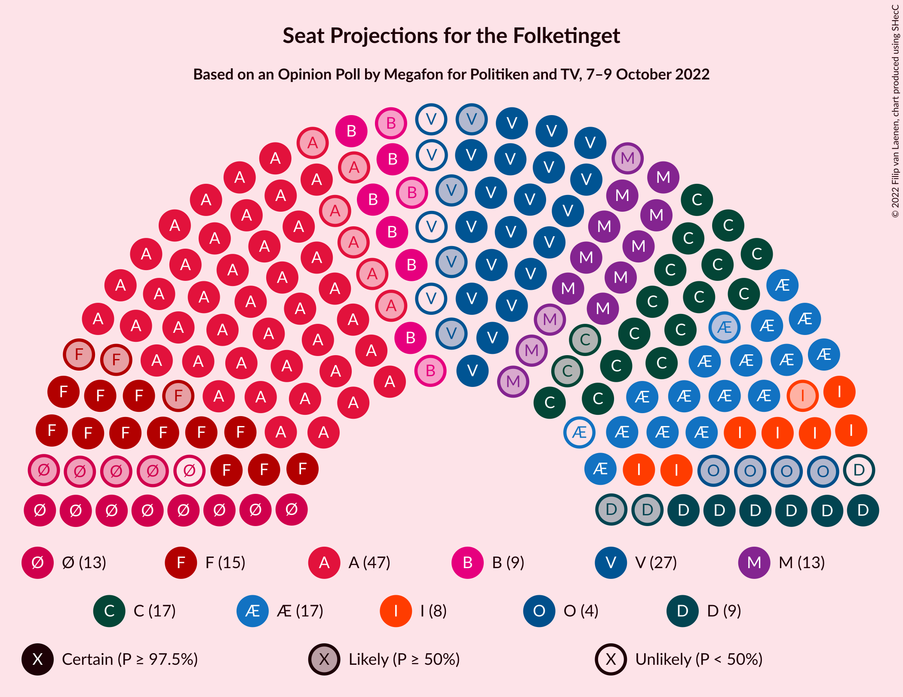

### Confidence Intervals

| Party | Last Result | Median | 80% Confidence Interval | 90% Confidence Interval | 95% Confidence Interval | 99% Confidence Interval |
|:-----:|:-----------:|:------:|:-----------------------:|:-----------------------:|:-----------------------:|:-----------------------:|
| <a href="#socialdemokraterne">Socialdemokraterne</a> | 48 | 47 | 45–49 |43–49 |41–49 |38–54 |
| <a href="#venstre">Venstre</a> | 43 | 23 | 19–27 |19–27 |19–27 |19–29 |
| <a href="#det-konservative-folkeparti">Det Konservative Folkeparti</a> | 12 | 17 | 16–20 |15–21 |15–22 |14–23 |
| <a href="#danmarksdemokraterne">Danmarksdemokraterne</a> | 0 | 16 | 15–18 |15–18 |15–19 |13–22 |
| <a href="#socialistisk-folkeparti">Socialistisk Folkeparti</a> | 14 | 15 | 14–18 |12–22 |12–22 |12–22 |
| <a href="#enhedslisten–de-rød-grønne">Enhedslisten–De Rød-Grønne</a> | 13 | 12 | 10–14 |10–15 |8–15 |8–16 |
| <a href="#moderaterne">Moderaterne</a> | 0 | 13 | 11–14 |10–14 |9–15 |8–17 |
| <a href="#liberal-alliance">Liberal Alliance</a> | 4 | 8 | 7–11 |7–11 |7–11 |7–13 |
| <a href="#radikale-venstre">Radikale Venstre</a> | 16 | 9 | 7–9 |7–10 |6–11 |5–13 |
| <a href="#nye-borgerlige">Nye Borgerlige</a> | 4 | 8 | 7–9 |6–10 |6–10 |5–11 |
| <a href="#dansk-folkeparti">Dansk Folkeparti</a> | 16 | 4 | 4–6 |4–6 |0–6 |0–7 |
| <a href="#alternativet">Alternativet</a> | 5 | 0 | 0–4 |0–4 |0–4 |0–5 |
| <a href="#kristendemokraterne">Kristendemokraterne</a> | 0 | 0 | 0 |0 |0 |0 |
| <a href="#frie-grønne">Frie Grønne</a> | 0 | 0 | 0 |0 |0 |0 |

### Socialdemokraterne

*For a full overview of the results for this party, see the [Socialdemokraterne](party-socialdemokraterne.html) page.*

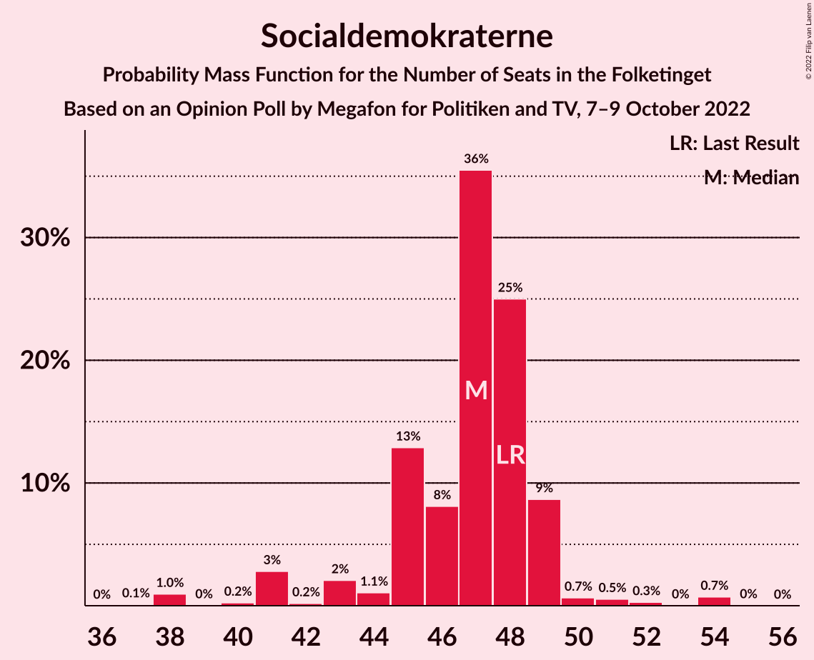

| Number of Seats | Probability | Accumulated | Special Marks |
|:---------------:|:-----------:|:-----------:|:-------------:|
| 37 | 0.1% | 100% |  |
| 38 | 1.0% | 99.9% |  |
| 39 | 0% | 98.9% |  |
| 40 | 0.2% | 98.9% |  |
| 41 | 3% | 98.6% |  |
| 42 | 0.2% | 96% |  |
| 43 | 2% | 96% |  |
| 44 | 1.1% | 94% |  |
| 45 | 13% | 92% |  |
| 46 | 8% | 80% |  |
| 47 | 36% | 71% | Median |
| 48 | 25% | 36% | Last Result |
| 49 | 9% | 11% |  |
| 50 | 0.7% | 2% |  |
| 51 | 0.5% | 2% |  |
| 52 | 0.3% | 1.1% |  |
| 53 | 0% | 0.8% |  |
| 54 | 0.7% | 0.8% |  |
| 55 | 0% | 0% |  |

### Venstre

*For a full overview of the results for this party, see the [Venstre](party-venstre.html) page.*

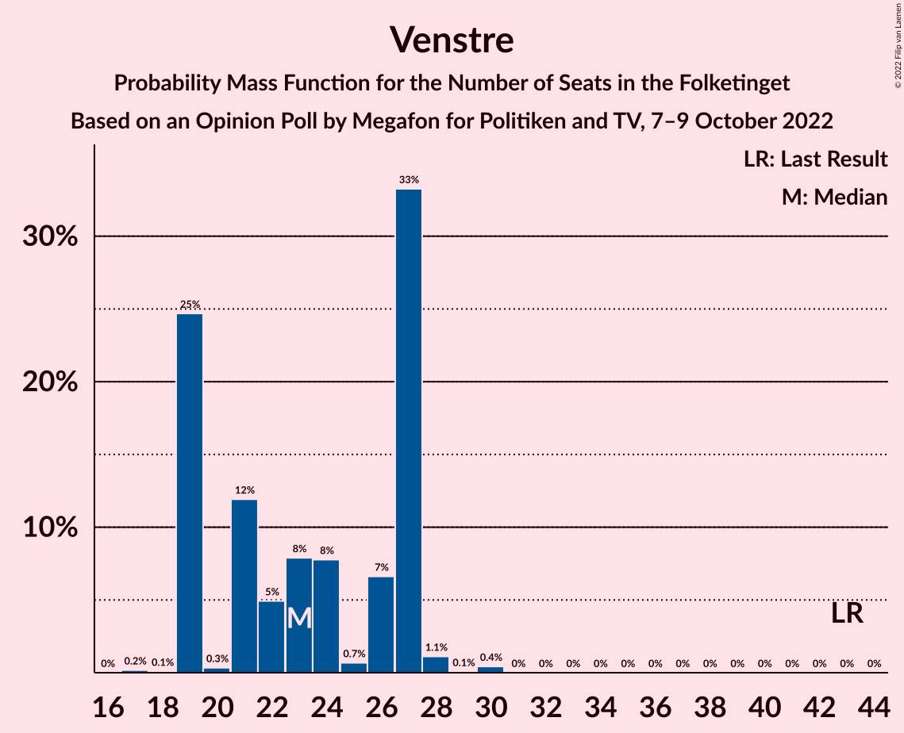

| Number of Seats | Probability | Accumulated | Special Marks |
|:---------------:|:-----------:|:-----------:|:-------------:|
| 17 | 0.2% | 100% |  |
| 18 | 0.1% | 99.8% |  |
| 19 | 25% | 99.7% |  |
| 20 | 0.3% | 75% |  |
| 21 | 12% | 75% |  |
| 22 | 5% | 63% |  |
| 23 | 8% | 58% | Median |
| 24 | 8% | 50% |  |
| 25 | 0.7% | 42% |  |
| 26 | 7% | 41% |  |
| 27 | 33% | 35% |  |
| 28 | 1.1% | 2% |  |
| 29 | 0.1% | 0.5% |  |
| 30 | 0.4% | 0.4% |  |
| 31 | 0% | 0% |  |
| 32 | 0% | 0% |  |
| 33 | 0% | 0% |  |
| 34 | 0% | 0% |  |
| 35 | 0% | 0% |  |
| 36 | 0% | 0% |  |
| 37 | 0% | 0% |  |
| 38 | 0% | 0% |  |
| 39 | 0% | 0% |  |
| 40 | 0% | 0% |  |
| 41 | 0% | 0% |  |
| 42 | 0% | 0% |  |
| 43 | 0% | 0% | Last Result |

### Det Konservative Folkeparti

*For a full overview of the results for this party, see the [Det Konservative Folkeparti](party-detkonservativefolkeparti.html) page.*

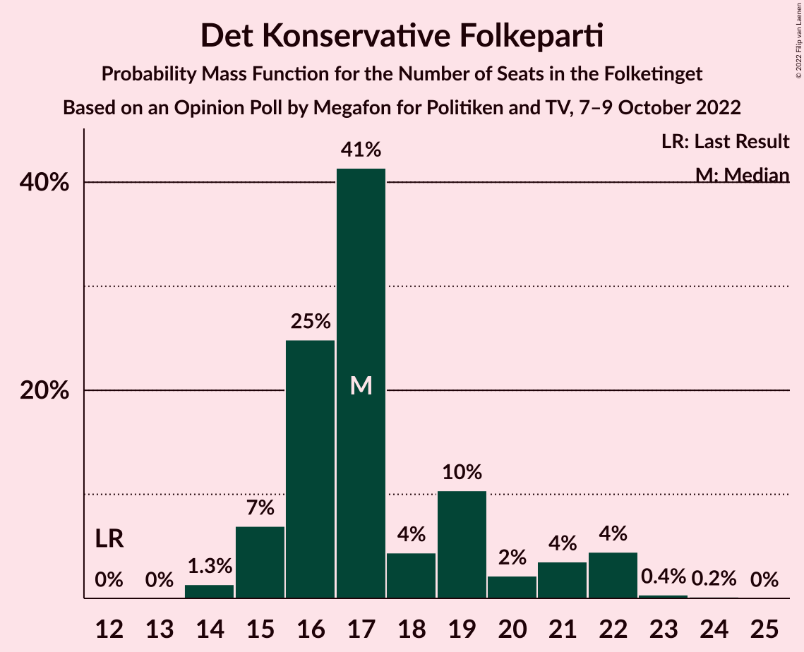

| Number of Seats | Probability | Accumulated | Special Marks |
|:---------------:|:-----------:|:-----------:|:-------------:|
| 12 | 0% | 100% | Last Result |
| 13 | 0% | 100% |  |
| 14 | 1.3% | 100% |  |
| 15 | 7% | 98.6% |  |
| 16 | 25% | 92% |  |
| 17 | 41% | 67% | Median |
| 18 | 4% | 25% |  |
| 19 | 10% | 21% |  |
| 20 | 2% | 11% |  |
| 21 | 4% | 9% |  |
| 22 | 4% | 5% |  |
| 23 | 0.4% | 0.5% |  |
| 24 | 0.2% | 0.2% |  |
| 25 | 0% | 0% |  |

### Danmarksdemokraterne

*For a full overview of the results for this party, see the [Danmarksdemokraterne](party-danmarksdemokraterne.html) page.*

| Number of Seats | Probability | Accumulated | Special Marks |
|:---------------:|:-----------:|:-----------:|:-------------:|
| 0 | 0% | 100% | Last Result |
| 1 | 0% | 100% |  |
| 2 | 0% | 100% |  |
| 3 | 0% | 100% |  |
| 4 | 0% | 100% |  |
| 5 | 0% | 100% |  |
| 6 | 0% | 100% |  |
| 7 | 0% | 100% |  |
| 8 | 0% | 100% |  |
| 9 | 0% | 100% |  |
| 10 | 0% | 100% |  |
| 11 | 0% | 100% |  |
| 12 | 0% | 100% |  |
| 13 | 0.9% | 100% |  |
| 14 | 0.3% | 99.1% |  |
| 15 | 33% | 98.7% |  |
| 16 | 20% | 66% | Median |
| 17 | 33% | 46% |  |
| 18 | 8% | 13% |  |
| 19 | 3% | 5% |  |
| 20 | 0.8% | 2% |  |
| 21 | 0.4% | 1.4% |  |
| 22 | 0.9% | 1.1% |  |
| 23 | 0.2% | 0.2% |  |
| 24 | 0% | 0% |  |

### Socialistisk Folkeparti

*For a full overview of the results for this party, see the [Socialistisk Folkeparti](party-socialistiskfolkeparti.html) page.*

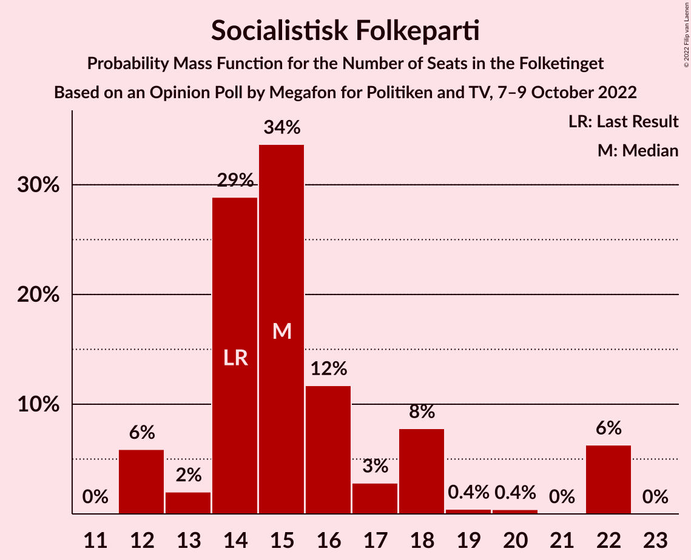

| Number of Seats | Probability | Accumulated | Special Marks |
|:---------------:|:-----------:|:-----------:|:-------------:|
| 12 | 6% | 100% |  |
| 13 | 2% | 94% |  |
| 14 | 29% | 92% | Last Result |
| 15 | 34% | 63% | Median |
| 16 | 12% | 30% |  |
| 17 | 3% | 18% |  |
| 18 | 8% | 15% |  |
| 19 | 0.4% | 7% |  |
| 20 | 0.4% | 7% |  |
| 21 | 0% | 6% |  |
| 22 | 6% | 6% |  |
| 23 | 0% | 0% |  |

### Enhedslisten–De Rød-Grønne

*For a full overview of the results for this party, see the [Enhedslisten–De Rød-Grønne](party-enhedslisten–derød-grønne.html) page.*

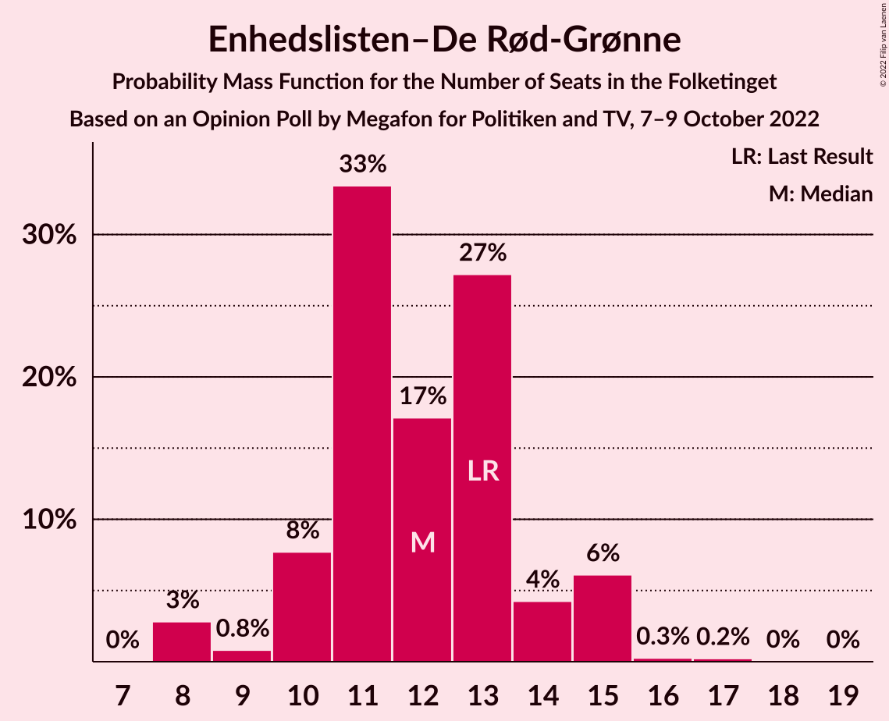

| Number of Seats | Probability | Accumulated | Special Marks |
|:---------------:|:-----------:|:-----------:|:-------------:|
| 8 | 3% | 100% |  |
| 9 | 0.8% | 97% |  |
| 10 | 8% | 96% |  |
| 11 | 33% | 89% |  |
| 12 | 17% | 55% | Median |
| 13 | 27% | 38% | Last Result |
| 14 | 4% | 11% |  |
| 15 | 6% | 7% |  |
| 16 | 0.3% | 0.5% |  |
| 17 | 0.2% | 0.3% |  |
| 18 | 0% | 0.1% |  |
| 19 | 0% | 0% |  |

### Moderaterne

*For a full overview of the results for this party, see the [Moderaterne](party-moderaterne.html) page.*

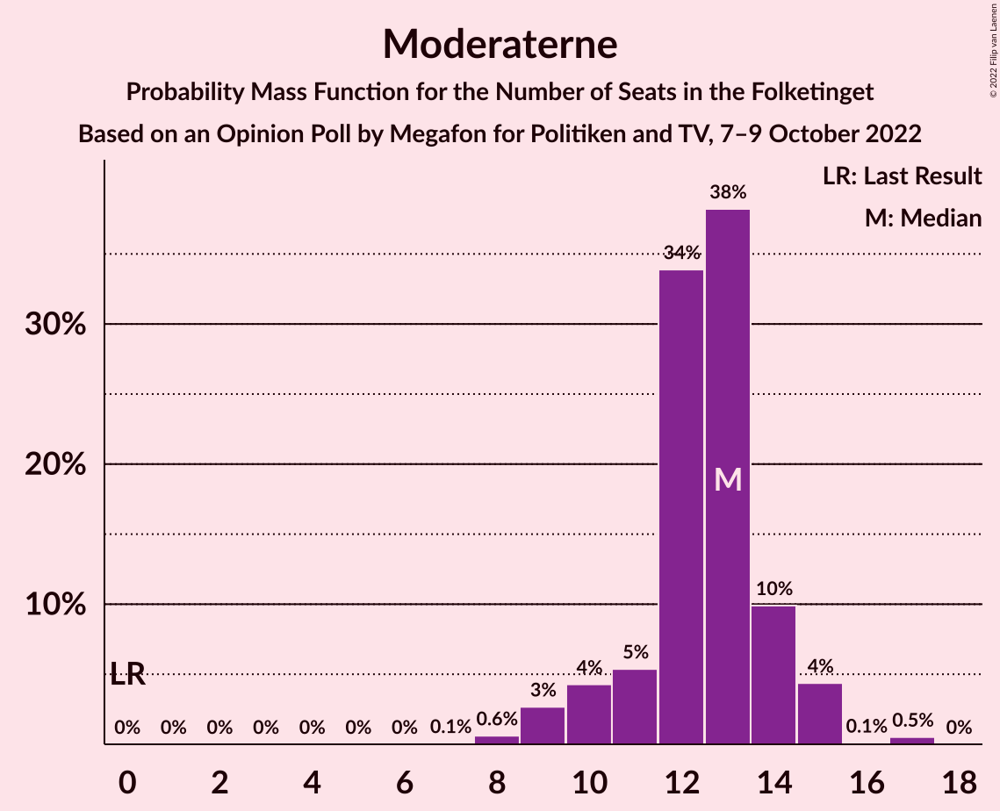

| Number of Seats | Probability | Accumulated | Special Marks |
|:---------------:|:-----------:|:-----------:|:-------------:|
| 0 | 0% | 100% | Last Result |
| 1 | 0% | 100% |  |
| 2 | 0% | 100% |  |
| 3 | 0% | 100% |  |
| 4 | 0% | 100% |  |
| 5 | 0% | 100% |  |
| 6 | 0% | 100% |  |
| 7 | 0.1% | 100% |  |
| 8 | 0.6% | 99.9% |  |
| 9 | 3% | 99.3% |  |
| 10 | 4% | 97% |  |
| 11 | 5% | 92% |  |
| 12 | 34% | 87% |  |
| 13 | 38% | 53% | Median |
| 14 | 10% | 15% |  |
| 15 | 4% | 5% |  |
| 16 | 0.1% | 0.6% |  |
| 17 | 0.5% | 0.5% |  |
| 18 | 0% | 0% |  |

### Liberal Alliance

*For a full overview of the results for this party, see the [Liberal Alliance](party-liberalalliance.html) page.*

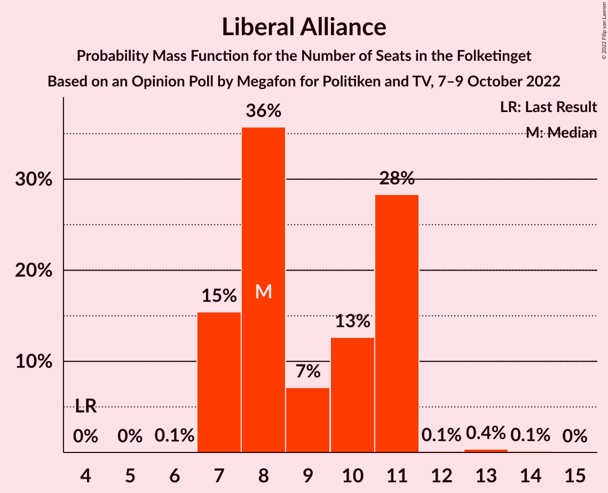

| Number of Seats | Probability | Accumulated | Special Marks |
|:---------------:|:-----------:|:-----------:|:-------------:|
| 4 | 0% | 100% | Last Result |
| 5 | 0% | 100% |  |
| 6 | 0.1% | 100% |  |
| 7 | 15% | 99.9% |  |
| 8 | 36% | 84% | Median |
| 9 | 7% | 49% |  |
| 10 | 13% | 42% |  |
| 11 | 28% | 29% |  |
| 12 | 0.1% | 0.7% |  |
| 13 | 0.4% | 0.5% |  |
| 14 | 0.1% | 0.1% |  |
| 15 | 0% | 0% |  |

### Radikale Venstre

*For a full overview of the results for this party, see the [Radikale Venstre](party-radikalevenstre.html) page.*

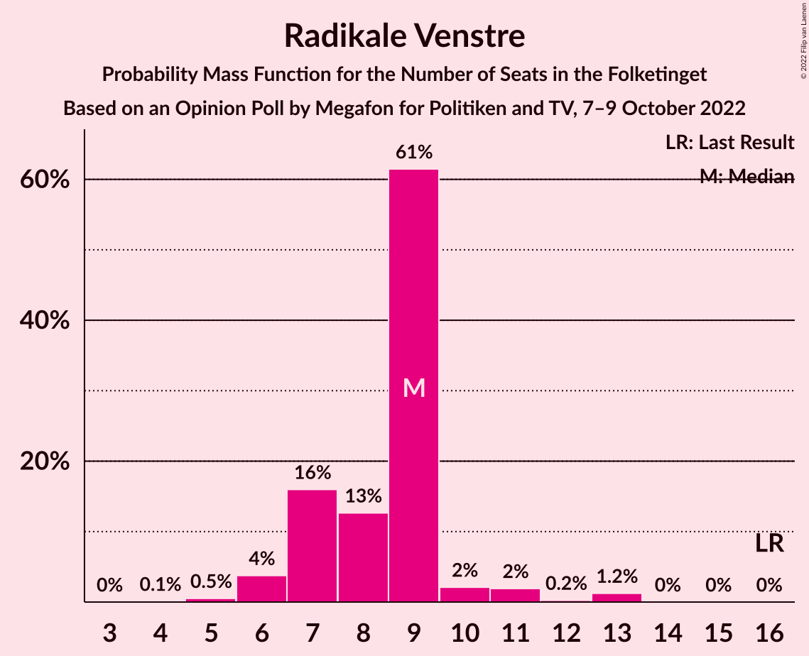

| Number of Seats | Probability | Accumulated | Special Marks |
|:---------------:|:-----------:|:-----------:|:-------------:|
| 4 | 0.1% | 100% |  |
| 5 | 0.5% | 99.9% |  |
| 6 | 4% | 99.4% |  |
| 7 | 16% | 96% |  |
| 8 | 13% | 80% |  |
| 9 | 61% | 67% | Median |
| 10 | 2% | 6% |  |
| 11 | 2% | 3% |  |
| 12 | 0.2% | 1.5% |  |
| 13 | 1.2% | 1.2% |  |
| 14 | 0% | 0% |  |
| 15 | 0% | 0% |  |
| 16 | 0% | 0% | Last Result |

### Nye Borgerlige

*For a full overview of the results for this party, see the [Nye Borgerlige](party-nyeborgerlige.html) page.*

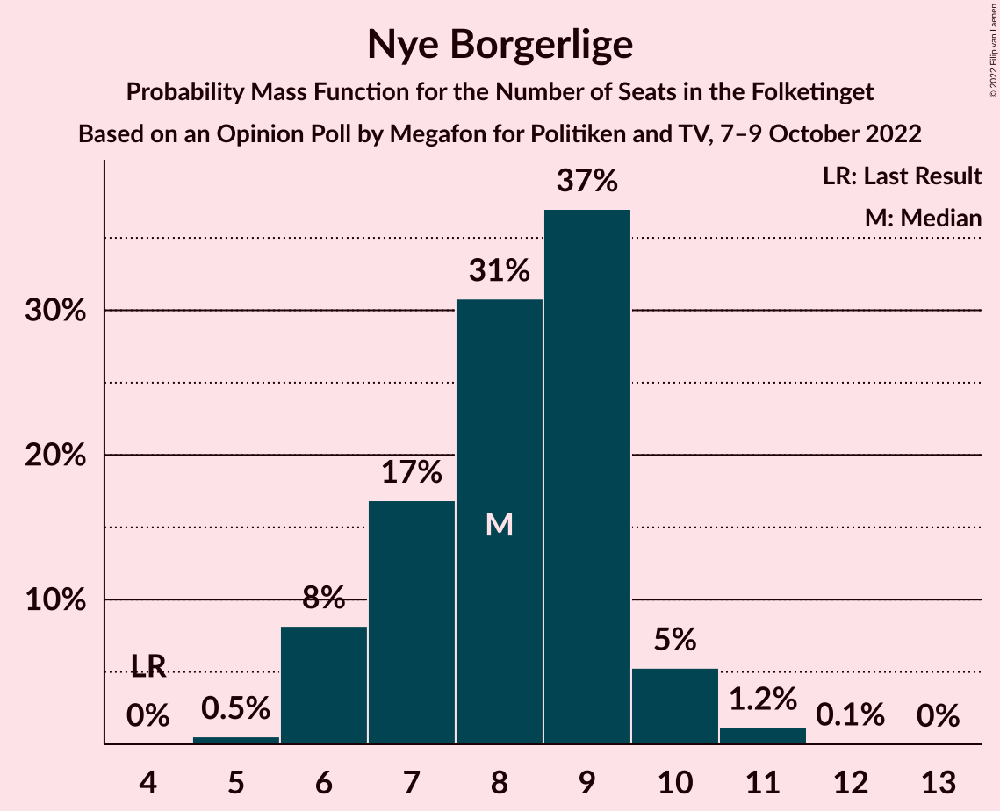

| Number of Seats | Probability | Accumulated | Special Marks |
|:---------------:|:-----------:|:-----------:|:-------------:|
| 4 | 0% | 100% | Last Result |
| 5 | 0.5% | 100% |  |
| 6 | 8% | 99.4% |  |
| 7 | 17% | 91% |  |
| 8 | 31% | 74% | Median |
| 9 | 37% | 44% |  |
| 10 | 5% | 7% |  |
| 11 | 1.2% | 1.3% |  |
| 12 | 0.1% | 0.1% |  |
| 13 | 0% | 0% |  |

### Dansk Folkeparti

*For a full overview of the results for this party, see the [Dansk Folkeparti](party-danskfolkeparti.html) page.*

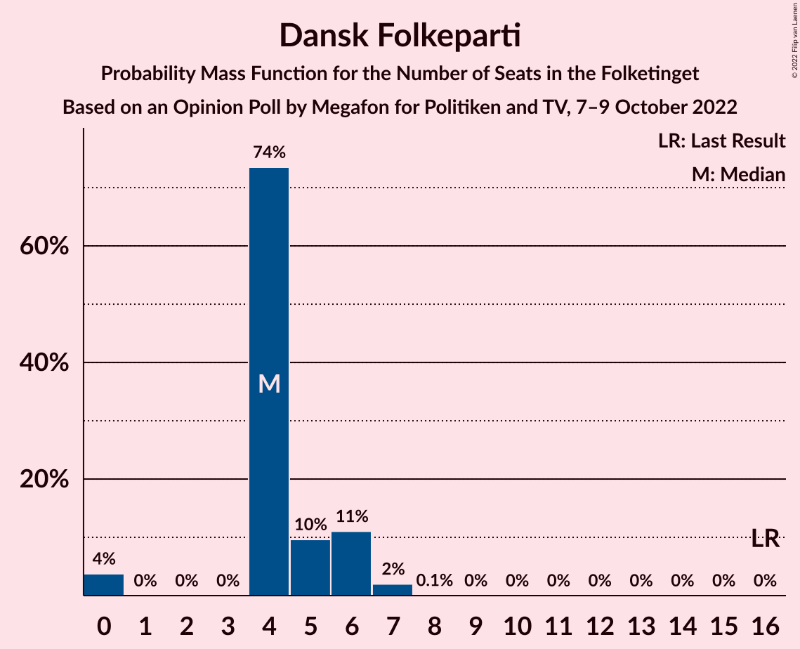

| Number of Seats | Probability | Accumulated | Special Marks |
|:---------------:|:-----------:|:-----------:|:-------------:|
| 0 | 4% | 100% |  |
| 1 | 0% | 96% |  |
| 2 | 0% | 96% |  |
| 3 | 0% | 96% |  |
| 4 | 74% | 96% | Median |
| 5 | 10% | 23% |  |
| 6 | 11% | 13% |  |
| 7 | 2% | 2% |  |
| 8 | 0.1% | 0.1% |  |
| 9 | 0% | 0% |  |
| 10 | 0% | 0% |  |
| 11 | 0% | 0% |  |
| 12 | 0% | 0% |  |
| 13 | 0% | 0% |  |
| 14 | 0% | 0% |  |
| 15 | 0% | 0% |  |
| 16 | 0% | 0% | Last Result |

### Alternativet

*For a full overview of the results for this party, see the [Alternativet](party-alternativet.html) page.*

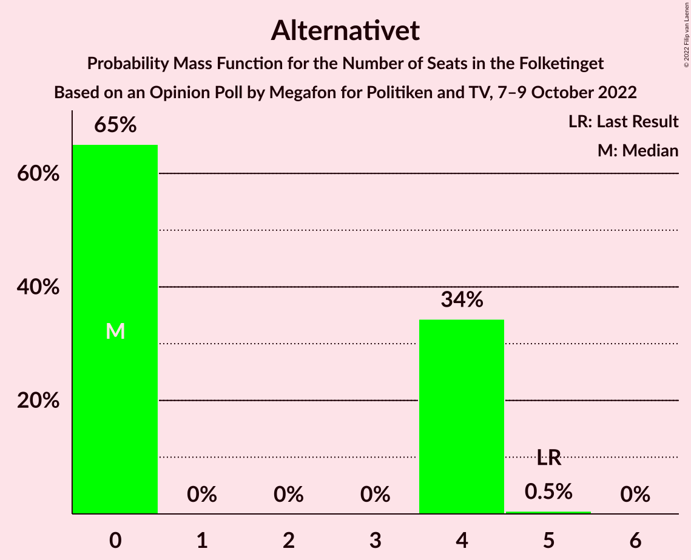

| Number of Seats | Probability | Accumulated | Special Marks |
|:---------------:|:-----------:|:-----------:|:-------------:|
| 0 | 65% | 100% | Median |
| 1 | 0% | 35% |  |
| 2 | 0% | 35% |  |
| 3 | 0% | 35% |  |
| 4 | 34% | 35% |  |
| 5 | 0.5% | 0.5% | Last Result |
| 6 | 0% | 0% |  |

### Kristendemokraterne

*For a full overview of the results for this party, see the [Kristendemokraterne](party-kristendemokraterne.html) page.*

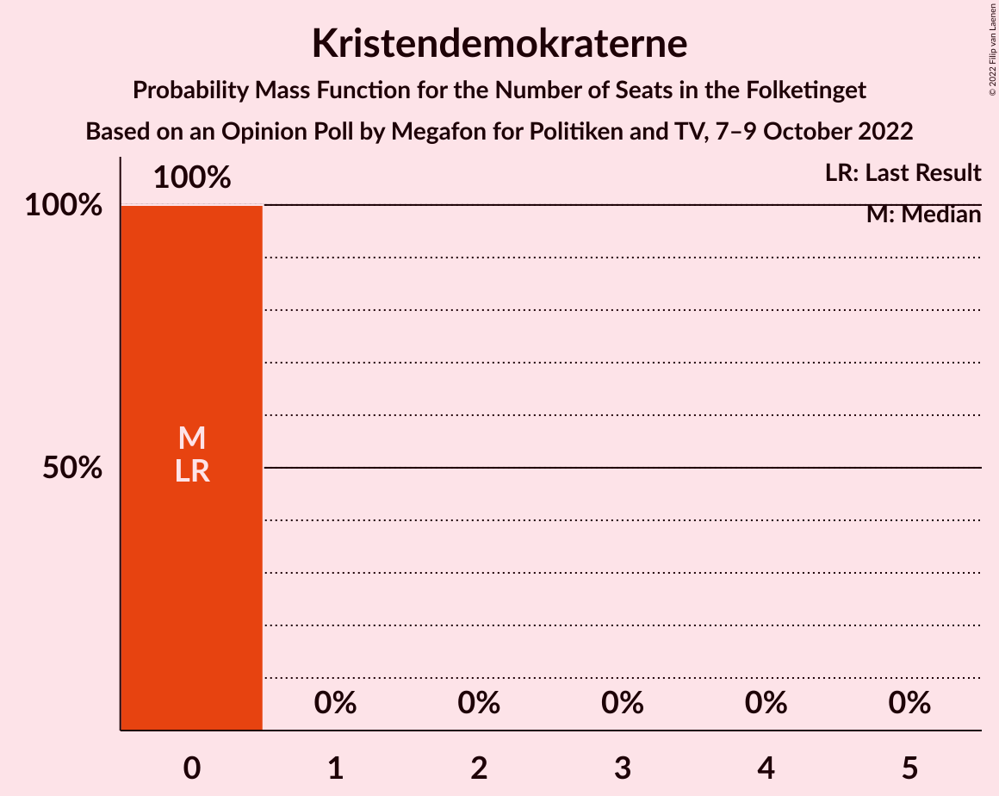

| Number of Seats | Probability | Accumulated | Special Marks |
|:---------------:|:-----------:|:-----------:|:-------------:|
| 0 | 100% | 100% | Last Result, Median |

### Frie Grønne

*For a full overview of the results for this party, see the [Frie Grønne](party-friegrønne.html) page.*

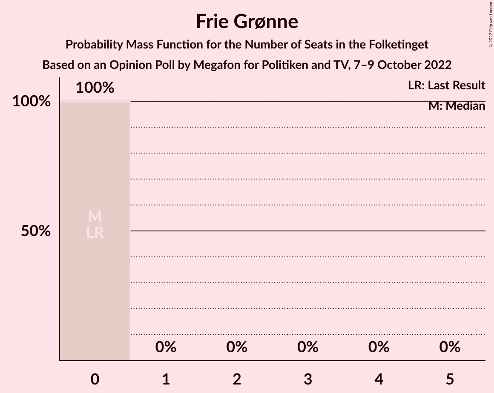

| Number of Seats | Probability | Accumulated | Special Marks |
|:---------------:|:-----------:|:-----------:|:-------------:|
| 0 | 100% | 100% | Last Result, Median |

## Coalitions

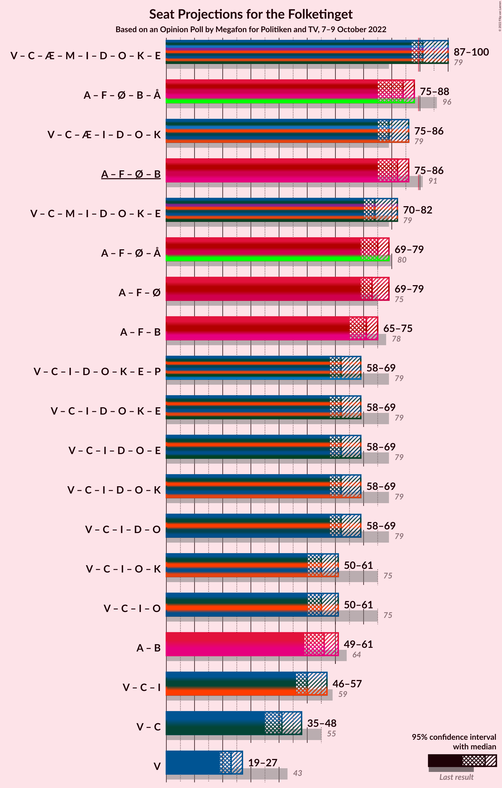

### Confidence Intervals

| Coalition | Last Result | Median | Majority? | 80% Confidence Interval | 90% Confidence Interval | 95% Confidence Interval | 99% Confidence Interval |
|:---------:|:-----------:|:------:|:---------:|:-----------------------:|:-----------------------:|:-----------------------:|:-----------------------:|
| Socialdemokraterne – Socialistisk Folkeparti – Enhedslisten–De Rød-Grønne – Radikale Venstre – Alternativet | 96 | 84 | 1.0% | 81–88 | 79–88 | 75–88 | 75–91 |
| Venstre – Det Konservative Folkeparti – Danmarksdemokraterne – Liberal Alliance – Nye Borgerlige – Dansk Folkeparti – Kristendemokraterne | 79 | 79 | 0.2% | 75–82 | 75–85 | 75–86 | 73–88 |
| Socialdemokraterne – Socialistisk Folkeparti – Enhedslisten–De Rød-Grønne – Radikale Venstre | 91 | 82 | 0.9% | 80–86 | 78–86 | 75–86 | 75–91 |
| Socialdemokraterne – Socialistisk Folkeparti – Enhedslisten–De Rød-Grønne – Alternativet | 80 | 75 | 0% | 72–79 | 70–79 | 69–79 | 68–83 |
| Socialdemokraterne – Socialistisk Folkeparti – Enhedslisten–De Rød-Grønne | 75 | 73 | 0% | 72–78 | 70–79 | 69–79 | 67–83 |
| Socialdemokraterne – Socialistisk Folkeparti – Radikale Venstre | 78 | 71 | 0% | 67–74 | 66–75 | 65–75 | 64–78 |
| Venstre – Det Konservative Folkeparti – Liberal Alliance – Nye Borgerlige – Dansk Folkeparti – Kristendemokraterne | 79 | 62 | 0% | 58–65 | 58–68 | 58–69 | 55–71 |
| Venstre – Det Konservative Folkeparti – Liberal Alliance – Nye Borgerlige – Dansk Folkeparti | 79 | 62 | 0% | 58–65 | 58–68 | 58–69 | 55–71 |
| Venstre – Det Konservative Folkeparti – Liberal Alliance – Dansk Folkeparti – Kristendemokraterne | 75 | 55 | 0% | 50–56 | 50–60 | 50–61 | 46–63 |
| Venstre – Det Konservative Folkeparti – Liberal Alliance – Dansk Folkeparti | 75 | 55 | 0% | 50–56 | 50–60 | 50–61 | 46–63 |
| Socialdemokraterne – Radikale Venstre | 64 | 56 | 0% | 53–57 | 50–57 | 49–61 | 48–62 |
| Venstre – Det Konservative Folkeparti – Liberal Alliance | 59 | 50 | 0% | 46–52 | 46–55 | 46–57 | 46–58 |
| Venstre – Det Konservative Folkeparti | 55 | 41 | 0% | 35–44 | 35–44 | 35–48 | 35–50 |
| Venstre | 43 | 23 | 0% | 19–27 | 19–27 | 19–27 | 19–29 |

### Socialdemokraterne – Socialistisk Folkeparti – Enhedslisten–De Rød-Grønne – Radikale Venstre – Alternativet

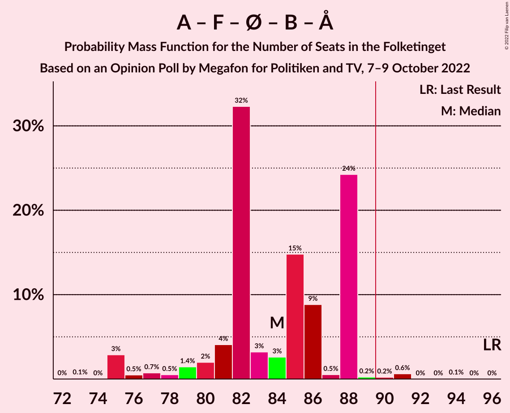

| Number of Seats | Probability | Accumulated | Special Marks |
|:---------------:|:-----------:|:-----------:|:-------------:|
| 72 | 0% | 100% |  |
| 73 | 0.1% | 99.9% |  |
| 74 | 0% | 99.8% |  |
| 75 | 3% | 99.8% |  |
| 76 | 0.5% | 97% |  |
| 77 | 0.7% | 96% |  |
| 78 | 0.5% | 96% |  |
| 79 | 1.4% | 95% |  |
| 80 | 2% | 94% |  |
| 81 | 4% | 92% |  |
| 82 | 32% | 88% |  |
| 83 | 3% | 55% | Median |
| 84 | 3% | 52% |  |
| 85 | 15% | 50% |  |
| 86 | 9% | 35% |  |
| 87 | 0.5% | 26% |  |
| 88 | 24% | 25% |  |
| 89 | 0.2% | 1.2% |  |
| 90 | 0.2% | 1.0% | Majority |
| 91 | 0.6% | 0.7% |  |
| 92 | 0% | 0.1% |  |
| 93 | 0% | 0.1% |  |
| 94 | 0.1% | 0.1% |  |
| 95 | 0% | 0% |  |
| 96 | 0% | 0% | Last Result |

### Venstre – Det Konservative Folkeparti – Danmarksdemokraterne – Liberal Alliance – Nye Borgerlige – Dansk Folkeparti – Kristendemokraterne

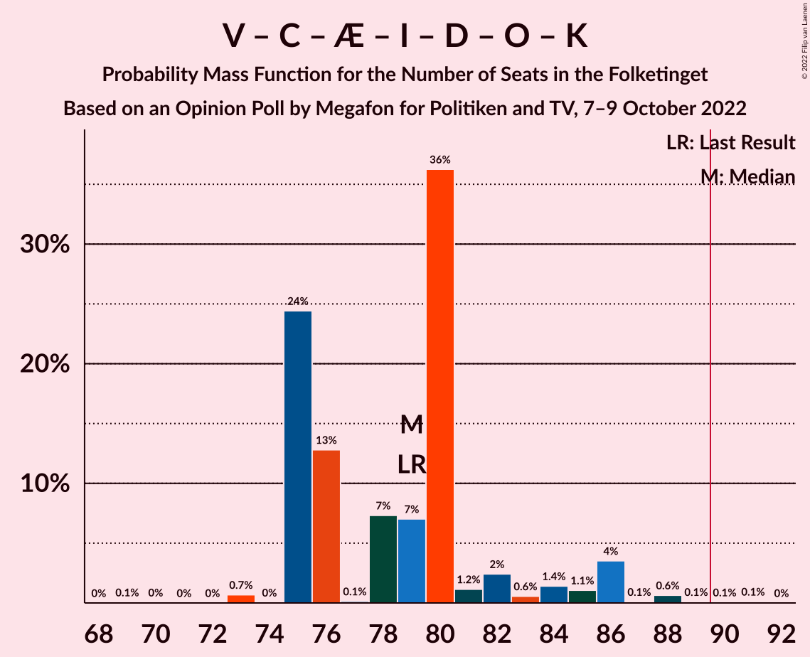

| Number of Seats | Probability | Accumulated | Special Marks |
|:---------------:|:-----------:|:-----------:|:-------------:|
| 69 | 0.1% | 100% |  |
| 70 | 0% | 99.9% |  |
| 71 | 0% | 99.9% |  |
| 72 | 0% | 99.9% |  |
| 73 | 0.7% | 99.9% |  |
| 74 | 0% | 99.2% |  |
| 75 | 24% | 99.2% |  |
| 76 | 13% | 75% | Median |
| 77 | 0.1% | 62% |  |
| 78 | 7% | 62% |  |
| 79 | 7% | 54% | Last Result |
| 80 | 36% | 47% |  |
| 81 | 1.2% | 11% |  |
| 82 | 2% | 10% |  |
| 83 | 0.6% | 8% |  |
| 84 | 1.4% | 7% |  |
| 85 | 1.1% | 6% |  |
| 86 | 4% | 5% |  |
| 87 | 0.1% | 1.0% |  |
| 88 | 0.6% | 0.9% |  |
| 89 | 0.1% | 0.3% |  |
| 90 | 0.1% | 0.2% | Majority |
| 91 | 0.1% | 0.1% |  |
| 92 | 0% | 0% |  |

### Socialdemokraterne – Socialistisk Folkeparti – Enhedslisten–De Rød-Grønne – Radikale Venstre

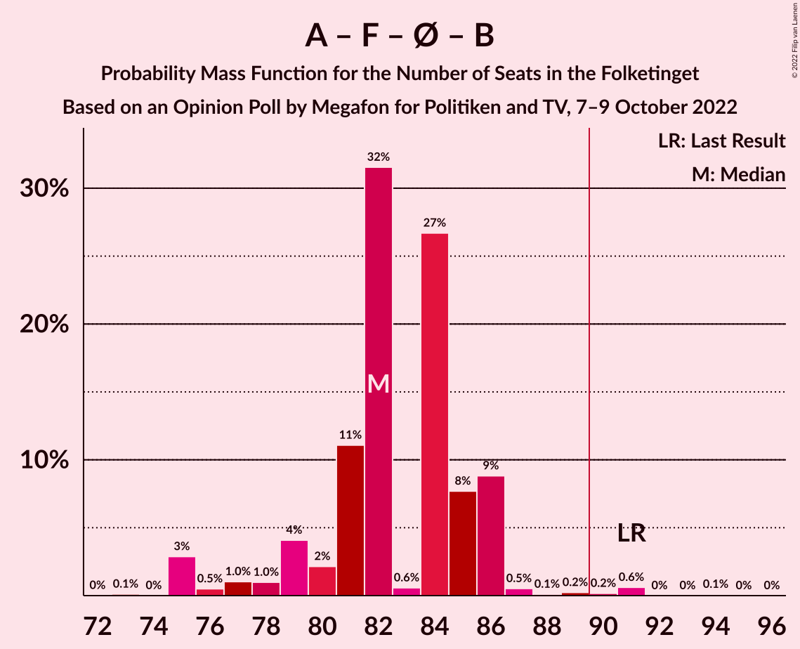

| Number of Seats | Probability | Accumulated | Special Marks |
|:---------------:|:-----------:|:-----------:|:-------------:|
| 72 | 0% | 100% |  |
| 73 | 0.1% | 99.9% |  |
| 74 | 0% | 99.8% |  |
| 75 | 3% | 99.8% |  |
| 76 | 0.5% | 97% |  |
| 77 | 1.0% | 96% |  |
| 78 | 1.0% | 95% |  |
| 79 | 4% | 94% |  |
| 80 | 2% | 90% |  |
| 81 | 11% | 88% |  |
| 82 | 32% | 77% |  |
| 83 | 0.6% | 46% | Median |
| 84 | 27% | 45% |  |
| 85 | 8% | 18% |  |
| 86 | 9% | 11% |  |
| 87 | 0.5% | 2% |  |
| 88 | 0.1% | 1.2% |  |
| 89 | 0.2% | 1.1% |  |
| 90 | 0.2% | 0.9% | Majority |
| 91 | 0.6% | 0.7% | Last Result |
| 92 | 0% | 0.1% |  |
| 93 | 0% | 0.1% |  |
| 94 | 0.1% | 0.1% |  |
| 95 | 0% | 0% |  |

### Socialdemokraterne – Socialistisk Folkeparti – Enhedslisten–De Rød-Grønne – Alternativet

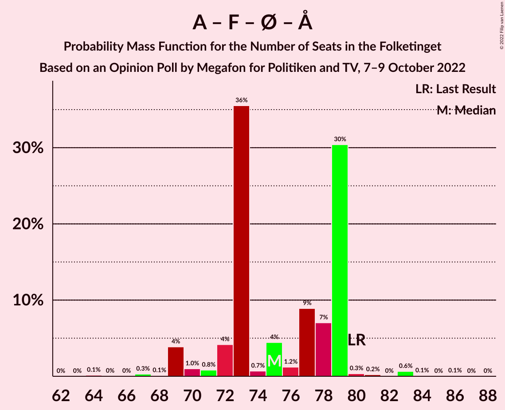

| Number of Seats | Probability | Accumulated | Special Marks |
|:---------------:|:-----------:|:-----------:|:-------------:|
| 64 | 0.1% | 100% |  |
| 65 | 0% | 99.8% |  |
| 66 | 0% | 99.8% |  |
| 67 | 0.3% | 99.8% |  |
| 68 | 0.1% | 99.5% |  |
| 69 | 4% | 99.4% |  |
| 70 | 1.0% | 96% |  |
| 71 | 0.8% | 95% |  |
| 72 | 4% | 94% |  |
| 73 | 36% | 90% |  |
| 74 | 0.7% | 54% | Median |
| 75 | 4% | 53% |  |
| 76 | 1.2% | 49% |  |
| 77 | 9% | 48% |  |
| 78 | 7% | 39% |  |
| 79 | 30% | 32% |  |
| 80 | 0.3% | 1.4% | Last Result |
| 81 | 0.2% | 1.0% |  |
| 82 | 0% | 0.8% |  |
| 83 | 0.6% | 0.8% |  |
| 84 | 0.1% | 0.1% |  |
| 85 | 0% | 0.1% |  |
| 86 | 0.1% | 0.1% |  |
| 87 | 0% | 0% |  |

### Socialdemokraterne – Socialistisk Folkeparti – Enhedslisten–De Rød-Grønne

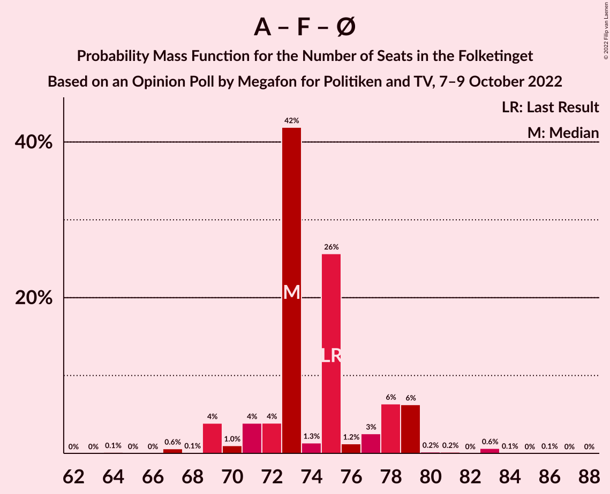

| Number of Seats | Probability | Accumulated | Special Marks |
|:---------------:|:-----------:|:-----------:|:-------------:|
| 64 | 0.1% | 100% |  |
| 65 | 0% | 99.8% |  |
| 66 | 0% | 99.8% |  |
| 67 | 0.6% | 99.8% |  |
| 68 | 0.1% | 99.2% |  |
| 69 | 4% | 99.1% |  |
| 70 | 1.0% | 95% |  |
| 71 | 4% | 94% |  |
| 72 | 4% | 90% |  |
| 73 | 42% | 86% |  |
| 74 | 1.3% | 45% | Median |
| 75 | 26% | 43% | Last Result |
| 76 | 1.2% | 18% |  |
| 77 | 3% | 16% |  |
| 78 | 6% | 14% |  |
| 79 | 6% | 7% |  |
| 80 | 0.2% | 1.1% |  |
| 81 | 0.2% | 1.0% |  |
| 82 | 0% | 0.8% |  |
| 83 | 0.6% | 0.8% |  |
| 84 | 0.1% | 0.1% |  |
| 85 | 0% | 0.1% |  |
| 86 | 0.1% | 0.1% |  |
| 87 | 0% | 0% |  |

### Socialdemokraterne – Socialistisk Folkeparti – Radikale Venstre

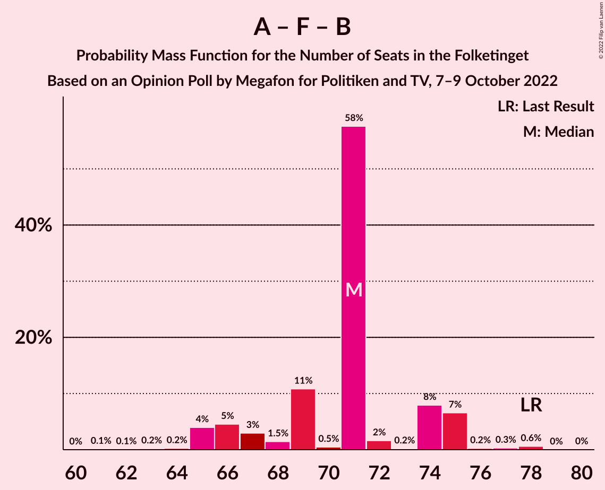

| Number of Seats | Probability | Accumulated | Special Marks |
|:---------------:|:-----------:|:-----------:|:-------------:|
| 61 | 0.1% | 100% |  |
| 62 | 0.1% | 99.9% |  |
| 63 | 0.2% | 99.8% |  |
| 64 | 0.2% | 99.6% |  |
| 65 | 4% | 99.4% |  |
| 66 | 5% | 95% |  |
| 67 | 3% | 91% |  |
| 68 | 1.5% | 88% |  |
| 69 | 11% | 86% |  |
| 70 | 0.5% | 76% |  |
| 71 | 58% | 75% | Median |
| 72 | 2% | 18% |  |
| 73 | 0.2% | 16% |  |
| 74 | 8% | 16% |  |
| 75 | 7% | 8% |  |
| 76 | 0.2% | 1.2% |  |
| 77 | 0.3% | 1.0% |  |
| 78 | 0.6% | 0.7% | Last Result |
| 79 | 0% | 0% |  |

### Venstre – Det Konservative Folkeparti – Liberal Alliance – Nye Borgerlige – Dansk Folkeparti – Kristendemokraterne

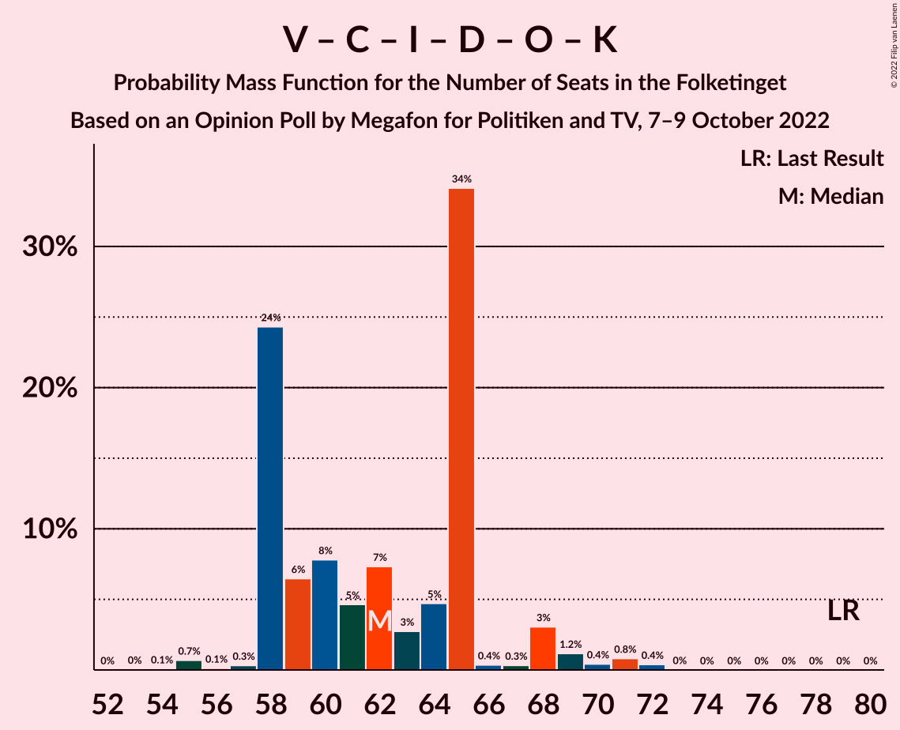

| Number of Seats | Probability | Accumulated | Special Marks |
|:---------------:|:-----------:|:-----------:|:-------------:|
| 53 | 0% | 100% |  |
| 54 | 0.1% | 99.9% |  |
| 55 | 0.7% | 99.9% |  |
| 56 | 0.1% | 99.2% |  |
| 57 | 0.3% | 99.1% |  |
| 58 | 24% | 98.7% |  |
| 59 | 6% | 74% |  |
| 60 | 8% | 68% | Median |
| 61 | 5% | 60% |  |
| 62 | 7% | 56% |  |
| 63 | 3% | 48% |  |
| 64 | 5% | 45% |  |
| 65 | 34% | 41% |  |
| 66 | 0.4% | 7% |  |
| 67 | 0.3% | 6% |  |
| 68 | 3% | 6% |  |
| 69 | 1.2% | 3% |  |
| 70 | 0.4% | 2% |  |
| 71 | 0.8% | 1.2% |  |
| 72 | 0.4% | 0.4% |  |
| 73 | 0% | 0% |  |
| 74 | 0% | 0% |  |
| 75 | 0% | 0% |  |
| 76 | 0% | 0% |  |
| 77 | 0% | 0% |  |
| 78 | 0% | 0% |  |
| 79 | 0% | 0% | Last Result |

### Venstre – Det Konservative Folkeparti – Liberal Alliance – Nye Borgerlige – Dansk Folkeparti

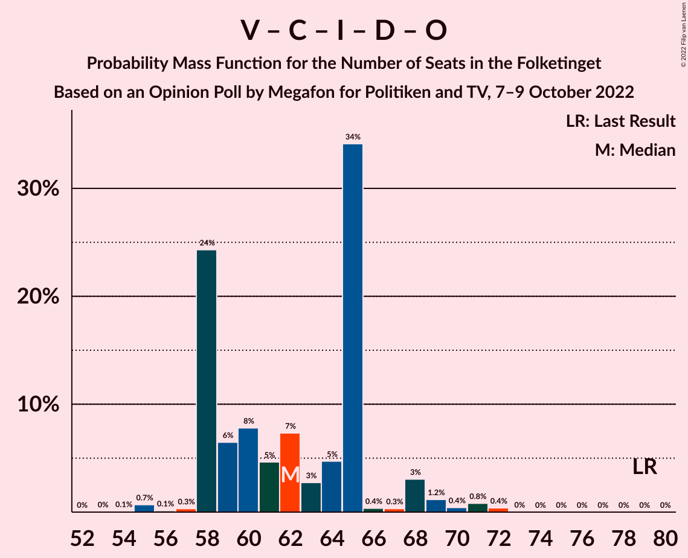

| Number of Seats | Probability | Accumulated | Special Marks |
|:---------------:|:-----------:|:-----------:|:-------------:|
| 53 | 0% | 100% |  |
| 54 | 0.1% | 99.9% |  |
| 55 | 0.7% | 99.9% |  |
| 56 | 0.1% | 99.2% |  |
| 57 | 0.3% | 99.1% |  |
| 58 | 24% | 98.7% |  |
| 59 | 6% | 74% |  |
| 60 | 8% | 68% | Median |
| 61 | 5% | 60% |  |
| 62 | 7% | 55% |  |
| 63 | 3% | 48% |  |
| 64 | 5% | 45% |  |
| 65 | 34% | 41% |  |
| 66 | 0.4% | 7% |  |
| 67 | 0.3% | 6% |  |
| 68 | 3% | 6% |  |
| 69 | 1.2% | 3% |  |
| 70 | 0.4% | 2% |  |
| 71 | 0.8% | 1.2% |  |
| 72 | 0.4% | 0.4% |  |
| 73 | 0% | 0% |  |
| 74 | 0% | 0% |  |
| 75 | 0% | 0% |  |
| 76 | 0% | 0% |  |
| 77 | 0% | 0% |  |
| 78 | 0% | 0% |  |
| 79 | 0% | 0% | Last Result |

### Venstre – Det Konservative Folkeparti – Liberal Alliance – Dansk Folkeparti – Kristendemokraterne

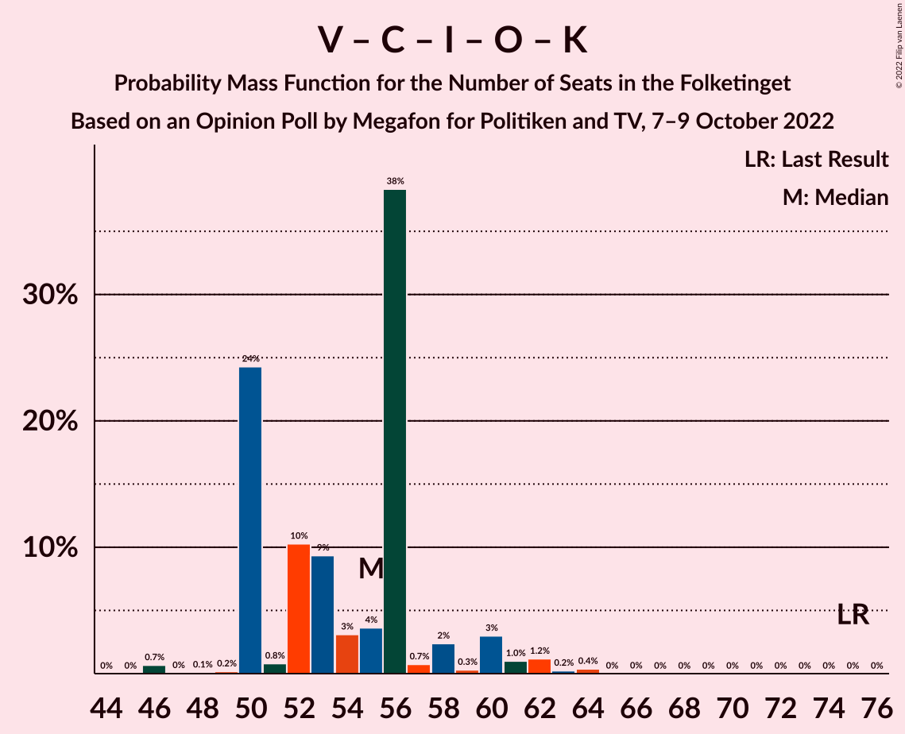

| Number of Seats | Probability | Accumulated | Special Marks |
|:---------------:|:-----------:|:-----------:|:-------------:|
| 46 | 0.7% | 100% |  |
| 47 | 0% | 99.3% |  |
| 48 | 0.1% | 99.3% |  |
| 49 | 0.2% | 99.2% |  |
| 50 | 24% | 99.0% |  |
| 51 | 0.8% | 75% |  |
| 52 | 10% | 74% | Median |
| 53 | 9% | 64% |  |
| 54 | 3% | 54% |  |
| 55 | 4% | 51% |  |
| 56 | 38% | 48% |  |
| 57 | 0.7% | 9% |  |
| 58 | 2% | 8% |  |
| 59 | 0.3% | 6% |  |
| 60 | 3% | 6% |  |
| 61 | 1.0% | 3% |  |
| 62 | 1.2% | 2% |  |
| 63 | 0.2% | 0.6% |  |
| 64 | 0.4% | 0.4% |  |
| 65 | 0% | 0% |  |
| 66 | 0% | 0% |  |
| 67 | 0% | 0% |  |
| 68 | 0% | 0% |  |
| 69 | 0% | 0% |  |
| 70 | 0% | 0% |  |
| 71 | 0% | 0% |  |
| 72 | 0% | 0% |  |
| 73 | 0% | 0% |  |
| 74 | 0% | 0% |  |
| 75 | 0% | 0% | Last Result |

### Venstre – Det Konservative Folkeparti – Liberal Alliance – Dansk Folkeparti

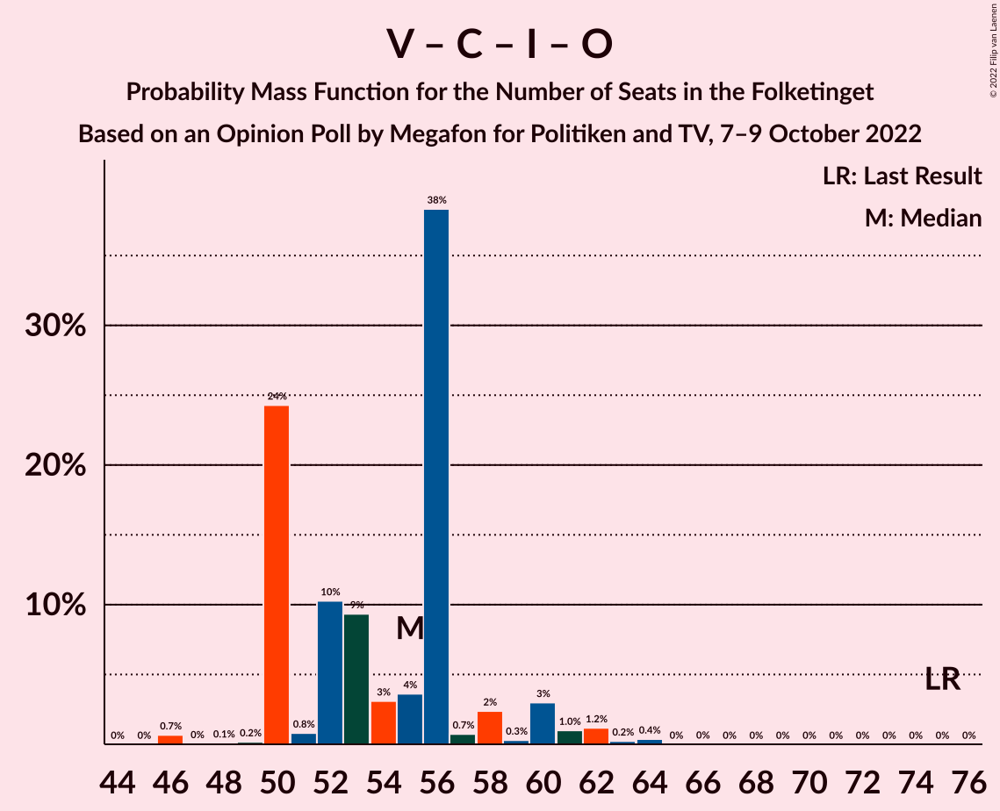

| Number of Seats | Probability | Accumulated | Special Marks |
|:---------------:|:-----------:|:-----------:|:-------------:|
| 46 | 0.7% | 100% |  |
| 47 | 0% | 99.3% |  |
| 48 | 0.1% | 99.3% |  |
| 49 | 0.2% | 99.2% |  |
| 50 | 24% | 99.0% |  |
| 51 | 0.8% | 75% |  |
| 52 | 10% | 74% | Median |
| 53 | 9% | 64% |  |
| 54 | 3% | 54% |  |
| 55 | 4% | 51% |  |
| 56 | 38% | 48% |  |
| 57 | 0.7% | 9% |  |
| 58 | 2% | 8% |  |
| 59 | 0.3% | 6% |  |
| 60 | 3% | 6% |  |
| 61 | 1.0% | 3% |  |
| 62 | 1.2% | 2% |  |
| 63 | 0.2% | 0.6% |  |
| 64 | 0.4% | 0.4% |  |
| 65 | 0% | 0% |  |
| 66 | 0% | 0% |  |
| 67 | 0% | 0% |  |
| 68 | 0% | 0% |  |
| 69 | 0% | 0% |  |
| 70 | 0% | 0% |  |
| 71 | 0% | 0% |  |
| 72 | 0% | 0% |  |
| 73 | 0% | 0% |  |
| 74 | 0% | 0% |  |
| 75 | 0% | 0% | Last Result |

### Socialdemokraterne – Radikale Venstre

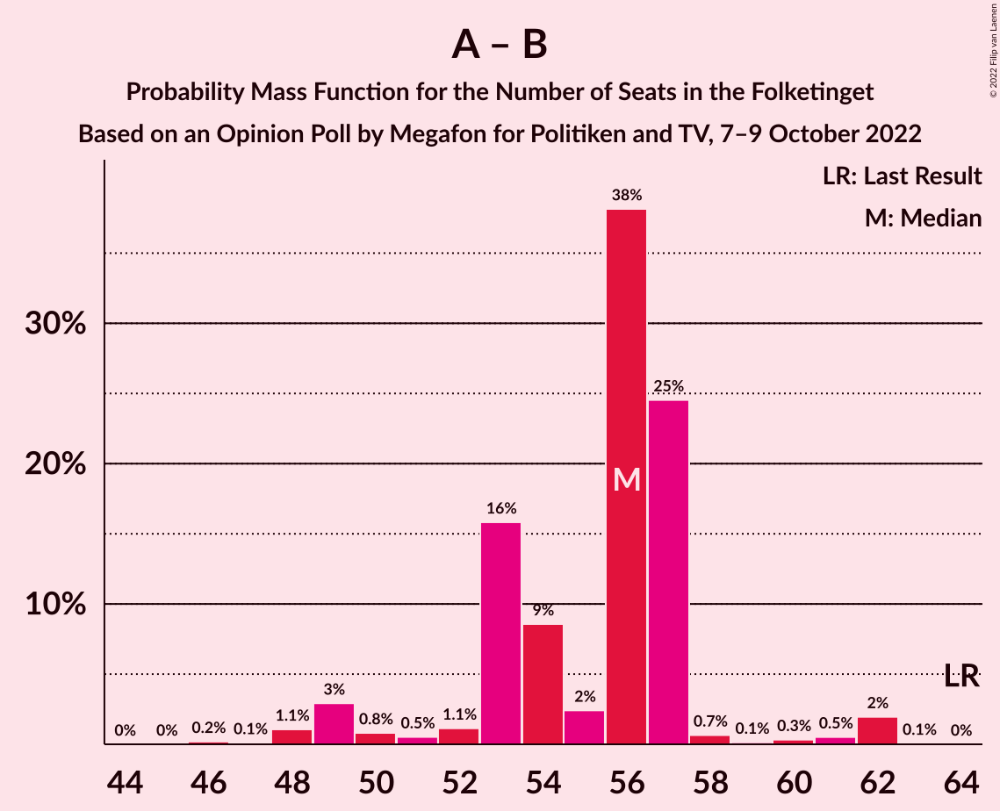

| Number of Seats | Probability | Accumulated | Special Marks |
|:---------------:|:-----------:|:-----------:|:-------------:|
| 46 | 0.2% | 100% |  |
| 47 | 0.1% | 99.8% |  |
| 48 | 1.1% | 99.7% |  |
| 49 | 3% | 98.6% |  |
| 50 | 0.8% | 96% |  |
| 51 | 0.5% | 95% |  |
| 52 | 1.1% | 94% |  |
| 53 | 16% | 93% |  |
| 54 | 9% | 77% |  |
| 55 | 2% | 69% |  |
| 56 | 38% | 66% | Median |
| 57 | 25% | 28% |  |
| 58 | 0.7% | 4% |  |
| 59 | 0.1% | 3% |  |
| 60 | 0.3% | 3% |  |
| 61 | 0.5% | 3% |  |
| 62 | 2% | 2% |  |
| 63 | 0.1% | 0.1% |  |
| 64 | 0% | 0% | Last Result |

### Venstre – Det Konservative Folkeparti – Liberal Alliance

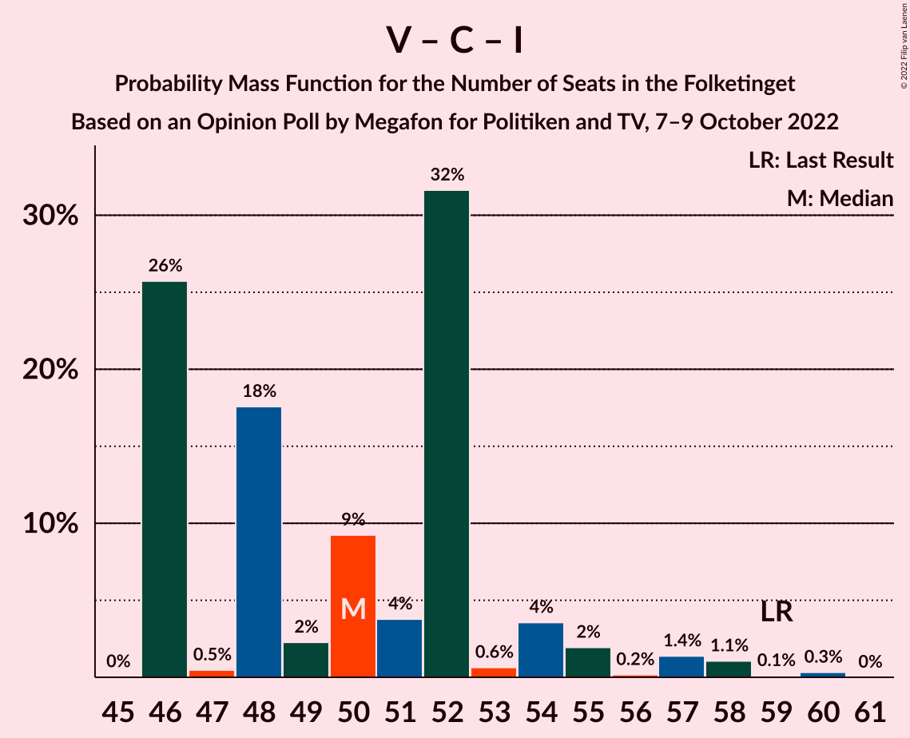

| Number of Seats | Probability | Accumulated | Special Marks |
|:---------------:|:-----------:|:-----------:|:-------------:|
| 45 | 0% | 100% |  |
| 46 | 26% | 99.9% |  |
| 47 | 0.5% | 74% |  |
| 48 | 18% | 74% | Median |
| 49 | 2% | 56% |  |
| 50 | 9% | 54% |  |
| 51 | 4% | 45% |  |
| 52 | 32% | 41% |  |
| 53 | 0.6% | 9% |  |
| 54 | 4% | 9% |  |
| 55 | 2% | 5% |  |
| 56 | 0.2% | 3% |  |
| 57 | 1.4% | 3% |  |
| 58 | 1.1% | 2% |  |
| 59 | 0.1% | 0.5% | Last Result |
| 60 | 0.3% | 0.3% |  |
| 61 | 0% | 0% |  |

### Venstre – Det Konservative Folkeparti

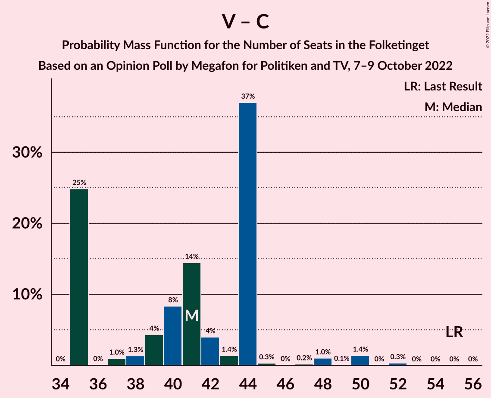

| Number of Seats | Probability | Accumulated | Special Marks |
|:---------------:|:-----------:|:-----------:|:-------------:|
| 35 | 25% | 100% |  |
| 36 | 0% | 75% |  |
| 37 | 1.0% | 75% |  |
| 38 | 1.3% | 74% |  |
| 39 | 4% | 73% |  |
| 40 | 8% | 68% | Median |
| 41 | 14% | 60% |  |
| 42 | 4% | 46% |  |
| 43 | 1.4% | 42% |  |
| 44 | 37% | 40% |  |
| 45 | 0.3% | 3% |  |
| 46 | 0% | 3% |  |
| 47 | 0.2% | 3% |  |
| 48 | 1.0% | 3% |  |
| 49 | 0.1% | 2% |  |
| 50 | 1.4% | 2% |  |
| 51 | 0% | 0.3% |  |
| 52 | 0.3% | 0.3% |  |
| 53 | 0% | 0% |  |
| 54 | 0% | 0% |  |
| 55 | 0% | 0% | Last Result |

### Venstre

| Number of Seats | Probability | Accumulated | Special Marks |
|:---------------:|:-----------:|:-----------:|:-------------:|
| 17 | 0.2% | 100% |  |
| 18 | 0.1% | 99.8% |  |
| 19 | 25% | 99.7% |  |
| 20 | 0.3% | 75% |  |
| 21 | 12% | 75% |  |
| 22 | 5% | 63% |  |
| 23 | 8% | 58% | Median |
| 24 | 8% | 50% |  |
| 25 | 0.7% | 42% |  |
| 26 | 7% | 41% |  |
| 27 | 33% | 35% |  |
| 28 | 1.1% | 2% |  |
| 29 | 0.1% | 0.5% |  |
| 30 | 0.4% | 0.4% |  |
| 31 | 0% | 0% |  |
| 32 | 0% | 0% |  |
| 33 | 0% | 0% |  |
| 34 | 0% | 0% |  |
| 35 | 0% | 0% |  |
| 36 | 0% | 0% |  |
| 37 | 0% | 0% |  |
| 38 | 0% | 0% |  |
| 39 | 0% | 0% |  |
| 40 | 0% | 0% |  |
| 41 | 0% | 0% |  |
| 42 | 0% | 0% |  |
| 43 | 0% | 0% | Last Result |

## Technical Information

### Opinion Poll

+ **Polling firm:** Megafon
+ **Commissioner(s):** Politiken and TV
+ **Fieldwork period:** 7–9 October 2022

### Calculations

+ **Sample size:** 1018
+ **Simulations done:** 1,048,576
+ **Error estimate:** 4.13%

