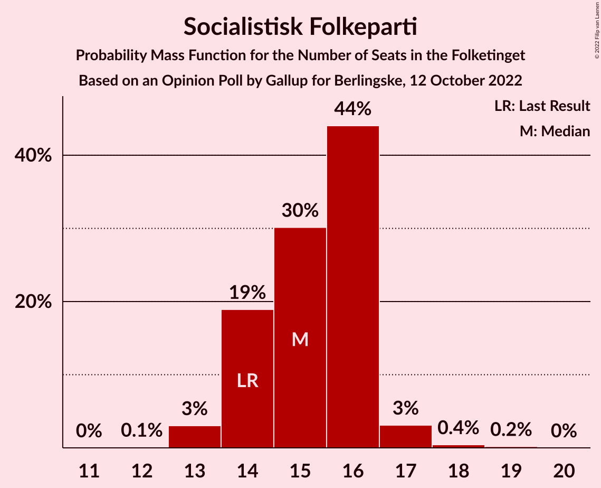
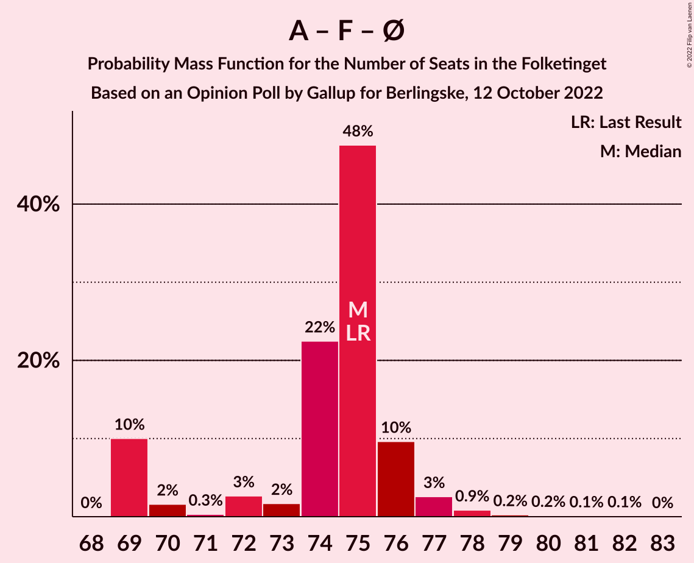
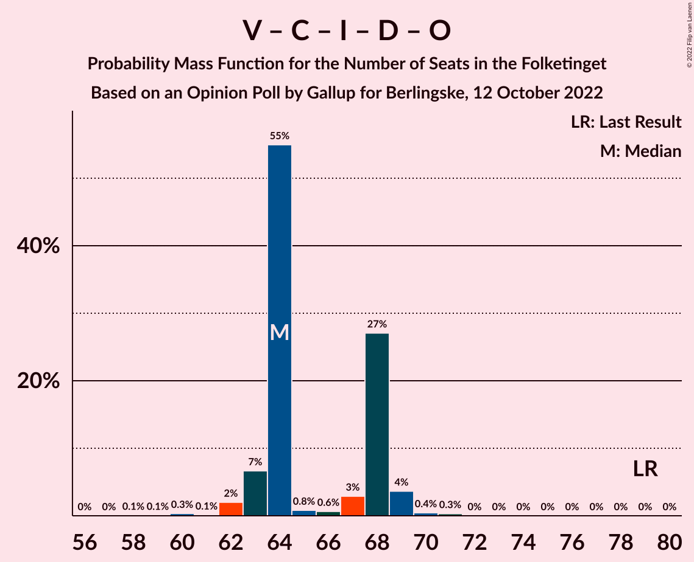
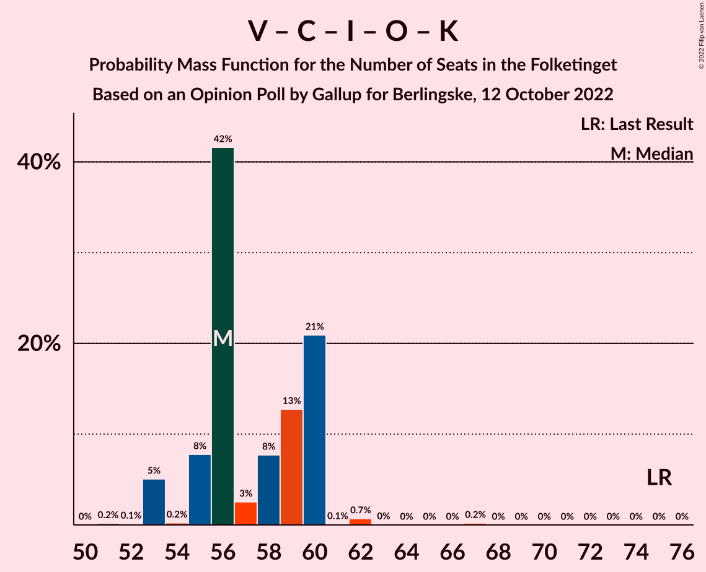

# Opinion Poll by Gallup for Berlingske, 12 October 2022

<a href="#voting-intentions">Voting Intentions</a> | <a href="#seats">Seats</a> | <a href="#coalitions">Coalitions</a> | <a href="#technical-information">Technical Information</a>

## Voting Intentions

### Confidence Intervals

| Party | Last Result | Poll Result | 80% Confidence Interval | 90% Confidence Interval | 95% Confidence Interval | 99% Confidence Interval |
|:-----:|:-----------:|:-----------:|:-----------------------:|:-----------------------:|:-----------------------:|:-----------------------:|
| Socialdemokraterne | 25.9% | 27.4% | 26.1–28.7% |25.8–29.1% |25.5–29.4% |24.9–30.0% |
| Venstre | 23.4% | 12.9% | 11.9–13.9% |11.7–14.2% |11.5–14.4% |11.0–14.9% |
| Det Konservative Folkeparti | 6.6% | 9.9% | 9.1–10.8% |8.9–11.1% |8.7–11.3% |8.3–11.8% |
| Socialistisk Folkeparti | 7.7% | 8.5% | 7.8–9.4% |7.5–9.6% |7.4–9.8% |7.0–10.2% |
| Danmarksdemokraterne | 0.0% | 8.0% | 7.3–8.8% |7.1–9.1% |6.9–9.3% |6.6–9.7% |
| Enhedslisten–De Rød-Grønne | 6.9% | 6.1% | 5.5–6.9% |5.3–7.1% |5.1–7.3% |4.8–7.6% |
| Liberal Alliance | 2.3% | 5.5% | 4.9–6.2% |4.7–6.4% |4.6–6.6% |4.3–7.0% |
| Moderaterne | 0.0% | 5.5% | 4.9–6.2% |4.7–6.4% |4.6–6.6% |4.3–7.0% |
| Radikale Venstre | 8.6% | 5.1% | 4.5–5.8% |4.4–6.0% |4.2–6.2% |3.9–6.5% |
| Nye Borgerlige | 2.4% | 4.5% | 4.0–5.2% |3.8–5.3% |3.7–5.5% |3.4–5.8% |
| Dansk Folkeparti | 8.7% | 3.1% | 2.7–3.7% |2.5–3.8% |2.4–4.0% |2.2–4.3% |
| Alternativet | 3.0% | 1.6% | 1.3–2.0% |1.2–2.1% |1.1–2.3% |1.0–2.5% |
| Kristendemokraterne | 1.7% | 1.4% | 1.1–1.8% |1.0–1.9% |1.0–2.0% |0.8–2.2% |
| Frie Grønne | 0.0% | 0.5% | 0.4–0.8% |0.3–0.9% |0.3–0.9% |0.2–1.1% |

*Note:* The poll result column reflects the actual value used in the calculations. Published results may vary slightly, and in addition be rounded to fewer digits.

## Seats

### Confidence Intervals

| Party | Last Result | Median | 80% Confidence Interval | 90% Confidence Interval | 95% Confidence Interval | 99% Confidence Interval |
|:-----:|:-----------:|:------:|:-----------------------:|:-----------------------:|:-----------------------:|:-----------------------:|
| <a href="#socialdemokraterne">Socialdemokraterne</a> | 48 | 49 | 44–51 |44–51 |44–52 |44–54 |
| <a href="#venstre">Venstre</a> | 43 | 23 | 22–25 |20–25 |19–28 |19–28 |
| <a href="#det-konservative-folkeparti">Det Konservative Folkeparti</a> | 12 | 18 | 16–21 |15–21 |15–21 |14–21 |
| <a href="#socialistisk-folkeparti">Socialistisk Folkeparti</a> | 14 | 15 | 14–16 |14–16 |13–17 |13–18 |
| <a href="#danmarksdemokraterne">Danmarksdemokraterne</a> | 0 | 16 | 13–17 |13–17 |13–17 |12–17 |
| <a href="#enhedslisten–de-rød-grønne">Enhedslisten–De Rød-Grønne</a> | 13 | 10 | 10–11 |10–12 |9–13 |9–14 |
| <a href="#liberal-alliance">Liberal Alliance</a> | 4 | 11 | 8–11 |8–11 |8–12 |8–13 |
| <a href="#moderaterne">Moderaterne</a> | 0 | 10 | 8–11 |8–11 |8–13 |8–14 |
| <a href="#radikale-venstre">Radikale Venstre</a> | 16 | 9 | 8–10 |8–11 |8–11 |7–11 |
| <a href="#nye-borgerlige">Nye Borgerlige</a> | 4 | 8 | 8–9 |7–10 |7–10 |6–10 |
| <a href="#dansk-folkeparti">Dansk Folkeparti</a> | 16 | 5 | 4–7 |4–7 |4–7 |4–7 |
| <a href="#alternativet">Alternativet</a> | 5 | 0 | 0–4 |0–4 |0–4 |0–5 |
| <a href="#kristendemokraterne">Kristendemokraterne</a> | 0 | 0 | 0 |0–4 |0–4 |0–4 |
| <a href="#frie-grønne">Frie Grønne</a> | 0 | 0 | 0 |0 |0 |0 |

### Socialdemokraterne

*For a full overview of the results for this party, see the [Socialdemokraterne](party-socialdemokraterne.html) page.*

| Number of Seats | Probability | Accumulated | Special Marks |
|:---------------:|:-----------:|:-----------:|:-------------:|
| 44 | 10% | 100% |  |
| 45 | 2% | 90% |  |
| 46 | 4% | 88% |  |
| 47 | 5% | 84% |  |
| 48 | 2% | 79% | Last Result |
| 49 | 57% | 77% | Median |
| 50 | 8% | 19% |  |
| 51 | 8% | 11% |  |
| 52 | 1.3% | 3% |  |
| 53 | 0.1% | 2% |  |
| 54 | 1.3% | 2% |  |
| 55 | 0.1% | 0.2% |  |
| 56 | 0% | 0.1% |  |
| 57 | 0% | 0% |  |

### Venstre

*For a full overview of the results for this party, see the [Venstre](party-venstre.html) page.*

| Number of Seats | Probability | Accumulated | Special Marks |
|:---------------:|:-----------:|:-----------:|:-------------:|
| 19 | 5% | 100% |  |
| 20 | 1.0% | 95% |  |
| 21 | 0.7% | 94% |  |
| 22 | 15% | 93% |  |
| 23 | 54% | 78% | Median |
| 24 | 9% | 24% |  |
| 25 | 12% | 16% |  |
| 26 | 0.6% | 4% |  |
| 27 | 0.2% | 3% |  |
| 28 | 3% | 3% |  |
| 29 | 0% | 0% |  |
| 30 | 0% | 0% |  |
| 31 | 0% | 0% |  |
| 32 | 0% | 0% |  |
| 33 | 0% | 0% |  |
| 34 | 0% | 0% |  |
| 35 | 0% | 0% |  |
| 36 | 0% | 0% |  |
| 37 | 0% | 0% |  |
| 38 | 0% | 0% |  |
| 39 | 0% | 0% |  |
| 40 | 0% | 0% |  |
| 41 | 0% | 0% |  |
| 42 | 0% | 0% |  |
| 43 | 0% | 0% | Last Result |

### Det Konservative Folkeparti

*For a full overview of the results for this party, see the [Det Konservative Folkeparti](party-detkonservativefolkeparti.html) page.*

| Number of Seats | Probability | Accumulated | Special Marks |
|:---------------:|:-----------:|:-----------:|:-------------:|
| 12 | 0% | 100% | Last Result |
| 13 | 0% | 100% |  |
| 14 | 2% | 100% |  |
| 15 | 7% | 98% |  |
| 16 | 3% | 91% |  |
| 17 | 11% | 88% |  |
| 18 | 43% | 77% | Median |
| 19 | 16% | 35% |  |
| 20 | 1.2% | 18% |  |
| 21 | 17% | 17% |  |
| 22 | 0% | 0% |  |

### Socialistisk Folkeparti

*For a full overview of the results for this party, see the [Socialistisk Folkeparti](party-socialistiskfolkeparti.html) page.*

| Number of Seats | Probability | Accumulated | Special Marks |
|:---------------:|:-----------:|:-----------:|:-------------:|
| 12 | 0.1% | 100% |  |
| 13 | 3% | 99.9% |  |
| 14 | 19% | 97% | Last Result |
| 15 | 30% | 78% | Median |
| 16 | 44% | 48% |  |
| 17 | 3% | 4% |  |
| 18 | 0.4% | 0.7% |  |
| 19 | 0.2% | 0.2% |  |
| 20 | 0% | 0% |  |

### Danmarksdemokraterne

*For a full overview of the results for this party, see the [Danmarksdemokraterne](party-danmarksdemokraterne.html) page.*

| Number of Seats | Probability | Accumulated | Special Marks |
|:---------------:|:-----------:|:-----------:|:-------------:|
| 0 | 0% | 100% | Last Result |
| 1 | 0% | 100% |  |
| 2 | 0% | 100% |  |
| 3 | 0% | 100% |  |
| 4 | 0% | 100% |  |
| 5 | 0% | 100% |  |
| 6 | 0% | 100% |  |
| 7 | 0% | 100% |  |
| 8 | 0% | 100% |  |
| 9 | 0% | 100% |  |
| 10 | 0% | 100% |  |
| 11 | 0.2% | 100% |  |
| 12 | 2% | 99.8% |  |
| 13 | 9% | 98% |  |
| 14 | 31% | 89% |  |
| 15 | 6% | 58% |  |
| 16 | 13% | 52% | Median |
| 17 | 38% | 38% |  |
| 18 | 0.1% | 0.2% |  |
| 19 | 0% | 0% |  |

### Enhedslisten–De Rød-Grønne

*For a full overview of the results for this party, see the [Enhedslisten–De Rød-Grønne](party-enhedslisten–derød-grønne.html) page.*

| Number of Seats | Probability | Accumulated | Special Marks |
|:---------------:|:-----------:|:-----------:|:-------------:|
| 8 | 0.1% | 100% |  |
| 9 | 3% | 99.9% |  |
| 10 | 72% | 97% | Median |
| 11 | 18% | 25% |  |
| 12 | 3% | 7% |  |
| 13 | 4% | 5% | Last Result |
| 14 | 0.8% | 0.8% |  |
| 15 | 0% | 0% |  |

### Liberal Alliance

*For a full overview of the results for this party, see the [Liberal Alliance](party-liberalalliance.html) page.*

| Number of Seats | Probability | Accumulated | Special Marks |
|:---------------:|:-----------:|:-----------:|:-------------:|
| 4 | 0% | 100% | Last Result |
| 5 | 0% | 100% |  |
| 6 | 0% | 100% |  |
| 7 | 0.1% | 100% |  |
| 8 | 14% | 99.9% |  |
| 9 | 5% | 86% |  |
| 10 | 25% | 81% |  |
| 11 | 52% | 56% | Median |
| 12 | 4% | 5% |  |
| 13 | 1.0% | 1.1% |  |
| 14 | 0% | 0% |  |

### Moderaterne

*For a full overview of the results for this party, see the [Moderaterne](party-moderaterne.html) page.*

| Number of Seats | Probability | Accumulated | Special Marks |
|:---------------:|:-----------:|:-----------:|:-------------:|
| 0 | 0% | 100% | Last Result |
| 1 | 0% | 100% |  |
| 2 | 0% | 100% |  |
| 3 | 0% | 100% |  |
| 4 | 0% | 100% |  |
| 5 | 0% | 100% |  |
| 6 | 0% | 100% |  |
| 7 | 0.1% | 100% |  |
| 8 | 10% | 99.9% |  |
| 9 | 30% | 90% |  |
| 10 | 12% | 60% | Median |
| 11 | 44% | 49% |  |
| 12 | 1.4% | 4% |  |
| 13 | 2% | 3% |  |
| 14 | 0.5% | 0.5% |  |
| 15 | 0% | 0% |  |

### Radikale Venstre

*For a full overview of the results for this party, see the [Radikale Venstre](party-radikalevenstre.html) page.*

| Number of Seats | Probability | Accumulated | Special Marks |
|:---------------:|:-----------:|:-----------:|:-------------:|
| 6 | 0.1% | 100% |  |
| 7 | 2% | 99.9% |  |
| 8 | 45% | 98% |  |
| 9 | 29% | 53% | Median |
| 10 | 17% | 23% |  |
| 11 | 6% | 6% |  |
| 12 | 0.1% | 0.1% |  |
| 13 | 0% | 0% |  |
| 14 | 0% | 0% |  |
| 15 | 0% | 0% |  |
| 16 | 0% | 0% | Last Result |

### Nye Borgerlige

*For a full overview of the results for this party, see the [Nye Borgerlige](party-nyeborgerlige.html) page.*

| Number of Seats | Probability | Accumulated | Special Marks |
|:---------------:|:-----------:|:-----------:|:-------------:|
| 4 | 0% | 100% | Last Result |
| 5 | 0% | 100% |  |
| 6 | 2% | 100% |  |
| 7 | 4% | 98% |  |
| 8 | 60% | 94% | Median |
| 9 | 25% | 34% |  |
| 10 | 9% | 9% |  |
| 11 | 0.3% | 0.3% |  |
| 12 | 0% | 0% |  |

### Dansk Folkeparti

*For a full overview of the results for this party, see the [Dansk Folkeparti](party-danskfolkeparti.html) page.*

| Number of Seats | Probability | Accumulated | Special Marks |
|:---------------:|:-----------:|:-----------:|:-------------:|
| 4 | 43% | 100% |  |
| 5 | 9% | 57% | Median |
| 6 | 26% | 49% |  |
| 7 | 23% | 23% |  |
| 8 | 0.4% | 0.5% |  |
| 9 | 0% | 0% |  |
| 10 | 0% | 0% |  |
| 11 | 0% | 0% |  |
| 12 | 0% | 0% |  |
| 13 | 0% | 0% |  |
| 14 | 0% | 0% |  |
| 15 | 0% | 0% |  |
| 16 | 0% | 0% | Last Result |

### Alternativet

*For a full overview of the results for this party, see the [Alternativet](party-alternativet.html) page.*

| Number of Seats | Probability | Accumulated | Special Marks |
|:---------------:|:-----------:|:-----------:|:-------------:|
| 0 | 74% | 100% | Median |
| 1 | 0% | 26% |  |
| 2 | 0% | 26% |  |
| 3 | 0% | 26% |  |
| 4 | 25% | 26% |  |
| 5 | 0.8% | 0.8% | Last Result |
| 6 | 0% | 0% |  |

### Kristendemokraterne

*For a full overview of the results for this party, see the [Kristendemokraterne](party-kristendemokraterne.html) page.*

| Number of Seats | Probability | Accumulated | Special Marks |
|:---------------:|:-----------:|:-----------:|:-------------:|
| 0 | 93% | 100% | Last Result, Median |
| 1 | 0% | 7% |  |
| 2 | 0% | 7% |  |
| 3 | 0% | 7% |  |
| 4 | 7% | 7% |  |
| 5 | 0% | 0% |  |

### Frie Grønne

*For a full overview of the results for this party, see the [Frie Grønne](party-friegrønne.html) page.*

| Number of Seats | Probability | Accumulated | Special Marks |
|:---------------:|:-----------:|:-----------:|:-------------:|
| 0 | 100% | 100% | Last Result, Median |

## Coalitions

### Confidence Intervals

| Coalition | Last Result | Median | Majority? | 80% Confidence Interval | 90% Confidence Interval | 95% Confidence Interval | 99% Confidence Interval |
|:---------:|:-----------:|:------:|:---------:|:-----------------------:|:-----------------------:|:-----------------------:|:-----------------------:|
| Socialdemokraterne – Socialistisk Folkeparti – Enhedslisten–De Rød-Grønne – Radikale Venstre – Alternativet | 96 | 83 | 1.0% | 82–88 | 82–89 | 82–89 | 80–91 |
| Socialdemokraterne – Socialistisk Folkeparti – Enhedslisten–De Rød-Grønne – Radikale Venstre | 91 | 83 | 0.3% | 78–85 | 78–86 | 78–87 | 78–88 |
| Venstre – Det Konservative Folkeparti – Danmarksdemokraterne – Liberal Alliance – Nye Borgerlige – Dansk Folkeparti – Kristendemokraterne | 79 | 81 | 0% | 78–84 | 77–84 | 77–84 | 76–86 |
| Socialdemokraterne – Socialistisk Folkeparti – Enhedslisten–De Rød-Grønne – Alternativet | 80 | 75 | 0% | 73–79 | 73–80 | 72–80 | 70–82 |
| Socialdemokraterne – Socialistisk Folkeparti – Enhedslisten–De Rød-Grønne | 75 | 75 | 0% | 69–76 | 69–76 | 69–77 | 69–79 |
| Socialdemokraterne – Socialistisk Folkeparti – Radikale Venstre | 78 | 73 | 0% | 68–75 | 68–75 | 68–76 | 68–78 |
| Venstre – Det Konservative Folkeparti – Liberal Alliance – Nye Borgerlige – Dansk Folkeparti – Kristendemokraterne | 79 | 64 | 0% | 64–68 | 63–68 | 63–69 | 61–70 |
| Venstre – Det Konservative Folkeparti – Liberal Alliance – Nye Borgerlige – Dansk Folkeparti | 79 | 64 | 0% | 64–68 | 63–68 | 62–69 | 61–70 |
| Socialdemokraterne – Radikale Venstre | 64 | 57 | 0% | 53–60 | 53–60 | 53–63 | 53–63 |
| Venstre – Det Konservative Folkeparti – Liberal Alliance – Dansk Folkeparti – Kristendemokraterne | 75 | 56 | 0% | 55–60 | 53–60 | 53–60 | 53–62 |
| Venstre – Det Konservative Folkeparti – Liberal Alliance – Dansk Folkeparti | 75 | 56 | 0% | 54–60 | 53–60 | 53–60 | 53–62 |
| Venstre – Det Konservative Folkeparti – Liberal Alliance | 59 | 52 | 0% | 48–54 | 48–54 | 48–54 | 47–55 |
| Venstre – Det Konservative Folkeparti | 55 | 41 | 0% | 38–44 | 37–44 | 37–45 | 37–46 |
| Venstre | 43 | 23 | 0% | 22–25 | 20–25 | 19–28 | 19–28 |

### Socialdemokraterne – Socialistisk Folkeparti – Enhedslisten–De Rød-Grønne – Radikale Venstre – Alternativet

| Number of Seats | Probability | Accumulated | Special Marks |
|:---------------:|:-----------:|:-----------:|:-------------:|
| 78 | 0.1% | 100% |  |
| 79 | 0.3% | 99.9% |  |
| 80 | 1.4% | 99.6% |  |
| 81 | 0.1% | 98% |  |
| 82 | 14% | 98% |  |
| 83 | 44% | 84% | Median |
| 84 | 18% | 40% |  |
| 85 | 4% | 22% |  |
| 86 | 2% | 18% |  |
| 87 | 3% | 16% |  |
| 88 | 5% | 13% |  |
| 89 | 7% | 8% |  |
| 90 | 0.3% | 1.0% | Majority |
| 91 | 0.6% | 0.7% |  |
| 92 | 0.1% | 0.1% |  |
| 93 | 0% | 0% |  |
| 94 | 0% | 0% |  |
| 95 | 0% | 0% |  |
| 96 | 0% | 0% | Last Result |

### Socialdemokraterne – Socialistisk Folkeparti – Enhedslisten–De Rød-Grønne – Radikale Venstre

| Number of Seats | Probability | Accumulated | Special Marks |
|:---------------:|:-----------:|:-----------:|:-------------:|
| 78 | 10% | 100% |  |
| 79 | 0.3% | 90% |  |
| 80 | 3% | 90% |  |
| 81 | 1.0% | 87% |  |
| 82 | 4% | 86% |  |
| 83 | 44% | 82% | Median |
| 84 | 22% | 37% |  |
| 85 | 10% | 15% |  |
| 86 | 2% | 5% |  |
| 87 | 3% | 3% |  |
| 88 | 0.3% | 0.7% |  |
| 89 | 0.1% | 0.4% |  |
| 90 | 0.2% | 0.3% | Majority |
| 91 | 0.1% | 0.1% | Last Result |
| 92 | 0% | 0% |  |

### Venstre – Det Konservative Folkeparti – Danmarksdemokraterne – Liberal Alliance – Nye Borgerlige – Dansk Folkeparti – Kristendemokraterne

| Number of Seats | Probability | Accumulated | Special Marks |
|:---------------:|:-----------:|:-----------:|:-------------:|
| 74 | 0.1% | 100% |  |
| 75 | 0.2% | 99.9% |  |
| 76 | 0.9% | 99.7% |  |
| 77 | 8% | 98.8% |  |
| 78 | 9% | 91% |  |
| 79 | 4% | 82% | Last Result |
| 80 | 2% | 78% |  |
| 81 | 43% | 77% | Median |
| 82 | 18% | 33% |  |
| 83 | 0.5% | 16% |  |
| 84 | 14% | 15% |  |
| 85 | 0.4% | 1.4% |  |
| 86 | 0.7% | 1.0% |  |
| 87 | 0% | 0.2% |  |
| 88 | 0.2% | 0.2% |  |
| 89 | 0% | 0% |  |

### Socialdemokraterne – Socialistisk Folkeparti – Enhedslisten–De Rød-Grønne – Alternativet

| Number of Seats | Probability | Accumulated | Special Marks |
|:---------------:|:-----------:|:-----------:|:-------------:|
| 70 | 2% | 100% |  |
| 71 | 0.2% | 98% |  |
| 72 | 1.4% | 98% |  |
| 73 | 11% | 97% |  |
| 74 | 22% | 86% | Median |
| 75 | 43% | 64% |  |
| 76 | 3% | 21% |  |
| 77 | 3% | 18% |  |
| 78 | 1.5% | 15% |  |
| 79 | 5% | 13% |  |
| 80 | 7% | 8% | Last Result |
| 81 | 0.2% | 0.9% |  |
| 82 | 0.7% | 0.7% |  |
| 83 | 0% | 0% |  |

### Socialdemokraterne – Socialistisk Folkeparti – Enhedslisten–De Rød-Grønne

| Number of Seats | Probability | Accumulated | Special Marks |
|:---------------:|:-----------:|:-----------:|:-------------:|
| 69 | 10% | 100% |  |
| 70 | 2% | 90% |  |
| 71 | 0.3% | 88% |  |
| 72 | 3% | 88% |  |
| 73 | 2% | 85% |  |
| 74 | 22% | 84% | Median |
| 75 | 48% | 61% | Last Result |
| 76 | 10% | 14% |  |
| 77 | 3% | 4% |  |
| 78 | 0.9% | 1.5% |  |
| 79 | 0.2% | 0.6% |  |
| 80 | 0.2% | 0.4% |  |
| 81 | 0.1% | 0.2% |  |
| 82 | 0.1% | 0.1% |  |
| 83 | 0% | 0% |  |

### Socialdemokraterne – Socialistisk Folkeparti – Radikale Venstre

| Number of Seats | Probability | Accumulated | Special Marks |
|:---------------:|:-----------:|:-----------:|:-------------:|
| 67 | 0.1% | 100% |  |
| 68 | 10% | 99.9% |  |
| 69 | 1.4% | 90% |  |
| 70 | 2% | 88% |  |
| 71 | 2% | 86% |  |
| 72 | 8% | 84% |  |
| 73 | 56% | 76% | Median |
| 74 | 9% | 20% |  |
| 75 | 8% | 11% |  |
| 76 | 1.4% | 3% |  |
| 77 | 1.2% | 2% |  |
| 78 | 0.4% | 0.6% | Last Result |
| 79 | 0.1% | 0.2% |  |
| 80 | 0.1% | 0.1% |  |
| 81 | 0% | 0% |  |

### Venstre – Det Konservative Folkeparti – Liberal Alliance – Nye Borgerlige – Dansk Folkeparti – Kristendemokraterne

| Number of Seats | Probability | Accumulated | Special Marks |
|:---------------:|:-----------:|:-----------:|:-------------:|
| 58 | 0.1% | 100% |  |
| 59 | 0% | 99.9% |  |
| 60 | 0.3% | 99.9% |  |
| 61 | 0.1% | 99.6% |  |
| 62 | 0.7% | 99.5% |  |
| 63 | 7% | 98.8% |  |
| 64 | 49% | 92% |  |
| 65 | 0.8% | 43% | Median |
| 66 | 2% | 42% |  |
| 67 | 3% | 40% |  |
| 68 | 33% | 37% |  |
| 69 | 4% | 4% |  |
| 70 | 0.4% | 0.8% |  |
| 71 | 0.1% | 0.4% |  |
| 72 | 0% | 0.2% |  |
| 73 | 0% | 0.2% |  |
| 74 | 0% | 0.2% |  |
| 75 | 0.2% | 0.2% |  |
| 76 | 0% | 0% |  |
| 77 | 0% | 0% |  |
| 78 | 0% | 0% |  |
| 79 | 0% | 0% | Last Result |

### Venstre – Det Konservative Folkeparti – Liberal Alliance – Nye Borgerlige – Dansk Folkeparti

| Number of Seats | Probability | Accumulated | Special Marks |
|:---------------:|:-----------:|:-----------:|:-------------:|
| 58 | 0.1% | 100% |  |
| 59 | 0.1% | 99.9% |  |
| 60 | 0.3% | 99.9% |  |
| 61 | 0.1% | 99.5% |  |
| 62 | 2% | 99.4% |  |
| 63 | 7% | 97% |  |
| 64 | 55% | 91% |  |
| 65 | 0.8% | 36% | Median |
| 66 | 0.6% | 35% |  |
| 67 | 3% | 34% |  |
| 68 | 27% | 31% |  |
| 69 | 4% | 4% |  |
| 70 | 0.4% | 0.8% |  |
| 71 | 0.3% | 0.3% |  |
| 72 | 0% | 0% |  |
| 73 | 0% | 0% |  |
| 74 | 0% | 0% |  |
| 75 | 0% | 0% |  |
| 76 | 0% | 0% |  |
| 77 | 0% | 0% |  |
| 78 | 0% | 0% |  |
| 79 | 0% | 0% | Last Result |

### Socialdemokraterne – Radikale Venstre

| Number of Seats | Probability | Accumulated | Special Marks |
|:---------------:|:-----------:|:-----------:|:-------------:|
| 53 | 10% | 100% |  |
| 54 | 1.1% | 90% |  |
| 55 | 5% | 89% |  |
| 56 | 3% | 83% |  |
| 57 | 44% | 81% |  |
| 58 | 2% | 37% | Median |
| 59 | 24% | 35% |  |
| 60 | 8% | 11% |  |
| 61 | 0.3% | 3% |  |
| 62 | 0.3% | 3% |  |
| 63 | 2% | 3% |  |
| 64 | 0% | 0.2% | Last Result |
| 65 | 0.1% | 0.2% |  |
| 66 | 0% | 0.1% |  |
| 67 | 0% | 0% |  |

### Venstre – Det Konservative Folkeparti – Liberal Alliance – Dansk Folkeparti – Kristendemokraterne

| Number of Seats | Probability | Accumulated | Special Marks |
|:---------------:|:-----------:|:-----------:|:-------------:|
| 51 | 0.2% | 100% |  |
| 52 | 0.1% | 99.8% |  |
| 53 | 5% | 99.7% |  |
| 54 | 0.2% | 95% |  |
| 55 | 8% | 94% |  |
| 56 | 42% | 87% |  |
| 57 | 3% | 45% | Median |
| 58 | 8% | 42% |  |
| 59 | 13% | 35% |  |
| 60 | 21% | 22% |  |
| 61 | 0.1% | 1.0% |  |
| 62 | 0.7% | 1.0% |  |
| 63 | 0% | 0.3% |  |
| 64 | 0% | 0.2% |  |
| 65 | 0% | 0.2% |  |
| 66 | 0% | 0.2% |  |
| 67 | 0.2% | 0.2% |  |
| 68 | 0% | 0% |  |
| 69 | 0% | 0% |  |
| 70 | 0% | 0% |  |
| 71 | 0% | 0% |  |
| 72 | 0% | 0% |  |
| 73 | 0% | 0% |  |
| 74 | 0% | 0% |  |
| 75 | 0% | 0% | Last Result |

### Venstre – Det Konservative Folkeparti – Liberal Alliance – Dansk Folkeparti

| Number of Seats | Probability | Accumulated | Special Marks |
|:---------------:|:-----------:|:-----------:|:-------------:|
| 51 | 0.2% | 100% |  |
| 52 | 0.1% | 99.8% |  |
| 53 | 5% | 99.7% |  |
| 54 | 5% | 95% |  |
| 55 | 10% | 90% |  |
| 56 | 42% | 80% |  |
| 57 | 3% | 38% | Median |
| 58 | 3% | 36% |  |
| 59 | 11% | 33% |  |
| 60 | 21% | 22% |  |
| 61 | 0.1% | 1.0% |  |
| 62 | 0.7% | 0.9% |  |
| 63 | 0.3% | 0.3% |  |
| 64 | 0% | 0% |  |
| 65 | 0% | 0% |  |
| 66 | 0% | 0% |  |
| 67 | 0% | 0% |  |
| 68 | 0% | 0% |  |
| 69 | 0% | 0% |  |
| 70 | 0% | 0% |  |
| 71 | 0% | 0% |  |
| 72 | 0% | 0% |  |
| 73 | 0% | 0% |  |
| 74 | 0% | 0% |  |
| 75 | 0% | 0% | Last Result |

### Venstre – Det Konservative Folkeparti – Liberal Alliance

| Number of Seats | Probability | Accumulated | Special Marks |
|:---------------:|:-----------:|:-----------:|:-------------:|
| 46 | 0.2% | 100% |  |
| 47 | 0.4% | 99.7% |  |
| 48 | 12% | 99.3% |  |
| 49 | 3% | 87% |  |
| 50 | 9% | 85% |  |
| 51 | 2% | 76% |  |
| 52 | 51% | 74% | Median |
| 53 | 6% | 23% |  |
| 54 | 16% | 17% |  |
| 55 | 1.4% | 2% |  |
| 56 | 0.1% | 0.3% |  |
| 57 | 0% | 0.3% |  |
| 58 | 0.2% | 0.2% |  |
| 59 | 0% | 0% | Last Result |

### Venstre – Det Konservative Folkeparti

| Number of Seats | Probability | Accumulated | Special Marks |
|:---------------:|:-----------:|:-----------:|:-------------:|
| 35 | 0.1% | 100% |  |
| 36 | 0.1% | 99.9% |  |
| 37 | 7% | 99.9% |  |
| 38 | 7% | 92% |  |
| 39 | 2% | 85% |  |
| 40 | 6% | 83% |  |
| 41 | 45% | 77% | Median |
| 42 | 1.1% | 32% |  |
| 43 | 2% | 31% |  |
| 44 | 25% | 29% |  |
| 45 | 3% | 4% |  |
| 46 | 0.7% | 0.9% |  |
| 47 | 0.2% | 0.3% |  |
| 48 | 0% | 0% |  |
| 49 | 0% | 0% |  |
| 50 | 0% | 0% |  |
| 51 | 0% | 0% |  |
| 52 | 0% | 0% |  |
| 53 | 0% | 0% |  |
| 54 | 0% | 0% |  |
| 55 | 0% | 0% | Last Result |

### Venstre

| Number of Seats | Probability | Accumulated | Special Marks |
|:---------------:|:-----------:|:-----------:|:-------------:|
| 19 | 5% | 100% |  |
| 20 | 1.0% | 95% |  |
| 21 | 0.7% | 94% |  |
| 22 | 15% | 93% |  |
| 23 | 54% | 78% | Median |
| 24 | 9% | 24% |  |
| 25 | 12% | 16% |  |
| 26 | 0.6% | 4% |  |
| 27 | 0.2% | 3% |  |
| 28 | 3% | 3% |  |
| 29 | 0% | 0% |  |
| 30 | 0% | 0% |  |
| 31 | 0% | 0% |  |
| 32 | 0% | 0% |  |
| 33 | 0% | 0% |  |
| 34 | 0% | 0% |  |
| 35 | 0% | 0% |  |
| 36 | 0% | 0% |  |
| 37 | 0% | 0% |  |
| 38 | 0% | 0% |  |
| 39 | 0% | 0% |  |
| 40 | 0% | 0% |  |
| 41 | 0% | 0% |  |
| 42 | 0% | 0% |  |
| 43 | 0% | 0% | Last Result |

## Technical Information

### Opinion Poll

+ **Polling firm:** Gallup
+ **Commissioner(s):** Berlingske
+ **Fieldwork period:** 12 October 2022

### Calculations

+ **Sample size:** 1998
+ **Simulations done:** 1,048,576
+ **Error estimate:** 1.97%

