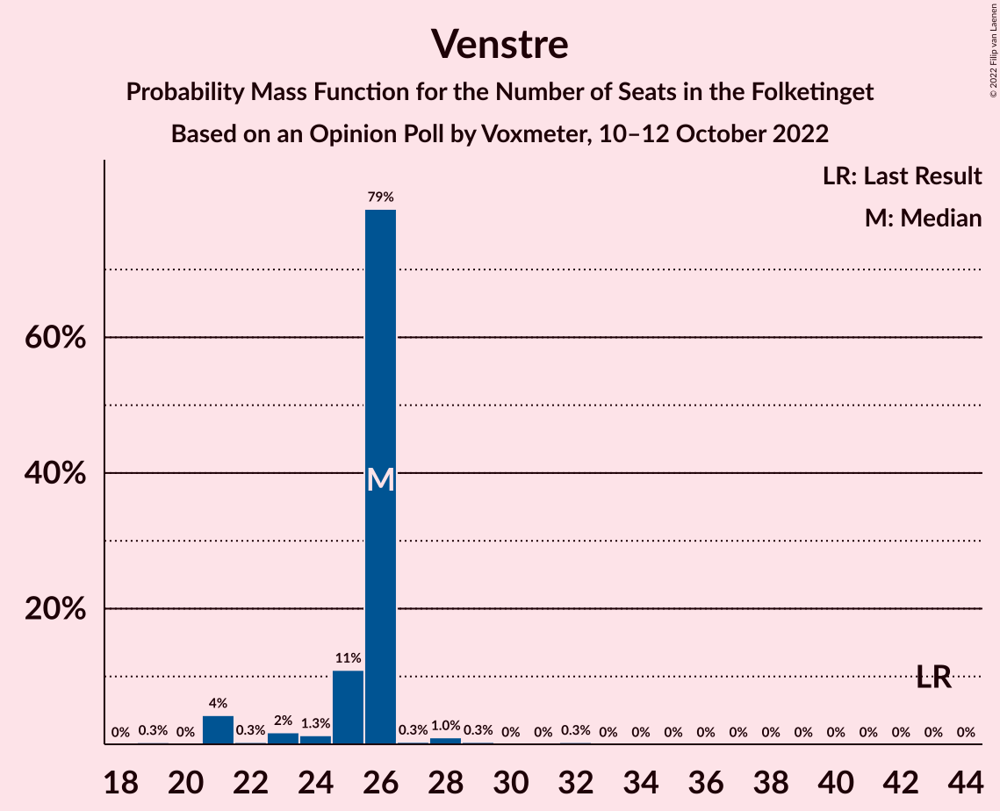

# Opinion Poll by Voxmeter, 10–12 October 2022

<a href="#voting-intentions">Voting Intentions</a> | <a href="#seats">Seats</a> | <a href="#coalitions">Coalitions</a> | <a href="#technical-information">Technical Information</a>

## Voting Intentions

### Confidence Intervals

| Party | Last Result | Poll Result | 80% Confidence Interval | 90% Confidence Interval | 95% Confidence Interval | 99% Confidence Interval |
|:-----:|:-----------:|:-----------:|:-----------------------:|:-----------------------:|:-----------------------:|:-----------------------:|
| Socialdemokraterne | 25.9% | 27.5% | 25.7–29.3% |25.2–29.9% |24.8–30.3% |24.0–31.2% |
| Venstre | 23.4% | 14.3% | 13.0–15.8% |12.6–16.2% |12.3–16.6% |11.7–17.4% |
| Det Konservative Folkeparti | 6.6% | 8.9% | 7.9–10.2% |7.6–10.5% |7.3–10.9% |6.8–11.5% |
| Danmarksdemokraterne | 0.0% | 8.7% | 7.7–10.0% |7.4–10.3% |7.1–10.6% |6.7–11.2% |
| Socialistisk Folkeparti | 7.7% | 7.9% | 6.9–9.0% |6.6–9.4% |6.4–9.7% |5.9–10.3% |
| Enhedslisten–De Rød-Grønne | 6.9% | 7.2% | 6.2–8.3% |6.0–8.6% |5.7–8.9% |5.3–9.5% |
| Moderaterne | 0.0% | 6.1% | 5.2–7.2% |5.0–7.5% |4.8–7.7% |4.4–8.3% |
| Liberal Alliance | 2.3% | 5.0% | 4.2–6.0% |4.0–6.3% |3.8–6.5% |3.5–7.0% |
| Radikale Venstre | 8.6% | 4.2% | 3.5–5.2% |3.3–5.4% |3.1–5.6% |2.8–6.1% |
| Nye Borgerlige | 2.4% | 3.9% | 3.2–4.8% |3.0–5.1% |2.9–5.3% |2.6–5.8% |
| Dansk Folkeparti | 8.7% | 2.4% | 1.8–3.1% |1.7–3.3% |1.6–3.5% |1.4–3.9% |
| Alternativet | 3.0% | 2.4% | 1.8–3.1% |1.7–3.3% |1.6–3.5% |1.4–3.9% |
| Frie Grønne | 0.0% | 0.8% | 0.5–1.3% |0.5–1.4% |0.4–1.5% |0.3–1.8% |
| Kristendemokraterne | 1.7% | 0.7% | 0.4–1.2% |0.4–1.3% |0.3–1.4% |0.2–1.7% |

*Note:* The poll result column reflects the actual value used in the calculations. Published results may vary slightly, and in addition be rounded to fewer digits.

## Seats

### Confidence Intervals

| Party | Last Result | Median | 80% Confidence Interval | 90% Confidence Interval | 95% Confidence Interval | 99% Confidence Interval |
|:-----:|:-----------:|:------:|:-----------------------:|:-----------------------:|:-----------------------:|:-----------------------:|
| <a href="#socialdemokraterne">Socialdemokraterne</a> | 48 | 46 | 46–49 |46–49 |46–52 |44–58 |
| <a href="#venstre">Venstre</a> | 43 | 26 | 25–26 |23–26 |21–26 |21–29 |
| <a href="#det-konservative-folkeparti">Det Konservative Folkeparti</a> | 12 | 17 | 17–19 |16–19 |14–19 |13–19 |
| <a href="#danmarksdemokraterne">Danmarksdemokraterne</a> | 0 | 18 | 16–18 |15–18 |14–18 |12–18 |
| <a href="#socialistisk-folkeparti">Socialistisk Folkeparti</a> | 14 | 15 | 14–15 |14–16 |13–17 |11–17 |
| <a href="#enhedslisten–de-rød-grønne">Enhedslisten–De Rød-Grønne</a> | 13 | 14 | 11–14 |11–14 |11–15 |10–16 |
| <a href="#moderaterne">Moderaterne</a> | 0 | 12 | 10–12 |10–12 |10–13 |8–14 |
| <a href="#liberal-alliance">Liberal Alliance</a> | 4 | 8 | 8 |8–10 |8–12 |7–12 |
| <a href="#radikale-venstre">Radikale Venstre</a> | 16 | 7 | 6–7 |6–9 |6–9 |6–10 |
| <a href="#nye-borgerlige">Nye Borgerlige</a> | 4 | 8 | 7–8 |7–8 |6–8 |5–11 |
| <a href="#dansk-folkeparti">Dansk Folkeparti</a> | 16 | 0 | 0–5 |0–5 |0–5 |0–6 |
| <a href="#alternativet">Alternativet</a> | 5 | 4 | 4 |4 |0–5 |0–7 |
| <a href="#frie-grønne">Frie Grønne</a> | 0 | 0 | 0 |0 |0 |0 |
| <a href="#kristendemokraterne">Kristendemokraterne</a> | 0 | 0 | 0 |0 |0 |0 |

### Socialdemokraterne

*For a full overview of the results for this party, see the [Socialdemokraterne](party-socialdemokraterne.html) page.*

| Number of Seats | Probability | Accumulated | Special Marks |
|:---------------:|:-----------:|:-----------:|:-------------:|
| 41 | 0% | 100% |  |
| 42 | 0% | 99.9% |  |
| 43 | 0.1% | 99.9% |  |
| 44 | 0.5% | 99.8% |  |
| 45 | 0.6% | 99.4% |  |
| 46 | 78% | 98.8% | Median |
| 47 | 0.2% | 21% |  |
| 48 | 5% | 21% | Last Result |
| 49 | 11% | 16% |  |
| 50 | 2% | 5% |  |
| 51 | 0.3% | 3% |  |
| 52 | 0.8% | 3% |  |
| 53 | 0.1% | 2% |  |
| 54 | 0.6% | 2% |  |
| 55 | 0.4% | 1.3% |  |
| 56 | 0% | 1.0% |  |
| 57 | 0% | 1.0% |  |
| 58 | 0.9% | 0.9% |  |
| 59 | 0% | 0% |  |

### Venstre

*For a full overview of the results for this party, see the [Venstre](party-venstre.html) page.*

| Number of Seats | Probability | Accumulated | Special Marks |
|:---------------:|:-----------:|:-----------:|:-------------:|
| 19 | 0.3% | 100% |  |
| 20 | 0% | 99.7% |  |
| 21 | 4% | 99.7% |  |
| 22 | 0.3% | 95% |  |
| 23 | 2% | 95% |  |
| 24 | 1.3% | 93% |  |
| 25 | 11% | 92% |  |
| 26 | 79% | 81% | Median |
| 27 | 0.3% | 2% |  |
| 28 | 1.0% | 2% |  |
| 29 | 0.3% | 0.7% |  |
| 30 | 0% | 0.4% |  |
| 31 | 0% | 0.4% |  |
| 32 | 0.3% | 0.3% |  |
| 33 | 0% | 0% |  |
| 34 | 0% | 0% |  |
| 35 | 0% | 0% |  |
| 36 | 0% | 0% |  |
| 37 | 0% | 0% |  |
| 38 | 0% | 0% |  |
| 39 | 0% | 0% |  |
| 40 | 0% | 0% |  |
| 41 | 0% | 0% |  |
| 42 | 0% | 0% |  |
| 43 | 0% | 0% | Last Result |

### Det Konservative Folkeparti

*For a full overview of the results for this party, see the [Det Konservative Folkeparti](party-detkonservativefolkeparti.html) page.*

| Number of Seats | Probability | Accumulated | Special Marks |
|:---------------:|:-----------:|:-----------:|:-------------:|
| 12 | 0.1% | 100% | Last Result |
| 13 | 2% | 99.9% |  |
| 14 | 1.3% | 98% |  |
| 15 | 2% | 97% |  |
| 16 | 4% | 95% |  |
| 17 | 80% | 91% | Median |
| 18 | 0.8% | 11% |  |
| 19 | 10% | 10% |  |
| 20 | 0% | 0.1% |  |
| 21 | 0% | 0% |  |

### Danmarksdemokraterne

*For a full overview of the results for this party, see the [Danmarksdemokraterne](party-danmarksdemokraterne.html) page.*

| Number of Seats | Probability | Accumulated | Special Marks |
|:---------------:|:-----------:|:-----------:|:-------------:|
| 0 | 0% | 100% | Last Result |
| 1 | 0% | 100% |  |
| 2 | 0% | 100% |  |
| 3 | 0% | 100% |  |
| 4 | 0% | 100% |  |
| 5 | 0% | 100% |  |
| 6 | 0% | 100% |  |
| 7 | 0% | 100% |  |
| 8 | 0% | 100% |  |
| 9 | 0% | 100% |  |
| 10 | 0% | 100% |  |
| 11 | 0.1% | 100% |  |
| 12 | 0.7% | 99.9% |  |
| 13 | 0.6% | 99.2% |  |
| 14 | 2% | 98.6% |  |
| 15 | 4% | 97% |  |
| 16 | 3% | 93% |  |
| 17 | 10% | 90% |  |
| 18 | 79% | 79% | Median |
| 19 | 0.1% | 0.3% |  |
| 20 | 0.1% | 0.1% |  |
| 21 | 0% | 0% |  |

### Socialistisk Folkeparti

*For a full overview of the results for this party, see the [Socialistisk Folkeparti](party-socialistiskfolkeparti.html) page.*

| Number of Seats | Probability | Accumulated | Special Marks |
|:---------------:|:-----------:|:-----------:|:-------------:|
| 10 | 0.2% | 100% |  |
| 11 | 0.3% | 99.8% |  |
| 12 | 0.7% | 99.5% |  |
| 13 | 3% | 98.8% |  |
| 14 | 10% | 95% | Last Result |
| 15 | 80% | 85% | Median |
| 16 | 1.3% | 5% |  |
| 17 | 4% | 4% |  |
| 18 | 0.2% | 0.4% |  |
| 19 | 0.1% | 0.1% |  |
| 20 | 0% | 0% |  |

### Enhedslisten–De Rød-Grønne

*For a full overview of the results for this party, see the [Enhedslisten–De Rød-Grønne](party-enhedslisten–derød-grønne.html) page.*

| Number of Seats | Probability | Accumulated | Special Marks |
|:---------------:|:-----------:|:-----------:|:-------------:|
| 8 | 0% | 100% |  |
| 9 | 0% | 99.9% |  |
| 10 | 1.3% | 99.9% |  |
| 11 | 12% | 98.6% |  |
| 12 | 0.8% | 87% |  |
| 13 | 2% | 86% | Last Result |
| 14 | 80% | 84% | Median |
| 15 | 4% | 4% |  |
| 16 | 0.5% | 0.7% |  |
| 17 | 0.2% | 0.2% |  |
| 18 | 0% | 0% |  |

### Moderaterne

*For a full overview of the results for this party, see the [Moderaterne](party-moderaterne.html) page.*

| Number of Seats | Probability | Accumulated | Special Marks |
|:---------------:|:-----------:|:-----------:|:-------------:|
| 0 | 0% | 100% | Last Result |
| 1 | 0% | 100% |  |
| 2 | 0% | 100% |  |
| 3 | 0% | 100% |  |
| 4 | 0% | 100% |  |
| 5 | 0% | 100% |  |
| 6 | 0% | 100% |  |
| 7 | 0.2% | 100% |  |
| 8 | 0.5% | 99.8% |  |
| 9 | 1.3% | 99.3% |  |
| 10 | 11% | 98% |  |
| 11 | 4% | 87% |  |
| 12 | 80% | 83% | Median |
| 13 | 1.3% | 3% |  |
| 14 | 1.2% | 2% |  |
| 15 | 0.3% | 0.3% |  |
| 16 | 0% | 0% |  |

### Liberal Alliance

*For a full overview of the results for this party, see the [Liberal Alliance](party-liberalalliance.html) page.*

| Number of Seats | Probability | Accumulated | Special Marks |
|:---------------:|:-----------:|:-----------:|:-------------:|
| 4 | 0% | 100% | Last Result |
| 5 | 0% | 100% |  |
| 6 | 0.2% | 100% |  |
| 7 | 1.2% | 99.8% |  |
| 8 | 90% | 98.6% | Median |
| 9 | 3% | 9% |  |
| 10 | 2% | 6% |  |
| 11 | 0.6% | 4% |  |
| 12 | 3% | 3% |  |
| 13 | 0% | 0.1% |  |
| 14 | 0% | 0% |  |

### Radikale Venstre

*For a full overview of the results for this party, see the [Radikale Venstre](party-radikalevenstre.html) page.*

| Number of Seats | Probability | Accumulated | Special Marks |
|:---------------:|:-----------:|:-----------:|:-------------:|
| 5 | 0.1% | 100% |  |
| 6 | 12% | 99.9% |  |
| 7 | 80% | 88% | Median |
| 8 | 3% | 8% |  |
| 9 | 4% | 5% |  |
| 10 | 0.6% | 0.9% |  |
| 11 | 0.3% | 0.3% |  |
| 12 | 0% | 0% |  |
| 13 | 0% | 0% |  |
| 14 | 0% | 0% |  |
| 15 | 0% | 0% |  |
| 16 | 0% | 0% | Last Result |

### Nye Borgerlige

*For a full overview of the results for this party, see the [Nye Borgerlige](party-nyeborgerlige.html) page.*

| Number of Seats | Probability | Accumulated | Special Marks |
|:---------------:|:-----------:|:-----------:|:-------------:|
| 4 | 0.2% | 100% | Last Result |
| 5 | 2% | 99.8% |  |
| 6 | 0.8% | 98% |  |
| 7 | 15% | 97% |  |
| 8 | 80% | 82% | Median |
| 9 | 1.3% | 2% |  |
| 10 | 0.2% | 1.0% |  |
| 11 | 0.8% | 0.8% |  |
| 12 | 0% | 0% |  |

### Dansk Folkeparti

*For a full overview of the results for this party, see the [Dansk Folkeparti](party-danskfolkeparti.html) page.*

| Number of Seats | Probability | Accumulated | Special Marks |
|:---------------:|:-----------:|:-----------:|:-------------:|
| 0 | 82% | 100% | Median |
| 1 | 0% | 18% |  |
| 2 | 0% | 18% |  |
| 3 | 0% | 18% |  |
| 4 | 5% | 18% |  |
| 5 | 12% | 13% |  |
| 6 | 0.9% | 1.0% |  |
| 7 | 0.1% | 0.1% |  |
| 8 | 0% | 0% |  |
| 9 | 0% | 0% |  |
| 10 | 0% | 0% |  |
| 11 | 0% | 0% |  |
| 12 | 0% | 0% |  |
| 13 | 0% | 0% |  |
| 14 | 0% | 0% |  |
| 15 | 0% | 0% |  |
| 16 | 0% | 0% | Last Result |

### Alternativet

*For a full overview of the results for this party, see the [Alternativet](party-alternativet.html) page.*

| Number of Seats | Probability | Accumulated | Special Marks |
|:---------------:|:-----------:|:-----------:|:-------------:|
| 0 | 3% | 100% |  |
| 1 | 0% | 97% |  |
| 2 | 0% | 97% |  |
| 3 | 0% | 97% |  |
| 4 | 92% | 97% | Median |
| 5 | 3% | 5% | Last Result |
| 6 | 0.6% | 1.5% |  |
| 7 | 0.8% | 0.8% |  |
| 8 | 0% | 0% |  |

### Frie Grønne

*For a full overview of the results for this party, see the [Frie Grønne](party-friegrønne.html) page.*

| Number of Seats | Probability | Accumulated | Special Marks |
|:---------------:|:-----------:|:-----------:|:-------------:|
| 0 | 100% | 100% | Last Result, Median |

### Kristendemokraterne

*For a full overview of the results for this party, see the [Kristendemokraterne](party-kristendemokraterne.html) page.*

| Number of Seats | Probability | Accumulated | Special Marks |
|:---------------:|:-----------:|:-----------:|:-------------:|
| 0 | 100% | 100% | Last Result, Median |

## Coalitions

### Confidence Intervals

| Coalition | Last Result | Median | Majority? | 80% Confidence Interval | 90% Confidence Interval | 95% Confidence Interval | 99% Confidence Interval |
|:---------:|:-----------:|:------:|:---------:|:-----------------------:|:-----------------------:|:-----------------------:|:-----------------------:|
| Socialdemokraterne – Socialistisk Folkeparti – Enhedslisten–De Rød-Grønne – Radikale Venstre – Alternativet | 96 | 86 | 6% | 84–86 | 84–92 | 84–93 | 81–95 |
| Socialdemokraterne – Socialistisk Folkeparti – Enhedslisten–De Rød-Grønne – Radikale Venstre | 91 | 82 | 2% | 80–82 | 80–87 | 80–89 | 79–91 |
| Socialdemokraterne – Socialistisk Folkeparti – Enhedslisten–De Rød-Grønne – Alternativet | 80 | 79 | 0% | 78–79 | 78–83 | 78–84 | 75–87 |
| Venstre – Det Konservative Folkeparti – Danmarksdemokraterne – Liberal Alliance – Nye Borgerlige – Dansk Folkeparti – Kristendemokraterne | 79 | 77 | 0% | 77–81 | 73–81 | 71–81 | 68–84 |
| Socialdemokraterne – Socialistisk Folkeparti – Enhedslisten–De Rød-Grønne | 75 | 75 | 0% | 74–75 | 74–79 | 74–80 | 72–83 |
| Socialdemokraterne – Socialistisk Folkeparti – Radikale Venstre | 78 | 68 | 0% | 68–69 | 68–74 | 68–74 | 66–79 |
| Venstre – Det Konservative Folkeparti – Liberal Alliance – Nye Borgerlige – Dansk Folkeparti – Kristendemokraterne | 79 | 59 | 0% | 59–64 | 58–64 | 56–64 | 54–66 |
| Venstre – Det Konservative Folkeparti – Liberal Alliance – Nye Borgerlige – Dansk Folkeparti | 79 | 59 | 0% | 59–64 | 57–64 | 56–64 | 54–66 |
| Socialdemokraterne – Radikale Venstre | 64 | 53 | 0% | 53–55 | 53–58 | 53–59 | 52–66 |
| Venstre – Det Konservative Folkeparti – Liberal Alliance – Dansk Folkeparti – Kristendemokraterne | 75 | 51 | 0% | 51–57 | 50–57 | 49–57 | 47–59 |
| Venstre – Det Konservative Folkeparti – Liberal Alliance – Dansk Folkeparti | 75 | 51 | 0% | 51–57 | 50–57 | 49–57 | 47–59 |
| Venstre – Det Konservative Folkeparti – Liberal Alliance | 59 | 51 | 0% | 51–52 | 49–52 | 46–52 | 43–55 |
| Venstre – Det Konservative Folkeparti | 55 | 43 | 0% | 42–44 | 37–44 | 37–44 | 35–46 |
| Venstre | 43 | 26 | 0% | 25–26 | 23–26 | 21–26 | 21–29 |

### Socialdemokraterne – Socialistisk Folkeparti – Enhedslisten–De Rød-Grønne – Radikale Venstre – Alternativet

| Number of Seats | Probability | Accumulated | Special Marks |
|:---------------:|:-----------:|:-----------:|:-------------:|
| 80 | 0% | 100% |  |
| 81 | 0.8% | 99.9% |  |
| 82 | 0.1% | 99.1% |  |
| 83 | 0.4% | 98.9% |  |
| 84 | 10% | 98.6% |  |
| 85 | 0.4% | 89% |  |
| 86 | 79% | 88% | Median |
| 87 | 3% | 10% |  |
| 88 | 0.3% | 7% |  |
| 89 | 0.4% | 7% |  |
| 90 | 0.5% | 6% | Majority |
| 91 | 0.1% | 6% |  |
| 92 | 1.1% | 6% |  |
| 93 | 3% | 5% |  |
| 94 | 1.3% | 2% |  |
| 95 | 0.5% | 0.6% |  |
| 96 | 0.1% | 0.1% | Last Result |
| 97 | 0% | 0% |  |

### Socialdemokraterne – Socialistisk Folkeparti – Enhedslisten–De Rød-Grønne – Radikale Venstre

| Number of Seats | Probability | Accumulated | Special Marks |
|:---------------:|:-----------:|:-----------:|:-------------:|
| 76 | 0% | 100% |  |
| 77 | 0.1% | 99.9% |  |
| 78 | 0.1% | 99.8% |  |
| 79 | 0.2% | 99.7% |  |
| 80 | 10% | 99.5% |  |
| 81 | 1.4% | 90% |  |
| 82 | 79% | 88% | Median |
| 83 | 0.8% | 9% |  |
| 84 | 0.5% | 8% |  |
| 85 | 0.9% | 7% |  |
| 86 | 0.8% | 7% |  |
| 87 | 0.9% | 6% |  |
| 88 | 0.1% | 5% |  |
| 89 | 3% | 5% |  |
| 90 | 1.1% | 2% | Majority |
| 91 | 0.5% | 0.7% | Last Result |
| 92 | 0.2% | 0.2% |  |
| 93 | 0% | 0% |  |

### Socialdemokraterne – Socialistisk Folkeparti – Enhedslisten–De Rød-Grønne – Alternativet

| Number of Seats | Probability | Accumulated | Special Marks |
|:---------------:|:-----------:|:-----------:|:-------------:|
| 72 | 0% | 100% |  |
| 73 | 0.3% | 99.9% |  |
| 74 | 0.1% | 99.6% |  |
| 75 | 0.9% | 99.5% |  |
| 76 | 0.2% | 98.6% |  |
| 77 | 0.3% | 98% |  |
| 78 | 11% | 98% |  |
| 79 | 78% | 87% | Median |
| 80 | 2% | 9% | Last Result |
| 81 | 0.7% | 7% |  |
| 82 | 0.5% | 6% |  |
| 83 | 0.5% | 5% |  |
| 84 | 3% | 5% |  |
| 85 | 0.5% | 2% |  |
| 86 | 1.0% | 2% |  |
| 87 | 0.4% | 0.8% |  |
| 88 | 0.4% | 0.4% |  |
| 89 | 0.1% | 0.1% |  |
| 90 | 0% | 0% | Majority |

### Venstre – Det Konservative Folkeparti – Danmarksdemokraterne – Liberal Alliance – Nye Borgerlige – Dansk Folkeparti – Kristendemokraterne

| Number of Seats | Probability | Accumulated | Special Marks |
|:---------------:|:-----------:|:-----------:|:-------------:|
| 68 | 0.5% | 100% |  |
| 69 | 0% | 99.5% |  |
| 70 | 1.3% | 99.4% |  |
| 71 | 3% | 98% |  |
| 72 | 0.1% | 95% |  |
| 73 | 0.8% | 95% |  |
| 74 | 2% | 95% |  |
| 75 | 0.3% | 93% |  |
| 76 | 2% | 93% |  |
| 77 | 78% | 90% | Median |
| 78 | 0.9% | 13% |  |
| 79 | 0.5% | 12% | Last Result |
| 80 | 0.2% | 11% |  |
| 81 | 10% | 11% |  |
| 82 | 0.3% | 1.2% |  |
| 83 | 0% | 0.9% |  |
| 84 | 0.8% | 0.9% |  |
| 85 | 0.1% | 0.1% |  |
| 86 | 0% | 0% |  |

### Socialdemokraterne – Socialistisk Folkeparti – Enhedslisten–De Rød-Grønne

| Number of Seats | Probability | Accumulated | Special Marks |
|:---------------:|:-----------:|:-----------:|:-------------:|
| 68 | 0.1% | 100% |  |
| 69 | 0% | 99.9% |  |
| 70 | 0.1% | 99.9% |  |
| 71 | 0.2% | 99.8% |  |
| 72 | 0.4% | 99.6% |  |
| 73 | 0.6% | 99.3% |  |
| 74 | 10% | 98.7% |  |
| 75 | 81% | 89% | Last Result, Median |
| 76 | 0.9% | 8% |  |
| 77 | 0.2% | 7% |  |
| 78 | 2% | 7% |  |
| 79 | 0.2% | 5% |  |
| 80 | 3% | 5% |  |
| 81 | 0.3% | 2% |  |
| 82 | 1.1% | 2% |  |
| 83 | 0.8% | 0.8% |  |
| 84 | 0% | 0.1% |  |
| 85 | 0.1% | 0.1% |  |
| 86 | 0% | 0% |  |

### Socialdemokraterne – Socialistisk Folkeparti – Radikale Venstre

| Number of Seats | Probability | Accumulated | Special Marks |
|:---------------:|:-----------:|:-----------:|:-------------:|
| 63 | 0% | 100% |  |
| 64 | 0.1% | 99.9% |  |
| 65 | 0% | 99.9% |  |
| 66 | 0.9% | 99.9% |  |
| 67 | 0.2% | 98.9% |  |
| 68 | 79% | 98.7% | Median |
| 69 | 10% | 19% |  |
| 70 | 0.6% | 10% |  |
| 71 | 2% | 9% |  |
| 72 | 0.4% | 7% |  |
| 73 | 0.3% | 7% |  |
| 74 | 4% | 7% |  |
| 75 | 0.4% | 2% |  |
| 76 | 0.2% | 2% |  |
| 77 | 0.1% | 2% |  |
| 78 | 0.7% | 2% | Last Result |
| 79 | 1.0% | 1.0% |  |
| 80 | 0.1% | 0.1% |  |
| 81 | 0% | 0% |  |

### Venstre – Det Konservative Folkeparti – Liberal Alliance – Nye Borgerlige – Dansk Folkeparti – Kristendemokraterne

| Number of Seats | Probability | Accumulated | Special Marks |
|:---------------:|:-----------:|:-----------:|:-------------:|
| 49 | 0.1% | 100% |  |
| 50 | 0% | 99.9% |  |
| 51 | 0% | 99.9% |  |
| 52 | 0% | 99.9% |  |
| 53 | 0.4% | 99.9% |  |
| 54 | 0.1% | 99.5% |  |
| 55 | 0.5% | 99.4% |  |
| 56 | 4% | 99.0% |  |
| 57 | 0.4% | 95% |  |
| 58 | 2% | 95% |  |
| 59 | 78% | 93% | Median |
| 60 | 2% | 15% |  |
| 61 | 0.7% | 14% |  |
| 62 | 1.1% | 13% |  |
| 63 | 0.4% | 12% |  |
| 64 | 10% | 11% |  |
| 65 | 0.1% | 2% |  |
| 66 | 1.0% | 1.4% |  |
| 67 | 0.3% | 0.5% |  |
| 68 | 0.1% | 0.2% |  |
| 69 | 0.1% | 0.2% |  |
| 70 | 0.1% | 0.1% |  |
| 71 | 0% | 0% |  |
| 72 | 0% | 0% |  |
| 73 | 0% | 0% |  |
| 74 | 0% | 0% |  |
| 75 | 0% | 0% |  |
| 76 | 0% | 0% |  |
| 77 | 0% | 0% |  |
| 78 | 0% | 0% |  |
| 79 | 0% | 0% | Last Result |

### Venstre – Det Konservative Folkeparti – Liberal Alliance – Nye Borgerlige – Dansk Folkeparti

| Number of Seats | Probability | Accumulated | Special Marks |
|:---------------:|:-----------:|:-----------:|:-------------:|
| 49 | 0.1% | 100% |  |
| 50 | 0% | 99.9% |  |
| 51 | 0% | 99.9% |  |
| 52 | 0% | 99.9% |  |
| 53 | 0.4% | 99.9% |  |
| 54 | 0.1% | 99.5% |  |
| 55 | 0.5% | 99.4% |  |
| 56 | 4% | 98.9% |  |
| 57 | 0.4% | 95% |  |
| 58 | 2% | 95% |  |
| 59 | 78% | 93% | Median |
| 60 | 2% | 15% |  |
| 61 | 0.7% | 14% |  |
| 62 | 1.1% | 13% |  |
| 63 | 0.4% | 12% |  |
| 64 | 10% | 11% |  |
| 65 | 0.1% | 2% |  |
| 66 | 1.0% | 1.4% |  |
| 67 | 0.3% | 0.5% |  |
| 68 | 0.1% | 0.2% |  |
| 69 | 0.1% | 0.2% |  |
| 70 | 0.1% | 0.1% |  |
| 71 | 0% | 0% |  |
| 72 | 0% | 0% |  |
| 73 | 0% | 0% |  |
| 74 | 0% | 0% |  |
| 75 | 0% | 0% |  |
| 76 | 0% | 0% |  |
| 77 | 0% | 0% |  |
| 78 | 0% | 0% |  |
| 79 | 0% | 0% | Last Result |

### Socialdemokraterne – Radikale Venstre

| Number of Seats | Probability | Accumulated | Special Marks |
|:---------------:|:-----------:|:-----------:|:-------------:|
| 49 | 0% | 100% |  |
| 50 | 0% | 99.9% |  |
| 51 | 0.3% | 99.9% |  |
| 52 | 0.3% | 99.6% |  |
| 53 | 78% | 99.4% | Median |
| 54 | 0.9% | 22% |  |
| 55 | 12% | 21% |  |
| 56 | 0.6% | 9% |  |
| 57 | 3% | 8% |  |
| 58 | 2% | 5% |  |
| 59 | 1.4% | 3% |  |
| 60 | 0.2% | 2% |  |
| 61 | 0.4% | 2% |  |
| 62 | 0.5% | 2% |  |
| 63 | 0.1% | 1.1% |  |
| 64 | 0% | 1.0% | Last Result |
| 65 | 0% | 1.0% |  |
| 66 | 0.9% | 0.9% |  |
| 67 | 0% | 0% |  |

### Venstre – Det Konservative Folkeparti – Liberal Alliance – Dansk Folkeparti – Kristendemokraterne

| Number of Seats | Probability | Accumulated | Special Marks |
|:---------------:|:-----------:|:-----------:|:-------------:|
| 43 | 0.1% | 100% |  |
| 44 | 0% | 99.9% |  |
| 45 | 0% | 99.9% |  |
| 46 | 0.3% | 99.9% |  |
| 47 | 0.4% | 99.5% |  |
| 48 | 0.2% | 99.2% |  |
| 49 | 3% | 98.9% |  |
| 50 | 0.7% | 95% |  |
| 51 | 79% | 95% | Median |
| 52 | 0.1% | 16% |  |
| 53 | 3% | 16% |  |
| 54 | 0.2% | 13% |  |
| 55 | 2% | 13% |  |
| 56 | 0.2% | 11% |  |
| 57 | 10% | 11% |  |
| 58 | 0.3% | 1.0% |  |
| 59 | 0.4% | 0.7% |  |
| 60 | 0% | 0.3% |  |
| 61 | 0.1% | 0.2% |  |
| 62 | 0.1% | 0.2% |  |
| 63 | 0% | 0.1% |  |
| 64 | 0% | 0% |  |
| 65 | 0% | 0% |  |
| 66 | 0% | 0% |  |
| 67 | 0% | 0% |  |
| 68 | 0% | 0% |  |
| 69 | 0% | 0% |  |
| 70 | 0% | 0% |  |
| 71 | 0% | 0% |  |
| 72 | 0% | 0% |  |
| 73 | 0% | 0% |  |
| 74 | 0% | 0% |  |
| 75 | 0% | 0% | Last Result |

### Venstre – Det Konservative Folkeparti – Liberal Alliance – Dansk Folkeparti

| Number of Seats | Probability | Accumulated | Special Marks |
|:---------------:|:-----------:|:-----------:|:-------------:|
| 43 | 0.1% | 100% |  |
| 44 | 0% | 99.9% |  |
| 45 | 0% | 99.9% |  |
| 46 | 0.3% | 99.9% |  |
| 47 | 0.4% | 99.5% |  |
| 48 | 0.2% | 99.1% |  |
| 49 | 3% | 98.9% |  |
| 50 | 0.7% | 95% |  |
| 51 | 79% | 95% | Median |
| 52 | 0.1% | 16% |  |
| 53 | 3% | 16% |  |
| 54 | 0.2% | 13% |  |
| 55 | 2% | 13% |  |
| 56 | 0.2% | 11% |  |
| 57 | 10% | 11% |  |
| 58 | 0.3% | 1.0% |  |
| 59 | 0.4% | 0.7% |  |
| 60 | 0% | 0.3% |  |
| 61 | 0.1% | 0.2% |  |
| 62 | 0.1% | 0.2% |  |
| 63 | 0% | 0.1% |  |
| 64 | 0% | 0% |  |
| 65 | 0% | 0% |  |
| 66 | 0% | 0% |  |
| 67 | 0% | 0% |  |
| 68 | 0% | 0% |  |
| 69 | 0% | 0% |  |
| 70 | 0% | 0% |  |
| 71 | 0% | 0% |  |
| 72 | 0% | 0% |  |
| 73 | 0% | 0% |  |
| 74 | 0% | 0% |  |
| 75 | 0% | 0% | Last Result |

### Venstre – Det Konservative Folkeparti – Liberal Alliance

| Number of Seats | Probability | Accumulated | Special Marks |
|:---------------:|:-----------:|:-----------:|:-------------:|
| 41 | 0.3% | 100% |  |
| 42 | 0% | 99.7% |  |
| 43 | 0.5% | 99.7% |  |
| 44 | 0.1% | 99.2% |  |
| 45 | 1.0% | 99.1% |  |
| 46 | 1.3% | 98% |  |
| 47 | 0.5% | 97% |  |
| 48 | 0.3% | 96% |  |
| 49 | 5% | 96% |  |
| 50 | 0.6% | 91% |  |
| 51 | 79% | 91% | Median |
| 52 | 10% | 12% |  |
| 53 | 0.5% | 2% |  |
| 54 | 0.3% | 1.3% |  |
| 55 | 0.8% | 1.0% |  |
| 56 | 0% | 0.2% |  |
| 57 | 0% | 0.2% |  |
| 58 | 0.1% | 0.1% |  |
| 59 | 0% | 0.1% | Last Result |
| 60 | 0% | 0% |  |

### Venstre – Det Konservative Folkeparti

| Number of Seats | Probability | Accumulated | Special Marks |
|:---------------:|:-----------:|:-----------:|:-------------:|
| 34 | 0.3% | 100% |  |
| 35 | 0.6% | 99.7% |  |
| 36 | 1.3% | 99.1% |  |
| 37 | 3% | 98% |  |
| 38 | 0.4% | 94% |  |
| 39 | 0.3% | 94% |  |
| 40 | 2% | 94% |  |
| 41 | 0.6% | 91% |  |
| 42 | 2% | 91% |  |
| 43 | 78% | 89% | Median |
| 44 | 10% | 11% |  |
| 45 | 0.6% | 1.2% |  |
| 46 | 0.4% | 0.6% |  |
| 47 | 0.1% | 0.2% |  |
| 48 | 0% | 0.1% |  |
| 49 | 0.1% | 0.1% |  |
| 50 | 0% | 0.1% |  |
| 51 | 0% | 0% |  |
| 52 | 0% | 0% |  |
| 53 | 0% | 0% |  |
| 54 | 0% | 0% |  |
| 55 | 0% | 0% | Last Result |

### Venstre

| Number of Seats | Probability | Accumulated | Special Marks |
|:---------------:|:-----------:|:-----------:|:-------------:|
| 19 | 0.3% | 100% |  |
| 20 | 0% | 99.7% |  |
| 21 | 4% | 99.7% |  |
| 22 | 0.3% | 95% |  |
| 23 | 2% | 95% |  |
| 24 | 1.3% | 93% |  |
| 25 | 11% | 92% |  |
| 26 | 79% | 81% | Median |
| 27 | 0.3% | 2% |  |
| 28 | 1.0% | 2% |  |
| 29 | 0.3% | 0.7% |  |
| 30 | 0% | 0.4% |  |
| 31 | 0% | 0.4% |  |
| 32 | 0.3% | 0.3% |  |
| 33 | 0% | 0% |  |
| 34 | 0% | 0% |  |
| 35 | 0% | 0% |  |
| 36 | 0% | 0% |  |
| 37 | 0% | 0% |  |
| 38 | 0% | 0% |  |
| 39 | 0% | 0% |  |
| 40 | 0% | 0% |  |
| 41 | 0% | 0% |  |
| 42 | 0% | 0% |  |
| 43 | 0% | 0% | Last Result |

## Technical Information

### Opinion Poll

+ **Polling firm:** Voxmeter
+ **Commissioner(s):** —
+ **Fieldwork period:** 10–12 October 2022

### Calculations

+ **Sample size:** 1019
+ **Simulations done:** 1,048,576
+ **Error estimate:** 2.03%

