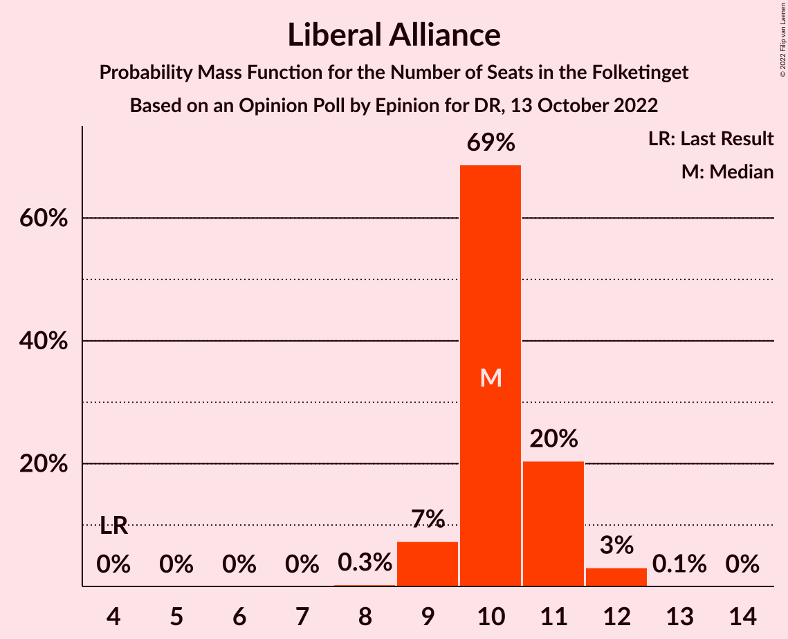
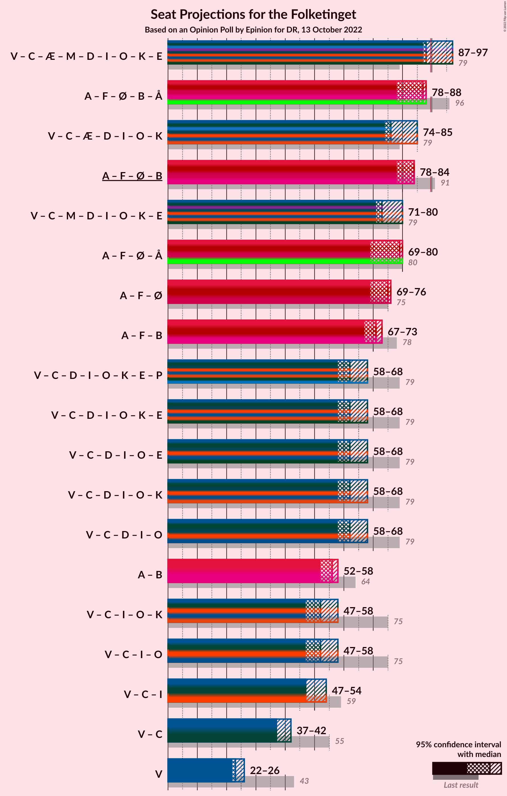

# Opinion Poll by Epinion for DR, 13 October 2022

<a href="#voting-intentions">Voting Intentions</a> | <a href="#seats">Seats</a> | <a href="#coalitions">Coalitions</a> | <a href="#technical-information">Technical Information</a>

## Voting Intentions

### Confidence Intervals

| Party | Last Result | Poll Result | 80% Confidence Interval | 90% Confidence Interval | 95% Confidence Interval | 99% Confidence Interval |
|:-----:|:-----------:|:-----------:|:-----------------------:|:-----------------------:|:-----------------------:|:-----------------------:|
| Socialdemokraterne | 25.9% | 25.9% | 24.8–27.0% |24.5–27.3% |24.3–27.6% |23.7–28.2% |
| Venstre | 23.4% | 12.9% | 12.1–13.8% |11.9–14.0% |11.7–14.2% |11.3–14.7% |
| Det Konservative Folkeparti | 6.6% | 8.6% | 7.9–9.3% |7.7–9.5% |7.6–9.7% |7.3–10.1% |
| Socialistisk Folkeparti | 7.7% | 8.3% | 7.7–9.1% |7.5–9.3% |7.3–9.4% |7.0–9.8% |
| Danmarksdemokraterne | 0.0% | 8.0% | 7.4–8.7% |7.2–8.9% |7.0–9.1% |6.7–9.5% |
| Moderaterne | 0.0% | 6.9% | 6.3–7.6% |6.1–7.8% |6.0–8.0% |5.7–8.3% |
| Enhedslisten–De Rød-Grønne | 6.9% | 6.5% | 5.9–7.2% |5.8–7.3% |5.6–7.5% |5.3–7.8% |
| Nye Borgerlige | 2.4% | 5.9% | 5.3–6.5% |5.2–6.7% |5.1–6.9% |4.8–7.2% |
| Liberal Alliance | 2.3% | 5.8% | 5.2–6.4% |5.1–6.6% |5.0–6.8% |4.7–7.1% |
| Radikale Venstre | 8.6% | 4.9% | 4.4–5.5% |4.3–5.7% |4.1–5.8% |3.9–6.1% |
| Alternativet | 3.0% | 2.4% | 2.0–2.8% |1.9–2.9% |1.9–3.0% |1.7–3.3% |
| Dansk Folkeparti | 8.7% | 2.3% | 2.0–2.7% |1.9–2.9% |1.8–3.0% |1.6–3.2% |
| Frie Grønne | 0.0% | 0.7% | 0.5–1.0% |0.5–1.1% |0.5–1.1% |0.4–1.3% |
| Kristendemokraterne | 1.7% | 0.4% | 0.3–0.6% |0.3–0.7% |0.2–0.7% |0.2–0.9% |

*Note:* The poll result column reflects the actual value used in the calculations. Published results may vary slightly, and in addition be rounded to fewer digits.

## Seats

### Confidence Intervals

| Party | Last Result | Median | 80% Confidence Interval | 90% Confidence Interval | 95% Confidence Interval | 99% Confidence Interval |
|:-----:|:-----------:|:------:|:-----------------------:|:-----------------------:|:-----------------------:|:-----------------------:|
| <a href="#socialdemokraterne">Socialdemokraterne</a> | 48 | 48 | 44–50 |44–50 |43–50 |42–50 |
| <a href="#venstre">Venstre</a> | 43 | 23 | 22–24 |22–24 |22–26 |20–26 |
| <a href="#det-konservative-folkeparti">Det Konservative Folkeparti</a> | 12 | 15 | 14–16 |14–16 |14–17 |13–18 |
| <a href="#socialistisk-folkeparti">Socialistisk Folkeparti</a> | 14 | 15 | 14–16 |13–16 |13–16 |13–17 |
| <a href="#danmarksdemokraterne">Danmarksdemokraterne</a> | 0 | 14 | 14–16 |13–16 |12–17 |12–17 |
| <a href="#moderaterne">Moderaterne</a> | 0 | 12 | 11–13 |11–13 |11–13 |11–14 |
| <a href="#enhedslisten–de-rød-grønne">Enhedslisten–De Rød-Grønne</a> | 13 | 12 | 11–13 |11–13 |10–13 |10–14 |
| <a href="#nye-borgerlige">Nye Borgerlige</a> | 4 | 11 | 10–12 |9–12 |9–12 |9–13 |
| <a href="#liberal-alliance">Liberal Alliance</a> | 4 | 10 | 10–11 |9–11 |9–12 |9–12 |
| <a href="#radikale-venstre">Radikale Venstre</a> | 16 | 8 | 8–11 |8–11 |8–11 |7–11 |
| <a href="#alternativet">Alternativet</a> | 5 | 4 | 0–5 |0–5 |0–5 |0–6 |
| <a href="#dansk-folkeparti">Dansk Folkeparti</a> | 16 | 4 | 0–5 |0–6 |0–6 |0–6 |
| <a href="#frie-grønne">Frie Grønne</a> | 0 | 0 | 0 |0 |0 |0 |
| <a href="#kristendemokraterne">Kristendemokraterne</a> | 0 | 0 | 0 |0 |0 |0 |

### Socialdemokraterne

*For a full overview of the results for this party, see the [Socialdemokraterne](party-socialdemokraterne.html) page.*

| Number of Seats | Probability | Accumulated | Special Marks |
|:---------------:|:-----------:|:-----------:|:-------------:|
| 41 | 0.4% | 100% |  |
| 42 | 1.0% | 99.6% |  |
| 43 | 2% | 98.6% |  |
| 44 | 14% | 97% |  |
| 45 | 24% | 83% |  |
| 46 | 1.4% | 59% |  |
| 47 | 4% | 57% |  |
| 48 | 18% | 53% | Last Result, Median |
| 49 | 3% | 35% |  |
| 50 | 32% | 32% |  |
| 51 | 0.1% | 0.1% |  |
| 52 | 0% | 0% |  |

### Venstre

*For a full overview of the results for this party, see the [Venstre](party-venstre.html) page.*

| Number of Seats | Probability | Accumulated | Special Marks |
|:---------------:|:-----------:|:-----------:|:-------------:|
| 19 | 0.1% | 100% |  |
| 20 | 0.6% | 99.9% |  |
| 21 | 2% | 99.4% |  |
| 22 | 35% | 98% |  |
| 23 | 50% | 63% | Median |
| 24 | 9% | 13% |  |
| 25 | 1.0% | 4% |  |
| 26 | 3% | 3% |  |
| 27 | 0.1% | 0.2% |  |
| 28 | 0.1% | 0.1% |  |
| 29 | 0% | 0% |  |
| 30 | 0% | 0% |  |
| 31 | 0% | 0% |  |
| 32 | 0% | 0% |  |
| 33 | 0% | 0% |  |
| 34 | 0% | 0% |  |
| 35 | 0% | 0% |  |
| 36 | 0% | 0% |  |
| 37 | 0% | 0% |  |
| 38 | 0% | 0% |  |
| 39 | 0% | 0% |  |
| 40 | 0% | 0% |  |
| 41 | 0% | 0% |  |
| 42 | 0% | 0% |  |
| 43 | 0% | 0% | Last Result |

### Det Konservative Folkeparti

*For a full overview of the results for this party, see the [Det Konservative Folkeparti](party-detkonservativefolkeparti.html) page.*

| Number of Seats | Probability | Accumulated | Special Marks |
|:---------------:|:-----------:|:-----------:|:-------------:|
| 12 | 0.1% | 100% | Last Result |
| 13 | 0.9% | 99.9% |  |
| 14 | 22% | 99.1% |  |
| 15 | 59% | 77% | Median |
| 16 | 15% | 18% |  |
| 17 | 2% | 3% |  |
| 18 | 0.8% | 1.1% |  |
| 19 | 0.3% | 0.3% |  |
| 20 | 0% | 0% |  |

### Socialistisk Folkeparti

*For a full overview of the results for this party, see the [Socialistisk Folkeparti](party-socialistiskfolkeparti.html) page.*

| Number of Seats | Probability | Accumulated | Special Marks |
|:---------------:|:-----------:|:-----------:|:-------------:|
| 13 | 5% | 100% |  |
| 14 | 11% | 95% | Last Result |
| 15 | 56% | 83% | Median |
| 16 | 26% | 27% |  |
| 17 | 1.1% | 2% |  |
| 18 | 0.4% | 0.4% |  |
| 19 | 0% | 0% |  |

### Danmarksdemokraterne

*For a full overview of the results for this party, see the [Danmarksdemokraterne](party-danmarksdemokraterne.html) page.*

| Number of Seats | Probability | Accumulated | Special Marks |
|:---------------:|:-----------:|:-----------:|:-------------:|
| 0 | 0% | 100% | Last Result |
| 1 | 0% | 100% |  |
| 2 | 0% | 100% |  |
| 3 | 0% | 100% |  |
| 4 | 0% | 100% |  |
| 5 | 0% | 100% |  |
| 6 | 0% | 100% |  |
| 7 | 0% | 100% |  |
| 8 | 0% | 100% |  |
| 9 | 0% | 100% |  |
| 10 | 0% | 100% |  |
| 11 | 0% | 100% |  |
| 12 | 4% | 100% |  |
| 13 | 5% | 96% |  |
| 14 | 41% | 91% | Median |
| 15 | 11% | 50% |  |
| 16 | 35% | 38% |  |
| 17 | 3% | 3% |  |
| 18 | 0% | 0% |  |

### Moderaterne

*For a full overview of the results for this party, see the [Moderaterne](party-moderaterne.html) page.*

| Number of Seats | Probability | Accumulated | Special Marks |
|:---------------:|:-----------:|:-----------:|:-------------:|
| 0 | 0% | 100% | Last Result |
| 1 | 0% | 100% |  |
| 2 | 0% | 100% |  |
| 3 | 0% | 100% |  |
| 4 | 0% | 100% |  |
| 5 | 0% | 100% |  |
| 6 | 0% | 100% |  |
| 7 | 0% | 100% |  |
| 8 | 0% | 100% |  |
| 9 | 0.1% | 100% |  |
| 10 | 0.2% | 99.9% |  |
| 11 | 19% | 99.7% |  |
| 12 | 35% | 81% | Median |
| 13 | 43% | 46% |  |
| 14 | 2% | 2% |  |
| 15 | 0.4% | 0.4% |  |
| 16 | 0% | 0% |  |

### Enhedslisten–De Rød-Grønne

*For a full overview of the results for this party, see the [Enhedslisten–De Rød-Grønne](party-enhedslisten–derød-grønne.html) page.*

| Number of Seats | Probability | Accumulated | Special Marks |
|:---------------:|:-----------:|:-----------:|:-------------:|
| 9 | 0.1% | 100% |  |
| 10 | 3% | 99.9% |  |
| 11 | 36% | 97% |  |
| 12 | 34% | 60% | Median |
| 13 | 26% | 26% | Last Result |
| 14 | 0.5% | 0.6% |  |
| 15 | 0% | 0% |  |

### Nye Borgerlige

*For a full overview of the results for this party, see the [Nye Borgerlige](party-nyeborgerlige.html) page.*

| Number of Seats | Probability | Accumulated | Special Marks |
|:---------------:|:-----------:|:-----------:|:-------------:|
| 4 | 0% | 100% | Last Result |
| 5 | 0% | 100% |  |
| 6 | 0% | 100% |  |
| 7 | 0% | 100% |  |
| 8 | 0.3% | 100% |  |
| 9 | 7% | 99.7% |  |
| 10 | 37% | 93% |  |
| 11 | 35% | 56% | Median |
| 12 | 20% | 21% |  |
| 13 | 0.7% | 0.9% |  |
| 14 | 0.2% | 0.2% |  |
| 15 | 0% | 0% |  |

### Liberal Alliance

*For a full overview of the results for this party, see the [Liberal Alliance](party-liberalalliance.html) page.*

| Number of Seats | Probability | Accumulated | Special Marks |
|:---------------:|:-----------:|:-----------:|:-------------:|
| 4 | 0% | 100% | Last Result |
| 5 | 0% | 100% |  |
| 6 | 0% | 100% |  |
| 7 | 0% | 100% |  |
| 8 | 0.3% | 100% |  |
| 9 | 7% | 99.7% |  |
| 10 | 69% | 92% | Median |
| 11 | 20% | 24% |  |
| 12 | 3% | 3% |  |
| 13 | 0.1% | 0.1% |  |
| 14 | 0% | 0% |  |

### Radikale Venstre

*For a full overview of the results for this party, see the [Radikale Venstre](party-radikalevenstre.html) page.*

| Number of Seats | Probability | Accumulated | Special Marks |
|:---------------:|:-----------:|:-----------:|:-------------:|
| 7 | 0.5% | 100% |  |
| 8 | 55% | 99.4% | Median |
| 9 | 15% | 44% |  |
| 10 | 7% | 29% |  |
| 11 | 22% | 22% |  |
| 12 | 0.3% | 0.3% |  |
| 13 | 0% | 0% |  |
| 14 | 0% | 0% |  |
| 15 | 0% | 0% |  |
| 16 | 0% | 0% | Last Result |

### Alternativet

*For a full overview of the results for this party, see the [Alternativet](party-alternativet.html) page.*

| Number of Seats | Probability | Accumulated | Special Marks |
|:---------------:|:-----------:|:-----------:|:-------------:|
| 0 | 21% | 100% |  |
| 1 | 0% | 79% |  |
| 2 | 0% | 79% |  |
| 3 | 0.1% | 79% |  |
| 4 | 63% | 78% | Median |
| 5 | 13% | 15% | Last Result |
| 6 | 2% | 2% |  |
| 7 | 0% | 0% |  |

### Dansk Folkeparti

*For a full overview of the results for this party, see the [Dansk Folkeparti](party-danskfolkeparti.html) page.*

| Number of Seats | Probability | Accumulated | Special Marks |
|:---------------:|:-----------:|:-----------:|:-------------:|
| 0 | 36% | 100% |  |
| 1 | 0% | 64% |  |
| 2 | 0% | 64% |  |
| 3 | 0% | 64% |  |
| 4 | 34% | 64% | Median |
| 5 | 25% | 30% |  |
| 6 | 5% | 5% |  |
| 7 | 0% | 0% |  |
| 8 | 0% | 0% |  |
| 9 | 0% | 0% |  |
| 10 | 0% | 0% |  |
| 11 | 0% | 0% |  |
| 12 | 0% | 0% |  |
| 13 | 0% | 0% |  |
| 14 | 0% | 0% |  |
| 15 | 0% | 0% |  |
| 16 | 0% | 0% | Last Result |

### Frie Grønne

*For a full overview of the results for this party, see the [Frie Grønne](party-friegrønne.html) page.*

| Number of Seats | Probability | Accumulated | Special Marks |
|:---------------:|:-----------:|:-----------:|:-------------:|
| 0 | 100% | 100% | Last Result, Median |

### Kristendemokraterne

*For a full overview of the results for this party, see the [Kristendemokraterne](party-kristendemokraterne.html) page.*

| Number of Seats | Probability | Accumulated | Special Marks |
|:---------------:|:-----------:|:-----------:|:-------------:|
| 0 | 100% | 100% | Last Result, Median |

## Coalitions

### Confidence Intervals

| Coalition | Last Result | Median | Majority? | 80% Confidence Interval | 90% Confidence Interval | 95% Confidence Interval | 99% Confidence Interval |
|:---------:|:-----------:|:------:|:---------:|:-----------------------:|:-----------------------:|:-----------------------:|:-----------------------:|
| Socialdemokraterne – Socialistisk Folkeparti – Enhedslisten–De Rød-Grønne – Radikale Venstre – Alternativet | 96 | 87 | 0.9% | 84–88 | 82–88 | 78–88 | 78–90 |
| Venstre – Det Konservative Folkeparti – Danmarksdemokraterne – Nye Borgerlige – Liberal Alliance – Dansk Folkeparti – Kristendemokraterne | 79 | 76 | 0% | 74–79 | 74–79 | 74–85 | 73–85 |
| Socialdemokraterne – Socialistisk Folkeparti – Enhedslisten–De Rød-Grønne – Radikale Venstre | 91 | 84 | 0% | 81–84 | 78–84 | 78–84 | 77–87 |
| Socialdemokraterne – Socialistisk Folkeparti – Enhedslisten–De Rød-Grønne – Alternativet | 80 | 79 | 0% | 73–80 | 73–80 | 69–80 | 69–80 |
| Socialdemokraterne – Socialistisk Folkeparti – Enhedslisten–De Rød-Grønne | 75 | 75 | 0% | 71–76 | 70–76 | 69–76 | 69–77 |
| Socialdemokraterne – Socialistisk Folkeparti – Radikale Venstre | 78 | 71 | 0% | 69–73 | 67–73 | 67–73 | 65–76 |
| Venstre – Det Konservative Folkeparti – Nye Borgerlige – Liberal Alliance – Dansk Folkeparti – Kristendemokraterne | 79 | 62 | 0% | 58–65 | 58–65 | 58–68 | 58–68 |
| Venstre – Det Konservative Folkeparti – Nye Borgerlige – Liberal Alliance – Dansk Folkeparti | 79 | 62 | 0% | 58–65 | 58–65 | 58–68 | 58–68 |
| Socialdemokraterne – Radikale Venstre | 64 | 56 | 0% | 54–58 | 53–58 | 52–58 | 50–59 |
| Venstre – Det Konservative Folkeparti – Liberal Alliance – Dansk Folkeparti – Kristendemokraterne | 75 | 52 | 0% | 47–54 | 47–55 | 47–58 | 47–58 |
| Venstre – Det Konservative Folkeparti – Liberal Alliance – Dansk Folkeparti | 75 | 52 | 0% | 47–54 | 47–55 | 47–58 | 47–58 |
| Venstre – Det Konservative Folkeparti – Liberal Alliance | 59 | 47 | 0% | 47–49 | 47–50 | 47–54 | 45–54 |
| Venstre – Det Konservative Folkeparti | 55 | 37 | 0% | 37–39 | 37–40 | 37–42 | 35–42 |
| Venstre | 43 | 23 | 0% | 22–24 | 22–24 | 22–26 | 20–26 |

### Socialdemokraterne – Socialistisk Folkeparti – Enhedslisten–De Rød-Grønne – Radikale Venstre – Alternativet

| Number of Seats | Probability | Accumulated | Special Marks |
|:---------------:|:-----------:|:-----------:|:-------------:|
| 78 | 3% | 100% |  |
| 79 | 0% | 97% |  |
| 80 | 0% | 97% |  |
| 81 | 0.2% | 97% |  |
| 82 | 2% | 97% |  |
| 83 | 0.5% | 95% |  |
| 84 | 20% | 94% |  |
| 85 | 6% | 75% |  |
| 86 | 10% | 69% |  |
| 87 | 10% | 59% | Median |
| 88 | 48% | 49% |  |
| 89 | 0.3% | 1.2% |  |
| 90 | 0.4% | 0.9% | Majority |
| 91 | 0% | 0.5% |  |
| 92 | 0% | 0.4% |  |
| 93 | 0.4% | 0.4% |  |
| 94 | 0% | 0% |  |
| 95 | 0% | 0% |  |
| 96 | 0% | 0% | Last Result |

### Venstre – Det Konservative Folkeparti – Danmarksdemokraterne – Nye Borgerlige – Liberal Alliance – Dansk Folkeparti – Kristendemokraterne

| Number of Seats | Probability | Accumulated | Special Marks |
|:---------------:|:-----------:|:-----------:|:-------------:|
| 70 | 0.4% | 100% |  |
| 71 | 0% | 99.6% |  |
| 72 | 0% | 99.6% |  |
| 73 | 0.2% | 99.5% |  |
| 74 | 29% | 99.3% |  |
| 75 | 12% | 70% |  |
| 76 | 18% | 58% |  |
| 77 | 13% | 40% | Median |
| 78 | 2% | 27% |  |
| 79 | 20% | 25% | Last Result |
| 80 | 1.3% | 5% |  |
| 81 | 0.2% | 4% |  |
| 82 | 0.3% | 3% |  |
| 83 | 0% | 3% |  |
| 84 | 0.2% | 3% |  |
| 85 | 3% | 3% |  |
| 86 | 0% | 0% |  |

### Socialdemokraterne – Socialistisk Folkeparti – Enhedslisten–De Rød-Grønne – Radikale Venstre

| Number of Seats | Probability | Accumulated | Special Marks |
|:---------------:|:-----------:|:-----------:|:-------------:|
| 76 | 0.1% | 100% |  |
| 77 | 0.8% | 99.8% |  |
| 78 | 4% | 99.1% |  |
| 79 | 0.6% | 95% |  |
| 80 | 3% | 94% |  |
| 81 | 13% | 91% |  |
| 82 | 3% | 78% |  |
| 83 | 10% | 75% | Median |
| 84 | 64% | 65% |  |
| 85 | 0.7% | 1.3% |  |
| 86 | 0% | 0.6% |  |
| 87 | 0.1% | 0.6% |  |
| 88 | 0% | 0.5% |  |
| 89 | 0.4% | 0.5% |  |
| 90 | 0% | 0% | Majority |
| 91 | 0% | 0% | Last Result |

### Socialdemokraterne – Socialistisk Folkeparti – Enhedslisten–De Rød-Grønne – Alternativet

| Number of Seats | Probability | Accumulated | Special Marks |
|:---------------:|:-----------:|:-----------:|:-------------:|
| 69 | 3% | 100% |  |
| 70 | 0.2% | 97% |  |
| 71 | 0% | 97% |  |
| 72 | 0.2% | 97% |  |
| 73 | 19% | 97% |  |
| 74 | 1.3% | 78% |  |
| 75 | 5% | 77% |  |
| 76 | 3% | 72% |  |
| 77 | 16% | 69% |  |
| 78 | 0.3% | 53% |  |
| 79 | 6% | 53% | Median |
| 80 | 46% | 46% | Last Result |
| 81 | 0% | 0.5% |  |
| 82 | 0% | 0.5% |  |
| 83 | 0% | 0.4% |  |
| 84 | 0.4% | 0.4% |  |
| 85 | 0% | 0% |  |

### Socialdemokraterne – Socialistisk Folkeparti – Enhedslisten–De Rød-Grønne

| Number of Seats | Probability | Accumulated | Special Marks |
|:---------------:|:-----------:|:-----------:|:-------------:|
| 67 | 0.1% | 100% |  |
| 68 | 0.1% | 99.8% |  |
| 69 | 4% | 99.8% |  |
| 70 | 5% | 95% |  |
| 71 | 2% | 91% |  |
| 72 | 7% | 88% |  |
| 73 | 30% | 81% |  |
| 74 | 0.9% | 51% |  |
| 75 | 4% | 50% | Last Result, Median |
| 76 | 46% | 46% |  |
| 77 | 0.1% | 0.6% |  |
| 78 | 0% | 0.5% |  |
| 79 | 0% | 0.5% |  |
| 80 | 0.5% | 0.5% |  |
| 81 | 0% | 0% |  |

### Socialdemokraterne – Socialistisk Folkeparti – Radikale Venstre

| Number of Seats | Probability | Accumulated | Special Marks |
|:---------------:|:-----------:|:-----------:|:-------------:|
| 65 | 1.0% | 100% |  |
| 66 | 1.2% | 99.0% |  |
| 67 | 3% | 98% |  |
| 68 | 3% | 94% |  |
| 69 | 10% | 92% |  |
| 70 | 10% | 81% |  |
| 71 | 22% | 71% | Median |
| 72 | 20% | 50% |  |
| 73 | 29% | 30% |  |
| 74 | 0.3% | 0.9% |  |
| 75 | 0% | 0.6% |  |
| 76 | 0.1% | 0.5% |  |
| 77 | 0.5% | 0.5% |  |
| 78 | 0% | 0% | Last Result |

### Venstre – Det Konservative Folkeparti – Nye Borgerlige – Liberal Alliance – Dansk Folkeparti – Kristendemokraterne

| Number of Seats | Probability | Accumulated | Special Marks |
|:---------------:|:-----------:|:-----------:|:-------------:|
| 56 | 0.4% | 100% |  |
| 57 | 0.1% | 99.6% |  |
| 58 | 28% | 99.5% |  |
| 59 | 7% | 71% |  |
| 60 | 0.9% | 65% |  |
| 61 | 3% | 64% |  |
| 62 | 30% | 61% |  |
| 63 | 1.4% | 31% | Median |
| 64 | 1.3% | 30% |  |
| 65 | 23% | 28% |  |
| 66 | 1.4% | 5% |  |
| 67 | 0.2% | 4% |  |
| 68 | 3% | 3% |  |
| 69 | 0.4% | 0.4% |  |
| 70 | 0% | 0% |  |
| 71 | 0% | 0% |  |
| 72 | 0% | 0% |  |
| 73 | 0% | 0% |  |
| 74 | 0% | 0% |  |
| 75 | 0% | 0% |  |
| 76 | 0% | 0% |  |
| 77 | 0% | 0% |  |
| 78 | 0% | 0% |  |
| 79 | 0% | 0% | Last Result |

### Venstre – Det Konservative Folkeparti – Nye Borgerlige – Liberal Alliance – Dansk Folkeparti

| Number of Seats | Probability | Accumulated | Special Marks |
|:---------------:|:-----------:|:-----------:|:-------------:|
| 56 | 0.4% | 100% |  |
| 57 | 0.1% | 99.6% |  |
| 58 | 28% | 99.5% |  |
| 59 | 7% | 71% |  |
| 60 | 0.9% | 65% |  |
| 61 | 3% | 64% |  |
| 62 | 30% | 61% |  |
| 63 | 1.4% | 31% | Median |
| 64 | 1.3% | 30% |  |
| 65 | 23% | 28% |  |
| 66 | 1.4% | 5% |  |
| 67 | 0.2% | 4% |  |
| 68 | 3% | 3% |  |
| 69 | 0.4% | 0.4% |  |
| 70 | 0% | 0% |  |
| 71 | 0% | 0% |  |
| 72 | 0% | 0% |  |
| 73 | 0% | 0% |  |
| 74 | 0% | 0% |  |
| 75 | 0% | 0% |  |
| 76 | 0% | 0% |  |
| 77 | 0% | 0% |  |
| 78 | 0% | 0% |  |
| 79 | 0% | 0% | Last Result |

### Socialdemokraterne – Radikale Venstre

| Number of Seats | Probability | Accumulated | Special Marks |
|:---------------:|:-----------:|:-----------:|:-------------:|
| 49 | 0.3% | 100% |  |
| 50 | 0.3% | 99.7% |  |
| 51 | 1.0% | 99.4% |  |
| 52 | 2% | 98% |  |
| 53 | 4% | 96% |  |
| 54 | 13% | 93% |  |
| 55 | 8% | 80% |  |
| 56 | 36% | 72% | Median |
| 57 | 0.7% | 36% |  |
| 58 | 34% | 35% |  |
| 59 | 0.6% | 0.9% |  |
| 60 | 0.2% | 0.2% |  |
| 61 | 0% | 0.1% |  |
| 62 | 0% | 0% |  |
| 63 | 0% | 0% |  |
| 64 | 0% | 0% | Last Result |

### Venstre – Det Konservative Folkeparti – Liberal Alliance – Dansk Folkeparti – Kristendemokraterne

| Number of Seats | Probability | Accumulated | Special Marks |
|:---------------:|:-----------:|:-----------:|:-------------:|
| 46 | 0.4% | 100% |  |
| 47 | 28% | 99.6% |  |
| 48 | 0.1% | 71% |  |
| 49 | 7% | 71% |  |
| 50 | 0.1% | 64% |  |
| 51 | 3% | 64% |  |
| 52 | 27% | 61% | Median |
| 53 | 24% | 34% |  |
| 54 | 5% | 10% |  |
| 55 | 1.3% | 5% |  |
| 56 | 0.6% | 4% |  |
| 57 | 0.3% | 3% |  |
| 58 | 3% | 3% |  |
| 59 | 0.1% | 0.1% |  |
| 60 | 0% | 0% |  |
| 61 | 0% | 0% |  |
| 62 | 0% | 0% |  |
| 63 | 0% | 0% |  |
| 64 | 0% | 0% |  |
| 65 | 0% | 0% |  |
| 66 | 0% | 0% |  |
| 67 | 0% | 0% |  |
| 68 | 0% | 0% |  |
| 69 | 0% | 0% |  |
| 70 | 0% | 0% |  |
| 71 | 0% | 0% |  |
| 72 | 0% | 0% |  |
| 73 | 0% | 0% |  |
| 74 | 0% | 0% |  |
| 75 | 0% | 0% | Last Result |

### Venstre – Det Konservative Folkeparti – Liberal Alliance – Dansk Folkeparti

| Number of Seats | Probability | Accumulated | Special Marks |
|:---------------:|:-----------:|:-----------:|:-------------:|
| 46 | 0.4% | 100% |  |
| 47 | 28% | 99.6% |  |
| 48 | 0.1% | 71% |  |
| 49 | 7% | 71% |  |
| 50 | 0.1% | 64% |  |
| 51 | 3% | 64% |  |
| 52 | 27% | 61% | Median |
| 53 | 24% | 34% |  |
| 54 | 5% | 10% |  |
| 55 | 1.3% | 5% |  |
| 56 | 0.6% | 4% |  |
| 57 | 0.3% | 3% |  |
| 58 | 3% | 3% |  |
| 59 | 0.1% | 0.1% |  |
| 60 | 0% | 0% |  |
| 61 | 0% | 0% |  |
| 62 | 0% | 0% |  |
| 63 | 0% | 0% |  |
| 64 | 0% | 0% |  |
| 65 | 0% | 0% |  |
| 66 | 0% | 0% |  |
| 67 | 0% | 0% |  |
| 68 | 0% | 0% |  |
| 69 | 0% | 0% |  |
| 70 | 0% | 0% |  |
| 71 | 0% | 0% |  |
| 72 | 0% | 0% |  |
| 73 | 0% | 0% |  |
| 74 | 0% | 0% |  |
| 75 | 0% | 0% | Last Result |

### Venstre – Det Konservative Folkeparti – Liberal Alliance

| Number of Seats | Probability | Accumulated | Special Marks |
|:---------------:|:-----------:|:-----------:|:-------------:|
| 44 | 0.1% | 100% |  |
| 45 | 0.6% | 99.9% |  |
| 46 | 1.2% | 99.3% |  |
| 47 | 57% | 98% |  |
| 48 | 6% | 41% | Median |
| 49 | 26% | 35% |  |
| 50 | 5% | 10% |  |
| 51 | 0.4% | 4% |  |
| 52 | 0.7% | 4% |  |
| 53 | 0.1% | 3% |  |
| 54 | 3% | 3% |  |
| 55 | 0.2% | 0.2% |  |
| 56 | 0% | 0% |  |
| 57 | 0% | 0% |  |
| 58 | 0% | 0% |  |
| 59 | 0% | 0% | Last Result |

### Venstre – Det Konservative Folkeparti

| Number of Seats | Probability | Accumulated | Special Marks |
|:---------------:|:-----------:|:-----------:|:-------------:|
| 34 | 0.1% | 100% |  |
| 35 | 0.5% | 99.9% |  |
| 36 | 1.2% | 99.4% |  |
| 37 | 55% | 98% |  |
| 38 | 22% | 43% | Median |
| 39 | 12% | 21% |  |
| 40 | 5% | 9% |  |
| 41 | 0.5% | 4% |  |
| 42 | 3% | 3% |  |
| 43 | 0.2% | 0.3% |  |
| 44 | 0.1% | 0.1% |  |
| 45 | 0% | 0% |  |
| 46 | 0% | 0% |  |
| 47 | 0% | 0% |  |
| 48 | 0% | 0% |  |
| 49 | 0% | 0% |  |
| 50 | 0% | 0% |  |
| 51 | 0% | 0% |  |
| 52 | 0% | 0% |  |
| 53 | 0% | 0% |  |
| 54 | 0% | 0% |  |
| 55 | 0% | 0% | Last Result |

### Venstre

| Number of Seats | Probability | Accumulated | Special Marks |
|:---------------:|:-----------:|:-----------:|:-------------:|
| 19 | 0.1% | 100% |  |
| 20 | 0.6% | 99.9% |  |
| 21 | 2% | 99.4% |  |
| 22 | 35% | 98% |  |
| 23 | 50% | 63% | Median |
| 24 | 9% | 13% |  |
| 25 | 1.0% | 4% |  |
| 26 | 3% | 3% |  |
| 27 | 0.1% | 0.2% |  |
| 28 | 0.1% | 0.1% |  |
| 29 | 0% | 0% |  |
| 30 | 0% | 0% |  |
| 31 | 0% | 0% |  |
| 32 | 0% | 0% |  |
| 33 | 0% | 0% |  |
| 34 | 0% | 0% |  |
| 35 | 0% | 0% |  |
| 36 | 0% | 0% |  |
| 37 | 0% | 0% |  |
| 38 | 0% | 0% |  |
| 39 | 0% | 0% |  |
| 40 | 0% | 0% |  |
| 41 | 0% | 0% |  |
| 42 | 0% | 0% |  |
| 43 | 0% | 0% | Last Result |

## Technical Information

### Opinion Poll

+ **Polling firm:** Epinion
+ **Commissioner(s):** DR
+ **Fieldwork period:** 13 October 2022

### Calculations

+ **Sample size:** 2645
+ **Simulations done:** 1,048,576
+ **Error estimate:** 3.12%

