# Opinion Poll by Megafon for Politiken and TV, 12–16 October 2022

<a href="#voting-intentions">Voting Intentions</a> | <a href="#seats">Seats</a> | <a href="#coalitions">Coalitions</a> | <a href="#technical-information">Technical Information</a>

## Voting Intentions

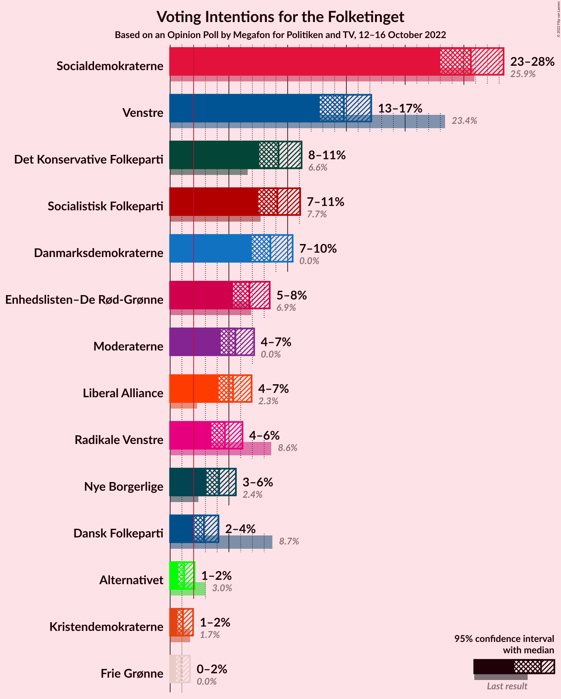

### Confidence Intervals

| Party | Last Result | Poll Result | 80% Confidence Interval | 90% Confidence Interval | 95% Confidence Interval | 99% Confidence Interval |
|:-----:|:-----------:|:-----------:|:-----------------------:|:-----------------------:|:-----------------------:|:-----------------------:|
| Socialdemokraterne | 25.9% | 25.6% | 23.9–27.4% |23.4–27.9% |23.0–28.4% |22.2–29.3% |
| Venstre | 23.4% | 14.8% | 13.4–16.3% |13.0–16.7% |12.7–17.1% |12.1–17.9% |
| Det Konservative Folkeparti | 6.6% | 9.2% | 8.2–10.5% |7.8–10.9% |7.6–11.2% |7.1–11.8% |
| Socialistisk Folkeparti | 7.7% | 9.1% | 8.0–10.4% |7.8–10.8% |7.5–11.1% |7.0–11.7% |
| Danmarksdemokraterne | 0.0% | 8.5% | 7.5–9.8% |7.2–10.1% |7.0–10.4% |6.5–11.1% |
| Enhedslisten–De Rød-Grønne | 6.9% | 6.7% | 5.8–7.9% |5.6–8.2% |5.3–8.5% |4.9–9.0% |
| Moderaterne | 0.0% | 5.6% | 4.7–6.6% |4.5–6.9% |4.3–7.1% |3.9–7.7% |
| Liberal Alliance | 2.3% | 5.4% | 4.5–6.4% |4.3–6.7% |4.1–6.9% |3.8–7.5% |
| Radikale Venstre | 8.6% | 4.7% | 3.9–5.6% |3.7–5.9% |3.5–6.2% |3.2–6.6% |
| Nye Borgerlige | 2.4% | 4.2% | 3.5–5.1% |3.3–5.4% |3.1–5.6% |2.8–6.1% |
| Dansk Folkeparti | 8.7% | 2.9% | 2.3–3.7% |2.1–3.9% |2.0–4.1% |1.8–4.5% |
| Alternativet | 3.0% | 1.2% | 0.9–1.8% |0.8–1.9% |0.7–2.1% |0.5–2.4% |
| Kristendemokraterne | 1.7% | 1.1% | 0.8–1.6% |0.7–1.8% |0.6–2.0% |0.5–2.3% |
| Frie Grønne | 0.0% | 0.9% | 0.6–1.4% |0.5–1.6% |0.5–1.7% |0.4–2.0% |

*Note:* The poll result column reflects the actual value used in the calculations. Published results may vary slightly, and in addition be rounded to fewer digits.

## Seats

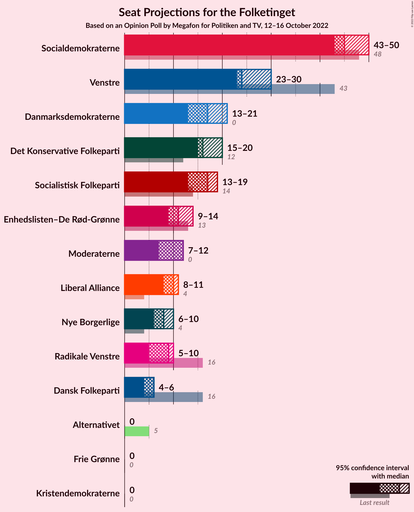

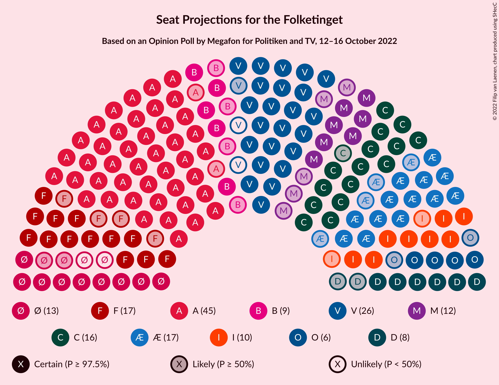

### Confidence Intervals

| Party | Last Result | Median | 80% Confidence Interval | 90% Confidence Interval | 95% Confidence Interval | 99% Confidence Interval |
|:-----:|:-----------:|:------:|:-----------------------:|:-----------------------:|:-----------------------:|:-----------------------:|
| <a href="#socialdemokraterne">Socialdemokraterne</a> | 48 | 45 | 45–48 |45–50 |43–50 |41–50 |
| <a href="#venstre">Venstre</a> | 43 | 24 | 24–26 |23–29 |23–30 |23–32 |
| <a href="#det-konservative-folkeparti">Det Konservative Folkeparti</a> | 12 | 16 | 15–19 |15–19 |15–20 |13–20 |
| <a href="#socialistisk-folkeparti">Socialistisk Folkeparti</a> | 14 | 17 | 15–18 |14–19 |13–19 |13–20 |
| <a href="#danmarksdemokraterne">Danmarksdemokraterne</a> | 0 | 17 | 15–17 |14–21 |13–21 |12–21 |
| <a href="#enhedslisten–de-rød-grønne">Enhedslisten–De Rød-Grønne</a> | 13 | 11 | 10–13 |9–13 |9–14 |9–17 |
| <a href="#moderaterne">Moderaterne</a> | 0 | 12 | 9–12 |9–12 |7–12 |7–12 |
| <a href="#liberal-alliance">Liberal Alliance</a> | 4 | 10 | 10 |8–11 |8–11 |8–12 |
| <a href="#radikale-venstre">Radikale Venstre</a> | 16 | 9 | 6–9 |6–10 |5–10 |5–11 |
| <a href="#nye-borgerlige">Nye Borgerlige</a> | 4 | 8 | 7–9 |7–10 |6–10 |5–12 |
| <a href="#dansk-folkeparti">Dansk Folkeparti</a> | 16 | 6 | 4–6 |4–6 |4–6 |0–8 |
| <a href="#alternativet">Alternativet</a> | 5 | 0 | 0 |0 |0 |0–4 |
| <a href="#kristendemokraterne">Kristendemokraterne</a> | 0 | 0 | 0 |0 |0 |0–4 |
| <a href="#frie-grønne">Frie Grønne</a> | 0 | 0 | 0 |0 |0 |0 |

### Socialdemokraterne

*For a full overview of the results for this party, see the [Socialdemokraterne](party-socialdemokraterne.html) page.*

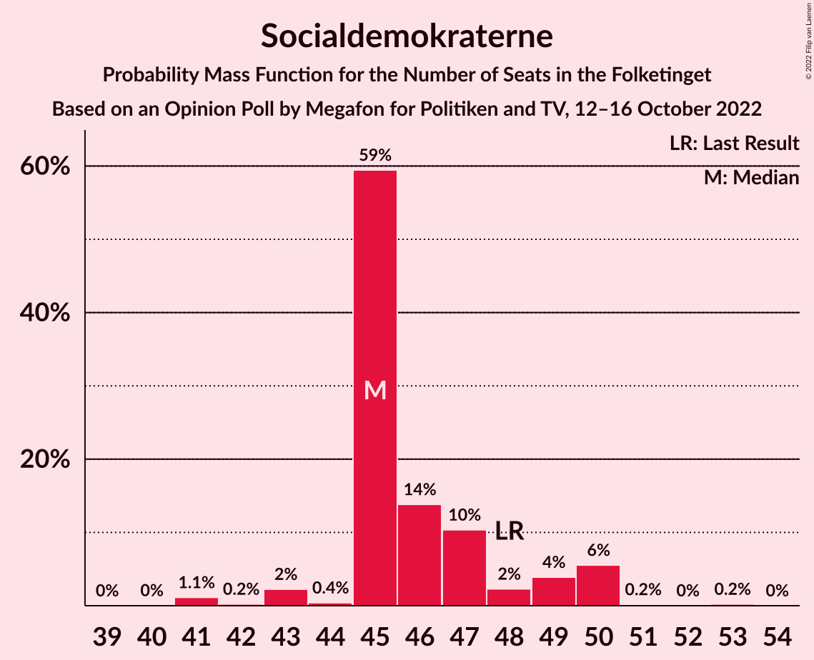

| Number of Seats | Probability | Accumulated | Special Marks |
|:---------------:|:-----------:|:-----------:|:-------------:|
| 39 | 0% | 100% |  |
| 40 | 0% | 99.9% |  |
| 41 | 1.1% | 99.9% |  |
| 42 | 0.2% | 98.7% |  |
| 43 | 2% | 98.5% |  |
| 44 | 0.4% | 96% |  |
| 45 | 59% | 96% | Median |
| 46 | 14% | 36% |  |
| 47 | 10% | 23% |  |
| 48 | 2% | 12% | Last Result |
| 49 | 4% | 10% |  |
| 50 | 6% | 6% |  |
| 51 | 0.2% | 0.5% |  |
| 52 | 0% | 0.3% |  |
| 53 | 0.2% | 0.3% |  |
| 54 | 0% | 0% |  |

### Venstre

*For a full overview of the results for this party, see the [Venstre](party-venstre.html) page.*

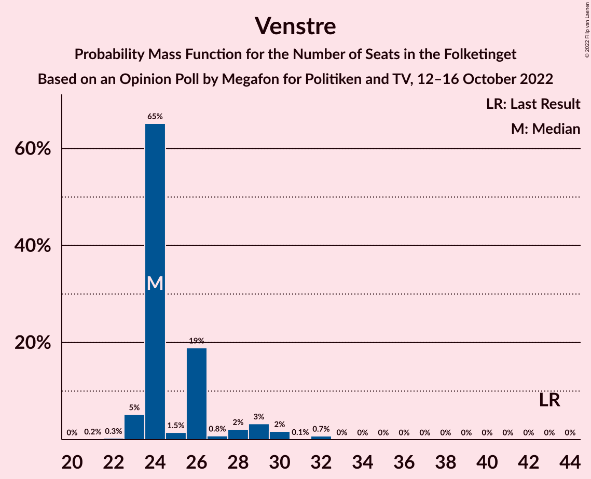

| Number of Seats | Probability | Accumulated | Special Marks |
|:---------------:|:-----------:|:-----------:|:-------------:|
| 21 | 0.2% | 100% |  |
| 22 | 0.3% | 99.8% |  |
| 23 | 5% | 99.5% |  |
| 24 | 65% | 94% | Median |
| 25 | 1.5% | 29% |  |
| 26 | 19% | 28% |  |
| 27 | 0.8% | 9% |  |
| 28 | 2% | 8% |  |
| 29 | 3% | 6% |  |
| 30 | 2% | 3% |  |
| 31 | 0.1% | 0.9% |  |
| 32 | 0.7% | 0.8% |  |
| 33 | 0% | 0% |  |
| 34 | 0% | 0% |  |
| 35 | 0% | 0% |  |
| 36 | 0% | 0% |  |
| 37 | 0% | 0% |  |
| 38 | 0% | 0% |  |
| 39 | 0% | 0% |  |
| 40 | 0% | 0% |  |
| 41 | 0% | 0% |  |
| 42 | 0% | 0% |  |
| 43 | 0% | 0% | Last Result |

### Det Konservative Folkeparti

*For a full overview of the results for this party, see the [Det Konservative Folkeparti](party-detkonservativefolkeparti.html) page.*

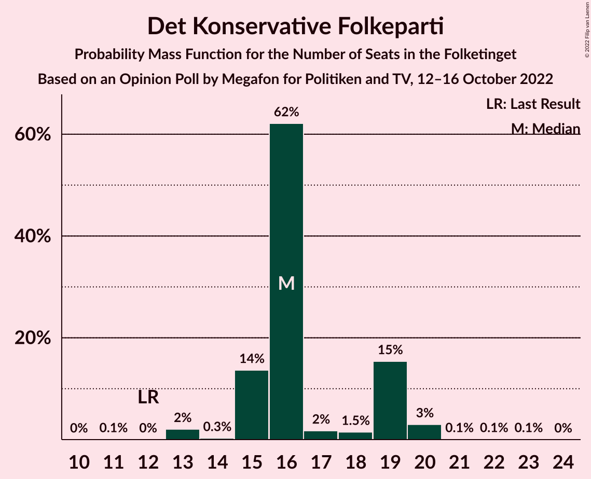

| Number of Seats | Probability | Accumulated | Special Marks |
|:---------------:|:-----------:|:-----------:|:-------------:|
| 11 | 0.1% | 100% |  |
| 12 | 0% | 99.9% | Last Result |
| 13 | 2% | 99.9% |  |
| 14 | 0.3% | 98% |  |
| 15 | 14% | 98% |  |
| 16 | 62% | 84% | Median |
| 17 | 2% | 22% |  |
| 18 | 1.5% | 20% |  |
| 19 | 15% | 19% |  |
| 20 | 3% | 3% |  |
| 21 | 0.1% | 0.2% |  |
| 22 | 0.1% | 0.2% |  |
| 23 | 0.1% | 0.1% |  |
| 24 | 0% | 0% |  |

### Socialistisk Folkeparti

*For a full overview of the results for this party, see the [Socialistisk Folkeparti](party-socialistiskfolkeparti.html) page.*

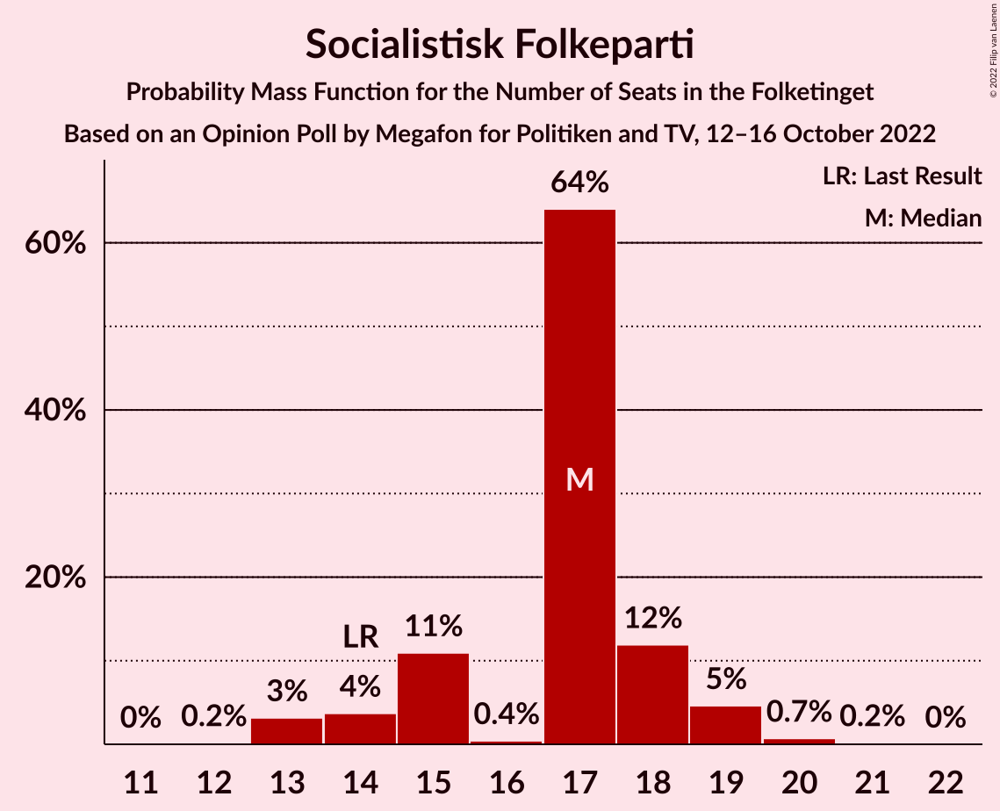

| Number of Seats | Probability | Accumulated | Special Marks |
|:---------------:|:-----------:|:-----------:|:-------------:|
| 12 | 0.2% | 100% |  |
| 13 | 3% | 99.8% |  |
| 14 | 4% | 97% | Last Result |
| 15 | 11% | 93% |  |
| 16 | 0.4% | 82% |  |
| 17 | 64% | 82% | Median |
| 18 | 12% | 17% |  |
| 19 | 5% | 6% |  |
| 20 | 0.7% | 0.9% |  |
| 21 | 0.2% | 0.2% |  |
| 22 | 0% | 0% |  |

### Danmarksdemokraterne

*For a full overview of the results for this party, see the [Danmarksdemokraterne](party-danmarksdemokraterne.html) page.*

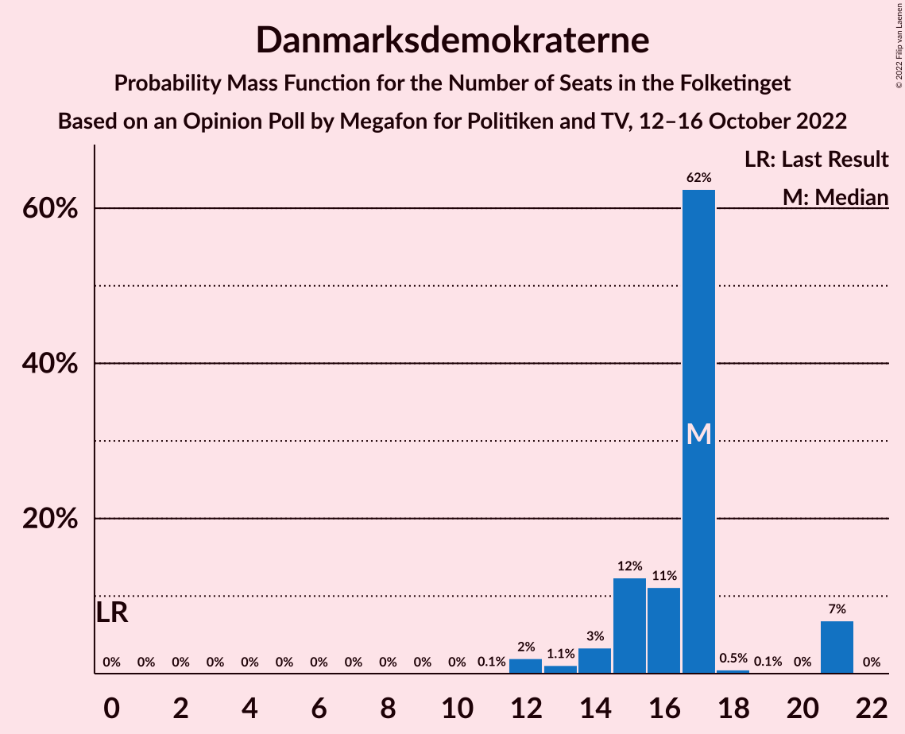

| Number of Seats | Probability | Accumulated | Special Marks |
|:---------------:|:-----------:|:-----------:|:-------------:|
| 0 | 0% | 100% | Last Result |
| 1 | 0% | 100% |  |
| 2 | 0% | 100% |  |
| 3 | 0% | 100% |  |
| 4 | 0% | 100% |  |
| 5 | 0% | 100% |  |
| 6 | 0% | 100% |  |
| 7 | 0% | 100% |  |
| 8 | 0% | 100% |  |
| 9 | 0% | 100% |  |
| 10 | 0% | 100% |  |
| 11 | 0.1% | 100% |  |
| 12 | 2% | 99.9% |  |
| 13 | 1.1% | 98% |  |
| 14 | 3% | 97% |  |
| 15 | 12% | 94% |  |
| 16 | 11% | 81% |  |
| 17 | 62% | 70% | Median |
| 18 | 0.5% | 8% |  |
| 19 | 0.1% | 7% |  |
| 20 | 0% | 7% |  |
| 21 | 7% | 7% |  |
| 22 | 0% | 0% |  |

### Enhedslisten–De Rød-Grønne

*For a full overview of the results for this party, see the [Enhedslisten–De Rød-Grønne](party-enhedslisten–derød-grønne.html) page.*

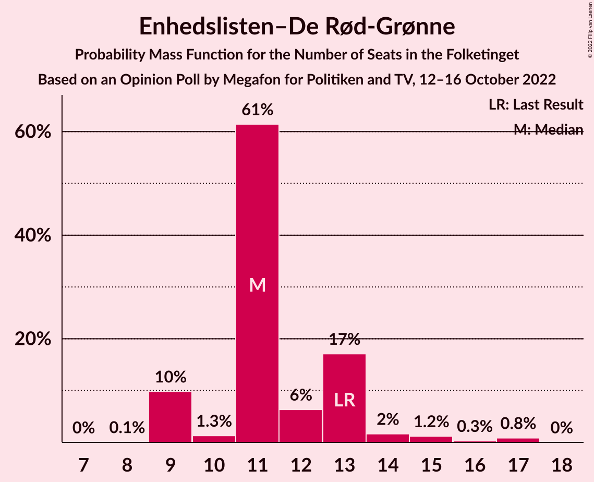

| Number of Seats | Probability | Accumulated | Special Marks |
|:---------------:|:-----------:|:-----------:|:-------------:|
| 8 | 0.1% | 100% |  |
| 9 | 10% | 99.9% |  |
| 10 | 1.3% | 90% |  |
| 11 | 61% | 89% | Median |
| 12 | 6% | 27% |  |
| 13 | 17% | 21% | Last Result |
| 14 | 2% | 4% |  |
| 15 | 1.2% | 2% |  |
| 16 | 0.3% | 1.1% |  |
| 17 | 0.8% | 0.9% |  |
| 18 | 0% | 0% |  |

### Moderaterne

*For a full overview of the results for this party, see the [Moderaterne](party-moderaterne.html) page.*

| Number of Seats | Probability | Accumulated | Special Marks |
|:---------------:|:-----------:|:-----------:|:-------------:|
| 0 | 0% | 100% | Last Result |
| 1 | 0% | 100% |  |
| 2 | 0% | 100% |  |
| 3 | 0% | 100% |  |
| 4 | 0% | 100% |  |
| 5 | 0% | 100% |  |
| 6 | 0% | 100% |  |
| 7 | 2% | 100% |  |
| 8 | 2% | 97% |  |
| 9 | 8% | 96% |  |
| 10 | 11% | 88% |  |
| 11 | 13% | 77% |  |
| 12 | 63% | 64% | Median |
| 13 | 0.2% | 0.5% |  |
| 14 | 0.2% | 0.3% |  |
| 15 | 0% | 0.1% |  |
| 16 | 0.1% | 0.1% |  |
| 17 | 0% | 0% |  |

### Liberal Alliance

*For a full overview of the results for this party, see the [Liberal Alliance](party-liberalalliance.html) page.*

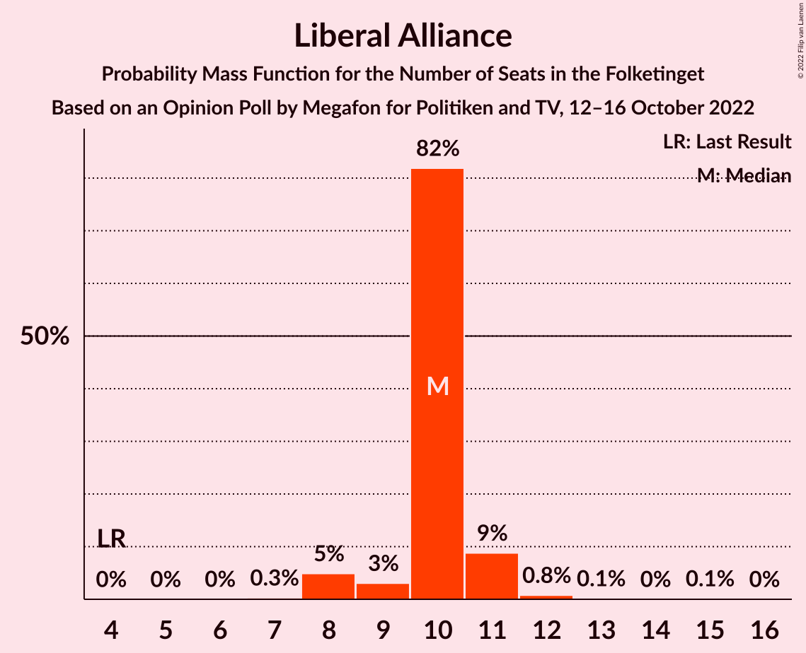

| Number of Seats | Probability | Accumulated | Special Marks |
|:---------------:|:-----------:|:-----------:|:-------------:|
| 4 | 0% | 100% | Last Result |
| 5 | 0% | 100% |  |
| 6 | 0% | 100% |  |
| 7 | 0.3% | 100% |  |
| 8 | 5% | 99.7% |  |
| 9 | 3% | 95% |  |
| 10 | 82% | 92% | Median |
| 11 | 9% | 10% |  |
| 12 | 0.8% | 1.1% |  |
| 13 | 0.1% | 0.3% |  |
| 14 | 0% | 0.1% |  |
| 15 | 0.1% | 0.1% |  |
| 16 | 0% | 0% |  |

### Radikale Venstre

*For a full overview of the results for this party, see the [Radikale Venstre](party-radikalevenstre.html) page.*

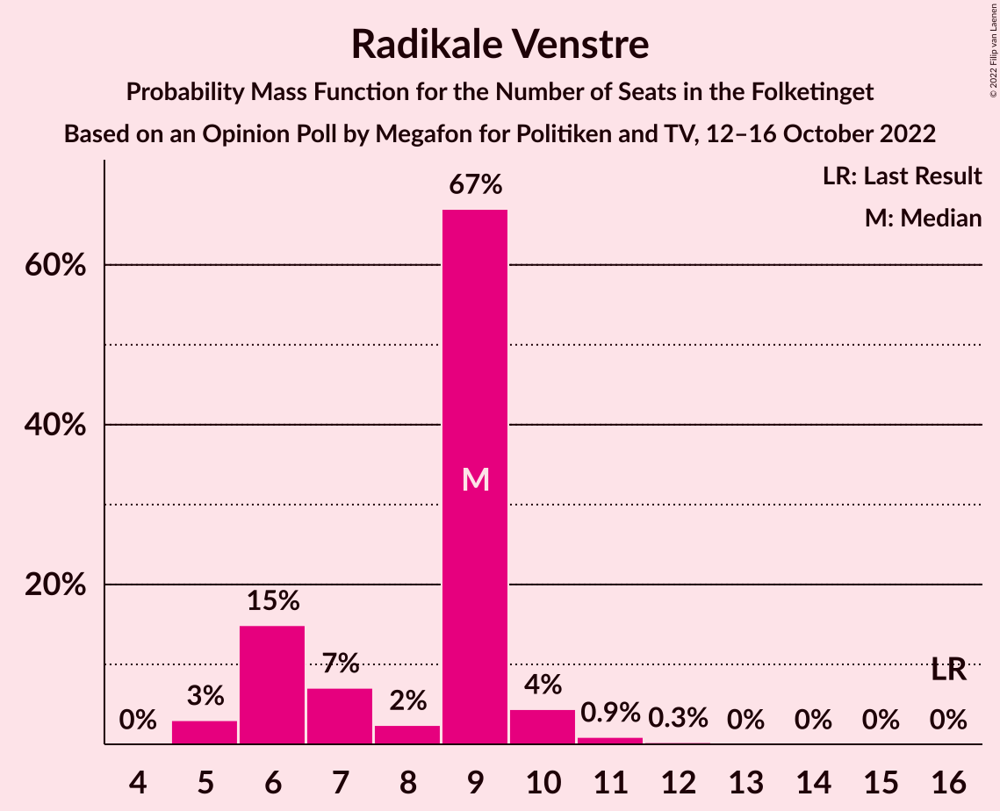

| Number of Seats | Probability | Accumulated | Special Marks |
|:---------------:|:-----------:|:-----------:|:-------------:|
| 5 | 3% | 100% |  |
| 6 | 15% | 97% |  |
| 7 | 7% | 82% |  |
| 8 | 2% | 75% |  |
| 9 | 67% | 73% | Median |
| 10 | 4% | 6% |  |
| 11 | 0.9% | 1.2% |  |
| 12 | 0.3% | 0.3% |  |
| 13 | 0% | 0% |  |
| 14 | 0% | 0% |  |
| 15 | 0% | 0% |  |
| 16 | 0% | 0% | Last Result |

### Nye Borgerlige

*For a full overview of the results for this party, see the [Nye Borgerlige](party-nyeborgerlige.html) page.*

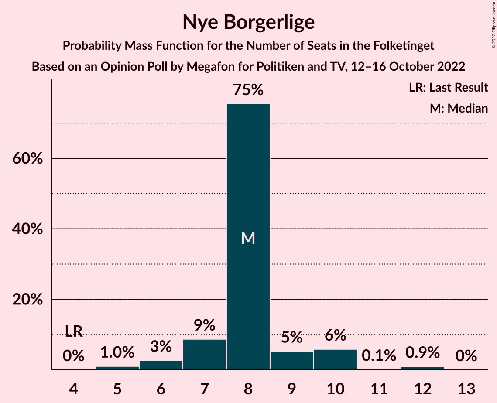

| Number of Seats | Probability | Accumulated | Special Marks |
|:---------------:|:-----------:|:-----------:|:-------------:|
| 4 | 0% | 100% | Last Result |
| 5 | 1.0% | 100% |  |
| 6 | 3% | 99.0% |  |
| 7 | 9% | 96% |  |
| 8 | 75% | 88% | Median |
| 9 | 5% | 12% |  |
| 10 | 6% | 7% |  |
| 11 | 0.1% | 1.0% |  |
| 12 | 0.9% | 1.0% |  |
| 13 | 0% | 0% |  |

### Dansk Folkeparti

*For a full overview of the results for this party, see the [Dansk Folkeparti](party-danskfolkeparti.html) page.*

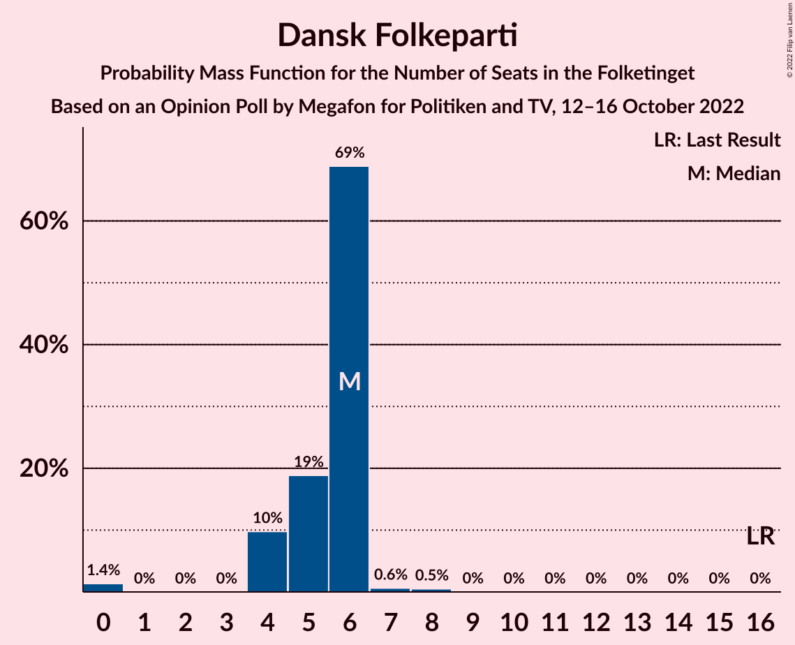

| Number of Seats | Probability | Accumulated | Special Marks |
|:---------------:|:-----------:|:-----------:|:-------------:|
| 0 | 1.4% | 100% |  |
| 1 | 0% | 98.6% |  |
| 2 | 0% | 98.6% |  |
| 3 | 0% | 98.6% |  |
| 4 | 10% | 98.6% |  |
| 5 | 19% | 89% |  |
| 6 | 69% | 70% | Median |
| 7 | 0.6% | 1.1% |  |
| 8 | 0.5% | 0.5% |  |
| 9 | 0% | 0% |  |
| 10 | 0% | 0% |  |
| 11 | 0% | 0% |  |
| 12 | 0% | 0% |  |
| 13 | 0% | 0% |  |
| 14 | 0% | 0% |  |
| 15 | 0% | 0% |  |
| 16 | 0% | 0% | Last Result |

### Alternativet

*For a full overview of the results for this party, see the [Alternativet](party-alternativet.html) page.*

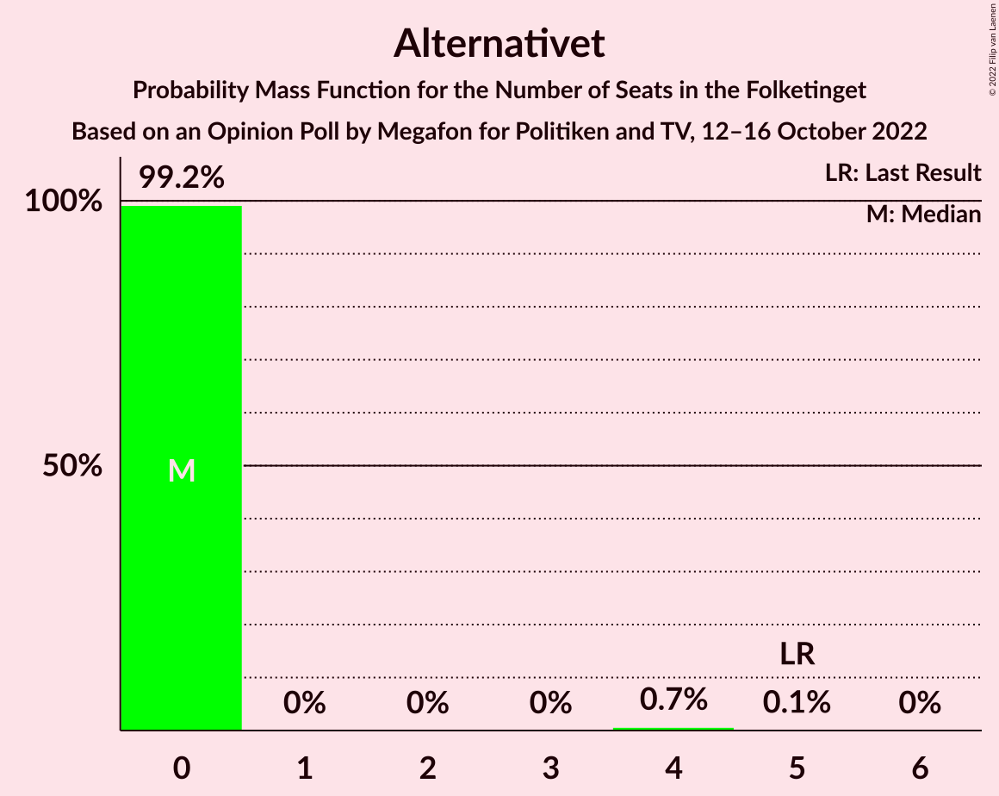

| Number of Seats | Probability | Accumulated | Special Marks |
|:---------------:|:-----------:|:-----------:|:-------------:|
| 0 | 99.2% | 100% | Median |
| 1 | 0% | 0.8% |  |
| 2 | 0% | 0.8% |  |
| 3 | 0% | 0.8% |  |
| 4 | 0.7% | 0.8% |  |
| 5 | 0.1% | 0.1% | Last Result |
| 6 | 0% | 0% |  |

### Kristendemokraterne

*For a full overview of the results for this party, see the [Kristendemokraterne](party-kristendemokraterne.html) page.*

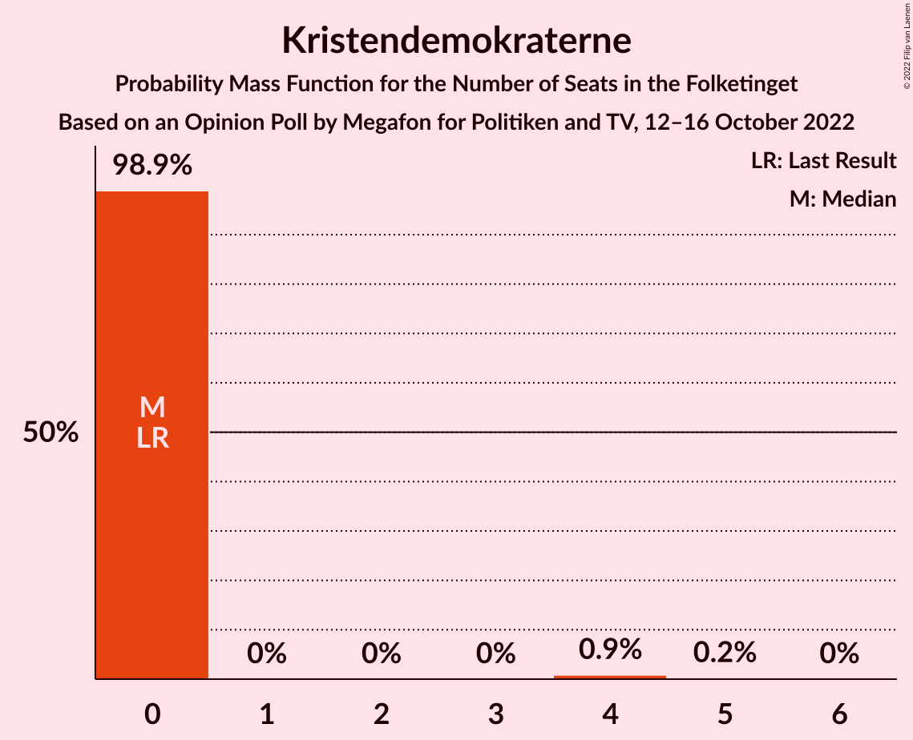

| Number of Seats | Probability | Accumulated | Special Marks |
|:---------------:|:-----------:|:-----------:|:-------------:|
| 0 | 98.9% | 100% | Last Result, Median |
| 1 | 0% | 1.1% |  |
| 2 | 0% | 1.1% |  |
| 3 | 0% | 1.1% |  |
| 4 | 0.9% | 1.1% |  |
| 5 | 0.2% | 0.2% |  |
| 6 | 0% | 0% |  |

### Frie Grønne

*For a full overview of the results for this party, see the [Frie Grønne](party-friegrønne.html) page.*

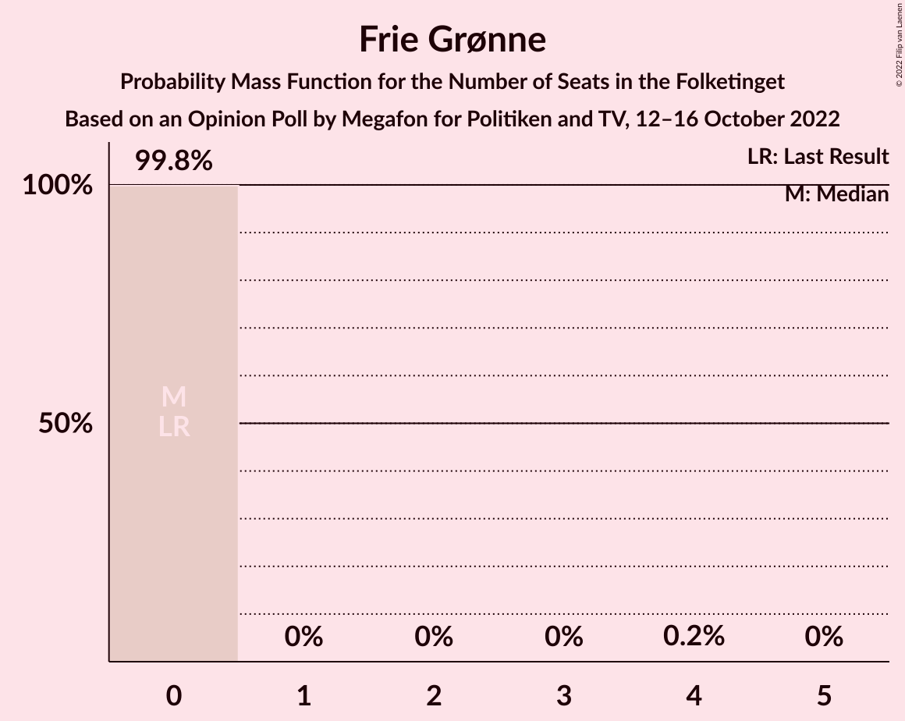

| Number of Seats | Probability | Accumulated | Special Marks |
|:---------------:|:-----------:|:-----------:|:-------------:|
| 0 | 99.8% | 100% | Last Result, Median |
| 1 | 0% | 0.2% |  |
| 2 | 0% | 0.2% |  |
| 3 | 0% | 0.2% |  |
| 4 | 0.2% | 0.2% |  |
| 5 | 0% | 0% |  |

## Coalitions

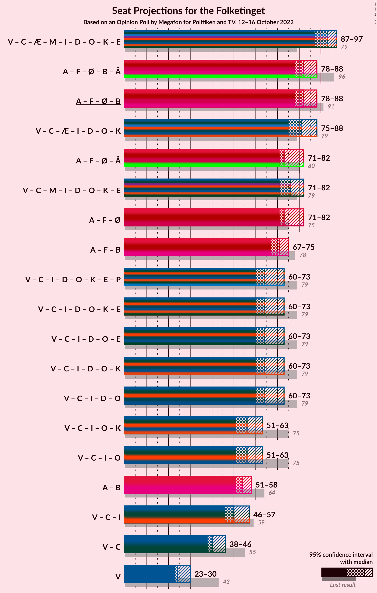

### Confidence Intervals

| Coalition | Last Result | Median | Majority? | 80% Confidence Interval | 90% Confidence Interval | 95% Confidence Interval | 99% Confidence Interval |
|:---------:|:-----------:|:------:|:---------:|:-----------------------:|:-----------------------:|:-----------------------:|:-----------------------:|
| Socialdemokraterne – Socialistisk Folkeparti – Enhedslisten–De Rød-Grønne – Radikale Venstre – Alternativet | 96 | 82 | 1.1% | 80–85 | 79–88 | 78–88 | 78–90 |
| Socialdemokraterne – Socialistisk Folkeparti – Enhedslisten–De Rød-Grønne – Radikale Venstre | 91 | 82 | 1.0% | 80–85 | 79–88 | 78–88 | 78–90 |
| Venstre – Det Konservative Folkeparti – Danmarksdemokraterne – Liberal Alliance – Nye Borgerlige – Dansk Folkeparti – Kristendemokraterne | 79 | 81 | 0% | 81–84 | 75–86 | 75–88 | 74–88 |
| Socialdemokraterne – Socialistisk Folkeparti – Enhedslisten–De Rød-Grønne – Alternativet | 80 | 73 | 0% | 73–78 | 72–82 | 71–82 | 69–82 |
| Socialdemokraterne – Socialistisk Folkeparti – Enhedslisten–De Rød-Grønne | 75 | 73 | 0% | 73–77 | 72–82 | 71–82 | 69–82 |
| Socialdemokraterne – Socialistisk Folkeparti – Radikale Venstre | 78 | 71 | 0% | 67–74 | 67–75 | 67–75 | 64–76 |
| Venstre – Det Konservative Folkeparti – Liberal Alliance – Nye Borgerlige – Dansk Folkeparti – Kristendemokraterne | 79 | 64 | 0% | 61–68 | 60–72 | 60–73 | 57–73 |
| Venstre – Det Konservative Folkeparti – Liberal Alliance – Nye Borgerlige – Dansk Folkeparti | 79 | 64 | 0% | 61–68 | 60–72 | 60–73 | 57–73 |
| Venstre – Det Konservative Folkeparti – Liberal Alliance – Dansk Folkeparti – Kristendemokraterne | 75 | 56 | 0% | 53–61 | 51–62 | 51–63 | 50–63 |
| Venstre – Det Konservative Folkeparti – Liberal Alliance – Dansk Folkeparti | 75 | 56 | 0% | 53–61 | 51–62 | 51–63 | 50–63 |
| Socialdemokraterne – Radikale Venstre | 64 | 54 | 0% | 52–56 | 52–57 | 51–58 | 50–59 |
| Venstre – Det Konservative Folkeparti – Liberal Alliance | 59 | 50 | 0% | 49–55 | 46–56 | 46–57 | 46–58 |
| Venstre – Det Konservative Folkeparti | 55 | 40 | 0% | 39–45 | 38–45 | 38–46 | 37–46 |
| Venstre | 43 | 24 | 0% | 24–26 | 23–29 | 23–30 | 23–32 |

### Socialdemokraterne – Socialistisk Folkeparti – Enhedslisten–De Rød-Grønne – Radikale Venstre – Alternativet

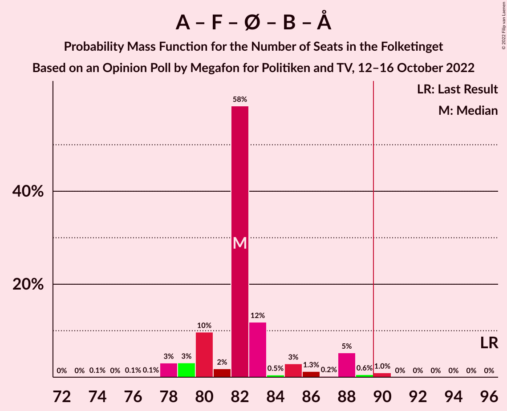

| Number of Seats | Probability | Accumulated | Special Marks |
|:---------------:|:-----------:|:-----------:|:-------------:|
| 74 | 0.1% | 100% |  |
| 75 | 0% | 99.9% |  |
| 76 | 0.1% | 99.9% |  |
| 77 | 0.1% | 99.8% |  |
| 78 | 3% | 99.7% |  |
| 79 | 3% | 97% |  |
| 80 | 10% | 94% |  |
| 81 | 2% | 84% |  |
| 82 | 58% | 82% | Median |
| 83 | 12% | 24% |  |
| 84 | 0.5% | 12% |  |
| 85 | 3% | 11% |  |
| 86 | 1.3% | 8% |  |
| 87 | 0.2% | 7% |  |
| 88 | 5% | 7% |  |
| 89 | 0.6% | 2% |  |
| 90 | 1.0% | 1.1% | Majority |
| 91 | 0% | 0.1% |  |
| 92 | 0% | 0.1% |  |
| 93 | 0% | 0% |  |
| 94 | 0% | 0% |  |
| 95 | 0% | 0% |  |
| 96 | 0% | 0% | Last Result |

### Socialdemokraterne – Socialistisk Folkeparti – Enhedslisten–De Rød-Grønne – Radikale Venstre

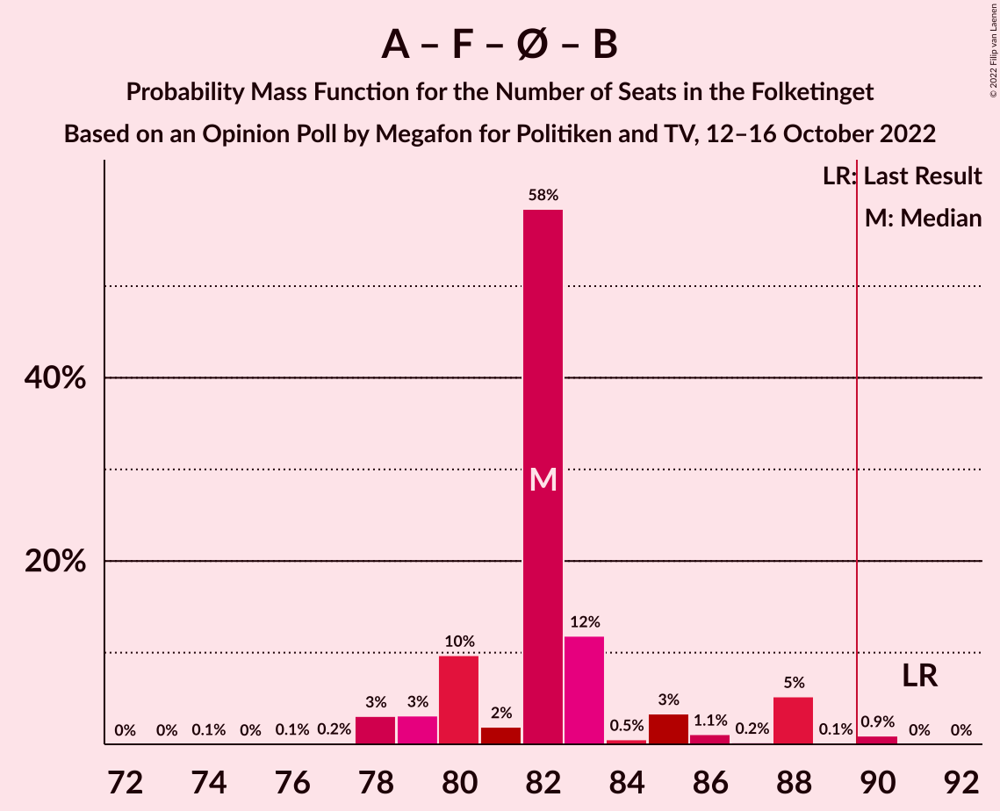

| Number of Seats | Probability | Accumulated | Special Marks |
|:---------------:|:-----------:|:-----------:|:-------------:|
| 74 | 0.1% | 100% |  |
| 75 | 0% | 99.9% |  |
| 76 | 0.1% | 99.9% |  |
| 77 | 0.2% | 99.8% |  |
| 78 | 3% | 99.7% |  |
| 79 | 3% | 97% |  |
| 80 | 10% | 93% |  |
| 81 | 2% | 84% |  |
| 82 | 58% | 82% | Median |
| 83 | 12% | 23% |  |
| 84 | 0.5% | 12% |  |
| 85 | 3% | 11% |  |
| 86 | 1.1% | 8% |  |
| 87 | 0.2% | 7% |  |
| 88 | 5% | 6% |  |
| 89 | 0.1% | 1.1% |  |
| 90 | 0.9% | 1.0% | Majority |
| 91 | 0% | 0.1% | Last Result |
| 92 | 0% | 0% |  |

### Venstre – Det Konservative Folkeparti – Danmarksdemokraterne – Liberal Alliance – Nye Borgerlige – Dansk Folkeparti – Kristendemokraterne

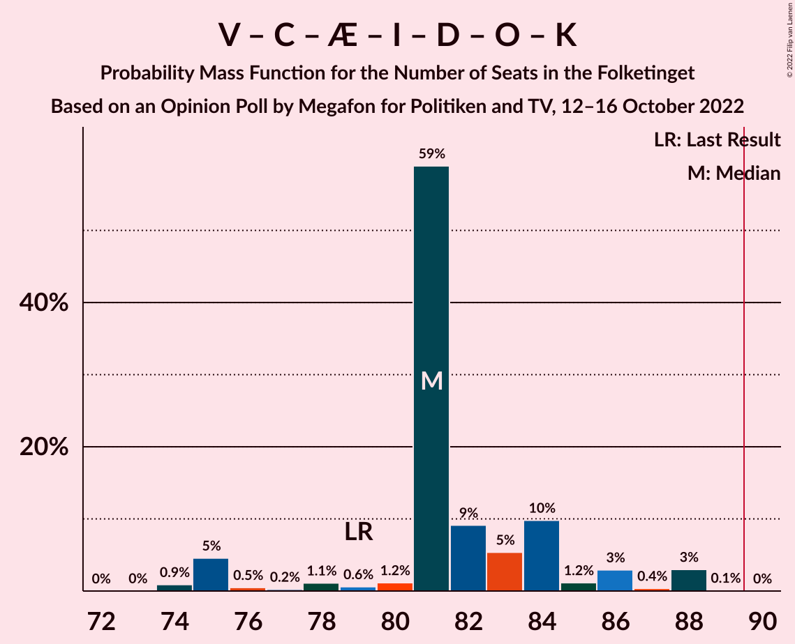

| Number of Seats | Probability | Accumulated | Special Marks |
|:---------------:|:-----------:|:-----------:|:-------------:|
| 73 | 0% | 100% |  |
| 74 | 0.9% | 99.9% |  |
| 75 | 5% | 99.0% |  |
| 76 | 0.5% | 94% |  |
| 77 | 0.2% | 94% |  |
| 78 | 1.1% | 94% |  |
| 79 | 0.6% | 93% | Last Result |
| 80 | 1.2% | 92% |  |
| 81 | 59% | 91% | Median |
| 82 | 9% | 32% |  |
| 83 | 5% | 23% |  |
| 84 | 10% | 17% |  |
| 85 | 1.2% | 8% |  |
| 86 | 3% | 6% |  |
| 87 | 0.4% | 3% |  |
| 88 | 3% | 3% |  |
| 89 | 0.1% | 0.1% |  |
| 90 | 0% | 0% | Majority |

### Socialdemokraterne – Socialistisk Folkeparti – Enhedslisten–De Rød-Grønne – Alternativet

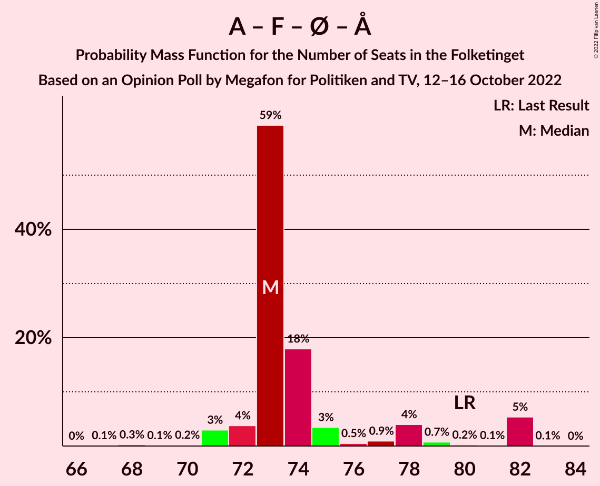

| Number of Seats | Probability | Accumulated | Special Marks |
|:---------------:|:-----------:|:-----------:|:-------------:|
| 67 | 0.1% | 100% |  |
| 68 | 0.3% | 99.9% |  |
| 69 | 0.1% | 99.6% |  |
| 70 | 0.2% | 99.5% |  |
| 71 | 3% | 99.3% |  |
| 72 | 4% | 96% |  |
| 73 | 59% | 93% | Median |
| 74 | 18% | 33% |  |
| 75 | 3% | 15% |  |
| 76 | 0.5% | 12% |  |
| 77 | 0.9% | 11% |  |
| 78 | 4% | 11% |  |
| 79 | 0.7% | 7% |  |
| 80 | 0.2% | 6% | Last Result |
| 81 | 0.1% | 6% |  |
| 82 | 5% | 5% |  |
| 83 | 0.1% | 0.1% |  |
| 84 | 0% | 0% |  |

### Socialdemokraterne – Socialistisk Folkeparti – Enhedslisten–De Rød-Grønne

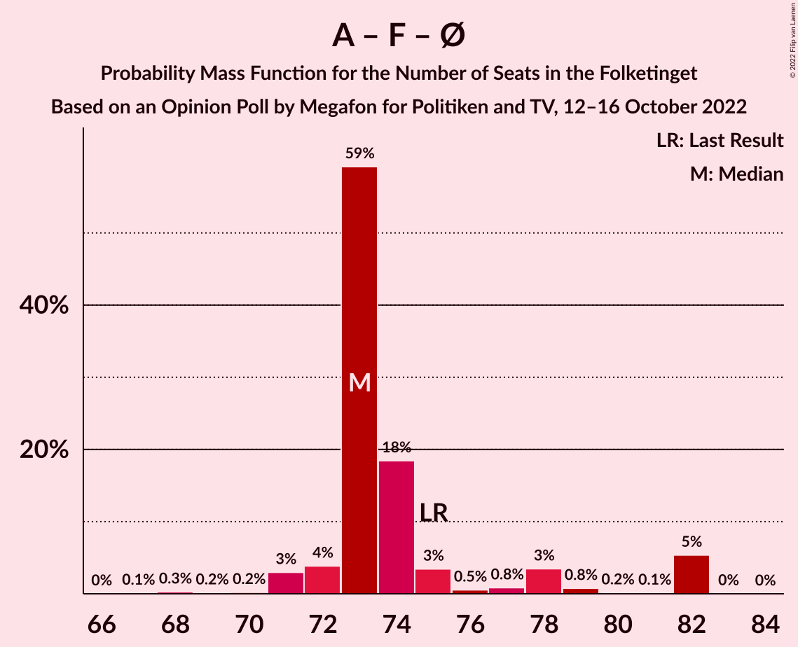

| Number of Seats | Probability | Accumulated | Special Marks |
|:---------------:|:-----------:|:-----------:|:-------------:|
| 67 | 0.1% | 100% |  |
| 68 | 0.3% | 99.9% |  |
| 69 | 0.2% | 99.6% |  |
| 70 | 0.2% | 99.4% |  |
| 71 | 3% | 99.2% |  |
| 72 | 4% | 96% |  |
| 73 | 59% | 92% | Median |
| 74 | 18% | 33% |  |
| 75 | 3% | 15% | Last Result |
| 76 | 0.5% | 11% |  |
| 77 | 0.8% | 11% |  |
| 78 | 3% | 10% |  |
| 79 | 0.8% | 6% |  |
| 80 | 0.2% | 6% |  |
| 81 | 0.1% | 6% |  |
| 82 | 5% | 5% |  |
| 83 | 0% | 0.1% |  |
| 84 | 0% | 0% |  |

### Socialdemokraterne – Socialistisk Folkeparti – Radikale Venstre

| Number of Seats | Probability | Accumulated | Special Marks |
|:---------------:|:-----------:|:-----------:|:-------------:|
| 63 | 0.1% | 100% |  |
| 64 | 1.1% | 99.9% |  |
| 65 | 0.1% | 98.8% |  |
| 66 | 0.1% | 98.7% |  |
| 67 | 13% | 98.6% |  |
| 68 | 0.4% | 86% |  |
| 69 | 2% | 85% |  |
| 70 | 3% | 84% |  |
| 71 | 61% | 80% | Median |
| 72 | 3% | 19% |  |
| 73 | 3% | 16% |  |
| 74 | 7% | 14% |  |
| 75 | 5% | 6% |  |
| 76 | 0.9% | 1.1% |  |
| 77 | 0.1% | 0.2% |  |
| 78 | 0% | 0.1% | Last Result |
| 79 | 0.1% | 0.1% |  |
| 80 | 0% | 0% |  |

### Venstre – Det Konservative Folkeparti – Liberal Alliance – Nye Borgerlige – Dansk Folkeparti – Kristendemokraterne

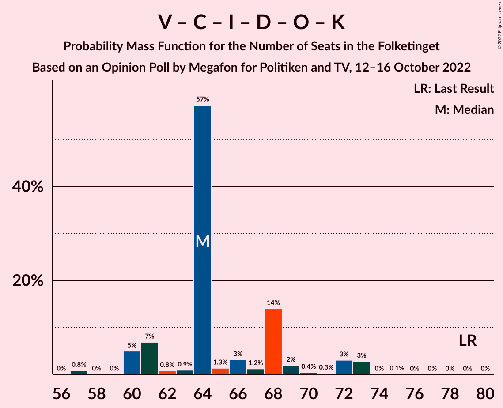

| Number of Seats | Probability | Accumulated | Special Marks |
|:---------------:|:-----------:|:-----------:|:-------------:|
| 57 | 0.8% | 100% |  |
| 58 | 0% | 99.1% |  |
| 59 | 0% | 99.1% |  |
| 60 | 5% | 99.1% |  |
| 61 | 7% | 94% |  |
| 62 | 0.8% | 87% |  |
| 63 | 0.9% | 86% |  |
| 64 | 57% | 86% | Median |
| 65 | 1.3% | 28% |  |
| 66 | 3% | 27% |  |
| 67 | 1.2% | 24% |  |
| 68 | 14% | 23% |  |
| 69 | 2% | 9% |  |
| 70 | 0.4% | 7% |  |
| 71 | 0.3% | 6% |  |
| 72 | 3% | 6% |  |
| 73 | 3% | 3% |  |
| 74 | 0% | 0.1% |  |
| 75 | 0.1% | 0.1% |  |
| 76 | 0% | 0% |  |
| 77 | 0% | 0% |  |
| 78 | 0% | 0% |  |
| 79 | 0% | 0% | Last Result |

### Venstre – Det Konservative Folkeparti – Liberal Alliance – Nye Borgerlige – Dansk Folkeparti

| Number of Seats | Probability | Accumulated | Special Marks |
|:---------------:|:-----------:|:-----------:|:-------------:|
| 57 | 0.8% | 100% |  |
| 58 | 0% | 99.1% |  |
| 59 | 0.1% | 99.1% |  |
| 60 | 5% | 99.0% |  |
| 61 | 7% | 94% |  |
| 62 | 1.3% | 87% |  |
| 63 | 0.9% | 86% |  |
| 64 | 57% | 85% | Median |
| 65 | 2% | 28% |  |
| 66 | 3% | 26% |  |
| 67 | 1.2% | 23% |  |
| 68 | 14% | 22% |  |
| 69 | 2% | 8% |  |
| 70 | 0.2% | 6% |  |
| 71 | 0.2% | 6% |  |
| 72 | 3% | 6% |  |
| 73 | 3% | 3% |  |
| 74 | 0% | 0.1% |  |
| 75 | 0.1% | 0.1% |  |
| 76 | 0% | 0% |  |
| 77 | 0% | 0% |  |
| 78 | 0% | 0% |  |
| 79 | 0% | 0% | Last Result |

### Venstre – Det Konservative Folkeparti – Liberal Alliance – Dansk Folkeparti – Kristendemokraterne

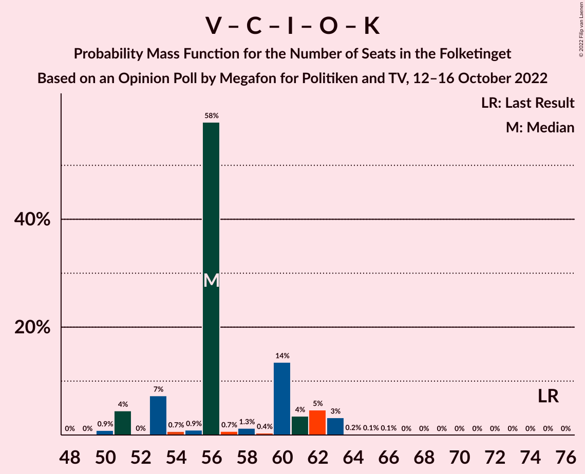

| Number of Seats | Probability | Accumulated | Special Marks |
|:---------------:|:-----------:|:-----------:|:-------------:|
| 50 | 0.9% | 100% |  |
| 51 | 4% | 99.1% |  |
| 52 | 0% | 95% |  |
| 53 | 7% | 95% |  |
| 54 | 0.7% | 87% |  |
| 55 | 0.9% | 87% |  |
| 56 | 58% | 86% | Median |
| 57 | 0.7% | 28% |  |
| 58 | 1.3% | 27% |  |
| 59 | 0.4% | 26% |  |
| 60 | 14% | 25% |  |
| 61 | 4% | 12% |  |
| 62 | 5% | 8% |  |
| 63 | 3% | 4% |  |
| 64 | 0.2% | 0.4% |  |
| 65 | 0.1% | 0.2% |  |
| 66 | 0.1% | 0.1% |  |
| 67 | 0% | 0% |  |
| 68 | 0% | 0% |  |
| 69 | 0% | 0% |  |
| 70 | 0% | 0% |  |
| 71 | 0% | 0% |  |
| 72 | 0% | 0% |  |
| 73 | 0% | 0% |  |
| 74 | 0% | 0% |  |
| 75 | 0% | 0% | Last Result |

### Venstre – Det Konservative Folkeparti – Liberal Alliance – Dansk Folkeparti

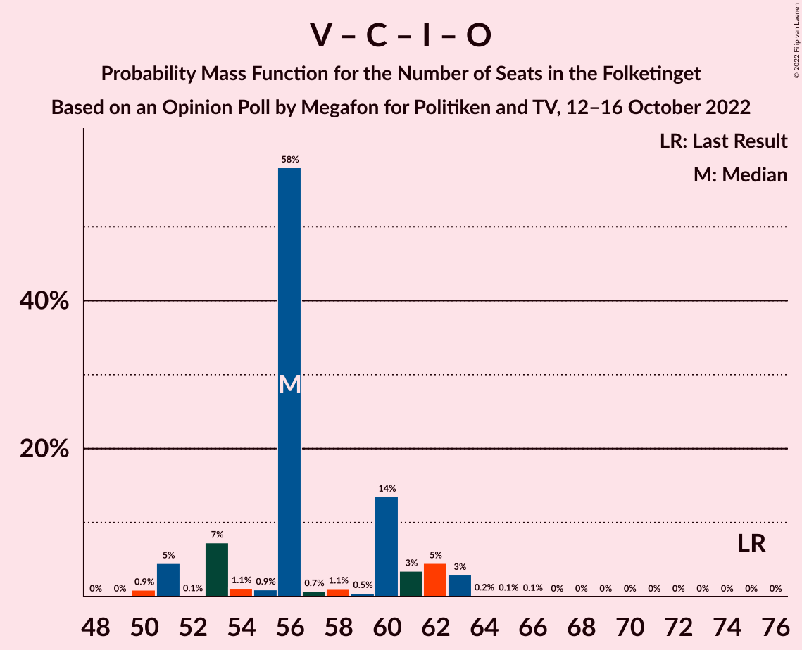

| Number of Seats | Probability | Accumulated | Special Marks |
|:---------------:|:-----------:|:-----------:|:-------------:|
| 50 | 0.9% | 100% |  |
| 51 | 5% | 99.1% |  |
| 52 | 0.1% | 95% |  |
| 53 | 7% | 95% |  |
| 54 | 1.1% | 87% |  |
| 55 | 0.9% | 86% |  |
| 56 | 58% | 85% | Median |
| 57 | 0.7% | 27% |  |
| 58 | 1.1% | 26% |  |
| 59 | 0.5% | 25% |  |
| 60 | 14% | 25% |  |
| 61 | 3% | 11% |  |
| 62 | 5% | 8% |  |
| 63 | 3% | 3% |  |
| 64 | 0.2% | 0.4% |  |
| 65 | 0.1% | 0.2% |  |
| 66 | 0.1% | 0.1% |  |
| 67 | 0% | 0% |  |
| 68 | 0% | 0% |  |
| 69 | 0% | 0% |  |
| 70 | 0% | 0% |  |
| 71 | 0% | 0% |  |
| 72 | 0% | 0% |  |
| 73 | 0% | 0% |  |
| 74 | 0% | 0% |  |
| 75 | 0% | 0% | Last Result |

### Socialdemokraterne – Radikale Venstre

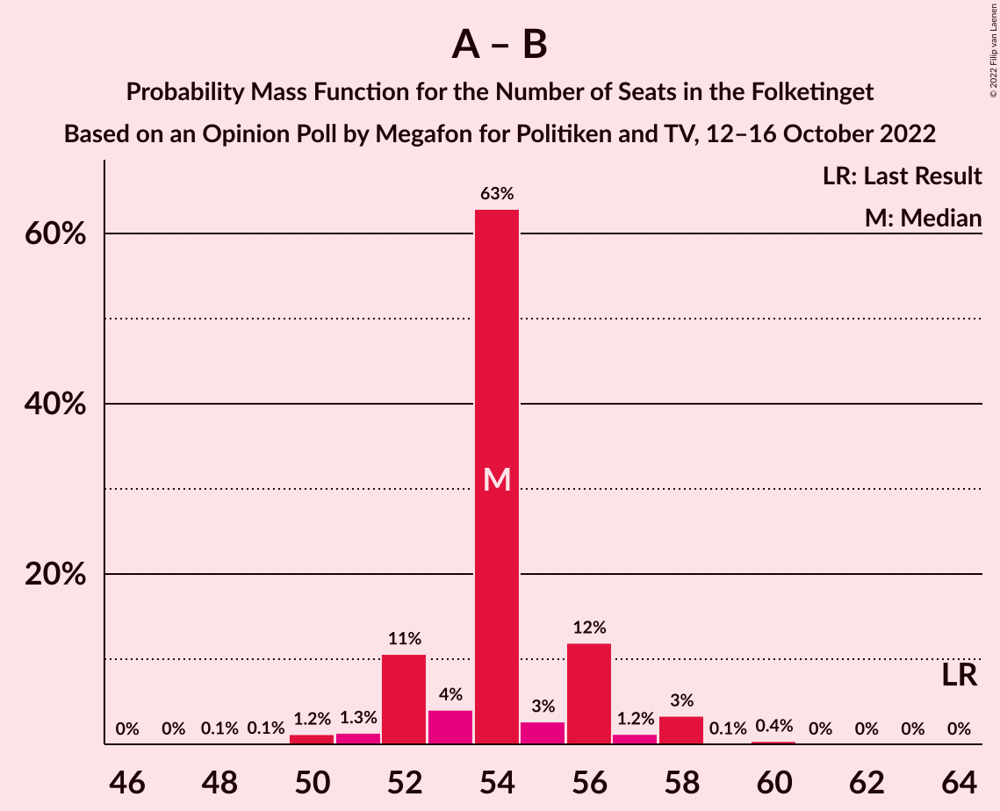

| Number of Seats | Probability | Accumulated | Special Marks |
|:---------------:|:-----------:|:-----------:|:-------------:|
| 47 | 0% | 100% |  |
| 48 | 0.1% | 99.9% |  |
| 49 | 0.1% | 99.9% |  |
| 50 | 1.2% | 99.7% |  |
| 51 | 1.3% | 98.6% |  |
| 52 | 11% | 97% |  |
| 53 | 4% | 87% |  |
| 54 | 63% | 83% | Median |
| 55 | 3% | 20% |  |
| 56 | 12% | 17% |  |
| 57 | 1.2% | 5% |  |
| 58 | 3% | 4% |  |
| 59 | 0.1% | 0.5% |  |
| 60 | 0.4% | 0.4% |  |
| 61 | 0% | 0.1% |  |
| 62 | 0% | 0% |  |
| 63 | 0% | 0% |  |
| 64 | 0% | 0% | Last Result |

### Venstre – Det Konservative Folkeparti – Liberal Alliance

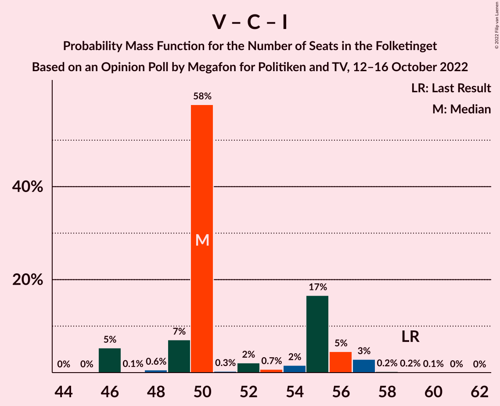

| Number of Seats | Probability | Accumulated | Special Marks |
|:---------------:|:-----------:|:-----------:|:-------------:|
| 46 | 5% | 100% |  |
| 47 | 0.1% | 95% |  |
| 48 | 0.6% | 95% |  |
| 49 | 7% | 94% |  |
| 50 | 58% | 87% | Median |
| 51 | 0.3% | 29% |  |
| 52 | 2% | 29% |  |
| 53 | 0.7% | 27% |  |
| 54 | 2% | 26% |  |
| 55 | 17% | 25% |  |
| 56 | 5% | 8% |  |
| 57 | 3% | 3% |  |
| 58 | 0.2% | 0.6% |  |
| 59 | 0.2% | 0.3% | Last Result |
| 60 | 0.1% | 0.2% |  |
| 61 | 0% | 0.1% |  |
| 62 | 0% | 0% |  |

### Venstre – Det Konservative Folkeparti

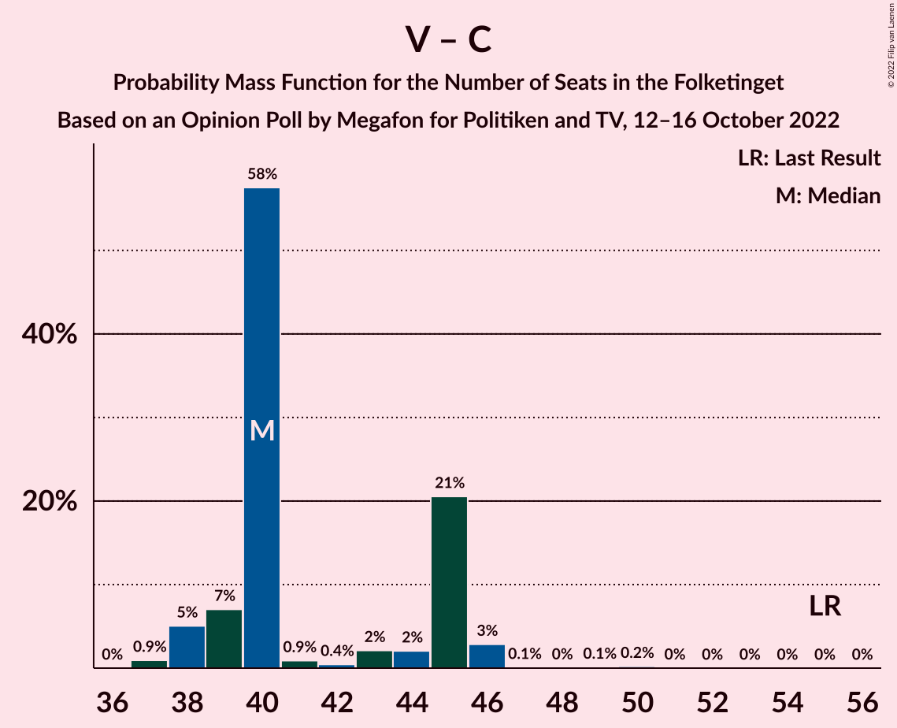

| Number of Seats | Probability | Accumulated | Special Marks |
|:---------------:|:-----------:|:-----------:|:-------------:|
| 37 | 0.9% | 100% |  |
| 38 | 5% | 99.0% |  |
| 39 | 7% | 94% |  |
| 40 | 58% | 87% | Median |
| 41 | 0.9% | 29% |  |
| 42 | 0.4% | 29% |  |
| 43 | 2% | 28% |  |
| 44 | 2% | 26% |  |
| 45 | 21% | 24% |  |
| 46 | 3% | 3% |  |
| 47 | 0.1% | 0.5% |  |
| 48 | 0% | 0.4% |  |
| 49 | 0.1% | 0.4% |  |
| 50 | 0.2% | 0.2% |  |
| 51 | 0% | 0% |  |
| 52 | 0% | 0% |  |
| 53 | 0% | 0% |  |
| 54 | 0% | 0% |  |
| 55 | 0% | 0% | Last Result |

### Venstre

| Number of Seats | Probability | Accumulated | Special Marks |
|:---------------:|:-----------:|:-----------:|:-------------:|
| 21 | 0.2% | 100% |  |
| 22 | 0.3% | 99.8% |  |
| 23 | 5% | 99.5% |  |
| 24 | 65% | 94% | Median |
| 25 | 1.5% | 29% |  |
| 26 | 19% | 28% |  |
| 27 | 0.8% | 9% |  |
| 28 | 2% | 8% |  |
| 29 | 3% | 6% |  |
| 30 | 2% | 3% |  |
| 31 | 0.1% | 0.9% |  |
| 32 | 0.7% | 0.8% |  |
| 33 | 0% | 0% |  |
| 34 | 0% | 0% |  |
| 35 | 0% | 0% |  |
| 36 | 0% | 0% |  |
| 37 | 0% | 0% |  |
| 38 | 0% | 0% |  |
| 39 | 0% | 0% |  |
| 40 | 0% | 0% |  |
| 41 | 0% | 0% |  |
| 42 | 0% | 0% |  |
| 43 | 0% | 0% | Last Result |

## Technical Information

### Opinion Poll

+ **Polling firm:** Megafon
+ **Commissioner(s):** Politiken and TV
+ **Fieldwork period:** 12–16 October 2022

### Calculations

+ **Sample size:** 1008
+ **Simulations done:** 1,048,576
+ **Error estimate:** 2.06%

