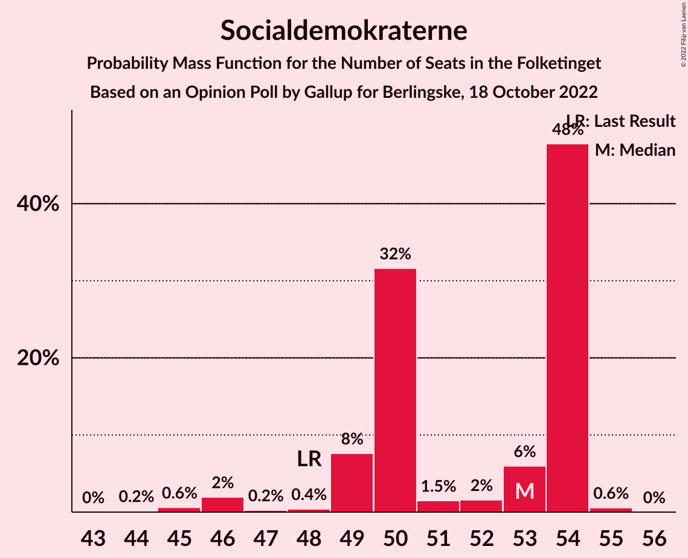
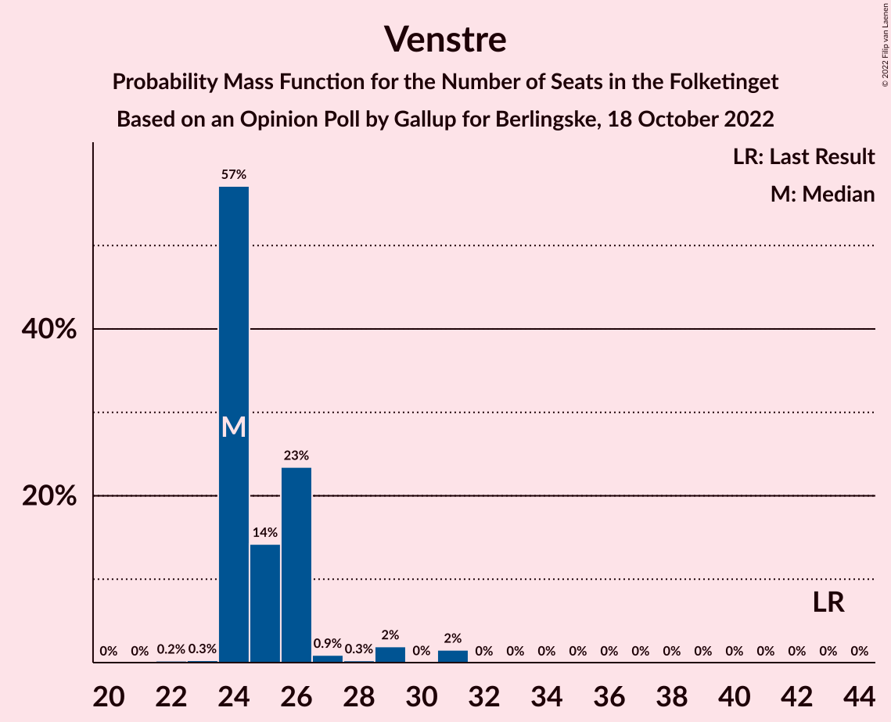
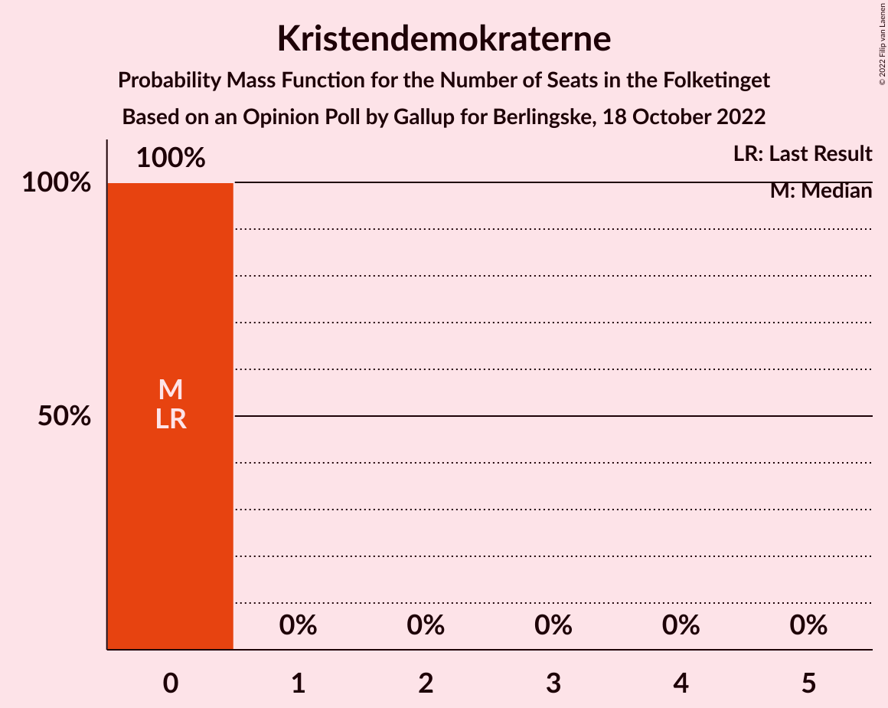

# Opinion Poll by Gallup for Berlingske, 18 October 2022

<a href="#voting-intentions">Voting Intentions</a> | <a href="#seats">Seats</a> | <a href="#coalitions">Coalitions</a> | <a href="#technical-information">Technical Information</a>

## Voting Intentions

### Confidence Intervals

| Party | Last Result | Poll Result | 80% Confidence Interval | 90% Confidence Interval | 95% Confidence Interval | 99% Confidence Interval |
|:-----:|:-----------:|:-----------:|:-----------------------:|:-----------------------:|:-----------------------:|:-----------------------:|
| Socialdemokraterne | 25.9% | 27.7% | 26.4–29.0% |26.1–29.4% |25.8–29.7% |25.2–30.4% |
| Venstre | 23.4% | 14.5% | 13.5–15.5% |13.2–15.8% |13.0–16.1% |12.5–16.6% |
| Socialistisk Folkeparti | 7.7% | 8.9% | 8.1–9.8% |7.9–10.0% |7.7–10.2% |7.4–10.7% |
| Moderaterne | 0.0% | 7.3% | 6.6–8.1% |6.4–8.3% |6.2–8.5% |5.9–8.9% |
| Det Konservative Folkeparti | 6.6% | 7.1% | 6.4–7.9% |6.2–8.1% |6.0–8.3% |5.7–8.7% |
| Enhedslisten–De Rød-Grønne | 6.9% | 6.9% | 6.2–7.7% |6.0–7.9% |5.9–8.1% |5.5–8.5% |
| Liberal Alliance | 2.3% | 6.7% | 6.0–7.5% |5.8–7.7% |5.7–7.9% |5.4–8.3% |
| Danmarksdemokraterne | 0.0% | 5.9% | 5.3–6.6% |5.1–6.8% |4.9–7.0% |4.6–7.4% |
| Nye Borgerlige | 2.4% | 4.8% | 4.2–5.5% |4.1–5.6% |3.9–5.8% |3.7–6.1% |
| Radikale Venstre | 8.6% | 4.5% | 4.0–5.2% |3.8–5.4% |3.7–5.5% |3.4–5.9% |
| Dansk Folkeparti | 8.7% | 2.7% | 2.3–3.2% |2.2–3.4% |2.1–3.5% |1.9–3.8% |
| Alternativet | 3.0% | 1.5% | 1.2–1.9% |1.1–2.0% |1.1–2.1% |0.9–2.4% |
| Kristendemokraterne | 1.7% | 0.7% | 0.5–1.0% |0.5–1.1% |0.4–1.2% |0.3–1.4% |
| Frie Grønne | 0.0% | 0.7% | 0.5–1.0% |0.5–1.1% |0.4–1.2% |0.3–1.4% |

*Note:* The poll result column reflects the actual value used in the calculations. Published results may vary slightly, and in addition be rounded to fewer digits.

## Seats

### Confidence Intervals

| Party | Last Result | Median | 80% Confidence Interval | 90% Confidence Interval | 95% Confidence Interval | 99% Confidence Interval |
|:-----:|:-----------:|:------:|:-----------------------:|:-----------------------:|:-----------------------:|:-----------------------:|
| <a href="#socialdemokraterne">Socialdemokraterne</a> | 48 | 53 | 49–54 |49–54 |46–54 |45–55 |
| <a href="#venstre">Venstre</a> | 43 | 24 | 24–26 |24–26 |24–29 |23–31 |
| <a href="#socialistisk-folkeparti">Socialistisk Folkeparti</a> | 14 | 15 | 15–17 |15–17 |15–17 |14–17 |
| <a href="#moderaterne">Moderaterne</a> | 0 | 13 | 11–14 |11–14 |11–14 |10–15 |
| <a href="#det-konservative-folkeparti">Det Konservative Folkeparti</a> | 12 | 13 | 11–14 |10–14 |10–14 |10–14 |
| <a href="#enhedslisten–de-rød-grønne">Enhedslisten–De Rød-Grønne</a> | 13 | 14 | 12–14 |11–14 |11–14 |11–14 |
| <a href="#liberal-alliance">Liberal Alliance</a> | 4 | 11 | 11–13 |11–13 |11–13 |10–14 |
| <a href="#danmarksdemokraterne">Danmarksdemokraterne</a> | 0 | 11 | 11–12 |11–13 |10–13 |9–13 |
| <a href="#nye-borgerlige">Nye Borgerlige</a> | 4 | 8 | 8–9 |8–9 |8–10 |7–10 |
| <a href="#radikale-venstre">Radikale Venstre</a> | 16 | 7 | 7–9 |7–10 |7–10 |6–10 |
| <a href="#dansk-folkeparti">Dansk Folkeparti</a> | 16 | 5 | 5–6 |4–6 |4–6 |4–6 |
| <a href="#alternativet">Alternativet</a> | 5 | 0 | 0 |0 |0 |0 |
| <a href="#kristendemokraterne">Kristendemokraterne</a> | 0 | 0 | 0 |0 |0 |0 |
| <a href="#frie-grønne">Frie Grønne</a> | 0 | 0 | 0 |0 |0 |0 |

### Socialdemokraterne

*For a full overview of the results for this party, see the [Socialdemokraterne](party-socialdemokraterne.html) page.*

| Number of Seats | Probability | Accumulated | Special Marks |
|:---------------:|:-----------:|:-----------:|:-------------:|
| 44 | 0.2% | 100% |  |
| 45 | 0.6% | 99.8% |  |
| 46 | 2% | 99.2% |  |
| 47 | 0.2% | 97% |  |
| 48 | 0.4% | 97% | Last Result |
| 49 | 8% | 97% |  |
| 50 | 32% | 89% |  |
| 51 | 1.5% | 57% |  |
| 52 | 2% | 56% |  |
| 53 | 6% | 54% | Median |
| 54 | 48% | 48% |  |
| 55 | 0.6% | 0.6% |  |
| 56 | 0% | 0% |  |

### Venstre

*For a full overview of the results for this party, see the [Venstre](party-venstre.html) page.*

| Number of Seats | Probability | Accumulated | Special Marks |
|:---------------:|:-----------:|:-----------:|:-------------:|
| 22 | 0.2% | 100% |  |
| 23 | 0.3% | 99.8% |  |
| 24 | 57% | 99.5% | Median |
| 25 | 14% | 42% |  |
| 26 | 23% | 28% |  |
| 27 | 0.9% | 5% |  |
| 28 | 0.3% | 4% |  |
| 29 | 2% | 4% |  |
| 30 | 0% | 2% |  |
| 31 | 2% | 2% |  |
| 32 | 0% | 0% |  |
| 33 | 0% | 0% |  |
| 34 | 0% | 0% |  |
| 35 | 0% | 0% |  |
| 36 | 0% | 0% |  |
| 37 | 0% | 0% |  |
| 38 | 0% | 0% |  |
| 39 | 0% | 0% |  |
| 40 | 0% | 0% |  |
| 41 | 0% | 0% |  |
| 42 | 0% | 0% |  |
| 43 | 0% | 0% | Last Result |

### Socialistisk Folkeparti

*For a full overview of the results for this party, see the [Socialistisk Folkeparti](party-socialistiskfolkeparti.html) page.*

| Number of Seats | Probability | Accumulated | Special Marks |
|:---------------:|:-----------:|:-----------:|:-------------:|
| 14 | 1.3% | 100% | Last Result |
| 15 | 56% | 98.6% | Median |
| 16 | 3% | 43% |  |
| 17 | 39% | 40% |  |
| 18 | 0.2% | 0.5% |  |
| 19 | 0.2% | 0.2% |  |
| 20 | 0% | 0% |  |

### Moderaterne

*For a full overview of the results for this party, see the [Moderaterne](party-moderaterne.html) page.*

| Number of Seats | Probability | Accumulated | Special Marks |
|:---------------:|:-----------:|:-----------:|:-------------:|
| 0 | 0% | 100% | Last Result |
| 1 | 0% | 100% |  |
| 2 | 0% | 100% |  |
| 3 | 0% | 100% |  |
| 4 | 0% | 100% |  |
| 5 | 0% | 100% |  |
| 6 | 0% | 100% |  |
| 7 | 0% | 100% |  |
| 8 | 0% | 100% |  |
| 9 | 0% | 100% |  |
| 10 | 0.9% | 100% |  |
| 11 | 24% | 99.1% |  |
| 12 | 0.8% | 75% |  |
| 13 | 55% | 75% | Median |
| 14 | 19% | 20% |  |
| 15 | 0.9% | 1.0% |  |
| 16 | 0.1% | 0.1% |  |
| 17 | 0% | 0% |  |

### Det Konservative Folkeparti

*For a full overview of the results for this party, see the [Det Konservative Folkeparti](party-detkonservativefolkeparti.html) page.*

| Number of Seats | Probability | Accumulated | Special Marks |
|:---------------:|:-----------:|:-----------:|:-------------:|
| 10 | 9% | 100% |  |
| 11 | 1.5% | 91% |  |
| 12 | 2% | 90% | Last Result |
| 13 | 63% | 87% | Median |
| 14 | 24% | 24% |  |
| 15 | 0.1% | 0.1% |  |
| 16 | 0% | 0% |  |

### Enhedslisten–De Rød-Grønne

*For a full overview of the results for this party, see the [Enhedslisten–De Rød-Grønne](party-enhedslisten–derød-grønne.html) page.*

| Number of Seats | Probability | Accumulated | Special Marks |
|:---------------:|:-----------:|:-----------:|:-------------:|
| 10 | 0.2% | 100% |  |
| 11 | 9% | 99.7% |  |
| 12 | 39% | 91% |  |
| 13 | 1.5% | 52% | Last Result |
| 14 | 50% | 50% | Median |
| 15 | 0.1% | 0.1% |  |
| 16 | 0% | 0% |  |

### Liberal Alliance

*For a full overview of the results for this party, see the [Liberal Alliance](party-liberalalliance.html) page.*

| Number of Seats | Probability | Accumulated | Special Marks |
|:---------------:|:-----------:|:-----------:|:-------------:|
| 4 | 0% | 100% | Last Result |
| 5 | 0% | 100% |  |
| 6 | 0% | 100% |  |
| 7 | 0% | 100% |  |
| 8 | 0% | 100% |  |
| 9 | 0.1% | 100% |  |
| 10 | 2% | 99.9% |  |
| 11 | 56% | 98% | Median |
| 12 | 30% | 43% |  |
| 13 | 12% | 12% |  |
| 14 | 0.4% | 0.6% |  |
| 15 | 0.1% | 0.2% |  |
| 16 | 0% | 0.1% |  |
| 17 | 0% | 0% |  |

### Danmarksdemokraterne

*For a full overview of the results for this party, see the [Danmarksdemokraterne](party-danmarksdemokraterne.html) page.*

| Number of Seats | Probability | Accumulated | Special Marks |
|:---------------:|:-----------:|:-----------:|:-------------:|
| 0 | 0% | 100% | Last Result |
| 1 | 0% | 100% |  |
| 2 | 0% | 100% |  |
| 3 | 0% | 100% |  |
| 4 | 0% | 100% |  |
| 5 | 0% | 100% |  |
| 6 | 0% | 100% |  |
| 7 | 0% | 100% |  |
| 8 | 0% | 100% |  |
| 9 | 0.8% | 100% |  |
| 10 | 2% | 99.2% |  |
| 11 | 72% | 97% | Median |
| 12 | 16% | 25% |  |
| 13 | 8% | 9% |  |
| 14 | 0.1% | 0.2% |  |
| 15 | 0.1% | 0.1% |  |
| 16 | 0% | 0% |  |

### Nye Borgerlige

*For a full overview of the results for this party, see the [Nye Borgerlige](party-nyeborgerlige.html) page.*

| Number of Seats | Probability | Accumulated | Special Marks |
|:---------------:|:-----------:|:-----------:|:-------------:|
| 4 | 0% | 100% | Last Result |
| 5 | 0% | 100% |  |
| 6 | 0.1% | 100% |  |
| 7 | 0.8% | 99.9% |  |
| 8 | 79% | 99.1% | Median |
| 9 | 18% | 20% |  |
| 10 | 3% | 3% |  |
| 11 | 0.1% | 0.1% |  |
| 12 | 0% | 0% |  |

### Radikale Venstre

*For a full overview of the results for this party, see the [Radikale Venstre](party-radikalevenstre.html) page.*

| Number of Seats | Probability | Accumulated | Special Marks |
|:---------------:|:-----------:|:-----------:|:-------------:|
| 6 | 0.7% | 100% |  |
| 7 | 55% | 99.2% | Median |
| 8 | 34% | 44% |  |
| 9 | 1.2% | 11% |  |
| 10 | 9% | 9% |  |
| 11 | 0.2% | 0.2% |  |
| 12 | 0% | 0% |  |
| 13 | 0% | 0% |  |
| 14 | 0% | 0% |  |
| 15 | 0% | 0% |  |
| 16 | 0% | 0% | Last Result |

### Dansk Folkeparti

*For a full overview of the results for this party, see the [Dansk Folkeparti](party-danskfolkeparti.html) page.*

| Number of Seats | Probability | Accumulated | Special Marks |
|:---------------:|:-----------:|:-----------:|:-------------:|
| 0 | 0.2% | 100% |  |
| 1 | 0% | 99.8% |  |
| 2 | 0% | 99.8% |  |
| 3 | 0% | 99.8% |  |
| 4 | 9% | 99.8% |  |
| 5 | 67% | 91% | Median |
| 6 | 23% | 24% |  |
| 7 | 0.1% | 0.1% |  |
| 8 | 0% | 0% |  |
| 9 | 0% | 0% |  |
| 10 | 0% | 0% |  |
| 11 | 0% | 0% |  |
| 12 | 0% | 0% |  |
| 13 | 0% | 0% |  |
| 14 | 0% | 0% |  |
| 15 | 0% | 0% |  |
| 16 | 0% | 0% | Last Result |

### Alternativet

*For a full overview of the results for this party, see the [Alternativet](party-alternativet.html) page.*

| Number of Seats | Probability | Accumulated | Special Marks |
|:---------------:|:-----------:|:-----------:|:-------------:|
| 0 | 99.8% | 100% | Median |
| 1 | 0% | 0.2% |  |
| 2 | 0% | 0.2% |  |
| 3 | 0% | 0.2% |  |
| 4 | 0.2% | 0.2% |  |
| 5 | 0% | 0% | Last Result |

### Kristendemokraterne

*For a full overview of the results for this party, see the [Kristendemokraterne](party-kristendemokraterne.html) page.*

| Number of Seats | Probability | Accumulated | Special Marks |
|:---------------:|:-----------:|:-----------:|:-------------:|
| 0 | 100% | 100% | Last Result, Median |

### Frie Grønne

*For a full overview of the results for this party, see the [Frie Grønne](party-friegrønne.html) page.*

| Number of Seats | Probability | Accumulated | Special Marks |
|:---------------:|:-----------:|:-----------:|:-------------:|
| 0 | 100% | 100% | Last Result, Median |

## Coalitions

### Confidence Intervals

| Coalition | Last Result | Median | Majority? | 80% Confidence Interval | 90% Confidence Interval | 95% Confidence Interval | 99% Confidence Interval |
|:---------:|:-----------:|:------:|:---------:|:-----------------------:|:-----------------------:|:-----------------------:|:-----------------------:|
| Socialdemokraterne – Socialistisk Folkeparti – Enhedslisten–De Rød-Grønne – Radikale Venstre – Alternativet | 96 | 88 | 48% | 86–90 | 86–90 | 84–90 | 81–90 |
| Socialdemokraterne – Socialistisk Folkeparti – Enhedslisten–De Rød-Grønne – Radikale Venstre | 91 | 88 | 48% | 86–90 | 86–90 | 84–90 | 81–90 |
| Socialdemokraterne – Socialistisk Folkeparti – Enhedslisten–De Rød-Grønne – Alternativet | 80 | 81 | 0% | 78–83 | 78–83 | 75–83 | 73–83 |
| Socialdemokraterne – Socialistisk Folkeparti – Enhedslisten–De Rød-Grønne | 75 | 80 | 0% | 78–83 | 78–83 | 75–83 | 73–83 |
| Venstre – Det Konservative Folkeparti – Liberal Alliance – Danmarksdemokraterne – Nye Borgerlige – Dansk Folkeparti – Kristendemokraterne | 79 | 73 | 0% | 72–77 | 72–77 | 72–80 | 72–81 |
| Socialdemokraterne – Socialistisk Folkeparti – Radikale Venstre | 78 | 76 | 0% | 74–76 | 74–77 | 71–77 | 68–77 |
| Venstre – Det Konservative Folkeparti – Liberal Alliance – Nye Borgerlige – Dansk Folkeparti – Kristendemokraterne | 79 | 61 | 0% | 61–66 | 61–66 | 61–67 | 61–70 |
| Venstre – Det Konservative Folkeparti – Liberal Alliance – Nye Borgerlige – Dansk Folkeparti | 79 | 61 | 0% | 61–66 | 61–66 | 61–67 | 61–70 |
| Socialdemokraterne – Radikale Venstre | 64 | 60 | 0% | 57–61 | 57–61 | 55–61 | 52–61 |
| Venstre – Det Konservative Folkeparti – Liberal Alliance – Dansk Folkeparti – Kristendemokraterne | 75 | 53 | 0% | 53–58 | 52–58 | 52–59 | 52–61 |
| Venstre – Det Konservative Folkeparti – Liberal Alliance – Dansk Folkeparti | 75 | 53 | 0% | 53–58 | 52–58 | 52–59 | 52–61 |
| Venstre – Det Konservative Folkeparti – Liberal Alliance | 59 | 48 | 0% | 48–52 | 47–52 | 47–54 | 47–55 |
| Venstre – Det Konservative Folkeparti | 55 | 37 | 0% | 37–40 | 34–40 | 34–41 | 34–44 |
| Venstre | 43 | 24 | 0% | 24–26 | 24–26 | 24–29 | 23–31 |

### Socialdemokraterne – Socialistisk Folkeparti – Enhedslisten–De Rød-Grønne – Radikale Venstre – Alternativet

| Number of Seats | Probability | Accumulated | Special Marks |
|:---------------:|:-----------:|:-----------:|:-------------:|
| 80 | 0.3% | 100% |  |
| 81 | 1.2% | 99.7% |  |
| 82 | 0.5% | 98% |  |
| 83 | 0.2% | 98% |  |
| 84 | 0.9% | 98% |  |
| 85 | 0.1% | 97% |  |
| 86 | 8% | 97% |  |
| 87 | 28% | 88% |  |
| 88 | 10% | 60% |  |
| 89 | 2% | 50% | Median |
| 90 | 48% | 48% | Majority |
| 91 | 0.1% | 0.2% |  |
| 92 | 0% | 0.1% |  |
| 93 | 0% | 0% |  |
| 94 | 0% | 0% |  |
| 95 | 0% | 0% |  |
| 96 | 0% | 0% | Last Result |

### Socialdemokraterne – Socialistisk Folkeparti – Enhedslisten–De Rød-Grønne – Radikale Venstre

| Number of Seats | Probability | Accumulated | Special Marks |
|:---------------:|:-----------:|:-----------:|:-------------:|
| 80 | 0.3% | 100% |  |
| 81 | 1.2% | 99.7% |  |
| 82 | 0.5% | 98% |  |
| 83 | 0.3% | 98% |  |
| 84 | 0.9% | 98% |  |
| 85 | 0.2% | 97% |  |
| 86 | 8% | 97% |  |
| 87 | 28% | 88% |  |
| 88 | 10% | 60% |  |
| 89 | 2% | 50% | Median |
| 90 | 48% | 48% | Majority |
| 91 | 0.1% | 0.2% | Last Result |
| 92 | 0% | 0% |  |

### Socialdemokraterne – Socialistisk Folkeparti – Enhedslisten–De Rød-Grønne – Alternativet

| Number of Seats | Probability | Accumulated | Special Marks |
|:---------------:|:-----------:|:-----------:|:-------------:|
| 73 | 2% | 100% |  |
| 74 | 0.1% | 98% |  |
| 75 | 1.2% | 98% |  |
| 76 | 0.3% | 97% |  |
| 77 | 0.2% | 97% |  |
| 78 | 17% | 97% |  |
| 79 | 22% | 79% |  |
| 80 | 7% | 57% | Last Result |
| 81 | 1.5% | 50% |  |
| 82 | 0.8% | 49% | Median |
| 83 | 48% | 48% |  |
| 84 | 0% | 0.1% |  |
| 85 | 0.1% | 0.1% |  |
| 86 | 0% | 0% |  |

### Socialdemokraterne – Socialistisk Folkeparti – Enhedslisten–De Rød-Grønne

| Number of Seats | Probability | Accumulated | Special Marks |
|:---------------:|:-----------:|:-----------:|:-------------:|
| 73 | 2% | 100% |  |
| 74 | 0.1% | 98% |  |
| 75 | 1.2% | 98% | Last Result |
| 76 | 0.4% | 97% |  |
| 77 | 0.2% | 97% |  |
| 78 | 17% | 97% |  |
| 79 | 22% | 79% |  |
| 80 | 7% | 57% |  |
| 81 | 1.5% | 50% |  |
| 82 | 0.8% | 49% | Median |
| 83 | 48% | 48% |  |
| 84 | 0% | 0.1% |  |
| 85 | 0.1% | 0.1% |  |
| 86 | 0% | 0% |  |

### Venstre – Det Konservative Folkeparti – Liberal Alliance – Danmarksdemokraterne – Nye Borgerlige – Dansk Folkeparti – Kristendemokraterne

| Number of Seats | Probability | Accumulated | Special Marks |
|:---------------:|:-----------:|:-----------:|:-------------:|
| 69 | 0.1% | 100% |  |
| 70 | 0.1% | 99.9% |  |
| 71 | 0.1% | 99.8% |  |
| 72 | 49% | 99.7% | Median |
| 73 | 9% | 51% |  |
| 74 | 0.8% | 42% |  |
| 75 | 15% | 41% |  |
| 76 | 0.3% | 26% |  |
| 77 | 23% | 26% |  |
| 78 | 0.5% | 3% |  |
| 79 | 0.2% | 3% | Last Result |
| 80 | 2% | 3% |  |
| 81 | 0.6% | 0.9% |  |
| 82 | 0% | 0.3% |  |
| 83 | 0.3% | 0.3% |  |
| 84 | 0% | 0% |  |

### Socialdemokraterne – Socialistisk Folkeparti – Radikale Venstre

| Number of Seats | Probability | Accumulated | Special Marks |
|:---------------:|:-----------:|:-----------:|:-------------:|
| 68 | 0.8% | 100% |  |
| 69 | 1.4% | 99.2% |  |
| 70 | 0.3% | 98% |  |
| 71 | 0.7% | 98% |  |
| 72 | 0.1% | 97% |  |
| 73 | 0.3% | 97% |  |
| 74 | 9% | 97% |  |
| 75 | 30% | 88% | Median |
| 76 | 49% | 58% |  |
| 77 | 9% | 9% |  |
| 78 | 0.1% | 0.2% | Last Result |
| 79 | 0.1% | 0.1% |  |
| 80 | 0% | 0% |  |

### Venstre – Det Konservative Folkeparti – Liberal Alliance – Nye Borgerlige – Dansk Folkeparti – Kristendemokraterne

| Number of Seats | Probability | Accumulated | Special Marks |
|:---------------:|:-----------:|:-----------:|:-------------:|
| 59 | 0.1% | 100% |  |
| 60 | 0.4% | 99.9% |  |
| 61 | 57% | 99.5% | Median |
| 62 | 7% | 43% |  |
| 63 | 7% | 36% |  |
| 64 | 1.0% | 29% |  |
| 65 | 2% | 28% |  |
| 66 | 23% | 26% |  |
| 67 | 2% | 3% |  |
| 68 | 0.1% | 2% |  |
| 69 | 0.7% | 1.5% |  |
| 70 | 0.6% | 0.7% |  |
| 71 | 0% | 0.1% |  |
| 72 | 0.1% | 0.1% |  |
| 73 | 0% | 0% |  |
| 74 | 0% | 0% |  |
| 75 | 0% | 0% |  |
| 76 | 0% | 0% |  |
| 77 | 0% | 0% |  |
| 78 | 0% | 0% |  |
| 79 | 0% | 0% | Last Result |

### Venstre – Det Konservative Folkeparti – Liberal Alliance – Nye Borgerlige – Dansk Folkeparti

| Number of Seats | Probability | Accumulated | Special Marks |
|:---------------:|:-----------:|:-----------:|:-------------:|
| 59 | 0.1% | 100% |  |
| 60 | 0.4% | 99.9% |  |
| 61 | 57% | 99.5% | Median |
| 62 | 7% | 43% |  |
| 63 | 7% | 36% |  |
| 64 | 1.0% | 29% |  |
| 65 | 2% | 28% |  |
| 66 | 23% | 26% |  |
| 67 | 2% | 3% |  |
| 68 | 0.1% | 2% |  |
| 69 | 0.7% | 1.5% |  |
| 70 | 0.6% | 0.7% |  |
| 71 | 0% | 0.1% |  |
| 72 | 0.1% | 0.1% |  |
| 73 | 0% | 0% |  |
| 74 | 0% | 0% |  |
| 75 | 0% | 0% |  |
| 76 | 0% | 0% |  |
| 77 | 0% | 0% |  |
| 78 | 0% | 0% |  |
| 79 | 0% | 0% | Last Result |

### Socialdemokraterne – Radikale Venstre

| Number of Seats | Probability | Accumulated | Special Marks |
|:---------------:|:-----------:|:-----------:|:-------------:|
| 51 | 0.2% | 100% |  |
| 52 | 0.6% | 99.8% |  |
| 53 | 0.1% | 99.2% |  |
| 54 | 1.4% | 99.2% |  |
| 55 | 0.8% | 98% |  |
| 56 | 0.2% | 97% |  |
| 57 | 7% | 97% |  |
| 58 | 23% | 89% |  |
| 59 | 2% | 66% |  |
| 60 | 16% | 65% | Median |
| 61 | 49% | 49% |  |
| 62 | 0% | 0.1% |  |
| 63 | 0% | 0.1% |  |
| 64 | 0% | 0% | Last Result |

### Venstre – Det Konservative Folkeparti – Liberal Alliance – Dansk Folkeparti – Kristendemokraterne

| Number of Seats | Probability | Accumulated | Special Marks |
|:---------------:|:-----------:|:-----------:|:-------------:|
| 50 | 0.2% | 100% |  |
| 51 | 0.2% | 99.8% |  |
| 52 | 9% | 99.6% |  |
| 53 | 55% | 90% | Median |
| 54 | 0.8% | 36% |  |
| 55 | 7% | 35% |  |
| 56 | 2% | 28% |  |
| 57 | 0.5% | 26% |  |
| 58 | 23% | 25% |  |
| 59 | 2% | 3% |  |
| 60 | 0.2% | 0.8% |  |
| 61 | 0.4% | 0.6% |  |
| 62 | 0% | 0.2% |  |
| 63 | 0% | 0.1% |  |
| 64 | 0.1% | 0.1% |  |
| 65 | 0% | 0% |  |
| 66 | 0% | 0% |  |
| 67 | 0% | 0% |  |
| 68 | 0% | 0% |  |
| 69 | 0% | 0% |  |
| 70 | 0% | 0% |  |
| 71 | 0% | 0% |  |
| 72 | 0% | 0% |  |
| 73 | 0% | 0% |  |
| 74 | 0% | 0% |  |
| 75 | 0% | 0% | Last Result |

### Venstre – Det Konservative Folkeparti – Liberal Alliance – Dansk Folkeparti

| Number of Seats | Probability | Accumulated | Special Marks |
|:---------------:|:-----------:|:-----------:|:-------------:|
| 50 | 0.2% | 100% |  |
| 51 | 0.2% | 99.8% |  |
| 52 | 9% | 99.6% |  |
| 53 | 55% | 90% | Median |
| 54 | 0.8% | 36% |  |
| 55 | 7% | 35% |  |
| 56 | 2% | 28% |  |
| 57 | 0.5% | 26% |  |
| 58 | 23% | 25% |  |
| 59 | 2% | 3% |  |
| 60 | 0.2% | 0.8% |  |
| 61 | 0.4% | 0.6% |  |
| 62 | 0% | 0.2% |  |
| 63 | 0% | 0.1% |  |
| 64 | 0.1% | 0.1% |  |
| 65 | 0% | 0% |  |
| 66 | 0% | 0% |  |
| 67 | 0% | 0% |  |
| 68 | 0% | 0% |  |
| 69 | 0% | 0% |  |
| 70 | 0% | 0% |  |
| 71 | 0% | 0% |  |
| 72 | 0% | 0% |  |
| 73 | 0% | 0% |  |
| 74 | 0% | 0% |  |
| 75 | 0% | 0% | Last Result |

### Venstre – Det Konservative Folkeparti – Liberal Alliance

| Number of Seats | Probability | Accumulated | Special Marks |
|:---------------:|:-----------:|:-----------:|:-------------:|
| 45 | 0.1% | 100% |  |
| 46 | 0.3% | 99.9% |  |
| 47 | 9% | 99.6% |  |
| 48 | 48% | 91% | Median |
| 49 | 7% | 43% |  |
| 50 | 8% | 36% |  |
| 51 | 0.8% | 28% |  |
| 52 | 24% | 27% |  |
| 53 | 0.1% | 3% |  |
| 54 | 2% | 3% |  |
| 55 | 0.6% | 0.8% |  |
| 56 | 0% | 0.2% |  |
| 57 | 0% | 0.2% |  |
| 58 | 0.1% | 0.2% |  |
| 59 | 0% | 0% | Last Result |

### Venstre – Det Konservative Folkeparti

| Number of Seats | Probability | Accumulated | Special Marks |
|:---------------:|:-----------:|:-----------:|:-------------:|
| 33 | 0.3% | 100% |  |
| 34 | 9% | 99.7% |  |
| 35 | 0.1% | 91% |  |
| 36 | 0.1% | 91% |  |
| 37 | 50% | 91% | Median |
| 38 | 13% | 41% |  |
| 39 | 0.3% | 27% |  |
| 40 | 24% | 27% |  |
| 41 | 1.1% | 3% |  |
| 42 | 0.4% | 2% |  |
| 43 | 0.5% | 2% |  |
| 44 | 1.2% | 1.4% |  |
| 45 | 0.2% | 0.2% |  |
| 46 | 0% | 0% |  |
| 47 | 0% | 0% |  |
| 48 | 0% | 0% |  |
| 49 | 0% | 0% |  |
| 50 | 0% | 0% |  |
| 51 | 0% | 0% |  |
| 52 | 0% | 0% |  |
| 53 | 0% | 0% |  |
| 54 | 0% | 0% |  |
| 55 | 0% | 0% | Last Result |

### Venstre

| Number of Seats | Probability | Accumulated | Special Marks |
|:---------------:|:-----------:|:-----------:|:-------------:|
| 22 | 0.2% | 100% |  |
| 23 | 0.3% | 99.8% |  |
| 24 | 57% | 99.5% | Median |
| 25 | 14% | 42% |  |
| 26 | 23% | 28% |  |
| 27 | 0.9% | 5% |  |
| 28 | 0.3% | 4% |  |
| 29 | 2% | 4% |  |
| 30 | 0% | 2% |  |
| 31 | 2% | 2% |  |
| 32 | 0% | 0% |  |
| 33 | 0% | 0% |  |
| 34 | 0% | 0% |  |
| 35 | 0% | 0% |  |
| 36 | 0% | 0% |  |
| 37 | 0% | 0% |  |
| 38 | 0% | 0% |  |
| 39 | 0% | 0% |  |
| 40 | 0% | 0% |  |
| 41 | 0% | 0% |  |
| 42 | 0% | 0% |  |
| 43 | 0% | 0% | Last Result |

## Technical Information

### Opinion Poll

+ **Polling firm:** Gallup
+ **Commissioner(s):** Berlingske
+ **Fieldwork period:** 18 October 2022

### Calculations

+ **Sample size:** 1989
+ **Simulations done:** 1,048,576
+ **Error estimate:** 2.13%

