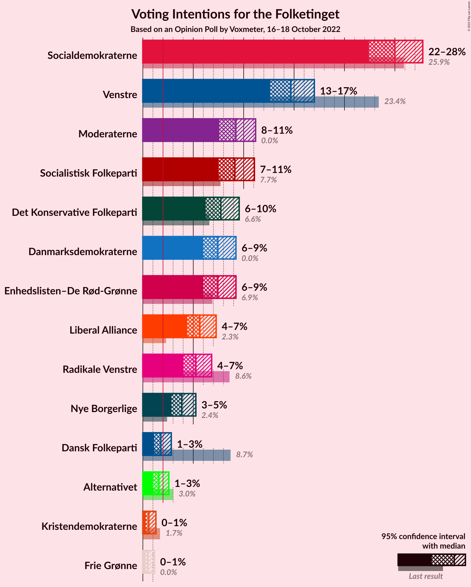
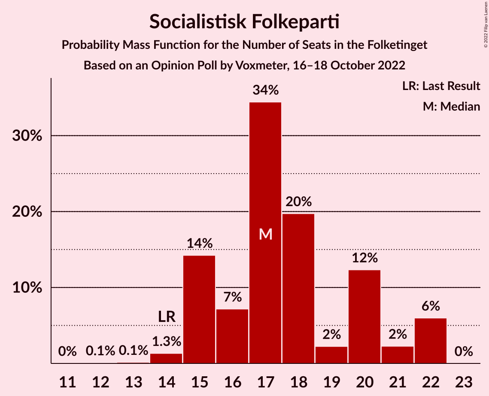
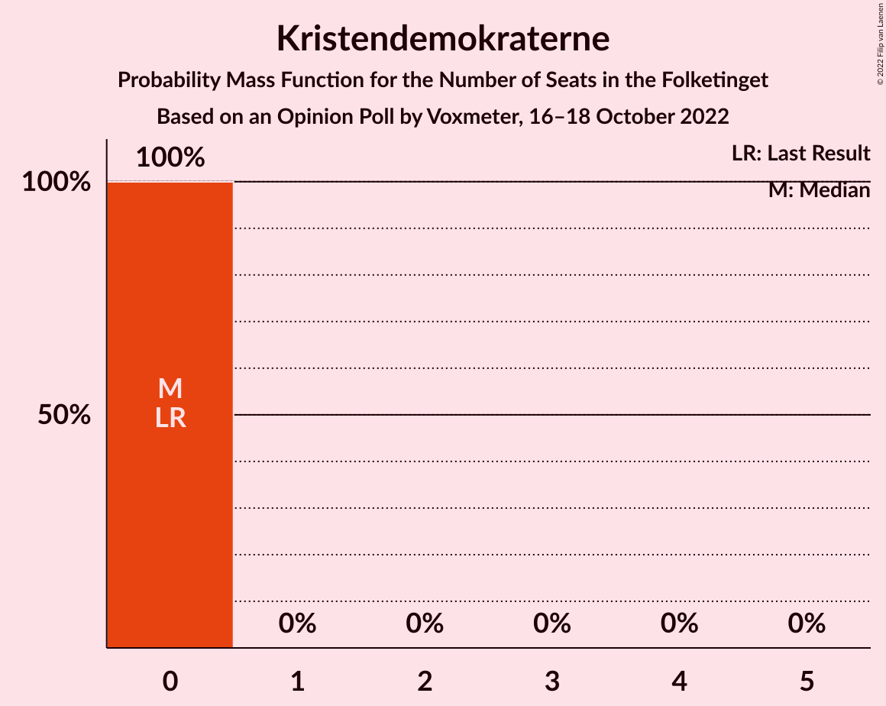

# Opinion Poll by Voxmeter, 16–18 October 2022

<a href="#voting-intentions">Voting Intentions</a> | <a href="#seats">Seats</a> | <a href="#coalitions">Coalitions</a> | <a href="#technical-information">Technical Information</a>

## Voting Intentions

### Confidence Intervals

| Party | Last Result | Poll Result | 80% Confidence Interval | 90% Confidence Interval | 95% Confidence Interval | 99% Confidence Interval |
|:-----:|:-----------:|:-----------:|:-----------------------:|:-----------------------:|:-----------------------:|:-----------------------:|
| Socialdemokraterne | 25.9% | 25.0% | 23.3–26.8% |22.8–27.3% |22.4–27.8% |21.6–28.7% |
| Venstre | 23.4% | 14.7% | 13.3–16.2% |13.0–16.6% |12.6–17.0% |12.0–17.8% |
| Moderaterne | 0.0% | 9.2% | 8.2–10.5% |7.8–10.9% |7.6–11.2% |7.1–11.8% |
| Socialistisk Folkeparti | 7.7% | 9.1% | 8.0–10.4% |7.8–10.8% |7.5–11.1% |7.0–11.7% |
| Det Konservative Folkeparti | 6.6% | 7.7% | 6.8–8.9% |6.5–9.3% |6.2–9.6% |5.8–10.2% |
| Enhedslisten–De Rød-Grønne | 6.9% | 7.4% | 6.5–8.6% |6.2–8.9% |6.0–9.2% |5.5–9.8% |
| Danmarksdemokraterne | 0.0% | 7.4% | 6.5–8.6% |6.2–8.9% |6.0–9.2% |5.5–9.8% |
| Liberal Alliance | 2.3% | 5.7% | 4.8–6.7% |4.6–7.0% |4.4–7.3% |4.0–7.8% |
| Radikale Venstre | 8.6% | 5.3% | 4.5–6.3% |4.2–6.6% |4.0–6.8% |3.7–7.3% |
| Nye Borgerlige | 2.4% | 3.9% | 3.2–4.8% |3.0–5.0% |2.8–5.3% |2.5–5.7% |
| Dansk Folkeparti | 8.7% | 1.8% | 1.4–2.5% |1.2–2.6% |1.1–2.8% |0.9–3.2% |
| Alternativet | 3.0% | 1.6% | 1.2–2.2% |1.1–2.4% |1.0–2.6% |0.8–2.9% |
| Kristendemokraterne | 1.7% | 0.6% | 0.4–1.1% |0.3–1.2% |0.3–1.3% |0.2–1.6% |
| Frie Grønne | 0.0% | 0.5% | 0.3–0.9% |0.3–1.1% |0.2–1.2% |0.2–1.4% |

*Note:* The poll result column reflects the actual value used in the calculations. Published results may vary slightly, and in addition be rounded to fewer digits.

## Seats

### Confidence Intervals

| Party | Last Result | Median | 80% Confidence Interval | 90% Confidence Interval | 95% Confidence Interval | 99% Confidence Interval |
|:-----:|:-----------:|:------:|:-----------------------:|:-----------------------:|:-----------------------:|:-----------------------:|
| <a href="#socialdemokraterne">Socialdemokraterne</a> | 48 | 46 | 43–48 |43–48 |41–48 |40–50 |
| <a href="#venstre">Venstre</a> | 43 | 26 | 25–30 |24–30 |23–30 |23–33 |
| <a href="#moderaterne">Moderaterne</a> | 0 | 17 | 15–19 |15–19 |14–19 |13–21 |
| <a href="#socialistisk-folkeparti">Socialistisk Folkeparti</a> | 14 | 17 | 15–20 |15–22 |15–22 |14–22 |
| <a href="#det-konservative-folkeparti">Det Konservative Folkeparti</a> | 12 | 14 | 12–15 |12–16 |11–16 |11–16 |
| <a href="#enhedslisten–de-rød-grønne">Enhedslisten–De Rød-Grønne</a> | 13 | 13 | 11–15 |11–16 |11–16 |11–18 |
| <a href="#danmarksdemokraterne">Danmarksdemokraterne</a> | 0 | 13 | 10–15 |10–15 |10–16 |10–18 |
| <a href="#liberal-alliance">Liberal Alliance</a> | 4 | 9 | 8–12 |8–13 |8–13 |7–13 |
| <a href="#radikale-venstre">Radikale Venstre</a> | 16 | 10 | 8–11 |8–12 |8–12 |8–12 |
| <a href="#nye-borgerlige">Nye Borgerlige</a> | 4 | 6 | 5–7 |5–8 |5–8 |4–10 |
| <a href="#dansk-folkeparti">Dansk Folkeparti</a> | 16 | 4 | 0–5 |0–5 |0–5 |0–5 |
| <a href="#alternativet">Alternativet</a> | 5 | 0 | 0–4 |0–4 |0–4 |0–5 |
| <a href="#kristendemokraterne">Kristendemokraterne</a> | 0 | 0 | 0 |0 |0 |0 |
| <a href="#frie-grønne">Frie Grønne</a> | 0 | 0 | 0 |0 |0 |0 |

### Socialdemokraterne

*For a full overview of the results for this party, see the [Socialdemokraterne](party-socialdemokraterne.html) page.*

| Number of Seats | Probability | Accumulated | Special Marks |
|:---------------:|:-----------:|:-----------:|:-------------:|
| 38 | 0% | 100% |  |
| 39 | 0.3% | 99.9% |  |
| 40 | 1.3% | 99.6% |  |
| 41 | 0.9% | 98% |  |
| 42 | 0.9% | 97% |  |
| 43 | 16% | 96% |  |
| 44 | 3% | 80% |  |
| 45 | 4% | 78% |  |
| 46 | 43% | 74% | Median |
| 47 | 4% | 31% |  |
| 48 | 26% | 28% | Last Result |
| 49 | 0.2% | 1.2% |  |
| 50 | 0.9% | 0.9% |  |
| 51 | 0% | 0.1% |  |
| 52 | 0% | 0% |  |

### Venstre

*For a full overview of the results for this party, see the [Venstre](party-venstre.html) page.*

| Number of Seats | Probability | Accumulated | Special Marks |
|:---------------:|:-----------:|:-----------:|:-------------:|
| 21 | 0.1% | 100% |  |
| 22 | 0.4% | 99.9% |  |
| 23 | 2% | 99.5% |  |
| 24 | 6% | 97% |  |
| 25 | 16% | 91% |  |
| 26 | 39% | 75% | Median |
| 27 | 16% | 36% |  |
| 28 | 4% | 19% |  |
| 29 | 0.7% | 15% |  |
| 30 | 13% | 15% |  |
| 31 | 0.3% | 1.2% |  |
| 32 | 0.3% | 0.9% |  |
| 33 | 0.5% | 0.6% |  |
| 34 | 0.1% | 0.1% |  |
| 35 | 0% | 0% |  |
| 36 | 0% | 0% |  |
| 37 | 0% | 0% |  |
| 38 | 0% | 0% |  |
| 39 | 0% | 0% |  |
| 40 | 0% | 0% |  |
| 41 | 0% | 0% |  |
| 42 | 0% | 0% |  |
| 43 | 0% | 0% | Last Result |

### Moderaterne

*For a full overview of the results for this party, see the [Moderaterne](party-moderaterne.html) page.*

| Number of Seats | Probability | Accumulated | Special Marks |
|:---------------:|:-----------:|:-----------:|:-------------:|
| 0 | 0% | 100% | Last Result |
| 1 | 0% | 100% |  |
| 2 | 0% | 100% |  |
| 3 | 0% | 100% |  |
| 4 | 0% | 100% |  |
| 5 | 0% | 100% |  |
| 6 | 0% | 100% |  |
| 7 | 0% | 100% |  |
| 8 | 0% | 100% |  |
| 9 | 0% | 100% |  |
| 10 | 0% | 100% |  |
| 11 | 0% | 100% |  |
| 12 | 0% | 100% |  |
| 13 | 1.3% | 99.9% |  |
| 14 | 3% | 98.7% |  |
| 15 | 9% | 96% |  |
| 16 | 13% | 87% |  |
| 17 | 30% | 74% | Median |
| 18 | 16% | 44% |  |
| 19 | 27% | 28% |  |
| 20 | 0.1% | 1.5% |  |
| 21 | 1.3% | 1.4% |  |
| 22 | 0% | 0% |  |

### Socialistisk Folkeparti

*For a full overview of the results for this party, see the [Socialistisk Folkeparti](party-socialistiskfolkeparti.html) page.*

| Number of Seats | Probability | Accumulated | Special Marks |
|:---------------:|:-----------:|:-----------:|:-------------:|
| 12 | 0.1% | 100% |  |
| 13 | 0.1% | 99.9% |  |
| 14 | 1.3% | 99.7% | Last Result |
| 15 | 14% | 98% |  |
| 16 | 7% | 84% |  |
| 17 | 34% | 77% | Median |
| 18 | 20% | 43% |  |
| 19 | 2% | 23% |  |
| 20 | 12% | 21% |  |
| 21 | 2% | 8% |  |
| 22 | 6% | 6% |  |
| 23 | 0% | 0% |  |

### Det Konservative Folkeparti

*For a full overview of the results for this party, see the [Det Konservative Folkeparti](party-detkonservativefolkeparti.html) page.*

| Number of Seats | Probability | Accumulated | Special Marks |
|:---------------:|:-----------:|:-----------:|:-------------:|
| 10 | 0.1% | 100% |  |
| 11 | 3% | 99.9% |  |
| 12 | 24% | 97% | Last Result |
| 13 | 22% | 73% |  |
| 14 | 31% | 51% | Median |
| 15 | 14% | 20% |  |
| 16 | 6% | 6% |  |
| 17 | 0.2% | 0.3% |  |
| 18 | 0.1% | 0.2% |  |
| 19 | 0.1% | 0.1% |  |
| 20 | 0% | 0% |  |

### Enhedslisten–De Rød-Grønne

*For a full overview of the results for this party, see the [Enhedslisten–De Rød-Grønne](party-enhedslisten–derød-grønne.html) page.*

| Number of Seats | Probability | Accumulated | Special Marks |
|:---------------:|:-----------:|:-----------:|:-------------:|
| 9 | 0.2% | 100% |  |
| 10 | 0.2% | 99.8% |  |
| 11 | 17% | 99.6% |  |
| 12 | 10% | 82% |  |
| 13 | 44% | 72% | Last Result, Median |
| 14 | 9% | 28% |  |
| 15 | 13% | 20% |  |
| 16 | 5% | 6% |  |
| 17 | 0% | 1.3% |  |
| 18 | 1.2% | 1.2% |  |
| 19 | 0% | 0.1% |  |
| 20 | 0% | 0% |  |

### Danmarksdemokraterne

*For a full overview of the results for this party, see the [Danmarksdemokraterne](party-danmarksdemokraterne.html) page.*

| Number of Seats | Probability | Accumulated | Special Marks |
|:---------------:|:-----------:|:-----------:|:-------------:|
| 0 | 0% | 100% | Last Result |
| 1 | 0% | 100% |  |
| 2 | 0% | 100% |  |
| 3 | 0% | 100% |  |
| 4 | 0% | 100% |  |
| 5 | 0% | 100% |  |
| 6 | 0% | 100% |  |
| 7 | 0% | 100% |  |
| 8 | 0% | 100% |  |
| 9 | 0.1% | 100% |  |
| 10 | 26% | 99.9% |  |
| 11 | 6% | 74% |  |
| 12 | 0.8% | 68% |  |
| 13 | 41% | 67% | Median |
| 14 | 9% | 26% |  |
| 15 | 14% | 17% |  |
| 16 | 1.2% | 3% |  |
| 17 | 1.0% | 2% |  |
| 18 | 0.5% | 0.5% |  |
| 19 | 0% | 0% |  |

### Liberal Alliance

*For a full overview of the results for this party, see the [Liberal Alliance](party-liberalalliance.html) page.*

| Number of Seats | Probability | Accumulated | Special Marks |
|:---------------:|:-----------:|:-----------:|:-------------:|
| 4 | 0% | 100% | Last Result |
| 5 | 0% | 100% |  |
| 6 | 0% | 100% |  |
| 7 | 1.4% | 100% |  |
| 8 | 40% | 98.5% |  |
| 9 | 14% | 58% | Median |
| 10 | 18% | 45% |  |
| 11 | 4% | 27% |  |
| 12 | 15% | 23% |  |
| 13 | 8% | 8% |  |
| 14 | 0.4% | 0.4% |  |
| 15 | 0% | 0% |  |

### Radikale Venstre

*For a full overview of the results for this party, see the [Radikale Venstre](party-radikalevenstre.html) page.*

| Number of Seats | Probability | Accumulated | Special Marks |
|:---------------:|:-----------:|:-----------:|:-------------:|
| 6 | 0.1% | 100% |  |
| 7 | 0.3% | 99.9% |  |
| 8 | 10% | 99.6% |  |
| 9 | 34% | 90% |  |
| 10 | 32% | 56% | Median |
| 11 | 17% | 24% |  |
| 12 | 6% | 7% |  |
| 13 | 0.1% | 0.3% |  |
| 14 | 0.1% | 0.2% |  |
| 15 | 0.1% | 0.1% |  |
| 16 | 0% | 0% | Last Result |

### Nye Borgerlige

*For a full overview of the results for this party, see the [Nye Borgerlige](party-nyeborgerlige.html) page.*

| Number of Seats | Probability | Accumulated | Special Marks |
|:---------------:|:-----------:|:-----------:|:-------------:|
| 4 | 1.1% | 100% | Last Result |
| 5 | 18% | 98.9% |  |
| 6 | 44% | 81% | Median |
| 7 | 32% | 37% |  |
| 8 | 4% | 6% |  |
| 9 | 0.8% | 2% |  |
| 10 | 1.0% | 1.1% |  |
| 11 | 0.1% | 0.1% |  |
| 12 | 0% | 0% |  |

### Dansk Folkeparti

*For a full overview of the results for this party, see the [Dansk Folkeparti](party-danskfolkeparti.html) page.*

| Number of Seats | Probability | Accumulated | Special Marks |
|:---------------:|:-----------:|:-----------:|:-------------:|
| 0 | 43% | 100% |  |
| 1 | 0% | 57% |  |
| 2 | 0% | 57% |  |
| 3 | 0% | 57% |  |
| 4 | 43% | 57% | Median |
| 5 | 13% | 13% |  |
| 6 | 0.1% | 0.1% |  |
| 7 | 0% | 0% |  |
| 8 | 0% | 0% |  |
| 9 | 0% | 0% |  |
| 10 | 0% | 0% |  |
| 11 | 0% | 0% |  |
| 12 | 0% | 0% |  |
| 13 | 0% | 0% |  |
| 14 | 0% | 0% |  |
| 15 | 0% | 0% |  |
| 16 | 0% | 0% | Last Result |

### Alternativet

*For a full overview of the results for this party, see the [Alternativet](party-alternativet.html) page.*

| Number of Seats | Probability | Accumulated | Special Marks |
|:---------------:|:-----------:|:-----------:|:-------------:|
| 0 | 86% | 100% | Median |
| 1 | 0% | 14% |  |
| 2 | 0% | 14% |  |
| 3 | 0% | 14% |  |
| 4 | 14% | 14% |  |
| 5 | 0.7% | 0.7% | Last Result |
| 6 | 0% | 0% |  |

### Kristendemokraterne

*For a full overview of the results for this party, see the [Kristendemokraterne](party-kristendemokraterne.html) page.*

| Number of Seats | Probability | Accumulated | Special Marks |
|:---------------:|:-----------:|:-----------:|:-------------:|
| 0 | 100% | 100% | Last Result, Median |

### Frie Grønne

*For a full overview of the results for this party, see the [Frie Grønne](party-friegrønne.html) page.*

| Number of Seats | Probability | Accumulated | Special Marks |
|:---------------:|:-----------:|:-----------:|:-------------:|
| 0 | 100% | 100% | Last Result, Median |

## Coalitions

### Confidence Intervals

| Coalition | Last Result | Median | Majority? | 80% Confidence Interval | 90% Confidence Interval | 95% Confidence Interval | 99% Confidence Interval |
|:---------:|:-----------:|:------:|:---------:|:-----------------------:|:-----------------------:|:-----------------------:|:-----------------------:|
| Socialdemokraterne – Socialistisk Folkeparti – Enhedslisten–De Rød-Grønne – Radikale Venstre – Alternativet | 96 | 86 | 12% | 84–92 | 84–94 | 81–95 | 79–95 |
| Socialdemokraterne – Socialistisk Folkeparti – Enhedslisten–De Rød-Grønne – Radikale Venstre | 91 | 86 | 9% | 84–89 | 83–90 | 81–91 | 79–91 |
| Socialdemokraterne – Socialistisk Folkeparti – Enhedslisten–De Rød-Grønne – Alternativet | 80 | 77 | 0% | 74–82 | 73–86 | 72–86 | 69–86 |
| Socialdemokraterne – Socialistisk Folkeparti – Enhedslisten–De Rød-Grønne | 75 | 77 | 0% | 73–80 | 73–82 | 71–82 | 69–82 |
| Socialdemokraterne – Socialistisk Folkeparti – Radikale Venstre | 78 | 75 | 0% | 70–75 | 70–76 | 67–76 | 63–77 |
| Venstre – Det Konservative Folkeparti – Danmarksdemokraterne – Liberal Alliance – Nye Borgerlige – Dansk Folkeparti – Kristendemokraterne | 79 | 71 | 0% | 68–75 | 66–75 | 63–75 | 63–80 |
| Venstre – Det Konservative Folkeparti – Liberal Alliance – Nye Borgerlige – Dansk Folkeparti – Kristendemokraterne | 79 | 58 | 0% | 53–61 | 52–62 | 52–62 | 52–68 |
| Venstre – Det Konservative Folkeparti – Liberal Alliance – Nye Borgerlige – Dansk Folkeparti | 79 | 58 | 0% | 53–61 | 52–62 | 52–62 | 52–68 |
| Socialdemokraterne – Radikale Venstre | 64 | 55 | 0% | 54–58 | 52–58 | 51–58 | 48–58 |
| Venstre – Det Konservative Folkeparti – Liberal Alliance – Dansk Folkeparti – Kristendemokraterne | 75 | 52 | 0% | 48–55 | 45–55 | 45–55 | 45–59 |
| Venstre – Det Konservative Folkeparti – Liberal Alliance – Dansk Folkeparti | 75 | 52 | 0% | 48–55 | 45–55 | 45–55 | 45–59 |
| Venstre – Det Konservative Folkeparti – Liberal Alliance | 59 | 48 | 0% | 47–54 | 45–55 | 45–55 | 45–58 |
| Venstre – Det Konservative Folkeparti | 55 | 40 | 0% | 38–42 | 37–46 | 37–46 | 36–46 |
| Venstre | 43 | 26 | 0% | 25–30 | 24–30 | 23–30 | 23–33 |

### Socialdemokraterne – Socialistisk Folkeparti – Enhedslisten–De Rød-Grønne – Radikale Venstre – Alternativet

| Number of Seats | Probability | Accumulated | Special Marks |
|:---------------:|:-----------:|:-----------:|:-------------:|
| 77 | 0% | 100% |  |
| 78 | 0% | 99.9% |  |
| 79 | 2% | 99.9% |  |
| 80 | 0.4% | 98% |  |
| 81 | 0.3% | 98% |  |
| 82 | 0.3% | 97% |  |
| 83 | 0.2% | 97% |  |
| 84 | 7% | 97% |  |
| 85 | 32% | 90% |  |
| 86 | 14% | 58% | Median |
| 87 | 1.3% | 44% |  |
| 88 | 28% | 43% |  |
| 89 | 3% | 15% |  |
| 90 | 2% | 12% | Majority |
| 91 | 0.1% | 10% |  |
| 92 | 0.4% | 10% |  |
| 93 | 1.1% | 10% |  |
| 94 | 6% | 9% |  |
| 95 | 3% | 3% |  |
| 96 | 0% | 0% | Last Result |

### Socialdemokraterne – Socialistisk Folkeparti – Enhedslisten–De Rød-Grønne – Radikale Venstre

| Number of Seats | Probability | Accumulated | Special Marks |
|:---------------:|:-----------:|:-----------:|:-------------:|
| 75 | 0% | 100% |  |
| 76 | 0% | 99.9% |  |
| 77 | 0.1% | 99.9% |  |
| 78 | 0% | 99.9% |  |
| 79 | 2% | 99.8% |  |
| 80 | 0.4% | 98% |  |
| 81 | 0.9% | 98% |  |
| 82 | 2% | 97% |  |
| 83 | 0.7% | 95% |  |
| 84 | 7% | 95% |  |
| 85 | 32% | 87% |  |
| 86 | 14% | 55% | Median |
| 87 | 0.5% | 41% |  |
| 88 | 28% | 41% |  |
| 89 | 4% | 13% |  |
| 90 | 6% | 9% | Majority |
| 91 | 3% | 3% | Last Result |
| 92 | 0% | 0.2% |  |
| 93 | 0.1% | 0.1% |  |
| 94 | 0% | 0% |  |

### Socialdemokraterne – Socialistisk Folkeparti – Enhedslisten–De Rød-Grønne – Alternativet

| Number of Seats | Probability | Accumulated | Special Marks |
|:---------------:|:-----------:|:-----------:|:-------------:|
| 67 | 0% | 100% |  |
| 68 | 0% | 99.9% |  |
| 69 | 0.4% | 99.9% |  |
| 70 | 0.2% | 99.5% |  |
| 71 | 1.5% | 99.3% |  |
| 72 | 0.6% | 98% |  |
| 73 | 5% | 97% |  |
| 74 | 14% | 92% |  |
| 75 | 8% | 78% |  |
| 76 | 14% | 69% | Median |
| 77 | 13% | 55% |  |
| 78 | 29% | 42% |  |
| 79 | 0.2% | 13% |  |
| 80 | 0.3% | 13% | Last Result |
| 81 | 0.9% | 12% |  |
| 82 | 2% | 11% |  |
| 83 | 0% | 9% |  |
| 84 | 1.0% | 9% |  |
| 85 | 3% | 9% |  |
| 86 | 6% | 6% |  |
| 87 | 0% | 0% |  |

### Socialdemokraterne – Socialistisk Folkeparti – Enhedslisten–De Rød-Grønne

| Number of Seats | Probability | Accumulated | Special Marks |
|:---------------:|:-----------:|:-----------:|:-------------:|
| 66 | 0% | 100% |  |
| 67 | 0% | 99.9% |  |
| 68 | 0.1% | 99.9% |  |
| 69 | 0.5% | 99.8% |  |
| 70 | 0.2% | 99.4% |  |
| 71 | 2% | 99.1% |  |
| 72 | 2% | 97% |  |
| 73 | 6% | 95% |  |
| 74 | 14% | 90% |  |
| 75 | 8% | 75% | Last Result |
| 76 | 13% | 67% | Median |
| 77 | 12% | 54% |  |
| 78 | 31% | 42% |  |
| 79 | 0% | 10% |  |
| 80 | 1.2% | 10% |  |
| 81 | 3% | 9% |  |
| 82 | 6% | 6% |  |
| 83 | 0% | 0% |  |

### Socialdemokraterne – Socialistisk Folkeparti – Radikale Venstre

| Number of Seats | Probability | Accumulated | Special Marks |
|:---------------:|:-----------:|:-----------:|:-------------:|
| 63 | 1.3% | 100% |  |
| 64 | 0% | 98.7% |  |
| 65 | 0.4% | 98.7% |  |
| 66 | 0.3% | 98% |  |
| 67 | 0.8% | 98% |  |
| 68 | 0.2% | 97% |  |
| 69 | 1.4% | 97% |  |
| 70 | 12% | 96% |  |
| 71 | 3% | 83% |  |
| 72 | 23% | 80% |  |
| 73 | 2% | 57% | Median |
| 74 | 5% | 55% |  |
| 75 | 42% | 50% |  |
| 76 | 6% | 8% |  |
| 77 | 2% | 2% |  |
| 78 | 0% | 0.1% | Last Result |
| 79 | 0% | 0.1% |  |
| 80 | 0.1% | 0.1% |  |
| 81 | 0% | 0% |  |

### Venstre – Det Konservative Folkeparti – Danmarksdemokraterne – Liberal Alliance – Nye Borgerlige – Dansk Folkeparti – Kristendemokraterne

| Number of Seats | Probability | Accumulated | Special Marks |
|:---------------:|:-----------:|:-----------:|:-------------:|
| 63 | 3% | 100% |  |
| 64 | 0% | 97% |  |
| 65 | 0% | 97% |  |
| 66 | 7% | 97% |  |
| 67 | 0.3% | 91% |  |
| 68 | 29% | 90% |  |
| 69 | 1.2% | 62% |  |
| 70 | 0.3% | 60% |  |
| 71 | 16% | 60% |  |
| 72 | 0.2% | 45% | Median |
| 73 | 27% | 44% |  |
| 74 | 6% | 17% |  |
| 75 | 9% | 12% |  |
| 76 | 0.6% | 2% |  |
| 77 | 0.6% | 2% |  |
| 78 | 0.2% | 1.0% |  |
| 79 | 0.1% | 0.8% | Last Result |
| 80 | 0.5% | 0.7% |  |
| 81 | 0.1% | 0.2% |  |
| 82 | 0.1% | 0.1% |  |
| 83 | 0% | 0% |  |

### Venstre – Det Konservative Folkeparti – Liberal Alliance – Nye Borgerlige – Dansk Folkeparti – Kristendemokraterne

| Number of Seats | Probability | Accumulated | Special Marks |
|:---------------:|:-----------:|:-----------:|:-------------:|
| 52 | 9% | 100% |  |
| 53 | 1.2% | 91% |  |
| 54 | 0.3% | 89% |  |
| 55 | 0.5% | 89% |  |
| 56 | 2% | 89% |  |
| 57 | 3% | 87% |  |
| 58 | 51% | 84% |  |
| 59 | 2% | 33% | Median |
| 60 | 15% | 31% |  |
| 61 | 7% | 16% |  |
| 62 | 7% | 9% |  |
| 63 | 0.4% | 1.5% |  |
| 64 | 0.2% | 1.0% |  |
| 65 | 0.1% | 0.9% |  |
| 66 | 0% | 0.8% |  |
| 67 | 0.1% | 0.8% |  |
| 68 | 0.5% | 0.7% |  |
| 69 | 0% | 0.2% |  |
| 70 | 0.1% | 0.1% |  |
| 71 | 0% | 0% |  |
| 72 | 0% | 0% |  |
| 73 | 0% | 0% |  |
| 74 | 0% | 0% |  |
| 75 | 0% | 0% |  |
| 76 | 0% | 0% |  |
| 77 | 0% | 0% |  |
| 78 | 0% | 0% |  |
| 79 | 0% | 0% | Last Result |

### Venstre – Det Konservative Folkeparti – Liberal Alliance – Nye Borgerlige – Dansk Folkeparti

| Number of Seats | Probability | Accumulated | Special Marks |
|:---------------:|:-----------:|:-----------:|:-------------:|
| 52 | 9% | 100% |  |
| 53 | 1.2% | 91% |  |
| 54 | 0.3% | 89% |  |
| 55 | 0.5% | 89% |  |
| 56 | 2% | 89% |  |
| 57 | 3% | 87% |  |
| 58 | 51% | 84% |  |
| 59 | 2% | 33% | Median |
| 60 | 15% | 31% |  |
| 61 | 7% | 16% |  |
| 62 | 7% | 9% |  |
| 63 | 0.4% | 1.4% |  |
| 64 | 0.1% | 1.0% |  |
| 65 | 0.1% | 0.9% |  |
| 66 | 0% | 0.8% |  |
| 67 | 0.1% | 0.8% |  |
| 68 | 0.5% | 0.7% |  |
| 69 | 0% | 0.2% |  |
| 70 | 0.1% | 0.1% |  |
| 71 | 0% | 0% |  |
| 72 | 0% | 0% |  |
| 73 | 0% | 0% |  |
| 74 | 0% | 0% |  |
| 75 | 0% | 0% |  |
| 76 | 0% | 0% |  |
| 77 | 0% | 0% |  |
| 78 | 0% | 0% |  |
| 79 | 0% | 0% | Last Result |

### Socialdemokraterne – Radikale Venstre

| Number of Seats | Probability | Accumulated | Special Marks |
|:---------------:|:-----------:|:-----------:|:-------------:|
| 47 | 0% | 100% |  |
| 48 | 1.4% | 99.9% |  |
| 49 | 0.1% | 98.6% |  |
| 50 | 0.2% | 98% |  |
| 51 | 0.9% | 98% |  |
| 52 | 3% | 97% |  |
| 53 | 2% | 94% |  |
| 54 | 21% | 93% |  |
| 55 | 33% | 72% |  |
| 56 | 3% | 40% | Median |
| 57 | 4% | 37% |  |
| 58 | 32% | 32% |  |
| 59 | 0% | 0.3% |  |
| 60 | 0% | 0.3% |  |
| 61 | 0.1% | 0.2% |  |
| 62 | 0.1% | 0.1% |  |
| 63 | 0% | 0% |  |
| 64 | 0% | 0% | Last Result |

### Venstre – Det Konservative Folkeparti – Liberal Alliance – Dansk Folkeparti – Kristendemokraterne

| Number of Seats | Probability | Accumulated | Special Marks |
|:---------------:|:-----------:|:-----------:|:-------------:|
| 45 | 6% | 100% |  |
| 46 | 4% | 94% |  |
| 47 | 0.2% | 91% |  |
| 48 | 0.9% | 90% |  |
| 49 | 4% | 89% |  |
| 50 | 0.7% | 86% |  |
| 51 | 14% | 85% |  |
| 52 | 39% | 71% |  |
| 53 | 2% | 32% | Median |
| 54 | 7% | 30% |  |
| 55 | 22% | 23% |  |
| 56 | 0.5% | 2% |  |
| 57 | 0.3% | 1.2% |  |
| 58 | 0.3% | 0.9% |  |
| 59 | 0.1% | 0.5% |  |
| 60 | 0% | 0.5% |  |
| 61 | 0.2% | 0.5% |  |
| 62 | 0.2% | 0.2% |  |
| 63 | 0% | 0.1% |  |
| 64 | 0.1% | 0.1% |  |
| 65 | 0% | 0% |  |
| 66 | 0% | 0% |  |
| 67 | 0% | 0% |  |
| 68 | 0% | 0% |  |
| 69 | 0% | 0% |  |
| 70 | 0% | 0% |  |
| 71 | 0% | 0% |  |
| 72 | 0% | 0% |  |
| 73 | 0% | 0% |  |
| 74 | 0% | 0% |  |
| 75 | 0% | 0% | Last Result |

### Venstre – Det Konservative Folkeparti – Liberal Alliance – Dansk Folkeparti

| Number of Seats | Probability | Accumulated | Special Marks |
|:---------------:|:-----------:|:-----------:|:-------------:|
| 45 | 6% | 100% |  |
| 46 | 4% | 94% |  |
| 47 | 0.2% | 91% |  |
| 48 | 0.9% | 90% |  |
| 49 | 4% | 89% |  |
| 50 | 0.7% | 86% |  |
| 51 | 14% | 85% |  |
| 52 | 39% | 71% |  |
| 53 | 2% | 32% | Median |
| 54 | 7% | 30% |  |
| 55 | 22% | 23% |  |
| 56 | 0.5% | 2% |  |
| 57 | 0.3% | 1.2% |  |
| 58 | 0.3% | 0.9% |  |
| 59 | 0.1% | 0.5% |  |
| 60 | 0% | 0.5% |  |
| 61 | 0.2% | 0.5% |  |
| 62 | 0.2% | 0.2% |  |
| 63 | 0% | 0.1% |  |
| 64 | 0.1% | 0.1% |  |
| 65 | 0% | 0% |  |
| 66 | 0% | 0% |  |
| 67 | 0% | 0% |  |
| 68 | 0% | 0% |  |
| 69 | 0% | 0% |  |
| 70 | 0% | 0% |  |
| 71 | 0% | 0% |  |
| 72 | 0% | 0% |  |
| 73 | 0% | 0% |  |
| 74 | 0% | 0% |  |
| 75 | 0% | 0% | Last Result |

### Venstre – Det Konservative Folkeparti – Liberal Alliance

| Number of Seats | Probability | Accumulated | Special Marks |
|:---------------:|:-----------:|:-----------:|:-------------:|
| 42 | 0.1% | 100% |  |
| 43 | 0% | 99.9% |  |
| 44 | 0% | 99.9% |  |
| 45 | 6% | 99.8% |  |
| 46 | 4% | 94% |  |
| 47 | 14% | 90% |  |
| 48 | 27% | 77% |  |
| 49 | 5% | 50% | Median |
| 50 | 0.8% | 45% |  |
| 51 | 27% | 44% |  |
| 52 | 1.0% | 17% |  |
| 53 | 2% | 16% |  |
| 54 | 6% | 14% |  |
| 55 | 7% | 8% |  |
| 56 | 0.5% | 1.1% |  |
| 57 | 0% | 0.5% |  |
| 58 | 0.4% | 0.5% |  |
| 59 | 0.1% | 0.1% | Last Result |
| 60 | 0% | 0% |  |

### Venstre – Det Konservative Folkeparti

| Number of Seats | Probability | Accumulated | Special Marks |
|:---------------:|:-----------:|:-----------:|:-------------:|
| 32 | 0.1% | 100% |  |
| 33 | 0% | 99.9% |  |
| 34 | 0.1% | 99.9% |  |
| 35 | 0.2% | 99.8% |  |
| 36 | 0.2% | 99.6% |  |
| 37 | 8% | 99.4% |  |
| 38 | 16% | 91% |  |
| 39 | 18% | 75% |  |
| 40 | 27% | 57% | Median |
| 41 | 13% | 30% |  |
| 42 | 9% | 17% |  |
| 43 | 0.2% | 8% |  |
| 44 | 2% | 8% |  |
| 45 | 0% | 6% |  |
| 46 | 5% | 6% |  |
| 47 | 0% | 0.5% |  |
| 48 | 0.3% | 0.4% |  |
| 49 | 0.1% | 0.1% |  |
| 50 | 0% | 0% |  |
| 51 | 0% | 0% |  |
| 52 | 0% | 0% |  |
| 53 | 0% | 0% |  |
| 54 | 0% | 0% |  |
| 55 | 0% | 0% | Last Result |

### Venstre

| Number of Seats | Probability | Accumulated | Special Marks |
|:---------------:|:-----------:|:-----------:|:-------------:|
| 21 | 0.1% | 100% |  |
| 22 | 0.4% | 99.9% |  |
| 23 | 2% | 99.5% |  |
| 24 | 6% | 97% |  |
| 25 | 16% | 91% |  |
| 26 | 39% | 75% | Median |
| 27 | 16% | 36% |  |
| 28 | 4% | 19% |  |
| 29 | 0.7% | 15% |  |
| 30 | 13% | 15% |  |
| 31 | 0.3% | 1.2% |  |
| 32 | 0.3% | 0.9% |  |
| 33 | 0.5% | 0.6% |  |
| 34 | 0.1% | 0.1% |  |
| 35 | 0% | 0% |  |
| 36 | 0% | 0% |  |
| 37 | 0% | 0% |  |
| 38 | 0% | 0% |  |
| 39 | 0% | 0% |  |
| 40 | 0% | 0% |  |
| 41 | 0% | 0% |  |
| 42 | 0% | 0% |  |
| 43 | 0% | 0% | Last Result |

## Technical Information

### Opinion Poll

+ **Polling firm:** Voxmeter
+ **Commissioner(s):** —
+ **Fieldwork period:** 16–18 October 2022

### Calculations

+ **Sample size:** 1008
+ **Simulations done:** 1,048,576
+ **Error estimate:** 2.61%

