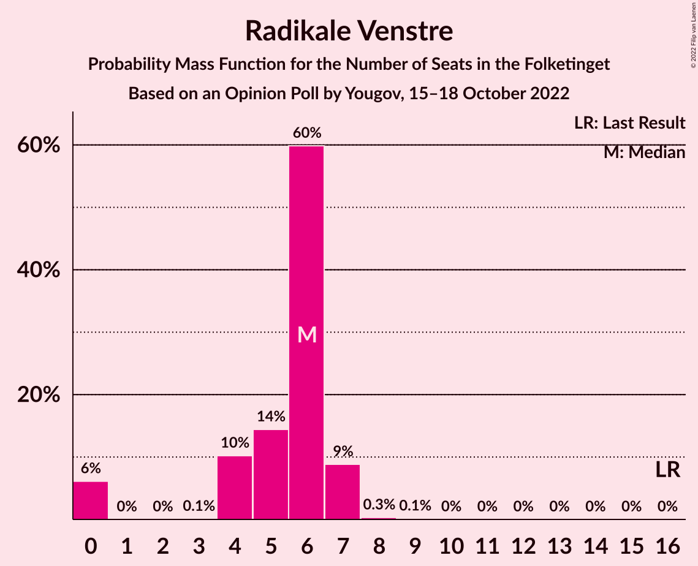

# Opinion Poll by Yougov, 15–18 October 2022

<a href="#voting-intentions">Voting Intentions</a> | <a href="#seats">Seats</a> | <a href="#coalitions">Coalitions</a> | <a href="#technical-information">Technical Information</a>

## Voting Intentions

### Confidence Intervals

| Party | Last Result | Poll Result | 80% Confidence Interval | 90% Confidence Interval | 95% Confidence Interval | 99% Confidence Interval |
|:-----:|:-----------:|:-----------:|:-----------------------:|:-----------------------:|:-----------------------:|:-----------------------:|
| Socialdemokraterne | 25.9% | 30.3% | 28.7–32.0% |28.3–32.4% |27.9–32.8% |27.2–33.6% |
| Venstre | 23.4% | 10.6% | 9.6–11.7% |9.3–12.1% |9.0–12.3% |8.6–12.9% |
| Danmarksdemokraterne | 0.0% | 8.3% | 7.4–9.3% |7.1–9.6% |6.9–9.9% |6.5–10.4% |
| Det Konservative Folkeparti | 6.6% | 8.0% | 7.1–9.0% |6.8–9.3% |6.6–9.5% |6.2–10.1% |
| Moderaterne | 0.0% | 7.9% | 7.0–8.9% |6.8–9.2% |6.6–9.5% |6.2–10.0% |
| Socialistisk Folkeparti | 7.7% | 7.2% | 6.4–8.2% |6.2–8.5% |5.9–8.7% |5.6–9.2% |
| Liberal Alliance | 2.3% | 6.8% | 6.0–7.7% |5.7–8.0% |5.5–8.3% |5.2–8.7% |
| Enhedslisten–De Rød-Grønne | 6.9% | 5.3% | 4.6–6.2% |4.4–6.4% |4.2–6.6% |3.9–7.1% |
| Nye Borgerlige | 2.4% | 5.1% | 4.4–5.9% |4.2–6.2% |4.0–6.4% |3.7–6.8% |
| Radikale Venstre | 8.6% | 3.1% | 2.6–3.8% |2.4–4.0% |2.3–4.2% |2.1–4.6% |
| Dansk Folkeparti | 8.7% | 2.8% | 2.3–3.5% |2.2–3.7% |2.1–3.9% |1.8–4.2% |
| Alternativet | 3.0% | 2.3% | 1.9–2.9% |1.7–3.1% |1.6–3.3% |1.4–3.6% |
| Frie Grønne | 0.0% | 1.6% | 1.2–2.1% |1.1–2.3% |1.0–2.4% |0.9–2.7% |
| Kristendemokraterne | 1.7% | 0.5% | 0.3–0.9% |0.3–1.0% |0.2–1.1% |0.2–1.3% |

*Note:* The poll result column reflects the actual value used in the calculations. Published results may vary slightly, and in addition be rounded to fewer digits.

## Seats

### Confidence Intervals

| Party | Last Result | Median | 80% Confidence Interval | 90% Confidence Interval | 95% Confidence Interval | 99% Confidence Interval |
|:-----:|:-----------:|:------:|:-----------------------:|:-----------------------:|:-----------------------:|:-----------------------:|
| <a href="#socialdemokraterne">Socialdemokraterne</a> | 48 | 55 | 51–57 |49–58 |49–58 |49–59 |
| <a href="#venstre">Venstre</a> | 43 | 21 | 18–21 |17–21 |17–21 |16–23 |
| <a href="#danmarksdemokraterne">Danmarksdemokraterne</a> | 0 | 17 | 14–17 |13–17 |13–17 |12–18 |
| <a href="#det-konservative-folkeparti">Det Konservative Folkeparti</a> | 12 | 13 | 13–16 |13–16 |12–16 |11–18 |
| <a href="#moderaterne">Moderaterne</a> | 0 | 15 | 13–16 |13–16 |12–17 |10–18 |
| <a href="#socialistisk-folkeparti">Socialistisk Folkeparti</a> | 14 | 11 | 11–13 |11–15 |11–17 |10–17 |
| <a href="#liberal-alliance">Liberal Alliance</a> | 4 | 10 | 10–13 |10–13 |10–14 |9–16 |
| <a href="#enhedslisten–de-rød-grønne">Enhedslisten–De Rød-Grønne</a> | 13 | 8 | 8–11 |7–12 |7–12 |7–13 |
| <a href="#nye-borgerlige">Nye Borgerlige</a> | 4 | 9 | 8–10 |7–11 |6–12 |6–12 |
| <a href="#radikale-venstre">Radikale Venstre</a> | 16 | 6 | 4–6 |0–7 |0–7 |0–7 |
| <a href="#dansk-folkeparti">Dansk Folkeparti</a> | 16 | 6 | 4–7 |4–7 |0–7 |0–7 |
| <a href="#alternativet">Alternativet</a> | 5 | 4 | 4 |0–5 |0–6 |0–6 |
| <a href="#frie-grønne">Frie Grønne</a> | 0 | 0 | 0–4 |0–4 |0–4 |0–5 |
| <a href="#kristendemokraterne">Kristendemokraterne</a> | 0 | 0 | 0 |0 |0 |0 |

### Socialdemokraterne

*For a full overview of the results for this party, see the [Socialdemokraterne](party-socialdemokraterne.html) page.*

| Number of Seats | Probability | Accumulated | Special Marks |
|:---------------:|:-----------:|:-----------:|:-------------:|
| 46 | 0.1% | 100% |  |
| 47 | 0.1% | 99.9% |  |
| 48 | 0.3% | 99.8% | Last Result |
| 49 | 7% | 99.5% |  |
| 50 | 2% | 92% |  |
| 51 | 3% | 90% |  |
| 52 | 2% | 87% |  |
| 53 | 1.3% | 85% |  |
| 54 | 0.2% | 84% |  |
| 55 | 61% | 84% | Median |
| 56 | 9% | 22% |  |
| 57 | 4% | 13% |  |
| 58 | 9% | 9% |  |
| 59 | 0.5% | 0.8% |  |
| 60 | 0% | 0.2% |  |
| 61 | 0.2% | 0.2% |  |
| 62 | 0% | 0% |  |

### Venstre

*For a full overview of the results for this party, see the [Venstre](party-venstre.html) page.*

| Number of Seats | Probability | Accumulated | Special Marks |
|:---------------:|:-----------:|:-----------:|:-------------:|
| 15 | 0.4% | 100% |  |
| 16 | 1.3% | 99.6% |  |
| 17 | 6% | 98% |  |
| 18 | 7% | 92% |  |
| 19 | 21% | 86% |  |
| 20 | 7% | 65% |  |
| 21 | 57% | 59% | Median |
| 22 | 1.5% | 2% |  |
| 23 | 0.6% | 0.6% |  |
| 24 | 0% | 0% |  |
| 25 | 0% | 0% |  |
| 26 | 0% | 0% |  |
| 27 | 0% | 0% |  |
| 28 | 0% | 0% |  |
| 29 | 0% | 0% |  |
| 30 | 0% | 0% |  |
| 31 | 0% | 0% |  |
| 32 | 0% | 0% |  |
| 33 | 0% | 0% |  |
| 34 | 0% | 0% |  |
| 35 | 0% | 0% |  |
| 36 | 0% | 0% |  |
| 37 | 0% | 0% |  |
| 38 | 0% | 0% |  |
| 39 | 0% | 0% |  |
| 40 | 0% | 0% |  |
| 41 | 0% | 0% |  |
| 42 | 0% | 0% |  |
| 43 | 0% | 0% | Last Result |

### Danmarksdemokraterne

*For a full overview of the results for this party, see the [Danmarksdemokraterne](party-danmarksdemokraterne.html) page.*

| Number of Seats | Probability | Accumulated | Special Marks |
|:---------------:|:-----------:|:-----------:|:-------------:|
| 0 | 0% | 100% | Last Result |
| 1 | 0% | 100% |  |
| 2 | 0% | 100% |  |
| 3 | 0% | 100% |  |
| 4 | 0% | 100% |  |
| 5 | 0% | 100% |  |
| 6 | 0% | 100% |  |
| 7 | 0% | 100% |  |
| 8 | 0% | 100% |  |
| 9 | 0% | 100% |  |
| 10 | 0% | 100% |  |
| 11 | 0.1% | 100% |  |
| 12 | 0.5% | 99.9% |  |
| 13 | 5% | 99.5% |  |
| 14 | 4% | 94% |  |
| 15 | 17% | 90% |  |
| 16 | 14% | 73% |  |
| 17 | 57% | 58% | Median |
| 18 | 1.1% | 2% |  |
| 19 | 0.3% | 0.4% |  |
| 20 | 0.1% | 0.1% |  |
| 21 | 0% | 0% |  |

### Det Konservative Folkeparti

*For a full overview of the results for this party, see the [Det Konservative Folkeparti](party-detkonservativefolkeparti.html) page.*

| Number of Seats | Probability | Accumulated | Special Marks |
|:---------------:|:-----------:|:-----------:|:-------------:|
| 10 | 0.4% | 100% |  |
| 11 | 1.4% | 99.6% |  |
| 12 | 2% | 98% | Last Result |
| 13 | 68% | 96% | Median |
| 14 | 3% | 28% |  |
| 15 | 12% | 25% |  |
| 16 | 10% | 13% |  |
| 17 | 2% | 2% |  |
| 18 | 0.7% | 0.8% |  |
| 19 | 0.1% | 0.1% |  |
| 20 | 0% | 0% |  |

### Moderaterne

*For a full overview of the results for this party, see the [Moderaterne](party-moderaterne.html) page.*

| Number of Seats | Probability | Accumulated | Special Marks |
|:---------------:|:-----------:|:-----------:|:-------------:|
| 0 | 0% | 100% | Last Result |
| 1 | 0% | 100% |  |
| 2 | 0% | 100% |  |
| 3 | 0% | 100% |  |
| 4 | 0% | 100% |  |
| 5 | 0% | 100% |  |
| 6 | 0% | 100% |  |
| 7 | 0% | 100% |  |
| 8 | 0% | 100% |  |
| 9 | 0% | 100% |  |
| 10 | 1.4% | 100% |  |
| 11 | 0.9% | 98.6% |  |
| 12 | 2% | 98% |  |
| 13 | 8% | 96% |  |
| 14 | 13% | 88% |  |
| 15 | 63% | 76% | Median |
| 16 | 10% | 13% |  |
| 17 | 2% | 3% |  |
| 18 | 0.6% | 0.7% |  |
| 19 | 0% | 0% |  |

### Socialistisk Folkeparti

*For a full overview of the results for this party, see the [Socialistisk Folkeparti](party-socialistiskfolkeparti.html) page.*

| Number of Seats | Probability | Accumulated | Special Marks |
|:---------------:|:-----------:|:-----------:|:-------------:|
| 9 | 0.1% | 100% |  |
| 10 | 2% | 99.9% |  |
| 11 | 63% | 98% | Median |
| 12 | 22% | 35% |  |
| 13 | 6% | 13% |  |
| 14 | 2% | 7% | Last Result |
| 15 | 1.0% | 5% |  |
| 16 | 0.4% | 4% |  |
| 17 | 4% | 4% |  |
| 18 | 0% | 0% |  |

### Liberal Alliance

*For a full overview of the results for this party, see the [Liberal Alliance](party-liberalalliance.html) page.*

| Number of Seats | Probability | Accumulated | Special Marks |
|:---------------:|:-----------:|:-----------:|:-------------:|
| 4 | 0% | 100% | Last Result |
| 5 | 0% | 100% |  |
| 6 | 0% | 100% |  |
| 7 | 0% | 100% |  |
| 8 | 0% | 100% |  |
| 9 | 0.9% | 100% |  |
| 10 | 57% | 99.1% | Median |
| 11 | 10% | 42% |  |
| 12 | 19% | 31% |  |
| 13 | 8% | 12% |  |
| 14 | 3% | 4% |  |
| 15 | 1.1% | 2% |  |
| 16 | 0.6% | 0.6% |  |
| 17 | 0% | 0% |  |

### Enhedslisten–De Rød-Grønne

*For a full overview of the results for this party, see the [Enhedslisten–De Rød-Grønne](party-enhedslisten–derød-grønne.html) page.*

| Number of Seats | Probability | Accumulated | Special Marks |
|:---------------:|:-----------:|:-----------:|:-------------:|
| 7 | 5% | 100% |  |
| 8 | 58% | 95% | Median |
| 9 | 11% | 37% |  |
| 10 | 13% | 26% |  |
| 11 | 4% | 12% |  |
| 12 | 7% | 8% |  |
| 13 | 0.8% | 0.9% | Last Result |
| 14 | 0.1% | 0.1% |  |
| 15 | 0% | 0% |  |

### Nye Borgerlige

*For a full overview of the results for this party, see the [Nye Borgerlige](party-nyeborgerlige.html) page.*

| Number of Seats | Probability | Accumulated | Special Marks |
|:---------------:|:-----------:|:-----------:|:-------------:|
| 4 | 0% | 100% | Last Result |
| 5 | 0% | 100% |  |
| 6 | 4% | 100% |  |
| 7 | 2% | 96% |  |
| 8 | 9% | 94% |  |
| 9 | 66% | 85% | Median |
| 10 | 12% | 19% |  |
| 11 | 2% | 7% |  |
| 12 | 5% | 5% |  |
| 13 | 0.1% | 0.1% |  |
| 14 | 0% | 0% |  |

### Radikale Venstre

*For a full overview of the results for this party, see the [Radikale Venstre](party-radikalevenstre.html) page.*

| Number of Seats | Probability | Accumulated | Special Marks |
|:---------------:|:-----------:|:-----------:|:-------------:|
| 0 | 6% | 100% |  |
| 1 | 0% | 94% |  |
| 2 | 0% | 94% |  |
| 3 | 0.1% | 94% |  |
| 4 | 10% | 94% |  |
| 5 | 14% | 84% |  |
| 6 | 60% | 69% | Median |
| 7 | 9% | 9% |  |
| 8 | 0.3% | 0.5% |  |
| 9 | 0.1% | 0.2% |  |
| 10 | 0% | 0% |  |
| 11 | 0% | 0% |  |
| 12 | 0% | 0% |  |
| 13 | 0% | 0% |  |
| 14 | 0% | 0% |  |
| 15 | 0% | 0% |  |
| 16 | 0% | 0% | Last Result |

### Dansk Folkeparti

*For a full overview of the results for this party, see the [Dansk Folkeparti](party-danskfolkeparti.html) page.*

| Number of Seats | Probability | Accumulated | Special Marks |
|:---------------:|:-----------:|:-----------:|:-------------:|
| 0 | 4% | 100% |  |
| 1 | 0% | 96% |  |
| 2 | 0% | 96% |  |
| 3 | 0% | 96% |  |
| 4 | 9% | 96% |  |
| 5 | 7% | 87% |  |
| 6 | 66% | 81% | Median |
| 7 | 14% | 15% |  |
| 8 | 0.3% | 0.3% |  |
| 9 | 0% | 0% |  |
| 10 | 0% | 0% |  |
| 11 | 0% | 0% |  |
| 12 | 0% | 0% |  |
| 13 | 0% | 0% |  |
| 14 | 0% | 0% |  |
| 15 | 0% | 0% |  |
| 16 | 0% | 0% | Last Result |

### Alternativet

*For a full overview of the results for this party, see the [Alternativet](party-alternativet.html) page.*

| Number of Seats | Probability | Accumulated | Special Marks |
|:---------------:|:-----------:|:-----------:|:-------------:|
| 0 | 9% | 100% |  |
| 1 | 0% | 91% |  |
| 2 | 0% | 91% |  |
| 3 | 0% | 91% |  |
| 4 | 85% | 91% | Median |
| 5 | 3% | 7% | Last Result |
| 6 | 4% | 4% |  |
| 7 | 0.1% | 0.1% |  |
| 8 | 0% | 0% |  |

### Frie Grønne

*For a full overview of the results for this party, see the [Frie Grønne](party-friegrønne.html) page.*

| Number of Seats | Probability | Accumulated | Special Marks |
|:---------------:|:-----------:|:-----------:|:-------------:|
| 0 | 87% | 100% | Last Result, Median |
| 1 | 0% | 13% |  |
| 2 | 0% | 13% |  |
| 3 | 0% | 13% |  |
| 4 | 12% | 13% |  |
| 5 | 1.0% | 1.0% |  |
| 6 | 0% | 0% |  |

### Kristendemokraterne

*For a full overview of the results for this party, see the [Kristendemokraterne](party-kristendemokraterne.html) page.*

| Number of Seats | Probability | Accumulated | Special Marks |
|:---------------:|:-----------:|:-----------:|:-------------:|
| 0 | 100% | 100% | Last Result, Median |

## Coalitions

### Confidence Intervals

| Coalition | Last Result | Median | Majority? | 80% Confidence Interval | 90% Confidence Interval | 95% Confidence Interval | 99% Confidence Interval |
|:---------:|:-----------:|:------:|:---------:|:-----------------------:|:-----------------------:|:-----------------------:|:-----------------------:|
| Socialdemokraterne – Socialistisk Folkeparti – Enhedslisten–De Rød-Grønne – Radikale Venstre – Alternativet | 96 | 84 | 1.1% | 82–86 | 81–88 | 81–89 | 79–92 |
| Socialdemokraterne – Socialistisk Folkeparti – Enhedslisten–De Rød-Grønne – Radikale Venstre | 91 | 80 | 0.2% | 78–82 | 77–87 | 77–89 | 75–89 |
| Socialdemokraterne – Socialistisk Folkeparti – Enhedslisten–De Rød-Grønne – Alternativet | 80 | 78 | 0% | 77–83 | 77–84 | 77–84 | 74–86 |
| Socialdemokraterne – Socialistisk Folkeparti – Enhedslisten–De Rød-Grønne | 75 | 74 | 0% | 73–80 | 73–80 | 73–84 | 69–84 |
| Venstre – Danmarksdemokraterne – Det Konservative Folkeparti – Liberal Alliance – Nye Borgerlige – Dansk Folkeparti – Kristendemokraterne | 79 | 76 | 0% | 73–76 | 72–77 | 72–80 | 68–81 |
| Socialdemokraterne – Socialistisk Folkeparti – Radikale Venstre | 78 | 72 | 0% | 69–73 | 65–76 | 65–80 | 65–80 |
| Venstre – Det Konservative Folkeparti – Liberal Alliance – Nye Borgerlige – Dansk Folkeparti – Kristendemokraterne | 79 | 59 | 0% | 57–61 | 57–62 | 57–64 | 54–67 |
| Venstre – Det Konservative Folkeparti – Liberal Alliance – Nye Borgerlige – Dansk Folkeparti | 79 | 59 | 0% | 57–61 | 57–62 | 57–64 | 54–67 |
| Socialdemokraterne – Radikale Venstre | 64 | 61 | 0% | 56–62 | 53–63 | 53–63 | 53–66 |
| Venstre – Det Konservative Folkeparti – Liberal Alliance – Dansk Folkeparti – Kristendemokraterne | 75 | 50 | 0% | 50–51 | 48–53 | 45–55 | 45–56 |
| Venstre – Det Konservative Folkeparti – Liberal Alliance – Dansk Folkeparti | 75 | 50 | 0% | 50–51 | 48–53 | 45–55 | 45–56 |
| Venstre – Det Konservative Folkeparti – Liberal Alliance | 59 | 44 | 0% | 43–47 | 43–48 | 42–49 | 41–50 |
| Venstre – Det Konservative Folkeparti | 55 | 34 | 0% | 32–35 | 31–36 | 31–37 | 29–37 |
| Venstre | 43 | 21 | 0% | 18–21 | 17–21 | 17–21 | 16–23 |

### Socialdemokraterne – Socialistisk Folkeparti – Enhedslisten–De Rød-Grønne – Radikale Venstre – Alternativet

| Number of Seats | Probability | Accumulated | Special Marks |
|:---------------:|:-----------:|:-----------:|:-------------:|
| 77 | 0.3% | 100% |  |
| 78 | 0.1% | 99.7% |  |
| 79 | 0.3% | 99.6% |  |
| 80 | 0.2% | 99.3% |  |
| 81 | 7% | 99.1% |  |
| 82 | 3% | 92% |  |
| 83 | 1.2% | 89% |  |
| 84 | 65% | 87% | Median |
| 85 | 5% | 22% |  |
| 86 | 8% | 17% |  |
| 87 | 4% | 9% |  |
| 88 | 1.2% | 5% |  |
| 89 | 3% | 4% |  |
| 90 | 0.2% | 1.1% | Majority |
| 91 | 0.2% | 0.9% |  |
| 92 | 0.3% | 0.7% |  |
| 93 | 0.3% | 0.4% |  |
| 94 | 0.1% | 0.1% |  |
| 95 | 0% | 0% |  |
| 96 | 0% | 0% | Last Result |

### Socialdemokraterne – Socialistisk Folkeparti – Enhedslisten–De Rød-Grønne – Radikale Venstre

| Number of Seats | Probability | Accumulated | Special Marks |
|:---------------:|:-----------:|:-----------:|:-------------:|
| 73 | 0.2% | 100% |  |
| 74 | 0.1% | 99.7% |  |
| 75 | 0.2% | 99.6% |  |
| 76 | 0.1% | 99.4% |  |
| 77 | 7% | 99.2% |  |
| 78 | 3% | 93% |  |
| 79 | 2% | 90% |  |
| 80 | 65% | 88% | Median |
| 81 | 5% | 23% |  |
| 82 | 9% | 17% |  |
| 83 | 0.5% | 9% |  |
| 84 | 0.9% | 8% |  |
| 85 | 0.7% | 7% |  |
| 86 | 0.1% | 6% |  |
| 87 | 3% | 6% |  |
| 88 | 0.4% | 3% |  |
| 89 | 2% | 3% |  |
| 90 | 0.1% | 0.2% | Majority |
| 91 | 0% | 0.1% | Last Result |
| 92 | 0.1% | 0.1% |  |
| 93 | 0% | 0% |  |

### Socialdemokraterne – Socialistisk Folkeparti – Enhedslisten–De Rød-Grønne – Alternativet

| Number of Seats | Probability | Accumulated | Special Marks |
|:---------------:|:-----------:|:-----------:|:-------------:|
| 72 | 0.2% | 100% |  |
| 73 | 0.2% | 99.7% |  |
| 74 | 0.1% | 99.5% |  |
| 75 | 0.3% | 99.4% |  |
| 76 | 1.4% | 99.1% |  |
| 77 | 9% | 98% |  |
| 78 | 57% | 89% | Median |
| 79 | 11% | 33% |  |
| 80 | 7% | 22% | Last Result |
| 81 | 3% | 15% |  |
| 82 | 1.1% | 12% |  |
| 83 | 1.2% | 11% |  |
| 84 | 9% | 10% |  |
| 85 | 0.2% | 0.9% |  |
| 86 | 0.2% | 0.7% |  |
| 87 | 0.2% | 0.5% |  |
| 88 | 0.3% | 0.3% |  |
| 89 | 0% | 0% |  |

### Socialdemokraterne – Socialistisk Folkeparti – Enhedslisten–De Rød-Grønne

| Number of Seats | Probability | Accumulated | Special Marks |
|:---------------:|:-----------:|:-----------:|:-------------:|
| 68 | 0.3% | 100% |  |
| 69 | 0.2% | 99.6% |  |
| 70 | 0.1% | 99.5% |  |
| 71 | 0.3% | 99.4% |  |
| 72 | 1.5% | 99.1% |  |
| 73 | 9% | 98% |  |
| 74 | 55% | 89% | Median |
| 75 | 12% | 34% | Last Result |
| 76 | 4% | 22% |  |
| 77 | 3% | 18% |  |
| 78 | 2% | 16% |  |
| 79 | 0.3% | 13% |  |
| 80 | 9% | 13% |  |
| 81 | 0.5% | 4% |  |
| 82 | 0.4% | 3% |  |
| 83 | 0.1% | 3% |  |
| 84 | 2% | 3% |  |
| 85 | 0% | 0.1% |  |
| 86 | 0.1% | 0.1% |  |
| 87 | 0% | 0% |  |

### Venstre – Danmarksdemokraterne – Det Konservative Folkeparti – Liberal Alliance – Nye Borgerlige – Dansk Folkeparti – Kristendemokraterne

| Number of Seats | Probability | Accumulated | Special Marks |
|:---------------:|:-----------:|:-----------:|:-------------:|
| 66 | 0.2% | 100% |  |
| 67 | 0% | 99.8% |  |
| 68 | 0.4% | 99.7% |  |
| 69 | 0.4% | 99.4% |  |
| 70 | 0.1% | 99.0% |  |
| 71 | 1.2% | 98.8% |  |
| 72 | 4% | 98% |  |
| 73 | 7% | 94% |  |
| 74 | 2% | 87% |  |
| 75 | 20% | 84% |  |
| 76 | 57% | 65% | Median |
| 77 | 3% | 8% |  |
| 78 | 0.4% | 5% |  |
| 79 | 0.2% | 4% | Last Result |
| 80 | 4% | 4% |  |
| 81 | 0.1% | 0.6% |  |
| 82 | 0.4% | 0.5% |  |
| 83 | 0.1% | 0.1% |  |
| 84 | 0% | 0% |  |

### Socialdemokraterne – Socialistisk Folkeparti – Radikale Venstre

| Number of Seats | Probability | Accumulated | Special Marks |
|:---------------:|:-----------:|:-----------:|:-------------:|
| 63 | 0.1% | 100% |  |
| 64 | 0% | 99.9% |  |
| 65 | 7% | 99.9% |  |
| 66 | 0.4% | 93% |  |
| 67 | 0.2% | 93% |  |
| 68 | 3% | 93% |  |
| 69 | 1.2% | 90% |  |
| 70 | 9% | 89% |  |
| 71 | 3% | 80% |  |
| 72 | 57% | 77% | Median |
| 73 | 10% | 20% |  |
| 74 | 2% | 10% |  |
| 75 | 0.5% | 8% |  |
| 76 | 4% | 7% |  |
| 77 | 0.4% | 3% |  |
| 78 | 0.2% | 3% | Last Result |
| 79 | 0.1% | 3% |  |
| 80 | 3% | 3% |  |
| 81 | 0.1% | 0.1% |  |
| 82 | 0% | 0% |  |

### Venstre – Det Konservative Folkeparti – Liberal Alliance – Nye Borgerlige – Dansk Folkeparti – Kristendemokraterne

| Number of Seats | Probability | Accumulated | Special Marks |
|:---------------:|:-----------:|:-----------:|:-------------:|
| 52 | 0.2% | 100% |  |
| 53 | 0.1% | 99.8% |  |
| 54 | 0.6% | 99.7% |  |
| 55 | 0.3% | 99.1% |  |
| 56 | 1.2% | 98.8% |  |
| 57 | 8% | 98% |  |
| 58 | 2% | 90% |  |
| 59 | 64% | 88% | Median |
| 60 | 14% | 24% |  |
| 61 | 3% | 10% |  |
| 62 | 3% | 7% |  |
| 63 | 0.7% | 5% |  |
| 64 | 2% | 4% |  |
| 65 | 0.1% | 2% |  |
| 66 | 0.1% | 2% |  |
| 67 | 2% | 2% |  |
| 68 | 0.3% | 0.3% |  |
| 69 | 0% | 0% |  |
| 70 | 0% | 0% |  |
| 71 | 0% | 0% |  |
| 72 | 0% | 0% |  |
| 73 | 0% | 0% |  |
| 74 | 0% | 0% |  |
| 75 | 0% | 0% |  |
| 76 | 0% | 0% |  |
| 77 | 0% | 0% |  |
| 78 | 0% | 0% |  |
| 79 | 0% | 0% | Last Result |

### Venstre – Det Konservative Folkeparti – Liberal Alliance – Nye Borgerlige – Dansk Folkeparti

| Number of Seats | Probability | Accumulated | Special Marks |
|:---------------:|:-----------:|:-----------:|:-------------:|
| 52 | 0.2% | 100% |  |
| 53 | 0.1% | 99.8% |  |
| 54 | 0.6% | 99.7% |  |
| 55 | 0.3% | 99.1% |  |
| 56 | 1.2% | 98.8% |  |
| 57 | 8% | 98% |  |
| 58 | 2% | 90% |  |
| 59 | 64% | 88% | Median |
| 60 | 14% | 24% |  |
| 61 | 3% | 10% |  |
| 62 | 3% | 7% |  |
| 63 | 0.7% | 5% |  |
| 64 | 2% | 4% |  |
| 65 | 0.1% | 2% |  |
| 66 | 0.1% | 2% |  |
| 67 | 2% | 2% |  |
| 68 | 0.3% | 0.3% |  |
| 69 | 0% | 0% |  |
| 70 | 0% | 0% |  |
| 71 | 0% | 0% |  |
| 72 | 0% | 0% |  |
| 73 | 0% | 0% |  |
| 74 | 0% | 0% |  |
| 75 | 0% | 0% |  |
| 76 | 0% | 0% |  |
| 77 | 0% | 0% |  |
| 78 | 0% | 0% |  |
| 79 | 0% | 0% | Last Result |

### Socialdemokraterne – Radikale Venstre

| Number of Seats | Probability | Accumulated | Special Marks |
|:---------------:|:-----------:|:-----------:|:-------------:|
| 52 | 0.1% | 100% |  |
| 53 | 7% | 99.8% |  |
| 54 | 0.4% | 93% |  |
| 55 | 1.2% | 93% |  |
| 56 | 5% | 92% |  |
| 57 | 2% | 87% |  |
| 58 | 7% | 85% |  |
| 59 | 2% | 78% |  |
| 60 | 1.4% | 77% |  |
| 61 | 61% | 75% | Median |
| 62 | 7% | 14% |  |
| 63 | 6% | 8% |  |
| 64 | 0.5% | 1.1% | Last Result |
| 65 | 0% | 0.6% |  |
| 66 | 0.5% | 0.5% |  |
| 67 | 0% | 0% |  |

### Venstre – Det Konservative Folkeparti – Liberal Alliance – Dansk Folkeparti – Kristendemokraterne

| Number of Seats | Probability | Accumulated | Special Marks |
|:---------------:|:-----------:|:-----------:|:-------------:|
| 43 | 0% | 100% |  |
| 44 | 0.2% | 99.9% |  |
| 45 | 4% | 99.8% |  |
| 46 | 0.5% | 96% |  |
| 47 | 0.4% | 96% |  |
| 48 | 2% | 95% |  |
| 49 | 2% | 93% |  |
| 50 | 65% | 91% | Median |
| 51 | 17% | 26% |  |
| 52 | 1.4% | 9% |  |
| 53 | 4% | 8% |  |
| 54 | 0.4% | 4% |  |
| 55 | 2% | 4% |  |
| 56 | 1.4% | 2% |  |
| 57 | 0.3% | 0.4% |  |
| 58 | 0.1% | 0.1% |  |
| 59 | 0% | 0% |  |
| 60 | 0% | 0% |  |
| 61 | 0% | 0% |  |
| 62 | 0% | 0% |  |
| 63 | 0% | 0% |  |
| 64 | 0% | 0% |  |
| 65 | 0% | 0% |  |
| 66 | 0% | 0% |  |
| 67 | 0% | 0% |  |
| 68 | 0% | 0% |  |
| 69 | 0% | 0% |  |
| 70 | 0% | 0% |  |
| 71 | 0% | 0% |  |
| 72 | 0% | 0% |  |
| 73 | 0% | 0% |  |
| 74 | 0% | 0% |  |
| 75 | 0% | 0% | Last Result |

### Venstre – Det Konservative Folkeparti – Liberal Alliance – Dansk Folkeparti

| Number of Seats | Probability | Accumulated | Special Marks |
|:---------------:|:-----------:|:-----------:|:-------------:|
| 43 | 0% | 100% |  |
| 44 | 0.2% | 99.9% |  |
| 45 | 4% | 99.8% |  |
| 46 | 0.5% | 96% |  |
| 47 | 0.4% | 96% |  |
| 48 | 2% | 95% |  |
| 49 | 2% | 93% |  |
| 50 | 65% | 91% | Median |
| 51 | 17% | 26% |  |
| 52 | 1.4% | 9% |  |
| 53 | 4% | 8% |  |
| 54 | 0.4% | 4% |  |
| 55 | 2% | 4% |  |
| 56 | 1.4% | 2% |  |
| 57 | 0.3% | 0.4% |  |
| 58 | 0.1% | 0.1% |  |
| 59 | 0% | 0% |  |
| 60 | 0% | 0% |  |
| 61 | 0% | 0% |  |
| 62 | 0% | 0% |  |
| 63 | 0% | 0% |  |
| 64 | 0% | 0% |  |
| 65 | 0% | 0% |  |
| 66 | 0% | 0% |  |
| 67 | 0% | 0% |  |
| 68 | 0% | 0% |  |
| 69 | 0% | 0% |  |
| 70 | 0% | 0% |  |
| 71 | 0% | 0% |  |
| 72 | 0% | 0% |  |
| 73 | 0% | 0% |  |
| 74 | 0% | 0% |  |
| 75 | 0% | 0% | Last Result |

### Venstre – Det Konservative Folkeparti – Liberal Alliance

| Number of Seats | Probability | Accumulated | Special Marks |
|:---------------:|:-----------:|:-----------:|:-------------:|
| 39 | 0.1% | 100% |  |
| 40 | 0.3% | 99.9% |  |
| 41 | 0.7% | 99.6% |  |
| 42 | 2% | 98.9% |  |
| 43 | 7% | 97% |  |
| 44 | 61% | 90% | Median |
| 45 | 12% | 29% |  |
| 46 | 2% | 16% |  |
| 47 | 8% | 14% |  |
| 48 | 2% | 6% |  |
| 49 | 3% | 4% |  |
| 50 | 0.4% | 0.8% |  |
| 51 | 0.3% | 0.4% |  |
| 52 | 0% | 0.1% |  |
| 53 | 0% | 0% |  |
| 54 | 0% | 0% |  |
| 55 | 0% | 0% |  |
| 56 | 0% | 0% |  |
| 57 | 0% | 0% |  |
| 58 | 0% | 0% |  |
| 59 | 0% | 0% | Last Result |

### Venstre – Det Konservative Folkeparti

| Number of Seats | Probability | Accumulated | Special Marks |
|:---------------:|:-----------:|:-----------:|:-------------:|
| 27 | 0.1% | 100% |  |
| 28 | 0% | 99.9% |  |
| 29 | 1.0% | 99.8% |  |
| 30 | 1.2% | 98.8% |  |
| 31 | 4% | 98% |  |
| 32 | 17% | 93% |  |
| 33 | 5% | 77% |  |
| 34 | 55% | 71% | Median |
| 35 | 10% | 17% |  |
| 36 | 3% | 6% |  |
| 37 | 3% | 4% |  |
| 38 | 0.4% | 0.5% |  |
| 39 | 0.1% | 0.1% |  |
| 40 | 0% | 0% |  |
| 41 | 0% | 0% |  |
| 42 | 0% | 0% |  |
| 43 | 0% | 0% |  |
| 44 | 0% | 0% |  |
| 45 | 0% | 0% |  |
| 46 | 0% | 0% |  |
| 47 | 0% | 0% |  |
| 48 | 0% | 0% |  |
| 49 | 0% | 0% |  |
| 50 | 0% | 0% |  |
| 51 | 0% | 0% |  |
| 52 | 0% | 0% |  |
| 53 | 0% | 0% |  |
| 54 | 0% | 0% |  |
| 55 | 0% | 0% | Last Result |

### Venstre

| Number of Seats | Probability | Accumulated | Special Marks |
|:---------------:|:-----------:|:-----------:|:-------------:|
| 15 | 0.4% | 100% |  |
| 16 | 1.3% | 99.6% |  |
| 17 | 6% | 98% |  |
| 18 | 7% | 92% |  |
| 19 | 21% | 86% |  |
| 20 | 7% | 65% |  |
| 21 | 57% | 59% | Median |
| 22 | 1.5% | 2% |  |
| 23 | 0.6% | 0.6% |  |
| 24 | 0% | 0% |  |
| 25 | 0% | 0% |  |
| 26 | 0% | 0% |  |
| 27 | 0% | 0% |  |
| 28 | 0% | 0% |  |
| 29 | 0% | 0% |  |
| 30 | 0% | 0% |  |
| 31 | 0% | 0% |  |
| 32 | 0% | 0% |  |
| 33 | 0% | 0% |  |
| 34 | 0% | 0% |  |
| 35 | 0% | 0% |  |
| 36 | 0% | 0% |  |
| 37 | 0% | 0% |  |
| 38 | 0% | 0% |  |
| 39 | 0% | 0% |  |
| 40 | 0% | 0% |  |
| 41 | 0% | 0% |  |
| 42 | 0% | 0% |  |
| 43 | 0% | 0% | Last Result |

## Technical Information

### Opinion Poll

+ **Polling firm:** Yougov
+ **Commissioner(s):** —
+ **Fieldwork period:** 15–18 October 2022

### Calculations

+ **Sample size:** 1343
+ **Simulations done:** 1,048,576
+ **Error estimate:** 1.19%

