# Opinion Poll by Voxmeter, 19–21 October 2022

<a href="#voting-intentions">Voting Intentions</a> | <a href="#seats">Seats</a> | <a href="#coalitions">Coalitions</a> | <a href="#technical-information">Technical Information</a>

## Voting Intentions

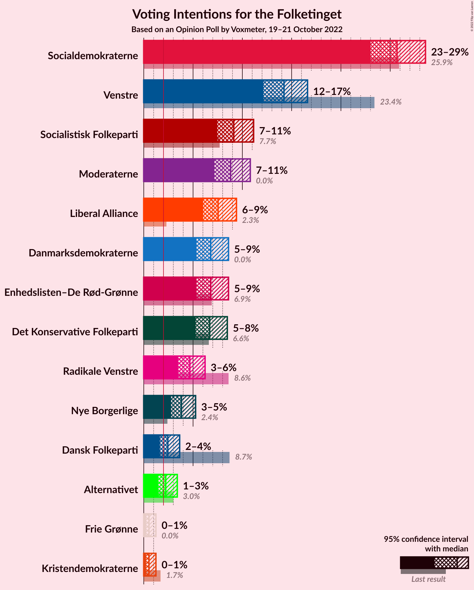

### Confidence Intervals

| Party | Last Result | Poll Result | 80% Confidence Interval | 90% Confidence Interval | 95% Confidence Interval | 99% Confidence Interval |
|:-----:|:-----------:|:-----------:|:-----------------------:|:-----------------------:|:-----------------------:|:-----------------------:|
| Socialdemokraterne | 25.9% | 25.7% | 23.9–27.6% |23.4–28.1% |23.0–28.6% |22.2–29.5% |
| Venstre | 23.4% | 14.2% | 12.8–15.8% |12.5–16.2% |12.1–16.6% |11.5–17.4% |
| Socialistisk Folkeparti | 7.7% | 9.1% | 8.0–10.4% |7.7–10.8% |7.5–11.1% |7.0–11.8% |
| Moderaterne | 0.0% | 8.8% | 7.7–10.1% |7.4–10.5% |7.2–10.8% |6.7–11.4% |
| Liberal Alliance | 2.3% | 7.5% | 6.5–8.8% |6.2–9.1% |6.0–9.4% |5.6–10.0% |
| Enhedslisten–De Rød-Grønne | 6.9% | 6.8% | 5.8–8.0% |5.6–8.3% |5.3–8.6% |4.9–9.2% |
| Danmarksdemokraterne | 0.0% | 6.8% | 5.8–8.0% |5.6–8.3% |5.3–8.6% |4.9–9.2% |
| Det Konservative Folkeparti | 6.6% | 6.7% | 5.7–7.8% |5.5–8.2% |5.3–8.5% |4.8–9.1% |
| Radikale Venstre | 8.6% | 4.7% | 3.9–5.7% |3.7–6.0% |3.5–6.2% |3.2–6.7% |
| Nye Borgerlige | 2.4% | 3.8% | 3.1–4.8% |2.9–5.0% |2.8–5.3% |2.5–5.7% |
| Dansk Folkeparti | 8.7% | 2.4% | 1.9–3.2% |1.8–3.4% |1.6–3.6% |1.4–4.1% |
| Alternativet | 3.0% | 2.2% | 1.7–3.0% |1.6–3.2% |1.5–3.4% |1.2–3.8% |
| Kristendemokraterne | 1.7% | 0.5% | 0.3–1.0% |0.3–1.1% |0.2–1.2% |0.2–1.5% |
| Frie Grønne | 0.0% | 0.5% | 0.3–1.0% |0.3–1.1% |0.2–1.2% |0.2–1.5% |

*Note:* The poll result column reflects the actual value used in the calculations. Published results may vary slightly, and in addition be rounded to fewer digits.

## Seats

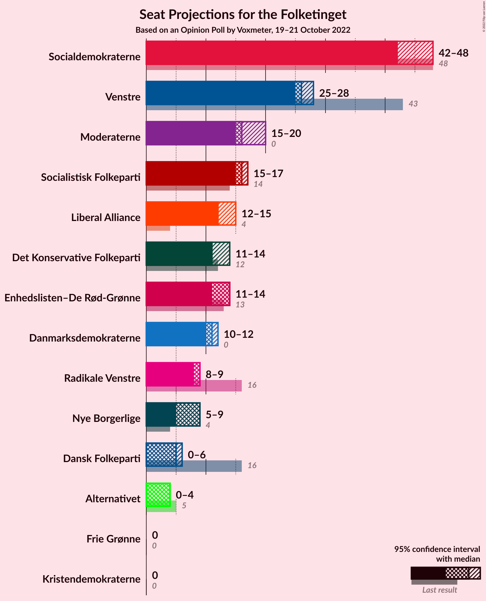

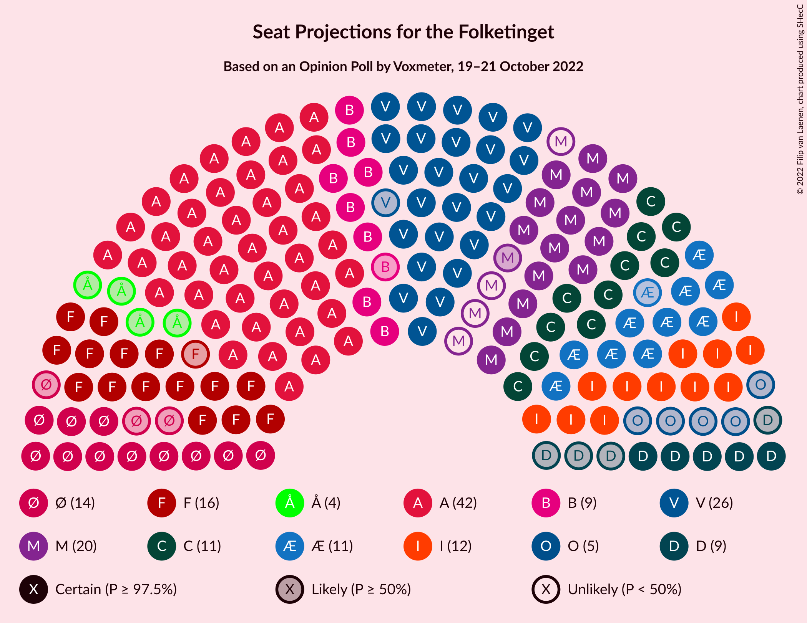

### Confidence Intervals

| Party | Last Result | Median | 80% Confidence Interval | 90% Confidence Interval | 95% Confidence Interval | 99% Confidence Interval |
|:-----:|:-----------:|:------:|:-----------------------:|:-----------------------:|:-----------------------:|:-----------------------:|
| <a href="#socialdemokraterne">Socialdemokraterne</a> | 48 | 42 | 42–43 |42–45 |42–48 |40–50 |
| <a href="#venstre">Venstre</a> | 43 | 26 | 26 |25–26 |25–28 |22–29 |
| <a href="#socialistisk-folkeparti">Socialistisk Folkeparti</a> | 14 | 16 | 16 |15–16 |15–17 |13–20 |
| <a href="#moderaterne">Moderaterne</a> | 0 | 16 | 16–18 |16–20 |15–20 |13–20 |
| <a href="#liberal-alliance">Liberal Alliance</a> | 4 | 12 | 12–14 |12–14 |12–15 |10–17 |
| <a href="#enhedslisten–de-rød-grønne">Enhedslisten–De Rød-Grønne</a> | 13 | 14 | 13–14 |13–14 |11–14 |9–15 |
| <a href="#danmarksdemokraterne">Danmarksdemokraterne</a> | 0 | 11 | 11–12 |11–12 |10–12 |9–14 |
| <a href="#det-konservative-folkeparti">Det Konservative Folkeparti</a> | 12 | 11 | 11–13 |11–14 |11–14 |9–14 |
| <a href="#radikale-venstre">Radikale Venstre</a> | 16 | 9 | 8–9 |8–9 |8–9 |6–11 |
| <a href="#nye-borgerlige">Nye Borgerlige</a> | 4 | 9 | 6–9 |5–9 |5–9 |4–11 |
| <a href="#dansk-folkeparti">Dansk Folkeparti</a> | 16 | 5 | 5 |4–6 |0–6 |0–6 |
| <a href="#alternativet">Alternativet</a> | 5 | 4 | 4 |0–4 |0–4 |0–5 |
| <a href="#kristendemokraterne">Kristendemokraterne</a> | 0 | 0 | 0 |0 |0 |0 |
| <a href="#frie-grønne">Frie Grønne</a> | 0 | 0 | 0 |0 |0 |0 |

### Socialdemokraterne

*For a full overview of the results for this party, see the [Socialdemokraterne](party-socialdemokraterne.html) page.*

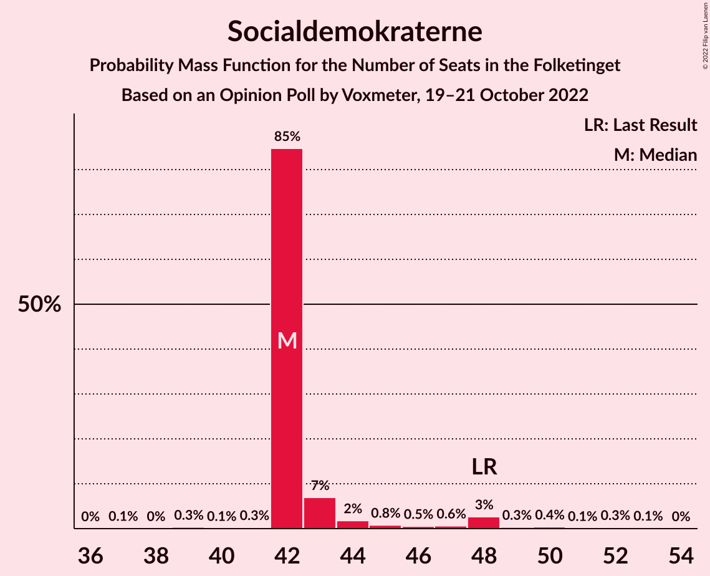

| Number of Seats | Probability | Accumulated | Special Marks |
|:---------------:|:-----------:|:-----------:|:-------------:|
| 37 | 0.1% | 100% |  |
| 38 | 0% | 99.9% |  |
| 39 | 0.3% | 99.9% |  |
| 40 | 0.1% | 99.5% |  |
| 41 | 0.3% | 99.5% |  |
| 42 | 85% | 99.2% | Median |
| 43 | 7% | 14% |  |
| 44 | 2% | 8% |  |
| 45 | 0.8% | 6% |  |
| 46 | 0.5% | 5% |  |
| 47 | 0.6% | 4% |  |
| 48 | 3% | 4% | Last Result |
| 49 | 0.3% | 1.2% |  |
| 50 | 0.4% | 0.9% |  |
| 51 | 0.1% | 0.5% |  |
| 52 | 0.3% | 0.4% |  |
| 53 | 0.1% | 0.1% |  |
| 54 | 0% | 0% |  |

### Venstre

*For a full overview of the results for this party, see the [Venstre](party-venstre.html) page.*

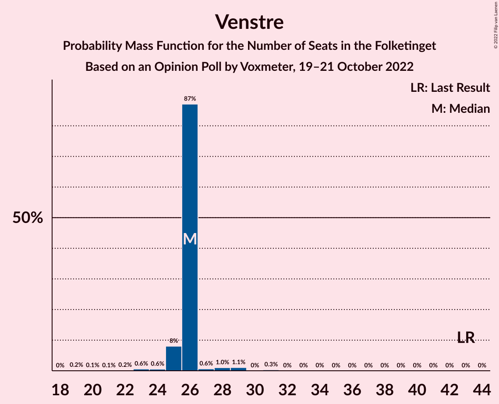

| Number of Seats | Probability | Accumulated | Special Marks |
|:---------------:|:-----------:|:-----------:|:-------------:|
| 19 | 0.2% | 100% |  |
| 20 | 0.1% | 99.8% |  |
| 21 | 0.1% | 99.7% |  |
| 22 | 0.2% | 99.7% |  |
| 23 | 0.6% | 99.5% |  |
| 24 | 0.6% | 98.9% |  |
| 25 | 8% | 98% |  |
| 26 | 87% | 90% | Median |
| 27 | 0.6% | 3% |  |
| 28 | 1.0% | 3% |  |
| 29 | 1.1% | 1.5% |  |
| 30 | 0% | 0.4% |  |
| 31 | 0.3% | 0.4% |  |
| 32 | 0% | 0.1% |  |
| 33 | 0% | 0.1% |  |
| 34 | 0% | 0% |  |
| 35 | 0% | 0% |  |
| 36 | 0% | 0% |  |
| 37 | 0% | 0% |  |
| 38 | 0% | 0% |  |
| 39 | 0% | 0% |  |
| 40 | 0% | 0% |  |
| 41 | 0% | 0% |  |
| 42 | 0% | 0% |  |
| 43 | 0% | 0% | Last Result |

### Socialistisk Folkeparti

*For a full overview of the results for this party, see the [Socialistisk Folkeparti](party-socialistiskfolkeparti.html) page.*

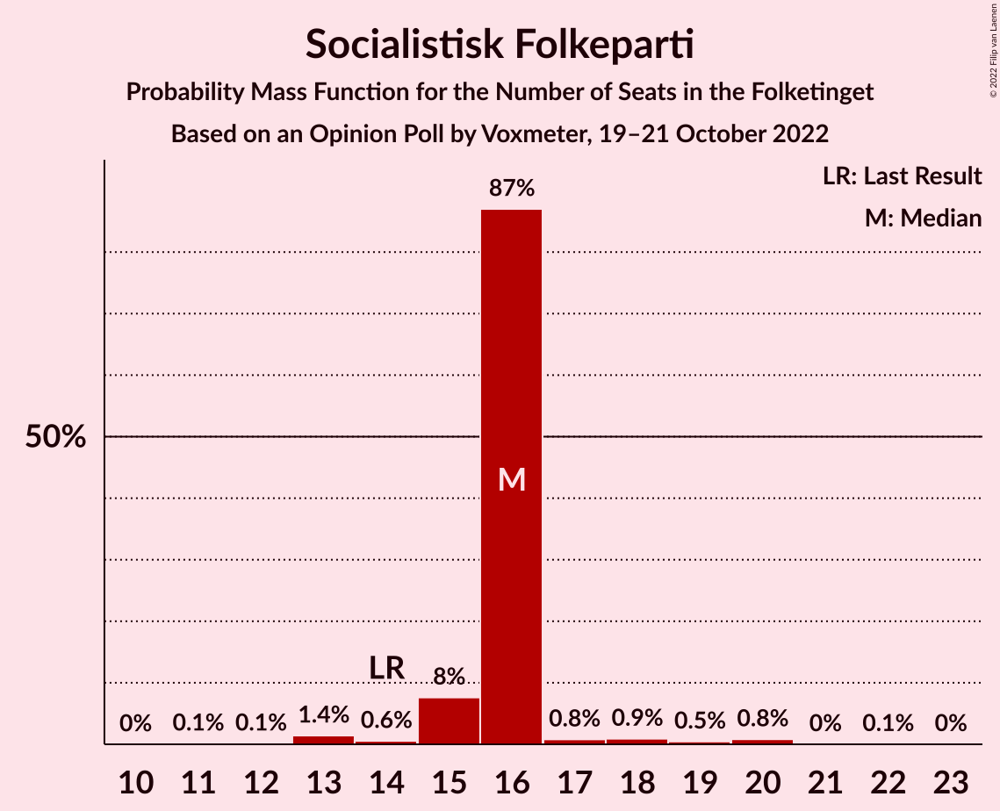

| Number of Seats | Probability | Accumulated | Special Marks |
|:---------------:|:-----------:|:-----------:|:-------------:|
| 11 | 0.1% | 100% |  |
| 12 | 0.1% | 99.9% |  |
| 13 | 1.4% | 99.7% |  |
| 14 | 0.6% | 98% | Last Result |
| 15 | 8% | 98% |  |
| 16 | 87% | 90% | Median |
| 17 | 0.8% | 3% |  |
| 18 | 0.9% | 2% |  |
| 19 | 0.5% | 1.4% |  |
| 20 | 0.8% | 0.9% |  |
| 21 | 0% | 0.1% |  |
| 22 | 0.1% | 0.1% |  |
| 23 | 0% | 0% |  |

### Moderaterne

*For a full overview of the results for this party, see the [Moderaterne](party-moderaterne.html) page.*

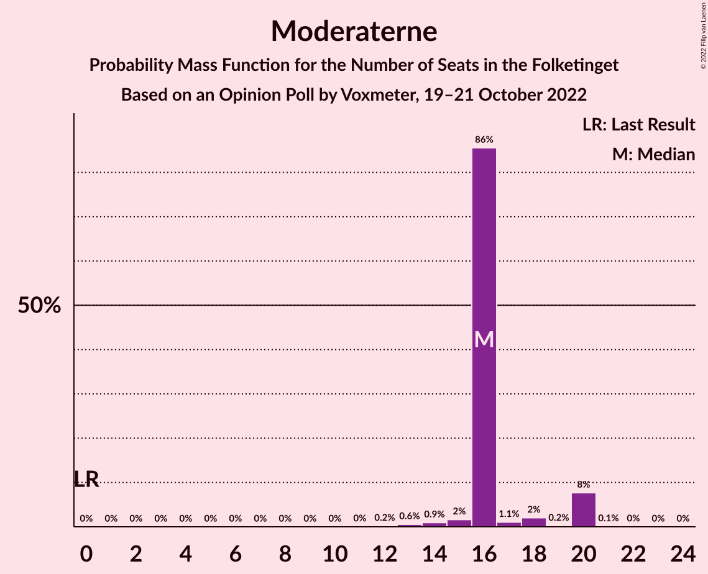

| Number of Seats | Probability | Accumulated | Special Marks |
|:---------------:|:-----------:|:-----------:|:-------------:|
| 0 | 0% | 100% | Last Result |
| 1 | 0% | 100% |  |
| 2 | 0% | 100% |  |
| 3 | 0% | 100% |  |
| 4 | 0% | 100% |  |
| 5 | 0% | 100% |  |
| 6 | 0% | 100% |  |
| 7 | 0% | 100% |  |
| 8 | 0% | 100% |  |
| 9 | 0% | 100% |  |
| 10 | 0% | 100% |  |
| 11 | 0% | 100% |  |
| 12 | 0.2% | 100% |  |
| 13 | 0.6% | 99.8% |  |
| 14 | 0.9% | 99.2% |  |
| 15 | 2% | 98% |  |
| 16 | 86% | 97% | Median |
| 17 | 1.1% | 11% |  |
| 18 | 2% | 10% |  |
| 19 | 0.2% | 8% |  |
| 20 | 8% | 8% |  |
| 21 | 0.1% | 0.1% |  |
| 22 | 0% | 0.1% |  |
| 23 | 0% | 0% |  |

### Liberal Alliance

*For a full overview of the results for this party, see the [Liberal Alliance](party-liberalalliance.html) page.*

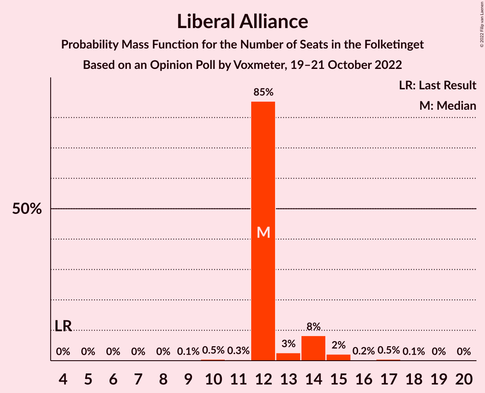

| Number of Seats | Probability | Accumulated | Special Marks |
|:---------------:|:-----------:|:-----------:|:-------------:|
| 4 | 0% | 100% | Last Result |
| 5 | 0% | 100% |  |
| 6 | 0% | 100% |  |
| 7 | 0% | 100% |  |
| 8 | 0% | 100% |  |
| 9 | 0.1% | 100% |  |
| 10 | 0.5% | 99.9% |  |
| 11 | 0.3% | 99.5% |  |
| 12 | 85% | 99.1% | Median |
| 13 | 3% | 14% |  |
| 14 | 8% | 11% |  |
| 15 | 2% | 3% |  |
| 16 | 0.2% | 0.8% |  |
| 17 | 0.5% | 0.6% |  |
| 18 | 0.1% | 0.1% |  |
| 19 | 0% | 0.1% |  |
| 20 | 0% | 0% |  |

### Enhedslisten–De Rød-Grønne

*For a full overview of the results for this party, see the [Enhedslisten–De Rød-Grønne](party-enhedslisten–derød-grønne.html) page.*

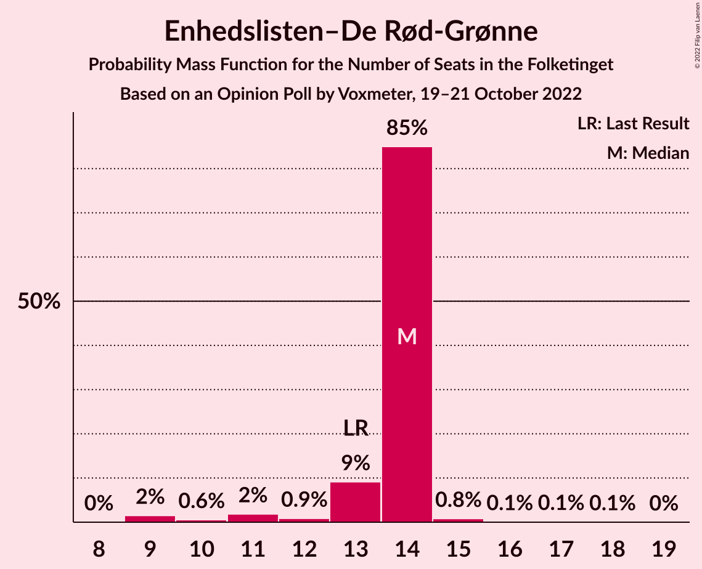

| Number of Seats | Probability | Accumulated | Special Marks |
|:---------------:|:-----------:|:-----------:|:-------------:|
| 9 | 2% | 100% |  |
| 10 | 0.6% | 98% |  |
| 11 | 2% | 98% |  |
| 12 | 0.9% | 96% |  |
| 13 | 9% | 95% | Last Result |
| 14 | 85% | 86% | Median |
| 15 | 0.8% | 1.1% |  |
| 16 | 0.1% | 0.3% |  |
| 17 | 0.1% | 0.2% |  |
| 18 | 0.1% | 0.1% |  |
| 19 | 0% | 0% |  |

### Danmarksdemokraterne

*For a full overview of the results for this party, see the [Danmarksdemokraterne](party-danmarksdemokraterne.html) page.*

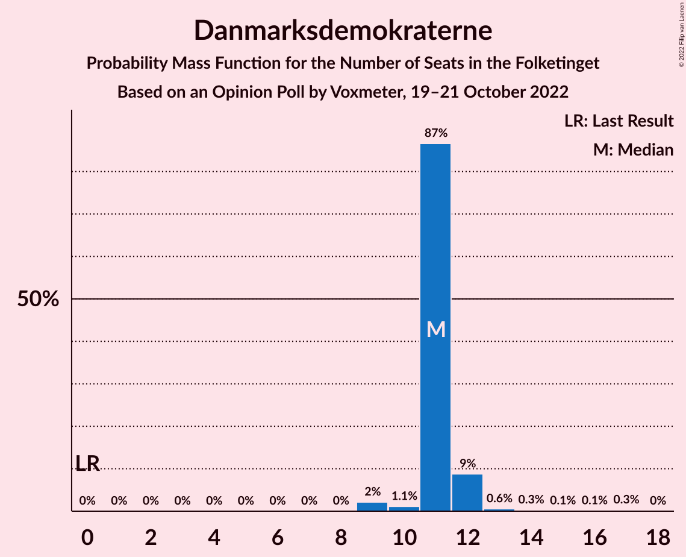

| Number of Seats | Probability | Accumulated | Special Marks |
|:---------------:|:-----------:|:-----------:|:-------------:|
| 0 | 0% | 100% | Last Result |
| 1 | 0% | 100% |  |
| 2 | 0% | 100% |  |
| 3 | 0% | 100% |  |
| 4 | 0% | 100% |  |
| 5 | 0% | 100% |  |
| 6 | 0% | 100% |  |
| 7 | 0% | 100% |  |
| 8 | 0% | 100% |  |
| 9 | 2% | 100% |  |
| 10 | 1.1% | 98% |  |
| 11 | 87% | 97% | Median |
| 12 | 9% | 10% |  |
| 13 | 0.6% | 1.3% |  |
| 14 | 0.3% | 0.8% |  |
| 15 | 0.1% | 0.5% |  |
| 16 | 0.1% | 0.4% |  |
| 17 | 0.3% | 0.3% |  |
| 18 | 0% | 0% |  |

### Det Konservative Folkeparti

*For a full overview of the results for this party, see the [Det Konservative Folkeparti](party-detkonservativefolkeparti.html) page.*

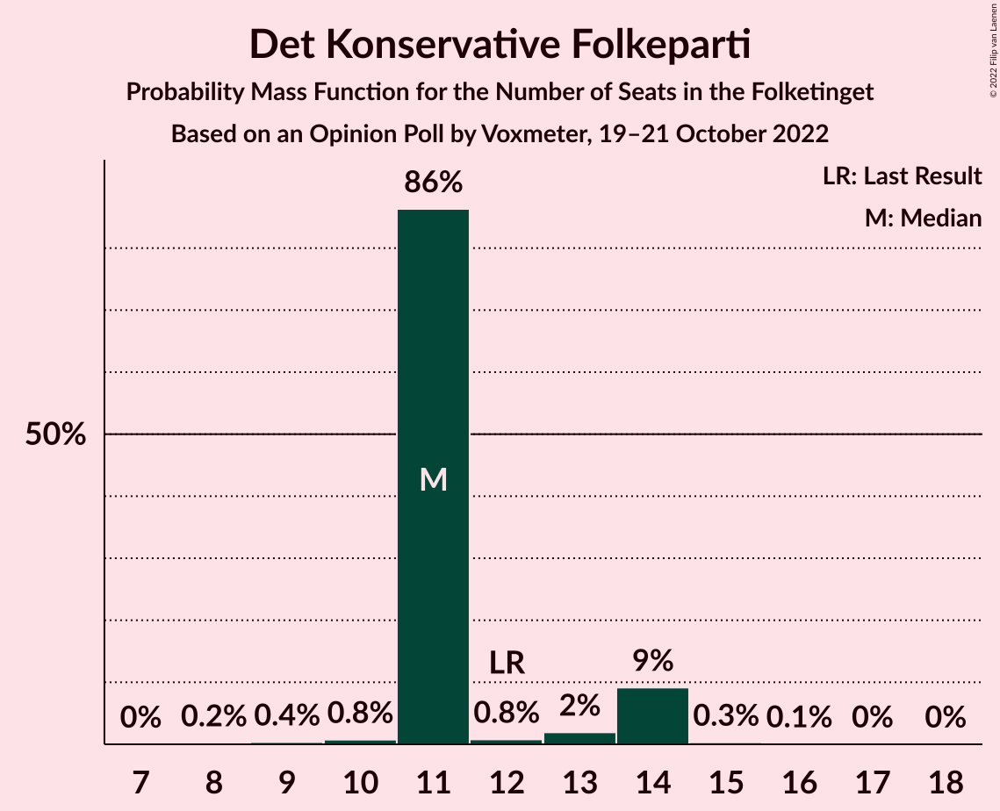

| Number of Seats | Probability | Accumulated | Special Marks |
|:---------------:|:-----------:|:-----------:|:-------------:|
| 8 | 0.2% | 100% |  |
| 9 | 0.4% | 99.7% |  |
| 10 | 0.8% | 99.4% |  |
| 11 | 86% | 98.6% | Median |
| 12 | 0.8% | 12% | Last Result |
| 13 | 2% | 12% |  |
| 14 | 9% | 10% |  |
| 15 | 0.3% | 0.4% |  |
| 16 | 0.1% | 0.1% |  |
| 17 | 0% | 0.1% |  |
| 18 | 0% | 0% |  |

### Radikale Venstre

*For a full overview of the results for this party, see the [Radikale Venstre](party-radikalevenstre.html) page.*

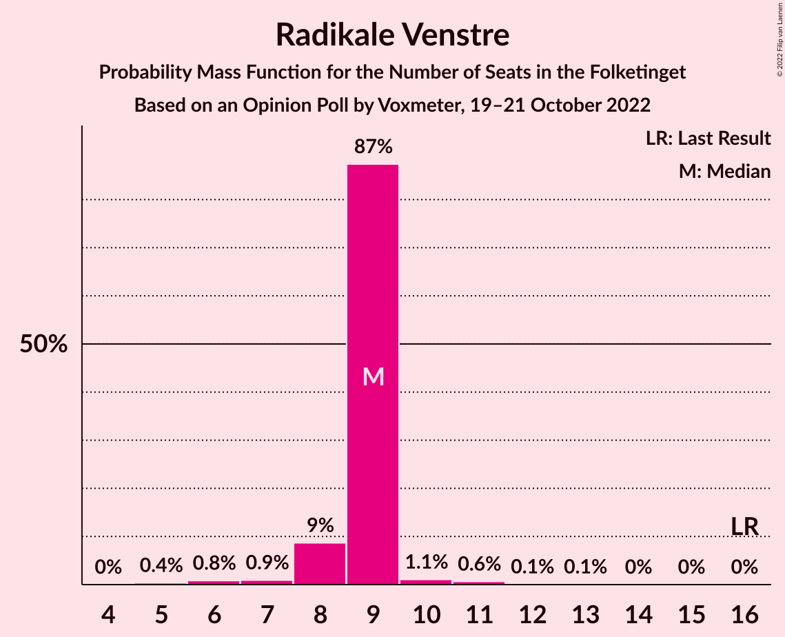

| Number of Seats | Probability | Accumulated | Special Marks |
|:---------------:|:-----------:|:-----------:|:-------------:|
| 5 | 0.4% | 100% |  |
| 6 | 0.8% | 99.6% |  |
| 7 | 0.9% | 98.8% |  |
| 8 | 9% | 98% |  |
| 9 | 87% | 89% | Median |
| 10 | 1.1% | 2% |  |
| 11 | 0.6% | 0.8% |  |
| 12 | 0.1% | 0.1% |  |
| 13 | 0.1% | 0.1% |  |
| 14 | 0% | 0% |  |
| 15 | 0% | 0% |  |
| 16 | 0% | 0% | Last Result |

### Nye Borgerlige

*For a full overview of the results for this party, see the [Nye Borgerlige](party-nyeborgerlige.html) page.*

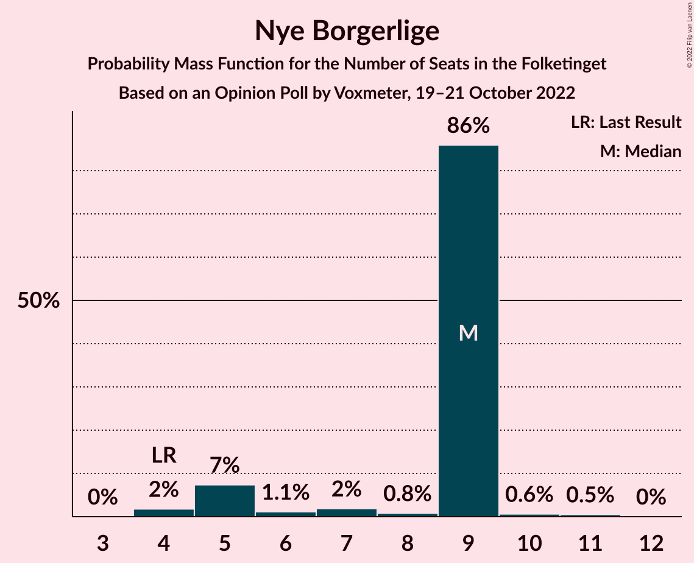

| Number of Seats | Probability | Accumulated | Special Marks |
|:---------------:|:-----------:|:-----------:|:-------------:|
| 4 | 2% | 100% | Last Result |
| 5 | 7% | 98% |  |
| 6 | 1.1% | 91% |  |
| 7 | 2% | 90% |  |
| 8 | 0.8% | 88% |  |
| 9 | 86% | 87% | Median |
| 10 | 0.6% | 1.1% |  |
| 11 | 0.5% | 0.5% |  |
| 12 | 0% | 0% |  |

### Dansk Folkeparti

*For a full overview of the results for this party, see the [Dansk Folkeparti](party-danskfolkeparti.html) page.*

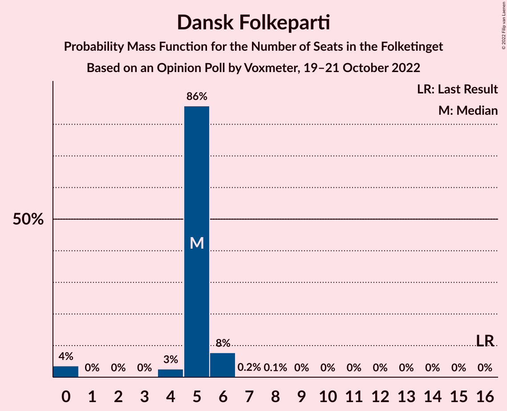

| Number of Seats | Probability | Accumulated | Special Marks |
|:---------------:|:-----------:|:-----------:|:-------------:|
| 0 | 4% | 100% |  |
| 1 | 0% | 96% |  |
| 2 | 0% | 96% |  |
| 3 | 0% | 96% |  |
| 4 | 3% | 96% |  |
| 5 | 86% | 94% | Median |
| 6 | 8% | 8% |  |
| 7 | 0.2% | 0.2% |  |
| 8 | 0.1% | 0.1% |  |
| 9 | 0% | 0% |  |
| 10 | 0% | 0% |  |
| 11 | 0% | 0% |  |
| 12 | 0% | 0% |  |
| 13 | 0% | 0% |  |
| 14 | 0% | 0% |  |
| 15 | 0% | 0% |  |
| 16 | 0% | 0% | Last Result |

### Alternativet

*For a full overview of the results for this party, see the [Alternativet](party-alternativet.html) page.*

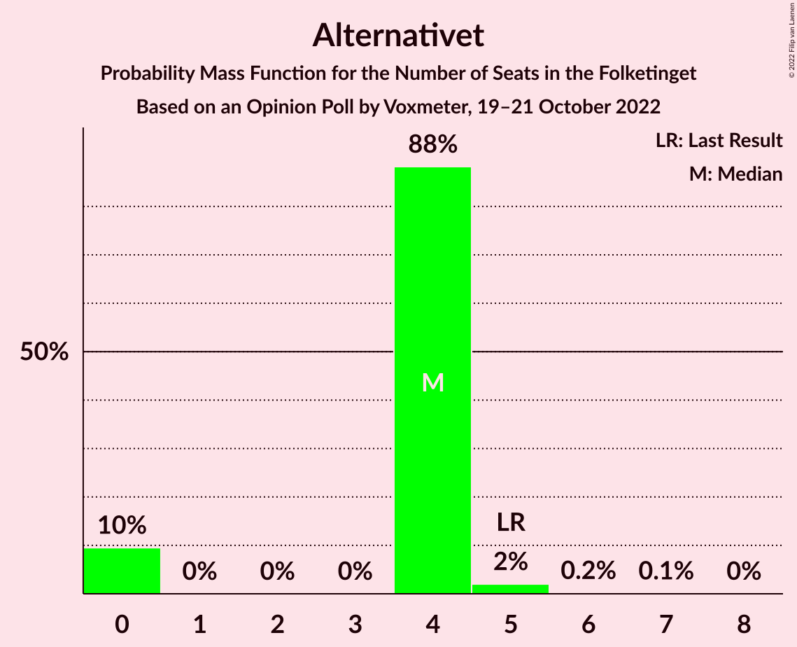

| Number of Seats | Probability | Accumulated | Special Marks |
|:---------------:|:-----------:|:-----------:|:-------------:|
| 0 | 10% | 100% |  |
| 1 | 0% | 90% |  |
| 2 | 0% | 90% |  |
| 3 | 0% | 90% |  |
| 4 | 88% | 90% | Median |
| 5 | 2% | 2% | Last Result |
| 6 | 0.2% | 0.3% |  |
| 7 | 0.1% | 0.1% |  |
| 8 | 0% | 0% |  |

### Kristendemokraterne

*For a full overview of the results for this party, see the [Kristendemokraterne](party-kristendemokraterne.html) page.*

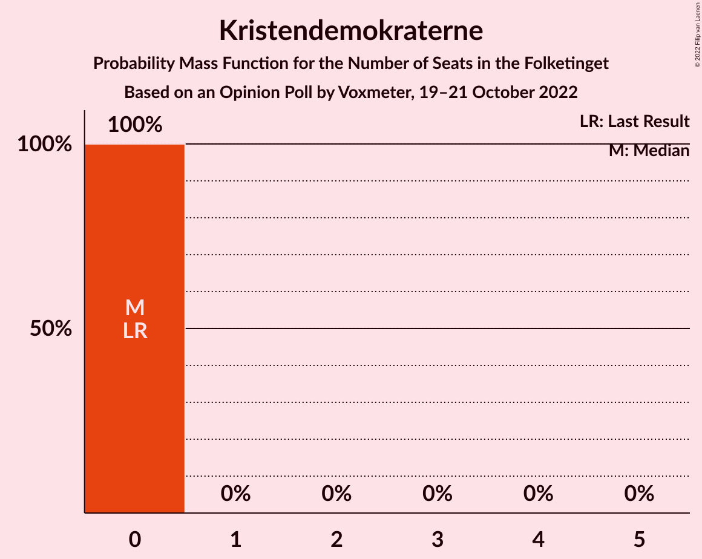

| Number of Seats | Probability | Accumulated | Special Marks |
|:---------------:|:-----------:|:-----------:|:-------------:|
| 0 | 100% | 100% | Last Result, Median |

### Frie Grønne

*For a full overview of the results for this party, see the [Frie Grønne](party-friegrønne.html) page.*

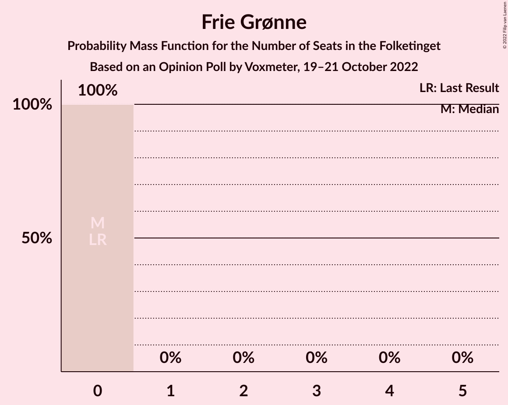

| Number of Seats | Probability | Accumulated | Special Marks |
|:---------------:|:-----------:|:-----------:|:-------------:|
| 0 | 100% | 100% | Last Result, Median |

## Coalitions

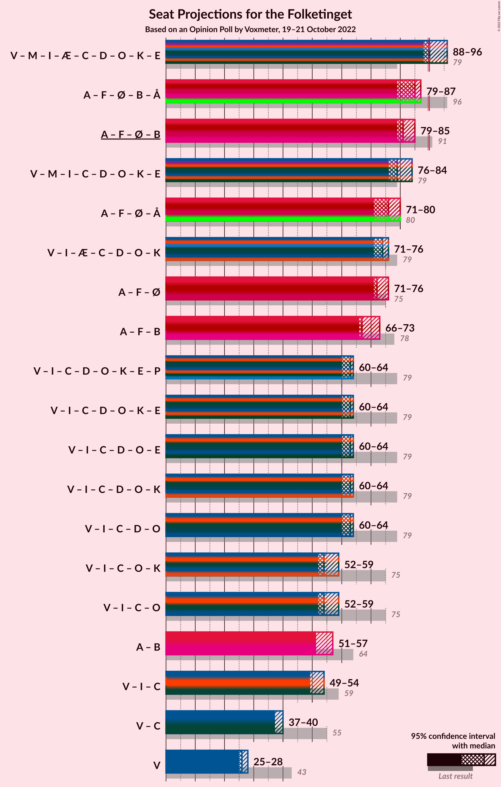

### Confidence Intervals

| Coalition | Last Result | Median | Majority? | 80% Confidence Interval | 90% Confidence Interval | 95% Confidence Interval | 99% Confidence Interval |
|:---------:|:-----------:|:------:|:---------:|:-----------------------:|:-----------------------:|:-----------------------:|:-----------------------:|
| Socialdemokraterne – Socialistisk Folkeparti – Enhedslisten–De Rød-Grønne – Radikale Venstre – Alternativet | 96 | 85 | 2% | 85 | 79–86 | 79–87 | 79–91 |
| Socialdemokraterne – Socialistisk Folkeparti – Enhedslisten–De Rød-Grønne – Radikale Venstre | 91 | 81 | 0% | 81 | 79–82 | 79–85 | 77–87 |
| Socialdemokraterne – Socialistisk Folkeparti – Enhedslisten–De Rød-Grønne – Alternativet | 80 | 76 | 0% | 76 | 71–77 | 71–80 | 71–82 |
| Venstre – Liberal Alliance – Danmarksdemokraterne – Det Konservative Folkeparti – Nye Borgerlige – Dansk Folkeparti – Kristendemokraterne | 79 | 74 | 0% | 74 | 73–76 | 71–76 | 65–79 |
| Socialdemokraterne – Socialistisk Folkeparti – Enhedslisten–De Rød-Grønne | 75 | 72 | 0% | 72 | 71–73 | 71–76 | 69–79 |
| Socialdemokraterne – Socialistisk Folkeparti – Radikale Venstre | 78 | 67 | 0% | 67 | 66–71 | 66–73 | 65–75 |
| Venstre – Liberal Alliance – Det Konservative Folkeparti – Nye Borgerlige – Dansk Folkeparti – Kristendemokraterne | 79 | 63 | 0% | 63 | 62–64 | 60–64 | 55–68 |
| Venstre – Liberal Alliance – Det Konservative Folkeparti – Nye Borgerlige – Dansk Folkeparti | 79 | 63 | 0% | 63 | 62–64 | 60–64 | 55–68 |
| Venstre – Liberal Alliance – Det Konservative Folkeparti – Dansk Folkeparti – Kristendemokraterne | 75 | 54 | 0% | 54–57 | 54–59 | 52–59 | 49–61 |
| Venstre – Liberal Alliance – Det Konservative Folkeparti – Dansk Folkeparti | 75 | 54 | 0% | 54–57 | 54–59 | 52–59 | 49–61 |
| Socialdemokraterne – Radikale Venstre | 64 | 51 | 0% | 51 | 51–55 | 51–57 | 48–59 |
| Venstre – Liberal Alliance – Det Konservative Folkeparti | 59 | 49 | 0% | 49–53 | 49–53 | 49–54 | 47–56 |
| Venstre – Det Konservative Folkeparti | 55 | 37 | 0% | 37–39 | 37–39 | 37–40 | 34–41 |
| Venstre | 43 | 26 | 0% | 26 | 25–26 | 25–28 | 22–29 |

### Socialdemokraterne – Socialistisk Folkeparti – Enhedslisten–De Rød-Grønne – Radikale Venstre – Alternativet

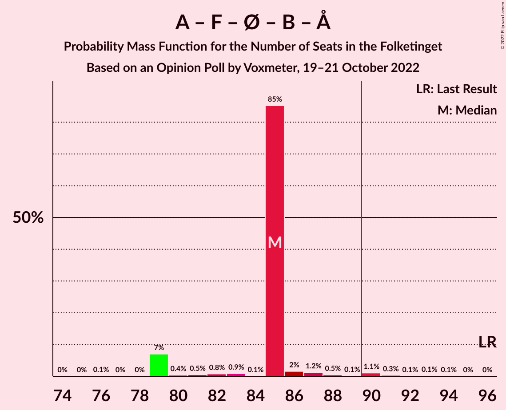

| Number of Seats | Probability | Accumulated | Special Marks |
|:---------------:|:-----------:|:-----------:|:-------------:|
| 76 | 0.1% | 100% |  |
| 77 | 0% | 99.9% |  |
| 78 | 0% | 99.9% |  |
| 79 | 7% | 99.9% |  |
| 80 | 0.4% | 93% |  |
| 81 | 0.5% | 92% |  |
| 82 | 0.8% | 92% |  |
| 83 | 0.9% | 91% |  |
| 84 | 0.1% | 90% |  |
| 85 | 85% | 90% | Median |
| 86 | 2% | 5% |  |
| 87 | 1.2% | 3% |  |
| 88 | 0.5% | 2% |  |
| 89 | 0.1% | 2% |  |
| 90 | 1.1% | 2% | Majority |
| 91 | 0.3% | 0.6% |  |
| 92 | 0.1% | 0.3% |  |
| 93 | 0.1% | 0.2% |  |
| 94 | 0.1% | 0.1% |  |
| 95 | 0% | 0% |  |
| 96 | 0% | 0% | Last Result |

### Socialdemokraterne – Socialistisk Folkeparti – Enhedslisten–De Rød-Grønne – Radikale Venstre

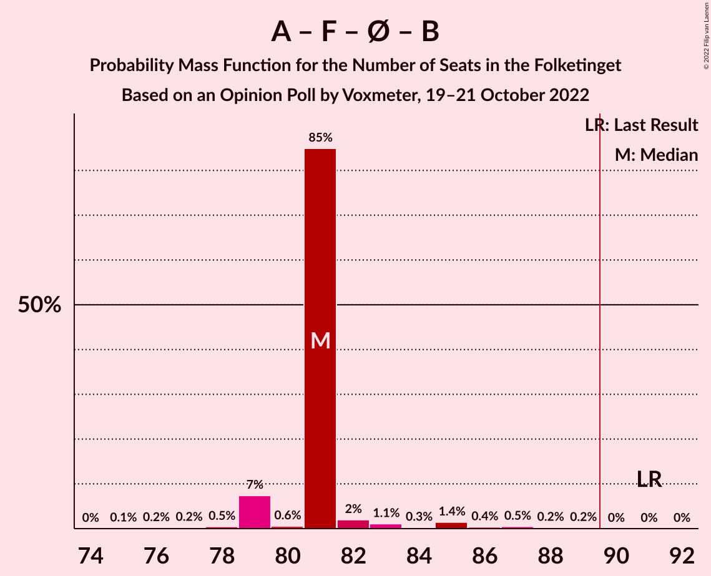

| Number of Seats | Probability | Accumulated | Special Marks |
|:---------------:|:-----------:|:-----------:|:-------------:|
| 74 | 0% | 100% |  |
| 75 | 0.1% | 99.9% |  |
| 76 | 0.2% | 99.8% |  |
| 77 | 0.2% | 99.7% |  |
| 78 | 0.5% | 99.4% |  |
| 79 | 7% | 99.0% |  |
| 80 | 0.6% | 92% |  |
| 81 | 85% | 91% | Median |
| 82 | 2% | 6% |  |
| 83 | 1.1% | 4% |  |
| 84 | 0.3% | 3% |  |
| 85 | 1.4% | 3% |  |
| 86 | 0.4% | 1.3% |  |
| 87 | 0.5% | 1.0% |  |
| 88 | 0.2% | 0.5% |  |
| 89 | 0.2% | 0.2% |  |
| 90 | 0% | 0% | Majority |
| 91 | 0% | 0% | Last Result |

### Socialdemokraterne – Socialistisk Folkeparti – Enhedslisten–De Rød-Grønne – Alternativet

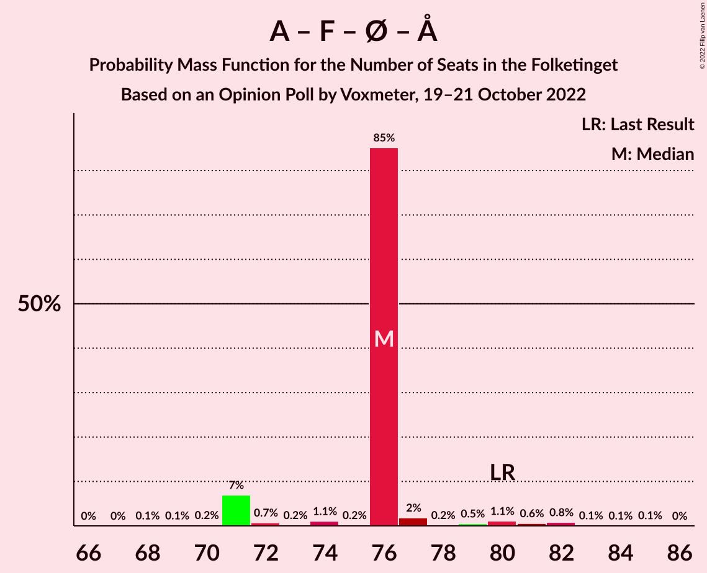

| Number of Seats | Probability | Accumulated | Special Marks |
|:---------------:|:-----------:|:-----------:|:-------------:|
| 68 | 0.1% | 100% |  |
| 69 | 0.1% | 99.9% |  |
| 70 | 0.2% | 99.8% |  |
| 71 | 7% | 99.6% |  |
| 72 | 0.7% | 93% |  |
| 73 | 0.2% | 92% |  |
| 74 | 1.1% | 92% |  |
| 75 | 0.2% | 91% |  |
| 76 | 85% | 91% | Median |
| 77 | 2% | 5% |  |
| 78 | 0.2% | 4% |  |
| 79 | 0.5% | 3% |  |
| 80 | 1.1% | 3% | Last Result |
| 81 | 0.6% | 2% |  |
| 82 | 0.8% | 1.1% |  |
| 83 | 0.1% | 0.3% |  |
| 84 | 0.1% | 0.2% |  |
| 85 | 0.1% | 0.2% |  |
| 86 | 0% | 0% |  |

### Venstre – Liberal Alliance – Danmarksdemokraterne – Det Konservative Folkeparti – Nye Borgerlige – Dansk Folkeparti – Kristendemokraterne

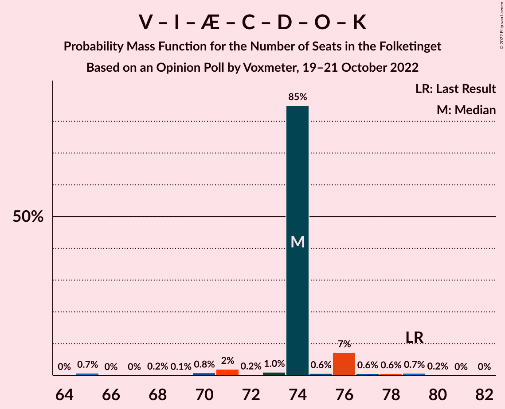

| Number of Seats | Probability | Accumulated | Special Marks |
|:---------------:|:-----------:|:-----------:|:-------------:|
| 64 | 0% | 100% |  |
| 65 | 0.7% | 99.9% |  |
| 66 | 0% | 99.2% |  |
| 67 | 0% | 99.2% |  |
| 68 | 0.2% | 99.2% |  |
| 69 | 0.1% | 99.0% |  |
| 70 | 0.8% | 98.9% |  |
| 71 | 2% | 98% |  |
| 72 | 0.2% | 96% |  |
| 73 | 1.0% | 96% |  |
| 74 | 85% | 95% | Median |
| 75 | 0.6% | 10% |  |
| 76 | 7% | 9% |  |
| 77 | 0.6% | 2% |  |
| 78 | 0.6% | 2% |  |
| 79 | 0.7% | 1.0% | Last Result |
| 80 | 0.2% | 0.3% |  |
| 81 | 0% | 0.1% |  |
| 82 | 0% | 0% |  |

### Socialdemokraterne – Socialistisk Folkeparti – Enhedslisten–De Rød-Grønne

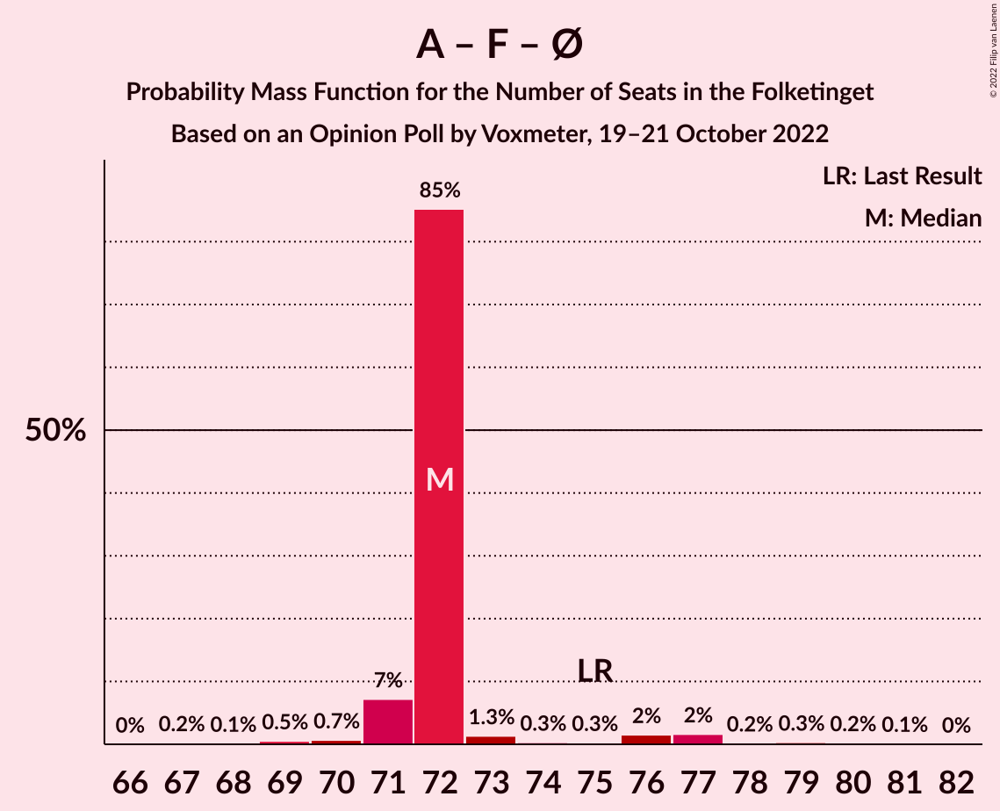

| Number of Seats | Probability | Accumulated | Special Marks |
|:---------------:|:-----------:|:-----------:|:-------------:|
| 66 | 0% | 100% |  |
| 67 | 0.2% | 99.9% |  |
| 68 | 0.1% | 99.7% |  |
| 69 | 0.5% | 99.6% |  |
| 70 | 0.7% | 99.0% |  |
| 71 | 7% | 98% |  |
| 72 | 85% | 91% | Median |
| 73 | 1.3% | 6% |  |
| 74 | 0.3% | 5% |  |
| 75 | 0.3% | 4% | Last Result |
| 76 | 2% | 4% |  |
| 77 | 2% | 2% |  |
| 78 | 0.2% | 0.9% |  |
| 79 | 0.3% | 0.7% |  |
| 80 | 0.2% | 0.4% |  |
| 81 | 0.1% | 0.1% |  |
| 82 | 0% | 0% |  |

### Socialdemokraterne – Socialistisk Folkeparti – Radikale Venstre

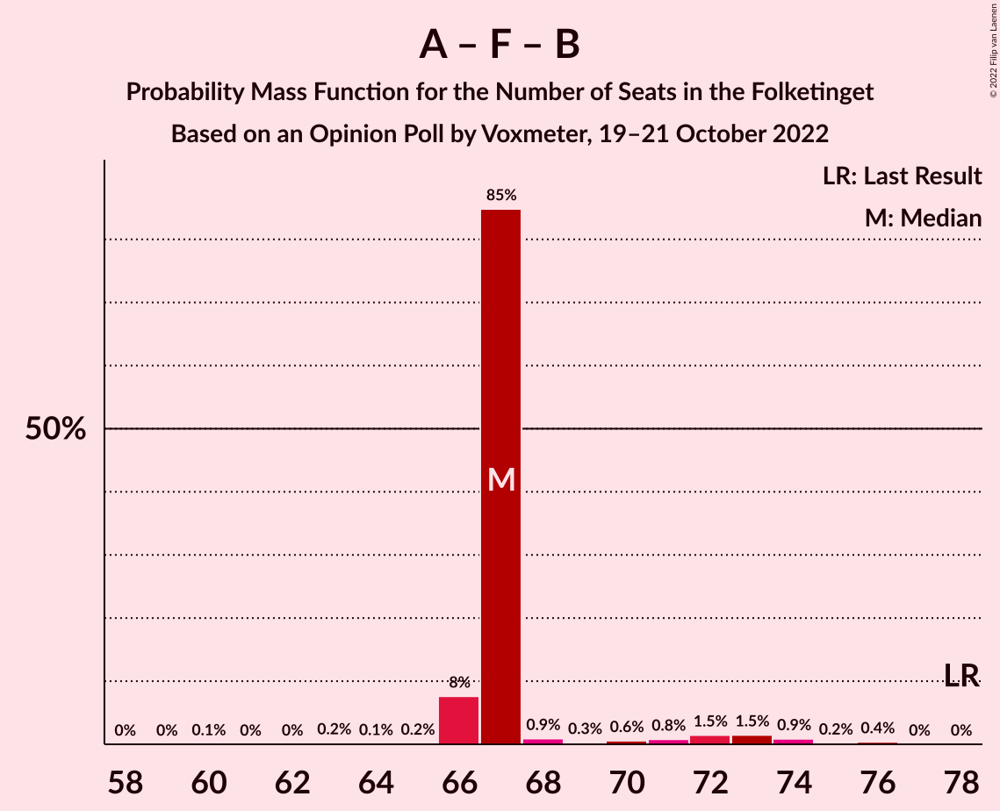

| Number of Seats | Probability | Accumulated | Special Marks |
|:---------------:|:-----------:|:-----------:|:-------------:|
| 60 | 0.1% | 100% |  |
| 61 | 0% | 99.9% |  |
| 62 | 0% | 99.9% |  |
| 63 | 0.2% | 99.9% |  |
| 64 | 0.1% | 99.7% |  |
| 65 | 0.2% | 99.6% |  |
| 66 | 8% | 99.4% |  |
| 67 | 85% | 92% | Median |
| 68 | 0.9% | 7% |  |
| 69 | 0.3% | 6% |  |
| 70 | 0.6% | 6% |  |
| 71 | 0.8% | 5% |  |
| 72 | 1.5% | 4% |  |
| 73 | 1.5% | 3% |  |
| 74 | 0.9% | 1.5% |  |
| 75 | 0.2% | 0.6% |  |
| 76 | 0.4% | 0.4% |  |
| 77 | 0% | 0% |  |
| 78 | 0% | 0% | Last Result |

### Venstre – Liberal Alliance – Det Konservative Folkeparti – Nye Borgerlige – Dansk Folkeparti – Kristendemokraterne

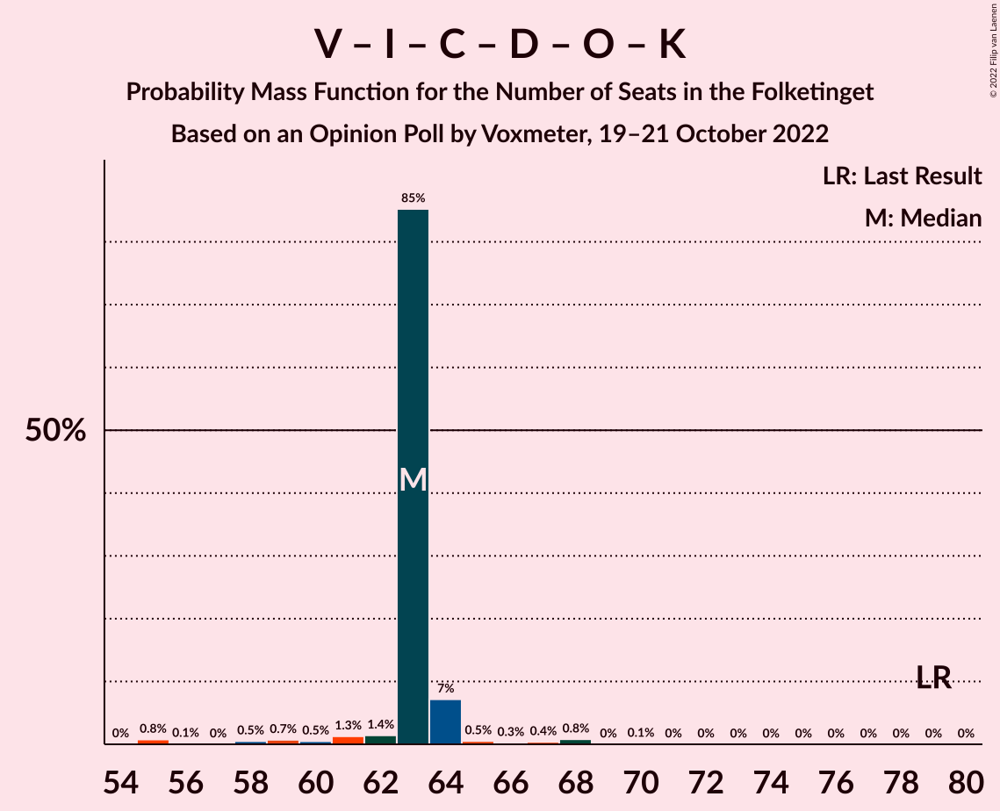

| Number of Seats | Probability | Accumulated | Special Marks |
|:---------------:|:-----------:|:-----------:|:-------------:|
| 54 | 0% | 100% |  |
| 55 | 0.8% | 99.9% |  |
| 56 | 0.1% | 99.2% |  |
| 57 | 0% | 99.0% |  |
| 58 | 0.5% | 99.0% |  |
| 59 | 0.7% | 98.5% |  |
| 60 | 0.5% | 98% |  |
| 61 | 1.3% | 97% |  |
| 62 | 1.4% | 96% |  |
| 63 | 85% | 95% | Median |
| 64 | 7% | 9% |  |
| 65 | 0.5% | 2% |  |
| 66 | 0.3% | 2% |  |
| 67 | 0.4% | 1.4% |  |
| 68 | 0.8% | 1.0% |  |
| 69 | 0% | 0.2% |  |
| 70 | 0.1% | 0.2% |  |
| 71 | 0% | 0% |  |
| 72 | 0% | 0% |  |
| 73 | 0% | 0% |  |
| 74 | 0% | 0% |  |
| 75 | 0% | 0% |  |
| 76 | 0% | 0% |  |
| 77 | 0% | 0% |  |
| 78 | 0% | 0% |  |
| 79 | 0% | 0% | Last Result |

### Venstre – Liberal Alliance – Det Konservative Folkeparti – Nye Borgerlige – Dansk Folkeparti

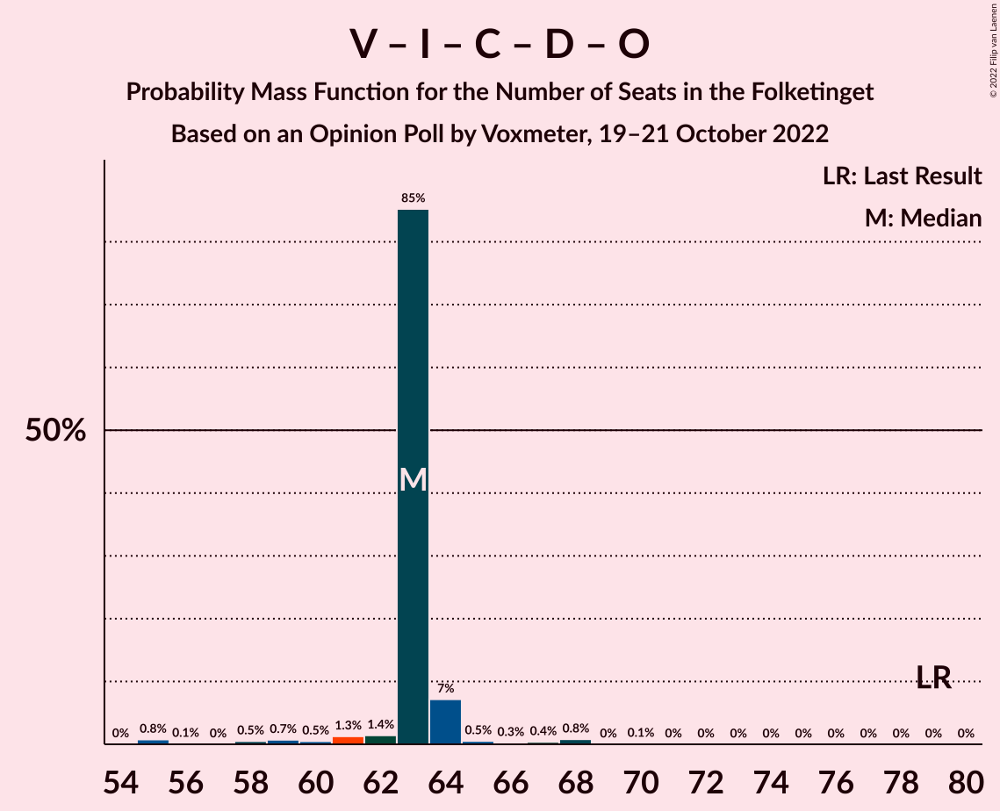

| Number of Seats | Probability | Accumulated | Special Marks |
|:---------------:|:-----------:|:-----------:|:-------------:|
| 54 | 0% | 100% |  |
| 55 | 0.8% | 99.9% |  |
| 56 | 0.1% | 99.2% |  |
| 57 | 0% | 99.0% |  |
| 58 | 0.5% | 99.0% |  |
| 59 | 0.7% | 98.5% |  |
| 60 | 0.5% | 98% |  |
| 61 | 1.3% | 97% |  |
| 62 | 1.4% | 96% |  |
| 63 | 85% | 95% | Median |
| 64 | 7% | 9% |  |
| 65 | 0.5% | 2% |  |
| 66 | 0.3% | 2% |  |
| 67 | 0.4% | 1.4% |  |
| 68 | 0.8% | 1.0% |  |
| 69 | 0% | 0.2% |  |
| 70 | 0.1% | 0.2% |  |
| 71 | 0% | 0% |  |
| 72 | 0% | 0% |  |
| 73 | 0% | 0% |  |
| 74 | 0% | 0% |  |
| 75 | 0% | 0% |  |
| 76 | 0% | 0% |  |
| 77 | 0% | 0% |  |
| 78 | 0% | 0% |  |
| 79 | 0% | 0% | Last Result |

### Venstre – Liberal Alliance – Det Konservative Folkeparti – Dansk Folkeparti – Kristendemokraterne

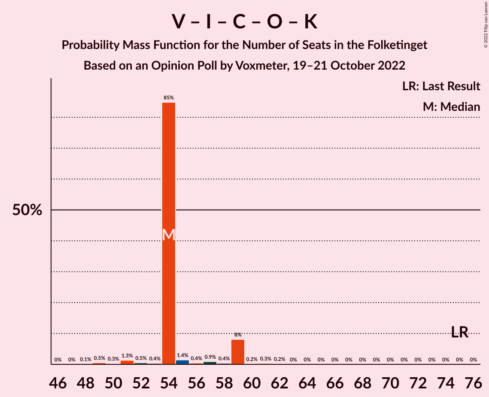

| Number of Seats | Probability | Accumulated | Special Marks |
|:---------------:|:-----------:|:-----------:|:-------------:|
| 48 | 0.1% | 100% |  |
| 49 | 0.5% | 99.8% |  |
| 50 | 0.3% | 99.3% |  |
| 51 | 1.3% | 99.0% |  |
| 52 | 0.5% | 98% |  |
| 53 | 0.4% | 97% |  |
| 54 | 85% | 97% | Median |
| 55 | 1.4% | 12% |  |
| 56 | 0.4% | 11% |  |
| 57 | 0.9% | 10% |  |
| 58 | 0.4% | 9% |  |
| 59 | 8% | 9% |  |
| 60 | 0.2% | 0.7% |  |
| 61 | 0.3% | 0.5% |  |
| 62 | 0.2% | 0.2% |  |
| 63 | 0% | 0% |  |
| 64 | 0% | 0% |  |
| 65 | 0% | 0% |  |
| 66 | 0% | 0% |  |
| 67 | 0% | 0% |  |
| 68 | 0% | 0% |  |
| 69 | 0% | 0% |  |
| 70 | 0% | 0% |  |
| 71 | 0% | 0% |  |
| 72 | 0% | 0% |  |
| 73 | 0% | 0% |  |
| 74 | 0% | 0% |  |
| 75 | 0% | 0% | Last Result |

### Venstre – Liberal Alliance – Det Konservative Folkeparti – Dansk Folkeparti

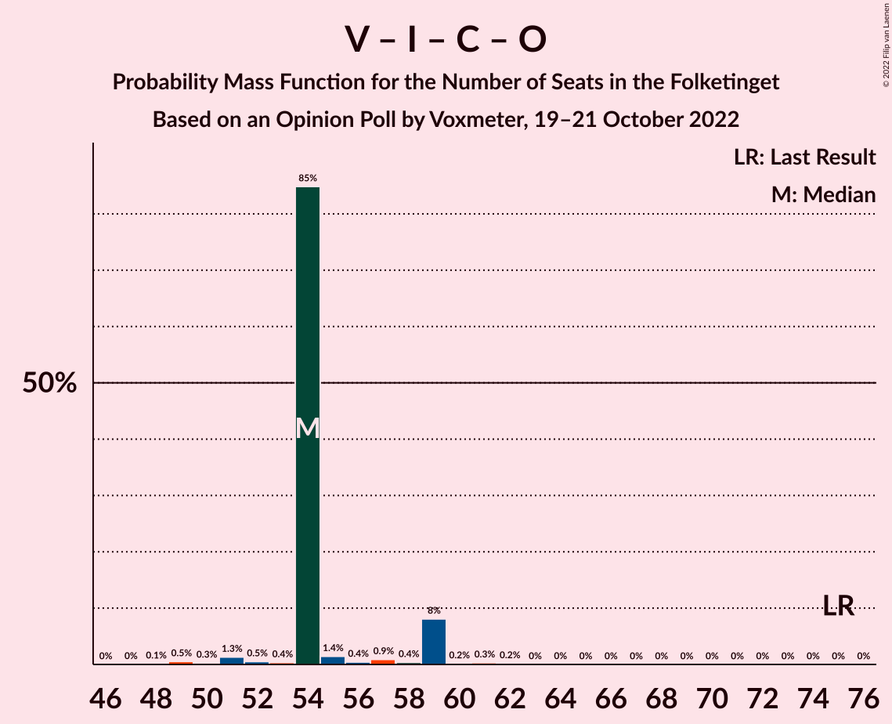

| Number of Seats | Probability | Accumulated | Special Marks |
|:---------------:|:-----------:|:-----------:|:-------------:|
| 48 | 0.1% | 100% |  |
| 49 | 0.5% | 99.8% |  |
| 50 | 0.3% | 99.3% |  |
| 51 | 1.3% | 99.0% |  |
| 52 | 0.5% | 98% |  |
| 53 | 0.4% | 97% |  |
| 54 | 85% | 97% | Median |
| 55 | 1.4% | 12% |  |
| 56 | 0.4% | 11% |  |
| 57 | 0.9% | 10% |  |
| 58 | 0.4% | 9% |  |
| 59 | 8% | 9% |  |
| 60 | 0.2% | 0.7% |  |
| 61 | 0.3% | 0.5% |  |
| 62 | 0.2% | 0.2% |  |
| 63 | 0% | 0% |  |
| 64 | 0% | 0% |  |
| 65 | 0% | 0% |  |
| 66 | 0% | 0% |  |
| 67 | 0% | 0% |  |
| 68 | 0% | 0% |  |
| 69 | 0% | 0% |  |
| 70 | 0% | 0% |  |
| 71 | 0% | 0% |  |
| 72 | 0% | 0% |  |
| 73 | 0% | 0% |  |
| 74 | 0% | 0% |  |
| 75 | 0% | 0% | Last Result |

### Socialdemokraterne – Radikale Venstre

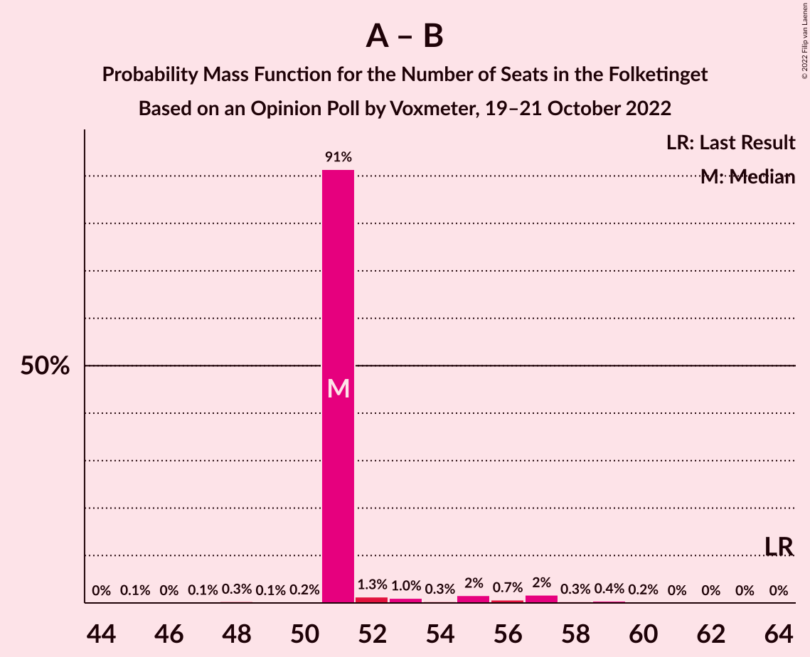

| Number of Seats | Probability | Accumulated | Special Marks |
|:---------------:|:-----------:|:-----------:|:-------------:|
| 45 | 0.1% | 100% |  |
| 46 | 0% | 99.9% |  |
| 47 | 0.1% | 99.9% |  |
| 48 | 0.3% | 99.7% |  |
| 49 | 0.1% | 99.4% |  |
| 50 | 0.2% | 99.3% |  |
| 51 | 91% | 99.1% | Median |
| 52 | 1.3% | 8% |  |
| 53 | 1.0% | 6% |  |
| 54 | 0.3% | 5% |  |
| 55 | 2% | 5% |  |
| 56 | 0.7% | 3% |  |
| 57 | 2% | 3% |  |
| 58 | 0.3% | 1.1% |  |
| 59 | 0.4% | 0.7% |  |
| 60 | 0.2% | 0.3% |  |
| 61 | 0% | 0.1% |  |
| 62 | 0% | 0% |  |
| 63 | 0% | 0% |  |
| 64 | 0% | 0% | Last Result |

### Venstre – Liberal Alliance – Det Konservative Folkeparti

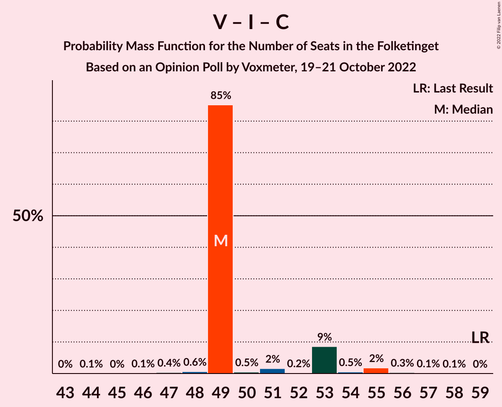

| Number of Seats | Probability | Accumulated | Special Marks |
|:---------------:|:-----------:|:-----------:|:-------------:|
| 44 | 0.1% | 100% |  |
| 45 | 0% | 99.9% |  |
| 46 | 0.1% | 99.9% |  |
| 47 | 0.4% | 99.8% |  |
| 48 | 0.6% | 99.5% |  |
| 49 | 85% | 98.8% | Median |
| 50 | 0.5% | 14% |  |
| 51 | 2% | 13% |  |
| 52 | 0.2% | 12% |  |
| 53 | 9% | 11% |  |
| 54 | 0.5% | 3% |  |
| 55 | 2% | 2% |  |
| 56 | 0.3% | 0.6% |  |
| 57 | 0.1% | 0.2% |  |
| 58 | 0.1% | 0.1% |  |
| 59 | 0% | 0% | Last Result |

### Venstre – Det Konservative Folkeparti

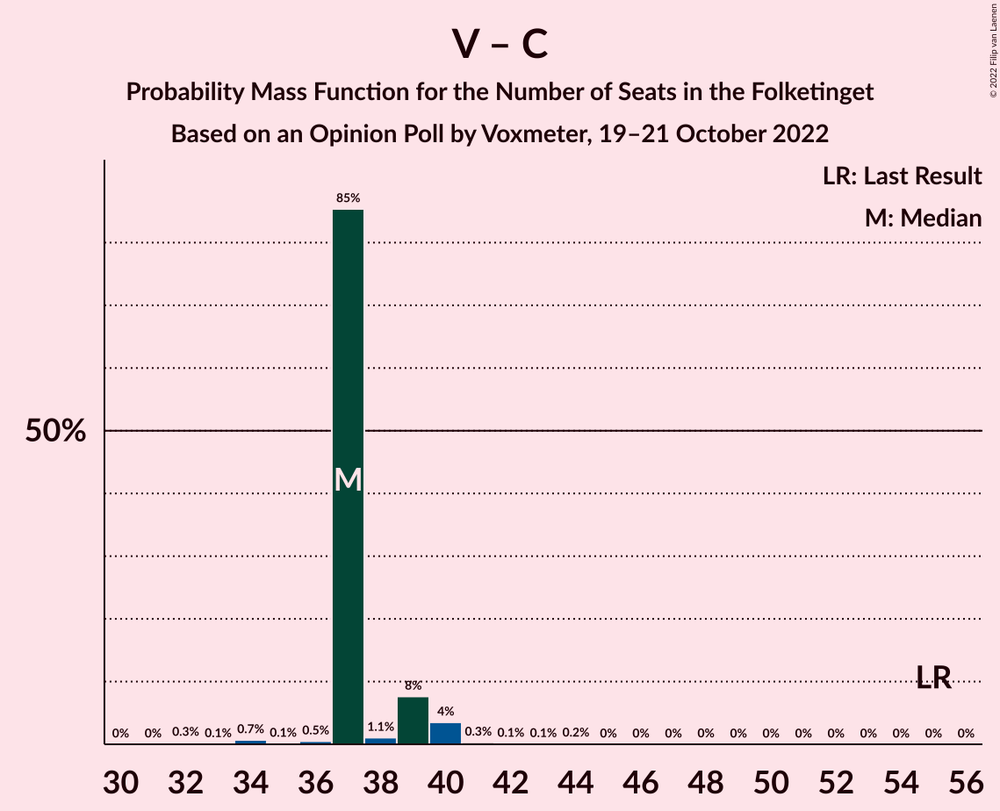

| Number of Seats | Probability | Accumulated | Special Marks |
|:---------------:|:-----------:|:-----------:|:-------------:|
| 32 | 0.3% | 100% |  |
| 33 | 0.1% | 99.7% |  |
| 34 | 0.7% | 99.6% |  |
| 35 | 0.1% | 98.9% |  |
| 36 | 0.5% | 98.8% |  |
| 37 | 85% | 98% | Median |
| 38 | 1.1% | 13% |  |
| 39 | 8% | 12% |  |
| 40 | 4% | 4% |  |
| 41 | 0.3% | 0.7% |  |
| 42 | 0.1% | 0.4% |  |
| 43 | 0.1% | 0.3% |  |
| 44 | 0.2% | 0.2% |  |
| 45 | 0% | 0.1% |  |
| 46 | 0% | 0% |  |
| 47 | 0% | 0% |  |
| 48 | 0% | 0% |  |
| 49 | 0% | 0% |  |
| 50 | 0% | 0% |  |
| 51 | 0% | 0% |  |
| 52 | 0% | 0% |  |
| 53 | 0% | 0% |  |
| 54 | 0% | 0% |  |
| 55 | 0% | 0% | Last Result |

### Venstre

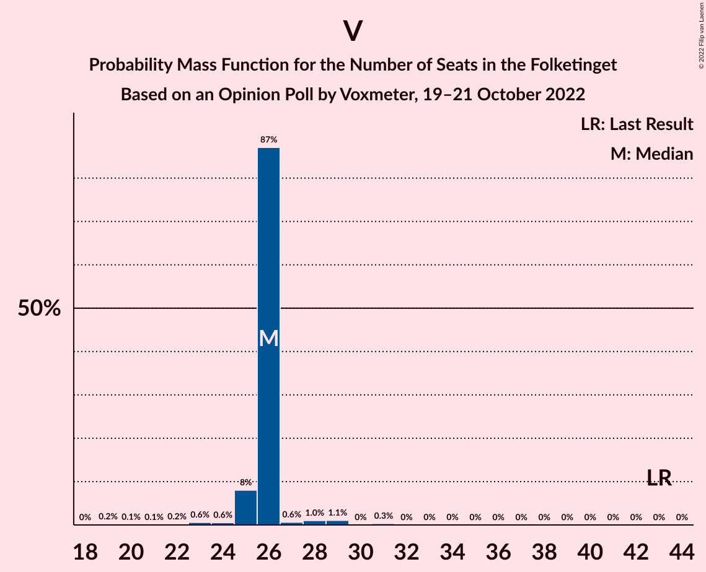

| Number of Seats | Probability | Accumulated | Special Marks |
|:---------------:|:-----------:|:-----------:|:-------------:|
| 19 | 0.2% | 100% |  |
| 20 | 0.1% | 99.8% |  |
| 21 | 0.1% | 99.7% |  |
| 22 | 0.2% | 99.7% |  |
| 23 | 0.6% | 99.5% |  |
| 24 | 0.6% | 98.9% |  |
| 25 | 8% | 98% |  |
| 26 | 87% | 90% | Median |
| 27 | 0.6% | 3% |  |
| 28 | 1.0% | 3% |  |
| 29 | 1.1% | 1.5% |  |
| 30 | 0% | 0.4% |  |
| 31 | 0.3% | 0.4% |  |
| 32 | 0% | 0.1% |  |
| 33 | 0% | 0.1% |  |
| 34 | 0% | 0% |  |
| 35 | 0% | 0% |  |
| 36 | 0% | 0% |  |
| 37 | 0% | 0% |  |
| 38 | 0% | 0% |  |
| 39 | 0% | 0% |  |
| 40 | 0% | 0% |  |
| 41 | 0% | 0% |  |
| 42 | 0% | 0% |  |
| 43 | 0% | 0% | Last Result |

## Technical Information

### Opinion Poll

+ **Polling firm:** Voxmeter
+ **Commissioner(s):** —
+ **Fieldwork period:** 19–21 October 2022

### Calculations

+ **Sample size:** 942
+ **Simulations done:** 1,048,576
+ **Error estimate:** 3.40%

