# Opinion Poll by Gallup for Berlingske, 24 October 2022

<a href="#voting-intentions">Voting Intentions</a> | <a href="#seats">Seats</a> | <a href="#coalitions">Coalitions</a> | <a href="#technical-information">Technical Information</a>

## Voting Intentions

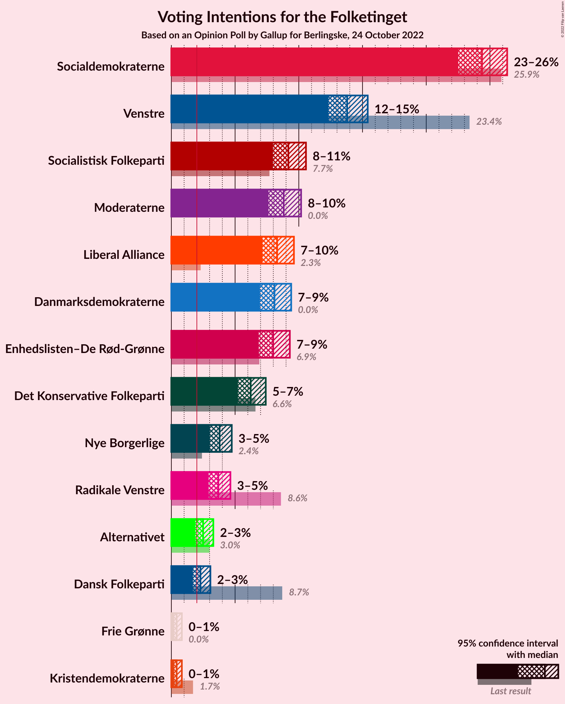

### Confidence Intervals

| Party | Last Result | Poll Result | 80% Confidence Interval | 90% Confidence Interval | 95% Confidence Interval | 99% Confidence Interval |
|:-----:|:-----------:|:-----------:|:-----------------------:|:-----------------------:|:-----------------------:|:-----------------------:|
| Socialdemokraterne | 25.9% | 24.4% | 23.2–25.7% |22.8–26.0% |22.5–26.4% |21.9–27.0% |
| Venstre | 23.4% | 13.8% | 12.8–14.9% |12.6–15.2% |12.3–15.4% |11.9–15.9% |
| Socialistisk Folkeparti | 7.7% | 9.2% | 8.4–10.1% |8.2–10.3% |8.0–10.6% |7.6–11.0% |
| Moderaterne | 0.0% | 8.8% | 8.0–9.7% |7.8–10.0% |7.6–10.2% |7.3–10.6% |
| Liberal Alliance | 2.3% | 8.3% | 7.5–9.2% |7.3–9.4% |7.1–9.6% |6.8–10.0% |
| Danmarksdemokraterne | 0.0% | 8.1% | 7.3–8.9% |7.1–9.2% |7.0–9.4% |6.6–9.8% |
| Enhedslisten–De Rød-Grønne | 6.9% | 8.0% | 7.2–8.8% |7.0–9.1% |6.9–9.3% |6.5–9.7% |
| Det Konservative Folkeparti | 6.6% | 6.2% | 5.6–7.0% |5.4–7.2% |5.2–7.4% |4.9–7.8% |
| Nye Borgerlige | 2.4% | 3.8% | 3.3–4.4% |3.1–4.6% |3.0–4.7% |2.8–5.1% |
| Radikale Venstre | 8.6% | 3.7% | 3.2–4.3% |3.0–4.5% |2.9–4.6% |2.7–4.9% |
| Alternativet | 3.0% | 2.5% | 2.1–3.0% |2.0–3.2% |1.9–3.3% |1.7–3.6% |
| Dansk Folkeparti | 8.7% | 2.3% | 1.9–2.8% |1.8–2.9% |1.7–3.1% |1.5–3.3% |
| Kristendemokraterne | 1.7% | 0.4% | 0.3–0.7% |0.2–0.8% |0.2–0.8% |0.2–1.0% |
| Frie Grønne | 0.0% | 0.4% | 0.3–0.7% |0.2–0.8% |0.2–0.8% |0.2–1.0% |

*Note:* The poll result column reflects the actual value used in the calculations. Published results may vary slightly, and in addition be rounded to fewer digits.

## Seats

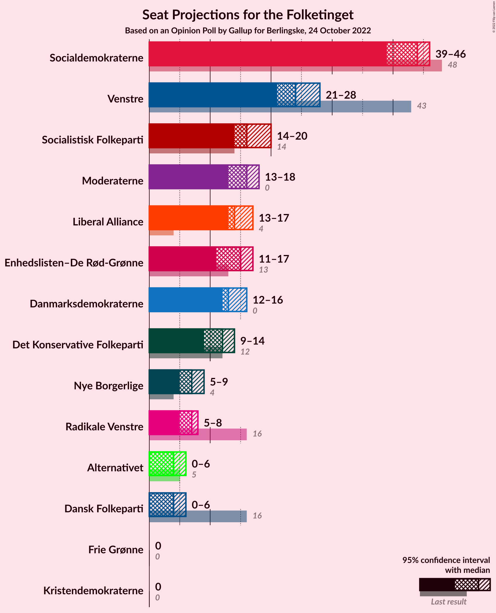

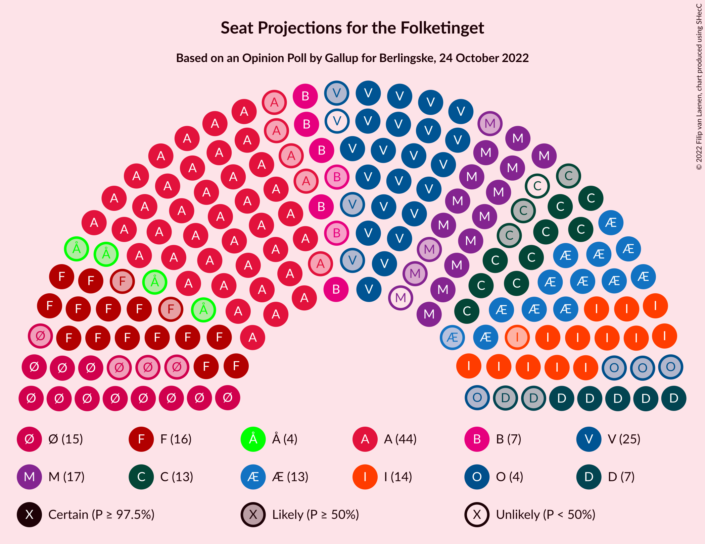

### Confidence Intervals

| Party | Last Result | Median | 80% Confidence Interval | 90% Confidence Interval | 95% Confidence Interval | 99% Confidence Interval |
|:-----:|:-----------:|:------:|:-----------------------:|:-----------------------:|:-----------------------:|:-----------------------:|
| <a href="#socialdemokraterne">Socialdemokraterne</a> | 48 | 44 | 41–46 |40–46 |39–46 |38–48 |
| <a href="#venstre">Venstre</a> | 43 | 24 | 21–27 |21–27 |21–28 |21–28 |
| <a href="#socialistisk-folkeparti">Socialistisk Folkeparti</a> | 14 | 16 | 15–18 |14–20 |14–20 |13–20 |
| <a href="#moderaterne">Moderaterne</a> | 0 | 16 | 14–17 |14–18 |13–18 |12–18 |
| <a href="#liberal-alliance">Liberal Alliance</a> | 4 | 14 | 13–16 |13–17 |13–17 |12–18 |
| <a href="#danmarksdemokraterne">Danmarksdemokraterne</a> | 0 | 13 | 12–15 |12–16 |12–16 |12–16 |
| <a href="#enhedslisten–de-rød-grønne">Enhedslisten–De Rød-Grønne</a> | 13 | 15 | 13–17 |13–17 |11–17 |11–19 |
| <a href="#det-konservative-folkeparti">Det Konservative Folkeparti</a> | 12 | 12 | 10–14 |10–14 |9–14 |9–14 |
| <a href="#nye-borgerlige">Nye Borgerlige</a> | 4 | 7 | 6–8 |5–9 |5–9 |5–10 |
| <a href="#radikale-venstre">Radikale Venstre</a> | 16 | 7 | 5–8 |5–8 |5–8 |5–9 |
| <a href="#alternativet">Alternativet</a> | 5 | 4 | 0–5 |0–6 |0–6 |0–6 |
| <a href="#dansk-folkeparti">Dansk Folkeparti</a> | 16 | 4 | 4–5 |0–5 |0–6 |0–6 |
| <a href="#kristendemokraterne">Kristendemokraterne</a> | 0 | 0 | 0 |0 |0 |0 |
| <a href="#frie-grønne">Frie Grønne</a> | 0 | 0 | 0 |0 |0 |0 |

### Socialdemokraterne

*For a full overview of the results for this party, see the [Socialdemokraterne](party-socialdemokraterne.html) page.*

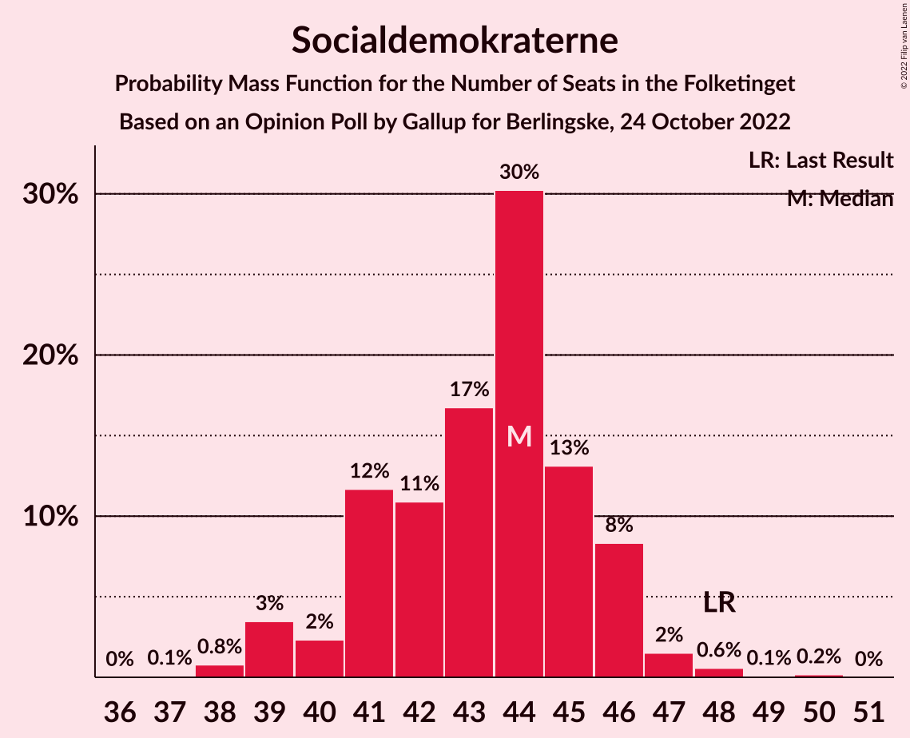

| Number of Seats | Probability | Accumulated | Special Marks |
|:---------------:|:-----------:|:-----------:|:-------------:|
| 37 | 0.1% | 100% |  |
| 38 | 0.8% | 99.9% |  |
| 39 | 3% | 99.1% |  |
| 40 | 2% | 96% |  |
| 41 | 12% | 93% |  |
| 42 | 11% | 82% |  |
| 43 | 17% | 71% |  |
| 44 | 30% | 54% | Median |
| 45 | 13% | 24% |  |
| 46 | 8% | 11% |  |
| 47 | 2% | 2% |  |
| 48 | 0.6% | 0.8% | Last Result |
| 49 | 0.1% | 0.2% |  |
| 50 | 0.2% | 0.2% |  |
| 51 | 0% | 0% |  |

### Venstre

*For a full overview of the results for this party, see the [Venstre](party-venstre.html) page.*

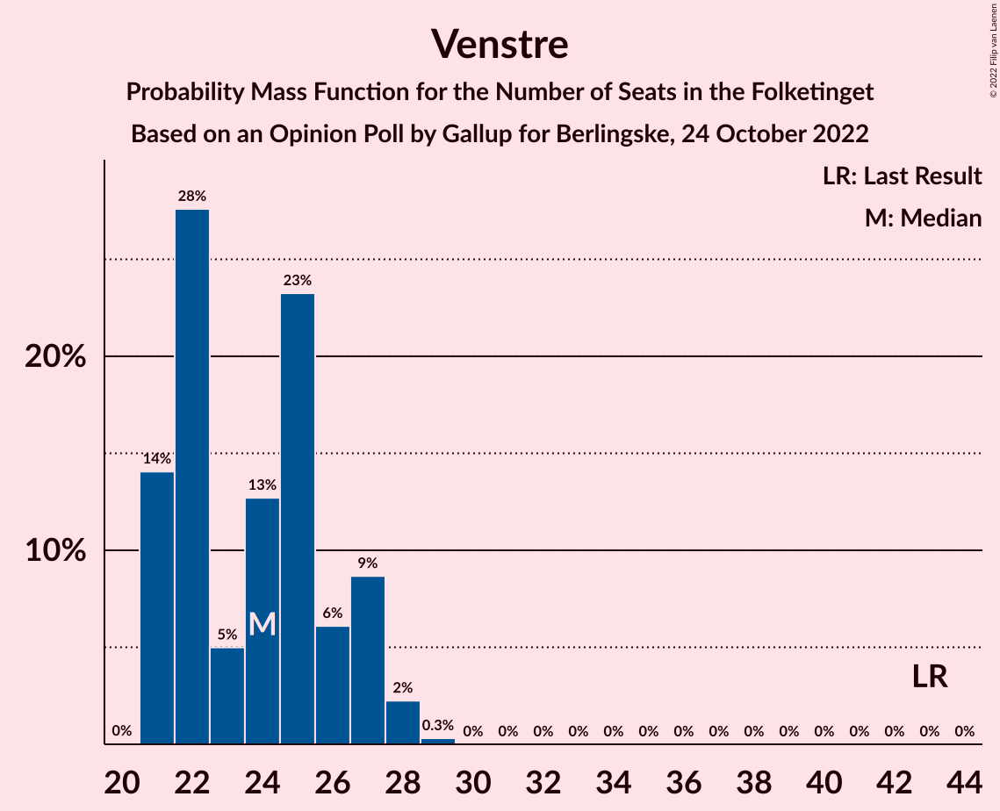

| Number of Seats | Probability | Accumulated | Special Marks |
|:---------------:|:-----------:|:-----------:|:-------------:|
| 21 | 14% | 100% |  |
| 22 | 28% | 86% |  |
| 23 | 5% | 58% |  |
| 24 | 13% | 53% | Median |
| 25 | 23% | 41% |  |
| 26 | 6% | 17% |  |
| 27 | 9% | 11% |  |
| 28 | 2% | 3% |  |
| 29 | 0.3% | 0.3% |  |
| 30 | 0% | 0% |  |
| 31 | 0% | 0% |  |
| 32 | 0% | 0% |  |
| 33 | 0% | 0% |  |
| 34 | 0% | 0% |  |
| 35 | 0% | 0% |  |
| 36 | 0% | 0% |  |
| 37 | 0% | 0% |  |
| 38 | 0% | 0% |  |
| 39 | 0% | 0% |  |
| 40 | 0% | 0% |  |
| 41 | 0% | 0% |  |
| 42 | 0% | 0% |  |
| 43 | 0% | 0% | Last Result |

### Socialistisk Folkeparti

*For a full overview of the results for this party, see the [Socialistisk Folkeparti](party-socialistiskfolkeparti.html) page.*

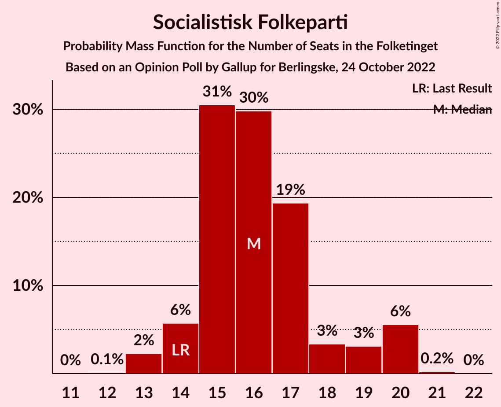

| Number of Seats | Probability | Accumulated | Special Marks |
|:---------------:|:-----------:|:-----------:|:-------------:|
| 12 | 0.1% | 100% |  |
| 13 | 2% | 99.9% |  |
| 14 | 6% | 98% | Last Result |
| 15 | 31% | 92% |  |
| 16 | 30% | 61% | Median |
| 17 | 19% | 32% |  |
| 18 | 3% | 12% |  |
| 19 | 3% | 9% |  |
| 20 | 6% | 6% |  |
| 21 | 0.2% | 0.2% |  |
| 22 | 0% | 0% |  |

### Moderaterne

*For a full overview of the results for this party, see the [Moderaterne](party-moderaterne.html) page.*

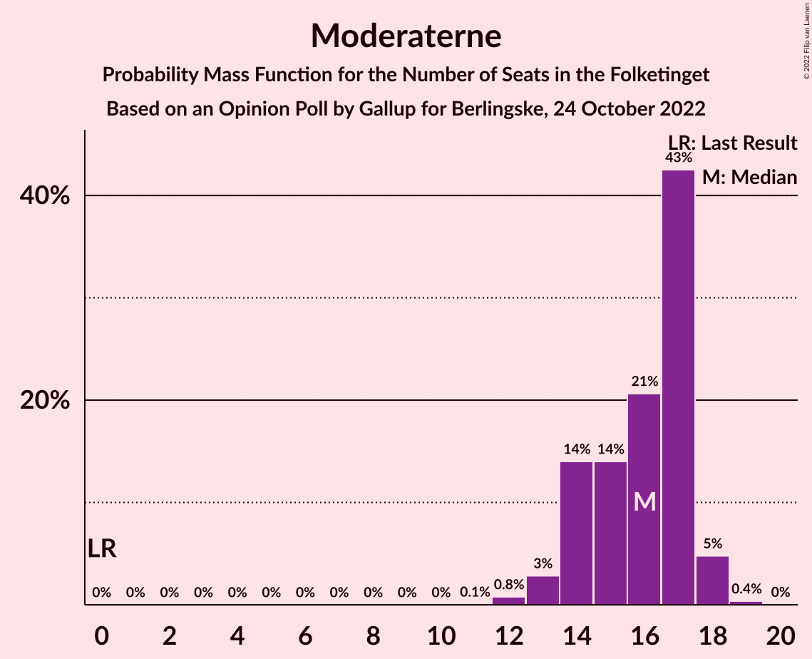

| Number of Seats | Probability | Accumulated | Special Marks |
|:---------------:|:-----------:|:-----------:|:-------------:|
| 0 | 0% | 100% | Last Result |
| 1 | 0% | 100% |  |
| 2 | 0% | 100% |  |
| 3 | 0% | 100% |  |
| 4 | 0% | 100% |  |
| 5 | 0% | 100% |  |
| 6 | 0% | 100% |  |
| 7 | 0% | 100% |  |
| 8 | 0% | 100% |  |
| 9 | 0% | 100% |  |
| 10 | 0% | 100% |  |
| 11 | 0.1% | 100% |  |
| 12 | 0.8% | 99.9% |  |
| 13 | 3% | 99.2% |  |
| 14 | 14% | 96% |  |
| 15 | 14% | 82% |  |
| 16 | 21% | 68% | Median |
| 17 | 43% | 48% |  |
| 18 | 5% | 5% |  |
| 19 | 0.4% | 0.4% |  |
| 20 | 0% | 0% |  |

### Liberal Alliance

*For a full overview of the results for this party, see the [Liberal Alliance](party-liberalalliance.html) page.*

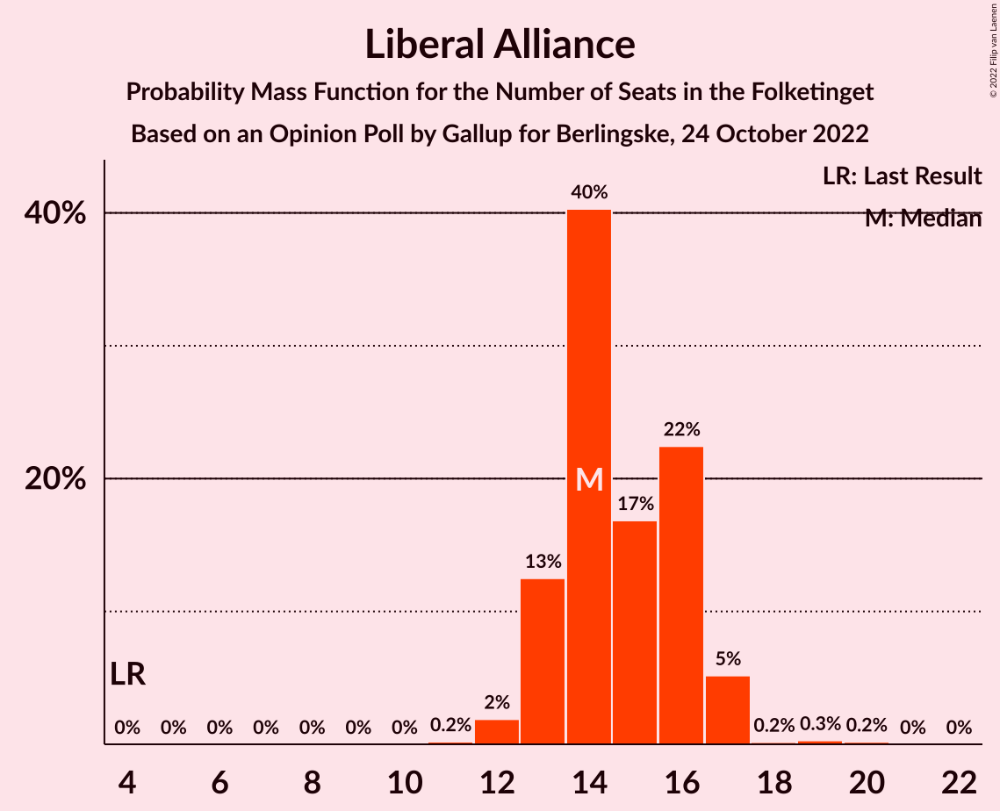

| Number of Seats | Probability | Accumulated | Special Marks |
|:---------------:|:-----------:|:-----------:|:-------------:|
| 4 | 0% | 100% | Last Result |
| 5 | 0% | 100% |  |
| 6 | 0% | 100% |  |
| 7 | 0% | 100% |  |
| 8 | 0% | 100% |  |
| 9 | 0% | 100% |  |
| 10 | 0% | 100% |  |
| 11 | 0.2% | 100% |  |
| 12 | 2% | 99.8% |  |
| 13 | 13% | 98% |  |
| 14 | 40% | 85% | Median |
| 15 | 17% | 45% |  |
| 16 | 22% | 28% |  |
| 17 | 5% | 6% |  |
| 18 | 0.2% | 0.6% |  |
| 19 | 0.3% | 0.5% |  |
| 20 | 0.2% | 0.2% |  |
| 21 | 0% | 0% |  |

### Danmarksdemokraterne

*For a full overview of the results for this party, see the [Danmarksdemokraterne](party-danmarksdemokraterne.html) page.*

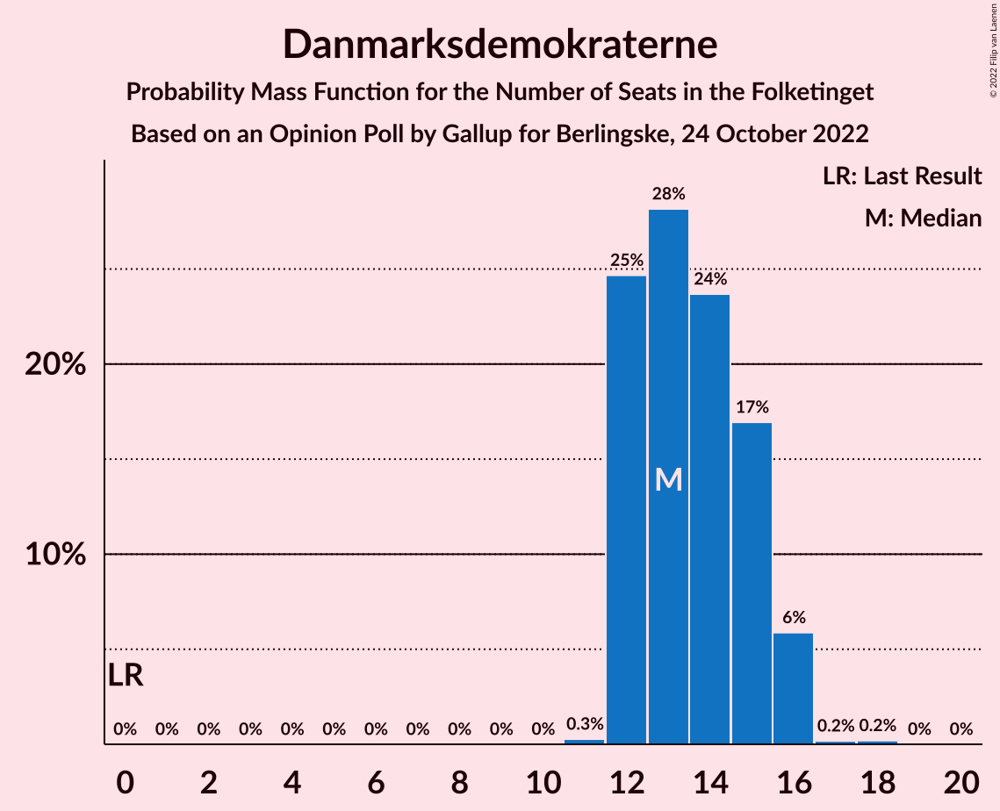

| Number of Seats | Probability | Accumulated | Special Marks |
|:---------------:|:-----------:|:-----------:|:-------------:|
| 0 | 0% | 100% | Last Result |
| 1 | 0% | 100% |  |
| 2 | 0% | 100% |  |
| 3 | 0% | 100% |  |
| 4 | 0% | 100% |  |
| 5 | 0% | 100% |  |
| 6 | 0% | 100% |  |
| 7 | 0% | 100% |  |
| 8 | 0% | 100% |  |
| 9 | 0% | 100% |  |
| 10 | 0% | 100% |  |
| 11 | 0.3% | 100% |  |
| 12 | 25% | 99.7% |  |
| 13 | 28% | 75% | Median |
| 14 | 24% | 47% |  |
| 15 | 17% | 23% |  |
| 16 | 6% | 6% |  |
| 17 | 0.2% | 0.4% |  |
| 18 | 0.2% | 0.2% |  |
| 19 | 0% | 0% |  |

### Enhedslisten–De Rød-Grønne

*For a full overview of the results for this party, see the [Enhedslisten–De Rød-Grønne](party-enhedslisten–derød-grønne.html) page.*

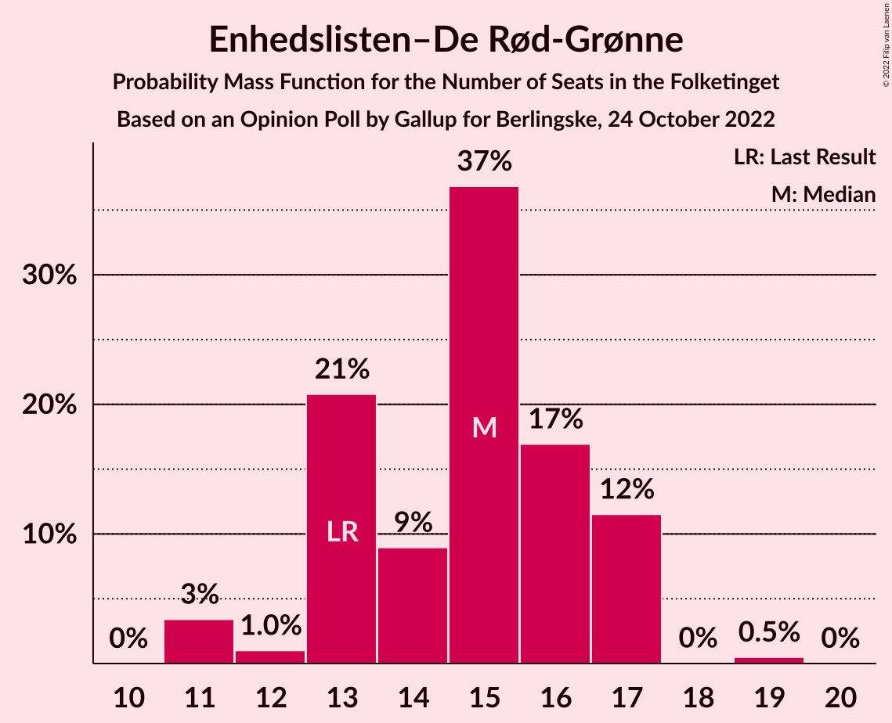

| Number of Seats | Probability | Accumulated | Special Marks |
|:---------------:|:-----------:|:-----------:|:-------------:|
| 11 | 3% | 100% |  |
| 12 | 1.0% | 97% |  |
| 13 | 21% | 96% | Last Result |
| 14 | 9% | 75% |  |
| 15 | 37% | 66% | Median |
| 16 | 17% | 29% |  |
| 17 | 12% | 12% |  |
| 18 | 0% | 0.5% |  |
| 19 | 0.5% | 0.5% |  |
| 20 | 0% | 0% |  |

### Det Konservative Folkeparti

*For a full overview of the results for this party, see the [Det Konservative Folkeparti](party-detkonservativefolkeparti.html) page.*

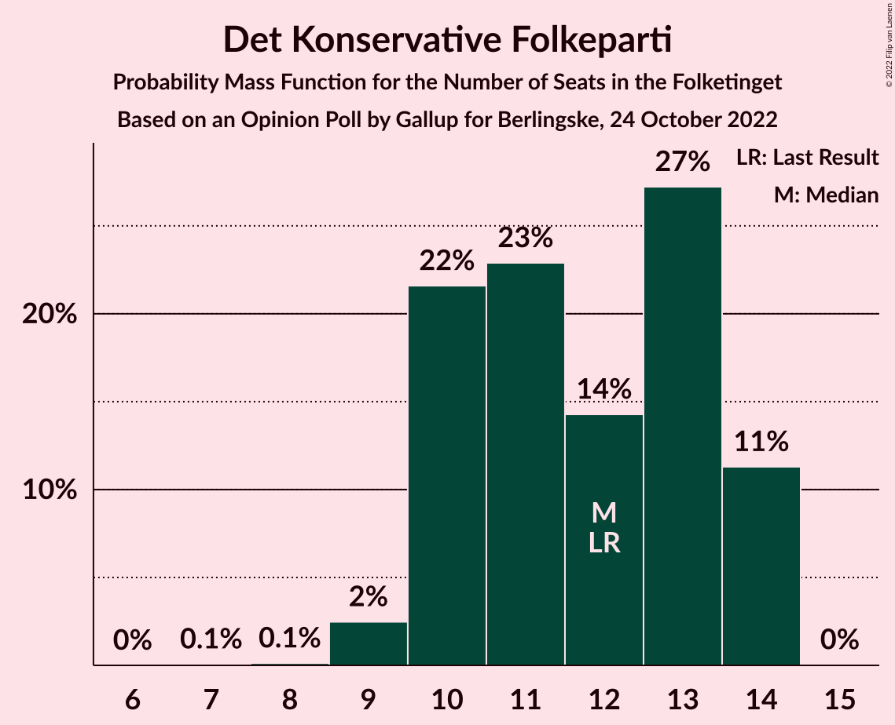

| Number of Seats | Probability | Accumulated | Special Marks |
|:---------------:|:-----------:|:-----------:|:-------------:|
| 7 | 0.1% | 100% |  |
| 8 | 0.1% | 99.9% |  |
| 9 | 2% | 99.8% |  |
| 10 | 22% | 97% |  |
| 11 | 23% | 76% |  |
| 12 | 14% | 53% | Last Result, Median |
| 13 | 27% | 39% |  |
| 14 | 11% | 11% |  |
| 15 | 0% | 0% |  |

### Nye Borgerlige

*For a full overview of the results for this party, see the [Nye Borgerlige](party-nyeborgerlige.html) page.*

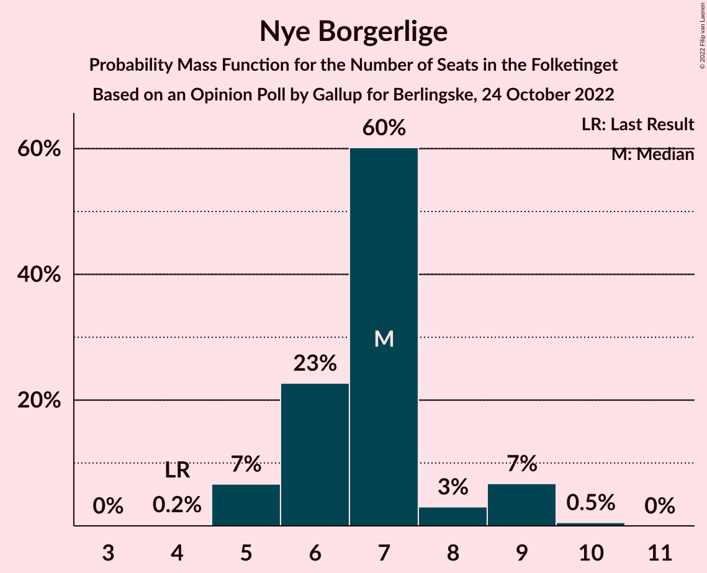

| Number of Seats | Probability | Accumulated | Special Marks |
|:---------------:|:-----------:|:-----------:|:-------------:|
| 4 | 0.2% | 100% | Last Result |
| 5 | 7% | 99.8% |  |
| 6 | 23% | 93% |  |
| 7 | 60% | 70% | Median |
| 8 | 3% | 10% |  |
| 9 | 7% | 7% |  |
| 10 | 0.5% | 0.5% |  |
| 11 | 0% | 0% |  |

### Radikale Venstre

*For a full overview of the results for this party, see the [Radikale Venstre](party-radikalevenstre.html) page.*

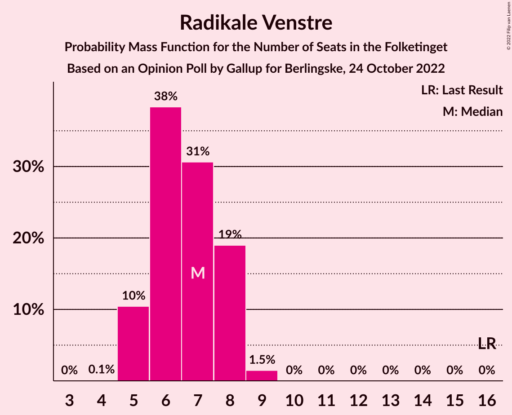

| Number of Seats | Probability | Accumulated | Special Marks |
|:---------------:|:-----------:|:-----------:|:-------------:|
| 4 | 0.1% | 100% |  |
| 5 | 10% | 99.9% |  |
| 6 | 38% | 89% |  |
| 7 | 31% | 51% | Median |
| 8 | 19% | 20% |  |
| 9 | 1.5% | 1.5% |  |
| 10 | 0% | 0% |  |
| 11 | 0% | 0% |  |
| 12 | 0% | 0% |  |
| 13 | 0% | 0% |  |
| 14 | 0% | 0% |  |
| 15 | 0% | 0% |  |
| 16 | 0% | 0% | Last Result |

### Alternativet

*For a full overview of the results for this party, see the [Alternativet](party-alternativet.html) page.*

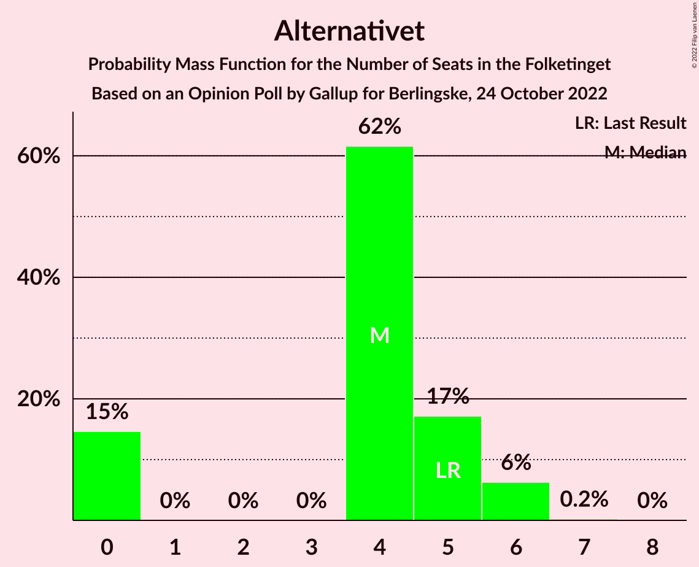

| Number of Seats | Probability | Accumulated | Special Marks |
|:---------------:|:-----------:|:-----------:|:-------------:|
| 0 | 15% | 100% |  |
| 1 | 0% | 85% |  |
| 2 | 0% | 85% |  |
| 3 | 0% | 85% |  |
| 4 | 62% | 85% | Median |
| 5 | 17% | 24% | Last Result |
| 6 | 6% | 7% |  |
| 7 | 0.2% | 0.3% |  |
| 8 | 0% | 0% |  |

### Dansk Folkeparti

*For a full overview of the results for this party, see the [Dansk Folkeparti](party-danskfolkeparti.html) page.*

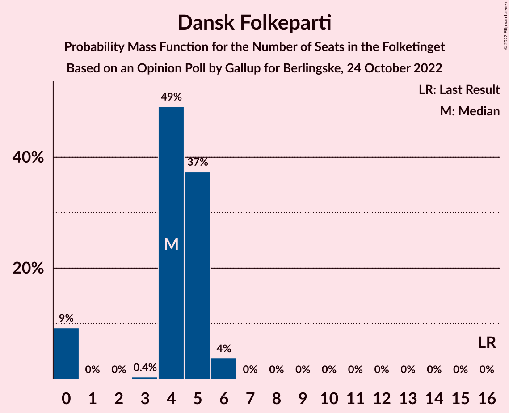

| Number of Seats | Probability | Accumulated | Special Marks |
|:---------------:|:-----------:|:-----------:|:-------------:|
| 0 | 9% | 100% |  |
| 1 | 0% | 91% |  |
| 2 | 0% | 91% |  |
| 3 | 0.4% | 91% |  |
| 4 | 49% | 90% | Median |
| 5 | 37% | 41% |  |
| 6 | 4% | 4% |  |
| 7 | 0% | 0% |  |
| 8 | 0% | 0% |  |
| 9 | 0% | 0% |  |
| 10 | 0% | 0% |  |
| 11 | 0% | 0% |  |
| 12 | 0% | 0% |  |
| 13 | 0% | 0% |  |
| 14 | 0% | 0% |  |
| 15 | 0% | 0% |  |
| 16 | 0% | 0% | Last Result |

### Kristendemokraterne

*For a full overview of the results for this party, see the [Kristendemokraterne](party-kristendemokraterne.html) page.*

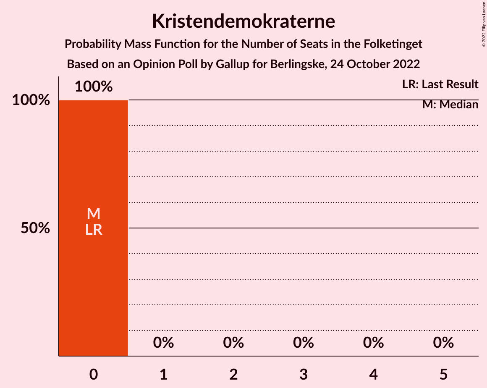

| Number of Seats | Probability | Accumulated | Special Marks |
|:---------------:|:-----------:|:-----------:|:-------------:|
| 0 | 100% | 100% | Last Result, Median |

### Frie Grønne

*For a full overview of the results for this party, see the [Frie Grønne](party-friegrønne.html) page.*

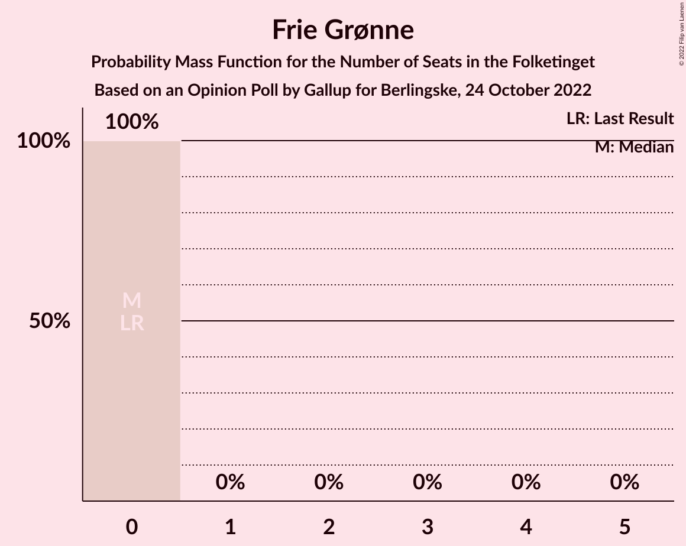

| Number of Seats | Probability | Accumulated | Special Marks |
|:---------------:|:-----------:|:-----------:|:-------------:|
| 0 | 100% | 100% | Last Result, Median |

## Coalitions

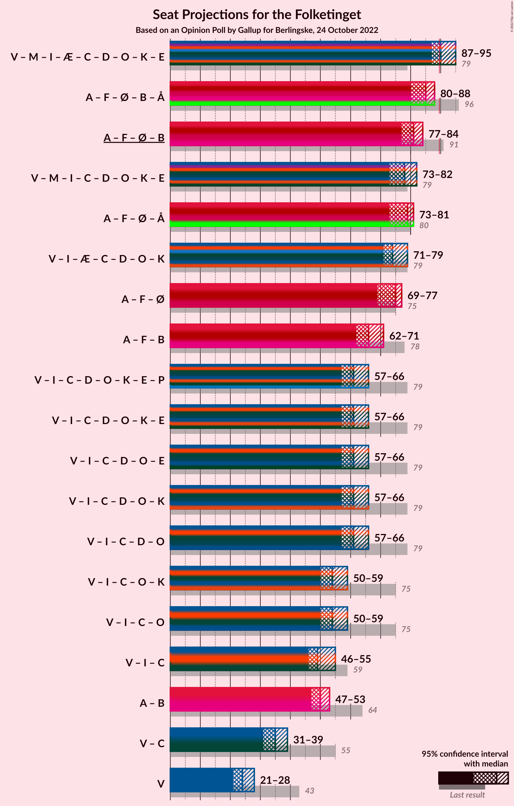

### Confidence Intervals

| Coalition | Last Result | Median | Majority? | 80% Confidence Interval | 90% Confidence Interval | 95% Confidence Interval | 99% Confidence Interval |
|:---------:|:-----------:|:------:|:---------:|:-----------------------:|:-----------------------:|:-----------------------:|:-----------------------:|
| Socialdemokraterne – Socialistisk Folkeparti – Enhedslisten–De Rød-Grønne – Radikale Venstre – Alternativet | 96 | 85 | 0.6% | 82–87 | 80–87 | 80–88 | 76–90 |
| Socialdemokraterne – Socialistisk Folkeparti – Enhedslisten–De Rød-Grønne – Radikale Venstre | 91 | 81 | 0% | 77–83 | 77–84 | 77–84 | 76–88 |
| Socialdemokraterne – Socialistisk Folkeparti – Enhedslisten–De Rød-Grønne – Alternativet | 80 | 79 | 0% | 74–81 | 73–81 | 73–81 | 70–83 |
| Venstre – Liberal Alliance – Danmarksdemokraterne – Det Konservative Folkeparti – Nye Borgerlige – Dansk Folkeparti – Kristendemokraterne | 79 | 74 | 0% | 72–78 | 72–79 | 71–79 | 69–81 |
| Socialdemokraterne – Socialistisk Folkeparti – Enhedslisten–De Rød-Grønne | 75 | 75 | 0% | 71–76 | 70–77 | 69–77 | 68–80 |
| Socialdemokraterne – Socialistisk Folkeparti – Radikale Venstre | 78 | 66 | 0% | 63–69 | 63–69 | 62–71 | 61–74 |
| Venstre – Liberal Alliance – Det Konservative Folkeparti – Nye Borgerlige – Dansk Folkeparti – Kristendemokraterne | 79 | 61 | 0% | 59–64 | 58–66 | 57–66 | 54–66 |
| Venstre – Liberal Alliance – Det Konservative Folkeparti – Nye Borgerlige – Dansk Folkeparti | 79 | 61 | 0% | 59–64 | 58–66 | 57–66 | 54–66 |
| Venstre – Liberal Alliance – Det Konservative Folkeparti – Dansk Folkeparti – Kristendemokraterne | 75 | 54 | 0% | 52–58 | 50–59 | 50–59 | 46–60 |
| Venstre – Liberal Alliance – Det Konservative Folkeparti – Dansk Folkeparti | 75 | 54 | 0% | 52–58 | 50–59 | 50–59 | 46–60 |
| Venstre – Liberal Alliance – Det Konservative Folkeparti | 59 | 49 | 0% | 48–54 | 46–54 | 46–55 | 45–56 |
| Socialdemokraterne – Radikale Venstre | 64 | 50 | 0% | 48–52 | 47–52 | 47–53 | 45–56 |
| Venstre – Det Konservative Folkeparti | 55 | 35 | 0% | 32–39 | 32–39 | 31–39 | 31–40 |
| Venstre | 43 | 24 | 0% | 21–27 | 21–27 | 21–28 | 21–28 |

### Socialdemokraterne – Socialistisk Folkeparti – Enhedslisten–De Rød-Grønne – Radikale Venstre – Alternativet

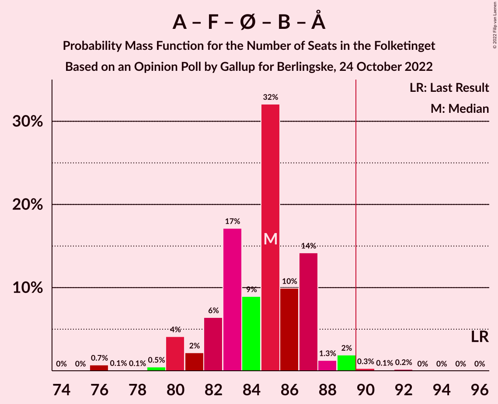

| Number of Seats | Probability | Accumulated | Special Marks |
|:---------------:|:-----------:|:-----------:|:-------------:|
| 76 | 0.7% | 100% |  |
| 77 | 0.1% | 99.3% |  |
| 78 | 0.1% | 99.2% |  |
| 79 | 0.5% | 99.2% |  |
| 80 | 4% | 98.7% |  |
| 81 | 2% | 95% |  |
| 82 | 6% | 92% |  |
| 83 | 17% | 86% |  |
| 84 | 9% | 69% |  |
| 85 | 32% | 60% |  |
| 86 | 10% | 28% | Median |
| 87 | 14% | 18% |  |
| 88 | 1.3% | 4% |  |
| 89 | 2% | 2% |  |
| 90 | 0.3% | 0.6% | Majority |
| 91 | 0.1% | 0.3% |  |
| 92 | 0.2% | 0.2% |  |
| 93 | 0% | 0% |  |
| 94 | 0% | 0% |  |
| 95 | 0% | 0% |  |
| 96 | 0% | 0% | Last Result |

### Socialdemokraterne – Socialistisk Folkeparti – Enhedslisten–De Rød-Grønne – Radikale Venstre

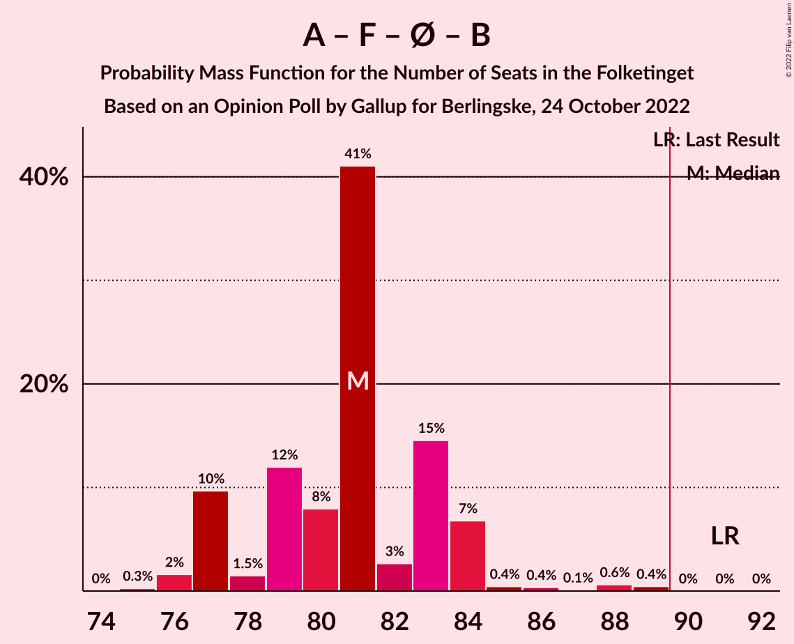

| Number of Seats | Probability | Accumulated | Special Marks |
|:---------------:|:-----------:|:-----------:|:-------------:|
| 75 | 0.3% | 100% |  |
| 76 | 2% | 99.7% |  |
| 77 | 10% | 98% |  |
| 78 | 1.5% | 88% |  |
| 79 | 12% | 87% |  |
| 80 | 8% | 75% |  |
| 81 | 41% | 67% |  |
| 82 | 3% | 26% | Median |
| 83 | 15% | 23% |  |
| 84 | 7% | 9% |  |
| 85 | 0.4% | 2% |  |
| 86 | 0.4% | 2% |  |
| 87 | 0.1% | 1.2% |  |
| 88 | 0.6% | 1.1% |  |
| 89 | 0.4% | 0.4% |  |
| 90 | 0% | 0% | Majority |
| 91 | 0% | 0% | Last Result |

### Socialdemokraterne – Socialistisk Folkeparti – Enhedslisten–De Rød-Grønne – Alternativet

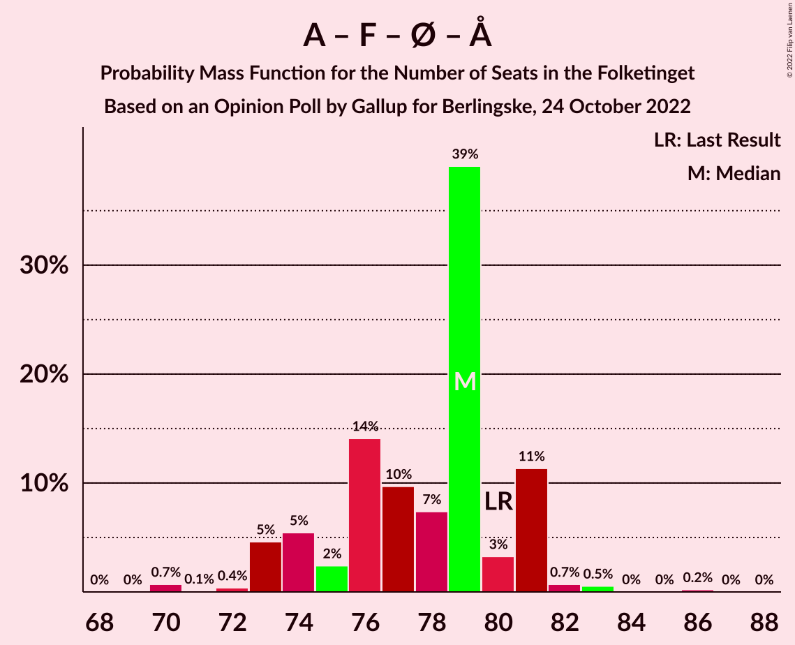

| Number of Seats | Probability | Accumulated | Special Marks |
|:---------------:|:-----------:|:-----------:|:-------------:|
| 70 | 0.7% | 100% |  |
| 71 | 0.1% | 99.3% |  |
| 72 | 0.4% | 99.2% |  |
| 73 | 5% | 98.8% |  |
| 74 | 5% | 94% |  |
| 75 | 2% | 89% |  |
| 76 | 14% | 86% |  |
| 77 | 10% | 72% |  |
| 78 | 7% | 63% |  |
| 79 | 39% | 55% | Median |
| 80 | 3% | 16% | Last Result |
| 81 | 11% | 13% |  |
| 82 | 0.7% | 2% |  |
| 83 | 0.5% | 0.8% |  |
| 84 | 0% | 0.3% |  |
| 85 | 0% | 0.2% |  |
| 86 | 0.2% | 0.2% |  |
| 87 | 0% | 0% |  |

### Venstre – Liberal Alliance – Danmarksdemokraterne – Det Konservative Folkeparti – Nye Borgerlige – Dansk Folkeparti – Kristendemokraterne

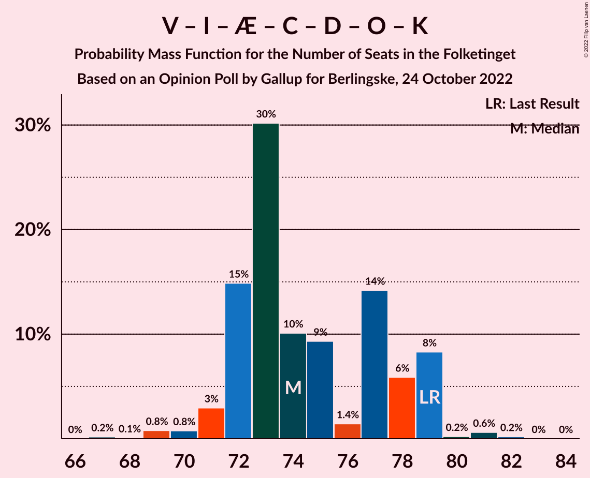

| Number of Seats | Probability | Accumulated | Special Marks |
|:---------------:|:-----------:|:-----------:|:-------------:|
| 67 | 0.2% | 100% |  |
| 68 | 0.1% | 99.8% |  |
| 69 | 0.8% | 99.8% |  |
| 70 | 0.8% | 99.0% |  |
| 71 | 3% | 98% |  |
| 72 | 15% | 95% |  |
| 73 | 30% | 80% |  |
| 74 | 10% | 50% | Median |
| 75 | 9% | 40% |  |
| 76 | 1.4% | 31% |  |
| 77 | 14% | 29% |  |
| 78 | 6% | 15% |  |
| 79 | 8% | 9% | Last Result |
| 80 | 0.2% | 1.0% |  |
| 81 | 0.6% | 0.8% |  |
| 82 | 0.2% | 0.2% |  |
| 83 | 0% | 0% |  |

### Socialdemokraterne – Socialistisk Folkeparti – Enhedslisten–De Rød-Grønne

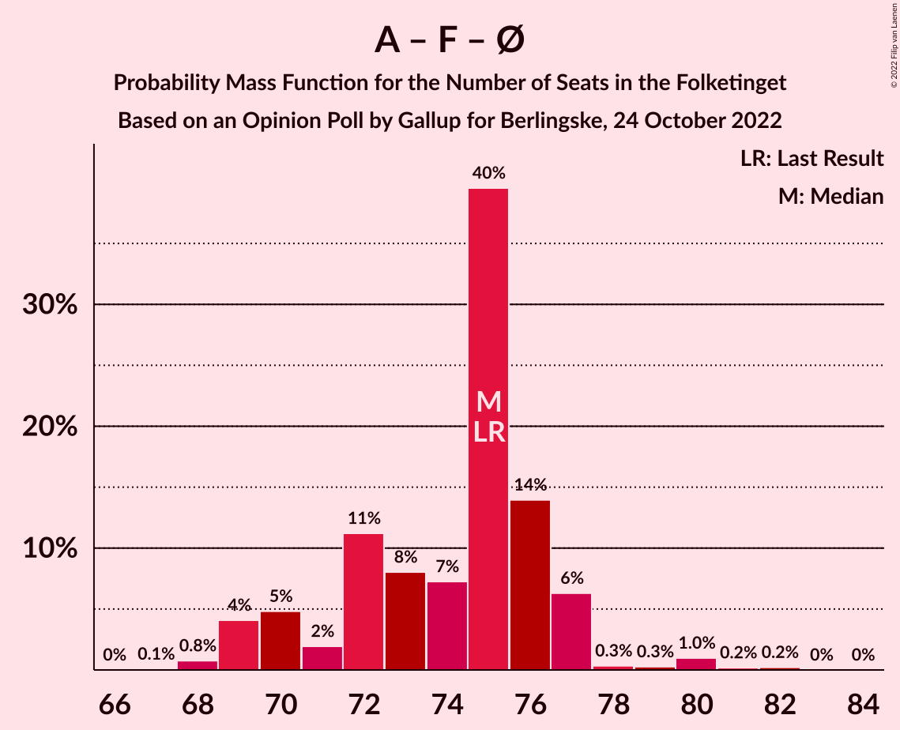

| Number of Seats | Probability | Accumulated | Special Marks |
|:---------------:|:-----------:|:-----------:|:-------------:|
| 67 | 0.1% | 100% |  |
| 68 | 0.8% | 99.9% |  |
| 69 | 4% | 99.2% |  |
| 70 | 5% | 95% |  |
| 71 | 2% | 90% |  |
| 72 | 11% | 88% |  |
| 73 | 8% | 77% |  |
| 74 | 7% | 69% |  |
| 75 | 40% | 62% | Last Result, Median |
| 76 | 14% | 22% |  |
| 77 | 6% | 8% |  |
| 78 | 0.3% | 2% |  |
| 79 | 0.3% | 2% |  |
| 80 | 1.0% | 1.4% |  |
| 81 | 0.2% | 0.4% |  |
| 82 | 0.2% | 0.2% |  |
| 83 | 0% | 0% |  |

### Socialdemokraterne – Socialistisk Folkeparti – Radikale Venstre

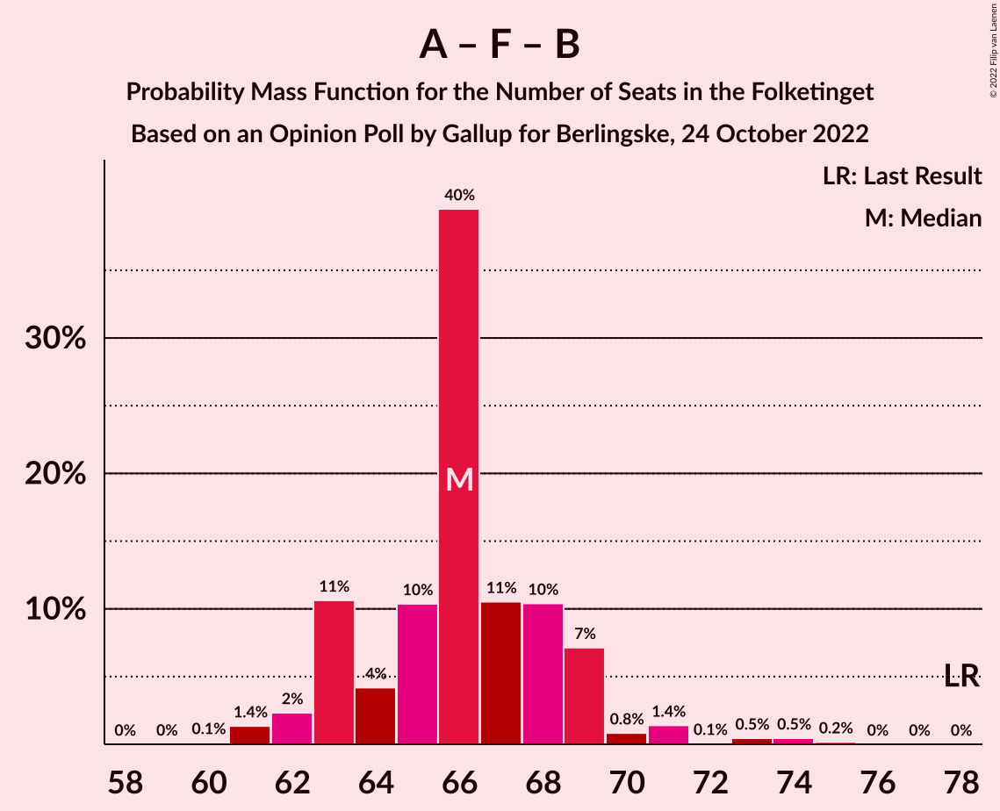

| Number of Seats | Probability | Accumulated | Special Marks |
|:---------------:|:-----------:|:-----------:|:-------------:|
| 60 | 0.1% | 100% |  |
| 61 | 1.4% | 99.9% |  |
| 62 | 2% | 98.5% |  |
| 63 | 11% | 96% |  |
| 64 | 4% | 86% |  |
| 65 | 10% | 81% |  |
| 66 | 40% | 71% |  |
| 67 | 11% | 31% | Median |
| 68 | 10% | 21% |  |
| 69 | 7% | 11% |  |
| 70 | 0.8% | 3% |  |
| 71 | 1.4% | 3% |  |
| 72 | 0.1% | 1.1% |  |
| 73 | 0.5% | 1.1% |  |
| 74 | 0.5% | 0.6% |  |
| 75 | 0.2% | 0.2% |  |
| 76 | 0% | 0% |  |
| 77 | 0% | 0% |  |
| 78 | 0% | 0% | Last Result |

### Venstre – Liberal Alliance – Det Konservative Folkeparti – Nye Borgerlige – Dansk Folkeparti – Kristendemokraterne

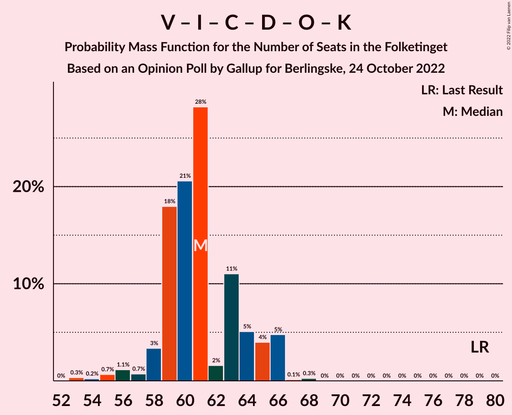

| Number of Seats | Probability | Accumulated | Special Marks |
|:---------------:|:-----------:|:-----------:|:-------------:|
| 53 | 0.3% | 100% |  |
| 54 | 0.2% | 99.7% |  |
| 55 | 0.7% | 99.4% |  |
| 56 | 1.1% | 98.8% |  |
| 57 | 0.7% | 98% |  |
| 58 | 3% | 97% |  |
| 59 | 18% | 94% |  |
| 60 | 21% | 76% |  |
| 61 | 28% | 55% | Median |
| 62 | 2% | 27% |  |
| 63 | 11% | 25% |  |
| 64 | 5% | 14% |  |
| 65 | 4% | 9% |  |
| 66 | 5% | 5% |  |
| 67 | 0.1% | 0.4% |  |
| 68 | 0.3% | 0.3% |  |
| 69 | 0% | 0% |  |
| 70 | 0% | 0% |  |
| 71 | 0% | 0% |  |
| 72 | 0% | 0% |  |
| 73 | 0% | 0% |  |
| 74 | 0% | 0% |  |
| 75 | 0% | 0% |  |
| 76 | 0% | 0% |  |
| 77 | 0% | 0% |  |
| 78 | 0% | 0% |  |
| 79 | 0% | 0% | Last Result |

### Venstre – Liberal Alliance – Det Konservative Folkeparti – Nye Borgerlige – Dansk Folkeparti

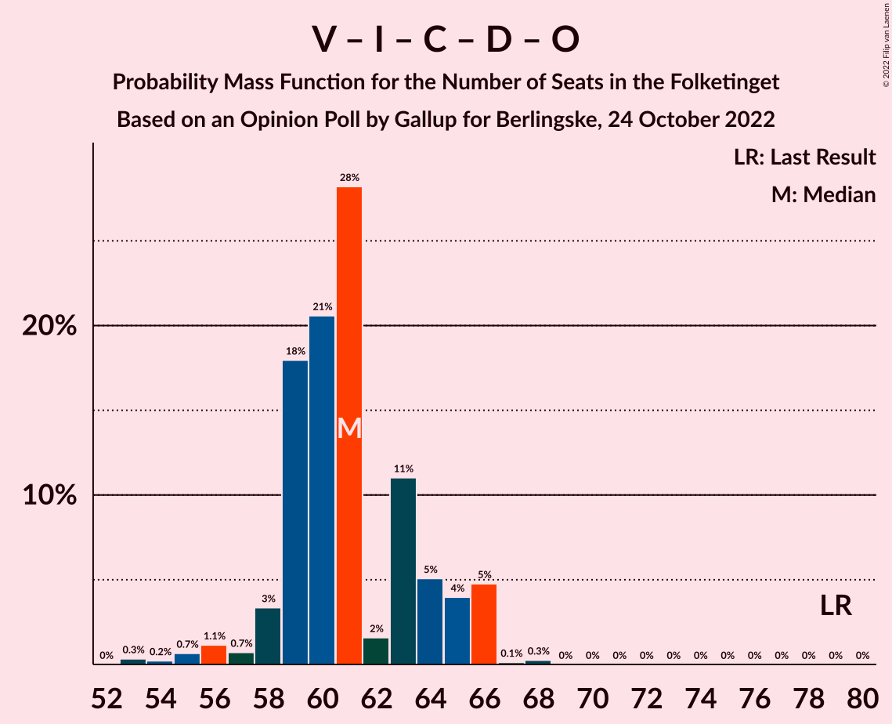

| Number of Seats | Probability | Accumulated | Special Marks |
|:---------------:|:-----------:|:-----------:|:-------------:|
| 53 | 0.3% | 100% |  |
| 54 | 0.2% | 99.7% |  |
| 55 | 0.7% | 99.4% |  |
| 56 | 1.1% | 98.8% |  |
| 57 | 0.7% | 98% |  |
| 58 | 3% | 97% |  |
| 59 | 18% | 94% |  |
| 60 | 21% | 76% |  |
| 61 | 28% | 55% | Median |
| 62 | 2% | 27% |  |
| 63 | 11% | 25% |  |
| 64 | 5% | 14% |  |
| 65 | 4% | 9% |  |
| 66 | 5% | 5% |  |
| 67 | 0.1% | 0.4% |  |
| 68 | 0.3% | 0.3% |  |
| 69 | 0% | 0% |  |
| 70 | 0% | 0% |  |
| 71 | 0% | 0% |  |
| 72 | 0% | 0% |  |
| 73 | 0% | 0% |  |
| 74 | 0% | 0% |  |
| 75 | 0% | 0% |  |
| 76 | 0% | 0% |  |
| 77 | 0% | 0% |  |
| 78 | 0% | 0% |  |
| 79 | 0% | 0% | Last Result |

### Venstre – Liberal Alliance – Det Konservative Folkeparti – Dansk Folkeparti – Kristendemokraterne

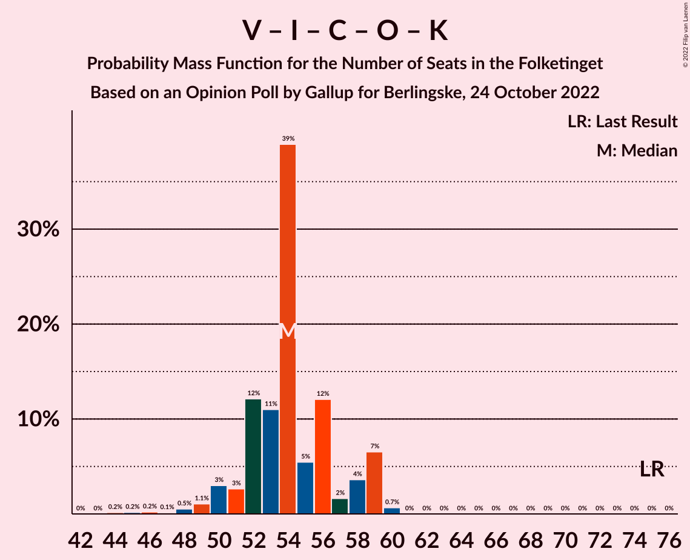

| Number of Seats | Probability | Accumulated | Special Marks |
|:---------------:|:-----------:|:-----------:|:-------------:|
| 44 | 0.2% | 100% |  |
| 45 | 0.2% | 99.8% |  |
| 46 | 0.2% | 99.7% |  |
| 47 | 0.1% | 99.5% |  |
| 48 | 0.5% | 99.3% |  |
| 49 | 1.1% | 98.8% |  |
| 50 | 3% | 98% |  |
| 51 | 3% | 95% |  |
| 52 | 12% | 92% |  |
| 53 | 11% | 80% |  |
| 54 | 39% | 69% | Median |
| 55 | 5% | 30% |  |
| 56 | 12% | 25% |  |
| 57 | 2% | 12% |  |
| 58 | 4% | 11% |  |
| 59 | 7% | 7% |  |
| 60 | 0.7% | 0.7% |  |
| 61 | 0% | 0% |  |
| 62 | 0% | 0% |  |
| 63 | 0% | 0% |  |
| 64 | 0% | 0% |  |
| 65 | 0% | 0% |  |
| 66 | 0% | 0% |  |
| 67 | 0% | 0% |  |
| 68 | 0% | 0% |  |
| 69 | 0% | 0% |  |
| 70 | 0% | 0% |  |
| 71 | 0% | 0% |  |
| 72 | 0% | 0% |  |
| 73 | 0% | 0% |  |
| 74 | 0% | 0% |  |
| 75 | 0% | 0% | Last Result |

### Venstre – Liberal Alliance – Det Konservative Folkeparti – Dansk Folkeparti

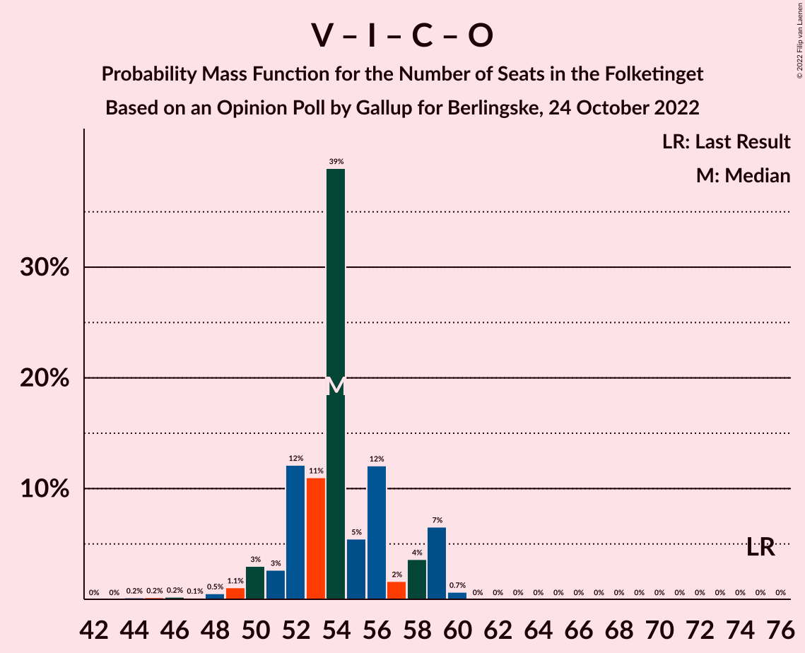

| Number of Seats | Probability | Accumulated | Special Marks |
|:---------------:|:-----------:|:-----------:|:-------------:|
| 44 | 0.2% | 100% |  |
| 45 | 0.2% | 99.8% |  |
| 46 | 0.2% | 99.7% |  |
| 47 | 0.1% | 99.5% |  |
| 48 | 0.5% | 99.3% |  |
| 49 | 1.1% | 98.8% |  |
| 50 | 3% | 98% |  |
| 51 | 3% | 95% |  |
| 52 | 12% | 92% |  |
| 53 | 11% | 80% |  |
| 54 | 39% | 69% | Median |
| 55 | 5% | 30% |  |
| 56 | 12% | 25% |  |
| 57 | 2% | 12% |  |
| 58 | 4% | 11% |  |
| 59 | 7% | 7% |  |
| 60 | 0.7% | 0.7% |  |
| 61 | 0% | 0% |  |
| 62 | 0% | 0% |  |
| 63 | 0% | 0% |  |
| 64 | 0% | 0% |  |
| 65 | 0% | 0% |  |
| 66 | 0% | 0% |  |
| 67 | 0% | 0% |  |
| 68 | 0% | 0% |  |
| 69 | 0% | 0% |  |
| 70 | 0% | 0% |  |
| 71 | 0% | 0% |  |
| 72 | 0% | 0% |  |
| 73 | 0% | 0% |  |
| 74 | 0% | 0% |  |
| 75 | 0% | 0% | Last Result |

### Venstre – Liberal Alliance – Det Konservative Folkeparti

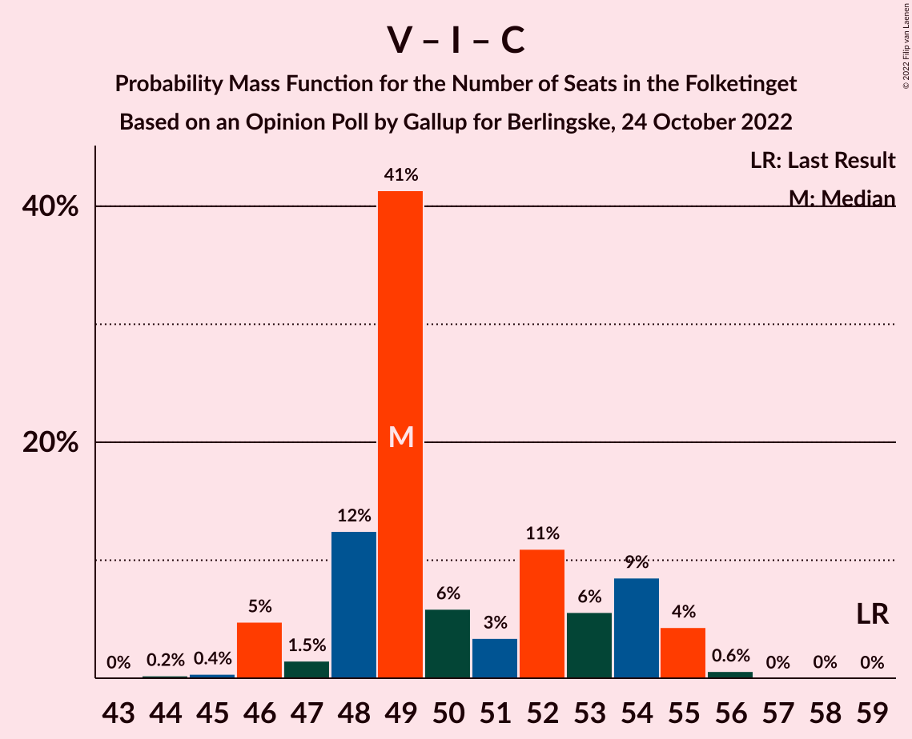

| Number of Seats | Probability | Accumulated | Special Marks |
|:---------------:|:-----------:|:-----------:|:-------------:|
| 44 | 0.2% | 100% |  |
| 45 | 0.4% | 99.8% |  |
| 46 | 5% | 99.4% |  |
| 47 | 1.5% | 95% |  |
| 48 | 12% | 93% |  |
| 49 | 41% | 81% |  |
| 50 | 6% | 39% | Median |
| 51 | 3% | 33% |  |
| 52 | 11% | 30% |  |
| 53 | 6% | 19% |  |
| 54 | 9% | 13% |  |
| 55 | 4% | 5% |  |
| 56 | 0.6% | 0.6% |  |
| 57 | 0% | 0.1% |  |
| 58 | 0% | 0% |  |
| 59 | 0% | 0% | Last Result |

### Socialdemokraterne – Radikale Venstre

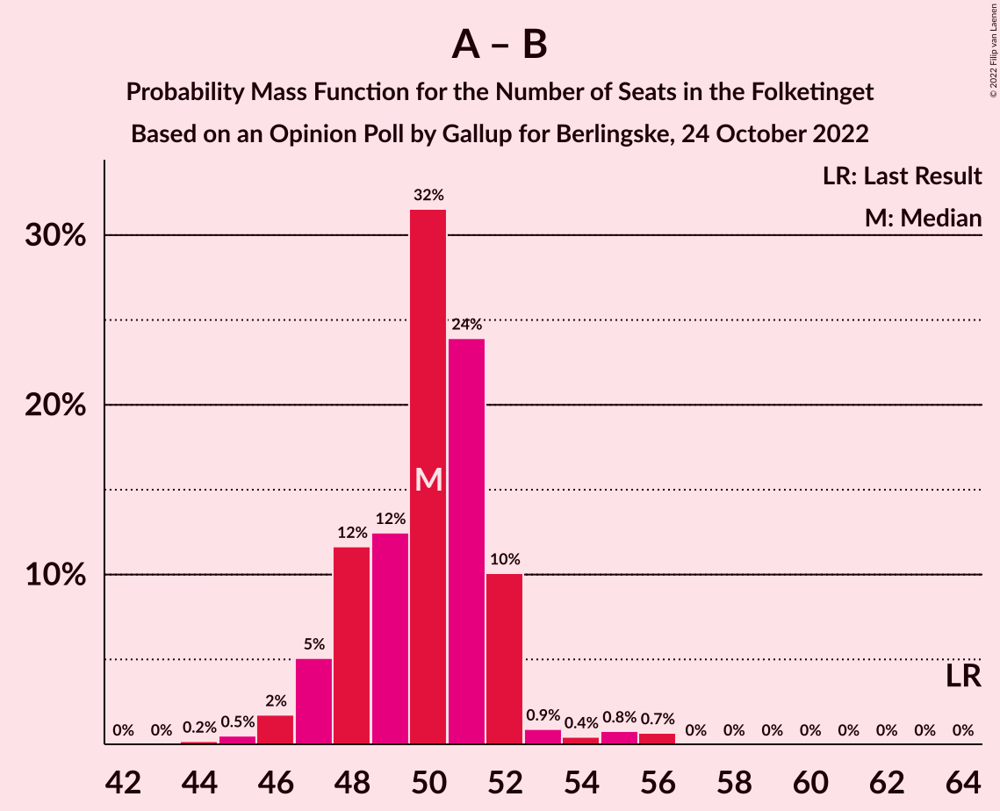

| Number of Seats | Probability | Accumulated | Special Marks |
|:---------------:|:-----------:|:-----------:|:-------------:|
| 44 | 0.2% | 100% |  |
| 45 | 0.5% | 99.8% |  |
| 46 | 2% | 99.3% |  |
| 47 | 5% | 98% |  |
| 48 | 12% | 92% |  |
| 49 | 12% | 81% |  |
| 50 | 32% | 68% |  |
| 51 | 24% | 37% | Median |
| 52 | 10% | 13% |  |
| 53 | 0.9% | 3% |  |
| 54 | 0.4% | 2% |  |
| 55 | 0.8% | 1.5% |  |
| 56 | 0.7% | 0.7% |  |
| 57 | 0% | 0% |  |
| 58 | 0% | 0% |  |
| 59 | 0% | 0% |  |
| 60 | 0% | 0% |  |
| 61 | 0% | 0% |  |
| 62 | 0% | 0% |  |
| 63 | 0% | 0% |  |
| 64 | 0% | 0% | Last Result |

### Venstre – Det Konservative Folkeparti

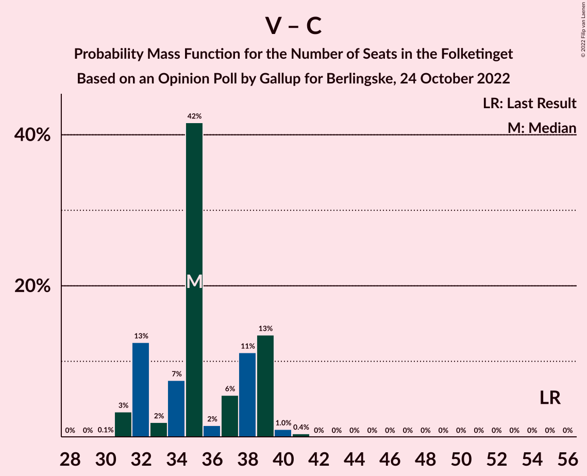

| Number of Seats | Probability | Accumulated | Special Marks |
|:---------------:|:-----------:|:-----------:|:-------------:|
| 30 | 0.1% | 100% |  |
| 31 | 3% | 99.9% |  |
| 32 | 13% | 97% |  |
| 33 | 2% | 84% |  |
| 34 | 7% | 82% |  |
| 35 | 42% | 75% |  |
| 36 | 2% | 33% | Median |
| 37 | 6% | 32% |  |
| 38 | 11% | 26% |  |
| 39 | 13% | 15% |  |
| 40 | 1.0% | 1.4% |  |
| 41 | 0.4% | 0.4% |  |
| 42 | 0% | 0% |  |
| 43 | 0% | 0% |  |
| 44 | 0% | 0% |  |
| 45 | 0% | 0% |  |
| 46 | 0% | 0% |  |
| 47 | 0% | 0% |  |
| 48 | 0% | 0% |  |
| 49 | 0% | 0% |  |
| 50 | 0% | 0% |  |
| 51 | 0% | 0% |  |
| 52 | 0% | 0% |  |
| 53 | 0% | 0% |  |
| 54 | 0% | 0% |  |
| 55 | 0% | 0% | Last Result |

### Venstre

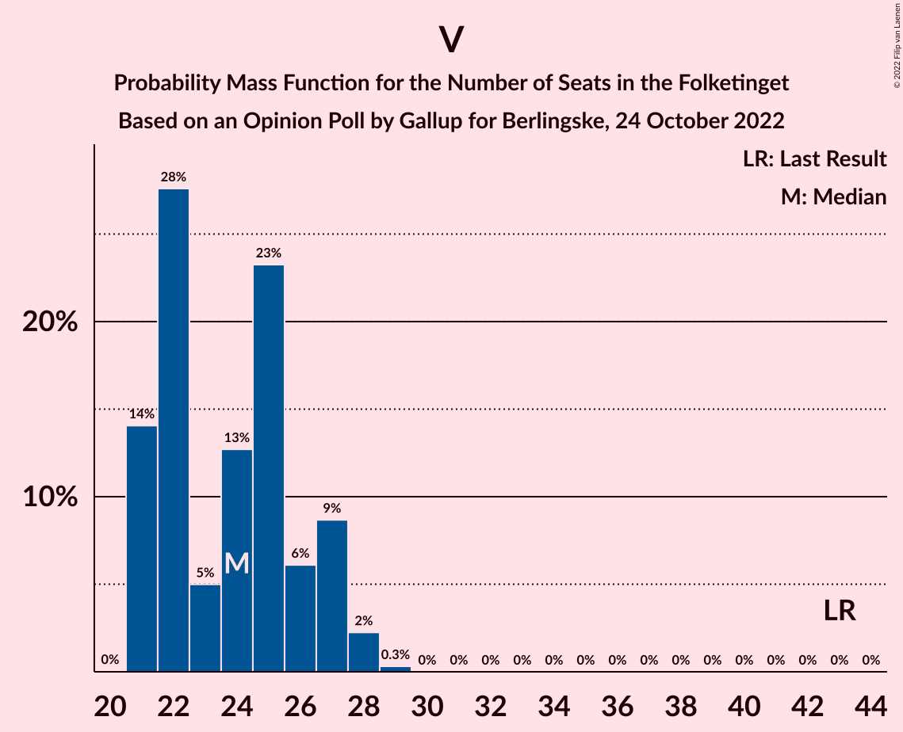

| Number of Seats | Probability | Accumulated | Special Marks |
|:---------------:|:-----------:|:-----------:|:-------------:|
| 21 | 14% | 100% |  |
| 22 | 28% | 86% |  |
| 23 | 5% | 58% |  |
| 24 | 13% | 53% | Median |
| 25 | 23% | 41% |  |
| 26 | 6% | 17% |  |
| 27 | 9% | 11% |  |
| 28 | 2% | 3% |  |
| 29 | 0.3% | 0.3% |  |
| 30 | 0% | 0% |  |
| 31 | 0% | 0% |  |
| 32 | 0% | 0% |  |
| 33 | 0% | 0% |  |
| 34 | 0% | 0% |  |
| 35 | 0% | 0% |  |
| 36 | 0% | 0% |  |
| 37 | 0% | 0% |  |
| 38 | 0% | 0% |  |
| 39 | 0% | 0% |  |
| 40 | 0% | 0% |  |
| 41 | 0% | 0% |  |
| 42 | 0% | 0% |  |
| 43 | 0% | 0% | Last Result |

## Technical Information

### Opinion Poll

+ **Polling firm:** Gallup
+ **Commissioner(s):** Berlingske
+ **Fieldwork period:** 24 October 2022

### Calculations

+ **Sample size:** 1928
+ **Simulations done:** 1,048,576
+ **Error estimate:** 1.83%

